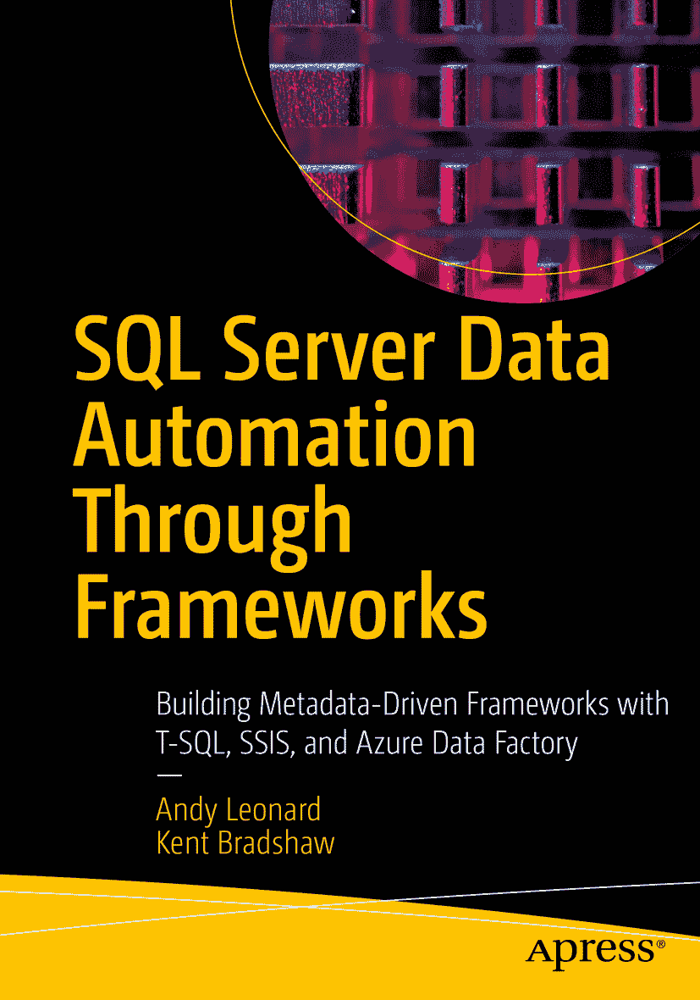

ISBN 978-1-4842-6212-2 电子书 ISBN 978-1-4842-6213-9 [`doi.org/10.1007/978-1-4842-6213-9`](https://doi.org/10.1007/978-1-4842-6213-9) © Andy Leonard, Kent Bradshaw 2020。本作品受版权保护。出版者保留所有权利，无论涉及材料的全部或部分，特别是翻译、转载、插图再利用、朗诵、广播、缩微胶片或其他任何物理方式的复制，以及信息存储和检索、电子改编、计算机软件，或任何目前已知或未来开发的类似或不同方法的传播。本出版物中使用的通用描述性名称、注册商标、服务标志等，即使未作特别声明，也不意味着这些名称可免于相关保护法律法规的约束而可自由使用。出版者、作者和编辑可以安全地假设本书中的建议和信息在出版时是真实准确的。出版者、作者或编辑均不以明示或暗示的方式对本文所含材料或可能出现的任何错误或遗漏提供任何保证。出版者对出版地图中的管辖权主张及机构隶属关系保持中立。本书在全球范围内由 Springer Science+Business Media New York 发行，地址：233 Spring Street, 6th Floor, New York, NY 10013。电话 1-800-SPRINGER，传真 (201) 348-4505，电子邮件 orders-ny@springer-sbm.com，或访问 www.springeronline.com。Apress Media, LLC 是加利福尼亚州的有限责任公司，其唯一成员（所有者）是 Springer Science + Business Media Finance Inc (SSBM Finance Inc)。SSBM Finance Inc 是特拉华州的一家公司。

*献给 Christy*

*—Andy*

*献给 Ann*

*—Kent*

