# 第二部分 SSIS 框架

```
ProcessLogID      ProcessLogMessage                                                                                   CreateDate
54                过程 FWDemo.ProcessOrchestratorMD – 已完成              2018-09-17 20:58:00
53                过程 FWDemo.MonthlyProcessControllerMD – 已完成    2018-09-17 20:58:00
52                过程 FWDemo.MonthlyProcess2 – 已完成                 2018-09-17 20:58:00
51                过程 FWDemo.MonthlyProcess2 – 正在启动                             2018-09-17 20:57:00
50                正在执行 FWDemo.MonthlyProcess2 ApplicatonID = 2                        2018-09-17 20:57:00
ApplicatonProcessProcedureID = 4
49                过程 FWDemo.MonthlyProcess1 – 已完成                  2018-09-17 20:57:00
48                过程 FWDemo.MonthlyProcess1 – 正在启动                             2018-09-17 20:56:00
47                正在执行 FWDemo.MonthlyProcess1 ApplicatonID = 2                        2018-09-17 20:56:00
ApplicatonProcessProcedureID = 3
46                过程 FWDemo.MonthlyProcessControllerMD – 正在启动        2018-09-17 20:56:00
45                过程 FWDemo.DailyProcessControllerMD – 已完成         2018-09-17 20:56:00
44                过程 FWDemo.DailyProcess2 – 已完成                              2018-09-17 20:56:00
43                过程 FWDemo.DailyProcess2 – 正在启动                                  2018-09-17 20:56:00
42                正在执行 FWDemo.DailyProcess2 ApplicatonID = 1                             2018-09-17 20:55:00
ApplicatonProcessProcedureID = 2
41                过程 FWDemo.DailyProcessControllerMD – 正在启动              2018-09-17 20:55:00
40                过程 FWDemo.ProcessOrchestratorMD – 正在启动                  2018-09-17 20:55:00
列表 4-12
重启后的处理日志
```

在另一个例子中，假设错误发生在 `FWDemo.MonthlyProcess1` 存储过程中。如列表 4-14 所示的处理日志表明，在每日过程控制器中，两个每日过程存储过程都已成功完成。

```
ProcessLogID      ProcessLogMessage                                                                                  CreateDate
79                过程 FWDemo.ProcessOrchestratorMD – 错误                         2018-09-18 19:35:00
78                过程 FWDemo.MonthlyProcessControllerMD – 错误               2018-09-18 19:35:00
77                过程 FWDemo.MonthlyProcess1 – 遇到问题              2018-09-18 19:35:00
76                过程 FWDemo.MonthlyProcess1 – 正在启动                             2018-09-18 19:34:00
75                正在执行 FWDemo.MonthlyProcess1 ApplicatonID = 2                        2018-09-18 19:34:00
ApplicatonProcessProcedureID = 3
74                过程 FWDemo.MonthlyProcessControllerMD – 正在启动        2018-09-18 19:34:00
73                过程 FWDemo.DailyProcessControllerMD – 已完成         2018-09-18 19:34:00
72                过程 FWDemo.DailyProcess2 – 已完成                              2018-09-18 19:34:00
71                过程 FWDemo.DailyProcess2 – 正在启动                                  2018-09-18 19:33:00
70                正在执行 FWDemo.DailyProcess2 ApplicatonID = 1                             2018-09-18 19:33:00
ApplicatonProcessProcedureID = 2
69                过程 FWDemo.DailyProcess1 – 已完成                              2018-09-18 19:33:00
68                过程 FWDemo.DailyProcess1 – 正在启动                                  2018-09-18 19:32:00
67                正在执行 FWDemo.DailyProcess1 ApplicatonID = 1                             2018-09-18 19:32:00
ApplicatonProcessProcedureID = 1
66                过程 FWDemo.DailyProcessControllerMD – 正在启动              2018-09-18 19:32:00
65                过程 FWDemo.ProcessOrchestratorMD – 正在启动                   2018-09-18 19:32:00
列表 4-14
处理日志的输出
```

我们在消息中看到，它们的 `ApplicationProcessProcedureID` 值分别为 1 和 2。可以使用列表 4-15 中的代码来管理重启和后续的过程重置。

```sql
--禁用存储过程以进行重启执行
UPDATE FWDemo.ApplicationProcessProcedure
SET Active = 0
WHERE ApplicationProcessProcedureID in (1, 2)   -– 或来自处理日志的值
列表 4-15
管理 FWDemo.MonthlyProcess1 的错误重启
```

列表 4-16 显示了重启后应用程序执行的日志条目。

```
ProcessLogID      ProcessLogMessage                                                                                  CreateDate
91                过程 FWDemo.ProcessOrchestratorMD – 已完成              2018-09-18 19:47:00
90                过程 FWDemo.MonthlyProcessControllerMD – 已完成    2018-09-18 19:47:00
89                过程 FWDemo.MonthlyProcess2 – 已完成                         2018-09-18 19:47:00
88                过程 FWDemo.MonthlyProcess2 – 正在启动                             2018-09-18 19:46:00
87                正在执行 FWDemo.MonthlyProcess2 ApplicatonID = 2                        2018-09-18 19:46:00
ApplicatonProcessProcedureID = 4
86                过程 FWDemo.MonthlyProcess1 – 已完成                  2018-09-18 19:46:00
85                过程 FWDemo.MonthlyProcess1 – 正在启动                             2018-09-18 19:45:00
84                正在执行 FWDemo.MonthlyProcess1 ApplicatonID = 2                        2018-09-18 19:45:00
ApplicatonProcessProcedureID = 3
83                过程 FWDemo.MonthlyProcessControllerMD – 正在启动        2018-09-18 19:45:00
82                过程 FWDemo.DailyProcessControllerMD – 已完成         2018-09-18 19:45:00
81                过程 FWDemo.DailyProcessControllerMD – 正在启动             2018-09-18 19:45:00
80                过程 FWDemo.ProcessOrchestratorMD – 正在启动                  2018-09-18 19:45:00
列表 4-16
重启后的处理日志
```

完成后，使用列表 4-17 中的代码将应用程序的元数据重置回其原始设置。

```sql
UPDATE FWDemo.ApplicationProcessProcedure
SET Active = 1
WHERE ApplicationProcessProcedureID in (1, 2)   -– 或来自处理日志的值
列表 4-17
启用存储过程以供下次执行
```

诚然，元数据的初始设置和新存储过程的部署确实使过程的开发和实施变得更加复杂。希望这些元数据示例已经证明，在执行期间的管理，尤其是在错误解决情况下，已经变得简单得多。请记住，设置和部署可能只发生一次。只要过程仍是生产活动的一部分，执行管理就会持续存在并反复发生。那么，您希望在哪里使其变得更简单呢？

这是我们系统中最简单的元数据用法，可能仅仅是一个开始。对于更高级的版本，我们可以在现有基础上构建一个元数据层，并让编排器使用元数据来执行控制器。但我们将在此停止，因为核心理念已经确立。


## 5. 一个简单、自定义、基于文件的 SSIS 框架

如果你调研使用 SSIS 进行数据集成/工程的企业，你会发现大多数企业并不使用 SSIS 目录。大多数企业从文件系统执行 SSIS。为什么？拥有少量 SSIS 包的企业数量远多于拥有大量 SSIS 包的企业。执行几十个 SSIS 包与管理成千上万个 SSIS 包的执行是不同的——确实非常不同。别只听我说；去问问管理大型企业的任何数据工程师。

在 SSIS 2012 和 SSIS 目录发布之前，SSIS 开发人员必须构建自己的 SSIS 框架。在本章中，我将分享一种构建自定义的基于文件的 SSIS 框架的方法。

拥有 45 年软件开发经验的好处相对较少。其中一个好处是经历了几个架构模式的周期，看着它们从流行到衰落。旧模式涂上一层新的虚拟漆，又变成了新的。（这让我想起我的大女儿们在 20 世纪 90 年代问我，是否听过一支名为空中铁匠的超棒新乐队。）在后续章节中，当我们部署一个与 Azure Data Factory 的 Azure-SSIS 集成运行时极其相似的 SSIS 框架时，我们将看到一个例子。

### SSIS 框架的定义与设计

我们根据以下几个原则来构建 SSIS 框架：

1.  功能性
2.  共情
3.  简洁性

#### 功能性

在我看来，一个 SSIS 框架必须完成执行、日志记录和配置。SSIS 包的执行包括 *分组* 执行。执行分组是指按指定顺序执行一组 SSIS 包的能力。日志记录的目标是呈现足够关于 SSIS 包执行的操作信息，以使有经验的操作员或开发人员能够排查任何执行错误。配置通过允许开发人员和操作员在运行时配置 SSIS 包的属性、参数和变量，来促进代码重用并支持 SSIS 设计模式。

#### 共情

“安迪，你说的‘共情’是什么意思？” 很高兴你问了。软件开发中的共情体现在用户体验或 UX 设计考量上。在 SSIS 设计和开发中，共情表现为考虑用户的技能水平。在这种情况下，用户包括 SSIS 开发人员和操作员。SSIS 框架应遵循 KISS（“保持简单，傻瓜”）原则。我假设 SSIS 开发人员或 SSIS 开发团队会熟悉 SSIS，因此我 *用* SSIS 来构建 SSIS 框架。我希望开发人员或团队能够管理和维护他们自己的框架。

#### 简洁性

> 软件应该像为了达成目标所必需的那样复杂，而不应比必要更复杂。
>
> —安迪·伦纳德，约 2007 年

管理复杂性对软件开发人员来说是困难的。最终，管理复杂性是在功能性、可扩展性和可维护性之间的一种平衡行为。SSIS 框架由于其本质，需要一定量的复杂性来运作。通过“扩展点”支持扩展总是会失败，因为框架作者无法预见每个企业的每一个用例。设计任何软件——包括 SSIS 框架——都应包含对维护的思考。可维护性有助于在最大功能性和最小复杂性之间取得平衡。

总的来说，功能性、共情和简洁性是相对直接的概念，易于理解但难以实现。

### 构建基于文件的 SSIS 框架

在本书的这一部分，在接下来的几章中，我们将构建一个 SSIS 框架的组件，该框架将执行存储在文件系统中的 SSIS 包。SSIS 框架的组件包括：

*   一个用于存储执行和配置元数据、日志以及业务逻辑的数据库
*   一个用 SSIS 构建的执行管理引擎

在本章中，我们重点讨论：

*   构建元数据库
*   构建一个测试用的 SSIS 项目
*   向元数据库添加元数据

#### 获取代码

要获取本书的代码，请访问 Apress 网站上本书的目录页面（[`www.apress.com`](http://www.apress.com)）或连接到 GitHub 仓库：

```
github.com/aleonard763/FrameworksBook
```

将代码保存到一个你可以轻松访问的位置。

#### 元数据驱动的执行管理

元数据驱动的执行管理并不是一个复杂的主题，尽管乍看之下可能显得复杂。接下来的例子将构建一个名为 `SSISConfig` 的数据库以及如图 5-1 所示的执行元数据表。

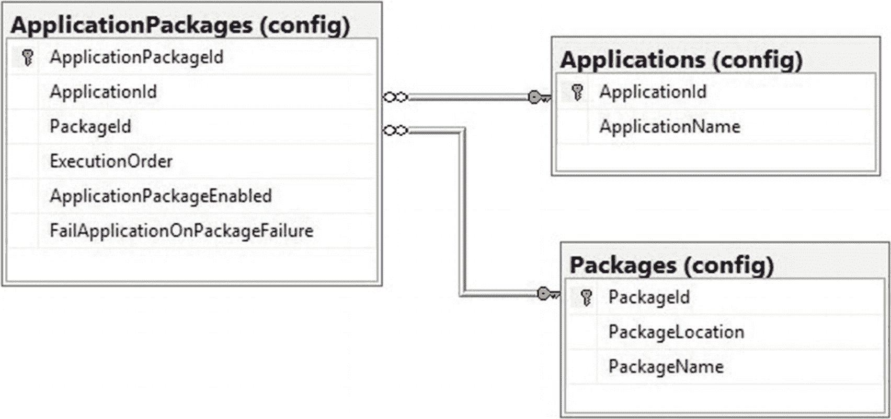

图 5-1：用于执行管理的元数据表

#### `SSISConfig` 数据库

`SSISConfig` 数据库设计用于包含框架的元数据。

使用清单 5-1 所示的 T-SQL 创建 `SSISConfig` 数据库。

```sql
Use [master]
go
print 'SSISConfig database'
If Not Exists(Select [databases].[name]
From [sys].[databases]
Where [databases].[name] = N'SSISConfig')
begin
print ' - Create SSISConfig database'
Create Database SSISConfig
print ' - SSISConfig database created'
end
Else
begin
print ' - SSISConfig database already exists.'
end
print ''
go
Listing 5-1: Creating the SSISConfig database
```

SQL Server Management Studio (`SSMS`) 的 `对象资源管理器` 应该与图 5-2 相似。

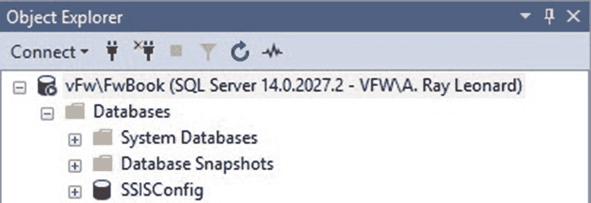

图 5-2：`SSISConfig` 数据库已创建

#### `config` 架构

在软件开发最佳实践列表的顶部是“关注点分离”。分离关注点的一种方式是解耦。有人认为数据库开发不是软件开发。另一些人则认为，一些软件开发最佳实践可以——或许*应该*——用于数据库开发。我属于这第二类人。

使用清单 5-2 所示的 T-SQL 向 `SSISConfig` 数据库添加第一个架构——`config`。

```sql
use [SSISConfig]
go
print 'Config schema'
If Not Exists(Select [schemas].[name]
From [sys].[schemas]
Where [schemas].[name] = N'config')
begin
print ' - Create config schema'
declare @sql nvarchar(100) = N'Create Schema config'
exec(@sql)
print ' - Config schema created'
end
Else
begin
print ' - Config schema already exists.'
end
print ''
go
Listing 5-2: Creating the config schema
```

`config` 架构创建后，可以在 `SSMS` 的 `对象资源管理器` 中查看。导航到 `SSISConfig` ➤ `安全性` ➤ `架构` 节点，如图 5-3 所示。

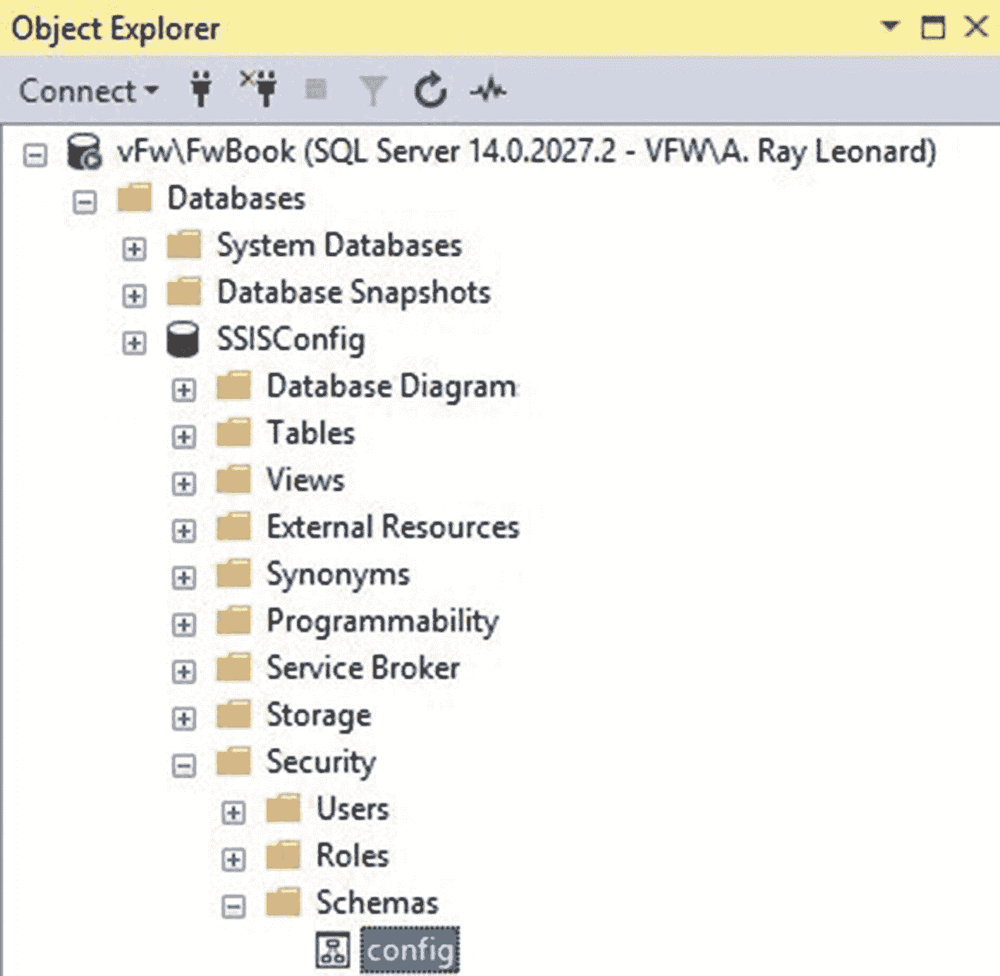

图 5-3：查看 `config` 架构


#### Config.Applications 表

在此框架中，一个 `SSIS application`（SSIS 应用程序）被定义为“配置为按预定顺序执行的 SSIS 包的集合”。每个应用程序由一个 `ApplicationId`（非空 `int`）来标识。

每个应用程序都有一个 `name` 属性，并且 `ApplicationName` 必须是唯一的。通过 `ApplicationId` 来标识应用程序对于参照完整性至关重要。观察 `config` 架构中表的 T-SQL —— 特别是 `config.ApplicationPackages` 表 —— 您会注意到其设计符合第三范式。

执行清单 5-3 中的 T-SQL，将 `Applications` 表添加到 `SSISConfig` 数据库的 `config` 架构中。

```sql
use [SSISConfig]
go
print 'Config.Applications table'
If Not Exists(Select [schemas].[name] + '.' + [tables].[name] As ➤ [Schema.Table]
From [sys].[tables]
Join [sys].[schemas]
On [schemas].[schema_id] = [tables].[schema_id]
Where [schemas].[name] = N'config'
And [tables].[name] = N'Applications')
begin
print ' - Create config.Applications table'
Create Table [config].[Applications]
(
ApplicationId int identity(1, 1)
Constraint PK_config_Applications Primary Key Clustered
, ApplicationName nvarchar(255) Not NULL
Constraint UQ_config_Applications_ApplicationName
Unique
)
print ' - Config.Applications table created'
end
Else
begin
print ' - Config.Applications table already exists.'
end
print ''
go
Listing 5-3
添加 config.Applications
```

执行后，`config.Applications` 表将出现在对象资源管理器中，如图 5-4 所示。

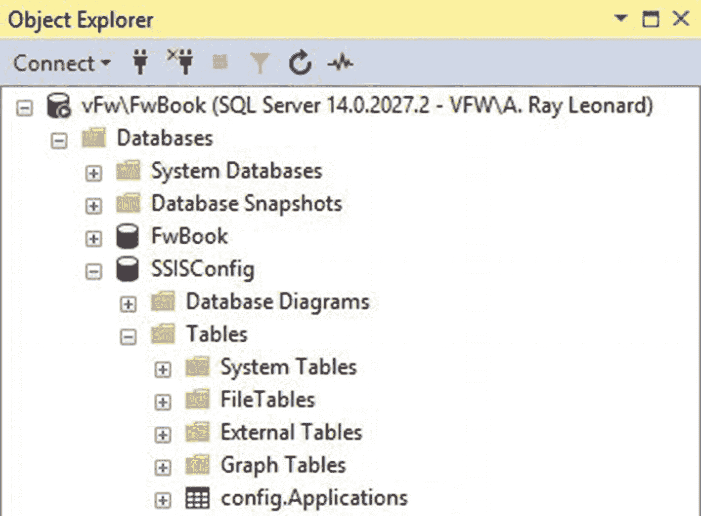

图 5-4
Config.Applications 表

#### Config.Packages 表

包位置元数据存储在 `config.Packages` 表中。当我们构建此 SSIS 框架的其他版本时，将会看到这是会变化的表。这些变化基于 SSIS 包在企业中的存放位置。

执行清单 5-4 所示的 T-SQL 来创建 `config.Packages` 表。

```sql
use [SSISConfig]
go
print 'Config.Packages table'
If Not Exists(Select [schemas].[name] + '.' + [tables].[name] As ➤ [Schema.Table]
From [sys].[tables]
Join [sys].[schemas]
On [schemas].[schema_id] = [tables].[schema_id]
Where [schemas].[name] = N'config'
And [tables].[name] = N'Packages')
begin
print ' - Create config.Packages table'
Create Table [config].[Packages]
(
PackageId int identity(1, 1)
Constraint PK_config_Packages Primary Key Clustered
, PackageLocation nvarchar(255) Not NULL
, PackageName nvarchar(255) Not NULL
, Constraint UQ_config_Packages_PackageName
Unique(PackageLocation, PackageName)
)
print ' - Config.Packages table created'
end
Else
begin
print ' - Config.Packages table already exists.'
end
print ''
go
Listing 5-4
创建 config.Packages 表
```

创建后，`config.Packages` 表将出现在对象资源管理器中，如图 5-5 所示。

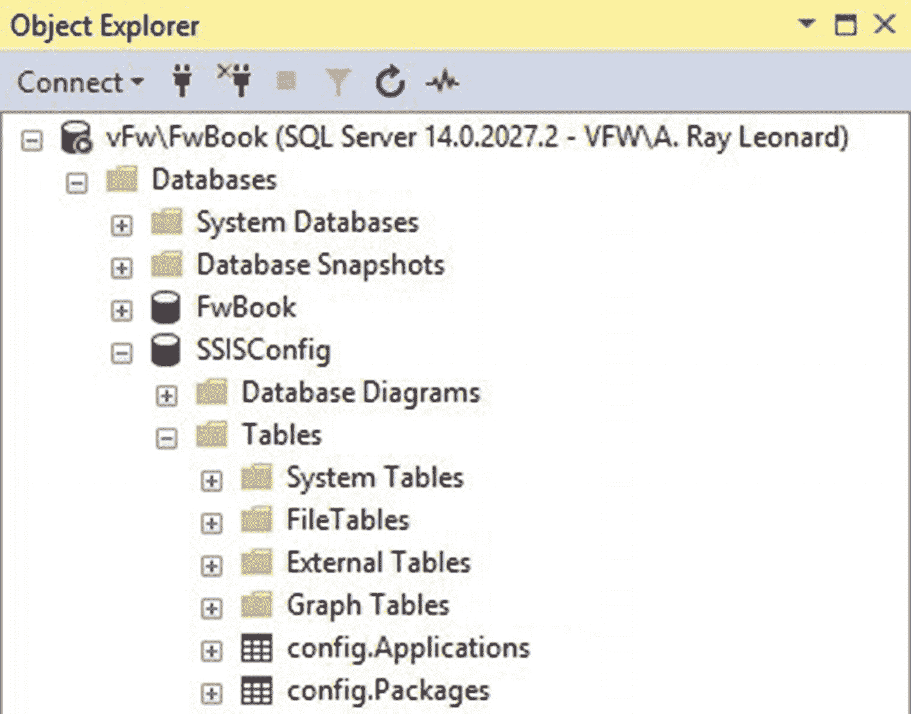

图 5-5
创建 config.Packages 表

如前所述，框架中的一个 `SSIS application` 是配置为按特定顺序执行的包的集合。考虑到应用程序与包之间的基数关系，显然答案是至少部分为一对多。

考虑实用工具 SSIS 包，例如在文件中的数据成功加载或暂存到数据库后存档平面文件的包。这样的包——可能命名为 `ArchiveFile.dtsx`——可以通过诸如 `SourceFilePath` 和 `DestinationLocation` 之类的参数进行参数化。然后，`ArchiveFile.dtsx` 可以在多个 SSIS 应用程序中重用。

这些应用程序与 `ArchiveFile.dtsx` 包之间的基数是多对一。将一对多和多对一的基数关系结合起来，就得到了多对多。在第三范式设计中解决多对多关系需要一个额外的表：本例中就是 `config.ApplicationPackages`。使用清单 5-5 所示的 T-SQL 创建 `config.ApplicationPackages`。

```sql
use [SSISConfig]
go
print 'Config.ApplicationPackages table'
If Not Exists(Select [schemas].[name] + '.' + [tables].[name] As ➤ [Schema.Table]
From [sys].[tables]
Join [sys].[schemas]
On [schemas].[schema_id] = [tables].[schema_id]
Where [schemas].[name] = N'config'
And [tables].[name] = N'ApplicationPackages')
begin
print ' - Create config.ApplicationPackages table'
Create Table [config].[ApplicationPackages]
(
ApplicationPackageId int identity(1, 1)
Constraint PK_config_ApplicationPackages Primary Key Clustered
, ApplicationId int Not NULL
Constraint FK_config_ApplicationPackages_config_Applications
Foreign Key References [config].Applications
, PackageId int Not NULL
Constraint FK_config_ApplicationPackages_config_Packages
Foreign Key References [config].Packages
, ExecutionOrder int Not NULL
Constraint DF_config_ApplicationPackages_ExecutionOrder
Default(10)
, ApplicationPackageEnabled bit Not NULL
Constraint DF_config_ApplicationPackages_ApplicationPackageEnabled
Default(1)
, FailApplicationOnPackageFailure bit Not NULL
Constraint ➤ DF_config_ApplicationPackages_FailApplicationOnPackageFailure
Default(1)
, Constraint ➤ UQ_config_ApplicationPackages_ApplicationId_PackageId_ExecutionOrder
Unique(ApplicationId, PackageId, ExecutionOrder)
)
print ' - Config.ApplicationPackages table created'
end
Else
begin
print ' - Config.ApplicationPackages table already exists.'
end
print ''
go
Listing 5-5
创建 config.ApplicationPackages 表
```

当 `config.ApplicationPackages` 表创建后，对象资源管理器中的 `SSISConfig` 表如图 5-6 所示。

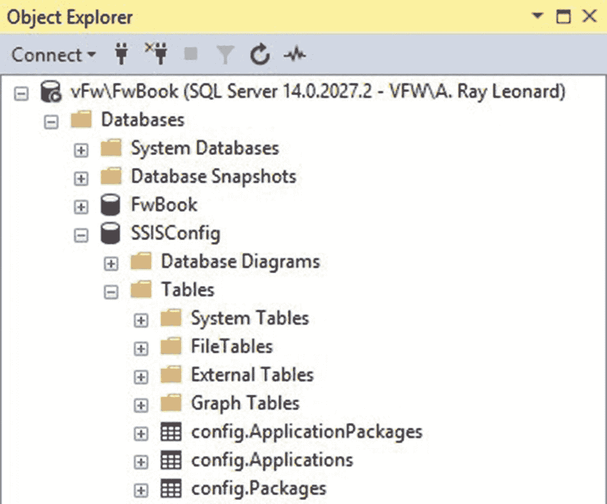

图 5-6
config.ApplicationPackages 表

通过展开“列”、“键”和“约束”虚拟文件夹，在对象资源管理器中检查 `config.ApplicationPackages` 表，如图 5-7 所示。

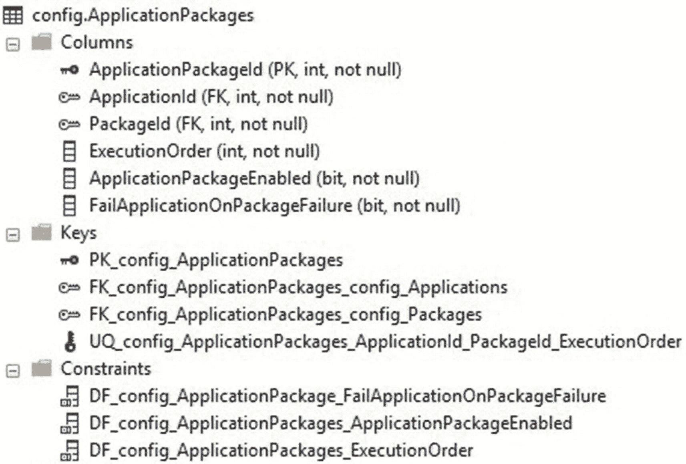

图 5-7
检查 config.ApplicationPackages 表

`config.ApplicationPackages` 表的列被设计用于解决 `config.Applications` 表和 `config.Packages` 表之间的多对多基数关系。每个条目通过一个标识列 `ApplicationPackageId`，将 SSIS 包元数据（通过 `PackageId`）映射到 SSIS 应用程序元数据（通过 `ApplicationId`），从而 `解决`（或 `桥接`）了多对多关系。解决后，此 `SSISConfig` 数据库设计支持 `Application Packages`（应用程序包）的执行，`Application Packages` 被定义为映射到 SSIS 应用程序的 SSIS 包的实例。因此，根据设计，`Application Packages` 是此 SSIS 框架中最小的工作单元。


##### 执行属性

应用程序包作为最小的工作单元，其一个引申含义是：应用程序包正是我们定义`执行属性`的地方。在此框架中，应用程序包的执行属性包括：

*   `ExecutionOrder`
*   `ApplicationPackageEnabled`
*   `FailApplicationOnPackageFailure`

`ExecutionOrder` 是一个整数，代表了 SSIS 应用程序定义中“按指定顺序”执行的部分。

`ApplicationPackageEnabled` 是一个位字段，用于指示当执行 SSIS 应用程序时，单个应用程序包是否被配置为执行。

`FailApplicationOnPackageFailure` 是一个位，用于配置容错性。设想一下执行一个 SSIS 应用程序时会发生什么：多个 SSIS 包会按指定顺序执行。在 SSIS 应用程序中具有指定执行顺序的 SSIS 包就是应用程序包。如果我们非常希望一个 SSIS 包能执行、完成并成功，但如果该包因某种原因失败，对于本次特定的 SSIS 应用程序执行来说并非至关重要，那该怎么办？如果我们只是不太在意这个特定的包是否失败呢？`FailApplicationOnPackageFailure` 属性将允许该包失败`而不会`终止整个 SSIS 应用程序的执行。

##### 默认约束

默认约束管理向表中添加新记录时，如果字段未提供显式值，则列的初始值：

*   `DF_config_ApplicationPackages_FailApplicationOnPackageFailure` 是一个默认约束，当首次向 `config.ApplicationPackages` 表添加记录时未提供值，则将 `FailApplicationOnPackageFailure` 位的值设置为 True (1)。
*   `DF_config_ApplicationPackages_ApplicationPackageEnabled` 是一个默认约束，当首次向 `config.ApplicationPackages` 表添加记录时未提供值，则将 `ApplicationPackageEnabled` 位的值设置为 True (1)。
*   `DF_config_ApplicationPackages_ExecutionOrder` 是一个默认约束，当首次向 `config.ApplicationPackages` 表添加记录时未提供值，则将 `ExecutionOrder` 整数值设置为 10。

##### 关系

键管理着 SSISConfig 数据库中实体之间的关系，也因此管理着 SSIS 框架中的关系：

*   `config.ApplicationPackages` 表配置了 `PK_config_ApplicationPackages`。每个表都有一个主键用于关系管理。在此框架中，`PK_config_ApplicationPackages` 有助于标识每个“应用程序-包-执行顺序”的组合。
*   `FK_config_ApplicationPackages_config_Applications` 是 `config.ApplicationPackages.ApplicationId` 字段与 `config.Applications.ApplicationId` 字段之间的外键。在向 `config.ApplicationPackages` 添加行之前，`config.Applications` 表中`必须`已存在对应的行。应用程序映射到在此`位置`（由 `ExecutionOrder` 的值表示）执行的包。
*   `FK_config_ApplicationPackages_config_Packages` 是 `config.ApplicationPackages.PackageId` 字段与 `config.Packages.PackageId` 字段之间的外键。在向 `config.ApplicationPackages` 添加行之前，`config.Packages` 表中`必须`已存在对应的行。一个在某个`位置`（由 `ExecutionOrder` 的值表示）执行的包被映射到一个应用程序中。
*   `UQ_config_ApplicationPackages_ApplicationId_PackageId_ExecutionOrder` 是一个唯一约束，它保证了存储在 `config.ApplicationPackages` 表中的每个应用程序包在 `ApplicationId`、`PackageId` 和 `ExecutionOrder` 字段组合上的唯一性。这意味着 `config.ApplicationPackages` 表中的两个（或多个）记录`可能不具有相同的` `ApplicationId`、`PackageId` 和 `ExecutionOrder` 字段值。

##### 常见问题

框架对许多数据用户来说是新事物，我们经常听到以下几个问题：

*   `config.ApplicationPackages` 表中两个（或多个）记录是否可能具有相同的 `ApplicationId`？ 是的。实际上，框架就是为此用例设计的。多个具有相同 `ApplicationId` 值的 `config.ApplicationPackages` 记录正是框架用来配置一个 SSIS 应用程序的方式。
*   `config.ApplicationPackages` 表中两个（或多个）记录是否可能具有相同的 `PackageId`？ 是的。这支持代码重用，例如在多个应用程序中执行 `ArchiveFile.dtsx` SSIS 包。这也支持一种称为“基于范围的加载”的 SSIS 设计模式。在基于范围的加载中，*相同的* SSIS 包会执行多次。每次执行时，新的最小和最大范围值，或其他数学函数，会被传递给该包。例如，同一个 SSIS 包可能执行十次。第一次执行可能加载数值以“0”开头的记录。后续执行可能加载数值以“1”、“2”等开头的数据。

我们稍后会回到 SSMS 和 SSISConfig 数据库的开发。接下来，让我们先构建一个示例 SSIS 解决方案来测试该框架。

### 一个示例 SSIS 解决方案

测试是困难的。测试需要我们以不同的方式思考用户将如何与应用程序交互。开发人员以不擅长测试自己的代码而闻名。为什么？我相信这是因为开发侧重于交付能正常工作的功能。对于有些人（比如我）来说，要转换思维，开始考虑用户在与我们代码交互时可能输入——或者*忘记*输入——的所有排列组合是很困难的。

构建用于测试的示例 SSIS 解决方案时，第一个想法可能是：“我可以用一个 SSIS 包来完成。”这是不正确的。测试至少需要两个 SSIS 包，一个包用于成功场景，另一个用于失败场景。

#### 配置 Visual Studio 2019 进行 SSIS 开发

在构建 SSIS 2019 示例解决方案之前，您需要下载并安装 Visual Studio 2019。首先，浏览到 `visualstudio.microsoft.com` 并选择要安装的 `Visual Studio 2019` 版本，如图 5-8 所示。

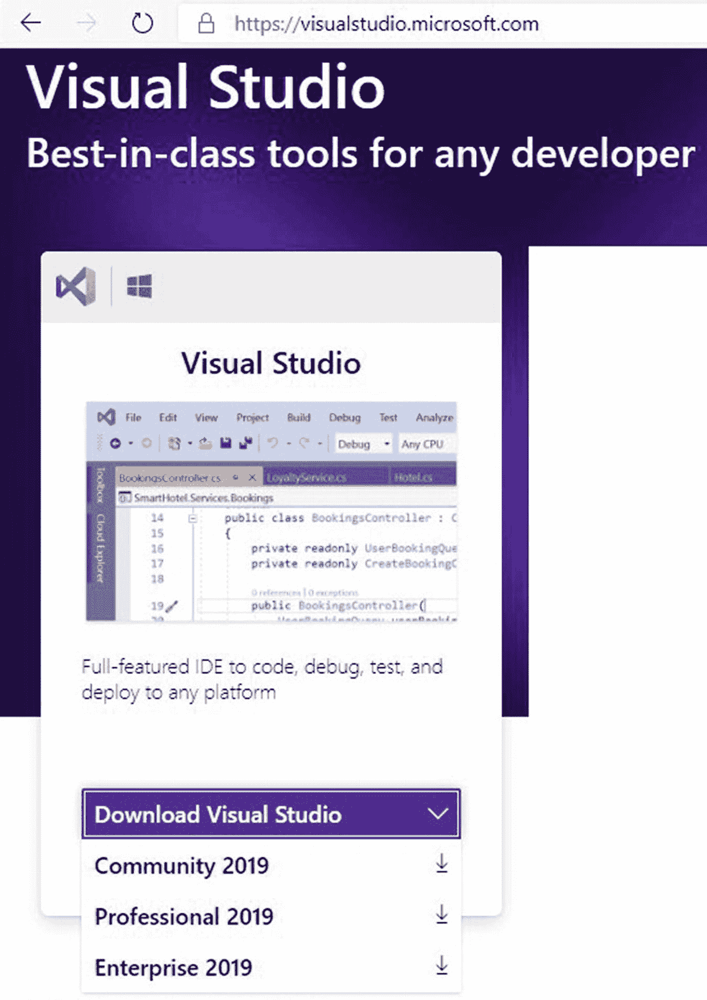
图 5-8 准备下载 Visual Studio 2019

出于本书示例的目的，`Community 2019` 版本已经足够（而且它是免费的）。

下一步是安装 `Integration Services` 扩展。`Visual Studio` 是一个*集成开发环境*，或称 `IDE`。该 `IDE` 作为一个宿主或外壳，承载着各种各样的模板，使得在不同语言和平台上进行软件开发成为可能。

在 `Visual Studio 2019` 之前，`SSIS` 模板是通过执行一个 `SQL Server Data Tools`（即 `SSDT`）独立安装程序来安装的。从 `Visual Studio 2019` 开始，`SSIS` 模板在 `Visual Studio Marketplace` 中作为另一个可用的 `Visual Studio` 扩展进行管理。

要在 `Visual Studio 2019` 中找到并安装 `Integration Services` 扩展，请打开 `Visual Studio` 并单击 `扩展` ➤ `管理扩展`，如图 5-9 所示。

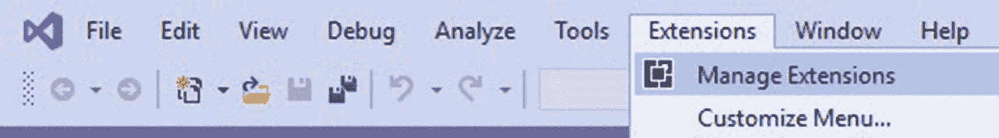
图 5-9 准备安装 Integration Services 扩展

当 `管理扩展` 对话框显示时，在搜索框中搜索“`Integration Services`”。选择“`SQL Server Integration Services Projects`”扩展，然后单击 `下载` 按钮，如图 5-10 所示。

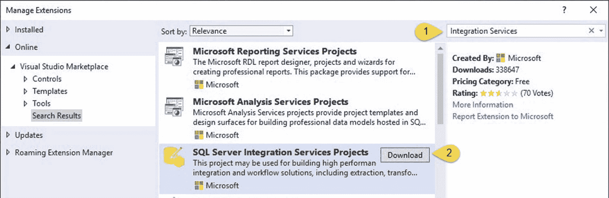
图 5-10 下载“SQL Server Integration Services Projects”扩展

当新扩展下载完成后，按照 `Visual Studio 2019` 扩展安装程序提供的说明进行操作。扩展安装过程可能会首先关闭 `Visual Studio IDE`。当扩展安装完成后，就可以使用 `Visual Studio 2019` 来开发 `SSIS` 项目了。

#### 创建示例 SSIS 解决方案

首先，创建一个新的名为 `TestSSISSolution` 的 `SSIS` 解决方案——其中包含一个名为 `TestSSISProject` 的新 `SSIS` 项目——如图 5-11 所示。

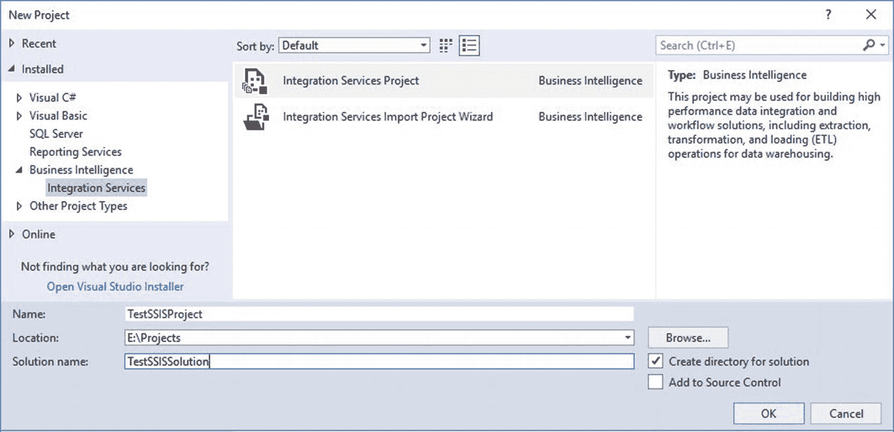
图 5-11 在 TestSSISSolution 中创建 TestSSISProject

当项目打开后，将默认的 `SSIS` 包重命名为“`ReportAndSucceed.dtsx`”，如图 5-12 所示。

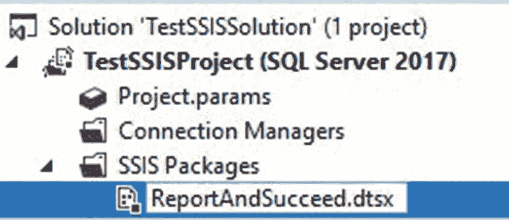
图 5-12 将包重命名为“ReportAndSucceed.dtsx”

通过从 `SSIS 工具箱` 中将一个 `脚本任务` 拖到控制流画布上，将其添加到 `ReportAndSucceed` 的控制流中，然后将其重命名为“`SCR Log Values`”，如图 5-13 所示。

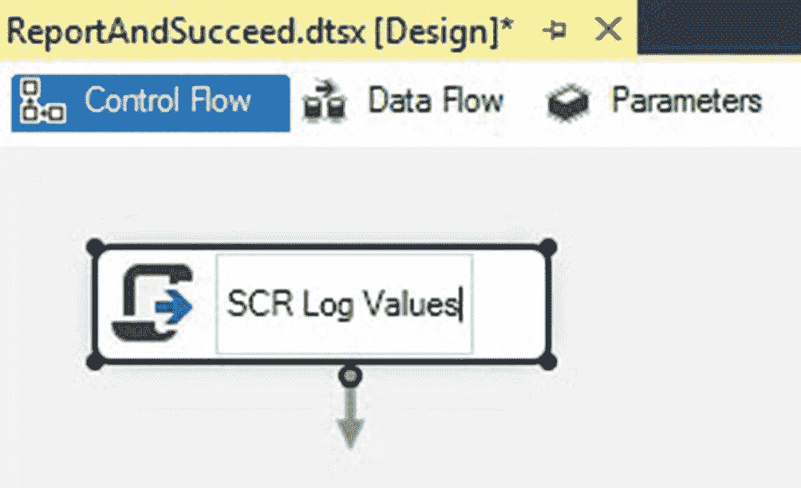
图 5-13 添加并重命名“SCR Log Values”脚本任务

右键单击“`SCR Log Values`”脚本任务并单击“`编辑`”以打开 `脚本任务编辑器`。当“`SCR Log Values`”脚本任务编辑器显示时，将以下变量添加到 `ReadOnlyVariables` 属性列表中：
*   `System::PackageName`
*   `System::TaskName`

`脚本任务编辑器` 将如图 5-14 所示。

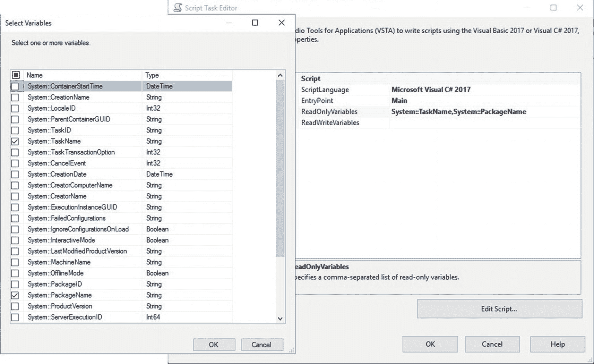
图 5-14 将 System::PackageName 和 System::TaskName 添加到 ReadOnlyVariables

单击 `编辑脚本` 按钮，并将清单 5-6 中所示的 `C#` 代码输入到 `public void Main()` 方法中。

```
public void Main()
{
    string packageName = Dts.Variables["System::PackageName"].Value.ToString();
    string taskName = Dts.Variables["System::TaskName"].Value.ToString();
    string subComponent = packageName + "." + taskName;
    int informationCode = 1001;
    bool fireAgain = true;
    string description = "I am " + packageName;
    Dts.Events.FireInformation(informationCode, subComponent, description, "", 0, ref fireAgain);
    Dts.TaskResult = (int)ScriptResults.Success;
}
```
清单 5-6 用于在 ReportAndSucceed SSIS 包中配置引发信息事件的 `Main()` 方法 `C#` 代码

代码输入到 `Main()` 方法后，将如图 5-15 所示。

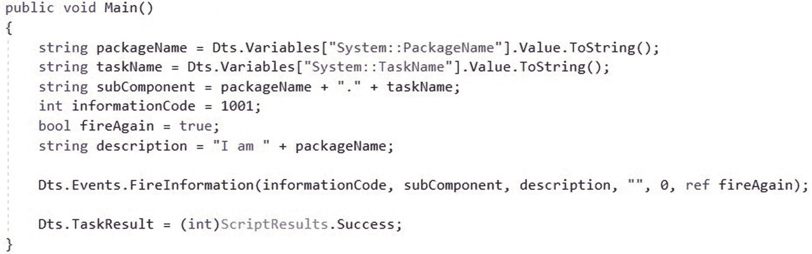
图 5-15 引发信息事件的 Main() 方法 C# 代码

关闭脚本编辑器窗口，并在 `SCR Log Values` 脚本任务上单击 `确定` 按钮。单击 `调试` ➤ `开始调试`，如图 5-16 所示。

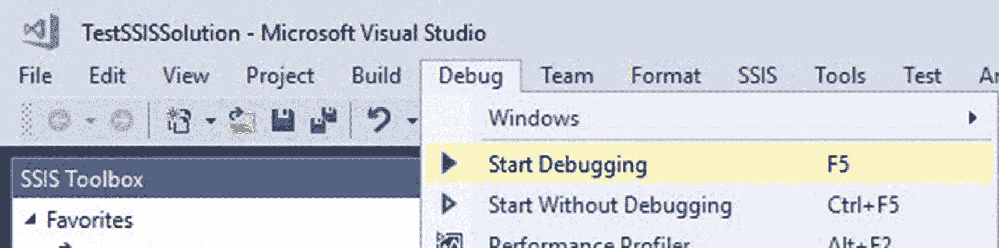
图 5-16 开始调试执行 ReportAndSucceed 包

当执行完成（并且希望成功）后，单击 `进度`（或如果您停止了调试器，则为 `执行结果`）以查看我们在 `SCR Log Values` 脚本任务中配置的 `信息` 事件，如图 5-17 所示。

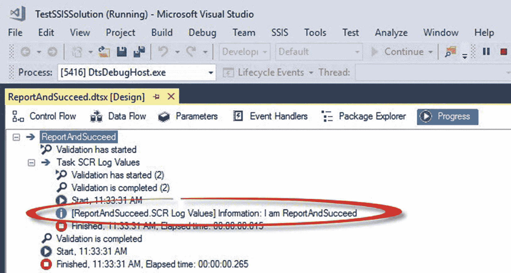
图 5-17 信息事件

`信息` 事件内容为：“`[ReportAndSucceed.SCR Log Values] Information: I am ReportAndSucceed`”。

消息的第一部分是 `subComponent`，并包含在方括号（“`[]`”）中。`subComponent` 由包名称和任务名称变量构建而成：“`ReportAndSucceed.SCR Log Values`”。事件名称——`Information`——紧随 `subComponent` 之后。接下来是描述内容：“`I am ReportAndSucceed`”。


报告并失败——这正是该包执行时发生的情况。

向 `TestSSISProject` SSIS 项目添加另一个 SSIS 包，并将其重命名为 `ReportAndFail`，如图 5-18 所示。

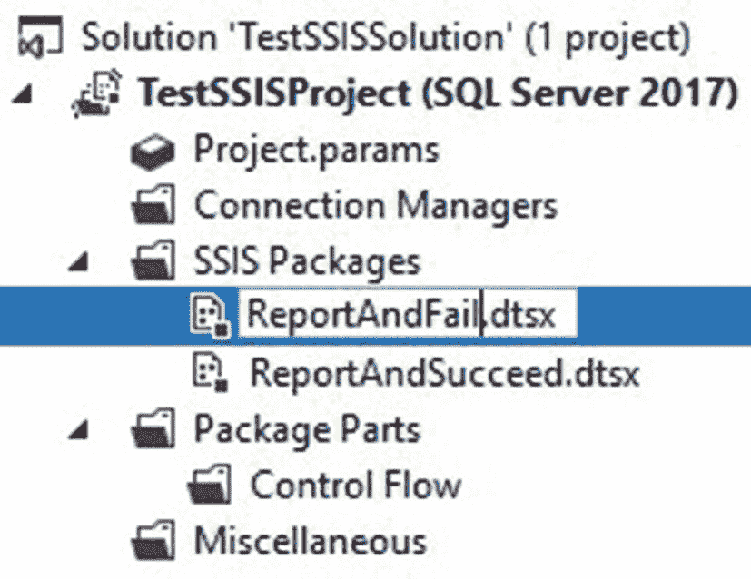
**图 5-18** 添加 `ReportAndFail` SSIS 包

像之前一样，向 `ReportAndFail` 包添加一个名为 `SCR Log Values` 的脚本任务。将 `System::PackageName` 和 `System::TaskName` 变量添加到 `ReadOnlyVariables` 属性中，然后单击 `Edit Script` 按钮。将清单 5-7 中的 C# 代码添加到 `Main()` 方法中。

```csharp
public void Main()
{
    string packageName = Dts.Variables["System::PackageName"].Value.ToString();
    string taskName = Dts.Variables["System::TaskName"].Value.ToString();
    string subComponent = packageName + "." + taskName;
    int errorCode = -1001;
    string description = packageName + " execution failed";
    Dts.Events.FireError(errorCode, subComponent, description, "", 0);
    Dts.TaskResult = (int)ScriptResults.Success;
}
```
**清单 5-7** 用于在 `ReportAndFail` SSIS 包中配置和引发错误事件的 `Main()` 方法 C# 代码

当代码输入到 `Main()` 方法后，它将显示如图 5-19 所示。

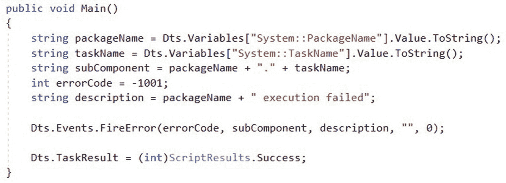
**图 5-19** 引发错误事件的 `Main()` 方法 C# 代码

通过单击 VstaProjects .NET 代码编辑器右上角的 "X" 或单击 `File` > `Exit` 关闭脚本编辑器窗口，然后单击 `SCR Log Values` 脚本任务上的 `OK` 按钮。单击 `Debug` > `Start Debugging` 开始调试执行 `ReportAndFail` SSIS 包。

当执行完成时——希望是*失败*——单击进度（或如果停止了调试器，则单击执行结果）以查看我们在 `SCR Log Values` 脚本任务中配置的*信息*事件，如图 5-20 所示。

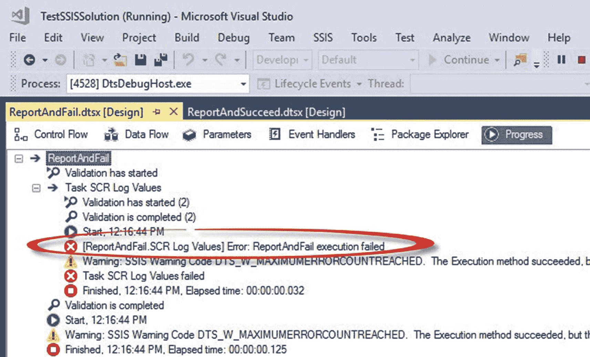
**图 5-20** 错误事件

错误事件显示为："`[ReportAndFail.SCR Log Values] Error: ReportAndFail execution failed`"。

消息的第一部分是 `subComponent`，并用方括号（"[]"）括起来。`subComponent` 由包名和任务名变量构建而成："`ReportAndFail.SCR Log Values`"。事件名——`Error`——跟在 `subComponent` 后面。然后是描述，内容为 "`ReportAndFail execution failed`"。

报告并失败——这正是该包执行时发生的情况。

一个测试项目至少应包含成功*和*失败的组件。

### SSIS 框架元数据管理

在企业架构或任何类型的开发中，解决一个问题常常会带来一个新的问题，或多个问题。我称之为“天下没有免费的午餐”。经历“天下没有免费的午餐”这个阶段是开发人员成长的必经之路，是成熟过程中的自然部分，并且对于技术架构师来说是一项*必要要求*。

例如，本章描述的 SSIS 框架将通过使用元数据来简化按指定顺序执行多个 SSIS 包的过程。将会有很多元数据需要管理。

天下没有免费的午餐。

所有编写 T-SQL 的人都对大小写和缩进有自己的偏好。我也不例外。我发现我的 T-SQL 大小写和缩进有助于我思考试图解决的问题。

问自己或你的团队：“我/我们试图解决的问题是什么？”是非常有力的。试试看。

#### 添加 SSIS 应用程序

通过执行清单 5-8 中所示的 T-SQL，向 SSIS 框架添加一个 SSIS 应用程序。

```sql
use [SSISConfig]
go
Set NoCount ON
declare @ApplicationName nvarchar(255) = N'Framework Test'
print @ApplicationName
declare @ApplicationId int = (Select [Applications].[ApplicationId]
    From [config].[Applications]
    Where [Applications].[ApplicationName] = @ApplicationName)
If (@ApplicationId Is NULL)
begin
    print ' - Adding ' + @ApplicationName + ' application to config.Applications table'
    declare @AppTbl table(ApplicationId int)
    Insert Into [config].[Applications]
        (ApplicationName)
    Output inserted.ApplicationId into @AppTbl
    Values (@ApplicationName)
    Set @ApplicationId = (Select ApplicationId
        From @AppTbl)
    print ' - ' + @ApplicationName + ' application added to config.Applications table'
end
Else
begin
    print ' - ' + @ApplicationName + ' application already exists in the config.Applications table.'
end
Select @ApplicationId As ApplicationId
print ''
```
**清单 5-8** 添加 SSIS 应用程序

清单 5-8 中的 T-SQL 是*幂等的*。幂等是一个数学术语，意味着一个操作可以应用多次并产生相同的结果。幂等是“可重复执行的代码”的另一种说法。

应用于清单 5-8 中的 T-SQL 代码，可重复执行的代码在 `config.Applications` 表中产生相同的结果；名为 "Framework Test" 的新 SSIS 应用程序的元数据被添加到框架中。清单 5-8 中 T-SQL 的首次执行返回以下消息（到 SSMS 的消息选项卡），如清单 5-9 所示。

```
Framework Test
 - Adding Framework Test application to config.Applications table
 - Framework Test application added to config.Applications table
```
**清单 5-9** 首次添加 Framework Test SSIS 应用程序时返回的消息

结果，即 "Framework Test" SSIS 应用程序的 `ApplicationId`，如图 5-21 所示。

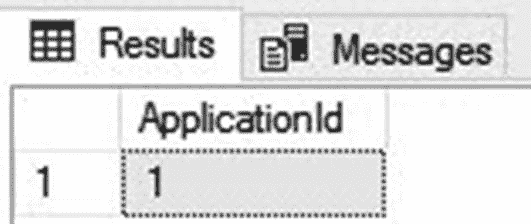
**图 5-21** "Framework Test" 的 `ApplicationId`

重新执行清单 5-8 所示的添加 SSIS 应用程序的 T-SQL，会产生如图 5-22 所示的消息。

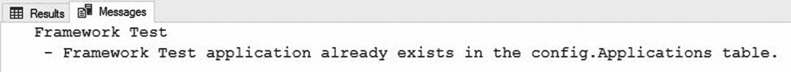
**图 5-22** 重新执行 SSIS 应用程序 T-SQL

重新执行清单 5-8 所示的添加 SSIS 应用程序的 T-SQL，会产生*相同*的结果，如图 5-23 所示。

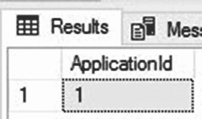
**图 5-23** 相同的 Framework Test `ApplicationId`

后续重新执行添加 SSIS 应用程序的 T-SQL 会产生相同的结果。


#### 添加 SSIS 包

通过执行代码清单 5-10 中所示的 T-SQL 代码，将 `TestSSISProject` 中的 SSIS 包添加到 SSIS 框架中。

```sql
use [SSISConfig]
go
Set NoCount ON
declare @PackageLocation nvarchar(255) = ➤ N'E:\Projects\TestSSISSolution\TestSSISProject\'
declare @PackageName nvarchar(255) = N'ReportAndSucceed.dtsx'
print @PackageLocation + @PackageName
declare @PackageId int = (Select [Packages].[PackageId]
From [config].[Packages]
Where [Packages].[PackageLocation] = ➤ @PackageLocation
And [Packages].[PackageName] = @PackageName)
If (@PackageId Is NULL)
begin
print ' - Adding ' + @PackageName + ' package to config.Packages table'
declare @PkgTbl table(PackageId int)
Insert Into [config].[Packages]
(PackageLocation, PackageName)
Output inserted.PackageId into @PkgTbl
Values (@PackageLocation, @PackageName)
Set @PackageId = (Select PackageId
From @PkgTbl)
print ' - ' + @PackageName + ' package added to config.Packages table'
end
Else
begin
print ' - ' + @PackageName + ' package already exists in the ➤ config.Packages table.'
end
Select @PackageId As PackageId
print ''
set @PackageName = N'ReportAndFail.dtsx'
print @PackageLocation + @PackageName
set @PackageId = (Select [Packages].[PackageId]
From [config].[Packages]
Where [Packages].[PackageLocation] = @PackageLocation
And [Packages].[PackageName] = @PackageName)
If (@PackageId Is NULL)
begin
print ' - Adding ' + @PackageName + ' application to config.Packages table'
Delete @PkgTbl
Insert Into [config].[Packages]
(PackageLocation, PackageName)
Output inserted.PackageId into @PkgTbl
Values (@PackageLocation, @PackageName)
Set @PackageId = (Select PackageId
From @PkgTbl)
print ' - ' + @PackageName + ' package added to config.Packages table'
end
Else
begin
print ' - ' + @PackageName + ' package already exists in the ➤ config.Packages table.'
end
Select @PackageId As PackageId
print ''
Listing 5-10
Adding SSIS packages from TestSSISProject
```

与代码清单 5-8 中的 T-SQL 类似，代码清单 5-10 中的 T-SQL 也是**幂等的**，因此代码清单 5-10 中的 T-SQL 代码在 `config.Packages` 表中产生相同的结果；两个名为“ReportAndSucceed.dtsx”和“ReportAndFail.dtsx”的新 SSIS 包的元数据被添加到框架中。首次执行代码清单 5-10 中的 T-SQL 会返回消息（到 SSMS 的“消息”选项卡），如代码清单 5-11 所示。

```
E:\Projects\TestSSISSolution\TestSSISProject\ReportAndSucceed.dtsx
- Adding ReportAndSucceed.dtsx package to config.Packages table
- ReportAndSucceed.dtsx package added to config.Packages table
E:\Projects\TestSSISSolution\TestSSISProject\ReportAndFail.dtsx
- Adding ReportAndFail.dtsx application to config.Packages table
- ReportAndFail.dtsx package added to config.Packages table
Listing 5-11
Messages returned when adding ReportAndSucceed.dtsx and ReportAndFail.dtsx SSIS packages for the first time
```

结果，即“ReportAndSucceed.dtsx”和“ReportAndFail.dtsx” SSIS 包的 `PackageId`，如图 5-24 所示。

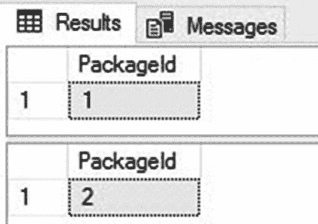
*图 5-24 “ReportAndSucceed.dtsx” 和 “ReportAndFail.dtsx” SSIS 包的 PackageId*

重新执行代码清单 5-10 中所示的添加 SSIS 包的 T-SQL 代码，会产生如图 5-25 所示的消息。

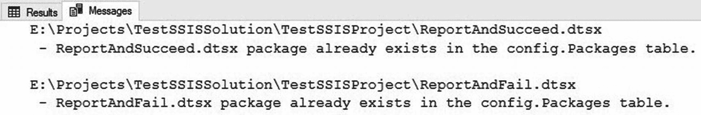
*图 5-25 重新执行 SSIS 包的 T-SQL 代码*

重新执行代码清单 5-10 中所示的添加 SSIS 包的 T-SQL 代码，会产生*相同*的结果，如图 5-26 所示。


*图 5-26 “ReportAndSucceed.dtsx” 和 “ReportAndFail.dtsx” SSIS 包的相同 PackageId*

后续重新执行添加 SSIS 包的 T-SQL 代码会产生相同的结果。

#### 分配 SSIS 应用包

通过执行代码清单 5-12 中所示的 T-SQL 代码，在 SSIS 框架中分配 SSIS 应用包。

```sql
use [SSISConfig]
go
Set NoCount ON
declare @ApplicationName nvarchar(255) = N'Framework Test'
declare @PackageLocation nvarchar(255) = ➤ N'E:\Projects\TestSSISSolution\TestSSISProject\'
declare @PackageName nvarchar(255) = N'ReportAndSucceed.dtsx'
declare @ExecutionOrder int = 10
print @ApplicationName + ' - ' + @PackageLocation + @PackageName
declare @ApplicationId int = (Select [Applications].[ApplicationId]
From [config].[Applications]
Where [Applications].[ApplicationName] = ➤ @ApplicationName)
declare @PackageId int = (Select [Packages].[PackageId]
From [config].[Packages]
Where [Packages].[PackageLocation] = ➤ @PackageLocation
And [Packages].[PackageName] = @PackageName)
declare @ApplicationPackageId int = (Select ApplicationPackageId
From config.ApplicationPackages
Where ApplicationId = @ApplicationId
And PackageId = @PackageId
And ExecutionOrder = @ExecutionOrder)
If (@ApplicationPackageId Is NULL)
begin
print ' - Assigning ' + @PackageName + ' package to '
+ @ApplicationName + ' application'
+ ' in config.ApplicationPackages table'
+ ' at ExecutionOrder ' + Convert(varchar(9), @ExecutionOrder)
Insert Into [config].[ApplicationPackages]
(ApplicationId
, PackageId
, ExecutionOrder)
Values (@ApplicationId
, @PackageId
, @ExecutionOrder)
print ' - ' + @PackageName + ' package assigned to '
+ @ApplicationName + ' application'
+ ' in config.ApplicationPackages table'
+ ' at ExecutionOrder ' + Convert(varchar(9), @ExecutionOrder)
end
Else
begin
print ' - ' + @PackageName + ' package already'
+ ' assigned to ' + @ApplicationName
+ ' application in config.ApplicationPackages table'
+ ' at ExecutionOrder ' + Convert(varchar(9), @ExecutionOrder)
+ '.'
end
print ''
set @PackageName = N'ReportAndFail.dtsx'
set @ExecutionOrder = 20
print @ApplicationName + ' - ' + @PackageLocation + @PackageName
set @ApplicationId = (Select [Applications].[ApplicationId]
From [config].[Applications]
Where [Applications].[ApplicationName] = ➤ @ApplicationName)
set @PackageId = (Select [Packages].[PackageId]
From [config].[Packages]
Where [Packages].[PackageLocation] = @PackageLocation
And [Packages].[PackageName] = @PackageName)
set @ApplicationPackageId = (Select ApplicationPackageId
From config.ApplicationPackages
Where ApplicationId = @ApplicationId
And PackageId = @PackageId
And ExecutionOrder = @ExecutionOrder)
If (@ApplicationPackageId Is NULL)
begin
print ' - Assigning ' + @PackageName + ' package to '
+ @ApplicationName + ' application'
+ ' in config.ApplicationPackages table'
+ ' at ExecutionOrder ' + Convert(varchar(9), @ExecutionOrder)
Insert Into [config].[ApplicationPackages]
(ApplicationId
, PackageId
, ExecutionOrder)
Values (@ApplicationId
, @PackageId
, @ExecutionOrder)
print ' - ' + @PackageName + ' package assigned to '
+ @ApplicationName + ' application'
+ ' in config.ApplicationPackages table'
+ ' at ExecutionOrder ' + Convert(varchar(9), @ExecutionOrder)
end
Else
begin
print ' - ' + @PackageName + ' package already'
+ ' assigned to ' + @ApplicationName
+ ' application in config.ApplicationPackages table'
+ ' at ExecutionOrder ' + Convert(varchar(9), @ExecutionOrder)
+ '.'
end
print ''
Listing 5-12
Assigning SSIS application packages
```


与清单 5-8 和清单 5-10 中的 T-SQL 一样，清单 5-12 中的 T-SQL 是幂等的。清单 5-12 中的 T-SQL 代码在`config.ApplicationPackages`表中产生相同的结果；两个名为`ReportAndSucceed.dtsx`和`ReportAndFail.dtsx`的新 SSIS 包的元数据被分配给框架中的`Framework Test`应用程序。清单 5-12 中的 T-SQL 首次执行会返回清单 5-13 所示的消息。

```
Framework Test - ➤ E:\Projects\TestSSISSolution\TestSSISProject\ReportAndSucceed.dtsx
- Assigning ReportAndSucceed.dtsx package to Framework Test application in ➤ config.ApplicationPackages table at ExecutionOrder 10
- ReportAndSucceed.dtsx package assigned to Framework Test application in ➤ config.ApplicationPackages table at ExecutionOrder 10
Framework Test - ➤ E:\Projects\TestSSISSolution\TestSSISProject\ReportAndFail.dtsx
- Assigning ReportAndFail.dtsx package to Framework Test application in ➤ config.ApplicationPackages table at ExecutionOrder 20
- ReportAndFail.dtsx package assigned to Framework Test application in ➤ config.ApplicationPackages table at ExecutionOrder 20
Listing 5-13
首次将 ReportAndSucceed.dtsx 和 ReportAndFail.dtsx SSIS 包分配给 Framework Test 应用程序时返回的消息
```

重新执行清单 5-12 所示的`Add SSIS Application Packages` T-SQL 会产生图 5-27 所示的消息。

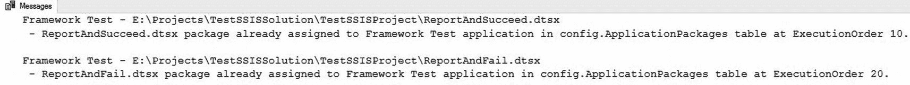
图 5-27：重新执行 SSIS Application Packages T-SQL

后续重新执行`Add SSIS Application Packages` T-SQL 会产生相同的结果。

SSIS 框架元数据数据库包含一个名为`config`的架构。`config`架构包含三张表：
1. `Config.Applications`
2. `Config.Packages`
3. `Config.ApplicationPackages`

这些表包含名为`Framework Test`的应用程序的元数据，该应用程序与名为`ReportAndSucceed.dtsx`和`ReportAndFail.dtsx`的两个 SSIS 包相关。可以通过执行清单 5-14 所示的 T-SQL 来检索元数据。

```
Use [SSISConfig]
go
declare @ApplicationName nvarchar(255) = N'Framework Test'
Select a.ApplicationName
, p.PackageLocation + p.PackageName As PackagePath
, ap.ExecutionOrder
, ap.FailApplicationOnPackageFailure
From [config].[ApplicationPackages] ap
Join [config].[Applications] a
On a.ApplicationId = ap.ApplicationId
Join [config].Packages p
On p.PackageId = ap.PackageId
Where a.ApplicationName = @ApplicationName
And ap.ApplicationPackageEnabled = 1
Order By ap.ExecutionOrder
Listing 5-14
查看框架应用程序内容
```

清单 5-14 所示 T-SQL 查询返回的 SSIS 框架元数据如图 5-28 所示。

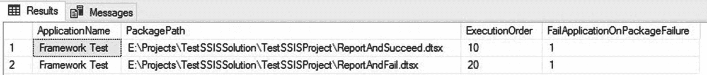
图 5-28：SSIS 框架元数据查询结果

从 SSIS 框架元数据返回的信息足以在 SSIS 框架执行引擎中执行。我们的下一步是构建 SSIS 框架的执行引擎。

### 总结

在本章中，我们重点介绍了：
* 构建元数据数据库
* 构建测试 SSIS 项目
* 向元数据数据库添加元数据

下一步是构建执行引擎，我们将在下一章中完成。

## 6. 框架执行引擎

既然在上一章中已经构建了元数据数据库和测试应用程序，现在是时候专注于执行引擎了。回想一下，在上一章开头附近，我强调了同理心在软件架构和设计中的重要性。我写道

> *我假设 SSIS 开发人员或 SSIS 开发团队会熟悉 SSIS，因此我在 SSIS 中构建 SSIS 框架。我希望开发人员或团队能够管理和维护他们的框架。*

第 5 章介绍了构建框架和管理元数据。现在，是时候考虑我们的 SSIS 包将如何执行了。

### 创建父 SSIS 包

在一个新的名为`SSISFrameworkSolution`的 SSIS 解决方案中，创建一个名为`SSISFrameworkProject`的新 SSIS 项目。将默认的 SSIS 包重命名为`Parent.dtsx`，如图 6-1 所示。

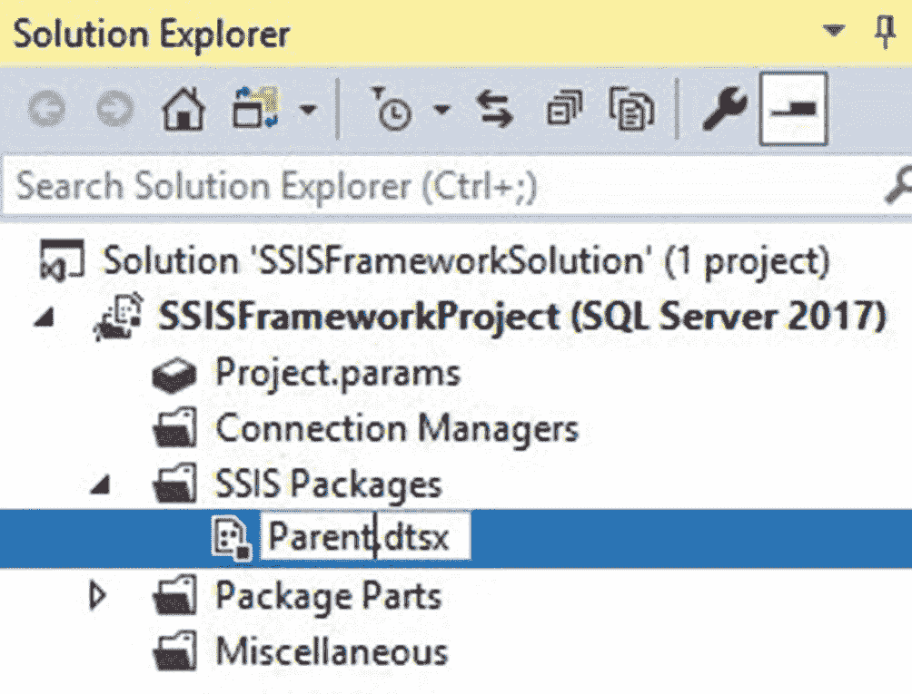
图 6-1：在`SSISFrameworkSolution`的`SSISFrameworkProject`中重命名`Parent.dtsx` SSIS 包

`Parent.dtsx`将：
* 记录执行值
* 从`SSISConfig`数据库检索属于某个 SSIS 应用程序的 SSIS 应用程序包列表
* 遍历检索到的应用程序包列表
* 记录每个应用程序包的元数据
* 执行每个应用程序包
* 记录执行结果


### 记录执行值

首先，添加一个名为 `ApplicationName` 的字符串数据类型包参数，默认值为 `Framework Test`，如图 6-2 所示。

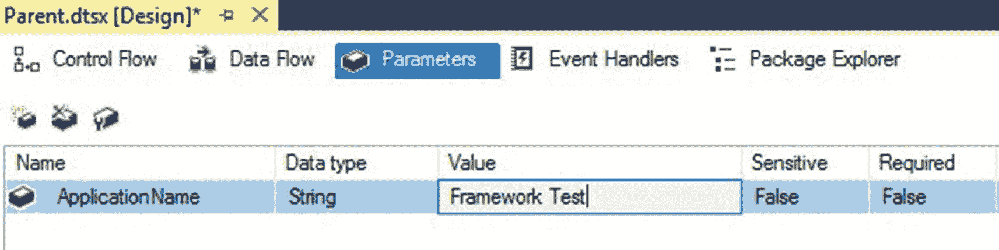
图 6-2
将 `ApplicationName` 包参数添加到 `Parent.dtsx`

将 `Sensitive` 和 `Required` 参数属性保留为其默认值：`False`。`ApplicationName` 参数包含当 `Parent.dtsx` 执行时要执行的 SSIS 框架 SSIS 应用程序的名称。该参数的值将在运行时被覆盖。

要记录执行值，请将一个脚本任务添加到 `Parent.dtsx` 控制流中。将该脚本任务重命名为 `SCR Log Initial Values`，如图 6-3 所示。

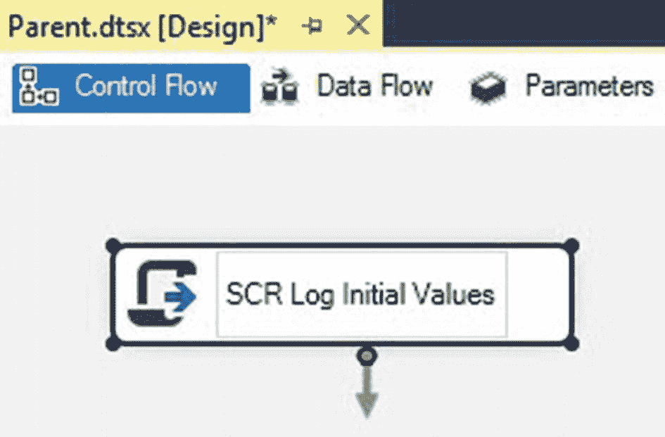
图 6-3
添加并重命名 `SCR Log Initial Values` 脚本任务

`SCR Log Initial Values` 脚本任务将用于捕获 `Parent.dtsx` 包在执行开始时初始状态的插桩信息。插桩在任何工程实践中都很重要，数据工程以及 ETL（提取、转换和加载）插桩也是如此。在 SSIS 包执行开始时捕获设置的初始状态对于故障排除至关重要。正如我的朋友 Grant Fritchey 所说：“如果你不知道正确的情况是什么样子，你怎么知道哪里出了问题？”

打开 `SCR Log Initial Values` 脚本任务编辑器，并将以下 SSIS 变量和参数添加到 `ReadOnlyVariables` 属性中，如图 6-4 和图 6-5 所示。

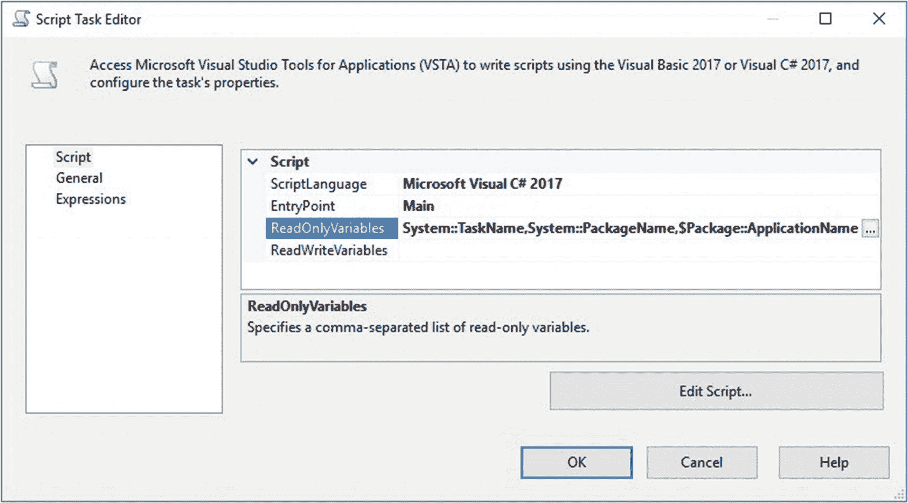
图 6-5
两个 SSIS 变量和一个参数已添加到 `ReadOnlyVariables` 脚本任务属性

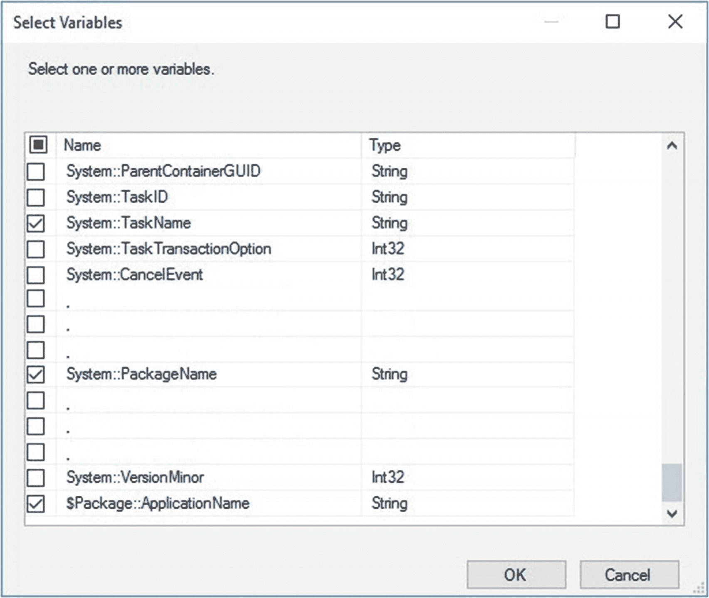
图 6-4
为 `ReadOnlyVariables` 脚本任务属性选择两个 SSIS 变量和一个参数

*   `System::PackageName`
*   `System::TaskName`
*   `$Package::ApplicationName`

从 `ReadOnlyVariables` 脚本任务属性中复制变量和参数列表。单击 `Edit Script` 按钮，打开名为 `VstaProjects` 的 Visual Studio Tools for Applications (VSTA) .Net 代码编辑器窗口。导航到 `public void Main()`，并将 SSIS 变量和参数粘贴为注释，如图 6-6 所示。

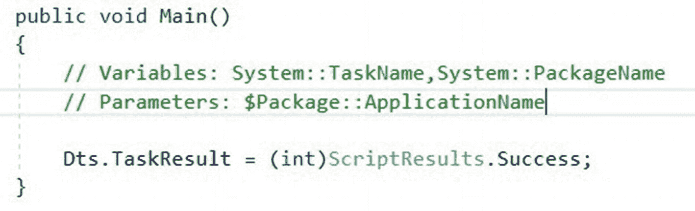
图 6-6
将 SSIS 变量和参数复制到 `VstaProjects`

添加如清单 6-1 所示的 .Net C# 代码，以记录 `ApplicationName` 参数的初始值。

```csharp
public void Main()
{
    // Variables: System::TaskName,System::PackageName
    // Parameters: $Package::ApplicationName
    string packageName = Dts.Variables["System::PackageName"].Value.ToString();
    string taskName = Dts.Variables["System::TaskName"].Value.ToString();
    string subComponent = packageName + "." + taskName;
    int informationCode = 1001;
    bool fireAgain = true;
    string applicationName = Dts.Variables["$Package::ApplicationName"].Value.ToString();
    string description = "ApplicationName: " + applicationName;
    Dts.Events.FireInformation(informationCode, subComponent, description, "", 0, ref fireAgain);
    Dts.TaskResult = (int)ScriptResults.Success;
}
```
清单 6-1
用于记录 `ApplicationName` 参数初始值的 C# .Net 代码

一旦 `public void Main()` 中的代码与清单 6-1 匹配，`VstaProjects` 窗口应配置并引发一个 SSIS Information 事件，如图 6-7 所示。

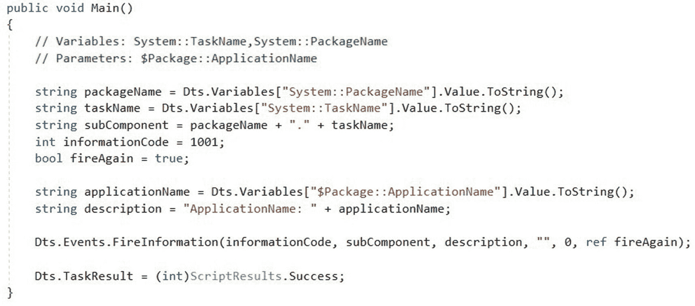
图 6-7
引发 SSIS Information 事件的 C# .Net 代码

关闭 `VstaProjects` 窗口，并单击脚本任务编辑器上的 `OK` 按钮。在调试器 (F5) 中执行 `Parent.dtsx` SSIS 包。如果一切顺利，`SCR Log Initial Values` 脚本任务应执行并成功，如图 6-8 所示。

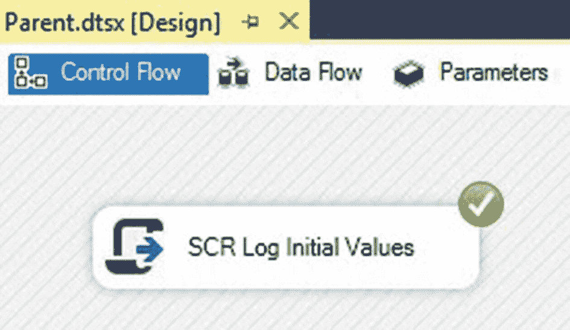
图 6-8
成功调试执行 `Parent.dtsx`

单击 `Progress` 选项卡（如果已停止调试器，则单击 `Execution Results` 选项卡），并查看 `SCR Log Initial Values` 脚本任务中编码的 Information 事件，如图 6-9 所示。

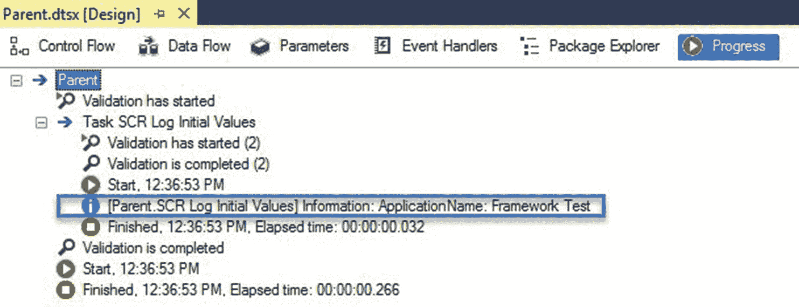
图 6-9
查看 Information 事件

Information 事件的文本如清单 6-2 所示。

```
[Parent.SCR Log Initial Values] Information: ApplicationName: Framework Test
```
清单 6-2
Information 事件的内容

`subComponent` 的值列在最前面，用方括号括起来：`[Parent.SCR Log Initial Values]`。事件类型跟在 `subComponent` 后面：`Information`。`description` 字符串在最后：`ApplicationName: Framework Test`。

此消息将出现在为 `Parent.dtsx` SSIS 包配置的任何日志记录中，并通知操作员哪个 SSIS 应用程序名称已传递给 `Parent.dtsx` 包。


### 从 SSISConfig 检索 SSIS 应用程序包

下一步是在`Parent.dtsx` SSIS 包中检索要执行的包列表。向`Parent.dtsx`控制流添加一个执行 SQL 任务，并将其重命名为“SQL Get Application Packages”，如图 6-10 所示。

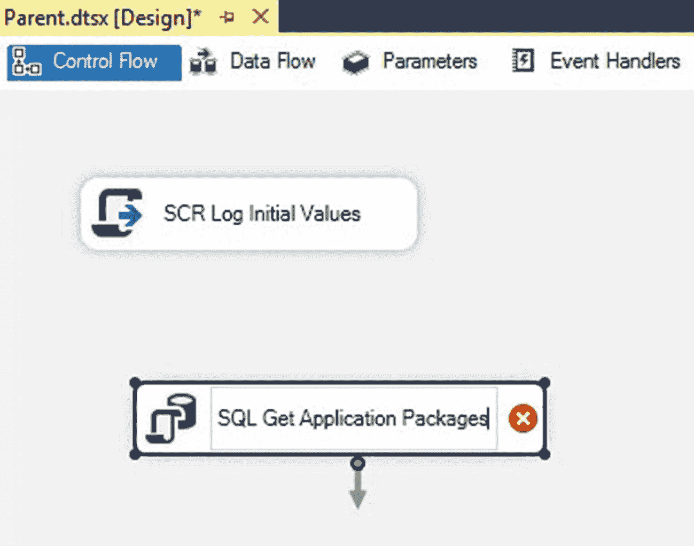

图 6-10 添加“SQL Get Application Packages”执行 SQL 任务

从`SCR Log Initial Values`脚本任务连接一个优先约束到`SQL Get Application Packages`执行 SQL 任务，然后右键单击该任务并单击“编辑”来打开`SQL Get Application Packages`执行 SQL 任务编辑器，如图 6-11 所示。

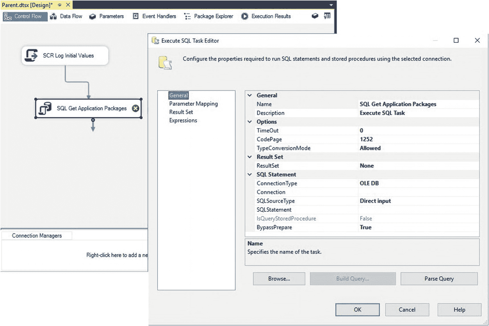

图 6-11 连接优先约束并打开 SQL Get Application Packages 执行 SQL 任务编辑器

将`SQL Get Application Packages`执行 SQL 任务的`ConnectionType`属性设置为`ADO.NET`，如图 6-12 所示。

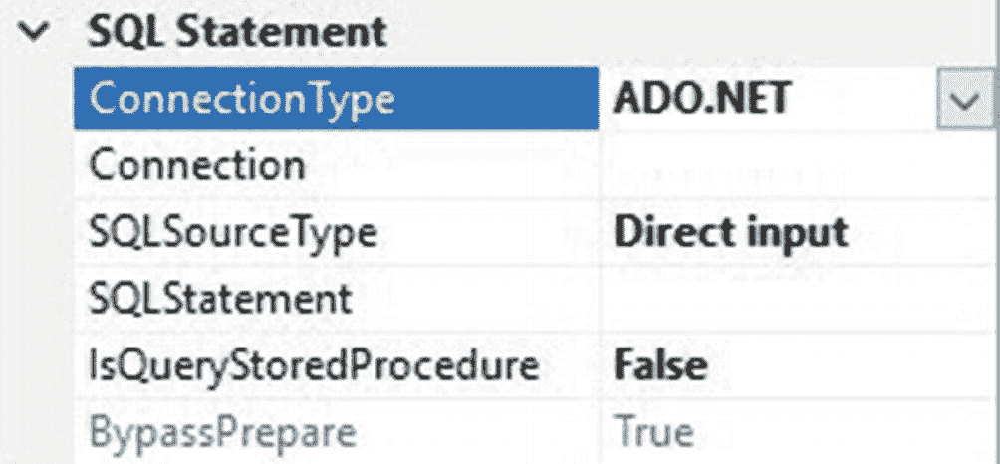

图 6-12 将 ConnectionType 设置为 ADO.NET

单击`Connection`属性中的下拉菜单，然后单击“<New Connection…>”，如图 6-13 所示。

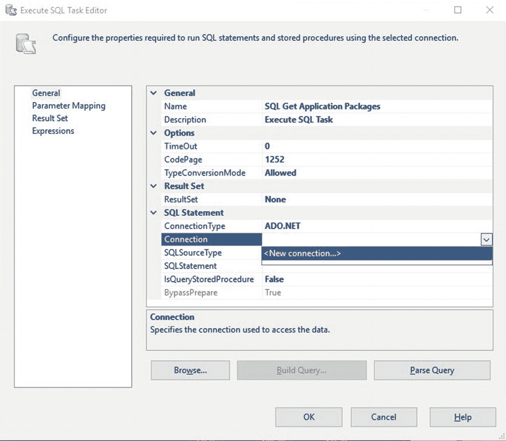

图 6-13 从 Connection 属性中选择<New Connection…>

此时将显示“Configure ADO.NET Connection Manager”对话框，如图 6-14 所示。

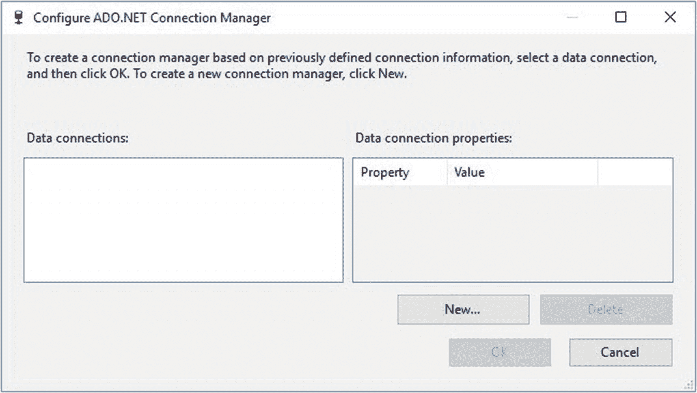

图 6-14 Configure ADO.NET Connection Manager 对话框

单击“New”按钮打开连接管理器配置对话框。配置一个新的`ADO.NET Connection Manager`以连接到你的`SSISConfig`数据库实例，如图 6-15 所示。

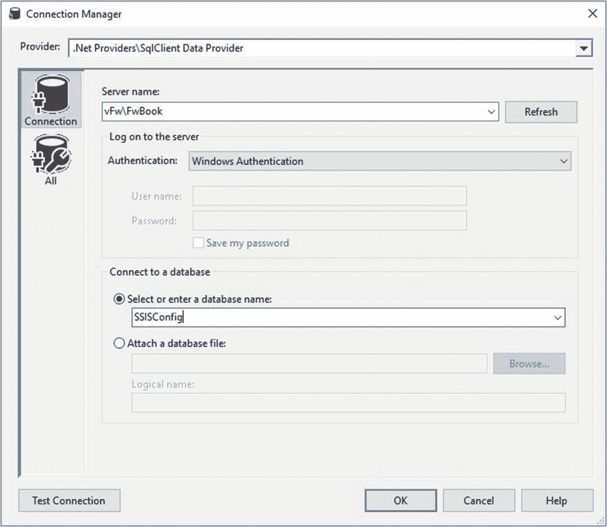

图 6-15 配置新的 ADO.NET Connection Manager

单击“OK”按钮完成`ADO.NET Connection Manager`的配置。新的连接管理器配置包含你的`SSISConfig`数据库实例的连接信息，现在已存储在已配置的`ADO.NET`连接管理器列表中，如图 6-16 所示。

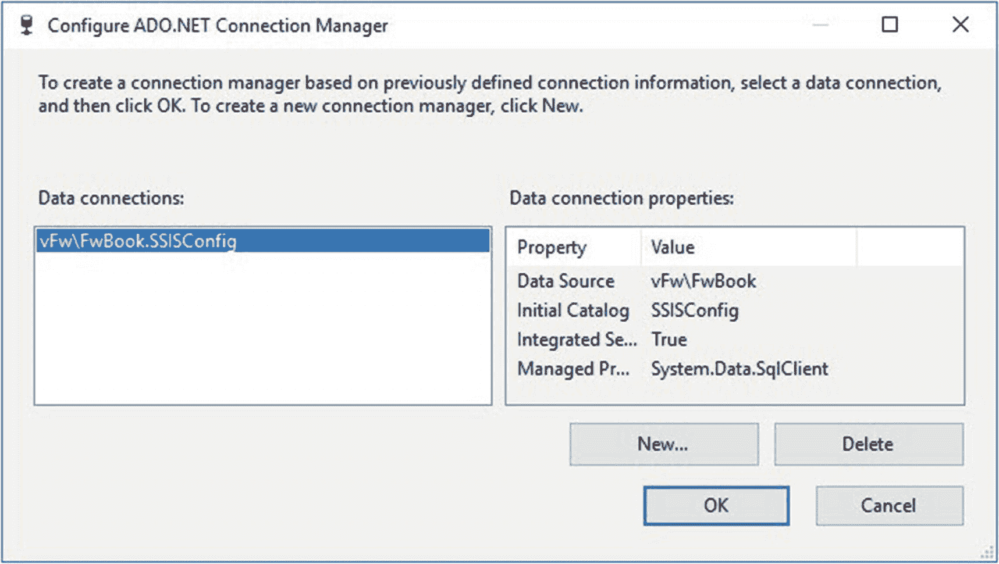

图 6-16 在 Configure ADO.NET Connection Manager 中的 SSISConfig 数据库配置

单击“OK”按钮完成`ADO.NET Connection Manager`的配置。此时，执行 SQL 任务编辑器应类似于图 6-17。

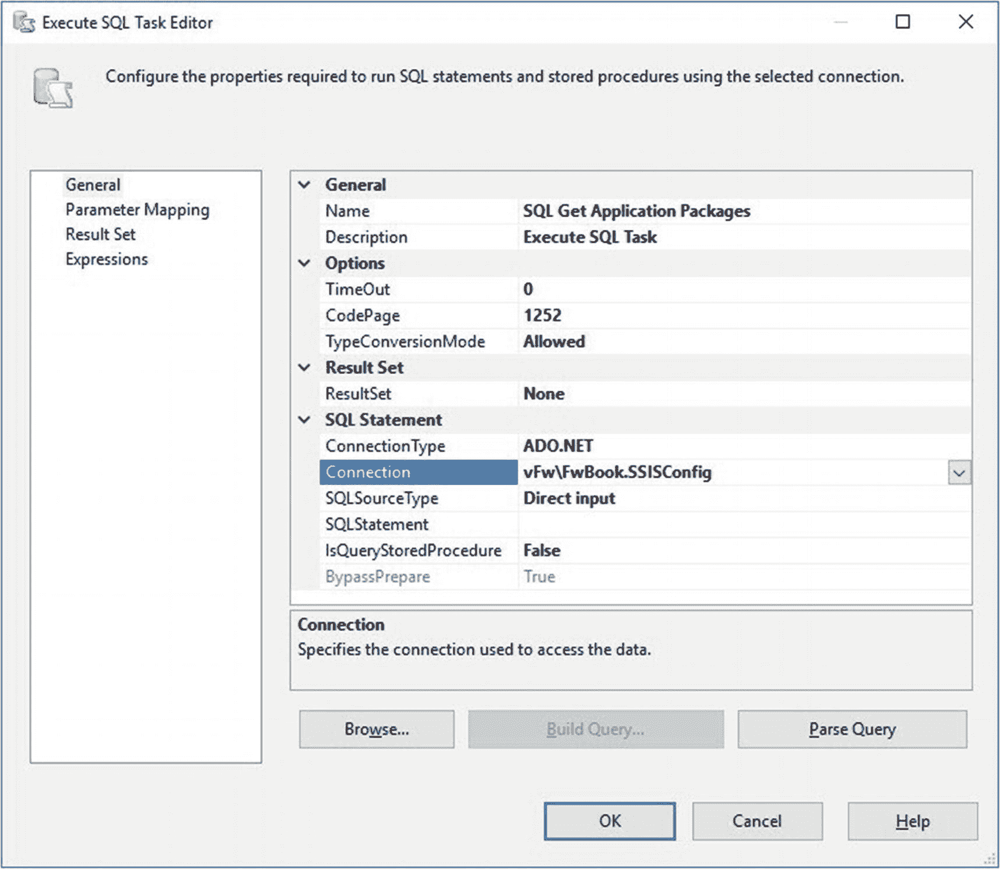

图 6-17 为 SQL Get Application Packages 执行 SQL 任务配置的连接

上一章中的代码清单 5-14 包含了从`SSISConfig`数据库中存储的元数据返回给定 SSIS 应用程序的 SSIS 应用程序包列表所需的 T-SQL。使用代码清单 6-3 所示的 T-SQL 配置`SQL Get Application Packages`执行 SQL 任务的`SQLStatement`属性。

```sql
Select a.ApplicationName
, p.PackageLocation + p.PackageName As PackagePath
, ap.ExecutionOrder
, ap.FailApplicationOnPackageFailure
From [config].[ApplicationPackages] ap
Join [config].[Applications] a
On a.ApplicationId = ap.ApplicationId
Join [config].Packages p
On p.PackageId = ap.PackageId
Where a.ApplicationName = @ApplicationName
And ap.ApplicationPackageEnabled = 1
Order By ap.ExecutionOrder
```

代码清单 6-3 从 SSISConfig 数据库检索 SSIS 应用程序包的 T-SQL

将代码清单 6-3 中的 T-SQL 添加到`SQL Get Application Packages`执行 SQL 任务的`SQLStatement`属性中，如图 6-18 所示。

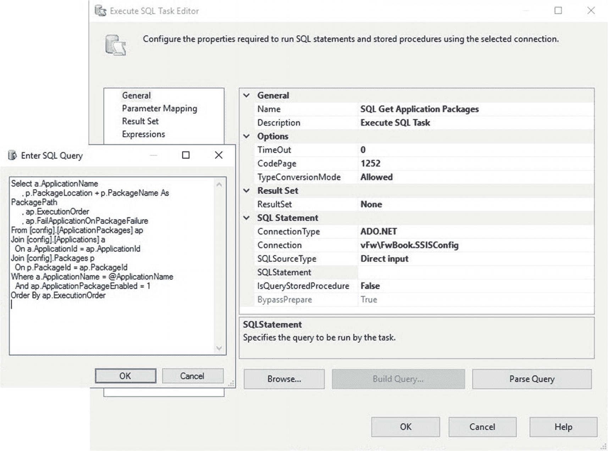

图 6-18 添加 SQLStatement 属性的 T-SQL

单击“OK”按钮关闭“Enter SQL Query”对话框。执行 SQL 任务编辑器应类似于图 6-19 所示。

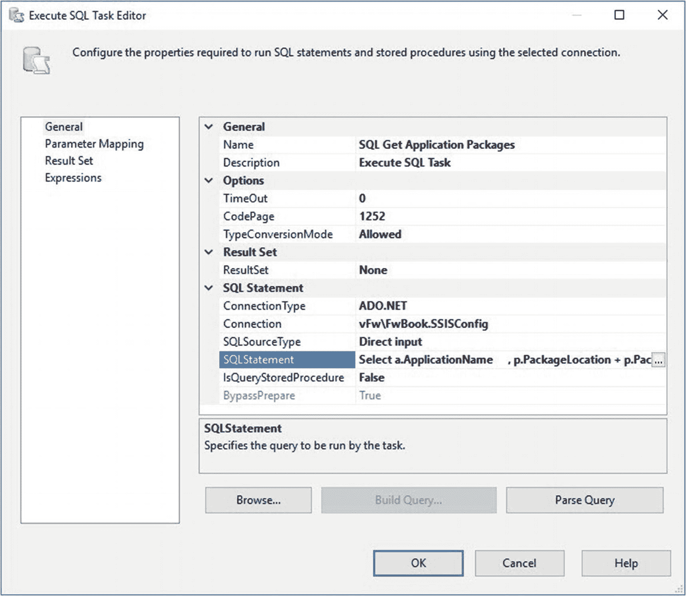

图 6-19 配置 SQLStatement 属性后的 SQL Get Application Packages 执行 SQL 任务

在执行 SQL 任务编辑器左侧的页面列表中，单击“Parameter Mapping”页面，然后单击“Add”按钮添加一个参数映射。从“Variable Name”列中选择`$Package::ApplicationName`参数，选择`String`数据类型，并在“Parameter Name”列中输入`ApplicationName`，如图 6-20 所示。

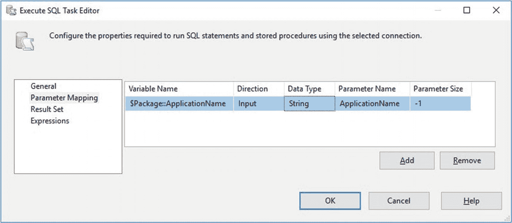

图 6-20 添加 ApplicationName 参数

在“Parameter Mapping”页面上配置的`ApplicationName`参数将从名为`$Package::ApplicationName`的 SSIS 包参数（如图 6-20 中“Variable Name”列所示）读取值，并将该值提供给在`SQL Get Application Packages`执行 SQL 任务的`SQLStatement`属性（见代码清单 6-17）中配置的 T-SQL 查询参数。

返回到`SQL Get Application Packages`执行 SQL 任务的“General”页面。单击`ResultSet`属性中的下拉菜单，选择“Full result set”，如图 6-21 所示。

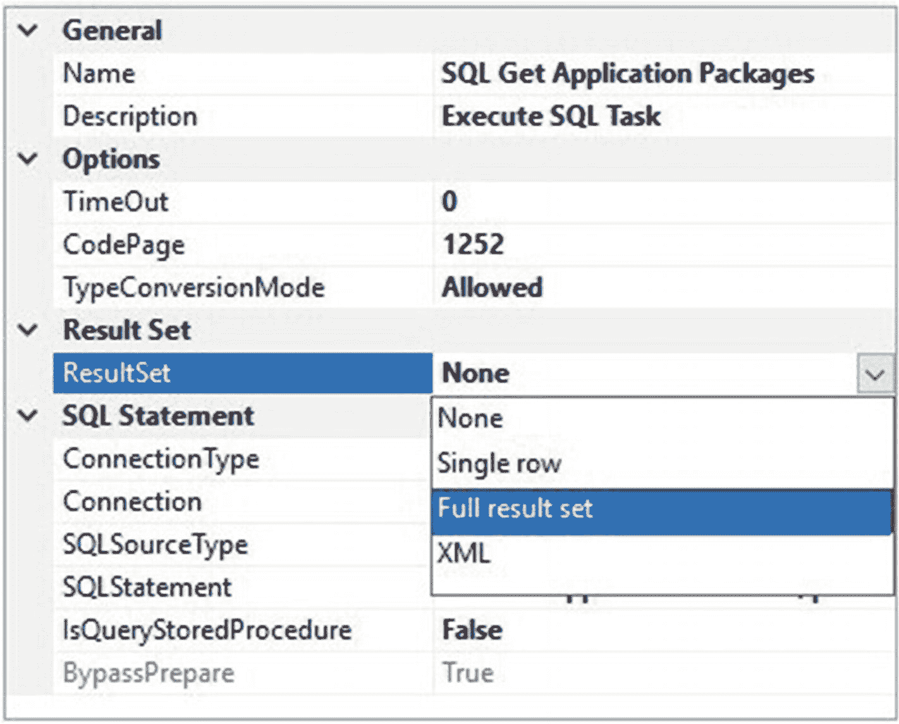

图 6-21 选择 Full result set

单击“Result Set”页面，然后单击“Add”按钮。编辑`Result Name`值，并将其设置为`0`。在`Variable Name`下拉菜单中，选择“<New variable…>”，如图 6-22 所示。

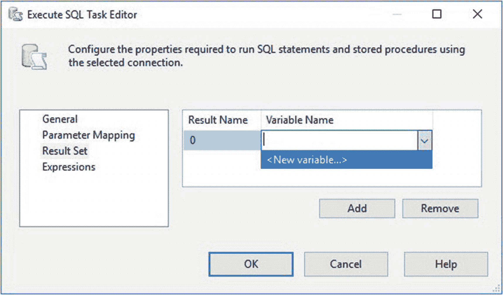

图 6-22 从 Result Set Variable Name 下拉菜单中选择“<New variable…>”

当“Add Variable”对话框显示时，确保“Container”设置为`Parent`，如图 6-23 所示。

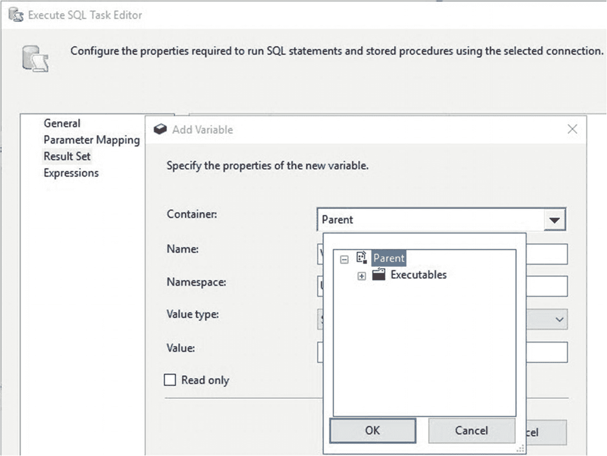

图 6-23 验证已选择 Parent 容器

将`Name`属性更改为`ApplicationPackages`，将`Namespace`保持为`User`，并将`Value type`设置为`Object`，如图 6-24 所示。

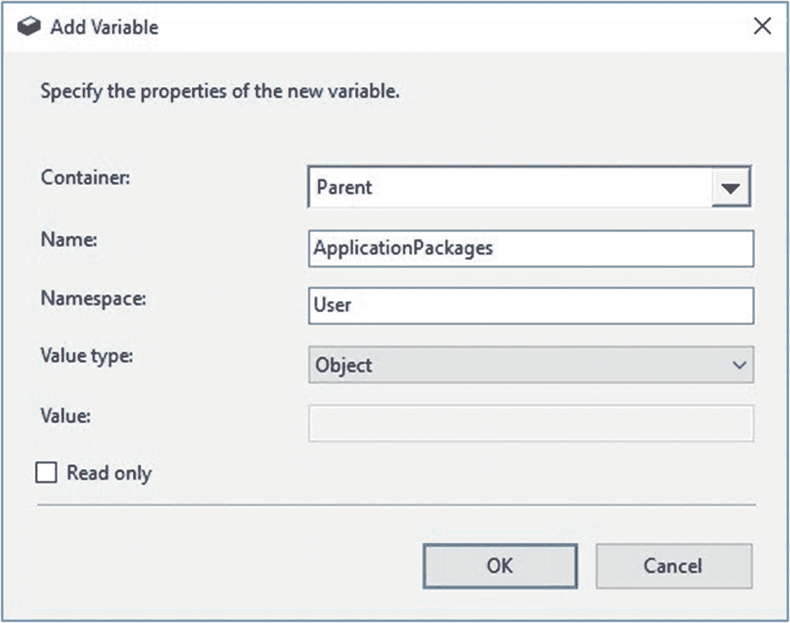

图 6-24 配置 Object 变量 ApplicationPackages


### 配置 SSIS 包以迭代应用程序包

`User::ApplicationPackages` 变量将接收从执行存储在 SQL 获取应用程序包执行 SQL 任务中的 `SQLStatement` 属性里的 T-SQL 查询所返回的 ADO.Net 数据集。由于此 T-SQL 查询在条件（WHERE 子句）中包含了 `ApplicationName` 参数，并且该参数由发送到 `Parent.dtsx` SSIS 包的 `$Package::ApplicationName` SSIS 参数设置，因此该 ADO.Net 数据集将包含已配置 SSISConfig 数据的包列表。因为 `$Package::ApplicationName` 默认设置为名为“Framework Test”的 SSIS 框架应用程序，所以 `User::ApplicationPackages` 变量将包含如图 6-25 所示的结果。

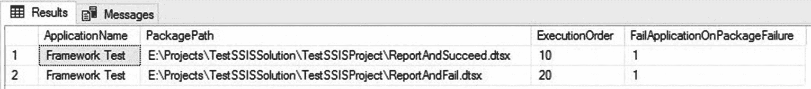

图 6-25 发送到 `User::ApplicationPackages` 变量的结果

单击“确定”按钮关闭“添加变量”对话框。

现在，“SQL 获取应用程序包执行 SQL 任务”编辑器的“常规”页应类似于图 6-26。

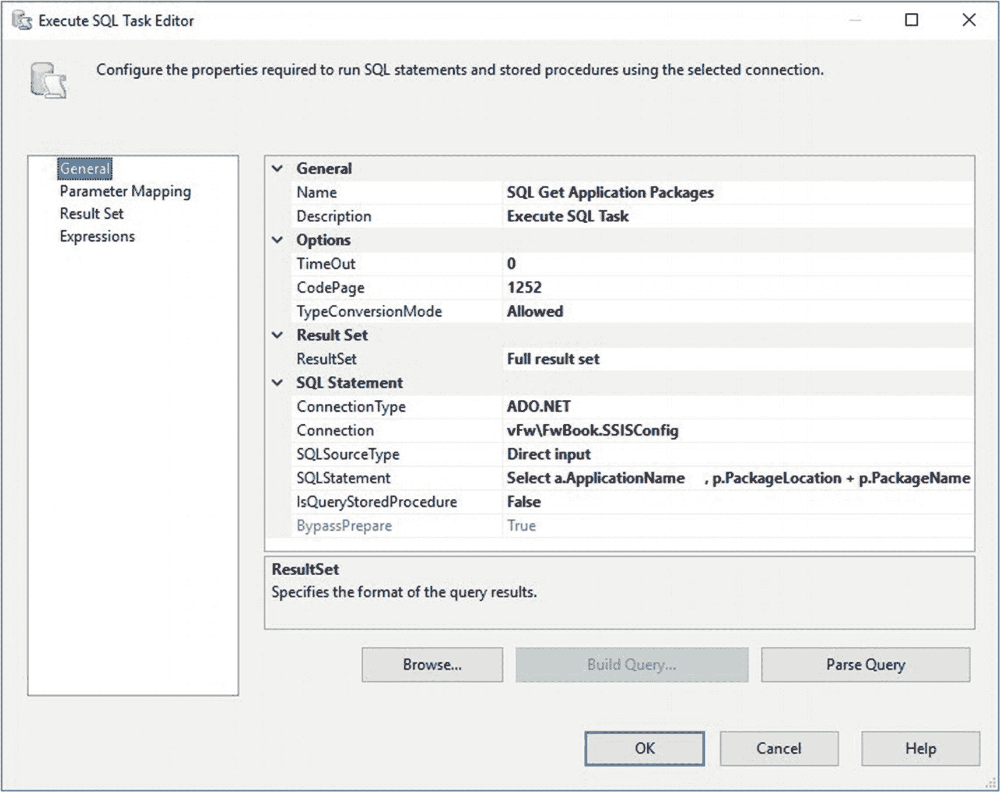

图 6-26 SQL 获取应用程序包执行 SQL 任务的“常规”页

单击“确定”按钮关闭 SQL 获取应用程序包执行 SQL 任务编辑器。

### 迭代应用程序包

SSIS Foreach Loop 容器用于迭代多种集合。`User::ApplicationPackages` SSIS 变量是一个对象数据类型的变量。对象可以包含标量（或单个、单独的值），但它们并非真正为标量而构建。对象旨在包含集合。集合可以是数组或列表，以及记录集和数据集。集合也可以，嗯，就是集合——一种类似列表的 .Net 变量类型。

在上一节中，我们添加了一个执行 SQL 任务。该执行 SQL 任务的 `ConnectionType` 属性被配置为 `ADO.NET`。我们配置了一个完整结果集，并将结果（来自该结果集）发送到名为 `User::ApplicationPackages` 的对象变量中。因为执行 SQL 任务的 `ConnectionType` 属性设置为 `ADO.NET`，所以 `User::ApplicationPackages` 中对象的类型是一个 ADO.Net 数据集。ADO.Net 数据集包含一个表集合。

如果将执行 SQL 任务配置为使用 `OLE DB` `ConnectionType`，那么发送到 `User::ApplicationPackages` 对象变量的结果集将是一个 ADO 记录集，它是一个 COM（公共对象模型）对象。COM 是在微软软件的 32 位（x86）时代引入的，大约在 1990 年代初。

很酷的一点是，SSIS Foreach Loop 容器的 Foreach ADO 迭代器并不关心你发送给它的是 ADO 记录集还是 ADO.Net 数据集；它都可以迭代。

将一个 Foreach Loop 容器拖到 `Parent.dtsx` 的控制流上，并从 SQL 获取应用程序包执行 SQL 任务到 Foreach Loop 容器连接一个优先级约束。将 Foreach Loop 容器重命名为“FOREACH 应用程序包”，如图 6-27 所示。

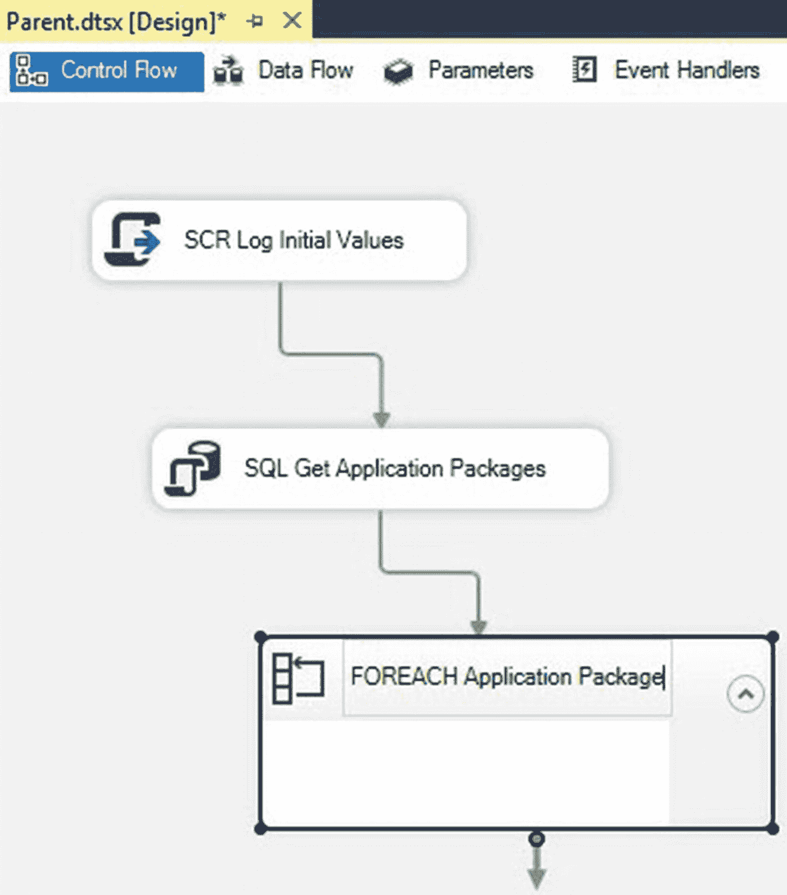

图 6-27 重命名 Foreach Loop 容器

打开 FOREACH 应用程序包的编辑器并导航到“集合”页。将迭代器更改为“Foreach ADO 枚举器”，如图 6-28 所示。

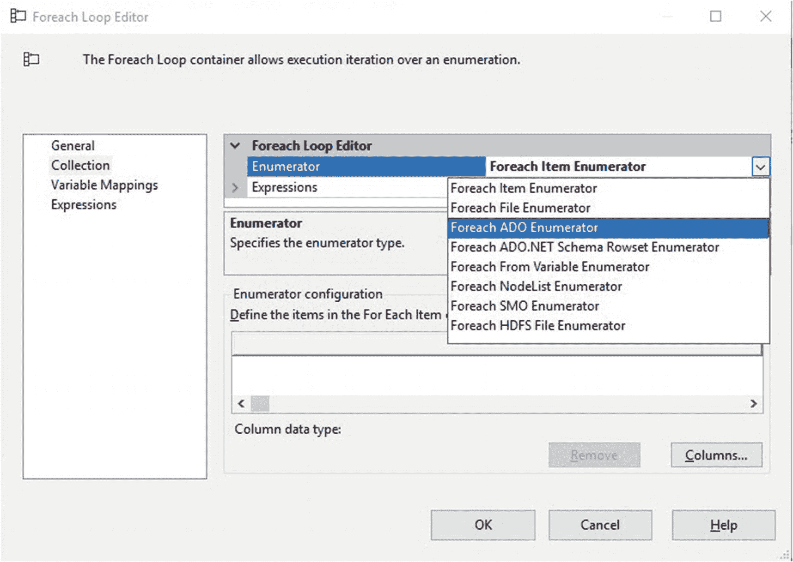

图 6-28 将 FOREACH 应用程序包的迭代器更改为 Foreach ADO 枚举器

Foreach Loop 容器的 Foreach ADO 枚举器在每次枚举（遍历数据集）时“指向”一行。每列中的值可以通过序数映射到 SSIS 变量，每次“传递”（枚举/迭代）时进行映射。通常，Foreach Loop 容器内的 SSIS 任务被配置为从变量中*读取*这些值，并以某种方式对其执行操作。稍后会详细介绍变量映射。

每个迭代器都会呈现一个迭代器特定的属性视图。在“迭代器配置”组框中，单击“ADO 对象源变量”下拉列表，然后选择 `User::ApplicationPackages` 变量，如图 6-29 所示。

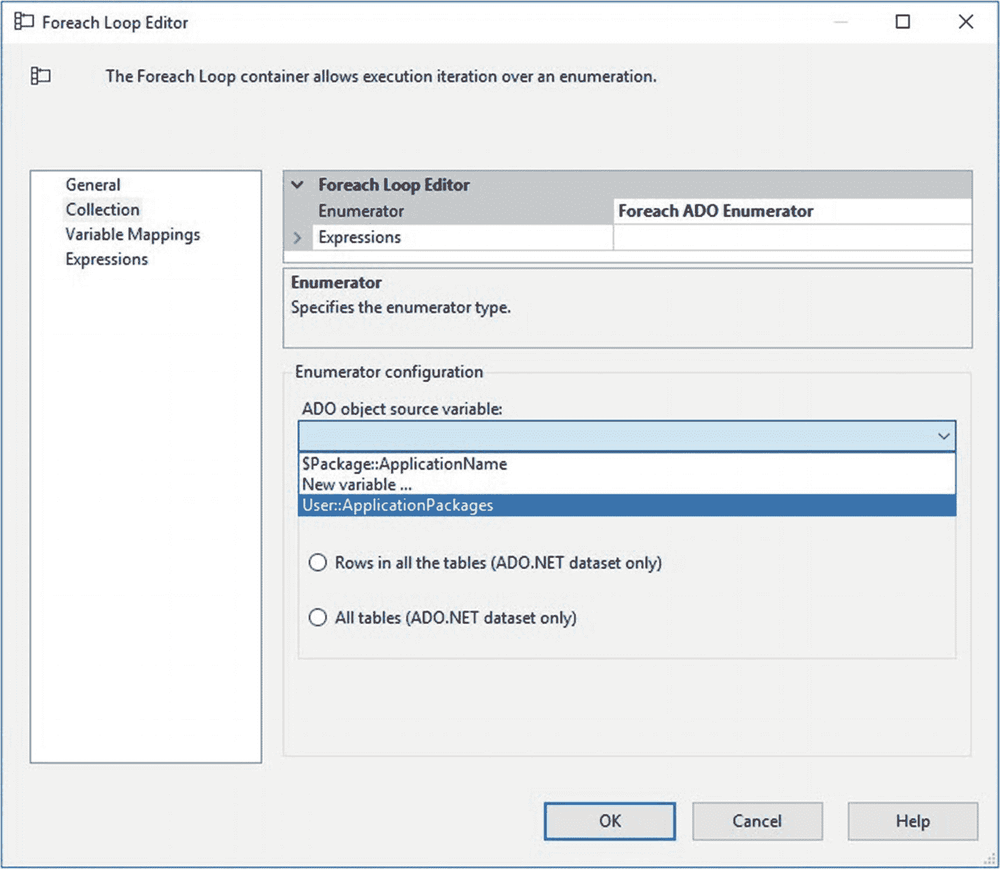

图 6-29 选择 ADO 对象源变量

将枚举模式保留为“第一个表中的行”。“集合”页配置如图 6-30 所示。

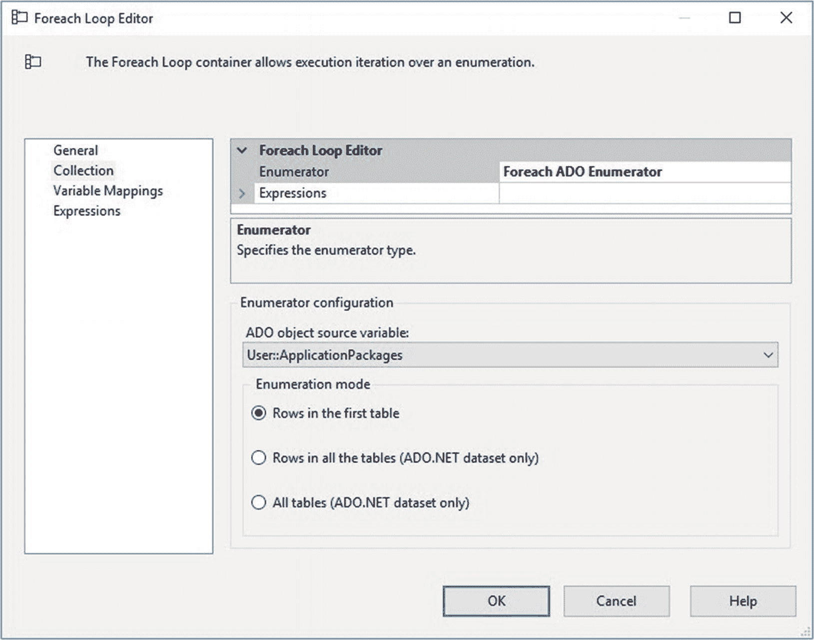

图 6-30 已配置的“集合”页

单击“变量映射”页。单击“变量”列内部，单击下拉列表，然后单击“<新建变量...>”，如图 6-31 所示。

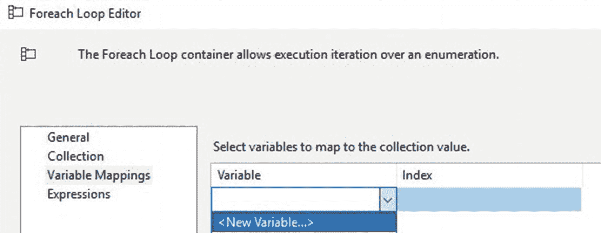

图 6-31 在“变量映射”页上单击“新建变量”


### 配置 SSIS 变量并映射数据集

按照之前的操作，确保在“添加变量”对话框显示时，将“容器”设置为 SSIS 包作用域（`“Parent”`）。输入 `“PackagePath”` 作为变量名称，其余设置保持各自的默认值，如图 6-32 所示。

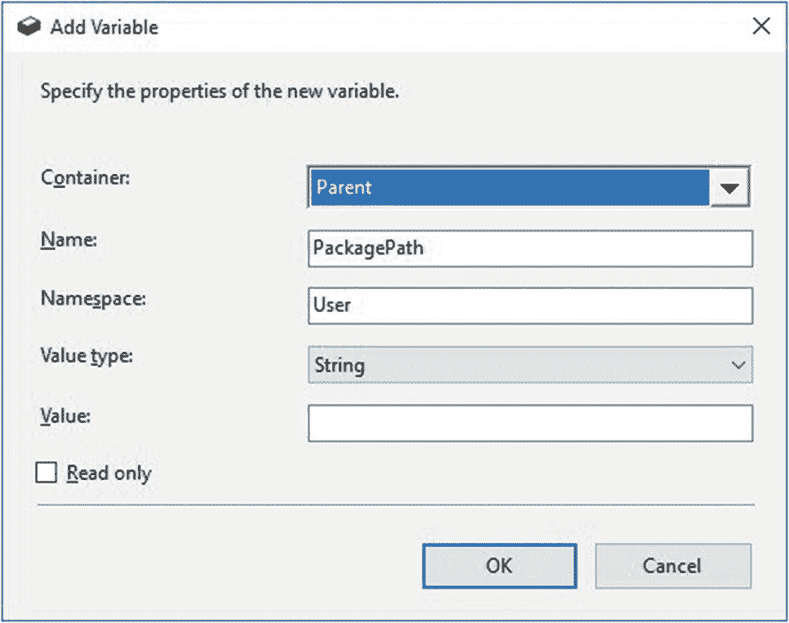
图 6-32 添加 `PackagePath` 变量

单击“确定”按钮关闭“添加变量”对话框。请注意，对于这第一个变量分配，“索引”列默认为 `“0”`，如图 6-33 所示。

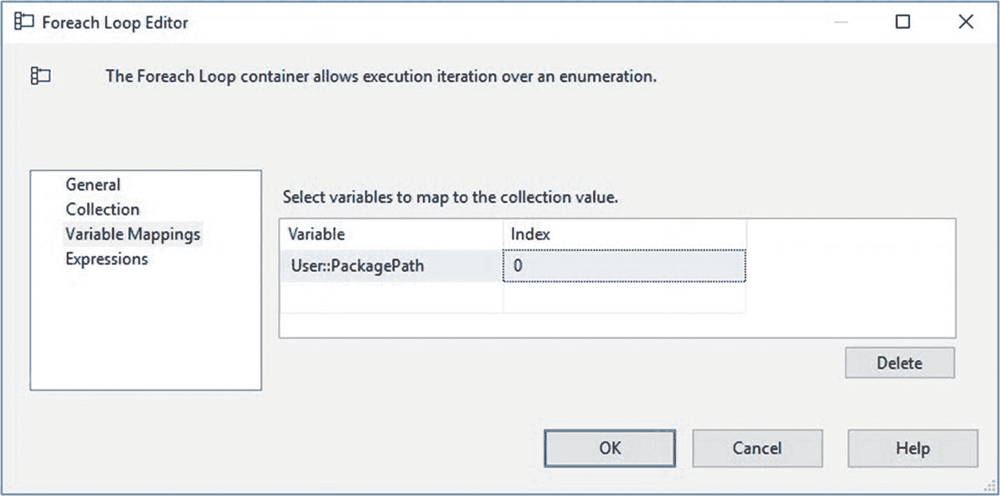
图 6-33 `User::PackagePath` 分配给序数 `“0”`

`“0”` 表示什么？很高兴你问到这个问题。`“0”` 表示 `User::ApplicationPackages` 数据集中列的序数。请回忆 ADO.Net 数据集中 `Tables(0)` 的内容，如图 6-34 所示。

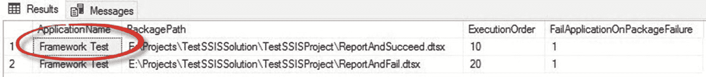
图 6-34 `User::ApplicationPackages` 中 ADO.Net 数据集的列序数 `“0”`

我们的包中已经`具有`此字段的值——`ApplicationName` 是通过名为 `$Package::ApplicationName` 的参数传递给 `Parent.dtsx` SSIS 包的。我们刚刚创建的 SSIS 变量名为 `“User::PackagePath”`。我们想要在此处分配的值位于第二个字段中，序数为 1（在这个从 0 开始的数组中）。

将“索引”列中的 `“0”` 更改为 `“1”`，如图 6-35 所示。

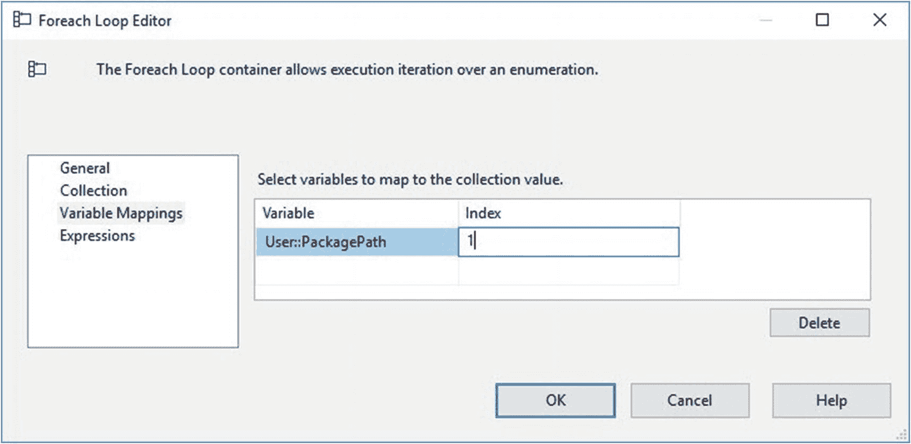
图 6-35 将序数更改为 `“1”`

`User::PackagePath` 现在将被分配数据集中第二列的值——在从零开始的序数中为 1。

创建一个新的 SSIS `Int32` 变量 `User::ExecutionOrder`，使用“添加变量”对话框上的以下设置来映射 `User::ApplicationPackages` 变量中数据集的 `ExecutionOrder` 值，如图 6-36 所示。

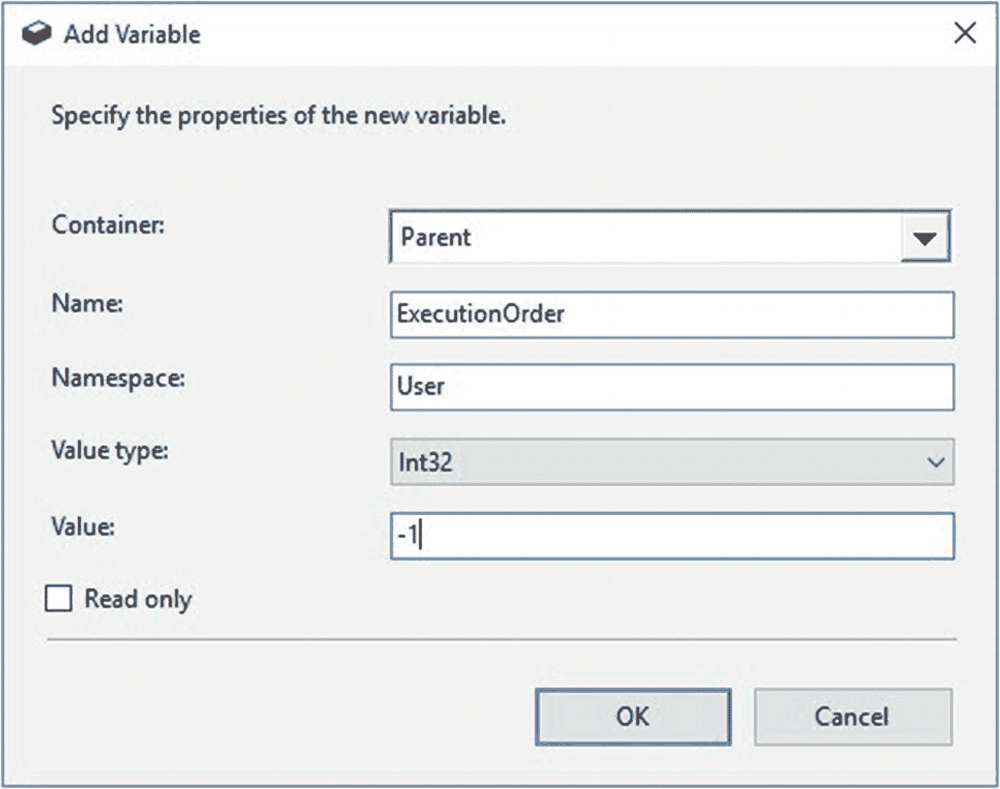
图 6-36 映射 `ExecutionOrder` SSIS 变量

*   `容器`: `Parent`
*   `名称`: `ExecutionOrder`
*   `命名空间`: `User`
*   `值类型`: `Int32`
*   `值`: `-1`

将 `ExecutionOrder` 列的“索引”列更新为 `2`。FOREACH Application Package Foreach 循环容器的“变量映射”页面应类似于图 6-37。

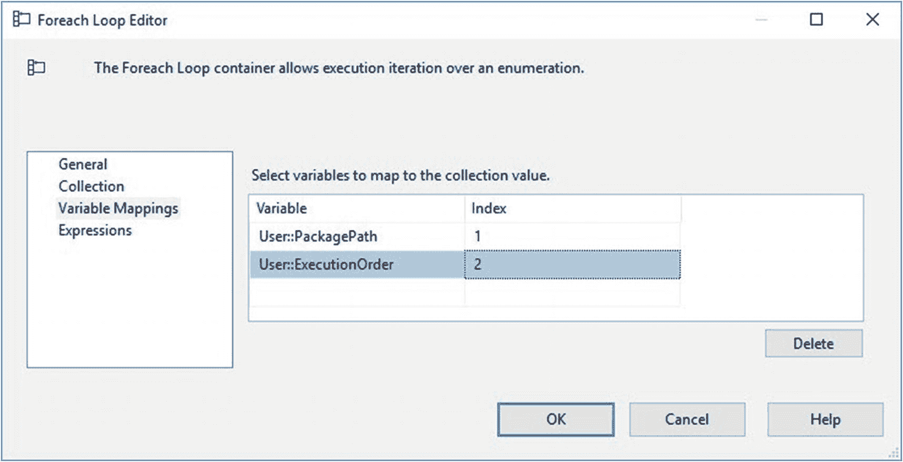
图 6-37 `User::PackagePath` 和 `User::ExecutionOrder` 变量已映射

创建一个新的 SSIS `Boolean` 变量 `User::FailApplicationOnPackageFailure`，使用“添加变量”对话框上的以下设置来映射 `User::ApplicationPackages` 变量中数据集的 `FailApplicationOnPackageFailure` 值，如图 6-38 所示。

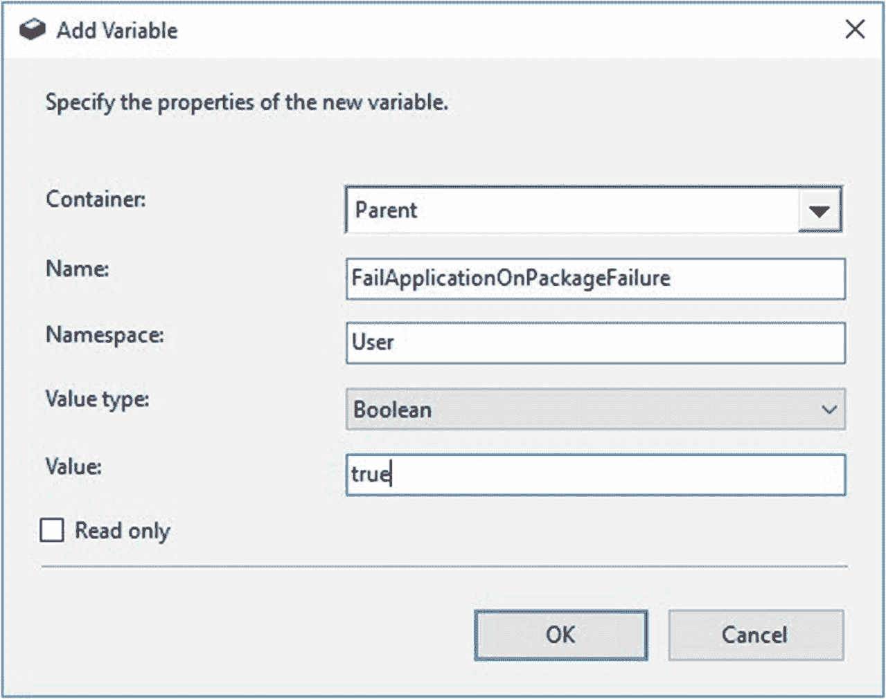
图 6-38 映射 `FailApplicationOnPackageFailure` SSIS 变量

*   `容器`: `Parent`
*   `名称`: `FailApplicationOnPackageFailure`
*   `命名空间`: `User`
*   `值类型`: `Boolean`
*   `值`: `true`

将 `FailApplicationOnPackageFailure` 列的“索引”列更新为 `3`。FOREACH Application Package Foreach 循环容器的“变量映射”页面应类似于图 6-39。

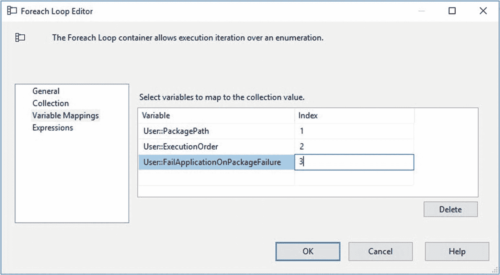
图 6-39 `User:: FailApplicationOnPackageFailure` 变量已映射

单击“确定”按钮关闭“Foreach 循环编辑器”。`Parent.dtsx` 应类似于图 6-40。

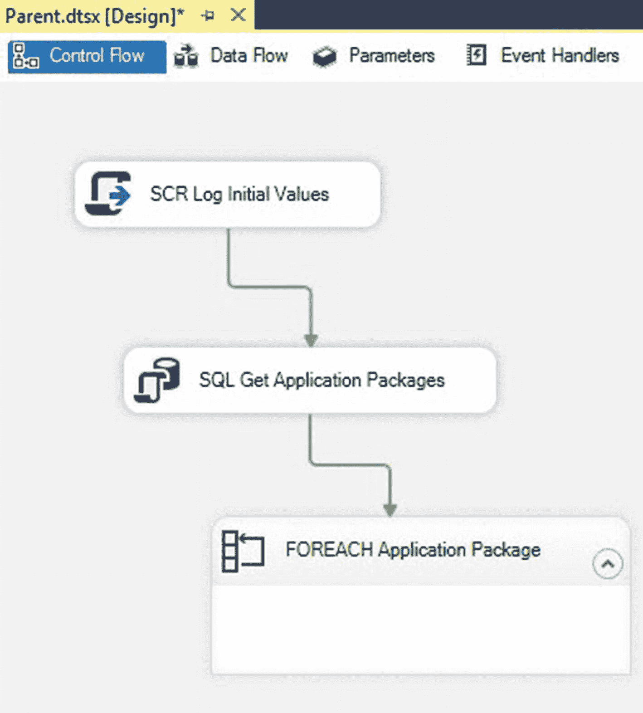
图 6-40 添加 FOREACH Application Package 后的 `Parent.dtsx` 控制流


### 记录应用程序包值

与记录包启动时的初始值类似，在包执行前记录所有包数据对于故障排除很有帮助。向`Parent.dtsx`包添加一个新的脚本任务。将新脚本任务放置在`FOREACH 应用程序包 Foreach 循环容器`内，并将该脚本任务重命名为“SCR Log Application Package Values”，如图 6-41 所示。

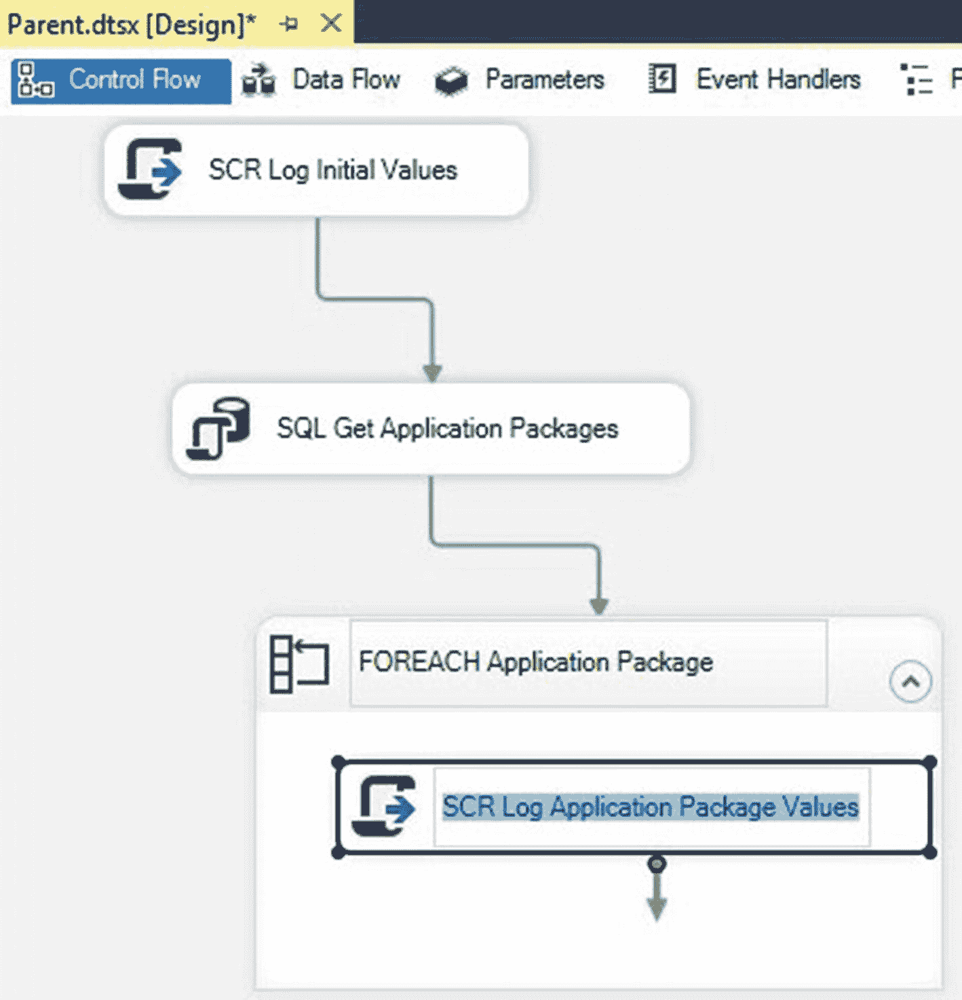
*图 6-41 添加 SCR Log Application Package Values 脚本任务*

打开脚本任务编辑器，并将以下 SSIS 变量添加到 `ReadOnlyVariables` 属性中：
- `System::PackageName`
- `System::TaskName`
- `User::PackagePath`
- `User::ExecutionOrder`
- `User::FailApplicationOnPackageFailure`

脚本任务的“脚本”页面应如图 6-42 所示。

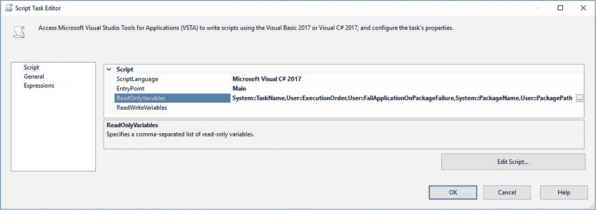
*图 6-42 已配置的脚本任务 ReadOnlyVariables*

打开 .Net 代码编辑器，并将清单 6-4 中所示的 C# .Net 代码放入 `public void Main()` 方法中。

```csharp
public void Main()
{
// System::PackageName, System::TaskName
// User::PackagePath, User::ExecutionOrder, ➤ User::FailApplicationOnPackageFailure
string packageName = ➤ Dts.Variables["System::PackageName"].Value.ToString();
string taskName = ➤ Dts.Variables["System::TaskName"].Value.ToString();
string subComponent = packageName + "." + taskName;
int informationCode = 1001;
bool fireAgain = true;
string packagePath = ➤ Dts.Variables["User::PackagePath"].Value.ToString();
string description = "PackagePath: " + packagePath;
Dts.Events.FireInformation(informationCode, subComponent, ➤ description, "", 0, ref fireAgain);
int executionOrder = ➤ Convert.ToInt32(Dts.Variables["User::ExecutionOrder"].Value);
description = "ExecutionOrder: " + executionOrder.ToString();
Dts.Events.FireInformation(informationCode, subComponent, ➤ description, "", 0, ref fireAgain);
bool failApplicationOnPackageFailure = ➤ Convert.ToBoolean(Dts.Variables["User::FailApplicationOnPackageFailure"]➤
.Value);
description = "FailApplicationOnPackageFailure: " + ➤ failApplicationOnPackageFailure.ToString();
Dts.Events.FireInformation(informationCode, subComponent, ➤ description, "", 0, ref fireAgain);
Dts.TaskResult = (int)ScriptResults.Success;
}
```
*清单 6-4 记录应用程序包值的代码*

当 C# .Net 代码被添加到 SCR Log Application Package Values 脚本任务的 VstaProjects 编辑器后，它应如图 6-43 所示。

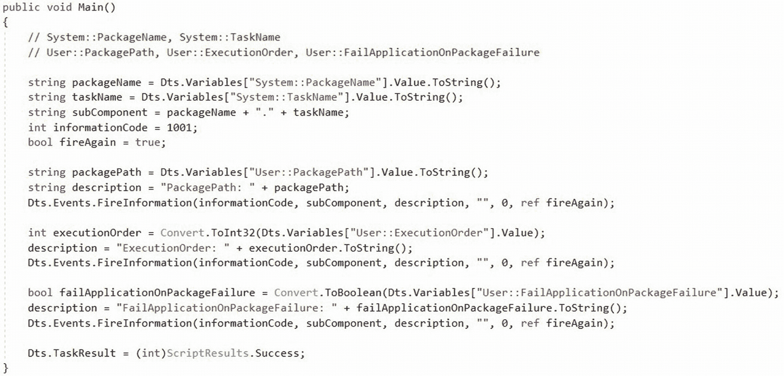
*图 6-43 SCR Log Application Package Values 的 C# .Net 代码*

关闭 `VstaProjects` 窗口并单击 `OK` 按钮以关闭脚本任务编辑器。`Parent.dtsx` 的控制流应如图 6-44 所示。

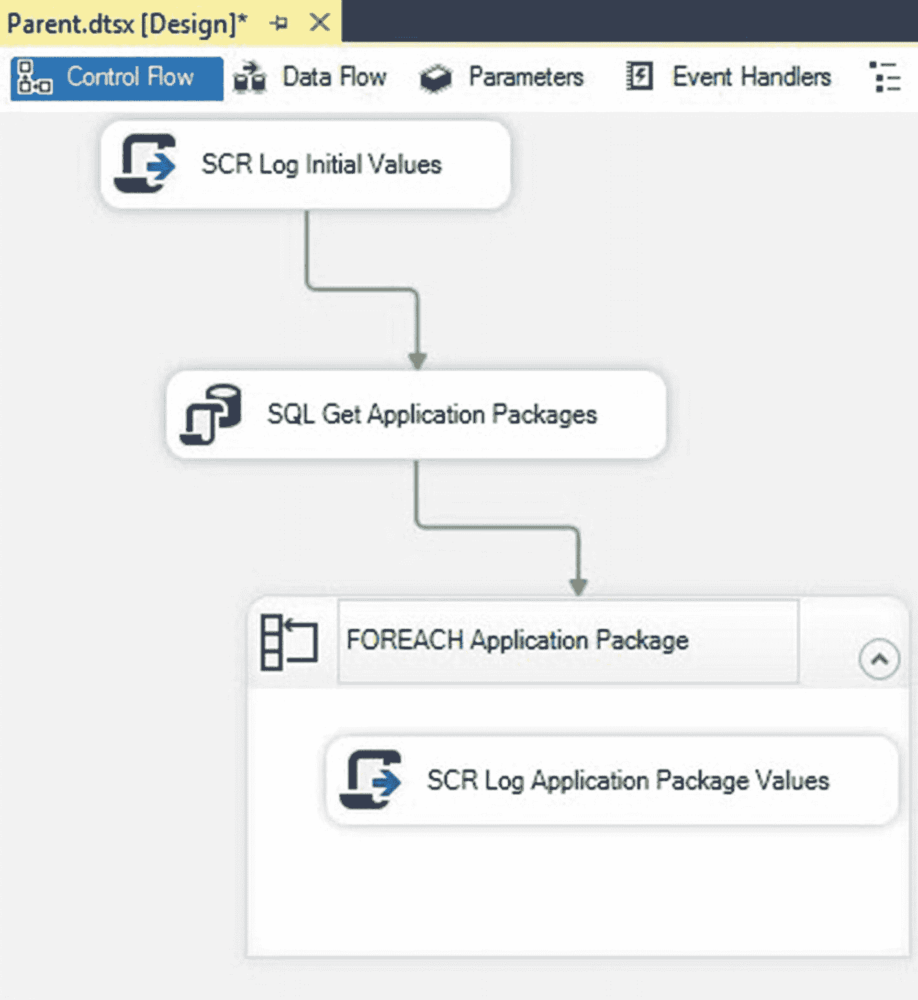
*图 6-44 添加 SCR Log Application Package Values 后的 Parent.dtsx 控制流*

通过在调试器中执行 `Parent.dtsx` 包来测试新功能。按 `F5` 键，然后在调试执行完成后观察“进度”选项卡，如图 6-45 所示。

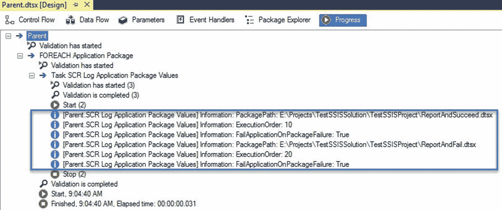
*图 6-45 查看由 SCR Log Application Package Values 引发的仪表板消息*

`Parent.dtsx` 包（即 SSIS 框架执行引擎）的仪表板已接近完成。下一步是执行那些已从 SSIS 框架数据库返回了元数据的子包。


### 执行应用程序包

有多种机制可用于执行 SSIS 包，包括：

*   .NET（C# 和 Visual Basic）
*   PowerShell
*   DtExec 命令行
*   SQL Agent
*   SSIS 执行包任务

在此示例中，我们将使用 SSIS 执行包任务。将一个“执行包任务”拖到 `FOREACH Application Package` 循环容器中。从 `SCR Log Application Package Values` 向“执行包任务”连接一个优先约束，然后将执行包任务重命名为 `EPT Execute Child Package`，如图 6-46 所示。

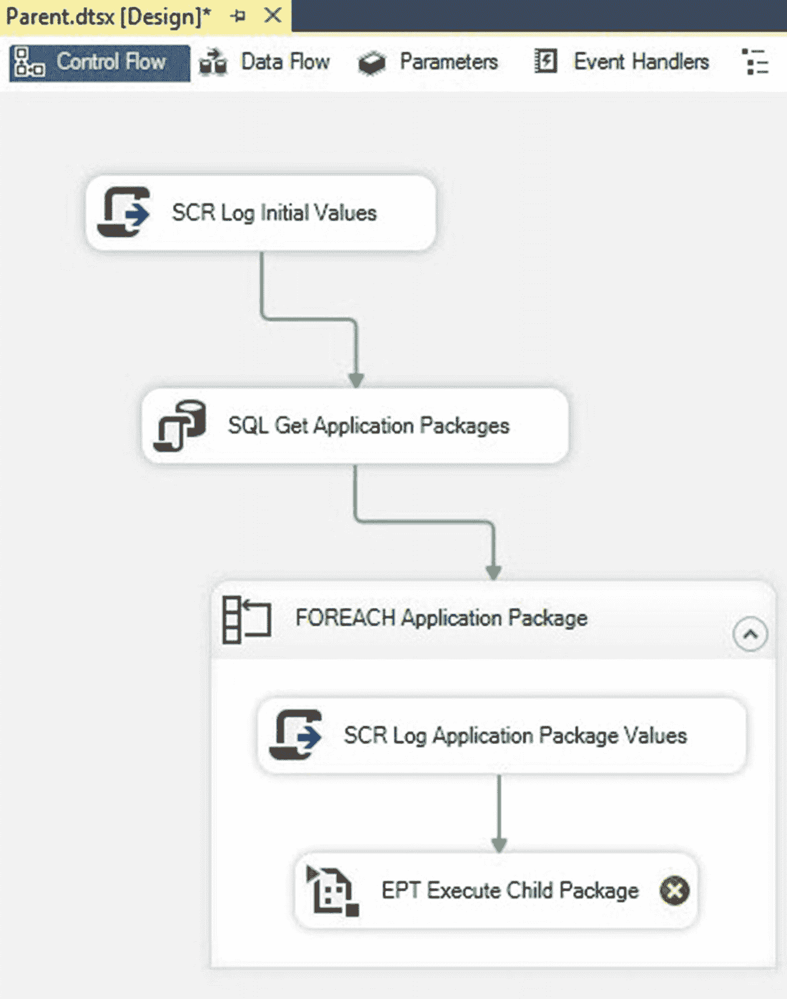
**图 6-46** 添加 EPT Execute Child Package 执行包任务

打开“执行包任务编辑器”并导航到“包”选项卡。将 `ReferenceType` 属性更改为 `External Reference`，如图 6-47 所示。

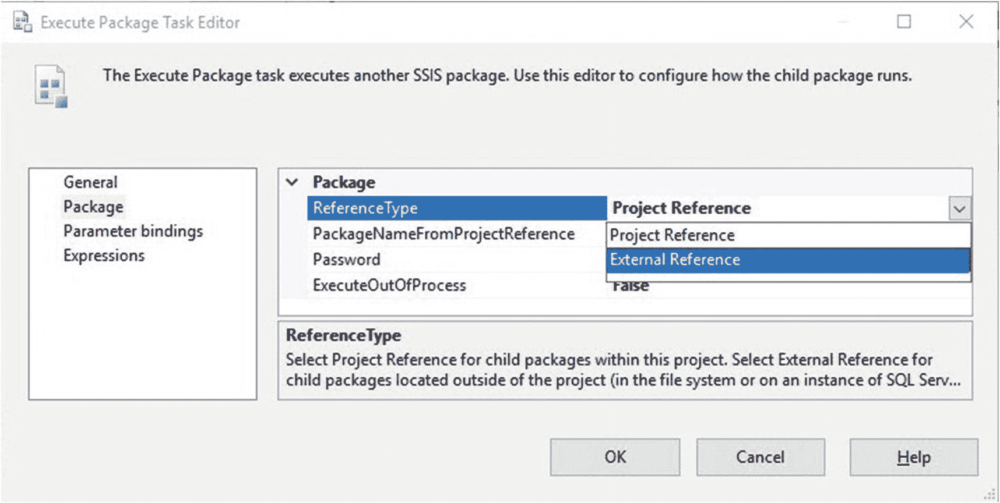
**图 6-47** 将执行包任务的 `ReferenceType` 属性更改为 `External Reference`

将 `EPT Execute Child Package` 执行包任务的 `Location` 属性更改为 `File system`，如图 6-48 所示。

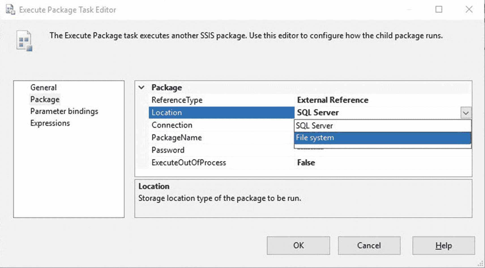
**图 6-48** 设置 `EPT Execute Child Package` 执行包任务的 `Location` 属性

一旦 `EPT Execute Child Package` 执行包任务的 `Location` 属性被更改为 `File system`，编辑器中会显示一个新属性 — `Connection`。通过点击下拉菜单并选择 `<New connection…>` 开始配置新连接，如图 6-49 所示。

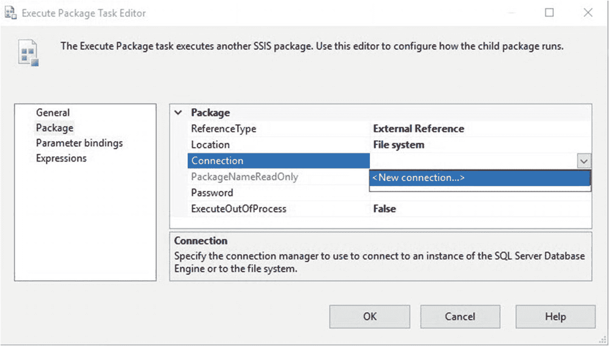
**图 6-49** 选择 `<New connection…>` 以创建新连接

由于 `ReferenceType` 属性被设置为 `External Reference` 且 `Location` 属性被设置为 `File system`，`EPT Execute Child Package` 执行包任务的 `Connection` 属性期望连接到一个文件 — 一个 *SSIS 包文件* 或 `.dtsx` 文件 — 因此“新建连接”操作会创建一个新的“文件连接管理器”并打开其编辑器，如图 6-50 所示。

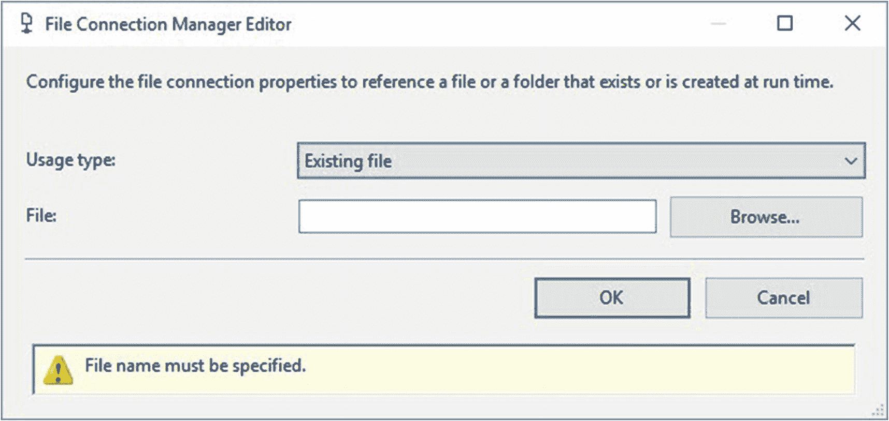
**图 6-50** 准备配置的文件连接管理器

将文件连接管理器的 `Usage type` 属性保留为 `Existing file`。点击“浏览”按钮并导航到 `TestSSISSolution\TestSSISProject` 文件夹中的 `ReportAndSucceed.dtsx` 文件，如图 6-51 所示。

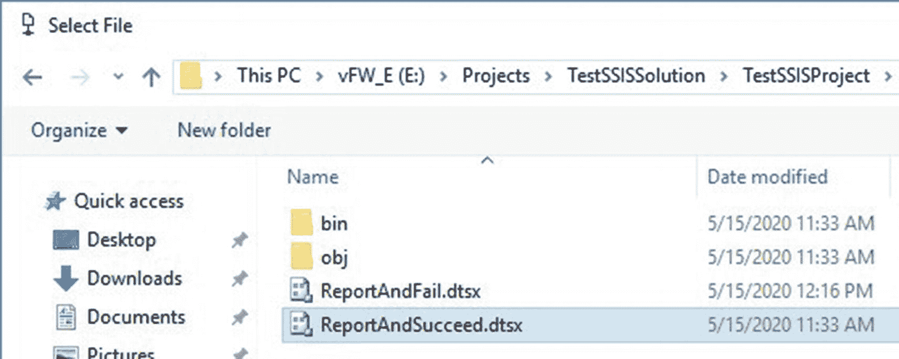
**图 6-51** 浏览到 `TestSSISSolution\TestSSISProject` 文件夹中的 `ReportAndSucceed.dtsx` 文件

一旦选择了 `TestSSISSolution\TestSSISProject\ReportAndSucceed.dtsx` 文件，“文件连接管理器编辑器”将如图 6-52 所示。

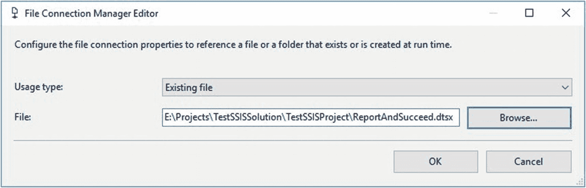
**图 6-52** 已选择 `TestSSISSolution\TestSSISProject\ReportAndSucceed.dtsx` 文件

点击“文件连接管理器编辑器”的“确定”按钮返回到 `EPT Execute Child Package` 执行包任务编辑器，其外观将类似于图 6-53。

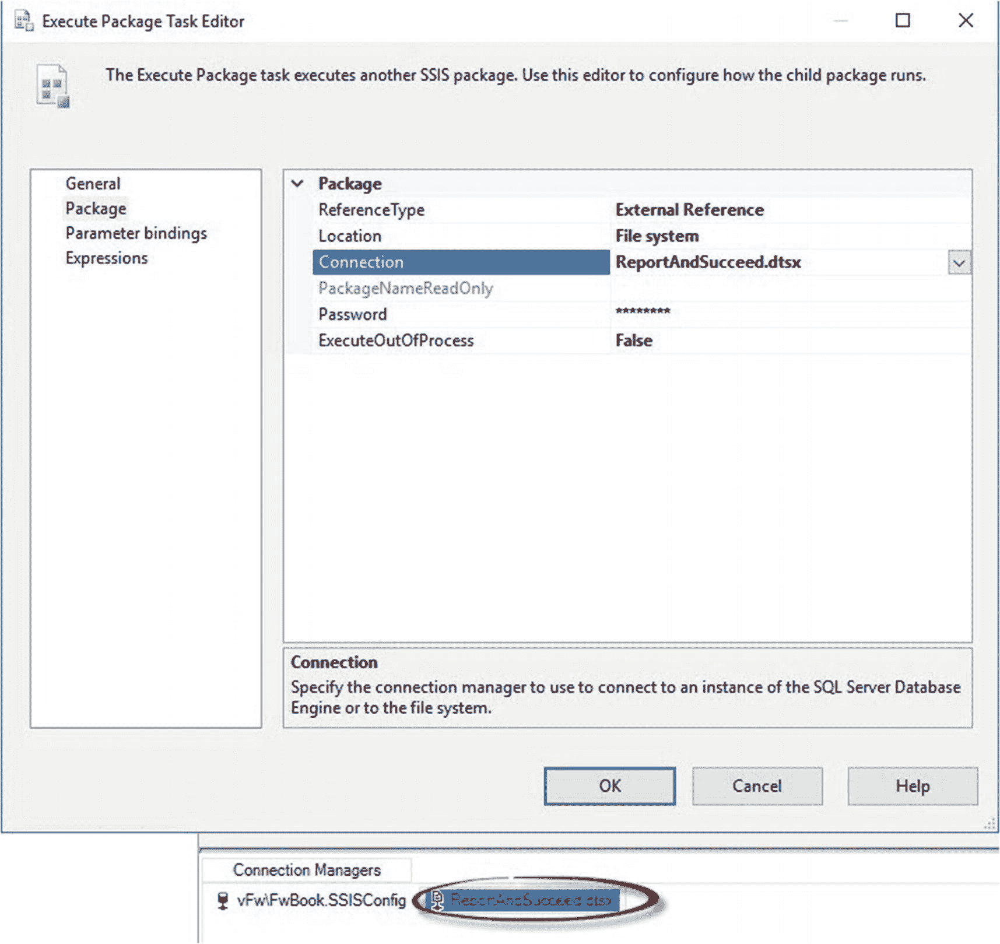
**图 6-53** 已配置的 `EPT Execute Child Package` 和 `ReportAndSucceed.dtsx` 文件连接管理器

点击 `EPT Execute Child Package` 执行包任务编辑器的“确定”按钮。

右键单击 `ReportAndSucceed.dtsx` 文件连接管理器，然后单击“重命名”，如图 6-54 所示。

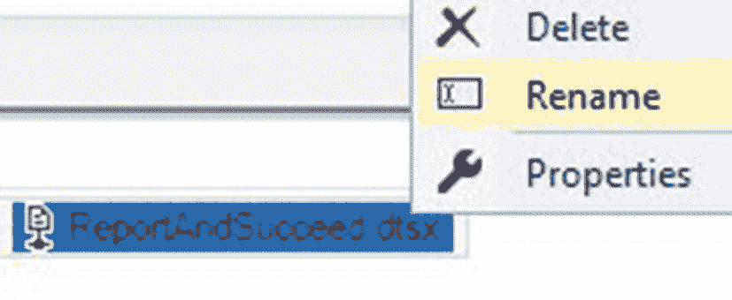
**图 6-54** 重命名 `ReportAndSucceed.dtsx` 文件连接管理器

将文件连接管理器重命名为 `ChildPackage`，如图 6-55 所示。


**图 6-55** 将文件连接管理器重命名为 `ChildPackage`

为了执行从 `FOREACH Application Package`（它从查询 `SSISConfig` 数据库获取元数据）提供的 SSIS 应用程序包，`ChildPackage` 文件连接管理器的 `ConnectionString` 属性需要是动态的。SSIS 表达式旨在为运行时的包、容器和任务提供动态值。

单击 `ChildPackage` 文件连接管理器以选中它，然后按 `F4` 键打开 `ChildPackage` 文件连接管理器的属性，如图 6-56 所示。

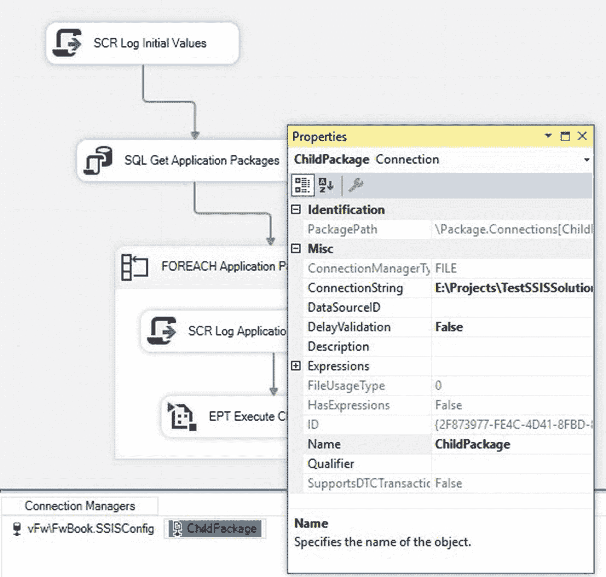
**图 6-56** 打开 `ChildPackage` 文件连接管理器的属性

单击 `Expressions` 属性，然后单击 `Expressions` 属性值区域中的省略号（`...`），如图 6-57 所示。

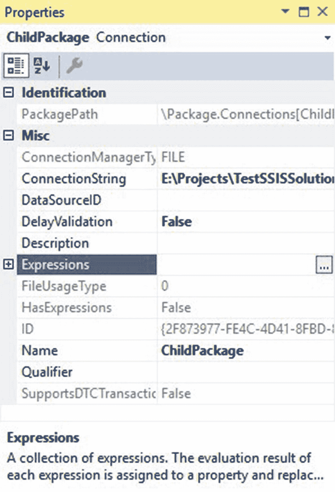
**图 6-57** 单击 `Expressions` 省略号

单击 `Expressions` 属性省略号会打开“属性表达式编辑器”，如图 6-58 所示。

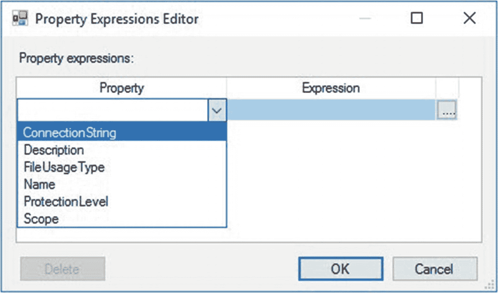
**图 6-58** 文件连接管理器属性表达式编辑器对话框属性

从“属性”下拉列表中选择 `ConnectionString` 属性，如图 6-59 所示。

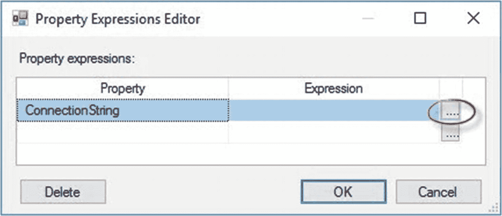
**图 6-59** 选择文件连接管理器的 `ConnectionString` 属性

单击“属性表达式编辑器”中“表达式”列中的省略号（图 6-59 中已圈出）以打开“表达式生成器”，如图 6-60 所示。

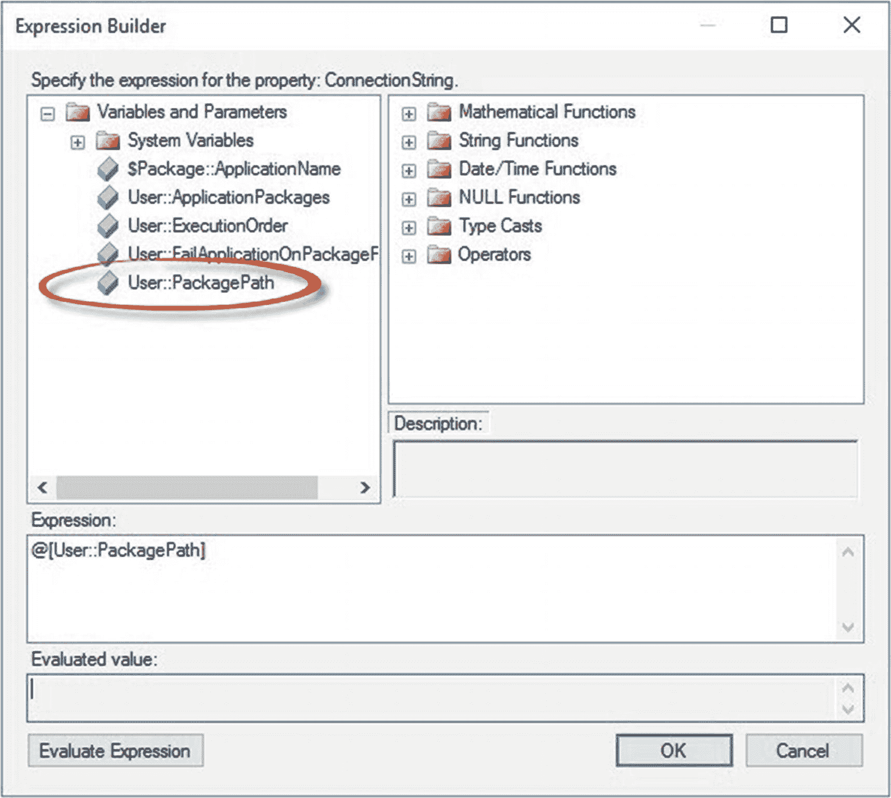
**图 6-60** 表达式生成器

在“表达式生成器”中，展开“系统变量”虚拟文件夹，单击并按住 `User::PackagePath` SSIS 变量，然后将其拖到“表达式”文本框中，如图 6-60 所示。单击“表达式生成器”的“确定”按钮返回到“属性表达式编辑器”，如图 6-61 所示。

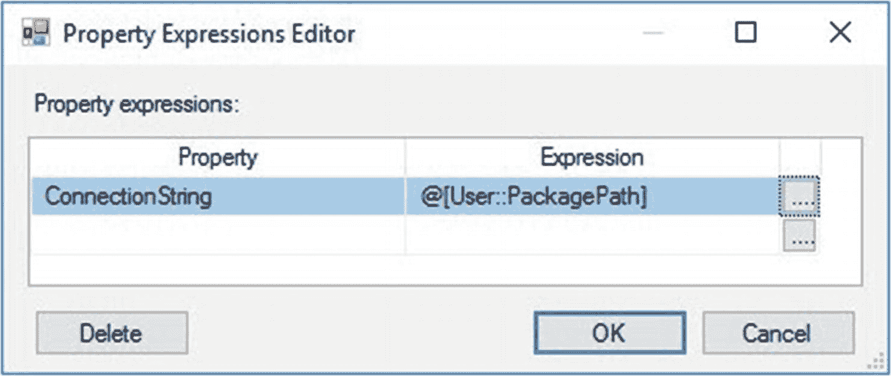
**图 6-61** 已配置 `ConnectionString` 属性的属性表达式编辑器


### Parent.dtsx 配置与测试

图 6-61 展示了 `ChildPackage` 文件连接管理器的 `ConnectionString` 属性，该属性现在是动态的，并由 `User::PackagePath` SSIS 变量的值驱动。请记住，`User::PackagePath` SSIS 变量的值是在 `FOREACH Application Package` forEach 循环容器中管理的，在该容器中，`User::PackagePath` SSIS 变量由从存储在 `SSISConfig` 数据库中的元数据查询返回的 ADO.Net 数据集中的每个 `PackagePath` 值填充。因此，一旦配置完成（点击“确定”按钮后），`Parent.dtsx` 将会执行与 SSIS 应用程序关联的每一个（已启用的）SSIS 框架应用程序包。

点击“确定”按钮关闭“属性表达式编辑器”。展开 `ChildPackage` 文件连接管理器的“表达式”属性（集合），注意 `ConnectionString` 属性现在由 `User::PackagePath` SSIS 变量的值管理。同时请注意，`ChildPackage` 文件连接管理器包含表达式，这由 `f(x)` 装饰所指示，如图 6-62 所示。

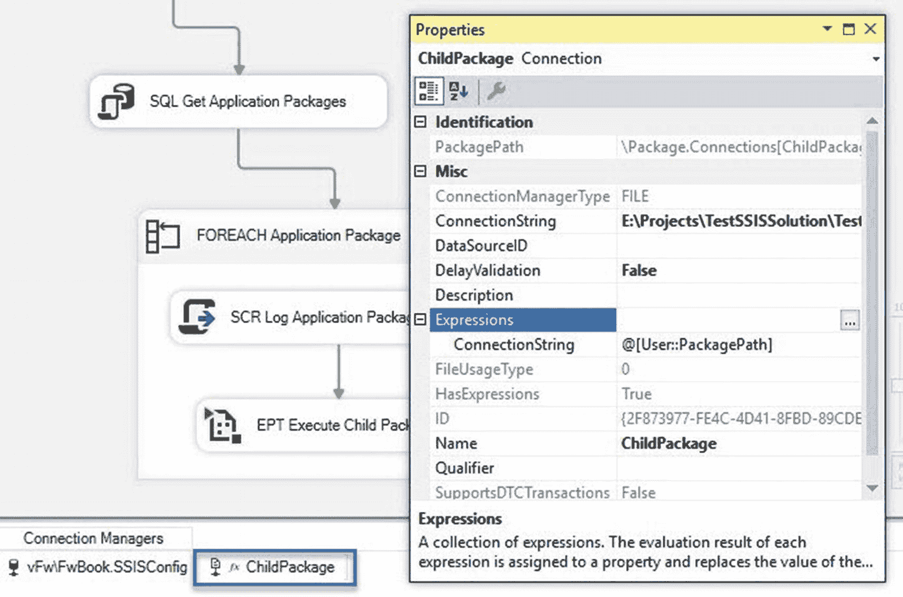
**图 6-62** ChildPackage 文件连接管理器的 ConnectionString 覆盖与表达式装饰

### 测试执行与结果

通过启动 SSIS 调试器（`F5`）来测试 `Parent.dtsx` 的操作。乍一看，结果可能显得有些混乱，如图 6-63 所示。

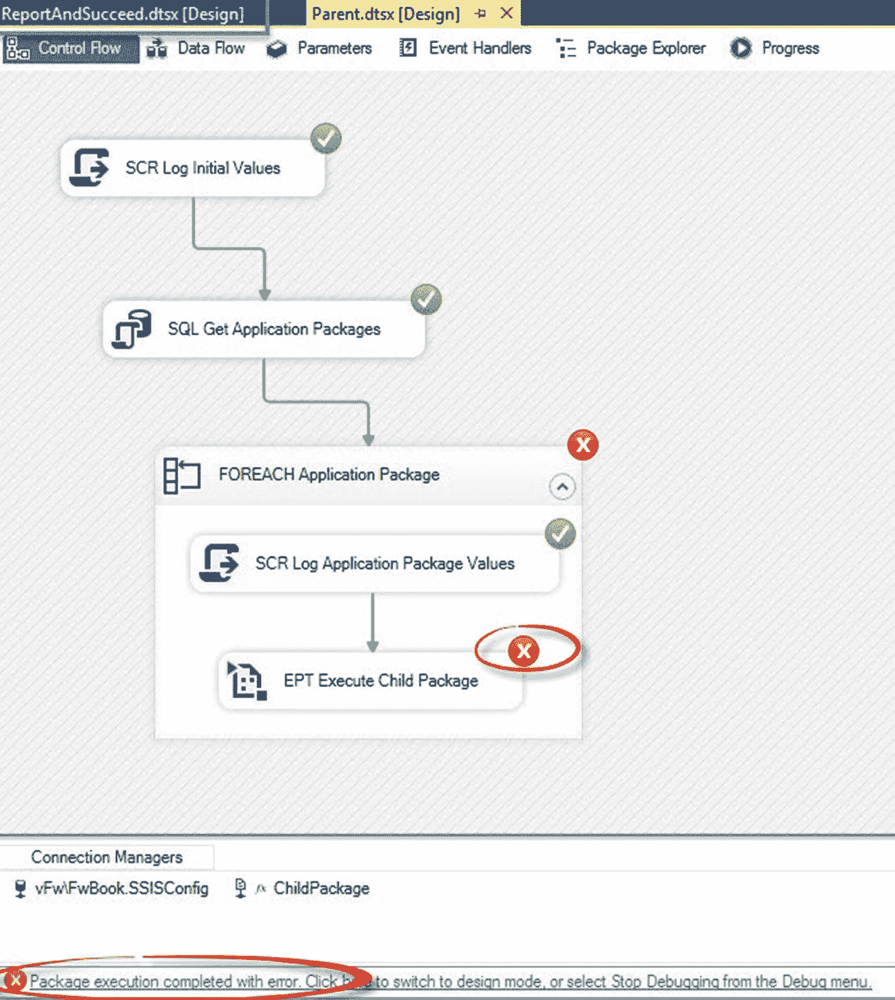
**图 6-63** 测试执行结果

注意 `Parent.dtsx` 的测试执行失败了。下方的包执行消息确认了包执行失败，`EPT Execute Child Package` 执行包任务和 `FOREACH Application Package` forEach 循环容器上的任务失败指示也证实了这一点。

发生了什么？问得好！打开 `Parent.dtsx` 包选项卡上的“进度/执行结果”选项卡，查看执行期间记录的消息，如图 6-64 所示。

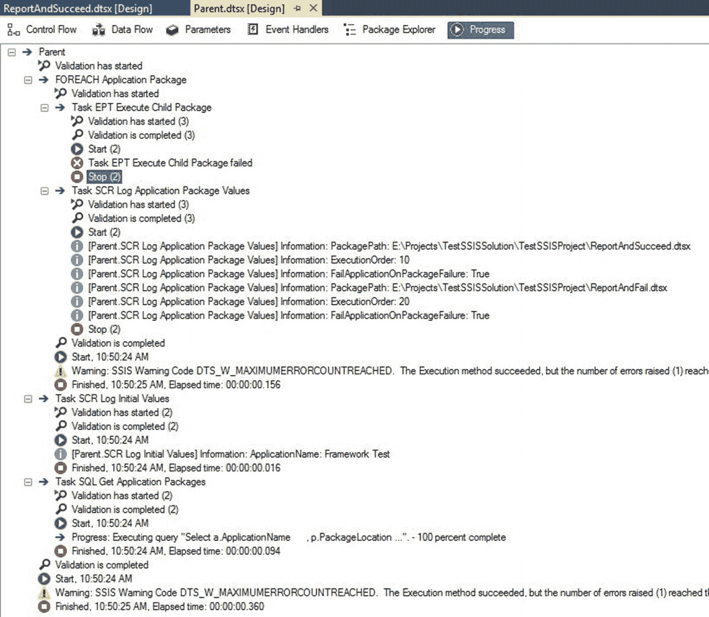
**图 6-64** 查看“进度/执行结果”选项卡

图 6-64 显示了 `Parent.dtsx` 执行失败时引发的消息。我们看到了来自 SSIS 应用程序中两个文件的元数据 – `ReportAndSucceed.dtsx` 和 `ReportAndFail.dtsx` – 由 `SCR Log Application Package Values` 脚本任务记录。缺少的是关于每个 SSIS 包执行是成功还是失败的指示。

### 记录执行结果

要开始记录执行结果，将一个新的“脚本任务”拖到 `FOREACH Application Package` forEach 循环容器中，然后将新脚本任务重命名为“`SCR Log Package Execution Success`”，如图 6-65 所示。

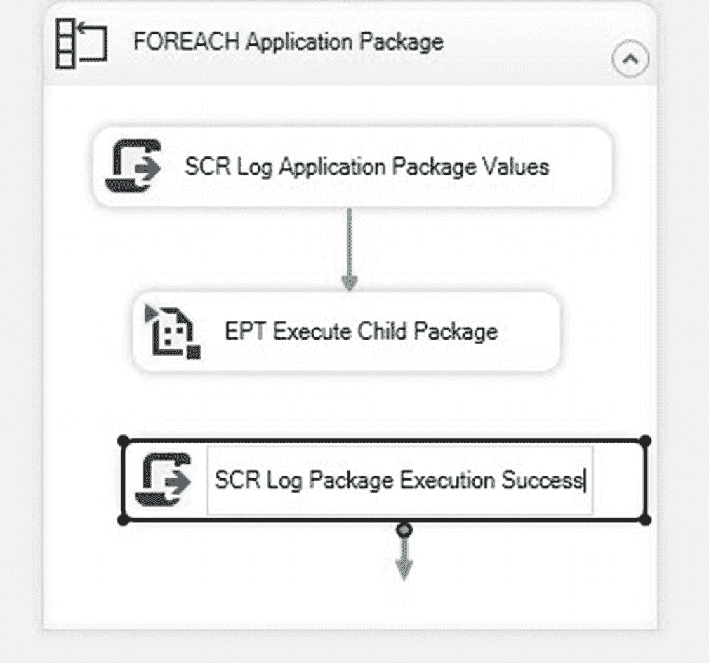
**图 6-65** 添加 SCR Log Package Execution Success 脚本任务

打开 `SCR Log Package Execution Success` 脚本任务编辑器。和之前一样，将 `System::PackageName`、`System::TaskName` 和 `User::PackagePath` SSIS 变量添加到 `ReadOnlyVariables` 属性中，如图 6-66 所示。

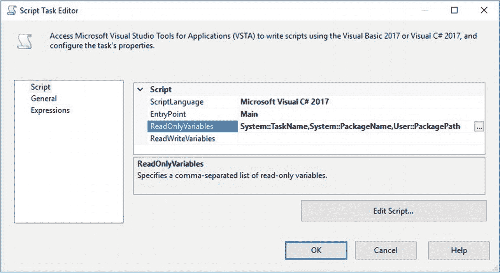
**图 6-66** 填充 ReadOnlyVariables 属性

点击“编辑脚本”按钮打开 `VstaProjects` 编辑器。将清单 6-5 中所示的 C# .Net 代码添加到 `public void Main()` 方法中，以在框架中记录 SSIS 应用程序包的成功执行。

```
public void Main()
{
// System::PackageName, System::TaskName
// User::PackagePath
string packageName = ➤ Dts.Variables["System::PackageName"].Value.ToString();
string taskName = Dts.Variables["System::TaskName"].Value.ToString();
string subComponent = packageName + "." + taskName;
int informationCode = 1001;
bool fireAgain = true;
string packagePath = Dts.Variables["User::PackagePath"].Value.ToString();
string description = packagePath + " execution succeeded";
Dts.Events.FireInformation(informationCode, subComponent, description, ➤ "", 0, ref fireAgain);
Dts.TaskResult = (int)ScriptResults.Success;
}
```
**清单 6-5** 用于记录成功的 SSIS 应用程序包执行的 C# .Net 代码

清单 6-5 中的代码引发了一个 `Information` 事件，该事件构建了一条消息，通知操作员和开发人员 SSIS 框架应用程序包执行已成功，如图 6-67 所示。

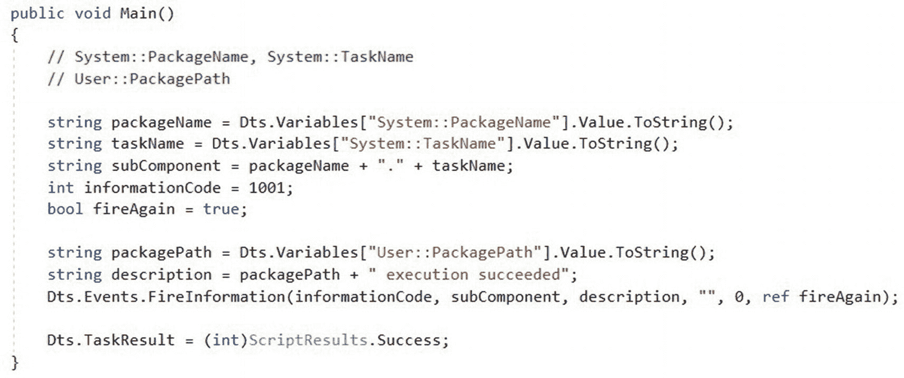
**图 6-67** 在 SSIS 框架应用程序包成功执行时引发 Information 事件

关闭 `VstaProjects` 窗口，然后点击 `SCR Log Package Execution Success` 脚本任务编辑器上的“确定”按钮。从 `EPT Execute Child Package` 执行包任务连接一个“成功”优先级约束到 `SCR Log Package Execution Success` 脚本任务，如图 6-68 所示。

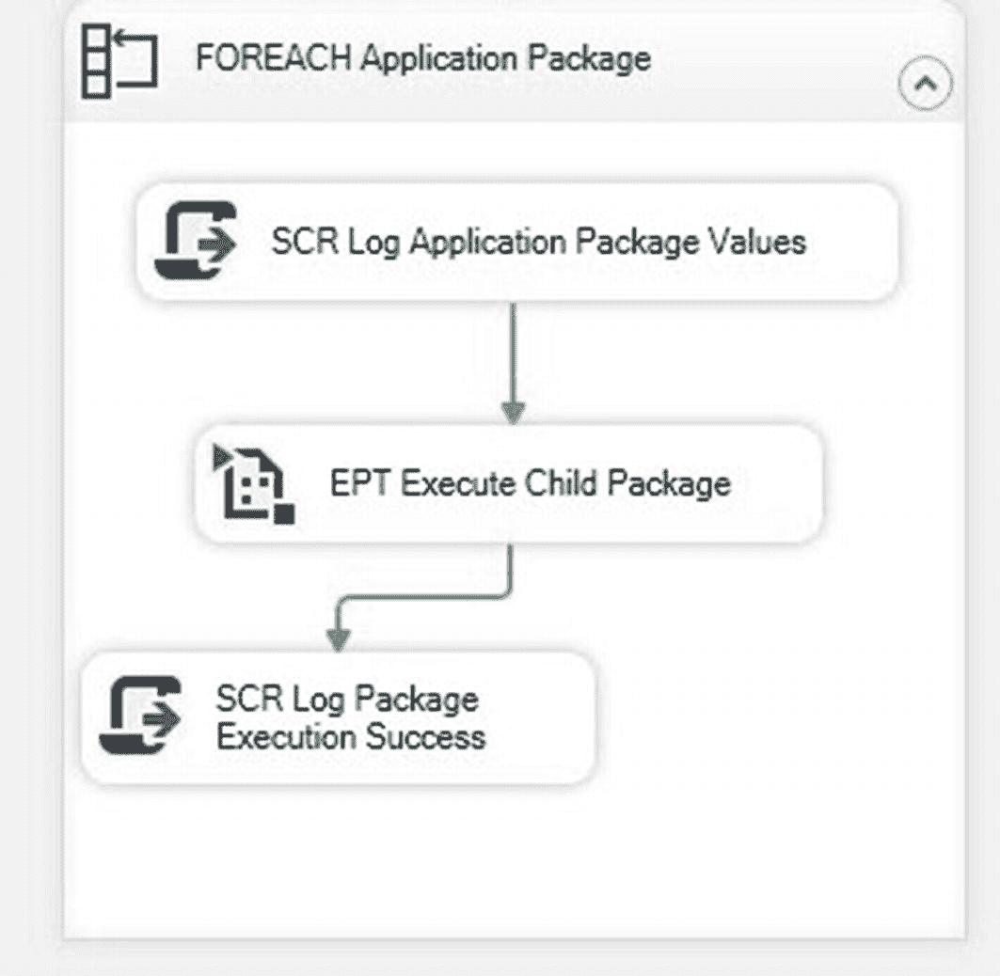
**图 6-68** 已配置的 SCR Log Package Execution Success

将另一个“脚本任务”拖到 `FOREACH Application Package` forEach 循环容器中，并将该脚本任务重命名为“`SCR Log Package Execution Failure`”，然后从 `EPT Execute Child Package` 执行包任务连接一个“失败”优先级约束（红色箭头）到 `SCR Log Package Execution Failure` 脚本任务，如图 6-69 所示。

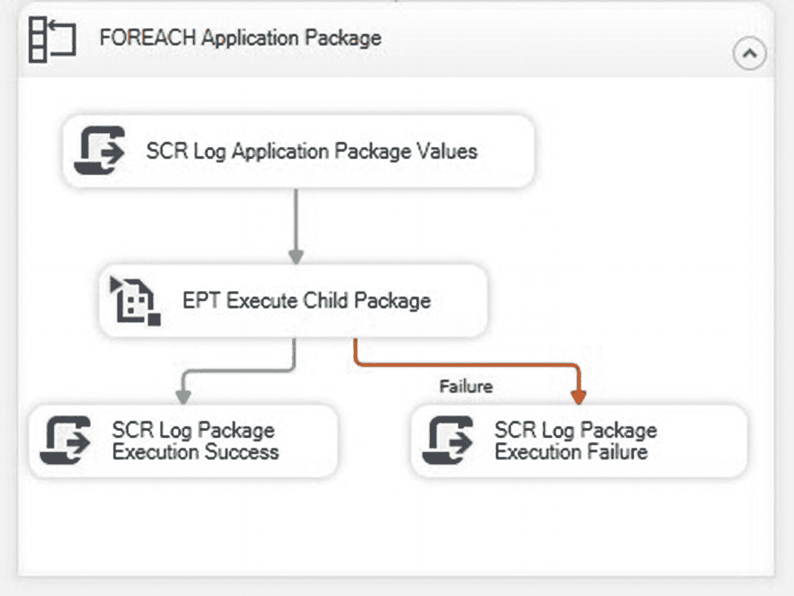
**图 6-69** 添加 SCR Log Package Execution Failure 脚本任务

将以下 SSIS 变量添加到 `SCR Log Package Execution Failure` 脚本任务的 `ReadOnlyVariables` 列表中：

*   `System::PackageName`
*   `System::TaskName`
*   `User::PackagePath`
*   `User::FailApplicationOnPackageFailure`

添加后，`SCR Log Package Execution Failure` 脚本任务的 `ReadOnlyVariables` 属性应如图 6-70 所示。

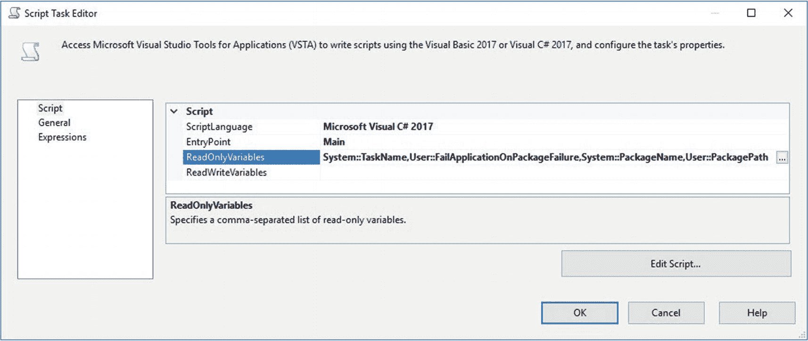
**图 6-70**


#### 查看 SCR Log Package Execution Failure 脚本任务的 ReadOnlyVariables 属性

单击 Edit Script 按钮，并将清单 6-6 中所示的 C# .Net 代码添加到 `public void Main()` 方法中。

```csharp
public void Main()
{
// System::PackageName, System::TaskName
// User::FailApplicationOnPackageFailure, User::PackagePath
string packageName = ➤ Dts.Variables["System::PackageName"].Value.ToString();
string taskName = Dts.Variables["System::TaskName"].Value.ToString();
string subComponent = packageName + "." + taskName;
int informationCode = 1001;
int errorCode = -999;
bool fireAgain = true;
bool failApplicationOnPackageFailure = ➤ Convert.ToBoolean(Dts.Variables["User::FailApplicationOnPackageFailure"] ➤
.Value);
string packagePath = Dts.Variables["User::PackagePath"].Value.ToString();
string description = String.Empty;
if(failApplicationOnPackageFailure)
{
description = packagePath + " execution failed and ➤ FailApplicationOnPackageFailure is set (true)";
Dts.Events.FireError(errorCode, subComponent, description, "", 0);
}
else
{
description = packagePath + " execution failed and ➤ FailApplicationOnPackageFailure is NOT set (false)";
Dts.Events.FireInformation(informationCode, subComponent, ➤ description, "", 0, ref fireAgain);
}
Dts.TaskResult = (int)ScriptResults.Success;
}
```
清单 6-6
用于记录应用程序包执行失败的 C# .Net 代码

用于响应 SSIS 框架应用程序包失败的 C# .Net 代码应类似于图 6-71 所示。

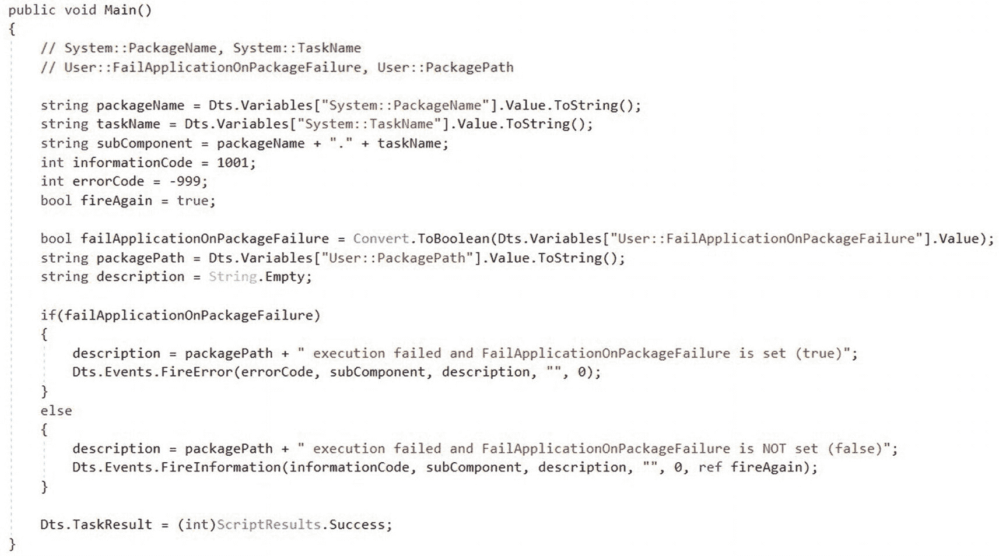
图 6-71
用于记录应用程序包执行失败的 C# .Net 代码

关闭 VstaProjects 窗口，并在 SCR Log Package Execution Failure 脚本任务编辑器上单击 OK 按钮。

我们来测试一下！一次测试执行（仍然）导致此 Parent.dtsx SSIS 包执行失败，如图 6-72 所示。

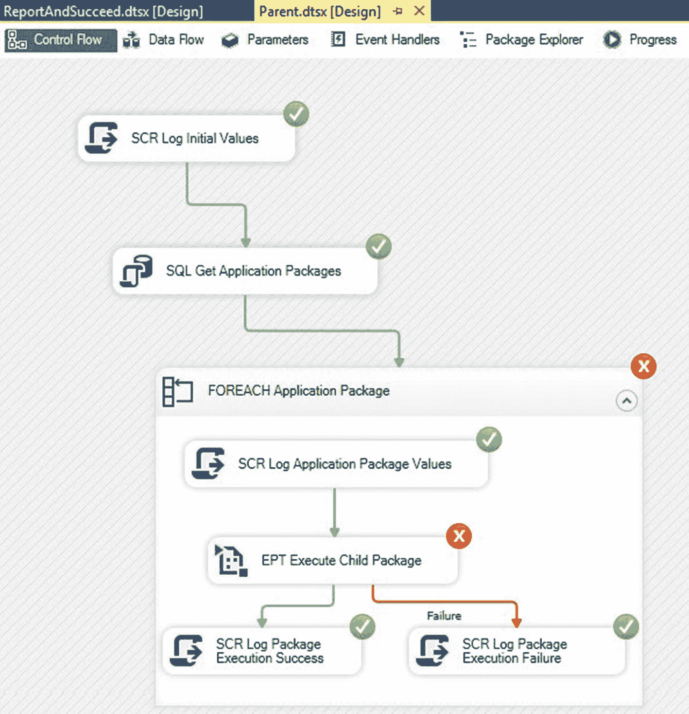
图 6-72
Parent.dtsx 执行失败（再次）

但这次，与之前的执行不同，在 Parent.dtsx 中插桩的信息事件揭示了哪些成功了、哪些失败了，如图 6-73 所示。

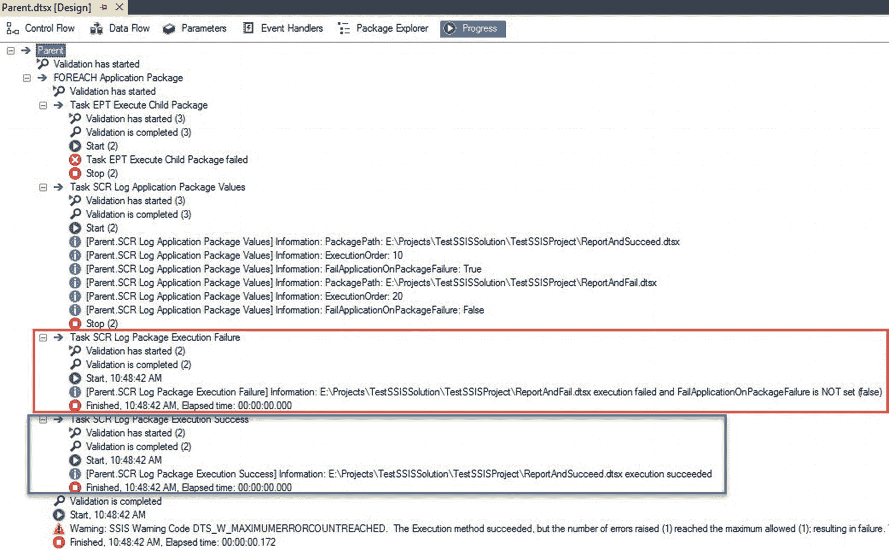
图 6-73
查看应用程序包执行结果

插桩是好的。相信我。但如果消息没有被持久化，插桩几乎就没什么用。我能听到你在想：“安迪，我们可以在哪里捕获这些插桩消息呢？”我很高兴你提出了这个极好的问题。答案是：“当然是在 SSISConfig 里！”

### 结论

本章重点在于为基于文件的 SSIS 框架构建执行引擎。在本章中，我们构建了 Parent.dtsx SSIS 包并添加了插桩。

下一步是将插桩消息记录到 SSISConfig 数据库中，这将在下一章中介绍。

## 7. 框架日志记录

在我们构建一个简单的、自定义的、基于文件的 SSIS 框架的旅程中，我们已经构建了一个元数据库（名为 SSISDB）、一个测试 SSIS 项目、加载了一些示例元数据（用于测试 SSIS 项目）、创建了执行引擎（Parent.dtsx）并添加了插桩。

本章涵盖如何将执行引擎中生成的插桩消息持久化到 SSISConfig 数据库。

### 创建日志模式

由执行 Parent.dtsx 生成并显示在 Progress/Execution Results 选项卡上的信息消息非常有用，尤其是在故障排除时。我们如何存储这些消息以供将来访问——特别是当“发生不好的事情”时？

返回到你最喜欢的 T-SQL 开发编辑器（本章剩余部分我将切换到 Azure Data Studio 版本 1.17.1），并连接到托管 SSISConfig 数据库的 SQL Server 实例。使用清单 7-1 中的 T-SQL 在 SSISConfig 数据库中创建一个名为 "log" 的新模式。

```sql
Use [SSISConfig]
go
print 'Log schema'
If Not Exists(Select [schemas].[name]
From [sys].[schemas]
Where [schemas].[name] = N'log')
begin
print ' - Create log schema'
declare @sql nvarchar(100) = N'Create Schema log'
exec(@sql)
print ' - Log schema created'
end
Else
begin
print ' - Log schema already exists.'
end
print ''
go
```
清单 7-1
创建 SSISConfig.log 模式

消息在 Azure Data Studio 中看起来略有不同，如图 7-1 所示。

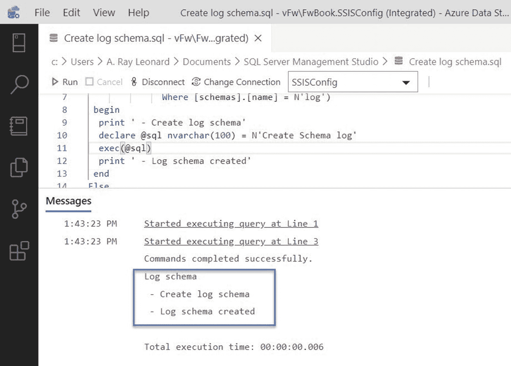
图 7-1
查看创建日志模式时的消息

我们期望在 SQL Server Management Studio (SSMS) 中看到的消息在图 7-1 的“方框”中突出显示。

在添加一个表来捕获日志模式中的“应用程序包执行实例”之前，先添加一个表来捕获日志模式中的“应用程序执行实例”。第一个新表名为 log.ApplicationInstance，构建此表的 T-SQL 代码见清单 7-2。

```sql
use [SSISConfig]
go
print 'Log.ApplicationInstance table'
If Not Exists(Select [schemas].[name]
+ '.' + [tables].[name] As [Schema.Table]
From [sys].[tables]
Join [sys].[schemas]
On [schemas].[schema_id] = [tables].[schema_id]
Where [schemas].[name] = N'log'
And [tables].[name] = N'ApplicationInstance')
begin
print ' - Create log.ApplicationInstance table'
Create Table [log].[ApplicationInstance]
(
ApplicationInstanceId int identity(1, 1)
Constraint PK_log_ApplicationInstance Primary Key Clustered
, ApplicationId int Not NULL
Constraint FK_log_ApplicationInstance_config_Applications
Foreign Key References [config].Applications
, ApplicationStartTime datetimeoffset(7) Not NULL
Constraint DF_log_ApplicationInstance_ApplicationStartTime
Default(sysdatetimeoffset())
, ApplicationEndTime datetimeoffset(7) NULL
, ApplicationStatus nvarchar(25) Not NULL
Constraint DF_log_ApplicationInstance_ApplicationStatus
Default(N'Running')
)
print ' - Log.ApplicationInstance table created'
end
Else
begin
print ' - Log.ApplicationInstance table already exists.'
end
print ''
go
```
清单 7-2
在 SSISConfig 数据库中创建 log.ApplicationInstance 表

当清单 7-2 中的 T-SQL 在 Azure Data Factory 中执行时，会显示图 7-2 中所示的消息。

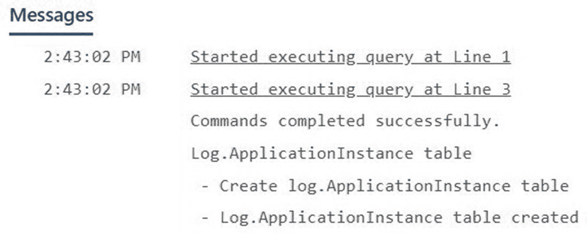
图 7-2
Log.ApplicationInstance 表创建消息

当 SSIS 框架应用程序在 Parent.dtsx 包中开始执行时，一条新记录将被插入到 log.ApplicationInstance 表中。当 SSIS 框架应用程序完成执行时，该记录将被更新。但是等等，还有更多！

第二个新表名为 log.ApplicationPackageInstance，构建此表的 T-SQL 代码见清单 7-3。


```
use [SSISConfig]
go
print 'Log.ApplicationPackageInstance 表'
If Not Exists(Select [schemas].[name]
+ '.' + [tables].[name] As [Schema.Table]
From [sys].[tables]
Join [sys].[schemas]
On [schemas].[schema_id] = [tables].[schema_id]
Where [schemas].[name] = N'log'
And [tables].[name] = N'ApplicationPackageInstance')
begin
print ' - 创建 log.ApplicationPackageInstance 表'
Create Table [log].[ApplicationPackageInstance]
(
ApplicationPackageInstanceId int identity(1, 1)
Constraint PK_log_ApplicationPackageInstance Primary Key Clustered
, ApplicationInstanceId int Not NULL
Constraint FK_log_ApplicationPackageInstance_log_ApplicationInstance
Foreign Key References [log].ApplicationInstance
, ApplicationPackageId int Not NULL
Constraint FK_log_ApplicationPackageInstance_config_ApplicationPackages
Foreign Key References [config].ApplicationPackages
, ApplicationPackageStartTime datetimeoffset(7) Not NULL
Constraint DF_log_ApplicationPackageInstance_ApplicationPackageStartTime
Default(sysdatetimeoffset())
, ApplicationPackageEndTime datetimeoffset(7) NULL
, ApplicationPackageStatus nvarchar(25) Not NULL
Constraint DF_log_ApplicationPackageInstance_ApplicationPackageStatus
Default(N'Running')
)
print ' - Log.ApplicationPackageInstance 表已创建'
end
Else
begin
print ' - Log.ApplicationPackageInstance 表已存在。'
end
print ''
go
清单 7-3
在 SSISConfig 数据库中创建 log.ApplicationPackageInstance 表
```

当在 Azure Data Factory 中执行 `清单 7-3` 中的 T-SQL 时，将显示 `图 7-3` 所示的消息。

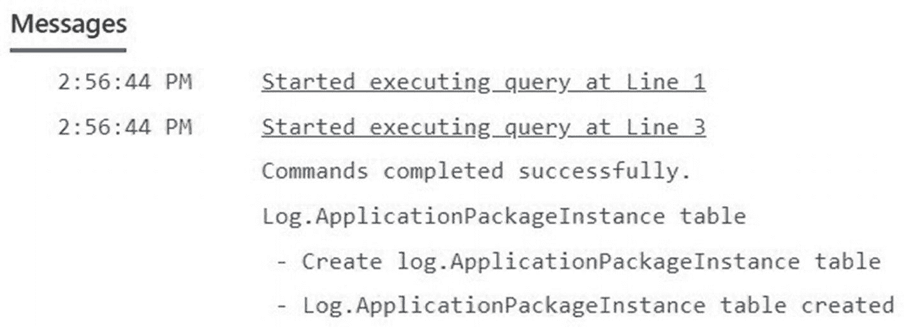

`图 7-3` Log.ApplicationPackageInstance 表创建消息

当 SSIS 框架应用程序包在 `Parent.dtsx` 包的 FOREACH Application Package 循环容器中开始在 EPT 执行应用程序包中执行时，一条新记录将被插入到 `log.ApplicationPackageInstance` 表中。当 SSIS 框架应用程序完成执行时，该记录将被更新。

“EPT”前缀代表“执行包任务”。SSIS 中的命名约定很重要，因为事件模型不包含标识“可执行类型”的字段。您可以在 `ssis.tips/pages/naming.html` 找到一个 SSIS 命名约定。

### 向 Parent.dtsx 添加应用程序实例日志记录

返回到 `Parent.dtsx` SSIS 包。将一个新的执行 SQL 任务拖到控制流上。删除 SCR 日志初始值脚本任务和 SQL 获取应用程序包执行 SQL 任务之间的优先级约束。连接新的优先级约束 – 第一个在 SCR 日志初始值脚本任务和新的执行 SQL 任务之间，第二个在新的执行 SQL 任务和 SQL 获取应用程序包执行 SQL 任务之间。将新的执行 SQL 任务重命名为“SQL 日志应用程序实例开始”，如 `图 7-4` 所示。

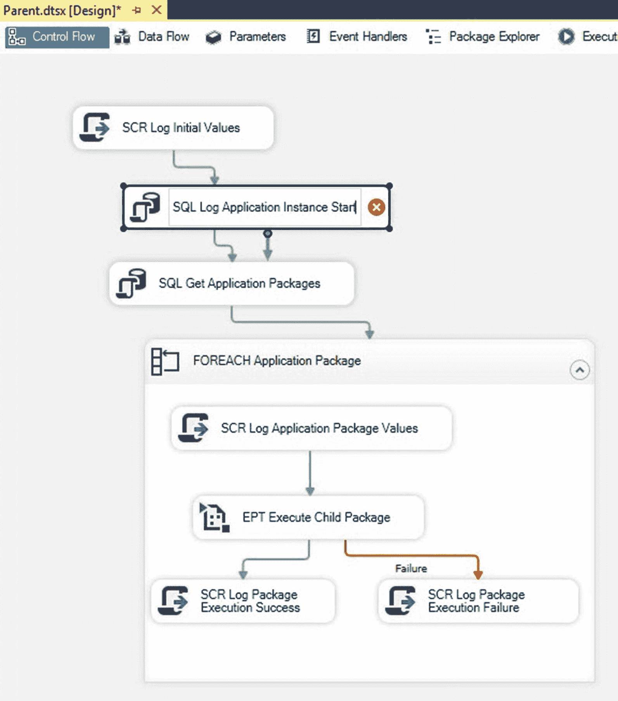

`图 7-4` 添加 SQL 日志应用程序实例开始执行 SQL 任务

打开 SQL 日志应用程序实例开始执行 SQL 任务编辑器，并将 `ConnectionType` 属性设置为 `ADO.NET`。将 `Connection` 属性设置为指向 `SSISConfig` 数据库的 ADO.Net 连接管理器（我已将我的连接管理器重命名为“SSISConfig”）。将 `ResultSet` 属性设置为“单行”，如 `图 7-5` 所示。

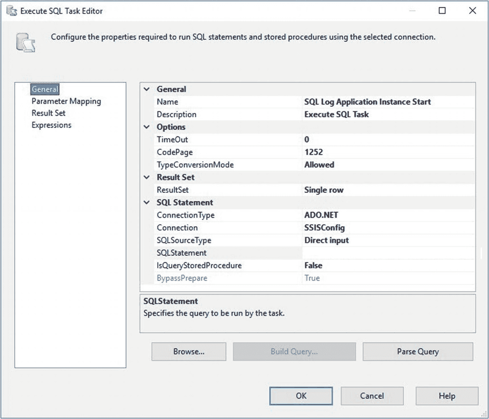

`图 7-5` 配置 SQL 日志应用程序实例开始执行 SQL 任务的 ResultSet、ConnectionType 和 Connection 属性

点击 `SQLStatement` 属性中的省略号，并将 `清单 7-4` 中的 T-SQL 粘贴到“输入 SQL 查询”对话框中。

```
declare @ApplicationId int = (Select ApplicationId
From config.Applications
Where ApplicationName = @ApplicationName)
Insert Into [log].ApplicationInstance (ApplicationId)
Output inserted.ApplicationInstanceId
Values (@ApplicationId)
清单 7-4
向 [log].[ApplicationInstance] 表插入一行
```

“输入 SQL 查询”对话框应如 `图 7-6` 所示。

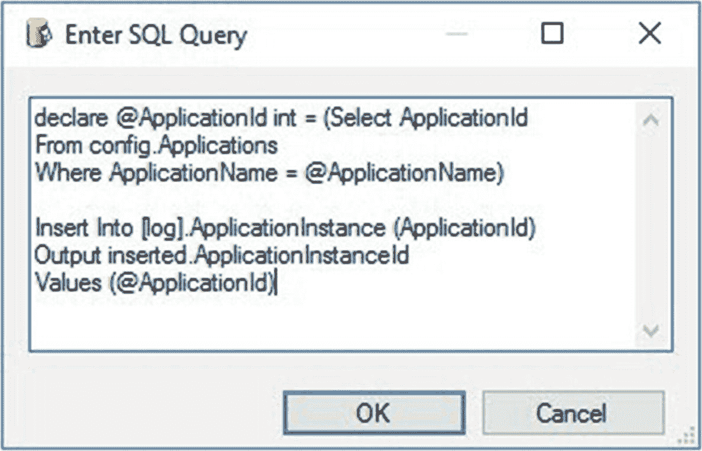

`图 7-6` 向 [log].[ApplicationInstance] 表插入一行

点击确定按钮关闭“输入 SQL 查询”对话框。

点击“参数映射”页面，并将参数 `$Package::ApplicationName` 映射到 `SQLStatement` 属性中的 `ApplicationName` 参数，如 `图 7-7` 所示。

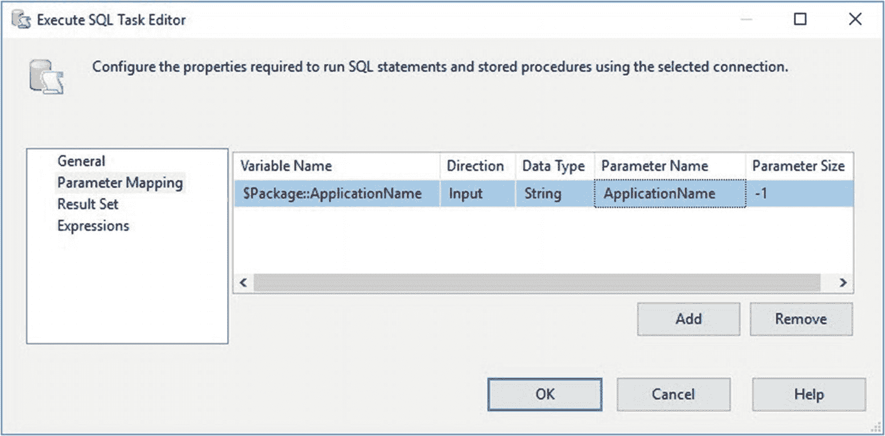

`图 7-7` 将 $Package::ApplicationName 映射到 ApplicationName 查询参数

点击“结果集”页面，然后点击“添加”按钮。将结果名称设置为“0”，并从“变量名称”下拉菜单中选择“<新建变量…>”，如 `图 7-8` 所示。

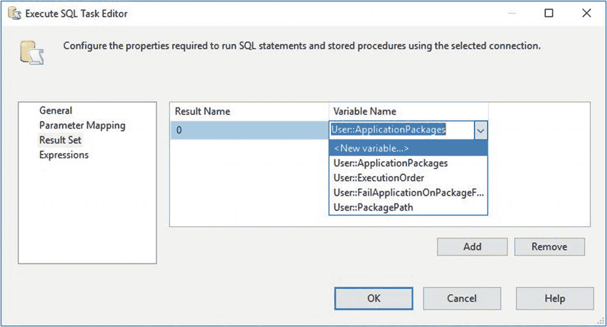

`图 7-8` 为单行结果集创建新的 SSIS 变量

当“添加变量”对话框显示时，配置新的 SSIS 变量属性如 `图 7-9` 所示：

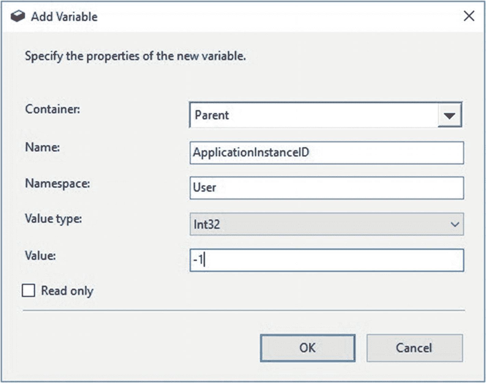

`图 7-9` 配置 User::ApplicationInstanceID SSIS 变量

*   容器：Parent
*   名称：`ApplicationInstanceID`
*   命名空间：User
*   值类型：`Int32`
*   值：`-1`

点击确定按钮关闭执行 SQL 任务编辑器。`Parent.dtsx` 控制流现在应如 `图 7-10` 所示。

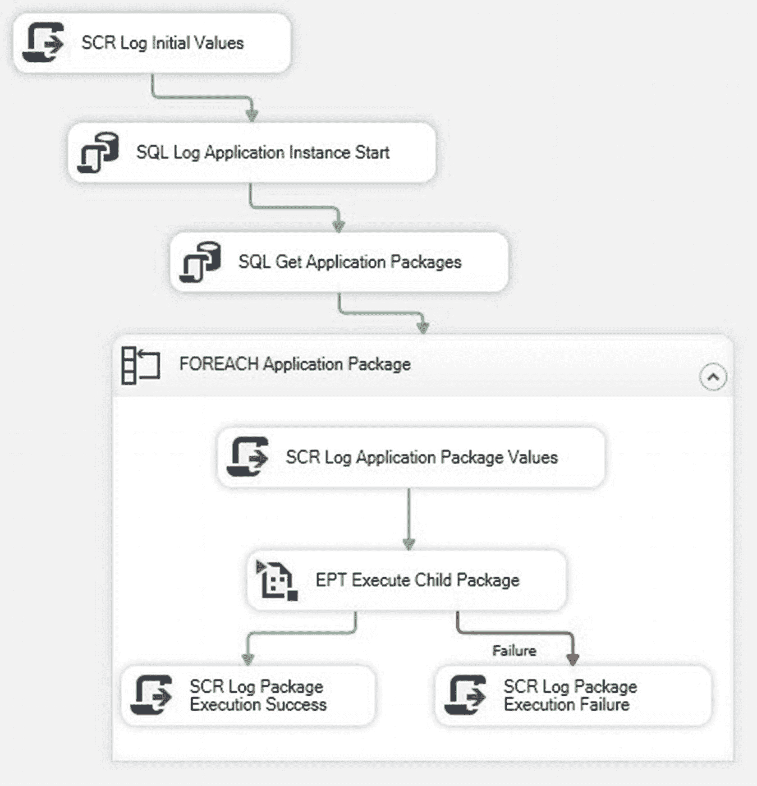

`图 7-10` 已配置的 SQL 日志应用程序实例开始执行 SQL 任务


### 配置 Execute SQL Task 记录应用程序实例状态

### 在控制流中添加成功日志任务

将 Execute SQL Task 拖放到 `Parent.dtsx` 控制流中 `FOREACH Application Package` foreach 循环容器的下方，并将该 Execute SQL Task 重命名为 "SQL Log Application Instance Success"，如图 7-11 所示。

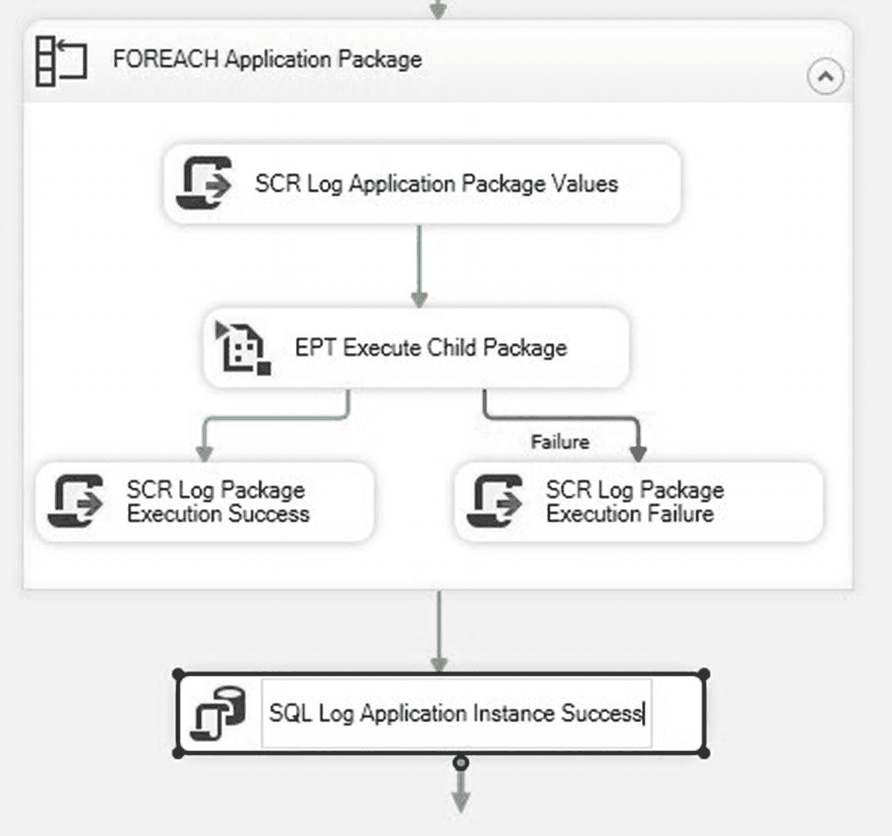

**图 7-11** 添加 SQL Log Application Instance Success Execute SQL Task

#### 配置成功日志任务

打开 SQL Log Application Instance Success Execute SQL Task 编辑器。将 `ConnectionType` 属性更改为 `ADO.NET`，并选择 `SSISConfig` 连接。点击 `SQLStatement` 属性旁边的省略号。当“输入 SQL 查询”对话框显示时，输入如清单 7-5 所示的 T-SQL。

```sql
Update [log].ApplicationInstance
Set ApplicationEndTime = sysdatetimeoffset()
, ApplicationStatus = 'Succeeded'
Where ApplicationInstanceId = @ApplicationInstanceId
```

**清单 7-5** 当 SSIS 应用程序成功时更新 `[log].[ApplicationInstance]` 表的 T-SQL

“输入 SQL 查询”对话框应如图 7-12 所示。

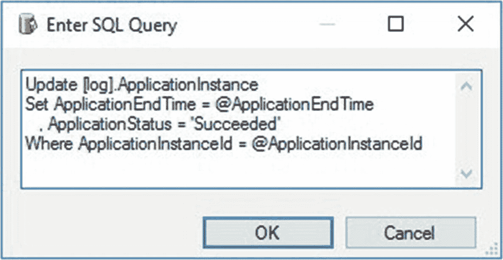

**图 7-12** 添加用于更新 `[log].[ApplicationInstance]` 表的 T-SQL

点击“确定”按钮关闭“输入 SQL 查询”对话框。

点击“参数映射”页面，然后点击“添加”按钮。将变量名 `User::ApplicationInstanceID` 映射到参数名 `ApplicationInstanceId`，如图 7-13 所示。

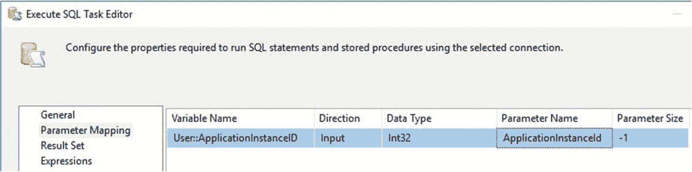

**图 7-13** 将 `User:ApplicationInstanceID` 变量映射到 `ApplicationInstanceId` 参数

点击“确定”按钮关闭 Execute SQL Task 编器。

现在，SQL Log Application Instance Success Execute SQL Task 已配置为更新 `[log].[ApplicationInstance]` 表中的行，该行是在 `Parent.dtsx` SSIS 包中早先执行 SQL Log Application Instance Start Execute SQL Task 时插入的。它将更新该行的 `ApplicationEndTime` 和 `ApplicationStatus` 字段，以指示 SSIS 框架应用程序实例在某个时间成功完成。

### 在事件处理器中添加失败日志任务

下一步是在 SSIS 框架应用程序实例*失败*时更新 `[log].[ApplicationInstance]` 中行的 `ApplicationEndTime` 和 `ApplicationStatus` 字段。

点击 `Parent.dtsx` SSIS 包中的“事件处理器”选项卡，如图 7-14 所示。

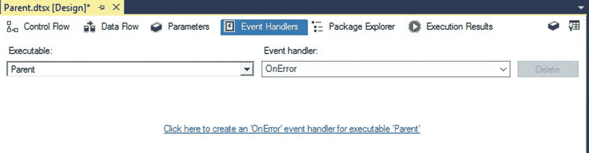

**图 7-14** `Parent.dtsx` OnError 事件处理器

如果 `Executable` 未设置为 `Parent`，请点击 `Executable` 下拉列表，并选择 `Parent`，如图 7-15 所示。

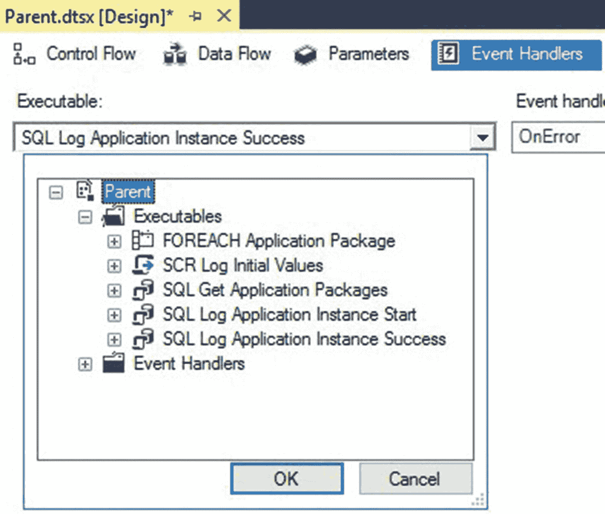

**图 7-15** 选择 `Parent` 可执行文件

点击 OnError 事件处理器中标记为“Click here to create an 'OnError' event handler for the executable 'Parent'.”的链接。将 Execute SQL Task 拖放到事件处理器界面，并将其重命名为 "SQL Log Application Instance Failure"，如图 7-16 所示。

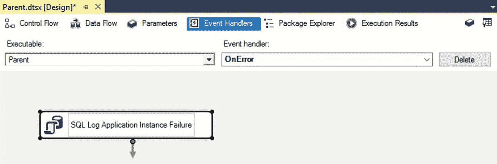

**图 7-16** 将 SQL Log Application Instance Failure Execute SQL Task 添加到 Parent OnError 事件处理器

#### 配置失败日志任务

将 `ConnectionType` 属性设置为 `ADO.NET`，并选择 `SSISConfig` 连接，如图 7-17 所示。

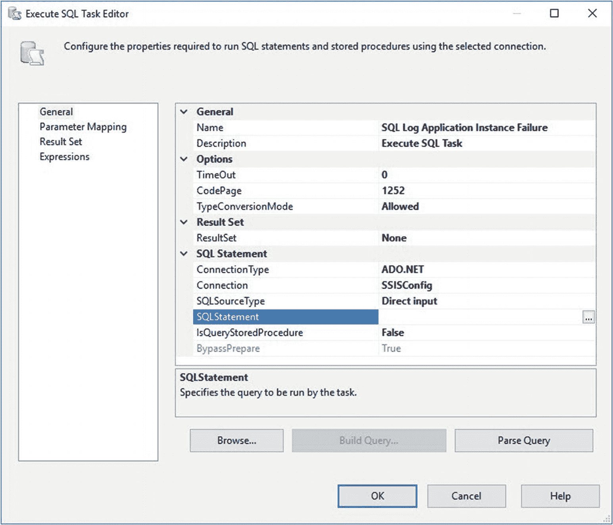

**图 7-17** 配置 `ConnectionType` 和 `Connection` 属性

点击 `SQLStatement` 属性中的省略号以打开“输入 SQL 查询”对话框，并输入如清单 7-6 所示的 T-SQL，以便在 SSIS 应用程序实例失败时更新 `[log].[ApplicationInstance]` 行。

```sql
Update [log].ApplicationInstance
Set ApplicationEndTime = sysdatetimeoffset()
, ApplicationStatus = 'Failed'
Where ApplicationInstanceId = @ApplicationInstanceId
```

**清单 7-6** 当 SSIS 应用程序失败时更新 `[log].[ApplicationInstance]` 的 T-SQL

“输入 SQL 查询”对话框应如图 7-18 所示。

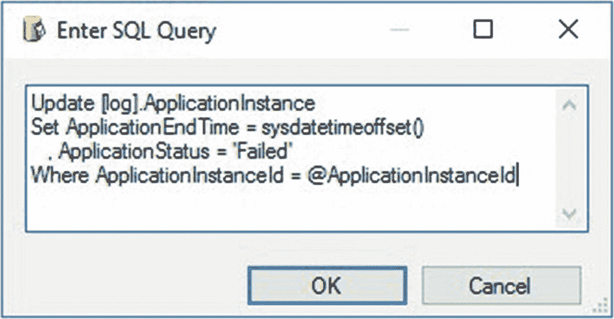

**图 7-18** 更新 `[log].[ApplicationInstance]` 行

点击“确定”按钮关闭“输入 SQL 查询”对话框。

点击“参数映射”页面，然后点击“添加”按钮。将变量名 `User::ApplicationInstanceID` 映射到参数名 `ApplicationInstanceId`，如图 7-19 所示。

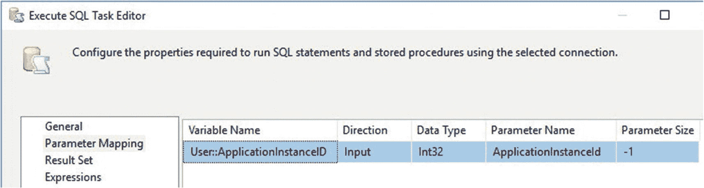

**图 7-19** 将 `User:ApplicationInstanceID` 变量映射到 `ApplicationInstanceId` 参数

点击“确定”按钮关闭 Execute SQL Task 编辑器。

现在，SQL Log Application Instance Failure Execute SQL Task 已配置为更新 `[log].[ApplicationInstance]` 表中的行，该行是在 `Parent.dtsx` SSIS 包的控制流中早先执行 SQL Log Application Instance Start Execute SQL Task 时插入的。它将更新该行的 `ApplicationEndTime` 和 `ApplicationStatus` 字段，以指示 SSIS 框架应用程序实例执行在某个时间失败。


### 向 Parent.dtsx 添加应用程序包实例日志记录

将一个新的 `执行 SQL 任务` 拖入 `Foreach Application Package` Foreach 循环容器中。删除 `SCR Log Application Package Values` 脚本任务和 `EPT Execute Child Package` 执行包任务之间的优先约束。连接新的优先约束——第一条连接 `SCR Log Application Package Values` 脚本任务和新的执行 SQL 任务，第二条连接新的 `执行 SQL 任务` 和 `EPT Execute Child Package` 执行包任务。将新的 `执行 SQL 任务` 重命名为 "`SQL Log Application Package Instance Start`"，如图 7-20 所示。

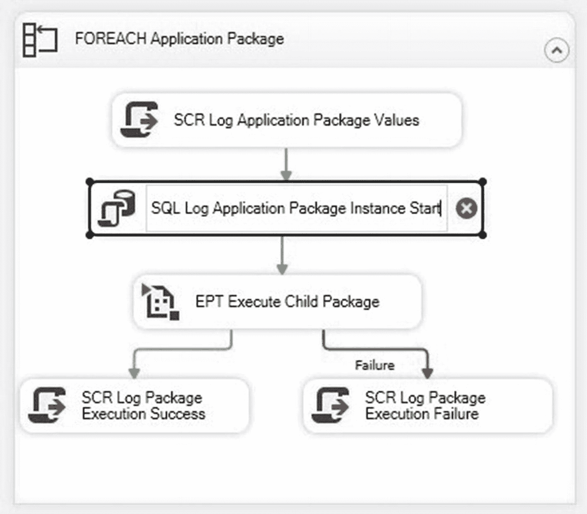

图 7-20

添加 `SQL Log Application Package Instance Start` 执行 SQL 任务

打开 `SQL Log Application Package Instance Start` 执行 SQL 任务编辑器，将 `ConnectionType` 属性设置为 `ADO.NET`。将 `Connection` 属性设置为 `SSISConfig` ADO.NET 连接管理器。将 `ResultSet` 属性设置为 "`单行`"，如图 7-21 所示。

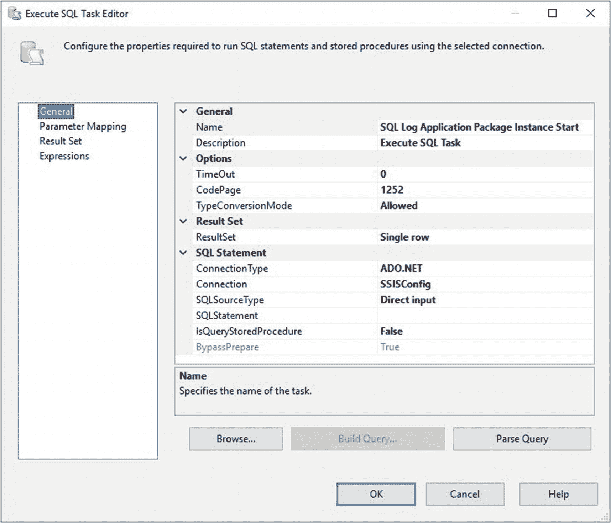

图 7-21

配置 `SQL Log Application Package Instance Start` 执行 SQL 任务的 `ResultSet`、`ConnectionType` 和 `Connection` 属性

点击 `SQLStatement` 属性中的省略号，将清单 7-7 中的 T-SQL 粘贴到 `输入 SQL 查询` 对话框中。

```sql
declare @ApplicationPackageId int = (
Select ap.ApplicationPackageId
From config.ApplicationPackages ap
Join config.Applications a
On a.ApplicationId = ap.ApplicationId
Join config.Packages p
On p.PackageId = ap.PackageId
Where ApplicationName = @ApplicationName
And p.PackageLocation + p.PackageName = @PackagePath
)
Insert Into [log].ApplicationPackageInstance
(ApplicationInstanceId, ApplicationPackageId)
Output inserted.ApplicationPackageInstanceId
Values (@ApplicationInstanceId, @ApplicationPackageId)
```

清单 7-7
向 `[log].[ApplicationPackageInstance]` 表插入一行

`输入 SQL 查询` 对话框应如图 7-22 所示。

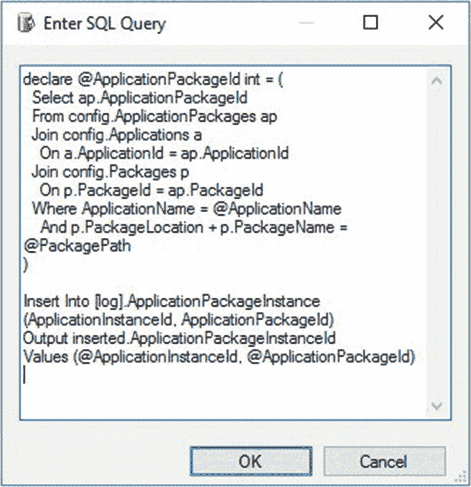

图 7-22

向 `[log].[ApplicationPackageInstance]` 表插入一行

点击确定按钮关闭 `输入 SQL 查询` 对话框。

点击 `参数映射` 选项卡，并映射以下参数（变量名、数据类型、参数名）：

*   `$Package::ApplicationName`，String，`ApplicationName`
*   `User::PackagePath`，String，`PackagePath`
*   `User::ApplicationInstanceID`，Int32，`ApplicationInstanceId`

完成后，`参数映射` 选项卡将如图 7-23 所示。

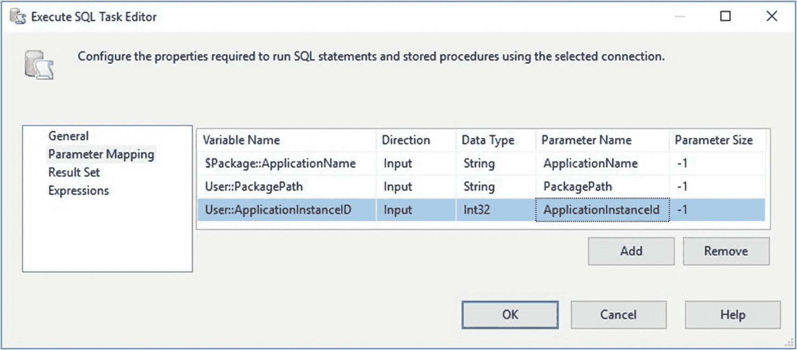

图 7-23

映射 `ApplicationPackageInstance` 参数

点击 `结果集` 选项卡，然后点击添加按钮。将 `结果名称` 设置为 "`0`"，并从 `变量名` 下拉列表中选择 "`<新变量...>`"，如图 7-24 所示。

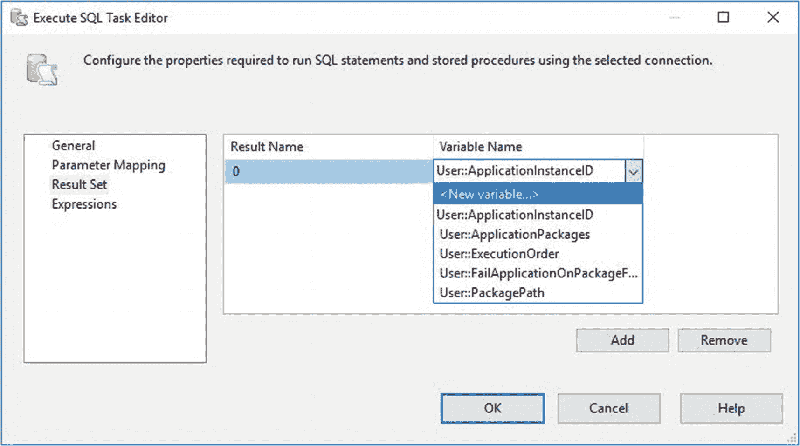

图 7-24

为单行结果集创建新的 SSIS 变量

当 `添加变量` 对话框显示时，按图 7-25 所示配置新的 SSIS 变量属性。

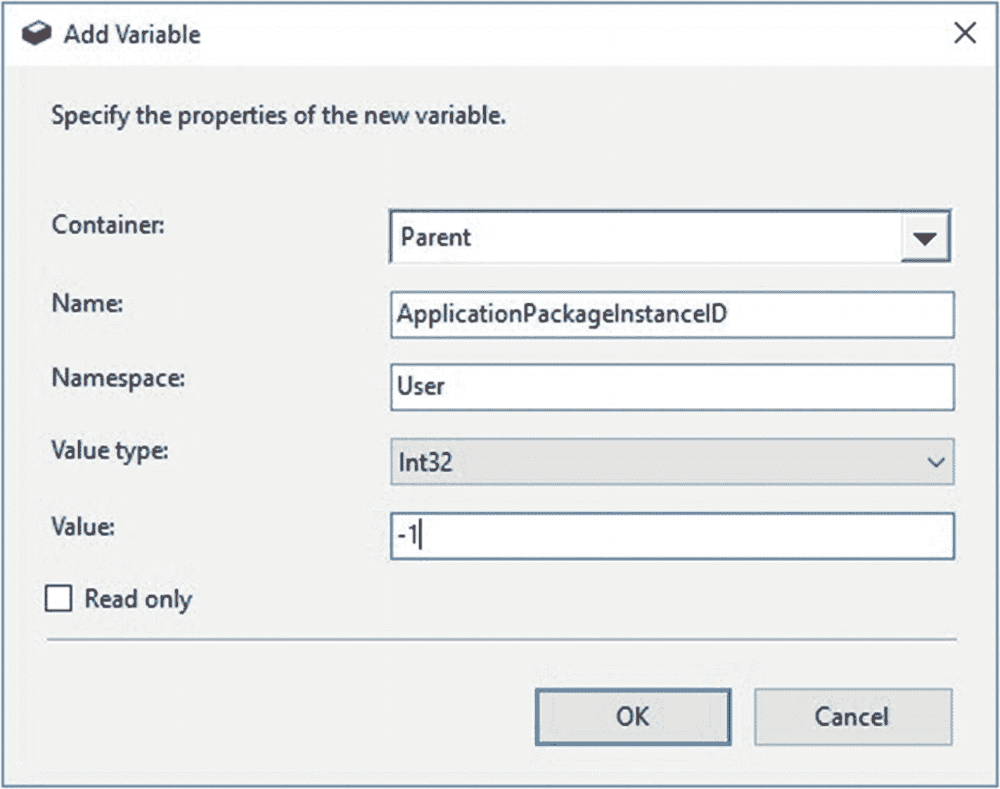

图 7-25

配置 `User::ApplicationPackageInstanceID` SSIS 变量

*   容器：`Parent`
*   名称：`ApplicationPackageInstanceID`
*   命名空间：`User`
*   值类型：`Int32`
*   值：`-1`

点击确定按钮关闭 `执行 SQL 任务编辑器`。`Foreach Application Package` Foreach 循环容器现在应如图 7-26 所示。

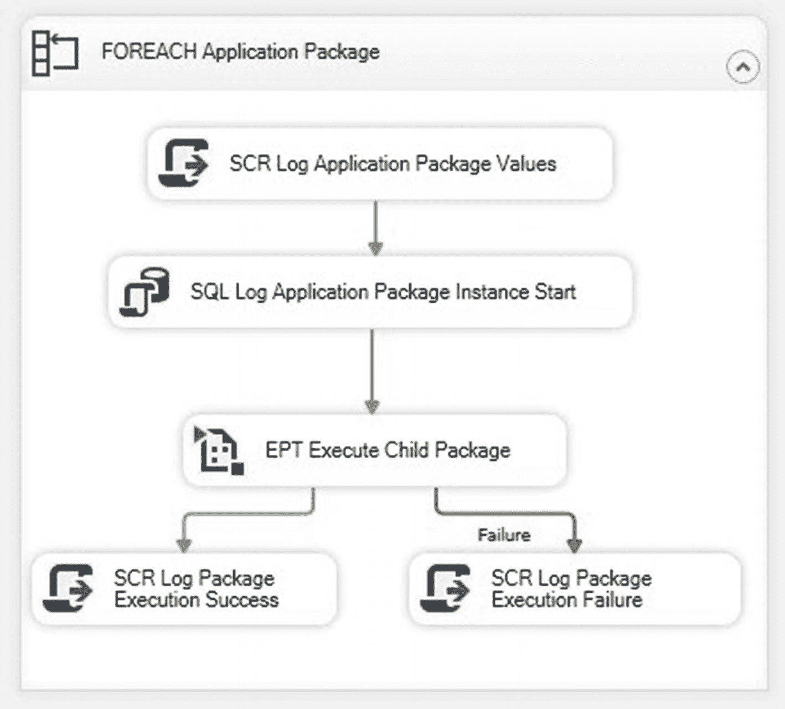

图 7-26

已配置的 `SQL Log Application Package Instance Start` 执行 SQL 任务

将一个 `执行 SQL 任务` 拖到 `Parent.dtsx` 控制流上，位于 `Foreach Application Package` Foreach 循环容器中 `SCR Log Package Execution Success` 脚本任务的下方。将 `执行 SQL 任务` 重命名为 "`SQL Log Application Package Instance Success`"，如图 7-27 所示。

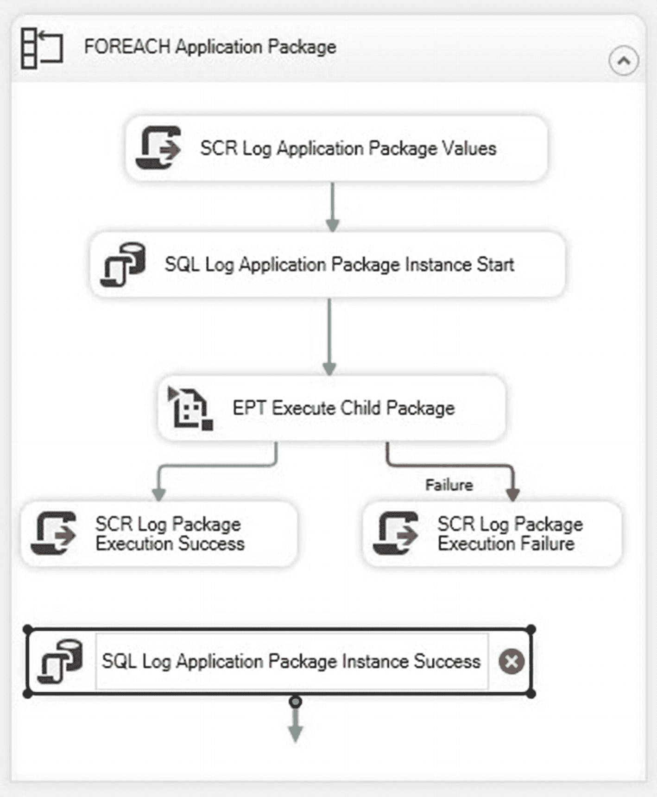

图 7-27

添加 `SQL Log Application Package Instance Success` 执行 SQL 任务

连接一条从 `SCR Log Package Execution Success` 脚本任务到 `SQL Log Application Package Instance Success` 执行 SQL 任务的优先约束。打开 `SQL Log Application Package Instance Success` 执行 SQL 任务编辑器。将 `ConnectionType` 属性更改为 `ADO.NET`，并选择 `SSISConfig` 连接。点击 `SQLStatement` 属性中的省略号。当 `输入 SQL 查询` 对话框显示时，输入清单 7-8 中所示的 T-SQL。

```sql
Update [log].ApplicationPackageInstance
Set ApplicationPackageEndTime = sysdatetimeoffset()
, ApplicationPackageStatus = 'Succeeded'
Where ApplicationPackageInstanceId = @ApplicationPackageInstanceId
```

清单 7-8
当 SSIS 应用程序包成功时更新 `[log].[ApplicationPackageInstance]` 表的 T-SQL

`输入 SQL 查询` 对话框应如图 7-28 所示。

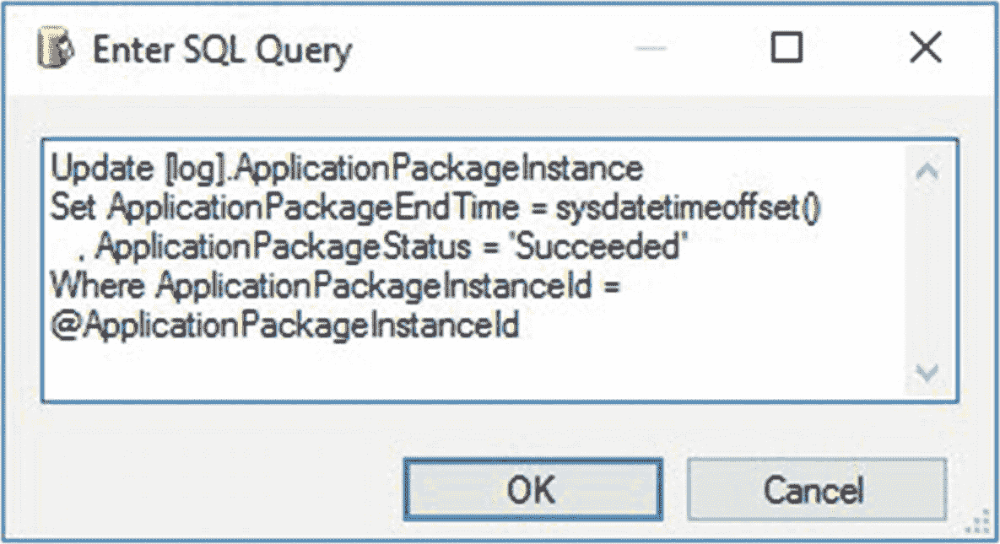

图 7-28

添加用于更新 `[log].[ApplicationPackageInstance]` 表的 T-SQL

点击确定按钮关闭 `输入 SQL 查询` 对话框。

点击 `参数映射` 选项卡，然后点击添加按钮。将变量名 "`User::ApplicationPackageInstanceID`" 映射到参数名 "`ApplicationPackageInstanceId`"，如图 7-29 所示。

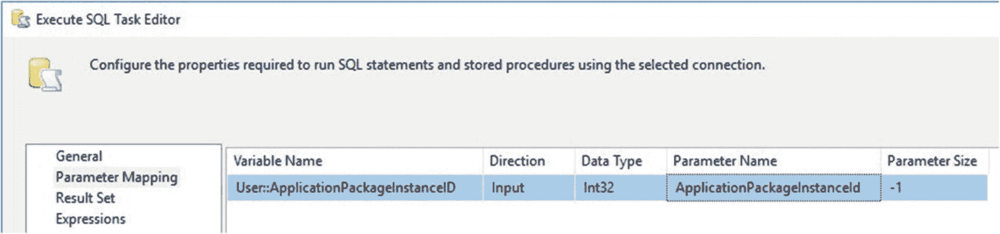

图 7-29

将 `User:ApplicationPackageInstanceID` 变量映射到 `ApplicationPackageInstanceId` 参数

点击确定按钮关闭 `执行 SQL 任务编辑器`。

现在，`SQL Log Application Package Instance Success` 执行 SQL 任务已配置为更新 `[log].[ApplicationPackageInstance]` 表中的行，该行是在之前 `Foreach Application Package` Foreach 循环容器中执行 `SQL Log Application Package Instance Start` 执行 SQL 任务时插入的，更新该行的 `ApplicationPackageEndTime` 和 `ApplicationPackageStatus` 字段以指示 SSIS 框架应用程序包实例已在某某时间成功完成。

下一步是当 SSIS 框架应用程序包实例*失败*时，更新 `[log].[ApplicationPackageInstance]` 中行的 `ApplicationPackageEndTime` 和 `ApplicationPackageStatus` 字段。

将一个 `执行 SQL 任务` 拖到 `Parent.dtsx` 控制流上，位于 `Foreach Application Package` Foreach 循环容器中 `SCR Log Package Execution Failure` 脚本任务的下方。将 `执行 SQL 任务` 重命名为 "`SQL Log Application Package Instance Failure`"，如图 7-30 所示。

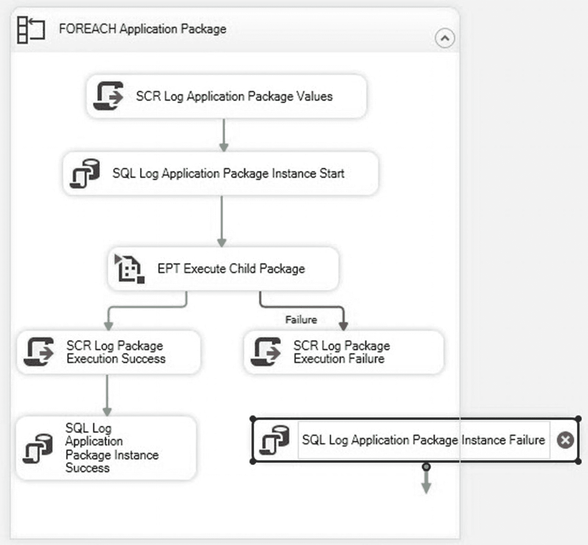

图 7-30

添加 `SQL Log Application Package Instance Failure` 执行 SQL 任务


从 `SCR Log Package Execution Failure` 脚本任务到 `SQL Log Application Package Instance Failure` 执行 SQL 任务之间，连接一个**优先级约束**。打开 `SQL Log Application Package Instance Failure` 执行 SQL 任务编辑器。将 `ConnectionType` 属性更改为 `ADO.NET`，并选择 `SSISConfig` 连接。点击 `SQLStatement` 属性旁边的省略号。当“输入 SQL 查询”对话框显示时，输入如清单 7-9 所示的 T-SQL。

```sql
Update [log].ApplicationPackageInstance
Set ApplicationPackageEndTime = sysdatetimeoffset()
, ApplicationPackageStatus = 'Failed'
Where ApplicationPackageInstanceId = @ApplicationPackageInstanceId
-- 清单 7-9
-- 当 SSIS 应用程序包失败时用于更新 [log].[ApplicationPackageInstance] 的 T-SQL
```

“输入 SQL 查询”对话框应如图 7-31 所示。

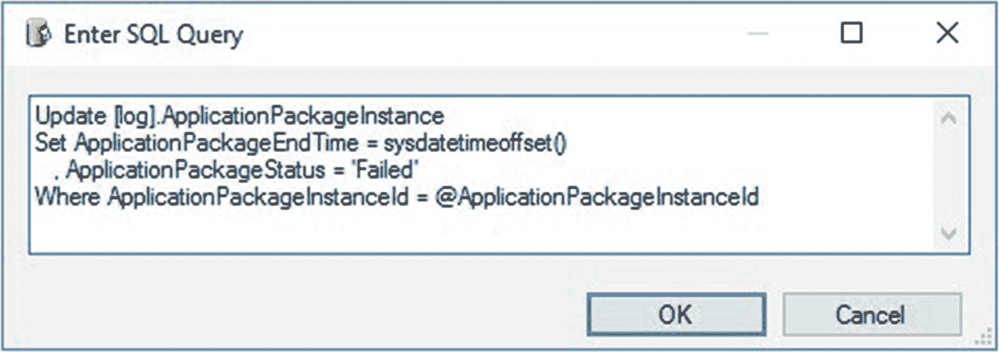

图 7-31 更新 `[log].[ApplicationPackageInstance]` 行

点击“确定”按钮关闭“输入 SQL 查询”对话框。

点击“参数映射”页面，然后点击“添加”按钮。将变量名 `"User::ApplicationPackageInstanceID"` 映射到参数名 `"ApplicationPackageInstanceId"`，如图 7-32 所示。

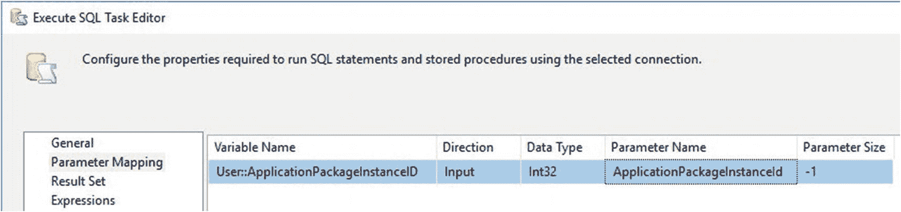

图 7-32 将 `User:ApplicationPackageInstanceID` 变量映射到 `ApplicationPackageInstanceId` 参数

点击“确定”按钮关闭“执行 SQL 任务编辑器”。

现在，`SQL Log Application Package Instance Failure` 执行 SQL 任务已被配置为更新 `[log].[ApplicationPackageInstance]` 表中的行，该行是在 `FOREACH Application Package` 循环容器中早前执行的 `SQL Log Application Package Instance Start` 执行 SQL 任务时插入的，更新该行的 `ApplicationPackageEndTime` 和 `ApplicationPackageStatus` 字段以指示 SSIS 框架应用程序包实例在某个时间执行失败。

`Parent.dtsx` SSIS 包的 `FOREACH Application Package` 循环容器应如图 7-33 所示。

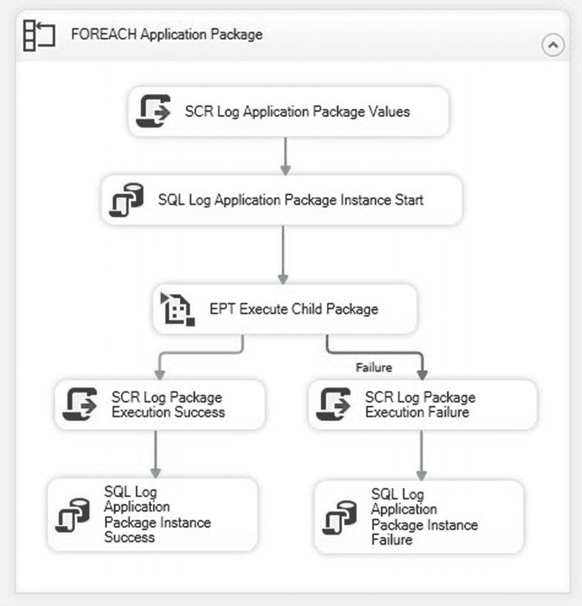

图 7-33 配置为捕获 SSIS 框架应用程序包检测的 `FOREACH Application Package` 循环容器

让我们测试一下！在调试器中启动 `Parent.dtsx` SSIS 包（按 `F5` 键）。按照当前配置，SSIS 框架应用程序应执行并失败，如图 7-34 所示。

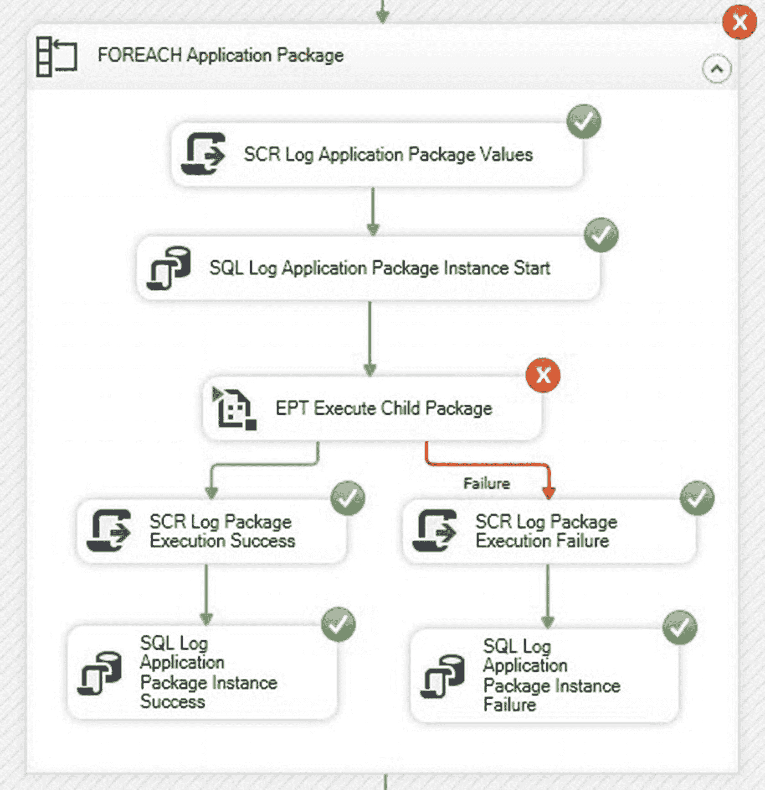

图 7-34 查看 `FOREACH Application Package` 循环容器的执行

图 7-34 中显示的 `EPT Execute Child Package` 执行包任务指示失败。两个非常重要的问题是：

1.  执行测试成功了吗？
2.  测试执行成功了吗？

两个问题的答案都存在于日志表中。

### 查看执行报告数据

SSIS 框架日志记录存储在名为 `[log].[ApplicationInstance]` 和 `[log].[ApplicationPackageInstance]` 的两个表中。`[log].[ApplicationInstance]` 表中的每一行都包含关于单次 SSIS 框架应用程序执行或应用程序执行的一个*实例*的数据。使用清单 7-10 所示的 T-SQL 查询查看应用程序实例数据。

```sql
Select a.ApplicationName
, ai.ApplicationStartTime
, DateDiff(ms, ai.ApplicationStartTime, ai.ApplicationEndTime) As ApplicationRunMilliSeconds
, ai.ApplicationStatus
From [SSISConfig].[log].[ApplicationInstance] ai
Join [SSISConfig].[config].[Applications] a
On a.ApplicationId = ai.ApplicationId
Order By ai.ApplicationStartTime Desc
-- 清单 7-10
-- 查看应用程序实例日志数据
```

应用程序实例查询的结果将类似于图 7-35 所示。

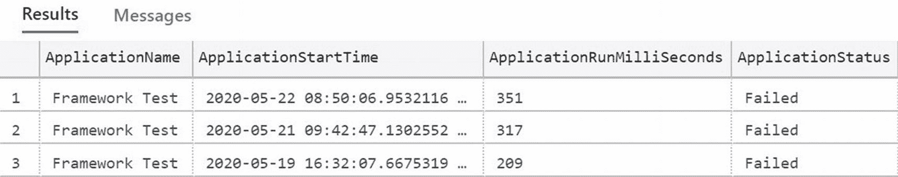

图 7-35 查看应用程序实例结果

回答我们的第一个问题——“执行测试成功了吗？”——SSIS 应用程序查询的结果表明记录了三次测试应用程序实例执行，这意味着“是的，执行测试成功了三次。”

接下来检查应用程序包实例数据。执行清单 7-11 中所示的 T-SQL 以查看应用程序包实例数据。

```sql
Select a.ApplicationName
, p.PackageName
, api.ApplicationPackageStartTime
, ai.ApplicationStatus
, api.ApplicationPackageStatus
, api.ApplicationPackageStartTime
, ap.FailApplicationOnPackageFailure
, DateDiff(ms, api.ApplicationPackageStartTime, ➤ api.ApplicationPackageEndTime) As ApplicationPackageRunMilliSeconds
, ai.ApplicationStartTime
, DateDiff(ms, ai.ApplicationStartTime, ai.ApplicationEndTime) As ➤ ApplicationRunMilliSeconds
From [SSISConfig].[log].[ApplicationPackageInstance] api
Join [SSISConfig].[log].[ApplicationInstance] ai
On ai.ApplicationInstanceId = api.ApplicationInstanceId
Join [SSISConfig].[config].[ApplicationPackages] ap
On ap.ApplicationPackageId = api.ApplicationPackageId
Join [SSISConfig].[config].[Applications] a
On a.ApplicationId = ap.ApplicationId
Join [SSISConfig].[config].[Packages] p
On p.PackageId = ap.PackageId
Order By api.ApplicationPackageStartTime Desc
-- 清单 7-11
-- 查看应用程序包实例日志数据
```

应用程序包实例查询的结果将类似于图 7-36 所示。

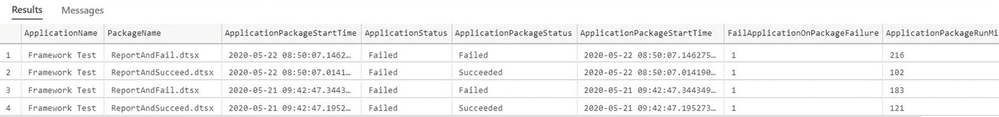

图 7-36 查看应用程序包实例结果

回答我们的第二个问题——“测试执行成功了吗？”——SSIS 应用程序包查询的结果表明两次测试应用程序实例执行已失败，并且 `ReportAndFail.dtsx` 应用程序包的每次测试执行都失败了，这意味着“是的，测试执行成功了两次。” 等等。为什么两次失败被认为是成功？两次失败被认为是成功，因为 `ReportAndFail.dtsx` 应用程序包设计为失败，并且 `FailApplicationOnPackageFailure` 位被设置为 `true` (`1`)。

使用清单 7-12 中的 T-SQL 将 `ReportAndFail.dtsx` 应用程序包的 `FailApplicationOnPackageFailure` 位设置为 `False` (`0`) 来测试这个断言。


```sql
Select p.PackageName
, ap.FailApplicationOnPackageFailure
From [SSISConfig].[config].[ApplicationPackages] ap
Join [SSISConfig].[config].[Packages] p
On p.PackageId = ap.PackageId
Where p.PackageName = N'ReportAndFail.dtsx'

Update ap
Set ap.FailApplicationOnPackageFailure = 0
From [SSISConfig].[config].[ApplicationPackages] ap
Join [SSISConfig].[config].[Packages] p
On p.PackageId = ap.PackageId
Where p.PackageName = N'ReportAndFail.dtsx'

Select p.PackageName
, ap.FailApplicationOnPackageFailure
From [SSISConfig].[config].[ApplicationPackages] ap
Join [SSISConfig].[config].[Packages] p
On p.PackageId = ap.PackageId
Where p.PackageName = N'ReportAndFail.dtsx'
```

代码清单 7-12 为 `ReportAndFail.dtsx` 重置 `FailApplicationOnPackageFailure` 位

请注意，`Select` 语句在 `Update` 语句执行前后展示了 `FailApplicationOnPackageFailure` 位值。努力在 T-SQL 语句中传达意图；“命令已成功完成”的反馈*远远不够*。

应用程序包更新的结果将类似于图 7-37 所示。

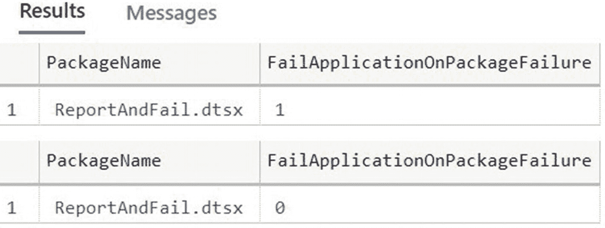

图 7-37 查看应用程序包更新结果

在 SSIS 调试器中执行 `Parent.dtsx` 显示 SSIS 执行结果*没有变化*，如图 7-38 所示。

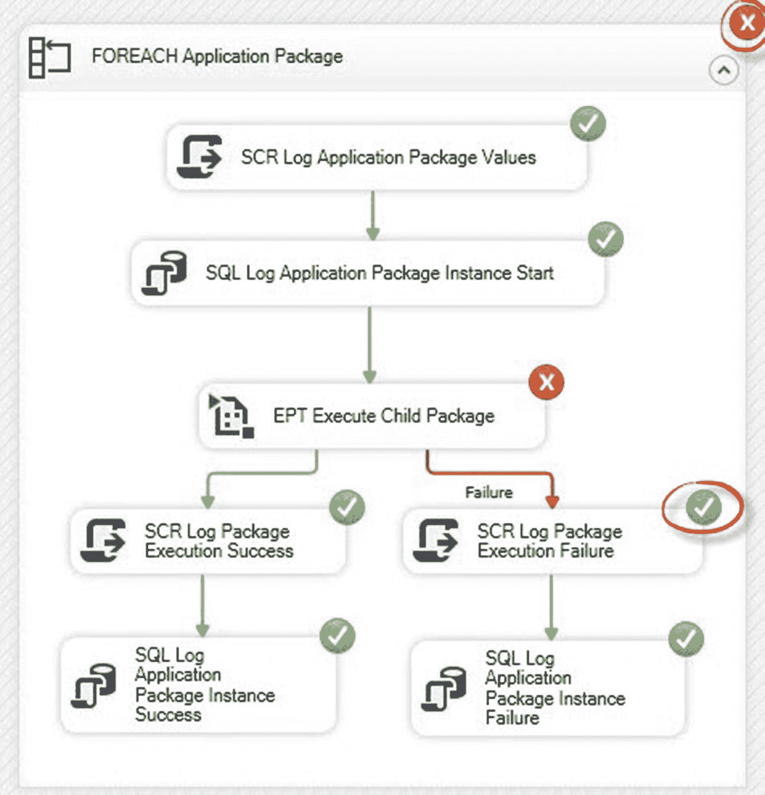

图 7-38 `Parent.dtsx` 执行再次失败

这是怎么回事？`Parent.dtsx` 的容错配置不正确。在我们正确配置 `Parent.dtsx` SSIS 包的容错之前，请注意 `FOREACH Application Package` Foreach 循环容器失败了，表明容错设置不正确。同时请注意 `SCR Log Package Execution Failure` 脚本任务*成功了*，表明代码清单 7-13 中展示的 `FailApplicationOnPackageFailure` 逻辑*正在运作*。

```csharp
public void Main()
{
    // System::PackageName, System::TaskName
    // User::FailApplicationOnPackageFailure, User::PackagePath
    string packageName = ➤ Dts.Variables["System::PackageName"].Value.ToString();
    string taskName = Dts.Variables["System::TaskName"].Value.ToString();
    string subComponent = packageName + "." + taskName;
    int informationCode = 1001;
    int errorCode = -999;
    bool fireAgain = true;
    bool failApplicationOnPackageFailure = ➤ Convert.ToBoolean(Dts.Variables["User::FailApplicationOnPackageFailure"] ➤ .Value);
    string packagePath = Dts.Variables["User::PackagePath"].Value.ToString();
    string description = String.Empty;

    if(failApplicationOnPackageFailure)
    {
        description = packagePath + " execution failed and ➤ FailApplicationOnPackageFailure is set (true)";
        Dts.Events.FireError(errorCode, subComponent, description, "", 0);
    }
    else
    {
        description = packagePath + " execution failed and ➤ FailApplicationOnPackageFailure is NOT set (false)";
        Dts.Events.FireInformation(informationCode, subComponent, ➤ description, "", 0, ref fireAgain);
    }

    Dts.TaskResult = (int)ScriptResults.Success;
}
```

代码清单 7-13 `FailApplicationOnPackageFailure` 逻辑

来自 `SCR Log Package Execution Failure` 脚本任务的进度选项卡消息确认 `FailApplicationOnPackageFailure` 功能按设计工作，如图 7-39 所示。

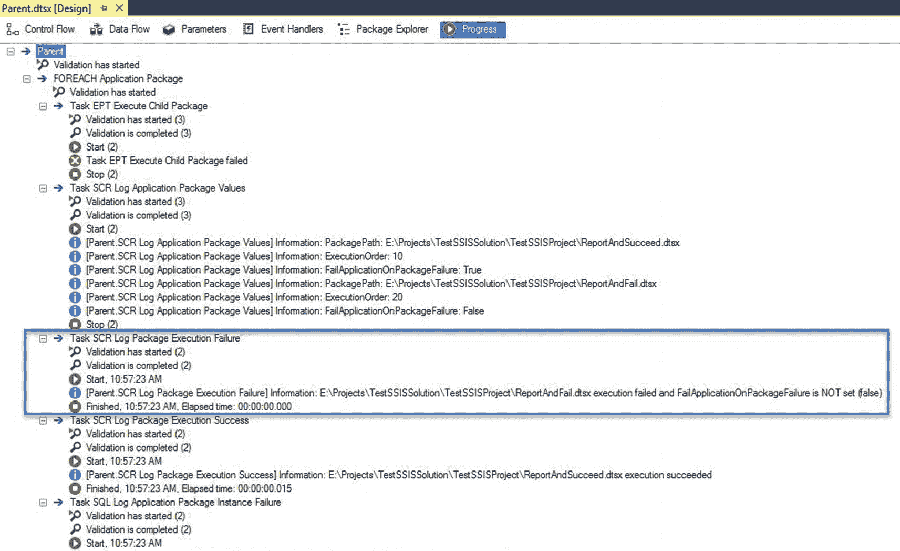

图 7-39 `FailApplicationOnPackageFailure` 正在运作

下一步是为 `Parent.dtsx` SSIS 包配置容错。

### 在 SSIS 框架应用程序元数据中配置容错

开始为 `Parent.dtsx` SSIS 包配置容错，使得当且仅当满足两个条件时执行才失败：

1.  一个应用程序包执行失败。
2.  该应用程序包的 `FailApplicationOnPackageFailure` 位设置为 true。

如果这两个条件有一个或两个为假，期望的行为是 `Parent.dtsx` 继续执行。要配置*始终持续运行*功能，点击 `FOREACH Application Package` Foreach 循环容器，并按 F4 键显示其属性，如图 7-40 所示。

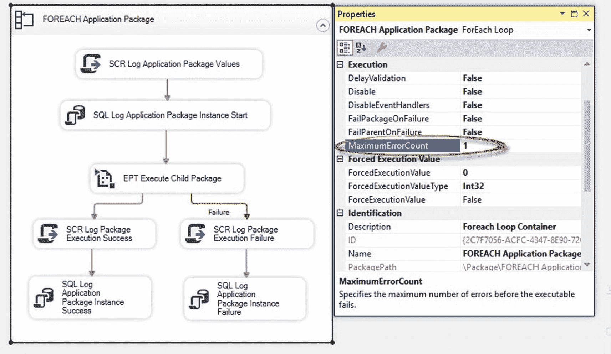

图 7-40 显示 `FOREACH Application Package` Foreach 循环容器的属性

在图 7-40 中，`MaximumErrorCount` 属性被高亮显示。默认的 `MaximumErrorCount` 属性值为 1 的净效果如下：如果在 `FOREACH Application Package` Foreach 循环容器执行期间发生一个错误，则 `FOREACH Application Package` Foreach 循环容器的执行将失败。

可以增加 `FOREACH Application Package` Foreach 循环容器的 `MaximumErrorCount` 属性值，但如果要增加，应该设为多少新值？假设配置了 10、20 或 300 个应用程序包作为 SSIS 框架应用程序的一部分执行。虽然实际上有一种方法可以管理这种场景，但存在一个更优雅的解决方案。

一个更优雅的解决方案是忽略*所有*执行错误。将 `FOREACH Application Package` Foreach 循环容器的 `MaximumErrorCount` 属性值更改为 0，以配置该容器忽略执行期间的所有错误。

感谢 Julie Smith（Twitter 账号 @juliechix）教会我将 `MaximumErrorCount` 设置为 0。

因为事件在 SSIS 中*冒泡*，在 `FOREACH Application Package` Foreach 循环容器内发生的任何错误都将“冒泡”到 `Parent.dtsx` SSIS 包，即 `FOREACH Application Package` Foreach 循环容器的父容器。点击 `Parent.dtsx` 控制流中任意空白处以显示 `Parent.dtsx` 包的属性，并将 `MaximumErrorCount` 属性更改为 0，如图 7-41 所示。

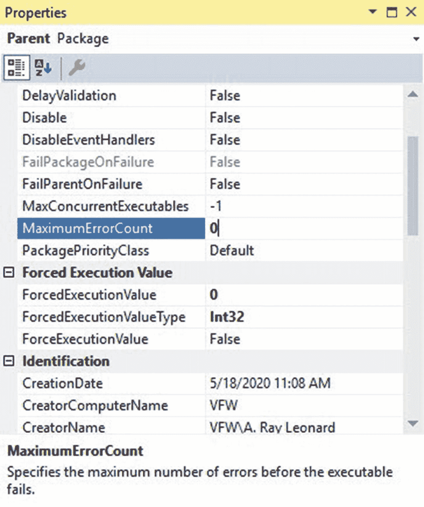

图 7-41 更改 `Parent.dtsx` 包的 `MaximumErrorCount` 属性

*当前*配置下，SSIS 框架应用程序包将继续执行，直到最后一个应用程序包执行完毕，无论应用程序包实例是否失败，*也无论*应用程序包的 `FailApplicationOnPackageFailure` 位设置如何。

下一步是配置 `Parent.dtsx` SSIS 包，当且仅当满足两个条件时才*停止*执行：

1.  一个应用程序包执行失败。
2.  该应用程序包的 `FailApplicationOnPackageFailure` 位设置为 true。

点击 `SCR Log Package Execution Failure` 脚本任务。在属性中，将 `SCR Log Package Execution Failure` 脚本任务的 `FailPackageOnFailure` 属性更改为 True，如图 7-42 所示。

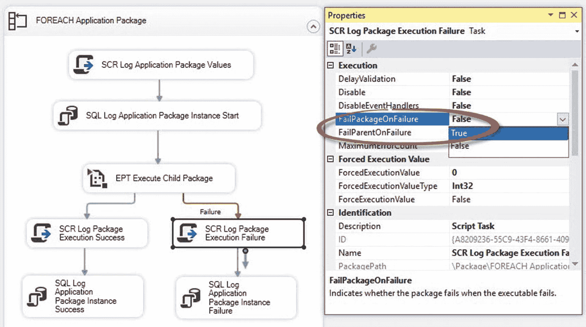

图 7-42 将 `SCR Log Package Execution Failure` 脚本任务的 `FailPackageOnFailure` 属性更改为 True

现在测试执行揭示了期望的功能；SSIS 框架应用程序包执行实例的行为符合配置，容错按设计工作，如图 7-43 所示。

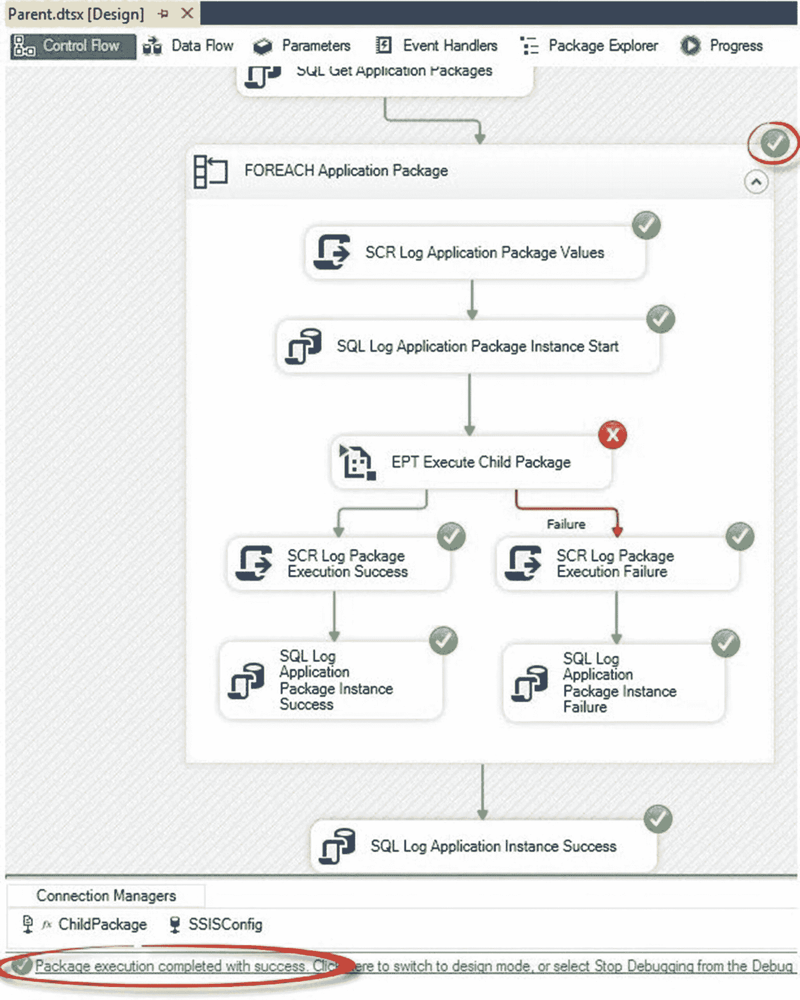

图 7-43


### 结论

本章介绍了 SSIS 框架日志记录，它扩展了我们在第 6 章中构建的仪表化功能。接下来的几章将探讨如何将这个简单的 SSIS 框架迁移并适配到更多场景中，包括 Azure Data Factory。

## 8. Azure-SSIS 集成运行时

微软 Azure-SSIS 团队一直在努力，致力于减少在本地执行 SSIS 包与在 Azure 中执行 SSIS 包之间的摩擦。许多企业在本地执行存储在文件系统中的 SSIS 包。过去，迁移在本地文件系统中执行的 SSIS 包意味着要改变企业的 SSIS 存储和执行模式。随着基于 Azure-SSIS 文件共享执行的出现，从 Azure 文件执行 SSIS 包已不再是个问题。

实际上，前一章介绍的 SSIS 框架在 Azure-SSIS 中运行良好。在本章中，我们将讨论并演示：

*   Azure 入门
*   配置 Azure Data Factory
*   配置 Azure 存储
*   配置 Azure-SSIS

### Azure 入门

在 Azure 中创建资源并与之交互之前，必须首先在 azure.com 上创建一个 Azure 帐户，如图 8-1 所示。

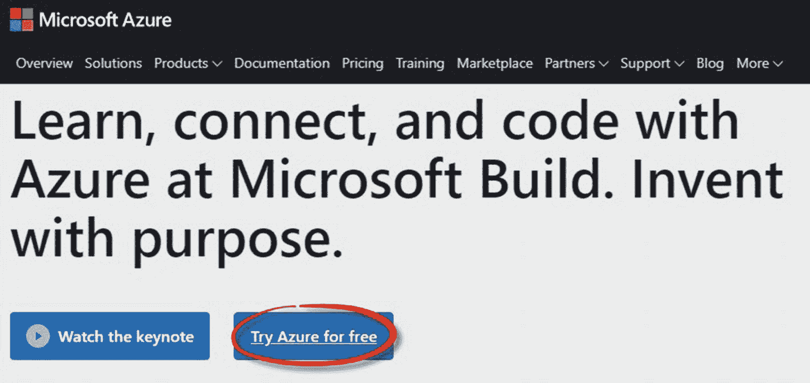

图 8-1: Azure.com

请注意，图 8-1 中链接按钮上的文字是“Try Azure for free”。迄今为止，微软的优秀员工一直持续提供某些 Azure 服务的免费入门访问权限。免费的入门优惠完全由微软提供，并可能根据微软的决定进行更改。

创建帐户后，下一步是配置 Azure Data Factory。

Azure 每天都在变化。本书中的一些截图和操作步骤在出版前可能就会过时。

SSIS 应用程序包容错按设计工作

请记住，`ReportAndFail.dtsx`应用程序包执行`应该`失败，但一个`ReportAndFail.dtsx`应用程序包执行实例的失败`不应`导致应用程序失败（在其当前配置下）。

使用清单 7-14 中的 T-SQL 更新`ReportAndFail.dtsx`应用程序包的`FailApplicationOnPackageFailure`位配置。

```sql
Select p.PackageName
, ap.FailApplicationOnPackageFailure
From [SSISConfig].[config].[ApplicationPackages] ap
Join [SSISConfig].[config].[Packages] p
On p.PackageId = ap.PackageId
Where p.PackageName = N'ReportAndFail.dtsx'

Update ap
Set ap.FailApplicationOnPackageFailure = 1
From [SSISConfig].[config].[ApplicationPackages] ap
Join [SSISConfig].[config].[Packages] p
On p.PackageId = ap.PackageId
Where p.PackageName = N'ReportAndFail.dtsx'

Select p.PackageName
, ap.FailApplicationOnPackageFailure
From [SSISConfig].[config].[ApplicationPackages] ap
Join [SSISConfig].[config].[Packages] p
On p.PackageId = ap.PackageId
Where p.PackageName = N'ReportAndFail.dtsx'

Listing 7-14: 更新 ReportAndFail.dtsx 的 FailApplicationOnPackageFailure 位
```

更新`ReportAndFail.dtsx`应用程序包的 SSIS 框架应用程序包元数据后，结果如图 7-44 所示。

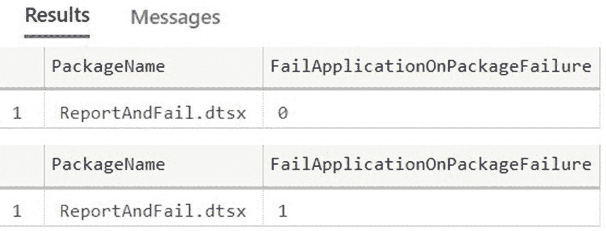

图 7-44: 更新 ReportAndFail.dtsx 应用程序包元数据的结果

重新执行`Parent.dtsx`确认了我们可以在需要时失败，如图 7-45 所示。

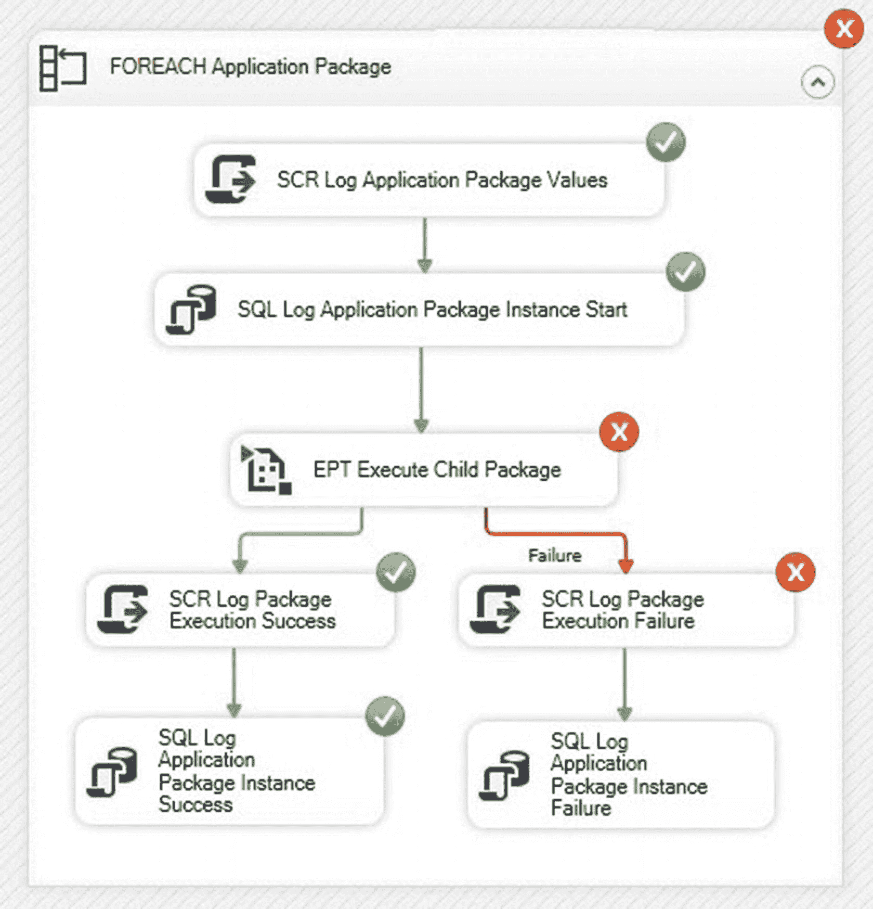

图 7-45: 由 SSIS 框架元数据管理的应用程序包失败

`Parent.dtsx` SSIS 包的当前状态代表了一个相当健壮的 SSIS 框架执行引擎。

然而，仍然存在一个问题：重新执行清单 7-11 中所示的查询，返回的`ApplicationPackageStatus`结果为“Running”，类似于图 7-46 所示的结果。

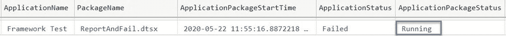

图 7-46: ApplicationPackageStatus 为 “Running”

为什么`ApplicationPackageStatus`是“Running”？查看图 7-45 中的截图，注意“SQL Log Application Package Instance Failure”执行 SQL 任务*没有执行*，因为连接“SCR Log Package Execution Failure”脚本任务和“SQL Log Application Package Instance Failure”执行 SQL 任务的优先约束被配置为仅在*成功*时评估。回顾清单 7-13，应用程序包失败可能导致“SQL Log Application Package Instance Failure”执行 SQL 任务成功*或*失败，具体取决于`[config].[ApplicationPackages]`表中应用程序包的`FailApplicationOnPackageFailure`位值。

清单 7-14 和图 7-44 显示我们将`FailApplicationOnPackageFailure`位设置为 1（true），这通知了“SCR Log Package Execution Failure”脚本任务。“SCR Log Package Execution Failure”脚本任务随后按照清单 7-13 中规定的.Net C#代码引发了错误。

幸运的是，修复方法简单明了——删除连接“SCR Log Package Execution Failure”脚本任务和“SQL Log Application Package Instance Failure”执行 SQL 任务的优先约束。从“EPT Execute Child Package”执行包任务到“SQL Log Application Package Instance Failure”执行 SQL 任务连接一个新的*失败*优先约束。在调试器中重新执行`Parent.dtsx`会执行“SQL Log Application Package Instance Failure”执行 SQL 任务，如图 7-47 所示。

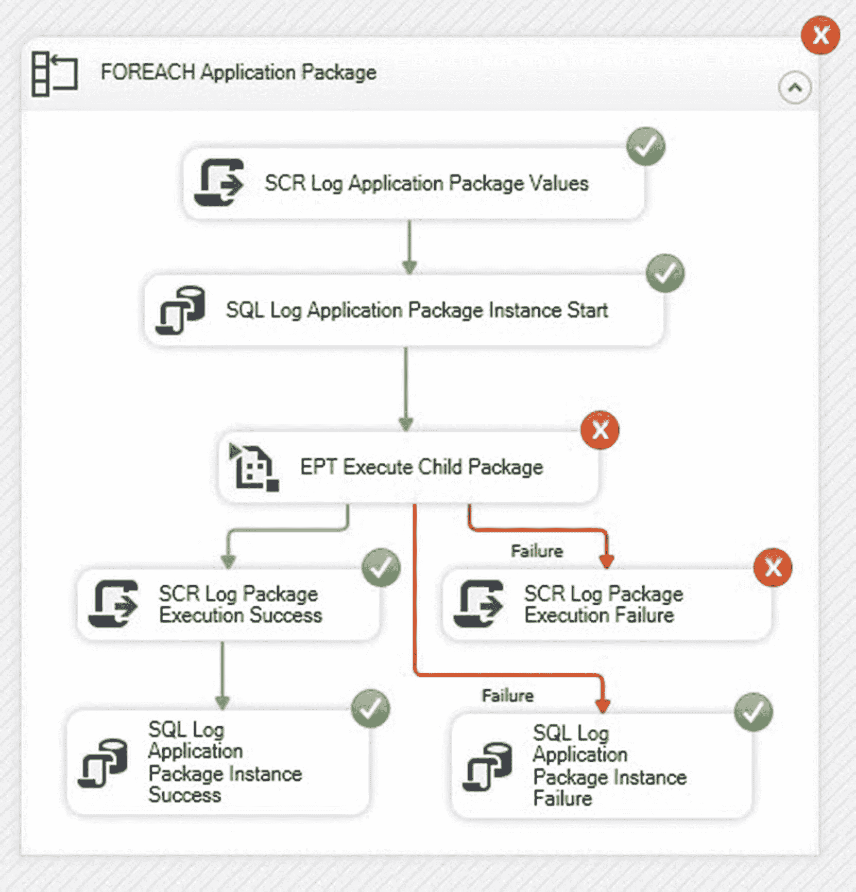

图 7-47: “SQL Log Application Package Instance Failure” 执行 SQL 任务得以执行

重新执行清单 7-11 中的应用程序包状态查询，返回的`ApplicationPackageStatus`结果为“Failed”，类似于图 7-48 所示的结果。

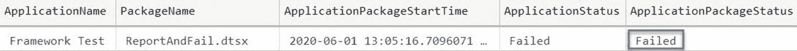

图 7-48: ApplicationPackageStatus 为 “Failed”

我们的 SSIS 框架执行引擎现已准备好部署到其他地方。


### 预配 Azure Data Factory

Azure 托管了大量服务。通常，Azure 服务可归类为：

1.  基础设施即服务（IaaS），其中 Azure 托管企业级基础设施，例如虚拟机（VM）。
2.  平台即服务（PaaS），其中 Azure 提供企业级平台，例如 SQL Server 或 `Azure Data Factory`。

Azure 用户首先需要 **预配**（provisioning）——即创建——Azure 服务产品的实例。要开始预配一个 `Azure Data Factory`（简称 ADF）实例，请点击左侧菜单中的“创建资源”，如图 8-2 所示。

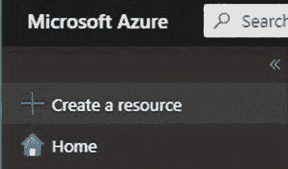
*图 8-2：在 Azure 左侧菜单中创建资源*

当“新建”页面显示时，搜索“Data Factory”，如图 8-3 所示。

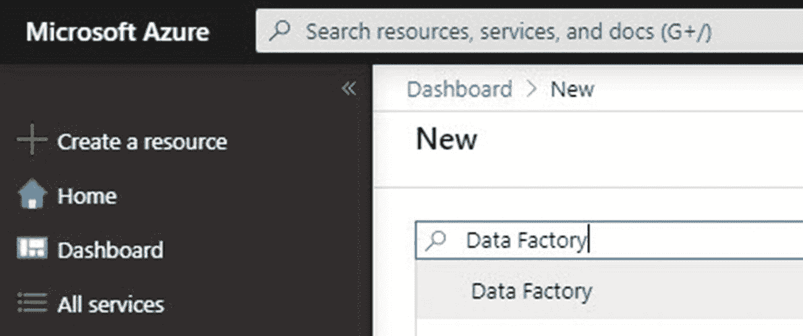
*图 8-3：在“新建”页面上搜索 Data Factory*

在“新建”页面上，点击搜索文本框下方的“Data Factory”以打开 Data Factory 页面，如图 8-4 所示。

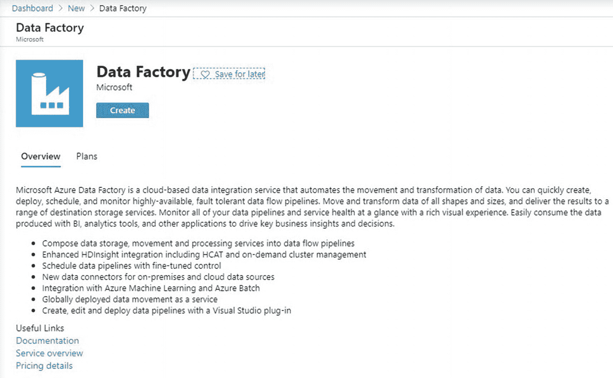
*图 8-4：Data Factory 页面*

点击 Data Factory 页面上的“创建”按钮，打开“新建数据工厂”页面，如图 8-5 所示。

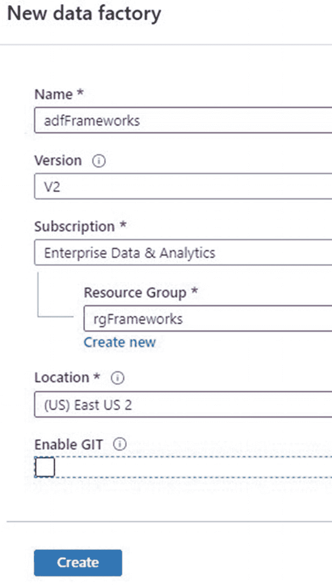
*图 8-5：添加新的 Azure Data Factory 实例*

在“新建数据工厂”页面上填写必填字段的值。

根据 `Azure Data Factory` 的命名规则（`docs.microsoft.com/en-us/azure/data-factory/naming-rules`），`Azure Data Factory`、`资源组` 和 `存储帐户` 的名称是全局唯一且不区分大小写的。

资源组是将相关 Azure 资源进行分组的一种方式。当使用 Azure 资源来学习 Azure 时，资源组允许学生从一个屏幕**删除**该资源组及其所有组成部分。

您可以从“资源组”下拉菜单中选择一个现有的资源组，或者通过点击“资源组”下拉菜单下方的“新建”链接来创建一个新的资源组，如图 8-6 所示。

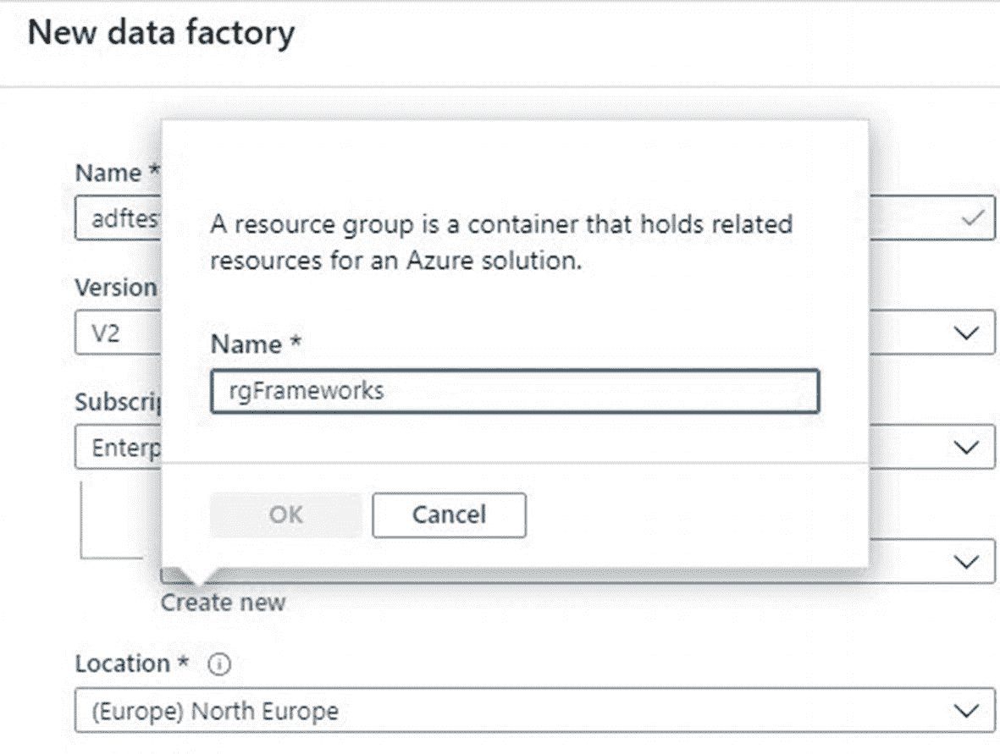
*图 8-6：创建新的资源组*

在撰写本文时，微软在全球维护着超过 20 个数据中心位置。这些位置旨在帮助使您的应用程序和数据更靠近客户端。多个位置也有助于备份和冗余。

为了获得最佳响应，请从“位置”下拉菜单中选择一个靠近您的位置，如图 8-7 所示。

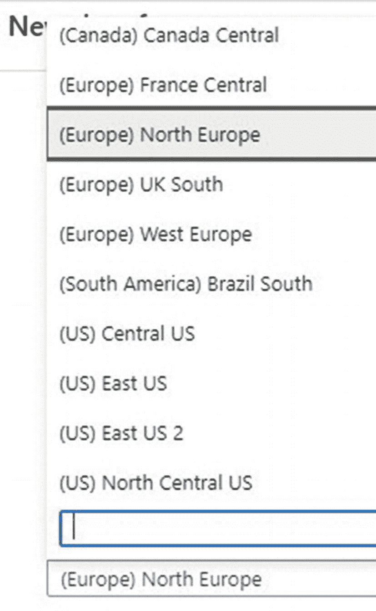
*图 8-7：选择一个位置*

“启用 GIT”默认是选中的，这非常棒，如图 8-8 所示。

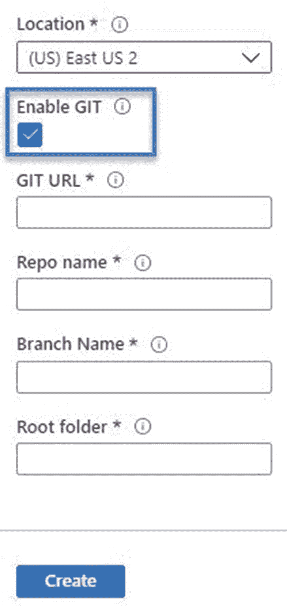
*图 8-8：启用 GIT 复选框*

本章不涉及源代码控制，因此请取消选中“启用 GIT”复选框。

点击“创建”按钮，以按指定配置预配一个 `ADF` 实例。

几分钟后，`Azure Data Factory` 就预配好了。您可以点击通知中的按钮访问该资源，或将其固定到仪表板，如图 8-9 所示。

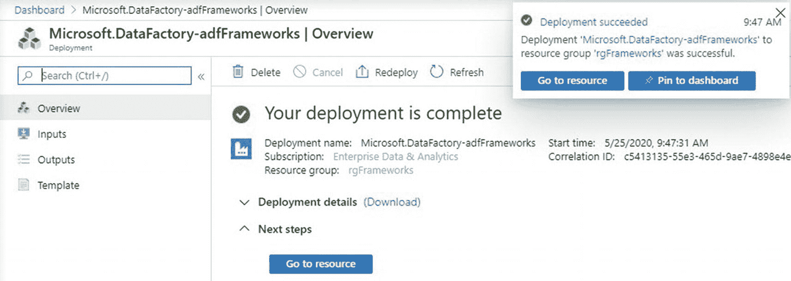
*图 8-9：Azure Data Factory 已预配*

如果您从通知“提示框”中点击“固定到仪表板”按钮，一个 Data Factory 磁贴将出现在您上次访问的 Azure 仪表板上，显示效果如图 8-10 所示。

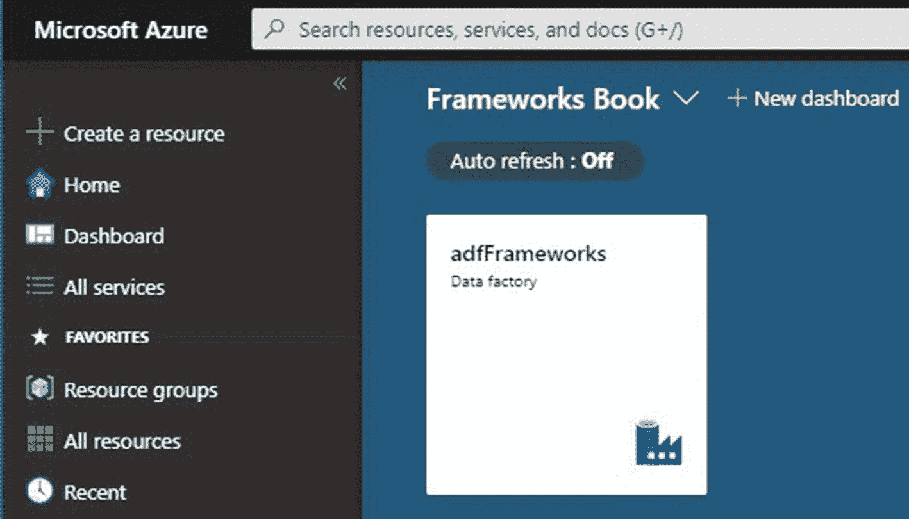
*图 8-10：固定到 Azure 仪表板的 Azure Data Factory 实例*

与资源组类似，Azure 仪表板也提供了一种对 Azure 资源进行分组的方式。Azure 仪表板允许对来自许多资源组（甚至对管理多个 Azure 订阅的用户来说，还可以跨订阅）的 Azure 资源进行可视化分组。

点击磁贴以访问 `Azure Data Factory` 的页面。默认显示“概述”，如图 8-11 所示。

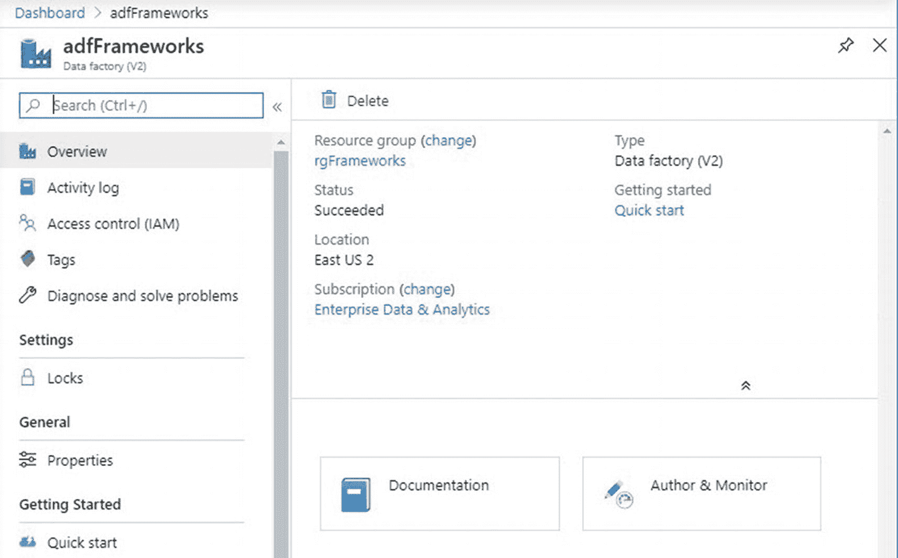
*图 8-11：Azure Data Factory 页面*

`Azure Data Factory` 页面右上角的“图钉”图标允许您将此 ADF 实例的磁贴固定到 Azure 仪表板。请记住，您可以配置多个 Azure 仪表板，ADF 实例磁贴将固定到您最后访问的仪表板。

点击“创作和监视”链接按钮，访问此 `Azure Data Factory` 实例的 `adf.azure.com`，如图 8-12 所示。

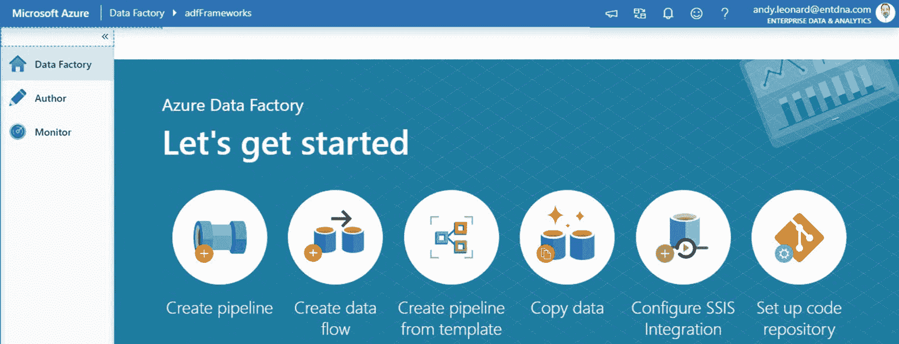
*图 8-12：Data Factory 概述页面*

在撰写本文时，Data Factory 概述页面包含以下操作的快捷链接：

*   创建管道
*   创建数据流
*   从模板创建管道
*   复制数据
*   配置 SSIS 集成
*   设置代码存储库

既然 `Azure Data Factory` 已预配好，下一步就是添加 `Azure 存储`。


### 配置 Azure 存储

Azure Blob 存储是可供 Azure 资源和服务使用的文件系统。与服务器和笔记本电脑上的文件系统类似，Azure Blob 存储在所有 Azure 事务中都扮演着至关重要的角色。本节的目标是描述如何配置一个简单的 Azure 存储账户。随后，我们将使用此账户中的 Azure 文件共享来存储 SSIS 包和 ISPAC 文件。要了解更多关于 Azure 文件共享的信息，请参阅 `docs.microsoft.com/en-us/azure/storage/files/storage-how-to-create-file-share`。

与配置 ADF 实例时一样，在 Azure 左侧菜单中点击 `创建资源`。点击 `存储`，然后点击 `存储账户 - Blob、文件、表、队列`，如图 8-13 所示。

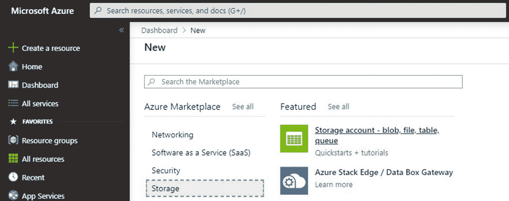
*图 8-13 配置 Azure 存储*

当 `创建存储账户` 页面显示时，在 `项目详细信息` 部分配置订阅和资源组，如图 8-14 所示。

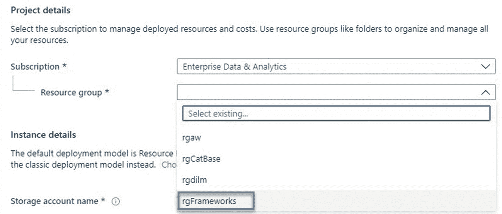
*图 8-14 配置存储账户订阅和资源组*

在 `实例详细信息` 部分，配置 `存储账户名称` 属性，如图 8-15 所示。


*图 8-15 配置存储账户名称属性*

下一步是在 `实例详细信息` 部分配置 `位置` 属性，如图 8-16 所示。

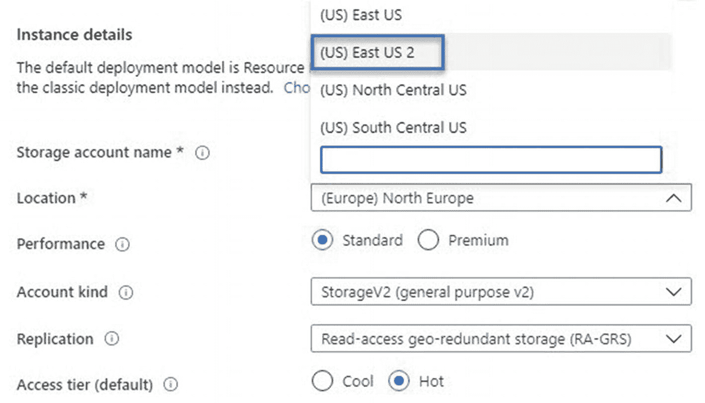
*图 8-16 配置位置属性*

出于本示例的目的，`标准` 性能已足够，如图 8-17 所示。


*图 8-17 配置性能属性*

接下来配置 `账户类型` 属性。将 `账户类型` 设置为 `StorageV2（通用 v2）`，如图 8-18 所示。

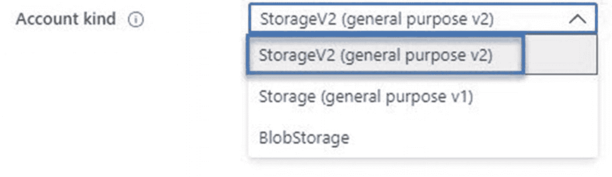
*图 8-18 配置账户类型属性*

出于示例目的，将 `复制` 属性设置为 `本地冗余存储 (LRS)` 即可，如图 8-19 所示。

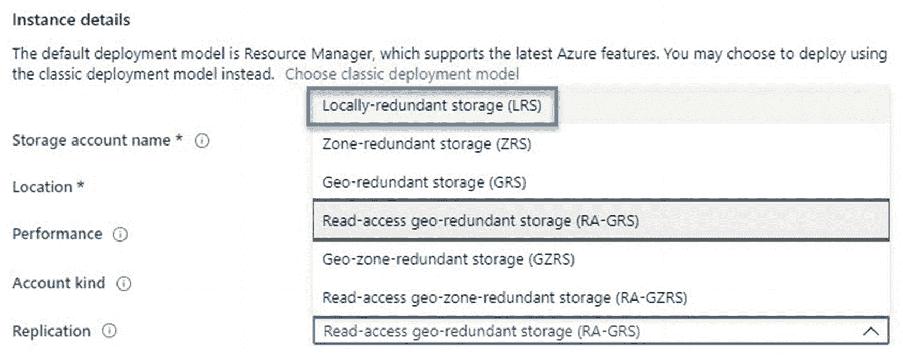
*图 8-19 配置存储账户的复制属性*

接受默认的 `访问层级` 属性设置 – `热` – 如图 8-20 所示。


*图 8-20 配置访问层级属性*

`创建存储账户` 页面的 `基本信息` 选项卡配置如图 8-21 所示。

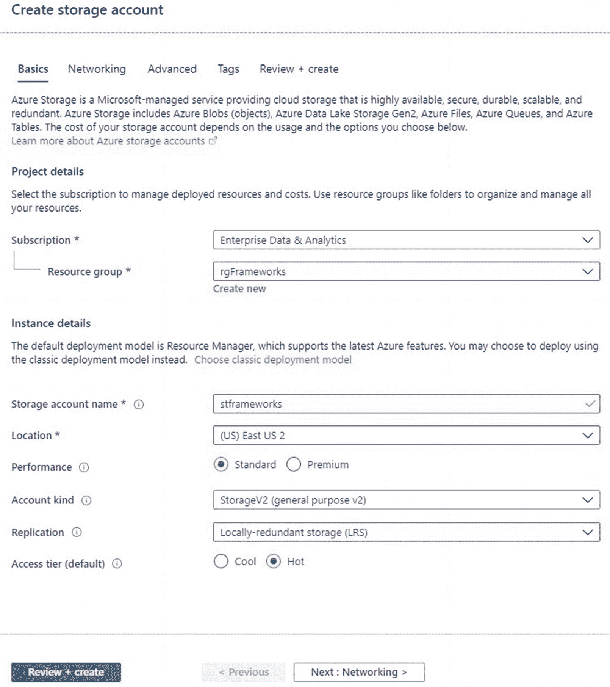
*图 8-21 已配置的基本信息选项卡*

出于本示例的目的，将 `网络`、`高级` 和 `标签` 选项卡上的设置保持为默认值。在 `基本信息` 选项卡的底部，点击 `查看 + 创建` 按钮（如图 8-21 所示）。

存储账户设置将经过验证，结果会显示出来，如图 8-22 所示。

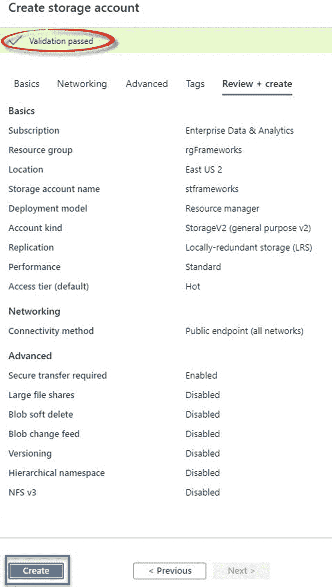
*图 8-22 存储账户配置验证结果*

还需注意，`创建存储账户` 页面底部的按钮文本已变为 `创建`。点击 `创建` 按钮以创建新的存储账户。部署完成后，存储账户页面和通知将如图 8-23 所示。

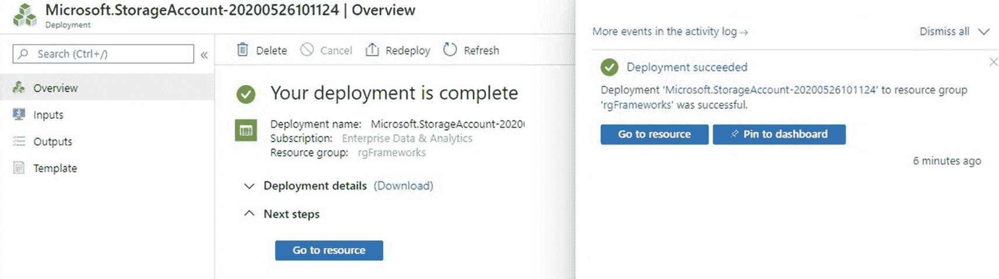
*图 8-23 存储账户，已创建*

现在 Azure 数据工厂和存储账户都已配置完成，下一步是添加 Azure-SSIS 集成运行时。


### 为 SSIS 包文件配置 Azure-SSIS 集成运行时

2019 年 6 月 30 日，Microsoft 发布了 ADF Azure-SSIS 集成运行时的新版本。以往，企业可以使用 Azure 数据库托管的 SSIS 目录在云中执行 SSIS 包；而新版本则允许从 Azure 文件共享执行 SSIS 包。

### 入门

要开始创建 Azure-SSIS 集成运行时，请导航到 Azure 数据工厂实例的“管理”页面，并在“连接”类别下点击“集成运行时”，如图 8-24 所示。

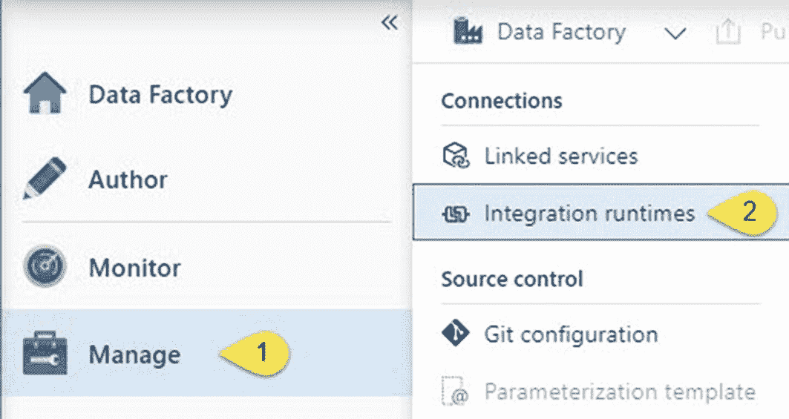

图 8-24：打开 ADF 连接

当“连接”页面显示时，点击“集成运行时”选项卡，如图 8-25 所示。

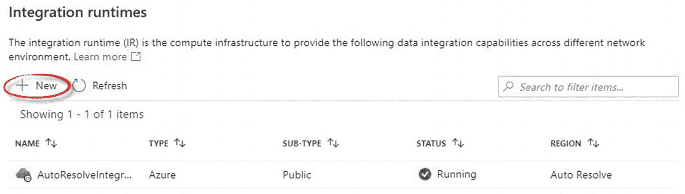

图 8-25：ADF 连接的“集成运行时”选项卡

点击图 8-25 中圈出的“新建”按钮，以打开“集成运行时设置”窗格，并选择“Azure-SSIS”选项，如图 8-26 所示。

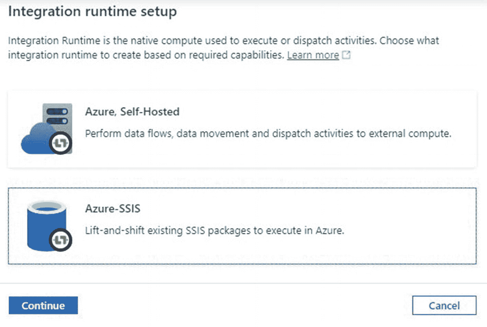

图 8-26：在集成运行时设置窗格中选择 Azure-SSIS

图 8-26 中显示的另一个选项是“Azure、Self-Hosted”。你可以访问 `docs.microsoft.com/en-us/azure/data-factory/concepts-integration-runtime#self-hosted-integration-runtime` 来了解有关 *所有* Azure 数据工厂集成运行时的更多信息。出于本示例的目的，我们将配置一个“独立”的 Azure-SSIS 集成运行时——即 IR——这是一种需要最少安全配置的 IR。有关将 Azure-SSIS IR 加入虚拟网络的更多信息，请访问 `docs.microsoft.com/en-us/azure/data-factory/join-azure-ssis-integration-runtime-virtual-network`。

### 配置常规设置

点击“继续”按钮，打开集成运行时设置窗格上的“常规设置”页面。配置 Azure-SSIS IR 的名称和可选的描述，然后设置“位置”属性。在本例中，将“位置”属性设置为与 Azure 数据工厂相同的位置（此为默认值），如图 8-27 所示。

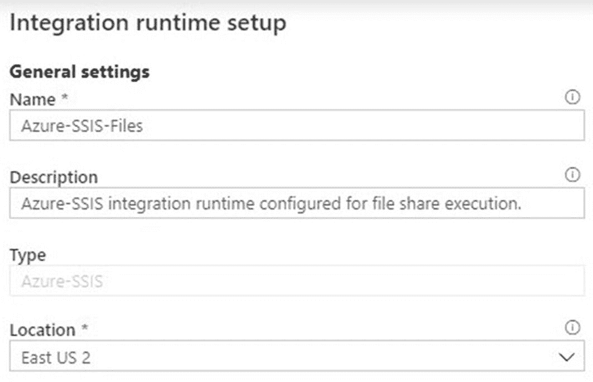

图 8-27：配置名称、描述和位置属性

#### 节点配置

接下来的两个步骤将配置 Azure-SSIS 用以执行 SSIS 包的虚拟机（VM）。“节点大小”代表 *每个节点* 的配置，有一些性能强劲的选项，例如图 8-28 中列出的那些。

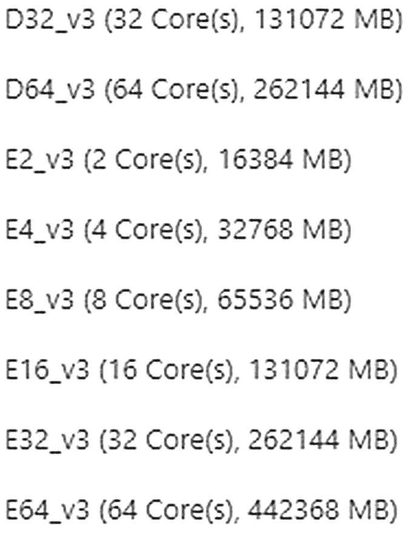

图 8-28：Azure-SSIS 的一些节点大小选项

VM 系列的首字母表示虚拟机的通用类别和用途。A 系列 VM 专门设计用于在项目的测试和开发阶段节省成本。要了解有关 Azure 虚拟机系列和成本的更多信息，请访问 `azure.microsoft.com/en-us/pricing/details/virtual-machines/series/`。

从下拉列表中选择“A8_v2 (8 Core(s), 16384 MB)”节点大小，如图 8-29 所示。

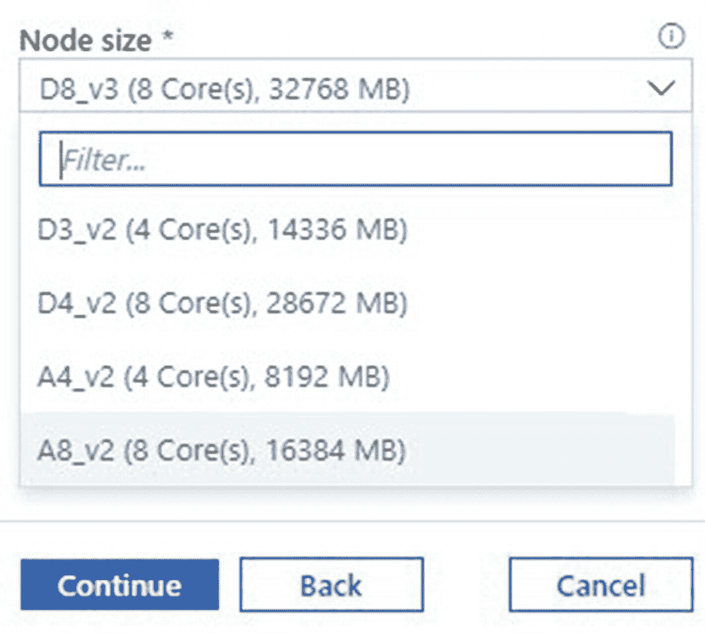

图 8-29：为 Azure-SSIS 选择节点大小

“节点数”滑块指示 Azure-SSIS 可用的虚拟机数量。每个节点将根据上一个下拉列表中选择的节点大小进行配置。节点数是指 Azure-SSIS IR 可用的、在“节点大小”属性中配置的节点数量。本例中，将“节点数”属性保留为默认值 2，如图 8-30 所示。


图 8-30：将“节点数”属性配置为 2

### 许可与成本管理

下一步是配置“版本/许可证”属性。现在先选择“标准”，如图 8-31 所示。

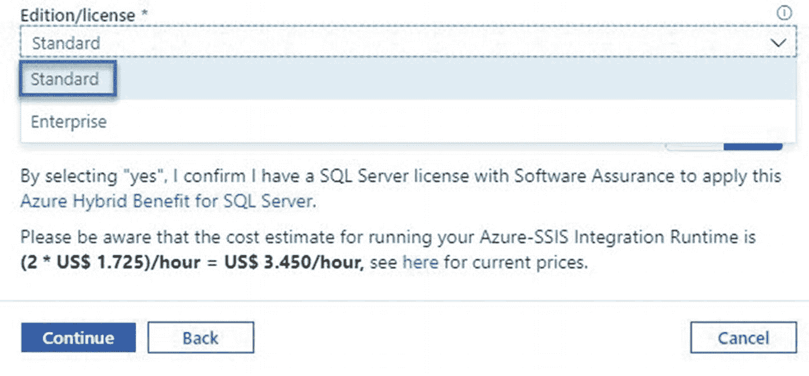

图 8-31：设置版本/许可证属性

一项名为“自带许可”或“BYOL”的功能是在 Azure 中减少支出的另一种方式。如果你或你的企业已经拥有 SQL Server 许可证，请点击“是”以降低运行 Azure-SSIS 后端 VM 的成本，如图 8-32 所示。

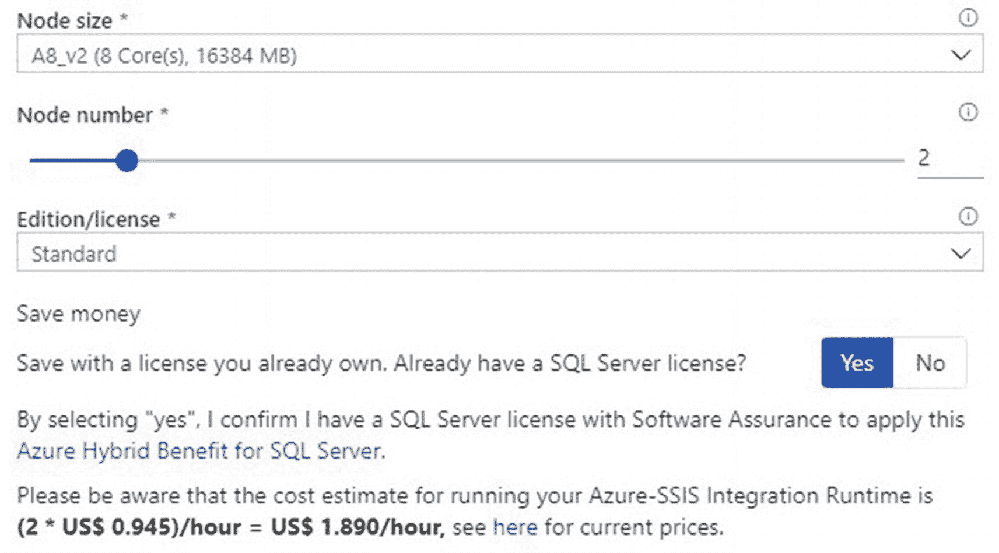

图 8-32：使用 BYOL 降低 Azure 成本

请注意，更改“版本/许可证”属性并 *不会* 影响 Azure-SSIS 的成本，如图 8-33 所示。

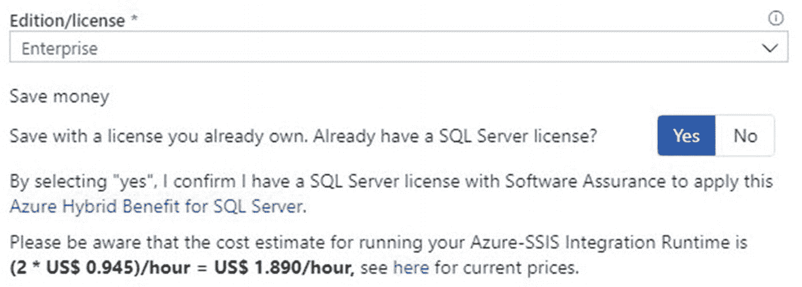

图 8-33：选择企业版不会影响 Azure-SSIS 成本

阅读 `azure.microsoft.com/en-us/pricing/details/data-factory/ssis/` 以了解有关 Azure-SSIS 成本的更多信息。你也可以尝试不同的组合来平衡性能和成本，例如图 8-34 中显示的“D2_v3 (2 Core(s), 8192 MB)”企业配置。

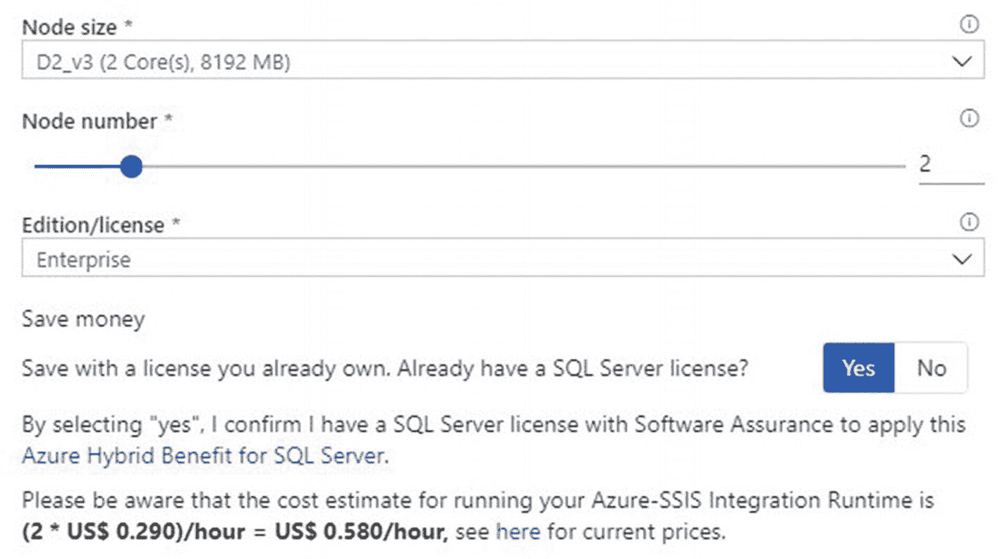

图 8-34：测试其他节点大小组合

$0.58 大约是 $1.89 的 31%。

*请* 访问 `azure.microsoft.com/en-us/pricing/details/data-factory/ssis/` 以了解有关 Azure-SSIS 实例成本的更多信息。管理 Azure-SSIS 成本的一种方法是安排 Azure 数据工厂管道在每晚关闭每个 Azure-SSIS 实例，以防你在学习时忘记或被叫走。`andyleonard.blog/2020/05/stop-an-azure-ssis-files-integration-runtime-safely/` 是一篇详细介绍如何停止 Azure-SSIS IR 的博客文章。

**作者和/或出版商对产生的任何费用概不负责。**

### 配置部署设置

常规设置配置完毕后，点击“继续”按钮，打开集成运行时设置窗格中的“部署设置”页面，如图 8-35 所示。

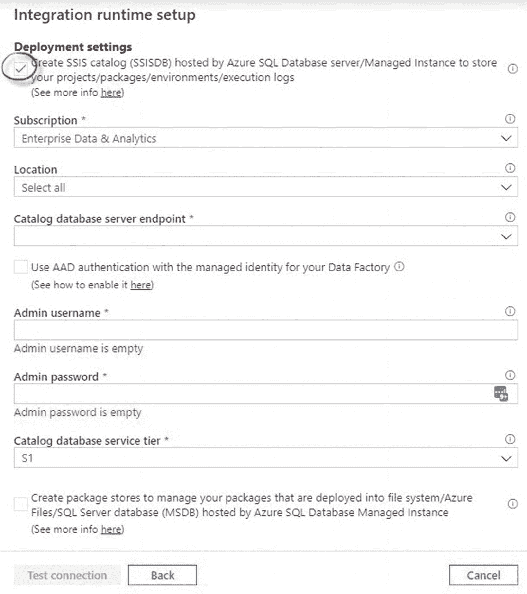

图 8-35：集成运行时设置窗格中的“部署设置”页面

我能听到你在想：“天哪，Andy！要配置的东西真多。而且你 *只字未提* 创建 Azure 数据库的事。怎么回事？”别急。我们正在为 *文件* 创建 Azure-SSIS 实例，记得吗？取消选中图 8-35 中圈出的“创建由 Azure SQL 数据库服务器/托管实例托管的 SSIS 目录 (SSISDB) 以存储你的项目/包/环境/执行日志”复选框。集成运行时设置窗格中的“部署设置”页面现在看起来与图 8-36 所示相似。

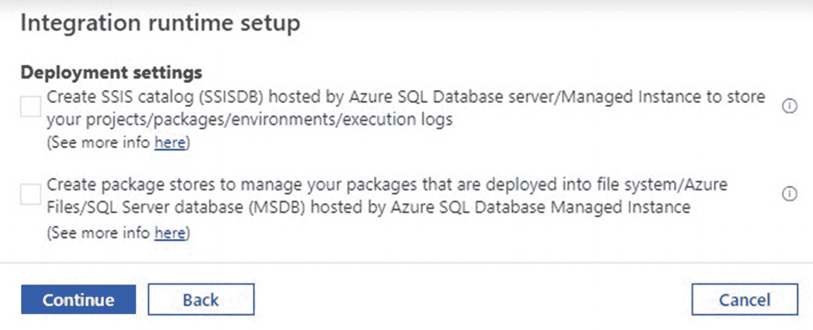

图 8-36


集成运行时设置界面中，取消勾选 `创建 SSIS 目录…` 复选框后的 `部署设置` 页面。

单击 `继续` 按钮可打开集成运行时设置界面的 `高级设置` 页面。`高级设置` 页面上提供四个选项：

1.  `每个节点的最大并行执行数`
2.  `Azure-SSIS 集成运行时自定义`
3.  `VNet`
4.  `自承载集成运行时`

`每个节点的最大并行执行数` 下拉菜单的功能如其名所示。每个 Azure-SSIS 节点（虚拟机）可执行由 `每个节点的最大并行执行数` 属性配置的 SSIS 包数量。

Azure-SSIS 集成运行时可包含自定义配置和/或第三方工具，例如 SentryOne 的 `Task Factory` (sentryone.com/products/task-factory) 和 COZYROC 的 `SSIS+ Components Suite` (cozyroc.com/products)。

大多数使用云的企业采用 `混合` 架构，将部分而非全部数据存储在云中。`VNet` 是一种访问本地企业数据的方式。在撰写本文时，经典的 Azure 虚拟网络正在被弃用，并由 `VNet` 替代。对于正在使用或希望使用以下功能的企业，推荐使用 `VNet`：

-   经典 Azure 虚拟网络
-   具有 Azure-SSIS IR 的公共 IP 地址
-   自定义的 Azure-SSIS

请访问文章 `将 Azure-SSIS 集成运行时加入虚拟网络` (docs.microsoft.com/en-us/azure/data-factory/join-azure-ssis-integration-runtime-virtual-network) 了解更多信息。

`自承载` Azure-SSIS 集成运行时允许访问本地企业数据，而*无需* `VNet`。

在本示例中，请接受默认设置——不勾选任何复选框——如图 8-37 所示。

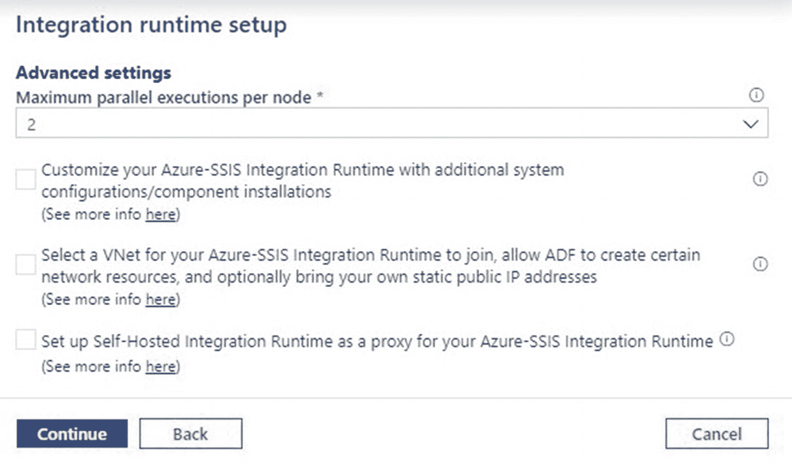

*图 8-37. 配置 Azure-SSIS 高级设置*

单击 `继续` 按钮进入集成运行时设置的 `摘要` 页面。`摘要` 页面显示 Azure-SSIS 配置选择，如图 8-38 所示。

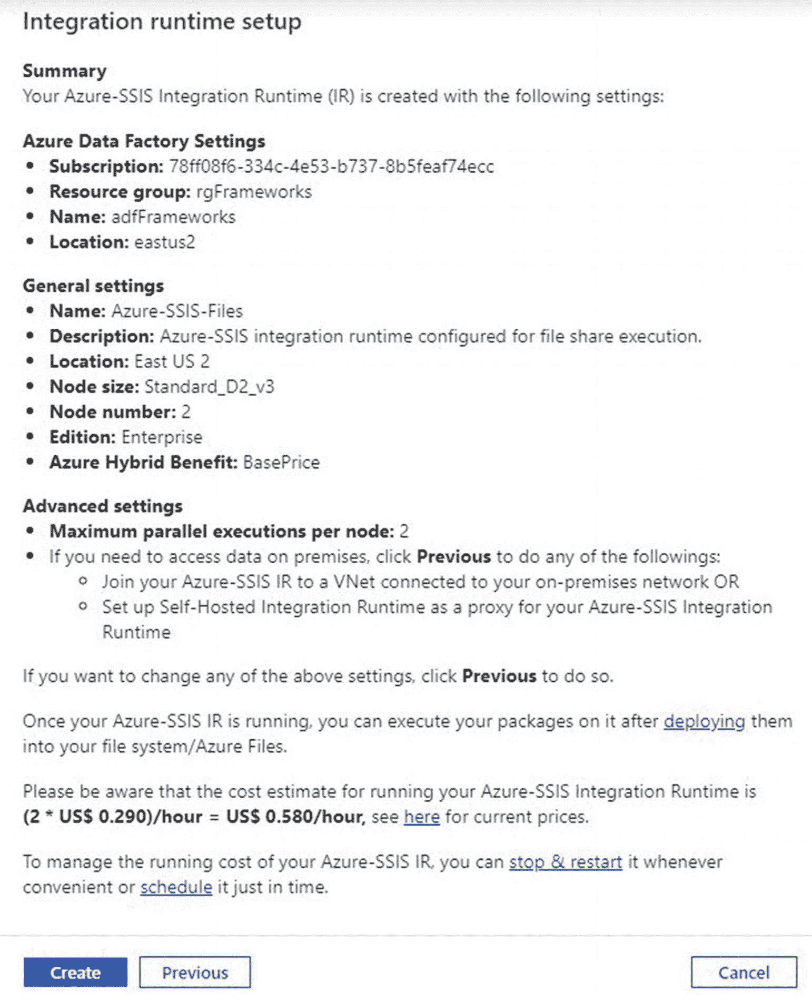

*图 8-38. Azure-SSIS 配置选择*

单击 `创建` 按钮以预配 Azure-SSIS 集成运行时。`连接` ➤ `集成运行时` 会显示状态为 `正在启动` 的新 Azure-SSIS 集成运行时，如图 8-39 所示。

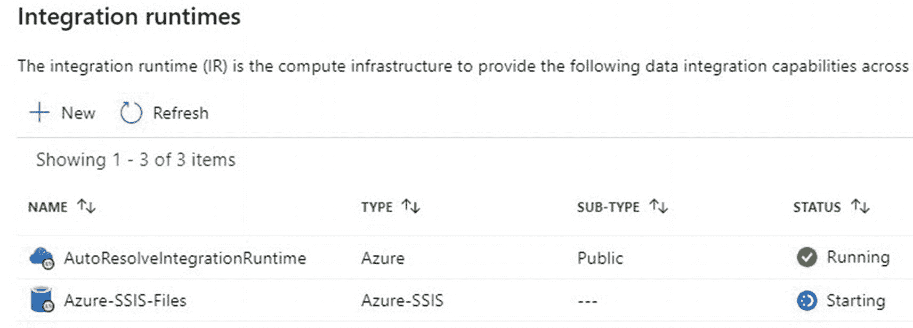

*图 8-39. Azure-SSIS-Files 正在启动*

一段时间后——在撰写本文时，通常为 3-5 分钟（最长）——Azure-SSIS IR 将启动，`连接` ➤ `集成运行时` 会显示 `正在运行` 状态，如图 8-40 所示。

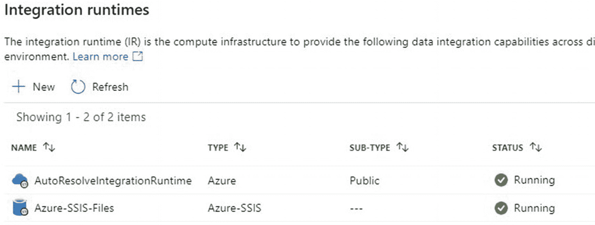

*图 8-40. Azure-SSIS-Files 已启动*

### 停止 Azure-SSIS 集成运行时

停止 Azure-SSIS IR 的一种方法是使用 `连接` ➤ `集成运行时` 页面上的 `停止` 按钮（停止按钮显示为暂停图标），如图 8-41 所示。

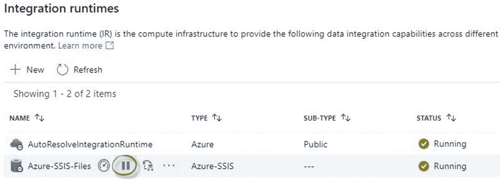

*图 8-41. 停止 Azure-SSIS IR*

单击 `停止` 按钮将触发一个确认对话框，如图 8-42 所示。

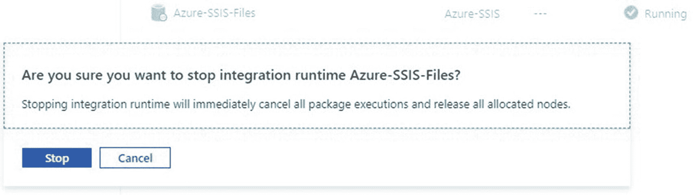

*图 8-42. 确认停止命令*

在撰写本文时，单击确认对话框上的 `停止` 按钮会触发如图 8-43 所示的调查表单。

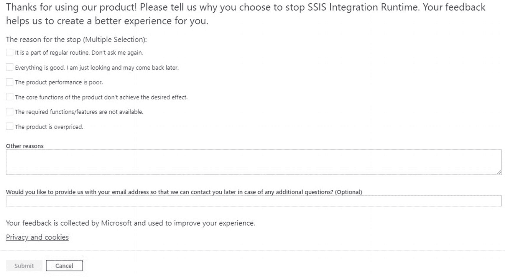

*图 8-43. 由确认对话框触发的调查对话框*

提交（或取消）调查表单后，Azure-SSIS 集成运行时将进入 `正在停止` 状态，如图 8-44 所示。

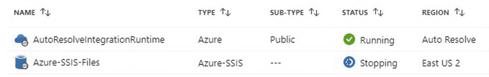

*图 8-44. Azure-SSIS 正在停止*

另一种停止 Azure-SSIS IR 的方法是通过 `监视` ➤ `集成运行时` 页面，如图 8-45 所示。

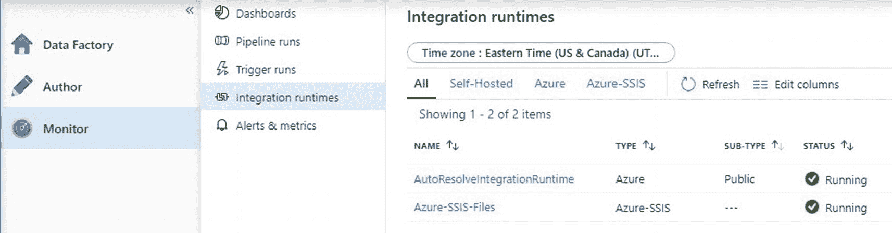

*图 8-45. 监视 ➤ 集成运行时页面*

单击 Azure-SSIS IR 的名称——在本例中为 `Azure-SSIS-Files`——以打开详细信息仪表板，如图 8-46 所示。

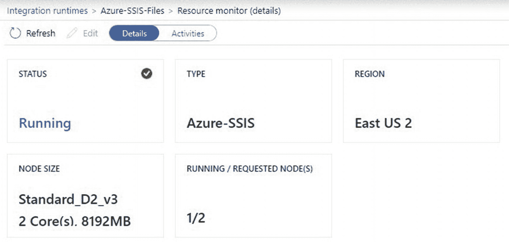

*图 8-46. Azure-SSIS 详细信息仪表板*

单击 `状态` (`正在运行`) 以打开如图 8-47 所示的 Azure-SSIS 状态对话框。

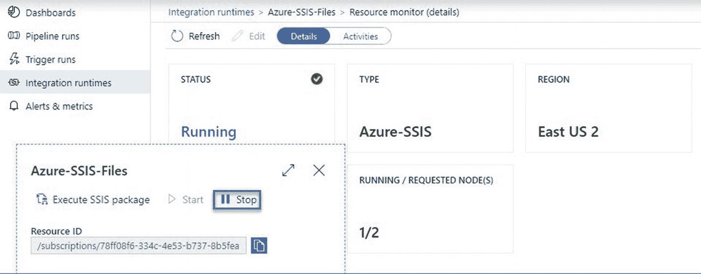

*图 8-47. Azure-SSIS 状态对话框*

单击 `停止` 按钮以停止 Azure-SSIS 集成运行时，如图 8-48 所示。

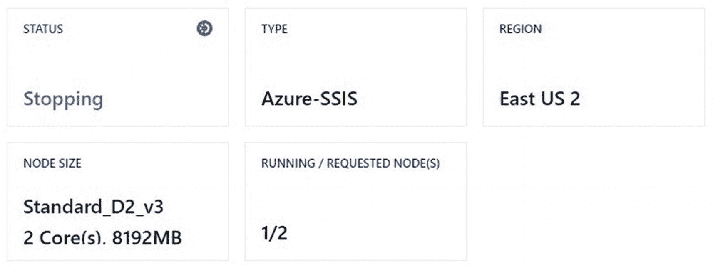

*图 8-48. Azure-SSIS 集成运行时正在停止*

请注意，单击 Azure-SSIS 状态对话框上的 `停止` 按钮会触发 `确定吗？/调查` 流程。

重新启动 Azure-SSIS 集成运行时以继续操作。

现在，已为从 Azure 文件共享执行配置了 Azure-SSIS IR，下一步是预配 Azure SQL 数据库。

### 本章总结

本章重点介绍了预配 Azure-SSIS 实例及其先决条件。本章逐步讲解了以下步骤：

-   开始使用 Azure
-   预配 Azure 数据工厂
-   预配 Azure 存储
-   预配 Azure-SSIS

下一步是预配 Azure SQL 数据库。

