# 9. 部署一个简单的、自定义的、基于文件的 Azure-SSIS 框架

Microsoft Azure-SSIS 团队一直在努力减少在本地执行 SSIS 包与在 Azure 中执行 SSIS 包之间的障碍。许多企业在本地执行存储在文件系统中的 SSIS 包。过去，迁移在本地文件系统中执行的 SSIS 包意味着改变企业的 SSIS 存储和执行模式。随着基于 Azure-SSIS 文件共享的执行功能的出现，从 Azure 中的文件执行 SSIS 包已不再是问题。

实际上，前面章节中的 SSIS 框架在 Azure-SSIS 中运行良好。在本章中，我们将讨论并演示以下内容。


### 配置 SSISConfig 数据库

本节重点是将 SSISConfig 数据库配置到托管它的 Azure SQL 数据库实例上。

“Azure SQL”可能是一个比较宽泛的术语。它可以指 Azure SQL 数据库、Azure SQL 托管实例，甚至有人用它来指代运行在 Azure 虚拟机上的 SQL Server。在本章中，我们使用的是 Azure SQL 数据库，这是其软件即服务产品，详细描述可参考 `docs.microsoft.com/en-us/azure/azure-sql/azure-sql-iaas-vs-paas-what-is-overview`。

首先导航到 Azure 门户以开始配置过程。在左侧的 Azure 菜单中，将鼠标悬停在“SQL 数据库”上，直到显示 SQL 数据库悬停卡片。当 SQL 数据库悬停卡片显示时，点击“+ 创建”，类似于**图 9-1**。

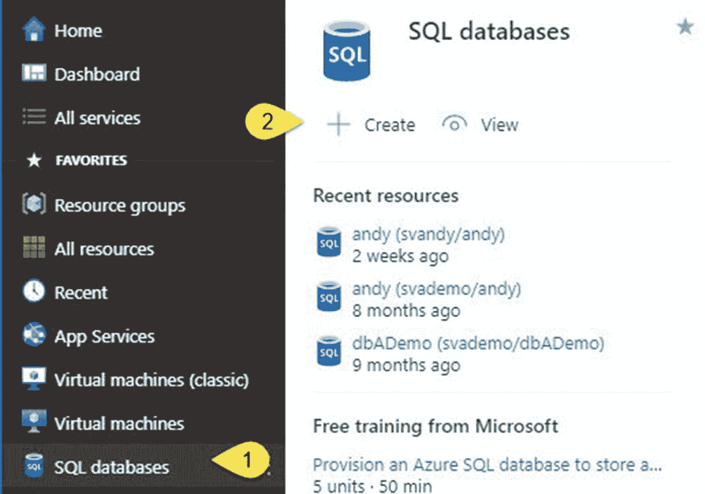
**图 9-1** 启动 Azure SQL 数据库配置过程

点击“+ 创建”会打开“创建 SQL 数据库”界面。首先将“订阅”属性配置为你的订阅名称，将“资源组”属性配置为你的资源组名称，如**图 9-2**所示。

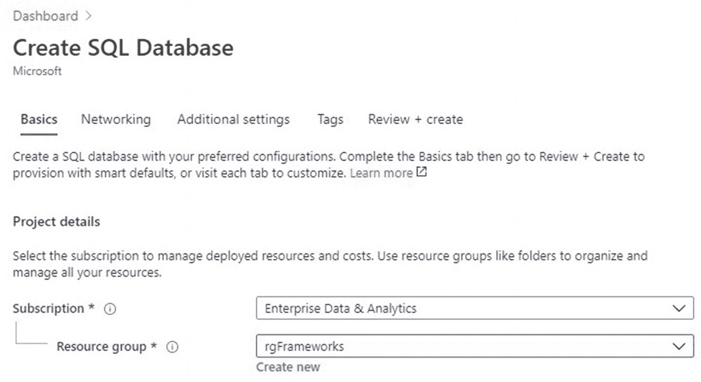
**图 9-2** 配置 Azure SQL 数据库订阅和资源组属性

本例使用名为“rgFrameworks”的资源组。Azure 资源组名称是全局唯一的（且不区分大小写），因此你需要为你的资源组使用不同的名称。

接下来，在“数据”部分配置，为“数据库名称”属性输入“SSISConfig”。请注意，服务器名称是全局唯一的，但数据库名称仅在服务器内唯一，如**图 9-3**所示。

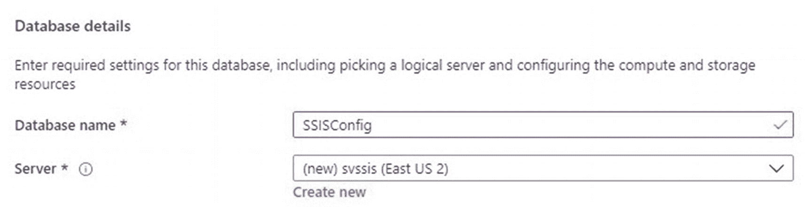
**图 9-3** 配置数据库名称和服务器属性

出于本示例的目的，点击“否”选项来回答“是否要使用 SQL 弹性池？”这个问题。“计算 + 存储”属性默认为“通用目标 Gen5，2 个 vCore，32 GB 存储”，如**图 9-4**所示。

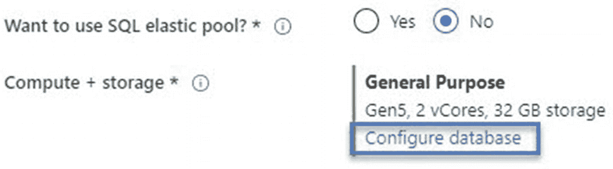
**图 9-4** SQL 弹性池和“计算 + 存储”属性配置

默认的数据库配置对于本示例来说有点过高。点击**图 9-4**中所示的“配置数据库”链接以打开“配置”界面，这将允许更改数据库容量和性能选项，如**图 9-5**所示。

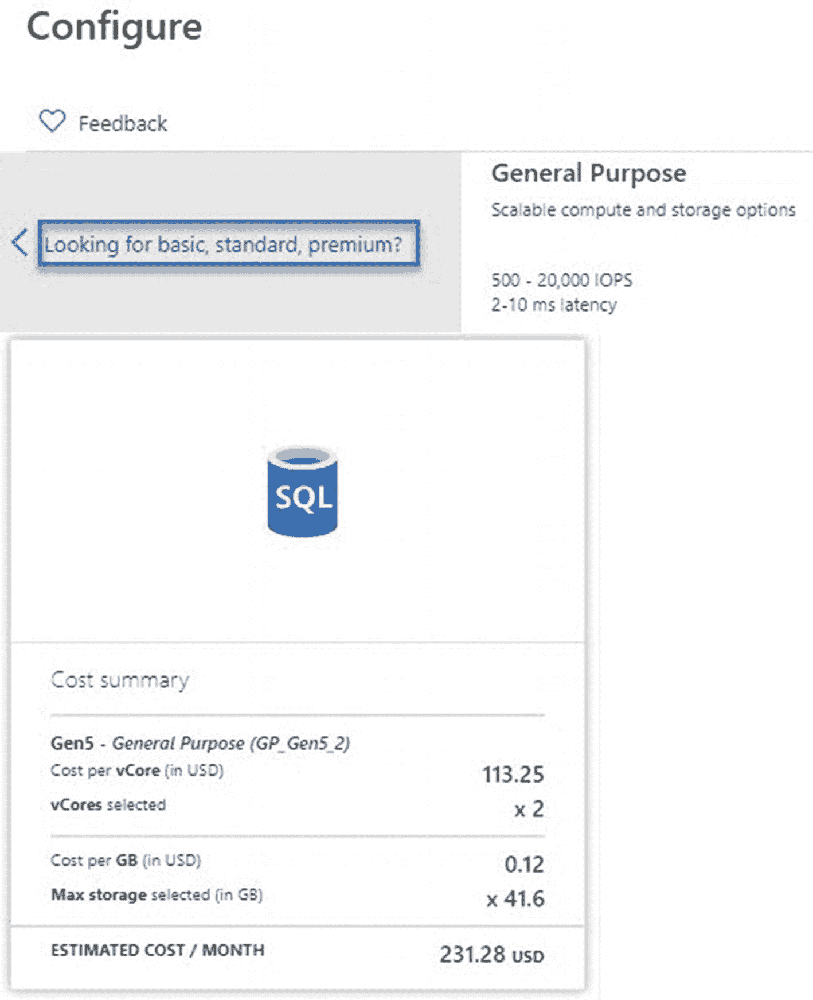
**图 9-5** 配置 Azure SQL 数据库

从**图 9-5**可以看出，默认的数据库配置对于本示例来说也有点*昂贵*。点击“查找基本、标准、高级？”链接，导航并选择“基本”选项，如**图 9-6**所示。

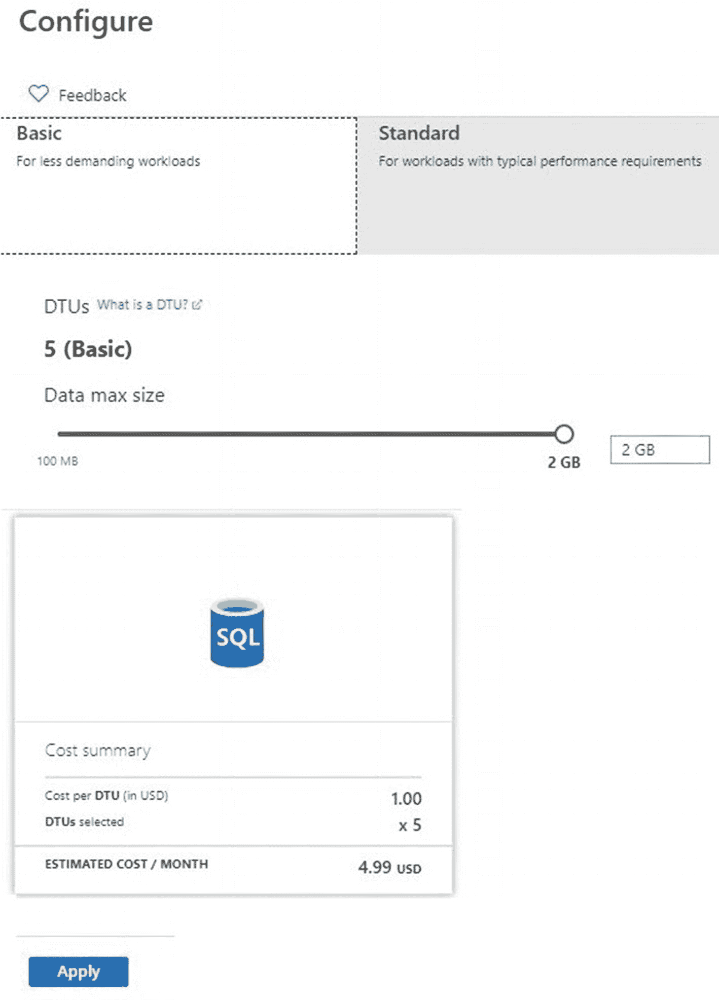
**图 9-6** 重新配置 Azure SQL 数据库

对于本示例来说，2 GB 和 5 个 DTU 已经足够。点击“应用”按钮继续。现在数据库配置会显示更新后的设置，如**图 9-7**所示。

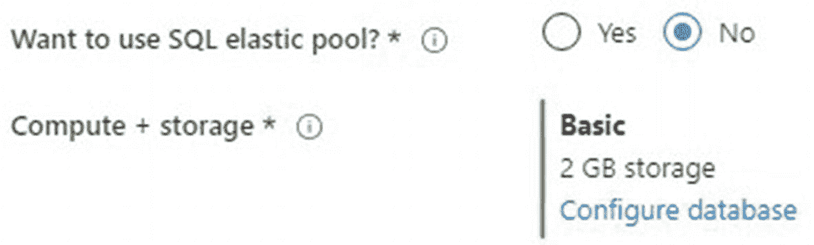
**图 9-7** 更新后的计算 + 存储设置

在创建新的 `SSISConfig` 数据库之前，请仔细检查“其他设置”选项卡的“启用高级数据安全”属性，如**图 9-8**所示。

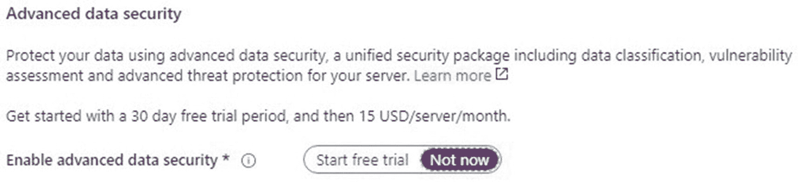
**图 9-8** 配置“启用高级数据安全”属性

如果选择了“开始免费试用”选项，请为本示例将其更改为“暂不”。

在“网络”和“标记”选项卡上，保留默认配置设置。

“查看 + 创建”选项卡应类似于**图 9-9**。

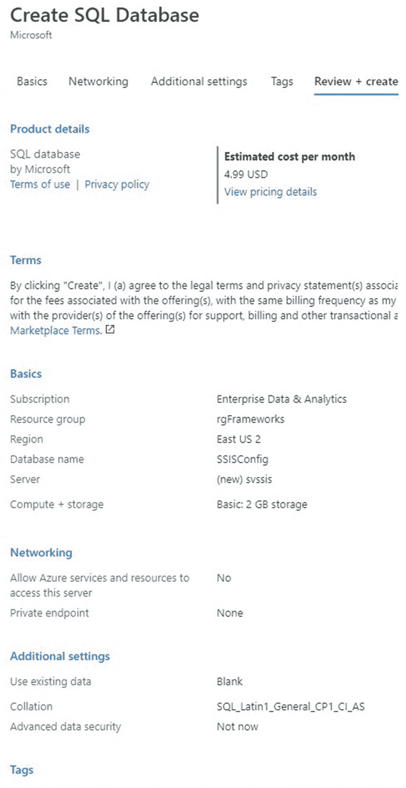
**图 9-9** Azure SQL 数据库的“查看 + 创建”页面

点击“创建”按钮以创建 Azure SQL 数据库。配置 Azure SQL 数据库需要几分钟时间。完成后，门户应类似于**图 9-10**。

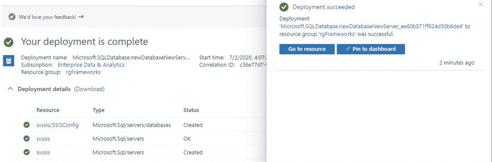
**图 9-10** 已配置的 Azure SQL 数据库

下一步是向新的 Azure SQL 数据库添加 `SSISConfig` 数据库对象。

### 部署简单、自定义、基于文件的 Azure-SSIS 框架

本节重点是将第 5 章和第 7 章中设计的 `SSISConfig` 数据库部署到 Azure SQL `SSISConfig` 数据库实例。

首先，打开 Azure Data Studio（或 SQL Server Management Studio）并连接到最近配置的 Azure SQL 数据库实例，如**图 9-11**所示。

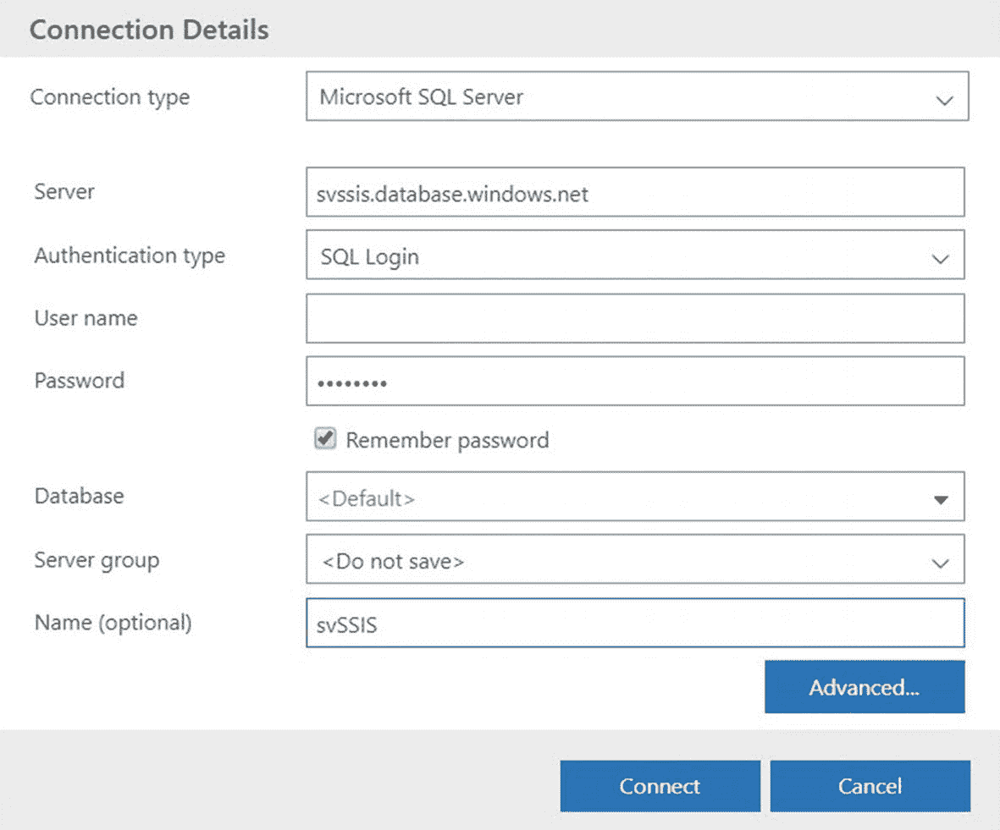
**图 9-11** 连接到新的 Azure SQL 数据库

`SSISConfig` 数据库在上一步中已创建。创建 `SSISConfig` 数据库的脚本类似于第 5 章和第 7 章中使用的脚本，如**代码清单 9-1**所示。

```
print 'SSISConfig database'
If Not Exists(Select [databases].[name]
From [sys].[databases]
Where [databases].[name] = N'SSISConfig')
begin
print ' - Create SSISConfig database'
Create Database SSISConfig
print ' - SSISConfig database created'
end
Else
begin
print ' - SSISConfig database already exists.'
end
print ''
go
```
**代码清单 9-1** 在 Azure SQL 数据库中创建 `SSISConfig`

执行完成后，Azure Data Studio 应显示类似于**图 9-12**中所示的消息。

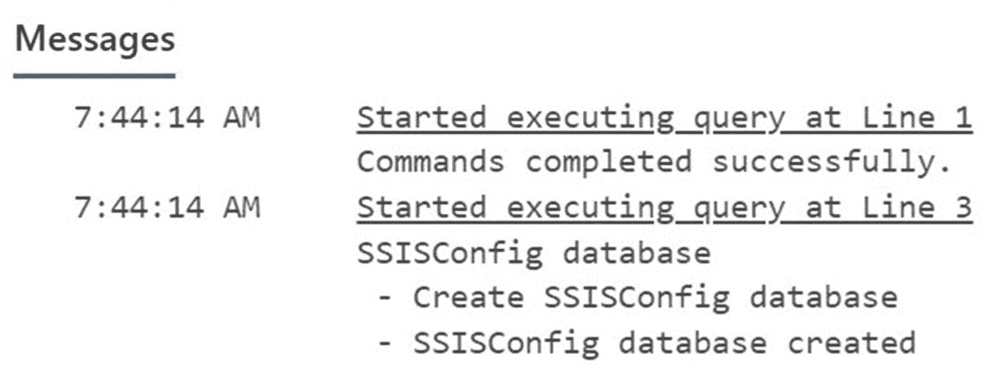
**图 9-12** `SSISConfig` 数据库已创建

在撰写本文时，Azure SQL 数据库中的 T-SQL 不支持 `Use` 命令。如果你尝试使用 `Use` 命令，将生成如**图 9-13**所示的错误。

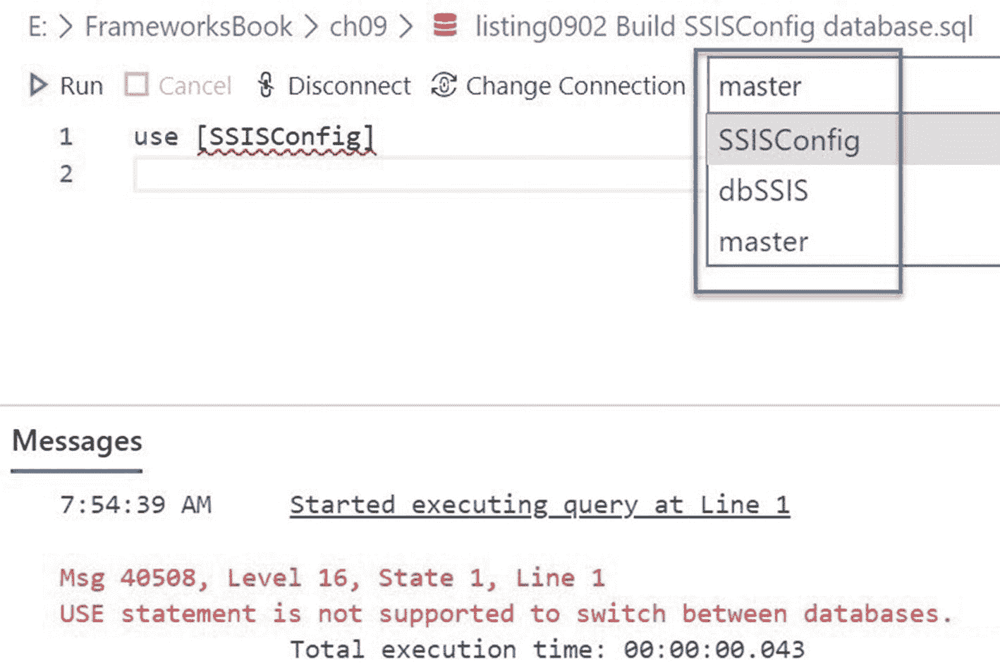
**图 9-13** 这不是“use”……

请使用**图 9-13**中高亮显示的数据库选择器下拉菜单代替 `Use` 命令。

**代码清单 9-2** 合并了第 5 章和第 7 章中剩余的 `SSISConfig` DDL（数据定义语言）语句，用于创建 `SSISConfig` 数据库对象和元数据。


清单 9-2 创建 SSISConfig 数据库对象
```sql
print 'Config 模式'
If Not Exists(Select [schemas].[name]
From [sys].[schemas]
Where [schemas].[name] = N'config')
begin
print ' - 创建 config 模式'
declare @sql nvarchar(100) = N'Create Schema config'
`exec`(@sql)
print ' - Config 模式已创建'
end
Else
begin
print ' - Config 模式已存在。'
end
print ''
go

print 'Config.Applications 表'
If Not Exists(Select [schemas].[name] + '.' + [tables].[name]
As [Schema.Table]
From [sys].[tables]
Join [sys].[schemas]
On [schemas].[schema_id] = [tables].[schema_id]
Where [schemas].[name] = N'config'
And [tables].[name] = N'Applications')
begin
print ' - 创建 config.Applications 表'
Create Table [config].[Applications]
(
ApplicationId int identity(1, 1)
约束 PK_config_Applications 主键聚集
, ApplicationName nvarchar(255) Not NULL
约束 UQ_config_Applications_ApplicationName
唯一
)
print ' - Config.Applications 表已创建'
end
Else
begin
print ' - Config.Applications 表已存在。'
end
print ''
go

print 'Config.Packages 表'
If Not Exists(Select [schemas].[name] + '.' + [tables].[name]
As [Schema.Table]
From [sys].[tables]
Join [sys].[schemas]
On [schemas].[schema_id] = [tables].[schema_id]
Where [schemas].[name] = N'config'
And [tables].[name] = N'Packages')
begin
print ' - 创建 config.Packages 表'
Create Table [config].[Packages]
(
PackageId int identity(1, 1)
约束 PK_config_Packages 主键聚集
, PackageLocation nvarchar(255) Not NULL
, PackageName nvarchar(255) Not NULL
, 约束 UQ_config_Packages_PackageName
唯一(PackageLocation, PackageName)
)
print ' - Config.Packages 表已创建'
end
Else
begin
print ' - Config.Packages 表已存在。'
end
print ''
go

print 'Config.ApplicationPackages 表'
If Not Exists(Select [schemas].[name] + '.' + [tables].[name]
As [Schema.Table]
From [sys].[tables]
Join [sys].[schemas]
On [schemas].[schema_id] = [tables].[schema_id]
Where [schemas].[name] = N'config'
And [tables].[name] = N'ApplicationPackages')
begin
print ' - 创建 config.ApplicationPackages 表'
Create Table [config].[ApplicationPackages]
(
ApplicationPackageId int identity(1, 1)
约束 PK_config_ApplicationPackages 主键聚集
, ApplicationId int Not NULL
约束 FK_config_ApplicationPackages_config_Applications
外键引用 [config].Applications
, PackageId int Not NULL
约束 FK_config_ApplicationPackages_config_Packages
外键引用 [config].Packages
, ExecutionOrder int Not NULL
约束 DF_config_ApplicationPackages_ExecutionOrder
默认(10)
, ApplicationPackageEnabled bit Not NULL
约束 DF_config_ApplicationPackages_ApplicationPackageEnabled
默认(1)
, FailApplicationOnPackageFailure bit Not NULL
约束 DF_config_ApplicationPackages_FailApplicationOnPackageFailure
默认(1)
, 约束 UQ_config_ApplicationPackages_ApplicationId_PackageId_ExecutionOrder
唯一(ApplicationId, PackageId, ExecutionOrder)
)
print ' - Config.ApplicationPackages 表已创建'
end
Else
begin
print ' - Config.ApplicationPackages 表已存在。'
end
print ''
go

Set NoCount ON
`declare` `@ApplicationName` nvarchar(255) = N'框架测试'
print `@ApplicationName`
`declare` `@ApplicationId` int = (Select [Applications].[ApplicationId]
From [config].[Applications]
Where [Applications].[ApplicationName] = `@ApplicationName`)
If (`@ApplicationId` Is NULL)
begin
print ' - 正在将 ' + `@ApplicationName` + ' 应用程序添加到 config.Applications 表'
`declare` `@AppTbl` table(ApplicationId int)
Insert Into [config].[Applications]
(ApplicationName)
Output inserted.ApplicationId into `@AppTbl`
Values (`@ApplicationName`)
Set `@ApplicationId` = (Select ApplicationId
From `@AppTbl`)
print ' - ' + `@ApplicationName` + ' 应用程序已添加到 config.Applications 表'
end
Else
begin
print ' - ' + `@ApplicationName` + ' 应用程序已存在于 config.Applications 表中。'
end
Select `@ApplicationId` As ApplicationId
print ''
go

Set NoCount ON
`declare` `@PackageLocation` nvarchar(255) = N'E:\Projects\TestSSISSolution\TestSSISProject\'
`declare` `@PackageName` nvarchar(255) = N'ReportAndSucceed.dtsx'
print `@PackageLocation` + `@PackageName`
`declare` `@PackageId` int = (Select [Packages].[PackageId]
From [config].[Packages]
Where [Packages].[PackageLocation] = `@PackageLocation`
And [Packages].[PackageName] = `@PackageName`)
If (`@PackageId` Is NULL)
begin
print ' - 正在将 ' + `@PackageName` + ' 包添加到 config.Packages 表'
`declare` `@PkgTbl` table(PackageId int)
Insert Into [config].[Packages]
(PackageLocation, PackageName)
Output inserted.PackageId into `@PkgTbl`
Values (`@PackageLocation`, `@PackageName`)
Set `@PackageId` = (Select PackageId
From `@PkgTbl`)
print ' - ' + `@PackageName` + ' 包已添加到 config.Packages 表'
end
Else
begin
print ' - ' + `@PackageName` + ' 包已存在于 config.Packages 表中。'
end
Select `@PackageId` As PackageId
print ''

set `@PackageName` = N'ReportAndFail.dtsx'
print `@PackageLocation` + `@PackageName`
set `@PackageId` = (Select [Packages].[PackageId]
From [config].[Packages]
Where [Packages].[PackageLocation] = `@PackageLocation`
And [Packages].[PackageName] = `@PackageName`)
If (`@PackageId` Is NULL)
begin
print ' - 正在将 ' + `@PackageName` + ' 应用程序添加到 config.Packages 表'
Delete `@PkgTbl`
Insert Into [config].[Packages]
(PackageLocation, PackageName)
Output inserted.PackageId into `@PkgTbl`
Values (`@PackageLocation`, `@PackageName`)
Set `@PackageId` = (Select PackageId
From `@PkgTbl`)
print ' - ' + `@PackageName` + ' 包已添加到 config.Packages 表'
end
Else
begin
print ' - ' + `@PackageName` + ' 包已存在于 config.Packages 表中。'
end
Select `@PackageId` As PackageId
print ''
go

Set NoCount ON
`declare` `@ApplicationName` nvarchar(255) = N'框架测试'
`declare` `@PackageLocation` nvarchar(255) = N'E:\Projects\TestSSISSolution\TestSSISProject\'
`declare` `@PackageName` nvarchar(255) = N'ReportAndSucceed.dtsx'
`declare` `@ExecutionOrder` int = 10
print `@ApplicationName` + ' - ' + `@PackageLocation` + `@PackageName`
`declare` `@ApplicationId` int = (Select [Applications].[ApplicationId]
From [config].[Applications]
Where [Applications].[ApplicationName] = `@ApplicationName`)
`declare` `@PackageId` int = (Select [Packages].[PackageId]
From [config].[Packages]
Where [Packages].[PackageLocation] = `@PackageLocation`
And [Packages].[PackageName] = `@PackageName`)
`declare` `@ApplicationPackageId` int = (Select ApplicationPackageId
From config.ApplicationPackages
Where ApplicationId = `@ApplicationId`
And PackageId = `@PackageId`
And ExecutionOrder = `@ExecutionOrder`)
If (`@ApplicationPackageId` Is NULL)
begin
print ' - 正在将 ' + `@PackageName` + ' 包分配给 '
+ `@ApplicationName` + ' 应用程序'
+ ' 到 config.ApplicationPackages 表中'
+ ' 执行顺序为 ' + `Convert`(varchar(9), `@ExecutionOrder`)
Insert Into [config].[ApplicationPackages]
(ApplicationId
, PackageId
, ExecutionOrder)
Values (`@ApplicationId`
, `@PackageId`
, `@ExecutionOrder`)
print ' - ' + `@PackageName` + ' 包已分配给 '
+ `@ApplicationName` + ' 应用程序'
+ ' 到 config.ApplicationPackages 表中'
+ ' 执行顺序为 ' + `Convert`(varchar(9), `@ExecutionOrder`)
end
Else
begin
print ' - ' + `@PackageName` + ' 包已'
+ ' 分配给 ' + `@ApplicationName`
+ ' 应用程序到 config.ApplicationPackages 表中'
+ ' 执行顺序为 ' + `Convert`(varchar(9), `@ExecutionOrder`)
+ '。'
end
print ''

set `@PackageName` = N'ReportAndFail.dtsx'
set `@ExecutionOrder` = 20
print `@ApplicationName` + ' - ' + `@PackageLocation` + `@PackageName`
set `@ApplicationId` = (Select [Applications].[ApplicationId]
From [config].[Applications]
Where [Applications].[ApplicationName] = `@ApplicationName`)
set `@PackageId` = (Select [Packages].[PackageId]
From [config].[Packages]
Where [Packages].[PackageLocation] = `@PackageLocation`
And [Packages].[PackageName] = `@PackageName`)
set `@ApplicationPackageId` = (Select ApplicationPackageId
From config.ApplicationPackages
Where ApplicationId = `@ApplicationId`
And PackageId = `@PackageId`
And ExecutionOrder = `@ExecutionOrder`)
If (`@ApplicationPackageId` Is NULL)
begin
print ' - 正在将 ' + `@PackageName` + ' 包分配给 '
+ `@ApplicationName` + ' 应用程序'
+ ' 到 config.ApplicationPackages 表中'
+ ' 执行顺序为 ' + `Convert`(varchar(9), `@ExecutionOrder`)
Insert Into [config].[ApplicationPackages]
(ApplicationId
, PackageId
, ExecutionOrder)
Values (`@ApplicationId`
, `@PackageId`
, `@ExecutionOrder`)
print ' - ' + `@PackageName` + ' 包已分配给 '
+ `@ApplicationName` + ' 应用程序'
+ ' 到 config.ApplicationPackages 表中'
+ ' 执行顺序为 ' + `Convert`(varchar(9), `@ExecutionOrder`)
end
Else
begin
print ' - ' + `@PackageName` + ' 包已'
+ ' 分配给 ' + `@ApplicationName`
+ ' 应用程序到 config.ApplicationPackages 表中'
+ ' 执行顺序为 ' + `Convert`(varchar(9), `@ExecutionOrder`)
+ '。'
end
print ''
go

print 'Log 模式'
If Not Exists(Select [schemas].[name]
From [sys].[schemas]
Where [schemas].[name] = N'log')
begin
print ' - 创建 log 模式'
`declare` `@sql` nvarchar(100) = N'Create Schema log'
`exec`(`@sql`)
print ' - Log 模式已创建'
end
Else
begin
print ' - Log 模式已存在。'
end
print ''
go

print 'Log.ApplicationInstance 表'
If Not Exists(Select [schemas].[name] + '.' + [tables].[name]
As [Schema.Table]
From [sys].[tables]
Join [sys].[schemas]
On [schemas].[schema_id] = [tables].[schema_id]
Where [schemas].[name] = N'log'
And [tables].[name] = N'ApplicationInstance')
begin
print ' - 创建 log.ApplicationInstance 表'
Create Table [log].[ApplicationInstance]
(
ApplicationInstanceId int identity(1, 1)
约束 PK_log_ApplicationInstance 主键聚集
, ApplicationId int Not NULL
约束 FK_log_ApplicationInstance_config_Applications
外键引用 [config].Applications
, ApplicationStartTime datetimeoffset(7) Not NULL
约束 DF_log_ApplicationInstance_ApplicationStartTime
默认(`sysdatetimeoffset`())
, ApplicationEndTime datetimeoffset(7) NULL
, ApplicationStatus nvarchar(25) Not NULL
约束 DF_log_ApplicationInstance_ApplicationStatus
默认(N'运行中')
)
print ' - Log.ApplicationInstance 表已创建'
end
Else
begin
print ' - Log.ApplicationInstance 表已存在。'
end
print ''
go

print 'Log.ApplicationPackageInstance 表'
If Not Exists(Select [schemas].[name] + '.' + [tables].[name]
As [Schema.Table]
From [sys].[tables]
Join [sys].[schemas]
On [schemas].[schema_id] = [tables].[schema_id]
Where [schemas].[name] = N'log'
And [tables].[name] = N'ApplicationPackageInstance')
begin
print ' - 创建 log.ApplicationPackageInstance 表'
Create Table [log].[ApplicationPackageInstance]
(
ApplicationPackageInstanceId int identity(1, 1)
约束 PK_log_ApplicationPackageInstance 主键聚集
, ApplicationInstanceId int Not NULL
约束 FK_log_ApplicationPackageInstance_log_ApplicationInstance
外键引用 [log].ApplicationInstance
, ApplicationPackageId int Not NULL
约束 FK_log_ApplicationPackageInstance_config_ApplicationPackages
外键引用 [config].ApplicationPackages
, ApplicationPackageStartTime datetimeoffset(7) Not NULL
约束 DF_log_ApplicationPackageInstance_ApplicationPackageStartTime
默认(`sysdatetimeoffset`())
, ApplicationPackageEndTime datetimeoffset(7) NULL
, ApplicationPackageStatus nvarchar(25) Not NULL
约束 DF_log_ApplicationPackageInstance_ApplicationPackageStatus
默认(N'运行中')
)
print ' - Log.ApplicationPackageInstance 表已创建'
end
Else
begin
print ' - Log.ApplicationPackageInstance 表已存在。'
end
print ''
go
```


如果一切按计划进行，脚本将返回如图 9-14 所示的结果。

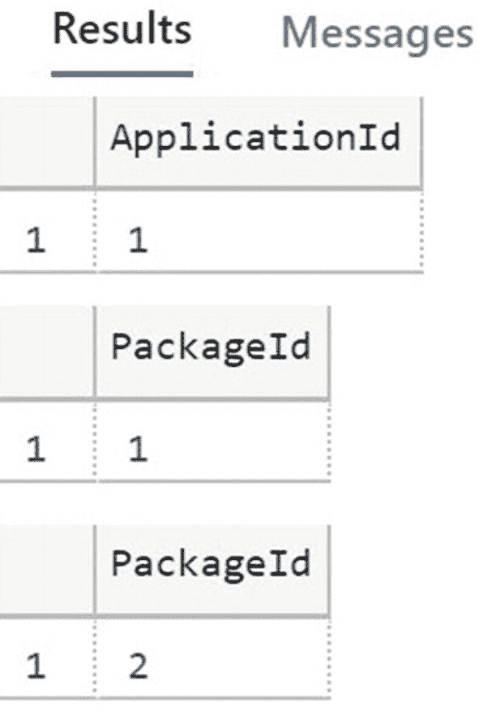
图 9-14：查询执行结果

在清单 9-2 中执行 T-SQL 查询返回的消息如清单 9-3 所示。

```
Started executing query at Line 1
Config schema
- Create config schema
- Config schema created
Started executing query at Line 17
Config.Applications table
- Create config.Applications table
- Config.Applications table created
Started executing query at Line 43
Config.Packages table
- Create config.Packages table
- Config.Packages table created
Started executing query at Line 70
Config.ApplicationPackages table
- Create config.ApplicationPackages table
- Config.ApplicationPackages table created
Started executing query at Line 110
Framework Test
- Adding Framework Test application to config.Applications table
- Framework Test application added to config.Applications table
Started executing query at Line 143
E:\Projects\TestSSISSolution\TestSSISProject\ReportAndSucceed.dtsx
- Adding ReportAndSucceed.dtsx package to config.Packages table
- ReportAndSucceed.dtsx package added to config.Packages table
E:\Projects\TestSSISSolution\TestSSISProject\ReportAndFail.dtsx
- Adding ReportAndFail.dtsx application to config.Packages table
- ReportAndFail.dtsx package added to config.Packages table
Started executing query at Line 209
Framework Test - E:\Projects\TestSSISSolution\TestSSISProject\ReportAndSucceed.dtsx
- Assigning ReportAndSucceed.dtsx package to Framework Test application ➤
in config.ApplicationPackages table at ExecutionOrder 10
- ReportAndSucceed.dtsx package assigned to Framework Test application ➤
in config.ApplicationPackages table at ExecutionOrder 10
Framework Test - E:\Projects\TestSSISSolution\TestSSISProject\ReportAndFail.dtsx
- Assigning ReportAndFail.dtsx package to Framework Test application ➤
in config.ApplicationPackages table at ExecutionOrder 20
- ReportAndFail.dtsx package assigned to Framework Test application ➤
in config.ApplicationPackages table at ExecutionOrder 20
Log.ApplicationInstance table
- Create log.ApplicationInstance table
- Log.ApplicationInstance table created
Log.ApplicationPackageInstance table
- Create log.ApplicationPackageInstance table
- Log.ApplicationPackageInstance table created
Total execution time: 00:00:00.557
Listing 9-3: Messages returned from SSISConfig artifact and metadata creation
```

使用清单 9-4 中所示的 T-SQL 查询来测试部署和测试元数据插入。

```
Select a.ApplicationName
, p.PackageLocation + p.PackageName As PackagePath
, ap.ExecutionOrder
, ap.FailApplicationOnPackageFailure
From [config].[ApplicationPackages] ap
Join [config].[Applications] a
On a.ApplicationId = ap.ApplicationId
Join [config].Packages p
On p.PackageId = ap.PackageId
Where a.ApplicationName = N'Framework Test'
And ap.ApplicationPackageEnabled = 1
Order By ap.ExecutionOrder
```
清单 9-4：检索 SSIS 应用程序元数据

如果一切按计划进行，你的结果应该与图 9-15 相似。

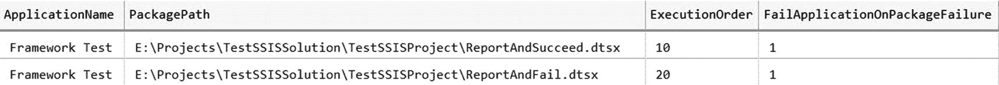
图 9-15：Azure SQL 数据库 SSISConfig 中的测试 SSIS 应用程序

如果你的 SSISConfig 数据库查询结果如图 9-10 所示，那么恭喜你！你正确遵循了说明。但说明中存在一个问题：Azure Data Factory 版本的 SSIS 执行引擎将如何找到我的——或者你的——本地驱动器（在此例中是我的 E 盘）？简短的答案是，“这会很困难”。

在我们更新 PackagePath 元数据之前，让我们先预配一个 Azure 文件共享。

### 预配 Azure 文件共享

首先从 storageexplorer.com 下载 Microsoft Azure Storage Explorer，如图 9-16 所示。


图 9-16：浏览到 StorageExplorer.com 下载 Azure Storage Explorer

安装 Azure Storage Explorer，并连接到上一章中预配的 Azure 存储帐户。连接后，存储资源管理器会显示一个类似于图 9-17 的资源管理器窗口。

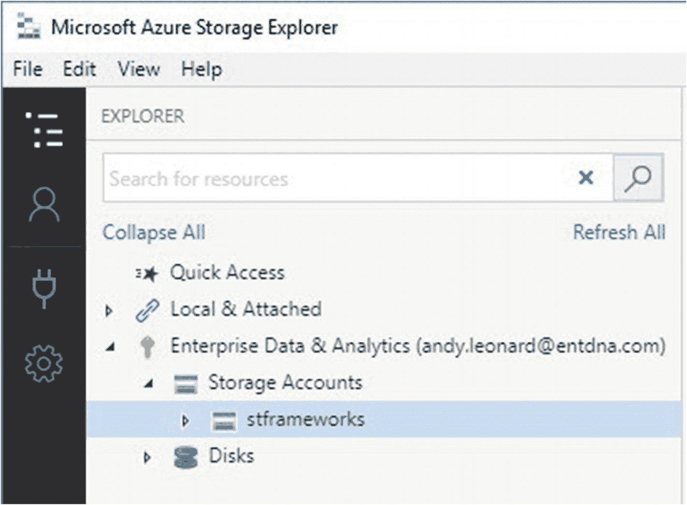
图 9-17：在 Azure Storage Explorer 中查看资源管理器

在第 8 章中，我们预配了一个名为“stframeworks”的存储帐户，我们在图 9-17 的 Microsoft Azure Storage Explorer 截图中看到了它。展开 stframeworks 存储帐户以显示 Blob 容器、文件共享、查询和表的虚拟文件夹，如图 9-18 所示。

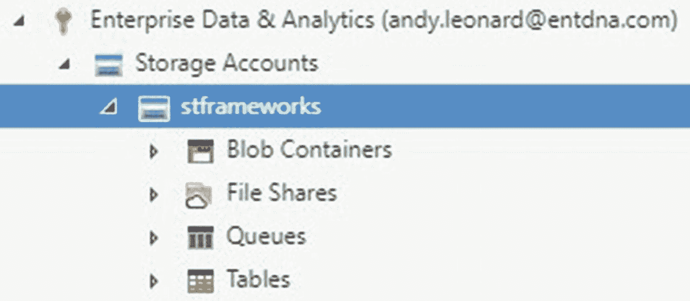
图 9-18：stframeworks 虚拟文件夹

右键单击“文件共享”虚拟文件夹，然后单击“创建文件共享”，如图 9-19 所示。

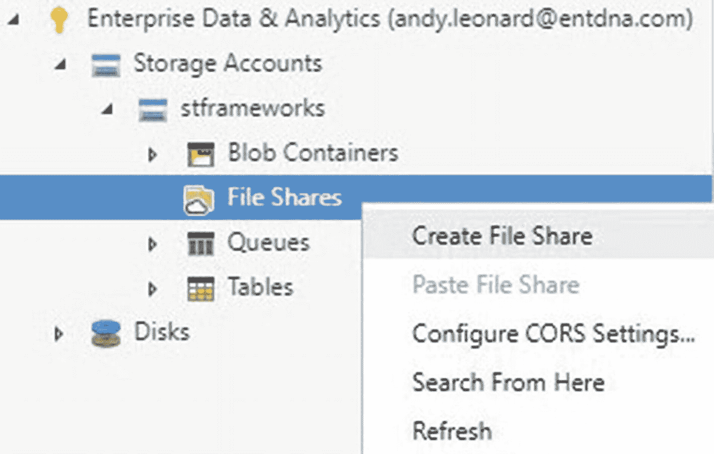
图 9-19：创建新的文件共享

当新的文件共享显示时，输入文件共享的名称——例如“fs-ssis”，如图 9-20 所示。

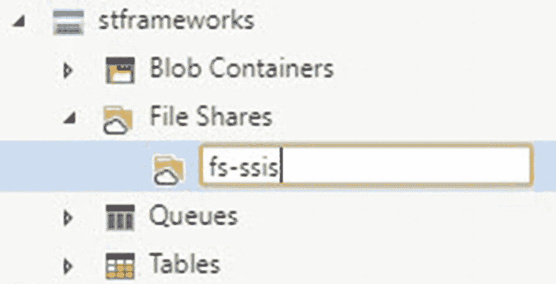
图 9-20：命名新的文件共享

按 Enter 键完成文件共享的创建。

我们的新文件共享现已打开，准备好在 Azure 中存储 SSIS 包，如图 9-21 所示。

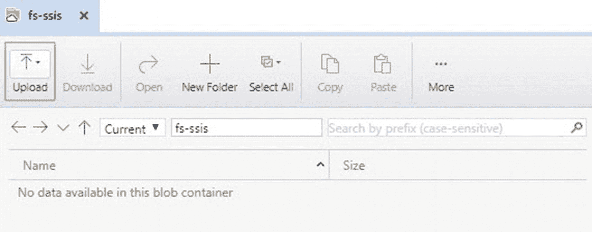
图 9-21：新的 fs-ssis 文件共享


### 上传 SSIS 包

使用存储资源管理器上传 SSIS 包非常简单。如图 9-22 所示，点击“上传”按钮开始操作。

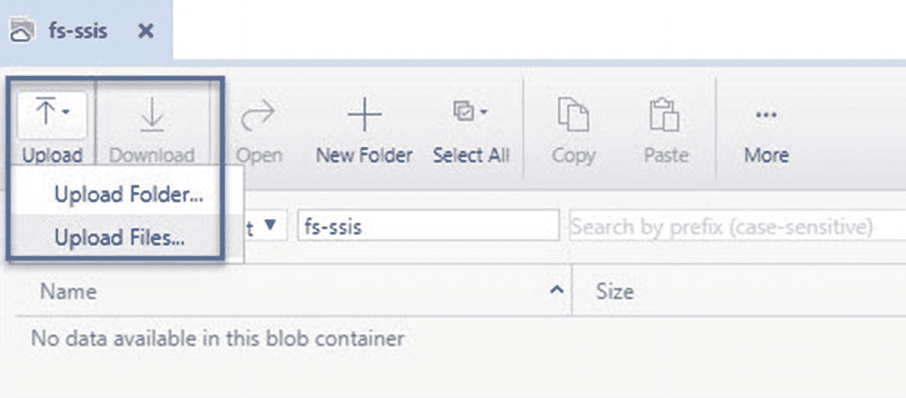
*图 9-22: 准备将 SSIS 包上传到文件共享*

如图 9-22 所示，您可以上传文件夹或文件。

点击“上传文件...”以打开“上传文件”对话框。首先，选择要上传的一个或多个文件——例如第[5]章(#497846_1_En_5_Chapter.xhtml)中开发的 `ReportAndSucceed.dtsx` 和 `ReportAndFail.dtsx` SSIS 包。其次，接受默认的目标目录（`"/"`）。第三，如图 9-23 所示，点击“上传”按钮。

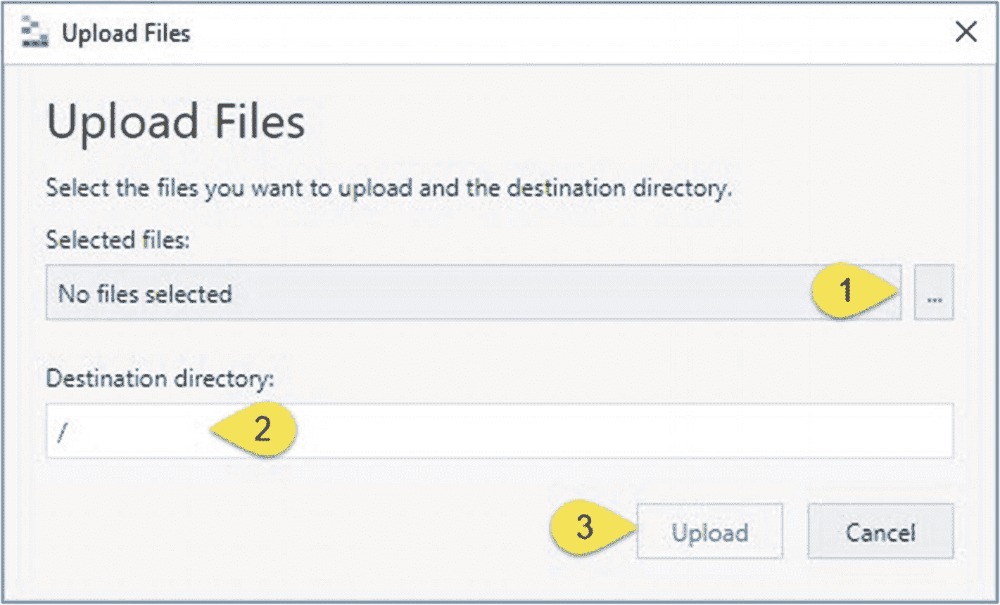
*图 9-23: 配置向文件共享的上传*

上传完成后，您可以在 Azure 存储资源管理器的“活动”窗口中查看操作结果，如图 9-24 所示。

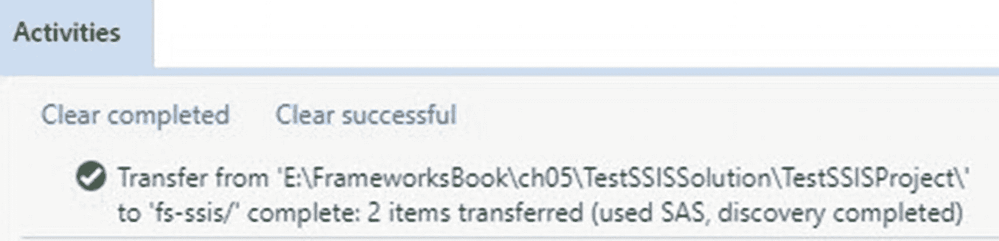
*图 9-24: 查看与上传相关的活动*

`ReportAndSucceed.dtsx` 和 `ReportAndFail.dtsx` SSIS 包已上传，现在在 `fs-ssis` 文件共享中可见，如图 9-25 所示。

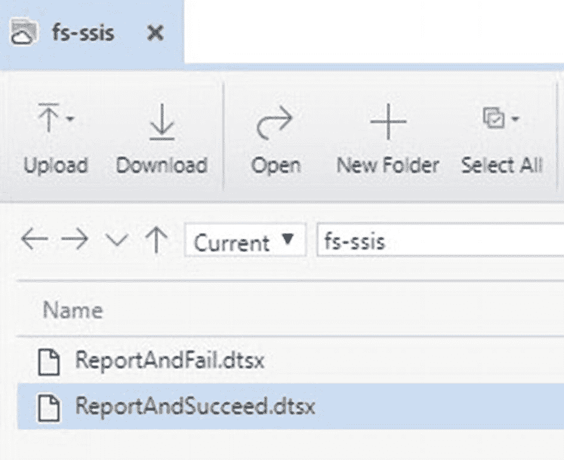
*图 9-25: 已上传的 `ReportAndSucceed.dtsx` 和 `ReportAndFail.dtsx` SSIS 包*

下一步是更新 `SSISConfig` 数据库 `config.Packages` 表中的元数据，以反映包所在的文件共享位置。

### 更新 `PackageLocation` 值

问题：一个执行存储在本地文件存储中的 SSIS 包的简单、自定义、基于文件的 SSIS 框架，与一个执行存储在 Azure 文件共享中的 SSIS 包的简单、自定义、基于文件的 SSIS 框架，有何区别？

答案：一个元数据值。

执行清单 9-5 中所示的 T-SQL Update 语句，以更新存储在 `config.Packages` 表中的 `PackageLocation` 值。

```sql
Select p.PackageLocation + p.PackageName As PackagePath
From [config].[Packages] p
Update [config].[Packages]
Set PackageLocation  = N'\\stframeworks.file.core.windows.net\fs-ssis\'
Where PackageLocation  = N'E:\Projects\TestSSISSolution\TestSSISProject\'
Select p.PackageLocation + p.PackageName As PackagePath
From [config].[Packages] p
```
*清单 9-5: 更新 `config.Packages` 表的 `PackageLocation` 值*

执行清单 9-5 中所示的 T-SQL 后，结果应与图 9-26 类似。

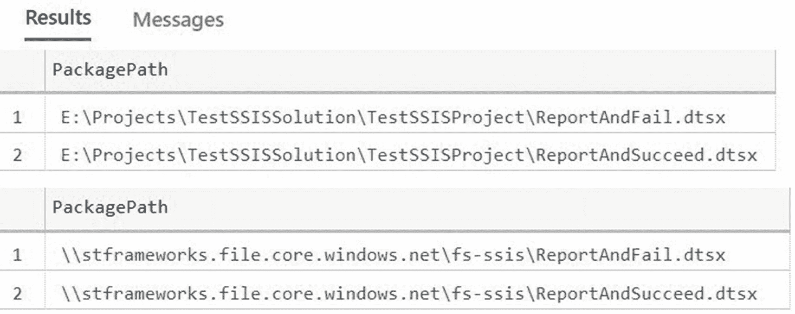
*图 9-26: 更新 `config.Packages` 元数据*

现在我们已经准备好构建 SSIS 框架执行引擎——Azure 数据工厂版本。

### 构建 SSIS 框架 ADF 执行引擎

到目前为止，部署一个执行存储在 Azure 文件共享中的 SSIS 包的简单、自定义、基于文件的 SSIS 框架，无需更改 SSIS 框架元数据数据库的基础架构，只需更改元数据，并且仅限于更改单个字段中存储的值。

SSIS 框架执行引擎是一个 Azure 数据工厂管道，而管道与 SSIS 包不同。这些差异将导致数据库及其他地方的更改。

#### 检索 SSIS 包列表

要开始在 ADF 中构建 SSIS 框架执行引擎，请连接到 Azure 数据工厂实例的“创作和监视”站点，点击“按名称筛选资源”文本框旁的“+”，然后点击“管道”以创建新管道，如图 9-27 所示。

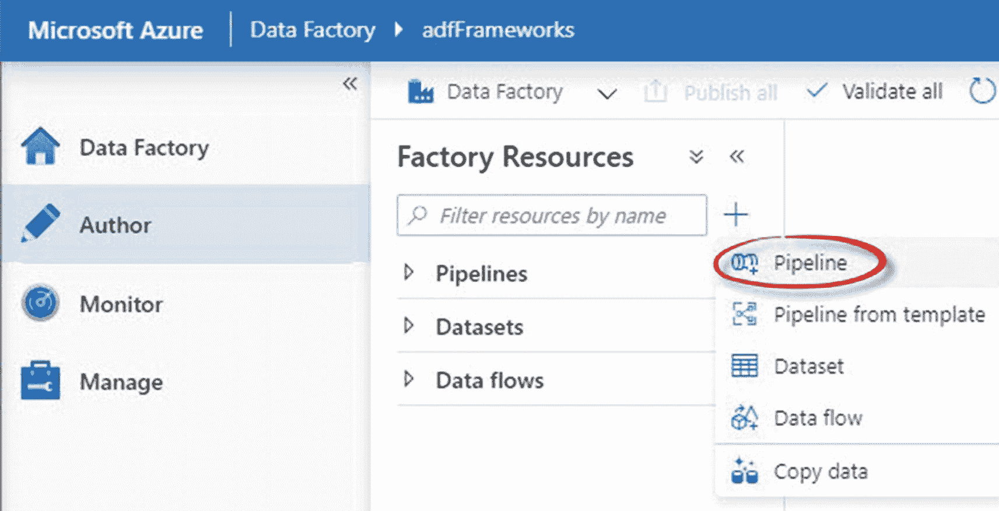
*图 9-27: 创建新的 ADF 管道*

新管道打开后，将其名称更改为“parent”，如图 9-28 所示。

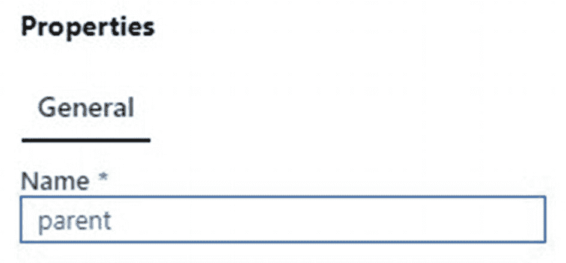
*图 9-28: 将新管道重命名为 "parent"*

在“活动”窗格中，展开“常规”类别，然后将一个“查找”活动拖到管道画布上。将此查找活动重命名为“获取应用程序包”，如图 9-29 所示。

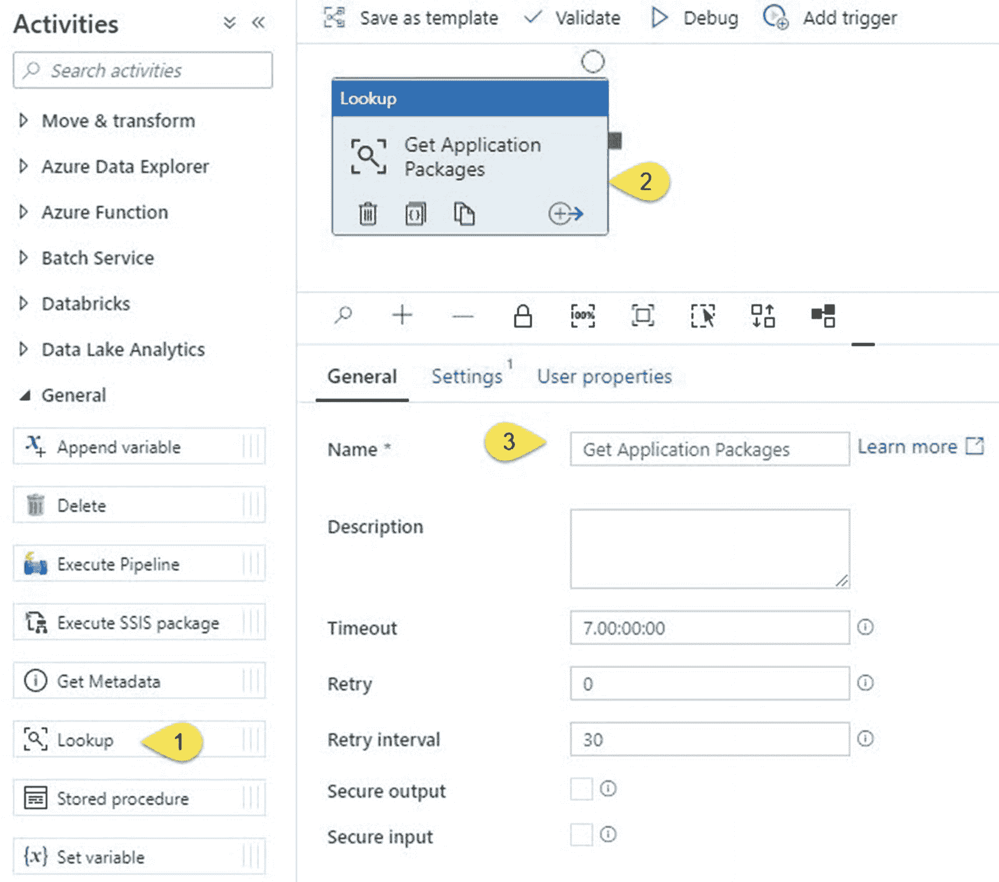
*图 9-29: 向父管道添加并重命名一个查找活动*

Azure 数据工厂的一个很棒的特性是灵活的创作顺序，或称为“FOA”。FOA 意味着可以从任一方向进行 ADF 开发：自底向上或自顶向下。

自底向上的 ADF 开发涉及*首先*构建链接服务——以允许管道构件与位于管道外部的数据存储和服务进行通信。以自底向上方式构建链接服务后，再开发数据集。数据集使用链接服务并向管道构件呈现数据集合。如果您熟悉 SSIS，那么 ADF 链接服务类似于 SSIS 连接管理器，而 ADF 数据集则（不太准确地）类似于 SSIS 数据流源和目标适配器。

对于本示例，我将利用 FOA 进行自顶向下的开发。自顶向下的 ADF 开发是什么样的呢？在接下来的几节中，我将点击并选择“新建”按钮、链接和选项，来构建如数据集和链接服务等 ADF 构件。

在“获取应用程序包”查找活动的“设置”选项卡上，点击“+ 新建”链接以配置“源数据集”属性，如图 9-30 所示。

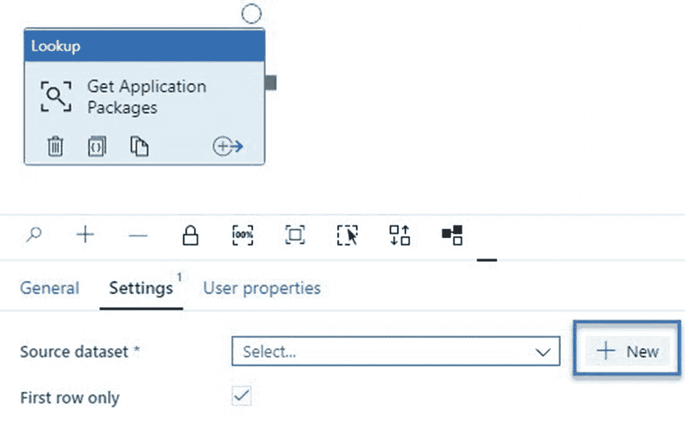
*图 9-30: 添加新的源数据集*

当“新建数据集”窗格显示时，选择“Azure SQL 数据库”，然后点击“继续”按钮，如图 9-31 所示。

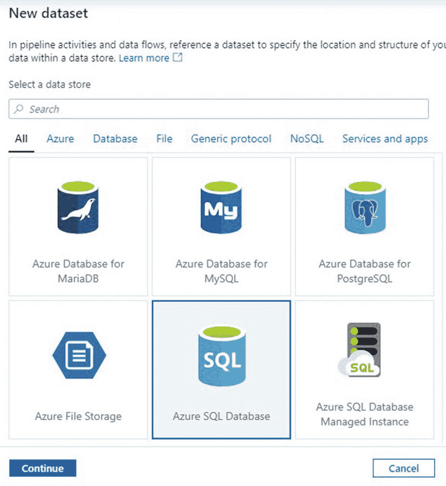
*图 9-31: 配置新数据集的数据存储类型*

设置数据集的“名称”属性；我将我的数据集命名为 `ssisFrameworkDataSet`。点击“链接服务”下拉列表，然后点击“+ 新建”选项，如图 9-32 所示。

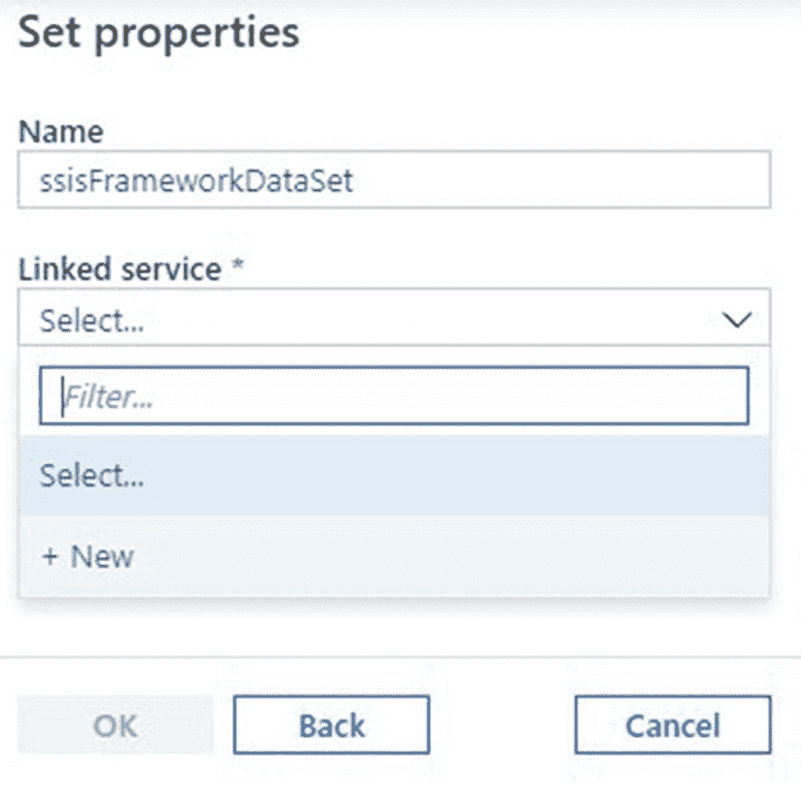
*图 9-32: 配置数据集名称和链接服务属性*

当“新建链接服务 (Azure SQL 数据库)”页面显示时，输入一个名称和可选的描述。将“通过集成运行时连接”选项保留为其默认值，即 `AutoResolveIntegrationRuntime`。

出于本示例的目的，选择“连接字符串”作为连接源，然后为“帐户选择方法”属性选择“从 Azure 订阅”选项。在订阅下拉列表中选择您的“Azure 订阅”，在“服务器名称”下拉列表中选择您在预配 Azure SQL 数据库时创建的服务器名称，然后在“数据库名称”下拉列表中选择您预配的 Azure SQL 数据库的名称。


### 配置 Azure SQL 连接并解决常见错误

### 步骤一：配置连接与测试

在“身份验证类型”下拉菜单中选择“SQL 身份验证”，然后分别在“用户名”和“密码”文本框中输入你的 Azure SQL 数据库用户名和密码。

现在可以测试连接了。单击“测试连接”链接以测试连接性。连接测试应该会失败，如图 9-33 所示。

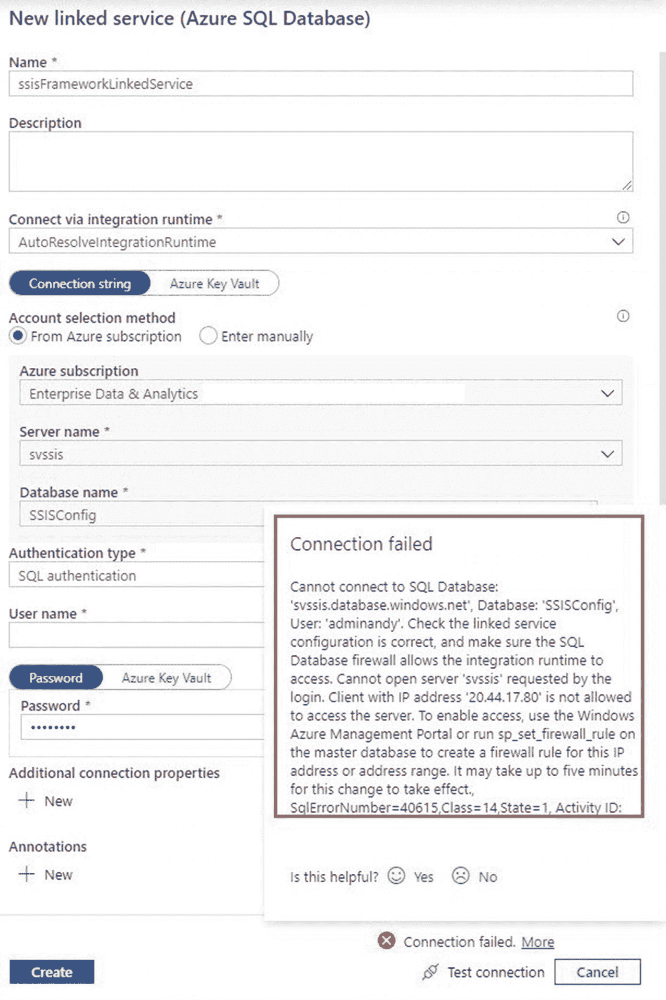
**图 9-33** 连接测试失败

在此示例中包含此错误的原因是它非常常见。要解决此错误，请在新浏览器选项卡中打开 Azure 门户，将鼠标悬停在 Azure 左侧菜单中的“SQL 数据库”上，以提示显示 SQL 数据库的“悬停卡片”，如图 9-34 所示。

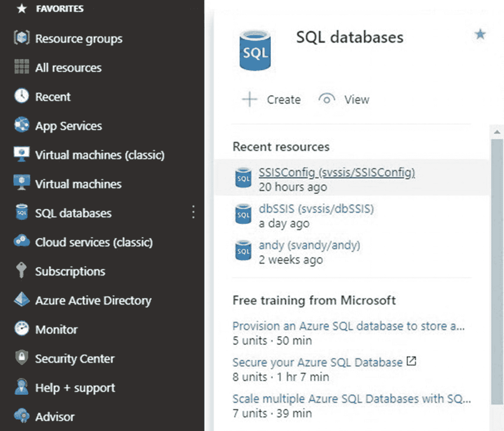
**图 9-34** 查看 SQL 数据库

单击最近预配的 `SSISConfig` 数据库以打开 `SSISConfig` 页面，如图 9-35 所示。

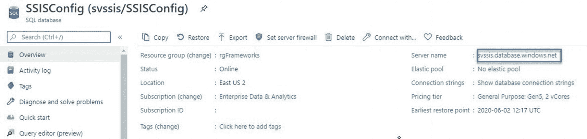
**图 9-35** `SSISConfig` Azure SQL 数据库界面

在“概览”页面上，单击服务器名称链接（本例中为“svssis.database.windows.net”）——如图 9-35 所示——以打开服务器界面，如图 9-36 所示。

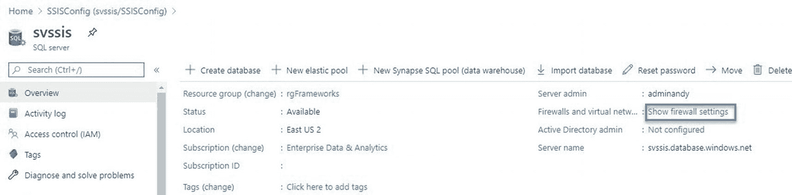
**图 9-36** 托管 `SSISConfig` Azure SQL 数据库的服务器

当服务器概览页面显示时，单击“显示防火墙设置”链接以打开“防火墙和虚拟网络”页面。将“允许 Azure 服务和资源访问此服务器”更改为“是”，如图 9-37 所示。

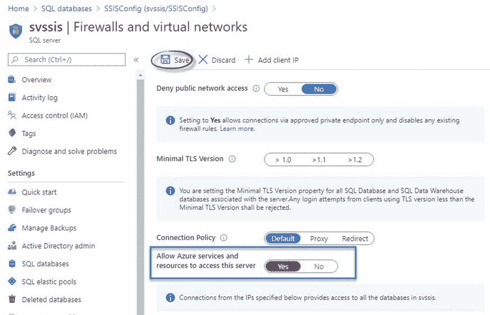
**图 9-37** 更新“允许 Azure 服务和资源访问此服务器”

单击图 9-37 中所示的“保存”按钮，将“允许 Azure 服务和资源访问此服务器”的更新存储起来，然后返回到 Azure Data Factory 中的“新建链接服务”配置。确保完成链接服务配置（在下图中，“用户名”属性值已被编辑隐藏）。单击“测试连接”以重新测试到 `SSISConfig` 数据库的连接，结果应与图 9-38 类似。

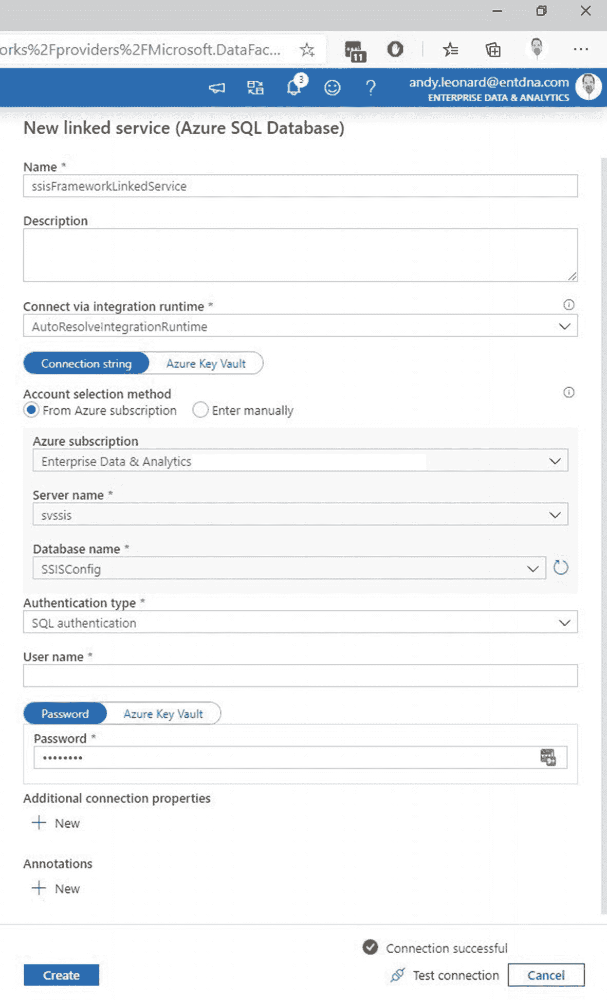
**图 9-38** 连接测试成功

### 步骤二：配置查找活动

前面的部分不仅作为 FOA（灵活的编写顺序）的示例，还提供了一个非常常见的 Azure 安全障碍的解决方案。

继续配置“获取应用程序包”查找活动的“设置”选项卡，将“使用查询”属性更改为“查询”。使用清单 9-6 中所示的 T-SQL 语句初始化“查询”属性。

```sql
Select a.ApplicationName
, p.PackageLocation + p.PackageName As PackagePath
, ap.ExecutionOrder
, ap.FailApplicationOnPackageFailure
From [config].[ApplicationPackages] ap
Join [config].[Applications] a
On a.ApplicationId = ap.ApplicationId
Join [config].Packages p
On p.PackageId = ap.PackageId
Where a.ApplicationName = N'Framework Test'
And ap.ApplicationPackageEnabled = 1
Order By ap.ExecutionOrder
```
**清单 9-6** 用于选择“Framework Test” SSIS 应用程序包的 T-SQL

出于本示例的目的，将“查询超时（分钟）”和“隔离级别”属性保留为其默认值。确保“仅第一行”复选框未被选中，如图 9-39 所示。

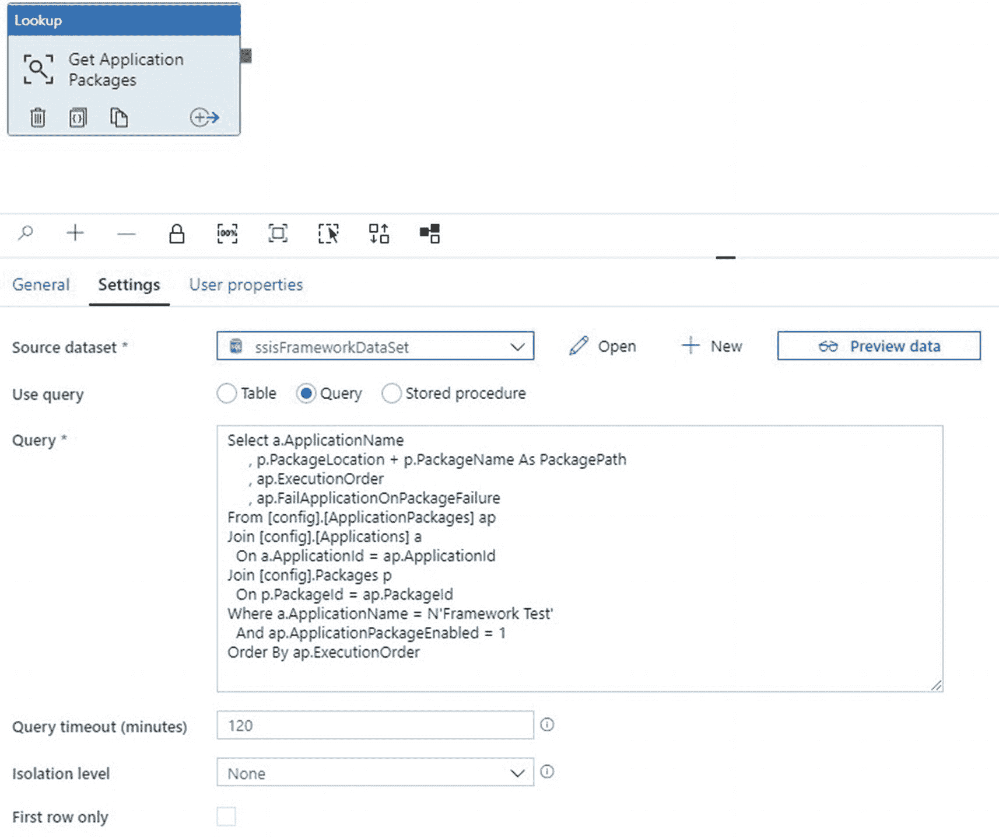
**图 9-39** 完成“获取应用程序包”查找活动设置

### 步骤三：测试与查看结果

现在可以通过单击工具栏中的“调试”项来测试“获取应用程序包”查找活动，如图 9-40 所示。

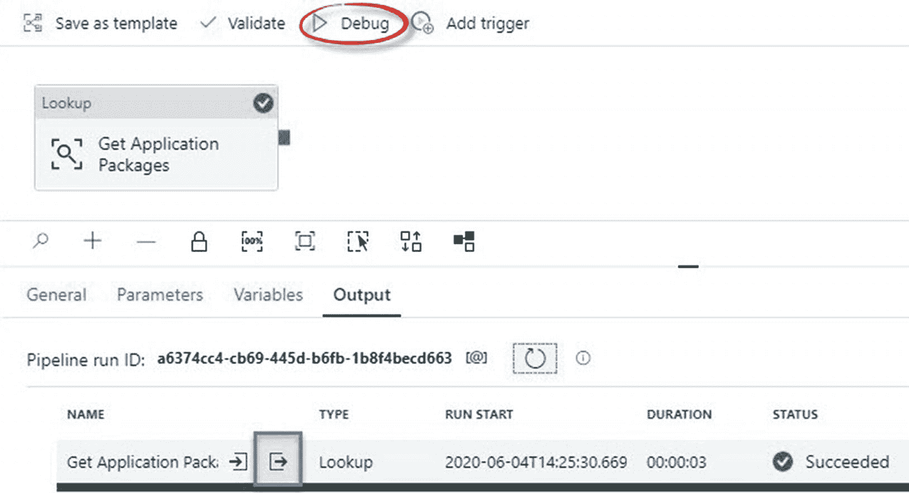
**图 9-40** 调试执行（红色圆圈）后查看输出（蓝色框）

调试执行完成后，单击“获取应用程序包”查找活动“输出”选项卡上显示的输出查看器（图 9-40 中的“蓝色框”），以查看 Lookup 活动返回的 JSON，如图 9-41 所示。

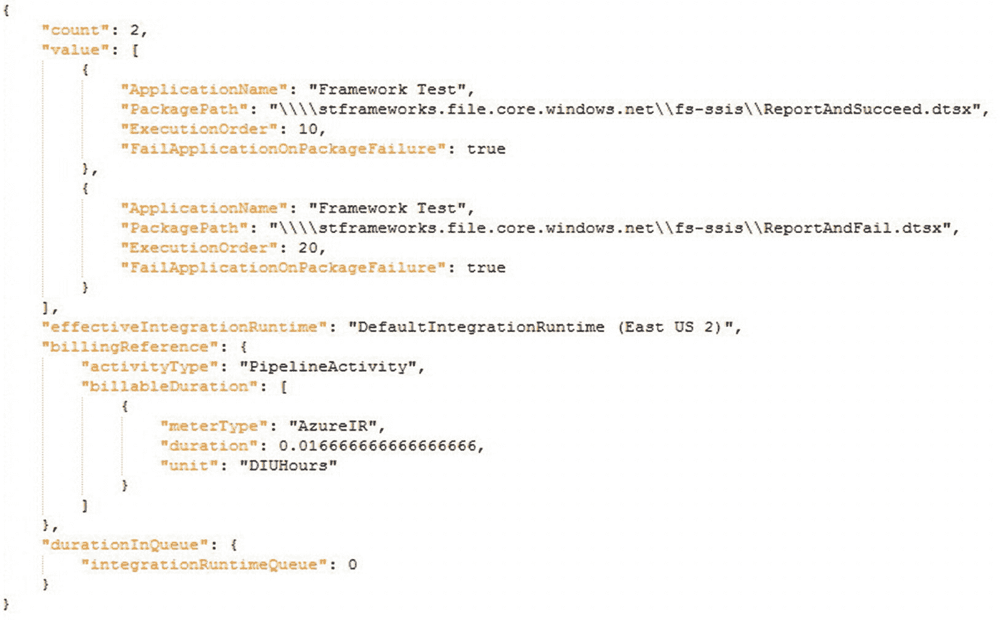
**图 9-41** “获取应用程序包”查找活动返回的 JSON

现在我们有了 SSIS 包列表，下一步就是执行列表中包含的 SSIS 包。


### 执行检索到的 SSIS 包

在简单自定义 SSIS 框架的 SSIS 版本中，使用 `Foreach` 循环容器枚举 SSIS 包集合。在 Azure Data Factory 中，`ForEach` 活动执行相同的功能。

#### 添加并配置 ForEach 活动

展开名为“Iteration & conditionals”的“活动”类别，并将一个 `ForEach` 活动拖到管道画布上。从“`Get Application Packages`”查找活动向 `ForEach` 活动连接一条“成功”管道，然后将该 `ForEach` 活动重命名为“`ForEach Application Package`”，如图 9-42 所示。

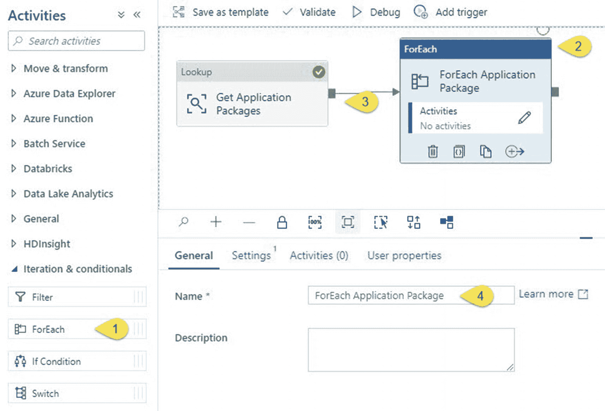

图 9-42 添加 `ForEach` 活动

在“设置”选项卡中，单击“项”属性文本框内部。此时会在“项”文本框下方显示“`Add dynamic content [Alt + P]`”链接，如图 9-43 所示。

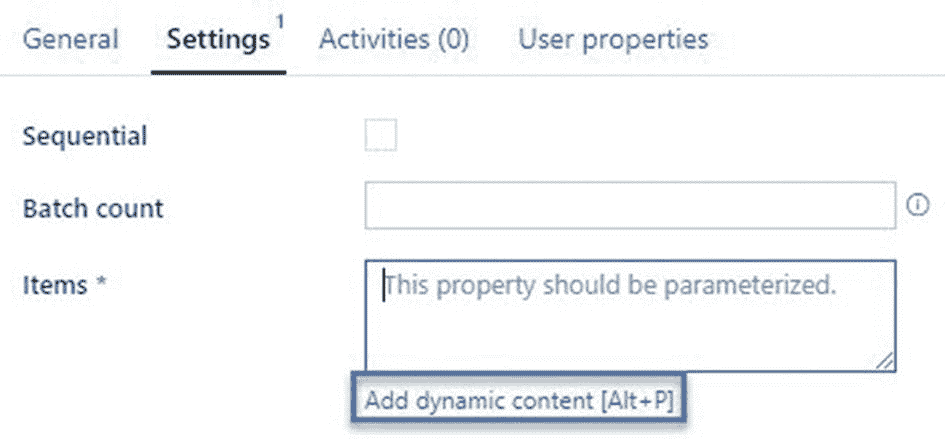

图 9-43 `ForEach Application Package` `ForEach` 活动的“设置”选项卡上的“`Add dynamic content [Alt + P]`”链接

单击“`Add dynamic content [Alt + P]`”链接以打开“添加动态内容”窗格。在“活动输出”类别中，单击 `Get Application Packages`。表达式 `@activity('Get Application Packages').output` 会出现在“添加动态内容”文本框中。在表达式末尾追加“`.value`”，使 Azure Data Factory 表达式变为 `@activity('Get Application Packages').output.value`，如图 9-44 所示。

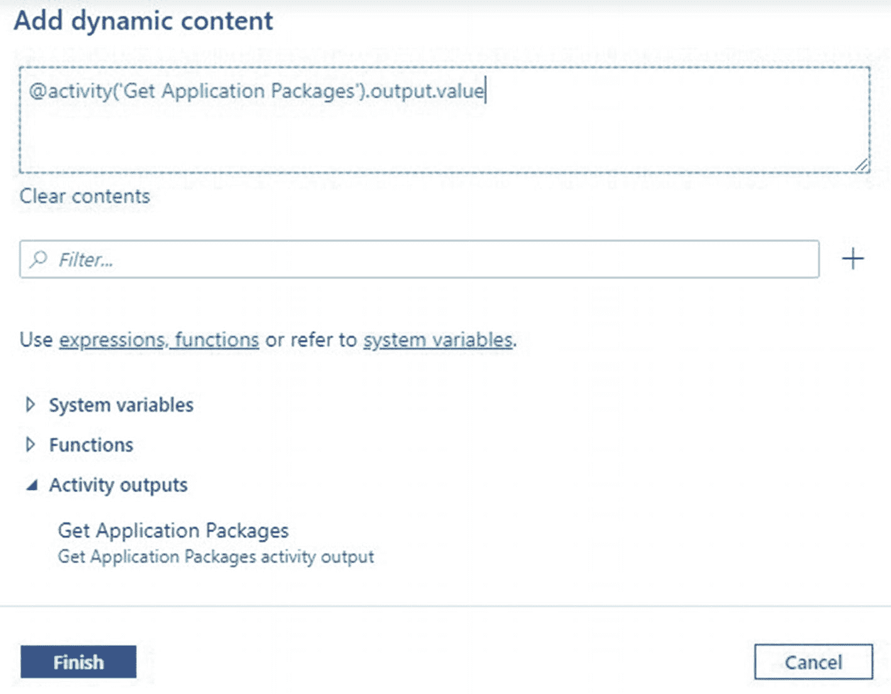

图 9-44 为 `ForEach Application Packages` 活动设置项属性的动态值

单击“完成”按钮以完成属性配置。`ForEach Application Packages` 的“项”属性现在应类似于图 9-45。

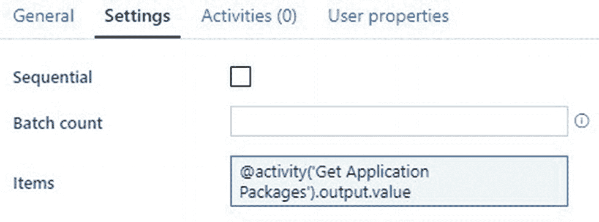

图 9-45 已配置的 `ForEach Application Packages` 项属性

枚举器现已配置完成。下一步是为每个应用程序包配置父管道要执行的活动。

#### 编辑 ForEach 活动的内容

单击 `ForEach Application Package` 活动的“编辑”图标（铅笔），如图 9-46 所示。

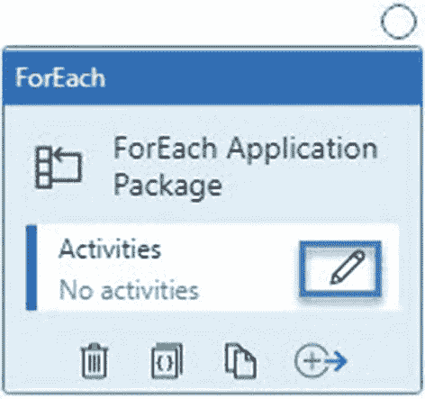

图 9-46 编辑 `ForEach Application Package` 活动的内容

当显示 `父级 ➤ ForEach Application Package ➤ 活动` 页面时，从“活动” ➤ “常规管道活动”中拖放一个“执行 SSIS 包”活动，然后将新的“执行 SSIS 包”活动重命名为“`Execute Application Package`”，如图 9-47 所示。

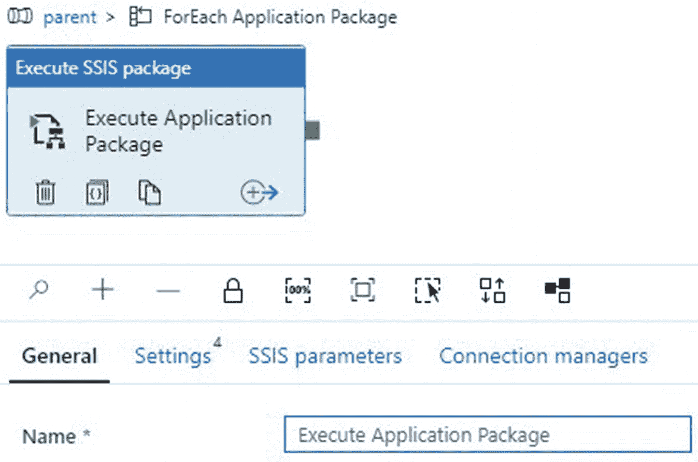

图 9-47 添加并重命名“`Execute Application Package`”执行 SSIS 包活动

#### 配置 Execute SSIS 包活动

配置“`Execute Application Package`”执行 SSIS 活动的“设置”选项卡中的“Azure-SSIS IR”属性，从下拉列表中选择“`Azure-SSIS-Files`”集成运行时，如图 9-48 所示。

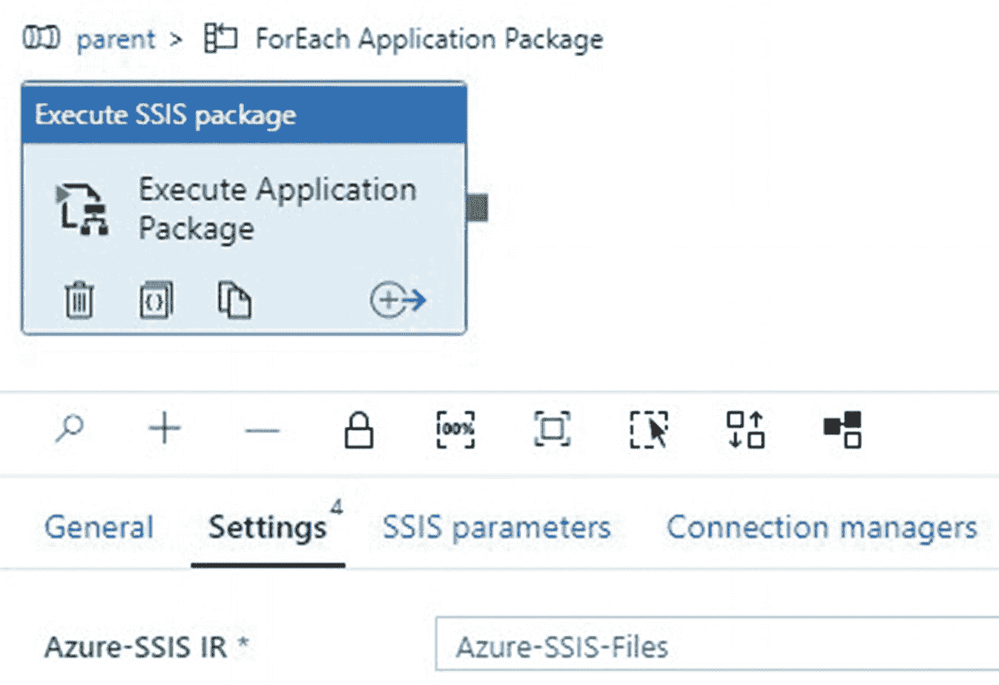

图 9-48 选择 `Azure-SSIS-Files` 集成运行时

出于本示例的目的，请确保“Windows 身份验证”和“32 位运行时”属性复选框均未选中。单击“包路径”属性的文本框内部，然后单击“`Add dynamic content [Alt + P]`”链接以显示“添加动态内容”窗格，展开 `ForEach` 迭代器类别，单击 `ForEach Application Package Current Item` 选项，然后在动态内容文本框中的“`@item()`”后追加“`.PackagePath`”，如图 9-49 所示。

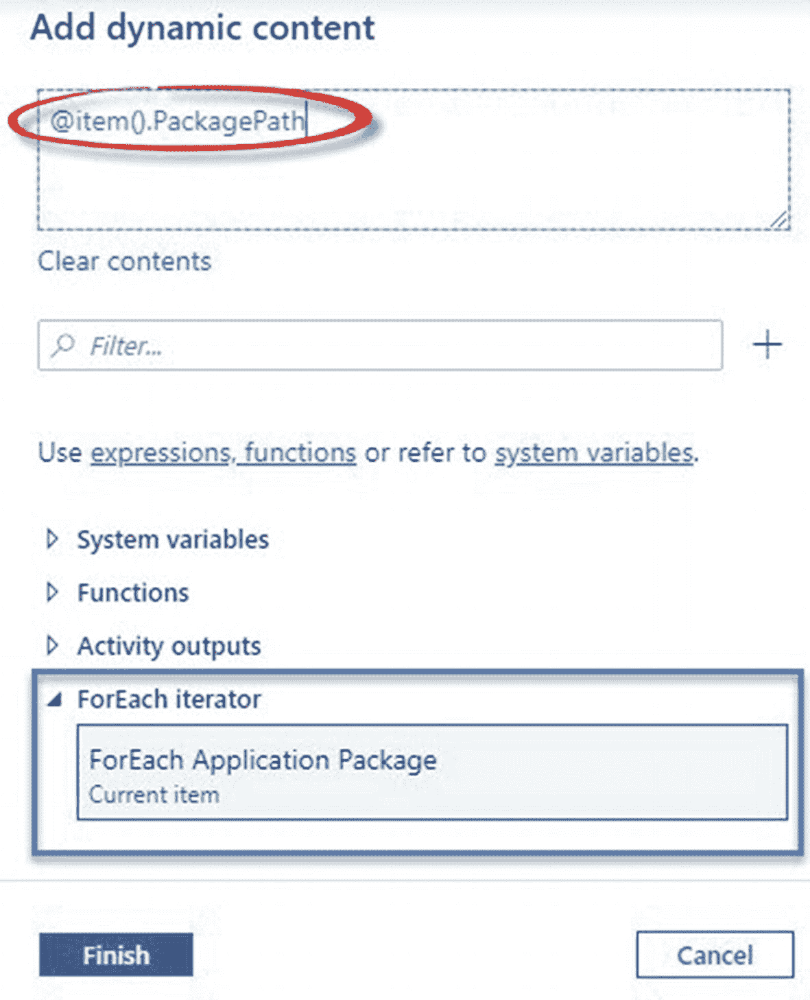

图 9-49 在 `ForEach Application Package` 活动中配置 `PackagePath` 值

单击“完成”按钮返回到“设置”选项卡，如图 9-50 所示。

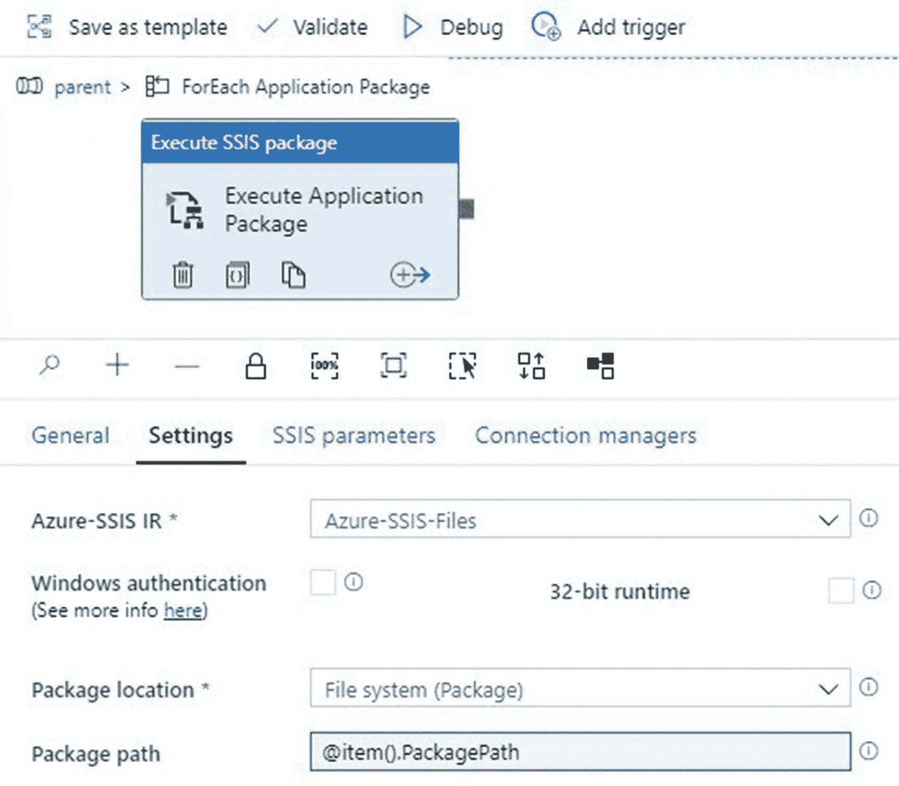

图 9-50 已配置的 `Execute Application Package` 的包路径属性

出于本示例的目的，将“配置路径”属性留空，尽管它包含“示例”配置元数据。将“域”属性设置为“`Azure`”，并将“用户名”属性设置为 Azure 文件共享的名称——本例中为“`stframeworks`”，如图 9-51 所示。

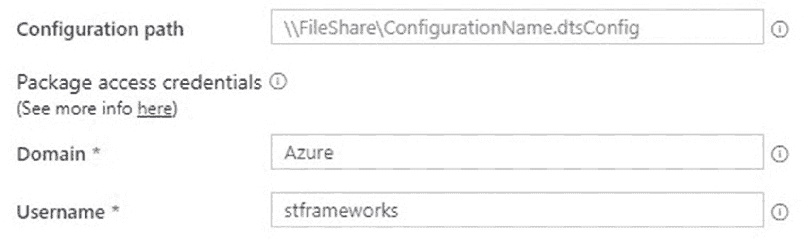

图 9-51 配置执行 SSIS 包活动的配置路径、域和用户名属性

下一步是配置“密码”属性，这也许是所有属性中最不直观的一个。执行 SSIS 包活动所需的值不是一个*密码*，而是一个用于访问 Azure 文件共享的*密钥*。要获取此值，请打开 Microsoft Azure Storage Explorer 并连接到 Azure 文件共享。在资源管理器窗格中，右键单击 Azure 文件共享，然后单击“复制主密钥”，如图 9-52 所示。

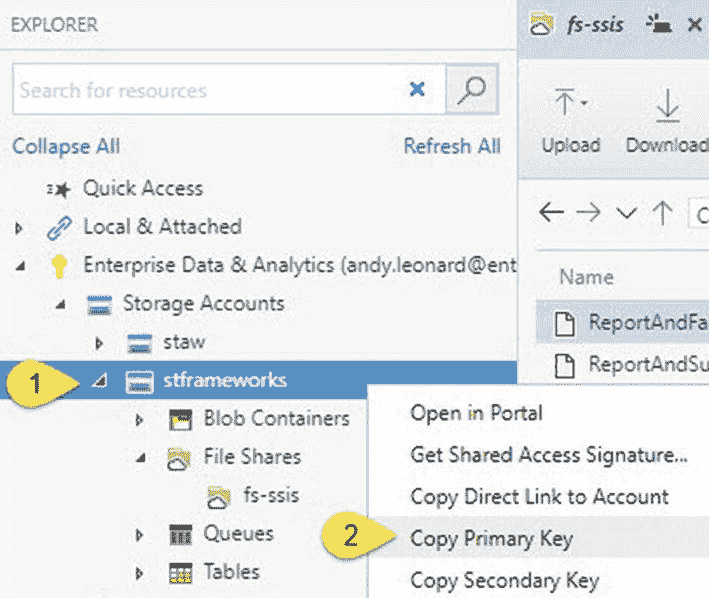

图 9-52 复制 Azure 文件共享的主密钥以供访问

Azure 文件共享主密钥就是密码属性所需的值。返回到 Azure Data Factory 门户，并将 Azure 文件共享主密钥粘贴到“密码”属性文本框中，如图 9-53 所示。

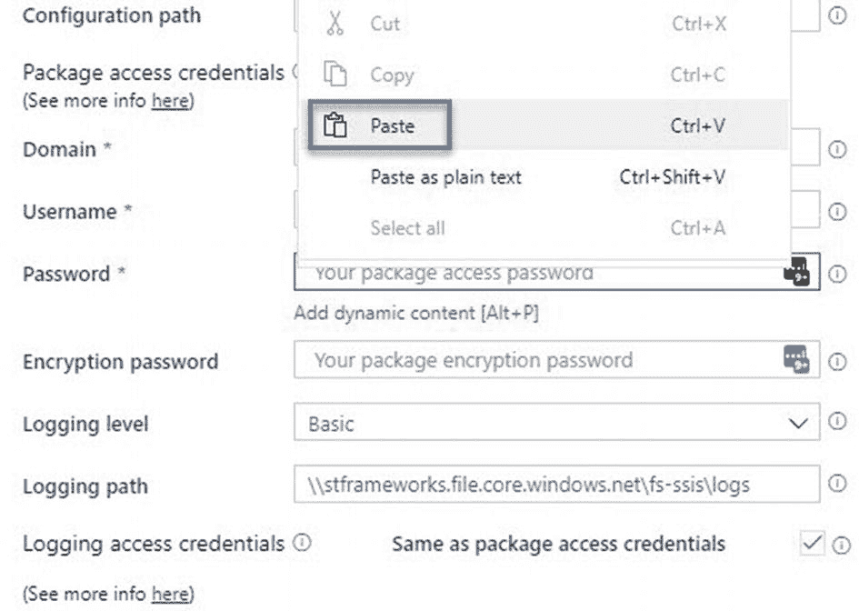

图 9-53 将 Azure 文件共享主密钥粘贴到执行 SSIS 包活动的密码属性中

如果 SSIS 包的“包保护级别”属性设置为 `EncryptAllWithPassword` 或 `EncryptSensitiveWithPassword`，则必须将 SSIS 包的“包密码”属性中的密码提供给执行 SSIS 包活动的“加密密码”属性（图 9-54 中的 #1）。由于我们的测试 SSIS 项目包使用默认保护级别 `EncryptSensitiveWithUserKey`，因此我们可以将“加密密码”属性留空。出于本示例的目的，接受默认的“日志记录级别”属性设置（基本 - 图 9-54 中的 #2），并将“日志记录路径”属性设置为 Azure 文件共享路径加上“`\logs`”（图 9-54 中的 #3）。通过选中“与包访问凭据相同”复选框（图 9-54 中的 #4）来设置“日志记录访问凭据”属性。

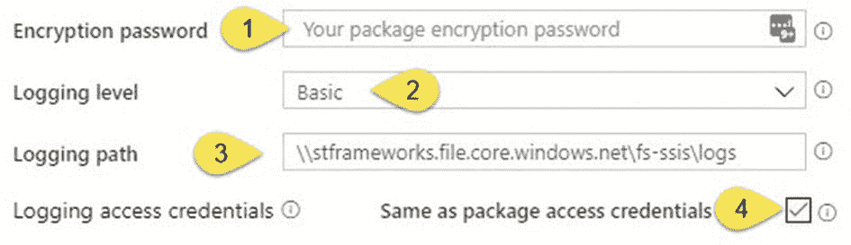

图 9-54 为执行 SSIS 包活动配置加密密码、日志记录级别、日志记录路径和日志记录访问凭据属性


父管道现已完成最小化配置，足以让我们点击“调试”菜单项并执行测试运行（请确保 `Azure-SSIS-Files` 集成运行时已预先启动！）。根据设计（在此阶段），管道调试运行应当会失败，如图 9-55 所示。

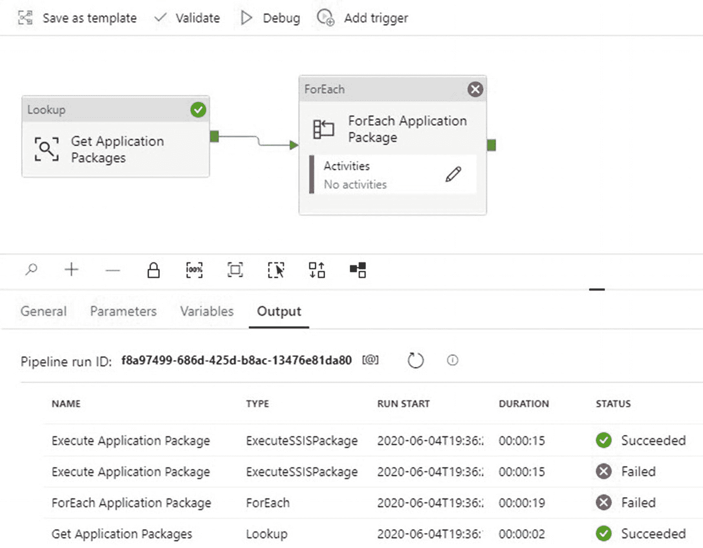
**图 9-55**
父管道的测试运行失败

测试运行失败了，但原因是什么？

在图 9-55 中，首次执行的 `执行应用程序包` 执行 SSIS 活动失败了，但第二次执行的 `执行应用程序包` 执行 SSIS 活动却成功了。您可能看到*两次*执行都失败。最可能的原因是 `Azure-SSIS-Files` 集成运行时未运行。

下一步是查看在 Azure 文件共享的 logs 文件夹中生成的日志文件。

### 查看测试运行日志

返回存储资源管理器，日志文件夹很可能*未*显示。从“更多”下拉菜单项刷新 Azure 文件共享。点击“刷新”，如图 9-56 所示。

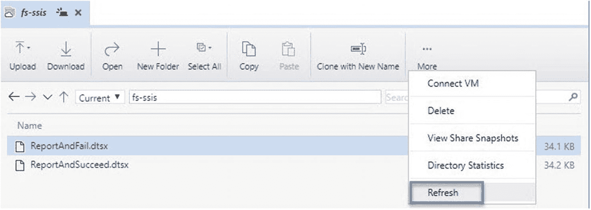
**图 9-56**
点击“更多”➤“刷新”以查看日志文件夹

日志文件夹（如图 9-57 所示）应当是在测试运行发生时创建的（如果日志文件夹事先不存在的话）。

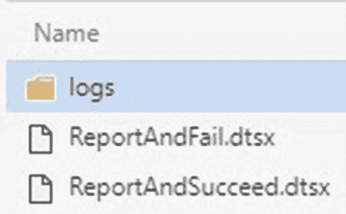
**图 9-57**
已显示的日志文件夹

双击日志文件夹查看内容。每次 SSIS 包执行都会生成一个运行 ID，该 ID 在 ADF 管道的“输出”选项卡中可见，如图 9-58 所示，同时在存储资源管理器中有对应的日志\文件夹名称。

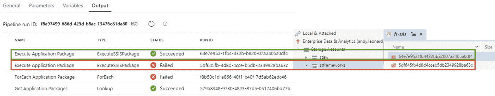
**图 9-58**
管道运行的“输出”选项卡与存储资源管理器的日志文件夹内容对齐

`执行应用程序包` 执行了两次，一次运行名为 `ReportAndSucceed.dtsx` 的 SSIS 包，另一次运行名为 `ReportAndFail.dtsx` 的 SSIS 包。图 9-55 显示了最顶部的 `执行应用程序包` 实例成功，而下一个 `执行应用程序包` 实例失败。

图 9-58 是父管道“输出”选项卡与 Azure 文件共享中日志文件夹内容*对齐*的截图。请注意管道的输出运行 ID 值与日志子文件夹的名称相似。在存储资源管理器中进入最顶部的日志子文件夹，会显示一组日志文件，如图 9-59 所示。

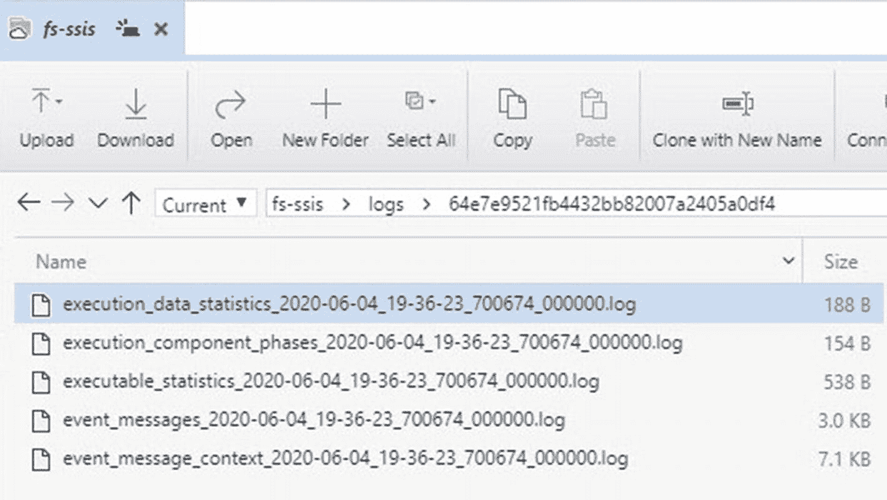
**图 9-59**
存储在 Azure 文件共享 `fs-ssis\logs` 文件夹中的日志文件

右键点击以 “event_messages_” 开头的文件，然后点击“打开”，如图 9-60 所示。

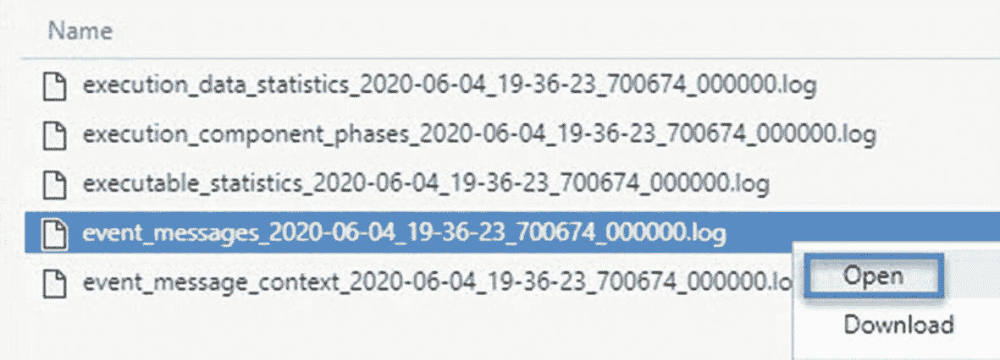
**图 9-60**
打开 event_messages 日志

由于我的服务器配置为使用记事本打开扩展名为 “.log” 的文件，因此 event_messages 文件在记事本中打开，如图 9-61 所示。

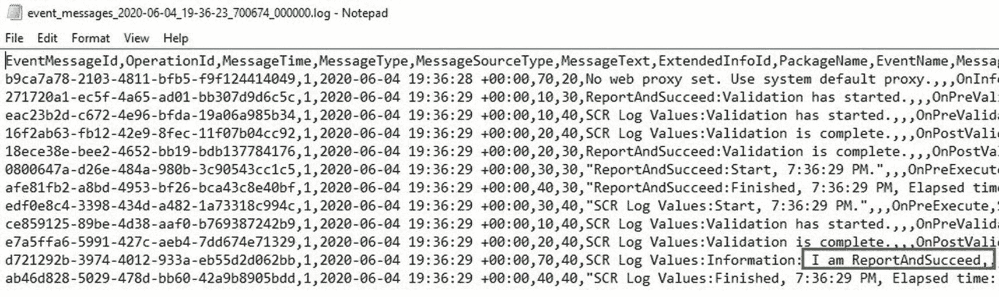
**图 9-61**
查看 `ReportAndSucceed.dtsx` 测试运行的 event_messages 日志文件

这是执行 `ReportAndSucceed.dtsx` SSIS 包的 event_messages 日志文件。打开另一个文件夹中的 event_messages 日志文件会显示执行 `ReportAndFail.dtsx` SSIS 包的 event_messages，如图 9-62 所示。

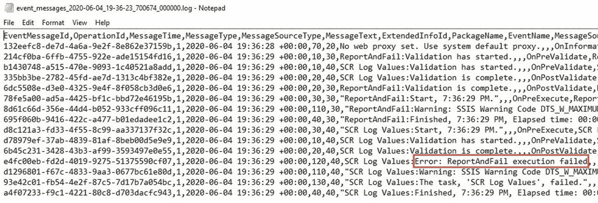
**图 9-62**
查看 `ReportAndFail.dtsx` 测试运行的 event_messages 日志文件

### 本章小结

本章涵盖了以下内容：

*   配置 Azure SQL 数据库实例
    *   将 `SSISConfig` 数据库部署到 Azure SQL DB 实例

*   配置 Azure 文件共享
    *   将测试用的 SSIS 包部署（复制）到 Azure 文件共享

*   构建 SSIS 框架执行引擎
    *   测试运行父管道并查看运行日志

下一步是将应用程序和应用程序包的操作数据持久化存储在 `SSISConfig` 数据库中。

## 10. ADF 中的框架日志记录

第 5–7 章介绍了如何使用名为 `SSISConfig` 的 SQL Server 数据库和一个 SSIS 包（`Parent.dtsx` SSIS 包）作为执行引擎，来设计和构建一个用于执行存储在本地服务器文件系统中的 SSIS 包的 SSIS 框架。第 8 章介绍了如何配置 Azure Data Factory (ADF) 实例、Azure 存储账户以及一个配置为执行存储在 Azure 文件共享中的 SSIS 包的 `Azure-SSIS` 集成运行时。第 9 章介绍了如何配置 Azure SQL 数据库、将 `SSISConfig` 数据库部署到 Azure SQL DB、配置 Azure 文件共享 (`fs-ssis`)，然后在 ADF 中构建执行引擎（父管道）。

在本章中，我们将为父 ADF 管道添加日志记录功能，这非常类似于我们在第 7 章中为本地版 SSIS 框架添加的功能。日志架构及相关构件已经部署，但我们将对与日志记录相关的表进行一些调整和修改。

尽管执行的操作相似，但 Azure Data Factory 管道与 SSIS 包是*不同*的。这些差异将推动 SSIS 框架设计的变更。

## 添加 ApplicationName 参数

父管道将执行 SSIS 框架应用程序。为了使 ADF 管道具有通用性，能够执行存储在 `SSISConfig` 数据库元数据中的*任何*应用程序，该管道需要一个 `ApplicationName` 参数。

打开父管道，点击管道的空白区域，然后点击“参数”选项卡。当“参数”选项卡显示时，点击图 10-1 中高亮的“+ 新建”链接。

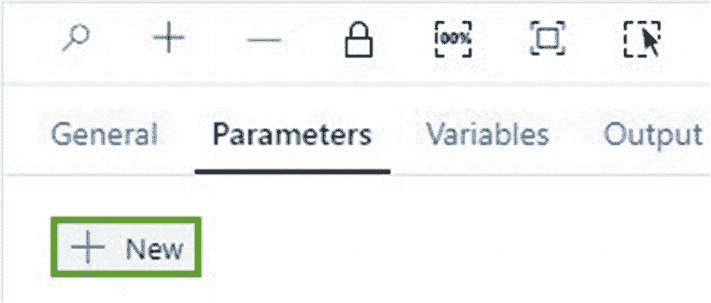
**图 10-1**
开始添加新参数

当参数配置界面显示时，设置以下参数属性，如图 10-2 所示。

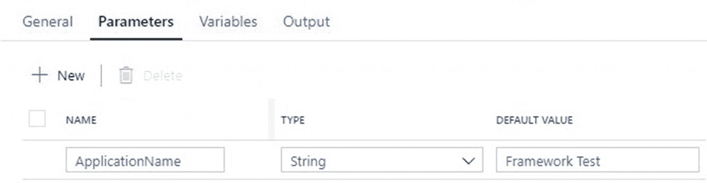
**图 10-2**
配置 `ApplicationName` 父管道参数

*   名称：`ApplicationName`
*   类型：`String`
*   默认值：`Framework Test`

现在，父 ADF 管道中的活动可以访问 `ApplicationName` 参数了。


## SSIS 框架应用程序与包快速回顾

一个 SSIS 框架应用程序是多个 SSIS 包的集合，这些包按照预定顺序执行（一个 SSIS 应用程序可配置为执行一个或多个 SSIS 包）。SSIS 应用程序的元数据存储在 `config.Applications` 表中，而 SSIS 包位置的元数据则存储在 `config.Packages` 表中。由于 SSIS 应用程序和 SSIS 包之间的基数关系是多对多的（一个 SSIS 包可配置为在一个或多个 SSIS 应用程序中运行），因此存在 `config.ApplicationPackages` 表来解析应用程序和包之间的关系。

## 添加应用程序实例日志记录

在本章的引言中，我提到 ADF 和 SSIS 在实现类似功能的方式上存在差异，这些差异将推动 Azure Data Factory 中 SSIS 框架设计的变化。在配置应用程序实例日志记录时，我们遇到了第一个差异。

SSIS 框架在 `log.ApplicationInstance` 表中收集有关应用程序执行实例的操作数据。有关应用程序包执行实例的操作数据存储在 `log.ApplicationPackageInstance` 表中。

### 修改 log.ApplicationInstance 表

一个 Azure Data Factory (ADF) 管道由许多组成对象和构件构成，包括 ADF 活动。当 ADF 活动执行时，会生成一个 *RunId* 值用于操作日志记录。当 Azure Data Factory 管道执行时，会生成一个 RunId 值，并用于将内部 ADF 管道日志与管道活动日志关联起来。

通过执行清单 10-1 中的 T-SQL 来修改 `log.ApplicationInstance` 表。

```sql
print 'Log.ApplicationInstance.ApplicationRunId column'
If Not Exists(Select s.[name]
+ '.' + t.[name]
+ '.' + c.[name]
From [sys].[schemas] s
Join [sys].[tables] t
On t.[schema_id] = s.[schema_id]
Join [sys].[columns] c
On c.[object_id] = t.[object_id]
Where s.[name] = N'log'
And t.[name] = N'ApplicationInstance'
And c.[name] = N'ApplicationRunId')
begin
print ' - Adding log.ApplicationInstance.ApplicationRunId column'
Alter Table log.ApplicationInstance
Add ApplicationRunId nvarchar(55) NULL
print ' - Log.ApplicationInstance.ApplicationRunId column added'
end
Else
begin
print ' - Log.ApplicationInstance.ApplicationRunId column already exists.'
end
```
清单 10-1
向 ApplicationInstance 表添加 ApplicationRunId 列

接下来，我们将用于添加应用程序实例行的 T-SQL 封装到一个存储过程中。

### 添加 log.InsertApplicationInstance 存储过程

在 SSIS 执行引擎（即 `Parent.dtsx` SSIS 包）中，使用了执行 SQL 任务将初始的 `ApplicationInstance` 记录插入 `log.ApplicationInstance` 表并返回一个 `ApplicationInstanceId` 值。在 Azure Data Factory 执行引擎（即父管道）中，将使用一个 Lookup 活动来调用一个存储过程，该存储过程插入记录并返回一个 `ApplicationInstanceId` 值。该 `ApplicationInstanceId` 值将在管道后续步骤中用于更新 `ApplicationInstance` 记录。

在 Azure Data Studio（或 SSMS）中，连接到名为 `SSISConfig` 的 Azure SQL 数据库。从第 7 章的清单 7-4 中的 T-SQL 代码开始，以幂等（可重复执行）的方式执行 T-SQL 来创建一个名为 `log.InsertApplicationInstance` 的新存储过程，如清单 10-2 所示。

```sql
print 'log.InsertApplicationInstance stored procedure'
If Exists(Select s.[name] + '.' + p.[name]
From [sys].[procedures] p
Join [sys].[schemas] s
On s.[schema_id] = p.[schema_id]
Where s.[name] = N'log'
And p.[name] = N'InsertApplicationInstance')
begin
print ' - Dropping log.InsertApplicationInstance stored procedure'
Drop Procedure log.InsertApplicationInstance
print ' - Log.InsertApplicationInstance stored procedure dropped'
end
print ' - Creating log.InsertApplicationInstance stored procedure'
go
Create Procedure log.InsertApplicationInstance
@ApplicationName nvarchar(255)
, @ApplicationRunId nvarchar(55) = NULL
As
declare @ApplicationId int = (Select ApplicationId
From config.Applications
Where ApplicationName = @ApplicationName)
Insert Into [log].ApplicationInstance (ApplicationId, ApplicationRunId)
Output inserted.ApplicationInstanceId
Values (@ApplicationId, @ApplicationRunId)
go
print ' - Log.InsertApplicationInstance stored procedure created'
go
```
清单 10-2
用于创建 `log.InsertApplicationInstance` 存储过程的幂等 T-SQL

`log.InsertApplicationInstance` 存储过程需要将 SSIS 框架应用程序的名称发送到 `@ApplicationName` 字符串（`nvarchar(255)`）参数。一个名为 `@ApplicationId` 的内部 T-SQL `int` 参数，会在 `config.Applications` 表中查找给定的 `@ApplicationName` 值所对应的 `ApplicationId` 值。

`log.InsertApplicationInstance` 存储过程还接受一个名为 `@ApplicationRunId` 的参数，该参数在未提供值时默认为 `NULL`。`@ApplicationRunId` 用于存储 Azure Data Factory 管道的 `RunId` 值。在 SSIS 框架中存储 `RunId` 使得企业 DevOps 团队能够将 SSIS 框架中的操作日志数据与 ADF 日志中捕获的操作数据关联起来，这在 ADF 管道执行过程中发生意外情况时非常有用。

T-SQL `Insert` 语句通过将新的 `@ApplicationId` 和 `@ApplicationRunId` 值插入到 `log.ApplicationInstance` 表中来初始化 `ApplicationInstance` 记录。在 `log.ApplicationInstance` 表上配置的默认值会在该行中插入以下值：

*   `ApplicationStartTime` 由 `DF_log_ApplicationInstance_ApplicationStartTime` 设置为 `sysdatetimeoffset()`。
*   `ApplicationStatus` 由 `DF_log_ApplicationInstance_ApplicationStatus` 设置为 `N'Running'`。

如果一切按计划进行，Azure Data Studio 应返回如图 10-3 所示的消息。

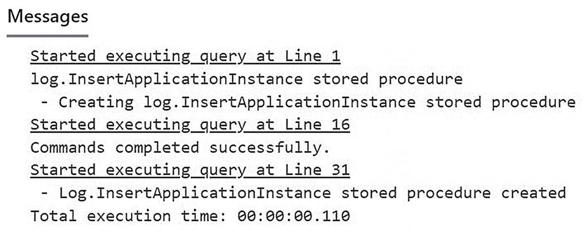
图 10-3
创建 `log.InsertApplicationInstance` 存储过程后返回的消息

创建 `log.InsertApplicationInstance` 存储过程后，下一步是在管道中添加一个活动来执行该存储过程。


### 记录应用程序实例

ADF 执行引擎需要执行一个名为 `log.InsertApplicationInstance` 的存储过程，该过程会返回一个名为 `ApplicationInstanceId` 的值。为此，我们创建了一个 Lookup 活动！

返回父级 ADF 管道。将新的 Lookup 活动拖拽到设计界面。将新 Lookup 活动的成功输出连接到“获取应用程序包”查找活动。将此新的 Lookup 活动重命名为“记录应用程序实例开始”，如图 10-4 所示。

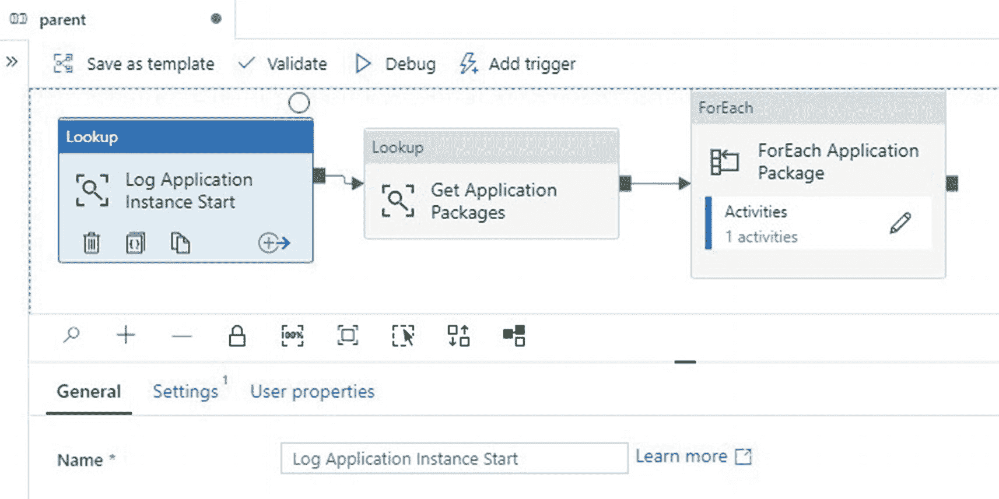

图 10-4 添加“记录应用程序实例开始”查找活动

点击“记录应用程序实例开始”查找活动的 `Settings` 选项卡以继续配置。点击 `Source dataset` 属性下拉菜单，选择 `ssisFrameworkDataSet`，如图 10-5 所示。

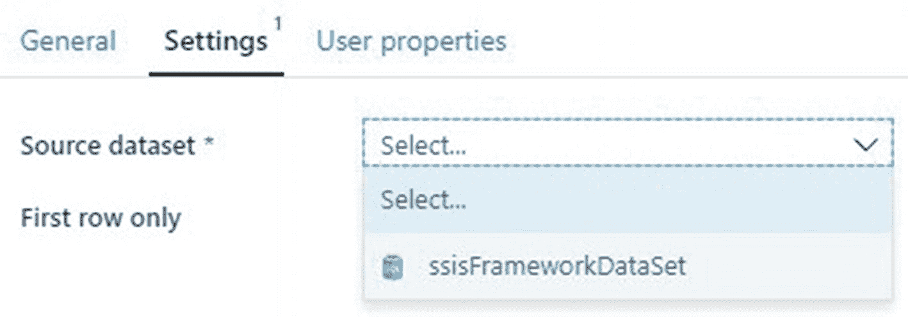

图 10-5 为“记录应用程序实例开始”查找活动的 `Source dataset` 属性选择 `ssisFrameworkDataSet`

接下来，将“记录应用程序实例开始”查找活动的 `Use query` 属性选项设置为 `Stored procedure`。从 `Name` 属性下拉菜单中选择 `log.InsertApplicationInstance`，如图 10-6 所示。

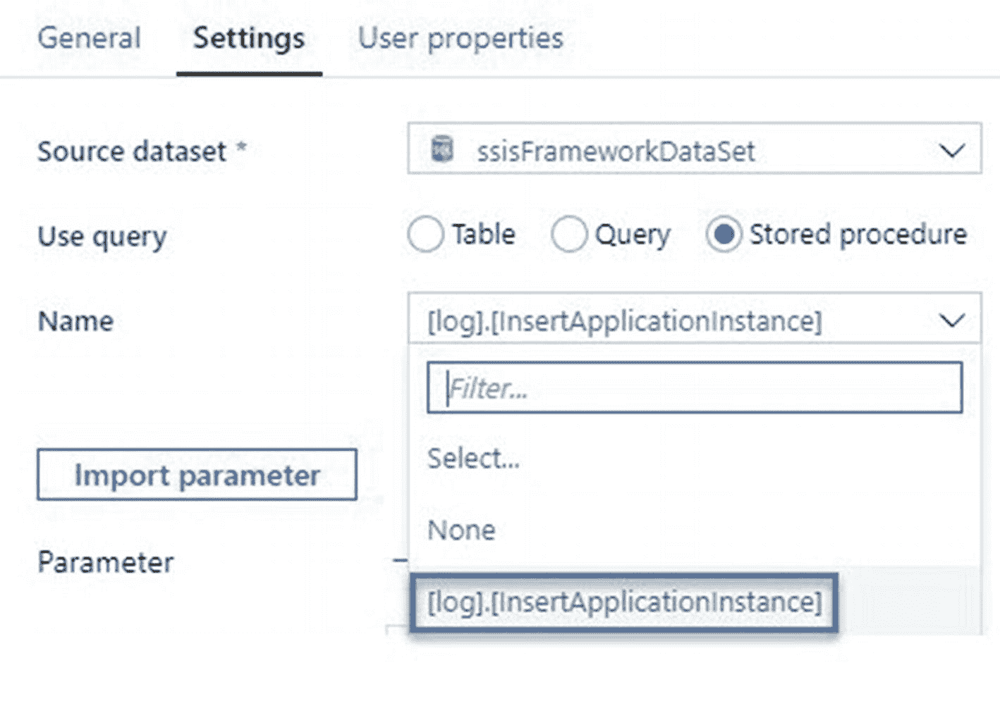

图 10-6 选择 `log.InsertApplicationInstance` 存储过程

接下来，点击 `Import parameter` 按钮，从 `log.InsertApplicationInstance` 存储过程导入 `@ApplicationName` 和 `@ApplicationRunId` 字符串参数。点击 `@ApplicationName` 参数的 `Value` 属性文本框内部，然后点击 `Add dynamic content [Alt + P]` 链接，如图 10-7 所示。

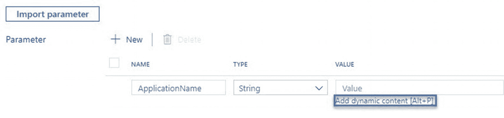

图 10-7 准备向参数值属性添加动态内容

当 `Add dynamic content` 面板显示时，展开 `Parameters` 表达式类别，点击 `ApplicationName`，将参数值 ADF 表达式设置为 `@pipeline.parameters.ApplicationName`，如图 10-8 所示。

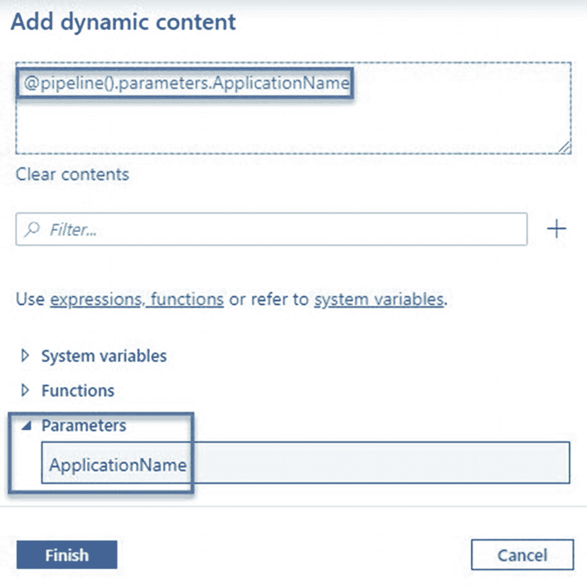

图 10-8 设置 ApplicationName 参数值表达式

点击 `Finish` 按钮继续。

点击 `@ApplicationRunId` 参数的 `Value` 属性文本框内部，然后点击 `Add dynamic content [Alt + P]` 链接。当 `Add dynamic content` 面板显示时，展开 `System variables` 表达式类别，点击 `Pipeline run ID`，将参数值 ADF 表达式设置为 `@pipeline().RunId`，如图 10-9 所示。

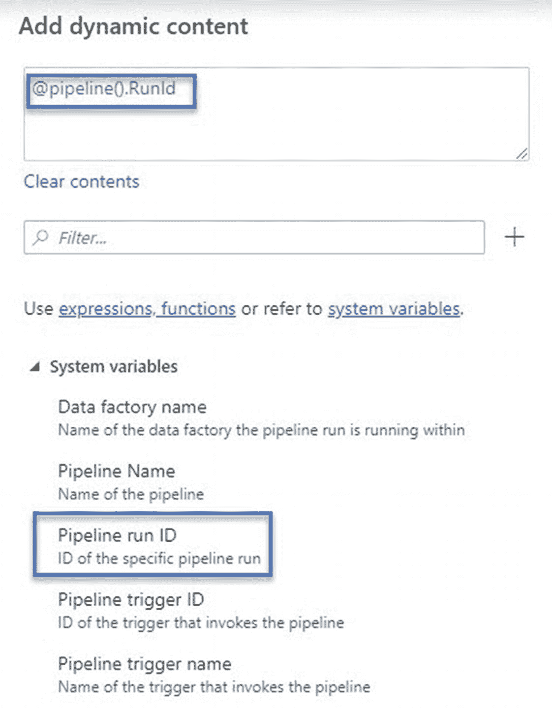

图 10-9 设置 ApplicationRunId 参数值表达式

保持 `Query timeout (minutes)` 属性为其默认值（120 分钟），`Isolation level` 属性为 `None`（默认值），并保持 `First row only` 属性为选中状态（默认值），如图 10-10 所示。

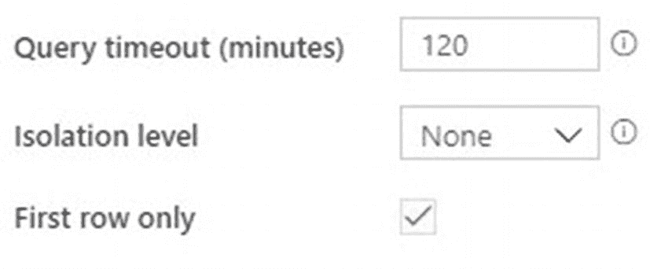

图 10-10 保留 `Query timeout`、`Isolation level` 和 `First row only` 属性的默认值

至此，“记录应用程序实例开始”查找活动已配置为调用 `log.InsertApplicationInstance` 存储过程，向该存储过程传递管道的 `ApplicationName` 和 `ApplicationRunId` 参数值，并返回 `ApplicationInstanceId` 值。

### 添加 log.UpdateApplicationInstanceStatus 存储过程

按当前配置，父管道会执行失败，因为 `ReportAndFail.dtsx` SSIS 包（按设计）会失败。应更新 `log.ApplicationInstance` 行以反映 SSIS 框架应用程序实例失败。

首先，向 SSISConfig 数据库添加一个名为 `log.UpdateApplicationInstanceStatus` 的新存储过程，如清单 10-3 所示。

```
print 'log.UpdateApplicationInstanceStatus stored procedure'
If Exists(Select s.[name] + '.' + p.[name]
From [sys].[procedures] p
Join [sys].[schemas] s
On s.[schema_id] = p.[schema_id]
Where s.[name] = N'log'
And p.[name] = N'UpdateApplicationInstanceStatus')
begin
print ' - Dropping log.UpdateApplicationInstanceStatus stored procedure'
Drop Procedure log.UpdateApplicationInstanceStatus
print ' - Log.UpdateApplicationInstanceStatus stored procedure dropped'
end
print ' - Creating log.UpdateApplicationInstanceStatus stored procedure'
go
Create Procedure log.UpdateApplicationInstanceStatus
@ApplicationInstanceId int
, @ApplicationStatus nvarchar(55) = 'Succeeded'
As
Update [log].ApplicationInstance
Set ApplicationEndTime = sysdatetimeoffset()
, ApplicationStatus = @ApplicationStatus
Where ApplicationInstanceId = @ApplicationInstanceId
go
print ' - Log.UpdateApplicationInstanceStatus stored procedure created'
go
Listing 10-3
Idempotent T-SQL to create the log.UpdateApplicationInstanceStatus stored procedure
```

如果一切按计划进行，Azure Data Studio 消息应类似于图 10-11 所示。

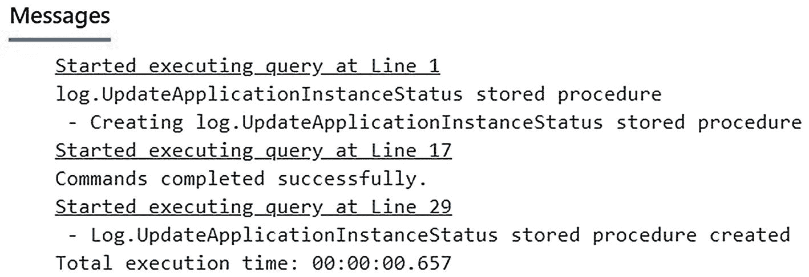

图 10-11 Azure Data Studio 消息反映成功创建了 `log.UpdateApplicationInstanceStatus` 存储过程

下一步是添加一个存储过程活动，用于在失败时调用 `log.UpdateApplicationInstanceStatus` 存储过程。


### 更新应用程序实例

ADF 执行引擎需要执行一个名为 `log.UpdateApplicationInstanceStatus` 的存储过程，该过程接受 `ApplicationInstanceId` 和 `ApplicationStatus` 值，然后更新当前应用程序实例的状态。存储过程活动非常适合这个任务！

返回到父级 ADF 管道。将一个存储过程活动拖放到画布上。从 `ForEach Application Package` 活动添加一个失败输出连接到新的存储过程活动。将新的存储过程活动重命名为“记录应用程序实例失败”，如图 10-12 所示。

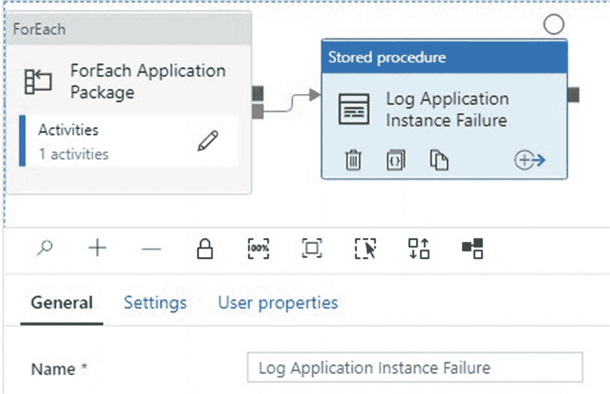

*图 10-12: 添加“记录应用程序实例失败”存储过程活动*

在“设置”选项卡上，从“链接服务”属性下拉菜单中选择 `ssisFrameworkLinkedService`，然后从“存储过程名称”下拉菜单中选择 `[log].[UpdateApplicationInstanceStatus]`，如图 10-13 所示。

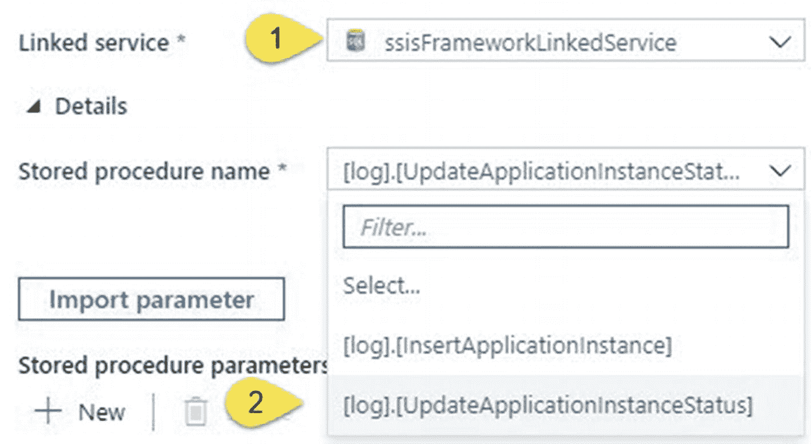

*图 10-13: 配置“链接服务”和“存储过程名称”属性*

单击“导入参数”按钮以从 `log.UpdateApplicationInstanceStatus` 存储过程导入参数。单击 `ApplicationInstanceId` 参数的值文本框内，然后单击“添加动态内容 [Alt + P]”链接，如图 10-14 所示。

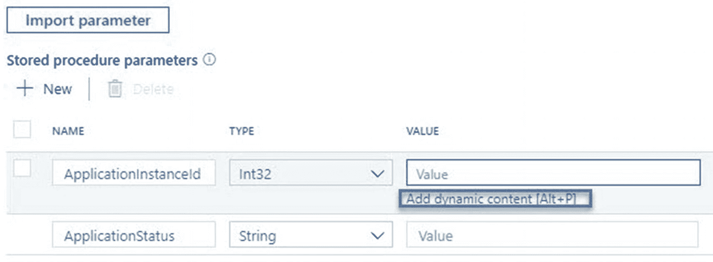

*图 10-14: 准备为 ApplicationInstanceId 参数输入动态内容*

当“添加动态内容”面板显示时，展开“活动输出”表达式类别，并单击“记录应用程序实例启动”。动态内容文本框将显示 `@activity('Log Application Instance Start').output`。在该表达式后追加 `.firstrow.ApplicationInstanceId`，以将“记录应用程序实例启动”查找活动执行返回的 `ApplicationInstanceId` 值映射到 `ApplicationInstanceId` 参数的值属性中，如图 10-15 所示。

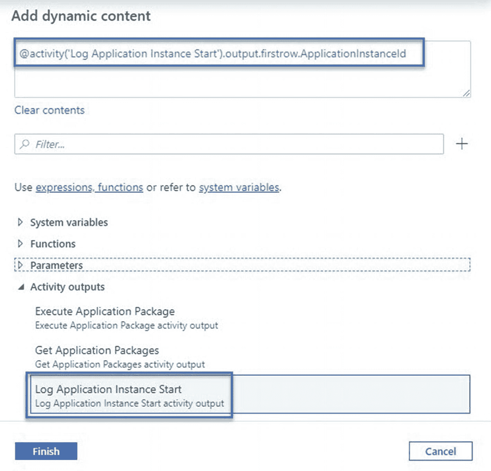

*图 10-15: 将“记录应用程序实例启动”查找活动映射到 ApplicationInstanceId 参数的值属性*

单击“完成”按钮继续。

在 `ApplicationStatus` 参数的值属性中键入“Failed”，如图 10-16 所示。

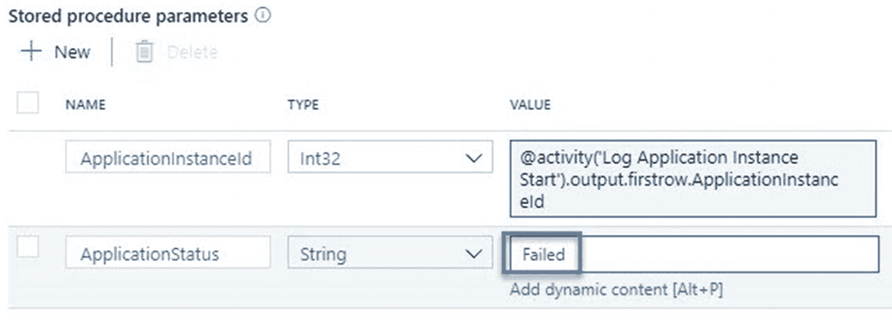

*图 10-16: 将 ApplicationStatus 属性设置为 Failed*

至此，SSIS 框架执行引擎（父级管道）的 ADF 版本已配置为执行 SSIS 应用程序并记录失败的应用程序实例。

下一步是测试执行该管道。

### 让我们测试一下！

单击父级管道工具栏上的“调试”项。“输出”选项卡会显示，片刻之后，会显示已执行的父级管道活动，如图 10-17 所示。

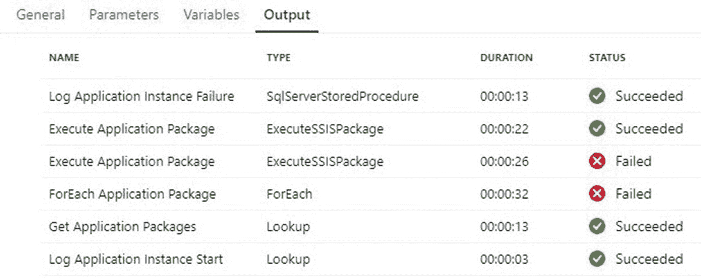

*图 10-17: 父级管道测试执行的结果*

执行清单 10-4 中所示的 T-SQL 查询以检查应用程序实例结果。

```sql
Select a.ApplicationName
, ai.ApplicationStartTime
, ai.ApplicationStatus
From log.ApplicationInstance ai
Join config.Applications a
On a.ApplicationId = ai.ApplicationId
Order By ApplicationInstanceId Desc
```

*清单 10-4: 应用程序实例结果*

结果应类似于图 10-18。

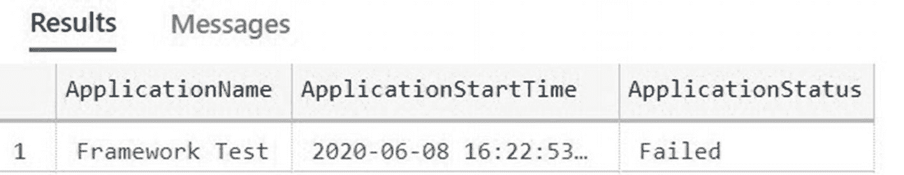

*图 10-18: 应用程序实例结果*

虽然结果符合预期，但缺少了点东西：没有一个在成功时更新应用程序实例的存储过程活动。

### 成功时更新应用程序实例

父级管道需要一种方式来记录应用程序实例的成功。首先单击“记录应用程序实例失败”存储过程活动上的“克隆”图标，如图 10-19 所示。

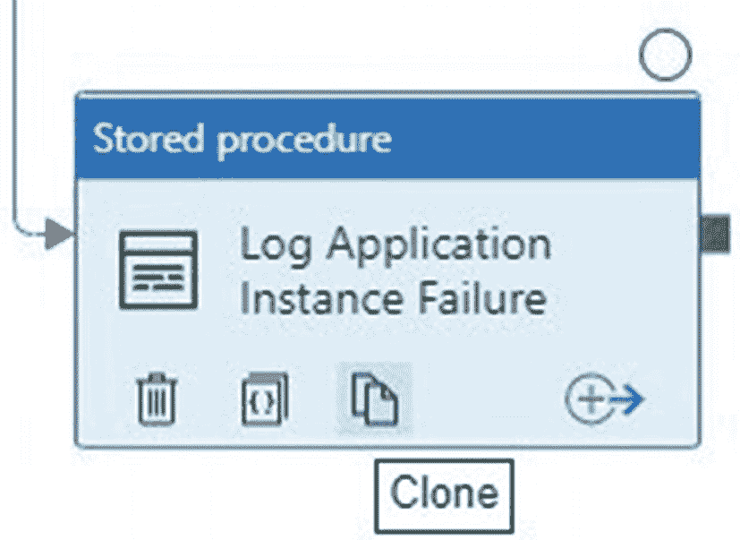

*图 10-19: 准备从“记录应用程序实例失败”存储过程活动克隆“记录应用程序实例成功”存储过程活动*

克隆“记录应用程序实例失败”存储过程活动是合理的，因为新的存储过程活动将调用*同一个*存储过程——`log.UpdateApplicationInstanceStatus`——并且*只有*一个参数值配置需要更改。

将“ForEach Application Package” ForEach 活动的一个成功输出连接到克隆的存储过程活动，然后将克隆的存储过程活动重命名为“记录应用程序实例成功”，如图 10-20 所示。

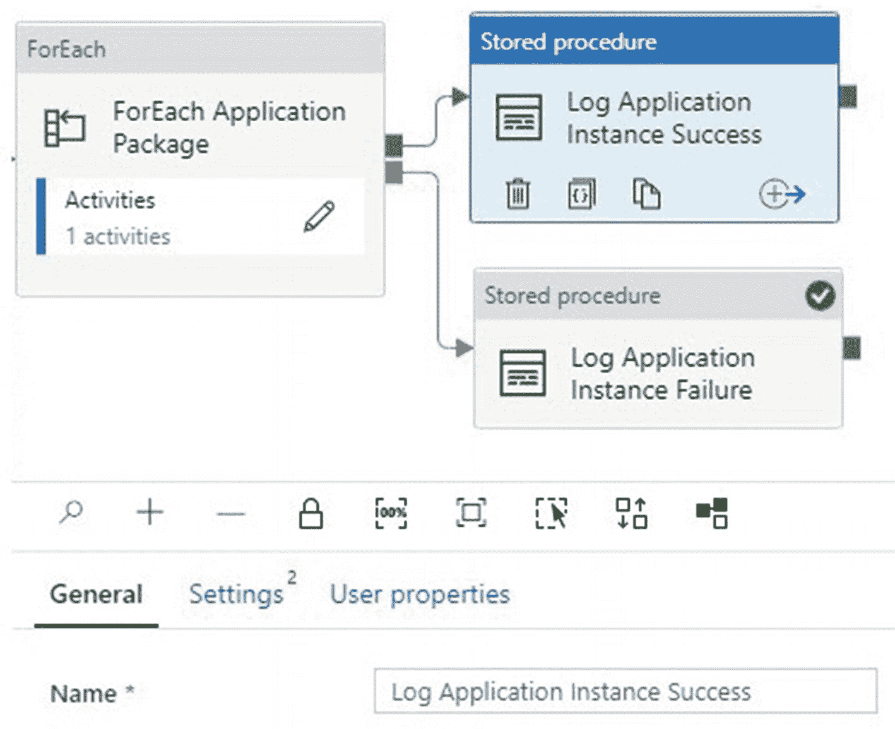

*图 10-20: 添加“记录应用程序实例成功”存储过程活动*

接下来，单击“记录应用程序实例成功”存储过程活动的“设置”选项卡。在“设置”选项卡上唯一需要的更改是 `ApplicationStatus` 参数值属性的值，需要将其从“Failed”更新为“Succeeded”，如图 10-21 所示。

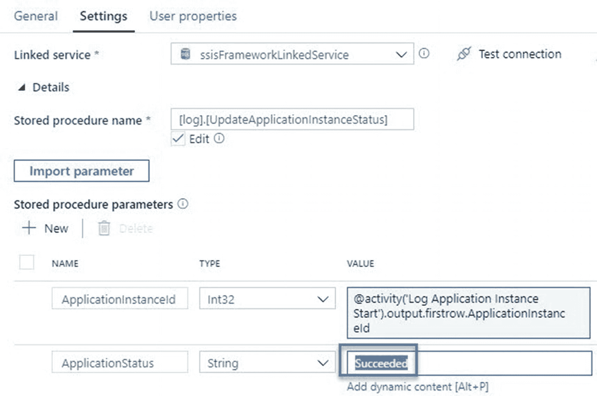

*图 10-21: 更新 ApplicationStatus 参数值*

新的测试执行确认父级管道按预期记录了 SSIS 框架应用程序故障。Azure Data Factory 版本的 SSIS 框架需要在应用程序包范围内进行类似的实例记录。

下一步是实现应用程序包实例记录。

在继续之前，我们需要对父级管道进行两处更改：

*   将 `ApplicationPackageId` 字段添加到“获取应用程序包”查找活动的查询中。
*   添加 `ApplicationInstanceId` 变量（并将 `ApplicationInstanceId` 值存储到 `ApplicationInstanceId` 变量中）。

### 添加 ApplicationPackageId 字段

要将 `ApplicationPackageId` 字段添加到从 SSISConfig 数据库返回的元数据数据集中，请选择“获取应用程序包”查找活动，然后单击“设置”选项卡。使用清单 10-5 中的 T-SQL 修改查询属性。

```sql
Select a.ApplicationName
, p.PackageLocation + p.PackageName As PackagePath
, ap.ExecutionOrder
, ap.FailApplicationOnPackageFailure
, ap.ApplicationPackageId
From [config].[ApplicationPackages] ap
Join [config].[Applications] a
On a.ApplicationId = ap.ApplicationId
Join [config].Packages p
On p.PackageId = ap.PackageId
Where a.ApplicationName = N'Framework Test'
And ap.ApplicationPackageEnabled = 1
Order By ap.ExecutionOrder
```

*清单 10-5: 用于检索应用程序包元数据的已修改查询*

修改 T-SQL 后，下一步是添加一个变量来保存 `ApplicationInstanceId` 管道变量。


### 添加 ApplicationInstanceId 管道变量

要添加 ApplicationInstanceId 管道变量，请点击管道，然后选择 **“变量”** 选项卡。点击“+ 新建”按钮，并将新变量命名为 `ApplicationInstanceId`，如图 10-22 所示。

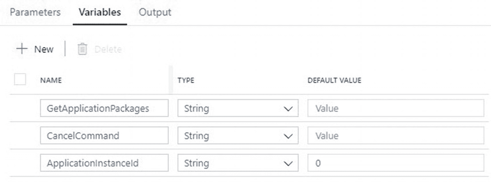

*图 10-22：添加 ApplicationInstanceId 管道变量*

“为什么 `ApplicationInstanceId` 变量——一个整数——被声明为字符串变量？”这是一个合理的问题。在撰写本文时，其他变量类型选项是布尔值和数组。`ApplicationInstanceId` 既不是布尔值，也不是数组。

### 配置设置变量活动

下一步是添加一个 **设置变量** 活动，将 `ApplicationInstanceId` 管道参数的值设置为从 **“记录应用程序实例启动”** 查找活动返回的 `ApplicationInstanceId` 值。首先，选择“记录应用程序实例启动”查找活动的 **成功** 输出，右键点击 **成功** 输出，然后点击 **删除**，如图 10-23 所示。

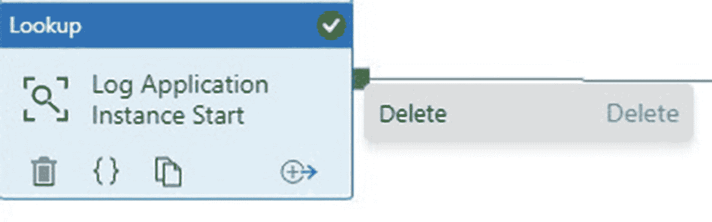

*图 10-23：从“记录应用程序实例启动”查找活动中删除成功输出*

要为“记录应用程序实例启动”查找活动添加一个新的 **成功** 输出，请点击 **“添加输出”** 图标，然后点击 **“成功”**，如图 10-24 所示。

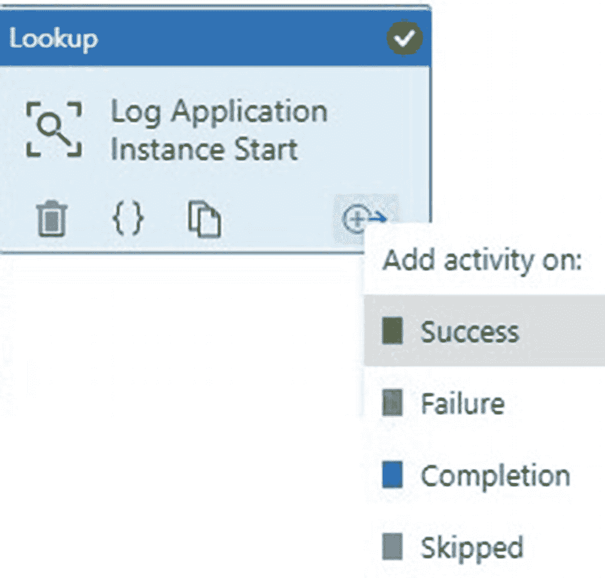

*图 10-24：向“记录应用程序实例启动”查找活动添加新的成功输出*

将一个 **设置变量** 活动拖到管道画布上，并将其重命名为 `Set ApplicationInstanceId`。点击 **变量** 选项卡，从 **名称** 属性下拉菜单中选择 `ApplicationInstanceId`。点击 **值** 属性文本框内部，然后点击 **“添加动态内容 [Alt + P]”** 链接以打开 **设置动态内容** 刃窗。滚动到 **活动输出** 类别，点击 **“记录应用程序实例启动”** 将 `@activity('Log Application Instance Start').output` 添加到表达式文本框中。将 `@activity(` 编辑为 `@string(activity(`。在表达式末尾追加 `.firstrow.ApplicationInstanceId)`，以分配从“记录应用程序实例启动”查找活动输出中第一行返回的 `ApplicationInstanceId` 值，如图 10-25 所示。

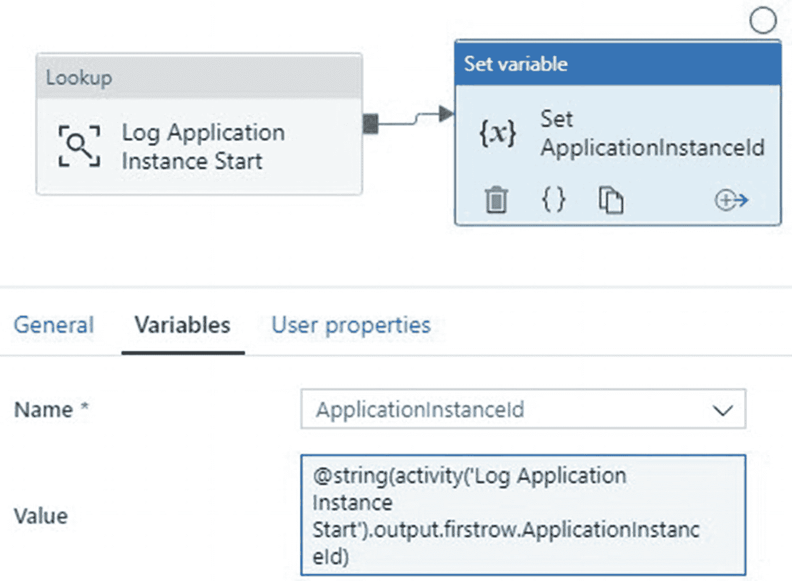

*图 10-25：配置“Set ApplicationInstanceId”设置变量活动*

将 `Set ApplicationInstanceId` 设置变量活动的 **成功** 输出连接到 **“获取应用程序包”** 查找活动。

现在，`Set ApplicationInstanceId` 设置变量活动已配置为读取从“记录应用程序实例启动”查找活动返回的 `ApplicationInstanceId` 值，并将该值存储在 `ApplicationInstanceId` 管道变量中。

### 更新存储过程活动

最后，更新 **“记录应用程序实例成功”** 和 **“记录应用程序实例失败”** 存储过程活动，以使用 `@int(variables('ApplicationInstanceId'))` 作为 `ApplicationInstanceId` 存储过程参数，而不是使用“记录应用程序实例启动”查找活动的输出，如图 10-26 所示。

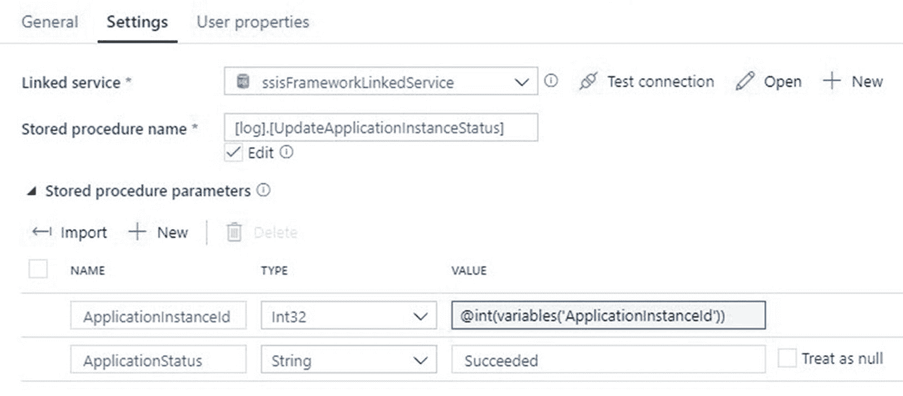

*图 10-26：使用 @variables('ApplicationInstanceId')*

如前所述，`ApplicationInstanceId` 管道变量是一个字符串。在撰写本文时，在此处和其他地方，该值将被隐式转换为整数。也就是说，在编码时请*有意为之*。这里的“有意为之”指的是显式转换为整数值。

下一步是添加一个子管道来执行应用程序包。


## 添加子管道

如前所述，SSIS 框架的本地版本与 Azure Data Factory 版本之间的差异导致了设计上的不同。重新设计的第一步是将应用程序包执行从父管道迁移到一个“子”管道。

首先，创建一个名为 `child` 的新 ADF 管道，如图 10-27 所示。

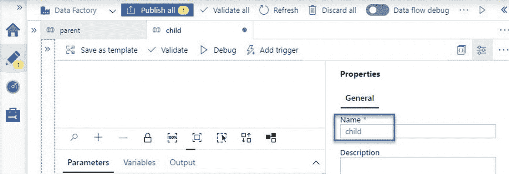
*图 10-27 添加子管道*

在父管道中，“Execute Application Package” 执行 SSIS 活动可以直接访问所需的属性（这些属性从 SSISConfig 元数据填充），以动态执行与 SSIS 应用程序相关的应用程序包。子管道将使用参数来访问相同的元数据。在子管道的“参数”选项卡上，创建以下管道参数/类型/默认值组合：

*   `PackagePath` / String / [空字符串]
*   `ApplicationPackageId` / Int / 0
*   `ApplicationInstanceId` / Int / 0
*   `FailApplicationOnPackageFailure` / Bool / true
*   `ParentRunId` / String / [空字符串]

配置完成后，子管道参数应类似于图 10-28。

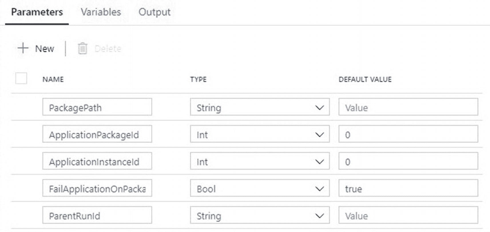
*图 10-28 已配置的子管道参数*

将一个“Execute SSIS Package”活动拖到子管道画布上，并将新活动重命名为“Execute Application Package”，如图 10-29 所示。

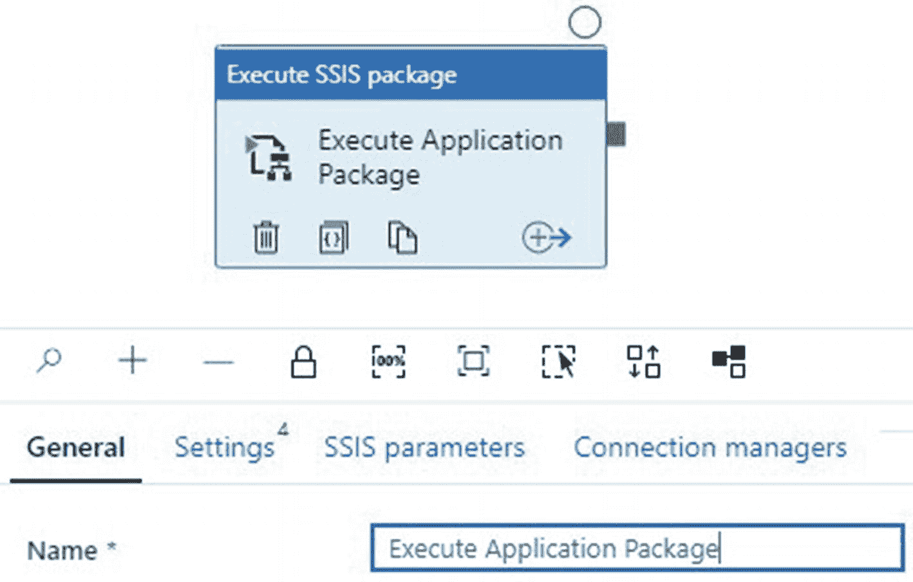
*图 10-29 添加“Execute Application Package”执行 SSIS 活动*

在“设置”选项卡上配置“Execute Application Package”执行 SSIS 活动的属性，如下所示：

*   Azure-SSIS IR: `Azure-SSIS-Files`
*   Windows 身份验证: [未选中]
*   32 位运行时: [未选中]
*   包位置: 文件系统（包）
*   包路径: `@pipeline().parameters.PackagePath`
    *   添加动态内容 [Alt + P]，然后选择 参数 ➤ `PackagePath`。
*   配置路径: [空]
*   域: `Azure`
*   用户名: `stframeworks`
    *   包含 SSIS 包的 Azure 文件共享的名称
*   密码: [你的文件共享主密钥]
    *   访问 Azure 文件共享的主密钥
*   加密密码: [空]
*   日志记录级别: `Basic`
*   日志记录路径: [你的文件共享日志路径]
*   日志记录访问凭据
    *   与包访问凭据相同: [如果日志文件夹与 SSIS 包位于同一 Azure 文件共享中，则选中]

配置完成后，“Execute Application Package”执行 SSIS 活动在“设置”选项卡上的属性应类似于图 10-30。

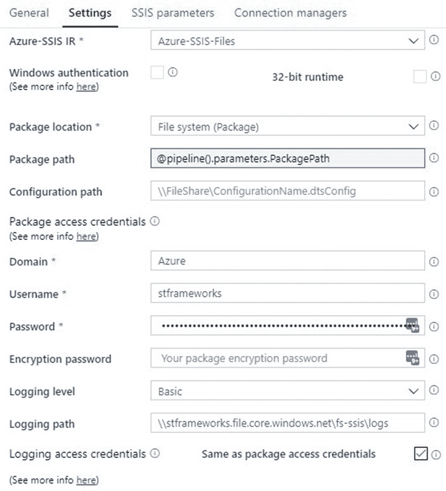
*图 10-30 已配置的“Execute Application Package”执行 SSIS 活动属性*

在父管道中，导航到“ForEach Application Package” ForEach 活动的活动面板，点击删除图标（垃圾桶）以删除“Execute Application Package”执行 SSIS 活动，如图 10-31 所示。

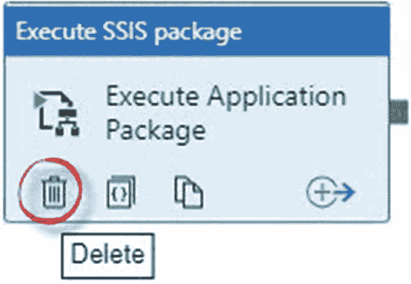
*图 10-31 删除“Execute Application Package”执行 SSIS 活动*

将一个“Execute Pipeline”活动拖到“ForEach Application Package” ForEach 活动的活动面板上，并将其重命名为“Execute Child Pipeline”，如图 10-32 所示。

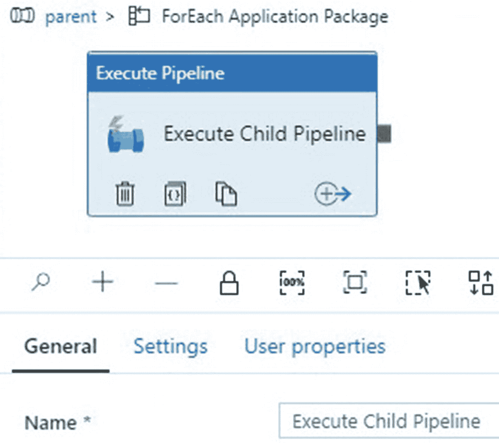
*图 10-32 添加“Execute Child Pipeline”执行管道活动*

点击“Execute Child Pipeline”执行管道活动的“设置”选项卡，并配置以下属性：

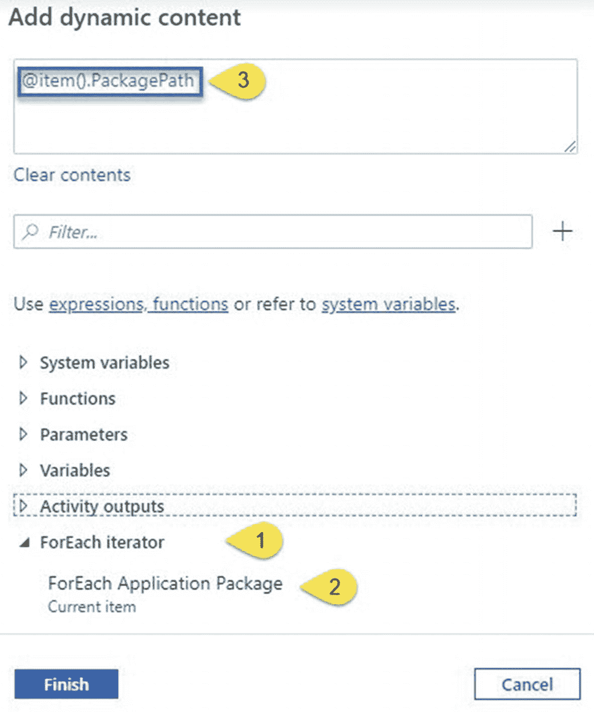
*图 10-33 为子管道配置 PackagePath 参数*

*   调用的管道: `child`
*   等待完成: [已选中]
*   参数:
    *   `PackagePath` / string / `@item().PackagePath`
        *   添加动态内容 [Alt + P]，选择 ForEach 迭代器 ➤ `ForEach Application Package`，然后追加“`.PackagePath`”，如图 10-33 所示。

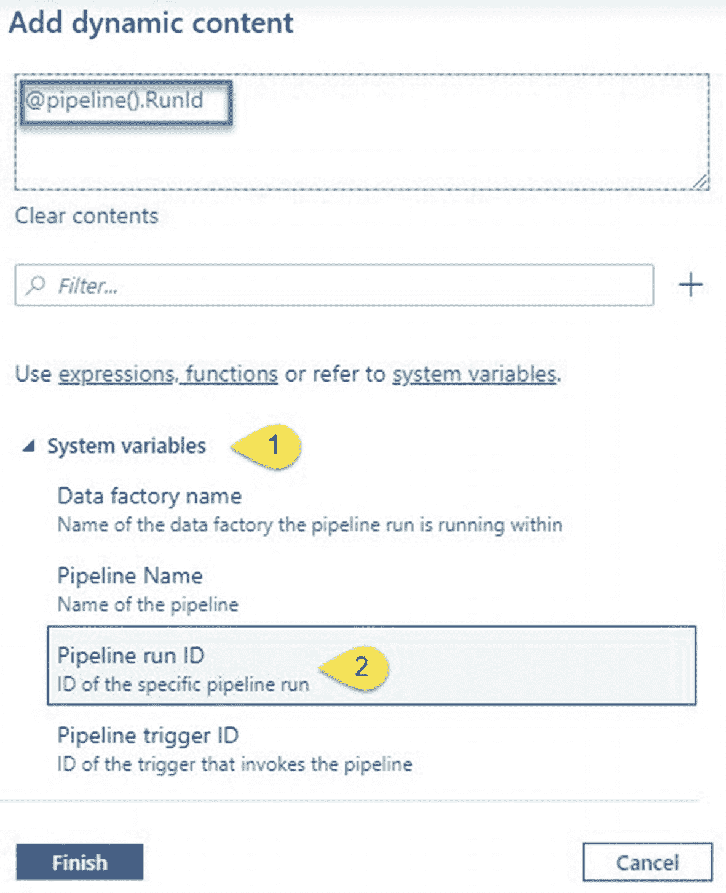
*图 10-34 为子管道配置 ParentRunId 参数*

*   `ApplicationPackageId` / int / `@item().ApplicationPackageId`
*   `ApplicationInstanceId` / int / `@variables('ApplicationInstanceId')`
*   `FailApplicationOnPackageFailure` / bool / `@item().FailApplicationOnPackageFailure`
*   `ParentRunId` / string / `@pipeline().RunId`
    *   添加动态内容 [Alt + P]，然后选择 系统变量 ➤ Pipeline run ID，如图 10-34 所示。

配置完成后，“Execute Child Pipeline”执行管道活动在“设置”选项卡上的属性应类似于图 10-35。

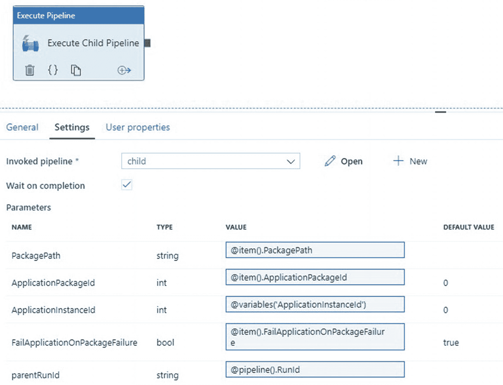
*图 10-35 已配置的“Execute Child Pipeline”执行管道活动属性*

“Execute Child Pipeline”执行管道活动现在被配置为调用子管道，并传递执行一个应用程序包所需的参数值，该包的元数据存储在 SSIS 框架中。

## 测试一下！

点击“调试”以测试执行父管道。“Execute Child Pipeline”执行管道活动应执行两次，失败一次，成功一次，这正是我们在执行后查看父管道的“输出”选项卡时看到的结果，如图 10-36 所示。

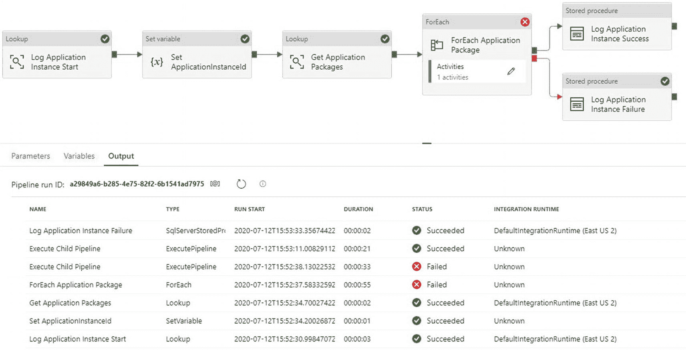
*图 10-36 查看父管道的调试执行输出*

更新后的 SSIS 框架执行引擎按设计工作，但要实现针对 `FailApplicationOnPackageFailure` 的容错，还有更多工作要做，我们将在下一步（添加应用程序实例日志记录）之后进行管理。

## 添加应用程序包实例日志记录

应用程序实例日志记录发生在父管道中。应用程序实例日志记录的模式是：

1.  记录应用程序实例开始
2.  执行一些操作
3.  记录应用程序实例状态（成功或失败）

应用程序实例日志记录是一个可靠的模式。应用程序包实例日志记录应遵循相同的模式。


### 修改 `log.ApplicationPackageInstance` 表

如之前在 `log.ApplicationInstance` 部分所述，当 ADF 活动执行时，会生成一个 `RunId` 值用于操作日志记录。与记录 Azure Data Factory 父管道执行时的父管道 Run Id 类似，记录子管道的 `RunId` 是一个很好的做法。子 `RunId` 值可用于将内部 ADF 管道日志与管道活动日志关联起来。

通过执行清单 10-6 中的 T-SQL 来修改 `log.ApplicationPackageInstance` 表。

```sql
print 'Log.ApplicationPackageInstance.ApplicationPackageRunId column'
If Not Exists(Select s.[name]
+ '.' + t.[name]
+ '.' + c.[name]
From [sys].[schemas] s
Join [sys].[tables] t
On t.[schema_id] = s.[schema_id]
Join [sys].[columns] c
On c.[object_id] = t.[object_id]
Where s.[name] = N'log'
And t.[name] = N'ApplicationPackageInstance'
And c.[name] = N'ApplicationPackageRunId')
begin
print ' - Adding log.ApplicationPackageInstance.ApplicationPackageRunId column'
Alter Table log.ApplicationPackageInstance
Add ApplicationPackageRunId nvarchar(55) NULL
print ' - Log.ApplicationPackageInstance.ApplicationPackageRunId column added'
end
Else
begin
print ' - Log.ApplicationPackageInstance.ApplicationPackageRunId column already exists.'
end
```
清单 10-6
将 `ApplicationPackageRunId` 列添加到 `ApplicationPackageInstance` 表

接下来，让我们将用于添加应用程序包实例行的 T-SQL 封装到存储过程中。

### 添加 `log.InsertApplicationPackageInstance` 存储过程

在 SSIS 执行引擎（`Parent.dtsx` SSIS 包）中，曾使用执行 SQL 任务将初始的 `ApplicationPackageInstance` 记录插入 `log.ApplicationPackageInstance` 表并返回 `ApplicationPackageInstanceId` 值。在 Azure Data Factory 执行引擎（现在是父管道和子管道）中，将使用 Lookup 活动来调用一个存储过程，该存储过程插入记录并返回 `ApplicationPackageInstanceId` 值。`ApplicationPackageInstanceId` 值将在管道后续用于更新 `ApplicationPackageInstance` 记录。

在 Azure Data Studio（或 SSMS）中，连接到名为 `SSISConfig` 的 Azure SQL 数据库。从第 7 章的清单 7-7 中的 T-SQL 代码开始，编辑 T-SQL，以幂等（可重复执行）的方式创建名为 `log.InsertApplicationPackageInstance` 的新存储过程，如清单 10-7 所示。

```sql
print 'log.InsertApplicationPackageInstance stored procedure'
If Exists(Select s.[name] + '.' + p.[name]
From [sys].[procedures] p
Join [sys].[schemas] s
On s.[schema_id] = p.[schema_id]
Where s.[name] = N'log'
And p.[name] = N'InsertApplicationPackageInstance')
begin
print ' - Dropping log.InsertApplicationPackageInstance stored procedure'
Drop Procedure log.InsertApplicationPackageInstance
print ' - Log.InsertApplicationPackageInstance stored procedure dropped'
end
print ' - Creating log.InsertApplicationPackageInstance stored procedure'
go
Create Procedure log.InsertApplicationPackageInstance
@ApplicationInstanceId int
, @ApplicationPackageId int
, @ApplicationPackageRunId nvarchar(55) = NULL
As
Insert Into [log].ApplicationPackageInstance
( ApplicationInstanceId
, ApplicationPackageId
, ApplicationPackageRunId)
Output inserted.ApplicationPackageInstanceId
Values
( @ApplicationInstanceId
, @ApplicationPackageId
, @ApplicationPackageRunId)
go
print ' - Log.InsertApplicationPackageInstance stored procedure created'
go
```
清单 10-7
用于幂等创建 `log.InsertApplicationPackageInstance` 存储过程的 T-SQL

`log.InsertApplicationPackageInstance` 存储过程需要将应用程序实例的应用程序实例 id 发送到 `@ApplicationInstanceId` int 参数，以便将应用程序实例与应用程序包实例关联起来。请记住，`ApplicationInstanceId` 是一个子管道参数，由父管道发送给子管道。另一个由父管道传递的子管道参数是 `ApplicationPackageId`。我们将 `ApplicationPackageId` 管道参数的值传递给 `log.InsertApplicationPackageInstance` 存储过程。

`log.InsertApplicationPackageInstance` 存储过程还接受一个名为 `@ApplicationPackageRunId` 的参数，当未提供值时，其默认为 `NULL`。`@ApplicationPackageRunId` 用于存储 Azure Data Factory 子管道的 `RunId` 值。如前所述，在 SSIS 框架中存储 `RunId` 允许企业 DevOps 团队将 SSIS 框架中的操作日志数据与 ADF 日志中捕获的操作数据关联起来，这在 ADF 管道执行期间发生不幸情况时极为有用。

T-SQL `Insert` 语句通过将新的 `@ApplicationInstanceId`、`@ApplicationPackageId` 和 `@ApplicationPackageRunId` 值插入 `log.ApplicationPackageInstance` 表来初始化 `ApplicationPackageInstance` 记录。配置在 `log.ApplicationPackageInstance` 表上的默认值会在行中插入以下值：

*   `ApplicationPackageStartTime` 由 `DF_log_ApplicationPackageInstance_ApplicationPackageStartTime` 设置为 `sysdatetimeoffset()`。
*   `ApplicationPackageStatus` 由 `DF_log_ApplicationPackageInstance_ApplicationPackageStatus` 设置为 `N'Running'`。

如果一切按计划进行，Azure Data Studio 应返回如图 10-37 所示的消息。

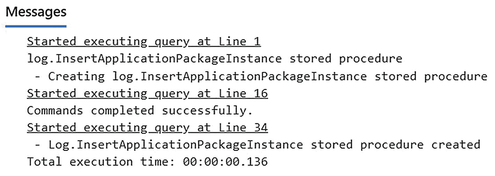
图 10-37
创建 `log.InsertApplicationPackageInstance` 存储过程产生的消息

创建 `log.InsertApplicationPackageInstance` 存储过程后，下一步是向管道添加一个活动以执行该存储过程。


### 记录应用程序包实例

ADF 执行引擎需要运行一个名为 `log.InsertApplicationPackageInstance` 的存储过程，该过程将返回一个名为 `ApplicationPackageInstanceId` 的值。为此构建了一个查找活动！

返回到子 ADF 管道。将一个新的查找活动拖到画布上，并将其重命名为“记录应用程序包实例开始”，如图 10-38 所示。

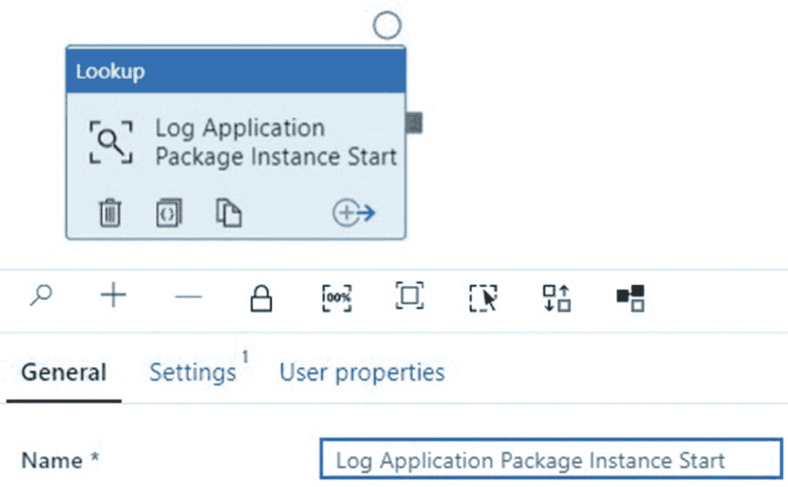

图 10-38

添加“记录应用程序包实例开始”查找活动

单击“记录应用程序实例开始”查找活动的“设置”选项卡以继续配置。单击“源数据集”属性下拉菜单，选择“ssisFrameworkDataSet”，然后将“记录应用程序包实例开始”查找活动的“使用查询”属性选项设置为“存储过程”。从“名称”属性下拉菜单中选择 `log.InsertApplicationPackageInstance`，如图 10-39 所示。

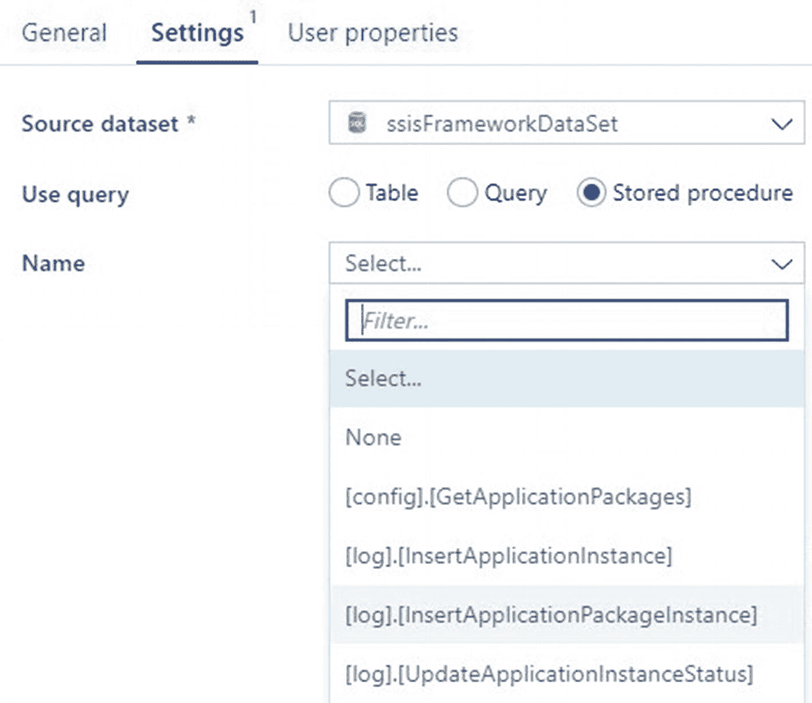

图 10-39

选择 log.InsertApplicationPackageInstance 存储过程

接下来，单击“导入参数”按钮，从 `log.InsertApplicationPackageInstance` 存储过程导入 `@ApplicationInstanceId`、`@ApplicationPackageId` 和 `@ApplicationPackageRunId`（Int32 和 String 类型）参数。单击 `@ApplicationInstanceId` 参数的“值”属性文本框内部，然后单击“添加动态内容 [Alt + P]”链接，如图 10-40 所示。

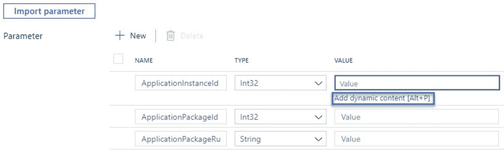

图 10-40

准备向参数值属性添加动态内容

当“添加动态内容”面板显示时，展开“参数”表达式类别，然后单击“ApplicationInstanceId”，将参数值 ADF 表达式设置为 `@pipeline.parameters.ApplicationInstanceId`，如图 10-41 所示。

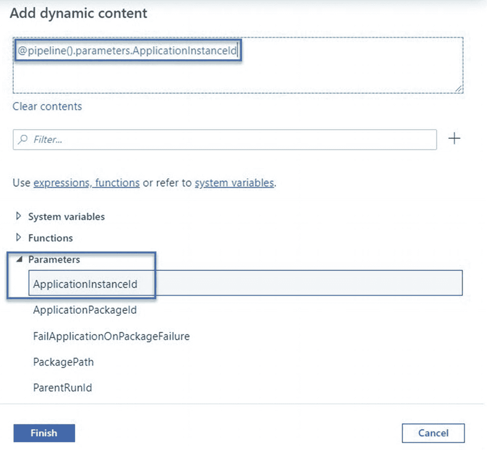

图 10-41

设置 ApplicationInstanceId 参数值表达式

单击“完成”按钮继续。

重复前述步骤，将 `@ApplicationPackageId` 存储过程参数分配给子管道的 `ApplicationPackageId` 参数，如图 10-42 所示。

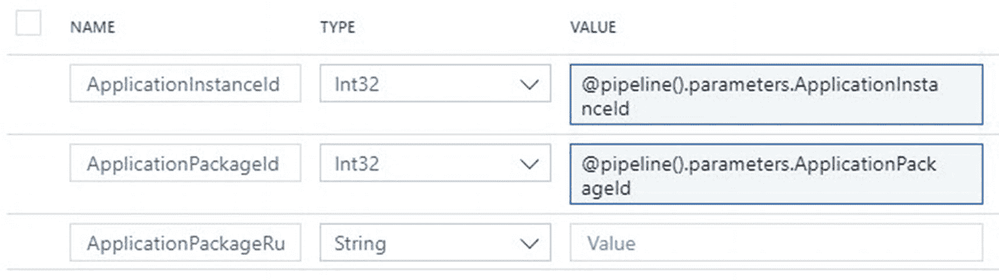

图 10-42

设置 ApplicationPackageId 参数值表达式

单击 `@ApplicationPackageRunId` 参数的“值”属性文本框内部，然后单击“添加动态内容 [Alt + P]”链接。当“添加动态内容”面板显示时，展开“系统变量”表达式类别，然后单击“管道运行 ID”，将参数值 ADF 表达式设置为 `@pipeline().RunId`，如图 10-43 所示。

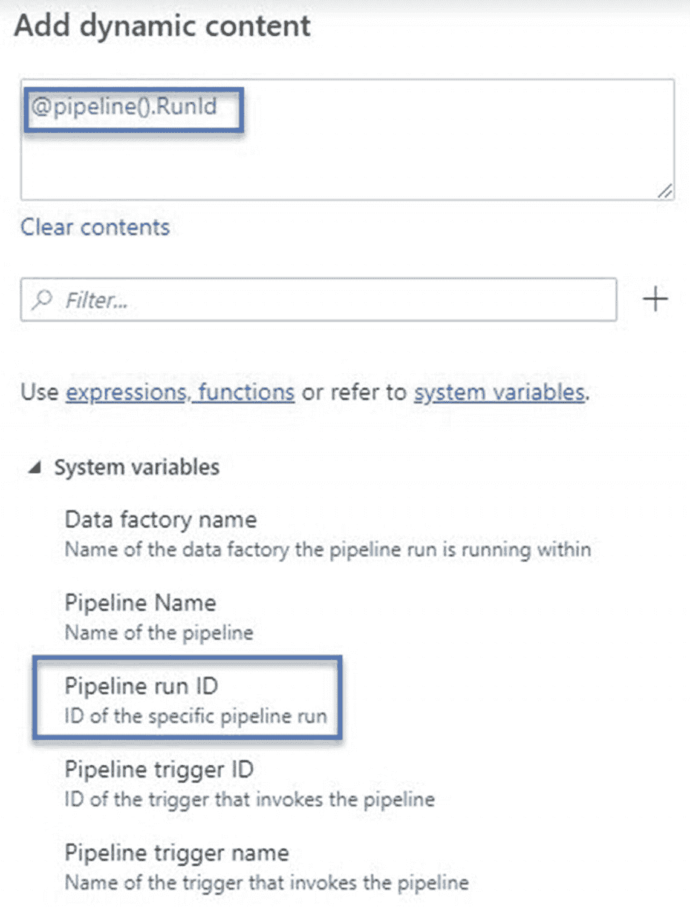

图 10-43

设置 ApplicationPackageRunId 参数值表达式

将“查询超时（分钟）”属性保留为其默认值（120 分钟），“隔离级别”属性设置为“无”（默认值），并保持“仅限第一行”属性为选中状态（默认值）。

至此，“记录应用程序包实例开始”查找活动已配置为调用 `log.InsertApplicationPackageInstance` 存储过程，向其传递子管道的 `ApplicationInstanceId`、`ApplicationPackageId` 和 `ApplicationPackageRunId` 参数值，并返回 `ApplicationPackageInstanceId` 值。

将“记录应用程序包实例开始”查找活动的“成功”输出连接到“执行应用程序包”执行 SSIS 活动。

### 添加 log.UpdateApplicationPackageInstanceStatus 存储过程

按照当前配置，当子管道被调用以执行 ReportAndFail.dtsx SSIS 包时，它将失败，因为 ReportAndFail.dtsx SSIS 包被设计为失败。需要更新 `log.ApplicationPackageInstance` 行以反映 SSIS 框架应用程序包实例失败的状态。

首先，向 SSISConfig 数据库添加一个名为 `log.UpdateApplicationPackageInstanceStatus` 的新存储过程，如代码清单 10-8 所示。

```
print 'log.UpdateApplicationPackageInstanceStatus stored procedure'
If Exists(Select s.[name] + '.' + p.[name]
From [sys].[procedures] p
Join [sys].[schemas] s
On s.[schema_id] = p.[schema_id]
Where s.[name] = N'log'
And p.[name] = N'UpdateApplicationPackageInstanceStatus')
begin
print ' - Dropping log.UpdateApplicationPackageInstanceStatus stored  procedure'
Drop Procedure log.UpdateApplicationPackageInstanceStatus
print ' - Log.UpdateApplicationPackageInstanceStatus stored procedure dropped'
end
print ' - Creating log.UpdateApplicationPackageInstanceStatus stored procedure'
go
Create Procedure log.UpdateApplicationPackageInstanceStatus
@ApplicationPackageInstanceId int
, @ApplicationPackageStatus nvarchar(55) = 'Succeeded'
As
Update [log].ApplicationPackageInstance
Set ApplicationPackageEndTime = sysdatetimeoffset()
, ApplicationPackageStatus = @ApplicationPackageStatus
Where ApplicationPackageInstanceId = @ApplicationPackageInstanceId
go
print ' - Log.UpdateApplicationPackageInstanceStatus stored procedure created'
go
```

代码清单 10-8
用于创建 log.UpdateApplicationPackageInstanceStatus 存储过程的幂等 T-SQL

如果一切顺利，Azure Data Studio 的消息应该与图 10-44 相似。

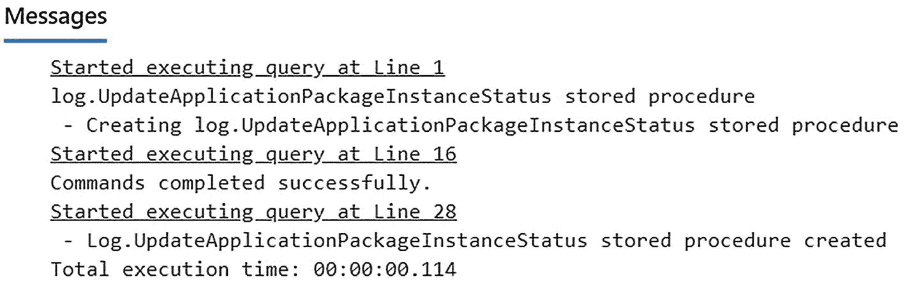

图 10-44

反映 log.UpdateApplicationPackageInstanceStatus 存储过程成功创建的 Azure Data Studio 消息

下一步是添加一个存储过程活动，用于在失败时调用 `log.UpdateApplicationPackageInstanceStatus` 存储过程。


### 更新应用程序包实例

ADF 执行引擎需要执行一个名为 `log.UpdateApplicationPackageInstanceStatus` 的存储过程，该过程接受 `ApplicationPackageInstanceId` 和 `ApplicationPackageStatus` 值，然后更新当前应用程序包实例的状态。存储过程活动非常适合这个任务！

返回子 ADF 管道。将一个存储过程活动拖放到设计界面上。从执行应用程序包活动添加一个失败输出到新的存储过程活动。将新的存储过程活动重命名为“记录应用程序包实例失败”，如图 10-45 所示。

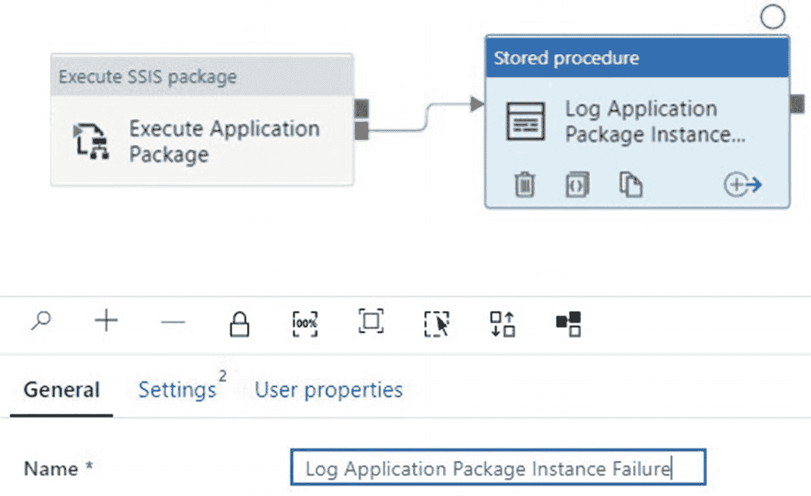

*图 10-45*
添加“记录应用程序包实例失败”存储过程活动

在“设置”选项卡上，从“链接服务”属性下拉菜单中选择 `ssisFrameworkLinkedService`，然后从“存储过程名称”下拉菜单中选择 `[log].[UpdateApplicationPackageInstanceStatus]`。单击“导入参数”按钮以从 `log.UpdateApplicationPackageInstanceStatus` 存储过程导入参数。单击 `ApplicationPackageInstanceId` 参数的值文本框内部，然后单击“添加动态内容 [Alt + P]”链接。当“添加动态内容”面板显示时，展开“活动输出”表达式类别，并单击“记录应用程序包实例启动”。动态内容文本框将显示 `@activity('Log Application Package Instance Start').output`。在表达式后追加 `.firstrow.ApplicationPackageInstanceId`，以将“记录应用程序包实例启动”查找活动执行返回的 `ApplicationPackageInstanceId` 值映射到 `ApplicationPackageInstanceId` 参数的值属性中，如图 10-46 所示。

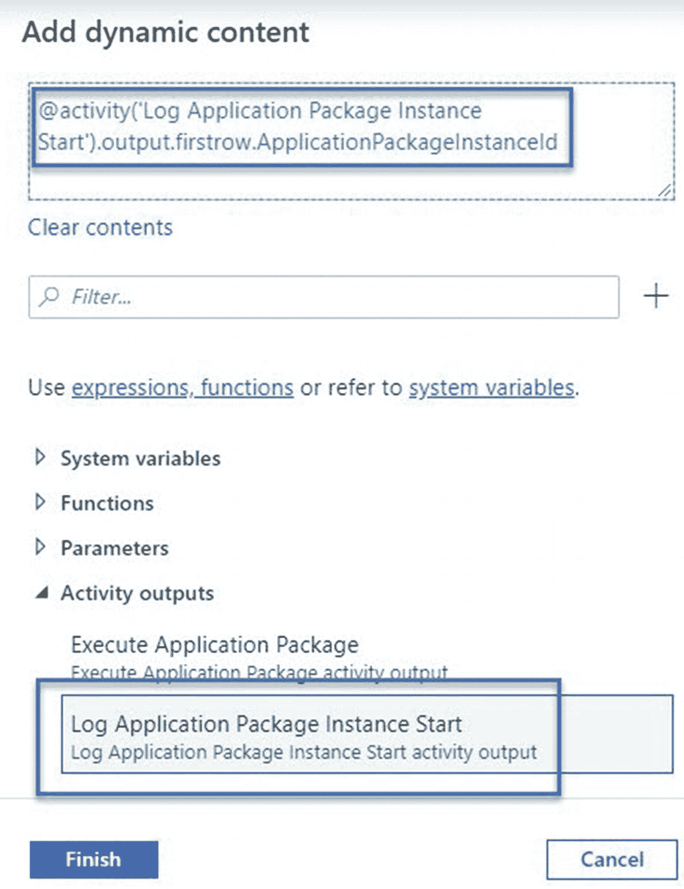

*图 10-46*
将“记录应用程序包实例启动”查找活动映射到 ApplicationPackageInstanceId 参数的值属性

单击“完成”按钮继续。

在 `ApplicationStatus` 参数的值属性中键入“失败”，如图 10-47 所示。

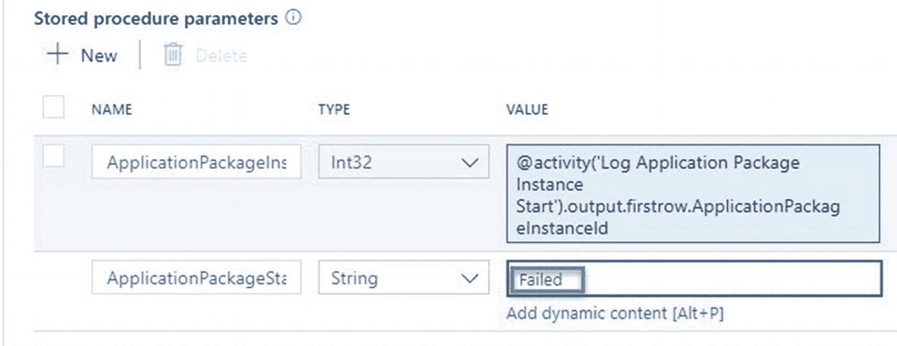

*图 10-47*
将 ApplicationPackageStatus 属性设置为“失败”

至此，SSIS 框架执行引擎 ADF 版本的子管道已配置为执行 SSIS 应用程序包并记录失败的应用程序包实例。

下一步是测试执行该管道。

### 测试执行！

返回父管道以测试执行引擎。单击父管道工具栏上的“调试”项。“输出”选项卡会显示，一段时间后，会显示出已执行的父管道活动，如图 10-48 所示。

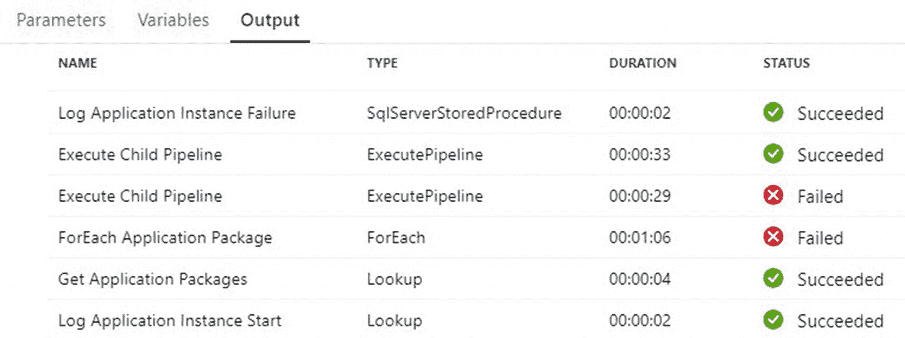

*图 10-48*
父管道测试执行的结果

执行清单 10-9 中所示的 T-SQL 查询以检查应用程序实例结果。

```sql
Select top 1
a.ApplicationName
, ai.ApplicationInstanceId
, ai.ApplicationStatus
From log.ApplicationInstance ai
Join config.Applications a
On a.ApplicationId = ai.ApplicationId
Order By ApplicationInstanceId Desc

declare @ApplicationInstanceId int = (Select top 1 ApplicationInstanceId
From log.ApplicationInstance
Order By ApplicationInstanceId DESC)

Select p.PackageName
, ai.ApplicationInstanceId
, api.ApplicationPackageInstanceId
, api.ApplicationPackageStatus
, ap.FailApplicationOnPackageFailure
From log.ApplicationPackageInstance api
Join log.ApplicationInstance ai
On ai.ApplicationInstanceId = api.ApplicationInstanceId
Join config.ApplicationPackages ap
On ap.ApplicationPackageId = api.ApplicationPackageId
Join config.Packages p
On p.PackageId = ap.PackageId
Where ai.ApplicationInstanceId = @ApplicationInstanceId
Order By ApplicationPackageInstanceId
```
*清单 10-9*
应用程序执行结果

结果应类似于图 10-49：

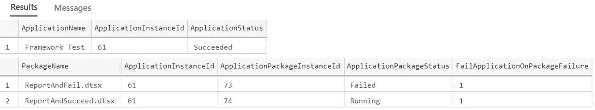

*图 10-49*
应用程序执行结果

尽管结果符合预期，但缺少了点什么：目前没有存储过程活动在成功时更新应用程序包实例，这就是为什么清单 10-9 中查询的结果（如图 10-49 所示）将 `ReportAndSucceed.dtsx` SSIS 的 ApplicationPackageStatus 显示为“正在运行”。

### 在成功时更新应用程序包实例

子管道需要一种记录应用程序包实例成功的方法。首先，单击“记录应用程序包实例失败”存储过程活动上的“克隆”图标，如图 10-50 所示。

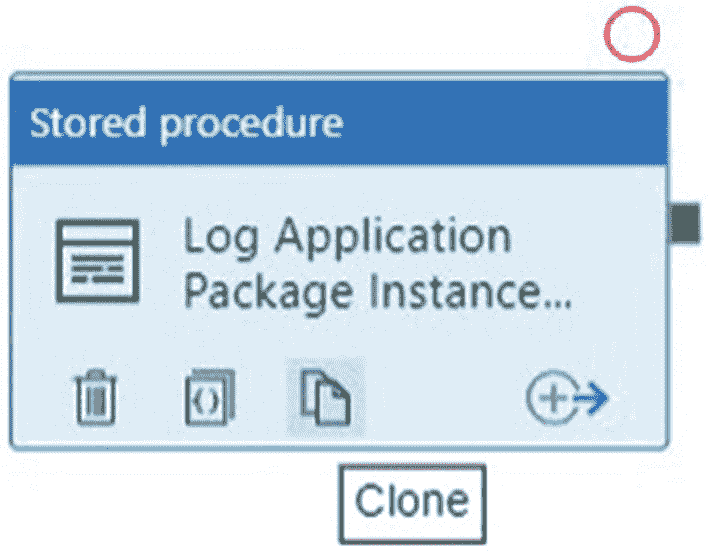

*图 10-50*
准备从“记录应用程序包实例失败”存储过程活动克隆“记录应用程序包实例成功”存储过程活动

与之前克隆“记录应用程序实例失败”存储过程活动类似，克隆“记录应用程序包实例失败”存储过程活动是合理的，因为新的存储过程活动将调用*相同*的存储过程——`log.UpdateApplicationPackageInstanceStatus`——并且*只有*一个参数值配置会发生变化。

从“执行应用程序包”执行 SSIS 包活动添加一个成功输出到克隆的存储过程活动，然后将克隆的存储过程活动重命名为“记录应用程序包实例成功”，如图 10-51 所示。

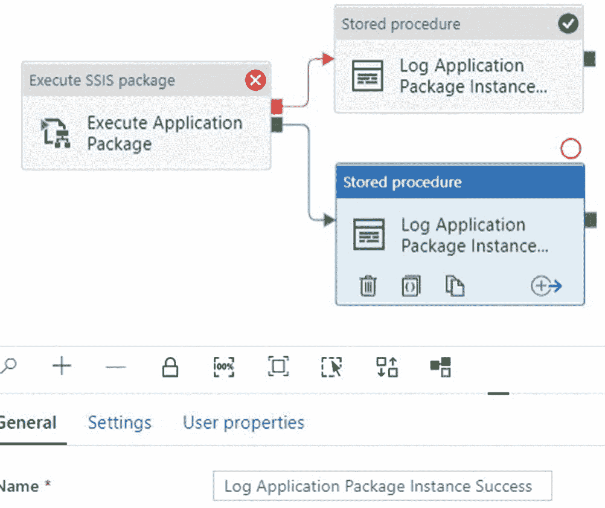

*图 10-51*
添加“记录应用程序包实例成功”存储过程活动

接下来，单击“记录应用程序包实例成功”存储过程活动的“设置”选项卡。“设置”选项卡上唯一需要的更改是 ApplicationPackageStatus 参数的值属性的值，需要从“失败”更新为“成功”，如图 10-52 所示。

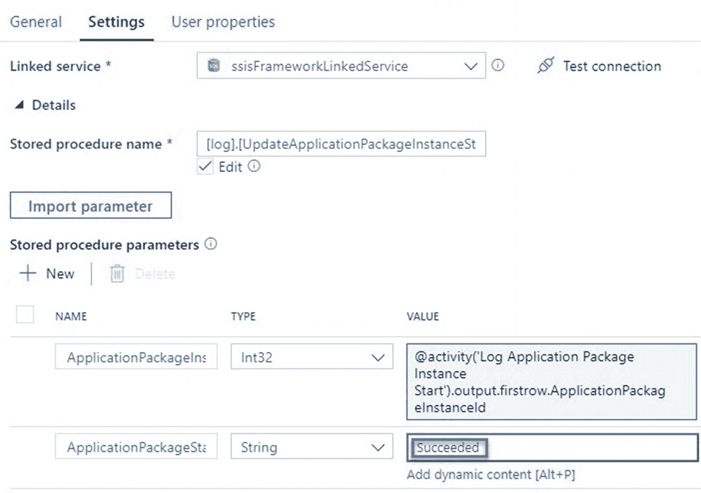

*图 10-52*
更新 ApplicationPackageStatus 参数值

一次新的测试执行确认父管道按设计记录了 SSIS 框架应用程序失败，并且重新执行清单 10-9 中的查询确认了——如图 10-53 所示。

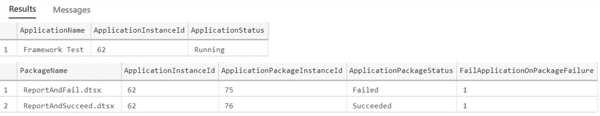

*图 10-53*
`ReportAndSucceed.dtsx` 应用程序包成功

在我们目前的示例中，每个应用程序实例都会失败，因为一个名为 `ReportAndFail.dtsx` 的子包每次执行都会失败。下一步是为 ADF 版本的 SSIS 框架添加容错能力，这将是下一章的主题。


### 结论

在本章中，我们为父管道添加了日志记录功能，修改了 `SSISConfig` 日志表，并将日志记录逻辑封装在存储过程中。通过添加一个子管道来执行应用程序包的执行，我们解耦了 SSIS 框架应用程序包的执行。

## 11. ADF 框架中的容错

前一章介绍了针对 SSIS 框架执行引擎的 Azure Data Factory 版本的日志记录功能。SSIS 包可用的功能与 Azure Data Factory 管道可用的功能之间的差异驱动了设计上的变更。

在本章中，我们通过实现容错来完善 ADF 执行引擎的功能，该容错功能可根据 `SSISConfig` 元数据配置以编程方式停止管道执行。

### 容错简介

依作者愚见，*容错* 是描述优雅失败（graceful failure）的另一种方式。思考“这个失败时会发生什么？”是技术人员与工程师之间的一个区别。技术人员完成能实现某些任务的项目，而工程师则构建能管理问题域的解决方案。这归结于个人对“完成”的定义。技术人员处理故障，并在项目能运行时停止。工程师则不会停止，直到解决方案不会失败；而且——当解决方案*确实失败*时——工程师确保失败是优雅的。

您可能还记得，容错是第 5-7 章设计的本地 SSIS 框架执行引擎（`Parent.dtsx` 包）中最复杂的部分。Azure Data Factory 版本的 SSIS 框架执行引擎（父管道和子管道）的设计也不例外。为了实现容错，ADF 执行策略需要彻底重新设计。

该示例已经通过构建子管道实现了部分所需的重新设计。为什么应用程序包的执行需要移到子管道？我们将在本章回答这个问题。

### 将 ADF 托管标识添加到参与者角色

在本节中，我们将使用 Azure Data Factory REST API。如果这令您担忧，请不要担心；使用 ADF REST API 很有趣，并将提升您的 Azure Data Factory 自动化技能！

第一步是将 Azure Data Factory 托管标识添加到 Azure Data Factory 访问控制边栏选项卡中的“参与者”角色。首先登录 Azure 门户并导航到 Azure Data Factory 边栏选项卡。单击“访问控制 (IAM)”，如图 11-1 所示。

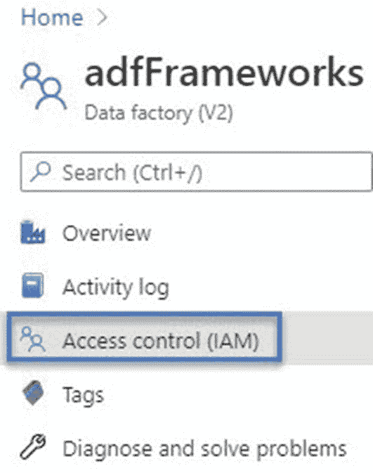

图 11-1
导航到访问控制 (IAM) 边栏选项卡

当访问控制 (IAM) 边栏选项卡显示时，单击“添加角色分配”添加按钮，如图 11-2 所示。

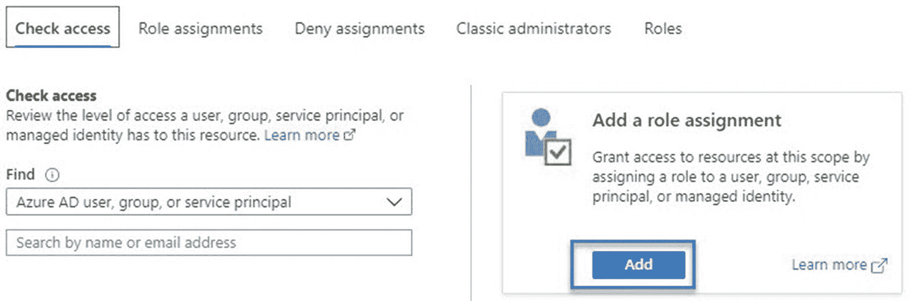

图 11-2
准备分配角色

当“添加角色分配”边栏选项卡显示时，从“角色”下拉菜单中选择“参与者”。将“分配访问权限到”下拉菜单保留为默认值（“Azure AD 用户、组或服务主体”），并在“选择”文本框中输入您的 Azure Data Factory 名称，如图 11-3 所示。

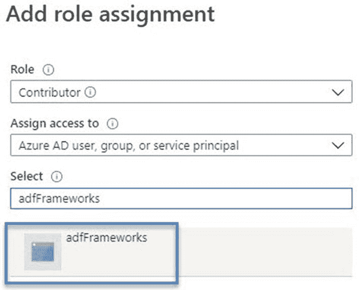

图 11-3
查找 Azure Data Factory 托管标识

在“添加角色分配”边栏选项卡中，单击 Azure Data Factory 托管标识。“所选成员”列表会反映当前的选择，并且“保存”按钮已启用，表明角色分配已准备好存储，如图 11-4 所示。

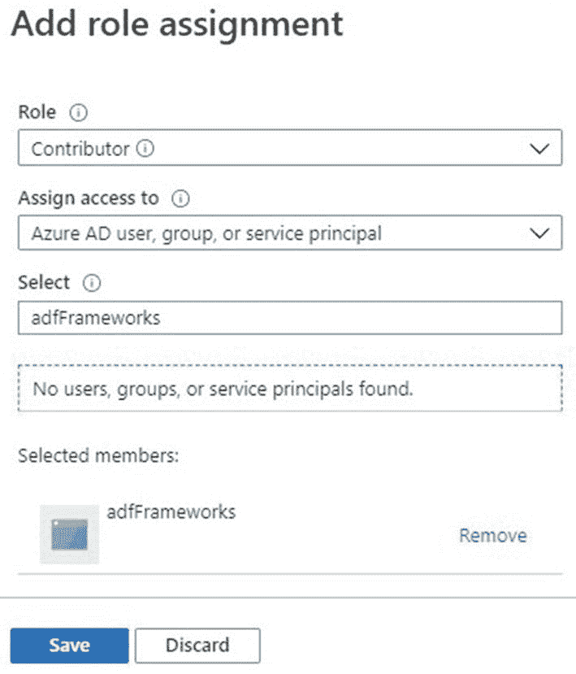

图 11-4
准备完成角色分配

单击“角色分配”选项卡以查看 ADF 的角色分配，如图 11-5 所示。

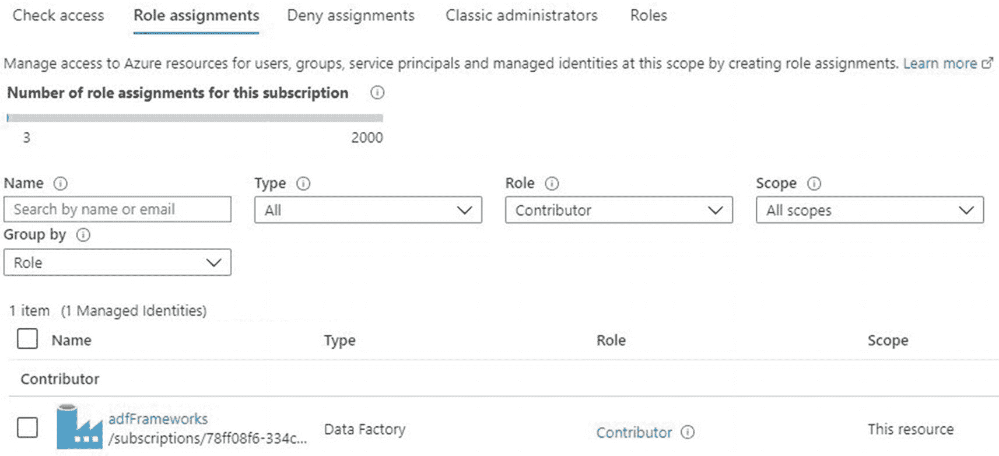

图 11-5
ADF 托管标识已分配到参与者角色

现在，Azure Data Factory 托管标识已分配到参与者角色，ADF Web 活动可以与 Azure Data Factory REST API 托管的多种方法进行交互。

### 添加应用程序包容错

在 Azure Data Factory 版本的 SSIS 框架中如何实现容错？

#### 关于包失败时使应用程序失败

`FailApplicationOnPackageFailure` 与应用程序包元数据一起存储在 `SSISConfig` 数据库中。`FailApplicationOnPackageFailure` 的值会返回到父管道中的“获取应用程序包”查找活动，然后传递给子管道参数（名为 `FailApplicationOnPackageFailure`），该参数位于“ForEach 应用程序包”ForEach 活动的内部活动中的“执行子管道”执行管道活动内。

#### 实现应用程序包容错

首先，在子管道中实现应用程序包容错：右键单击“执行应用程序包”执行 SSIS 包活动的“失败”输出，然后单击“删除”，如图 11-6 所示。

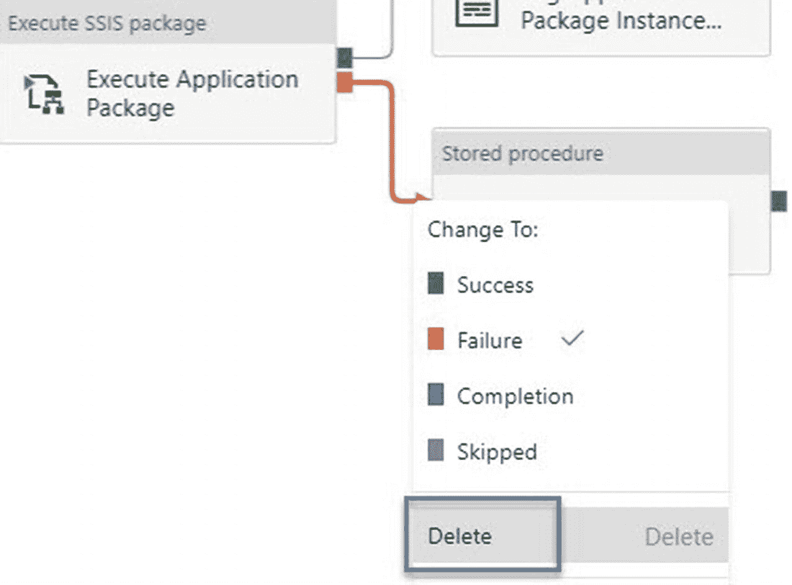

图 11-6
删除“执行应用程序包”执行 SSIS 包活动的失败输出

将一个“条件”活动拖到子管道画布上，并将条件重命名为“如果包失败则使应用程序失败”，如图 11-7 所示。

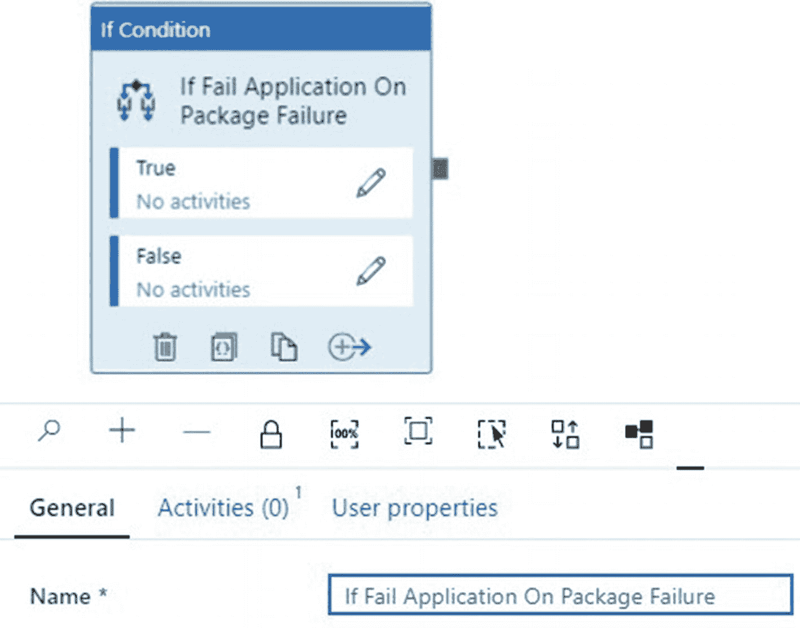

图 11-7
添加“如果包失败则使应用程序失败”条件活动

将“执行应用程序包”执行 SSIS 活动的“失败”输出连接到“如果包失败则使应用程序失败”条件活动，如图 11-8 所示。

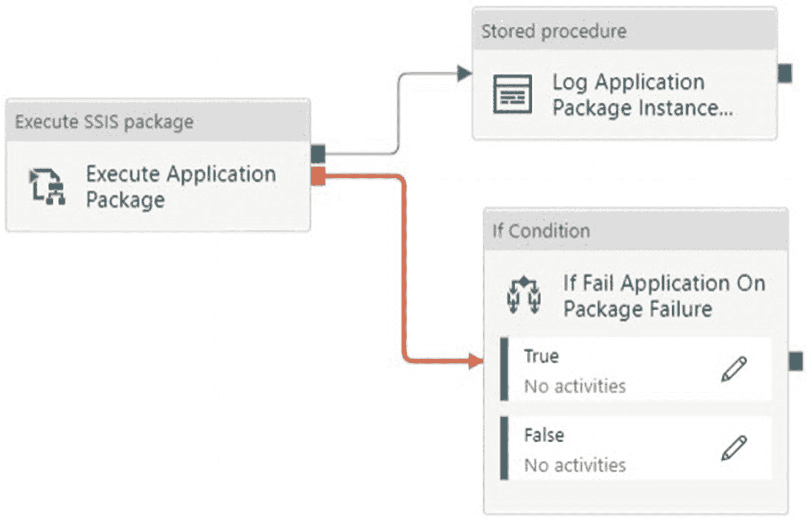

图 11-8
将失败输出连接到“如果包失败则使应用程序失败”条件活动

单击“如果包失败则使应用程序失败”条件活动的“活动”选项卡，然后单击表达式文本框内部。单击表达式文本框下方的“添加动态内容 [Alt + P]”链接。当“添加动态内容”边栏选项卡显示时，展开“参数”类别并选择 `FailApplicationOnPackageFailure` 子管道参数。表达式文本框将显示 `pipeline().parameters.FailApplicationOnPackageFailure`。在表达式前添加 `@bool(`，并在末尾添加右括号 `)` 以完成表达式，如图 11-9 所示。

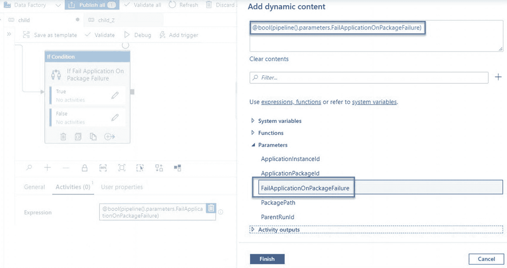

图 11-9
为“如果包失败则使应用程序失败”条件活动配置表达式属性

单击“完成”以完成此部分的配置。


#### 检查逻辑

让我们在此稍作停顿，梳理一下目前的逻辑。应用程序包执行有两种可能的结果：要么成功，要么失败。

如果应用程序包执行成功，则会执行“记录应用程序包实例成功”存储过程活动，并为当前的`ApplicationPackageInstanceID`更新`log.ApplicationPackageInstance`表中的`ApplicationPackageStatus`值为"Succeeded"（成功）。

成功路径——即第一个用例——已经实现。容错逻辑仅在应用程序包执行失败时才需要。

如果应用程序包执行失败，“若包失败则应用程序失败”条件活动将对子包管道的`FailApplicationOnPackageFailure`参数的值进行求值（通过表达式转换为布尔值）。

当应用程序包执行失败**且**`FailApplicationOnPackageFailure`为 false（假）时，发生第二个用例。在这种情况下，我们需要：
*   记录应用程序包执行的状态（失败及信息）
*   **继续**执行 SSIS 框架应用程序的应用程序包

当应用程序包执行失败**且**`FailApplicationOnPackageFailure`为 true（真）时，发生第三个用例。在这种情况下，我们需要：
*   记录应用程序包执行的状态（失败及信息）
*   记录应用程序执行的状态（失败）
*   **停止**应用程序包的执行

#### 实现容错逻辑

要开始实现容错逻辑，请点击“若包失败则应用程序失败”条件活动的 False（假）活动编辑器，如图 11-10 所示。


图 11-10
打开“若包失败则应用程序失败”条件活动的 False 活动编辑器

将一个存储过程活动拖放到画布上，并将新的存储过程活动重命名为“记录应用程序包实例失败 0”，如图 11-11 所示。


图 11-11
添加“记录应用程序包实例失败 0”存储过程活动

点击“设置”选项卡，并将“链接服务”属性设置为`ssisFrameworkLinkedService`。从“存储过程名称”下拉列表中选择`log.UpdateApplicationPackageInstanceStatus`，如图 11-12 所示。


图 11-12
配置链接服务和存储过程名称

点击“导入参数”按钮开始配置`log.UpdateApplicationPackageInstanceStatus`存储过程参数值。通过点击“添加动态内容[Alt + P]”链接并选择“记录应用程序包实例开始”活动来配置`ApplicationPackageInstanceId`存储过程参数，这将在表达式文本框中输入表达式`@activity('Log Application Package Instance Start').output`。将`".firstrow.ApplicationPackageInstanceId"`附加到表达式。在`ApplicationPackageStatus`值文本框中，输入`"Failed (FailAppOnPkgFail: 0)"`，如图 11-13 所示。


图 11-13
配置`ApplicationPackageInstanceId`和`ApplicationPackageStatus`参数值

一旦存储过程参数值设置完毕，“记录应用程序包实例失败 0”存储过程活动的配置即告完成。请注意，`ApplicationPackageStatus`包含了附加信息：`"(FailAppOnPkgFail: 0)"`。“记录应用程序包实例失败 0”存储过程用于处理用例 2。

`log.ApplicationPackageInstance`表中的`ApplicationPackageStatus`列当前配置为`nvarchar(25)`，不足以容纳文本`"Failed (FailAppOnPkgFail: 0)"`。请执行清单 11-1 中的 T-SQL 来扩展列的大小。

```sql
Alter Table [log].[ApplicationPackageInstance]
Alter Column ApplicationPackageStatus nvarchar(55) Not NULL
```
清单 11-1
扩展`ApplicationPackageStatus`列

在讨论和添加支持用例 3 的代码之前，快速回顾一下 ForEach 活动的默认行为是个好主意。

##### ForEach 活动的默认行为

ForEach 活动的默认迭代行为是继续遍历已配置的集合，执行“内部活动”，直到集合中的所有项目都被遍历完毕。一个副作用是，“内部活动”中发生的错误**不会**停止迭代。无论执行结果如何，“内部活动”都会在集合被遍历时执行。

**在**迭代完成后，迭代期间发生的任何失败都会导致 ForEach 活动失败。

假设一个名为“ForEach Array Item”的 ForEach 活动包含一个“内部活动”，即一个名为“Wait”的等待活动（我知道这名字很有创意）。假设一个包含四个项目的数组变量被提供给 ForEach 活动的 Items 属性。考虑以下 ForEach“内部活动”执行的场景，其中 Wait 活动的第二次迭代失败，按迭代编号如下：
1.  Wait 执行成功。
2.  Wait 执行失败。
3.  Wait 执行成功。
4.  Wait 执行成功。

每次迭代都将执行，导致 Wait 活动执行四次。ForEach 活动将失败。调试输出将如图 11-14 所示。


图 11-14
ForEach 活动执行的输出

图 11-14 显示了 Wait 活动的四次执行。三次成功，一次失败。请注意，每个 Wait 活动都执行了，并且在第二次迭代中的 Wait 活动**失败后**，又执行了两次 Wait 活动。另请注意，ForEach 活动失败了。


#### ForEach 活动默认行为及其应用

应用于 SSIS 框架的容错机制，“ForEach 应用程序包” ForEach 活动（其“内部活动”在父管道中配置为执行子管道）默认已配置为无论子包执行结果如何都继续执行子包。因此，下一步是添加逻辑，以便在我们的用例需要时——即当应用程序包执行失败 **且** `FailApplicationOnPackageFailure` 为 true（用例 3）时——*停止*执行应用程序包。

要配置“如果在包失败时应用程序失败”条件活动的“True 活动”，请点击“True 活动”旁边的编辑图标（铅笔），如图 11-15 所示。

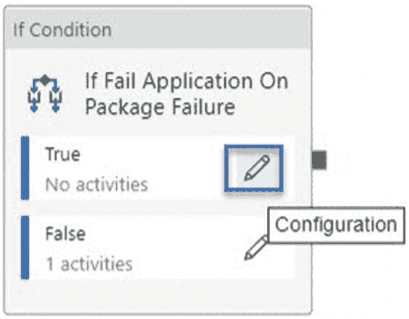
*图 11-15：准备配置“True 活动”*

当 `FailApplicationOnPackageFailure` 位配置为 true（1，这是默认值）时，响应失败的子包执行的操作顺序如下：
1.  记录应用程序包实例失败
2.  记录应用程序实例已取消
3.  设置取消父管道的命令
4.  执行取消父管道的命令

当 `FailApplicationOnPackageFailure` 位配置为 true（1）时，响应失败的子包执行的第一步如下：记录应用程序包实例失败。

要开始添加记录应用程序包实例失败的功能，请在“如果在包失败时应用程序失败”条件活动的“True 活动”画布上添加一个存储过程活动，并将新的存储过程活动重命名为“记录应用程序包实例失败 1”，如图 11-16 所示。

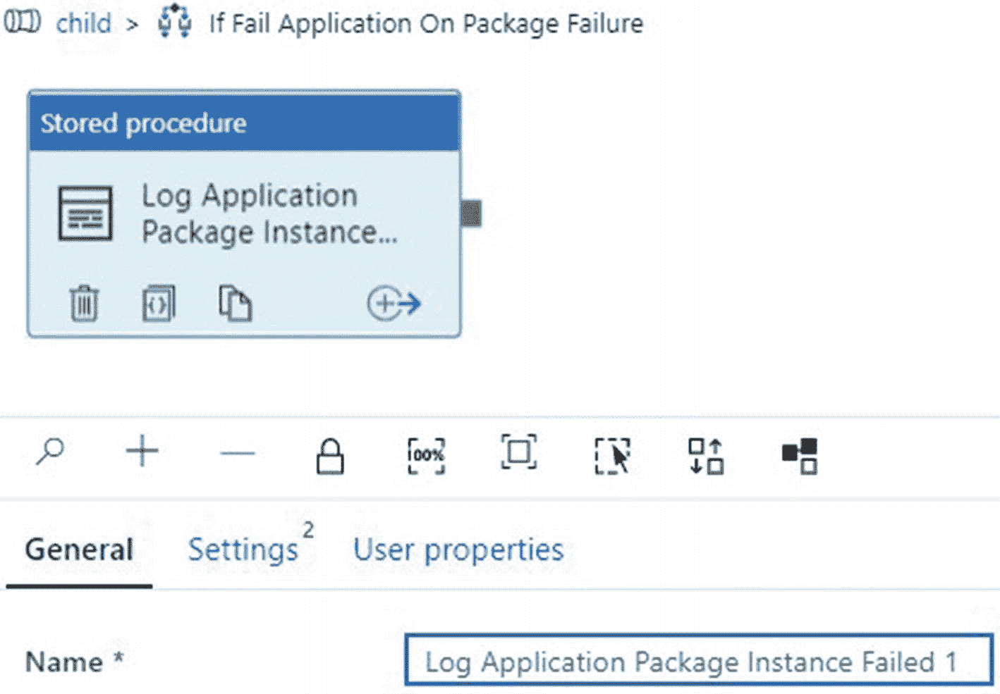
*图 11-16：添加“记录应用程序包实例失败 1”存储过程活动*

在“记录应用程序包实例失败 1”存储过程活动的“设置”选项卡上，单击“链接服务”属性的下拉菜单，选择“ssisFrameworkLinkedService”。在“存储过程名称”下拉菜单中，选择“[log].[UpdateApplicationPackageInstanceStatus]”，如图 11-17 所示。

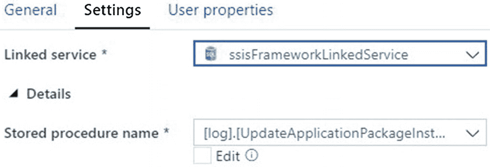
*图 11-17：配置“记录应用程序包实例失败 1”存储过程活动设置*

单击“导入参数”按钮。当显示 `ApplicationPackageInstanceId` 和 `ApplicationPackageStatus` 参数时，通过单击值文本框内部，然后单击“添加动态内容 [Alt + P]”链接，再输入表达式“`@activity('Log Application Package Instance Start').output.firstrow.ApplicationPackageInstanceId`”来配置 `ApplicationPackageInstanceId`。在 `ApplicationPackageStatus` 参数值文本框中，输入文本“Failed (FailAppOnPkgFail: 1)”，如图 11-18 所示。

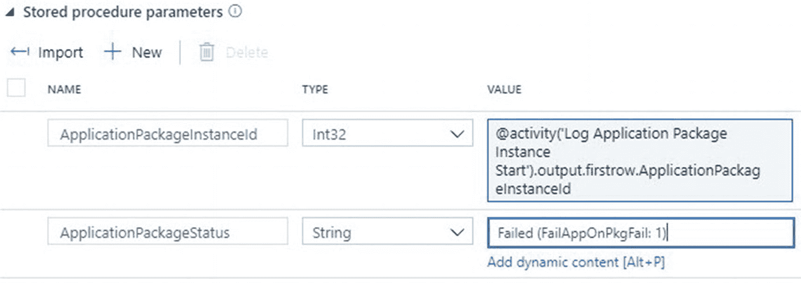
*图 11-18：配置“记录应用程序包实例失败 1”存储过程活动设置的参数值*

以上完成了当 `FailApplicationOnPackageFailure` 位配置为 true（1）时响应失败的子包执行的第一步：记录应用程序包实例失败。

当 `FailApplicationOnPackageFailure` 位配置为 true（1）时响应失败的子包执行的第二步如下：记录应用程序实例已取消。

要开始添加记录应用程序实例已取消的功能，请在“如果在包失败时应用程序失败”条件活动的“True 活动”画布上添加一个存储过程活动，将“记录应用程序包实例失败 1”存储过程活动的成功输出连接到新的存储过程活动，然后将新的存储过程活动重命名为“记录应用程序实例已取消”，如图 11-19 所示。

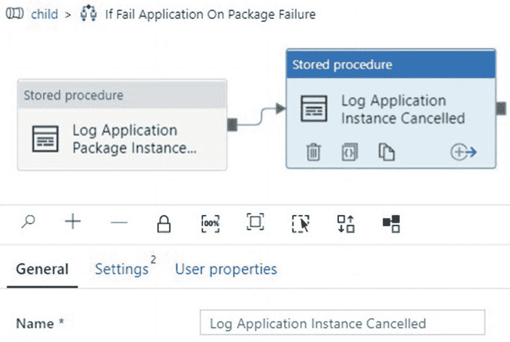
*图 11-19：添加“记录应用程序实例已取消”存储过程活动*

将“记录应用程序包实例失败 1”存储过程活动的成功输出连接到“记录应用程序实例已取消”存储过程活动。在“记录应用程序实例已取消”存储过程活动的“设置”选项卡上，单击“链接服务”属性的下拉菜单，选择“ssisFrameworkLinkedService”。在“存储过程名称”下拉菜单中，选择“[log].[UpdateApplicationIntanceStatus]”，如图 11-20 所示。

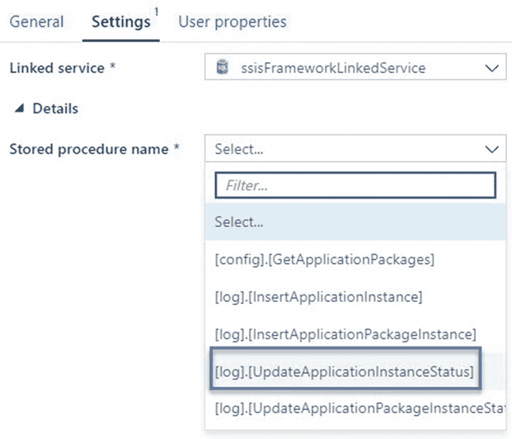
*图 11-20：配置“记录应用程序实例已取消”存储过程活动设置*

单击“导入参数”按钮。当显示 `ApplicationInstanceId` 和 `ApplicationStatus` 参数时，通过单击值文本框内部，然后单击“添加动态内容 [Alt + P]”链接，再输入表达式“`@pipeline().parameters.ApplicationInstanceId`”来配置 `ApplicationInstanceId`。在 `ApplicationStatus` 参数值文本框中，输入文本“Cancelled”，如图 11-21 所示。

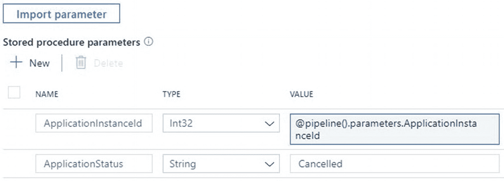
*图 11-21：配置“记录应用程序实例已取消”存储过程活动设置的参数值*

以上完成了当 `FailApplicationOnPackageFailure` 位配置为 true（1）时响应失败的子包执行的第二步：记录应用程序实例已取消。

在我们开始此部分过程之前，请导航到子管道设置，并单击“变量”选项卡。单击“+ 新建”按钮，添加一个名为“StopParentPipelineRunIdString”的字符串变量，如图 11-22 所示。

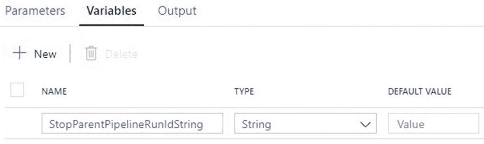
*图 11-22：向子管道添加 StopParentPipelineRunIdString 变量*

要开始添加构建取消管道运行命令的功能，请在“如果在包失败时应用程序失败”条件活动的“True 活动”画布上添加一个设置变量活动，将“记录应用程序实例已取消”存储过程活动的成功输出连接到新的设置变量活动，然后将新的设置变量活动重命名为“设置取消父管道命令”，如图 11-23 所示。

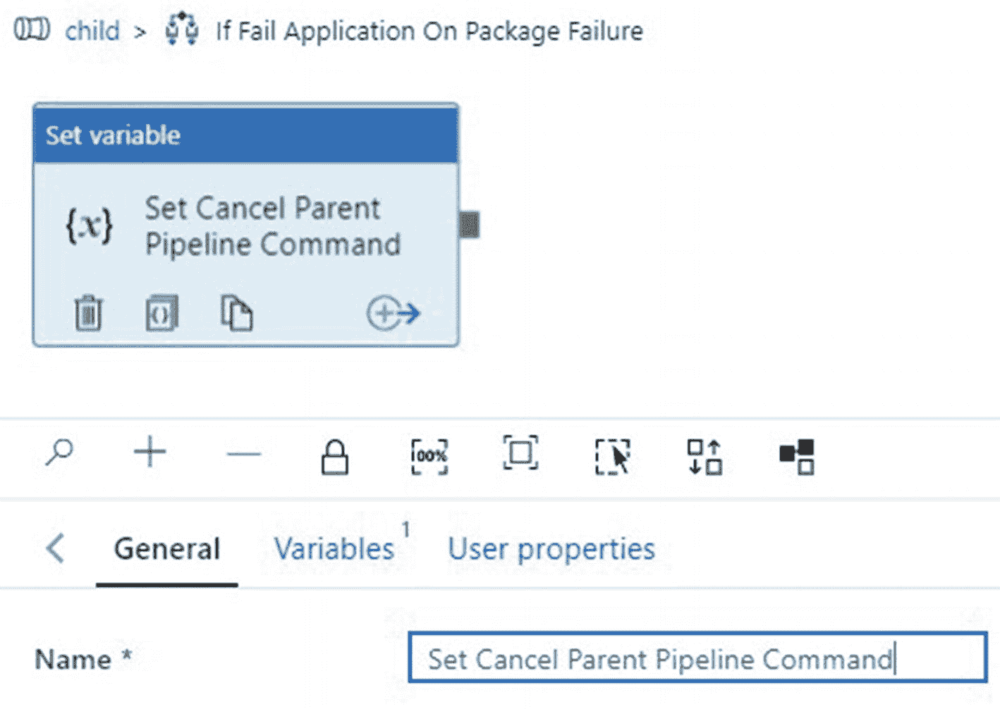
*图 11-23：添加“设置取消父管道命令”设置变量活动*


在**设置取消父管道命令**的设置变量活动的**变量**选项卡上，单击**名称**属性的下拉菜单，并选择**StopParentPipelineRunIdString**。单击**值**文本框内部，然后单击**添加动态内容 [Alt + P]** 链接。当**添加动态内容**窗格显示时，输入一个类似于 `@concat('https://management.azure.com/subscriptions/<订阅 ID>/resourcegroups/<资源组名称>/providers/Microsoft.DataFactory/factories',pipeline().DataFactory,'/pipelineruns/',pipeline().parameters.ParentRunId,'/cancel?api-version=2018-06-01')` 的表达式，如图 11-24 所示。

在图 11-24 所示的表达式中，将 `<subscription id>` 替换为您的订阅 ID 值，并将 `<resource group name>` 替换为您的 Azure 数据工厂的资源组名称。

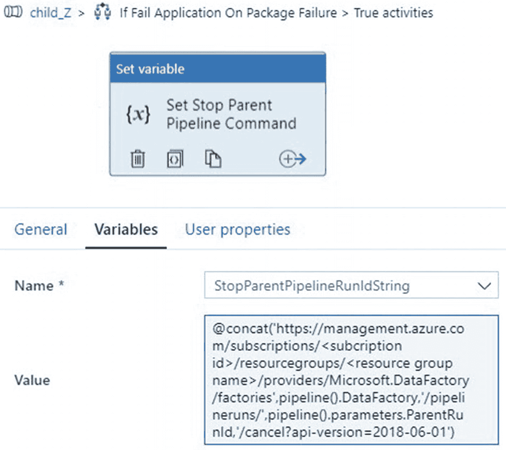
*图 11-24. 构建 “StopParentPipelineRunIdString” 变量的值*

以上步骤完成了当**在包失败时失败应用程序**位配置为 true (1) 时，响应失败的子程序包执行的第三步：设置要取消父管道的命令。

当**在包失败时失败应用程序**位配置为 true (1) 时，响应失败的子程序包执行的第四步如下：执行取消父管道的命令。

要开始添加执行取消管道运行命令的功能，请将 Web 活动添加到**在包失败时失败应用程序**条件活动的**True 活动**画布中，将来自**设置取消父管道命令**设置变量活动的成功输出连接到新的 Web 活动，然后将新的 Web 活动重命名为**停止父级执行**，如图 11-25 所示。

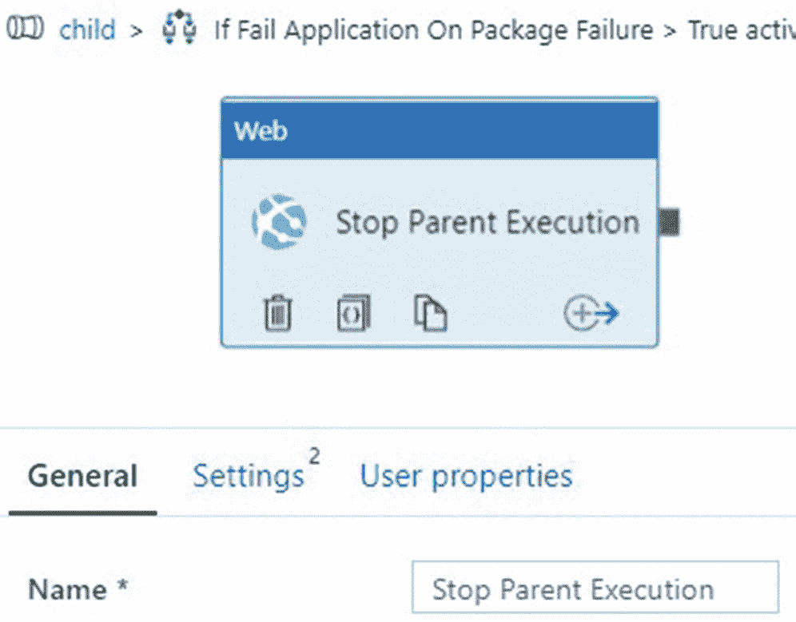
*图 11-25. 添加 “停止父级执行” Web 活动*

在**停止父级执行** Web 活动的**设置**选项卡上，单击 **URL** 属性的文本框内部，然后单击**添加动态内容 [Alt + P]** 链接。当**添加动态内容**窗格显示时，输入表达式 `@variables('StopParentPipelineRunIdString')`，如图 11-26 所示。

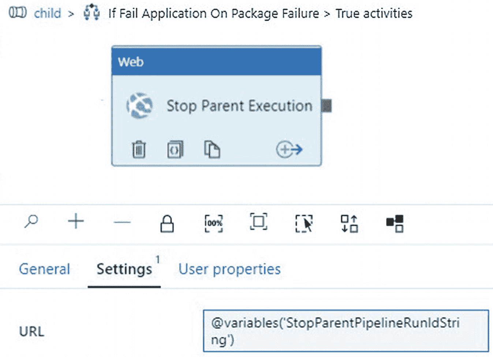
*图 11-26. 配置 “停止父级执行” Web 活动的 URL 属性*

按如下方式完成**停止父级执行** Web 活动的**设置**选项卡上的属性配置（如图 11-27 所示）：

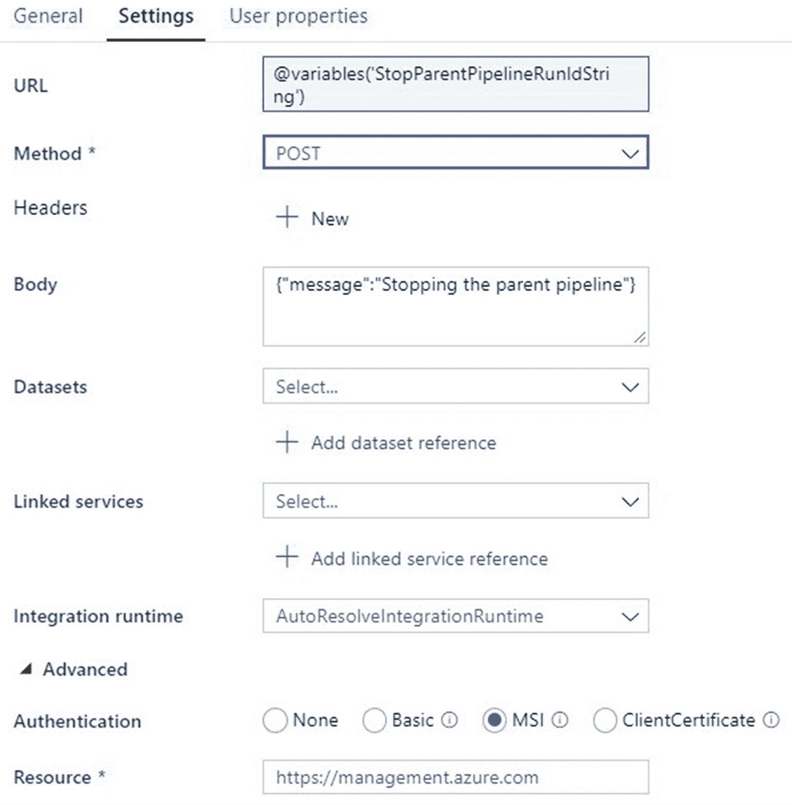
*图 11-27. “停止父级执行” Web 活动设置配置*

- 方法：`POST`
- 主体：`{"message":"Stopping the parent pipeline"}`
- 高级 ➤ 身份验证：`MSI`
- 高级 ➤ 资源：`https://management.azure.com`

以上步骤完成了当**在包失败时失败应用程序**位配置为 true (1) 时，响应失败的子程序包执行的第四步也是最后一步：设置要取消父管道的命令。

如前配置，**在包失败时失败应用程序**条件活动的**True 活动**中的活动协同工作，以更新应用程序包实例和应用程序实例的状态，然后为正在运行的父管道调用 Azure 数据工厂的 REST API Pipeline Runs Cancel 方法。

在测试更改之前，请删除（现已孤立的）**记录应用程序包实例失败**存储过程活动，如图 11-28 所示。

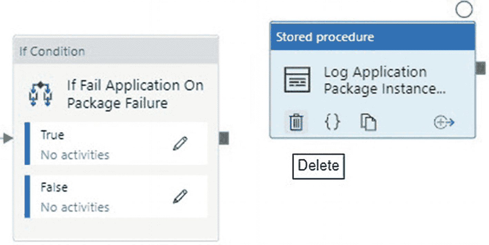
*图 11-28. 删除旧的 “记录应用程序包实例失败” 存储过程活动*

#### 让我们来测试一下！

通过单击数据工厂工具栏中的**全部发布**按钮来部署父管道和子管道，如图 11-29 所示。


*图 11-29. 发布对管道和 ADF 项目的更改*

在父管道中，单击**添加触发器**菜单项，然后单击**立即触发**，如图 11-30 所示。

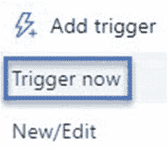
*图 11-30. 触发父管道*

当父管道执行完成时，“监视”页面应显示类似于图 11-31 的结果。

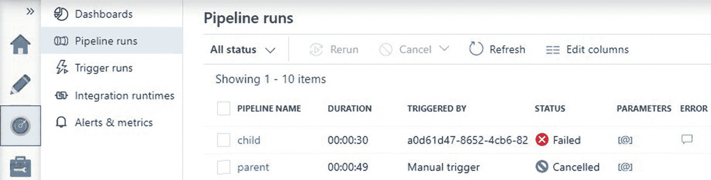
*图 11-31. 父管道和子管道执行结果*

执行清单 11-2 中所示的 T-SQL 查询，以确认应用程序实例和应用程序包实例的结果。

```sql
Select top 1
a.ApplicationName
, ai.ApplicationInstanceId
, ai.ApplicationStatus
From log.ApplicationInstance ai
Join config.Applications a
On a.ApplicationId = ai.ApplicationId
Order By ApplicationInstanceId Desc
declare @ApplicationInstanceId int = (Select top 1 ApplicationInstanceId
From log.ApplicationInstance
Order By ApplicationInstanceId DESC)
Select p.PackageName
, ai.ApplicationInstanceId
, api.ApplicationPackageInstanceId
, api.ApplicationPackageStatus
, ap.FailApplicationOnPackageFailure
From log.ApplicationPackageInstance api
Join log.ApplicationInstance ai
On ai.ApplicationInstanceId = api.ApplicationInstanceId
Join config.ApplicationPackages ap
On ap.ApplicationPackageId = api.ApplicationPackageId
Join config.Packages p
On p.PackageId = ap.PackageId
Where ai.ApplicationInstanceId = @ApplicationInstanceId
Order By ApplicationPackageInstanceId
```
*清单 11-2. 应用程序和应用程序包执行结果*

结果应类似于图 11-32。

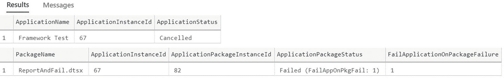
*图 11-32. 应用程序和应用程序包执行结果*

**框架测试** SSIS 框架应用程序包含两个应用程序包，**ReportAndFail.dtsx** 和 **ReportAndSucceed.dtsx**。如所述，**ReportAndFail.dtsx** 每次执行都会失败。在 SSIS 框架元数据中，两个应用程序包的**在包失败时失败应用程序**位都设置为 1 (true)，如执行清单 11-3 中的 T-SQL 查询时所见（结果如图 11-33 所示）。

```sql
Select ap.ApplicationPackageId
, a.ApplicationName
, p.PackageName
, ap.ExecutionOrder
, ap.FailApplicationOnPackageFailure
From config.Applications a
Join config.ApplicationPackages ap
On ap.ApplicationId = a.ApplicationId
Join config.Packages p
On p.PackageId = ap.PackageId
Where a.ApplicationName = N'Framework Test'
Order By ap.ExecutionOrder
```
*清单 11-3. 查看 SSIS 框架元数据*

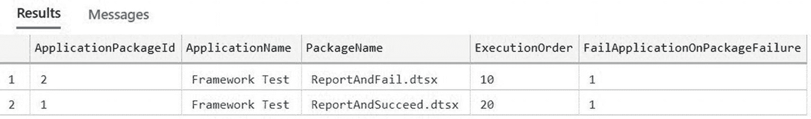
*图 11-33. 查看 SSIS 框架元数据 T-SQL 查询结果*


当执行父管道时，两个应用程序包——`ReportAndFail.dtsx`和`ReportAndSucceed.dtsx`——会从`SSISConfig`数据库中被检索出来，并转储到父管道的“ForEach 应用程序包”ForEach 活动的迭代器中。由于`ReportAndFail.dtsx`的`ExecutionOrder`为 10，而`ReportAndSucceed.dtsx`的`ExecutionOrder`为 20，因此`ReportAndFail.dtsx`会先执行。根据设计，当`ReportAndFail.dtsx`在子管道中执行失败，并且`FailApplicationOnPackageFailure`位为 true 时，父管道将被取消。

如果`ReportAndFail.dtsx`在子管道中失败，而`FailApplicationOnPackageFailure`位为`false`，会发生什么？为了测试，请使用清单 11-4 中的 T-SQL 更新`ReportAndFail.dtsx`应用程序包的`FailApplicationOnPackageFailure`位。

```sql
Select ap.ApplicationPackageId
, a.ApplicationName
, p.PackageName
, ap.ExecutionOrder
, ap.FailApplicationOnPackageFailure
From config.Applications a
Join config.ApplicationPackages ap
On ap.ApplicationId = a.ApplicationId
Join config.Packages p
On p.PackageId = ap.PackageId
Where a.ApplicationName = N'Framework Test'
Order By ap.ExecutionOrder

Update config.ApplicationPackages
Set FailApplicationOnPackageFailure = 0
Where ApplicationPackageId = 2

Select ap.ApplicationPackageId
, a.ApplicationName
, p.PackageName
, ap.ExecutionOrder
, ap.FailApplicationOnPackageFailure
From config.Applications a
Join config.ApplicationPackages ap
On ap.ApplicationId = a.ApplicationId
Join config.Packages p
On p.PackageId = ap.PackageId
Where a.ApplicationName = N'Framework Test'
Order By ap.ExecutionOrder
```

清单 11-4
更新`ReportAndFail.dtsx`应用程序包的`FailApplicationOnPackageFailure`位

执行清单 11-4 中的 T-SQL 查询的结果应类似于图 11-34。

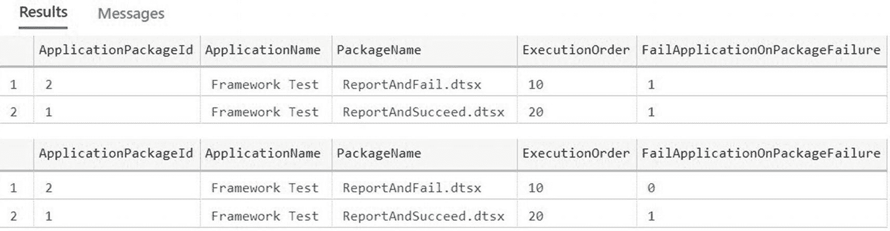

图 11-34
`ReportAndFail.dtsx`应用程序包的`FailApplicationOnPackageFailure`位已更新

为了测试更改`ReportAndFail.dtsx`应用程序包的`FailApplicationOnPackageFailure`位的影响，请重新触发父管道。监视页面显示了容错结果：`ReportAndFail.dtsx`失败了，但并未停止 SSIS 框架应用程序的执行。`ReportAndSucceed.dtsx`执行并成功，如图 11-35 所示。

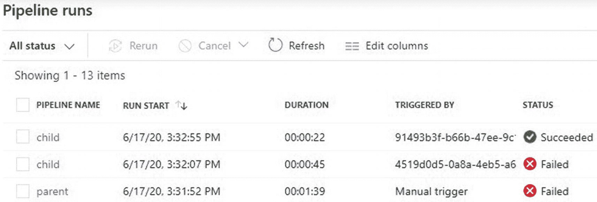

图 11-35
容错功能在行动中；一个应用程序包的失败不会停止应用程序执行

我唯一的抱怨是父管道报告了失败。

### 结论

在本章中，我们为 SSIS 框架的 Azure Data Factory 版本添加了容错功能。在此过程中，我们学习了如何为 Azure Data Factory 托管标识配置安全性，以便数据工厂管道中的 Web 活动可以调用 Azure Data Factory REST API 中的方法。我们还进一步了解了 ForEach 活动的默认行为。


