# 第 1 章


#### 元数据收集

我们要介绍的第一个集成服务设计模式是元数据收集。我们所说的元数据收集是什么意思？问得好。本章也可以命名为“使用 SSIS 节省时间并成为出色的 DBA”。许多 DBA 将大量时间花在监控活动上，例如验证备份、对计划作业失败发出警忠、创建架构快照（“以防万一”）、检查空间利用情况以及记录数据库随时间增长的情况，等等。大多数关系数据库管理系统 (RDBMS) 都提供元数据来帮助 DBA 监控其系统。如果您已经当了几年的 DBA，您甚至可能拥有一个用于查询元数据的“工具箱”脚本集。当您只有一两台服务器时，手动运行这些脚本很容易；然而，随着企业的发展和数据库服务器数量的增加，这很快就会变得难以处理并占用您的大量时间。

本章将探讨如何使用集成服务和 SQL Server 中存在的元数据来自动化其中一些例行任务。

### 关于 SQL Server 数据工具

SQL Server 数据工具 - 商业智能 (SSDT-BI) 是微软用于开发集成服务包的集成开发环境 (IDE)。它利用了 Visual Studio 的成熟度和熟悉度，为 SQL Server 商业智能项目（包括集成服务、分析服务和报表服务项目）提供了一个统一的开发平台。本书使用 Visual Studio 2013 的 `SSDT-BI` 和 `SSIS` 2014 编写。

 **提示** 还没安装 `SSDT-BI`？`SSDT-BI` 可从微软下载中心获取。请注意，`SSDT-BI` 不向下兼容，因此请务必验证您下载的版本是否适合您的环境。

### 预览最终产品

让我们讨论一下您将在本章中创建的集成服务包。

在 SQL Server 中，您将执行以下操作：

1.  创建一个数据库，作为您数据库监控的中央存储库。
2.  创建一个表，用于存储您希望监控的 SQL Server 实例列表。
3.  为您希望监控的每个数据元素（未使用的索引和数据库增长）创建一个表。

在集成服务中，您将执行以下操作：

1.  创建一个新的集成服务包。
2.  检索 SQL Server 实例列表并将该列表存储在变量中。
3.  创建一个带有动态填充服务器名称的 `OLE DB` 连接。
4.  遍历每个数据库，并
    1.  检索当前数据库和日志文件大小以进行历史监控。
    2.  检索索引候选列表，用于潜在的重新设计或删除。
    3.  更新每个 SQL Server 实例的 `上次监控时间` 值。

这是一个非常灵活的模型，您可以轻松扩展以包含更多监控任务。完成的包的屏幕截图显示在 图 1-1 中。

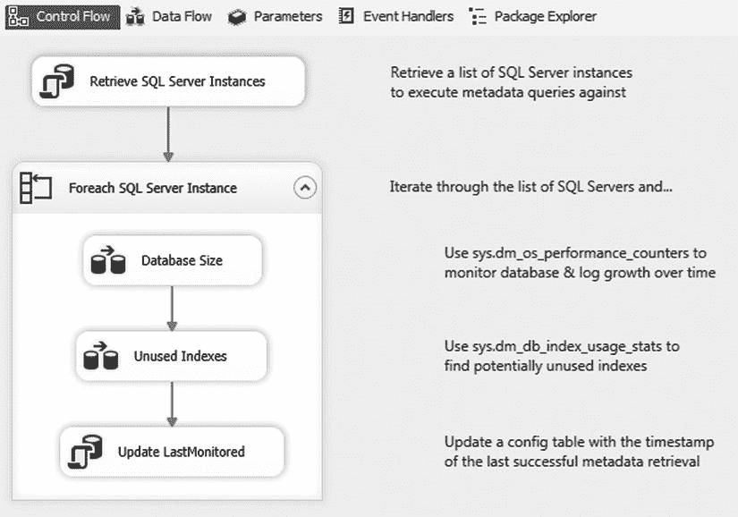

图 1-1. 元数据收集包

如果这不是您的第一个集成服务包，也许您已经注意到此包缺少一些最佳实践，例如错误处理。为了清晰起见，您在本章中创建的包将仅专注于核心设计模式；但是，我们将在适用时指出最佳实践。

另外，请注意，`T-SQL` 示例仅适用于 SQL Server 2005 或更高版本。

### SQL Server 元数据

catalog

虽然元数据可以从任何提供访问接口的 RDBMS 中收集，但本章使用 SQL Server 作为元数据源。本章的重点不是实际的元数据，而是元数据收集的模式。尽管如此，了解可用的元数据类型对您还是很有帮助的。

SQL Server 通过目录视图、系统函数、动态管理视图 (DMV) 和动态管理函数 (DMF) 公开了丰富的信息。让我们简要了解一下您将在本章中使用的一些元数据。

 **提示** SQL Server 联机丛书是了解 SQL Server 中可用元数据类型的绝佳资源。尝试搜索“元数据函数”、“目录视图”和“DMV”以获取更多信息。

#### sys.dm_os_performance_counters

`sys.dm_os_performance_counters` `DMV` 返回服务器性能计数器，涵盖内存、等待统计信息和事务等领域。此 `DMV` 可用于报告文件大小、页面预期寿命、每秒页面读写次数和每秒事务数等。

#### sys.dm_db_index_usage_stats


#### `sys.dm_db_index_usage_stats` 动态管理视图

`sys.dm_db_index_usage_stats` 动态管理视图包含有关索引使用情况的信息。具体来说，每次在索引上执行查找、扫描、查找或更新时，计数器都会递增。每当 SQL Server 服务启动时，这些计数器都会重新初始化。如果在此动态管理视图中未看到特定索引的行，则意味着自上次服务器重启以来，尚未在该索引上执行过查找、扫描、查找或更新操作。

#### `sys.dm_os_sys_info` 动态管理视图

`sys.dm_os_sys_info` 动态管理视图包含有关服务器资源的信息。其中最常用的信息可能是 `sqlserver_start_time` 列，它显示了 SQL Server 服务上次启动的时间。

#### `sys.tables` 目录视图

`sys.tables` 目录视图包含数据库中存在的每个表的信息。

#### `sys.indexes` 目录视图

`sys.indexes` 目录视图包含数据库中每个索引的信息。这包括诸如索引是聚集还是非聚集，以及索引是唯一还是非唯一等信息。

#### `sys.partitions` 目录视图

`sys.partitions` 目录视图提供了对索引分区结构的可见性。当一个索引有多个分区时，索引中的数据会被拆分到多个物理结构中，但可以通过单一逻辑名称访问。这种技术对于处理大型表（如事务历史表）特别有用。如果一个表未被分区，该表在 `sys.partitions` 中仍将只有一行。

#### `sys.allocation_units` 目录视图

`sys.allocation_units` 目录视图包含有关对象的页数和行数的信息。可以通过将 `container_id` 与 `partition_id` 连接，将此信息与 `sys.partitions` 目录视图关联起来。

#### 设置中央存储库

在开始开发 Integration Services 包之前，您需要在 SQL Server 中设置一些先决条件。首先也是最重要的，您需要创建一个数据库作为您的中央数据存储库。这将是您的 SQL Server 实例列表所在的位置，也是您存储从每个 SQL Server 实例检索到的元数据的地方。许多企业还发现将所有错误和包日志记录存储到这个中央数据库中非常方便。这在有众多 DBA、开发人员和服务器的环境中尤其有益，因为它使每个人都能轻松知道在哪里查找信息。清单 1-1 中的 T-SQL 代码创建了本章余下部分将使用的数据库。

***清单 1-1***. 创建 SQL Server 数据库的 T-SQL 代码示例

```sql
USE [master];
GO

CREATE DATABASE [dbaCentralLogging]
ON PRIMARY
(
      NAME = N'dbaCentralLogging'
    , FILENAME = N'C:\Program Files\Microsoft SQL Server\MSSQL12.MSSQLSERVER\MSSQL\DATA\dbaCentralLogging.mdf'
    , SIZE = 1024MB
    , MAXSIZE = UNLIMITED
    , FILEGROWTH = 1024MB
)
LOG ON
(
      NAME = N'dbaCentralLogging_log'
    , FILENAME = N'C:\Program Files\Microsoft SQL Server\MSSQL12.MSSQLSERVER\MSSQL\DATA\dbaCentralLogging_log.ldf'
    , SIZE = 256MB
    , MAXSIZE = UNLIMITED
    , FILEGROWTH = 256MB
);
GO
```

请注意，您的文件目录可能与前面示例中的不同。

这段代码可以从 SQL Server Management Studio (`SSMS`) 执行，如图 1-2 所示，也可以从您喜欢的查询工具执行。

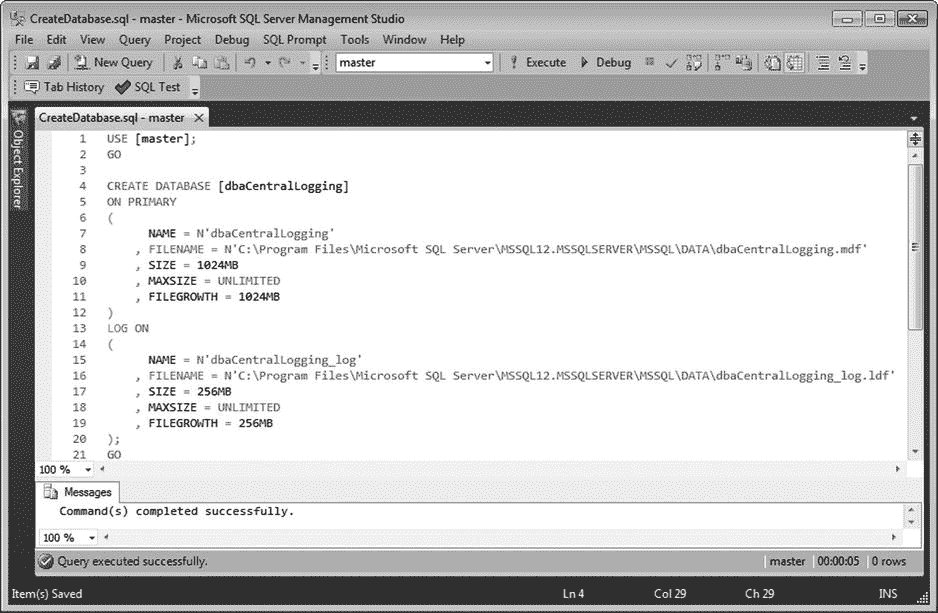

图 1-2. SQL Server Management Studio 2012

接下来，您需要一个要监控的 SQL Server 实例列表。实现此目的最简单的方法是将数据库实例名称列表存储在文件或表中。您将使用后一种方法。使用清单 1-2 中的代码，现在在新创建的数据库中创建该表。

***清单 1-2***. 创建用于监控 SQL Server 实例的表的 T-SQL 代码示例

```sql
USE dbaCentralLogging;
GO

CREATE TABLE dbo.dba_monitor_SQLServerInstances
(
      SQLServerInstance   NVARCHAR(128)
    , LastMonitored       SMALLDATETIME     NULL

CONSTRAINT PK_dba_monitor_SQLServerInstances
    PRIMARY KEY CLUSTERED( SQLServerInstance )
);
```

现在您已准备好用要监控的 SQL Server 实例列表填充该表。清单 1-3 中的代码将引导您完成此操作，但您需要用您环境中存在的 SQL Server 实例更新占位符。

***清单 1-3***. 向 `dba_monitor_SQLServerInstances` 表插入数据的 T-SQL 代码示例

```sql
INSERT INTO dbo.dba_monitor_SQLServerInstances
(
    SQLServerInstance
)
SELECT @@SERVERNAME-- 承载中央存储库的服务器名称
UNION ALL
SELECT 'YourSQLServerInstanceHere'-- SQL Server 实例示例
UNION ALL
SELECT 'YourSQLServerInstance\Here';-- 具有多个实例的服务器示例
```

您仍然需要创建两个表来存储收集到的元数据，但您将在本章相关部分介绍时创建这些表。接下来，您将创建您的 Integration Services 包。

#### 迭代框架

在本节中，您将为迭代框架奠定基础。具体来说，您将展示一种可重复的模式，用于用 SQL Server 实例列表填充变量，然后遍历该列表并对每个服务器执行操作。

首先，打开 Visual Studio。通过导航到 **文件**  **新建**  **项目** 创建一个新项目。展开“商业智能”部分（位于 **已安装**  **模板** 下），然后单击 **Integration Services 项目**。将项目命名为 **MetadataCollection**，如图 1-3 所示。

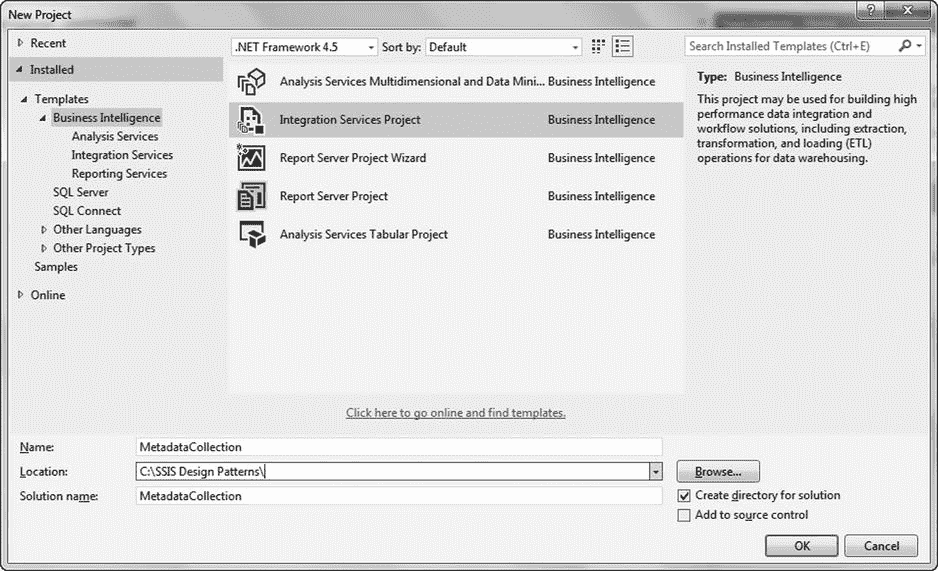

图 1-3. 新建 Integration Services 项目

请注意，您的默认 **位置** 将与图 1-3 中所示的目录不同。

您现在需要创建两个变量。第一个变量将用于存储检索到的 SQL Server 实例列表。第二个变量将在您遍历列表时存储单个实例的值。

要访问变量菜单，请选择 SSIS 菜单下的 **变量**（图 1-4）；您也可以通过右键单击设计器界面来访问变量菜单。

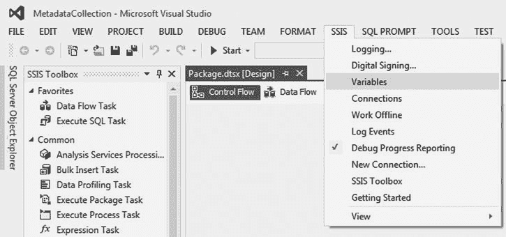

图 1-4. 打开变量菜单

通过单击变量菜单最左侧的 **添加变量** 图标添加以下变量，如图 1-5 所示：

*   `SQLServerInstance`—字符串数据类型
*   `SQLServerList`—对象数据类型

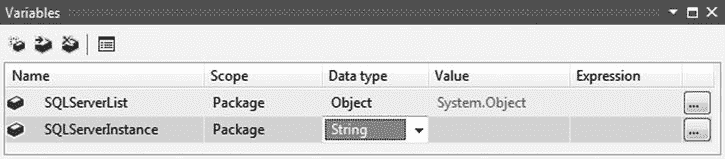

图 1-5. 包作用域变量

用您有权限连接的服务器初始化 `SQLServerInstance` 变量。为简单起见，建议使用创建 `dbaCentralLogging` 数据库的服务器。此值将在运行时被覆盖。

现在您有了存储实例列表的位置，您已准备好填充该变量。从 SSIS 工具箱中将一个新的 **执行 SQL 任务** 拖到设计器界面上。将任务重命名为 **检索 SQL Server 实例**，然后双击它以打开 **执行 SQL 任务编辑器**。单击 **连接** 下的下拉菜单，然后选择 **<新建连接…>**，如图 1-6 所示。

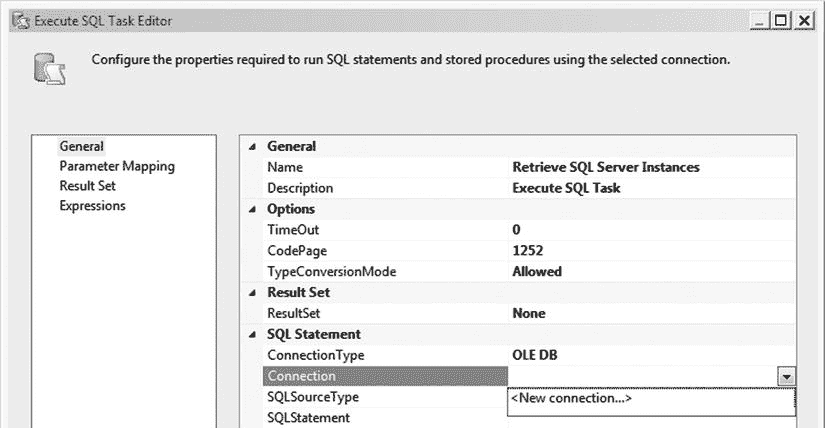


### 执行 SQL 任务编辑器

在“配置 OLE DB 连接管理器”菜单中，单击“新建”。在“服务器名称”字段中，输入您在 清单 1-1 中创建数据库时所用的数据库服务器。无论您使用的是 Windows 身份验证还是 SQL Server 身份验证，请确保该帐户对您的 `dba_monitor_SQLServerInstances` 表中的每个实例都拥有足够的权限。在“选择或输入数据库名称”下，从下拉菜单中选择 `dbaCentralLogging`，如 图 1-7 所示。单击“确定”返回到“执行 SQL 任务编辑器”。

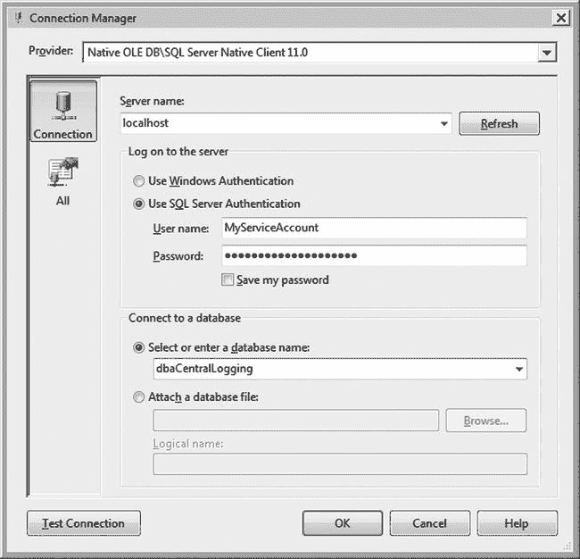

### 连接管理器

 **注意** 权限要求取决于您希望检索的元数据类型。有关访问特定对象所需权限的更多信息，请参阅 SQL Server 联机丛书中对应对象类型的页面。

现在，您需要编写用于检索 SQL Server 实例列表的 SQL 语句。单击 `SQLStatement` 字段右侧的 `[...]` 图标，然后输入 清单 1-4 中的 T-SQL 代码。

###### 用于检索 SQL Server 实例的 T-SQL 语句

```sql
SELECT SQLServerInstance FROM dbo.dba_monitor_SQLServerInstances;
```

因为您要检索的是一个值数组，所以从 `ResultSet` 下拉菜单中选择“完整结果集”。此时，您的“执行 SQL 任务编辑器”应类似于 图 1-8；但是，您的“连接”值可能有所不同。

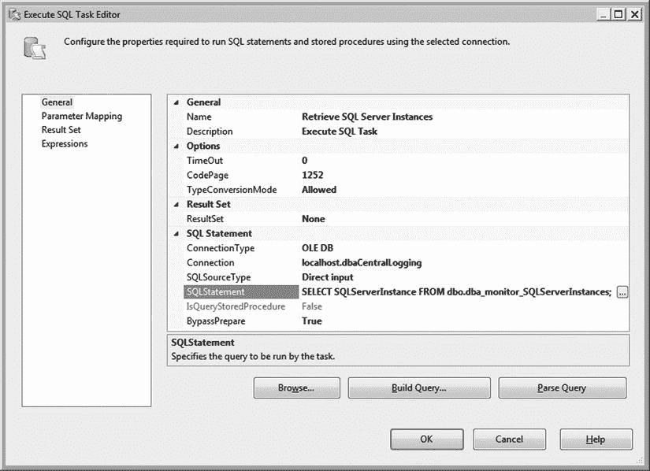

###### SQL 任务编辑器

您即将完成连接管理器的配置。剩下需要做的就是将结果集映射到您的变量。在“执行 SQL 任务编辑器”的左侧选择“结果集”，然后单击“添加”。因为您使用的是完整结果集，所以必须将 `Result Name` 替换为 `0`。现在，您需要告知 Integration Services 使用哪个变量。从“变量名称”下的下拉菜单中选择 `User::SQLServerList`，如 图 1-9 所示。单击“确定”。

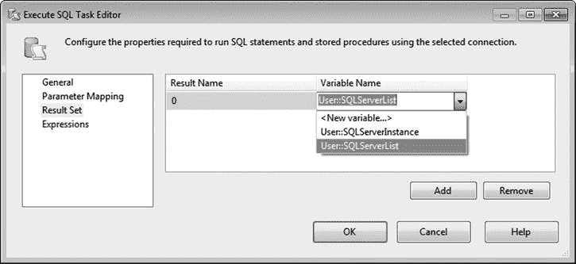

###### 编辑结果集

至此，执行 SQL 任务已完成配置。接下来，您需要遍历每个服务器以检索您计划监控的元数据。此过程将封装在一个 **Foreach 循环容器**中，该容器将分解存储在 `SQLServerList` 变量中的 SQL Server 实例列表。

向控制流中添加一个 **Foreach 循环容器**，并将其重命名为 **Foreach SQL Server Instance**。使用“成功”优先级约束将其连接到执行 SQL 任务——换句话说，将绿色箭头从执行 SQL 任务拖到 **Foreach 循环容器**上，如 图 1-10 所示。

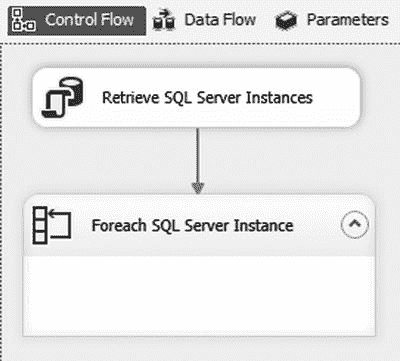

###### 连接执行 SQL 任务与 Foreach 循环容器

双击 **Foreach 循环容器**以编辑其属性。单击“集合”页，然后在“枚举器”字段中选择“Foreach ADO 枚举器”。在“ADO 对象源变量”下，选择 `User::SQLServerList`；将“枚举模式”保留为“表中的行”。您的“集合”属性应与 图 1-11 中的匹配。

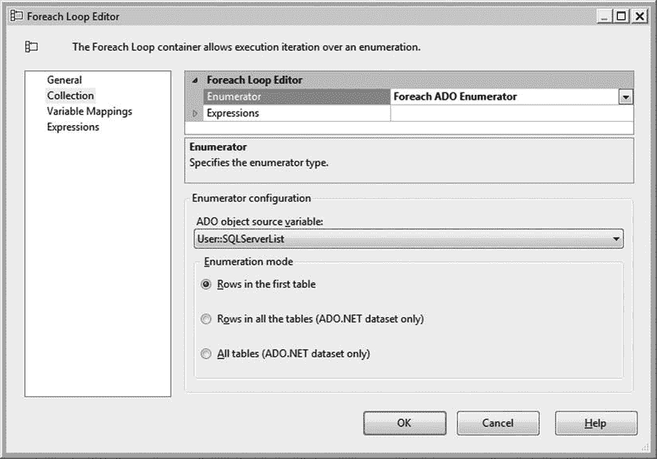

### Foreach 循环编辑器

在“变量映射”页上，将 `SQLServerInstance` 变量映射到索引 0，如 图 1-12 所示。

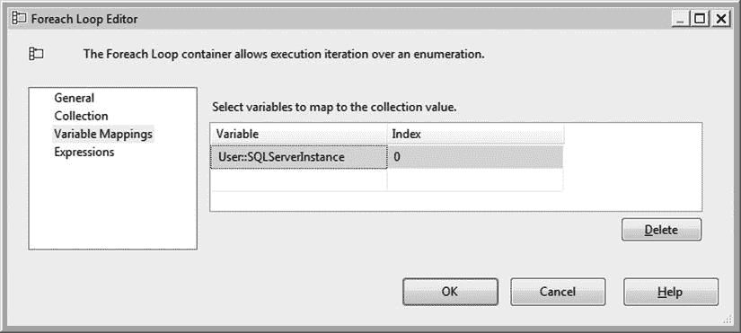

#### 变量映射

点击“确定”按钮关闭 Foreach 循环编辑器。

让我们回顾一下你到目前为止完成的工作。你现在拥有一个变量 `SQLServerList`，其中包含了你插入到 `dba_monitor_SQLServerInstances` 表中的所有 SQL Server 实例的列表。然后，Foreach 循环容器会拆解这个变量，逐一遍历每个值——在本例中就是每个 SQL Server 实例。在每一次循环中，它会将其中一个 SQL Server 实例的值推送到另一个变量 `SQLServerInstance` 中。

现在，是时候设置动态连接了，该连接将用于连接到你正在监控的每个 SQL Server 实例。为此，你需要创建一个虚拟连接，并将其配置为使用存储在 `SQLServerInstance` 中的服务器名称。

在连接管理器窗口中右键单击，选择“新建 OLE DB 连接”。使用你之前使用的相同服务器和安全凭据创建一个新连接（图 1-7），但这次选择 Master 作为数据库。需要说明的是，你使用相同的服务器纯粹是为了方便。实际上，只要你有足够权限登录，虚拟连接中指定的服务器并不重要，因为你输入的任何值都将在运行时被 `SQLServerInstance` 变量覆盖。然而，数据库值很重要，因为你选择的数据库*必须*存在于每个服务器上。由于 Master 是系统数据库，它是一个自然的选择。

单击“确定”关闭“连接管理器属性”窗口。但这个连接你还没有完成。右键单击新创建的连接并选择“属性”。将“Name”属性更改为 `DynamicSQLServerInstance`，然后单击“表达式”字段中的 `...` 图标。这将打开“属性表达式编辑器”。选择你希望动态填充的属性值——本例中是 ServerName——并在“表达式”字段中输入 `@[User::SQLServerInstance]`，如图 1-13 所示。或者，你也可以单击“表达式”字段中的 `...` 图标来打开“表达式生成器”，如果你对表达式语法不太熟悉，这会很有帮助。

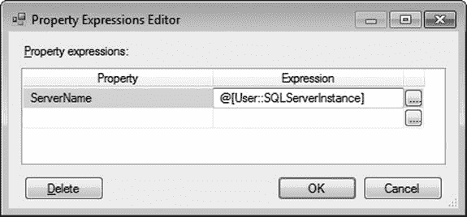

**图 1-13. 属性表达式编辑器**

你的连接属性现在应该类似于图 1-14 所示。

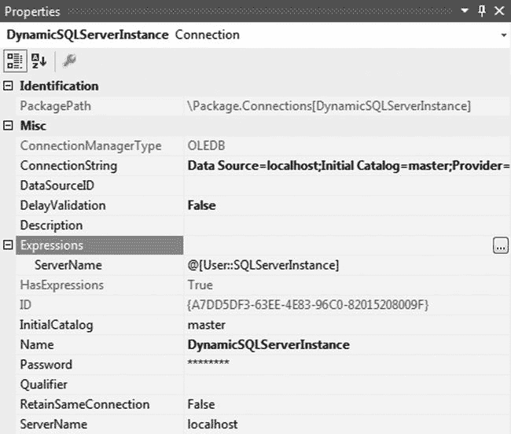

**图 1-14. 动态连接属性**

至此，你已经拥有了一个可重用的框架，用于遍历 SQL Server 实例列表并在每个服务器上执行*某些操作*。这本身就是一个非常有价值的设计模式。然而，由于本章是关于元数据收集的，如果我们不实际演示收集和存储元数据，那就是失职了。下一节将引导你设置两个有用的元数据提取。

#### 元数据收集

现在你已准备好从你的服务器列表中检索元数据。但应该收集什么呢？有海量的信息可供检索，包括安全信息、使用数据、表架构快照、失败作业详情、碎片级别和性能计数器等等，不胜枚举。在第一个示例中，让我们保持简单，检索当前的数据库和日志文件大小。这些信息对于历史数据库增长和容量规划很有用。

为了实现这一点，你将在 Foreach 循环容器中创建数据流，以从每个服务器检索元数据并将其存储在 `dbaCentralLogging` 数据库中。数据流任务可以说是 Integration Services 中最常用的任务。它允许你在服务器之间轻松移动数据，并在必要时执行数据转换或清理。

从 SSIS 工具箱中将一个数据流任务拖到 Foreach 循环容器中，并将其重命名为 `Database Size`。双击数据流任务将打开数据流设计器选项卡。请注意，一旦进入数据流设计器，工具箱中可用的对象就会改变。将 OLE DB 源图标拖到设计器 surface 上，并将其重命名为 `Dynamic SQL Source`。双击该图标以编辑其属性。

在“OLE DB 连接管理器”下拉菜单中选择 `DynamicSQLServerInstance`。将“数据访问模式”更改为“SQL 命令”，然后将清单 1-5 中的代码复制到“SQL 命令”文本框中。

##### 清单 1-5. 检索服务器上所有数据库当前数据文件和日志文件大小的 T-SQL 示例

```sql
SELECT GETDATE() AS [captureDate]
    , @@SERVERNAME AS [serverName]
    , instance_name AS [databaseName]
    , SUM(
        CASE
        WHEN counter_name = 'Data File(s) Size (KB)'
        THEN cntr_value
        END
    ) AS 'dataSizeInKB'
    , SUM(
        CASE
        WHEN counter_name = 'Log File(s) Size (KB)'
        THEN cntr_value
        END
    ) AS 'logSizeInKB'
FROM sys.dm_os_performance_counters
WHERE counter_name IN ('Data File(s) Size (KB)'
    ,'Log File(s) Size (KB)')
/* optional: remove _Total to avoid accidentally
double-counting in queries */
    AND instance_name <> '_Total'
GROUP BY instance_name;
```

此查询将产生类似以下的结果：

```
captureDate             serverName databaseName               dataSizeInKB logSizeInKB
----------------------- ---------- -------------------------- ------------ -----------
2014-06-29 19:52:21.543 LOCALHOST  _Total                     1320896      274288
2014-06-29 19:52:21.543 LOCALHOST  AdventureWorks2012         193536       496
2014-06-29 19:52:21.543 LOCALHOST  dbaCentralLogging          1048576      262136
2014-06-29 19:52:21.543 LOCALHOST  master                     4096         760
2014-06-29 19:52:21.543 LOCALHOST  model                      2112         760
2014-06-29 19:52:21.543 LOCALHOST  msdb                       14080        760
2014-06-29 19:52:21.543 LOCALHOST  mssqlsystemresource        40960        504
2014-06-29 19:52:21.543 LOCALHOST  ReportServer$SQL2012       5184         7032
2014-06-29 19:52:21.543 LOCALHOST  ReportServer$SQL2012TempDB 4160         1080
2014-06-29 19:52:21.543 LOCALHOST  tempdb                     8192         760

(10 row(s) affected)
```

你的 OLE DB 源编辑器现在应该类似于图 1-15 中的编辑器。单击“解析查询”以确保 SQL 语法正确，然后单击编辑器底部的“预览”以查看结果样本。单击“确定”退出 OLE DB 源编辑器。

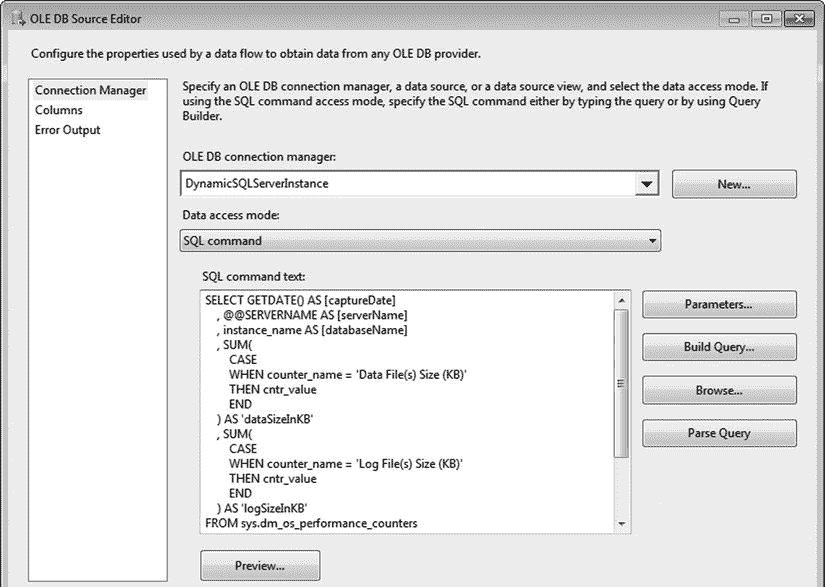

**图 1-15. OLE DB 源编辑器**

让我们花点时间讨论一下这段代码。你正在使用 `sys.dm_os_performance_counters` DMV（动态管理视图）来检索数据文件和日志文件大小。这个 DMV 将每个数据库的数据和日志大小分别存储在单独的行中，因此你正在对数据进行透视，为每个数据库返回一行，文件大小和日志大小位于不同的列中。需要提醒的是，DMV 是在 SQL Server 2005 中引入的，因此此示例仅适用于 SQL Server 2005 及更高版本。


通常，最佳实践是为这类管理查询创建存储过程，并将它们部署到每个服务器上，通常存入如 `dbaToolBox` 这样的数据库中。这会带来一些维护开销，但存储过程的好处——例如提升安全性，以及便于查看依赖关系、使用情况、性能调优和故障排查——通常远超这些开销。此外，它允许数据库管理员或开发者手动在每个服务器上执行这些相同的查询，而无需在 Integration Services 包中搜寻代码。然而，为了保持简洁，你将直接在数据流任务中输入代码。

 提示：`sys.dm_os_performance_counters` 这个 DMV 对于数据库监控非常有用，它包含的信息远不止数据和日志文件大小。你可以轻松修改前面的代码以包含额外的性能计数器。但是，你应该知道 `cntr_type` 值有三种类型（值/基数型、每秒型、时间点型），而前面的代码仅适用于时间点型计数器 (`cntr_type = 65792`)。关于此 DMV 中可用的信息类型以及如何处理每种计数器类型，请参阅 SQL Server 联机丛书。

现在你已了解查询的预期输出，你需要一个表来存储结果。在 SSMS 中，在 `dbaCentralLogging` 数据库里执行 清单 1-6 中的 T-SQL 语句。

**清单 1-6**. 创建表以存储数据和日志文件大小信息的 T-SQL 代码示例

```
USE dbaCentralLogging;
GO

CREATE TABLE dbo.dba_monitor_databaseGrowth
(
      log_id        INT IDENTITY(1,1)
    , captureDate   DATETIME
    , serverName    NVARCHAR(128)
    , databaseName  SYSNAME
    , dataSizeInKB  BIGINT
    , logSizeInKB   BIGINT

CONSTRAINT PK_dba_monitor_databaseGrowth
        PRIMARY KEY NONCLUSTERED(log_id)
);

CREATE CLUSTERED INDEX CIX_dba_monitor_databaseGrowth
    ON dbo.dba_monitor_databaseGrowth(captureDate,serverName,databaseName);
```

现在你可以返回到你的 Integration Services 包。在此数据流任务中，你不需要执行任何数据清理或数据转换，因此将直接进入存储结果的步骤。从工具箱中选择 OLE DB 目标项，将其拖放到设计图面上，并重命名为 `Central Logging 源`。通过将蓝色的数据流箭头从源拖到目标，将其连接到 OLE DB 源。双击 OLE DB 目标会打开另一个编辑器。这次，从 OLE DB 连接管理器下拉列表中选择你的 `dbaCentralLogging` 连接。在数据访问模式下拉列表中保留“表或视图 – 快速加载”选项。在“表或视图的名称”下拉列表中，选择 `[dbo].[dba_monitor_databaseGrowth]`，如 图 1-16 所示。

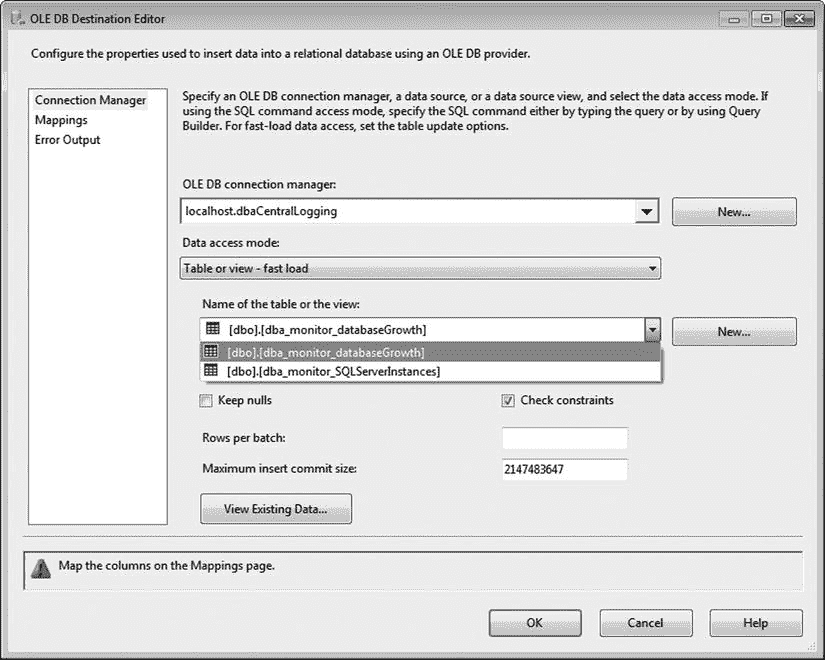

图 1-16. 编辑 OLE DB 目标编辑器的连接管理器

完成连接管理器页面后，点击“映射”菜单。你会注意到 Integration Services 已根据列名自动执行了初步映射。虽然这是一个节省时间的好功能，但在相同列名用于多个数据元素的环境中需要谨慎。由于 `log_id` 列是在数据插入时填充的标识值，你将在映射中忽略它。确认你的映射类似于 图 1-17 所示，然后点击“确定”返回到数据流设计器。

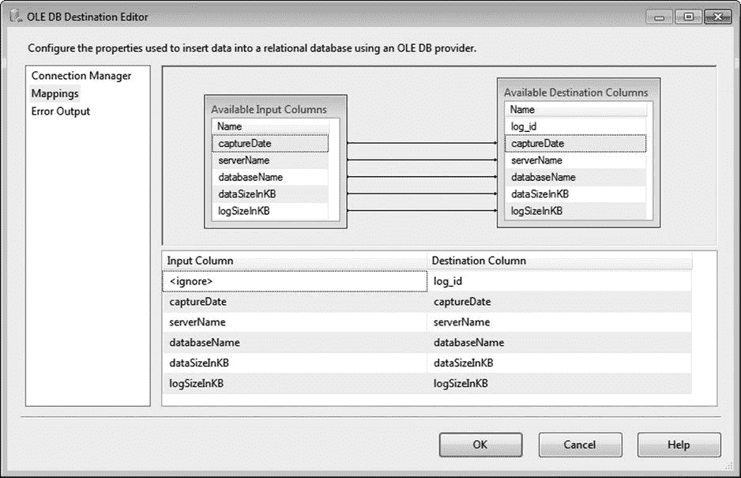

图 1-17. 编辑 OLE DB 目标映射

你的第一个数据流已完成，如 图 1-18 所示。


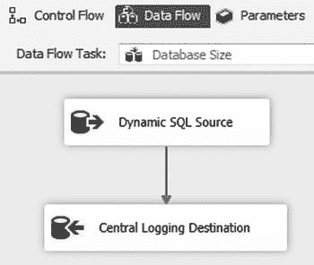

图 1-18. 已完成的数据流任务

现在，您已准备好创建第二个数据流。在“控制流”选项卡中，将现有的数据流复制并粘贴到 Foreach 循环容器中。将绿色箭头——“成功优先约束”——从“数据库大小”数据流拖动到新的数据流。将新数据流重命名为**未使用的索引**，然后双击它以返回到数据流设计器。

双击“动态 SQL 源”图标以编辑其属性。您需要更改 SQL 命令以使用清单 1-7 中的代码。

***清单 1-7***. 检索未使用索引的 T-SQL 查询示例

```sql
/* 创建一个变量来保存索引列表 */
DECLARE @Indexes TABLE
(
     serverName      NVARCHAR(128)
    ,schemaName      SYSNAME
    ,schemaID        INT
    ,databaseName    SYSNAME
    ,databaseID      INT
    ,tableName       SYSNAME
    ,objectID        INT
    ,indexName       SYSNAME
    ,indexID         INT
    ,indexType       NVARCHAR(60)
    ,isPrimaryKey    BIT
    ,isUnique        BIT
    ,isFiltered      BIT
    ,isPartitioned   BIT
    ,numberOfRows    BIGINT
    ,totalPages      BIGINT
);

/* 遍历所有数据库 */
INSERT INTO @Indexes (serverName,schemaName,schemaID,databaseName,databaseID,tableName,objectID,indexName,indexID,indexType,isUnique,isPrimaryKey,isFiltered,isPartitioned,numberOfRows,totalPages)
EXECUTE sys.sp_MSforeachdb
' USE ?;
SELECT @@SERVERNAME
    , SCHEMA_NAME(t.schema_id)
    , t.schema_id
    , DB_NAME()
    , DB_ID()
    , t.name
    , t.object_id
    , i.name
    , i.index_id
    , i.type_desc
    , i.is_primary_key
    , i.is_unique
    , i.has_filter
    , CASE WHEN COUNT(p.partition_id) > 1 THEN 1 ELSE 0 END
    , SUM(p.rows)
    , SUM(au.total_pages)
FROM sys.tables             AS t WITH (NOLOCK)
JOIN sys.indexes            AS i WITH (NOLOCK)
  ON i.object_id = t.object_id
JOIN sys.partitions         AS p WITH (NOLOCK)
  ON p.object_id = i.object_id
  AND p.index_id = i.index_id
JOIN sys.allocation_units   AS au WITH (NOLOCK)
  ON au.container_id = p.partition_id
WHERE i.index_id <> 0 /* 排除堆 */
GROUP BY SCHEMA_NAME(t.schema_id)
    , t.schema_id
    , t.name
    , t.object_id
    , i.name
    , i.index_id
    , i.type_desc
    , i.has_filter
    , i.is_unique
    , i.is_primary_key;';

/* 检索索引统计信息以返回到我们的中央存储库 */
SELECT GETDATE() AS [captureDate]
    ,i.serverName
    ,i.schemaName
    ,i.databaseName
    ,i.tableName
    ,i.indexName
    ,i.indexType
    ,i.isFiltered
    ,i.isPartitioned
    ,i.numberOfRows
    ,ddius.user_seeks AS [userSeeksSinceReboot]
    ,ddius.user_scans AS [userScansSinceReboot]
    ,ddius.user_lookups AS [userLookupsSinceReboot]
    ,ddius.user_updates AS [userUpdatesSinceReboot]
    ,(i.totalPages * 8)/ 1024 AS [indexSizeInMB]/* 页大小为 8KB */
    ,dosi.sqlserver_start_time AS [lastReboot]
FROM @Indexes AS i
JOIN sys.dm_db_index_usage_stats AS ddius
    ON i.databaseID = ddius.database_id
    AND i.objectID = ddius.object_id
    AND i.indexID = ddius.index_id
CROSS APPLY sys.dm_os_sys_info AS dosi
WHERE /* 排除系统数据库 */
    i.databaseName NOT IN('master','msdb','tempdb','model')
/* 排除唯一索引；假设它们服务于业务功能 */
    AND i.isUnique = 0
/* 排除主键；假设它们服务于业务功能 */
    AND i.isPrimaryKey = 0
/* 自上次服务器重启以来未执行过查找操作 */
    AND ddius.user_seeks = 0;
```

 **提示** 清单 1-7 中的 T-SQL 只是一个起点。您可以轻松修改此查询以返回诸如哪些聚集索引可能需要重新设计、哪些表具有最多的更新以及哪些表被查询最频繁等信息。

输出示例如下。

```
captureDate             serverName schemaName databaseName       tableName
----------------------- ---------- ---------- ------------------ ------------------
2014-06-29 19:37:36.927 LOCALHOST  Production AdventureWorks2012 TransactionHistory
2014-06-29 19:37:36.927 LOCALHOST  Production AdventureWorks2012 TransactionHistory
2014-06-29 19:37:36.927 LOCALHOST  Sales      AdventureWorks2012 SalesOrderDetail

indexName                                  indexType    isFiltered isPartitioned numberOfRows
------------------------------------------ ------------ ---------- ------------- ------------ IX_TransactionHistory_ProductID        NONCLUSTERED 0          0             1134431
IX_TransactionHistory_ReferenceOrderID NONCLUSTERED 0          0             1134431
IX_SalesOrderDetail_ProductID          NONCLUSTERED 0          1             1213178

userSeeksSinceReboot userScansSinceReboot userLookupsSinceReboot userUpdatesSinceReboot
-------------------- -------------------- ---------------------- ----------------------
0                    0                    0                      98
0                    8                    0                      98
0                    2                    0                      124

indexSizeInMB lastReboot
------------- -----------------------
9             2014-06-28 19:15:28.837
21            2014-06-28 19:15:28.837
28            2014-06-28 19:15:28.837
```

如您所见，这个查询比上一个更复杂一些。让我们讨论一下您在做什么。开发人员通常非常擅长识别性能问题。为什么？因为当查询速度慢时，通常有人会抱怨！解决方法涉及创建索引的情况并不少见，这可以减少 I/O 并缩短查询时间。然而，随着时间的推移，查询可能会发生变化——导致优化器使用不同的索引——或者可能该查询不再需要。与那些备受关注的影响用户的问题不同，这类变化往往会随着时间的推移悄然累积。最终，那个最初使用时非常有益的同一索引开始消耗不必要的资源——具体来说，它会降低插入速度、消耗宝贵的磁盘空间并增大备份大小。

掌握未使用索引的一种方法是搜索 `sys.dm_db_index_usage_stats` DMV。此 DMV 跟踪索引使用统计信息，包括索引被查找或扫描的次数以及执行的更新次数。此信息会在每次重启后刷新，因此请注意，最近重启的服务器可能会显示不准确的高数量“未使用”索引。此外，此信息仅是起点，您可以由此进一步研究是否应删除或重新设计索引；许多组织可能拥有不常被调用但对于重要的月度或年度报告而言却必不可少的索引。

另一个需要注意的重要事项是，此脚本使用了未公开记录的 `sp_MSforeachdb` 存储过程。这个存储过程执行的任务非常有用：它遍历每个数据库，执行传递给它的任何命令。出于多种原因——尤其是因为它是一个未公开记录且因此不受支持的存储过程，偶尔可能会跳过数据库——我们建议对生产工作负载使用 Aaron Bertrand 的 `sp_foreachdb` 存储过程代替。然而，为了保持简单，您将在示例中使用 `sp_MSforeachdb` 过程。

 **提示** Aaron Bertrand 的 `sp_foreachdb` 存储过程可以在 `www.mssqltips.com/sqlservertip/2201/making-a-more-reliable-and-flexible-spmsforeachdb` 找到。


现在你对查询和预期输出有了更深入的了解，让我们回到你的包。点击 `解析查询` 以确保语法中没有任何错误，然后点击 `预览` 查看结果的示例。点击 `列` 页面以确保列列表已成功更新；然后点击 `确定` 返回数据流设计器。

你现在应该会看到数据流中存在错误，如 图 1-19 所示。这是预期的，因为你已经更改了数据源提供的列，但你的目标仍然期望旧的列列表。

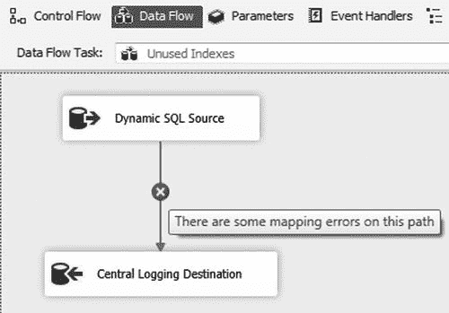

图 1-19. 已完成的数据流任务

在修复此错误之前，你需要返回 SSMS 创建一个表来存储这些数据。现在请使用 清单 1-8 中的代码创建此表。

#### 清单 1-8. 用于创建 dba_monitor_unusedIndexes 表的 T-SQL 代码

```sql
USE dbaCentralLogging;
GO

CREATE TABLE dbo.dba_monitor_unusedIndexes
(
     log_id                    INT IDENTITY(1,1)
    ,captureDate               DATETIME
    ,serverName                NVARCHAR(128)
    ,schemaName                SYSNAME
    ,databaseName              SYSNAME
    ,tableName                 SYSNAME
    ,indexName                 SYSNAME
    ,indexType                 NVARCHAR(60)
    ,isFiltered                BIT
    ,isPartitioned             BIT
    ,numberOfRows              BIGINT
    ,userSeeksSinceReboot      BIGINT
    ,userScansSinceReboot      BIGINT
    ,userLookupsSinceReboot    BIGINT
    ,userUpdatesSinceReboot    BIGINT
    ,indexSizeInMB             BIGINT
    ,lastReboot                DATETIME

CONSTRAINT PK_dba_monitor_unusedIndexes
        PRIMARY KEY NONCLUSTERED(log_id)
);

CREATE CLUSTERED INDEX CIX_dba_monitor_unusedIndexes
    ON dbo.dba_monitor_unusedIndexes(captureDate);
```

返回 Visual Studio，双击 `中央日志数据库` 图标以编辑其属性。将 `表或视图的名称` 值更改为 `[dbo].[dba_monitor_unusedIndexes]`，然后点击 `映射` 页面。由于你的源和目标使用相同的列名，你可以通过右键单击 `可用输入列` 和 `可用目标列` 之间的空白区域并选择 `按匹配名称映射项目` 来轻松更新映射。图 1-20 展示了此选项。

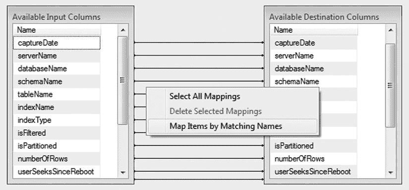

图 1-20. `映射` 页面中的 `按匹配名称映射项目` 选项

再次说明，`log_id` 列将不会映射到任何内容，因为它是一个标识列。点击 `确定` 返回数据流设计器，然后点击 `控制流` 选项卡。

看到第二个数据流进行得有多快了吗？你可以继续使用此方法轻松添加更多的元数据收集任务。剩下要做的就是在 `dba_monitor_SQLServerInstances` 表中更新你的 `LastMonitored` 列。

 **提示** 创建一个“一刀切”的包可能很诱人。然而，通常更好的做法是将元数据收集按频率要求分离到不同的包中。例如，本章收集的元数据只需要定期采样，例如每天或每周收集。需要更频繁收集的元数据，例如每小时检查失败的 SQL Server Agent 作业，应存储在单独的包中。

向你的 `Foreach 循环` 容器中添加一个 `执行 SQL` 任务，并将其重命名为 `更新 LastMonitored`。将未使用索引数据流连接到 `更新 LastMonitored` `执行 SQL` 任务。双击 `执行 SQL` 任务以编辑其属性。在 `连接` 下拉菜单中选择 `dbaCentralLogging` 连接，然后在 `SQLStatement` 字段中输入 清单 1-9 中的代码。

#### 清单 1-9. 用于更新 dba_monitor_SQLServerInstances 中 LastMonitored 值的 T-SQL 代码

```sql
UPDATE dbo.dba_monitor_SQLServerInstances
SET LastMonitored = GETDATE()
WHERE SQLServerInstance= ?;
```

问号 (`?`) 通知 `执行 SQL` 任务使用参数来完成 SQL 语句。现在你只需要将变量映射到参数。为此，点击 `参数映射` 页面并点击 `添加`。按如下方式编辑属性：

*   变量名称 = `User::SQLServerInstance`
*   方向 = `输入`
*   数据类型 = `NVARCHAR`
*   参数名称 = `0`
*   参数大小 = `128`

确认你的映射与 图 1-21 中所示的匹配，然后点击 `确定`。

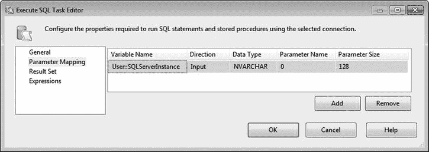

图 1-21. `执行 SQL 任务编辑器` 中的参数映射

现在你已准备好执行你的包！为此，从菜单中选择 `调试`  `开始调试`，点击工具栏中的绿色 `运行` 图标，或按 `F5`。成功执行后，你的包应类似于 图 1-22。

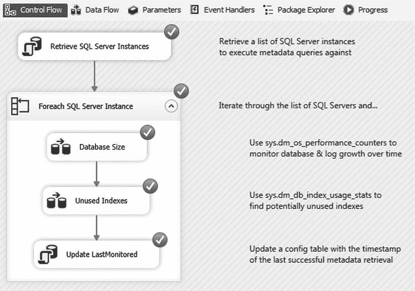

图 1-22. `MetadataCollection` 包的成功执行

恭喜！你现在已经从服务器列表中收集了元数据，并将结果存储在一个集中式的数据库中。

至此，我们通过 SSIS 收集元数据的演练就结束了。然而，作为一个勤奋的开发人员或 DBA，你可能需要考虑更多的任务。首先，正如我们在本章开头所讨论的，此包不包含任何异常处理或日志记录，这超出了本章的范围。然而，最佳实践是每个包都包含某种形式的异常处理和日志记录。其次，在收集元数据方面，我们只是触及了冰山一角。还有更多信息需要考虑，例如安全审计、错误日志、SQL Server Agent 作业状态等等。如果你不确定从哪里开始，可以考虑按关键性对元数据任务进行排序，并按重要性降序添加增量监控。作为最后一项家庭作业，你可能需要考虑设置监视器，以便在遇到不利情况时（例如 SQL Server Agent 作业失败或可用空间不足）提醒你。

#### 本章小结

在本章中，我们讨论了元数据的重要性。我们探讨了 SQL Server 中存在的一些元数据，并提供了两个有用的 T-SQL 元数据查询示例。我们确定了一个非常灵活且可重用的模式，用于在企业环境中收集数据库元数据。最后，我们创建了一个 `Integration Services` 包，该包检索要监视的 SQL Server 实例列表，然后将结果记录到中央存储库。

