# 第 2 章


### 执行模式

要完全理解 SQL Server 2014 `Integration Services` 的执行，你必须首先理解不同的部署模型。有两种：包部署模型和项目部署模型。每种模型都暴露并支持不同的功能。包部署模型主要支持传统功能。它是 SSIS 2005 到 SSIS 2008 R2 使用的模型。新的方式涉及项目部署模型。某些执行方法（但不是全部）对两种部署模型都可用。


### 执行 SSIS 包

你可以构建出色的 SQL Server Integration Services (SSIS) 包，但除非执行它们，否则它们毫无用处！SSIS 提供了多种执行包的方法。在本章中，我们将探讨以下内容：

*   调试执行
*   命令行执行
*   执行包实用工具
*   SQL Server 2014 Integration Services
*   Integration Services 目录
*   Integration Services 目录存储过程
*   计划 SSIS 包执行
*   执行包任务
*   元数据驱动执行
*   从托管代码执行

我们将首先创建一个简单的 SSIS 包用于演示。

### 构建演示用的 SSIS 包

创建一个名为 **Chapter2** 的新 SSIS 解决方案。重命名 SSIS 包，将名称从 `Package.dtsx` 更改为 `Chapter2.dtsx`。

 **提示** *有关创建 SSIS 解决方案和包的更多信息，请参阅 Michael Coles 和 Francis Rodrigues 所著的《Professional SQL Server 2014 Integration Services》(Apress, 2012)*。

将脚本组件拖放到控制流画布上并打开编辑器。在“脚本”页面的 `ScriptLanguage` 属性中选择你偏好的语言。在 `ReadOnlyVariables` 中选择 `System::PackageName` 变量，然后单击“编辑脚本”按钮。

如果你为脚本任务的 `ScriptLanguage` 属性选择了 Microsoft Visual Basic 2010，请将 `Public Sub Main()` 中的代码替换为以下内容：

```vbnet
Public Sub Main()

Dim sPackageName As String = Dts.Variables("PackageName").Value.ToString
Dim sMsg As String = "Package Name: " & sPackageName

MsgBox(sMsg, , sPackageName)

Dts.TaskResult = ScriptResults.Success
End Sub
```

如果你为脚本任务的 `ScriptLanguage` 属性选择了 Microsoft Visual C# 2010，请将 `public void Main()` 中的代码替换为以下内容：

```csharp
public void Main()
{
    string sPackageName = Dts.Variables["PackageName"].Value.ToString();
    string sMsg = "Package Name: " + sPackageName;

    MessageBox.Show(sMsg, sPackageName);

    Dts.TaskResult = (int)ScriptResults.Success;
}
```

保存包、项目和解决方案。准备运行！

### 调试执行

在 SQL Server Business Intelligence Development Studio (BIDS) 内执行包非常简单。无论选择哪种部署模型，其工作方式都相同。然而，与 Visual Studio 集成开发环境 (VS IDE) 中的所有操作一样，有多种方法可以实现。

当你在 BIDS 内执行 SSIS 包时，你是在调用 SSIS 调试器。SSIS 调试器文件名为 `DtsDebugHost.exe`，存储在 `<drive>:\Program Files\Microsoft SQL Server\120\DTS\Binn` 文件夹中。重要的是要认识到你是在调试宿主进程内执行 SSIS 包。为什么？因为调试会产生开销——那些框变色可不是免费的！

要在 BIDS 中执行 `Chapter2.dtsx` 包，请按 F5 键。调试宿主加载，然后加载包并执行它。你应该会看到一个显示包名的消息框。当你单击消息框上的“确定”按钮时，Chapter2 包控制流中的脚本任务会从黄色变为绿色。“连接管理器”选项卡下方会出现一个链接，指示包执行已完成。但是，`DtsDebugHost.exe` 进程仍在执行。它会继续执行，直到 BIDS 调试器停止。

以下是一些启动 BIDS 调试器的方法：

*   按 F5 键。
*   单击工具栏上的 VCR 播放按钮（指向右的绿色箭头）。
*   单击“调试”下拉菜单并选择“开始调试”。

 **注意** 实际上，从“调试”下拉菜单中选择“逐语句”或“逐过程”也会启动 BIDS 调试器。

*   在解决方案资源管理器中，右键单击包并从菜单中选择“执行包”。
*   当包在调试模式下完成执行后，可以通过以下方式之一重新启动包：
    *   按住 Ctrl+Shift 并按 F5 键
    *   使用工具栏上的 VCR 重新启动按钮
    *   单击“调试”下拉菜单并单击“重新启动”

以下是一些在包执行完成后（或任何时候需要停止调试模式）停止调试器的方法：

*   按住 Shift 并按 F5 键。
*   单击工具栏上的 VCR 停止按钮（方块）。
*   单击“调试”下拉菜单并选择“停止调试”。
*   单击“调试”下拉菜单并选择“终止所有”。
*   单击“连接管理器”选项卡下方的“包执行已完成”链接。

### 命令行执行

SSIS 包的命令行执行使用 DTEXEC 实用工具 (`DtExec.exe`)。DTEXEC 支持项目和包部署模型。你可以通过单击“调试”下拉菜单并选择“开始执行(不调试)”（或按住 Ctrl 键并按 F5）在 BIDS 内手动调用 DTEXEC。你也可以从命令提示符手动启动 DTEXEC。

DTEXEC 通常不是手动调用的。相反，通常将 DTEXEC 命令行与计划软件结合使用，在生产环境中执行 SSIS 包。例如，当你使用 SQL Server Agent 计划 SSIS 包（本章稍后介绍）时，就会实例化 DTEXEC。

要使用 DTEXEC 执行 `Chapter2.dtsx` SSIS 包，请打开命令提示符并输入以下命令：

```
dtexec /FILE "G:\Projects\SSIS Design Patterns\SSIS Design Patterns\Chapter2.dtsx"
```

此命令执行位于 `G:\Projects\SSIS Design Patterns\SSIS Design Patterns` 文件夹中的 `Chapter2.dtsx` SSIS 包。如果你跟着做，请编辑命令行以反映你的 SSIS 包的位置。

当你从命令行执行包时，消息框会显示包名——就像从 BIDS 调试器内执行包时一样。

如果 SSIS 包已部署到新的 SSIS 目录，你仍然可以使用类似以下的命令从命令行执行它：

```
dtexec.exe /ISSERVER "\"\SSISDB\Chapter2\Chapter2\Chapter2.dtsx\"" /SERVER "\"SSISMVP-RC0\"" /Par "\"$ServerOption::SYNCHRONIZED(Boolean)\"";True /REPORTING E /CALLERINFO Andy
```

### 执行包实用工具

执行包实用工具 (DtExecUI) 在其自身进程中运行并执行 SSIS 包。我喜欢使用执行包实用工具来构建 DTEXEC 命令行，但它仅支持包部署模型。你至少可以通过三种方式调用执行包实用工具：

*   单击“开始”  “所有程序”  “Microsoft SQL Server”  “Integration Services”  “执行包实用工具”。
*   单击“开始”  “运行”，在“打开”文本框中键入 **dtexecui**。
*   双击一个 dtsx 文件（如果你没有为 dtsx 文件重新映射默认应用程序设置）。

我最喜欢的选项是双击 dtsx 文件。这不仅会打开执行包实用工具，还会将“常规”页的设置设置为指示包源是文件系统，并使用双击的 dtsx 文件的完整路径配置“包路径”文本框。很棒。

如果我使用执行包实用工具执行 `Package2.dtsx`，将显示“包执行进度”表单，通知我包的执行进度（多么贴切），并且消息框会出现，就像我使用 BIDS 调试器和命令行执行时一样。

 **注意** *有关执行包实用工具的更多信息，请参阅 Michael Coles 和 Francis Rodrigues 所著的《Professional SQL Server 11 Integration Services》(Apress, 2012)*。

### SQL Server 2014 Integration Services 服务


### SQL Server Integration Services 11.0 服务

SQL Server Integration Services 11.0 服务随 SQL Server 2014 一起安装。要连接，请打开 SQL Server Management Studio (`SSMS`)。如果在 `SSMS` 启动时出现 `连接到服务器` 窗口提示连接，请确保将 `服务器类型` 设置为 `Integration Services`。在 `服务器名称` 下拉框中输入服务器名称。请注意，SSIS 没有命名实例：每个服务器只有一个实例（至少目前如此）。你也可以输入 `localhost` 来连接本地服务器的默认 SSIS 实例。

配置好连接后，单击 `连接` 按钮。导航到你希望执行的包。存储在文件系统或 `MSDB` 数据库中的 SSIS 包可以通过 SSIS 2014 服务执行。

SQL Server 2014 提供了一种管理 Integration Services 包的新方法：Integration Services 目录。我们接下来将探讨这种方法。

### Integration Services 目录

你只能在 Integration Services 目录中管理使用项目部署模型的 SSIS 项目。要在目录中执行包，请使用 `SSMS` 连接到托管 `SSISDB` 数据库的 SQL Server 实例。展开 `Integration Services 目录` 节点，然后展开 `SSISDB` 节点。深入包含 SSIS 项目和包的文件夹。右键单击你希望执行的包，然后单击 `执行`，如 图 2-1 所示。

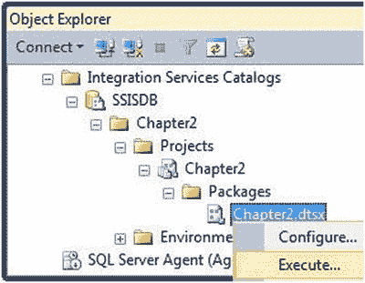

图 2-1. 执行已部署到 SSIS 目录的 SSIS 包

`执行包` 窗口将显示，如 图 2-2 所示。它允许你为此存储在 SSIS 目录中的 SSIS 包的此执行实例覆盖参数值、设计时构建的连接管理器的 `ConnectionString` 属性，或任何其他可通过包路径访问的可外部化属性（通过 `高级` 选项卡）。

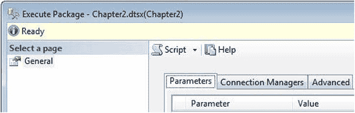

图 2-2. 执行包窗口

### Integration Server 目录存储过程

请注意 图 2-2 中 `参数` 选项卡上方的 `脚本` 按钮。此按钮允许你生成将执行 SSIS 包的 Transact-SQL (`T-SQL`) 语句。对于存储在 SSIS 目录中的 `Chapter2.dtsx` 包，脚本将类似于 清单 2-1 中的那些。

`清单 2-1`. 从执行包窗口生成的 T-SQL 脚本

```sql
Declare @execution_id bigint
EXEC [SSISDB].[catalog].[create_execution]
   @package_name=N'Chapter2.dtsx'
  ,@execution_id=@execution_id OUTPUT
  ,@folder_name=N'Chapter2'
  ,@project_name=N'Chapter2'
  ,@use32bitruntime=False
  ,@reference_id=Null
Select @execution_id
DECLARE @var0 smallint = 1
EXEC [SSISDB].[catalog].[set_execution_parameter_value]
   @execution_id
  ,@object_type=50
  ,@parameter_name=N'LOGGING_LEVEL'
  ,@parameter_value=@var0
EXEC [SSISDB].[catalog].[start_execution] @execution_id
GO
```

你可以使用这些相同的存储过程来执行 SSIS 目录中的 SSIS 包！事实上，我设计了一个脚本来创建一个包装器存储过程，该过程将调用在 SSIS 目录中执行 SSIS 包时执行的 `T-SQL` 语句。你可以在 清单 2-2 中看到该脚本。

`清单 2-2`. 用于构建在 SSIS 目录中执行 SSIS 包的包装器存储过程的脚本

```sql
 /* Select the SSISDB database */
Use SSISDB
Go

/* Create a parameter (variable) named @Sql */
Declare @Sql varchar(2000)

/* Create the Custom schema if it does not already exist */
print 'Custom Schema'
If Not Exists(Select name
              From sys.schemas
                Where name = 'custom')
 begin
   /* Create Schema statements must occur first in a batch */
  print ' - Creating custom schema'
  Set @Sql = 'Create Schema custom'
  Exec(@Sql)
  print ' - Custom schema created'
 end
Else
 print ' - Custom Schema already exists.'
print ''

/* Drop the Custom.execute_catalog_package Stored Procedure if it already exists */
print 'Custom.execute_catalog_package Stored Procedure'
  If Exists(Select s.name + '.' + p.name
            From sys.procedures p
            Join sys.schemas s
                On s.schema_id = p.schema_id
         Where s.name = 'custom'
           And p.name = 'execute_catalog_package')
   begin
    print ' - Dropping custom.execute_catalog_package'
    Drop Procedure custom.execute_catalog_package
    print ' - Custom.execute_catalog_package dropped'
   end

/* Create the Custom.execute_catalog_package Stored Procedure */
  print ' - Creating custom.execute_catalog_package'
go

/*

Stored Procedure: custom.execute_catalog_package
     Author: Andy Leonard
     Date: 4 Mar 2012
     Description: Creates a wrapper around the SSISDB Catalog procedures
                  used to start executing an SSIS Package. Packages in the
                SSIS Catalog are referenced by a multi-part identifier
                 - or path - that consists of the following hierarchy:
        Catalog Name: Implied by the database name in Integration Server 2014
        |-Folder Name: A folder created before or at Deployment to contain the SSIS project
        |-Project Name: The name of the SSIS Project deployed
        |-Package Name: The name(s) of the SSIS Package(s) deployed

Parameters:
        @FolderName [nvarchar(128)] {No default} –
         contains the name of the Folder that holds the SSIS Project
        @ProjectName [nvarchar(128)] {No default} –
         contains the name of the SSIS Project that holds the SSIS Package
        @PackageName [nvarchar(260)] {No default} –
         contains the name of the SSIS Package to be executed
        @ExecutionID [bigint] {Output} –
         Output parameter (variable) passed back to the caller
        @LoggingLevel [varchar(16)] {Default} –
         contains the (case-insensitive) name of the logging level
         to apply to this execution instance
        @Use32BitRunTime [bit] {Default} –
         1 == Use 64-bit run-time
                                                  0 == Use 32-bit run-time
        @ReferenceID [bigint] {Default} –reference to Execution Environment
        @ObjectType [smallint] –identifier related to PackageType property
        Guessing: @ObjectType == PackageType.ordinal (1-based-array) * 10
         Must be 20, 30, or 50 for catalog.set_execution_parameter_value
         stored procedure

Test:
        1. Create and deploy an SSIS Package to the SSIS Catalog.
        2. Exec custom.execute_catalog_package and pass it the
          following parameters: @FolderName, @ProjectName, @PackageName, @ExecutionID Output
        @LoggingLevel, @Use32BitRunTime, @ReferenceID, and @ObjectType are optional and
        defaulted parameters.

Example:
           Declare @ExecId bigint
           Exec custom.execute_catalog_package
         'Chapter2'
        ,'Chapter2'
        ,'Chapter2.dtsx'
        ,@ExecId Output
        3. When execution completes, an Execution_Id value should be returned.
        View the SSIS Catalog Reports to determine the status of the execution
        instance and the test.

*/
Create Procedure custom.execute_catalog_package
  @FolderName nvarchar(128)
 ,@ProjectName nvarchar(128)
 ,@PackageName nvarchar(260)
 ,@ExecutionID bigint Output
 ,@LoggingLevel varchar(16) = 'Basic'
 ,@Use32BitRunTime bit = 0
 ,@ReferenceID bigint = NULL
 ,@ObjectType smallint = 50
As

begin

Set NoCount ON
```

### 在 SSIS Catalog 中执行 SSIS 包

以下 T-SQL 代码片段演示了如何在 SSIS Catalog 中初始化并执行一个 SSIS 包。

```sql
/* Call the catalog.create_execution stored procedure
      to initialize execution location and parameters */
  Exec catalog.create_execution
   @package_name = @PackageName
  ,@execution_id = @ExecutionID Output
  ,@folder_name = @FolderName
  ,@project_name = @ProjectName
  ,@use32bitruntime = @Use32BitRunTime
  ,@reference_id = @ReferenceID

/* Populate the @ExecutionID parameter for OUTPUT */
  Select @ExecutionID As Execution_Id

/* Create a parameter (variable) named @Sql */
  Declare @logging_level smallint
   /* Decode the Logging Level */
  Select @logging_level = Case
                           When Upper(@LoggingLevel) = 'BASIC'
                           Then 1
                           When Upper(@LoggingLevel) = 'PERFORMANCE'
                           Then 2
                            When Upper(@LoggingLevel) = 'VERBOSE'
                           Then 3
                           Else 0 /* 'None' */
                          End
   /* Call the catalog.set_execution_parameter_value stored
      procedure to update the LOGGING_LEVEL parameter */
  Exec catalog.set_execution_parameter_value
    @ExecutionID
   ,@object_type = @ObjectType
   ,@parameter_name = N'LOGGING_LEVEL'
   ,@parameter_value = @logging_level

/* Call the catalog.start_execution (self-explanatory) */
  Exec catalog.start_execution
    @ExecutionID

end

GO
```

如果执行此脚本在您的 SSISDB 数据库实例中创建自定义架构和存储过程，可以使用 **清单 2-3** 中的语句进行测试。

**清单 2-3**. 测试 `SSISDB.custom.execute_catalog_package` 存储过程

```sql
Declare @ExecId bigint
Exec SSISDB.custom.execute_catalog_package 'Chapter2','Chapter2','Chapter2.dtsx',
@ExecId Output
```

### 添加数据捕获

`SSISDB.custom.execute_catalog_package` 存储过程可以通过稍作修改来创建一个*数据捕获*功能——这是 SSIS 2014 中针对从 SSISDB 目录执行的包引入的一项新特性。向存储过程添加一些参数和 T-SQL，允许其执行 SSIS 包并导出一个逗号分隔值 (CSV) 文件，该文件包含流经数据流任务中某个点的部分或全部行。数据捕获为监控数据在 SSIS 数据流中的移动状态提供了一个急需的窗口，有助于在生产环境中进行根本原因分析和故障排除，而无需更改包代码。数据捕获是 Integration Services 2014 最重要的增强功能之一。Listing 2-4 包含了构建 `SSISDB.custom.execute_catalog_package_with_data_tap` 的脚本：

**清单 2-4**. 用于构建在 SSIS 目录中执行 SSIS 包的包装器存储过程的脚本

```sql
/* Select the SSISDB database */
Use SSISDB
Go

/* Create a parameter (variable) named @Sql */
Declare @Sql varchar(2000)

/* Create the Custom schema if it does not already exist */
print 'Custom Schema'
If Not Exists(Select name
              From sys.schemas
Where name = 'custom')
 begin
   /* Create Schema statements must occur first in a batch */
  print ' - Creating custom schema'
  Set @Sql = 'Create Schema custom'
  Exec(@Sql)
  print ' - Custom schema created'
 end
Else
 print ' - Custom Schema already exists.'
print ''

/* Drop the Custom.execute_catalog_package_with_data_tap
 Stored Procedure if it already exists */
print 'Custom.execute_catalog_package_with_data_tap Stored Procedure'
  If Exists(Select s.name + '.' +  p.name
            From sys.procedures p
            Join sys.schemas s
                On s.schema_id = p.schema_id
        Where s.name = 'custom'
           And p.name = 'execute_catalog_package_with_data_tap')
   begin
    print ' - Dropping custom.execute_catalog_package_with_data_tap'
    Drop Procedure custom.execute_catalog_package_with_data_tap
    print ' - Custom.execute_catalog_package_with_data_tap dropped'
   end

/* Create the Custom.execute_catalog_package_with_data_tap Stored Procedure */
  print ' - Creating custom.execute_catalog_package_with_data_tap'
go

/*

Stored Procedure: custom.execute_catalog_package_with_data_tap
  Author: Andy Leonard
  Date: 4 Apr 2012
  Description: Creates a wrapper around the SSISDB Catalog procedures
               used to start executing an SSIS Package and create a
               data tap. Packages in the
               SSIS Catalog are referenced by a multi-part identifier
               - or path - that consists of the following hierarchy:
  Catalog Name: Implied by the database name in Integration Server 2014
  |-Folder Name: A folder created before or at Deployment to contain the SSIS project
    |-Project Name: The name of the SSIS Project deployed
      |-Package Name: The name(s) of the SSIS Package(s) deployed
  Parameters:
   @FolderName [nvarchar(128)] {No default} - contains the name of the
     Folder that holds the SSIS Project
   @ProjectName [nvarchar(128)] {No default} - contains the name of the
    SSIS Project that holds the SSIS Package
   @PackageName [nvarchar(260)] {No default} - contains the name of the
    SSIS Package to be executed
   @ExecutionID [bigint] {Output} - Output parameter (variable) passed back
    to the caller
   @LoggingLevel [varchar(16)] {Default} - contains the (case-insensitive)
    name of the logging level to apply to this execution instance
   @Use32BitRunTime [bit] {Default} - 1 == Use 64-bit run-time
                                      0 == Use 32-bit run-time
   @ReferenceID [bigint] {Default} - contains a reference to an Execution Environment
   @ObjectType [smallint] - contains an identifier that appears to be related
    to the SSIS PackageType property

Guessing: @ObjectType == PackageType.ordinal (1-based-array) * 10
    Must be 20, 30, or 50 for catalog.set_execution_parameter_value
     stored procedure
  @DataFlowTaskName [nvarchar(255)] - contains the name of the Data Flow Task in which to
   to apply the data tap.
  @IdentificationString [nvarchar(255)] - contains the Data Flow Path Identification string
   in which to apply the data tap.
  @DataTapFileName [nvarchar(4000)] - contains the name of the file to create to contain
   the rows captured from the data tap.
   Saved in the <drive>:\Program Files\Microsoft SQL Server\120\DTS\DataDumps folder.
  @DataTapMaxRows [int] - contains the maximum number of rows to send to the data tap file.

Test:
  1. Create and deploy an SSIS Package to the SSIS Catalog.
  2. Exec custom.execute_catalog_package_with_data_tap and pass it the
     following parameters: @FolderName, @ProjectName, @PackageName,
     @DataFlowTaskName, @IdentificationString, @DataTapFileName,
     @ExecutionID Output
  @LoggingLevel, @Use32BitRunTime, @ReferenceID, @ObjectType,
   and @DataTapMaxRows are optional and defaulted parameters.

Example:
  Declare @ExecId bigint
  Exec custom.execute_catalog_package_with_data_tap
   'SSISConfig2014','SSISConfig2014','Child1.dtsx',
   'Data Flow Task', 'OLESRC Temperature.OLE DB Source Output',
   'Child1_DataFlowTask_OLESRCTemperature_OLEDBSourceOutput.csv',@ExecId Output

3. When execution completes, an Execution_Id value should be returned.
     View the SSIS Catalog Reports to determine the status of the
     execution instance and the test.

*/
Create Procedure [custom].[execute_catalog_package_with_data_tap]
  @FolderName nvarchar(128)
 ,@ProjectName nvarchar(128)
 ,@PackageName nvarchar(260)
 ,@DataFlowTaskName nvarchar(255)
 ,@IdentificationString nvarchar(255)
 ,@DataTapFileName nvarchar(4000)
 ,@ExecutionID bigint Output
 ,@LoggingLevel varchar(16) = 'Basic'
 ,@Use32BitRunTime bit = 0
 ,@ReferenceID bigint = NULL
 ,@ObjectType smallint = 50
 ,@DataTapMaxRows int = NULL
As

begin

Set NoCount ON
```

/* 调用 `catalog.create_execution` 存储过程
      以初始化执行位置和参数 */
  执行 `catalog.create_execution`
   `@package_name` = `@PackageName`
  ,`@execution_id` = `@ExecutionID` 输出
  ,`@folder_name` = `@FolderName`
  ,`@project_name` = `@ProjectName`
  ,`@use32bitruntime` = `@Use32BitRunTime`
  ,`@reference_id` = `@ReferenceID`

/* 填充用于输出的 `@ExecutionID` 参数 */
  选择 `@ExecutionID` 作为 Execution_Id

/* 配置数据钩子参数 */
  如果 (左侧(`@DataFlowTaskName`, 9) <> '\Package\')
   设置 `@DataFlowTaskName` = '\Package\' + `@DataFlowTaskName`

如果 左侧(`@IdentificationString`,6) <> 'Paths['
   设置 `@IdentificationString` = 'Paths[' + `@IdentificationString` + ']'

/* 创建数据钩子 */
  执行 `[SSISDB].[catalog].add_data_tap` `@ExecutionID`, `@DataFlowTaskName`,
   `@IdentificationString`, `@DataTapFileName`, `@DataTapMaxRows`

/* 创建一个名为 `@Sql` 的参数（变量） */
  声明 `@logging_level` smallint
   /* 解码日志记录级别 */
  选择 `@logging_level` = 情况
                           当 上层(`@LoggingLevel`) = 'BASIC'
                                           则 1
                                           当 上层(`@LoggingLevel`) = 'PERFORMANCE'
                                           则 2
                                            当 上层(`@LoggingLevel`) = 'VERBOSE'
                                           则 3
                                           否则 0 /* '无' '
                                          结束
   /* 调用 `catalog.set_execution_parameter_value` 存储
      过程以更新 `LOGGING_LEVEL` 参数 */
  执行 `catalog.set_execution_parameter_value`
    `@ExecutionID`
   ,`@object_type` = `@ObjectType`
   ,`@parameter_name` = N'LOGGING_LEVEL'
   ,`@parameter_value` = `@logging_level`

/* 调用 `catalog.start_execution`（不言自明） */
  执行 `catalog.start_execution`
    `@ExecutionID`

结束
```

### 测试数据钩子存储过程

在开始此练习之前，请访问 `http://andyweather.com/data/WeatherData_Dec08.zip` 以获取一些真实世界温度和湿度的天气数据，这些数据收集自我位于弗吉尼亚州法姆维尔的气象站。压缩文件（`WeatherData_Dec08.zip`）包含一个名为 `sensor1-all.csv` 的 CSV 文件。该文件位于两层文件夹之下，路径为 `Dec08\TH\sensor1-all.csv`。解压缩该文件并将其存储在您的文件系统中。我更倾向于将与测试项目相关的数据存储在 SSIS 解决方案目录中一个名为 `Data` 的文件夹内。只要您记得文件存放的位置，具体存放在哪里并不重要。

向 Chapter2 项目添加一个新的 SSIS 包，并将其重命名为 `DataTapTest.dtsx`。将一个数据流任务拖到控制流上，并将其重命名为 `DFT 加载温度数据`。打开数据流编辑器（选项卡），并将一个平面文件源适配器拖到设计图面上。将平面文件源适配器重命名为 `FFSrc 温度`。打开平面文件源适配器编辑器，单击平面文件连接管理器下拉列表右侧的 `新建` 按钮。单击 `新建` 按钮会为您做几件事：

1.  它创建一个新的平面文件连接管理器。
2.  它打开新的平面文件连接管理器编辑器。

将平面文件连接管理器的名称设置为 `FFCM 温度`。单击 `浏览` 按钮，并导航到包含 `sensor1-all.csv` 文件的文件夹（记得在 `打开` 对话框中将扩展名筛选器从 `*.txt` 更改为 `*.csv`）。选择 `sensor1-all.csv` 文件，然后单击 `打开` 对话框上的 `确定` 按钮，因为在此演示中，我们接受平面文件连接管理器的默认设置。单击 `确定` 按钮关闭平面文件源适配器编辑器。

在继续之前，打开 SQL Server Management Studio (SSMS)，连接到 SQL Server 2014 实例，并创建一个名为 `TestDB` 的数据库。

返回到 SQL Server Data Tools - Business Intelligence (SSDT-BI)，并将一个 OLE DB 目标适配器拖到数据流任务设计图面上。将 OLE DB 目标适配器重命名为 `OLEDBDest 温度暂存区`，并在 `FFSrc 温度` 平面文件源适配器和 `OLEDBDest 温度暂存区` OLE DB 目标适配器之间连接一条数据流路径（蓝色箭头）。打开 `OLEDBDest 温度暂存区` OLE DB 目标适配器编辑器，并单击 OLE DB 连接管理器下拉列表右侧的 `新建` 按钮，以创建一个新的 OLE DB 连接管理器并打开其编辑器。当 `配置 OLE DB 连接管理器` 窗口显示时，单击 `新建` 按钮以打开 `连接管理器编辑器` 窗口。输入服务器名称和用户登录凭据，然后在 `选择或输入数据库名称` 下拉列表中输入或选择 `TestDB` 数据库。关闭编辑器和 `配置 OLE DB 连接管理器` 窗口以返回到 `OLEDBDest 温度暂存区` OLE DB 目标适配器。

在 `OLEDBDest 温度暂存区` OLE DB 目标适配器中，单击 `表或视图的名称` 下拉列表右侧的 `新建` 按钮。修改 `创建表` 窗口中的内容，使其与 清单 2-5 中的数据定义语言 (DDL) 语句相匹配。

#### 清单 2-5. 用于目标的数据定义语言 (DDL) 创建表语句

```sql
创建表 [温度暂存区] (
    [日期] varchar(50),
    [时间] varchar(50),
    [最低温度] varchar(50),
    [最高温度] varchar(50),
    [平均温度] varchar(50),
    [最低湿度] varchar(50),
    [最高湿度] varchar(50),
    [平均湿度] varchar(50),
    [舒适区] varchar(50),
    [最低露点] varchar(50),
    [最高露点] varchar(50),
    [平均露点] varchar(50),
    [最低体感温度] varchar(50),
    [最高体感温度] varchar(50),
    [平均体感温度] varchar(50)
)
```

此语句通过移除表名中的 `OLEDBDest` 前缀以及移除列名中的空格来修改提供的语句。单击 `确定` 按钮创建表并关闭 `创建表` 窗口。单击 `映射` 页，并将可用的输入列映射到其匹配的可用目标列。关闭 `OLEDBDest 温度暂存区` OLE DB 目标适配器编辑器。

双击数据流路径以打开其编辑器。从 `常规` 页，复制 `IdentificationString` 属性值。`IdentificationString` 属性应为 `Paths[FFSrc 温度.平面文件源输出]`。我们需要此值以及数据流任务的 `PackagePath` 属性值（`Package\DFT 加载温度数据`）来执行带有数据钩子的此包。

首先，保存 SSIS 包并将其部署到目录。接下来，执行 清单 2-6 中的语句以执行带有数据钩子的 SSIS 包。

#### 清单 2-6. 使用数据钩子执行 SSIS 包

```sql
声明 @ExecId bigint
执行 SSISDB.custom.execute_catalog_package_with_Data_tap
 @文件夹名 = 'Chapter2'
,@项目名 = 'Chapter2'
,@包名 = 'DataTapTest.dtsx'
,@数据流任务名 = '\Package\DFT 加载温度数据'
,@标识字符串 = 'Paths[FFSrc 温度.平面文件源输出]'
,@数据钩子文件名 = 'TemperatureRows.csv'
,@执行 ID = @ExecId 输出
,@数据钩子最大行数 = 25
```

一旦包执行完成（并且您可以在 `TestDB.dbo.温度暂存区` 表中测试行数），您应该在 `<驱动器>:\Program Files\Microsoft SQL Server\120\DTS\DataDumps` 目录中找到一个名为 `TemperatureRows.csv` 的 CSV 文件，并且该文件应包含流经 `DataTapTest.dtsx` SSIS 包中 `DFT 加载温度数据` 任务内 `FFSrc 温度.平面文件源输出` 数据流路径的前 25 行数据。

### 创建自定义执行框架


SSIS 执行框架支持可重复且可靠的 SSIS 包执行。`SSISDB.custom.execute_catalog_package` 存储过程可用作此 SSIS 执行框架的核心。若要创建支持该框架的表，请执行列表 2-7 中的语句。

### 列表 2-7. 支持自定义 SSIS 执行框架的表

```sql
/* Switch to SSISDB database */
Use SSISDB
Go

/* Build custom Schema */
print 'Custom Schema'
/* Check for existence of custom Schema */
If Not Exists(Select name
              From sys.schemas
                         Where name = 'custom')
 begin
  /* Build and execute custom Schema SQL
     if it does not exist */
  print ' - Creating custom schema'
  declare @CustomSchemaSql varchar(32) = 'Create Schema custom'
  exec(@CustomSchemaSql)
  print ' - Custom schema created'
 end
Else
  /* If the custom schema exists, tell us */
 print ' - Custom schema already exists.'
 print ''
Go

/* Build custom.Application table */
print 'Custom.Application Table'
/* Check for existence of custom.Application table */
If Not Exists(Select s.name + '.' + t.name
              From sys.tables t
                         Join sys.schemas s
                           On s.schema_id = t.schema_id
                         Where s.name = 'custom'
                           And t.name = 'Application')
 begin
  /* Create custom.Application table
     if it does not exist */
  print ' - Creating custom.Application Table'
  Create Table custom.Application
  (
    ApplicationID int identity(1,1)
         Constraint PK_custom_Application Primary Key Clustered
   ,ApplicationName nvarchar(256) Not Null
     Constraint U_custom_ApplicationName Unique
   ,ApplicationDescription nvarchar(512) Null
  )
  print ' - Custom.Application Table created'
 end
Else
  /* If the custom.Application table exists, tell us */
 print ' - Custom.Application Table already exists.'
print ''

/* Build custom.Package table */
print 'Custom.Package Table'
/* Check for existence of custom.Package table */
If Not Exists(Select s.name + '.' + t.name
              From sys.tables t
                         Join sys.schemas s
                           On s.schema_id = t.schema_id
                         Where s.name = 'custom'
                           And t.name = 'Package')
 begin
  /* Create custom.Package table
     if it does not exist */
  print ' - Creating custom.Package Table'
  Create Table custom.Package
  (
    PackageID int identity(1,1)
         Constraint PK_custom_Package Primary Key Clustered
   ,FolderName nvarchar(128) Not Null
   ,ProjectName nvarchar(128) Not Null
   ,PackageName nvarchar(256) Not Null
   ,PackageDescription nvarchar(512) Null
  )
  print ' - Custom.Package Table created'
 end
Else
  /* If the custom.Package table exists, tell us */
 print ' - Custom.Package Table already exists.'
print ''

/* Build custom.ApplicationPackage table */
print 'Custom.ApplicationPackage Table'
/* Check for existence of custom.ApplicationPackage table */
If Not Exists(Select s.name + '.' + t.name
              From sys.tables t
                         Join sys.schemas s
                           On s.schema_id = t.schema_id
                         Where s.name = 'custom'
                           And t.name = 'ApplicationPackage')
 begin
  /* Create custom.ApplicationPackage table
     if it does not exist */
  print ' - Creating custom.ApplicationPackage Table'
  Create Table custom.ApplicationPackage
  (
    ApplicationPackageID int identity(1,1)
         Constraint PK_custom_ApplicationPackage Primary Key Clustered
   ,ApplicationID int Not Null
     Constraint FK_custom_ApplicationPackage_Application
          Foreign Key References custom.Application(ApplicationID)
   ,PakcageID int Not Null
     Constraint FK_custom_ApplicationPackage_Package
          Foreign Key References custom.Package(PackageID)
   ,ExecutionOrder int Not Null
     Constraint DF_custom_ApplicationPackage_ExecutionOrder
          Default(10)
   ,ApplicationPackageEnabled bit Not Null
     Constraint DF_custom_ApplicationPackage_ApplicationPackageEnabled
          Default(1)
  )
  print ' - Custom.ApplicationPackage Table created'
 end
Else
  /* If the custom.ApplicationPackage table exists, tell us */
 print ' - Custom.ApplicationPackage Table already exists.'
print ''

/* Build custom.GetApplicationPackages stored procedure */
print 'Custom.GetApplicationPackages'
/* Check for existence of custom.GetApplicationPackages stored procedure */
If Exists(Select s.name + '.' + p.name
          From sys.procedures p
                  Join sys.schemas s
                    On s.schema_id = p.schema_id
                  Where s.name = 'custom'
                    And p.name = 'GetApplicationPackages')
 begin
  /* If custom.GetApplicationPackages stored procedure
     exists, drop it */
  print ' - Dropping custom.GetApplicationPackages Stored Procedure'
  Drop Procedure custom.GetApplicationPackages
  print ' - custom.GetApplicationPackages Stored Procedure dropped'
 end
print ' - Creating custom.GetApplicationPackages Stored Procedure'
go

/*

Procedure: custom.GetApplicationPackages
           Author: Andy Leonard
 Parameter(s): ApplicationName [nvarchar(256)]
               - contains the name of the SSIS Application
                             for which to retrieve SSIS Packages.
  Description: Executes against the custom.ApplicationPackages
                table joined to the custom.Application
                        and custom.Packages tables. Returns a
                        list of enabled Packages related to the
                        Application ordered by ExecutionOrder.
          Example: exec custom.GetApplicationPackages 'TestSSISApp'

*/
Create Procedure custom.GetApplicationPackages
 @ApplicationName nvarchar(256)
As
  begin

Set NoCount On

Select p.FolderName, p.ProjectName, p.PackageName, ap.ExecutionOrder
        From custom.ApplicationPackage ap
        Join custom.Package p
          On p.PackageID = ap.PackageID
        Join custom.Application a
          On a.ApplicationID = ap.ApplicationID
        Where a.ApplicationName = @ApplicationName
          And ap.ApplicationPackageEnabled = 1
        Order By ap.ExecutionOrder
  end
go
print ' - Custom.GetApplicationPackages Stored Procedure created.'
print ''
```


### 创建 SSIS 框架存储过程与包配置

### 创建存储过程

```sql
/* 构建 custom.AddApplication 存储过程 */
print 'Custom.AddApplication'
If Exists(Select s.name + '.' + p.name
          From sys.procedures p
                  Join sys.schemas s
                    On s.schema_id = p.schema_id
                  Where s.name = 'custom'
                    And p.name = 'AddApplication')
 begin
  /* 如果 custom.AddApplication 存储过程
     已存在，则删除它 */
  print ' - 正在删除 custom.AddApplication 存储过程'
  Drop Procedure custom.AddApplication
  print ' - custom.AddApplication 存储过程已删除'
 end
print ' - 正在创建 custom.AddApplication 存储过程'
go

/*

存储过程: custom.AddApplication
        作者: Andy Leonard
         参数: ApplicationName [nvarchar(256)]
               - 包含要添加到框架数据库的
                             SSIS 应用程序名称。
                   ApplicationDescription [nvarchar(512)]
                   - 包含 SSIS 应用程序的描述。
         描述: 存储一个 SSIS 应用程序。
          示例: exec custom.AddApplication 'TestSSISApp', '一个测试 SSIS 应用程序。'

*/
Create Procedure custom.AddApplication
  @ApplicationName nvarchar(256)
 ,@ApplicationDescription nvarchar(512) = NULL
As
  begin

Set NoCount On

Insert Into custom.Application
        (ApplicationName
        ,ApplicationDescription)
        Output inserted.ApplicationID
        Values
        (@ApplicationName
        ,@ApplicationDescription)

end
go
print ' - Custom.AddApplication 存储过程已创建。'
print ''

/* 构建 custom.AddPackage 存储过程 */
print 'Custom.AddPackage'
If Exists(Select s.name + '.' + p.name
          From sys.procedures p
                  Join sys.schemas s
                    On s.schema_id = p.schema_id
                  Where s.name = 'custom'
                    And p.name = 'AddPackage')
 begin
  /* 如果 custom.AddPackage 存储过程
     已存在，则删除它 */
  print ' - 正在删除 custom.AddPackage 存储过程'
  Drop Procedure custom.AddPackage
  print ' - custom.AddPackage 存储过程已删除'
 end
print ' - 正在创建 custom.AddPackage 存储过程'
go

/*

存储过程: custom.AddPackage
        作者: Andy Leonard
        参数: FolderName [nvarchar(128)]
               - 包含包含此 SSIS 包的
                             SSISDB 目录文件夹名称。
                   ProjectName [nvarchar(128)]
               - 包含包含此 SSIS 包的
                             SSISDB 目录项目名称。
                   PackageName [nvarchar(128)]
               - 包含此 SSIS 包的
                             SSISDB 目录名称。
                   PackageDescription [nvarchar(512)]
                   - 包含 SSIS 包的描述。
        描述: 存储一个 SSIS 包。
          示例: exec custom.AddPackage 'Chapter2', 'Chapter2'
                                        , 'Chapter2.dtsx', '一个测试 SSIS 包。'

*/
Create Procedure custom.AddPackage
  @FolderName nvarchar(128)
 ,@ProjectName nvarchar(128)
 ,@PackageName nvarchar(256)
 ,@PackageDescription nvarchar(512) = NULL
As
  begin

Set NoCount On

Insert Into custom.Package
        (FolderName
        ,ProjectName
        ,PackageName
        ,PackageDescription)
        Output inserted.PackageID
        Values
        (@FolderName
        ,@ProjectName
        ,@PackageName
        ,@PackageDescription)

end
go
print ' - Custom.AddPackage 存储过程已创建。'
print ''

/* 构建 custom.AddApplicationPackage 存储过程 */
print 'Custom.AddApplicationPackage'
If Exists(Select s.name + '.' + p.name
          From sys.procedures p
                  Join sys.schemas s
                    On s.schema_id = p.schema_id
                  Where s.name = 'custom'
                    And p.name = 'AddApplicationPackage')
 begin
  /* 如果 custom.AddApplicationPackage 存储过程
     已存在，则删除它 */
  print ' - 正在删除 custom.AddApplicationPackage 存储过程'
  Drop Procedure custom.AddApplicationPackage
  print ' - custom.AddApplicationPackage 存储过程已删除'
 end
print ' - 正在创建 custom.AddApplicationPackage 存储过程'
go

/*

存储过程: custom.AddApplicationPackage
        作者: Andy Leonard
        参数: ApplicationID [int]
               - 包含从执行 custom.AddApplication
                             返回的 ID。
                   PackageID [int]
               - 包含从执行 custom.AddPackage
                             返回的 ID。
                   ExecutionOrder [int]
               - 包含此包在 SSIS 应用程序中
                             执行的顺序。
                   ApplicationPackageEnabled [bit]
                   - 1 == 已启用，将作为 SSIS 应用程序的一部分运行。
                     0 == 已禁用，不会作为 SSIS 应用程序的一部分运行。
        描述: 将一个 SSIS 包链接到 SSIS 应用程序。
          示例: exec custom.AddApplicationPackage 1, 1, 10, 1

*/
Create Procedure custom.AddApplicationPackage
  @ApplicationID int
 ,@PackageID int
 ,@ExecutionOrder int = 10
 ,@ApplicationPackageEnabled bit = 1
As
  begin

Set NoCount On

Insert Into custom.ApplicationPackage
        (ApplicationID
        ,PackageID
        ,ExecutionOrder
        ,ApplicationPackageEnabled)
        Values
        (@ApplicationID
        ,@PackageID
        ,@ExecutionOrder
        ,@ApplicationPackageEnabled)

end
go
print ' - Custom.AddApplicationPackage 存储过程已创建。'
print ''
```

### 配置 SSIS 包

在 Chapter2 项目中创建一个新的 SSIS 包并重命名为 `Parent.dtsx`。点击包上的 Parameters 选项卡——它是从左数第三个选项卡（Control Flow, Data Flow, Parameters）。点击 Add Parameter 按钮并创建一个名为 *ApplicationName，字符串数据类型* 的参数，默认值为 `testSSISApp`。将 `Required` 属性设置为 `True`。

添加一个 Execute SQL 任务到控制流并重命名为 `Get Packages`。打开编辑器并将 ConnectionType 属性设置为 `ADO.NET`。在 Connection 属性下拉列表中，选择（或创建一个到）SSISDB 数据库的连接。在 SQLStatement 属性中，输入 `custom.GetApplicationPackages`。将 `IsQueryStoredProcedure` 属性设置为 `True`。将 ResultSet 属性更改为 `Full result set`。

导航到 Parameter Mapping 页面并点击 Add 按钮。点击 Variable Name 下拉列表并选择列表最顶部的 `$Package::ApplicationName`。将 Data Type 更改为 String，将 Parameter Name 更改为 `ApplicationName`。这将父包参数中的值映射到 `ApplicationName` 参数，该参数在 Execute SQL 任务调用 `custom.GetApplicationPackages` 存储过程时传递。

导航到 Result Set 页面并点击 Add 按钮。如果 Add 按钮是禁用的，说明你没有将 General 页面上的 ResultSet 属性从默认设置（None）更改。如果 ResultSet 设置为任何其他设置，Add 按钮就会启用。为 Result Name 输入 `0`。在 Variable Name 下拉列表中，创建一个名为 `Packages` 的变量。对于这个变量，将 Value Type 属性设置为 `Object`。


 注意 `Object` 是一个有趣的数据类型。类似于变体，`Object` 可以包含像日期或整数这样的标量。它也可以容纳一个集合或字符串数组。在这个例子中，`Object` 将包含一个 `ADO.Net Dataset` 值。如果我们将 `ConnectionType` 属性设置为 `OLEDB`（默认值），那么这个结果集变量将填充一个 `ADO Recordset`。是的，那是一个 COM 对象——在 2014 年，COM（和 COBOL）永远不会消亡……

### 回顾与设置

首先，任务将使用 ADO.NET 连接到 `SSISDB` 数据库，以执行我们之前创建的 `custom.GetApplicationPackages` 存储过程。因为我们已将 `IsQueryStoredProcedure` 设置为 `True`，所以我们不需要为参数添加占位符或 `exec` 命令。由于我们使用了 ADO.NET，我们可以在参数映射页上通过名称而不是序数（`ApplicationName` 而不是 `0`）来寻址参数。最后，我们配置了执行 SQL 任务，将存储过程执行的结果推送到名为 `Packages` 的对象变量中。

单击“确定”按钮关闭“执行 SQL 任务编辑器”。将一个 Foreach 循环容器拖到控制流界面并打开其编辑器。在“常规”页上，将“名称”属性更改为 `Foreach Package in Packages`。在“集合”页上，选择 `Foreach ADO Enumerator`。在 `ADO` 对象源变量下拉列表中，选择 `Packages` 变量。将“枚举模式”默认选项保留为“第一个表中的行”。

### 创建变量

我听到你在想，“如果我有一个 ADO Recordset 在 `Packages` 对象变量中，我需要做什么？” 这是一个很好的问题。答案是，“什么都不用做。” 即使对象变量可以保存 `ADO Recordsets` 和 `ADO.NET` 数据集（以及其他集合和标量），`Foreach ADO Enumerator` 也足够智能，能够*检测* SSIS 对象变量内部对象的类型——然后读取它。这不是很酷吗？我也这么认为。

导航到“变量映射”页。在包作用域创建四个变量。这些变量与从 `custom.GetApplicationPackages` 存储过程返回的字段相匹配；并且随后加载到 `ADO.NET` 数据集的第一个表中，该数据集现在位于 `Packages` SSIS 变量内。如果你没理解那句话，请重读一遍（我会等你）。虽然内容很多，但理解我们在这里做什么至关重要。明白了吗？很好。

我将按照我偏好的变量创建方法，引导你创建下面列出的第一个变量。单击“变量”下拉列表并选择列表最顶部的“新建变量...”。当“添加变量”窗口显示时，确保“容器”属性设置为 `Parent`（包的名称）。这确保了变量具有包作用域。在“名称”文本框中输入 `FolderName`。单击“确定”按钮，然后将“索引”属性更改为 `0`。将“值类型”属性保留为 `String`。我几乎总是以这种方式创建 SSIS 变量。这样我对作用域有更多控制，并且我是在变量将被使用的地方创建和配置它。此功能节省时间，简直太棒了。

按以下顺序创建变量：

```
Container: Parent
Name: FolderName
Namespace: User
Value Type: String
Value:

Container: Parent
Name: ProjectName
Namespace: User
Value Type: String
Value:

Container: Parent
Name: ChildPackageName
Namespace: User
Value Type: String
Value:

Container: Parent
Name: ExecutionOrder
Namespace: User
Value Type: Int32
Value: 0
```

确保索引值对齐如下所示：

```
FolderName: 0
ProjectName: 1
ChildPackageName: 2
ExecutionOrder: 3
```

字段不必按此顺序列出，但索引值必须与 `custom.GetApplicationPackages` 返回的字段的（从零开始的）序数值对齐。

### 设置执行任务

单击“确定”按钮关闭“Foreach 循环容器编辑器”。将一个“执行 SQL”任务拖到“Foreach 循环容器”中，并将其重命名为 `Execute Package`。将 `ConnectionType` 设置为 `ADO.NET`，并选择你之前创建的 `SSISDB` 连接。将 `IsQueryStoredProcedure` 属性设置为 `True`，并将 `SQL Statement` 属性设置为 `custom.execute_catalog_package`。在“参数映射”页上，添加并创建一个名为 `ExecutionID` 的新变量，`Int32` 数据类型，包作用域，`默认值`：0。将参数的 `Direction` 更改为 `Output`，并通过提供参数名称 `ExecutionID` 将你刚刚创建的 SSIS 变量与 `ExecutionID` 参数关联起来。再添加三个参数映射——分别对应 `FolderName`、`ProjectName` 和 `ChildPackageName`。将它们分别映射到存储过程参数 `FolderName`、`ProjectName` 和 `PackageName`。`custom.execute_catalog_package` 存储过程接受其他参数：`LoggingLevel`、`Use32BitRunTime`、`ReferenceID` 和 `ObjectType`；但这些参数都包含默认值，这些默认值将满足我们的目的。单击“确定”按钮关闭“执行 SQL 任务编辑器”。

你的 `Parent.dtsx` SSIS 包应如图 2-3 所示。

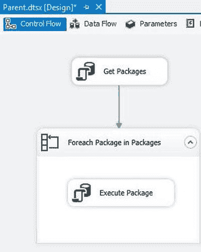

**图 2-3**. 父包控制流

### 构建执行元数据

返回到 `SSMS`。让我们为简单的执行框架提供要执行的元数据。执行清单 2-8 中的 T-SQL 语句。

**清单 2-8**. 为 SSIS 应用程序构建元数据

```
Use SSISDB
Go

Set NoCount On

Declare @ApplicationName nvarchar(256)
Declare @ApplicationDescription nvarchar(512)
Declare @ApplicationID int
Declare @FolderName nvarchar(256)
Declare @ProjectName nvarchar(256)
Declare @PackageName nvarchar(256)
Declare @PackageDescription nvarchar(512)
Declare @PackageID int
Declare @ExecutionOrder int
Declare @ApplicationPackageEnabled bit
Declare @ApplicationTbl table(ApplicationID int)
Declare @PackageTbl table(PackageID int)

begin tran

-- Build Application --
Select @ApplicationName = 'TestSSISApp'
      ,@ApplicationDescription = 'A test SSIS application'

Insert Into @ApplicationTbl
Exec custom.AddApplication
  @ApplicationName
 ,@ApplicationDescription

Select @ApplicationID = ApplicationID
 From @ApplicationTbl

-- Build Package --
Select @FolderName = 'Chapter2'
      ,@ProjectName = 'Chapter2'
      ,@PackageName = 'Chapter2.dtsx'
      ,@PackageDescription = 'A test SSIS package'

Insert Into @PackageTbl
Exec custom.AddPackage
  @FolderName
 ,@ProjectName
 ,@PackageName
 ,@PackageDescription

Select @PackageID = PackageID
 From @PackageTbl

-- Build ApplicationPackage --
Select @ExecutionOrder = 10
       ,@ApplicationPackageEnabled = 1

Exec custom.AddApplicationPackage
   @ApplicationID
  ,@PackageID
  ,@ExecutionOrder
  ,@ApplicationPackageEnabled

Delete @PackageTbl

-- Build Package --
Select @FolderName = 'Chapter2'
      ,@ProjectName = 'Chapter2'
      ,@PackageName = 'Chapter2.dtsx'
      ,@PackageDescription = 'Another test SSIS package'

Insert Into @PackageTbl
Exec custom.AddPackage
  @FolderName
 ,@ProjectName
 ,@PackageName
 ,@PackageDescription

Select @PackageID = PackageID
 From @PackageTbl

-- Build ApplicationPackage --
Select @ExecutionOrder = 20
       ,@ApplicationPackageEnabled = 1

Exec custom.AddApplicationPackage
   @ApplicationID
  ,@PackageID
  ,@ExecutionOrder
  ,@ApplicationPackageEnabled

Delete @PackageTbl

Commit
```

清单 2-8 中的 T-SQL 在执行框架中构建了一个简单的 SSIS 应用程序。它调用了我们的 `Chapter2.dtsx` SSIS 包两次。如果你回到 `SSDT-BI` 并执行父包，你会注意到 `Chapter2.dtsx` SSIS 包快速连续执行了两次。你可以在图 2-4 中看到该执行情况。


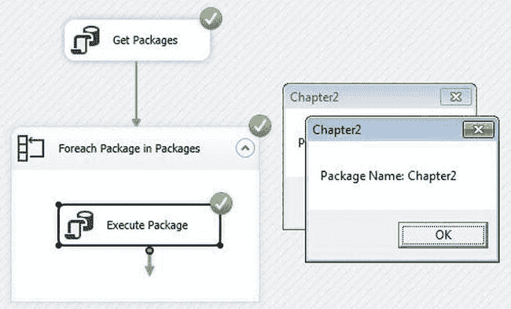

图 2-4. `Chapter2.dtsx` 无需等待执行两次

理解该框架采用“即发即弃”的设计至关重要。图 2-4 中的截图显示 `Chapter2.dtsx` 的两个实例都显示了它们各自的消息框，而后台任务已经完成。如果你的 SSIS 包能够并行执行，这种方法效果很好。但如果包之间存在依赖关系呢？这个框架并不便于执行有依赖关系的包，但我会在下一节向你展示一种将框架与 SQL Server Agent 作业计划程序耦合的方法。这种耦合将允许你为流程的每个“步骤”执行父包，每一步调用一个 SSIS 应用程序，并进而并行调用一个或多个 SSIS 包。

 **注意** 附录 A 包含了构建一个串行 SSIS 框架的信息，该框架最初是为 SSIS 2005 构建的。如果你使用包部署模型，它在 SSIS 2014 中同样适用。

### 计划 SSIS 包执行

市场上有许多商业化的软件执行计划程序。它们从相对简单到高度复杂不等，支持基于时间或事件的执行。许多计划程序包含元数据收集功能，用于跟踪执行时间等指标。SQL Server Agent 是随 SQL Server 附带的一个相当强大的作业计划应用程序。我们将使用 SQL Server Agent 来计划我们的演示包的执行。

 **警告** 在继续之前，请将 `Chapter2` 项目部署到 SSIS 目录。这样做将部署 `Chapter2.dtsx` 和 `Parent.dtsx`。

#### 计划 SSIS 包

打开 SSMS 并连接到 SQL Server 2014 实例。如果可能，打开对象资源管理器并展开 SQL Server Agent 节点。为什么展开 SQL Server Agent 节点可能不可行？默认情况下，SQL Server Agent 安装为手动启动服务。

右键单击 `Jobs` 虚拟文件夹，然后单击新建  作业。当“新建作业”窗口显示时，将作业命名为 `Ch2`。单击“步骤”页面，然后单击“新建”按钮。将新步骤命名为 `执行第 2 章包`，并从“类型”下拉列表中选择“SQL Server Integration Services 包”。

从下拉列表中选择一个“包源”。选项如下：

*   SQL Server
*   文件系统
*   SSIS 包存储区
*   SSIS 目录

让我们计划一个来自目录的 SSIS 包作为开始。在“服务器”下拉框中键入 `localhost` 或包含 SSIS 目录的 SSIS 服务器的名称。单击“包”文本框旁边的省略号 (...)，然后导航到演示包 `Chapter2.dtsx`，如图 2-5 所示。

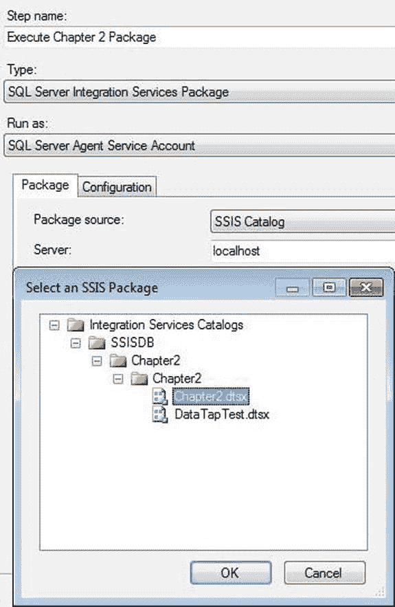

图 2-5. 配置 SQL Server Agent 作业以执行 SSIS 目录中的 SSIS 包

单击“确定”按钮将完成包选择过程。

#### 计划文件系统中的包

要计划存储在文件系统中的包，请在“包源”下拉列表中选择“文件系统”。单击“包”文本框旁边的省略号 (...)，然后导航到所需的 SSIS 包文件。配置完成后，步骤将如图 2-6 所示。

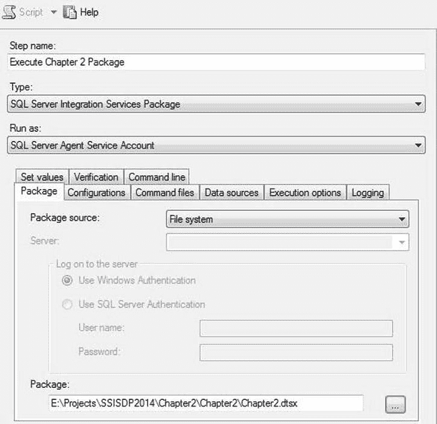

图 2-6. 配置为从文件系统执行 SSIS 包的 SQL Server Agent 作业步骤

你可以通过右键单击 SSMS 中的作业名称，然后单击“启动作业在步骤”来测试作业。但作业执行可能会失败。为什么？因为 `Chapter2.dtsx` 包显示一个消息框，而 SQL Server Agent 作业通常由服务账户启动，服务账户不允许显示消息框。如果你的 SQL Server Agent 服务是由用户账户（或任何具有 `InteractWithDesktop` 角色的账户）启动的，情况则不同。这将在下一节进一步讨论。

#### 使用自定义执行框架运行 SQL Server Agent 作业

我们可以使用我们的自定义执行框架来运行 SQL Server Agent 作业。为此，创建一个新的名为 `框架执行` 的 SQL Server Agent 作业。在“步骤”页面，添加一个名为 `TestSSISApp 框架执行` 的新步骤。选择“SSIS 包步骤”类型，并接受“包源”属性的默认值“SSIS 目录”。在“服务器”下拉框中输入或选择你的服务器名称，然后单击“包”文本框旁边的省略号 (...) 以打开“选择 SSIS 包”窗口。导航到 `Parent.dtsx` SSIS 包，然后单击“确定”按钮。

单击“新建作业步骤”窗口上的“配置”选项卡。包参数 `ApplicationName` 应出现在“参数”列表中。要为此参数输入值，请单击“值”文本框旁边的省略号 (...)，然后输入 `TestSSISApp`。单击“确定”按钮关闭并保存“新建作业步骤”窗口，然后再次单击“确定”按钮关闭并保存“新建作业”窗口。

要进行测试，请右键单击框架执行 SQL Server Agent 作业，然后单击“启动作业在步骤”。SQL Server Agent 作业将执行并成功，但我有个坏消息：包执行将会失败。我能听到你在想，“等等，什么？” 我没开玩笑。还记得这是一个“即发即弃”的执行框架吗？这个事实在这里——以及在 SSIS 执行的其他地方——困扰着我们。你最好现在就意识到这一点——相信我。另一种获得这个知识的方式涉及与你的老板（或更糟，你的客户）争论“作业成功了！”，但你却是错的。

你怎么知道包执行失败了？让我们去看看。在 SSMS 对象资源管理器中展开 Integration Services 目录的虚拟文件夹。右键单击 `SSISDB` 并悬停在“报表”上，然后是“标准报表”，再单击“Integration Services 仪表板”。如果你遵循了我的指示，你将在“失败”一词上方看到一个大的、微红色的“2”。如果你单击“2”，报表将带你到一个包含失败执行列表的页面。如果你然后单击“所有消息”链接，你将看到一条错误消息，通知你脚本任务遇到了错误 (`Exception has been thrown by the target of an invocation`)。该消息意味着（除其他外）你在脚本任务中使用了消息框。不，我不是在编造。

 **注意** “消息框不好吗？” 绝对不是！事实上，它们是在 SSIS 中对某一类错误进行故障排除的唯一方法。我一直在使用它们，但我限定消息框调用在 If/Then 语句中执行。如果你不这样做，消息框调用将会执行，并导致 SQL Server Agent 作业要么失败，要么在执行成功方面对你撒谎。

并非全无希望。这里的问题是服务账户为执行提供了安全上下文。用于启动 SQL Server Agent 服务的账户是从 SQL Server Agent 作业执行包时使用的账户。该账户通常没有分配 `InteractWithDesktop` 角色，而且你必须承认——桌面对于显示消息框来说很方便。需要注意的是：你不能在 SSIS 包中包含未经限定的消息框显示调用。使用参数或变量（我使用一个名为 `Debug` 的变量）并确保其值在包外部，这样你就可以在*想要*显示消息框时打开和关闭它。


你也可以从 SSIS 目录执行`Parent.dtsx`包。在 SSMS 对象资源管理器中，继续展开 Chapter2 文件夹。打开“项目”，然后是 Chapter2，再是“包”，右键单击`Parent.dtsx`包。单击“执行”，并为`ApplicationName`参数提供`TestSSISApp`值。单击“确定”按钮后，包将执行，两个消息框会出现。为什么呢？因为你不再是以启动 SQL Server Agent 服务的服务账户的安全上下文运行；你是在连接 SSMS 对象资源管理器时使用的安全上下文中运行。这很可能是一个使用 Windows 身份验证和个人凭据的域账户或计算机账户。如果你一直在监视桌面，那么你（以及域或计算机中的所有其他用户）就被分配了`InteractWithDesktop`角色。但几乎所有的服务账户都不参与`InteractWithDesktop`角色。

### 使用 SQL Server Agent 运行自定义执行框架

你可以使用自定义执行框架运行 SQL Server Agent 作业。只是无法弹出消息框。例如，你可以为流程中的每个“步骤”创建一个 SSIS 应用程序。该 SSIS 应用程序可以包含能并行执行的 SSIS 包。然后，你构建一个包含多个作业步骤的 SQL Server Agent 作业——每个 SSIS 应用程序对应一个步骤。SQL Server Agent 作业按顺序执行其步骤，默认情况下等待一个步骤成功后再开始下一个。

大多数数据仓库需要一个提取步骤，将所有数据（来自维度和事实源）暂存到一个暂存数据库中。接着，维度数据被加载到数据仓库中。最后，事实数据从暂存数据库加载到数据仓库中。

操作的优先级如下：提取事实和提取维度可以同时（并行）运行。你可以为每个维度表和事实表提取操作设计一个包，将它们添加到提取 SSIS 应用程序中，并将该 SSIS 应用程序作为数据仓库 ETL 作业的步骤 1 执行。完成后，步骤 2 可以从暂存数据库加载维度数据到数据仓库。完成后，步骤 3 可以从暂存数据库加载事实数据到数据仓库。因此，虽然相对简单且有些局限，但我们的自定义执行框架可以促进可配置的并行和串行 ETL 操作。

### 执行包任务

执行包任务最好通过实际操作来理解。为了演示，请创建一个新的 SSIS 包并将其重命名为`Parent2.dtsx`。向控制流中添加一个执行包任务。打开编辑器，观察 ReferenceType 属性的选择，如图 2-7 所示。

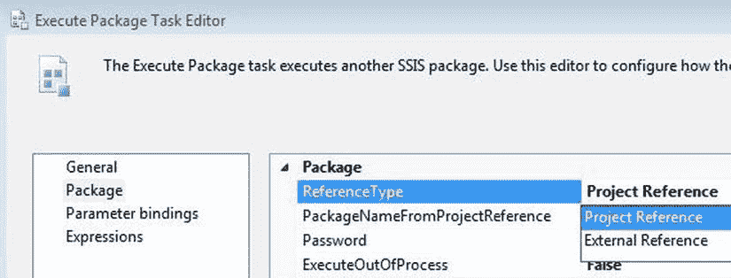

图 2-7. 执行包任务引用属性

如果 ReferenceType 包设置为“项目引用”，则执行包任务可用于启动 SSIS 项目中的包，支持项目部署模型。将此属性设置为“外部引用”允许执行存储在 MSDB 数据库或文件系统中的 SSIS 包，支持包部署模型。图 2-8 显示了配置为执行`Chapter2.dtsx`包的执行包任务。

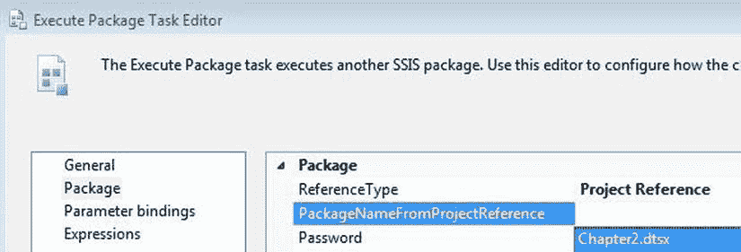

图 2-8. 选择项目引用包

选择包后，你可以关闭编辑器。通过在 SSIS 调试器中执行`Parent2.dtsx`来测试它。

### 元数据驱动执行

我已经使用了本章列出的所有 SSIS 包执行方法。它们各有优缺点。那么，你如何选择使用哪种方法呢？这是一个极好的问题，我很高兴你问到！我会考虑以下几点：

*   **故障排除：** 在未来的某个时候，总会有人需要弄清楚一个包为什么执行失败。便于故障排除不应该是在数据集成开发项目末尾才考虑的事情；你需要提前考虑。它和安全性一样重要。我为每个企业选择支持故障排除的 SSIS 包执行方法。
*   **代码维护：** SSIS 项目未来可能会被修改。这意味着包、项目和执行方法都需要有文档记录。这也意味着我需要考虑维护这段代码的个人或团队的技能和舒适度。如果个人或团队是熟练的.NET 开发人员，对于复杂操作，我倾向于使用脚本任务和组件。如果情况确实如此，我也会尝试使用他们选择的.NET 语言进行开发。如果他们是以数据库管理员的身份接触到 SSIS 的，那么在开发解决方案时，我会在执行 SQL 任务和 OLE DB 源适配器中使用更多的 T-SQL。如果他们有 DTS、SSIS 或其他 ETL 开发平台的经验，我会稍微调整开发包的方式以匹配他们的舒适区。同样，这因企业而异。
*   **企业需求：** 我经常在企业中遇到“最佳实践”。我给这些术语加上引号，因为，嗯，其中一些实际上并非最佳。它们的存在是因为发生了不好的事情，有人做出了反应。有时从 SSIS 的角度来看，这些反应是有道理的；有时它们是让 SSIS 开发人员烦恼的安全问题；有时它们对任何人都没有真正的好处。
*   **复杂性：** 我不喜欢复杂的解决方案。如果它们是完成所需工作的唯一方法，我可以容忍，但我努力保持解决方案尽可能简单。更少的活动部件意味着更少的故障点、更少的排查点和更少的维护点。话虽如此，灵活性和复杂性通常是成正比的。这意味着高度灵活的解决方案很可能是复杂的解决方案。

我在这里写下这些，特别是关于复杂性的要点，是为了介绍从托管代码执行。复杂性是从.NET 执行 SSIS 的唯一缺点。从托管代码执行 SSIS 提供了最大的灵活性：只要你想得到，你就能在.NET 中找到构建它的方法。在我看来，对于微软技术领域内的数据集成开发人员来说，掌握一门.NET 语言已不再是可选项了。

### 从托管代码执行

从.NET 托管代码执行 SSIS 包有诸多（或者如果你喜欢，叫“吨”）好处。以其他方式执行 SSIS 存在各种限制。毫无例外，它们都可以通过从.NET 控制执行来克服。在本节中，我们将演示使用 VB.NET 执行 SSIS 包的基础知识。

#### 演示应用程序

对于此演示，我使用了 Visual Basic 2013 和.NET Framework 4.5.1。我从`www.microsoft.com/en-us/download/details.aspx?id=40787`下载了一份副本。除非另有说明，我接受了 Visual Studio 2013 集成开发环境（IDE）中 VB 应用程序的默认设置。

首先，在 Visual Studio 2013 中创建一个新的 VB Windows 窗体项目。添加对以下程序集的引用：

*   `Microsoft.SqlServer.ConnectionInfo`
*   `Microsoft.SqlServer.DTSRuntimeWrap`
*   `Microsoft.SqlServer.Management.IntegrationServices`
*   `Microsoft.SqlServer.Management.Sdk.Sfc`
*   `Microsoft.SqlServer.Smo`

你需要在全局程序集缓存（GAC）中搜索`Microsoft.SqlServer.Management.IntegrationServices`和`Microsoft.SqlServer.SMO`。GAC 位于 Windows\Assembly 文件夹中，这些库在 MSIL 文件夹里。向 Visual Studio 项目添加引用时，单击“浏览”。

#### frmMain 窗体


将 `frmMain` 重命名。在窗体上添加两个 `GroupBox` 控件，如 图 2-9 所示上下排列。将顶部组框的 `Text` 属性更改为 `文件系统中的 SSIS 包`，将底部组框的 `Text` 属性更改为 `目录中的 SSIS 包`。在顶部组框中，添加一个标签、一个文本框和两个按钮。将标签的 `Text` 属性更改为 `包路径`。将其中一个按钮命名为 `btnOpenSSISPkg`，并将其 `Text` 属性更改为 `...`。将另一个按钮命名为 `btnStartFile`，并将其 `Text` 属性设置为 `开始`。

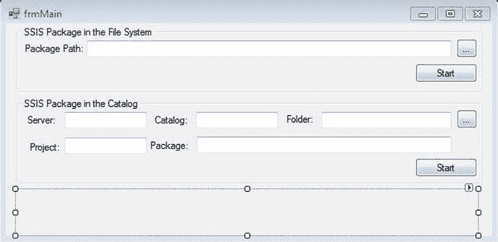

图 2-9. `frmMain` 控件布局

在 `目录中的 SSIS 包` 组框中，添加五个标签、五个文本框和两个按钮。将标签的 `Text` 属性更改为 `服务器:`、`目录:`、`文件夹:`、`项目:` 和 `包:`。将每个文本框定位在对应标签的右侧，并分别命名为 `txtSSISCatalogServer`、`txtCatalog`、`txtFolder`、`txtCatalogProject` 和 `txtCatalogPackage`。将其中一个按钮命名为 `btnOpenSSISPkgInCatalog`，并将其 `Text` 属性设置为 `...`。将另一个按钮命名为 `btnStartCatalog`，并将其 `Text` 属性设置为 `开始`。

在 `目录中的 SSIS 包` 组框下方添加一个文本框。将其命名为 `txtStatus`，将 `MultiLine` 属性设置为 `True`，`BackColor` 设置为 `ButtonFace`，并将 `BorderStyle` 设置为 `None`。控件的位置应与 图 2-9 所示类似。最后，向窗体添加一个 `FileOpenDialog` 控件，保留其默认配置。

### 实现辅助器模式

我最初是在担任软件开发人员时接触设计模式的，这大概不会让任何人感到惊讶。我在本应用程序中使用的模式使窗体背后的代码量最少。窗体中的代码调用特定于窗体的模块中的代码。您可以通过在解决方案资源管理器中右键单击 `frmMain` 并选择查看代码来查看 `frmMain` 的代码。用以下代码替换显示的代码：

```
'
' frmMain 代码
'
' 在开发界面时，我使用一种辅助器模式。
' 每个窗体命名为 frm_____，并且有一个对应的模块命名为 frm_____Helper.vb。
' 每个事件方法都调用辅助器模块中的一个子程序。
'

Public Class frmMain

Private Sub frmMain_Load(ByVal sender As System.Object, ByVal e As System.EventArgs) _ Handles MyBase.Load
        InitFrmMain()
    End Sub

Private Sub btnStartFile_Click(ByVal sender As System.Object, _
                                ByVal e As System.EventArgs) Handles btnStartFile.Click
        btnStartFileClick()
    End Sub

Private Sub btnOpenSSISPkg_Click(ByVal sender As System.Object, _
                                  ByVal e As System.EventArgs) Handles _ btnOpenSSISPkg.Click
        btnOpenSSISPkgClick()
    End Sub

Private Sub btnStartCatalog_Click(ByVal sender As System.Object, _
                                   ByVal e As System.EventArgs) Handles _ btnStartCatalog.Click
        btnStartCatalogClick()
    End Sub

Private Sub btnOpenSSISPkgInCatalog_Click(ByVal sender As System.Object, _
                                           ByVal e As System.EventArgs)         Handles _ btnOpenSSISPkgInCatalog.Click
        btnOpenSSISPkgInCatalogClick()
    End Sub
End Class
```

同样，窗体背后的代码很少。大部分实际工作是在别处完成的。现在让我们构建那部分。

### 创建辅助器模块

向解决方案添加一个模块并命名为 `frmMainHelper`。将以下代码添加到新模块：

```
'
' frmMainHelper 模块
'
' 在开发界面时，我使用一种辅助器模式。
' 每个窗体命名为 frm_____，并且有一个对应的模块命名为 frm_____Helper.vb。
' 每个事件方法都调用辅助器模块中的一个子程序。
'
' 此模块支持 frmMain。
'
Imports System
Imports System.Windows
Imports System.Windows.Forms
Imports Microsoft.SqlServer.Dts.Runtime.Wrapper
Imports Microsoft.SqlServer.Management.IntegrationServices
Imports Microsoft.SqlServer.Management.Smo

Module frmMainHelper

Public Sub InitFrmMain()

' 初始化并加载 frmISTree

' 定义版本
        Dim sVer As String = System.Windows.Forms.Application.ProductName & "  v" & _
        System.Windows.Forms.Application.ProductVersion

' 显示版本和启动状态
        With frmMain
            .Text = sVer
            .txtStatus.Text = sVer & ControlChars.CrLf & "就绪"
        End With

End Sub

Public Sub btnStartFileClick()

' 配置一个 SSIS 应用程序并执行选定的 SSIS 包文件

With frmMain
            .Cursor = Cursors.WaitCursor
            .txtStatus.Text = "正在执行 " & .txtSSISPkgPath.Text
            .Refresh()
            Dim ssisApp As New Microsoft.SqlServer.Dts.Runtime.Wrapper.Application
            Dim ssisPkg As Package = ssisApp.LoadPackage(.txtSSISPkgPath.Text, _
            AcceptRejectRule.None, Nothing)
            ssisPkg.Execute()
            .Cursor = Cursors.Default
            .txtStatus.Text = .txtSSISPkgPath.Text & " 已执行。"
        End With

End Sub

Public Sub btnOpenSSISPkgClick()

' 允许用户导航到 SSIS 包文件

With frmMain
            .OpenFileDialog1.DefaultExt = "dtsx"
            .OpenFileDialog1.ShowDialog()
            .txtSSISPkgPath.Text = .OpenFileDialog1.FileName
            .txtStatus.Text = .txtSSISPkgPath.Text & " 包路径已加载。"
        End With

End Sub

Sub btnOpenSSISPkgInCatalogClick()

' 允许用户导航到存储在目录中的 SSIS 包

frmISTreeInit()

Dim sTmp As String = sFullSSISPkgPath
        Dim sServerName As String = Strings.Left(sTmp, Strings.InStr(sTmp, ".") - 1)
        Dim iStart As Integer = Strings.InStr(sTmp, ".") + 1
        Dim iEnd As Integer = Strings.InStr(sTmp, "\")
        Dim iLen As Integer
        Dim sCatalogName As String
        Dim sFolderName As String
        Dim sProjectName As String
        Dim sPackageName As String

If iEnd > iStart Then
            iLen = iEnd - iStart
            sCatalogName = Strings.Mid(sTmp, iStart, iLen)
            sTmp = Strings.Right(sTmp, Strings.Len(sTmp) - iEnd)

iStart = 1
            iEnd = Strings.InStr(sTmp, "\")
            If iEnd > iStart Then
                iLen = iEnd - iStart
                sFolderName = Strings.Mid(sTmp, iStart, iLen)
                sTmp = Strings.Right(sTmp, Strings.Len(sTmp) - iEnd)

iStart = 1
                iEnd = Strings.InStr(sTmp, "\")
                If iEnd > iStart Then
                    iLen = iEnd - iStart
                    sProjectName = Strings.Mid(sTmp, iStart, iLen)
                    sTmp = Strings.Right(sTmp, Strings.Len(sTmp) - iEnd)
                    sPackageName = sTmp
                End If
            End If
        End If

With frmMain
            .txtSSISCatalogServer.Text = sServerName
            .txtCatalog.Text = sCatalogName
            .txtFolder.Text = sFolderName
            .txtCatalogProject.Text = sProjectName
            .txtCatalogPackage.Text = sPackageName
            .txtStatus.Text = sFullSSISPkgPath & " 元数据已加载并解析。"
        End With

End Sub

Sub btnStartCatalogClick()

' 配置一个 SSIS 应用程序并从目录执行选定的 SSIS 包


### 执行 SSIS 包

### 从文件系统执行

```
With frmMain
            .Cursor = Cursors.WaitCursor
            .txtStatus.Text = "Loading " & sFullSSISPkgPath
            .Refresh()
            Dim oServer As New Server(.txtSSISCatalogServer.Text)
            Dim oIS As New IntegrationServices(oServer)
            Dim cat As Catalog = oIS.Catalogs(.txtCatalog.Text)
            Dim fldr As CatalogFolder = cat.Folders(.txtFolder.Text)
            Dim prj As ProjectInfo = fldr.Projects(.txtCatalogProject.Text)
            Dim pkg As PackageInfo = prj.Packages(.txtCatalogProject.Text)
            .txtStatus.Text = sFullSSISPkgPath & " loaded. Starting validation..."
            .Refresh()
            pkg.Validate(False, PackageInfo.ReferenceUsage.UseAllReferences, Nothing)
            .txtStatus.Text = sFullSSISPkgPath & " validated. Starting execution..."
            .Refresh()
            pkg.Execute(False, Nothing)
            .txtStatus.Text = sFullSSISPkgPath & " execution started."
            .Cursor = Cursors.Default
        End With
End Sub
End Module
```

我们来逐步分析这段在文件系统中执行 SSIS 包的代码。在图 2-9 中，我们查看的是上部组合框中表示的功能。

该应用程序的工作流程是：用户要么在文件系统中输入 SSIS 包的完整路径，要么点击省略号浏览到 SSIS 包（`.dtsx`）文件。选择文件后，完整路径将显示在“包路径”文本框中。要执行包，请单击“文件系统中的 SSIS 包”组合框中的“开始”按钮。当单击“开始”按钮时，将执行 `btnStartFile_Click` 子例程中的窗体代码，它会执行一行调用 `frmMainHelper` 模块中 `btnStartFileClick` 子例程的代码。

`btnStartFileClick` 子例程首先将窗体光标更改为 `WaitCursor`。接下来，它更新 `txtStatus` 文本框以显示文本 "Executing" 后跟“包路径”文本框中 SSIS 包的完整路径。`Refresh` 语句使窗体更新，显示 `WaitCursor` 和 `txtStatus` 中的消息。然后，代码创建 SSIS 应用程序实例（`Microsoft.SqlServer.Dts.Runtime.Wrapper.Application`），形式为 `ssisApp` 变量。`ssisPkg` 是 SSIS 包对象的实例，通过调用 SSIS 应用程序对象（`ssisApp`）的 `LoadPackage` 方法创建。我们使用包对象的 `Execute` 方法来启动 SSIS 包。子例程的剩余部分重置窗体光标并更新 `txtStatus` 消息以指示包已执行。

如果我为生产环境加固此代码，我会将这个子例程中的大部分代码包装在一个大的 `Try-Catch` 块中。在 `Catch` 部分，我会重置光标并用错误消息更新 `txtStatus`。我非常喜欢日志记录。在生产加固版本中，我会记录执行包的意图，并包含“包路径”文本框中显示的完整路径。我还会记录尝试执行的结果，无论成功还是失败。

### 从 SSIS 目录执行

执行存储在 SSIS 目录中的 SSIS 包的代码位于 `frmMainHelper` 模块的 `btnStartCatalogClick` 子例程中。管理光标和向 `txtStatus` 文本框发送消息的代码与 `btnStartFileClick` 子例程中的代码相当。

存储在 SSIS 目录中的 SSIS 包有更多的活动部件，如图 2-10 所示。

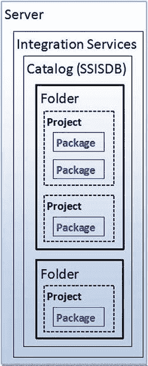
*图 2-10. SSIS 目录的表示*

Integration Services 由一个服务器包含，反过来，它又包含一个目录。在 SQL Server 2014 中，Integration Services 包含一个名为 `SSISDB` 的单一目录。`SSISDB` 也是用于管理目录中 SSIS 元数据的数据库的名称。一个目录包含一个或多个文件夹。文件夹包含一个或多个项目，项目又包含一个或多个包。

在 `btnStartCatalogClick` 子例程中，代码为这个层次结构中的对象声明变量（使用 `Dim` 语句），并根据五个文本框中提供的名称设置它们的值：`txtSSISCatalogServer`、`txtCatalog`、`txtFolder`、`txtCatalogProject` 和 `txtCatalogPackage`。通过将文本框的名称与图 2-10 进行比较，您可以看到，存储在目录中的 SSIS 包可以使用这个层次结构唯一标识。这些文本框是如何填充的？用户可以手动输入信息。但该应用程序包含第二个窗体，由“SSIS 目录中的包”组合框中的省略号启动，以方便 SSIS 目录导航。

要构建它，请向应用程序添加第二个窗体并将其命名为 `frmISTree`。在窗体顶部附近添加一个 `GroupBox` 控件。将组合框的 `Text` 属性更改为 **连接**。向组合框中添加一个标签、一个文本框和一个按钮。将标签的 `Text` 属性更改为 **服务器:**。将文本框命名为 `txtServer`。将按钮命名为 `btnConnect`，并将其 `Text` 属性更改为 **连接**。在窗体下部添加一个 `TreeView` 控件，并将其命名为 `tvCatalog`。在树视图下方添加一个按钮，将其命名为 `btnSelect`，并将其 `Text` 属性更改为 **选择**。添加一个 `ImageList` 控件，并将其命名为 `ilSSDB`。您需要自己准备图片或下载包含我用于树视图节点级别的四张图片的演示项目。将树视图的 `ImageList` 属性设置为 `ilSSDB`。窗体应如图 2-11 所示。

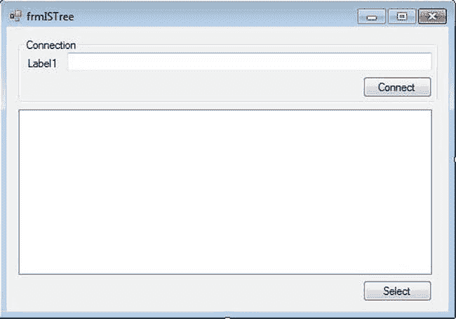
*图 2-11. ISTree 窗体*

将窗体背后的代码替换为以下代码：

```
'
' frmISTree 代码
'
' 我在开发界面时使用助手模式。
' 每个窗体命名为 frm_____，并且有一个对应的模块命名为 frm_____Helper.vb。
' 每个事件方法都调用助手模块中的一个子例程。
'
Public Class frmISTree

    Private Sub btnConnect_Click(ByVal sender As System.Object, _
                                 ByVal e As System.EventArgs) Handles btnConnect.Click
        btnConnectClick()
    End Sub

    Private Sub btnSelect_Click(ByVal sender As System.Object, _
                                ByVal e As System.EventArgs) Handles btnSelect.Click
        btnSelectClick()
    End Sub

    Private Sub tvCatalog_AfterSelect(ByVal sender As System.Object, _
                                      ByVal e As System.Windows.Forms.TreeViewEventArgs) _
        Handles tvCatalog.AfterSelect

    End Sub

    Private Sub tvCatalog_DoubleClick(ByVal sender As Object, _
                                      ByVal e As System.EventArgs) _
        Handles tvCatalog.DoubleClick
        tvCatalogDoubleClick()
    End Sub
End Class
```

同样，这段代码仅仅指向助手模块，在本例中是 `frmISTreeHelper`。添加一个新模块，命名为它，并用以下代码替换：

```
'
' frmISTreeHelper 模块
'
' 我在开发界面时使用助手模式。
' 每个窗体命名为 frm_____，并且有一个对应的模块命名为 frm_____Helper.vb。
' 每个事件方法都调用助手模块中的一个子例程。
'
' 此模块支持 frmISTree。
'

Imports Microsoft.SqlServer.Management.IntegrationServices
Imports Microsoft.SqlServer.Management.Smo

Module frmISTreeHelper

    ' 变量
    Public sFullSSISPkgPath As String

    Sub frmISTreeInit()
        ' 初始化并加载 frmISTree
```


使用 `frmISTree`
    `.Text` = "Integration Services"
    `.txtServer.Text` = "localhost"
    `.ShowDialog()`
End With

End Sub

Sub `btnConnectClick()`
' 连接到 txtServer 文本框中指示的服务器
' 接入 SSISDB 目录
' 通过迭代存储在其中的对象来构建 SSISDB 节点
' 加载节点并显示它

With `frmISTree`
    Dim `oServer` As New `Server(.txtServer.Text)`
    Dim `oIS` As New `IntegrationServices(oServer)`
    Dim `cat` As `Catalog` = `oIS.Catalogs("SSISDB")`
    Dim `L1Node` As New `TreeNode("SSISDB")`
    `L1Node.ImageIndex` = 0
    Dim `L2Node` As `TreeNode`
    Dim `L3Node` As `TreeNode`
    Dim `L4Node` As `TreeNode`

For Each `f` As `CatalogFolder` In `cat.Folders`
        `L2Node` = New `TreeNode(f.Name)`
        `L2Node.ImageIndex` = 1
        `L1Node.Nodes.Add(L2Node)`
        '.tvCatalog.Nodes.Add(L2Node)
        For Each `pr` As `ProjectInfo` In `f.Projects`
            `L3Node` = New `TreeNode(pr.Name)`
            `L3Node.ImageIndex` = 2
            `L2Node.Nodes.Add(L3Node)`
            '.tvCatalog.Nodes.Add(L3Node)
            For Each `pkg` As `PackageInfo` In `pr.Packages`
                `L4Node` = New `TreeNode(pkg.Name)`
                `L4Node.ImageIndex` = 3
                `L3Node.Nodes.Add(L4Node)`
                '.tvCatalog.Nodes.Add(L4Node)
            Next
        Next
    Next

`.tvCatalog.Nodes.Add(L1Node)`
End With

End Sub

Sub `btnSelectClick()`
' 如果图像索引级别指示为一个包，
' 则选择此节点，填充 sFullSSISPkgPath 变量，
' 并关闭窗体

With `frmISTree`
    If Not `.tvCatalog.SelectedNode` Is Nothing Then
        If `.tvCatalog.SelectedNode.ImageIndex` = 3 Then
`sFullSSISPkgPath` = `.txtServer.Text` & "." & _
`.tvCatalog.SelectedNode.FullPath`
            `.Close()`
        End If
    End If
End With

End Sub

Sub `tvCatalogDoubleClick()`
' 执行“选择”点击逻辑

With `frmISTree`
    `btnSelectClick()`
End With

End Sub

End Module
```

本模块中的所有操作都发生在填充 `TreeView` 控件 (`btnConnectClick`) 和选择节点 (`btnSelectClick`) 的子例程中。代码默认服务器名称为 "localhost"。用户可以在点击连接按钮前更改它。一旦点击按钮，代码就会调用 `btnConnectClick`。

`btnConnectClick` 子例程为模型中的 `Server`、`IntegrationServices` 和 `Catalog` 对象创建对象。接着，它从目录开始构建一个包含四级节点的层次结构。变量——`L1Node`、`L2Node`、`L3Node` 和 `L4Node`——分别代表该层次结构中的 `Catalog`（目录）、`Folder`（文件夹）、`Project`（项目）和 `Package`（包）级别。代码使用一系列嵌套的 `For Each` 循环来迭代 SSIS 目录，并在 `L1Node`（目录）下填充子节点，然后将 `L1Node` 添加到 `tvCatalog` 树视图中。

`btnSelectClick` 子例程构建一个字符串，该字符串表示目录层次结构中 SSIS 包的唯一路径。代码检查是否选择了节点，然后检查所选节点是否处于包级别。如果树视图一切正常，变量 `sFullSSISPkgPath` 将被填充为目录中 SSIS 包的路径。紧接着，`frmISTree` 窗体关闭。用户也可以双击树视图中的包节点来调用 `btnSelectClick` 子例程。

执行应用程序进行测试！您应该会看到如 图 2-12 所示的结果。

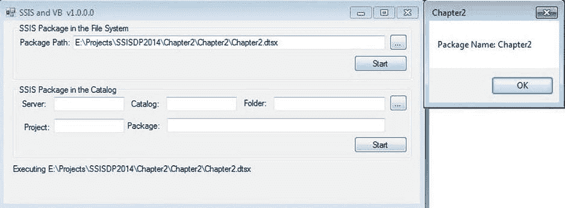

图 2-12. 从文件系统执行包

在 SSIS 目录中选择包的显示如 图 2-13 所示。

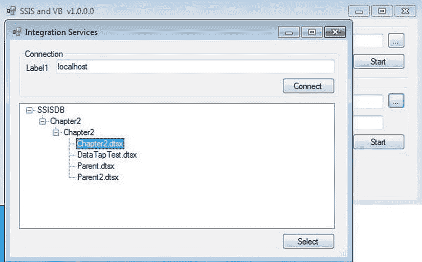

图 2-13. 在 SSIS 目录中选择包

执行从 SSIS 目录中选择的包，如 图 2-14 所示。

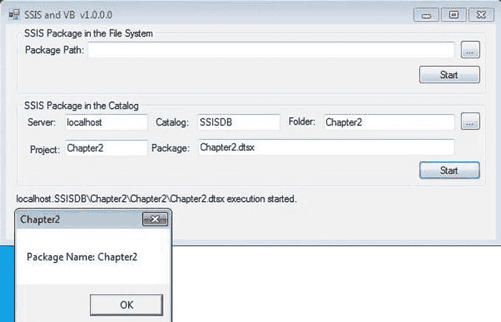

图 2-14. 执行存储在 SSIS 目录中的 SSIS 包

### 结论

在本章中，我们探讨了执行 SSIS 包的多种方法。我们研究了用于方便执行 SSIS 包的众多内置方法。然后，我们通过扩展 SSISDB 功能将事情提升了一个档次。最终，我们构建了一个简单但功能完整的自定义执行框架，并演示了如何将其与 SQL Server 代理作业的调度功能耦合，以生成一个支持并行/串行的自定义执行引擎。我们构建了一个 .NET 应用程序来演示从托管代码执行 SSIS 包的灵活性（和复杂性）。

# 第三章


### 脚本模式

正如本书通篇所示，SQL Server Integration Services (SSIS) 是一个具有多面性的产品，具备许多原生功能，可以处理最困难的数据挑战。凭借高度灵活的转换组件，如 `Lookup`（查找）、`Conditional Split`（条件拆分）、`Derived Column`（派生列）和 `Merge Join`（合并连接），数据流组件能够对传输中的数据执行无限数量的转换。在控制流方面，包括 `File System Task`（文件系统任务）、`For Each Loop`（For Each 循环）及其近亲 `For Loop`（For 循环）、`File System Task`（文件系统任务）和 `Data Profiling Task`（数据剖析任务）在内的工具，为支持基本的 ETL 操作提供了关键服务。开箱即用，您就拥有一个充满灵活且强大对象的工具箱。

然而，即使是最随意的 ETL 开发者最终也会遇到需要比原生组件提供更多灵活性的场景。处理数据移动和转换通常既繁琐又不可预测，并且需要一种难以内置于通用工具中的可扩展级别。幸运的是，对于这些不常见的 ETL 需求，有一个解决方案：自定义 .NET 脚本。

#### 工具集

SQL Server Integration Services 能够将非常强大的 ETL 逻辑直接构建到您的 SSIS 包中。通过 Visual Studio 及其各种便利功能（熟悉的开发环境、IntelliSense、基于项目的开发等），在 ETL 过程中嵌入自定义逻辑的负担大大减轻。

与其前身数据转换服务 (DTS) 不同，SQL Server Integration Services 在其脚本工具中公开了整个 .NET 运行时。不再要求仅在 ETL 包中使用 ActiveX 脚本（尽管 SSIS 中仍保留了此功能，适用于那些钟爱 VBScript 的人）。随着 SSIS 中丰富脚本环境的引入，您现在能够访问在“真实”软件开发中使用的相同框架特性。真正的面向对象开发、事件、正确的错误处理以及其他功能现在都可以在 SSIS 的自定义脚本中完全访问。

SQL Server Integration Services 包含两种在您的包中利用 .NET 代码的工具，每种都旨在实现不同类型的自定义行为。位于控制流工具箱中的 `Script Task`（脚本任务）是一个广泛的通用工具，旨在执行支持和管理任务。在数据流工具箱中，您会找到 `Script Component`（脚本组件），它是一个多功能且精确的数据移动和操作工具。


### SSIS 中的脚本工具：Script Task 与 Script Component

如果你刚接触 SSIS 中的脚本编写，可能会好奇为什么 SSIS 中有两个不同的脚本工具。更进一步，在给定场景下选择使用哪个工具，将成为关键的设计决策。简短的答案是？视情况而定。如前所述，`Script Task`通常是处理操作行为（与数据移动相对）的更好选择，最常用于影响整个包流程的操作。另一方面，如果你的 ETL 需求需要生成、消费或操作数据行，那么`Script Component`通常是更好的工具。

尽管它们的接口几乎相同，`Script Task`和`Script Component`在默认设计上却大相径庭。当你探索这些工具时，会发现将它们引入工作区时，脚本项目会自动添加大量代码。作为旨在直接进行数据交互的工具，`Script Component`会包含预配置的代码，用于定义输入和/或输出，以允许数据流经该组件。相比之下，内置在`Script Task`中的行为没有提供任何输入或输出的设施，进一步说明此工具并非为直接数据操作而构建。

`Script Task`和`Script Component`有许多相似之处。这两种工具都提供了一个类似于主流软件开发中熟悉的 Visual Studio 开发环境的脚本设计器。在这两种工具中，你会发现工作区被组织成一个虚拟解决方案（其显示方式与 Visual Studio 开发中的解决方案容器非常相似），其中可能包含多个文件和文件夹。这两个脚本工具的另一个共同点是，能够在虚拟解决方案中包含外部代码或服务。此功能允许你利用在其他地方已经编写和编译好的代码，无论是随项目包含的 DLL 文件，还是诸如 Web 服务之类的外部资源。两种工具中的语言行为将是相同的；诸如错误处理、编译器指令和核心框架功能等功能对于`Script Task`和`Script Component`来说都是通用的。

### 我该使用脚本吗？

在我们开始探索在 SSIS 中使用脚本的设计模式之前，应该回答一个基本问题：“我是否应该使用脚本工具？”

尽管我坚信使用 SSIS 中的脚本工具来解决难题，但在谈论或撰写此主题时，我几乎总是给出一条建议：**仅在现有工具无法轻松解决你所面临的问题的情况下，才使用`Script Task`或`Script Component`**。虽然你在灵活性上获益良多，但在将脚本实例部署到包中时，也会失去一些东西——例如设计时验证、易于重用性和 GUI 设置编辑器等。

请不要将此理解为脚本不好，或者它反映了糟糕的包设计（毕竟，本章描述的是使用脚本的推荐实践！）。事实上，恰恰相反——我遇到过许多情况，唯一能满足 ETL 需求的工具就是一个精心设计的脚本实例。关键在于，`Script Task`和`Script Component`是复杂的工具，旨在用于非典型情况。原生组件更易于使用和维护。在 SSIS 的一个或多个原生组件能够轻松处理任何 ETL 问题的情况下，不要通过用脚本重新发明轮子来使问题复杂化。

#### 脚本编辑器

尽管它们的用途大不相同，但`Script Task`和`Script Component`工具的脚本编辑器能提供相似的体验。两种工具的特点包括：

*   无处不在的代码窗口
*   项目资源管理器（`Project Explorer`）
*   完整的`.NET`运行时
*   编译器

我将在本章后面介绍在每种工具中编写代码的语义。现在，我将探讨`Script Task`和`Script Component`共有的一些其他功能。

#### 项目资源管理器

Visual Studio 中的软件开发元素存储在称为项目的逻辑组中。SQL Server Data Tools（`SSDT`）中的 Visual Studio 环境的行为方式也大致相同；如图 3-1 所示，给定脚本的文件在“项目资源管理器”窗口中表示。在同一图中，你可以看到该项目有一个相当长且任意的名称。这是一个系统生成的标识符，用于标识项目及其所在的命名空间，但如果你希望在脚本中采用更标准化的命名约定，可以更改它。

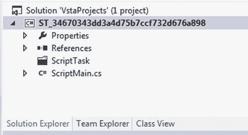

**图 3-1** `Script Task`项目资源管理器

值得指出的是，你在`Project Explorer`中创建的 C#和 VB.NET 代码文件并非物理地实现在你的项目中。相反，文件名仅用于在项目内逻辑分隔代码文件——代码本身以内联方式嵌入到包的 XML（dtsx 文件）中。

`Project Explorer`中还包含一个名为`References`的虚拟文件夹。在此文件夹中，你将找到脚本所需核心功能的程序集引用。此外，你可以将自己的引用添加到此列表中，以进一步扩展`Script Task`或`Script Component`的功能。

由于包中每个`Script Task`或`Script Component`实例都以 Visual Studio 项目的形式呈现，因此你对该项目的属性拥有大量的控制权。与功能齐全的软件开发项目非常相似，`Script Task`或`Script Component`的实例允许 ETL 开发人员控制各种行为参数，包括`.NET Framework`的版本、编译警告级别和程序集名称。项目属性窗口如图 3-2 所示，可以通过在`Project Explorer`中右键单击项目名称并选择“属性”来访问。但请记住，你所做的任何更改的范围仅限于你当前正在处理的那个`Script Task`或`Script Component`实例。

在实践中，很少需要修改`Script Task`或`Script Component`实例的项目级属性。在大多数情况下，默认的项目设置就足够了。

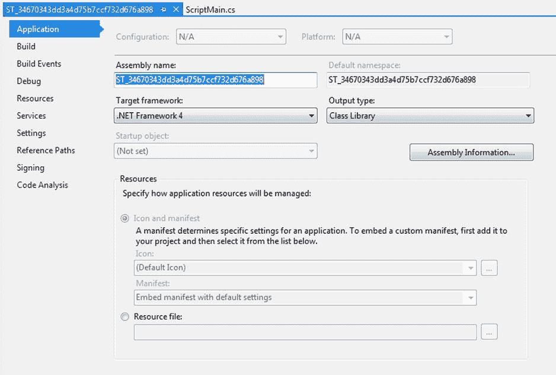

**图 3-2** `Script Task`项目属性

#### 完整的 .NET 运行时

SSIS 中的两种脚本工具都可以完全访问`.NET Framework`运行时内的对象、方法和事件。这种可访问性级别允许 ETL 开发人员利用现有的程序集——包括网络库、文件系统工具、高级数学运算和结构化错误处理等——作为其脚本的一部分。需要创建复杂的多维数组？寻找一种更简单的方法来执行字符串操作技巧？所有这些以及更多功能，在`.NET`运行时环境的底层都很容易访问。

#### 编译器

在代码中发现错误至关重要，而且通常在开发过程早期更容易做到。要了解这在 SSIS 脚本中如何工作，理解脚本开发的生命周期是很有用的。

### 脚本维护模式

当 SSIS 首次随 SQL Server 2005 出现时，ETL 开发人员可以选择将代码文本存储在 `脚本任务` 或 `脚本组件` 中，而无需实际构建（编译）脚本项目。通过选择不对脚本进行预编译，可以节省（或更具体地说，推迟）少量处理资源，因为 SSIS 设计环境会接受按原样编写的代码。这种行为引发了两个问题：首先，由于在包执行期间动态编译脚本，会带来轻微的性能损失；其次，由于设计器中的前期验证最小化，运行时错误的风险增加了。

从 SQL Server 2008 开始，脚本预编译成为必需。现在，当你编写脚本时，它会在后台进行编译，生成的二进制输出被序列化并内联存储在包 XML 中。一旦你修改脚本并关闭编辑器，就会调用 .NET 编译器并创建序列化的二进制数据。如果你在代码中犯了导致编译错误的错误，`脚本任务` 或 `脚本组件` 上将显示一个验证错误，指示找不到二进制代码（参见 图 3-3）。

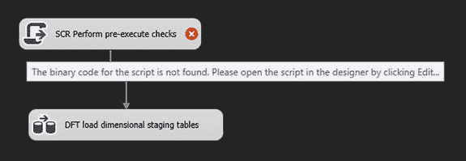

图 3-3. `脚本任务` 的编译错误

此验证步骤是一种安全机制，用于确保你的包不会在包含无法编译的代码的情况下部署。然而，也可以在脚本编辑器中从内部构建脚本项目，这样你就可以在关闭编辑窗口之前定期检查代码是否存在编译错误。在脚本编辑器的菜单栏中，你会发现 `生成`  `生成 [*脚本项目名称*]` 的选项，用于编译脚本项目中的所有代码。当你以这种方式生成项目时，编译过程中发现的任何错误都将在 `错误列表` 窗口中报告（图 3-4）。

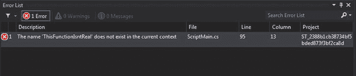

图 3-4. `错误列表`

`错误列表` 窗口中还包含编译器生成的任何警告；虽然它们不会阻止代码编译，但在将代码进一步推进开发流程之前，彻底审查此列表中出现的任何警告总是一个明智的做法。

#### 脚本任务

在控制流窗格中，用于编写自定义代码的工作区是 `脚本任务`。虽然从技术上讲它可以用于直接数据操作，但此工具最适用于支持使用原生控制流任务不易完成的操作。可以将 `脚本任务` 视为一个辅助对象，用于在包中将其他以数据为中心的操作连接在一起。

以下是 `脚本任务` 经常满足的一些需求：

*   检查源或目标文件的存在性和可访问性
*   使用文件归档实用程序 API 来压缩或解压缩文件
*   生成自定义事件消息（例如 HTML 格式的电子邮件）
*   设置变量值
*   在包完成或发生错误时执行清理操作
*   检查环境数据，例如可用磁盘空间、Windows 服务状态等

由于它并非为操作数据而设计，因此无需定义输入或输出元数据，这使得 `脚本任务` 相对容易配置。如 图 3-5 所示，此任务只有几个必需的配置元素：指定你要使用的编程语言，选择要在脚本中可见的变量，然后就可以开始编写代码了！

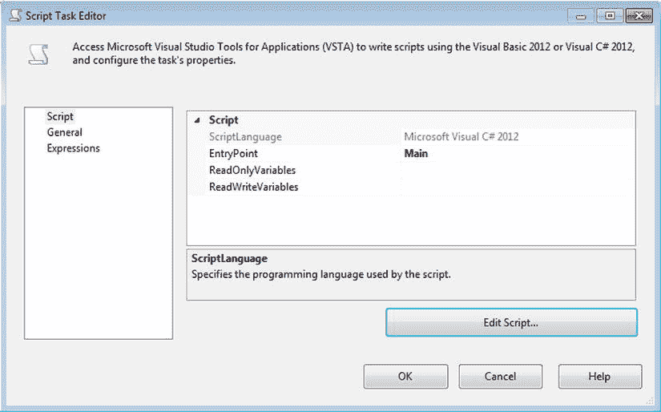

图 3-5. `脚本任务编辑器`

 `注意` 对于 `脚本任务` 和 `脚本组件`，选择使用 `C#` 或 `VB.NET` 的决定应被视为永久性的。一旦你选择了语言并打开了脚本编辑器，语言选择器就会被禁用。此行为是设计使然；尽管两种语言都编译为相同的中间语言 (`MSIL`) 代码，但任何工具都难以将一种语言的源代码转换为另一种语言。这两种工具的默认语言都是 `C#`，因此偏好 `VB.NET` 的用户必须更改 `ScriptLanguage` 属性。

一旦语言和变量设置完毕，就可以打开代码编辑器了。当你单击 `编辑脚本` 按钮时，将会看到熟悉的 Visual Studio 开发环境。如果你过去曾使用此 IDE 编写过代码（用于开发 Windows 应用程序、Web 应用程序等），你会认出许多实体——`解决方案资源管理器`、代码窗口、属性窗口以及许多其他常见组件。尽管在这个精简版的 Visual Studio 中行为会有所不同，但概念保持不变。

#### 脚本组件

尽管两种 SSIS 脚本工具有相似的属性，但它们扮演着非常不同的角色。与主要用于管理和操作可编程性的 `脚本任务` 不同，`脚本组件` 专为 ETL 中更传统的活动部分而设计：从源检索数据，对所述数据执行某种转换或验证，以及将数据加载到目标。

`脚本组件` 的常见用途包括：

*   连接到没有原生源组件的源数据
*   将数据发送到不提供原生目标或结构与典型表布局不同的目标
*   执行需要内置 SSIS 转换未提供的功能的高级数据操作
*   对管道中数据进行复杂的拆分、筛选或聚合

`脚本组件` 构建时具有多功能性，可以以三种模式之一运行：`转换`、`源` 或 `目标`。当你将 `脚本组件` 实例引入数据流工作区时，系统会提示你选择一个配置，如 图 3-6 所示。这是一个重要的选择，因为你所做的选择将决定用于初始配置组件的代码模板。我稍后会详细探讨每种角色。

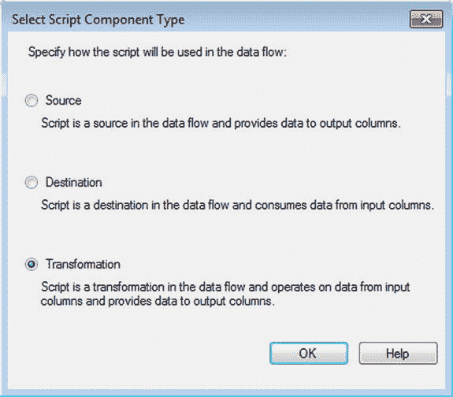

图 3-6. `脚本组件` 配置

 `注意` 你应将 `脚本组件` 角色（`转换`、`源` 或 `目标`）的选择视为永久性的。如果错误地选择了错误的配置角色，通常更容易删除并重新创建脚本实例，而不是尝试重新配置它。

你很可能会在 `脚本组件` 的每种角色（`源`、`转换` 和 `目标`）中不时使用它。然而，根据我的经验，`转换` 是 `脚本组件` 最常用的角色。

在 ETL 流程中设计自定义逻辑是一项艰巨但有回报的任务。然而，代码从开发阶段晋升到测试甚至生产阶段后，工作并未完成。高效的 ETL 架构师在设计脚本解决方案时会保持长远眼光，因为这些包通常在创建它们的人员离职后仍能长期存活。

为此，解决方案设计过程的一个组成部分应该是评估整个项目的灵活性、可维护性和可重用性，并为脚本中的“项目内项目”实例做出具体考量。

#### 代码重用

### SSIS 中的代码重用

懒惰是件好事。（停顿以示强调。）澄清一下：所有伟大的技术人员都会想办法避免反复解决相同的问题。假设你花了一些时间处理脚本任务和脚本组件，并想出了一个关于"下一个伟大的 ETL 事物"的绝妙主意。这个事物专注于添加原生 SSIS 工具中没有的行为，但同时又足够通用，可以在多个域的多个包中使用。既然你曾经为此付出过努力，你就会希望避免再次重新发明它。解决方案是：找到一种方法使这个事物可复用。

为此，在 SSIS 中有几种代码复用的方法，从老式的复制粘贴到花哨的模块化。

#### 复制粘贴

这里不需要进一步定义：通过复制粘贴进行代码复用正如其听起来的那样。尽管将代码复制粘贴作为一种复用机制有点粗糙和非结构化，但它也是在 SSIS 中最简单和最常用的方法。其优点是部署快速简单，管理限制少。然而，这种简单性是有代价的。以这种方式部署，每个代码副本都存在于自己的孤岛中，必须独立地手动维护。

#### 外部程序集

正如我在本章前面提到的，`脚本任务`和`脚本组件`都允许你引用外部程序集（从单独项目生成的编译代码），以将补充行为导入到`脚本任务`/`脚本组件`的实例中。创建外部程序集的细节超出了本章的范围，但简而言之，你会使用单独的开发环境来编码和编译将在 ETL 过程中使用的类、方法和事件。生成的二进制文件，称为**程序集**，将被部署到开发机器和任何将执行包的服务器机器上。然后，该程序集将被添加到脚本引用列表中，其结果是，程序集中定义的行为将可以从`脚本任务`或`脚本组件`的实例内部访问。

这种方法有几个优点。首先，这是在包中处理代码复用的一种更模块化的方式。这种方法不是依赖于基本的复制粘贴操作，而是允许对 ETL 过程的共享自定义功能进行单点管理和开发。由于所有对自定义行为的引用在每台开发机器或服务器上都指向单个程序集，因此对代码的任何更新都将在机器级别解决，而不必触及每个包中的每个脚本。此外，构建到外部程序集中的行为可以被其他进程或应用程序使用；因为这些独立的程序集是使用公共语言运行时构建的，它们的用途可以扩展到 SSIS 的边界之外。

这种方法也有一些限制。首先，你不能使用 SSDT 创建自定义程序集。虽然这两种工具都使用 Visual Studio 外壳，但它们仅安装了创建商业智能项目的模板，并不原生支持其他项目类型。要创建包含自定义代码的程序集，你需要使用配置为生成类库项目版本的 Visual Studio（标准版和专业版，甚至是特定语言的免费 Express 版）——或者，对于经验非常丰富的开发人员，使用纯文本编辑器和.NET 编译器。另一个限制是，在脚本中引用的任何程序集都必须部署到将执行包的机器上的全局程序集缓存中，并注册。这个部署和注册过程并不复杂，但它确实增加了 ETL 基础设施中活动部件的总数。

#### 自定义任务/组件

在 SSIS 可复用性食物链的顶端，你会找到自定义任务和自定义组件。与自定义程序集一样，能够将你自己的任务和组件添加到 SSIS 中，允许你在 SSIS 内创建高度定制的行为。此外，自定义任务和组件使你能够为这些行为创建更定制的用户界面，从而在你的 SSIS 包中进行相对简单的拖放使用。为了简洁起见，我们不会在本章中详细讨论自定义任务或自定义组件的使用，但值得一提的是，如果某个脚本行为在你的许多包中经常重复，那么值得考虑将`脚本任务`或`脚本组件`转换为可以轻松集成到 SSDT 中的自定义工具。

#### 源代码控制

询问任何优秀开发人员他们所需的项目要素简短列表，源代码控制几乎总是在列表的顶部。因为任何 SSIS 项目本质上都是软件开发——尽管主要是在图形环境中——ETL 开发人员也必须做出同样的考虑。由于 SSIS 包的存储只是一个 XML 文件，因此将 SSIS 包添加到大多数现有的源代码控制系统并不困难。

对一些人来说，`脚本任务`和`脚本组件`看起来像是驻留在 SSIS 包之外——毕竟，这两者都是通过看似独立的 Visual Studio 项目来管理的。这种想法有时会引出如何将 SSIS 脚本逻辑集成到源代码控制中的问题。简单的答案是，除了对包本身进行源代码控制之外，没有其他要求。因为所有代码都内联存储在包的 XML 中，所以不需要在源代码控制中单独跟踪`脚本任务`或`脚本组件`实例中的代码。

#### 脚本设计模式

作为一个土生土长的南方人，我总是被教导做事的方法不止一种。虽然我从未尝试过这个特定的练习，但我可以确认，对于任何给定的问题（在生活中，以及在 SSIS 中），可能有几十种甚至数百种正确的解决方案。

由于脚本解决方案的高度灵活性，不可能预测可能进入 SSIS 代码的每一种逻辑排列组合。然而，随着集成服务的演变，一些常用的设计模式已经出现。在本节中，我将看看其中的一些模式。

##### 连接管理器和脚本编写

连接管理器内置于 SQL Server 集成服务中，作为一种模块化方式来复用到数据库、数据文件和其他信息源的连接。任何即使只有一点点 SSIS 使用经验的人都知道连接管理器以及它们与常规组件（如`OLE DB 源/目标`和`平面文件源/目标`）以及任务（如`FTP 任务`和`执行 SQL 任务`）的关系。你可以将连接对象实例化为包级实体（如图 3-7 所示），并在包的其余部分使用它。

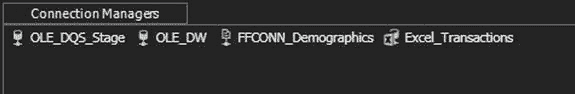

图 3-7. 连接管理器对象

不太为人所知的是，你也可以在`脚本任务`和`脚本组件`的实例中访问大多数连接管理器对象。连接到数据源是 SSIS 脚本中非常常见的任务，特别是在用作源或目标的`脚本组件`实例中。然而，在实际使用中，我发现很多 ETL 开发人员会经历在脚本内以编程方式创建新连接的操作，即使包中已经有一个连接管理器。


如果您的 SSIS 包中已经存在针对特定连接的连接管理器对象，那么在脚本中连接到数据存储时，最好使用该现有的连接管理器对象。如果连接管理器尚不存在，请考虑创建一个：将连接从脚本中抽象出来有许多好处，包括便于更改以及使连接能够在 SSIS 中参与事务。

 **注意** 关于为何使用连接管理器对象而非完全在脚本中创建连接的深入分析，您可以查阅 Todd McDermid 关于此主题的精彩博文：`http://toddmcdermid.blogspot.com/2011/05/use-connections-properly-in-ssis-script.html`。在这篇博文中，作者专门讨论了在脚本任务中使用连接管理器，但大部分相同的原则也适用于在脚本组件中使用连接管理器。

虽然几乎可以为脚本中的任何连接类型重用连接管理器，但为了简化讨论，我将限制在 SQL Server 数据库连接的范围内。稍加修改，许多这些原则也适用于其他连接类型。

###### 在脚本任务中使用连接管理器

虽然不是完全直观，但在脚本任务中引用现有连接管理器的编码语法相对容易理解。我将通过最常见的两种连接 SQL Server 的方式——通过 OLE DB 连接和 ADO.NET 连接——来查看示例。

通过脚本任务连接到 ADO.NET 连接管理器是一个两步过程，如清单 3-1 所示。首先，为现有的 `ConnectionManager` 对象创建引用（使用您在 SSIS 包中赋予它的名称），然后在代码中从该对象获取连接。

***清单 3-1***。在脚本任务中使用现有的 ADO.NET 连接

```
// 创建 ADO.NET 数据库连接
ConnectionManager connMgr = Dts.Connections["ADONET_PROD"];
System.Data.SqlClient.SqlConnection theConnection
        = (System.Data.SqlClient.SqlConnection)connMgr.AcquireConnection(Dts.Transaction);
```

在脚本任务中使用 OLE DB 连接管理器需要稍多一些代码，但与其 ADO.NET 对应部分的练习类似。如清单 3-2 所示，使用 OLE DB 提供程序时，必须添加一个中间对象来进行适当的数据类型转换：

***清单 3-2***。在脚本任务中使用现有的 OLE DB 连接

```
// 创建 OLEDB 数据库连接
// 注意我们需要添加对 Microsoft.CSharp 和 Microsoft.SqlServer.DTSRuntimeWrap 的引用
ConnectionManager cm = Dts.Connections["AdventureWorks2012"];
Microsoft.SqlServer.Dts.Runtime.Wrapper.IDTSConnectionManagerDatabaseParameters100 cmParams
   = cm.InnerObject as Microsoft.SqlServer.Dts.Runtime.Wrapper.IDTSConnectionManagerDatabaseParameters100;
System.Data.OleDb.OleDbConnection conn = (System.Data.OleDb.OleDbConnection)cmParams.GetConnectionForSchema();
```

 **注意** 值得一提的是，从技术上讲，可以通过编号而非名称来引用连接（例如，使用 `Dts.Connections[3]` 而不是 `Dts.Connections["Conn_Name"]`）。我强烈建议不要这样做！这会导致连接引用相当模糊，并且由于连接管理器的顺序无法保证，您可能会遇到运行时错误（最坏的情况），或者在包中出现完全意外的行为。

###### 在脚本组件中使用连接管理器

正如我在前一节提到的，无论您是在脚本任务还是脚本组件中工作，重用连接管理器的许多概念是相同的。出于同样的原因，重用现有的连接管理器对象（或在必要时创建一个新的）几乎总是一种最佳实践，而不是在代码中从头构建连接对象。

从操作上讲，在脚本组件中使用连接管理器稍微容易一些。因为此工具的目的是移动数据（对于脚本任务来说并非总是如此），所以内置了一些附加功能，使重用连接管理器的任务不那么繁琐。在脚本组件中，您可以在脚本的图形编辑器中声明使用一个或多个连接（就像声明使用只读或读写变量一样，稍后讨论）。如图 3-8 所示，此界面允许您轻松引用现有连接。

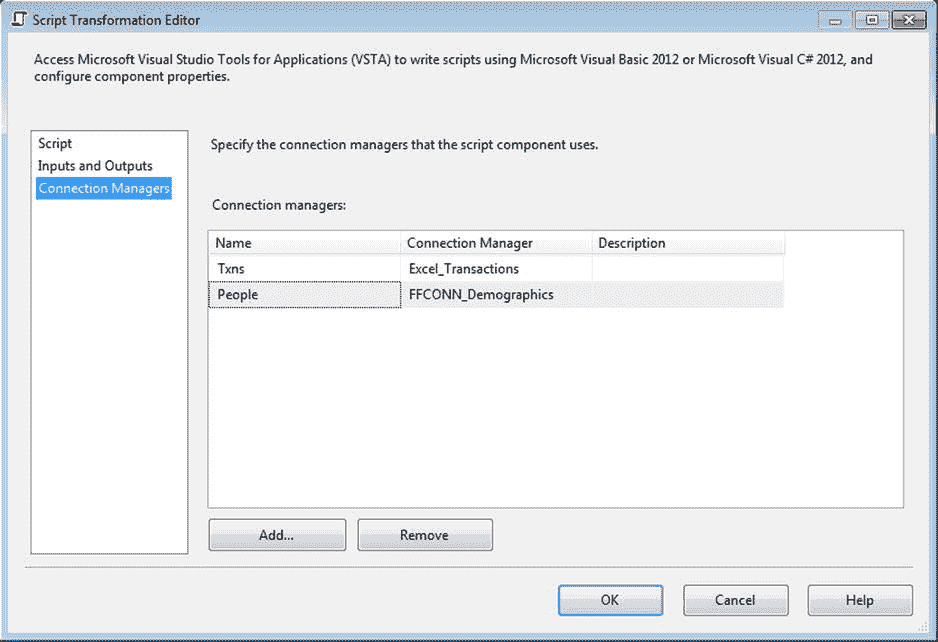

图 3-8。在脚本组件中声明连接管理器

一旦在这里引用了它们，在代码中使用这些连接的语法也就简单得多。您可以通过 `UserComponent.Connections` 集合访问这些连接，而不是使用连接名称作为索引器。这是一个例子：

[**清单 3-3**]。在脚本组件中使用先前声明的连接管理器

```
// 连接到 ADO 数据库连接
System.Data.SqlClient.SqlConnection conn = (System.Data.SqlClient.SqlConnection)Connections.OLEDBPROD.AcquireConnection(null);
```

#### 变量

在许多（如果不是大多数）脚本任务和脚本组件实例中，您需要检查或操作存储在 SSIS 变量中的值。因为它们在这些实现中如此普遍，所以了解如何在脚本工具中最好地处理 SSIS 变量非常重要。

 **注意** 区分 SSIS 中的变量与在脚本任务和脚本组件内声明的变量非常重要。尽管它们的用法有一些共性，但它们是独立且不同的实体，具有非常不同的属性。SSIS 变量定义为 SSIS 包的一部分，可以在许多不同的任务和组件中使用。而脚本变量则在脚本任务或脚本组件的各个实例中声明，并且仅在定义它们的实例内有效。

#### 变量可见性

在脚本任务和脚本组件中，您都可以使用各自的 GUI 编辑器显式公开一个或多个变量。在图 3-9 中，您可以看到我们可以选择将 SSIS 变量包含在脚本中，并可以指定这些变量是作为只读还是读写变量公开。

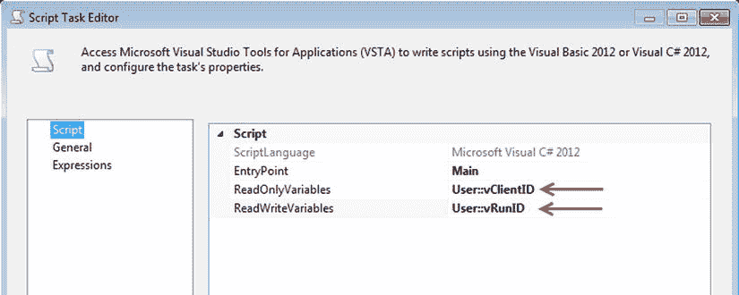

图 3-9。在脚本中包含变量

即使没有显式包含它们，也可以通过脚本读取或修改 SSIS 变量。然而，通常更可取的方法是如所示那样声明任何所需的变量，因为当以这种方式提前在脚本中声明对 SSIS 变量的引用时，脚本内的语法要简单得多。

##### 代码中的变量语法

无论您使用脚本任务还是脚本组件，声明只读或读写变量的体验是相似的。然而，根据您使用的工具，代码中引用这些变量的语法有所不同。如清单 3-4 所示，脚本任务实例中的 SSIS 变量通过使用字符串索引器指定变量名称来引用。

***清单 3-4***。脚本任务变量语法


# 第四章

### SQL Server 源模式

在本书的第一部分，我们探讨了聚焦于 SQL Server Integration Services 控制流区域的模式，包括元数据、工作流执行和脚本编写。第二部分将聚焦于 SQL Server Integration Services 的数据流区域。本章及后续章节将讨论 Integration Services 包中管道区域的源、转换和日志记录模式。

Integration Services 支持多种源，包括 SQL Server、Oracle 和 SAP。此外，开发者和第三方供应商能够为未随产品附带的提供程序创建自定义源。这种技术无关的方法为加载各种数据创建了一个非常灵活的系统。即使有所有这些潜在的源，将数据加载到 SQL Server 数据库或从中导出仍然非常常见，因为拥有 Integration Services 的公司通常使用所有微软产品。

本章讨论与使用 SQL Server 作为源相关的不同模式。由于在使用 Integration Services 的环境中 SQL Server 数据库非常常见，我们定义了一套从 SQL Server 提取数据的模式。具体来说，我们将探讨连接到 SQL Server 数据库的最佳方式、如何选择要使用的数据，以及如何更轻松地使用数据流中的其余对象。最后，我们将看一下 SQL Server Denali 中的一个新组件，它有助于在连接到任何源时快速启动开发。

#### 设置源

当连接到外部数据时，Integration Services 使用几个对象来帮助建立连接、检索正确的数据并启动任何必要的数据操作。每次 Integration Services 开发者创建一个包时，开发者都需要选择正确的对象并确保它们都已创建。需要设置的对象如下：

*   **连接管理器**：告诉 Integration Services 从何处获取数据的对象。可在控制流、数据流和事件处理程序中使用。
*   **提供程序**：连接管理器用来与数据源通信的对象。
*   **源组件**：设置属性以告诉 Integration Services 要获取什么数据的对象。匹配的 `Connection Manager` 对象在此对象中设置。
*   **源组件查询**：外部数据源需要提供给 Integration Services 数据的信息。查询存储在 `Source Component` 对象中。

让我们看看与这些项目中的每一项相关的重要因素。我们将在下一节开始探讨连接管理器。

当使用脚本组件实例时，语法明显不同。您无需使用索引器来读取或写入引用的 SSIS 变量，而是可以使用 `Variables.<Variable Name>` 语法，如清单 3-5 所示：

**清单 3-5. 脚本组件变量语法**

```
public override void Input0_ProcessInputRow(Input0Buffer Row)
{
        // 将 SSIS 变量 ClientName 推送到当前行中的值
        Row.ClientName = Variables.ClientName;
}
```

即使您没有在图形设置编辑器中显式声明其使用，也可以访问脚本任务或脚本组件实例中的变量。在 SSIS 脚本工具集中，您会发现一些函数，允许您以编程方式锁定和解锁变量以进行只读或读写访问。如清单 3-6 所示，您可以使用 `VariableDispenser.LockOneForRead()` 函数来捕获先前未声明的变量的值。

**清单 3-6. 手动锁定变量**

```
// 以编程方式锁定我们需要的变量
Variable vars = null;
Dts.VariableDispenser.LockOneForRead("RunID", ref vars);

// 分配给脚本变量
runID = int.Parse(vars["RunID"].Value.ToString());

// 解锁变量对象
vars.Unlock();
```

使用类似于清单 3-6 中所示的方法，您可以使用 `VariableDispenser.LockOneForWrite()` 函数来操作变量值，这将允许您对变量值进行写入以及读取。

#### 变量数据类型

正如您可能从清单 3-4 和清单 3-5 中推导出的那样，脚本任务和脚本组件之间变量值的解释数据类型会有所不同。对于后者，您在图形设置编辑器中声明的任何变量都将显示为 SSIS 变量类型的 .NET 数据类型等效项，并且无需执行类型转换。当使用脚本任务（以及脚本组件，如果您选择使用 `LockOneForRead()` 或 `LockOneForWrite()` 方法）时，变量呈现为通用的 `Object` 类型，并且大多数时候，您必须将脚本代码中使用的任何变量强制转换为适当的类型。如图 3-10 所示，如果您忘记将变量值强制转换为适当的类型，将会出现编译器错误。

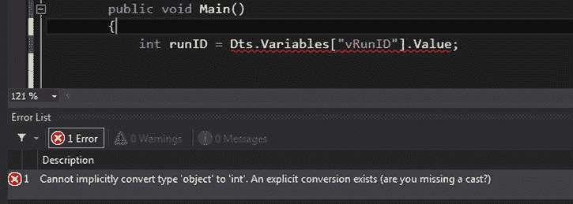

图 3-10. 脚本任务变量必须强制转换

#### 命名模式

如果您过去曾担任软件开发人员，那么下面的部分只不过是一次复习。如果您没有，我将分享一条重要的信息：命名约定很重要。

在我认识的许多开发人员中，我从未发现有人不忠于某种命名约定。为什么？因为它熟悉。它可预测。当您开发软件的方式出现模式时，维护起来会变得更容易——无论是对他人还是对自己。从技术上讲，用驼峰式、匈牙利记法、助记符记法或 Pascal 样式编写的代码没有区别。这纯粹是关于清晰度、可读性和可维护性的问题。通过找到并坚持一种风格（即使它是其他风格的混合体），您将拥有更易于导航的代码，并且很可能会发现您的开发同事欣赏这种方法。

以下是一些关于命名约定的建议：

*   **保持一致：** 这是第一规则，应优先于其他所有规则。无论您开发什么风格，请坚持下去。您可以稍后更改或修改您的命名约定风格，但至少在每个项目内要保持一致。
*   **清晰明了：** 我无法告诉您我不得不调试过多少次代码（是的，有时是我自己的），里面充斥着单字符对象名称、模糊的函数名称以及其他让人抓狂的做法。现在，不要在这方面过分。大多数对象名称不需要像 `database_write_failed_and_could_not_display_interactive_error` 那样阅读，但在那个和像 `f` 这样的变量名之间可能存在着某种愉快的折中。
*   **跟随主流：** 如果您没有自己的风格，就随大流。一些组织，尤其是较大的组织，可能会规定您将使用的命名约定风格。

### 结论

SQL Server Integration Services 中的脚本工具既强大又复杂。许多年前，当脚本首次在 DTS 中伴随 ETL 出现时，它是一种快速而简陋的方法来解决一些数据移动和操作问题。对于 SSIS，最新一代的脚本工具健壮且适合企业使用。遵循一些推荐实践，脚本可以成为任何 ETL 开发人员工具包中的一大补充。

```
public void main()
{
        // 获取当前的 RunID
        int runID = int.Parse(Dts.Variables["RunID"].Value.ToString());

        // 设置 ClientID
        Dts.Variables["ClientID"].Value = ETL.GetClientID(runID);

        Dts.TaskResult = (int)ScriptResults.Success;
}
```


### 选择 SQL Server 连接管理器与提供程序

在 ADO.NET、ODBC 和 OLE DB 之间，有足够多的连接管理器让你眼花缭乱！所有这些连接管理器都能连接到 SQL Server，那么你如何知道该在何时使用哪一种呢？为了回答这个问题，让我们先谈谈连接管理器实际在做什么，然后看看你可以用来连接到 SQL Server 的每种连接管理器类型。

一个 `连接管理器` 是保存外部源连接信息的对象，类似于应用程序数据源或 Reporting Services 共享数据源。连接管理器在 Integration Services 与其余组件之间提供了一个抽象层，因此关于外部源的信息可以在一个地方修改，从而影响所有的任务和组件。要查看所有可用的连接管理器类型，请参阅图 4-1。

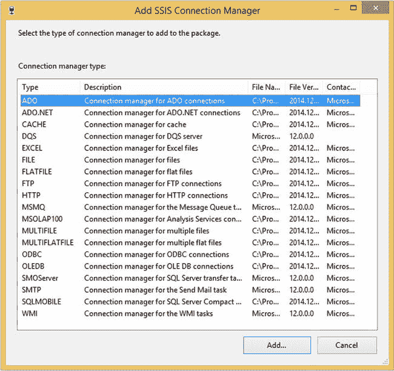

图 4-1. 连接管理器类型

以下是可用于连接到 SQL Server 数据库的三种连接管理器类型：

*   ADO.NET
*   ODBC
*   OLE DB

让我们逐一看看每种连接管理器类型。

#### ADO.NET

ADO.NET 连接管理器类型用于通过 .NET Framework 建立连接。此类型不仅可用于 SQL Server，还提供对其他应用程序和其他数据库的访问。ADO.NET 层使用 .NET Framework 中的 `DataReader` 对象快速从源检索数据。

当你在包的其他地方使用 ADO.NET 连接管理器时，将其用于 SQL Server 是最佳选择。例如，`Lookup` 组件使用 ADO.NET 连接管理器进行连接，因此你也应将其用作源。另一方面，如果一个组件使用另一种连接管理器类型，就坚持使用该类型。**一致性**是这里的关键。有关设置为连接到同一服务器上 AdventuresWorks2012 数据库的示例连接管理器属性窗口，请参见图 4-2。

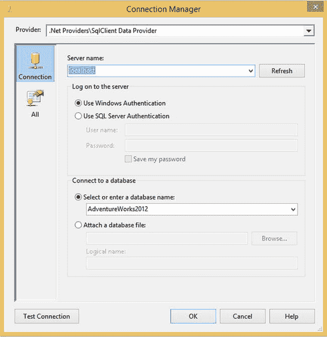

图 4-2. ADO.NET 连接管理器属性屏幕

#### ODBC

ODBC 是开放数据库连接标准。它的目的是允许从任何应用程序到任何数据库的连接，无论供应商是谁。通常，组织会使用 DSN（数据源名称）在应用程序和 ODBC 提供程序使用的连接字符串之间创建一个抽象层。如果你的组织确实希望将 DSN 与 SQL Server 一起使用，那么 ODBC 是你的选择。否则，请坚持使用 ADO.NET 或 OLE DB 连接管理器。

在 SQL Server 2012 之前，SSIS 没有 ODBC 源组件。相反，你仍然可以（并且现在也可以）使用 ADO.NET 连接管理器，只需稍作调整。创建 ADO.NET 连接管理器后，将窗口顶部的提供程序更改为 Odbc Data Provider，如图 4-3 所示。

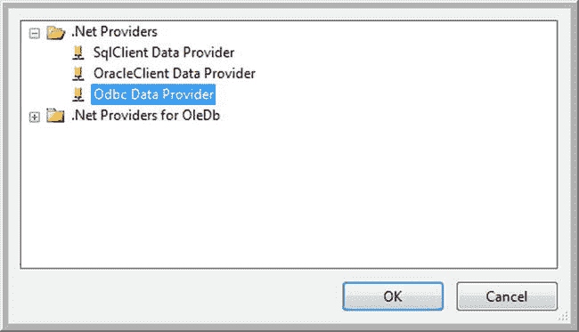

图 4-3. ADO.NET 提供程序

然后添加 DSN 名称或连接字符串。对于我们本地的 AdventureWorks2012 数据库，连接字符串将如清单 4-1 所示。

**清单 4-1**. ODBC 连接字符串

```
Driver={SQL Server Native Client 11.0};
Server=localhost;
Database=AdventureWorks2012;
Trusted_Connection=yes
```

我们完成的、使用 ODBC 提供程序的 ADO.NET 连接管理器屏幕如图 4-4 所示。

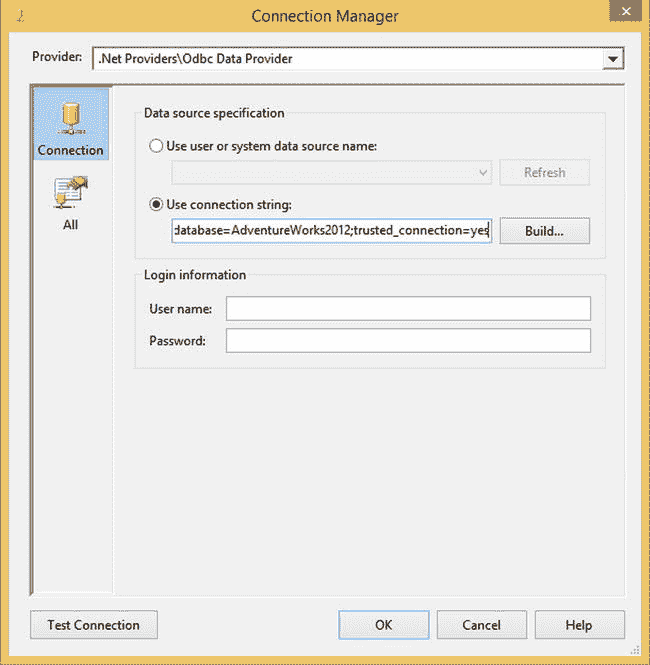

图 4-4. ODBC ADO.NET 连接管理器属性屏幕

如果你使用的是 SQL Server 2012 或更高版本，可以使用 ODBC 源组件。配置 ODBC 源与配置 ADO.NET 源非常相似，只是你使用的是 ODBC 连接管理器。ODBC 源提供了优于 ADO.NET 的额外性能优势；但是，它需要 SQL Server 企业版才能在 SQL Server Data Tools 环境之外运行。

#### OLE DB

最后，我们来看一看可以说是用于连接到 SQL Server 最常用的连接管理器：OLE DB。OLE DB 协议由 Microsoft 编写，作为 ODBC 提供程序的下一个版本。除了 SQL Server 数据库，你还可以使用 OLE DB 连接管理器连接到基于文件的数据库或 Excel 电子表格。

当我连接到 SQL Server 数据库时，OLE DB 往往是我的默认选择。如果你不属于主要使用 ADO.NET 连接管理器的组件的类别，也不属于希望使用 DSN 的组织类别，那么你将需要使用 OLE DB 连接管理器。

你可以如图 4-5 所示填写 OLE DB 连接管理器的属性屏幕。

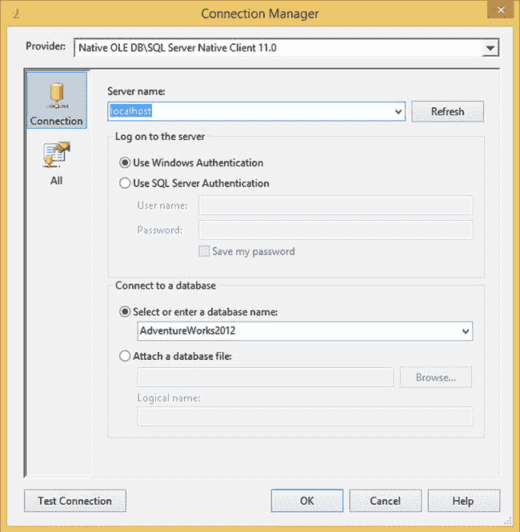

图 4-5. OLE DB 连接管理器属性屏幕

### 创建 SQL Server 源组件

一旦你选择了正确的连接管理器和提供程序，就需要在用于数据提取的 `源组件` 中使用它们。首先，当你在“数据流”选项卡上时，查看 SSIS 工具箱。如果你尚未重新排列 SSIS 工具箱，你将在“其他源”分组下看到所有可能的源，如图 4-6 所示。

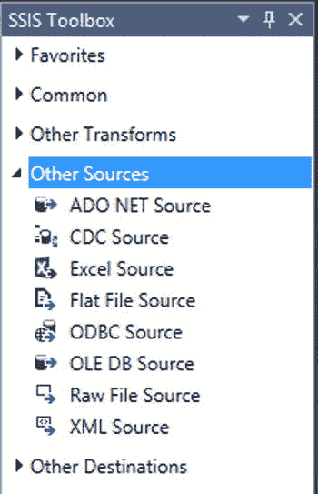

图 4-6. SSIS 工具箱中的“其他源”分组

现在是选择的时候了。

大部分困难的决策在设置连接管理器时已经完成。如果你使用 OLE DB 连接管理器，那么你必须使用 OLE DB 源。如果你决定使用带有 ADO.NET 或 ODBC 提供程序的 ADO.NET 连接管理器，则必须使用 ADO.NET 源。

一旦将所需的源拖到数据流设计窗口，数据流就包含了一个组件，如图 4-7 所示。Integration Services 通过显示带有白色 X 的红色圆圈来告知开发人员源存在问题。在这种情况下，问题是你尚未设置源的任何属性，从目标表开始，如工具提示所示。

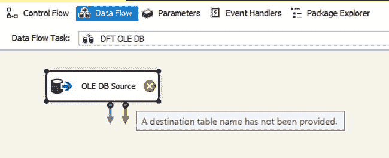

图 4-7. 带有新源的数据流任务

要打开源组件，请双击该组件或右键单击并选择“编辑”。在源组件内部，你可以填写 `连接管理器` 属性。适当类型的第一个连接管理器将自动填充，但选择下拉列表箭头将允许你选择任何其他匹配的连接管理器。到目前为止，你可以看到 OLE DB 源编辑器屏幕，如图 4-8 所示。

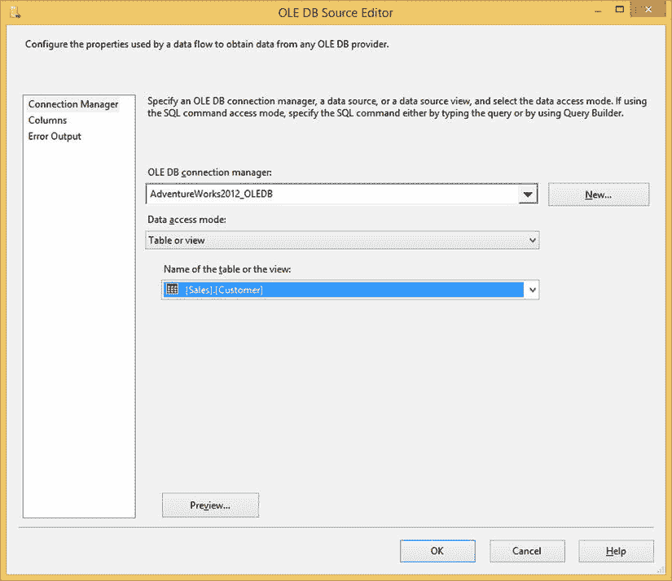

图 4-8. 初始的 OLE DB 源编辑器屏幕

尽管在创建连接管理器时大部分决策工作已经完成，但理解源在 Integration Services 包中扮演的角色仍然很重要。源是将所有其他部分粘合在一起的粘合剂，并确保你有一个地方可以处理未来的维护问题或更改。设置 SQL Server 源是一个简单的步骤，让你在继续创建和优化源所使用的查询之前先热身。

### 编写 SQL Server 源组件查询


既然你已经完成了连接管理器和提供程序的创建，并决定了要使用哪种源组件，现在就需要设置用于提取数据的元数据。操作方法是选择你想要进行的访问类型，然后向源组件添加查询信息。此外，在设置查询和列元数据时，你会希望审视一些模式。让我们开始吧。

#### ADO.NET 数据访问

如果你决定使用 ADO.NET 源组件（无论是搭配 ADO.NET 还是 ODBC 提供程序），你有两种选择来指定要查看的数据：

*   **表或视图：** 选择你希望从中接收数据的表或视图。表和视图的列表应会根据你的访问权限预填充并列出。我们不推荐此选项，因为它包含了不必要的列，即使你在组件中限制了列列表。
*   **SQL 命令：** 输入将在 SQL Server 数据库上执行的文本。

由于“表或视图”选项并非我们的推荐选项，让我们更深入地探讨一下“SQL 命令”选项。你可以输入一个直接返回数据集的 SQL 查询，或者使用 `EXEC` 语句执行一个存储过程。

无论你是使用 SQL 查询还是执行存储过程，都需要注意 ADO.NET 源不允许你在查询中使用参数。如果你需要修改所使用的查询，则需要使用表达式。表达式仅在控制流级别设置，因此你需要查看该处来设置表达式。请按照以下步骤在设计时设置新的 SQL 命令：

1.  在数据流任务中，点击背景以确保没有选中任何组件，然后在“属性”菜单中查找 `表达式` 属性。
2.  打开“属性表达式编辑器”窗口后，在“属性”字段中选择 `[ADO NET Source].[SqlCommand]` 选项，然后单击“表达式”字段旁边的省略号按钮。
3.  在“表达式生成器”中，使用变量创建你的命令。例如，如果你要运行一个需要传入结束日期的存储过程，可以使用以下表达式：`"EXEC GetCustomerData '" + (DT_STR, 29, 1252)@[System::ContainerStartTime] + "'"`
4.  表达式验证通过后，单击“确定”按钮。最终的“属性表达式编辑器”屏幕应如 图 4-9 所示。

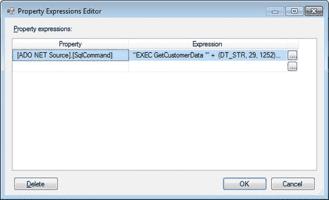

图 4-9. 包含 SQLCommand 属性的属性表达式编辑器

当包运行时，它将使用你刚刚创建的表达式。

#### OLE DB 数据访问

如果你选择了 OLE DB 源组件，你有四种选项来检索数据：

*   **表或视图：** 类似于 ADO.NET 源中的访问方式，此选项允许你选择一个表或视图，将所有列的数据提取到包中。出于与 ADO.NET 源中解释的相同原因，不推荐此选项。
*   **表名或视图名变量：** 你可以不硬编码表或视图的名称，而是指向一个用户创建的、包含该信息的变量。不推荐此选项。
*   **SQL 命令：** 类似于 ADO.NET 源中的访问方式，选择此选项后，你可以输入 SQL 查询或执行存储过程。
*   **来自变量的 SQL 命令：** 如果你想创建一个在运行时更改的查询，或将变量传递给存储过程，这将是你要使用的选项。与 ADO.NET 中创建表达式来修改 SQL 命令不同，你需要创建一个用于生成表达式的变量。选择此选项后，你可以选择你创建的变量。

通过选择这些选项之一，你将决定数据从 SQL Server 返回的方式。选择数据检索类型后，你需要添加相应的属性。例如，如果选择“表或视图”选项，你需要选择包含数据的对象。如果选择“SQL 命令”选项，你需要输入返回数据的 SQL 查询或存储过程执行语句。设置完成后，你就可以继续设计数据流的其余部分了。

#### 厉行节约，避免浪费

作为数据专业人员，我们常常认为获取的数据越多越好。但在处理源数据时，这并非总是最佳情况。在讨论要提取的数据量时，你会希望遵循一种不同的模式。

无论你选择了哪种查询选项，重要的是只请求数据加载过程中你需要的列。请求所有列类似于对数据库运行 `select * from` 表查询。这不仅要求数据库和网络做更多的工作，还要求 Integration Services 做更多的工作。所有这些不必要的数据都将存储在内存中，如果内存不足甚至会导致分页，占用可用于重要列以获取更多数据的空间，并减慢整个包的执行速度。

所有源组件都为你提供了在“列”菜单上选择列子集的选项。请务必在查询本身中而非“列”菜单中进行列精简，以收获包执行速度提升的全部益处。

#### 数据转换

Integration Services 源中另一个容易掉入的陷阱是在源查询本身执行大部分数据转换。由于 Integration Services 开发人员通常具有 SQL 背景，我们倾向于使用熟悉的工具来完成任务。

可以在源查询或数据流其余部分执行的数据转换类型包括：合并数据集、CASE 语句、字符串拼接等。请记住，SQL Server 非常擅长基于集合的操作，而 Integration Services 则非常擅长使用大量内存的计算密集型任务。虽然你应该测试你的具体情况，但这些都是值得遵循的经验法则。

在决定将数据转换逻辑放在何处时，请遵循 表 4-1 中列出的模式。

表 4-1. 数据转换位置

| 数据转换 | 考虑因素 | 位置 |
| --- | --- | --- |
| 合并数据集 | 基于集合 | 源组件 |
| CASE 语句 | 内存密集型 | 数据流 |
| 字符串拼接 | 过程式 | 数据流 |
| 数据排序 | 基于集合 | 源组件 |

#### 源助手

既然你已经通过困难的方式从 SQL Server 检索了数据，接下来你将学习完成同样事情的简单方法。源助手是 SQL Server 2012 中引入的新向导，它引导你完成设置 `源` 对象的步骤，而无需做出许多你刚刚经历过的相同决策。对于刚刚开始使用 Integration Services 的人来说，这是快速上手的好方法。

首先，创建一个新的数据流任务。如 图 4-10 所示，源助手出现在 SSIS 工具箱中。最初它位于 `收藏夹` 分组中，除非你移动了项目。

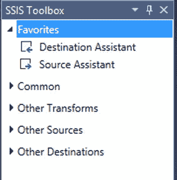

图 4-10. SSIS 工具箱收藏夹分组中的源助手

将源助手组件拖放到数据流设计区域以启动向导。第一个屏幕如 图 4-11 所示。

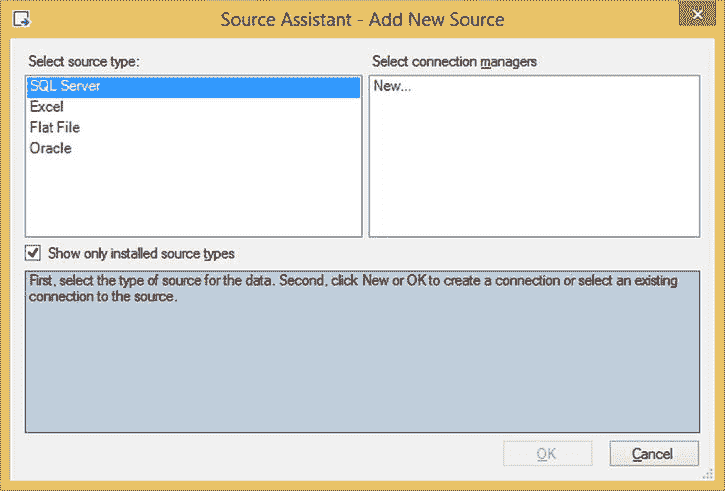

图 4-11. 源助手中的“添加新源”屏幕


首先，您可以看到这里仅为您列出了几种可供使用的类型：`SQL Server`、`Excel`、`Flat File` 和 `Oracle`。如果您想查看安装提供程序后可用的组件列表，可以取消勾选 `仅显示已安装的源类型` 选项。`Integration Services` 通过仅提供 `SQL Server` 这一个选项，直接引导您找到正确的提供程序，从而简化了您的操作。当您在 `源助手` 中选择 `SQL Server` 类型时，它将使用 `OLE DB` 连接管理器，这也是您首选的连接管理器！

一旦您选择了 `SQL Server` 类型，就可以从右侧窗格中选择现有的连接管理器，或者创建一个新的。创建新的连接管理器将引导您完成与之前设置 `OLE DB` 连接管理器完全相同的步骤。

最后，选择您的新建或现有连接管理器，然后单击 `确定` 按钮。这将创建连接管理器并将 `SQL Server` 源添加到 `数据流` 任务中。然后，您就可以立即通过创建和优化 `SQL` 查询来继续您的开发工作。`源助手` 是开始开发您的 `Integration Services` 包的绝佳方式，特别是如果您刚接触 `Integration Services`。如果您知道自己想使用其他类型的连接，您可以直接创建连接管理器和源，而无需使用 `源助手`。无论哪种方式，您都有几种方法可以尽快开始您的开发工作。

### 总结

至此，我们介绍了为何要在某些情况下选择特定的 `SQL Server` 源，如何设置源，以及如何清理源查询以使您的包获得最佳性能。我们还概述了源，为后续关于其他源的章节奠定了基础。

尽管本章描述的所有原则都是针对 `SQL Server` 的模式，但其中许多也适用于其他源类型。请务必查阅后续关于其他源的章节，以了解除我们已讨论的内容外，还有哪些模式可以用于 `SQL Server`。

# 第 5 章


### 使用数据质量服务进行数据修正

`数据质量服务` (`DQS`) 最早随 `SQL Server 2012` 引入。它提供了数据修正和数据去重功能——这是大多数 `提取、转换和加载` (`ETL`) 流程的关键组件。本章介绍 `DQS` 如何与 `SSIS` 集成，并提供相关模式，使您能够在 `ETL` 包中实现可靠且低工作量的数据清理。

 **注意** `数据质量服务` 产品在安装后需要一些手动步骤来创建 `DQS` 数据库并设置默认权限。有关更多信息，请参阅联机丛书中的“安装数据质量服务”页面：`http://msdn.microsoft.com/en-us/library/gg492277.aspx`。

#### 数据质量服务概述

您使用 `DQS` 执行的数据清理和匹配操作围绕知识库的使用展开。知识库（或 `KB`）由一个或多个域组成。进行地址清理的示例域可以是 `城市`、`州/省` 或 `国家`。这些字段中的每一个都将是一个独立的域。两个或更多相关域可以分组在一起形成复合域（或 `CD`）。复合域允许您将多个字段作为一个单元进行验证。例如，一个 `公司` 复合域可以由 `名称`、`地址`、`城市`、`州/省` 和 `国家` 域组成。使用复合域可以让您验证 `Microsoft Corporation` (`名称`) 是否确实位于 `One Redmond Way` (`地址`)、`Redmond` (`城市`)、`WA` (`州/省`)、`USA` (`国家`)。如果 `DQS` `KB` 拥有所有相关知识，即使 `Las Vegas` 是一个有效的城市名称，但知识库已定义 Microsoft 办公室位于 `Redmond`，那么当您填入 `Las Vegas` 作为 `城市` 时，它就能标记该条目为错误。

`数据质量服务` 有三个主要组件：客户端实用程序（如 图 5-1 所示），允许您构建和管理知识库；一个用于批量数据清理的 `SSIS` 数据流转换；以及一个服务器组件，实际的清理和匹配操作在此进行。`DQS` 服务器并非独立实例。它本质上是一组用户数据库（`DQS_MAIN`、`DQS_PROJECTS`、`DQS_STAGING_DATA`），带有一个基于存储过程的 `API`，非常类似于 `SQL Server 2012` 中引入的 `SSIS` 目录。

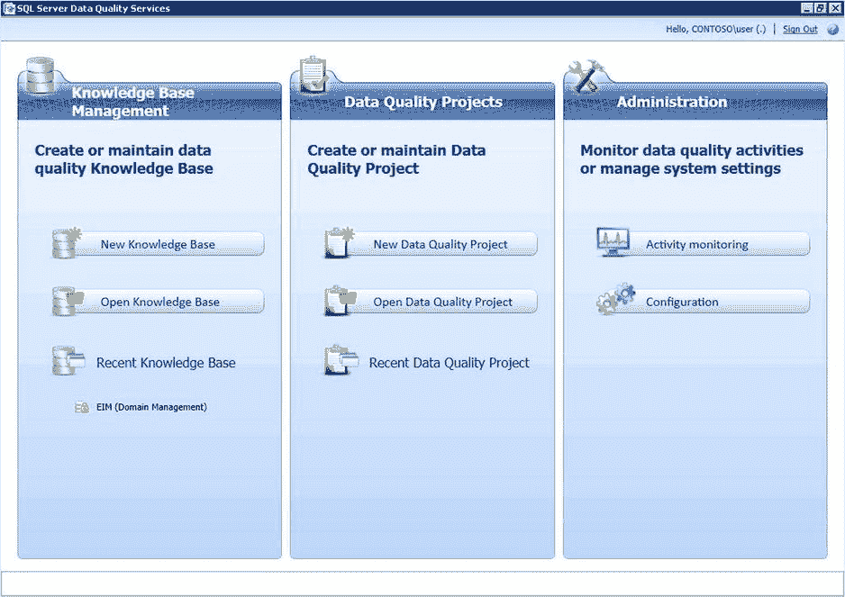

图 5-1. 数据质量客户端应用程序

#### 使用数据质量客户端

`数据质量客户端` 应用程序用于构建和管理您的知识库。它也可以作为独立工具用于清理数据。该工具面向组织内拥有和管理数据的数据管理员和 IT 专业人员。该工具的用户将分为三种不同的角色（如 表 5-1 所示），这些角色映射到主 `DQS` 数据库中的角色。您通过该工具可以访问的功能将取决于您当前被分配的角色。

表 5-1. 数据质量服务角色

| 名称 | SQL 角色 | 描述 |
| --- | --- | --- |
| `DQS KB 操作员` | `dqs_kb_operator` | 用户可以编辑和执行现有的数据质量项目。 |
| `DQS KB 编辑器` | `dqs_kb_editor` | 用户可以执行项目功能，并创建和编辑知识库。 |
| `DQS 管理员` | `dqs_administrator` | 用户可以执行项目和知识功能，以及管理系统。 |

 **注意** 默认情况下，托管 `DQS` 的 `SQL Server` 实例上 `sysadmin` 角色成员具有与 `DQS 管理员` 相同的权限级别。但建议您仍然将用户与三种 `DQS` 角色之一相关联。

#### 知识库管理

`知识库管理` 部分下的选项允许您创建和维护知识库。创建新知识库时，您可以选择创建一个空的知识库，或者基于现有知识库创建，后者会用原始知识库中的域预填充新知识库。知识库也可以从 `DQS` 文件（扩展名为 `.dqs`）创建，允许您备份知识库或在系统间共享。

通过此 `UI` 与知识库交互时，您将执行三个主要活动（如 图 5-2 所示）。在您创建新知识库或打开现有知识库后，这些活动即会可用。


图 5-2. 知识库管理活动

在进行 `域管理` 时，您可以验证和修改知识库中的域。这包括更改域属性（如 图 5-3 所示）、配置联机参考数据，以及查看和修改规则和值。您还可以选择将知识库或单个域导出到 `DQS` 文件，以及从 `DQS` 文件导入新域。

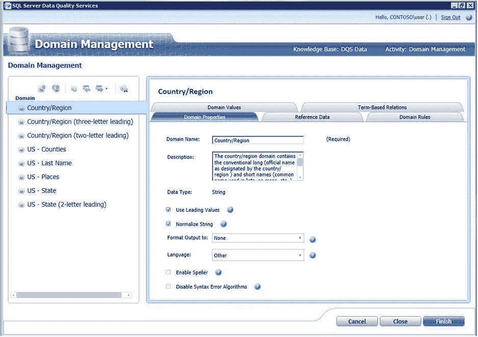

图 5-3. DQS 客户端中“域管理”活动的“域属性”选项卡

`知识发现` 是一个构建知识库信息的计算机辅助过程。您提供源数据（来自 `SQL Server` 表或视图或 `Excel` 文件），并将输入列映射到知识库域。这些数据将被导入 `DQS` 并存储为一组已知的域值。


### 匹配策略活动

匹配策略活动用于为 DQS 准备数据去重过程。通过此用户界面，数据管理员可以创建一个包含一个或多个匹配规则的策略，DQS 将使用这些规则来确定应如何比较数据行。

### 数据质量项目

数据质量项目是一个您可以在其中交互式地清理或匹配数据的项目。您将选择数据源（SQL Server 或 Excel 文件，可通过客户端上传），然后将源列映射到知识库中的域。图 5-4 显示了一个数据质量项目，该项目将尝试对照默认 DQS 知识库中的域来清理 `EnglishCountryRegionName` 和 `CountryRegionCode` 列。

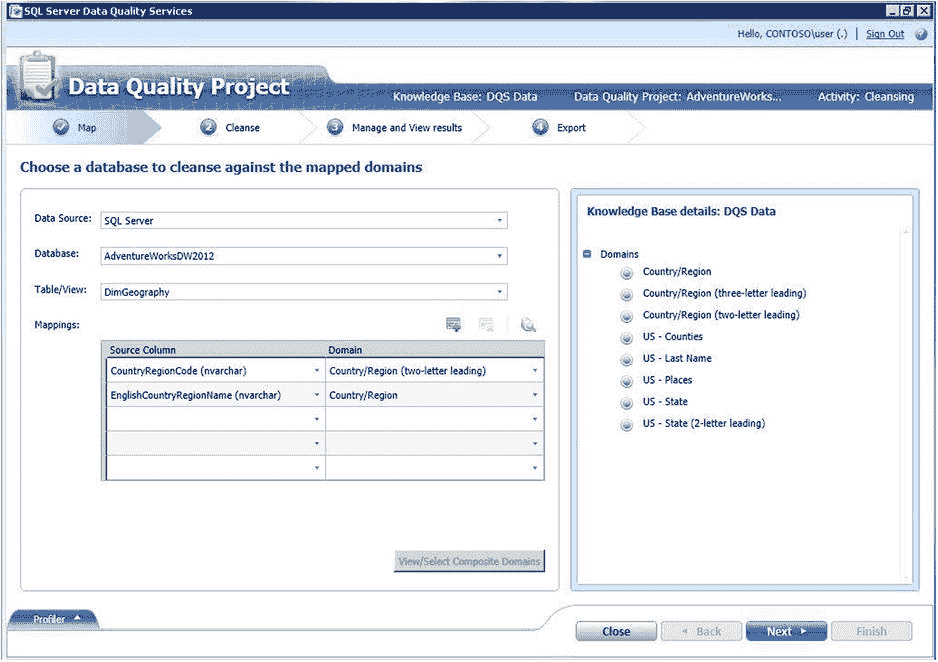

图 5-4. 创建新的数据清理项目

将列映射到域后，DQS 将处理您的数据并提供清理操作的结果。当您查看结果时，可以选择批准或拒绝某些更正、向已知域值列表添加新值以及指定更正规则。例如，作为您组织的数据管理员，您知道 "Jack Ryan" 和 "John Ryan" 是同一个人。批准更正后，您可以将结果导出到 SQL Server 表、Excel 文件或 CSV 文件。DQS 不提供就地更正值的选项——您将需要一个单独的进程来更新您检查的原始源数据。

在此过程中的不同时间点，您可以保存数据质量项目。项目状态会保存到 DQS 服务器，允许您在以后恢复。这在处理可能需要一段时间扫描的大型数据集时特别有用。它还允许您在需要研究特定域的正确值是什么时返回到更正结果。

要管理活动的数据质量项目，请单击客户端主页上的“打开数据质量项目”按钮。从这里，您可以看到所有当前正在进行的项目。右键单击一个项目会为您提供管理选项，例如重命名项目或在不再需要时删除它。

### 管理

管理部分对具有 DQS 管理员角色的用户可用。从这里，您可以监控 DQS 服务器上的所有活动（例如域管理和清理项目），并设置系统范围的配置选项。在这些页面上，您可以为各种操作设置日志记录级别，以及设置建议和自动更正的最低置信度分数。如果您使用的是 Windows Azure Marketplace 的在线参考数据，您还将从此页面配置您的帐户信息和服务订阅（如图 5-5 所示）。

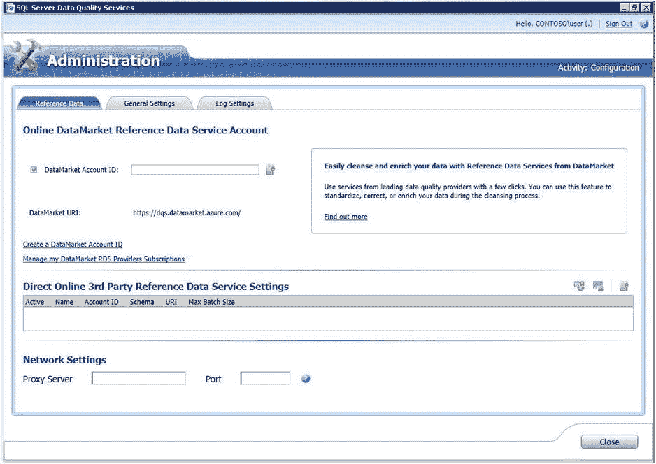

图 5-5. Windows Azure Marketplace 中在线参考数据的配置

### 使用默认知识库

DQS 附带一个默认知识库，其中包含与美国和境内位置的清理和验证相关的域。图 5-6 显示了“US - State”域的域值。在此图中，您可以看到“Alabama”定义了同义词——它会自动将“AL”更正为“Alabama”，并将“Ala.”标记为错误。

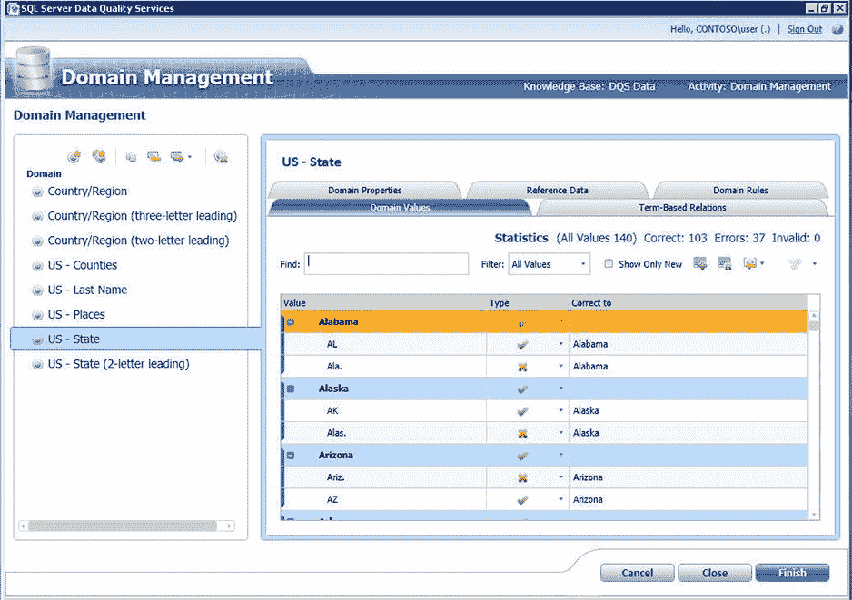

图 5-6. 默认 DQS 知识库中的 US - State 域

### 在线参考数据服务

DQS 使用两种类型的数据来执行清理和匹配操作：本地数据和参考数据。本地数据构成 DQS 客户端“域值”页面上显示的值——这些是作为知识发现过程的一部分导入 DQS 的已知值。这些值与知识库一起存储在 `DQS_MAIN` 数据库中。如果这些值发生更改，您必须使用新值更新您的域。参考数据不存储在知识库中——它是从在线参考数据服务查询的。使用在线参考数据可能会影响性能，因为您的清理过程需要调用外部系统，但它需要的维护较少，因为您无需担心值的同步问题。

可以链接到您的域的在线参考数据服务在 DQS 客户端的管理页面上进行配置。有两种类型的数据提供程序：来自 Windows Azure Marketplace 的 DataMarket 提供程序，以及 Direct Online 第三方提供程序。DataMarket 提供程序要求您拥有 Windows Azure Marketplace 帐户 ID 以及对您希望使用的数据集的订阅。Direct Online 提供程序选项允许您指向支持 DQS 提供程序接口的其他第三方 Web 服务。

### 将 DQS 与 SSIS 配合使用

SQL Server 2014 附带用于 SSIS 的 DQS 清理转换。本节介绍如何在 SSIS 数据流中配置和使用此转换。本节还包含有关 DQS 的几个开源扩展的信息，这些扩展可在 CodePlex 上获得。

#### DQS 清理转换

DQS 清理转换随 SSIS 2014 一起提供，可在数据流工具箱中找到（如图 5-7 所示）。默认情况下，它将出现在工具箱的“其他转换”部分下。

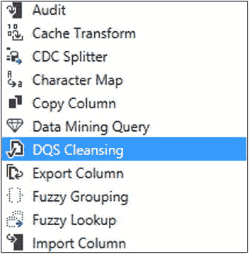

图 5-7. DQS 清理转换

将 DQS 清理转换添加到数据流后，可以双击该组件以打开其编辑器 UI。在 DQS 清理转换编辑器中需要设置的第一件事是数据质量连接管理器（如图 5-8 所示）。这将指向驻留在 SQL Server 实例上的 DQS 安装。创建连接管理器后，选择要使用的知识库。选择要使用的知识库将显示其域列表。

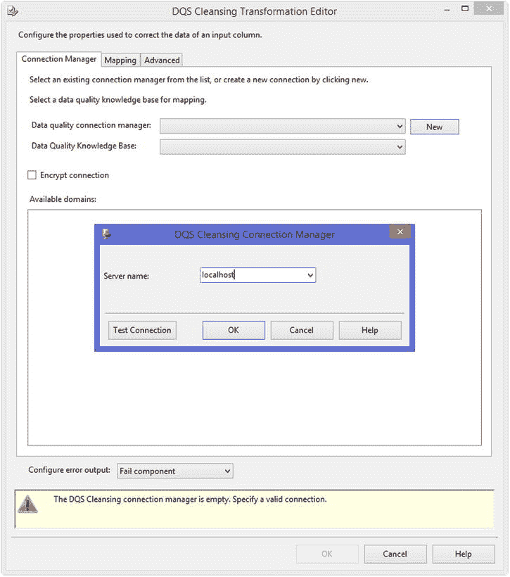

图 5-8. DQS 连接管理器和清理转换编辑器

如本章前面所述，此列表中有两种类型的域：常规域（例如，`City`、`State`、`Zip`）和复合域，复合域由两个或多个常规域组成。使用 DQS 清理转换时，可以将数据流中的列映射到知识库中的域。您还可以通过两种方式利用复合域：

1.  **单个（字符串）列：** 要使此方法生效，所有值必须按照域出现的顺序显示。因此，使用本章开头的 `Company` 示例，您的列值需要如下所示：Microsoft Corporation, One Redmond Way, Redmond, WA, USA。
2.  **多个列：** 始终通过 DQS 知识库中存储的知识和规则单独清理各个列。如果将列映射到复合域的每个域，则该行也将使用复合域逻辑进行清理。

```
注意  目前，DQS 清理转换 UI 中没有指示器显示您何时已将列映射到复合域内的所有域。您需要仔细检查每个域是否已映射；否则，每个列将被单独验证和清理。
```


#### 映射选项卡

映射选项卡（图 5-9）允许您选择要清理的列，并将它们映射到知识库中的域。请注意，“域”下拉菜单会自动过滤掉数据类型不兼容的列。例如，如果您使用的是 `DT_I4`（四字节有符号整数）列，则不会显示数据类型为 `String` 的域。一个域只能被映射一次——如果同一个域对应多个列，您需要在数据流中使用两个独立的 DQS 清洗转换。

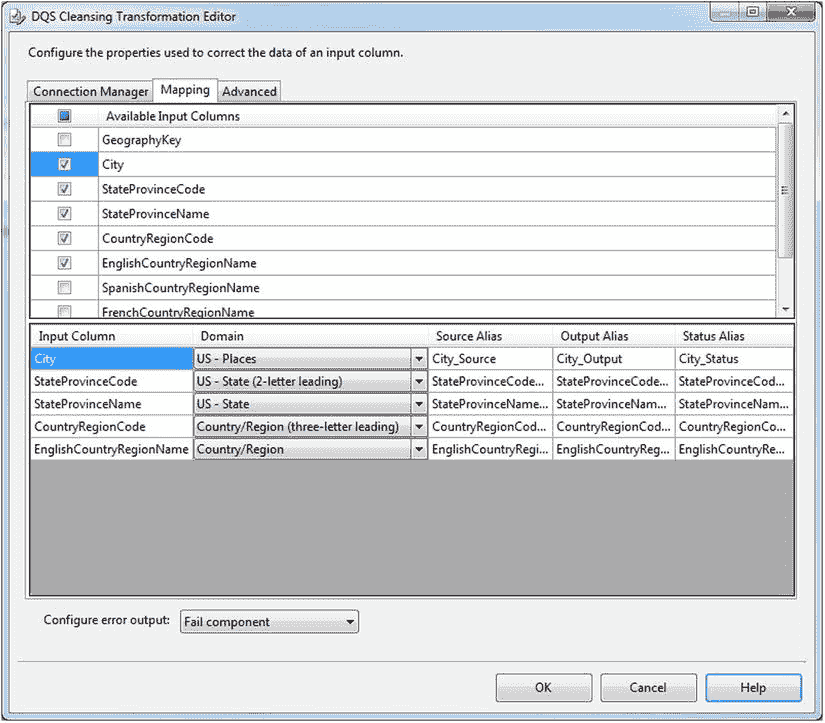

图 5-9. 将 DQS 知识库域映射到数据流中的列

 **注意**  如果您的数据包含多个具有相同域值的列，请考虑在创建知识库时使用“链接域”功能。更多信息请参阅 Books Online 中的“创建链接域”页面：`http://msdn.microsoft.com/en-us/library/hh479582.aspx`。

您映射的每一列都会导致至少三个额外的列被添加到数据流中——`Source`、`Output` 和 `Status`。根据您选择的高级选项（稍后详述），可能还会添加更多列。DQS 清洗转换创建的列列表见表 5-2。默认情况下，每个附加列都会以原始列名作为前缀，并可在映射选项卡上重命名。除了以原始列名为前缀的列之外，还会添加一个 `Record Status` 列来记录行的整体状态。关于如何处理 DQS 清洗转换添加的列的详细信息将在本章后面介绍。

表 5-2. DQS 清洗转换创建的附加列

| 列 | 默认 | 描述 |
| --- | --- | --- |
| `Record Status` | 是 | 记录的整体状态，基于每个映射列的状态。整体状态基于以下算法：如果一列或多列为 `Invalid`，则记录状态为 `Invalid`。如果为 `Auto suggest`，则记录状态为 `Auto suggest`。如果为 `Corrected`，则记录状态为 `Corrected`。如果所有列均为 `Correct` 或 `New`，则记录状态为 `Correct`。如果所有列均为 `New`，则记录状态为 `New`。可能的 `Status` 列值参见表 5-3。 |
| `_Source` | 是 | 此列包含传递给转换的原始值。 |
| `_Output` | 是 | 如果原始值在清理过程中被修改，此列包含更正后的值。如果值未被修改，则包含原始值。通过 SSIS 进行批量清理时，下游组件通常会使用此列。 |
| `_Status` | 是 | 值的验证或清理状态。`Status` 列的可能值参见表 5-3。 |
| `_Confidence` | 否 | 此列包含给予任何更正或建议的分数。该分数反映了 DQS 服务器（或相关数据源）对该更正/建议的置信程度。大多数 ETL 包会希望包含此字段，并使用条件拆分将未达到最低置信度阈值的值重定向，以便进行手动检查。 |
| `_Reason` | 否 | 此列解释列清理状态的原因。例如，如果一列被 `Corrected`，原因可能是 DQS 清理算法、知识库规则或标准化导致的更改。 |
| `_Appended Data` | 否 | 当有域附加到参考数据提供程序时，会填充此列。某些参考数据提供程序会返回额外的信息作为清理的一部分——不仅限于映射域关联的值。例如，在清理地址时，参考数据提供程序可能还会返回纬度和经度值。 |
| `_Appended Data Schema` | 否 | 此列与前面列出的 `Appended Data` 设置相关。如果数据源在 `Appended Data` 字段中返回了附加信息，此列包含一个可用于解释该数据的简单架构。 |

#### 高级选项卡

高级选项卡（如图 5-10 所示）有许多不同的选项，其中大多数在选中时会向数据流中添加新列。“标准化输出”选项是个例外。启用后，DQS 将根据在 DQS 客户端应用程序中定义的域设置修改输出值。您可以在 DQS 客户端的“域管理 -> 域属性”选项卡上查看标准化设置的定义方式（如前面图 5-3 所示）。

有两种标准化：

*   **重新格式化操作：** 包括转换为大写、小写以及字符串中首字母大写等操作。
*   **更正为主导值：** 例如，如果为某个术语定义了多个值（或同义词），当前值将被替换为主导术语（在知识库中定义）。

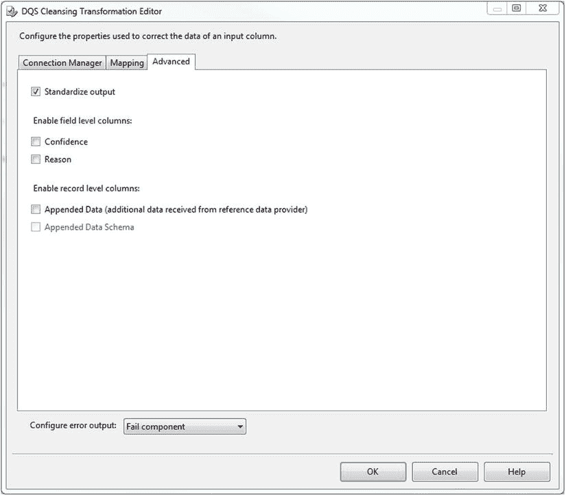

图 5-10. DQS 清洗转换编辑器的高级选项卡


### DQS 清洗转换

DQS 清洗转换会记录信息事件，以指示何时将行发送到 DQS 服务器。每个批次会记录一个事件，最后会有一个包含所有记录汇总的事件。这些消息包含有关清洗过程处理该批次所耗时长以及各状态计数的详细信息。清单 5-1 显示了这些消息的示例。该转换以 10,000 行为一块处理数据。目前块大小是硬编码的；无法配置发送到 DQS 服务器的批次大小。

**清单 5-1**. DQS 清洗转换日志消息

```
[DQS 清洗] 信息：DQS 清洗组件从 DQS 服务器接收到 1000 条记录。数据清洗过程耗时 7 秒。
[DQS 清洗] 信息：DQS 清洗组件记录块状态计数 - 无效：0，自动建议：21，已更正：979，未知：0，正确：0。
[DQS 清洗] 信息：DQS 清洗组件记录总状态计数 - 无效：0，自动建议：115，已更正：4885，未知：0，正确：0。
```

### CodePlex 上的 DQS 扩展

许多 DQS 扩展可从 CodePlex 获取。这些扩展列于表 5-3。它们不随 SQL Server 2014 一同提供，但对于自动化数据清洗场景非常有用。这里简要说明了如何使用每个扩展。您可以在 CodePlex 上它们各自的项目页面找到有关如何使用的更多信息。

**表 5-3**. CodePlex 上的 DQS 扩展

| 扩展 | 描述 |
| --- | --- |
| DQS 匹配 | 此转换允许您在 SSIS 数据流中执行自动数据去重。它提供了与 SSIS 模糊分组转换类似的功能，但还利用了在您知识库中定义的 DQS 匹配策略以提供更准确的结果。 |
| DQS 域值导入 | 此目标组件允许您批量将值加载到 DQS 域中。对于您的域值定义在外部系统（如 Master Data Services）中的自动化场景非常有用。 |
| 发布 DQS 知识库 | 此任务用于提交对知识库的更改（在 DQS 术语中称为*发布*）。该任务通常与 DQS 域值导入转换结合使用。 |

 `注意` DQS 的 CodePlex 扩展由 OH22 Data (`http://data.oh22.net/`) 创建并免费提供。它们不受 Microsoft 官方支持。这些扩展可从 `https://ssisdqsmatching.codeplex.com/` 和 `https://domainvalueimport.codeplex.com/` 下载。

### 在数据流中清洗数据

以下部分包含使用 DQS 清洗转换在 SSIS 数据流中清洗数据的设计模式。清洗数据时需要牢记两个关键问题：

*   清洗过程基于您知识库中的规则。清洗规则越好，您的清洗过程就越准确。随着知识库中规则的改进，您可能需要重新处理数据。
*   清洗大量数据可能耗时较长。有关可应用于减少总体处理时间的模式，请参阅本章后面的“性能注意事项”部分。

#### 处理 DQS 清洗转换的输出

DQS 清洗转换会向数据流添加若干新列（如本章前面所述）。处理已处理行的方式通常取决于该行的状态，该状态在 `记录状态` 列中设置。可以使用条件拆分转换将行重定向到适当的数据流路径。图 5-11 显示了条件拆分转换为每个 `记录状态` 值设置单独输出时的外观。表 5-4 包含了可能的状态值列表。

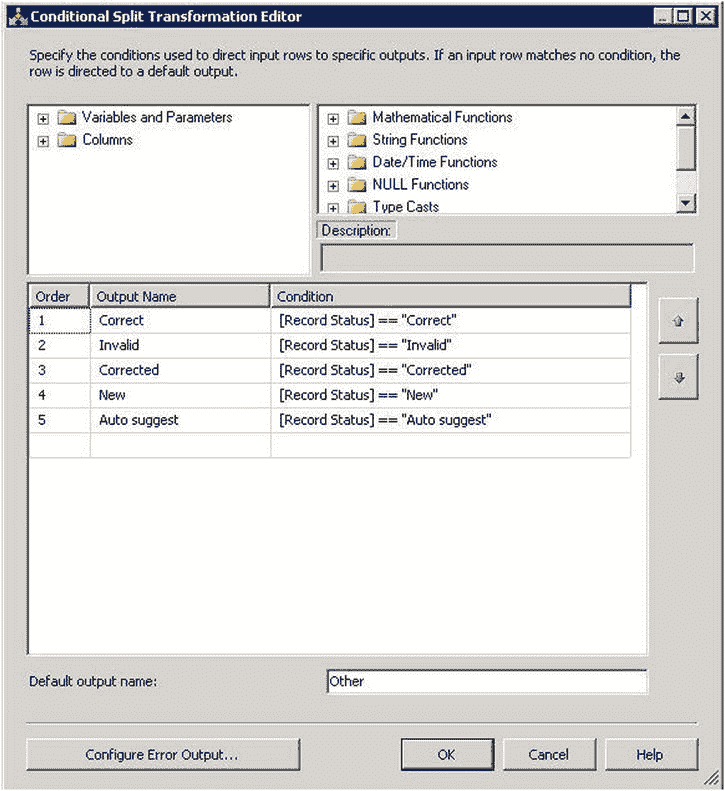

**图 5-11**. 配置为处理 DQS `记录状态` 的条件拆分转换

**表 5-4**. 列状态值

| 选项 | 描述 |
| --- | --- |
| `正确` | 该值已经正确，无需进一步修改。`已更正` 列将包含原始值。 |
| `无效` | 域包含将此值标记为无效的验证规则。 |
| `已更正` | 该值不正确，但 DQS 能够纠正它。`已更正` 列将包含修改后的值。 |
| `新建` | 该值不在当前域中，且与任何域规则都不匹配。DQS 无法确定其是否有效。该值应被重定向并手动检查。 |
| `自动建议` | 该值不是完全匹配项，但 DQS 提供了建议。如果您包含 `置信度` 字段，则可以自动接受高于特定置信度阈值的行，并将其他行重定向到单独的表以供后续审查。 |

 `注意` 列状态值是本地化的；实际字符串会根据 SQL Server 安装的语言而改变。如果您的包需要在不同的系统区域设置下运行，这可能要求您在条件拆分表达式中添加额外的处理逻辑。有关状态值的更多信息，请参阅联机丛书中的“数据清洗”页面：`http://msdn.microsoft.com/en-us/library/gg524800.aspx`。

您处理的状态值以及使用的下游数据流逻辑将取决于数据清洗过程的目标。通常，您会希望将行拆分为两条路径。`正确`、`已更正` 和 `自动建议` 行将走一条路径，该路径将使用清洗后的数据值（在 `<列名>_ 输出` 列中找到）更新您的目标表。`新建` 和 `无效` 行通常会进入一个单独的表，以便之后有人可以检查它们，并相应地更正数据（对于 `无效` 行）或更新知识库（对于 `新建` 行），以便将来可以自动处理这些值。您可能希望检查 `自动建议` 行的置信度级别 (`<列名>_ 置信度`)，以确保其达到最低阈值。图 5-12 显示了一个 SSIS 数据流，其中包含处理 DQS 清洗转换后行的逻辑。

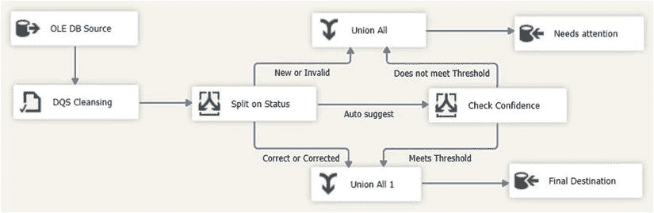

**图 5-12**. DQS 清洗转换后的数据流处理逻辑

 `注意` 虽然 DQS 清洗转换输出的 `置信度` 列是数值型的，但它们作为 `DT_WSTR(100)` 列（字符串）输出。要检查置信度级别是否高于最低阈值，您需要将该值强制转换为 `DT_R4`（单精度浮点数）或 `DT_R8`（双精度浮点数）。

### 性能注意事项


数据清洗可能是一个`CPU`和内存密集型操作，可能需要一些时间才能完成。依赖在线参考数据服务的域可能会将传入数据往返发送到`Azure Data Marketplace`，这将进一步影响清洗数据所需的时间。因此，在处理大量数据时，您通常需要在通过`DQS 清洗`转换之前先缩减您的数据集。

`DQS 清洗`转换将传入数据发送到`DQS`服务器（在`SQL Server`实例中运行），实际的清洗操作在那里执行。虽然这可以卸载`SSIS`机器执行的大量工作，但通过网络将数据发送到另一台服务器可能会带来一些开销。另一件需要注意的事情是，`DQS 清洗`转换是一个异步组件，这意味着它在运行时会复制数据流缓冲区。这会进一步影响数据流的性能，也是只传递需要清洗的行的另一个原因。

以下部分介绍了一些程序包设计技巧，可用于在使用`DQS 清洗`转换清洗数据时提高整体性能。

### 并行处理

`DQS 清洗`转换一次将一批行发送到`DQS`服务器。如果您的系统上有大量空闲`CPU`资源，这种单线程方法并不理想，因此以允许`DQS`并行向服务器发送多个批次的方式设计您的程序包，将带来性能提升。您有两个主要的并行处理选项。首先，您可以将传入行拆分到多条路径上，并在每条路径上使用一个单独的`DQS 清洗`转换执行相同的工作集。如果您的数据集有一个键或行，可以使用`SSIS`表达式轻松拆分，则可以使用`条件拆分`转换。否则，您可以考虑使用第三方组件，如`Balanced Data Distributor`。第二种方法是设计您的数据流，使得可以并行运行程序包的多个实例。要使此方法奏效，您需要对源查询进行分区，使其检索特定的键范围，而程序包的每个实例将处理不同的范围。这种方法提供了更大的灵活性，因为您可以通过调整键范围来动态控制并行运行的程序包实例数量。

 **注意** 您可能会发现`DQS 客户端`执行其清洗操作的速度比`SSIS`中的`DQS 清洗`转换更快。这是因为客户端默认并行处理多个批次，而`DQS 清洗`转换则一次处理一个批次。要在`SSIS`中获得与在`DQS 客户端`中相同的性能，您需要添加自己的并行处理。

### 追踪哪些行已被清洗

您可以追踪哪些行已经过清洗以及清洗操作执行的时间。这允许您过滤掉已经清洗过的行，从而无需再次处理它们。通过为此标记使用日期值，如果您的知识库得到更新，您还可以确定哪些行需要重新处理。请记住，随着知识库的变化和清洗规则的改进，每次数据通过`DQS 清洗`转换处理时，您都会获得更准确的结果。

要追踪行何时被清洗，请在目标表中添加一个新的`datetime`列（`DateLastCleansed`）。`NULL`或非常早的日期值可用于表示某行从未被处理过。或者，您可以在一个单独的表中追踪日期，通过外键约束链接到原始行。您的`SSIS`程序包将包含以下逻辑：

1.  使用`执行 SQL`任务检索`DQS`知识库上次更新的日期。此值应存储在程序包变量（`@[User::DQS_KB_Date]`）中。
2.  在`数据流`任务内部，使用适当的源组件检索要清洗的数据。源数据应包含一个`DateLastCleansed`列，用于追踪该行上次使用`DQS 清洗`转换处理的时间。
3.  使用`条件拆分`转换将`DQS`知识库日期与该行上次处理的日期进行比较。表达式可能如下所示：`[DateLastCleansed] < @[User::DQS_KB_Date]`。匹配此表达式的行将被定向到`DQS 清洗`转换。
4.  根据其状态处理已清洗的行。
5.  使用`派生列`转换设置新的`DateLastCleansed`值。
6.  用任何更正后的值和新的`DateLastCleansed`值更新目标表。

### 使用查找转换筛选行

您可以通过使用更快的数据流组件（例如`查找`转换）验证数据，来减少需要清洗的行数。使用一个或多个`查找`转换，您可以通过快速的内存中比较来检查值是否存在于引用表中。匹配现有值的行可以被过滤掉。然后，值在引用表中未找到的行可以被发送到`数据质量服务`进行清洗。以这种方式进行预筛选意味着您将无法利用`DQS`提供的标准化格式，这使得涉及多个字段之间关系的复杂验证变得困难。当您处理少量不相关的字段，且这些字段在清洗过程中不需要任何特殊格式时，此方法效果最佳。

要使用此模式，您的数据流将使用以下逻辑：

1.  使用源组件检索包含要清洗字段的数据。
2.  在没有匹配条目时，将组件设置为`忽略失败`。
3.  为您要清洗的每个字段添加一个`查找`转换。每个`查找`转换将使用一个`SQL`查询，该查询拉取该字段的唯一值集合和一个静态`布尔`（`bit`）值。此静态值将用作标志，以确定是否找到了该值。由于您忽略了查找失败，如果查找未能找到匹配项，标志值将为`NULL`。清单 5-2 展示了针对来自`DimGeography`表的`CountryRegionCode`字段，查询的样子。

**清单 5-2**. `CountryRegionCode`字段的示例查找查询

```sql
SELECT DISTINCT CountryRegionCode, 1 as [RegionCodeFlag]
FROM [dbo].[DimGeography]
```

4.  在`列`选项卡上，将字段映射到相关的查找列，并将静态标志值作为新列添加到数据流中（如图 5-13 所示）。

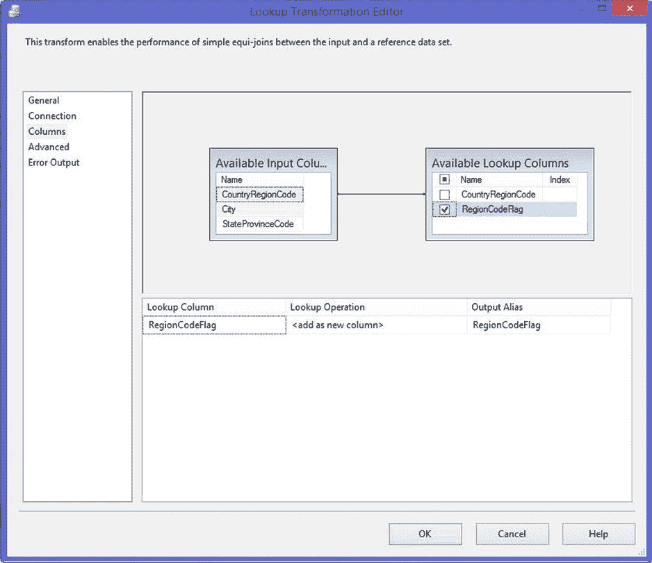

图 5-13. `查找`转换的列映射

5.  为您将清洗的每个字段重复步骤 3-4。`查找`转换应使用`查找匹配`输出连接。
6.  添加一个`条件拆分`转换，其中包含一个检查每个标志字段的单一表达式。如果任何标志字段为`NULL`，则应将该行发送到`DQS`进行正确的清洗。例如，检查`RegionCodeFlag`是否为`NULL`值的表达式将是`ISNULL([RegionCodeFlag])`。
7.  将您创建的`条件拆分`输出连接到`DQS 清洗`转换。进入`条件拆分`默认输出的行可以被忽略（因为它们的值已使用`查找`转换成功验证）。
8.  根据处理`DQS 清洗`转换输出的适当逻辑完成数据流的其余部分。


图 5-14 展示了一个使用前述逻辑清洗单个字段的数据流截图。

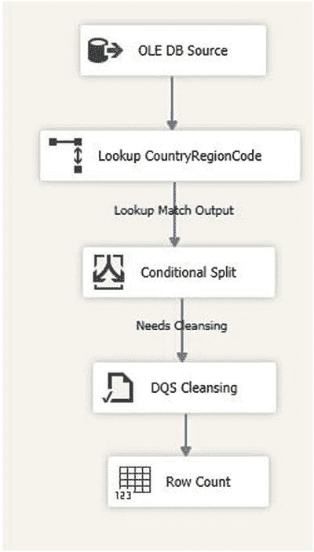

图 5-14. 使用查找转换预过滤行完成的数据流

 **注意** 当查找属于主数据服务（MDS）实体的键字段时，此方法特别有效。MDS 是随 SQL Server 2014 一起提供的另一款产品。使用 MDS 订阅视图，可以将您的维度公开为可由查找转换查询的视图。有关主数据服务的更多信息，请参阅在线丛书条目：`http://msdn.microsoft.com/en-us/library/ee633763.aspx`。

### 批准和导入清洗规则

运行包含 DQS 清洗转换的数据流时，会在 DQS 服务器上创建一个清洗项目。这使得知识库（KB）编辑器可以查看该转换执行的修正操作，并批准或拒绝规则。每次运行包时都会自动创建一个新项目，可以使用 DQS 客户端查看。当在单个数据流中使用多个 DQS 清洗转换并行执行清洗时，将为您使用的每个转换创建一个项目。

一旦知识库编辑器批准了修正规则，就可以将它们导入知识库，以便下次执行清洗时自动应用。此过程可以通过以下步骤完成：

1.  运行包含 DQS 清洗转换的 SSIS 包。
2.  打开 DQS 客户端，并连接到 SSIS 包使用的 DQS 服务器。
3.  单击“打开数据质量项目”按钮。
4.  新创建的项目将列在左侧窗格中（如图 5-15 所示）。项目名称将使用包的名称、DQS 清洗转换的名称、包执行的时间戳、包含该转换的数据流任务的唯一标识符以及该包特定执行的另一个唯一标识符来生成。

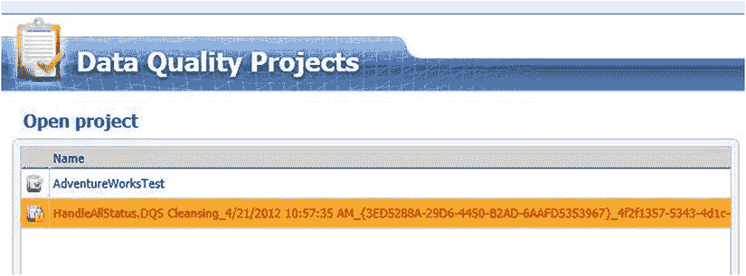

图 5-15. 运行 DQS 清洗转换将在 DQS 服务器上创建一个项目

5.  选择项目名称将在右侧窗格中显示详细信息（如图 5-16 所示），例如此次清洗活动中使用的域。

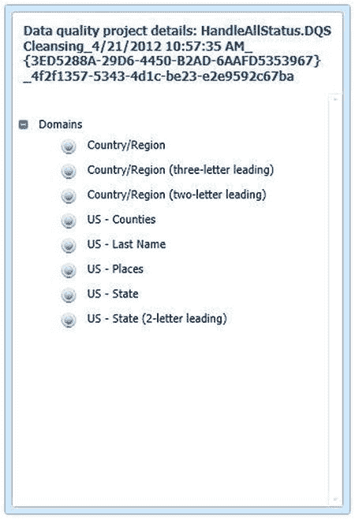

图 5-16. 选择项目将显示此活动中使用的域

6.  单击“下一步”打开项目。
7.  选择您想要审核修正的域。
8.  为每个修正单击“批准”或“拒绝”单选按钮，或更改条目的“修正为”值。
9.  完成规则处理后，单击“下一步”按钮。
10. （可选）将修正后的数据导出到 SQL Server、CSV 或 Excel。在大多数情况下，您可以跳过此步骤，因为您的 SSIS 包将负责处理修正后的数据。
11. 单击“完成”按钮关闭项目。
12. 在主屏幕上，选择您的知识库，然后选择“域管理”活动。
13. 选择您已为其定义新规则的域。
14. 单击“域值”选项卡。
15. 单击“导入值”按钮，然后选择“导入项目值”（如图 5-17 所示）。

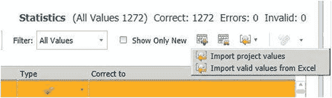

图 5-17. 从现有项目导入域值

16. 对您希望更新的每个域重复步骤 13-15。
17. 单击“完成”按钮以发布您的知识库更改。
18. 如果您修改了任何修正规则，您可能需要重新运行 SSIS 包以获取新值。

### 结论

本章介绍了新的 DQS 清洗转换，以及如何利用它来发挥 SQL Server 2014 中数据质量服务提供的高级数据清洗功能。本章详述的设计模式将帮助您在用 SSIS 进行数据清洗时获得最佳性能。

# 第 6 章


### DB2 源模式

在前一章中，您了解了与 SQL Server 源相关的模式。在本章中，我们将继续讨论与从 IBM DB2 数据库获取数据相关的模式。DB2 描述了多种数据库，因此了解我们将要讨论的不同数据库以及如何将每个数据库用作 Integration Services 源至关重要。

正如我们在第 4 章中所述，设置一个源涉及四个不同的对象：`连接管理器`、`提供程序`、`源组件`和`源组件查询`。虽然这对 DB2 数据库同样适用，但您需要首先采取额外的步骤来确定您拥有的数据库类型。DB2 有多种类型、提供程序和查询数据的方式。在我们研究与这些组件相关的不同模式时，请设想它们如何与其他源配合工作。结合这些步骤将使您走上从 DB2 数据库提取数据的正确道路。

本章重点介绍连接 DB2 数据库时可能有用的模式，但并未涵盖您在环境中可能遇到的所有可能情况。

#### DB2 数据库家族

当今市场上有几种不同类型的 DB2 数据库。如何连接数据库取决于 DB2 版本。DB2 将其产品分为三组：

*   `DB2 for i`：该版本多年来经历了多个名称，包括 DB2 for AS/400、iSeries、System I 和 Power Systems。DB2 包含在此服务器中，因此人们通常在想到 DB2 时指的是这个版本。
*   `DB2 for z/OS`：此 DB2 版本是 z/OS 平台的主要数据库，仅以 64 位模式提供。
*   `DB2 for LUW`：此版本的 DB2 是 DB2 家族的后期成员。适用于 Linux、UNIX 和 Windows（LUW）的版本根据数据库实例的用途提供多种版本。有关这些版本的更多信息可在 IBM 网站上找到。

不同的产品类型会影响您从 Integration Services 查询数据的方式。在我们指导您设置连接时，将根据产品类型指出您需要注意的一些差异。您首先需要做的是选择连接管理器中使用的提供程序。

#### 选择 DB2 提供程序

从 DB2 提取数据的第一步是选择一个可在您的环境中使用的提供程序。完成此任务有两个步骤：

1.  查找数据库版本。
2.  选择提供程序供应商。

##### 查找数据库版本

选择 DB2 提供程序的第一步是了解您拥有的版本。将版本信息与产品类型结合将帮助您选择要使用的提供程序。如果不确定您使用的是哪种类型的服务器，您有几个选择。第一个选择是使用 DB2 管理工具检查实例的属性。例如，如果您使用控制中心，可以右键单击实例名称，然后单击“关于”菜单选项。这将显示类似于图 6-1 的内容。

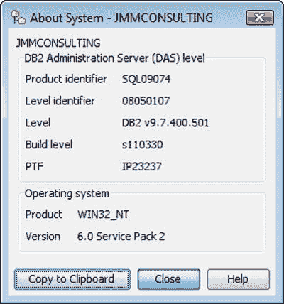

图 6-1. 控制中心关于系统窗口，显示数据库版本和信息


如果您无法直接连接到数据库实例，也可以改为针对数据库运行查询以获取相同信息。一个展示此信息的示例查询可参见代码清单 6-1；其结果如图 6-2 所示。

**代码清单 6-1**. 用于显示数据库版本和信息的示例查询

```sql
SELECT inst_name
, release_num
, service_level
, bld_level
, ptf
, fixpack_num
FROM TABLE (sysproc.env_get_inst_info())
```

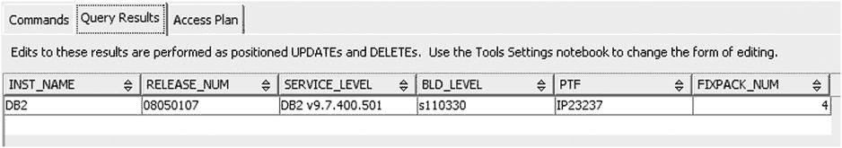

图 6-2. 显示数据库版本和信息的查询结果

### 选择提供程序供应商

虽然可以使用 ODBC 和 ADO.NET 连接到 DB2 数据库，但本章我们将重点介绍 OLE DB 提供程序，以确保该连接可用于所有转换。以下是两种较常见的提供程序及其适用场景。

*   **IBM OLE DB Provider for DB2：** IBM 生产了自己的 OLE DB 提供程序，可用于 Integration Services 等应用程序。此提供程序适用于所有版本和最新产品。
*   **Microsoft OLE DB Provider for DB2 Version 4.0：** Microsoft 创建了一个使用 OLE DB 连接到 DB2 的提供程序。此提供程序可用于所有版本的 DB2。请参阅最新文档以了解它支持的产品编号。

请务必确保根据数据库服务器选择了 32 位或 64 位版本。同时确保数据库版本与您要使用的提供程序所支持的版本和产品相匹配。我们建议使用您组织中最常用的提供程序，以简化开发和维护。如果您是首次尝试某个提供程序，请尝试不同的版本以查看哪种最适合您，因为性能和安全性差异可能因环境而异。

### 连接到 DB2 数据库

本章中，我们将使用 Microsoft OLE DB Provider for DB2。无论您选择哪种提供程序，下一步都是建立到 DB2 数据库的连接。为此，您需要创建一个连接管理器，选择正确的提供程序，并填写适当的服务器信息。

下载所需的提供程序后，您将在用于开发和执行 Integration Services 包的服务器上安装它。如果提供程序安装正确，您可以通过打开“源辅助工具”来查看它。正确安装的提供程序如图 6-3 所示。

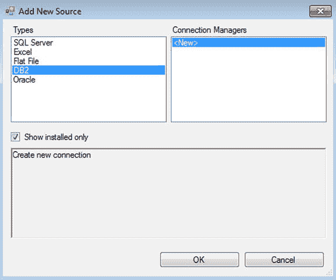

图 6-3. “源辅助工具”的“添加新源”窗口

首先在包的“解决方案资源管理器”中创建一个共享的 OLE DB 连接管理器。在“连接管理器”窗口顶部的提供程序下拉列表中，将提供程序更改为 Microsoft OLE DB Provider for DB2，如图 6-4 所示。

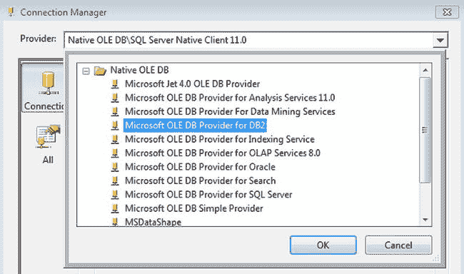

图 6-4. “连接管理器”窗口的提供程序列表

接下来，您可以添加数据库实例的名称、正确的身份验证方法以及要连接的数据库。如果您愿意，可以直接在源的“连接”属性中输入连接字符串。

 **注意** 如果您对正确的连接字符串有疑问，`www.connectionstrings.com` 是一个很好的资源，可以解答您的问题。

除了告诉 Integration Services 如何连接到 DB2 数据库外，您还需要告诉 Integration Services 如何查看数据。数据库使用编码方案和字符代码集来存储数据。以下是您需要了解的两种编码方案：

*   **ASCII：** 美国信息交换标准代码是一种 7 位编码方案，包含 128 个可打印和不可打印字符。
*   **EBCDIC：** 扩展的二进制编码十进制交换码由 IBM 创建，是一种在其大型机服务器中使用的 8 位编码方案。

DB2 for i 和 DB2 for z/OS 都使用 EBCDIC 编码方案，而 DB2 for LUW 使用 ASCII 编码方案。通常，EBCDIC 方案使用代码集编号 37，而 DB2 for LUW 使用 ANSI-1252 代码集。使用 Microsoft OLE DB Provider for DB2 时，下一步是根据您使用的版本修改代码集。

首先在“连接管理器”中 OLE DB 提供程序名称旁边单击“数据链接”按钮，如图 6-5 所示。

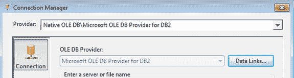

图 6-5. “连接管理器”窗口上的“数据链接”按钮

“数据链接属性”窗口应打开。在“高级”选项卡下，“主机 CCSID”属性中，您可以使用默认值 EBCDIC - U.S./Canada [37]，或将其更改为 ANSI - Latin I [1252]，如图 6-6 所示。此外，如果您看到的输出看起来像数据类型名称而不是您的数据，可能需要选中“将二进制数据作为字符处理”选项。

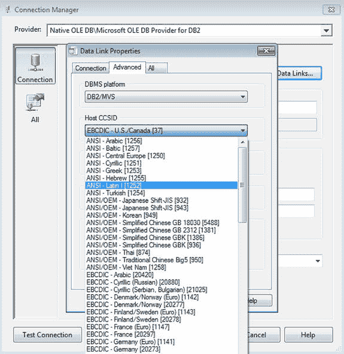

图 6-6. 带有主机 CCSID 列表的“数据链接属性”窗口

### 查询 DB2 数据库

最后一组 DB2 源模式涵盖了查询 DB2 数据库。由于 Integration Services 包使用 OLE DB 提供程序，因此它也需要一个 OLE DB 源组件。与任何其他数据库一样，源组件应指向已创建的 DB2 连接管理器。一旦包成功连接到数据库，就可以开始查询数据库了。

 **注意** 许多公司提供了 Integration Services 连接管理器和源组件的替代品。它们提供的接口和功能与 OLE DB 源组件不同。如果您需要额外的功能，例如 EBCDIC 到 ASCII 的转换，请参阅 aminoSoftware 的 Lysine EBCDIC 源。

所有源组件查询都使用数据库使用的 SQL 品牌编写。DB2 特定的 RDBMS 语言称为 SQL PL，较高版本也可以使用 PL/SQL。如果您收到有关语法的错误消息，请确保您的语法符合 IBM 网站上的指南：`http://publib.boulder.ibm.com/infocenter/db2luw/v9r7/index.jsp?topic=/com.ibm.db2.luw.apdv.plsql.doc/doc/c0053607.html`。

在某些情况下，您可能希望使用参数来限制从数据库返回的数据。现在让我们看看如何参数化您的查询。

#### DB2 源组件参数

编写源查询的一个重要部分是它允许您筛选进入管道的数据。您希望这样做的原因有很多，包括增量加载数据、为不同部门重用同一个包，或减少一次运行的数据量。使用 Microsoft OLE DB Provider for DB2 时，您需要将“派生参数”属性设置为 `True`。您可以在连接管理器中找到此属性：单击“数据链接”按钮，在出现的“数据链接属性”窗口中，选择“全部”选项卡。当您在属性列表中单击“派生参数”时，会出现一个“编辑属性值”窗口，如图 6-7 所示。

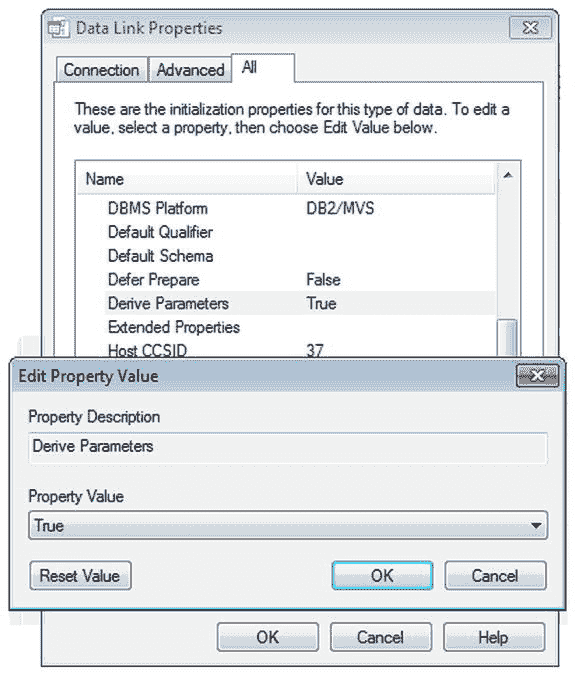

图 6-7. “数据链接属性”窗口上的“编辑属性值”窗口


### DB2 参数化查询与动态查询

一旦设置好 Derive Parameters 属性，您就可以使用问号来编写查询，类似于 Listing 6-2 中的示例。将查询放入源组件的 SQL 命令中。

***Listing 6-2***. 用于说明 DB2 参数的示例查询
```sql
SELECT col1
        , col2
        , col3
FROM tab1
WHERE col4 = ?
```

请务必点击源中查询旁边的 Parameters 按钮，为设置的每个参数分配变量。确保 Parameters 窗口中的变量列表与查询中的顺序正确匹配。

有些场景下使用查询参数可能无效。让我们来看看何时不能使用查询参数以及替代方案。

### DB2 源组件动态查询

如果源查询的内容因任何原因需要更改，参数化查询将无法工作。作为查询内容的一部分，表名、架构名或列名可能会改变。DB2 中的一个典型例子是每个环境都有不同的架构。为了解决这个问题，我们在变量上设置表达式，并在 `SQLStatement` 属性中使用该变量。让我们逐步了解设置过程。

首先创建两个字符串变量：`environment` 和 `query`。在 `query` 变量上设置以下属性：
```
EvaluateAsExpression: True
Value: "select col1, col2 from" + @environment + ".tab1"
```

 **注意** 在 SQL Server 2012 之前的 Integration Services 版本中，表达式有 4000 个字符的限制。现在此限制已取消，允许您根据需要创建任意长度的字符串。

在 OLE DB 源组件中，将查询类型更改为 SQL Command from Variable，并选择您刚刚设置的 `query` 变量，如 Figure 6-8 所示。

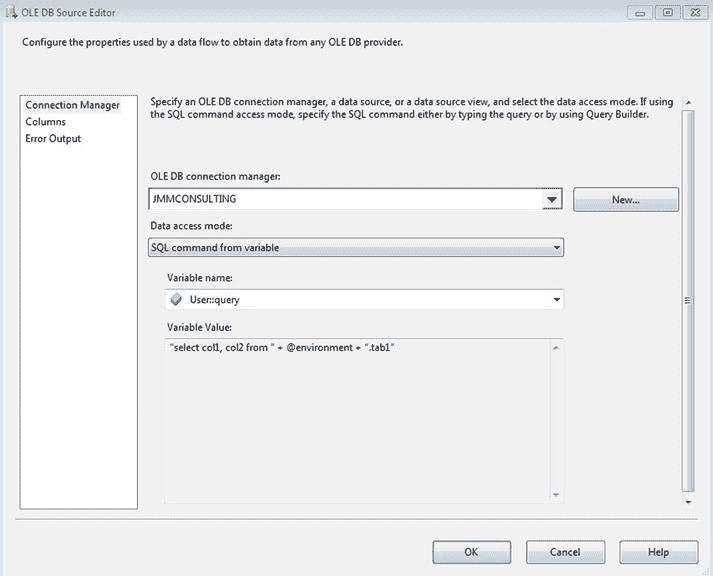

Figure 6-8. 配置了动态查询属性的 OLE DB 源编辑器

当此包运行时，使用包参数传入正确的环境架构名称。`query` 变量上的表达式将被设置为新的查询并正确执行。确保将 OLE DB 源上的 `ValidateExternalMetadata` 属性设置为 `False`，以确保包验证成功。

### 总结

本章介绍了连接 IBM DB2 数据库不同类型所需的多种模式。您学习了如何确定您拥有的 DB2 数据库类型、如何选择合适的提供程序以及查询数据库的不同方法。请注意，有些组织在处理 DB2 时会采取不同的途径：将数据导出到文件，然后使用 SSIS 加载该文件。如果存在网络延迟或连接到 DB2 数据库的问题，这是一个完全有效的选项，对您来说可能更有意义。如果您决定采用此方法，可以学习如何使用扁平文件源模式加载数据，这将在第 7 章中讨论。

# 第 7 章


### 扁平文件源模式

在系统之间传输数据的一种常见方法是将源数据导出到扁平文件，然后将该文件的内容导入目标数据库。扁平文件有各种形状、大小和类型。没有行长度限制。文件大小受操作系统允许的最大大小限制。在检查扁平文件类型时，有两个初步考虑因素：文件格式和模式。扁平文件源的常见文件格式包括：

*   逗号分隔值 (CSV)
*   制表符分隔文件 (TDF)
*   固定宽度文件

在扁平文件中，与数据库一样，模式包含列和数据类型。模式选项还允许更奇特的文件格式选项，例如“ragged right”和“variable-length rows”扁平文件。

在本章中，我们将研究将普通扁平文件源加载到 SQL Server 中的常见模式；然后扩展该模式以加载可变行长扁平文件源。接下来，我们将研究创建和使用某些扁平文件格式中常见的文件头行。最后，我们将构建一个非常有用的 SSIS 设计模式：归档文件。

#### 扁平文件源

让我们从一个简单的扁平文件源开始。您可以将下面的数据复制并粘贴到记事本等文本编辑器中，并将其另存为 `MyFlatFile.csv`：
```
RecordType,Name,Value
A,Simple One,11
B,Simple Two,22
C,Simple Three,33
A,Simple Four,44
C,Simple Five,55
B,Simple Six,66
```

列名位于第一行。这很方便，但您并不总能在第一行获得列名——或者在源扁平文件中的任何地方获得。

在离开演示项目的设置阶段之前，让我们创建一个名为 `StagingDB` 的数据库，用作目标。我使用 Listing 7-1 中的可重复执行 T-SQL 脚本来创建 `StagingDB` 数据库。

***Listing 7-1***. 创建 StagingDB
```sql
use master
go

If Not Exists(Select name
              From sys.databases
              Where name='StagingDB')
 begin
  print 'Creating StagingDB database'
  Create Database StagingDB
  print 'StagingDB database created'
 end
Else
 print 'StagingDb database already exists.'
```

在可用于测试和开发的服务器上执行此脚本。现在您已准备好开始构建演示！

#### 转到 SSIS！

打开 SQL Server Data Tools - Business Intelligence (SSDT-BI) 并创建一个名为 **Chapter 7** 的新 SSIS 项目，并将初始包重命名为 **Chapter7.dtsx**。将数据流任务拖到控制流画布上，然后双击它以打开编辑选项卡。

有几种方法可以为数据流创建扁平文件源：您可以使用源助手，也可以展开数据流 SSIS 工具箱中的其他源并配置扁平文件源适配器。让我们使用后一种方法：将扁平文件源适配器从数据流工具箱拖到数据流画布上并打开编辑器。Figure 7-1 显示了扁平文件源编辑器的连接管理器页面。

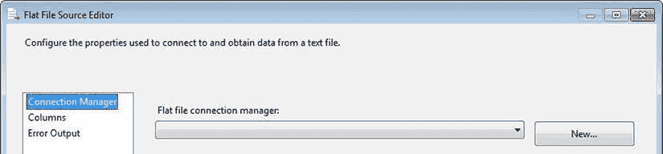

Figure 7-1. 扁平文件源编辑器连接管理器配置

由于这个新的 SSIS 项目中没有定义连接管理器，请单击扁平文件连接管理器下拉列表旁边的“新建”按钮以打开扁平文件源编辑器。在“常规”页面上，将连接管理器命名为 **My Flat File**。单击“文件名”文本框旁的“浏览”按钮，并导航到保存 `MyFlatFile.csv` 的位置。

请注意，默认情况下，“文件名”文本框仅显示 `.txt` 文件。将筛选器更改为 `*.csv` 以便查看并选择 `MyFlatFile.csv`。

如 Figure 7-2 所示，选中“第一行数据中包含列名称”复选框：

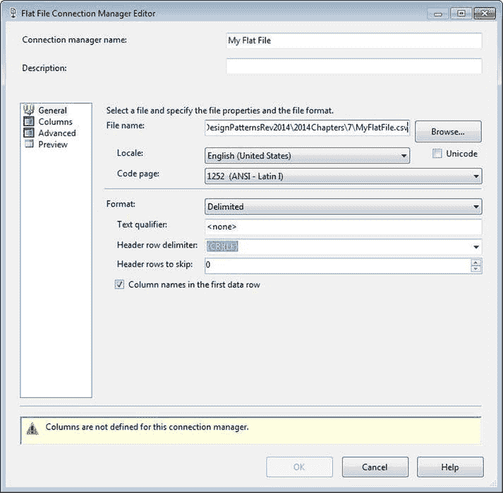

Figure 7-2. 配置 My Flat File 连接管理器

请注意窗口底部的警告：此连接管理器的列尚未定义。对于格式正确的简单 CSV 文件，SSIS 现在有足够的信息来读取扁平文件的模式并完成连接管理器的映射。Figure 7-3 显示了用于定义列和行分隔符的“列”页面。

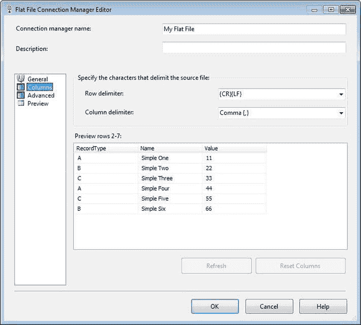

Figure 7-3. 扁平文件连接管理器编辑器的“列”页面

默认情况下，扁平文件中的所有数据都是文本。

单击“确定”按钮关闭扁平文件连接管理器编辑器，然后单击“确定”按钮关闭扁平文件源编辑器。

#### 强类型化数据


### 为何需要使用强类型数据？

以我们示例中的 `Value` 列为例。目前，`Value` 是 `DT_STR` 数据类型，但该列包含的是数值数据。实际上，这些数值数据是整数。根据联机丛书，在 SQL Server 中，`INT` 数据类型占用 4 字节，范围从 –2³¹ (–2,147,483,648) 到 2³¹ – 1 (2,147,483,647)。如果你想将整数值 –2,147,483,600 存储为文本，这将至少消耗每个字符 1 字节。在本例中，这至少是 11 字节（不计算逗号），根据所选数据类型，可能还会占用更多字节。将这些数据转换为 `DT_I4` 数据类型允许我用 4 字节存储该值。作为额外的好处，数据是数值型的，因此对此字段的排序性能将优于对字符串数据类型的排序。

### 操作数据类型

让我们来操作平面文件连接管理器和源适配器提供的数据类型。将一个派生列转换拖放到数据流画布上，并从平面文件源到新的派生列转换连接一条数据流路径。双击它以打开编辑器。

在派生列编辑器右上部分的列表框中，展开 SSIS 表达式语言函数中的 `Type Casts` 虚拟文件夹。将一个 `DT_STR` 类型转换拖放到编辑器下部区域派生列网格第一行的 `Expression` 单元格中。网格的 `Derived Column` 列默认为 “<add as="" new="" column="">”，但允许你选择替换流经转换的任何行中的值。你可以在行流经派生列转换时更改其值，但不能更改数据类型（而这正是你将要做的），因此你需要向数据流中添加一个新列。默认的派生列名称是 `Derived Column` *n*，其中 *n* 是在转换中配置的列的从 1 开始的数组。将默认的派生列名称更改为 `` `strRecordType` ``。返回到 `Expression` 单元格，并通过将 *«length»* 占位符文本替换为所需的字段长度：1，来完成 `DT_STR` 强制转换函数。接下来，将 *«code_page»* 占位符替换为与你的 Windows 代码页标识符匹配的数字。对于美式英语，这个数字是 1252。要完成配置，请在派生列转换编辑器左上部分的“可用输入”列表框中展开 `Columns` 虚拟文件夹，并将 `RecordType` 列拖放到你刚刚配置的 `DT_STR` 强制转换函数右侧的 `Expression` 单元格中。

当你在编辑器中点击其他任何位置时，转换的逻辑会验证该表达式。这其实一直在发生；当表达式状态出现问题时，`Expression` 中的文本颜色会变为红色。当你现在离开 `Expression` 单元格时，表达式 `(DT_STR, 1, 1252) [RecordType]` 应该能通过验证。文本应变回黑色，表示表达式有效。

你可以类似地创建带有强制转换表达式的其他列，以操作流经数据流的其它字段的数据类型。图 7-4 展示了我在完成派生列转换编辑后的示例情况。

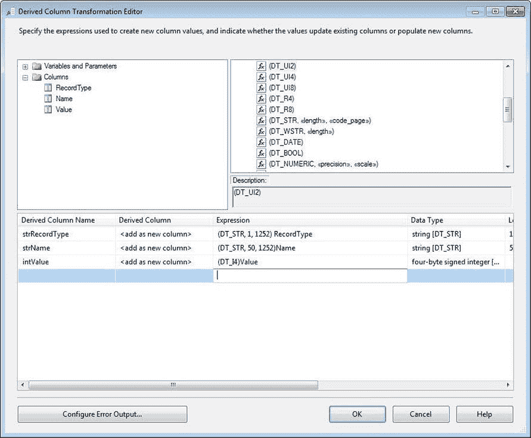

图 7-4. 已配置的派生列转换

### 引入数据暂存模式

数据暂存是一个重要的概念。每个 ETL 开发人员对暂存数据的最佳方式都有自己的想法和意见，并且每个人都认为自己的方式最好！（这是应该的……我们需要自信的 ETL 开发人员）。在我看来，数据集成需求决定了暂存的数量和类型。

对于平面文件，将所有数据复制到暂存表中是一种模式。一旦数据被捕获为可查询格式（关系数据库），在加载到目标数据仓库或数据集市之前，它们可以通过大量转换进行操作和塑形。

除了平面文件，暂存还支持任何 ETL 解决方案提取阶段的一个关键原则：尽可能少地影响源系统记录。通常，构建 ETL 解决方案的一个重要业务驱动因素是出于报告目的查询系统记录中的数据存在困难。ETL 的首要目标类似于希波克拉底誓言：“*Primum non nocere*”（首先，不伤害）。

一些 ETL 的暂存需求适合存储所有源数据的副本，无论是否来自平面文件。其他需求则允许在暂存前应用一些转换逻辑。正确的答案是什么？“视情况而定。”在我看来，将数据从文本源复制并放入关系数据库的行为本身就代表了一种转换。

于是，这就形成了一种数据暂存模式：将数据直接从平面文件复制到数据库中。为此，让我们完成我们已经开始的示例。

将一个 OLE DB 目标适配器拖放到数据流画布上，并从派生列转换到 OLE DB 目标连接一条数据流路径。在继续之前，双击数据流路径以打开其编辑器，然后点击“元数据”选项卡。你会看到类似 图 7-5 的内容。

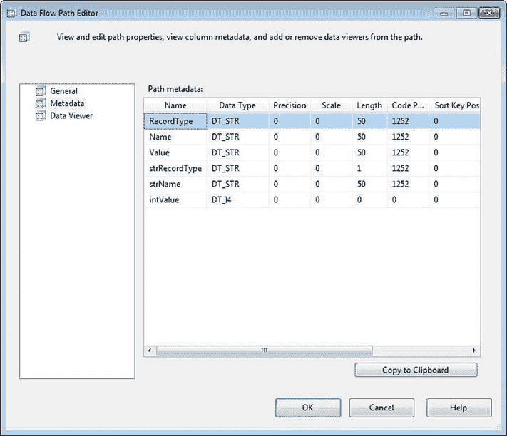

图 7-5. 数据流路径内部

我经常将数据流中的缓冲区描述为“类表的”。这是我编造的一个形容词，但它很贴切。数据流路径的这次窥视就是证据。我们稍后会回到这个题外话。点击“确定”关闭数据流路径编辑器。

将 OLE DB 目标适配器重命名为 `` `FlatFileDest` ``。打开 OLE DB 目标编辑器，点击 OLE DB 连接管理器下拉列表旁的“新建”按钮以配置一个 OLE DB 连接管理器。当“配置 OLE DB 连接管理器”窗口显示时，点击“新建”按钮创建一个新的 OLE DB 连接管理器。在“服务器名称”下拉列表中，添加你的测试和开发服务器/实例（与你之前用于创建 `StagingDB` 数据库的服务器/实例相同）。在“选择或输入数据库名称”下拉列表中，选择 `StagingDB`。点击“确定”按钮完成 OLE DB 连接管理器配置，并点击下一个“确定”按钮以选择此新连接管理器用于 OLE DB 目标适配器。将 `Data Access Mode` 属性设置为 `Table or View – Fast Load` 并接受配置的默认属性。点击“表或视图的名称”下拉列表旁的“新建”按钮。“创建表”窗口显示了如 清单 7-2 所示的 T-SQL 数据定义语言（DDL）语句。

***清单 7-2***. 从数据流路径元数据生成的 CREATE TABLE 语句

```
CREATE TABLE [FlatFileDest] (
    [RecordType] varchar(50),
    [Name] varchar(50),
    [Value ] varchar(50),
    [strRecordType] varchar(1),
    [strName] varchar(50),
    [intValue] int
)
```

OLE DB 目标将要创建的表名为 `FlatFileDest`——也就是你给 OLE DB 目标适配器起的名字。列名是从哪里来的呢？没错！来自我们之前查看的数据流路径元数据。当你细想时，这个功能非常酷。


在 `StagingDB` 中存储数据，并不需要所有这些列。既然你是用这张表来暂存来自平面文件的数据，那么就应使用源文件中相同的列名。不过，你也应该使用我们在“派生列”转换中创建的强数据类型。幸运的是，我们的命名约定让这些改动相对容易。只需删除前三列（`RecordType`、`Name` 和 `Value`）的 DDL，然后去掉剩余列名的前三个字母，即可将其重命名为 `RecordType`、`Name` 和 `Value`。清单 7-3 显示了结果。

***清单 7-3***. 修改后的 CREATE TABLE 语句

```sql
CREATE TABLE [FlatFileDest] (
    [RecordType] varchar(1),
    [Name] varchar(50),
    [Value] int
)
```

当你点击“确定”按钮时，DDL 语句会在 `StagingDB` 上执行——创建 `FlatFileDest` 表。这是件好事，因为你的 OLE DB 目标适配器正在警告你需要完成“输入到输出”的映射（如图 7-6 所示）。


图 7-6. 列尚未映射

如图 7-7 所示，当你点击“映射”页面开始映射时，自动映射功能会启动，并发现可以自动完成部分映射：

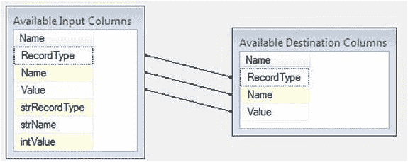

图 7-7. OLE DB 目标自动映射

一个问题是这些字段并不包含你想要加载的数据。你想要加载的是派生列。有几种方法可以纠正映射，但我喜欢通过拖放，将想要映射的字段拖到希望它们映射到的列上。由于映射从定义上说是字段对字段的，新的映射将覆盖现有的（自动）映射。试试看！将 `strRecordType` 字段从“可用输入列”拖到“可用输出列”中的 `RecordType` 单元格。看到了吗？旧的映射已更新。现在将 `strName` 映射到 `Name`，将 `itnValue` 映射到 `Value`，如图 7-8 所示：

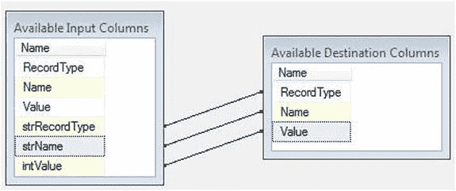

图 7-8. 覆盖自动映射

点击“确定”按钮；你已完成配置 OLE DB 目标适配器。按 `F5` 键在 `SSDT` 调试器中执行 SSIS 包。希望你的数据流任务成功执行，结果如图 7-9 所示。

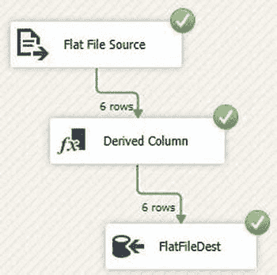

图 7-9. 成功的数据流！

在这个介绍性章节中，我介绍了暂存的概念，并构建了一个将数据从平面文件暂存到数据库表的模式。在此过程中，我们深入探讨了一些数据仓库的思维，并窥探了数据流任务的内部机制。接下来：加载另一种格式的平面文件——一种包含变长行的文件。

### 变长行

变长行平面文件是一种文本源文件。它可以是逗号分隔值（CSV）文件或制表符分隔（TDF）文件。它也可以是固定长度文件，其中列通过位置或序号来识别。“普通”平面文件与变长行平面文件之间的主要区别在于，普通平面文件中的文本位置数量是固定的，而在变长平面文件中，这个数量可以随每一行而变化。

让我们看一个变长平面文件的例子：

```csv
RecordType,Name1,Value1,Name2,Value2,Name3,Value3

A,Multi One,11
B,Multi Two,22,Multi Two A,23
C,Multi Three,33,Multi Three A,34,Multi Three B,345
A,Multi Four,44
C,Multi Five,55,Multi Five A,56,Multi Five B,567
B,Multi Six,66,Multi Six A,67
```

这里有七个潜在的列：`RecordType`、`Name1`、`Value1`、`Name2`、`Value2`、`Name3` 和 `Value3`。并非所有行都包含七个值。实际上，第一行只包含三个值：

```csv
A, Multi One,11
```

在这种格式中，`RecordType` 位于第一列，它表示该行中预期包含多少列数据。`RecordType` 为 `A` 的行包含三个值，`RecordType` 为 `B` 的行包含五个值，而 `RecordType` 为 `C` 的行包含七个值。

#### 读入数据流

通常使用平面文件连接管理器将数据从平面文件加载到 SSIS 数据流中。让我们一起为这个文件配置一个平面文件连接管理器。

如果你想跟着操作，请向你的 SSIS 项目添加一个新的 SSIS 包，命名为 `VariableLengthRows.dtsx`。向控制流中添加一个数据流任务，并打开数据流编辑器（选项卡）。将一个平面文件源适配器拖到数据流任务画布上，并打开其编辑器。点击“新建”按钮以创建一个新的平面文件连接管理器。

我将我的平面文件连接管理器命名为 `Variable-Length File`。我用上面示例中的数据创建了一个文本文件，并将其命名为 `VarLenRows.csv`。我保存了文件，并在“文件名”属性中浏览到该位置。我还勾选了“首行数据包含列名称”复选框。当我点击“列”页面时，平面文件连接管理器编辑器如图 7-10 所示。

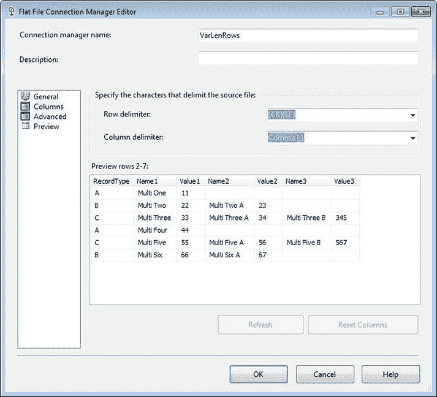

图 7-10. 为包含变长行的平面文件配置平面文件连接管理器

这种行为与 SSIS 的早期版本不同。在之前的版本中，平面文件连接管理器会引发错误。我在一篇题为 *SSIS 设计模式：加载变长行* (`http://sqlblog.com/blogs/andy_leonard/archive/2010/05/18/ssis-design-pattern-loading-variable-length-rows.aspx`) 的博客文章中讨论了这一点。那篇文章启发了本章的创作。

#### 拆分记录类型

得益于 SSIS 2014 版本平面文件连接管理器的新功能，我们获得了作为独立行传入的所有数据。但数据行包含不同类型的信息。需要根据记录类型对这些行进行筛选。我仿佛能听到你在想：“很好，Andy。那现在怎么办？”我很高兴你这么问！现在我们需要在数据流经数据流任务时解析数据。有几种方法可以实现，但我喜欢使用条件拆分。

将一个条件拆分转换拖到数据流任务画布上，并从平面文件源适配器连接一条数据流路径到条件拆分。打开该转换的编辑器。在网格的“输出名称”列中，输入 `TypeA`。将 `RecordType` 列拖入（或键入）相应的“条件”框，并附加文本 `== “A”`（注意“A”在双引号内）。为每个记录类型重复此操作，`== “B”` 和 `== “C”`，如图 7-11 所示。

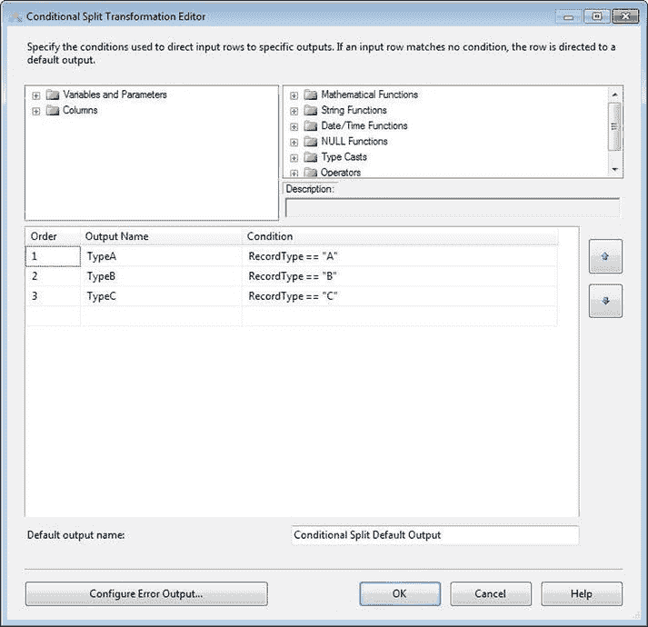

图 7-11. 配置脚本组件输入

点击“确定”按钮关闭条件拆分转换编辑器。需要注意的是，在 SSIS 的早期版本中，这需要一个脚本组件，因为之前的平面文件连接管理器无法解析包含列数可变的行的文件。

#### 终止数据流

你可以使用多种数据流组件来终止一条数据流路径。在生产环境中，这很可能是一个 OLE DB 目标适配器。在开发或测试环境中，你可能希望用一个不需要数据库连接或数据库对象创建的组件来终止。


您可以使用任何无需配置即可在数据流任务中成功执行的组件，例如 `派生列` 或 `多重转换` 转换。在此，我将使用 `多重转换` 转换来终止数据流路径流。

将三个 `多重转换` 转换拖放到 `数据流任务` 画布上。将 `脚本组件` 的一个输出连接到 `TypeA` 多重转换。系统提示时，为 `脚本组件` 选择 `TypeA` 输出缓冲区，如 图 7-12 所示。

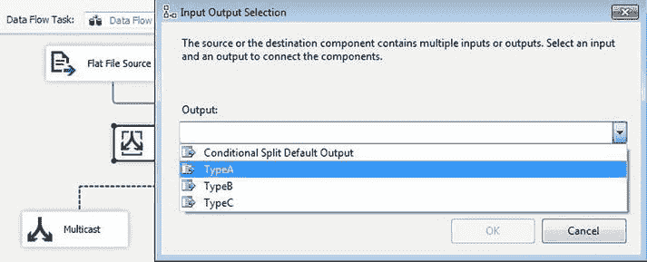

图 7-12. 终止来自 `脚本组件` 的 `TypeA` 输出

对 `TypeB` 和 `TypeC` 连接重复此过程。完成后，您的数据流可能如 图 7-13 所示。

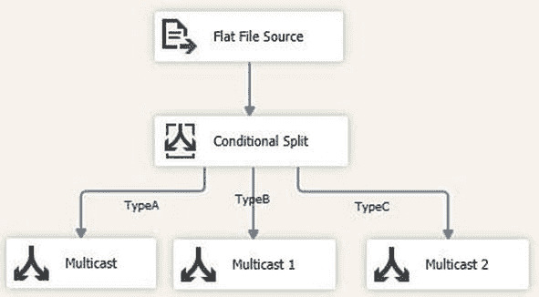

图 7-13. 已终止的 `脚本组件` 输出

让我们运行它！执行应该会成功，成功时，结果将是您在 图 7-14 中看到的绿色勾号。

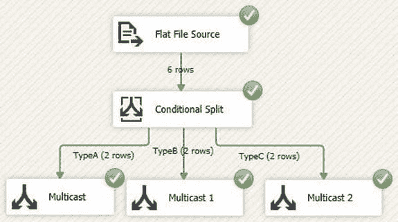

图 7-14. 绿色勾号代表成功

这不是处理此格式文件加载的唯一方法。它是一种方法，其优点是提供了很大的灵活性。

#### 标题行和页脚行

许多来源的提取文件都包含 `标题` 行和 `页脚` 行。我经常在基于大型机的数据库系统提供的平面文件中看到这些行。

`标题行` 包含有关提取文件内容的元数据——提取信息的摘要。至少，它会包含提取日期。通常有一个字段包含提取的行计数。细想一下，这是非常实用的工具——它提供了一种检查行数是否正确的方法。这种检查可以在提取后立即进行，也可以在加载提取后立即进行——两者都是此元数据的有效用途。

`页脚行` 在概念上是相同的。唯一的区别是位置：`标题` 行出现在文件开头；`页脚` 行出现在文件末尾。如果您包含行计数以验证写入或读取的行数是否正确，首先写入此信息是提高容错性的好方法。为什么？想象一下失败：写入操作中断或提取异常结束。`标题` 行可能指示 100 行，例如，但随后只有 70 行数据。如果行计数元数据包含在 `标题` 行中，就可以精确计算出缺少多少数据行。相比之下，`页脚` 行会直接缺失。尽管缺失的 `页脚` 会表明提取失败，但那*仅能*表明这一点。拥有行计数元数据可以让您获取更多关于故障的更好信息。

在本节中，我们将研究如何使用 SQL Server 2014 Integration Services 创建和使用 `标题` 行和 `页脚` 行。

##### 使用页脚行

我们首先研究如何使用 `页脚` 行。首先，创建一个包含 `页脚` 行的文件。我的文件如下所示：

```
ID,Name,Value
11,Andy,12
22,Christy,13
33,Stevie Ray,14
44,Emma Grace,15
55,Riley Cooper,16
5 rows, extracted 10/5/2011 10:22:12 AM
```

为了演示，请创建您自己的文件并将其命名为 `MyFileFooterSource.csv`。创建一个新的 SSIS 包并将其重命名为 `ParseFileFooter.dtsx`。添加一个 `数据流任务` 并切换到数据流选项卡。添加一个 `平面文件源` 适配器并双击它以打开 `平面文件源编辑器`。在“连接管理器”页面上，单击“新建”按钮以创建新的 `平面文件连接管理器` 并打开编辑器。将 `平面文件连接管理器` 命名为 `My File Footer Source File`，并将 `文件路径` 属性设置为 `MyFileFooterSource.csv` 的位置。勾选 `首行数据包含列名` 复选框。转到“列”页面以验证您的配置是否匹配，如 图 7-15 所示。

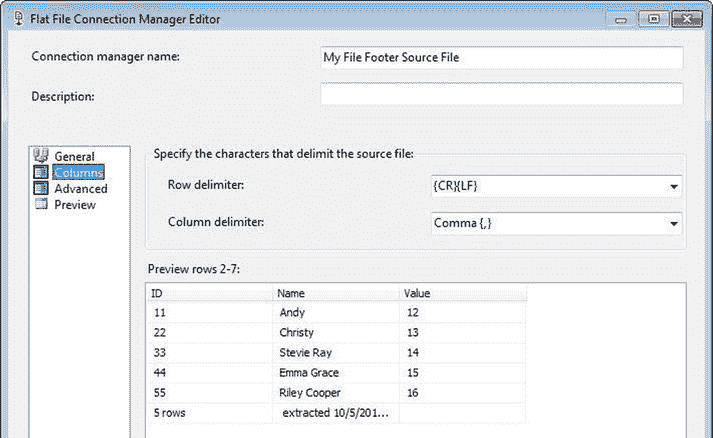

图 7-15. 包含 `页脚` 行的文件的 `平面文件连接管理器` 列页面

您可以在 图 7-15 所示的预览中看到 `页脚` 行内容。您可能能够在也可能无法在 `平面文件连接管理器编辑器` 的“列”页面上查看 `页脚` 行。

下一步是将 `页脚` 行与数据行分开。为此，您将使用 `条件拆分` 转换来隔离 `页脚` 行。检测 `页脚` 行有*很多*不同的方法，但诀窍是选择该行的某个独特之处。在 图 7-16 中定义的 SSIS 表达式语言表达式中，我在 `ID` 列中搜索术语 `"rows"`。只要数据行的 `ID` 列中*永远没有机会*合法出现术语 `"rows"`，这个条件就会有效。“永远”是很长的时间。

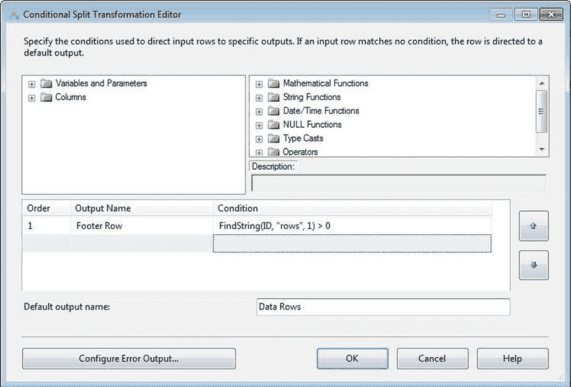

图 7-16. 配置 `条件拆分` 转换

为了终止数据行管道——该管道从 `条件拆分` 转换的默认输出流出——我使用了一个 `派生列` 转换。

`页脚` 行输出需要更多解析。我们将其发送到另一个名为 `der Parse Footer` 的 `派生列` 转换。

**注意** Jamie Thomson 写了一篇题为“SSIS：建议的最佳实践和命名约定”的精彩文章 (`http://sqlblog.com/blogs/jamie_thomson/archive/2012/01/29/suggested-best-practises-and-naming-conventions.aspx`)。我经常使用 Jamie 的命名约定。

我们想要行数和提取的日期时间。我使用 图 7-17 中的表达式来解析 `页脚` 行计数和 `页脚` 提取日期时间：

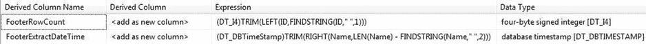

图 7-17. 解析行计数和提取日期

现在我们已经在数据流管道中获得了 `页脚` 行元数据。我们可以使用另一个 `派生列` 转换 `der Trash Destination Footer` 来终止此分支管道。将 `der Parse Footer` 连接到 `der Trash Destination Footer`。右键单击数据流路径，然后单击 `启用数据查看器`。在调试器中执行包以查看 `页脚` 行的内容，如 图 7-18 所示。

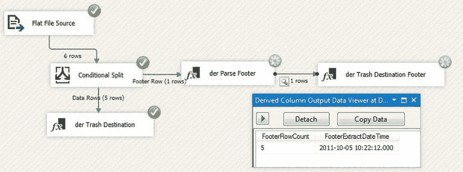

图 7-18. 已解析的 `页脚` 行

从 图 7-18 可以看出，五 (5) 个数据行退出了 `条件拆分` 转换。我们可以在 `数据查看器` 中观察到解析后的 `页脚` 行内容。

##### 使用标题行

`标题` 行更容易读取。让我们从查看名为 `MyFileHeaderSource.csv` 的源文件开始：

```
5 rows, extracted 10/5/2011 10:22:12 AM

ID,Name,Value
11,Andy,12
22,Christy,13
33,Stevie Ray,14
44,Emma Grace,15
55,Riley Cooper,16
```


### 处理文档格式

本文介绍如何使用 SSIS 处理文件的标题行与页脚行。

### 解析文件标题行

您可以通过几种不同的方式读取标题行。在此解决方案中，我们利用一个平面文件连接管理器和一个数据流来解析数据的标题行。我们严重依赖脚本组件逻辑来进行解析和缓冲操作。

首先创建一个新的 SSIS 包。我将其命名为 `ParseFileHeader.dtsx`。

添加一个数据流任务并打开数据流任务编辑器。添加一个平面文件源适配器并打开其编辑器。使用“新建”按钮创建一个新的平面文件连接管理器，指向 `MyFileHeaderSource.csv`。取消选中“数据流首行包含列名”复选框。请务必单击连接管理器编辑器的“高级”页面，并将 `Column 0` 和 `Column 1` 的名称分别更改为 `ID` 和 `Name`。

关闭连接管理器和源适配器编辑器，将一个脚本组件拖到数据流画布上。系统提示时，选择“转换”作为此脚本组件的用途。打开脚本组件编辑器，将 `Name` 属性更改为 `scr Parse Header and Data`。单击“输入列”页面并选择两列（`ID` 和 `Name`）。单击“输入和输出”页面。将 Output 0 重命名为 `Header`，并将 `SynchronousInputID` 属性更改为 `None`。展开 `Header` 输出并单击“输出列”虚拟文件夹。单击“添加列”按钮，将其命名为 `ExtractDateTime`，并将数据类型更改为 `database timestamp [DT_DBTIMESTAMP]`。再次单击“添加列”按钮，将新列命名为 `RowCount`，并将数据类型保留为默认值（四字节有符号整数 [DT_I4]）。

单击“添加输出”按钮，并将此新输出命名为 `Data`。展开输出虚拟文件夹并选择“输出列”虚拟文件夹。像处理标题输出那样，创建两个具有以下属性的列：

*   `ID, four-byte signed integer [DT_I4]`
*   `Name, string [DT_STR]`

返回到“脚本”页面，将 `ScriptLanguage` 属性设置为 `Microsoft Visual Basic 2012`。单击“编辑脚本”按钮。编辑器打开后，在类的顶部添加一个变量声明（参见 代码清单 7-4）。

#### 代码清单 7-4. 添加 iRowNum 整型变量

```
Public Class ScriptMain
    Inherits UserComponent

    Dim iRowNum As Integer = 0
```

用 代码清单 7-5 中的代码替换 `Input0_ProcessInputRow` 子例程中的代码。

#### 代码清单 7-5. 构建 Input0_ProcessInputRow 子例程

```
Public Overrides Sub Input0_ProcessInputRow(ByVal Row As Input0Buffer)

    ' 递增行号计数器
    iRowNum += 1

    Select Case iRowNum
        Case 1
            ' 解析
            Dim sTmpCount As String = Row.ID
            sTmpCount = Strings.Trim(Strings.Left(Row.ID, Strings.InStr(Row.ID, " ")))
            Dim sTmpDate As String = Row.Name
            sTmpDate = Strings.Replace(Row.Name, " extracted ", "")

            ' 标题行
            With HeaderBuffer
                .AddRow()
                .RowCount = Convert.ToInt32(sTmpCount)
                .ExtractDateTime = Convert.ToDateTime(sTmpDate)
            End With
        Case 2
            ' 忽略
        Case 3
            ' 列名
        Case Else
            ' 数据行
            With DataBuffer
                .AddRow()
                .ID = Convert.ToInt32(Row.ID)
                .Name = Row.Name
            End With
    End Select
End Sub
```

此脚本统计流经脚本组件的行数，并使用行号来决定输出行的处理方式。`Select Case` 语句由行号检测驱动，每一行都使行号递增器（`iRowNum`）递增。第一行是标题行，包含提取元数据。接下来的两行分别包含一串破折号和列名。文件的其余部分包含数据行，由 `Select Case` 语句的 `Select Case Else` 条件处理。

关闭 VSTA 项目脚本编辑器，然后单击脚本组件编辑器上的“确定”按钮。使用您选择的数据流组件（我使用了名为 `der Header` 和 `der Data` 的派生列转换）终止标题和数据管道。

在调试器中执行包以进行测试。您的结果应类似于 图 7-19 所示。

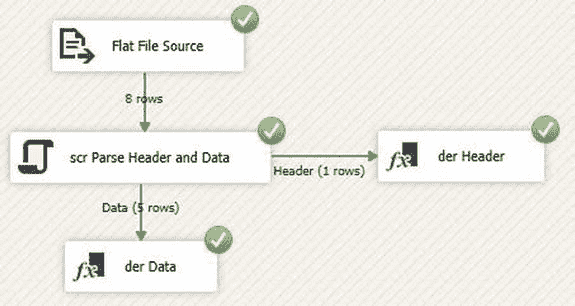

**图 7-19. 绿色的勾选标记很棒！**

### 生成页脚行

让我们看看如何生成页脚行并将其添加到数据文件中。对于此模式，我们将利用项目和包参数。我们还将利用父子模式，该模式将在 第 16 章 中详细讨论。我们不会构建创建包含数据的平面文件的包。我们将从以下假设开始：提取文件存在，并且我们知道行数和提取日期。我们将使用参数将元数据从父包传输到子包。让我们开始吧！

创建一个新的 SSIS 包并将其命名为 `WriteFileFooter.dtsx`。单击“参数”选项卡并添加以下包参数：

```
名称                      数据类型         值                    必需
-----------------------   --------------   ------------------   ----------
AmountSum                 Decimal          0                    False
DateFormat                String                                True
Debug                     Boolean          True                 False
Delimiter                 String           ,                    True
ExtractFilePath           String                                True
LastUpdateDateTime        DateTime         1/1/1900             True
RecordCount               Int32            0                    True
```

输入参数后，它们会显示为 图 7-20 所示。

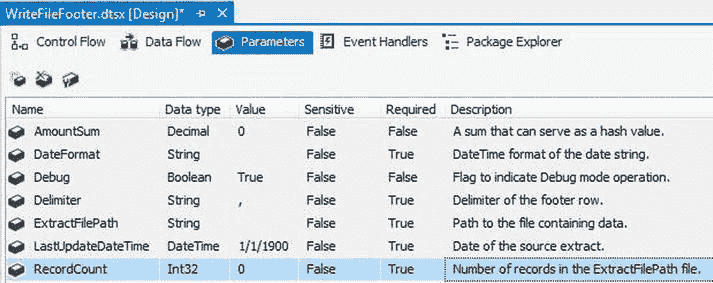

**图 7-20. WriteFileFooter.dtsx 包的参数**

每个参数的 `Sensitive` 属性都设置为 `False`。描述是可选的，并且在图像中提供。

我们将在脚本任务中完成主要工作。返回到控制流，将一个脚本任务拖到画布上。将名称更改为 `scr Append File Footer` 并打开编辑器。在“脚本”页面上，单击 `ReadOnlyVariables` 属性值文本框中的省略号。当“选择变量”窗口显示时，选择以下变量：

*   `System::PackageName`
*   `System::TaskName`
*   `$Package::AmountSum`
*   `$Package::DateFormat`
*   `$Package::Debug`
*   `$Package::Delimiter`
*   `$Package::ExtractFilePath`
*   `$Package::LastUpdateDateTime`
*   `$Package::RecordCount`

“选择变量”窗口不会完全如 图 7-21 所示，但这些是您需要在 scr Append File Footer 脚本任务内选择使用的变量。

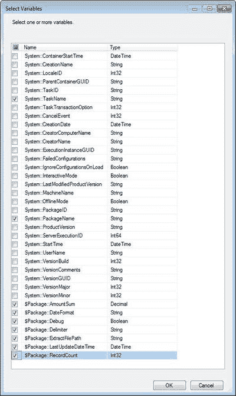

**图 7-21. 为页脚文件选择变量**


点击**确定**按钮关闭**选择变量**窗口。将 `ScriptLanguage` 属性设置为 `Microsoft Visual Basic 2012`。点击**编辑脚本**按钮打开 **VstaProjects** 窗口。在 `ScriptMain.vb` 代码窗口的顶部，您会找到一个 **Import** 区域。将代码清单 7-6 中的代码行添加到该区域。

**代码清单 7-6**. 在 VB.Net 脚本中添加 Imports 语句

```
Imports System.IO
Imports System.Text
```

在部分类声明之后，添加 `bDebug` 变量的变量声明。即代码清单 7-7 中给出的 `Dim` 语句。

**代码清单 7-7**. 声明调试变量

```
Partial Public Class ScriptMain
    Inherits Microsoft.SqlServer.Dts.Tasks.ScriptTask.VSTARTScriptObjectModelBase

Dim bDebug As Boolean
```

将 `Public Sub Main` 中的代码替换为代码清单 7-8 中的代码。

**代码清单 7-8**. Main() 子例程的代码

```
    Public Sub Main()

' 1: 检测调试设置...
        bDebug = Convert.ToBoolean(Dts.Variables("Debug").Value)

' 2: 声明并初始化变量...
        ' 2a: 通用变量...
        Dim sPackageName As String = Dts.Variables("PackageName").Value.ToString
        Dim sTaskName As String = Dts.Variables("TaskName").Value.ToString
        Dim sSubComponent As String = sPackageName & "." & sTaskName
        Dim sMsg As String
        ' 2b: 特定于任务的变量...
        Dim sExtractFilePath As String = Dts.Variables("ExtractFilePath").Value.ToString
        Dim iRecordCount As Integer = Convert.ToInt32(Dts.Variables("RecordCount").Value)
        Dim sAmountSum As String = Dts.Variables("AmountSum").Value.ToString
        Dim sDateFormat As String = Dts.Variables("DateFormat").Value.ToString
        Dim sDelimiter As String = Dts.Variables("Delimiter").Value.ToString
        Dim sLastUpdateDateTime As String= _
 Strings.Format(Dts.Variables("LastUpdateDateTime").Value, sDateFormat) _
'"yyyy/MM/dd hh:mm:ss.fff")
        Dim sFooterRow As String
        Dim s As Integer = 0

' 3: 记录值...
        sMsg = "包名.任务名: " & sSubComponent & ControlChars.CrLf & _
 ControlChars.CrLf & _
            "提取文件路径: " & sExtractFilePath & ControlChars.CrLf & _
 ControlChars.CrLf & _
            "记录数: " & iRecordCount.ToString & ControlChars.CrLf & _
 ControlChars.CrLf & _
               "金额总和: " & sAmountSum & ControlChars.CrLf & ControlChars.CrLf & _
               "日期格式: " & sDateFormat & ControlChars.CrLf & ControlChars.CrLf & _
               "分隔符: " & sDelimiter & ControlChars.CrLf & ControlChars.CrLf & _
            "最后更新日期时间: " & sLastUpdateDateTime & ControlChars.CrLf & _
 ControlChars.CrLf & _
               "调试: " & bDebug.ToString
        Dts.Events.FireInformation(0, sSubComponent, sMsg, "", 0, True)
        If bDebug Then MsgBox(sMsg)

' 4: 创建页脚行...
        sFooterRow = iRecordCount.ToString & sDelimiter & sAmountSum & sDelimiter & _
 sLastUpdateDateTime
        ' 5: 记录...
        sMsg = "页脚行: " & sFooterRow
        Dts.Events.FireInformation(0, sSubComponent, sMsg, "", 0, True)
        If bDebug Then MsgBox(sMsg)

' 6: 检查文件是否正在使用...
        While FileInUse(sExtractFilePath)
            ' 6a: 如果文件正在使用，休眠一秒钟...
            System.Threading.Thread.Sleep(1000)
            ' 6b: 递增计数器...
            s += 1
            ' 6c: 如果计数器达到 10（10 秒），
            If s > 10 Then
                ' 则退出循环...
                Exit While
            End If 's > 10
        End While 'FileInUse(sExtractFilePath)
        ' 7: 记录...
        If s = 1 Then
            sMsg = "文件被占用 " & s.ToString & " 次。"
        Else ' s = 1
            sMsg = "文件被占用 " & s.ToString & " 次。"
        End If ' s = 1
        Dts.Events.FireInformation(0, sSubComponent, sMsg, "", 0, True)
        If bDebug Then MsgBox(sMsg)

' 8: 如果文件存在...
        If File.Exists(sExtractFilePath) Then
            Try
                ' 8a: 以追加模式打开它，使用默认编码，通过 StreamWriter...
                Dim writer As StreamWriter = New StreamWriter(sExtractFilePath, True, _
 Encoding.Default)
                ' 8b: 添加页脚行...
                writer.WriteLine(sFooterRow)
                ' 8c: 清理...
                writer.Flush()
                ' 8d: 退出...
                writer.Close()
                ' 8e: 记录...
                sMsg = "文件 " & sExtractFilePath & " 存在，且页脚行已 " & _
 "被追加。"
                Dts.Events.FireInformation(0, sSubComponent, sMsg, "", 0, True)
                If bDebug Then MsgBox(sMsg)
            Catch ex As Exception
                ' 8f: 记录...
                sMsg = "向 " & sExtractFilePath & _
 " 文件追加页脚行时出现问题: " & ControlChars.CrLf & ex.Message
                Dts.Events.FireInformation(0, sSubComponent, sMsg, "", 0, True)
                If bDebug Then MsgBox(sMsg)
            End Try
        Else
            ' 8g: 记录...
            sMsg = "找不到文件: " & sExtractFilePath
            Dts.Events.FireInformation(0, sSubComponent, sMsg, "", 0, True)
            If bDebug Then MsgBox(sMsg)
        End If ' File.Exists(sExtractFilePath)

'  9: 返回成功...
        Dts.TaskResult = ScriptResults.Success

End Sub
```

然后在 `Public Sub Main()` 之后添加代码清单 7-9 中的函数。

**代码清单 7-9**. FileInUse 函数的代码

```
    Function FileInUse(ByVal sFile As String) As Boolean

If File.Exists(sFile) Then
            Try
                Dim f As Integer = FreeFile()
                FileOpen(f, sFile, OpenMode.Binary, OpenAccess.ReadWrite, _
 OpenShare.LockReadWrite)
                FileClose(f)
            Catch ex As Exception
                Return True
            End Try
        End If
    End Function
```

现在脚本会构建页脚行并将其追加到**提取**文件。我们要做的第一件事——在标记为 1 的注释处——是给 `Debug` 变量赋值。我使用 `Debug` 变量来控制显示变量值和其他相关信息的消息框。我在第 2 章关于执行模式的部分解释了原因。

在注释 2 处，我们声明并初始化变量。我将变量分为两类：通用变量和特定于任务的变量。在注释 3 处，我们在变量 `sMsg` 中构建一条消息。此消息包含脚本中至今使用的每个变量的值。如果我们以**调试**模式运行（如果 `bDebug` 为 `True`），代码会显示一个包含 `sMsg` 内容的消息框（通过 `MsgBox` 函数）。无论我们是否以**调试**模式运行，我都使用 `Dts.Events.FireInformation` 方法引发 **OnInformation** 事件，并将 `sMsg` 的内容传递给它。这意味着信息始终会被记录，并可以选择性地通过消息框显示。我非常喜欢这种选项（非常）。


注释 4 指导我们构建实际的页脚行，并将其文本存储在字符串变量 `sFooterRow` 中。请注意，分隔符也是动态的。字符串变量 `sDelimiter` 包含了传递给 `WriteFileFooter` 包中名为 `$Package::Delimiter` 的参数的值。在注释 5 处，我们记录了页脚行的内容。

在注释 6 处，我们启动一项检查，以确保提取文件未被操作系统标记为“正在使用”。检测文件在文件系统中的状态有多种方法，因此我创建了一个名为 `FileInUse` 的布尔函数来封装此测试。如果我创建的函数对您不起作用，您可以构建自己的函数。如果文件正在使用中，代码将启动一个 `While` 循环，使线程休眠一秒钟。每次循环迭代都会导致变量 `s`（本例中的增量器）在注释 6b 处递增。如果 `s` 超过十，则退出循环。我们只会等待 10 秒，以便文件变为可用。请注意，如果此时文件仍在使用中，我们*仍然*会继续执行后续操作。我们稍后会处理文件占用的问题，但我们不会为了等待文件可用而让自己陷入可能无尽的循环中。相反，我们将报错失败。无论文件是否正在使用，脚本都会在注释 7 处记录其状态。

在注释 8 处，我们检查文件是否存在，并开始一个 `Try-Catch` 块。如果文件不存在，我选择记录一条状态消息（通过 `Dts.Events.FireInformation`）并继续执行（参见注释 8g）。`Try-Catch` 块用于执行对文件可用性的最终测试。如果文件在此处仍处于使用状态，则会触发 `Catch` 块，并在注释 8f 处记录状态消息。在 8f 和/或 8g 处，您很可能决定使用 `Dts.Events.FireError` 方法引发错误。引发错误会导致脚本任务失败，而您可能正希望如此。在注释 8a 至 8d 处，我们打开文件，追加页脚行，关闭文件并进行清理。在注释 8e 处，代码记录一条状态消息。如果在执行 8a 至 8e 时有任何操作失败，代码执行将跳转到 `Catch` 块。

如果一切顺利，代码将通过 `Dts.TaskResult` 函数（注释 9）向 SSIS 控制流返回 `Success`（成功）。

在这个模式中，所有的实际工作都由脚本任务完成。关闭脚本任务编辑器。点击“确定”。然后保存该包。

我创建了一个名为 `TestParent.dtsx` 的测试包来测试此包。该包包含与 `WriteFileFooter.dtsx` 包的参数相对应的变量，如图 7-22 所示。

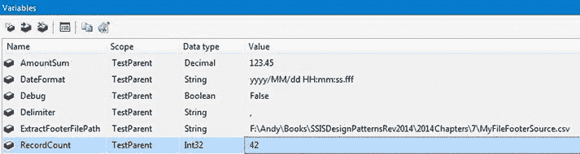

图 7-22. TestParent.dtsx 包中的变量

如果您想亲自实践，应该调整 `ExtractFooterFilePath` 变量的路径。

我添加了一个名为 `seq Test WriteFileFooter` 的 `Sequence` 容器，并包含了一个名为 `ept Execute WriteFileFooter Package` 的 `Execute Package`（执行包）任务。在执行包任务编辑器的“包”页面上，将 `ReferenceType` 属性设置为 `Project Reference`（项目引用），并从 `PackageNameFromProjectReference` 属性的下拉列表中选择 `WriteFileFooter.dtsx`。将 `TestParent` 包的变量映射到 `WriteFileFooter` 包的参数，如图 7-23 所示。

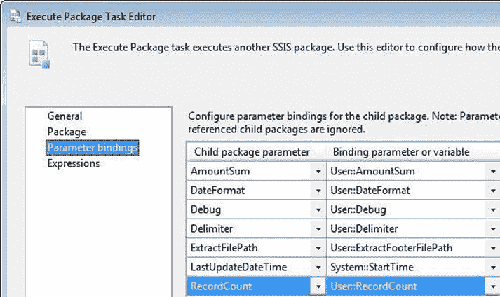

图 7-23. 映射包参数

执行 `TestParent.dtsx` 以测试其功能。包成功执行，页脚行如图 7-24 所示被追加到文件中。

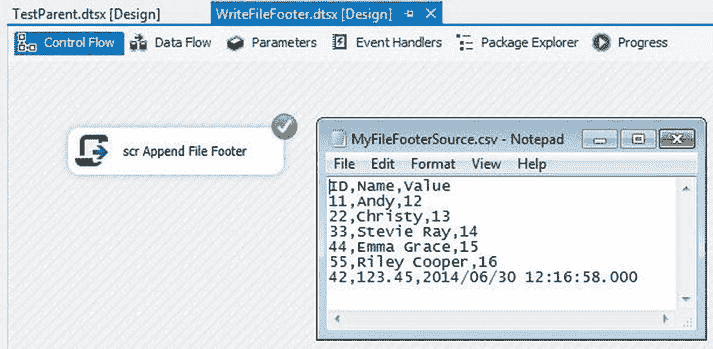

图 7-24. 任务完成

#### 生成页眉行

生成页眉行在 SSIS 2014 中是一个非常简单的操作，前提是您预先知道要加载的行数。您只需在一个 `Data Flow`（数据流）任务中将页眉行加载到目标平面文件中，然后在后续的 `Data Flow` 任务中将数据行加载到同一个平面文件中。正如我们在弗吉尼亚州法姆维尔常说的：“简单至极”。不过，这种设计也存在一些微妙的复杂性。

我们将从一个名为 `MyFileHeaderExtract.csv` 的简单文件开始，该文件包含以下数据：
```
ID,Name,Value
11,Andy,12
22,Christy,13
33,Stevie Ray,14
44,Emma Grace,15
55,Riley Cooper,16
```

在您的 SSIS 项目中添加一个新的名为 `WriteFileHeader.dtsx` 的 SSIS 包。添加如图 7-25 所示的包参数。

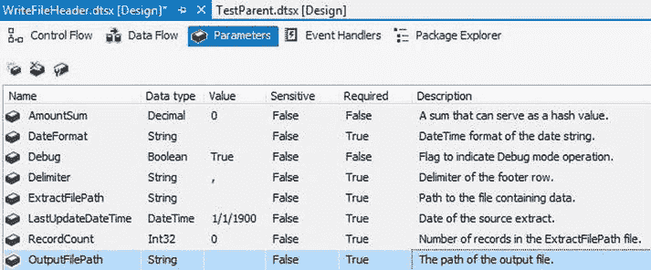

图 7-25. WriteFileHeader.dtsx 参数

向控制流中添加两个 `Data Flow` 任务。将第一个命名为 `dft Write Header Row`，第二个命名为 `dft Write Data Rows`。打开 `dft Write Header Row` 的编辑器，并向 `Data Flow` 任务中添加一个名为 `scrc Build Header Row` 的 `Script` 组件。在提示时，将 `Script` 组件配置为源。打开编辑器并将 `ScriptLanguage` 属性设置为 `Microsoft Visual Basic 2012`。将 `ReadOnlyVariables` 属性设置为引用以下变量：

*   `$Package::AmountSum`
*   `$Package::Delimiter`
*   `$Package::LastUpdateDateTime`
*   `$Package::RecordCount`

在“输入和输出”页面上，确保 Output 0 的 `SynchronousInputID` 属性设置为 `None`，并向 Output 0 添加一个名为 `HeaderRow` 的输出列（字符串数据类型，长度 500）。点击“脚本”页面和“编辑脚本”按钮。用列表 7-10 中的代码替换 `CreateNewOutputRows()` 子例程中的代码。

***列表 7-10***. CreateNewOutputRows 子例程的代码
```
Public Overrides Sub CreateNewOutputRows()

    ' 创建页眉行...
    ' 获取变量值...
    Dim iRecordCount As Integer = Me.Variables.RecordCount
    Dim sDelimiter As String = Me.Variables.Delimiter
    Dim dAmountSum As Decimal = Convert.ToDecimal(Me.Variables.AmountSum)
    Dim dtLastUpdateDateTime As DateTime = _
        Convert.ToDateTime(Me.Variables.LastUpdateDateTime)

    Dim sHeaderRow As String = iRecordCount.ToString & sDelimiter & _
                                dAmountSum.ToString & sDelimiter & _
                                dtLastUpdateDateTime.ToString

    With Output0Buffer
        .AddRow()
        .HeaderRow = sHeaderRow
    End With
End Sub
```

添加一个 `Flat File`（平面文件）目标适配器，并将数据流路径从 `Script` 组件连接到它。打开“平面文件目标编辑器”，点击“平面文件连接管理器”下拉列表旁边的“新建”按钮。当“平面文件格式”窗口显示时，选择 `Delimited`（带分隔符），然后点击“确定”按钮。将平面文件连接管理器命名为 `Flat File Header Output`，并提供（或选择）一个文件路径。在“列”页面上，为来自 `scrc Build Header Row` 脚本组件的 `HeaderRow` 列配置一个落地区列。点击“确定”按钮返回“平面文件目标编辑器”。确保选中“覆盖文件中的数据”复选框（在“连接管理器”页面中）。它应该是默认选中的。点击“映射”页面并完成目标配置。这个 `Data Flow` 任务将构建并加载页眉行。


### 控制流与数据流配置

在控制流中，从 `dft Write Header Row` 到 `dft Write Data Rows Data Flow` 任务添加一个“Success Precedence”约束。打开 `dft Write Data Rows` 的编辑器，添加一个平面文件源适配器。打开平面文件源编辑器，点击 `New` 按钮创建一个新的平面文件连接管理器。系统提示时，选择 `Delimited`。将其命名为 `Extract File Input`，并导航到您之前创建的 `MyFileHeaderExtract.csv` 文件。在 `Columns` 页面，删除 `Column Delimiter` 下拉列表中的值。点击 `Refresh` 按钮以刷新视图。在 `Advanced` 页面，将列名从 `ID,Name,Value` 重命名为 `Row`，并将 `OutputColumnWidth` 属性设置为 `500`。点击 `OK` 按钮关闭平面文件连接管理器编辑器和平面文件源编辑器。

添加一个平面文件目标适配器，并从平面文件源适配器到平面文件目标适配器连接一条数据流路径。打开平面文件目标适配器，将其连接管理器设置为 flat file header output。请务必在 `Connection Manager` 页面取消选中 `Overwrite the Data in the File` 复选框。在 `Mappings` 页面，将 `Available Input Columns` 中的 `Row` 列映射到 `Available Destination Columns` 中的 `HeaderRow`。关闭平面文件目标编辑器。

让我们将这些连接管理器变为动态的！点击 `Extract File Input` 平面文件连接管理器，然后按 `F4` 键显示属性。点击 `Expressions` 属性，然后点击 `Value` 文本框中的省略号（`...`）。点击第一行 `Property` 列的下拉箭头，选择 `ConnectionString`。在对应的 `Expression` 值文本框中，点击省略号（`...`）打开表达式生成器。在表达式生成器中展开 `Variables and Parameters` 虚拟文件夹，并将 `$Package::ExtractFilePath` 拖到 `Expression` 文本框中。点击 `OK` 按钮关闭表达式生成器。此时将出现属性表达式编辑器窗口，如 图 7-26 所示。

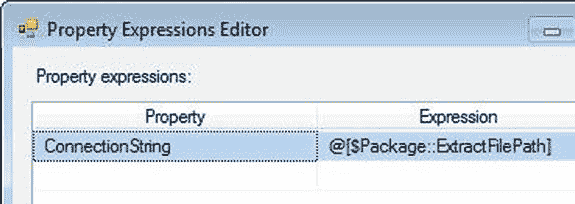

图 7-26. 动态 ConnectionString 属性

关闭属性表达式编辑器。您现在已经将 `ConnectionString` 属性的值分配给了从另一个包调用此包时传递的 `ExtractFilePath` 包参数。重复此过程，将 `$Package::OutputFilePath` 包参数的值动态分配给平面文件头输出平面文件连接管理器的 `ConnectionString` 属性。

要测试此包，请返回到 `TestParent.dtsx`。让我们添加几个变量，用于与刚刚映射到连接管理器表达式的参数：`ExtractHeaderFilePath` 和 `OutputPath`。为 `OutputPath` 变量提供一个值，该值代表您要创建的文件的位置。（注意：此文件可能不存在！）同时，为 `ExatrctHeaderFilePath` 变量提供 `MyFileHeaderExtract.csv` 的路径作为默认值。在控制流中，添加一个 Sequence 容器并将其重命名为 `seq Test WriteHeader`。向 Sequence 容器添加一个执行包任务，并将其重命名为 `ept Execute WriteFileHeader Package`。打开执行包任务编辑器，并配置一个项目引用以执行 `WriteFileHeader.dtsx` 包。按照 图 7-27 所示配置参数绑定页面。

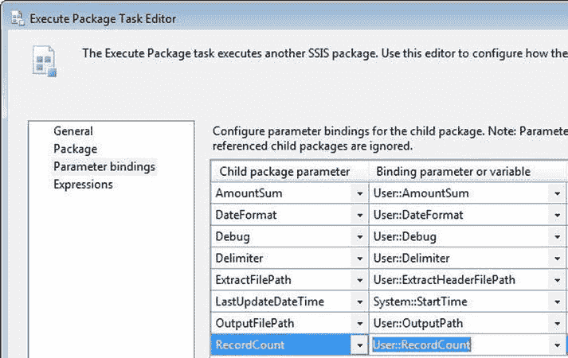

图 7-27. 执行包任务中的参数映射

关闭执行包任务编辑器并禁用 `seq Test WriteFileFooter` Sequence 容器。执行该包并观察结果。您应该得到如 图 7-28 所示的结果。

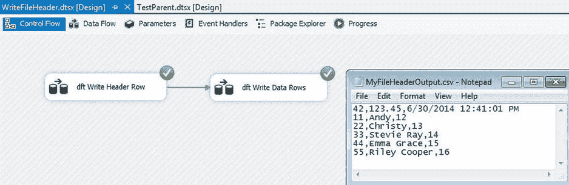

图 7-28. 成功！

我喜欢这个模式，因为它利用了 SSIS 组件，而无需过多依赖脚本。不过，我并不喜欢这个模式的全部。我需要在调用此包之前知道行数，这并不难获取——我只需向数据流添加一个行数转换，并在行加载到提取文件时计数。但之后我必须在事后重新加载提取文件。对于大文件和可伸缩性，我会尝试在加载文件之前确定行数，然后将此包中演示的功能集成到加载器包中。对于不会扩展的小数据加载，此包是可以接受的。

### 归档文件模式

归档文件模式很大程度上促成了您现在正在阅读的这本书。为什么？因为它是我构建的第一个被广泛采用的设计模式包。在多个位置重复使用此模式后，我确信 SSIS 适合基于设计模式的架构。在此认识后不久，我在华盛顿州贝尔维尤与同样使用 SSIS 并写书的朋友共进晚餐时讨论了这个想法。我们一致认为，设计模式为许多数据集成问题提供了有趣的解决方案。

`ArchiveFile` 包旨在将平面数据文件从一个目录复制到另一个目录，并在原始文件名后附加一个日期时间戳。源文件的完整路径由 `SourceFilePath` 参数提供，日期时间戳的格式由 `DateStampFormat` 参数提供。目标目录（或归档目录）由 `ArchiveDirectory` 参数提供。如果目标文件已存在，您可以通过 `OverwriteDestination` 参数控制是否覆盖目标文件。该包通常会删除原始文件，但 `CopyOnly` 参数控制此功能。如果找不到 `SourceFilePath`，您可以引发错误或仅记录此情况。`ExceptionOnFileNotFound` 参数控制在找不到源文件时包是否引发错误。最后，`Debug` 参数控制包是否以调试模式执行（我在 第 2 章 中对此有更详细的介绍）。配置后，`ArchiveFile` 包参数将如 图 7-29 所示。

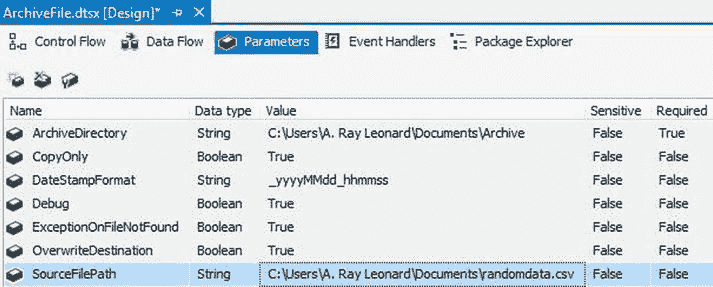

图 7-29. ArchiveFile 包参数

请务必为 `ArchiveDirectory` 参数提供一个现有文件夹的默认值，并为 `SourceFilePath` 参数提供一个有效文件的路径作为默认值。对于所有其他参数默认值，请使用我在 图 7-29 中提供的值。

设计此包有几种方法。您可以严重依赖脚本，或者利用文件系统任务。您应该选择哪一个？在咨询时，我会通过提问来确定负责维护包的人员的舒适程度。一些数据集成开发人员熟悉 .NET 编码；其他人则不熟悉。由于 SSIS 给了我选择，我构建包的方式使其易于由负责维护的团队维护。

在此包中，我选择脚本和文件系统任务的混合方式，倾向于减少脚本的使用。让我们向包添加以下变量：

*   `User::FormattedFileName [String]`
*   `User::OkToProceed [Boolean]`
*   `User::SourceFileDirectory [String]`
*   `User::WorkingCopyFileName [String]`

向控制流添加一个脚本任务，并将其命名为 `scr Apply Format`。打开编辑器，并将 `ScriptLanguage` 属性更改为 `Microsoft Visual Basic 2012`。将以下变量和参数添加到 `ReadOnlyVariables` 属性：

*   `System::TaskName`
*   `System::PackageName`
*   `$Package::CopyOnly`
*   `$Package::DateStampFormat`
*   `$Package::Debug`
*   `$Package::ExceptionOnFileNotFound`
*   `$Package::SourceFilePath`

在表达式 `cvar = avar + bvar` 中，加法运算符（`+`）将 `avar` 与 `bvar` 相加，得到它们的和 `cvar`。

```
if (condVar > someVal) {console.log("xxx")}
```

将以下变量和参数添加到 `ReadWriteVariables` 属性中：

*   `User::FormattedFileName`
*   `User::OkToProceed`
*   `User::SourceFileDirectory`
*   `User::WorkingCopyFileName`

点击 `Edit Script` 按钮以打开 VSTAProjects 脚本编辑器。在 `ScriptMain.vb` 文件的顶部，将 清单 7-11 中的语句添加到 Imports 区域。

**清单 7-11**. 声明对 System.IO 命名空间的引用

```vbnet
Imports System.IO
```

将 `Public Sub Main()` 中的代码替换为 清单 7-12 中的代码。

**清单 7-12**. Main() 子程序的代码

```vbnet
    Public Sub Main()

' 1: 声明 bDebug
        Dim bDebug As Boolean

' 2: 检测调试模式...
        bDebug = Convert.ToBoolean(Dts.Variables("Debug").Value)

' 3: 变量声明...
        Dim sPackageName As String = Dts.Variables("System::PackageName").Value.ToString
        Dim sTaskName As String = Dts.Variables("System::TaskName").Value.ToString
        Dim sSubComponent As String = sPackageName & "." & sTaskName
        Dim sDateStampFormat As String = _
        Dts.Variables("$Package::DateStampFormat").Value.ToString
        Dim sSourceFilePath As String = _
        Dts.Variables("$Package::SourceFilePath").Value.ToString
        Dim bExceptionOnFileNotFound As Boolean = _
        Convert.ToBoolean(Dts.Variables("ExceptionOnFileNotFound").Value)
        Dim bCopyOnly As Boolean = Convert.ToBoolean(Dts.Variables("CopyOnly").Value)
        Dim sFileName As String
        Dim sBaseFileName As String
        Dim sExtension As String
        Dim sSourceFileDirectory As String
        Dim sWorkingCopyFileName As String
        Dim sFormattedFileName As String
        Dim sMsg As String

' 4: 处理文件
        Try
            ' 4a: 解析源文件目录...
            sSourceFileDirectory = Strings.Trim(Strings.Left(sSourceFilePath, _
Strings.InStrRev(sSourceFilePath, "\")))
            ' 4b: 解析文件名...
            sFileName = Strings.Trim(Strings.Right(sSourceFilePath, _
Strings.Len(sSourceFilePath) - Strings.InStrRev(sSourceFilePath, "\")))
            ' 4c: 解析去掉扩展名的文件路径...
            sBaseFileName = Strings.Left(sSourceFilePath, Strings.InStrRev(sSourceFilePath, _
".") - 1)
            ' 4d: 构建工作副本文件名...
            sWorkingCopyFileName = sSourceFileDirectory & "_" & sFileName

' 4e: 解析扩展名...
            sExtension = Strings.Trim(Strings.Right(sSourceFilePath, _
Strings.Len(sSourceFilePath) - Strings.InStrRev(sSourceFilePath, ".")))
            ' 4f: 对文件名应用格式并设置 FormattedFileName 的输出值
            sFormattedFileName = sBaseFileName & _
Strings.Format(Date.Now, sDateStampFormat) & "." & sExtension
            ' 4g: 赋值外部变量...
            Dts.Variables("User::FormattedFileName").Value = sFormattedFileName
            Dts.Variables("SourceFileDirectory").Value = sSourceFileDirectory
            Dts.Variables("WorkingCopyFileName").Value = sWorkingCopyFileName

' 4h: 检查文件是否有效...
            If File.Exists(sSourceFilePath) Then
                ' 4i: 设置 OkToProceed 标志...
                Dts.Variables("OkToProceed").Value = True
            Else
                ' 4j: 如果文件未找到时引发异常...
                If bExceptionOnFileNotFound Then
                    '  4k: 触发错误...
                    Dts.Events.FireError(1001, sSubComponent, "无法定位文件 " & _
sSourceFilePath, "", 0)
                End If
                ' 4l: 设置 OkToProceed 标志...
                Dts.Variables("OkToProceed").Value = False
                sMsg = "文件 " & sSourceFilePath & " 未找到。"
                If bDebug Then MsgBox(sMsg, MsgBoxStyle.OkOnly, sSubComponent)
                ' 4m: 记录文件未找到，无论是否引发异常...
                Dts.Events.FireInformation(2001, sSubComponent, sMsg, "", 0, True)
            End If

Catch ex As Exception
            ' 4n: 记录错误消息...
            Dts.Events.FireError(1001, sSubComponent, ex.Message, "", 0)
        End Try

' 5: 记录信息
        sMsg = "DateStampFormat: " & sDateStampFormat & ControlChars.CrLf & _
ControlChars.CrLf & _
               "ExceptionOnFileNotFound: " & bExceptionOnFileNotFound.ToString & _
ControlChars.CrLf & ControlChars.CrLf & _
               "CopyOnly: " & bCopyOnly.ToString & ControlChars.CrLf & ControlChars.CrLf & _
               "OkToProceed: " & Dts.Variables("OkToProceed").Value.ToString & _
ControlChars.CrLf & ControlChars.CrLf & _
               "SourceFileDirectory: " & sSourceFileDirectory & ControlChars.CrLf & _
ControlChars.CrLf & _
               "FileName: " & sFileName & ControlChars.CrLf & ControlChars.CrLf & _
               "Extension: " & sExtension & ControlChars.CrLf & ControlChars.CrLf & _
               "BaseFileName: " & sBaseFileName & ControlChars.CrLf & ControlChars.CrLf & _
               "FormattedFileName: " & sFormattedFileName & ControlChars.CrLf & _
ControlChars.CrLf & _
               "WorkingCopyFileName: " & sWorkingCopyFileName & ControlChars.CrLf & _
ControlChars.CrLf

If bDebug Then MsgBox(sMsg, MsgBoxStyle.OkOnly, sSubComponent)
        Dts.Events.FireInformation(2001, sSubComponent, sMsg, "", 0, True)
        ' 6: 输出
        Dts.TaskResult = ScriptResults.Success
    End Sub
```

与其他脚本一样，我们在注释 1 和 2 处声明（`Dim`）了一个名为 `bDebug` 的变量，用于检测包是否在调试模式下执行。在注释 3 处，脚本声明了其余使用的变量，其中一些值是从 SSIS 包变量和参数传入的。在注释 4a 到 4c 处，代码拆解了 `Source File Path` 变量，解析出源目录、带扩展名的文件名以及不带扩展名的文件名。在注释 4d 到 4f 处，解析了文件名扩展名，并创建了一个“工作副本”文件名，该文件名使用从 SSIS 包参数提供的时间戳进行了格式化。在注释 4g 处，脚本将变量值赋给 SSIS 包变量。注释 4h 和 4m 之间的代码测试源文件的存在并做出响应。如果在注释 4a 到 4m 之间的任何步骤遇到异常，则会执行注释 4n 处的 `Catch` 代码块，并将异常记录为错误，这将停止脚本任务的执行。注释 5 处的代码构建、显示（如果在调试模式下运行）并记录一条包含脚本任务内部变量值的消息。这对于故障排除是非常有用的信息。在注释 6 处，脚本向 `Dts.TaskResult` 对象返回一个 `Success`（成功）结果。

文件归档过程的其余步骤如下：
1.  创建源文件的工作副本。
2.  将工作副本重命名为 `Formatted File Name`（包括时间戳）。
3.  将新重命名的文件移动到归档目录。
4.  删除原始文件（除非这是 `CopyOnly` 操作）。


如果 `OkToProceed`（布尔型）包变量被设置为 `True`（这是在脚本代码的注释 4i 处完成的），则流程中剩余的步骤将由文件系统任务管理。

将四个文件系统任务拖到控制流画布上。将第一个重命名为 `fsys Copy Working File` 并打开其编辑器。将 `Operation` 属性更改为 `Copy File`。将 `IsSourcePathVariable` 属性设置为 `True`，并将 `SourceVariable` 属性设置为 `$Package::SourceFilePath`。将 `IsDestinationPathVariable` 设置为 `True`，并将 `DestinationVariable` 属性设置为 `User::WorkingCopyFileName`。将 `OverwriteDestination` 属性设置为 `True`。关闭文件系统任务编辑器。

 **注意** 由于我们没有为 `User::WorkingCopyFileName` 设置值，任务上会出现一个红色 X。请不必担心。

将第二个文件系统任务重命名为 `fsys Rename File` 并打开其编辑器。将 `Operation` 属性设置为 `Rename File`。将 `IsSourcePathVariable` 属性设置为 `True`，并将 `SourceVariable` 属性设置为 `User::WorkingCopyFileName`。将 `IsDestinationPathVariable` 设置为 `True`，并将 `DestinationVariable` 属性设置为 `User::FormattedFileName`。将 `OverwriteDestination` 属性设置为 `True`。关闭文件系统任务编辑器。

将第三个文件系统任务重命名为 `fsys Move File` 并打开其编辑器。将 `Operation` 属性设置为 `Move File`。将 `IsSourcePathVariable` 属性设置为 `True`，并将 `SourceVariable` 属性设置为 `User::FormattedFileName`。将 `IsDestinationPathVariable` 设置为 `True`，并将 `DestinationVariable` 属性设置为 `$Package::ArchiveDirectory`。将 `OverwriteDestination` 属性设置为 `True`。关闭文件系统任务编辑器。

将第四个文件系统任务重命名为 `fsys Delete Original File` 并打开其编辑器。将 `Operation` 属性设置为 `Delete File`。将 `IsSourcePathVariable` 属性设置为 `True`，并将 `SourceVariable` 属性设置为 `$Package::SourceFilePath`。关闭文件系统任务编辑器。

使用成功优先级约束将 `scr Apply Format Script` 任务连接到 `fsys Copy Working File` 文件系统任务。双击优先级约束打开编辑器，将 `Evaluation Option` 属性设置为 `Expression and Constraint`。将 `Value` 属性设置为 `Success`，并将 `Expression` 属性设置为 `@[User::OkToProceed]`。仅当 `scr Apply Format Script` 任务成功完成执行并将 `OkToProceed (Boolean)` 变量设置为 `True` 时，此约束才会触发。在 `fsys Copy Working File` 文件系统任务和 `fsys Rename File` 文件系统任务之间、`fsys Rename File` 文件系统任务和 `fsys Move File` 文件系统任务之间，以及 `fsys Move File` 文件系统任务和 `fsys Delete Original File` 文件系统任务之间连接成功优先级约束。双击 `fsys Move File` 文件系统任务和 `fsys Delete Original File` 文件系统任务之间的优先级约束以打开编辑器。将 `Evaluation Option` 属性设置为 `Expression and Constraint`。将 `Value` 属性设置为 `Success`，并将 `Expression` 属性设置为 `!@[$Package::CopyOnly]`（这等同于 `NOT [!] $Package::CopyOnly`，或当 `$Package::CopyOnly` 为 `False` 时）。要使 `fsys Delete Original File` 文件系统任务触发，`fsys Move File` 文件系统任务必须成功，并且 `$Package::CopyOnly` 包参数必须为 `False`。这很合理，如果您只想将文件复制到存档目录；您不希望删除原始文件。

在此设计模式的许多版本中，我还会将各种文件系统任务的 `OverwriteDestination` 属性“变量化”，通过在表达式页上使用布尔包参数设置 `OverwriteDestinationFile` 动态属性表达式来管理这些值。我这样做是因为一些企业有关于保留或丢弃数据文件的要求，无论它们是否是临时的。

您的文件系统任务可能会标有错误指示器（包含白色 X 的红色圆圈）。将鼠标悬停在标记的任务上将显示错误。例如，在 图 7-30 中，错误为：“变量 'WorkingCopyFileName' 被用作源或目标，且为空。”

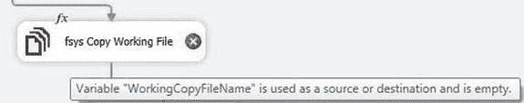

图 7-30. `WorkingCopyFileName` 变量为空

问题在于 `WorkingCopyFileName` 变量的内容。这个错误是正确的；变量值当前为空。然而，由于代码是我编写的，我知道在代码清单的 4d 部分，脚本将填充一个名为 `sWorkingCopyFile` 的内部字符串变量的内容。在代码的 4g 部分，这个内部变量的内容将被赋值给名为 `WorkingCopyFileName` 的 SSIS 包变量。我知道这一点，但 SSIS 包不知道。它正在尽力向我告知此问题。事实上，如果我以当前状态执行包，将不可避免地引发错误消息，如 图 7-31 所示。

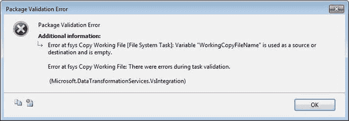

图 7-31. 包验证错误

验证是准确的。现在怎么办？错误信息顶部附近有个线索。这是一个包验证错误。要解决此问题，请单击 `fsys Copy Working File` 文件系统任务并按 F4 键显示属性。在属性的“执行”组中，列表顶部，您会找到 `DelayValidation` 属性。此属性的默认设置为 `False`，这是合理的。SSIS 中有大量的设计时验证，这通常是件好事。将此属性值更改为 `True`。将 `fsys Rename File` 和 `fsys Move File` 文件系统任务的 `DelayValidation` 也更改为 `True`。

现在，尝试执行 `ArchiveFile.dtsx` SSIS 包。我的结果如 图 7-32 所示。

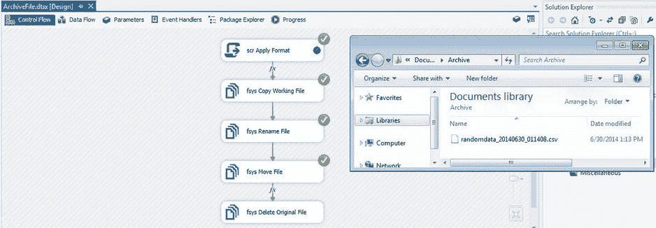

图 7-32. `ArchiveFile.dtsx` SSIS 包成功执行

### 总结

在本章中，我们研究了将基本平面源文件加载到 SQL Server 中的常见模式、加载可变长度行的模式、创建和使用平面文件标题和尾部行的模式，以及一个非常有用的用于归档平面文件的 SSIS 设计模式。

# 第 8 章


### 在 APS 中加载 PDW 区域

SQL Server 并行数据仓库 (PDW) 是微软的大规模并行处理 (MPP) 产品，作为微软分析平台系统 (APS) 的一部分提供。APS 是一个专注于大数据分析的交钥匙解决方案。它向客户提供两个区域或软件选项：PDW 和 HDInsight（后者是微软的 100% Apache Hadoop 发行版）。PDW 构建在 SQL Server 平台之上，尽管它是一个独立的产品，其 SQL Server 构建专门设计用于支持 MPP 操作。

### 大规模并行处理

顾名思义，`大规模并行处理 (MPP)` 使用多台服务器作为一个系统（称为`设备`）工作，以实现比传统 SMP 系统更高的性能和扫描速率。SMP 指的是`对称多处理`；大多数数据库系统，如所有其他版本的 SQL Server，都是 SMP。

为了更好地理解 SMP 和 MPP 系统之间的区别，让我们看一个常见的类比。想象一下，有人递给你一副洗好的 52 张扑克牌，并要求你找出所有的皇后。即使你以最快的速度，也需要几秒钟才能找到所需的牌。现在，让我们把同样的 52 张牌分给十个人。无论你有多快，这十个人一起工作都能比你自己更快地找到所有的皇后。


如你所推断，你代表 SMP 系统，而那十个人则代表 MPP 系统。这种分而治之的策略正是 MPP 设备特别适合高容量、扫描密集型数据仓库环境的原因，尤其是那些需要扩展到数百 TB 甚至 PB 级存储的环境。除了 Microsoft，市面上还有其他 MPP 设备供应商；然而，凭借 PolyBase 能轻松将 HDInsight 中的非结构化数据与 PDW 中的结构化数据进行关联、与 Microsoft 商业智能栈（`SQL Server`、`Integration Services`、`Analysis Services`和`Reporting Services`）的紧密集成，以及极具吸引力的每 TB 成本，使得`APS`成为那些需要将其`SQL Server`数据仓库提升到新水平的组织的自然演进选择。在本章中，我们将逐步介绍如何使用`Integration Services`高效地将数据加载到`APS`设备中的`PDW`区域。但在开始之前，我们将首先探讨`APS`的架构。`APS`本身的内容足以单独成书，因此我们仅涵盖最相关的部分，以确保你具备将数据高效加载到`PDW`所需的基础知识。

 `提示` 在`http://microsoft.com/aps`了解更多关于 Microsoft 的分析平台系统（`APS`）、并行数据仓库（`PDW`）和`HDInsight`的信息。

### `APS`设备概述

通常，`ETL`开发人员和数据集成工程师无需担心他们交互的数据库系统的硬件规格。但当你加载`MPP`系统时，情况就不同了。由于`MPP`系统旨在利用分布式数据和并行化工作负载，设计充分利用`MPP`系统并行单元的`ETL`解决方案将带来巨大的性能优势。因此，在深入探讨加载模式之前，我们将简要回顾 Microsoft `APS`设备的一般硬件和软件架构。

### 硬件架构

Microsoft 与`Dell`、`HP`和`Quanta`合作并密切协作，为客户提供硬件供应商的选择。`APS`设备的硬件规格会因你选择的硬件供应商和容量需求而异，尽管各供应商之间存在一些共通之处。

 `注意` 为简洁起见，我们将仅检查由`PDW`组成的`APS`配置。但值得注意的是，`PDW`和`HDInsight`可以通过为每个应用分配独立的硬件区域，在同一设备中并行运行。Microsoft 将此配置称为`多区域设备`。

`基础机架`是可供购买的最小单位，包含运行`SQL Server PDW`区域所需的一切。根据硬件供应商的不同，最低配置将包含两个或三个`计算节点`。类似地，`扩展单元`——即扩展设备容量所需的计算节点数量——取决于供应商，将是两个或三个`计算节点`。对于所有基础机架，无论硬件供应商如何，基础机架顶部都包含以下内容：

*   两个冗余的`InfiniBand`交换机
*   两个冗余的`以太网`交换机
*   一个活动服务器，其中包含用于以下功能的`虚拟机`：
    *   `SQL Server PDW`控制节点
    *   管理和`Active Directory`
    *   基础结构`Active Directory`
    *   `Hyper-V`虚拟机管理器
*   一个被动备用服务器

基础机架底部包含额外的服务器和存储。要添加更多存储或处理能力，请向基础机架添加`扩展单元`，直到基础机架满载。

 `注意` 为简洁和一致起见，我们将使用`Dell`硬件配置的图示。但是，请不要误以为这是作者的背书。我们建议你查看每个硬件供应商的产品，并选择最符合你要求的方案。

一旦基础机架满载，你可以通过添加一个或多个`扩展机架`，继续为你的`APS`设备提供近乎线性的可扩展性。所有扩展机架，无论硬件供应商如何，都由以下部分组成：

*   两个冗余的`InfiniBand`交换机
*   两个冗余的`以太网`交换机
*   两或三个`计算节点`组成的`扩展单元`

`扩展机架`与`基础机架`非常相似。就像基础机架一样，扩展机架底部包含以两或三个`计算节点`为单位的`扩展单元`中的服务器和存储。实际上，`基础机架`和`扩展机架`之间的唯一区别在于机架顶部缺少活动服务器和可选的备用服务器。

### 软件架构

在上一节中，我们讨论了`基础机架`和`扩展机架`的主要区别在于机架顶部的活动服务器。让我们更详细地探讨一下该服务器。

活动服务器由四个虚拟机（`虚拟机`）组成，这些虚拟机提供设备运行所必需的功能。这四个`虚拟机`分别是`PDW`控制节点（`CTL`）、管理和`Active Directory`（`MAD`）、基础结构`Active Directory`（`AD`）和`Hyper-V`虚拟机管理器（`VMM`）。作为`ETL`开发人员或数据集成工程师，你将只直接与`PDW`控制节点`虚拟机`交互。图 8-1 描绘了一个九节点机架以及驻留在活动服务器中的四个`虚拟机`。

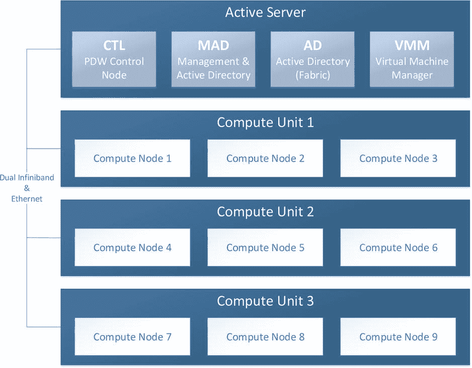

图 8-1。`APS`虚拟机

`PDW`控制节点`虚拟机`提供以下关键功能：

*   客户端连接和身份验证
*   系统和数据库元数据
*   `SQL`请求处理
*   执行计划准备
*   分布式执行编排
*   结果聚合

你可以将`控制节点`视为`PDW`分布式和并行化处理背后的“大脑”。虽然元数据存储在`控制节点`上，但用户数据不会持久化在那里。相反，`控制节点`将用户数据的加载和检索定向到适当的`计算节点`和` distribution`（数据分布）。这是我们第一次引入` distribution`这个术语，所以如果你还不熟悉，别担心。我们将在下一节介绍` distribution`。

### 无共享架构

`PDW`的核心是`无共享架构`的概念。在`无共享架构`中，单个逻辑表被拆分成许多更小的物理片段。具体的片段数量取决于`PDW`区域中的`计算节点`数量。在单个`计算节点`内，每个数据片段又会被进一步拆分到八（`8`）个` distribution`中。每个`计算节点`的` distribution`数量无法配置，并且在所有硬件供应商中都是一致的。

` distribution`是`PDW`中最细粒度的物理层级。每个` distribution`包含其专用的`CPU`、`内存`和存储（`LUN`），用于存储和检索数据。因为每个` distribution`都有其专用的硬件，它可以与其他` distribution`并行执行加载和检索操作。这个概念就是我们所说的“无共享”。`无共享架构`带来了许多好处，例如更好的线性可扩展性。但也许`PDW`最强大的能力在于其以惊人速度扫描数据的能力。

让我们来计算一下。假设你有一个`PDW`设备，其`基础机架`包含`9 个计算节点`，你需要存储一个包含`10 亿行`的表。数据将被分散到所有`9 个计算节点`，而每个`计算节点`又会将其数据分散到`8 个 distribution`中。因此，这`10 亿行`的表将被分散到`72 个 distribution`（`9 个计算节点` × `每个计算节点 8 个 distribution`）。这意味着每个` distribution`将存储大约`13,900,000 行`。


但从最终用户的角度来看，这意味着什么？让我们假设一个场景。假设你是一家零售公司的用户，有一个需要连接两个表的查询：一个包含 10 亿行的 `Sales` 表，以及一个包含 5000 万行的 `Customer` 表。不巧的是，没有可用的索引能覆盖你的查询。这意味着你需要对每个表中的每一行进行 `扫描` 或读取。

在一个 `SMP` 系统（内存、存储和 CPU 共享）中，这个查询可能需要运行数小时甚至数天。在某些系统上，根据服务器硬件和服务器活动量等因素，尝试执行此查询甚至可能不可行。简而言之，该查询将耗费相当长的时间才能返回结果，并且很可能对服务器上的其他活动产生负面影响。

而在 `PDW` 中，这类查询通常能在几分钟内返回。如果模式设计良好——即将你要连接的行存储在同一个分布（distribution）上——甚至可以在几秒钟内执行完此查询。这是因为其架构是为扫描操作 `优化` 的；`PDW` 本来就 `预期` 要扫描表中的每一行。还记得我们之前提到过每个分布都有其专用的 CPU、内存和存储吗？当你提交连接 10 亿行和 5000 万行的查询时，每个分布都在扫描自己本地 `Sales` 表（1380 万行）和 `Customer` 表（69.5 万行）。这些较小的数据量更易于处理，一个空闲的分布可以轻松应对这样的工作负载。然后，数据通过超快的双 `InfiniBand` 通道发送回 `控制` 节点，以合并结果并将数据返回给最终用户。正是这种分而治之的策略使得 `PDW` 能显著超越 `SMP` 系统。

### 聚集列存储索引

`列存储` 指的是以列式（或面向列）的存储格式存储数据。在传统的 `RDBMS` 系统中，数据使用 `行存储`（或面向行）的存储格式。`行存储` 通常非常适合事务型应用，这类应用通常关注一行或少数几行的大多数或所有列。另一方面，`列存储` 更适合分析型应用，这类应用通常关注表中列的子集以及大部分甚至全部的行。

对于熟悉 `SQL Server` 中索引的人来说，你可以将聚集列存储索引（`CCI`）类比为面向行表中的聚集索引。但与聚集索引不同，一旦定义了 `CCI`，就不能再在该表上创建非聚集索引等额外索引。

在 `PDW` 中，`CCI` 相比传统的 `行存储` 提供了多项性能改进。一些客户观察到查询性能提升高达十倍，数据压缩改善高达七倍。由于压缩及相关性能提升，微软推荐 `CCI` 作为 `PDW` 中表的标准存储格式。

 **提示**  `列存储` 在 `PDW` 和 `SQL Server 企业版` 中均可用。有关列存储索引的更多信息，请参阅 `MSDN` 上的“列存储索引详解”主题，或访问 `http://msdn.microsoft.com/en-us/library/gg492088`。

### 加载数据

我们在上一节讨论过，`PDW` 由于其无共享架构，能够非常高效地查询数据。出于同样的原因，`PDW` 也能非常高效地加载数据。让我们简要讨论一下 `PDW` 如何能如此高效地执行数据导入。

如前所述，`控制虚拟机` 是写入或从设备检索任何数据的第一站。`控制` 节点决定哪些 `计算` 节点将参与存储操作。然后，每个 `计算` 节点使用哈希算法来确定数据存储位置，直至单个分布和关联的 `LUN`。这使得每个分布可以与其他分布并行加载其数据。同样，并行分而治之地导入一个大表，将比执行单个大型导入或串行执行多个小型导入快得多。

数据可以从众多平台导入，包括 `Oracle`、`SQL Server`、`MySQL` 和平面文件。将数据加载到 `PDW` 设备主要有两种方法：`DWLoader` 和 `Integration Services`。我们将简要讨论何时使用 `DWLoader` 与 `Integration Services`。之后，我们将通过一个使用 `Integration Services` 从 `SQL Server` 加载数据的示例。

### DWLoader 与 Integration Services

`DWLoader` 是随 `PDW` 附带的命令行实用程序。熟悉 `SQL Server BCP`（大容量复制程序）的人会很容易学会 `DWLoader`，因为这两个实用程序的语法非常相似。从 `SQL Server` 向 `PDW` 加载数据的一个非常常见的模式是：

```
1. 使用 BCP 将数据从 SQL Server 导出到平面文件。
2. 将平面文件存储在加载服务器上。
3. 使用 DWLoader 将数据文件从加载服务器导入到 PDW。
```

这是一种非常高效的数据导入方法，并且很容易生成表 `DDL`、`BCP` 命令和 `DWLoader` 命令的脚本。因此，对于数据仓库中常存在的大量小型维度表的初始和增量加载，你可能需要考虑使用 `DWLoader`。这样做可以大大加快数据仓库迁移的速度。这种加载模式也可以用于从任何系统（不仅仅是 `SQL Server`）生成的平面文件。

对于较大的表，你可能需要考虑 `Integration Services`。`Integration Services` 提供更强大的功能，并且可以说提供了更便捷的端到端体验。这是因为 `Integration Services` 能够直接连接到数据源，并将数据加载到 `PDW` 设备中，而无需经过文件共享。另一个重要区别是，`Integration Services` 还能在数据传输过程中执行转换，这是 `DWLoader` 不支持的。

值得注意的是，`Integration Services` 中的每个数据流都是单线程的，并且可能在 `I/O` 上形成瓶颈。通常，单线程的 `Integration Services` 包性能可能比 `DWLoader` 慢十倍。然而，多线程的 `Integration Services` 包——类似于我们稍后将创建的那个——可以缓解这一限制。对于需要数据类型转换的大表，具有十个并行数据流的 `Integration Services` 包可以两全其美：性能与 `DWLoader` 相当，同时拥有 `Integration Services` 提供的所有高级功能。

在决定使用 `DWLoader` 还是 `Integration Services` 时，你应该考虑许多变量。除了表大小，网络速度和表设计也会产生影响。归根结底，大多数 `PDW` 实施可能会结合使用这两种工具。最好的方法是在你的环境中测试每种方法的性能，并为每种表模式选择最合适的工具。

### ETL 与 ELT

许多 `Integration Services` 包是按照提取、转换和加载（`ETL`）流程设计的的。这是一个实用的模型，它力图减轻数据移动对源和目标服务器（传统上资源更受限）的影响，将数据过滤、清洗等此类活动的负担放在（可以说更容易扩展的）`ETL` 服务器上。相比之下，提取、加载和转换（`ELT`）流程则将负担放在了目标服务器上。


尽管两种模型各有其适用场景，且 `PDW` 同时支持两者，但从技术和业务角度来看，`ELT` 与 `PDW` 的搭配更具优势。在技术层面，`PDW` 能够利用其大规模并行处理（`MPP`）能力，更高效地加载和转换海量数据。从业务角度而言，让更多数据共置一处，能在转换过程中提取出更有价值的信息。拥有 `MPP` 系统的企业常常发现，能够共置并转换大量异构数据，使它们能够从被动响应的数据集市（*这款产品我们卖出了多少？*）跃升至预测性数据建模（*我们如何才能卖出* *更多* *这款产品？*）。

决定采用 `ELT` 策略并不意味着你的 `Integration Services` 包就完全不需要执行任何转换。事实上，许多 `Integration Services` 包可能需要进行数据类型转换。表 8-1 展示了 `PDW` 支持的数据类型及其对应的 `Integration Services` 数据类型。

表 8-1. `PDW` 与 `Integration Services` 的数据类型映射

| `SQL Server PDW` 数据类型 | 映射到 `SQL Server PDW` 数据类型的 `Integration Services` 数据类型 |
| --- | --- |
| `BIT` | `DT_BOOL` |
| `BIGINT` | `DT_I1`, `DT_I2`, `DT_I4`, `DT_I8`, `DT_UI1`, `DT_UI2`, `DT_UI4` |
| `CHAR` | `DT_STR` |
| `DATE` | `DT_DBDATE` |
| `DATETIME` | `DT_DATE`, `DT_DBDATE`, `DT_DBTIMESTAMP`, `DT_DBTIMESTAMP2` |
| `DATETIME2` | `DT_DATE`, `DT_DBDATE`, `DT_DBTIMESTAMP`, `DT_DBTIMESTAMP2` |
| `DATETIMEOFFSET` | `DT_WSTR` |
| `DECIMAL` | `DT_DECIMAL`, `DT_I1`, `DT_I2`, `DT_I4`, `DT_I4`, `DT_I8`, `DT_NUMERIC`, `DT_UI1`, `DT_UI2`, `DT_UI4`, `DT_UI8` |
| `FLOAT` | `DT_R4`, `DT_R8` |
| `INT` | `DT_I1`, `DTI2`, `DT_I4`, `DT_UI1`, `DT_UI2` |
| `MONEY` | `DT_CY` |
| `NCHAR` | `DT_WSTR` |
| `NUMERIC` | `DT_DECIMAL`, `DT_I1`, `DT_I2`, `DT_I4`, `DT_I8`, `DT_NUMERIC`, `DT_UI1`, `DT_UI2`, `DT_UI4`, `DT_UI8` |
| `NVARCHAR` | `DT_WSTR`, `DT_STR` |
| `REAL` | `DT_R4` |
| `SMALLDATETIME` | `DT_DBTIMESTAMP2` |
| `SMALLINT` | `DT_I1`, `DT_I2`, `DT_UI1` |
| `SMALLMONEY` | `DT_R4` |
| `TIME` | `DT_WSTR` |
| `TINYINT` | `DT_I1` |
| `VARBINARY` | `DT_BYTES` |
| `VARCHAR` | `DT_STR` |

另外，值得注意的是，在撰写本文时，`PDW` 目前不支持以下数据类型：

*   `DT_DBTIMESTAMPOFFSET`
*   `DT_DBTIME2`
*   `DT_GUID`
*   `DT_IMAGE`
*   `DT_NTEXT`
*   `DT_TEXT`

任何这些不受支持的数据类型都需要使用 `Data Conversion` 转换组件转换为兼容的数据类型。稍后我们将逐步演示如何执行此类转换。

### PDW 的数据导入模式

现在你已经对 `APS` 设备的架构和加载概念有了基本了解，我们准备好开始介绍将数据导入 `PDW` 的模式。

#### 先决条件

所有 `Integration Services` 包都将从加载服务器执行。*加载服务器* 是驻留在你的网络上、运行 `Windows Server 2008 R2` 或更新版本的非设备服务器。加载服务器通过 `Ethernet` 或 `InfiniBand`（推荐后者以获得更好性能）连接到 `APS` 设备。此外，加载服务器需要访问控制节点的权限，并且必须安装 `Integration Services` 和 `PDW` 目标适配器。

`PDW` 目标适配器的要求会因你运行的 `PDW` 和 `Integration Services` 版本而异。`PDW` 文档详细概述了各种要求和安装说明。有关更多信息，请参阅你的 `PDW` 文档中的“安装 Integration Services 目标适配器 (SQL Server PDW)”部分。

在加载服务器上安装好 `PDW` 目标适配器后，我们就可以开始创建模拟数据了。

#### 准备数据

为了准备将数据从 `SQL Server` 移动到 `PDW`，你需要在 `SQL Server` 中创建一个数据库并用一些测试数据填充它。在你最喜欢的查询编辑器（如 `SQL Server Management Studio` (`SSMS`)）中执行 清单 8-1 中的 `T-SQL` 代码，以创建一个名为 `PDW_Example` 的新数据库。

***清单 8-1***. 创建 `SQL Server` 数据库的 `T-SQL` 代码示例

```sql
USE [master];
GO

/* 创建一个用于实验的数据库 */
CREATE DATABASE [PDW_Example]
    ON PRIMARY
    (
        NAME = N'PDW_Example'
      , FILENAME = N'C:\Program Files\Microsoft SQL Server\MSSQL12.MSSQLSERVER\ MSSQL\DATA\PDW_Example.mdf'
      , SIZE = 1024MB
      , MAXSIZE = UNLIMITED
      , FILEGROWTH = 1024MB
    )
    LOG ON
    (
        NAME = N'PDW_Example_Log'
      , FILENAME = N'C:\Program Files\Microsoft SQL Server\MSSQL12.MSSQLSERVER\ MSSQL\DATA\PDW_Example_Log.ldf'
      , SIZE = 256MB
      , MAXSIZE = UNLIMITED
      , FILEGROWTH = 256MB
    );
GO
```

请注意，你的数据库文件路径会因具体安装细节而有所不同。

接下来，创建一个表并用一些数据填充它。正如我们之前讨论的，`Integration Services` 最适合处理可以多线程操作的大型表。一个很好的例子是按年份分区的 `销售` `事实` 表。清单 8-2 将提供创建表和分区依赖项所需的 `T-SQL` 代码。

***清单 8-2***. 在 `SQL Server` 中创建分区表的 `T-SQL` 代码示例

```sql
USE PDW_Example;
GO

/* 创建分区函数 */
CREATE PARTITION FUNCTION example_yearlyDateRange_pf
(DATETIME) AS RANGE RIGHT
FOR VALUES('2013-01-01', '2014-01-01', '2015-01-01');
GO

/* 将分区函数与分区方案关联 */
CREATE PARTITION SCHEME example_yearlyDateRange_ps
AS PARTITION example_yearlyDateRange_pf ALL TO([Primary]);
GO

/* 创建一个用于实验的分区事实表 */
CREATE TABLE PDW_Example.dbo.FactSales (
     orderID            INT IDENTITY(1,1)
   , orderDate          DATETIME
   , customerID         INT
   , webID              UNIQUEIDENTIFIER DEFAULT (NEWID())

CONSTRAINT PK_FactSales
        PRIMARY KEY CLUSTERED
        (
              orderDate
            , orderID
        )
) ON example_yearlyDateRange_ps(orderDate);
```

 **注意** 上面的语法报错？分区功能仅在 `SQL Server 企业版` 和 `开发人员版` 中可用。如果你使用的是非 `企业版` 或 `开发人员版`，可以注释掉最后一行中的分区设置

`ON example_yearlyDateRange_ps(orderDate);`

并将其替换为

`ON [Primary];`

接下来，你需要使用 清单 8-3 中的 `T-SQL` 生成数据。这将是你加载到 `PDW` 的数据。

***清单 8-3***. 用示例数据填充表的 `T-SQL` 代码示例

```sql
/* 声明变量并用一个任意日期初始化 */
DECLARE @startDate DATETIME = '2013-01-01';

/* 对 FactSales 表执行迭代插入 */
WHILE @startDate < '2016-01-01'
BEGIN

INSERT INTO PDW_Example.dbo.FactSales (orderDate, customerID)
    SELECT @startDate
        , DATEPART(WEEK, @startDate) + DATEPART(HOUR, @startDate);

/* 将日期值增加一小时；如需更多测试数据，
可将 HOUR 替换为 MINUTE 或 SECOND */
    SET @startDate = DATEADD(HOUR, 1, @startDate);

END;
```

此脚本将在 `FactSales` 表中生成大约 26,000 行数据，跨越 3 年，不过你可以通过将 `DATEADD` 语句中的 `HOUR` 替换为 `MINUTE` 甚至 `SECOND` 来轻松增加生成的行数。

现在你有了一个可用的数据源，可以开始处理你的 `Integration Services` 包了。

### 包概述


让我们来讨论你的数据包将要实现的功能。你将配置一个数据流，将数据从 SQL Server 移动到 PDW。你将通过一个 OLE DB 源创建与数据源的连接。由于 `UNIQUEIDENTIFIER`（也称为 `GUID`）在 PDW 中尚未作为数据类型得到支持，你将使用数据转换将 `UNIQUEIDENTIFIER` 转换为 Unicode 字符串 `string (DT_WSTR)`。接着，你将配置 PDW 目标适配器，以将数据加载到 APS 设备中。最后，你将对数据包进行多线程处理，这利用了 PDW 的并行处理能力来提升加载性能。

实现多线程的一个简单方法是为同一张表创建多个并行执行的数据流。一张表最多可以同时进行十次加载——即十个数据流。然而，同时加载面临的挑战在于避免对源系统造成过多争用。你可以通过将每个数据流隔离到集群索引的独立、均等部分来最小化争用。更好的做法是，如果你拥有 SQL Server 企业版，你可以通过按分区加载来隔离每个数据流。后一种方法更为可取，也是我们的示例将采用的方法。

既然你已经理解了 Integration Services 数据包的总体结构，让我们开始创建它吧。

### 数据源

如果尚未完成，请创建一个名为 `PDW_Example` 的新 Integration Services 项目（文件  新建  项目  Integration Services 项目）。

将数据流任务添加到控制流设计器界面。将其命名为 `PDW Import`。

从 SSIS 工具箱中将 OLE DB 源添加到设计器界面。双击图标以编辑 OLE DB 源的属性。你应该会看到如 图 8-2 所示的源编辑器。

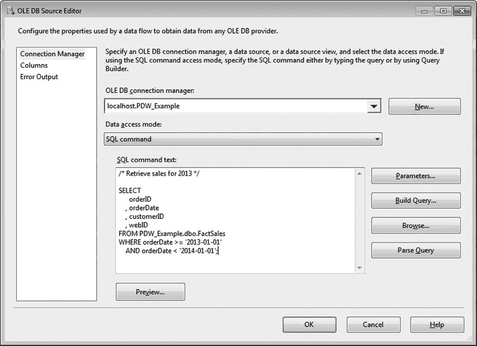

图 8-2. OLE DB 源编辑器

你需要创建一个指向 `PDW_Example` 数据库的 OLE DB 连接管理器。完成后，将数据访问模式更改为 `SQL 命令`；然后在 清单 8-4 中输入代码。

**清单 8-4**. SQL 命令示例

```
/* 检索 2013 年的销售数据 */
SELECT
      orderID
    , orderDate
    , customerID
    , webID
FROM PDW_Example.dbo.FactSales
WHERE orderDate >= '2013-01-01'
    AND orderDate < '2014-01-01';
```

你的 OLE DB 源编辑器应与 图 8-2 类似。点击 `预览` 以验证结果，然后点击 `确定` 关闭编辑器。

这段代码很简单，但它实现了一个相当重要的功能。通过按 `orderDate`（在 清单 8-2 中指定为分区键的列）搜索 `FactSales` 表，SQL Server 能够执行分区消除，这对于最小化 I/O 争用非常重要。这为每个数据流提供了一个既易于理解又性能良好的自然边界。即使不对 `FactSales` 进行分区，你也可以通过执行集群索引 `orderDate` 上的顺序查找来实现类似的结果。但如果 `FactSales` 仅以 `orderID` 作为集群键呢？你可以应用相同的原理，通过在每个数据流中搜索均匀分布的连续行数来获得良好的性能。例如，如果 `FactSales` 有 1,000,000 行，而我们使用 10 个数据流，那么每个 OLE DB 源应搜索 100,000 行（即 `orderID >= 1 and orderID < 100000; orderID >= 100000 and orderID < 200000;` 等）。这类设计考虑因素可能对 Integration Services 数据包的整体性能产生重大影响。

> **提示** 不熟悉分区？表分区特别适合大型数据仓库环境，并且提供的益处远不止这里简要提到的。更多信息请参阅白皮书《使用 SQL Server 2008 的分区表和索引策略》，网址为 `http://msdn.microsoft.com/en-us/library/dd578580.aspx`。

#### 数据转换

你可能还记得，源表中有一个 `UNIQUEIDENTIFIER` 列，在 PDW 中存储为 `CHAR(38)` 列。为了加载此数据，我们需要将 `UNIQUEIDENTIFER` 转换为 Unicode 字符串。为此，将 `数据转换` 图标从 SSIS 工具箱拖到设计器界面。接下来，将蓝色数据流箭头从 `OLE DB 源` 连接到 `数据转换`，如 图 8-3 所示。

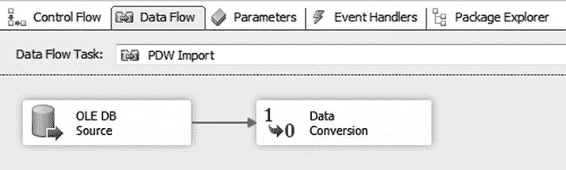

图 8-3. 将 OLE DB 源连接到数据转换

双击 `数据转换` 图标以打开数据转换转换编辑器。点击 `webID` 左侧的框；然后编辑其属性以反映以下值：

*   **输入列:** `webID`
*   **输出别名:** `webID_converted`
*   **数据类型:** `string [DT_WSTR]`
*   **长度:** `38`

确认设置与 图 8-4 中的相符，然后点击 `确定`。

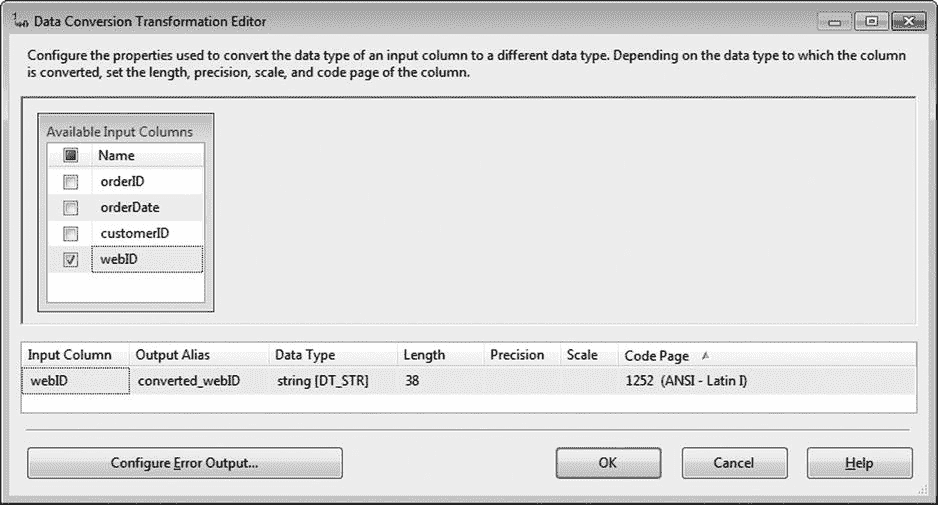

图 8-4. 数据转换转换编辑器

> **提示** 疑惑为什么将 `UNIQUEIDENTIFIER` 转换为 `CHAR` 时要使用字符串长度 38？这是因为 GUID 的全局表示形式是 `{00000000-0000-0000-0000-000000000000}`。在 SQL Server 中，`UNIQUEIDENTIFIER` 列隐式存储了花括号。因此，在转换过程中，Integration Services 会具体化这些花括号以便导出到目标系统。这就是为什么，尽管一个 `UNIQUEIDENTIFIER` 看起来可能只占用 36 个字节，但它在 PDW 中实际存储需要 38 个字节。

### 数据目标

接下来的几项任务将在 SQL Server Data Tools（简称 SSDT）中进行，这些任务为接收 `FactSales` 数据准备 PDW 设备。有关从 SSDT 连接到 PDW 的更多信息，请参阅 PDW 文档中的“为 Visual Studio 安装 SQL Server Data Tools (SQL Server PDW)”部分。

在继续之前，我们应该讨论一下*暂存数据库*的使用。虽然不是必须的，但 Microsoft 建议你在增量加载期间使用暂存数据库以减少表碎片。当你使用暂存数据库时，数据首先被加载到暂存数据库中的临时表，然后再插入到目标数据库的永久表中。

> **提示** 使用暂存数据库？请确保你的暂存数据库有足够的可用空间来容纳所有同时加载的表。如果最初分配的空间不足，请不要担心；你仍然可以继续——暂存数据库会自动增长。只是你的加载速度可能会在自动增长发生时变慢。此外，在系统部署和迁移期间执行初始表加载时，你的暂存数据库可能需要更大。然而，一旦你的系统变得更加成熟且初始爬坡期完成，你可以通过删除并重新创建一个更小的暂存数据库来回收一些空间。

在 SSDT 中，在你的 PDW 设备上执行 清单 8-5 中的代码以创建一个暂存数据库。

**清单 8-5**. 从 SSDT 运行以创建暂存数据库的 PDW 代码

```
CREATE DATABASE StageDB_Example
WITH
(
      AUTOGROW                 = ON
    , REPLICATED_SIZE          = 1 GB
    , DISTRIBUTED_SIZE         = 5 GB
    , LOG_SIZE                 = 1 GB
);
```


### PDW 中的表分布与复制

PDW 引入了复制表和分布式表的概念。在一个 `distributed table` 中，数据通过在创建表时指定的分布哈希值，被分割存储到所有节点上。在一个 `replicated table` 中，完整的表数据存在于每一个计算节点上。如果使用得当，复制表通常可以提升连接性能。作为一个假设性的例子，考虑一个只有 200 行的小型 `DimCountry` 维度表。`DimCountry` 很可能会被复制，而大得多的 `FactSales` 表则会被分布。这种设计允许 `FactSales` 和 `DimCountry` 之间的任何连接在每个节点上本地进行。虽然你本质上会创建十个 `DimCountry` 的副本（每个计算节点一个），但本地连接带来的性能提升，远超存储这样一个小表的重复副本所带来的微小成本。

让我们再看一下清单 8-5 中的`CREATE DATABASE`代码。`REPLICATED_SIZE`指定了*每个计算节点*上复制表的空间分配，而`DISTRIBUTED_SIZE`指定了*整个设备*上分布式表的空间分配。这意味着`StageDB_Example`实际上分配了 16GB 空间：10GB 用于复制表（10 个计算节点，每个节点 1GB），5GB 用于分布式表，以及 1GB 用于日志。

在 PDW 加载过程中，所有数据都会自动使用页面级压缩进行压缩。这不是可选的，压缩量会因客户和表的不同而有很大差异。如果你使用的是 SQL Server 企业版或开发版，可以执行清单 8-6 中的语句来估算压缩结果。

**清单 8-6**. 估算压缩节省空间的代码

```sql
/* Estimate compression ratio */
EXECUTE sp_estimate_data_compression_savings
'dbo', 'FactSales', NULL, NULL, 'PAGE';
```

`sp_estimate_data_compression_savings`的示例结果如图 8-5 所示。

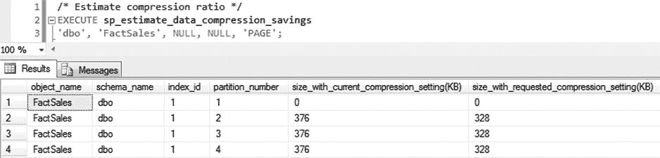

**图 8-5**. 压缩节省空间示例

通常可以使用 2:1 作为粗略估计。按照 2:1 的压缩比，清单 8-5 中指定的 5GB 分布式数据实际上存储了 10GB 未压缩的 SQL Server 数据。

你仍然需要在 PDW 中为导入的数据找一个存储位置。在 SSDT 中执行清单 8-7 中的代码，为`FactSales`创建目标数据库和表。

**清单 8-7**. 用于创建目标数据库和表的 PDW 代码

```sql
CREATE DATABASE PDW_Destination_Example
WITH
(
      REPLICATED_SIZE           = 1 GB
    , DISTRIBUTED_SIZE          = 5 GB
    , LOG_SIZE                  = 1 GB
);

CREATE TABLE PDW_Destination_Example.dbo.FactSales
(
     orderID            INT
   , orderDate          DATETIME
   , customerID         INT
   , webID              CHAR(38)
)
WITH
(
      DISTRIBUTION = HASH (orderID)
    , CLUSTERED COLUMNSTORE INDEX
);
```

现在目标对象已经创建，我们可以回到 Integration Services 包。将 **SQL Server PDW Destination** 从工具箱拖到数据流 pane 中。双击图 8-6 所示的 **SQL Server PDW Destination** 来编辑其配置。


**图 8-6**. SQL Server PDW Destination

接下来，单击 **Connection Manager** 旁边的下拉箭头，并选择 **<Create New Connection. . .>**，如图 8-7 所示。

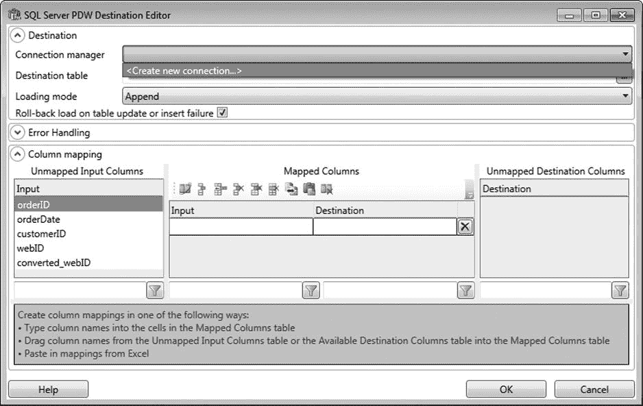

**图 8-7**. SQL Server PDW Destination Editor

在 **SQL Server PDW Connection Manager Editor** 中使用以下项目输入你的连接信息：

*   **Server:** 你设备上控制节点的 IP 地址（最佳实践是使用集群 IP 地址以支持控制节点故障转移。）
*   **User:** 用于向设备进行身份验证的登录名
*   **Password:** 你的登录密码
*   **Destination Database:** `PDW_Destination_Example`
*   **Staging Database:** `StageDB_Example`

让我们讨论一下与此连接信息相关的一些最佳实践。首先，你应该指定控制节点集群的 IP 地址，而不是活动控制节点服务器的 IP 地址。使用集群 IP 地址将使你的连接在控制节点发生故障转移时，无需手动干预即可继续解析。

其次，PDW 支持 SQL Server 和 Active Directory 身份验证。使用 SQL Server 身份验证时，最佳实践是使用 `sa` 以外的账户。这样做将提高 PDW 设备的安全性。

最后，正如我们之前讨论的，Microsoft 建议为数据加载使用暂存数据库。在 **Staging Database Name** 下拉列表中选择暂存数据库。这会指示 PDW 先将数据加载到指定暂存数据库中的临时表，然后再将数据加载到最终的目标数据库。这是可选的，但直接加载到目标数据库会增加碎片。

完成后，你的 **SQL Server PDW Connection Manager Editor** 应类似于图 8-8。单击 **Test Connection** 以确认你的信息输入正确，然后单击 **OK** 返回到 **SQL Server PDW Destination Editor**。

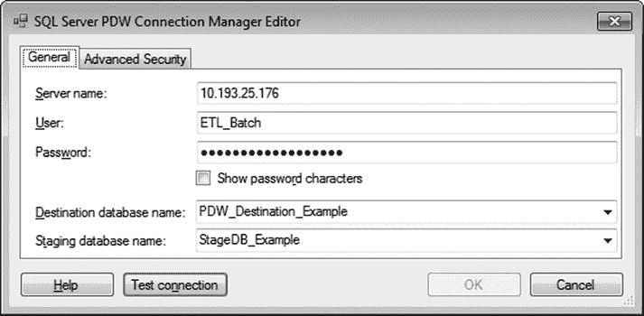

**图 8-8**. SQL Server PDW Connection Manager Editor

 **注意**  如果未指定暂存数据库，SQL Server PDW 将直接在目标数据库内执行加载操作，这可能导致高水平的表碎片。

单击 **Destination Table** 字段将弹出 **Select Destination Table** 模型。单击 `FactSales`。有四种可用的加载模式：

*   **Append:** 将行插入到目标表中现有数据的末尾。这可能是你最常用的模式。
*   **Reload:** 在加载前截断表。
*   **Upsert:** 对目标表执行 `MERGE`，其中新数据被插入，现有数据被更新。你需要指定一个或多个用于连接数据的列。
*   **FastAppend:** 顾名思义，FastAppend 是将数据加载到目标表中的最快方式。代价是它不支持回滚；在失败的情况下，你需要负责删除任何部分插入的行。FastAppend 还将绕过暂存数据库，导致高水平的碎片。

让我们花点时间讨论一下如何将这两种常见加载模式与这些模式结合使用。如果你正在对大表执行定期的增量加载（例如，用前一天的订单更新事务性销售表），你应该直接使用 `Append` 模式加载数据，因为不需要转换。现在假设你加载的是相同的数据，但你计划转换数据并加载到集市中，然后再删除临时数据。第二个例子更适合使用 `FastAppend` 模式。或者更简洁地说，任何时候你加载到一个空的、中间的工作表中时，都可以使用 `FastAppend`。


我们需要讨论最后一个选项。在加载模式下方，有一个名为 `在表更新或插入失败时回滚加载` 的复选框。要理解此选项，你需要对数据如何加载到 PDW 有所了解。当使用追加、重新加载或更新插入模式加载数据时，PDW 会执行两阶段加载。在第一阶段，数据被加载到暂存数据库中。在第二阶段，PDW 对排序后的数据执行 `INSERT`/`SELECT` 操作，将其加载到最终的目标表中。默认情况下，数据会在所有计算节点上并行加载，但在每个计算节点内，数据是按分配顺序串行加载的。这对于支持回滚是必要的。加载过程的大约 85-95%的时间都花在了第一阶段。当 `在表更新或插入失败时回滚加载` 选项被取消选中时，在第二阶段，每个分配将并行加载而不是串行加载。所以，换句话说，取消选择此选项将提高性能，但仅影响整个过程的 5-15%。此外，取消选择此选项会移除 PDW 的回滚能力；如果在第二阶段发生失败，你需要自行清理任何部分插入的数据。

鉴于潜在的风险和微小的收益，最佳实践是仅在向空表加载数据时才取消选择此选项。FastAppend 不受此选项影响，因为它总是跳过第二阶段并直接加载到最终表中，这也是为什么 FastAppend 也不支持回滚。

 **提示** 在 DWLoader 中，通过使用 `–m` 选项也可以使用 `在表更新或插入失败时回滚加载` 功能。

回到 PDW 目标编辑器，在加载模式字段中选择追加。由于目标表当前为空，取消选择 `在表更新或插入失败时回滚加载` 选项，以获得一点无风险的性能提升。

你几乎完成了你的第一个数据流任务。剩下要做的就是映射你的数据。将蓝色箭头从数据转换框拖到 SQL Server PDW 目标框，然后双击 `SQL Server PDW Destination`。映射你的输入列和目标列。确保将 `webID` 映射到你转换后的 `converted_webID` 列。点击确定。

现在，你已经成功完成了连接 SQL Server 到 PDW 的第一个数据流。剩下的任务就是为该包设置多线程。

### 多线程

你已经完成了 2013 年的数据流，但仍需要为 2014 年和 2015 年创建相同的数据流。通过复制和粘贴，你可以轻松地做到这一点。

首先，点击控制流选项卡，并将第一个数据流重命名为 `SalesMart 2013`。然后，复制并粘贴第一个数据流，并将其重命名为 `SalesMart 2014`。

双击 `SalesMart 2014` 返回到数据流设计器，然后双击 `OLE DB Source`。用 Listing 8-8 中的代码替换 SQL 命令。

**代码清单 8-8. 用于 2014 年数据的 SQL 命令**

```
/* 检索 2014 年的销售数据 */
SELECT
      orderID
    , orderDate
    , customerID
    , webID
FROM PDW_Example.dbo.FactSales
WHERE orderDate >= '2014-01-01'
    AND orderDate < '2015-01-01';
```

返回到控制流选项卡，再次复制 `SalesMart 2013` 数据流。将其重命名为 `Sales Mart 2015`。使用 Listing 8-9 中的代码，替换 `OLE DB Source` 中的 SQL 命令。

**代码清单 8-9. 用于 2015 年数据的 SQL 命令**

```
/* 检索 2015 年的销售数据 */
SELECT
      orderID
    , orderDate
    , customerID
    , webID
FROM PDW_Example.dbo.FactSales
WHERE orderDate >= '2015-01-01'
    AND orderDate < '2016-01-01';
```

现在你已准备好执行该包！按 `F5` 或导航到调试  开始调试。你的包应该会执行，并且你应该能看到一个成功的结果。

### 限制

ETL 开发人员和数据集成工程师在开发 ETL 解决方案时，应注意 PDW 中的以下限制和行为：

*   PDW 最多只允许十个（10）个活动的、并发的加载操作。此数字适用于整个设备，与计算节点的数量无关，并且无法更改。
*   在 Integration Services 包中定义的每个 PDW 目标适配器都计为一个并发加载操作。定义了超过十个 PDW 目标适配器的 Integration Services 包将无法执行。
*   如前所述，并非所有 SQL Server 数据类型都在 PDW 中受支持。更多详情，请参考“ETL 与 ELT”部分下的 Table 8-1 中的列表，或查阅你的 PDW 文档。

每次加载操作都伴随着少量开销。这是在分布式环境中操作的必要部分。例如，加载服务器需要与控制节点通信，以确定哪些计算节点应接收数据。由于每次加载都会产生此开销，因此应避免事务性加载模式（如单例插入）。当以大型、增量的批次加载数据时，PDW 的性能最佳。加载 10 个各有 10 万行的文件，或一个包含 100 万行的单个文件，其性能会远胜于加载 100 万个单独的行。

### 总结

我们在本章中涵盖了大量的内容。你了解了 Microsoft 分析平台系统（APS）和 SQL Server 并行数据仓库（PDW）的架构。你了解了 SMP 和 MPP 系统之间的区别，以及为什么 MPP 系统更适合大型分析工作负载。你学习了加载 PDW 的不同方法以及提高加载性能的途径。在此过程中，你还发现了一些最佳实践。最后，你通过一个逐步练习，使用 SSIS 实现了将数据从 SQL Server 并行加载到 PDW。

### 第 9 章


#### XML 模式

XML 是系统之间交换数据的流行格式。SSIS 提供了一个 `XML 源` 适配器，但由于 XML 的灵活性，有时将你的数据转换成 SSIS 数据流所需的表格格式可能有点棘手。本章描述了最适合与 `XML 源` 配合使用的格式，以及两种使用 SSIS 读取 XML 数据的替代模式。

#### 使用 XML 源

与大多数数据流组件一样，`XML 源` 组件需要在设计时设置列元数据。这是通过 XML 模式文件（`.xsd`）完成的。`XML 源` 组件使用模式中定义的结构来创建一个或多个输出，并使用元素和属性数据类型来设置列元数据。更改模式文件将刷新组件的元数据，如果你已经映射了其某些输出，则可能导致验证错误。

如果你的文档尚未定义 XML 模式，SSIS 可以为你生成一个。点击 `XML 源` 编辑器 UI 上的生成模式按钮，该组件将从当前文档推断出模式。请注意，虽然此模式保证适用于当前的 XML 文件，但如果可选元素或值长于预期，它可能不适用于其他文件。你可能需要手动修改生成的模式文件，以确保每个元素的 `minOccurs` 和 `maxOccurs` 属性值正确，并且数据类型设置正确。

当你的输入文件具有简单的元素/子元素结构时，`XML 源` 最容易使用。Listing 9-1 展示了这种结构的一个例子。

**代码清单 9-1. 使用元素的简单 XML 格式**

```
<root>
    <node>
        <subnode>value</subnode>
        <anothersubnode>1</anothersubnode>
    </node>
    <node>
        <subnode>value</subnode>
        <anothersubnode>2</anothersubnode>
    </node>
</root>
```


或者，当值以属性形式列出时，XML 源也能很好地工作，如清单 9-2 所示。这种格式类似于你在 SQL Server 中执行 `SELECT ... FROM XML RAW` 语句得到的输出。

#### 清单 9-2. 使用属性的简单 XML 格式

```xml
<root>
   <row CustomerID="1" TerritoryID="1" AccountNumber="AW00000001" />
   <row CustomerID="2" TerritoryID="1" AccountNumber="AW00000002" />
</root>
```

#### 处理多个输出

清单 9-1 和 9-2 中的 XML 示例在 XML 源中将产生单个输出。如果你的 XML 格式具有多层嵌套元素，XML 源将开始产生多个输出。这些输出将通过自动生成的 `_Id` 列进行关联，你可能需要在下游使用合并联接转换进一步连接它们。

> **注意**
> 如果你有需要连接的单层嵌套 XML 元素，此模式效果很好。如果你有多层 XML 元素并且需要连接两个以上的 XML 源输出，则需要使用排序转换。

清单 9-3 包含一个带有客户信息的 XML 文档。在本章的剩余部分，我们将使用此文档作为示例。

#### 清单 9-3. 示例 XML 文档

```xml
<?xml version="1.0" encoding="utf-8"?>
<Extract Date="2011-07-04">
  <Customers>
    <Customer Key="11000">
      <Name>
        <FirstName>Jon</FirstName>
        <LastName>Yang</LastName>
      </Name>
      <BirthDate>1966-04-08</BirthDate>
      <Gender>M</Gender>
      <YearlyIncome>90000</YearlyIncome>
    </Customer>
    <Customer Key="11001">
      <Name>
        <FirstName>Eugene</FirstName>
        <LastName>Huang</LastName>
      </Name>
      <BirthDate>1965-05-14</BirthDate>
      <Gender>M</Gender>
      <YearlyIncome>60000</YearlyIncome>
    </Customer>
  </Customers>
</Extract>
```

XML 源组件将为每个嵌套的 XML 元素生成一个单独的输出。对于清单 9-3 中的 XML 文档，将有三个输出：`Customers`、`Customer` 和 `Name`。每个输出都包含模式中定义的元素和属性，以及一个 `<element_name>_Id` 列，该列充当行的主键。为子元素生成的输出将包含其父元素输出的 `_Id` 列，如果需要，这允许数据在数据流中稍后连接。

图 9-1 显示了 XML 源组件为清单 9-3 中的 XML 文档生成的输出和列名。

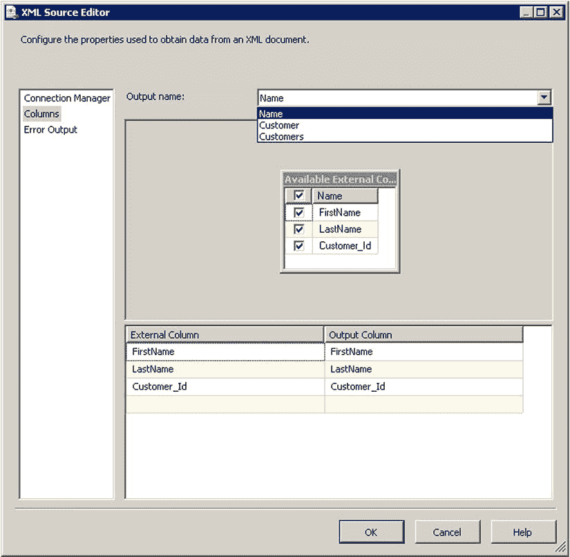

**图 9-1. 为 `Name` 元素生成的输出和列**

> **注意**
> XML 源不会获取文档根元素上的任何属性值。要将此值包含在输出中，你需要重新格式化文档以包含一个新的根元素节点。

图 9-2 显示了我们将存储客户数据的目标表的模式。如你所见，该表需要将所有列显示在一行中，这意味着我们必须在插入数据之前合并 `Customer` 和 `Name` 输出。合并联接转换非常适合此任务，但它要求其两个输入以相同方式排序。我们可以在合并联接之前为每个路径添加一个排序转换，但执行排序可能会对性能产生不利影响，我们应该尽量避免这样做。

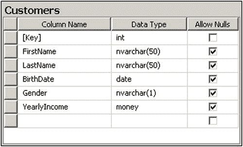

**图 9-2. Customers 数据库表模式**

尽管 XML 源组件不会对其生成的列设置任何排序信息，但输出已经根据生成的 `_Id` 列进行了排序。为了使合并联接能够接受这些输入而无需使用排序转换，我们必须使用 XML 源组件的高级编辑器手动设置 `IsSorted` 和 `SortKeyPosition` 属性，如下所示：

1.  右键单击 XML 源组件，然后选择“显示高级编辑器”。
2.  选择“输入和输出属性”选项卡。
3.  选择 `Name` 输出，并将 `IsSorted` 属性设置为 `True`，如图 9-3 所示。

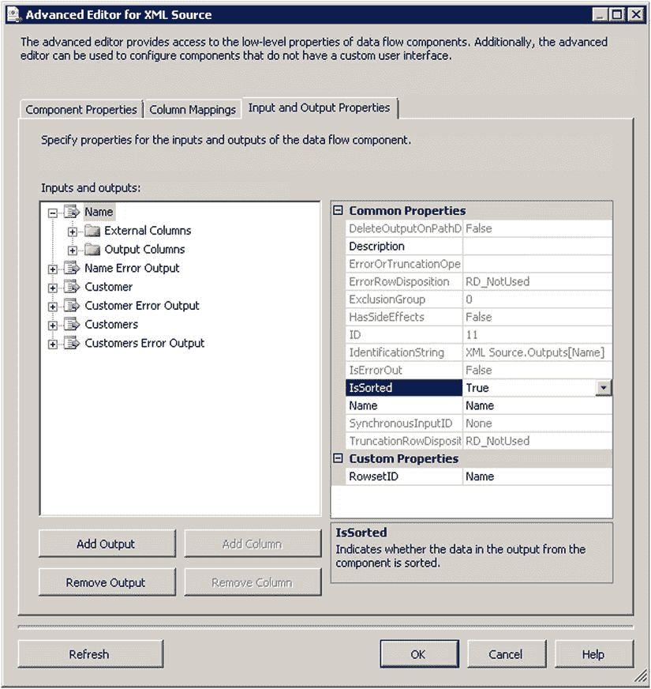

**图 9-3. 在 XML 源的高级编辑器中设置 `IsSorted` 属性值**

4.  展开 `Name` 输出，然后展开“输出列”文件夹。
5.  选择 `Customer_Id` 字段，并将 `SortKeyPosition` 属性设置为 `1`，如图 9-4 所示。

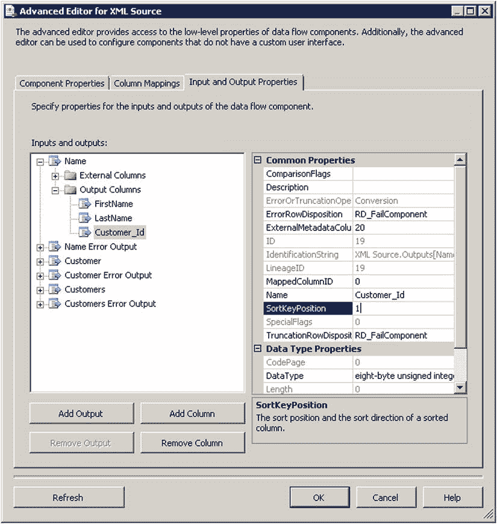

**图 9-4. 在 XML 源的高级编辑器中设置 `SortKeyPosition` 属性值**

6.  对 `Customer` 输出重复步骤 3-5。
7.  单击“确定”保存更改并返回设计器。

通过设置 `Name` 和 `Customer` 输出中 `Customer_Id` 列的 `SortKeyPosition` 值，我们已告诉 SSIS 行将被排序。我们现在可以将两个输出直接映射到合并联接转换（如图 9-5 所示），并选择目标表所需的列（如图 9-6 所示）。

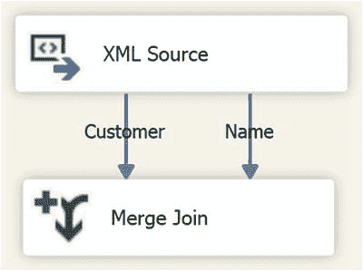

**图 9-5. 将 XML 源组件连接到合并联接转换**

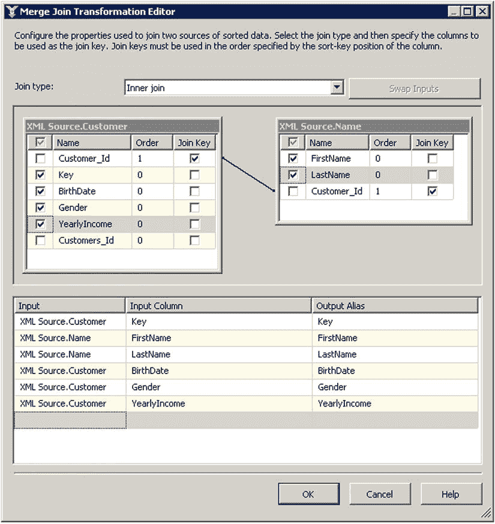

**图 9-6. 映射合并联接转换中的列**

#### 使用 XSLT 简化操作

你可以通过使用 XSLT 预处理源文件来简化复杂 XML 文档的处理。使用 XSLT，你可以将 XML 塑造成与目标模式非常相似的格式，删除不需要捕获的字段，或者将其转换为易于被 XML 源组件处理的简单格式。

来自清单 9-3 的示例 XML 为 XML 源组件产生了三个独立的输出。为了将数据插入目标，我们必须将输出合并为所需的格式。使用清单 9-4 中的 XSLT 脚本，我们可以“扁平化”或反规范化数据，以便 XML 源组件只有一个输出。

#### 清单 9-4. 用于简化我们 XML 示例的 XSLT 脚本

```xml
<?xml version="1.0" encoding="utf-8"?>
<xsl:stylesheet version="1.0" xmlns:xsl="http://www.w3.org/1999/XSL/Transform">
<xsl:output method="xml" indent="yes"/>
<xsl:template match="/Extract">
    <Customers>
        <xsl:for-each select="Customers/Customer">
        <Customer>
            <Key>
                <xsl:value-of select="@Key"/>
            </Key>
            <FirstName>
                <xsl:value-of select="Name/FirstName"/>
            </FirstName>
            <LastName>
                <xsl:value-of select="Name/LastName"/>
            </LastName>
            <BirthDate>
                <xsl:value-of select="BirthDate"/>
            </BirthDate>
            <Gender>
                <xsl:value-of select="Gender"/>
            </Gender>
            <YearlyIncome>
                <xsl:value-of select="YearlyIncome"/>
            </YearlyIncome>
        </Customer>
        </xsl:for-each>
    </Customers>
</xsl:template>
</xsl:stylesheet>
```

我们可以使用 XML 任务应用此 XSLT。具体过程如下：


### 配置 XML 任务

1. 将你的 XSLT 脚本保存到一个文件。
2. 向你的包中添加一个 XML 任务。
3. 双击该任务以打开编辑器。
4. 将 `OperationType` 属性设置为 XSLT，并将 `SaveOperationResult` 属性设置为 `True`。
5. 设置 `SecondOperandType` 和 `SecondOperand` 属性以指向你的 XSLT 脚本文件。
6. 为 `SourceType`、`Source`、`DestinationType` 和 `Destination` 输入适当的连接信息，类似于图 9-7 中所示。

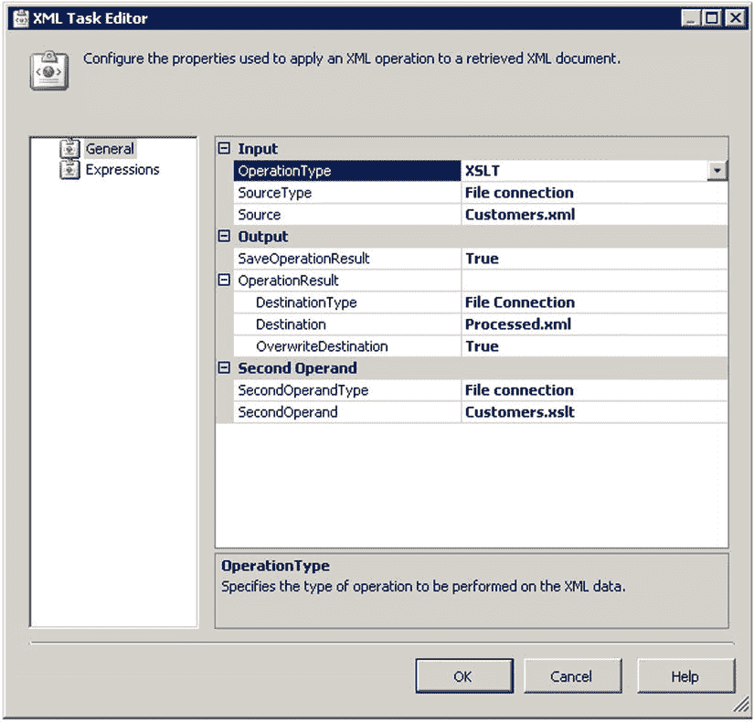

图 9-7。 XML 任务配置

 `注意`  XML 任务在 SQL Server 2012 版本中进行了更新，以使用最新的 .NET XML 技术。应用 XSLT 脚本的性能比以前的版本好得多。

清单 9-5 展示了应用来自清单 9-4 的 XSLT 脚本后，我们的示例 XML 文档的样子。我们可以看到，所有需要提取的字段现在都位于一个单独的 `parent` 元素下。这种新 XML 格式的模式通过 XML Source 组件为我们提供了单一输出，消除了以后在数据流中连接输出的需要。

清单 9-5。 简化的 XML 文档

```
<?xml version="1.0" encoding="utf-8"?>
<Customers>
  <Customer>
    <Key>11000</Key>
    <FirstName>Jon</FirstName>
    <LastName>Yang</LastName>
    <BirthDate>1966-04-08</BirthDate>
    <Gender>M</Gender>
    <YearlyIncome>90000</YearlyIncome>
  </Customer>
  <Customer>
    <Key>11001</Key>
    <FirstName>Eugene</FirstName>
    <LastName>Huang</LastName>
    <BirthDate>1965-05-14</BirthDate>
    <Gender>M</Gender>
    <YearlyIncome>60000</YearlyIncome>
  </Customer>
</Customers>
```

### 使用脚本组件

处理 XML 文档的另一种方法是使用脚本组件，而不是 XML Source。这种模式需要一些自定义编码，但它让你能完全控制数据输出的方式。.NET Framework 提供了多种解析和加载 XML 文档的方法，每种方法都有其优势和性能特点。本节描述了两种使用脚本组件处理 XML 文档的独立模式。

第一种模式使用 XML 架构定义工具 (`Xsd.exe`) 来生成一组 .NET 类，这些类可以被 SSIS 脚本组件使用。它使用 `XmlSerializer` 类将源 XML 文档转换为一组易于使用的 .NET 对象。虽然 `XmlSerializer` 不是 .NET 中处理 XML 文档最快的方式，但强类型类使得代码直接且易于维护。当你处理可以轻松放入内存的复杂 XML 文档（例如，小于 100MB）时，这种方法是 XML Source 的推荐替代方案。

第二种模式结合使用 LINQ to XML 和 `XmlReader` 类以流式方式处理 XML 文档。这种方法对 XML 格式的变化更敏感；可能更难维护，但它会输出使用 `XmlSerializer` 类的脚本。当你处理非常大的 XML 文档或性能至关重要时，推荐使用此模式。

### 配置脚本组件

两种模式中的脚本组件配置方式相同，但它们包含不同的代码。两者都将使用文件连接管理器在运行时定位源 XML 文件，并且两者都将定义相同的输出列。使用以下步骤配置你的脚本组件：

1. 向你的包中添加一个文件连接管理器。
2. 将使用类型设置为“现有文件”，并将路径设置为我们的 XML 源文件，如图 9-8 所示。

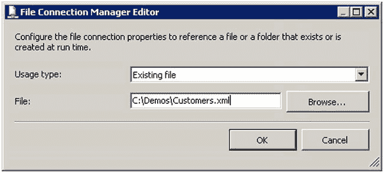

图 9-8。 配置文件连接管理器编辑器


### 3.  为你的数据流包添加一个数据流，并从工具箱中拖放一个`脚本组件`转换。
### 4.  如图 9-9 所示，在`选择脚本组件类型`对话框中选择`源`。

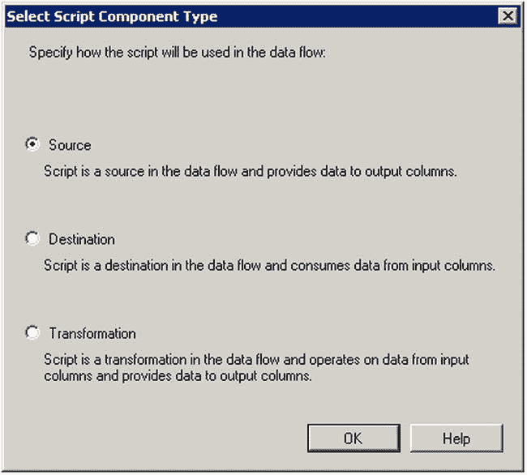

图 9-9. 创建新的脚本组件源

### 5.  双击该组件以打开`脚本转换`编辑器。
### 6.  点击`输入和输出`页面。
### 7.  将你的输出从`Output 0`重命名为更有意义的名称。由于我们的示例 XML 输出的是一组`Customers`，因此在本例中我们将使用这个名称。
### 8.  按你希望输出的样子定义列。确保列的`数据类型`与你在架构中定义的类型相匹配。表 9-1 显示了清单 9-3 中定义的示例所使用的列到数据类型的映射。完成时，你的列定义应类似于图 9-10。

表 9-1. XML 示例的列数据类型映射

| 列 | 数据类型 |
| --- | --- |
| `Key` | `DT_UI4` |
| `FirstName` | `DT_WSTR(255)` |
| `LastName` | `DT_WSTR(255)` |
| `BirthDate` | `DT_DBTIMESTAMP` |
| `Gender` | `DT_WSTR(255)` |
| `YearlyIncome` | `DT_UI4` |

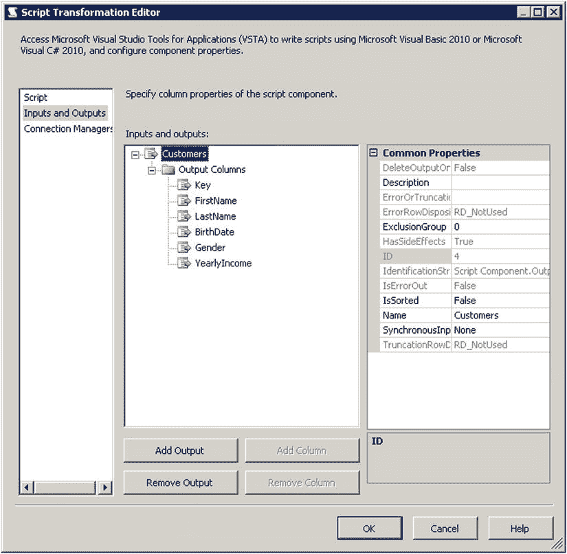

图 9-10. 已配置的输出列

### 9.  转到`连接管理器`页面，并添加对步骤 1 中创建的文件连接管理器的引用。
### 10.  为连接管理器起一个有意义的名称，例如`CustomerFile`。该页面将类似于图 9-11。

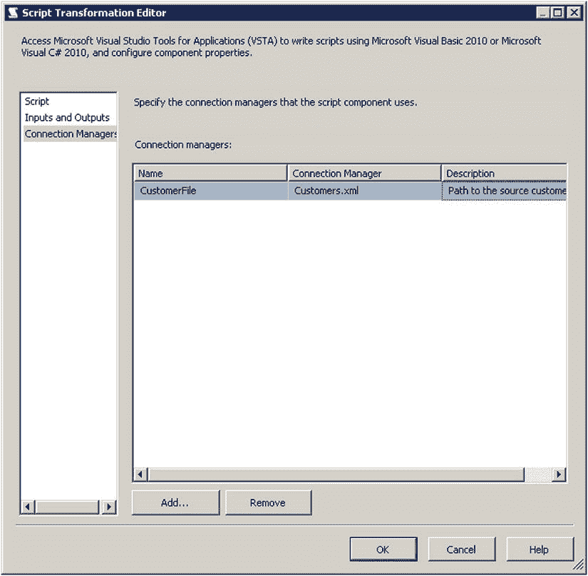

图 9-11. 已配置的连接管理器

### 11.  转到`脚本`页面，点击`编辑脚本`按钮以启动 VSTA 脚本编辑器。

我们将向`ScriptMain`类的` PreExecute`和`CreateNewOutputRows`方法添加代码，同时覆盖基类中的另外两个方法：`AcquireConnection`和`ReleaseConnection`。

`AcquireConnection`方法将从我们在步骤 10 中配置的连接管理器检索 XML 文件的路径。

` PreExecute`方法将验证文件是否确实存在，如果未找到，则会引发错误。

`CreateNewOutputRows`方法执行脚本的大部分工作。它负责从源文档中提取数据并将其输出到数据流。放入此处的代码将取决于你选择的模式。

最后，`ReleaseConnection`方法将释放文件连接，向运行时表明我们已使用完毕。

 **注意** 虽然对于文件连接管理器你不需要调用`ReleaseConnection`，但养成在任何调用了`AcquireConnection`的地方都调用`ReleaseConnection`的习惯是好的。某些连接管理器，例如 OLE DB 连接管理器，会保持底层数据库连接打开，并在连接对象被释放前将资源保留在内存中。

清单 9-6 展示了我们将用于两种脚本组件模式的代码。

***清单 9-6***. 完整源代码清单
```csharp
using System;
using System.Data;
using Microsoft.SqlServer.Dts.Pipeline.Wrapper;
using Microsoft.SqlServer.Dts.Runtime.Wrapper;
using System.IO;
using System.Xml.Serialization;
using System.Xml;

[Microsoft.SqlServer.Dts.Pipeline.SSISScriptComponentEntryPointAttribute]
public class ScriptMain : UserComponent
{
    string pathToXmlFile;

    public override void AcquireConnections(object Transaction)
    {
        // 调用基类
        base.AcquireConnections(Transaction);

        // 文件连接管理器的 AcquireConnection()方法以字符串形式返回路径。
        pathToXmlFile = (string)Connections.CustomerFile.AcquireConnection(Transaction);
    }

    public override void PreExecute()
    {
        // 调用基类
        base.PreExecute();

        // 确保文件路径存在
        if (!File.Exists(pathToXmlFile))
        {
            string errorMessage = string.Format("源 XML 文件不存在。路径: {0}", pathToXmlFile);
            bool bCancel;
            ComponentMetaData.FireError(0, ComponentMetaData.Name, errorMessage, string.Empty, 0, out bCancel);
        }
    }

    public override void CreateNewOutputRows()
    {
        // TODO - 这是我们将加载 XML 文档的地方
    }

    public override void ReleaseConnections()
    {
        // 调用基类
        base.ReleaseConnections();

        // 释放我们的连接
        Connections.CustomerFile.ReleaseConnection(pathToXmlFile);
    }
}
```

配置好脚本组件后，你可以从以下模式中选择一种插入`CreateNewOutputRows`逻辑。

## 使用 XmlSerializer 处理 XML

要使用`XmlSerializer`类处理 XML 文件，我们将使用 XML 架构定义工具从我们的 XML 架构文件生成一组.NET 类。在命令行中，我们将指定要生成类(`/classes`)、要使用的语言（本例中我们将使用 C#，但也可以使用 VB）、结果类的命名空间以及架构文件的路径。我们将使用客户数据 XML 的架构文件(`Customer.xsd`)，如清单 9-3 所示。命令行和`xsd.exe`的输出如清单 9-7 所示。

***清单 9-7***. XML 架构定义工具命令行
```shell
C:\demos>xsd.exe /classes /language:CS /namespace:DesignPatterns.Samples Customer.xsd

Microsoft (R) Xml Schemas/DataTypes support utility
[Microsoft (R) .NET Framework, Version 2.0.50727.3038]
版权所有 (C) Microsoft Corporation。保留所有权利。
正在写入文件 'Customer.cs'。
```

 **注意** XML 架构定义工具是 Windows SDK 的一部分。在大多数机器上，它位于`C:\Program Files (x86)\Microsoft SDKs\Windows\v7.0A\Bin`目录中。有关 XML 架构定义工具的更多信息，请参阅其 MSDN 条目：`http://msdn.microsoft.com/en-us/library/x6c1kb0s.aspx`。

生成的`Customer.cs`文件将包含我们将在脚本组件中使用的类。与`XmlSerializer`类结合使用时，我们可以将整个 XML 源文件读入一组易于操作的对象中。

在开始编写`CreateNewOutputRows`逻辑之前，我们需要包含使用`xsd.exe`生成的`Customer.cs`文件。为此，请在 VSTA 脚本编辑器环境中执行以下步骤：

1.  在解决方案资源管理器中右键单击项目节点（该项目节点以“sc_”开头，后跟一串数字），然后选择`添加现有项`。
2.  浏览到使用`xsd.exe`生成的`Customer.cs`文件。
3.  从解决方案资源管理器中打开`main.cs`。
4.  通过在文件顶部添加`using DesignPatterns.Samples`来包含`Extract`类的命名空间。

将文件添加到项目后，你就可以在`CreateNewOutputRows`中编写读取和操作 XML 数据的代码了。`CreateNewOutputRows`函数的源代码在清单 9-8 中。

***清单 9-8***. 使用 XmlSerializer 类的脚本逻辑
```csharp
public override void CreateNewOutputRows()
{
    // 加载我们的 XML 文档
    Extract extract = (Extract) new XmlSerializer(typeof(Extract)).Deserialize(XmlReader.Create(pathToXmlFile));
```


```csharp
// 为文件中的每个客户输出一个新行
foreach (ExtractCustomer customer in extract.Customers)
{
    CustomersBuffer.AddRow();

    CustomersBuffer.Key = customer.Key;
    CustomersBuffer.FirstName = customer.Name.FirstName;
    CustomersBuffer.LastName = customer.Name.LastName;
    CustomersBuffer.BirthDate = customer.BirthDate;
    CustomersBuffer.Gender = customer.Gender;
    CustomersBuffer.YearlyIncome = customer.YearlyIncome;
}
```

# 使用 XmlReader 和 LINQ to XML 处理 XML

此模式利用 `XmlReader` 类来流式读入 XML 文档，并结合 LINQ to XML 功能来提取你想要保留的值。它非常适合处理大型 XML 文档，因为它不需要将整个文档读入内存。它也适用于你只想从 XML 文档中提取某些字段而忽略其余部分的情况。

 **注意** 该模式的灵感来自 SQL Server MVP Simon Sabin 的一篇帖子。示例代码和其他精彩的 SSIS 内容可以在他的博客 `http://sqlblogcasts.com/blogs/simons/` 上找到。

此模式的关键在于使用 `XmlReader` 类。我们将创建一个特殊的函数，该函数以 `XElement` 集合的形式返回 XML，而不是使用 `XDocument` 类来读取源 XML 文件（这是使用 LINQ to XML 时的典型方法）。这使得我们能够利用 LINQ 语法，同时受益于 `XmlReader` 提供的流式处理功能。

在添加代码之前，你需要将以下命名空间添加到你的 `using` 语句中：

*   `System.Collections.Generic`
*   `System.Linq`
*   `System.Xml.Linq`

清单 9-9 包含了 `XmlReader` 函数 (`StreamReader`) 以及用于处理 XML 文档的 `CreateNewOutputRows` 逻辑的代码。

***清单 9-9***. 使用 XmlReader 类的脚本逻辑

```csharp
public override void CreateNewOutputRows()
{
    foreach (var xdata in (
        from customer in StreamReader(pathToXmlFile, "Customer")
        select new
        {
          Key = customer.Attribute("Key").Value,
          FirstName = customer.Element("Name").Element("FirstName").Value,
          LastName = customer.Element("Name").Element("LastName").Value,
          BirthDate = customer.Element("BirthDate").Value,
          Gender = customer.Element("Gender").Value,
          YearlyIncome = customer.Element("YearlyIncome").Value,
        }
    ))
    {
        try
        {
          CustomersBuffer.AddRow();
          CustomersBuffer.Key = Convert.ToInt32(xdata.Key);
          CustomersBuffer.FirstName = xdata.FirstName;
          CustomersBuffer.LastName = xdata.LastName;
          CustomersBuffer.BirthDate = Convert.ToDateTime(xdata.BirthDate);
          CustomersBuffer.Gender = xdata.Gender;
          CustomersBuffer.YearlyIncome = Convert.ToDecimal(xdata.YearlyIncome);
        }
        catch (Exception e)
        {
            string errorMessage = string.Format("检索数据时出错。异常消息：{0}",
                                                 e.Message);
            bool bCancel;
            ComponentMetaData.FireError(0, ComponentMetaData.Name, errorMessage, string.Empty, 0,
                                        out bCancel);
        }
    }
}

static IEnumerable<XElement> StreamReader(String filename, string elementName)
{
  using (XmlReader xr = XmlReader.Create(filename))
  {
      xr.MoveToContent();
      while (xr.Read())
      {
          while (xr.NodeType == XmlNodeType.Element && xr.Name == elementName)
          {
              XElement node = (XElement)XElement.ReadFrom(xr);
              yield return node;
          }
      }
      xr.Close();
  }
}
```

### 结论

`XML 源` 组件让你无需编写任何代码即可在 SSIS 数据流中处理 XML 文档。尽管它可以处理大多数 XML 模式，但它通常最适用于简单的 XML 文档。当处理复杂的 XML 格式时，考虑使用 XSLT 将源文档重新格式化为易于解析的格式。如果你不介意编写和维护 .NET 代码，那么当你需要更精细地控制文档解析方式、处理大型 XML 文档或有特定的性能要求时，可以考虑使用本章描述的其中一种脚本组件模式。

### 第 10 章


### 表达式语言模式

SSIS 中的表达式语言或许可以恰当地被称为将产品粘合在一起的“粘合剂”。SSIS 中的表达式提供了一个相对简单且易于使用的界面，使数据开发人员能够将动态逻辑引入 ETL 基础架构中。当你仔细思考 Integration Services 中的各个活动部件时，你很可能会发现，你可以通过某种方式使用表达式来操作它们。

表达式提供了一种快速、有效，甚至可以说有趣的方式来解决特定的 ETL 挑战。在本章中，我们将探讨表达式语言的一些基础知识，并介绍一些 SSIS 表达式非常理想（以及一些可能不太理想）地用于有效解决困难 ETL 问题的实例。

### 了解表达式语言

在我们深入探讨 SSIS 表达式语言的设计模式之前，让我们花点时间定义并熟悉该语言的细微差别。回顾语言特定的模式可以帮助你快速上手并正确使用该语言。

#### 什么是表达式语言？

*SSIS 表达式语言* 是一种内置于 SSIS 运行时环境中的解释型语言。这种专门用于编写标量值代码片段（各自称为*表达式*）的语言，可在 SSIS 环境中的多个位置使用。

SSIS 设计器公开了数十个可以用表达式代替硬编码值的接口，使 BI 专业人员能够利用这种灵活性在 SSIS 中创建动态且可重用的元素。从概念上讲，它与存在于其他 Microsoft 开发环境中的特定产品方言并无不同。例如，当你在 SSDT 或 BIDS 中开发希望部署到 SQL Server Reporting Services 的报表时，你可以使用 Visual Basic for Applications (VBA) 代码在报表执行和渲染过程中生成动态行为。

在你探索表达式语言的过程中，你会发现它是 SQL Server Integration Services 原生功能的一个非常强大的补充。它拥有丰富的函数库，对开发人员和 DBA 来说都很熟悉。SSIS 表达式语言的功能领域包括：

*   全套的数学函数和运算符
*   一组令人印象深刻的字符串函数，可用于比较、分析和值操作
*   常见的日期和时间功能，包括日期部分提取、日期算术和比较

表达式语言在包生命周期中扮演两个不同的角色：
```


#### 为何使用表达式？

*   **求值**：你可以使用表达式来判断指定条件是否为真，并据此相应地更改包的行为。当作为控制流的一部分使用时，用作求值的表达式可能会检查某个值，并基于该比较的结果动态改变执行路径。在数据流内部，表达式允许你逐行评估数据，以决定在 ETL 中如何继续处理。
*   **赋值**：除了将表达式用作决策元素外，你还可以使用 SSIS 表达式在包执行期间以编程方式修改数据。通常，你可以将它们用作基于表达式的属性设置，并在数据流内部转换正在处理中的数据。

SSIS 中的表达式可以从多个方面派生其比较或赋值。内置系统变量允许你查看软件环境数据，例如包和容器的启动时间、计算机环境信息、包版本元数据等。你可以通过表达式查询和操作用户定义的 SSIS 变量的值，并访问包参数的值以在包执行期间的其他地方加以利用。在数据流中，表达式可以在单元格级别与运行中的数据进行交互。

表达式在运行时是值驱动的。与通常仅在设计时可配置的设置（想象数据流列定义）不同，表达式会在包实际执行时计算其值。此外，在包的执行生命周期内，单个表达式可能会被多次求值（每次结果可能不同）。考虑 `ForEach Loop` 的情况，这是一个循环遍历指定对象集合或值直到该集合末尾的容器。在循环内被操作的表达式在此过程中可能会被更新数十次甚至数百次。

使用表达式的能力是 SQL Server Integration Services 的最大优势之一。简而言之，表达式有助于填补细小的空白。表达式语言本身并非一个工具，而是一个接口，有助于其他 SSIS 工具更有效地履行各自的职能。这固然很好，但为了简单起见，为什么 ETL 开发者会选择使用表达式语言，而不是其他语言如 T-SQL、C#或 VB.NET 呢？以下是在你的 SSIS 包中使用表达式语言的一些令人信服的理由：

*   **简单性**：表达式语言可用于在数据流中快速添加流程逻辑或对流水线中的数据进行小的更改。你通常可以处理那些原本可能需要交给脚本任务或组件的小型 ETL 更改，而无需向包中引入额外的代码。
*   **一致性**：使用表达式语言可以为数据或程序流挑战带来一致的处理方法。例如，如果你的 ETL 要求将空字符串转换为 ``NULL``，那么对于平面文件、Access 数据库和关系数据库源，其方法和语法原本会有所不同。通过对同一任务应用表达式语言，你可以依靠表达式语言中内置的字符串操作函数，减少需要编写的独立代码量。
*   **维护范围**：通过应用使用表达式语言处理清洗需求的设计模式，你可以消除大量需要追踪和更改清洗规则的工作，以适应业务期望的变化。在包本身中使用表达式为你提供了单一的维护点，而不必强迫你在每次需要更改时都去检查上游数据源。

我曾为 SSIS 新手开发者做过多次演示，当我提到表达式语言这个话题时，似乎总会出现一个问题：“我在哪里使用这个表达式语言的东西？”我的回答是：“任何地方！”表达式之美的部分在于，它们几乎可以在 SSIS 包中的任何地方使用。你可以在控制流的优先级约束上使用表达式。用表达式替换静态值来使你的 SSIS 包变量动态化是很方便的。你可以在数据流内部利用表达式来操作数据，甚至控制执行路径。归根结底，你可以通过使用表达式来操作包、任务、约束和数据流元素的许多常见属性。

尽管其语法可能看起来不寻常，但表达式语言并不难学。任何有逻辑脚本经验的人（即使仅限于 T-SQL 经验）都能快速掌握基础知识，并且应该能够通过合理数量的练习来掌握这门语言。

#### 语言基础

即使对于那些有其他 Microsoft 开发环境脚本编写经验的人来说，初次接触 SSIS 表达式语言也可能有点不适应。其语法和功能不同于任何其他语言，无论是解释型还是编译型。它看起来像是几种语言的奇怪混合体，并且无疑是一种独特的方言。

花时间使用 C 风格语言（C、C++、C#、Java）的开发者会认识到表达式语言中的一些语法细微差别：

*   区分大小写的列名和变量名
*   区分大小写的字符串比较
*   双等号 (`==`) 比较运算符
*   简化的条件（`if`/`then`/`else`）运算符

同样，任何熟悉 T-SQL 的人都会在 SSIS 表达式语言中发现大量相似的行为：

*   不区分大小写的函数名
*   与 T-SQL 中非常相似的日期算术和字符串操作函数

SSIS 表达式语言功能相当强大，拥有各种各样的函数和运算符。其原生行为包括相等测试、类型转换、字符串操作和日期算术，因此在 SSIS 包中使用表达式可以帮助克服大大小小的 ETL 挑战。

#### 局限性

尽管表达式语言非常有用，但在使用上存在一些关键限制。请记住，这些都是相对较小的障碍；SSIS 表达式语言并非旨在成为一个功能齐全的编程语言，而是一个轻量级工具，用于补充现有 SSIS 任务和组件的行为。其中的一些挑战包括：


### 表达式仅限于单值语句
这几乎是不言而喻的，因为它是一种表达式语言，而非编程语言。不过，值得一提的是，例如，你不能用单个表达式来迭代列表或逐字符处理字符串。

### 无智能感知功能
与其他脚本/表达式环境不同，原生表达式编辑器中没有内置的智能感知功能。尽管 SSIS 中的表达式编辑器确实提供了字段、变量和函数列表，但智能感知带来的便捷性和编码可靠性尚未融入该产品中。

### 无错误处理
当尝试更改数据类型或长度时，这一限制最为明显。由于没有基于.NET 语言中常见的`try/catch`或`TryParse()`行为，例如，你无法在同一个表达式中尝试将文本值转换为数字并以编程方式处理任何类型转换错误。

### 不允许添加注释
在使用冗长或复杂的表达式时，无法添加代码注释可能是一个显著的缺点。任何记录表达式目的的注释都必须在表达式之外完成——例如，在数据流或控制流表面上作为 SSIS 注释。

#### 复杂语句可能很困难
简单的赋值或比较操作很容易实现，事后通常也易于理解。然而，即使给表达式引入适量的复杂性，也可能导致冗长且难以理解的语句。考虑一个多条件`If`语句的例子。在大多数其他方言中，可以简单地执行一个`If/Then/Else If`操作来处理多个测试条件。但是，表达式语言没有这种行为，因此要构建这样的逻辑，你需要嵌套条件运算符。清单 10-1 展示了如何在 Transact-SQL 的`CASE`操作中轻松处理四种可能的情况。相比之下，清单 10-2 展示了一个使用表达式语言的类似示例（注意我手动换行以适应页面）。尽管操作结果相同，但后者的条件运算符嵌套了两层，开发和维护起来更加困难。

***清单 10-1***. T-SQL 中的多条件求值

```
SELECT CASE WHEN @TestCase = 3 THEN 'Test case = Solid'
            WHEN @TestCase = 2 THEN 'Test case = Liquid'
            WHEN @TestCase = 1 THEN 'Test case = Gas'
            ELSE 'Unknown test case' END [TestCaseType]
```

***清单 10-2***. 表达式语言中的多条件求值

```
(TestCase == 1) ? "Test case = Gas" : (TestCase == 2 ? "Test case = Liquid" : (TestCase == 3 ? "Test case = Solid" : "Unknown Test Case"))
```

尽管存在这些微小的不足，SSIS 表达式语言仍然是该产品不可或缺的一部分，并且正如你将在本章后面看到的，在一个精心设计的 ETL 生态系统中，它有一些非常实际的用途。

### 让表达式语言发挥作用
既然你已经理解了表达式语言是什么（以及不是什么），现在我们来谈谈一些可以使用它来设计的模式。

#### 包表达式
虽然不如其他用途常见，但可以使用 SSIS 表达式来配置包级别的属性。以下是一些可以通过在包级别使用表达式来设置的属性：

*   `Disable`（禁用）
*   `DisableEventHandlers`（禁用事件处理程序）
*   `CheckpointFileName`（检查点文件名）
*   `MaxConcurrentExecutables`（最大并发可执行文件数）
*   `DelayValidation`（延迟验证）
*   `Description`（描述）

以`MaxConcurrentExecutables`（最大并发可执行文件数）为例，该属性定义了可以同时运行的可执行文件（包、任务等）的数量。通过使用表达式设置此属性，ETL 开发人员将能够基于表达式可见的任何标准动态控制此值。

尽管这些属性可以通过使用表达式进行配置，但更常见的做法是使用包参数（在较新版本的 SSIS 中）或包配置（SQL Server 2008 及更早版本）来设置包级别选项。通常最好使用参数或配置在包继承层次结构中共享常用值，这为你提供了更大的灵活性和更轻松的维护。我揭示这个特定的设计模式更多是为了将其识别为一种反模式，而非为其定义参数使用场景。除非有某些业务案例或法规另有规定，更好的长期解决方案是将这些值外部化，而不是依赖表达式。

#### 变量表达式
如图 10-1 所示，你可以在“值”字段中为每个变量配置一个静态值，或者定义一个在运行时求值的值表达式。请注意，从 SQL Server 2012 开始，变量窗口得到了改进——在旧版本中，静态值显示在变量窗口中，但你必须使用属性窗口来查看或更改变量的表达式。

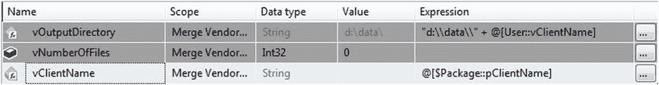

图 10-1. 与变量一起使用的表达式

在实践中，我经常看到表达式被应用于变量值，然后将结果变量用作任务或组件上的属性（而不是直接使用表达式来设置属性）。我之所以喜欢这种设计模式，原因很简单：可重用性。组件共享某些属性的情况并不少见，为每个适用组件的每个共享属性构建表达式既是冗余的，也是不必要的。对于那些将在多个任务或组件之间共享的属性，将表达式逻辑集中到一个变量中，然后使用该变量来设置共享属性，这种方法要容易得多。这种方法可以实现更快的开发，并且在未来逻辑需要变更时也更易于维护。

使用这种设计模式时，别忘了你也可以“堆叠”变量值。在表达式语句中，你可以利用其他变量来设置当前变量的值。

### 连接管理器
使用 SSIS 表达式最实用、最常见的场所之一是连接管理器托盘。一般来说，通常最好将动态连接属性存储为参数，而不是表达式，尤其是在处理结构化数据时。由于连接元数据（服务器名称、用户名和密码）的敏感性和频繁变动性，大多数 ETL 专业人员选择将这些设置外部化，以便安全地存储在包外部，从而可以全局更改（而不是逐个包进行修改）。

这种模式的一个反复出现的例外是与文件系统交互的连接。在几种情况下，使用表达式有助于减轻处理基于文件的源或目标的负担：

*   处理平面文件时，需要根据当前日期和/或时间戳为文件命名（例如 `Medicare_2014_06_01.txt`）。
*   预期文件将按日期归档到文件系统中（例如 `D:\Data\2014\06\01\Medicare.txt`）。
*   计划作业加载一个文件名始终相同的文本文件，但需要保存每天文件的副本，而不覆盖前一天处理的文件。


对于这些情况，你可以使用少量**表达式语言**来动态构建目录路径和文件名，供你在 SSIS 中的连接使用。在这个例子中，假设你正从包内部生成一个平面文本文件，并且希望基于当前日期使用一个动态文件名。通过在“平面文件连接管理器”实例的“属性”窗口中设置 `ConnectionString` 属性，你可以操作文件名的运行时值。如图 10-2 所示，你正在指定基本文件名，然后附加当前日期的各个元素来构建一个自定义文件名。

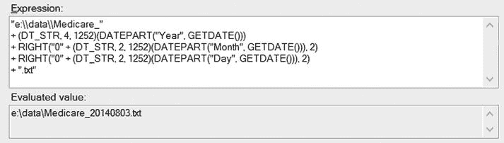

图 10-2. 使用表达式的动态文件名

请注意，刚才讨论的模式可以进一步扩展，以包含时间元素（小时/分钟/秒），如果你的 ETL 需求包含这种精细度的要求。

由于我们不会深入探讨表达式语言的所有语法元素，我在这里只指出我做的几件事：

*   因为反斜杠 (`\`) 在表达式语言中是一个特殊字符，当我在字符串字面量中包含它时，必须使用双反斜杠 (`\\`) 来“转义”它（以取消其特殊字符状态）。
*   使用 `(DT_STR, n, 1252)`，我将 `DATEPART` 函数返回的整数值转换为 ASCII 文本。在这种情况下，我使用代码页 `1252`，最大长度根据日期元素的组成部分为 `2` 或 `4`。
*   使用 `RIGHT` 函数，我会在任何个位数的月份或日期值前补零（例如，使“`3`”变成“`03`”）以保持一致性。

请记住，这个模式非常灵活。它几乎可以与任何文件连接一起使用，无论该连接是用作源还是目标。你在此也不仅限于平面文件连接；你也可以将此逻辑扩展到一些其他的 SSIS 连接。我在处理用作源和目标的 FTP 数据时，也使用了相同的设计模式。通过将相同的逻辑嵌入 FTP 源的属性中，你可以以编程方式“遍历”远程服务器的目录结构，前提是其格式已知且可预测。

### 项目级连接管理器

在使用目录部署模型处理项目时，你可以通过项目连接管理器在同一个项目的多个包之间公开连接信息。当你使用旧版本的 SSIS（2008 或更早版本），或者在后续版本的 SSIS 中使用包部署模型时，包内定义的任何连接管理器都独立于其他包中的连接管理器。然而，从 SQL Server 2012 中的 SSIS 开始，你现在能够在项目级别将连接管理器附加到你的工作区。这些连接管理器可供同一项目中的所有包访问。

本章不会深入探讨新的部署模型，但重要的是指出使用表达式如何影响项目连接管理器。因为它们是附加到项目而不是某个特定的包，所以这些共享连接的属性对于项目中的所有包都是通用的。因此，对这些项目连接管理器的任何属性设置——包括使用表达式——都会立即反映在项目中的所有包中。这是对包之间交互方式的一个受欢迎且非常需要的改进，但对于那些使用过先前版本 SSIS 的人来说，这有点像是一个范式的转变。当应用于一个包中项目连接的表达式也被应用到项目中的其他包时，不要感到意外！

#### 控制流

在控制流中，有几种不同的方法来实现 SSIS 表达式。首先，每个任务和容器都将公开几个可以使用表达式配置的属性。此外，它们之间的路径（称为*优先级约束*）允许 ETL 开发人员在从一个任务/容器移动到另一个时自定义决策路径。

#### 通过表达式和约束进行条件执行

控制流的基本功能是管理包元素的执行。通过使用优先级约束，你可以设计一个包，使任务和容器以正确的顺序触发，并保持正确的依赖关系。对于一个简单的例子，考虑一个先截断然后加载临时表的包。你可以在同一个包中执行这两个任务，但如果没有优先级约束来确保插入操作在 `TRUNCATE TABLE` 执行之后发生，你就有无意中*先加载后删除*相同数据的风险。

你可以配置优先级约束来管理基于前一个任务成功完成的流（默认行为），或者你可以将它们设置为仅在前一个任务失败时才导致任务执行。此外，你可以将约束设置为 `Completion`，允许下游任务在上一个任务完成后触发，而不管其结果如何。任务可以有多个优先级约束，你可以设置这些约束，使得在它们所附加的任务执行之前，必须满足其中任意一个或所有条件。图 10-3 展示了一个相当典型的优先级约束用法；请注意，未标记的箭头表示 `Success` 约束，其他的则标有其用途。虚线表示该任务配置为在*任意一个*前置任务完成时执行。

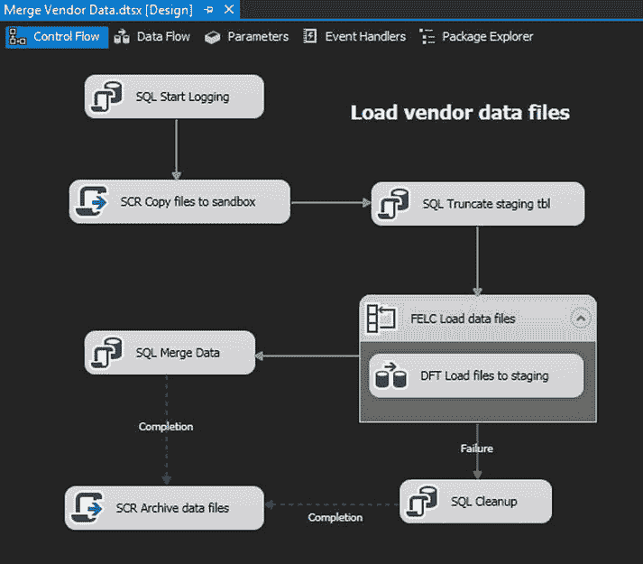

图 10-3. 优先级约束

尽管优先级约束很有用，但它们所能处理的可变性范围相当有限：唯一可以测试的条件是任务是否完成以及该任务的成功或失败。在图 10-3 所示的简短例子中，你可能可以推断出我正在从外部源下载一个或多个文件，将这些文件的数据加载到临时表中，然后合并（更新插入）数据到一个数据库表中。虽然这里在技术上没有错误，但仍有改进的空间。例如，如果没有文件需要处理会怎样？在所示的例子中，临时表的截断、遍历文件系统以查找已下载的文件（即使一个文件也没有），以及合并操作，即使没有文件需要处理，也都会被执行。

在我第一份工作中，我负责（除其他事项外）从商店停车场收集散落的购物车并将它们带回室内。我的老板曾经告诉我：“这份工作需要走很多路，所以尽你所能节省步数。”这么多年过去了，这个建议仍然适用。如果不需要额外的步骤，为什么不直接跳过它们呢？对于前面的例子，当没有找到需要处理的文件时，你可以包含一个相对简单的表达式来绕过包大部分执行。节省那些步骤就是节省了 CPU 周期、磁盘 I/O 和其他资源。


### 优先级约束和表达式

### 优先级约束中的表达式
优先级约束还能够使用表达式来强制正确的包流程。在图 10-4 中，你会看到求值操作被设置为`Expression`，以同时强制先前任务的执行值以及`Expression`框中定义的值。为说明起见，假设你已经填充了一个 SSIS 变量来存储在`脚本`任务操作中下载的文件数量，并且你正在使用表达式来确认至少有一个文件被处理。从这里，你可以手动在窗口中输入表达式，或者使用省略号按钮来打开`表达式编辑器`（请注意，在产品的早期版本（2008 及更早版本）中，你将不得不手动输入表达式，无法享受`表达式编辑器`的便利）。

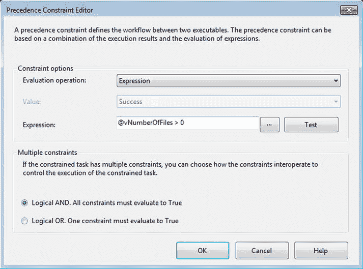

图 10-4. `优先级约束编辑器`

回到原始包；你会看到第一个`脚本`任务和截断 SQL 任务之间的优先级约束现在反映了约束中存在表达式（图 10-5）。


图 10-5. 优先级约束中的`表达式`表示法

值得注意的是，图 10-5 中的示例在约束上显示了一种非标准的表示法。默认情况下，当你在约束中使用表达式时，只会显示函数图标（`f***x***`）。假设表达式不是很长，我通常将约束的`ShowAnnotation`选项更改为`ConstraintOptions`，这将在约束的标签上包含表达式本身。这是对约束中所用表达式的一个简便提醒，并且不需要打开属性窗口来查看表达式。

### 任务级表达式
除了表达式在控制流中的用途外，SSIS 中的大多数任务和容器都有自己可以使用表达式配置的属性。使用表达式进行配置的选项因可执行文件而异，但大多数任务和容器都有一些共同的元素：

*   `Description`
*   `Disable`
*   `DisableValidation`
*   `TransactionOption`
*   `FailPackageOnFailure`
*   `FailParentOnFailure`

使用任务级表达式的一个常见设计模式是采用`执行 SQL`任务的`SqlStatementSource`属性。在大多数情况下，你可以将此任务与查询参数结合使用，在 T-SQL 中创建动态语句。然而，某些语言构造（如子查询）并不总是能很好地与参数配合使用，这就产生了在代码中构建 SQL 字符串的需求。通过使用表达式而不是静态文本作为`SqlStatementSource`属性，当查询参数不适用时，ETL 开发人员可以完全控制 T-SQL 语句。

 **注意** 在 SQL Server 2008 R2 版本中存在字符串大小限制，此限制在 2012 版本中已大大放宽。

### 数据流表达式
当我们从控制流进入数据流时，我们发现了表达式作为 ETL 策略一部分的更传统用法。与更高级别的可执行文件一样，我们发现数据流中的每个组件都直接或间接受到 SSIS 表达式的影响。

#### 数据清理
轻量级数据清理是 SSIS 数据流内表达式语言最常见的用途之一。最常用于派生列转换中，表达式可用于某些清理任务，包括：

*   更改数据的大小写
*   从较长字符串中抓取子字符串
*   修剪多余的空格字符
*   替换不适当的字符（例如从文本中移除字母）
*   更改数据长度或类型

通常，你可以通过在从各种数据源提取时使用设计良好的查询语句来最小化数据流中对数据清理的需求。然而，有时在源端进行清理根本不可行。许多数据源是非关系型的：例如，考虑文本文件和 Web 服务作为数据源，它们通常没有在数据进入 SSIS 空间之前进行清理的选项。有时即使是关系型源也属于此类情况：我遇到过许多情况，其中访问数据的唯一接口是通过一个预定义的存储过程，而 ETL 开发人员既无法检查也无法更改它。对于源清理不可能的情况，在数据流中使用表达式是一个很好的二级防御手段。

我经常使用的一个设计模式是修剪多余的空白并将空字符串转换为`NULL`值。如下所示，这样的操作可以通过一个相对简单的表达式完成：

```
(LEN(TRIM([Street_Address])) > 0) ? TRIM([Street_Address]) : (DT_WSTR, 100)NULL(DT_WSTR, 100)
```

关于使用表达式语言进行数据清理，我要简要提醒一下：如果你发现自己需要在 SSIS 包中执行复杂的、多步骤的清理操作，请考虑使用其他方法来完成繁重的工作。如前所述，表达式语言最适合轻量级数据清理；因为复杂的表达式可能难以开发和调试，你可能更愿意使用更丰富的工具，例如`脚本`任务或`脚本`组件，或者可能是`数据质量服务`来进行这些高级转换。

#### 分支
有时你会发现需要在 ETL 数据流中创建分支。你可能需要在数据流中创建此类分支的原因有几个：

*   **不同的输出**：对于存在于单一数据流中但送往不同目的地的数据，创建分支是一种有效的解决方案。我记得几年前我处理过的一个案例，当时我们正在构建一个系统，将数据分发给多个金融供应商。这些供应商中的每一个都需要相同类型的数据，但每个供应商会根据几个标准获得数据的不同“切片”，并且每个供应商要求的数据格式略有不同。我没有设计多个端到端的数据流（这会基本重复大量逻辑），而是创建了一个使用条件拆分转换的单一包，根据指定条件拆分数据流，然后从那里，数据分支到各自的输出。
*   **内联清理**：SSIS 中一个非常常见的 ETL 场景是在单一数据流中拆分“好”数据和“坏”数据，尝试清理坏数据，然后将清理后的数据与好数据合并。这允许你保留任何不需要清理的数据原封不动，这可能有助于节省处理资源。
*   **不同的数据域**：在数据结构相似但语法不同的情况下，你可能希望使用分支在数据流中以不同方式处理数据。以地理地址数据为例：尽管它们都描述物理地址，但你可能需要处理国内地址的方式与国际地址不同。通过使用条件拆分等分支工具，来自单一源类型的各种地址类型可以在一个数据流任务中处理。
*   **变化的元数据**：虽然相对罕见，但偶尔会遇到源可能包含具有不同元数据的行的情况。考虑一个具有不规则结构的文本文件，其中某些行在行尾缺少列。通过基于某些列的缺失来拆分数据，你可以在内联中解决元数据差异。


图 10-6 通过展示使用表达式逻辑将数据流拆分为多个输出，揭示了这种设计模式。在此案例中，你正在处理一个账单文件，通过在条件拆分转换中使用比较表达式（参见标注）来确定每一行是准时付款、尚未到期还是已逾期，然后将其相应地发送到适当的输出。

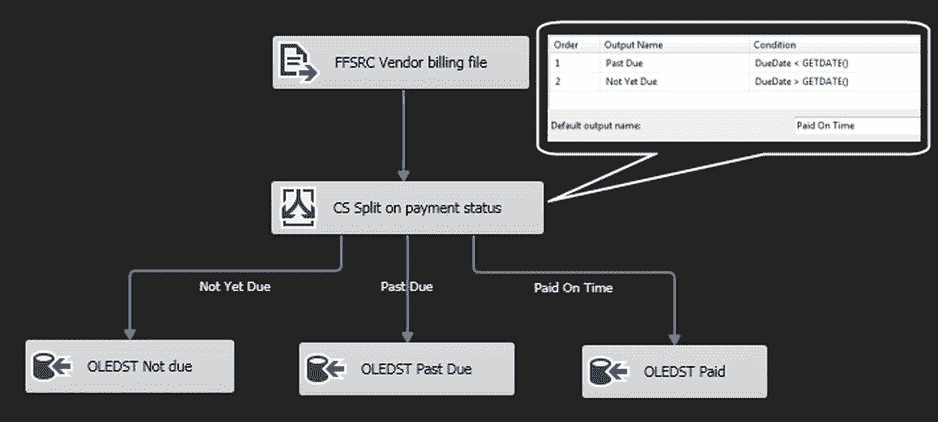

图 10-6. 使用表达式定义多条路径

关于在数据流中应用表达式的一个有趣注意事项是 SSIS 暴露组件级表达式的方式。虽然表达式语言在数据流管道中非常有用，但大多数组件实际上并不暴露可以通过表达式设置的属性。对于那些确实允许在某些属性上使用表达式的组件，这些表达式作为数据流本身的元素显现，并在控制流中工作时显示为“数据流属性”窗口选项的一部分。

如图 10-7 所示，你正在使用数据流的表达式属性来访问该数据流内的 ADO.NET 数据源。如你所见，“属性”列中的标识符显示此表达式属于数据流内的数据源，允许你设置该源的 `SqlCommand` 属性。值得注意的是，我特意在这个例子中使用了 ADO.NET 源。由于此源当前不允许使用参数，因此设置 `SqlCommand` 属性通常可以作为使用此组件从关系数据库动态检索数据的可接受替代方案。

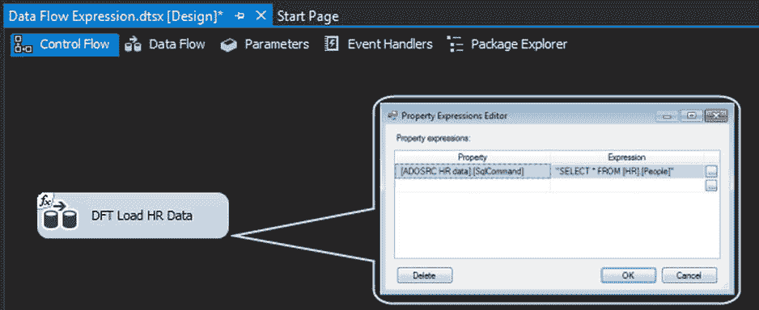

图 10-7. 数据流表达式

### 应用业务规则

尽管它们共享一些相同的方法，但应用业务规则在概念上不同于数据清理。在大多数情况下，数据清理被认为是通用的：拼写错误的单词、不一致的大小写、多余的空格以及 NULL 与空白与零的难题，这些都是几乎每个 ETL 过程中都必须处理的常见问题。另一方面，业务规则是特定的用例，其中根据特定于当前业务的自定义逻辑对数据进行操作、推断或丢弃。这些规则可能足够通用以应用于整个行业（例如医疗账单工作流），也可能具体到适合个别经理偏好的数据排列。

一般来说，使用表达式应用业务逻辑在仅限于少量简单业务规则案例时效果最佳。如前所述，表达式语言不适用于多个测试条件，因此可能不完全适合多方面和复杂的业务规则。对于企业级的业务规则应用，请考虑 SSIS 中的其他工具，例如 Script 组件或 Execute SQL 任务（用于可在关系数据库级别执行的操作），或者可能使用单独的工具，如 SQL Server Data Quality Services 或 Master Data Services。

#### 选择复杂表达式与其他工具

根据我的经验，大多数 SSIS 表达式的使用都涉及简短、简单的表达式。查询变量的值、修改现有列的内容、比较两个值以及其他类似操作通常需要相对简短且不复杂的逻辑作为 SSIS 表达式。然而，在许多情况下，一个简短而精炼的表达式根本无法解决问题。

在这些更复杂逻辑的情况下，SSIS 表达式仍然是最佳选择吗？在某些情况下，答案是否定的。如前所述，在 ETL 周期中存在一些情况，表达式语言不适合解决问题。在逻辑所需复杂性超过 SSIS 表达式语言实际或方便处理范围的情况下，常见的模式是使用单独的工具来处理手头的问题。处理这些复杂逻辑场景的其他一些方法如下：

*   **数据源组件**：尤其是在处理关系源数据时，将必要的逻辑构建到源组件中可能比在 SSIS 中使用表达式更简单、更快速（包括设计时和运行时）。
*   **Execute SQL 任务**：有时将数据加载到关系存储中然后在那里执行转换和清理，比在 SSIS 包内联进行更容易。这种方法与传统的 ETL 略有不同，通常被称为 ELT（提取/加载/转换）。使用此模型，你可以使用 Execute SQL 任务在数据从源加载到将要进行转换的关系数据库后对其进行转换。
*   **Script 任务**：在控制流中工作时，你可以用 Script 任务实例替代过于复杂的 SSIS 表达式。当出于此目的使用 Script 任务时，你可以获得额外的优势，例如智能感知、错误处理、多步操作以及在代码中包含注释的能力。
*   **Script 组件**：用于替代数据流内的复杂表达式，原因同上。此外，Script 组件可以在数据流界面中用作源、转换或目标，使你能够比严格使用表达式更强大地控制数据操作。
*   **自定义任务/组件**：如果你发现自己在许多包中重用相同的复杂逻辑，请考虑创建一个自定义任务或组件，你可以将其分发到多个包，而不必将脚本代码复制并粘贴到每个包中。
*   **第三方任务/组件**：有时购买（或借用）比构建更容易。有数百甚至数千个第三方任务和组件旨在扩展 SSIS 的原生行为。事实上，这些工具中有许多是免费提供的——通常还附带底层源代码，以防你需要进一步自定义工具的行为。

没有硬性规定定义何时表达式可能不是最佳解决方案。然而，在决定是否在 SSIS 包中应用动态逻辑时使用表达式或其他工具时，我倾向于遵循一些设计模式。通常，我将在以下情况下避免使用表达式：


