# 第 11 章

### 数据仓库模式

SQL Server Integration Services 是一款出色的通用 ETL 工具。由于其多功能性，它被 DBA、开发人员、BI 专业人员甚至业务负责人用于许多不同的场景。有时，它像一辆自卸卡车，用于批量移动海量数据。其他时候，它更像一把手术刀，精准地切出适量的数据。

尽管 SSIS 在其他领域也是一个很棒的工具，但当它被用作数据仓库 ETL 工具时，才真正出类拔萃。很难否认数据仓库不是其主要设计目的。从原生的缓慢变化维度（SCD）元素到最近添加的 CDC 处理任务和组件，SSIS 拥有与价格高得多的 warehouse ETL 工具竞争所需的一切挂钩。

在本章中，我们将讨论使用 SQL Server Integration Services 加载数据仓库时适用的设计模式。从增量加载到错误处理和一般工作流程，我们将研究可应用于 SSIS 数据仓库 ETL 的方法和最佳实践。

### 结论

ETL 可能很难。通常，问题不在于大的设计难题，而在于那些小的“我该如何……？”战术性问题，这些问题是导致 SSIS 开发过程中摩擦的主要原因。SSIS 表达式语言正是为解决这类问题而设计的。其小巧的占用空间、有些熟悉的语法以及在 SSIS 全方位的广泛适用性，使其成为 Integration Services 功能集的一个极佳补充。如果使用得当，它可以帮助解决各种问题领域，并有望减轻 ETL 开发人员的负担。

### SSIS 表达式的使用场景

#### 表达式过于复杂时

*   **表达式将异常冗长**：如果表达式中所需的逻辑会超过几百个字符，脚本或其他工具通常是更好的选择。
*   **表达式需要超过三层嵌套**：特别是在需要 If/Then/Else 逻辑的情况下，经常需要响应多个条件（`if`/`then`/`elseif`/`then`/`else`），但不幸的是，在 SSIS 表达式语言中实现这一点的唯一方法是嵌套条件运算符。
*   **需要复杂的字符串查询或操作**：通过 SSIS 表达式，使用诸如 `SUBSTRING`、`REPLACE`、`LEFT/RIGHT`、`UPPER/LOWER` 和 `REVERSE` 等众所周知的函数，进行简单的字符串操作相当容易。然而，更高级的操作（从字符串中间提取文本、替换多种字符模式、从文本中提取嵌入的数字等）通常需要过于复杂的表达式。此外，诸如正则表达式（RegEx）匹配之类的某些文本操作在 SSIS 表达式语言中并未得到原生支持。
*   **逻辑需要易变的类型转换**：由于 SSIS 表达式语言本身没有错误处理，容易导致失败的转换（文本转数字、Unicode 转 ASCII、从同类型的大容量转换为小容量）可能会导致包流出现不期望的中断。通常，我会将这些操作封装到 Script 任务或 Script 组件中，使用 `TryParse()` 方法或 Try-Catch 块，这样在类型转换失败时可以提供更大的灵活性。

归根结底，并非 SSIS 中的每个 ETL 挑战都应该用表达式来解决。表达式语言旨在作为一种轻量级解决方案，在此背景下使用，它是产品线的一个出色补充。请尝试将 SSIS 表达式视为填缝剂；小巧、轻便、优雅，且普遍使用，但用量很少。尽管填缝剂非常有效，但建筑承包商绝不会想到仅使用填缝剂来建造整栋房子。与任何工具一样，SSIS 中的表达式最好在适当的上下文中使用，不应被视为适用于所有问题的万能解决方案。

### 增量加载

任何在数据仓库领域工作过超过十分钟的人都听说过*增量加载*这个术语。在我们演示执行增量加载的设计模式之前，让我们首先谈谈增量加载的需求。

#### 什么是增量加载？

顾名思义，*增量加载*是一种仅处理自上次执行以来新增或更改的部分数据集的加载方式。尽管许多人认为增量加载纯粹是基于时间的（例如，只抓取前一个工作日处理的数据），但情况并非总是如此简单。有时，对历史数据的更改应该反映在下游系统中，但不幸的是，并不总是能检测到更改是何时发生的。（顺便说一句，那些无处不在的“最后更新时间戳”字段以容易出错而闻名。）

处理灵活的数据仓库结构（不仅允许插入，还允许更新）可能是一个具有挑战性的任务。在本章中，我们将介绍几种 SSIS 中的设计模式，您可以在处理数据仓库中的变化数据时使用。

#### 为什么要进行增量加载？

想象一下，你受雇于一家小型鞋店，为其创建一个供员工分析销售数据的系统。假设该店平均每天有 50 笔交易，相当于平均 100 件商品（每笔交易 2 件）。如果你对业务生成的行数做简单的计算，每天发送到分析系统的数据将少于 200 行。即使在整个一年中，你也只会看到少于 75,000 行的数据。对于如此小的数据量，为什么要执行增量加载呢？毕竟，每晚简单地转储并重新加载整个分析数据库，与尝试计算哪些行是新的、更改的或删除的相比，几乎同样高效。

在刚刚描述的情况下，最佳行动方案可能是每天执行一次完全加载。然而，在现实世界中，很少有（如果有的话）系统是如此之小且简单的。事实上，数据仓库开发人员在每天生成数百万行数据的环境中工作是相当常见的。即使使用金钱能买到的最好的硬件，试图在这么大的数据量上执行每日完全加载也是不切实际的。增量加载旨在通过系统地识别要从事务系统移动到数据仓库的数据来解决这个问题。通过有选择地只提取需要操作的数据——具体来说，是自上次加载以来已插入、更新或删除的行——我们可以消除许多不必要的和重复的数据处理。

### 缓慢变化维度

当您考虑在数据仓库场景中应用增量数据加载时，没有比缓慢变化维度（SCD）更好的例子了。维度数据的性质决定了它通常需要通过操作维度表中的现有行（SCD 类型 1）或使当前记录过期并为该值添加新行（从而保留该维度属性的历史记录，即 SCD 类型 2）来进行更新。

尽管缓慢变化维度当然不是唯一受益于增量加载的数据仓库结构，但它是这种类型中最常见的种类之一。因此，我们将主要围绕 SCD 结构来讨论增量加载的话题。

#### 事实数据的增量加载

一些数据仓库场景需要在事实数据加载到数据仓库后进行更改。这种情况通常通过使用一个冲销条目和一个差异记录的辅助加载来处理，但有些设计需要更正原始事实记录。

### SSIS 中的增量加载

Microsoft SQL Server 以及 SSIS 本身提供了多种工具和方法来管理增量数据加载。本节讨论围绕以下工具的设计模式：

*   原生 SSIS 组件（`Lookup` 转换、条件拆分等）
*   缓慢变化维度向导
*   T-SQL 中的 `MERGE` 语句
*   变更数据捕获（`CDC`）

这些工具在正确使用时都是有效的，尽管有些比其他工具更适合不同的场景。我们现在将逐步介绍使用每种工具的设计模式。

### 原生 SSIS 组件

我们将探讨的第一个增量加载模式是使用 SSIS 内的原生组件来执行加载。通过使用查找（`lookup`）、条件拆分（`conditional split`）和 `OLE DB` 命令组件，我们可以创建一个简单的数据路径，通过该路径可以处理来自源系统的新数据和更改数据。

采用这种设计模式是使用 SSIS 执行增量加载的最常见方式之一。因为此模式中使用的所有组件自 2005 年 SSIS 推出以来就已存在，所以它是一种非常成熟且经过时间考验的方法。在我们将要探索的所有增量方法中，这无疑是最灵活的。如果配置得当，它的性能相当不错。这也是外部依赖最少的设计模式；几乎任何数据都可以用作源，它不需要启用 `CDC` 等数据库引擎功能，也不需要安装任何第三方组件。

#### 组成部分

当你使用这种设计模式时，最常见的操作将包括以下步骤：

1.  从数据源提取数据。如果使用多个源，可以使用适当的连接组件（`Merge`、`Merge Join` 或 `Union All` 转换）将它们合并在一起。
2.  使用 `Lookup` 转换，基于业务键（`business key(s)`）将源数据与目标表连接。
3.  将更改的行路由到目标表。步骤 2 中未匹配的行然后可以直接使用适当的数据库目标组件路由到目标表。
4.  对于在目标表中具有业务键匹配的源行，比较其他可能更改的值。如果这些源值中的任何一个与目标表中该行的值不同，则目标表中的这些行将使用新值进行更新。

Figure 11-1 显示了这些操作的典型数据流设计。在第一个标注中，您可以看到我们需要在 `Lookup` 转换上将选项设置为“将行重定向到无匹配输出”。使用此设置时，任何未解析为目标表中现有行的源行都将沿着替代路径发送——在本例中，直接发送到目标表。

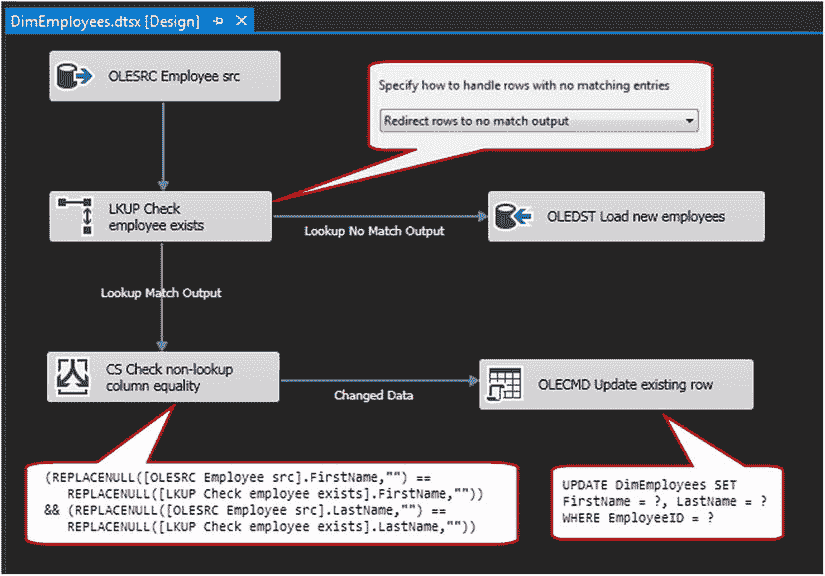

**图 11-1.** 使用原子 SSIS 组件进行增量加载

接下来，我们将对匹配的行应用 `Conditional Split` 转换。如 Figure 11-1 左下角所示，我们将使用一点 SSIS 表达式语言来比较源和目标之间的等效列。任何完全匹配的行将不会进行进一步的处理（尽管如果您想捕获未采取任何操作的源行计数，可以将它们发送到 `Row Count` 转换）。

最后，那些匹配了业务键但未匹配后续属性值的行将被发送到 `OLE DB Command` 转换。Figure 11-1 右下角的代码显示了 SQL 代码片段，我们通过它对目标表中的每一行执行参数化更新。需要注意的是，`OLE DB Command` 转换对目标表执行逐行更新。您可以如图所示利用此模式，因为大多数增量操作主要涉及新行，更新远少于插入。但是，如果特定实现需要处理非常大量的数据，或者您的数据分析表明更新的比例很高，请考虑修改此设计模式，将那些需要更新的行发送到暂存表，在那里可以通过基于集合的操作更高效地处理。

### 典型用途

如前所述，这种增量加载设计模式非常有用且成熟。当您处理非关系源数据，或者无法在处理前对传入数据进行暂存时，此模式特别适用。这通常是增量加载的首选设计，并且它能相当好地适应大多数此类场景。

请务必记住，由于我们是在 SSIS 内执行业务键查找和列等效性测试，因此将数据导入 SSIS 内存空间然后对数据执行所述操作会产生一些资源成本。因此，如果特定实现涉及非常大量的数据，并且源数据已在 SQL Server 数据库中（或可以暂存到其中），那么其他设计模式（如稍后将介绍的 T-SQL `MERGE` 操作）可能是更好的选择。

以下小节描述了增量加载模式的组件及其各自的配置选项。

#### 查找缓存选项

在执行查找操作时，您需要考虑可用于管理查找缓存的许多选项。根据您处理的数据量，以下缓存设计模式之一可能有助于减少性能瓶颈。

**表缓存**

在需要查找操作的数据流任务执行之前，会填充用于查找的表缓存。SSIS 可以根据需要使用执行 SQL 任务创建和删除该表。它可以通过执行 SQL 任务或数据流任务来填充。大多数时候，构建表缓存所需的数据在本地位于目标，并包含来自目标的数据，因此我经常在执行 SQL 任务中使用 T-SQL 来填充它。

您可以通过使用截断并加载（`truncate-and-load`）来维护表缓存。但是，对于较大的查找数据集，您可能希望考虑使用增量加载技术来维护表缓存。这听起来可能有些过头，但当您需要针对包含十亿行表的查找时（这种情况会发生，请相信我），增量方法就开始变得有意义了。

**缓存转换和缓存连接管理器**

如果您发现在多个数据流任务中需要查找相同的数据，请考虑使用`缓存转换`配合`缓存连接管理器`。`缓存连接管理器`提供了通过`缓存转换`所提供数据的内存驻留副本。缓存会在第一个将使用查找数据的数据流任务之前加载，而数据可以直接被`查找转换`使用。以此方式预缓存数据不仅支持查找操作，还提供了一种“标记”行集以供其他考虑（如加载）的方法。本章稍后，我们将探讨迟到数据并讨论管理它的模式。管理“加载操作开始后数据持续到达”场景的一种方法是，创建一个包含代表已完成事务的主键和外键的缓存，然后在整个加载过程的数据流任务中与这些键进行连接。通过这种方式，您会错过最后一秒的数据加载吗？是的，您会。但您的数据将包含完整的事务。使用表缓存执行增量加载的一个好处是，可以每月、每周、每晚或每五分钟执行一次加载；只有自上次加载执行以来到达的完整事务才会被加载。

如果您发现需要在多个 SSIS 包中使用相同的查找数据（或者缓存大小超过了可用服务器 RAM 的容量），`缓存连接管理器`可以将其内容持久化到磁盘。`缓存连接管理器`利用了新的改进的 RAW 文件格式，这是一种专有格式，用于将数据直接从数据流任务存储到磁盘，完全绕过连接管理器。因此，读写速度非常快，并且新格式会保留列名和数据类型。

### 加载暂存区

这里值得提及的另一个模式是`加载暂存区`。考虑以下场景：数据仓库目标表很大且经常增长。由于目标表在加载窗口期间被使用，因此删除键和索引不是提高加载性能的选项。所有相关数据必须大致同时在数据仓库中可用，以保持源事务一致性。从本质上讲，这些数据不适合分区。该怎么办？

考虑使用`加载暂存区`，将代表一个源事务所需的所有数据加载到目标服务器上的暂存表中。一旦这些表填充完毕，您可以使用`执行 SQL 任务`将暂存的行插入到数据仓库目标表中。如果时间安排得当，您也许可以使用批量插入来完成加载。通常，在同一 SQL Server 实例中的表之间进行数据加载，使用 T-SQL 可能比使用缓冲的 SSIS 数据流任务更高效。如何判断哪个性能更好？进行测试！

### 缓慢变化维向导

`缓慢变化维（SCD）向导`是 SSIS 增量加载武器库中的另一员老将。顾名思义，它专为管理数据仓库中的 SCD 元素而设计。然而，它的用途当然不仅限于维度处理。

自 2005 年 SSIS 产品推出以来，`SCD 向导`就一直是其一部分。乍一看，它是处理 SSIS 中缓慢变化维数据的自然选择。该工具内置于 Integration Services 中，专为 SCD 处理目的而设计。

`SCD 向导`在 SSIS 中以转换的形式呈现，通过将数据源的输出（传入数据）连接到 SCD 转换的输入来使用。编辑 SCD 转换将启动向导，如图 11-2 所示。

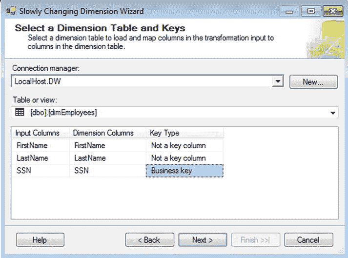

图 11-2. `SCD 向导`显示列的对齐

从那里开始，向导将引导您完成 SCD 配置必要元素的选择，包括：

*   哪些列应作为 SCD 的一部分参与，以及是将更改作为简单更新（`类型 1`）还是历史值（`类型 2`）来处理的选项。
*   如果存在任何`类型 2`列，如何识别当前行与过期行；您可以指定一个标志或一个日期范围来表示 SCD 记录的时效性。
*   如何处理推断成员（稍后将更深入讨论）。

当您完成`SCD 向导`后，数据流中会自动添加几个新元素。图 11-3 显示了使用`类型 1`和`类型 2`字段、固定属性（静态）字段以及推断成员支持组合时，添加的转换和目标的示例。`SCD 向导`只添加与指定设计相关的组件，因此最终结果可能与此图中的示例略有不同，具体取决于向导的配置方式。

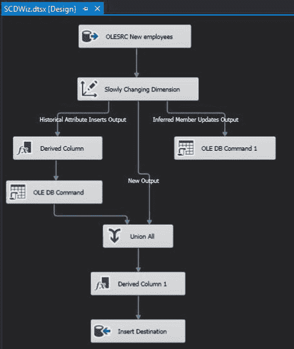

图 11-3. `SCD 向导`输出

在所有 SCD 设计模式中，`SCD 向导`可以说是处理简单 SCD 场景最易用的，并且它在设计时提供了最快的周转速度。对于小型、简单的维度，该向导可以是管理变化数据的有效工具。

然而，`SCD 向导`确实有一些显著的缺点。

*   **性能：** 该向导在处理小数据集时表现尚可。但是，由于许多操作都是逐行执行的，在处理规模较大的维度时使用此转换可能会导致显著的性能瓶颈。一些数据仓库架构师对`SCD 向导`有强烈的负面看法，而这通常是主要的抱怨点。
*   **破坏性更改：** 正如我所提到的，当您运行向导时，所有必需的转换和目标都是自动创建的。同样地，如果您重新配置 SCD 转换（例如，将列类型从`类型 1`更改为`类型 2`历史记录），现有的设计元素将被移除并重新添加到数据流中。因此，如果您对 SCD 转换进行更改，您对该数据路径所做的任何更改都将丢失。
*   **没有直接的审核支持：** 虽然您可以添加自己的审核逻辑，但这并不是该组件的固有功能。此外，由于对 SCD 转换的任何更改都会删除并重新创建数据流的相关元素，因此如果对 SCD 转换进行任何更改，您将必须重新配置该审核逻辑。

由于这些缺点（尤其是性能方面的影响），`SCD 向导`在现实世界中使用得并不多。我不想过多批评这个工具，因为它确实有其用处，我也不一定建议您完全避免使用它。然而，像任何专用工具一样，它只应在适当的地方使用。对于不需要复杂逻辑或专门日志记录的小型 SCD 数据集，它可能是 SCD 处理最有效的选项。

### MERGE 语句

尽管从技术上讲它不是 SSIS 的功能，但`MERGE`语句已经成为增量数据加载中如此重要的一部分，以至于任何专注于数据仓库设计模式的讨论若不涵盖此工具都是不完整的。

#### 一点背景

在 2008 版本之前，Microsoft SQL Server 中没有原生的“更新插入”（`UPdate/inSERT`）操作。任何需要混合更新和插入的操作，要么需要使用游标（通常性能很差），要么需要两个独立的查询（通常导致逻辑重复和工作冗余）。其他关系数据库产品多年前就具备了此功能——事实上，自 Oracle 9i 版本（大约 2001 年）起就存在了。自然，SQL Server 专业人士一直渴望获得这样的功能。

### MERGE 语句简介

幸运的是，随着 SQL Server 2008 的发布，他们的愿望得以实现。该版本首次引入了新的 `MERGE` 语句，成为 T-SQL 武器库的一部分。`MERGE` 允许对目标表同时执行三种操作（`INSERT`、`UPDATE` 和 `DELETE`）。

`MERGE` 语句的基本结构如下所示：

1.  指定源数据。
2.  指定目标表。
3.  选择用于连接源数据和目标数据的列。
4.  指明两组数据之间用于判断匹配记录是否存在差异的列对齐方式。
5.  定义数据发生变化时，或者数据仅存在于源或目标一方时的处理逻辑。

新的 `MERGE` 功能对 DBA 和数据库开发人员都很有用。然而，对于数据仓库专业人员来说，`MERGE` 在管理 SCD 数据方面是一个游戏规则改变者。这项新功能不仅提供了执行 "upsert" 操作的更简便方法，而且性能也非常出色。

### MERGE 详解

### 在 SSIS 中的实现

由于 Integration Services 中没有原生的（即图形化的）对 `MERGE` 语句的钩子，因此在 SSIS 包中实现 `MERGE` 是通过 Execute SQL 任务来完成的。

为了探讨这种设计模式，让我们首先审视一下在数据仓库 SSIS 加载包中使用 T-SQL `MERGE` 功能的典型流程。同样，我们将以 SCD 场景作为探索的基础，但大部分相同的逻辑也适用于 `MERGE` 的其他用途。

作为 SCD `MERGE` upsert 过程的一部分，我们的 SSIS 包将包含执行以下功能的任务：

1.  从暂存表中移除先前暂存的数据。
2.  从源系统加载暂存表。
3.  清理暂存数据（如果需要）。
4.  执行 `MERGE` 语句，将暂存数据 upsert 到维度表。
5.  记录 upsert 操作（可选）。

典型的控制流设计模式如图 11-4 所示。

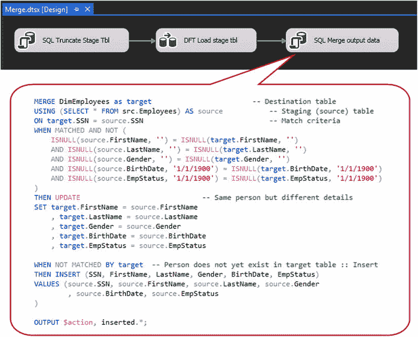

图 11-4. 对 SCD 表使用 MERGE

### `MERGE`语句关键点

另请注意图 11-4 中包含 `MERGE` 语句 T-SQL 代码的大型注释框。为了保持重点，我不会在此尝试全面覆盖 `MERGE` 语句，但会指出几个要点：

*   `ON` 子句（第三行）指明了我们用于连接源数据与目标数据的字段。请注意，我们可以使用多个字段来对齐这两组数据。
*   `WHEN MATCHED AND NOT...` 之后的十行代码块指明了将检查哪些字段，以确定目标表中的数据是否与源数据不同。在本例中，我们检查了十个不同的字段，如果其中任何字段在源和目标之间存在差异，我们将处理对目标的更新。另请注意大量使用了针对目标表的 `ISNULL()` 函数。建议这样做，以确保目标表中包含 `NULL` 值的行不会在 `MERGE` 过程中被无意间跳过。
*   在紧随其后的代码块中，我们更新目标表中与源有效匹配但存在一个或多个值差异的行。
*   在以 `WHEN NOT MATCHED BY target...` 开头的代码块中，任何未与现有维度记录的指定键列匹配的源行都将作为新行写入该维度表。
*   最后，我们使用 `OUTPUT` 子句来选择操作描述和插入的数据。我们可以使用此输出将其写入我们的审计表（稍后会详细介绍）。

你会注意到，我们将此维度处理作为类型 1 维度来处理，即我们有意覆盖先前的值，不保留过去值的历史记录。也可以使用 `MERGE` 命令处理保留历史值的类型 2 维度，甚至是混合了类型 1 和类型 2 属性的维度。为了简洁起见，我不会尝试涵盖 `MERGE` 在应用于缓慢变化维度时的其他各种用途，但我认为你会发现它足够灵活，可以处理大多数类型 1 和类型 2 的维度。

同样值得注意的是，除了执行插入和更新外，你还可以使用 `MERGE` 语句删除数据。在数据仓库环境中删除数据不如在其他场景中常见，但你可能偶尔会发现有必要从目标表中删除数据。

### 使用 MERGE 进行审计

与其他数据仓库操作一样，至少对添加、删除或更改的维度数据的行数进行审计被认为是最佳实践。这对于 `MERGE` 操作尤其重要。因为同一语句中可能发生多个操作，能够跟踪这些操作以帮助故障排除非常重要，即使在特定操作中未使用全面的审计。

`MERGE` 语句确实提供了审计各种数据操作的规定。如图 11-4 中的示例所示，我们可以使用 `OUTPUT` 子句从 `MERGE` 语句中选择出 `INSERT`、`UPDATE` 或 `DELETE` 操作。此示例展示了一个场景，其中数据更改将作为查询的结果集选出，随后可以在 SSIS 中捕获到包变量中并从那里进行处理。或者，你可以修改 `OUTPUT` 子句，直接将数据插入审计表，而不向 SSIS 返回结果集。

### 变更数据捕获（CDC）

与 `MERGE` 功能一起，另一个重要的增量加载特性首次出现在 SQL Server 2008 中：变更数据捕获 (CDC)。CDC 是数据库引擎的一项功能，允许收集对受监控表的数据变更。

不深入偏题太多，这里简单介绍一下 CDC 的工作原理。CDC 是一种供应端的增量加载工具，首先在数据库级别启用，然后通过捕获实例逐表实现。一旦为表启用了 CDC，数据库引擎就会使用事务日志来跟踪所有 DML 操作（`INSERT`、`UPDATE` 和 `DELETE`），将每个更改记录到每个受监控表的更改表中。更改表不仅包含数据发生了更改这一事实，还维护了这些更改的历史记录。下游进程随后可以仅使用更改（而不是整个数据集）并在任何相关系统中处理 `INSERT`、`UPDATE` 和 `DELETE`。

### 在 Integration Services 中使用 CDC

SSIS 可以通过几种不同的方式使用 CDC 数据。首先，使用常见的原生 SSIS 组件，你可以访问更改表以捕获数据更改。你可以通过捕获和存储日志序列号 (LSN) 来跟踪 SSIS 已处理了哪些更改，该 LSN 是使用启用 CDC 时创建的一组系统存储过程获取的。

手动方法仍然有效；但是，SQL Server 2012 中的 SSIS 新增了一套全新的工具用于与 CDC 数据交互。Integration Services 现在随附一个新任务和两个新组件，有助于简化 CDC 数据的处理：

### 变更检测概述

*   `CDC 控制任务`**：** 此任务用于管理与 CDC 加载相关的元数据。使用`CDC 控制任务`，可以跟踪初始（历史）加载的起点和终点，以及检索和存储增量加载的处理范围。
*   `CDC 源`**：** `CDC 源`用于从 CDC 更改表中检索数据。它通过一个 SSIS 变量从`CDC 控制任务`接收 CDC 状态信息，并将使用该标记有选择地检索更改的数据。
*   `CDC 拆分器`**：** `CDC 拆分器`是一种转换组件，它会将更改的数据分支到其各种操作中。它实质上是一个专门的`条件拆分`转换，使用从`CDC 源`接收的 CDC 信息，并将行相应地发送到插入、更新、删除或错误路径。

作为 SSIS 增量加载策略的一部分，为了审查 CDC 功能，我们将仅使用 SSIS 2012 中引入的新任务和组件。在使用 SQL Server 2008 的系统中，要知道可以通过采用先前简要描述的手动提取和 LSN 跟踪来实现相同的目标。

检测数据变更是数据集成的一个子领域。关于这个主题的著述浩如烟海，不胜枚举。尽管 CDC 在 SQL Server 中提供了便捷的变更检测功能，但在 CDC 出现之前，实现变更检测是可能的（也是必要的！）。需要注意的是，并非所有版本的 SQL Server 都提供 CDC；其他关系数据库引擎中也不可用。

### 基于校验和的检测

早期的一种变更检测模式是使用 Transact-SQL 的`Checksum`函数。`Checksum`接受一个字符串作为参数并生成一个数值哈希值。但`Checksum`的性能已被证明不尽理想，因为它会为不同的字符串值生成相同的数值。Steve Jones 在一篇题为“SQL Server 加密——哈希冲突”（`www.sqlservercentral.com/blogs/steve_jones/2009/06/01/sql-server-encryption-hashing-collisions/`）的博客文章中讨论了这种行为。Michael Coles 在该文章的评论中（`www.sqlservercentral.com/blogs/steve_jones/2009/06/01/sql-server-encryption-hashing-collisions/#comments`）提供了丰富的证据来支持 Steve 的观点。简而言之，使用`Checksum`发生冲突的概率很高，因此不应使用`Checksum`函数进行变更检测。

那么，可以用什么呢？

### 通过 Hashbytes 检测

`Checksum`函数的一个良好替代方案是`Hashbytes`函数。与`Checksum`类似，`Hashbytes`为字符串值或变量提供值哈希。`Checksum`返回一个整数值；`Hashbytes`返回一个二进制值。`Checksum`使用内部算法计算哈希；`Hashbytes`使用标准加密算法。`Hashbytes`是更好选择的一个原因是每个函数可用的值数量。`Checksum`的`int`数据类型可以返回 +/- 2³¹ 个值，而`Hashbytes`对于 MD2、MD4 和 MD5 算法可以返回 +/- 2¹²⁷ 个值，对于 SHA 和 SHA1 算法可以返回 +/- 2¹⁵⁹ 个值。

### 暴力检测

信不信由你，对源和目标进行“暴力”值比较仍然是变更检测的一种可行选择。它是如何工作的？你通过第二个`源`组件或 SSIS`数据流任务`中的`查找`转换获取目标值。你使用一个替代（或业务）键（在源和目标中唯一标识行的值或值组合）匹配源和目标中的行，然后比较源行中的非键列值与目标行中的非键值。

请记住，你的目标是分离出变更。假定你已经分离出了新行（存在于源中但不存在于目标中的数据），甚至可能已经检测到了存在于目标中但在源中不再找到的已删除行。剩下的就是已更改和未更改的行。未更改的行就是那样：替代键对齐，源和目标中每个列的值也相同。而已更改的行具有相同的替代键，并且在源列和目标列中存在一个或多个差异。比较列值并考虑`NULL`的可能性仍然是一个选项。

### 历史加载

应该有一个单独的流程来填充每个被跟踪的 CDC 表的历史数据。此历史加载设计为只执行一次，它将根据需要从尽可能早的时间开始加载数据到目标系统。如图 11-5 所示，需要两个`CDC 控制任务`。第一个（如标注所示配置）用于设置数据捕获的起始边界。利用此信息，`CDC 控制任务`将 CDC 状态写入指定的状态表。第二个`CDC 控制任务`标记初始加载的终点，更新状态表，以便在后续的增量加载中使用适当的起始点。在这两个任务之间是数据流，它促进了目标表的历史加载。

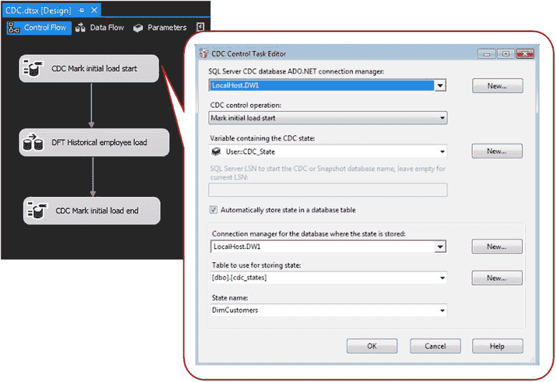

**图 11-5** 用于初始历史加载的`CDC 控制任务`

### 增量加载

由于历史加载和增量加载之间存在固有差异，几乎总是更倾向于为它们分别创建单独的程序包（或程序包组）。尽管有相似之处，但差异足够大，值得将逻辑分离到不同的“沙盒”中。

对于历史加载的控制流元素，此增量加载模式也将使用两个`CDC 控制任务`，中间有一个数据流。我们需要稍微更改这些任务的配置，以便我们检索然后更新 CDC 操作的当前处理范围。如图 11-6 所示，我们将第一个任务的操作设置为“获取处理范围”，在增量加载完成后，随后执行“更新处理范围”。

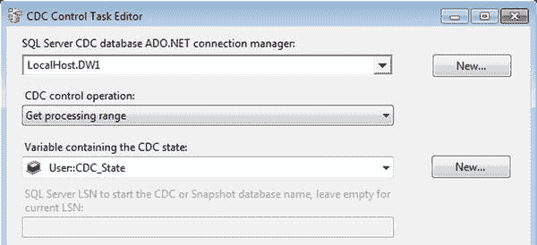

**图 11-6** 为 CDC 增量加载获取处理范围

 **注意** `CDC 控制任务`是一个多功能工具，包含多种处理模式以处理 CDC 的各个阶段，包括处理快照数据库或静态数据库作为源。处理模式的完整列表可以在这里找到：`http://msdn.microsoft.com/en-us/library/hh231079.aspx`。

在数据流中，`CDC 源`应设置为要从中捕获的表、捕获实例和处理模式。在这种情况下，我们将使用“Net”来检索 CDC 表的净更改。参见图 11-7。

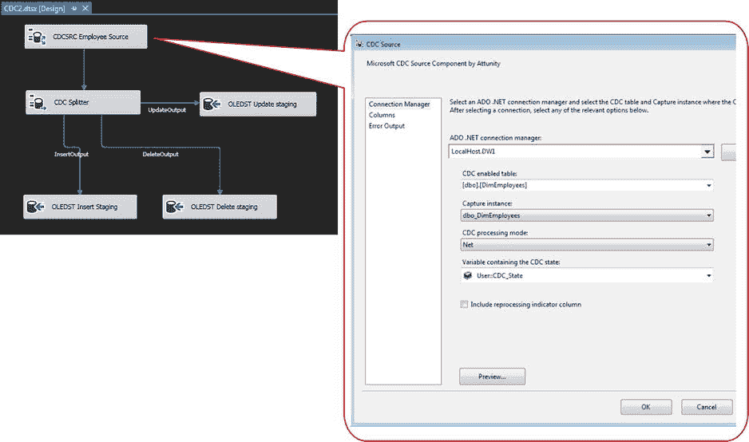

**图 11-7** `CDC 源`

`CDC 拆分器`分解数据流并将行发送到插入、更新和删除输出。从那里，我们将更新和删除的行写入暂存表，以便我们可以将其作为高性能的基于集合的操作进行处理。插入记录可以直接进入输出表。

### 在这里值得一提的是，通过 CDC 源组件可以使用多种 CDC 处理模式。图 11-7 中的示例展示了**净变更（Net）设置**的用法，这是大多数数据仓库场景中最常见的模式。然而，根据 ETL 需求和源系统设计，你也可以选择以下其他处理模式之一：

*   `全部（All）：` 列出源中的每一项变更，而不仅仅是净变更结果。
*   `包含旧值的全部（All with Old Values）：` 包含每一项变更以及更新记录的旧值。
*   `带更新掩码的净变更（Net with Update Mask）：` 用于监控被监视表中特定列的变更。
*   `带合并的净变更（Net with Merge）：` 类似于净变更，但其输出针对 T-SQL `MERGE` 语句的使用进行了优化。

### 典型用途

CDC 代表了增量加载方法论的一次转变。这里描述的其他方法采用下游方法来处理增量加载，从源中进行限制性最小的提取，并在 ETL 流程的后期做出决策点。另一方面，CDC 在更上游的位置处理变更逻辑，这有助于减轻 SSIS 和 ETL 中其他活动部件的负载。

如果源系统中已经存在（或可以实施）CDC，那么绝对值得考虑使用这种设计模式来处理增量加载。它能表现良好，可以通过从源处理更少的行来减少网络负载，并且需要 ETL 端更少的资源。虽然它并非适用于所有情况，但 CDC 可以是在 SQL Server 集成服务中管理增量加载的绝佳方式。

请记住，将 CDC 作为一种设计模式使用，并不严格限于 Microsoft SQL Server 数据库。CDC 也可以在支持 CDC 的 Oracle 数据库服务器上加以利用。

### 数据错误

亨利·沃兹沃思·朗费罗曾写道：“每个人的一生中都会下点雨。”ETL 的世界也不例外，只不过“雨”是以错误的形式出现的，通常是由于缺失或无效的数据所致。我们并不总是知道它们何时会发生。然而，只要时间足够，总会有事情出错：迟到的维度成员、包执行顺序错误，或者仅仅是陈旧的错误数据。好消息是，存在一些数据仓库设计模式，可以帮助减轻数据异常中断集成服务包执行的风险。

为了处理处理缺失数据的模式，我们将主要关注缺失的维度成员，因为这是此类错误最常见的原因。不过，你可以将其中一些模式扩展到数据仓库的组成部分或周边元素。

### 简单错误

绝大多数错误能够也应该以内联方式处理，或者更简单地说，在发生前就预防它们。考虑常见的数据截断情况：你有一个字符类型字段，预计最多包含 50 个字符，因此你相应地设置了数据长度。几个月后，你可能会接到深夜电话（很可能是在你度假时或与你的 ETL 同行在卡拉 OK 酒吧时），通知你 SSIS 包因截断错误而失败。没错，派对结束了。

我们都曾被截断错误或其“近亲”——无效数据类型错误、意外的 `NULL`/空白值错误或超出范围错误——咬过一口。然而，在许多情况下，这类错误可以通过防御性 ETL 策略来处理。通过使用检测并随后纠正或重定向不符合规范行的任务和组件，我们可以处理此类次要数据错误，而不会引发导致 ETL 其余处理停止的失败。

### 缺失数据

关于数据仓库，以内联方式处理错误的一个更常见例子是迟到的维度数据情况。如图 11-8 所示，典型的模式是先加载维度，然后加载事实表。这有助于确保当事实记录加载到数据仓库时，能找到有效的维度键。

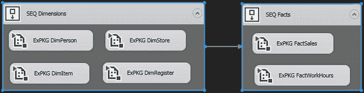

图 11-8。 典型的数据仓库方法：先加载维度，再加载事实

然而，当你尝试处理引用尚不存在于数据仓库中的维度数据的事实记录时，这种模式就失效了。以假日零售销售为例：由于年终假期零售层面的活动节奏非常快，最后时刻的商品出现在商店码头时很少或根本没有提前通知，这种情况并不少见。大公司（包括零售商）通常有用于不同目的的多个系统，这些系统可能同步也可能不同步，因此在销售点系统中输入的最后时刻商品可能尚未加载到销售预测系统中。因此，尝试使用来自销售系统但尚未从预测系统获取所需维度行的事实数据来加载数据仓库，可能不符合此模型。

此时，如果决定以内联方式处理此问题，我们可以使用几种不同的方法。下文将对此进行描述。

### 使用未知成员

解决缺失维度成员问题最快、最简单的模式是将带有缺失维度数据的事实记录推入事实表，同时将该维度值标记为未知。在这种情况下，相关事实记录将立即在数据仓库中可用；但是，默认情况下，所有未知值将出于分析目的而分组在一起。当事实记录本身不包含创建新的唯一维度记录所需的信息时，此模式通常效果最佳。

此设计模式在图 11-9 中得到了详细说明。使用查找转换的“无匹配”输出，我们将未匹配到现有 `[Item]` 维度成员的事实记录发送到“派生列”转换的一个实例，该实例将缺失的维度记录的值设置为该维度的未知成员（在大多数情况下，由键值 -1 表示）。然后，使用“ UNION ALL”转换将匹配和未匹配的记录重新合并在一起。

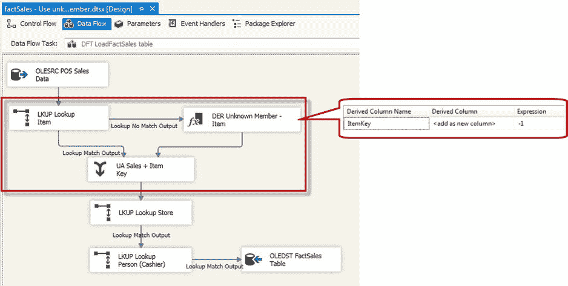

图 11-9。 对缺失的维度成员使用未知成员

值得注意的是，此设计模式还应包含一个补充过程（可能仅由一个简单的 SQL 语句组成），以定期尝试将这些修改后的事实与其正确的维度记录匹配。此后续步骤是必需的，以防止相关事实数据永久链接到该维度的未知成员。

### 添加缺失的维度成员

使用此设计模式，你可以在事实包中动态添加缺失的维度记录，使用事实数据提供的尽可能多的维度数据。在此场景中，事实记录就像在前面的设计模式中一样，立即在数据仓库中可用，但此方法还具有将事实记录与其正确的维度成员匹配的额外好处。在大多数情况下，这允许你立即关联正确的维度数据，而不是将未匹配的数据分组到未知成员存储桶中。

与上一模式类似，这种方法确实伴随着几个注意事项。首先，事实记录必须包含所有信息，以 1) 满足维度表上的表约束（如 `NOT NULL` 限制），以及 2) 使用业务键列创建可唯一标识的维度行。此外，由于我们是从传入的事实记录中派生新增的维度成员，在大多数情况下，可以合理地假设传入的事实数据不会完整地描述该维度成员。因此，你还应为此设计模式补充一个流程，尝试填充缺失的维度元素（这可能已作为全面缓慢变化维度策略的一部分得到处理）。

如 图 11-10 所示，这里我们使用了与上一个示例类似的方法。然而，我们不是简单地使用 `Derived Column` 转换来分配未知成员的值，而是利用一个 `OLE DB Command` 转换的实例，将事实表中缺失维度记录的数据插入到维度表中。SQL 语句显示在标注框中，并且在 `OLE DB` 命令的属性中，我们将占位符（用问号表示）映射到事实记录中的相应值。

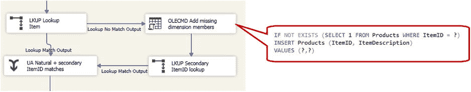

图 11-10. 添加缺失的维度成员

添加缺失的成员后，我们将这些行发送到一个次要的 `ItemID` 查找，它将尝试（除非出现严重问题，否则会成功）将之前未匹配的数据与 `DimItem` 表中新增的维度记录进行匹配。重要的是，当以这种方式使用次要查找时，请记住将缓存模式设置为 `Partial Cache` 或 `No Cache`。默认的查找缓存设置 (`Full Cache`) 会在数据流启动前缓冲 `Item` 维度表的内容，因此，在包执行期间添加的任何行都不会出现在这个次要查找中。为了防止所有这些被重定向的事实行在次要 `Item` 维度查找中失败，请使用一种非默认缓存方法来强制包执行按需查找，以包含新增的维度值。

关于次要查找转换方法，你可能会想第二次查找是否真的必要。毕竟，如果我们在上一步 (`OLE DB` 命令) 执行了插入操作，难道我们不能直接通过该 SQL 语句收集新的 `Item` 维度键值（在大多数情况下是 SQL Server 表的标识值）吗？答案是肯定的，根据我的经验，这是两种选项中较简单的一种。然而，我也发现，某些 ETL 情况——特别是引入并行进程来执行相同的即时维度成员添加——可能会使收集最近插入记录的标识值这个问题变得复杂。从这个角度来看，在此类情况下，我倾向于使用次要查找。

### 分类处理查找失败

对于缺失的维度记录，最常见的方法通常涉及前述方法之一。然而，偶尔会有必要延迟处理那些与现有维度记录不匹配的事实记录。在这种情况下，你需要创建一个分类表，用于存储临时记录，直到它们能成功匹配到正确的维度。

如 图 11-11 所示，我们为此设计模式的 ETL 管道添加了几个额外的组件。首先，我们需要使用两个独立的数据源：一个用于从源系统引入新数据，另一个用于将先前分类的数据重新引入管道。在数据流更深入的部分，该示例显示我们将未匹配的事实记录重定向到另一个表，而不是尝试在行内修复数据。

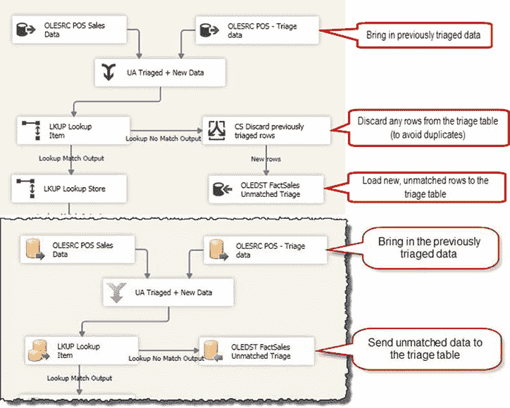

图 11-11. 使用分类表存储未匹配的事实数据

附带说明一下，此模式也可以修改为支持手动干预来更正查找失败的记录。如果业务和技术要求规定未匹配的事实数据必须由人工审查和更正（而不是系统性清理），你可以移除分类源，这样分类数据就不会重新引入数据流。

### 编写允许错误的代码

尽管听起来像是矛盾修辞法，但为已知错误编写代码实际上是一种常见做法。根据我的经验，大多数 ETL 错误的性质决定了包执行可以继续，并且任何无法在行内处理的错误或异常都会被分类，如前一个示例所示（如果需要手动干预，则通知负责人），以便后续解决。然而，有些情况下，数据仓库 ETL 过程应设计为在出现错误条件时失败。

考虑财务数据的例子。存储或处理财务数据的机构会接受频繁而全面的审计，如果在政府审查数据时出现不一致的数据，可能会给组织及其负责人带来灾难。尽管数据仓库可能不会受到像 OLTP 系统那样精确到分的审计审查，但在涉及资金和政府监管的问题时，仍然期望数据保持一致。在数据仓库加载过程中遇到不符合要求的数据时，可能最好的情况是包能够优雅地失败，回滚作为加载一部分所做的任何更改。

### 出错时使包失败

扩展前面提到的财务数据示例，让我们研究一下在发生查找错误时促进失败的设计模式。实际上，这是默认行为。如 图 11-12 所示，我们在查找组件上使用默认设置 `Fail Component`，如果遇到无法与 `GL Account` 或 `GL Subaccount` 查找匹配的行，则会停止包的执行。

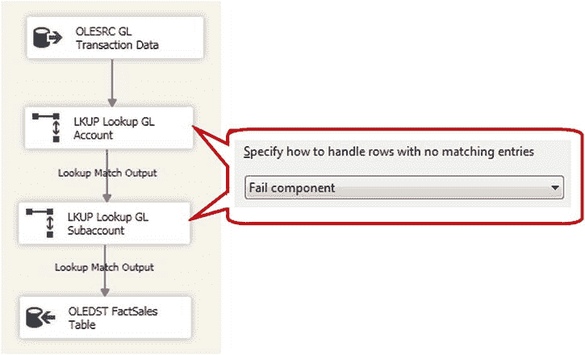

图 11-12. 允许包在出错时失败

这里值得注意的是，要正确使用此设计模式，你必须包含一些逻辑来回滚由于部分加载而做的更改。如果你遇到一个与任何查找组件都不匹配的事实行，包仍然会失败；然而，你可能已经将在出错行之前发送到目标表的行提交了，这会导致所有数据处于不一致状态。

有几种方法可以实现这种回滚行为：

### SSIS 中的事务处理与 ETL 工作流设计

### SSIS 原生事务
SSIS 原生支持将任务和容器包装到事务中，理论上，在事务范围内发生错误时，它会回滚对关系数据库所做的任何持久性更改。然而，在实践中，即使在最理想的情况下，使用 SSIS 事务功能也可能充满挑战。直接在 SSIS 中利用事务需要许多条件同时满足：所有涉及的系统必须支持 DTC 事务，DTC 服务必须在这些端点运行且可访问，并且 SSIS 中所有相关的任务和连接都必须支持事务。

### 显式 SQL 事务
此方法涉及在 SSIS 中手动创建事务，通过执行 T-SQL 命令在数据库引擎上启动关系事务。使用这种方法，你实际上是通过使用“执行 SQL”任务显式声明初始化和`COMMIT`点（或者在发生错误时`ROLLBACK`）来创建自己的事务容器。在数据库连接上，你需要将`RetainSameConnection`属性设置为`True`，以确保所有操作都重用同一个连接，进而重用同一个事务。虽然这种方法确实需要一些额外的工作，但它是两种支持战略性回滚的事务方法中更直接可靠的一种。

### 显式清理
这种设计模式涉及创建自己的、针对特定环境的清理例程，以回滚因部分加载失败而导致的更改，并且通常不使用数据库事务进行回滚。这种方法在开发和维护方面需要付出最多的努力，但如果你需要有选择地撤销在失败的包执行期间所做的更改，它也为你提供了最大的灵活性。

### 未处理错误
我确信提出墨菲定律的那位先生当时一定是在做数据仓库 ETL 开发者。处理来自不同系统的数据常常是一个混乱的过程！虽然我们可以防御性地编写代码来处理许多常见问题，但最终某些数据异常还是会引入意外的错误。

为了确保任何错误或其他数据异常不会导致 ETL 进程突然终止，建议内置一些安全网来处理任何意外的错误。

### 数据仓库 ETL 工作流
到目前为止，本章涵盖的大部分内容都是关于数据仓库加载的核心概念。我想简要地转换一下话题，谈谈关于工作流的 SSIS 包设计。数据仓库 ETL 系统往往包含许多活动的部分，而开发这些部分的工作量通常分配给多个开发人员。由于吸取了一些惨痛的教训，我开发了一种基于“包原子性”的工作流设计模式。

### 工作划分
我在几次演讲中讲过这个故事，现在想起来依然觉得有趣（至少对我来说）。我部署的第一个重要的生产环境 SSIS 包，是为了将大量数据从多个遗留系统移动到一个新的 SQL Server 数据库中。起初它看起来相当无害；最初预计 ETL 逻辑会比最终实际情况简单得多，所以我把所有东西都包装进了一个单独的包里。

最终，生成的 SSIS 包变得异常庞大。里面有大约 30 到 40 个不同的数据流（有些包含多个源/目标和复杂的转换逻辑），以及几十个其他辅助任务交织在一起。生成的`.dtsx`文件仅 XML 元数据就大约有 5MB！不用说，每次在 Visual Studio 中打开这个包，都需要好几分钟才能完成所有的验证步骤。

这个极其庞大的 SSIS 包运行良好，从技术上讲，设计上也没有任何问题。但它的巨大体积确实揭示了一些在使用庞大、包罗万象的包时会遇到的挑战，基于那次经历，我重新设计了我的原子化包设计方法。

### 一个包 = 一个工作单元
关于数据仓库 ETL，我发现大多数情况下最佳的解决方案是将逻辑工作单元拆分成独立的包，使每个包只做一件事。通过划分工作量，你可以避免许多潜在的障碍，并提高作为 ETL 开发人员的生产力。考虑使用较小的 SSIS 包的一些理由包括：

*   **减少设计时验证的等待时间：** SQL Server Data Tools 拥有一个丰富的界面，除了其他功能外，它在 SSDT 设计器中提供了近乎实时的潜在元数据问题评估。例如，如果 SSIS 包访问的某个表被更改，开发人员将在 SSDT 中看到一个警告（或者在适用时看到一个错误），指示包访问的元数据已更改。这种持续的元数据验证是有益的，因为它可以帮助在问题被推送测试之前识别出潜在问题。然而，这也伴随着性能成本。验证所需的时间随着包大小的增加而增加，因此，将包保持在合理的小尺寸，自然可以减少你坐在桌前等待验证完成的时间。
*   **更轻松的测试与部署：** 一个加载了，比如说，十个维度的单一包包含很多活动部件。当你在包内开发每个维度时，没有简单的方法来测试包的单个元素（除了在 SSDT 设计器中手动运行它，这对于最终将部署到服务器的包来说并不是一个完全真实的测试）。对于这样的包，唯一现实的测试是作为基于服务器的执行来测试整个包，如果你只对一两个更改的属性感兴趣，这可能是大材小用。此外，拥有正式软件测试和发布流程的组织通常要求重新测试整个包，而不仅仅是新的或更改的元素。通过将操作分解成更小的单元，你通常可以减轻测试和部署的负担，因为你一次只操作一个组件。
*   **分布式开发：** 如果你在一个只有你一个人开发 SSIS 包的环境中工作，这就不那么令人担忧。然而，如果你的工作场所有多个 ETL 开发人员，那些包罗万象的包就相当不方便了。尽管在 SQL Server 2012 中比较同一包文件的不同版本比之前的版本容易得多，但这仍然是一个基本手动的过程。通过将工作量分割成多个包，将开发任务分配给多个人会容易得多，而无需协调同一包的多个版本。
*   **可重用性：** 在同一次 ETL 执行中多次使用相同的逻辑，或者在多个 ETL 进程之间共享相同的逻辑，这种情况并不少见。当你将这些逻辑工作单元封装在它们自己的包中时，共享该逻辑并避免重复开发就会容易得多。

这里有可能做得过头。例如，如果在 ETL 执行过程中，你需要删除或禁用 20 个表上的索引，你可能不需要为每个索引创建一个包！将操作分解成独立的包，但要现实地看待什么构成一个逻辑工作单元。

这些并非一成不变的规则，但关于将 ETL 工作分解为包，在填充数据仓库时，以下是我发现效果良好的几种设计模式：

