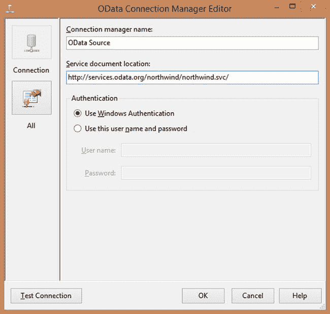
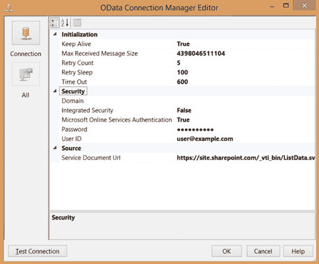
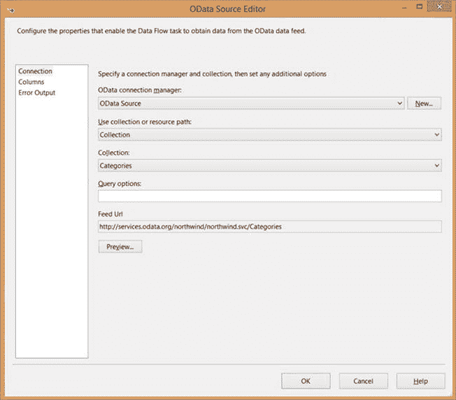

# 第 12 章


### OData 源

开放数据（`OData`）协议是一种数据访问协议，它提供了一种通过 Web 创建和使用数据 API 的标准化方法。该技术建立在常见的协议和方法之上，如`HTTP`、`REST`、`AtomPub`和`JSON`。其最初版本由微软定义为开放标准，随后`OData`被一个`OASIS`（结构化信息标准促进组织）委员会接手，其赞助商包括`IBM`、`红帽`和`SAP AG`等众多行业巨头。`OASIS`于 2014 年 2 月批准了该标准的最新版本（第 4 版）。

微软已将`OData`作为其许多产品公开数据 API 的主要方式。`SharePoint`、`Project Online`和许多`Azure`服务都公开了`OData` API，用于检索数据和执行`CRUD`（增删改查）操作。`WCF 数据服务`（以前称为`ADO.NET 数据服务`）提供了一种快速简便的方式，让任何人都可以基于`实体数据模型(EDM)`和`ADO.NET 实体框架`来开发他们自己的`OData`服务。鉴于该技术的广泛普及，微软在`SSIS`（SQL Server Integration Services）中增加对`OData`的支持是合乎情理的。

本章介绍了`SSIS`中新增的`OData 源`。

 **注意** `OData 源`不包含在`SQL Server 2014`或`SQL Server 2012`的安装包中，必须单独下载。`SQL Server 2012`版本可从微软下载中心获取：`www.microsoft.com/en-us/download/details.aspx?id=42280`。`SQL Server 2014`版本是`SQL Server 2014`功能包的一部分，可在`www.microsoft.com/en-us/download/details.aspx?id=42295`找到。

#### 理解 OData 协议

`OData`协议是一个相当广泛的协议，公开了广泛的功能。本节描述了`SSIS`开发人员应该了解的`OData`协议的关键特性。如果您有兴趣了解更多关于该协议的信息，完整的规范和文档可在`www.odata.org`网站上获取。

 **注意** `SQL Server 2012`和`2014`的`SSIS OData 源`支持`OData`协议第 3 版，而非第 4 版。有关`OData`协议的更多信息，请访问`www.odata.org/`。

从`SSIS`的角度来看，`OData`有两个主要特性：元数据文档和从访问`OData`资源返回的数据。

元数据文档是`OData`服务的`EDM`描述，它描述了服务公开的实体集。`SSIS OData 源`使用元数据文档来确定源数据的模式。该文档位于每个服务的标准位置——`http://<base_url>/$metadata`。表 12-1 显示了`OData`和`EDM`概念的映射关系。

**表 12-1.** 映射到关系术语的 OData v3 概念

| OData | 关系型 | 注释 |
| --- | --- | --- |
| 实体集 | 表或视图 | *实体集*（也称为集合或源）定义了您将在`SSIS`中接收的对象。使用*集合模式*时，`OData 源`提供一个下拉框，允许您选择服务定义的一个实体集。 |
| 实体 | 数据行 | 定义实体集内数据行的模式。 |
| 操作 | 存储过程或函数 | `OData 源`用户界面没有公开选择操作的方法，但可以通过指定其资源路径来调用操作。 |
| 导航属性 | 外键关系 | 导航属性定义了实体之间的关系。`OData 源`不直接支持这些，但您可以通过输入其资源路径来访问子实体。 |

在运行时，`SSIS`使用标准`HTTP` URL 从`OData`服务检索数据。这意味着您可以通过将 URL 输入 Web 浏览器来查看返回给`SSIS`的相同数据，这对于调试非常有用。`OData 源`有两种模式：当使用*集合模式*访问服务时，`SSIS`将自动为您生成资源 URL；当使用*资源路径模式*时，您需要提供完整的 URL。

##### 数据类型映射

`OData 源`将尝试将服务元数据文档中定义的复杂类型的字段映射到`SSIS`数据流类型。在配置`OData 源`时，您引用的实体或资源集合或实体集中的字段将作为外部元数据列添加到组件中。表 12-2 显示了`EDM`到`SSIS`数据类型的映射。鉴于`实体数据模型`的灵活性，您可能会发现某些复杂类型无法与`SSIS OData 源`配合使用。

**表 12-2.** EDM 数据类型映射到 SSIS 类型

| EDM 类型 | CLR 类型 | SSIS 类型 |
| --- | --- | --- |
| Edm.Binary | byte[] | DT_BYTES |
| Edm.Boolean | bool | DT_BOOL |
| Edm.DateTime | DateTime | DT_DBTIMESTAMP |
| Edm.DateTimeOffset | DateTimeOffset | DT_DBTIMESTAMPOFFSET |
| Edm.Decimal | decimal | DT_NUMERIC |
| Edm.Double | double | DT_R8 |
| Edm.Guid | Guid | DT_GUID |
| Edm.Int16 | Int16 | DT_I2 |
| Edm.Int32 | Int32 | DT_I4 |
| Edm.Int64 | Int64 | DT_I8 |
| Edm.SByte | sbyte | DT_I1 |
| Edm.Single | float | DT_R4 |
| Edm.String | string | DT_WSTR |
| Edm.Time | TimeSpan | DT_DBTIME2 |

##### 查询选项

`OData`支持多种可以包含在请求中的查询选项。查询选项以美元符号（`$`）开头，并添加到 URL 查询字符串部分，位于资源路径之后。这些选项通常用于向服务传递过滤器或限制结果集中的行数或列数。某些`OData`服务可能不支持所有可用的查询选项，因此有时您需要进行试验。表 12-3 显示了您在使用`SSIS`时会用到的一些更常用的查询选项。您可以通过在`OData 源编辑器`的`查询选项`框中指定它们，或者直接在组件上设置`查询`属性值，来在`SSIS`中使用这些查询选项。

**表 12-3.** OData 查询选项

| 查询选项 | 描述 |
| --- | --- |
| `$filter` | 根据过滤表达式指定要返回哪些行。 |
| `$select` | 指定要返回哪些属性（列）。 |
| `$orderby` | 指定返回项目的顺序。 |
| `$top` | 指定要返回的最大项目数。 |
| `$skip` | 指定在返回结果之前要跳过的项目数。 |
| `$expand` | 指定要在结果中包含的相关实体。 |
| `$count` | 指定是否在结果中包含项目计数。 |

此外，根据它们执行的工作类型来组织您的 ETL（提取、转换、加载）包是一个最佳实践。例如：

*   每个维度表有一个独立的包。
*   每个事实表有一个独立的包。
*   暂存操作（如果使用）各自有自己的包。
*   与数据移动无关的功能操作（例如，在向表加载数据之前删除或禁用索引）也被分离出来。您可以将其中一些操作在适当的时候分组到公共包中；例如，如果您在暂存数据库中截断表并删除索引，这些操作通常位于同一个包中。

此外，将任何在范围或数据广度上显著不同的`ETL`逻辑隔离到单独的包中通常也是一个好的做法。例如，一个检索大块旧数据的历史`ETL`过程，其性能预期、错误处理规则等，很可能与一个仅收集最近增量数据的、执行更频繁的包不同。因此，通过创建一个单独的包结构来处理这些更大的数据集，有助于避免试图让单个包处理这些不同场景的问题。

### 结论

`SQL Server Integration Services`不仅仅是又一个`ETL`工具。从根本上说，它非常适合数据仓库`ETL`的独特挑战。本章展示了一些具体的方法论，说明了如何利用`SSIS`应对常见且现实的数据仓库挑战。


### 配置 OData 连接管理器

| 选项 | 描述 |
| --- | --- |
| `$select` | 用于指定服务应返回哪些列的逗号分隔列表。等效于 T-SQL 中的 `SELECT` 语句。 |
| `$filter` | 将结果集限制为符合指定筛选表达式的行。等效于 T-SQL 中的 `WHERE` 子句。 |
| `$orderby` | 指定从服务返回结果的顺序。等效于 T-SQL 中的 `ORDER BY` 子句。 |
| `$top` | 限制从服务返回的行数。等效于 T-SQL 中的 `TOP` 表达式。 |
| `$skip` | 指示服务应忽略结果集的前 *N* 行，其中 *N* 由 `$skip` 参数指定。 |
| `$format` | 此选项允许您覆盖响应的默认格式。有效选项为 `json`、`atom` 和 `xml`。SSIS 默认会尝试使用 `json` 格式，因为它最简洁且往往能提供最佳性能（特别是当服务支持带最少元数据的 JSON 时——也称为 JSON light）。 |

OData 连接管理器是您指定服务文档 URL（即 OData 服务的根 URL）和身份验证信息的地方。该连接管理器支持三种身份验证类型：Windows、基本（用户名和密码）以及 Microsoft Online Services 身份验证。您可以在 OData 连接管理器编辑器的主页面（如图 12-1 所示）上配置 Windows 和基本身份验证设置。Microsoft Online Services 身份验证用于 SharePoint Online 并且需要一些额外配置。该过程在下一节中描述。


图 12-1。OData 连接管理器编辑器

### 启用 Microsoft Online Services 身份验证

SharePoint 为其存储的对象（例如其列表和文档）提供 OData 终结点，现在可以通过 SSIS 中的 OData 源访问这些对象。虽然您可以为本地 SharePoint 版本配置不同类型的身份验证，但 SharePoint Online（以及 Office 365 的其他 Microsoft 服务，如 Project Online）使用一种特殊的身份验证类型。OData 连接管理器支持这些联机服务，但您可能需要安装额外的 SharePoint SDK 组件才能使其工作。

您可以按照以下步骤连接到 SharePoint Online：

1.  在 OData 连接管理器编辑器（如图 12-1 所示）中单击“全部”按钮，以显示完整的属性页。
2.  在“安全性”组下，将“集成安全性”属性从 `SSPI` 更改为 `False`。
3.  如果“Microsoft Online Services 身份验证”属性保持禁用状态，则您需要从 Microsoft 下载中心安装 SharePoint Service 2013 客户端组件 SDK（搜索该 SDK，或按照此链接：`http://www.microsoft.com/en-us/download/details.aspx?id=35585`）。安装 SDK 后，保存 SSIS 包并重新启动 SQL Server Data Tools。现在您应该能够将“Microsoft Online Services 身份验证”属性更改为 `True`（如图 12-2 所示）。


图 12-2。显示所有属性的 OData 连接管理器编辑器

4.  输入您用于连接到 SharePoint Online 的用户 ID 和密码。根据站点管理员如何将您的 Active Directory 与 Office 365 集成，您可能还需要提供一个域值。
5.  现在您应该能够成功连接到您的 SharePoint Online 站点。输入服务文档 URL（例如，`https://<mysite>.sharepoint.com/_vti_bin/ListData.svc`）并单击“测试连接”按钮。

 **注意** 有关 SharePoint Online 提供的 OData 终结点的更多信息，请参阅在线丛书：`http://msdn.microsoft.com/en-us/library/ff521587.aspx`。

### 配置源组件

您可以通过双击数据流中的组件来打开 OData 源编辑器。该编辑器与其他 SSIS 数据流组件的类似，如图 12-3 所示。


图 12-3。OData 源编辑器

可以在表 12-4 中找到在“连接”页面上可以配置的字段的描述。该表列出了编辑器 UI 中描述的字段名称，以及通过高级编辑器（如后面的图 12-6 所示）或属性窗口设置值时对应的属性名称。

表 12-4。OData 源字段

| 字段 | 属性 | 描述 |
| --- | --- | --- |
| OData 连接管理器 | N/A | 您将用于此源组件的连接管理器。必须先设置此属性，才能设置其他值。单击“新建”按钮将打开一个对话框，让您创建新的连接管理器。 |
| 使用集合或资源路径 | `UseResourcePath` | 此字段确定您是从 OData 服务访问特定集合还是提供自己的资源路径。默认设置为“集合”。有关这些访问模式的更多信息可在本节后面找到。 |
| 集合 | `CollectionName` | 此框允许您从 OData 源中选择特定集合。 |
| 资源路径 | `ResourcePath` | 当使用“资源路径”访问模式时，此字段允许您输入要访问的特定 OData 资源的完整路径。 |
| 查询选项 | `Query` | 此字段允许您向请求附加不同的查询选项，例如 `$top` 或 `$filter`。表 12-3 列出了通常在请求中包含的常见查询选项集合。请注意，这些值应进行 URL 编码——OData 源不会自动为您编码这些值。 |
| 源 URL | N/A | 这是一个只读字段，显示 OData 源将用于访问服务器的 URL。它是基于您在此对话框中为其他字段设置的值构建的。此字段可用于调试目的。 |

使用 OData 源访问 OData 服务主要有两种方式：通过选择集合，或通过配置资源路径。

使用集合访问服务是 OData 源的默认行为。当您想要读取服务公开的顶级实体集之一时，通常会使用此选项。“集合”字段将为您提供可用实体集的下拉列表，类似于 OLE DB 源列出可用表和视图的方式。

当您要执行的操作不仅仅是访问单个实体集时，会使用资源路径。例如，您想要运行服务定义的操作或操作，或者您想通过导航属性访问子实体。在这些情况下，您需要在“资源路径”字段中提供完整的 URL。请注意，您需要自行对值应用任何 URL 编码——组件不会自动为您完成此操作。另请注意，OData 源不会对这些值进行任何特殊验证——它只是在运行时尝试访问 URL，并依赖服务的 `$metadata` 文档来确定如何解释结果。在这些情况下，使用 OData 源编辑器对话框（如图 12-4 所示）上的“预览”按钮非常有用，因为它可以让您快速验证请求是否会成功以及是否获得了所需的数据。

```javascript
if (condVar > someVal) {console.log("xxx")}
```


