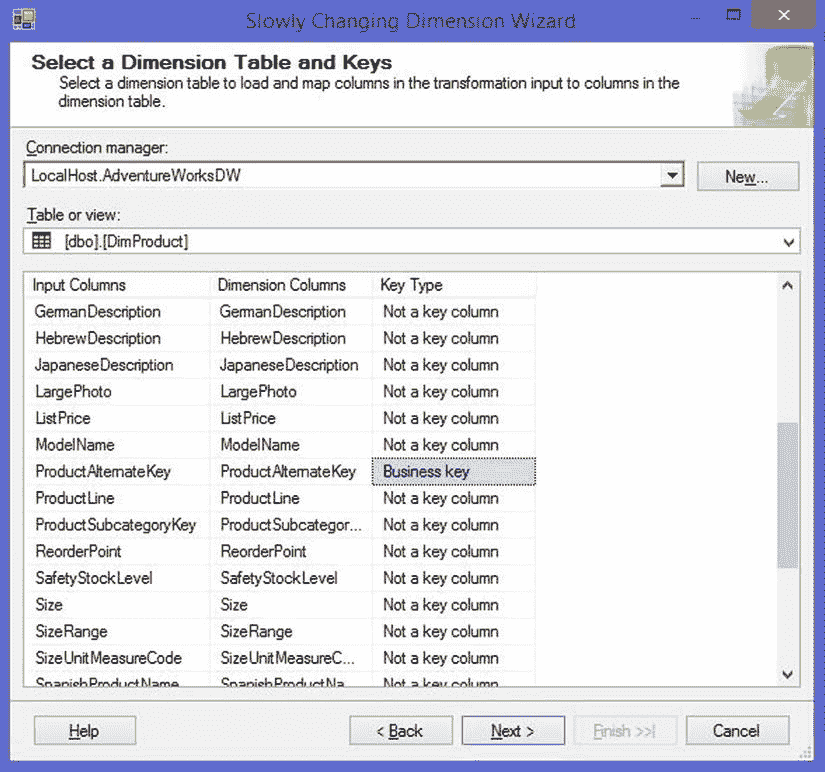
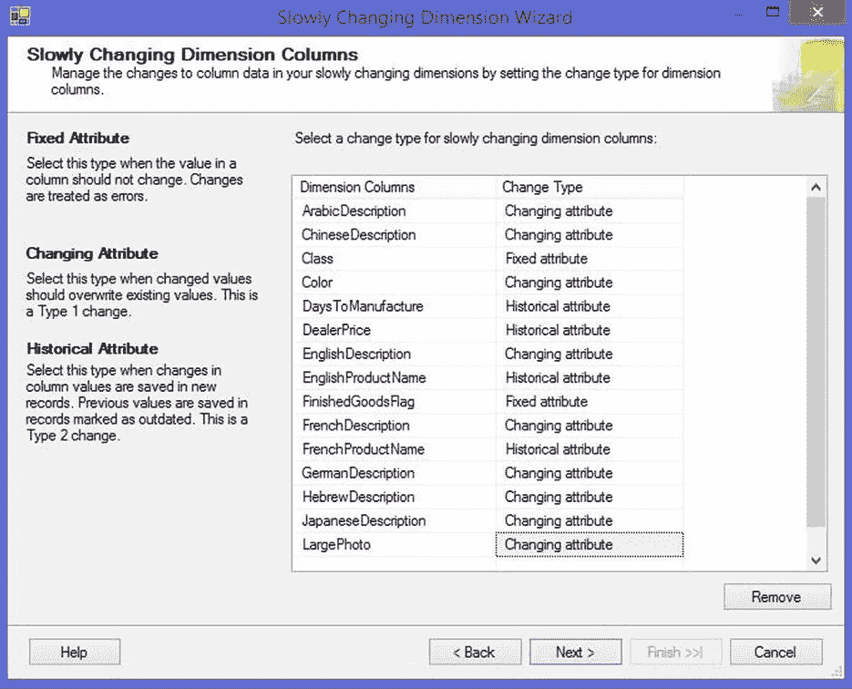

# 第 13 章

### 缓慢变化维度

处理缓慢变化维度（SCD）是处理数据仓库时常见的 ETL 操作。SSIS 数据流提供了一个 SCD 转换组件，该组件通过一个向导输出一组转换，用于处理处理 SCD 的多个步骤。虽然内置的 SCD 转换很有用，但它并不适用于所有数据加载场景。本章将介绍如何充分利用 SCD 转换，并提供几种可供使用的替代模式。

 **注意** SCD 有多种不同类型，但本章将重点介绍两种最常见的类型：类型 1 和类型 2。有关不同类型的 SCD 的更多信息，请参见维基百科条目 `http://en.wikipedia.org/wiki/Slowly_changing_dimensions`。

### 缓慢变化维度转换组件

为了最好地理解 SCD 转换，让我们考虑它所设计的两个关键场景：

*   **少量变更行：** 你在源头或尽可能靠近源头的地方执行变更数据捕获（CDC）。除非你处理的是一个非常活跃的维度，否则大多数 SCD 处理批次只会包含少量行。
*   **大型维度：** 你正在处理大型维度，但只处理少量变更行。你需要避免执行对维度进行全表扫描的操作。

由于这些目标场景，SCD 转换不会缓存现有的维度数据（像查找转换那样），而是针对目标表逐行执行所有比较。虽然这使得该转换能够避免对目标维度进行全表扫描并减少内存使用，但当你处理大量行时，它确实会影响性能。如果你的场景不符合这些情况，你可能需要考虑使用本章中的其他模式。如果符合，或者如果你更喜欢使用开箱即用的组件而非第三方解决方案（或者你只是想避免合并模式所需的自定义 SQL 语句），那么可以考虑应用本模式末尾列出的优化措施。

### 运行向导

与其他 SSIS 数据流组件不同，当你将 SCD 转换拖放到商业智能开发工作室（BIDS）中的设计界面时，会弹出一个向导，引导你完成设置 SCD 处理的步骤。

向导的第一页（图 13-1）允许你选择要更新的维度以及构成业务键（也称自然键）的一个或多个列。

图 13-1. 在缓慢变化维度向导中选择维度表和键

在下一页（图 13-2）上，你需要指定要处理的列，并确定希望向导如何对待它们。你有三种选择（如表 13-1 所示）。

图 13-2. 在缓慢变化维度向导中选择维度表和键

表 13-1. 列变更类型

| 变更类型 | 维度类型 | 何时使用 |
| --- | --- | --- |
| 固定属性 | — | 固定属性是指不应更改或在更改时需要特殊处理的列。默认情况下，对这些列之一的更改将被视为错误。 |
| 可变属性 | 类型 1 | 当对可变属性列进行更改时，现有记录将被更新以反映新值。这些通常是不用作业务逻辑或时间敏感报告查询的一部分的列，例如产品描述。 |
| 历史属性 | 类型 2 | 历史属性是指你需要维护其历史的列。这些通常是用于时间敏感报告查询的数值列，例如销售价格或重量。 |

在此页面上，你不应映射那些不会作为 SCD 处理的一部分而更新的列，例如指向其他维度表的外键或与跟踪历史变更相关的列——例如开始日期和结束日期列、过期标志或代理键。SCD 转换不支持大对象（LOB）列（在 SSIS 数据流中被视为 `DT_IMAGE`、`DT_TEXT` 和 `DT_NTEXT` 类型的列），因此这些列应单独处理，也不应在此处映射。

