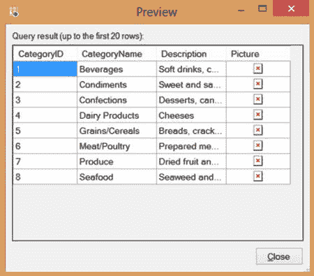
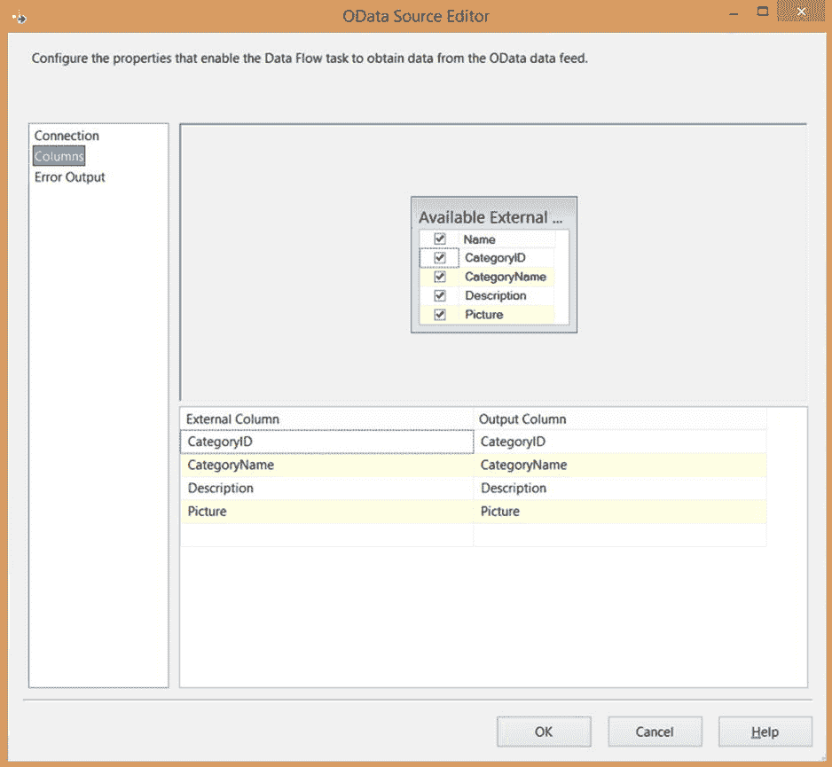
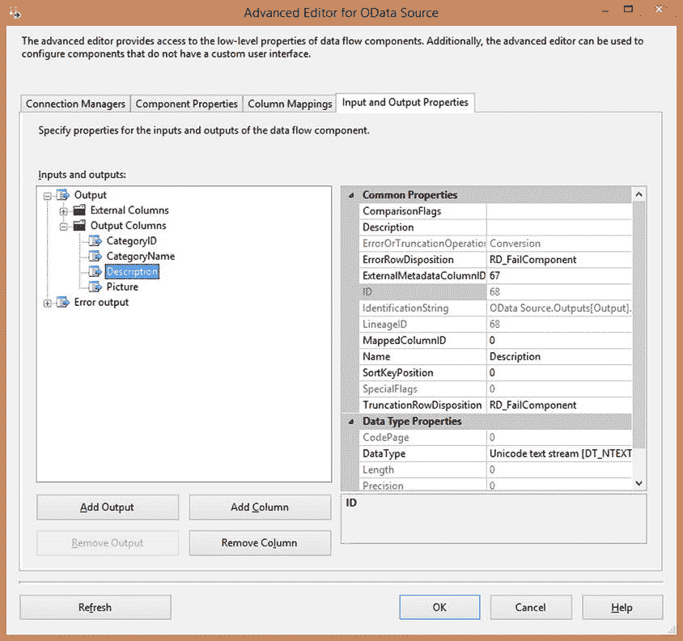
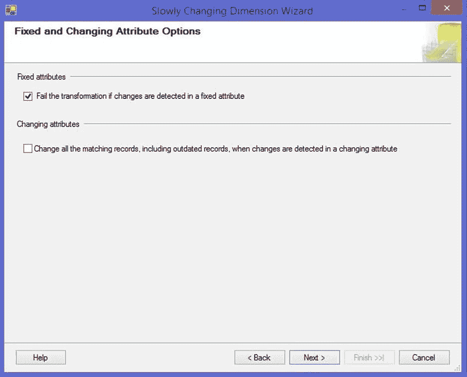
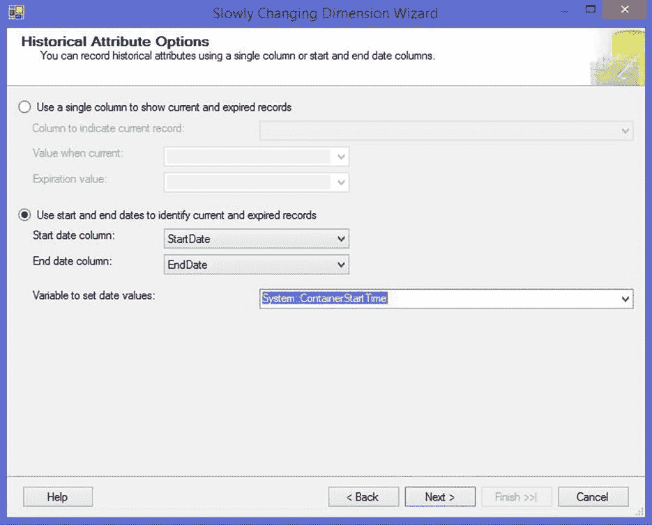
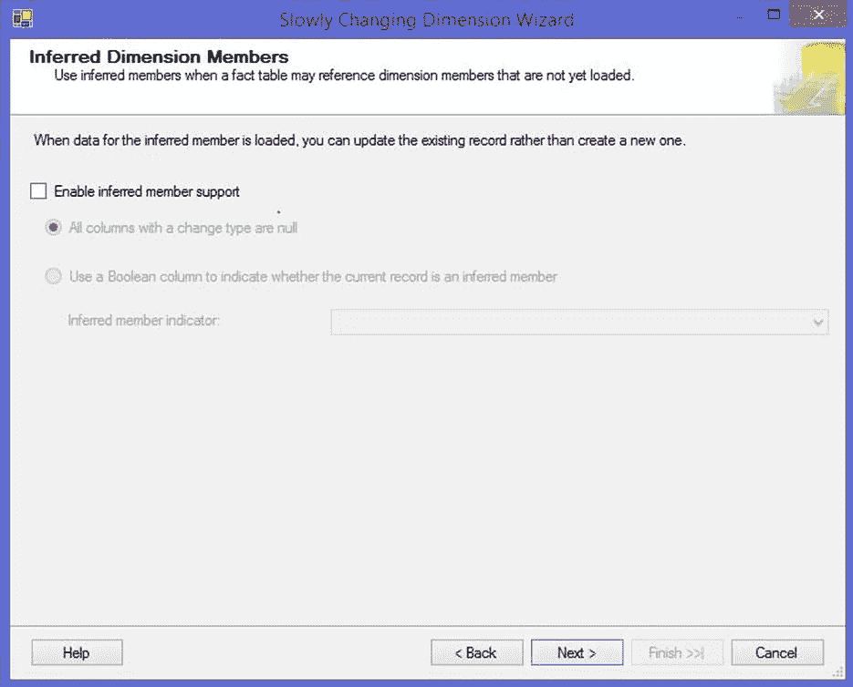
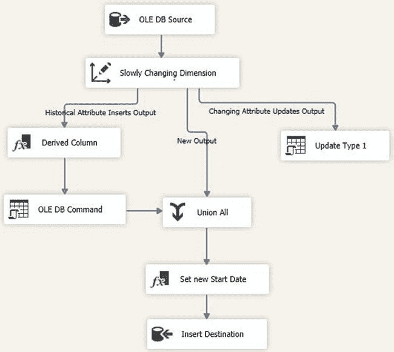
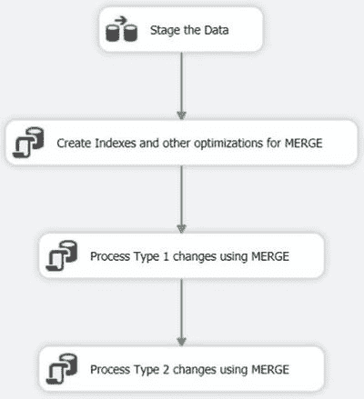
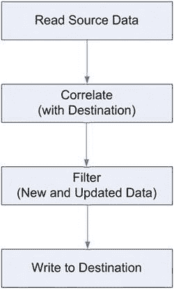
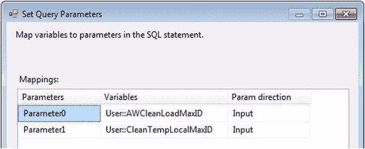

# 第 12 章



图 12-4. OData 源编辑器中的预览对话框

配置集合或资源路径值后，你可以通过单击“列”页面（如图 12-5 所示）来选择要为数据流检索的列。此对话框使用标准的 SSIS 外部列对话框，SSIS 开发人员应该很熟悉。请注意，此页面上未选中的列不会添加到你的数据流中，但它们仍会通过请求被下拉到服务中。如果你只选择某个源中的少数几列，你可能希望使用 `$select` 查询选项预先限制列。有关查询选项的更多信息可在表 12-3 中找到。



图 12-5. OData 源编辑器的“列”页面

### 覆盖数据类型

OData 源允许你为某些类型手动覆盖输出列的数据类型。当你使用的 OData 服务未为字符串和二进制字段指定最大长度值时，这会非常方便。SSIS 会分别映射到 `DT_NTEXT` 和 `DT_IMAGE` 类型，这可能会对性能产生负面影响。你可以使用高级编辑器（如图 12-6 所示）更改列的默认数据类型。



图 12-6. OData 源的高级编辑器

以下是修改默认数据类型的方法：

1.  向数据流添加一个 OData 源，并配置其连接管理器以及要访问的数据。
2.  单击“确定”保存设置。
3.  在数据流的设计界面上，右键单击 OData 源组件，然后选择“显示高级编辑器”。
4.  选择“输入和输出属性”选项卡。
5.  展开“输出”文件夹。
6.  展开“输出列”文件夹。
7.  选择要修改的列。
8.  选择 `DataType` 属性。
9.  将值更改为新的 SSIS 数据类型，并在适用时更改 `Length` 值。

你只能更改某些类型的 `DataType` 属性。表 12-5 包含可互换数据类型的列表。为不支持的数据类型更改值将导致错误消息（`COMException 0xC020837D`）。

表 12-5. 可更改的数据类型

| 数据类型 | 兼容类型 |
| --- | --- |
| `DT_NTEXT` | `DT_WSTR` |
| `DT_IMAGE` | `DT_BYTES` |
| `DT_DBTIMESTAMP2` | `DT_DBTIMESTAMP` |

### 总结

本章介绍了 SSIS 中新的 OData 源组件。过去几年中，OData 的采用率稳步增长，而 OData 源提供了一个开箱即用的解决方案，用于从各种源（如 SharePoint 和 Windows Azure 存储 API）读取数据。

### 使用缓慢变化维度向导

向导的后续页面允许您配置如何处理固定属性（图 13-3）以及类型 1 和类型 2 变化（图 13-4）的选项。在处理历史属性时，向导知道如何以两种不同方式生成更新维度所需的逻辑：使用单个列，或使用开始日期和结束日期列来指示记录是当前的还是已过期的。如果您的表使用这些方法的组合，或使用其他方法来跟踪当前记录，则需要更新生成的转换以包含此逻辑。


图 13-3。固定属性和变化属性选项


图 13-4。历史属性选项

向导的最后一个页面（图 13-5）允许您启用对推断成员的支持。推断成员是以最少的信息创建的——通常只有业务键和代理键。预计在后续加载维度数据时会填充剩余字段。虽然向导默认启用推断成员支持，但对于大多数形式的 SCD 处理，您并不需要它。


图 13-5。推断维度成员

### 使用转换

向导完成后，除了主要的缓慢变化维度组件外，它还会输出多个不同的数据流组件（图 13-6）。主组件将传入数据与目标表进行比较，如果记录是新的或已修改的，则将传入的行发送到其某个输出。没有任何更改的记录将被忽略。连接到这些输出的组件将根据您在向导对话框中选择的选项进行配置。


图 13-6。向导输出（用于类型 1 和类型 2 变化，且无推断成员支持）

您可以通过修改这些组件来进一步自定义 SCD 处理逻辑。双击主要的缓慢变化维度转换将重新启动向导。向导会记住您上一次运行的设置；但是，它会覆盖您对现有转换所做的任何更改或自定义。这包括您可能执行的任何布局和大小调整更改。

`注意`：当您重新运行缓慢变化维度向导时，UI 中选择的默认选项不是从组件推断出来的。相反，它们作为包的一部分持久保存在 `<designTime>` 元素中。如果您的部署过程会删除包布局信息，请注意您也将失去在向导中所做的选择。

### 优化性能

缓慢变化维度向导输出的组件并未配置为最佳性能。通过更改某些设置并转向基于集合的模式，您可以显著提高 SCD 处理的性能。

#### 缓慢变化维度转换

主转换不会缓存来自参考维度的任何行结果，因此每个传入行都会导致对数据库的一次查询。默认情况下，向导将在每次查询时打开一个新的数据库连接。为了提高性能（以及降低资源使用），您可以将向导使用的连接管理器的 `RetainSameConnection` 属性设置为 `True`，以便在每次查询时重用同一连接。

#### OLE DB 命令转换

向导将输出两个（或者三个，如果您正在处理推断成员）OLE DB 命令转换。这些转换逐行执行更新，这会大大降低性能。通过将这些行放入暂存表并在数据流完成后以单个批次执行更新，您将获得巨大的性能提升。

#### OLE DB 目标

由于主要的缓慢变化维度转换和目标使用相同的连接管理器，默认情况下目标组件将禁用快速加载选项以避免数据流死锁。如果您正在处理少量行（例如，单个数据流缓冲区的数据量），可以在目标组件上启用快速加载以获得即时的性能提升。为避免在处理大量行时出现死锁问题，请考虑使用暂存表。将数据批量加载到临时暂存表中，并在数据流完成后使用 `INSERT INTO ... SELECT` 语句更新最终目标。

### 第三方 SCD 组件

有几种流行的第三方 SCD 转换替代方案可用。两者具有相似的架构和使用模式，但提供不同的功能。

*   **Table Difference 组件可通过 CozyRoc.com 获取**：此转换将源表和目标表作为输入，并在内存中逐行进行比较。它有三个输出——新建、已更新和已删除。除了 SCD 处理外，它还可用于执行通用表比较。

`注意`：有关 Table Difference 组件的更多信息，请参阅 CozyRoc 网页 `www.cozyroc.com/ssis/table-difference`。

*   **Dimension Merge SCD 组件可通过 PragmaticWorks.com 获取**：此组件旨在按照 Kimball 方法处理维度加载。与 Table Difference 组件类似，它将源维度表和目标维度表作为输入，并在内存中进行比较。同样与 Table Difference 组件类似，它不直接修改目标表。它将在内存中应用行更新，并提供多个输出来填充您的目标表。

`注意`：有关 Dimension Merge SCD 组件的更多信息，请参阅 Pragmatic Works 网页 `http://pragmaticworks.com/Products/Business-Intelligence/TaskFactory/Features.aspx#TSDimensionMergeSCD`。

``````markdown
#### 合并模式

这些组件的主要优势在于其性能。由于转换将源表和目标表都加载到内存中，它们能够进行快速的内存中比较，而无需多次查询目标服务器。它们还提供了比 SCD（缓慢变化维度）转换更多的功能，例如检测已删除的行，并且可能更易于维护，因为所有逻辑都包含在一个组件中。

然而，同时加载源和目标维度表意味着您正在对目标进行全表扫描（通常源表也是如此）。由于数据流在读取完所有源行之后才结束，即使您只处理少量更改的源行，整个目标维度也将被读取。尽管第三方组件在许多情况下表现良好，但您应该考虑它们是否适合您的场景。

#### 合并模式

SQL Server 2008 引入了对 T-SQL `MERGE` 语句的支持。该语句将根据与源表连接的结果，在目标表上执行插入、更新和删除操作。它非常高效，并为 SCD 处理提供了一个良好的替代方案。

 **注意** 有关 `MERGE` 的更多信息，请参阅在线手册中的“在 Integration Services 包中使用 MERGE”条目，网址为 `http://technet.microsoft.com/en-us/library/cc280522.aspx`。

在 SSIS 中使用 `MERGE` 有三个步骤：

1. 在数据流中暂存数据。
2. 优化暂存表（可选）。
3. 使用执行 SQL 任务运行 `MERGE` 语句。

`MERGE` 允许在检测到行已更新（使用 `MERGE` 术语为“匹配”）和行是新的（“未匹配”）时运行单个语句。由于类型 1 和类型 2 的更改需要不同类型的处理，我们将使用两个 `MERGE` 语句来完成 SCD 处理（如 图 13-7 所示）。



图 13-7. 合并模式的控制流

### 处理类型 1 更改

列表 13-1 显示了我们将运行的第一个 `MERGE` 语句，用于更新目标表中的所有类型 1 列。`ON ( )` 部分指定了我们将要匹配的键（在本例中是表的业务键）。在 `WHEN MATCHED` 部分，我们包含了 `DEST.EndDate is NULL` 以确保我们只更新当前记录（这是可选的——在许多情况下，您确实希望更新所有记录，而不仅仅是当前记录）。`THEN UPDATE` 部分包含我们想要更新的类型 1 列的列表。

***列表 13-1***. 用于类型 1 列的 MERGE 语句

```sql
MERGE INTO [DimProduct] AS DEST
USING [Staging] AS SRC
ON (
        DEST.ProductAlternateKey = SRC.ProductAlternateKey
)
WHEN MATCHED AND DEST.EndDate is NULL -- 更新当前记录
THEN UPDATE
SET
         DEST.[ArabicDescription] = SRC.ArabicDescription
        ,DEST.[ChineseDescription] = SRC.ChineseDescription
        ,DEST.[EnglishDescription] = SRC.EnglishDescription
        ,DEST.[FrenchDescription] = SRC.FrenchDescription
        ,DEST.[GermanDescription] = SRC.GermanDescription
        ,DEST.[HebrewDescription] = SRC.HebrewDescription
        ,DEST.[JapaneseDescription] = SRC.JapaneseDescription
        ,DEST.[ThaiDescription] = SRC.ThaiDescription
        ,DEST.[TurkishDescription] = SRC.TurkishDescription
        ,DEST.[ReorderPoint] = SRC.ReorderPoint
        ,DEST.[SafetyStockLevel] = SRC.SafetyStockLevel;
```

### 处理类型 2 更改

由于 `MERGE` 语句允许每个操作使用单个语句，更新类型 2 列更具挑战性。

请记住，对于类型 2 更改，您需要执行两个操作：1) 将当前记录标记为过期，以及 2) 插入新记录作为当前记录。为此，您将把 `MERGE` 语句放在 `FROM` 子句内，并使用其 `OUTPUT` 为 `INSERT INTO` 语句提供数据（如 列表 13-2 所示）。

***列表 13-2***. 用于类型 2 列的 MERGE 语句

```sql
INSERT INTO [DimProduct]
    ([ProductAlternateKey],[ListPrice],[EnglishDescription],[StartDate])
SELECT
    [ProductAlternateKey],[ListPrice],[EnglishDescription],[StartDate]
FROM (
        MERGE INTO [DimProduct] AS FACT
        USING [Staging] AS SRC
        ON ( FACT.ProductAlternateKey = SRC.ProductAlternateKey )
        WHEN NOT MATCHED THEN
        INSERT VALUES (
                 SRC.ProductAlternateKey
                ,SRC.ListPrice
                ,SRC.EnglishDescription
                ,GETDATE()      -- StartDate
                ,NULL           -- EndDate
        )
        WHEN MATCHED AND FACT.EndDate is NULL
        THEN UPDATE SET FACT.EndDate = GETDATE()
        OUTPUT $Action Action_Out
                ,SRC.ProductAlternateKey
                ,SRC.ListPrice
                ,SRC.EnglishDescription
                ,GETDATE() StartDate
) AS MERGE_OUT
WHERE MERGE_OUT.Action_Out = 'UPDATE';
```

### 结论

在 SSIS 中处理 SCD 有多种方法。虽然内置的 SCD 转换可以让你快速开始运行，但其性能可能不如替代方案。您可能更喜欢使用合并模式，因为它整体性能更好，但维护 SQL 语句可能是一个长期的障碍。如果您更喜欢可视化设计器体验，可以考虑尝试第三方组件选项之一。

表 13-2 总结了本章描述的优缺点。

表 13-2. 缓慢变化维度处理模式

| 模式 | 用途 |
| --- | --- |
| 缓慢变化维度转换 | 快速原型设计<br>处理少量行<br>非常大的维度 |
| 第三方组件 | 完整或历史维度加载<br>中小型维度<br>非 SQL Server 目标 |
| 合并模式 | 最佳整体性能<br>不介意手工编写 SQL 语句的情况 |

# 第 14 章


### 加载到云端

现在是 2014 年，云技术正变得无处不在。随着越来越多的应用程序托管在各种云服务提供商中，将相关数据定位在云中的需求也在增加。得益于远见和良好的工程设计，Microsoft SQL Server 处于有利地位，可以提供帮助。与 Microsoft Azure SQL Database (MASD) 数据库交互的用户体验与与本地服务器或企业网络上的服务器交互几乎相同。毫无疑问，这是精心设计的——而且是好的设计。

在本章中，我们将考虑用于集成云中数据的 SSIS 设计模式。这些模式在连接到任何具有云技术特征的存储库时都很有用。因为与云中数据交互与与更本地的数据交互相似，所以这些模式并不具有革命性。“那么为什么要写一章关于加载云的内容呢？”很好的问题。

首先，云将长期存在——精灵不会回到瓶子里。我们作为数据专业人员，对使用云了解得越多越好。其次，云为数据集成带来了有趣的挑战；这些是数据集成开发人员需要解决和解决的挑战。加载云不仅仅是与热门技术交互。这是一个设计良好架构的机会。
``````


### 与云交互

在本章中，**云（the cloud）** 指的是满足以下条件的数据容器或数据存储库：

*   位于企业场所之外
*   由第三方托管
*   位于物理企业域之外

我理解这些观点存在争议。在此我不作辩论。这个定义很可能在本文写作（2012 年）和修订（2014 年）之后的几年里就不再适用。即使在现在，何为“在云中”也存在模糊性和界限不清的情况。

作为演示，我使用的是从我在弗吉尼亚州法姆维尔的本地气象站收集的数据。这些天气数据在 `AndyWeather.com` 上公开可用。`AndyWeather.com` 由一家大型托管公司托管，该公司提供可远程访问的 SQL Server 数据库连接。因此，根据我的定义，这些数据存储在云端。

我还使用 Microsoft Azure SQL Database 托管天气数据：相同的数据，存储在不同的位置。“为什么？”简单的答案是：容错性。容错性也是数据库管理员（DBA）执行数据库备份和测试数据库恢复的原因。技术人员与工程师——或开发人员与架构师——之间的区别在于，技术人员构建能运行的系统，而工程师构建不会失败的系统。这关乎思维方式。技术人员让系统运行起来就停止了。工程师会考虑系统可能以多种方式失效，并尝试在故障发生前修复它们。

### 增量加载到 Azure SQL 数据库

**增量加载** 是指仅加载或更改新的或更新的行（有时也包括已删除的行）的加载方式。增量加载可以与 **截断并加载** 模式形成对比，后者会删除目标中的现有数据，并从源重新加载所有数据。有时截断并加载是最有效的方式。随着数据规模的扩大——尤其是在目标端——截断并加载的性能往往会下降。如何知道哪种方式性能最好？测试、衡量、重复。

截断并加载的一个好处是简单。一个简单的机制不容易搞砸。增量加载引入了复杂性，而变更检测是复杂性进入解决方案的第一个环节。

### 变更检测

**变更检测** 是一种旨在区分从未从源发送到目标的行（新行）与已发送行的功能。变更检测还会将存在于目标中的源行，区分为已在源中更改的行（已更改行）和自上次加载或更新到目标以来未更改的行（未更改行）。变更检测还可以包含已从目标中删除、需要从源中删除（或“软删除”）的行。在本章中，我们将忽略已删除行的用例。

我们将考虑使用变更检测来识别和区分未更改行、已更改行和新行。增量加载模式的框图如图 14-1 所示。



图 14-1. 增量加载框图

### 仅新行

你可能会认为，无论目标数据库背后的技术如何，检测新行应该是简单的。你是对的。但是，当加载 MASD 时，存在经济考量。在我撰写本文时（2011 年，并于 2014 年修订），上传是免费的。作为数据提供者，当你的数据被使用时，你才会被收费。这个事实如何影响你的增量加载？

这正是良好的数据集成架构和设计发挥作用的地方。数据集成架构师的部分工作是了解你的数据。这不仅仅是知道`CleanTemperature`表中有一个包含特定小时平均露点的列。了解你的数据意味着你理解它是如何以及何时变化的——甚至是否变化。某些类型的数据，如天气数据，在被捕获和记录后不会被更新。

如果你阅读了 Tim Mitchell 在第 11 章中对典型增量加载模式的描述，你会注意到一个配置为连接到目标并读取数据的查找（Lookup）转换。在 MASD 中，你将为那次数据读取付费。在我的 MASD AndyWeather 数据库中，存在近 30,000 行数据。如果我将所有源行加载到数据流任务中，并使用查找转换在源和 MASD 之间进行“连接”，我需要为读取未更改的行付费。更重要的是，我知道它们**永远不会改变**。因为天气数据一旦记录就永远不会更新，所以根本不会存在已更改行。

每小时，AndyWeather 数据库中的每个主题区域都会生成几行新数据。如果我使用查找，我会毫无理由地加载所有 30,000 行——并且我还得为这种特权付费。不，谢谢。

为了限制数据读取量，从而降低解决方案的总成本，我可以执行一个查询，选择一个表示最新或最后加载行的“标记”。为此，我可以从包含表上次加载日期和时间的字段中选择最大值；类似于`Max(LastUpdatedDateTime)`，或者甚至是数据集成沿袭或元数据字段如`Max(LoadDate)`。同样地，我可以选择另一个标记，例如由序列、标识、触发器或其他机制可靠维护的整数列中的`Max(ID)`。该机制的可靠性代表了数据集成架构师对该值可以给予的最大置信度。我将演示如何使用源数据上维护的标识列来构建增量加载器。

在此之前，我希望指出第 11 章包含关于增量加载设计模式的精彩章节。其中讨论了另一种我不会涉及的解决方案：变更数据捕获。在完成数据集成设计之前，我鼓励你回顾第 11 章。

### 构建云加载器

要完成接下来的演示，你需要一个 MASD 账户和数据库。创建账户和数据库超出了本书的范围，但你可以在 `www.windowsazure.com/en-us/home/features/sql-azure` 了解更多信息。一旦 MASD 设置并配置好，创建一个数据库。在此数据库中，使用清单 14-1 所示的 T-SQL 创建一个名为`dbo.LoadMetrics`的表。

**清单 14-1**. 创建 LoadMetrics 表

```sql
Create Table dbo.LoadMetrics
  (ID int identity(1,1)
    Constraint PK_LoadMetrics_ID Primary Key Clustered
  ,LoadDate datetime
    Constraint DF_LoadMetrics_LoadDate Default(GetDate())
  ,MetricName varchar(25)
  ,MetricIntValue int)
```

`LoadMetrics`表将保存云目标中每个表最后加载的 ID。我们将写入此行一次，并在每个加载周期读取和更新它。以这种方式访问此表是获取我们所需信息（特定表的最后加载的 ID 列值）的最简单且最不占用处理器的方式。为什么将此值存储在表中？为什么不直接在数据表上执行`Max(ID)`的 select 语句呢？再次强调，MASD 对读取收费，对写入不收费。收费方式可能会改变——过去就曾改变过。如果我们按照周期或执行计划收费怎么办？你永远不知道。

在连接到 MASD 实例时，创建一个表来保存你的数据。我的数据表将保存从我在弗吉尼亚州法姆维尔的气象站收集的温度信息。我使用的表包含与温度和湿度相关的数据，如清单 14-2 所示。

**清单 14-2**.


### 创建 CleanTemperature 表

```
Create Table dbo.CleanTemperature
   (ID int identity(1,1)
       Constraint PK_Cleantemperature_ID Primary Key Clustered
  ,MeasDateTime datetime
  ,MinT real
  ,MaxT real
  ,AvgT real
  ,MinH smallint
  ,MaxH smallint
  ,AvgH smallint
  ,ComfortZone smallint
  ,MinDP real
  ,MaxDP real
  ,AvgDP real
  ,MinHI varchar(7)
  ,MaxHI varchar(7)
  ,AvgHI varchar(7)
  ,LoadDate datetime
  ,LowBatt bit
  ,SensorID int)
```

云表创建完成后，我们就可以开始构建 SSIS 加载器了。

在本地，创建一个新的 SSIS 解决方案和项目，命名为 `CloudLoader`。将默认的 SSIS 包重命名为 `SimpleCloudLoader.dtsx`。添加一个 Sequence 容器，并将其重命名为 `SEQ Pre-Load Operations`。通过将 Execute SQL 任务放入 Sequence 容器中来添加一个，并将其重命名为 `Get AWCleanTempMaxID From AndyWeather`。将 `ResultSet` 属性设置为 `Single Row`，并将 `ConnectionType` 属性更改为 `ADO.Net`。使用你的 MASD 帐户信息创建 ADO.Net 连接管理器。为了从 `LoadMetrics` 表中获取最新的 ID，我使用以下查询。

```
IF NOT EXISTS (
    Select *
    From dbo.LoadMetrics
    Where MetricName = 'CleanTempMaxID'
)
BEGIN
    INSERT INTO dbo.LoadMetrics (LoadDate, MetricName,MetricIntValue)
    VALUES (NULL,'CleanTempMaxID',NULL);
END
Select Coalesce(MetricIntValue, 0) As CleanTempMaxID
From dbo.LoadMetrics
Where MetricName = 'CleanTempMaxID'
```

在 Result Set 页面，我将值存储在一个名为 `AWCleanLoadMaxID` 的 Int32 数据类型的 SSIS 变量中。

在 Sequence 容器中添加另一个 Execute SQL 任务，并将其重命名为 `Get CleanTempMaxID from the local table`。配置连接到你的源数据库和表。对我来说，这是一个托管 `WeatherData` 数据库和 `dbo.CleanTemperature` 表的本地 SQL Server 默认实例。我使用以下 T-SQL 从表中提取当前的最大值，配置单行结果集以将此值推入名为 `CleanTempLocalMaxID` 的 SSIS 变量（Int32 数据类型）。

```
Select Max(ID) As CleanTempLocalMaxID
From dbo.CleanTemperature
```

在 `SEQ Pre-Load Operations` Sequence 容器外部添加一个 Data Flow 任务，并将其重命名为 `Load Windows Azure SQL Database`。在 Sequence 容器和 Data Flow 任务之间连接一个 `OnSuccess` 优先级约束。打开 Data Flow Task Editor 并添加一个 OLE DB 源适配器。将 OLE DB 源适配器连接到你希望加载到云中的本地源数据库，并编写查询以从所需表中提取最新数据。在我的例子中，我从我的 `dbo.CleanTemperature` 表中提取数据。为了完成加载，我使用 `Listing 14-3` 中显示的源查询。

`Listing 14-3`. WeatherData 源查询

```
SELECT ID
      ,MeasDateTime
      ,MinT
      ,MaxT
      ,AvgT
      ,MinH
      ,MaxH
      ,AvgH
      ,ComfortZone
      ,MinDP
      ,MaxDP
      ,AvgDP
      ,MinHI
      ,MaxHI
      ,AvgHI
      ,LoadDate
      ,LowBatt
      ,SensorID
  FROM dbo.CleanTemperature
 WHERE ID Between ? And ?
```

点击 Parameters 按钮，将 `Parameter0` 和 `Parameter1` 分别映射到 `AWCleanLoadMaxID` 和 `CleanTempLocalMaxID` 变量，如 `Figure 14-2` 所示。



`Figure 14-2`. 将 `SQLAzureCleanLoadMaxID` 变量映射到 `Parameter0`

`Listing 14-3` 中显示的源查询中的问号将被替换为相应映射变量中存储的值。此查询将仅返回 `ID` 大于云中存储值的行。为什么我们在加载前从源表获取最大 `ID`？简而言之，是延迟。在 `WeatherData` 数据库中，延迟是最小的。但想想加载高度活跃的系统——延迟可能成为问题。例如，假设每秒有几笔事务进入源表，而加载目标需要几秒钟。如果我们等到加载完成后再捕获源表的最大 `ID` 值，该值很可能包含了我们没有加载的数据。专业术语来说，这很“糟糕”。因此，我们将包设计为在加载开始前抓取最大 `ID` 值，并且只加载介于上次加载到 MASD 的 `ID` 和 SSIS 包开始时捕获的最大 `ID` 值之间的行。这样我们就永远不会错过任何一行。

回到演示包，添加一个 ADO.Net 目标适配器，并将其重命名为 `Windows Azure SQL Database ADO NET Destination`。连接一条从 OLE DB 源适配器到 ADO.Net 目标适配器的数据流路径。为什么使用 ADO.Net 目标？MASD 仅允许 ADO.Net 和 ODBC 连接——在撰写本文时，尚不支持对 MASD 的 OLE DB 连接。在源和目标适配器之间连接一条数据流路径，编辑目标并映射列。

最后一步是更新 MASD 数据库中的 `LoadMetrics` 表。为了完成此更新，向控制流添加一个 Execute SQL 任务，并适当地重命名它。我将其命名为 `Update AndyWeather LoadMetrics Table`，并配置为使用 ADO.Net 连接到我的 MASD 数据库。我的查询类似于 `Listing 14-4` 所示。

`Listing 14-4`. 更新 Azure SQL Database `LoadMetrics` 表

```
Update dbo.LoadMetrics
 Set MetricIntValue = (@MaxID + 1)
    , LoadDate = GetDate()
 Where MetricName = 'CleanTempMaxID'
```

在 Parameter Mapping 页面，将 `CleanTempLocalMaxID` 的值映射到 `@MaxID` 参数。就这样，这个脚本将当前的最大 `ID` 设置为下一次加载的最小 `ID`。

### 结论

在本章中，我们研究了加载云目标的架构和设计方面。在权衡了架构和经济考虑后，我们设计了一个合理的解决方案。

