# 第 15 章


### 日志记录和报告模式

管理任何应用程序的一个重要部分是了解应用程序在日常使用中发生的情况。这个主题在 ETL 解决方案中尤其重要，因为正在操作的数据可用于报告和分析。管理员通过记录和报告应用程序的执行、错误和状态来满足这一需求，这完美地契合了管理框架的概念。

前几章讨论了如何设置管理框架的其他部分，包括如何执行父子包以及如何实现集中式自定义日志记录。本章将描述如何使用 Integration Services 中的内置日志记录来报告 Integration Services 应用程序的所有方面。

Integration Services 提供两种主要方法来帮助满足日志记录和报告需求。

*   包日志记录和报告
*   目录日志记录和报告

让我们逐步了解如何设置每种方法，然后利用最能突出这些方法的模式。

#### 包日志记录和报告

包日志记录和报告方法自 Integration Services 第一版以来就存在。此方法的特点是在包开发期间设置日志记录。日志提供程序可以记录到不同的输出，包括 SQL Server 表、文本文件等。日志信息存储在一个对象中，例如一个文件或 `sysssislog` 表。

每个日志可以限制为仅存储某些类型的事件，例如 `OnError`、`OnPreExecute` 和 `OnVariableValueChanged`。然后，管理员可以查看日志以了解包执行期间发生了什么。


### SSIS 中的包日志与目录日志

当包已部署到服务器后，你将无法更改其发生的日志记录类型或数量。如果你正在使用 `Integration Services 2005`、`2008`、`2012` 或 `2014` 的包部署模式，那么包日志是最佳且唯一的选择。在项目部署模型中，你可以定期使用包日志来跟踪可能发生的错误，或确保包按预期执行。为了进行更深入的日志记录和报告，你将需要使用目录日志记录和报告，我们将在本章后面讨论。

让我们看看如何设置包日志，以及如何使用其输出。

### 设置包日志

要在包级别设置日志，你需要转到包本身并启用日志记录。每个包都需要单独设置，以便将日志记录到数据库。你可以通过右键单击包并选择 `日志记录` 选项，或者通过转到 `SQL Server Data Tools (SSDT)` 顶部的 `SSIS` 菜单并选择 `日志记录` 选项来完成此操作。

在日志记录菜单中（你可以在图 15-1 中看到），你将决定要使用的日志记录类型。选项包括文本文件、XML 文件和 SQL Server 表。一旦确定了日志记录类型，你将选择要记录哪些事件以及记录这些事件的级别。如果你在最高包级别选择事件，你将也能看到所有较低级别容器的所有事件。

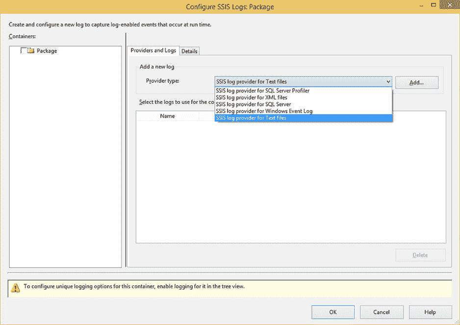
图 15-1. SSIS 日志记录菜单

当包运行时，`Integration Services` 会创建一个新表（如果尚无可用表），并将日志信息存储在其中。表 `sysssislog` 包含了所有已记录事件的数据。

### 包日志报告

运行带有日志记录的包后，你会想知道发生了什么！包含你所需全部信息的表名为 `sysssislog`。默认情况下，它将在你在日志菜单中选择的连接管理器的服务器上的 `msdb` 数据库中创建；但是，你可以通过直接在连接管理器中指定数据库来更改它。

让我们通过运行以下 SQL 查询，查看运行包后表中的数据：

```sql
select * from msdb.dbo.sysssislog
```

此语句返回的结果类似于图 15-2。

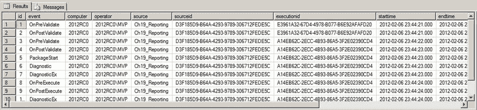
图 15-2. 来自 SSIS 日志表的结果

#### 设计模式：包执行情况

虽然可以直接使用表中的信息，但你也可以组合这些信息使其更具可读性。如果你想查看包的执行情况以及每个包运行了多长时间，可以使用清单 15-1 中的查询：

**清单 15-1**. 返回包持续时间的查询

```sql
select ssis.source
        , min(starttime) as package_start
        , max(endtime) as package_end
        ,DATEDIFF(ms, min(starttime), max(endtime)) as duration_ms
from msdb.dbo.sysssislog ssis
where event in ('PackageStart', 'PackageEnd')
group by ssis.source, ssis.executionid
```

### 目录日志记录与报告

目录日志记录和报告方法是在 `Integration Services 2012` 中引入的，如果可用，它是最好的日志记录方法。仅当你设置了项目部署模型类型时才能使用它。这种日志记录方法的优点是，你无需在包中准备任何内容即可使用它。让我们直接深入了解如何设置日志记录以及用于报告该数据的设计模式。

#### 设置目录日志记录

如前所述，目录日志记录的好处是，你根本无需修改包即可使用日志输出。你唯一需要做的准备工作是确保你的包设置为项目部署类型，并将包部署到 SSIS 目录。

要开始设置目录日志记录和报告，你需要创建一个 SSIS 目录。你可以通过连接到数据库实例来完成此操作。如果安装了 `Integration Services`，你将看到一个名为 `Integration Services 目录` 的节点。如果你创建一个名为 `SSISDB` 的新目录，它将看起来像图 15-3。

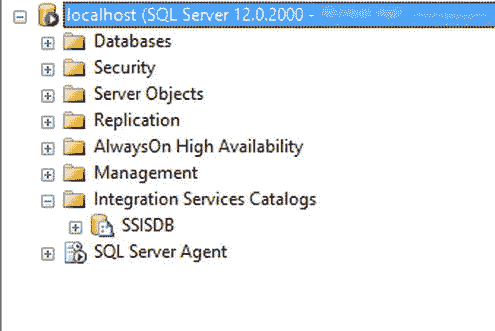
图 15-3. SSISDB 目录

此时，你已准备好部署你的包。不过，首先你应该确保项目设置为使用项目部署模型。你可以通过右键单击项目来完成此操作。如果你看到 `转换为包部署模型` 的选项，如图 15-4 所示，那么你就处于此模式。

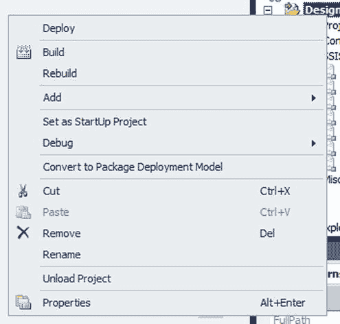
图 15-4. 处于项目部署模式的项目

最后，你将包部署到 SSIS 目录。这会将包存储在 `SSISDB` 数据库中，并允许进行一些默认的和可配置的日志记录。

接下来，我们将查看存储两种类型日志信息的表。

#### 目录表

当包运行时，所有信息都存储在部署 `Integration Services` 包的同一服务器上的 `SSISDB` 数据库中的一组表中。虽然存在一系列内部表，但你的大多数报告将从目录视图生成。图 15-5 显示了 SSIS 内部表的数据库关系图，而图 15-6 显示了 SSIS 目录视图的列表。

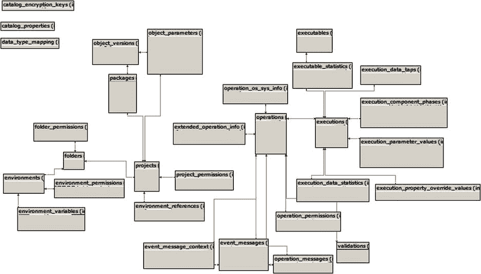
图 15-5. SSIS 目录内部表

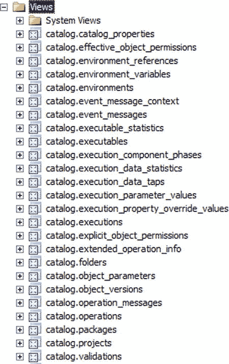
图 15-6. SSIS 目录视图

### 事后更改日志级别

即使在包已部署到 `Integration Services` 服务器后，你也可以更改发生的日志记录数量。但为什么你想这样做呢？如果你最初设置包时定义了一组日志事件，你将只能看到该数据集。然而，如果你正在进行更高级别的故障排除，或者有一个特定的错误需要追踪，你可能希望包含更多事件。另一方面，你可能希望通过减少记录的事件数量来提高包的性能。

修改包级别的日志记录并非最佳实践。即使是更改最轻微的项，打开包也会增加发生破坏性更改的风险，无论是由于输入错误值还是选择了不可用的日志记录选项。在某些组织中，在包级别对日志记录进行的修改甚至可能导致包必须再次经历变更控制过程。理想情况下，你希望在完全不接触包的情况下，在外部位置进行日志记录更改。

在 `Integration Services 2012` 中，你可以从四种不同的日志记录级别中选择，如表 15-1 所述。

**表 15-1**. SSIS 日志记录级别

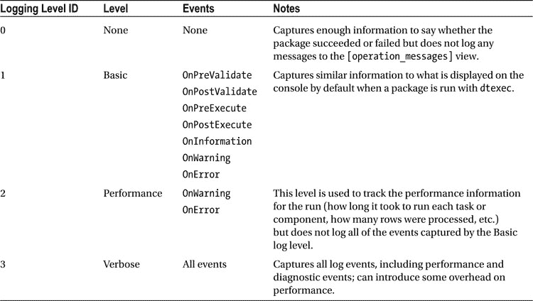

#### 设计模式

现在你知道如何设置和记录信息了，让我们逐步了解以下设计模式：

1.  更改日志级别
2.  使用现有报告
3.


### 更改日志记录级别

现在你已经了解了不同的日志记录级别以及各自的使用场景，接下来让我们逐步讲解如何更改日志记录级别。你可以通过以下两种方式之一来完成此操作：通过执行界面或通过命令行执行。

要通过执行界面修改日志记录级别，你需要连接到 Integration Services 目录，右键单击所需的包，然后选择**执行**。在“执行包”屏幕上，你将在“高级”选项卡上看到“日志记录级别”选项。默认情况下，该选项设置为“基本”，如图 15-7 所示。或者，你可以将此值更改为另一个日志记录级别，以便在日志表中查看更多或更少的信息。

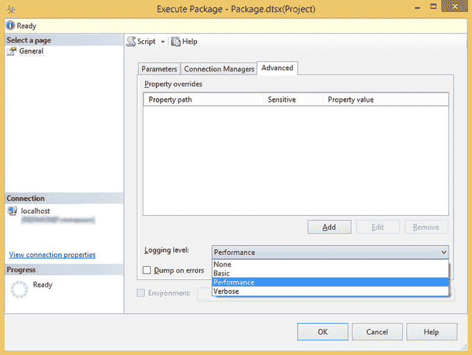

图 15-7. 执行包屏幕

另一种方法是通过命令行修改日志记录。所有包都可以通过命令行执行，并且你可以设置与单个执行关联的日志记录级别。

> **注意** 与管理 Integration Services 包相关的许多功能都可以通过命令行界面访问。使用命令行，你可以将 Integration Services 管理与其他维护任务集成。

运行清单 15-2 中的代码，将新执行的日志记录级别更改为记录所有详细记录。

### 清单 15-2. 修改执行日志记录级别的语句

```sql
DECLARE @execution_id INT
EXECUTE [catalog].[create_execution]
    @folder_name = 'DesignPatterns'
    ,@project_name = 'DesignPatterns'
    ,@package_name = 'Ch15_Reporting.dtsx'
    ,@reference_id = null
    ,@use32bitruntime = false
    ,@execution_id = @execution_id OUTPUT

EXECUTE [catalog].[set_execution_parameter_value]
    @execution_id
    ,@object_type = 50
    ,@parameter_name = 'LOGGING_LEVEL'
    ,@parameter_value = 3 --Verbose

EXECUTE [catalog].[start_execution]
    @execution_id
```

完成此操作后，你可以通过运行清单 15-3 中的查询，查看新设置的日志记录级别产生的输出。

### 清单 15-3. 返回所有消息的查询

```sql
select *
from catalog.event_messages
where operation_id =
    (select max(execution_id) from catalog.executions)
```

### 使用现有报告

我们的下一个设计模式很重要：利用提供给你的资源。SSIS 目录中包含了使用我们刚才讨论的日志记录信息的报告。这些报告中的信息包含对你的所有包执行的深入视图。这些报告是一个很好的起点，你可以从中查看包何时运行、是否发生错误以及需要调查的潜在问题区域。

图 15-8 显示了所有可用的报告。你可以通过 Management Studio 界面和 Integration Services 目录节点访问所有报告。

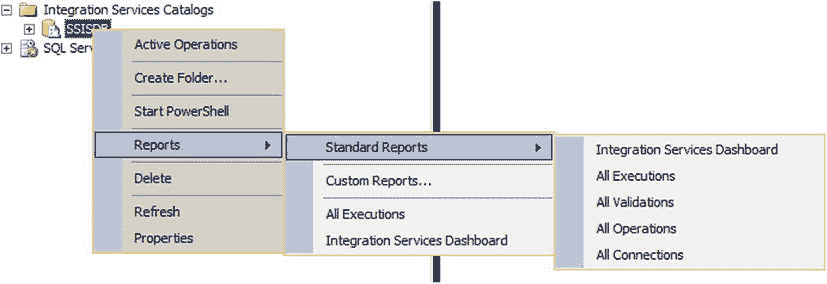

图 15-8. 可用的目录报告

如果你正在查看特定的执行，你总是希望从“概述”报告开始，该报告可以通过选择任何已提供报告上的“概述”链接来运行。实际上，通过界面执行完成后，系统会询问你是否要查看此报告。如果选择“是”，你将看到类似于图 15-9 的内容。

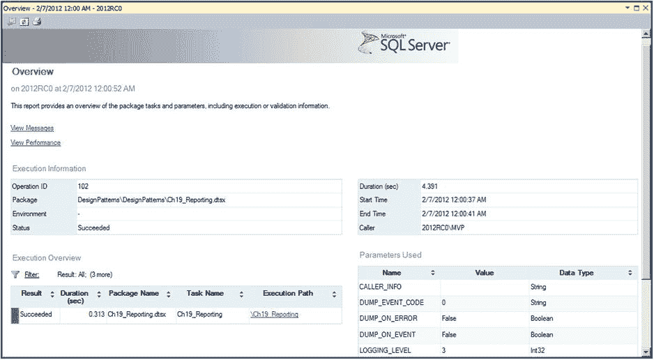

图 15-9. 概述报告

### 创建新报告

既然你已经看到了无需任何操作即可使用的报告，你可能对此非常满意。

如果不是，你可能希望更深入地挖掘数据。你可以通过查看前面描述的目录视图来创建新报告。你可能需要这样做的具体原因包括：

1.  查看运行时间最长的执行
2.  找出包失败的原因
3.  了解特定组件的内部工作原理

让我们从第一个原因开始。这个报告很有趣，因为它使用了主要的输出视图，但基于查询和转换，它变成了一个有用的小工具。清单 15-4 展示了列出过去一天内运行时间最长的五个包的查询。

### 清单 15-4. 查询运行时间最长的五个包

```sql
select top 5
    e.execution_id,
    e.package_name,
    DATEDIFF(ms, start_time, end_time) as duration_ms
from catalog.executions e
where e.start_time > DATEADD(dd, -1, getdate())
order by duration_ms desc
```

你可能需要新报告的第二个原因是查看包失败的原因。你将为此信息使用一个额外的视图，即 `catalog.event_messages` 视图。同时对 `executions` 和 `event_messages` 视图限制数据，将确保你只获取完全失败的包，并且只看到导致它们失败的事件。可以在清单 15-5 中看到此查询。

### 清单 15-5. 失败包查询

```sql
select
    e.execution_id,
    e.package_name,
    em.*
from catalog.executions e
inner join catalog.event_messages em
    on e.execution_id=em.operation_id
where e.status = 4
    and em.event_name = 'OnError'
```

最后一个原因是了解特定组件的内部工作原理。你可以查看数据流中每个组件执行期间发生的各个步骤。例如，清单 15-6 中的查询返回源、转换和目标执行过程中发生的每个步骤以及每个步骤花费的时间。

### 清单 15-6. 返回组件阶段和时间的查询

```sql
select
    subcomponent_name,
    phase,
    DATEDIFF(ms, start_time, end_time) as duration_ms
from catalog.execution_component_phases
where package_name = 'Ch16_Reporting.dtsx'
    and task_name = 'Data Flow Task'
```

一旦你得到了所需的查询，你可以直接从 Management Studio 运行它，或者将其嵌入到 Reporting Services 报告中，使其看起来像解决方案中的标准报告。要通过 Management Studio 制作报告，你可以将文件夹存储在本地“文档”文件夹中，路径结构为 `SQL Server Management Studio\Custom Reports`。要访问它们，然后你可以在 Integration Services 节点上的“报告”菜单下选择“自定义报告”选项，如图 15-10 所示。

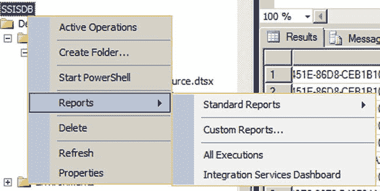

图 15-10. 自定义报告的选择

### 总结

本章讨论了监控 Integration Services 包的多种方法。无论你使用的是工具的旧版本还是最新最强大的版本，通过遵循此处描述的设计模式，你都能够理解包的内部工作原理。关于包日志记录和报告以及目录日志记录和报告的讨论，向你展示了如何修改所记录的事件类型以及如何检索这些信息。

