# 第 16 章 父子模式

在早期版本的 Integration Services 中，数据移动平台不包括管理框架，该框架是 Integration Services 包的执行、日志记录和部署的实现。为了填补这一空白，开发人员创建了自己的管理框架以在他们的组织中使用。


### SSIS 中的父子模式与管理框架

### 引言

与任何自定义解决方案一样，开发人员发现当新版本或新包引入系统时，管理框架需要维护和升级。

之前的章节涵盖了 ETL 工具化，重点关注元数据收集和验证。我们讨论的元数据包括管理包所需的关键信息。本章将介绍**父子模式**，即一个 Integration Services 包可以从其自身执行中调用另一个包。这些模式是实现 ETL 框架的关键部分。

Integration Services 2014 包含其自身的管理框架，其中包括通过 SSIS 目录进行的日志记录和执行。在本章及后续章节中，我们将向您展示如何使用可用的框架并对其进行增强，以在解决我们讨论的问题的同时提供更多信息。

本章我们将介绍以下三种父子模式：

*   主包模式
*   动态子包模式
*   子包到父包变量模式

使用这些模式，您可以实现开箱即用的 Integration Services 管理功能。

### 主包模式

在设置框架时，您首先要做的事情之一是找到一种方法来组织包的执行方式。您的组织方式可以包括并行与串行处理、条件执行和分类批处理。尽管您可以让其中一些组织工作发生在作业调度器（如 SQL Server Agent 或 Tivoli）中，但如果能在您已经熟悉的环境中管理包的执行，岂不是更容易？

幸运的是，Integration Services 已经提供了这种能力！通过使用工作流设计器和“执行包任务”，您可以执行其他包，从而创建父子包关系。当您使用父子关系来执行一系列包时，这被称为主包。您需要完成两个步骤来为您的主包设置一个子包：

1.  指定子包。
2.  配置参数绑定。

#### 指定子包

创建初始包后，首先使用 SSIS 工具箱中的“执行包任务”。将该任务拖到控制流中，然后打开任务以查看可以修改的多个菜单。让我们从配置“包”页面开始，如**图 16-1**所示。

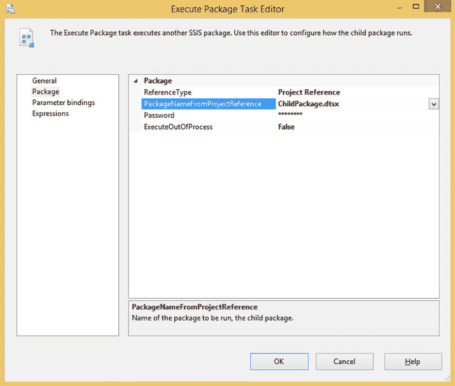

**图 16-1.** 执行包任务编辑器 - 包页面

这是您设置要执行的包的地方。“执行包任务”的一个新增功能是`ReferenceType`属性，它使开发人员能够使用主包来运行包含在当前项目中的包或项目外部的包。在此示例中，您将使用解决方案中的现有包。

此时，您可以单击“确定”按钮，从而获得一个完全可接受的主包。但在这样做之前，您应该深入了解一下如何使用下一个菜单“参数绑定”在包之间传递信息。

#### 配置参数绑定

仅仅调用子包并不那么令人兴奋。真正令人兴奋的是将子包与主包正在执行的操作联系起来！您可以通过父包参数来实现这一点。此选项仅在您使用与主包相同项目的子包时才可用。完成包参数的设置后，您应该看到如**图 16-2**所示的屏幕。

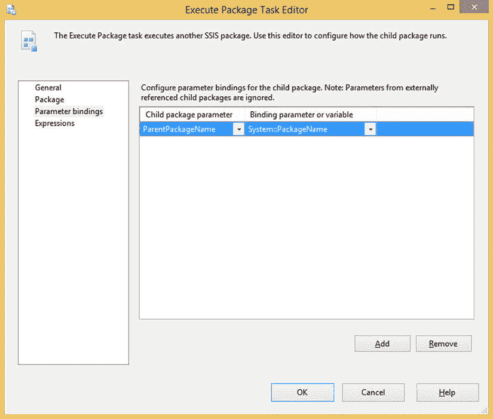

**图 16-2.** 执行包任务编辑器 - 参数绑定页面

要实现**图 16-2**所示的结果，您需要查看“执行包任务编辑器”并转到“参数绑定”页面。单击“添加”按钮以设置参数。对于“子包参数”，您可以选择一个已创建的参数，或者在您尚未创建子包参数的情况下添加自己的参数。请记住，这不会在子包中自动创建变量。这取决于您！接下来，您将分配来自主包的参数或变量以存储到子参数中。在**图 16-2**所示的场景中，我们将父包的名称存储在子包的一个参数中，然后我们可以使用该参数来记录调用子包的包。

如果您想测试该包，可以使用**清单 16-1**中所示的代码在子包中创建一个“脚本任务”。确保将`$Package::ParentPackageName`参数放入`ReadOnlyVariables`属性中。如果所有映射都正确，当您运行包时，您应该会在消息框中看到父包的名称，如**图 16-3**所示。

**清单 16-1.** 用于显示父包名称的 Visual Basic 代码

```vb
Public Sub Main()
    MsgBox("The name of the parent package is: " &
          Dts.Variables("$Package::ParentPackageName").Value.ToString)
    Dts.TaskResult = ScriptResults.Success
End Sub
```

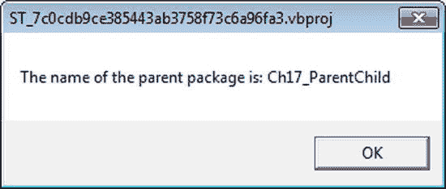

**图 16-3.** 显示父包名称的消息框

现在您已经有一个可工作的父子包，让我们通过创建一个动态子包将其提升到一个新的水平。

### 动态子包模式

Integration Services 的亮点之一是它提供的灵活性，如果您想做一些不同的事情。例如，如果您不确定具体需要运行哪些包，您可以创建一个具有动态子包的主包，该子包将仅执行所需的包。如果您有一系列文件传入，但不确定哪些文件在特定时间传入，这是一个很好的主意。您的最终目标是创建一个看起来像**图 16-4**的包。让我们通过一个示例来创建主包和您希望执行的动态包列表。

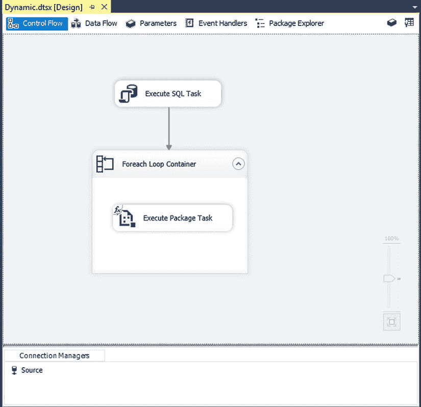

**图 16-4.** 已完成的动态子包模式包

要创建包含包名称的表，请运行**清单 16-2**中找到的`CREATE`和`INSERT`语句。您可以创建一个名为`DesignPatterns`的数据库，或者修改脚本以针对您拥有并可用于实验的其他数据库运行。

**清单 16-2.** 用于创建和填充包列表表的 T-SQL 代码

```sql
USE [DesignPatterns]
GO

CREATE TABLE [dbo].PackageList NULL
)
GO

INSERT INTO [dbo].[PackageList] ([ChildPackageName])
     VALUES ('ChildPackage.dtsx')
GO

INSERT INTO [dbo].[PackageList] ([ChildPackageName])
     VALUES ('ChildPackage2.dtsx')
GO
```

现在您将创建主包。从一个空白的 SSIS 包开始，创建一个作用域为包级别的变量。（在本章的示例中，SSIS 包名为`Dynamic.dtsx`）。该变量应命名为`packageListObject`，数据类型为`Object`。您不需要为该变量提供值。其次，添加另一个同样作用域为包级别的变量，命名为`packageName`，数据类型为`String`。将此变量的值设置为项目中某个包的名称（例如`ChildPackage.dtsx`）。


### 动态包执行模式

dtsx`），以便用于设计时配置。接下来，在控制流中添加一个“执行 SQL 任务”。使用`清单 16-3`中所示的针对您刚刚为表创建的数据库执行查询的“执行 SQL 任务”。（提示：您需要一个名为`Source`的连接管理器，该管理器指向`DesignPatterns`数据库）。

**清单 16-3**。查询包列表表的 T-SQL 代码

```
SELECT [ChildPackageName] FROM [dbo].[PackageList]
```

除了 SQL 查询外，还需确保`ResultSet`属性设置为返回完整结果集，并将其存储到您刚刚创建的名为`packageListObject`的变量中。此属性页可在`图 16-5`中查看。

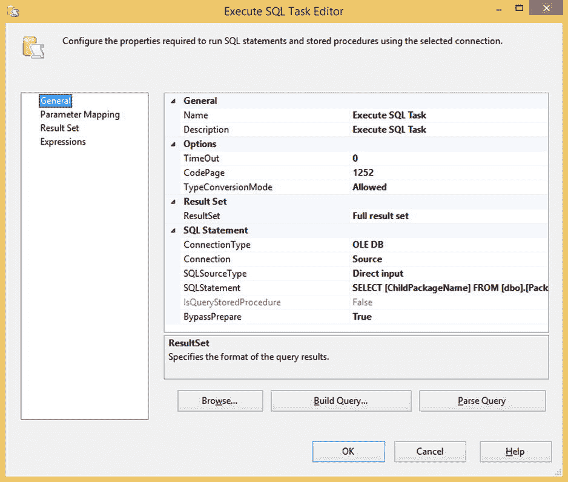
**图 16-5**。执行 SQL 任务编辑器常规页

将一个 ForEach 循环容器附加到执行 SQL 任务上。这将是您执行包的地方。在 ForEach 循环容器的“集合”页中，将枚举器设置为使用 Foreach ADO 枚举器，它将循环遍历变量对象。ADO 对象源变量字段应包含`@[User::packageListObject]`。此屏幕可在`图 16-6`中查看。

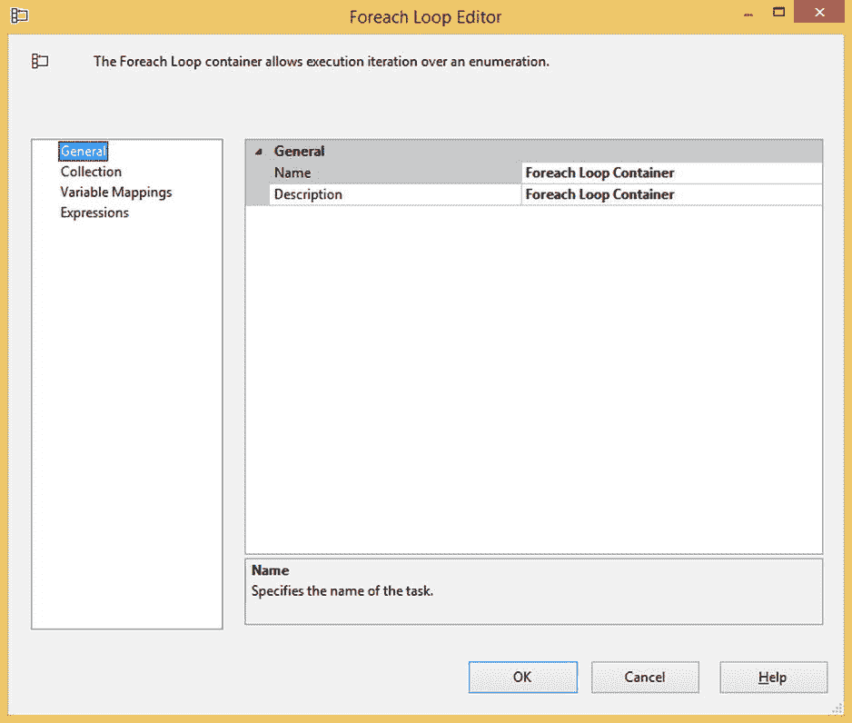
**图 16-6**。枚举`packageListObject`变量中每一行的 Foreach 循环编辑器常规页

然后，您需要告诉 Integration Services 如何处理它在枚举对象列表时检索到的值。在“变量映射”页，将变量设置为`@[User::packageName]`，索引设置为 0。这将把每个值放入变量中。

最后，您到了可以添加执行包部分的环节。与创建主-子包类似，您需要使用“执行包任务”。首先将`DelayValidation`属性设置为`True`，这允许您在运行时决定运行哪个包。

无需重复在主-子包中执行的相同步骤，直接转到“执行包任务编辑器”中的“表达式”页。这是您设置包动态部分的地方。将`PackageName`属性设置为使用表达式`@[User::packageName]`。最终的“表达式”页应如`图 16-7`所示。

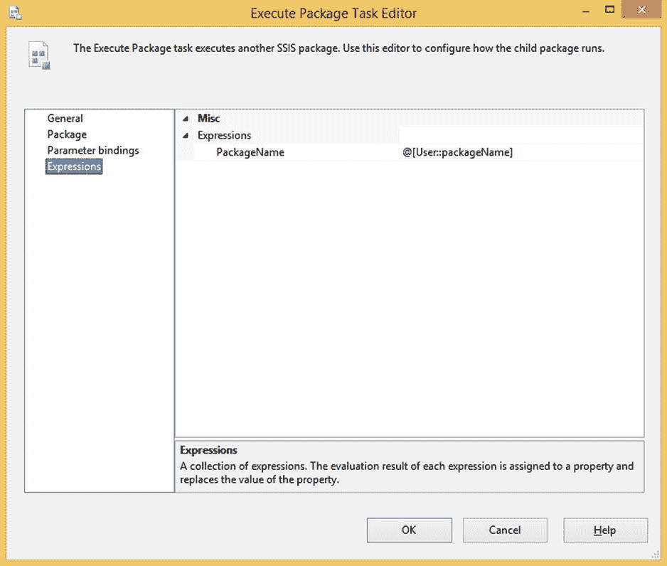
**图 16-7**。执行包任务编辑器表达式页

当包运行时，它将循环遍历`PackageList`表中的每一行；将执行 SQL 任务的`PackageName`属性设置为当前行，并仅执行您需要的包。请记住，除非您创建多个循环并专门编写主包代码来处理并行性，否则它总是会串行运行子包。

接下来，我们将描述在“子到父变量模式”中，子包如何将信息发送回父包。

### 子到父变量模式

父-子模式是管理框架的重要组成部分。例如，您可以使用主包模式将类似的包分组在一起，并确保它们按正确的顺序执行。您还可以使用动态子包模式来运行可变数量的包。为了确保存储所有这些信息，在包之间传递重要信息至关重要，不仅从父到子，也要从子到父。虽然此功能并不广为人知，但使用脚本任务是可以实现的。让我们使用您现有的包来演示如何将文件名从子包传递到其父包。

第一步是在父包中创建一个变量。

在此示例场景中，您将创建一个名为`ChildFileName`的字符串数据类型变量，其作用域为包级别。在您先前在本章创建的执行包任务上，您将添加一个脚本任务。将`ChildFileName`变量添加为`ReadOnly`变量，并将`清单 16-4`中的代码添加到 Visual Basic 脚本中。

**清单 16-4**。显示子文件名的 Visual Basic 脚本

```
Public Sub Main()
    MsgBox("The name of the child file is: " & _
          Dts.Variables("User::ChildFileName").Value.ToString)
    Dts.TaskResult = ScriptResults.Success
End Sub
```

接下来，修改您的子包。在脚本任务中，将变量`User::ChildFileName`添加到`ReadWriteVariables`属性列表中。您必须手动键入此内容，因为它不会显示在菜单中。因此，完整的只读变量列表显示为：

```
$Package::ParentPackageName,User::ChildFileName
```

然后将`清单 16-5`中的一行代码添加到 Visual Basic 脚本任务中。

**清单 16-5**。设置子文件名值的 Visual Basic 脚本

```
Dts.Variables("User::ChildFileName").Value = "SalesFile.txt"
```

运行后，包将完成，效果如`图 16-8`所示。

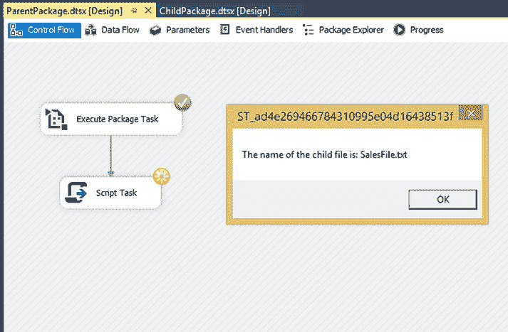
**图 16-8**。子到父变量模式执行

变量值从子到父的传递之所以成功，是因为 Integration Services 中容器的工作方式。在包内部，任何子容器（如 Sequence 容器）都可以访问其父容器的属性。同样，任何子任务（如执行 SQL 任务）都可以访问其父容器的属性。这种范式允许您使用变量和属性，而无需为包中的每个对象重新创建它们。当您使用“执行包任务”添加子包时，您就在父-子层次结构中添加了另一个层级，并允许子包设置父包的变量。

### 结论

当 Integration Services 作为 SQL Server 2005 的一部分首次推出时，各地的 SQL Server 爱好者都欣然接受了它。最新版的 Integration Services 经过增强，让 ETL 开发人员比以前更加兴奋。如本章所讨论的，Integration Services 2012 增加了管理框架的基础和创建父-子关系的能力。我们还讨论了主包模式和管理框架。

### 第 17 章：配置

SQL Server 2012 为 SSIS 引入了一种新的、基于参数的配置模型。这个新模型旨在简化配置过程，并使用户更容易在运行时识别值的来源。尽管 2005/2008 样式的包配置在 SQL Server 2012 和 SQL Server 2014 中仍受支持，但两种配置模型并不旨在混合使用。事实上，使用它们的菜单选项仅在您使用文件部署模型以及包是从早期版本升级而来时才会出现。在 SQL Server 2014 中创建的新包将默认使用新的参数模型。

本章描述了新的参数模型以及如何使用它在运行时配置包属性。我们将探讨参数如何在 SSIS 目录中公开，以及如何使用 Visual Studio 配置在构建过程中设置参数值作为构建过程的一部分。最后，我们将探讨可用于扩展内置参数模型提供的功能的模式，以实现动态的运行时配置。


### SSIS 参数概述

`SSIS` 参数允许包定义一个明确的契约，很像 `C#` 等编程语言中的函数参数。与包配置不同，参数对调用者（如 `SQL Server Agent` 或执行包任务）是公开的，因此用户能够准确看到包运行所需的内容。参数本质上是特殊命名空间中的只读包变量。它们遵循与包变量相同的类型系统，并会出现在变量出现的所有用户界面中（例如，用于设置属性表达式）。你将通过表达式或在脚本任务中读取来使用参数值。参数值在包执行开始之前设置，并且在包运行时无法更改。

参数可以在包级别和项目级别定义。包级别参数仅对该包内的任务和组件可见——很像包变量。包参数在 `$Package` 命名空间中定义。在项目级别定义的参数是全局的——项目中的所有包都可以使用它们。项目参数在 `$Project` 命名空间中定义。

图 17-1 显示了 `SQL Server Data Tools for Business Intelligence` (`SSDT-BI`) 中新的“参数”选项卡，该选项卡显示在包级别定义的参数。除了在包变量上可以找到的标准属性（如 `Name`、`Type` 和 `Value`）之外，“参数”选项卡还公开了三个新属性：`Description`、`Sensitive` 和 `Required`。

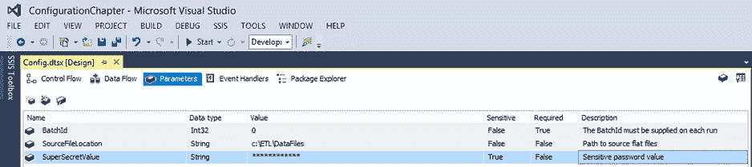
图 17-1。包级别参数在 `SSDT-BI` 中有自己的选项卡上创建和显示

`Description` 字段为 `SSIS` 包开发人员提供了一种便捷的方式来记录其包的参数。建议你为参数提供描述，特别是在运行或配置包的人与开发包的人不是同一个人的情况下。

如果一个参数被标记为 `Sensitive`，其值将在包中以加密格式存储（或者根本不存储，具体取决于包的 `ProtectionLevel` 设置）。其值在用户界面中显示时也会被屏蔽，并且不会出现在执行日志中。敏感参数只能用于标记为 `Sensitive` 的属性的表达式中（例如连接管理器的 `Password` 属性）。敏感参数值也可以通过 `Variable.GetSensitiveValue()` 方法在脚本任务或脚本组件中检索。

标记为 `Required` 的参数必须在运行时指定其值。所有参数（和变量）在设计时都需要设置值以用于验证。必需参数在包运行时不会使用此设计时值——必须由调用者（即 `SQL Server Agent` 或父执行包任务）指定一个新值。如果参数的 `Required` 属性设置为 `False`，则该参数变为可选——如果没有提供其他值，则将使用其设计时值。没有逻辑默认值（如 `BatchID` 或输入文件路径）的参数应标记为 `Required`。

项目级别参数可以通过访问解决方案资源管理器中的新节点找到（如图 17-2 所示）。项目参数出现在它们自己的节点中，因为它们存储在解决方案目录中的一个单独文件 (`Project.params`) 中。双击此节点会打开与包参数相同使用的参数设计器，具有所有相同的属性和选项。

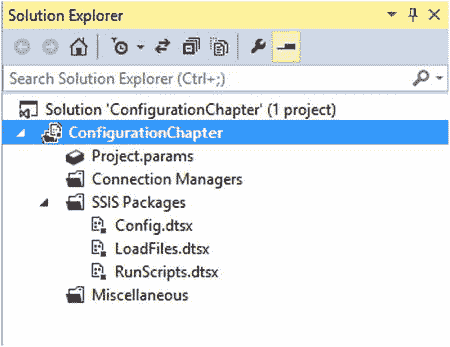
图 17-2。项目级别参数可以在解决方案资源管理器中的 `Project.params` 节点中找到

### 使用参数配置你的包

参数值通过 `SSIS` 表达式在你的包中使用。表达式可以设置在大多数任务属性、变量以及数据流任务中的某些组件属性上。要在任务上设置表达式，请单击任务“属性”窗口中表达式的属性，打开“属性表达式编辑器”对话框（如图 17-3 所示）。

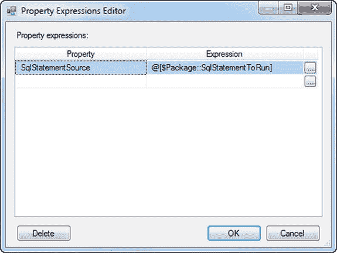
图 17-3。“属性表达式编辑器”对话框显示所有设置了表达式的属性

表达式可以直接从“变量”窗口设置在变量上（如图 17-4 所示）。在 `SQL Server 2012` 中，向变量添加表达式会自动将其 `EvaluateAsExpression` 属性设置为 `True`——在产品的早期版本中，你必须自己执行此步骤。你可以通过将此属性设置回 `False` 来禁用变量的表达式求值。

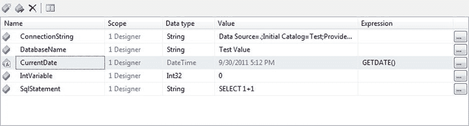
图 17-4。在 `SQL Server 2012` 中，表达式可以直接从“变量”窗口设置。设置了表达式的变量会显示一个特殊图标

图 17-4 还展示了 `SQL Server 2012` 中的一项新功能——表达式修饰器。如果任务的任何属性通过表达式设置，任务、连接管理器和变量的图标将会改变，为开发人员提供了一种视觉方式来识别包的哪些部分是动态设置的。

为数据流组件设置表达式不如为任务设置那么直接。主要区别在于表达式是设置在数据流任务本身上，并且并非所有组件属性都是可表达的。图 17-5 展示了查找转换上的可表达属性如何“冒泡”并显示为数据流任务的属性。

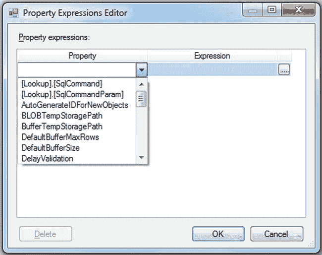
图 17-5。可表达的数据流组件属性将显示为数据流任务上的属性

包和项目级别的参数将出现在显示可用变量列表的所有用户界面中。在“表达式生成器”对话框（图 17-6）中，所有参数都显示在“变量和参数”文件夹下。

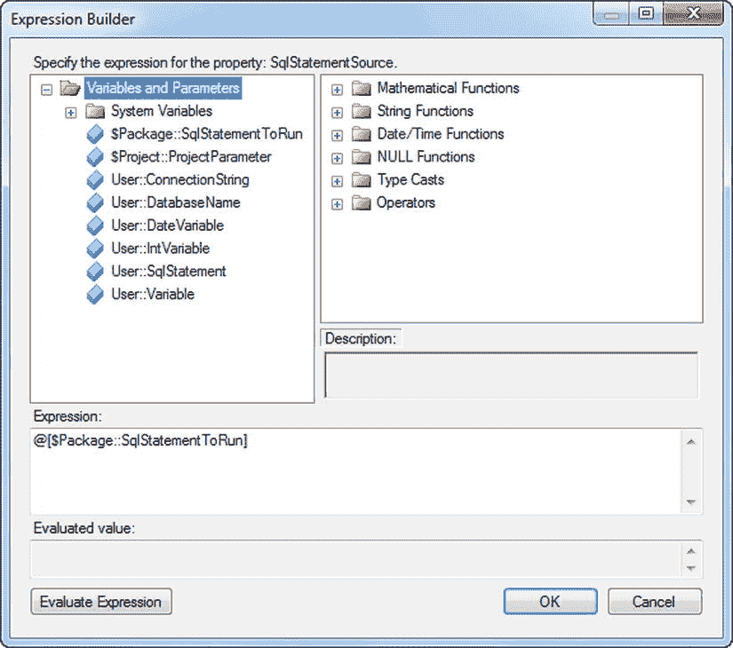
图 17-6。参数与变量一起出现在“表达式生成器”对话框中

某些任务和数据流组件能够不使用表达式就利用变量和参数值。例如，`OLE DB` 源提供了一种“来自变量的 `SQL` 命令”数据访问模式，允许你从变量设置源查询。对于所有此类属性，可以使用参数代替变量。

### 使用参数化对话框

`SSIS` 提供了一个参数化用户界面（如图 17-7 所示），它充当在你的包中使用参数的快捷方式。从这个界面，你可以创建一个新参数或使用一个已经存在的参数。要启动参数化界面，请右键单击任务、容器或控制流，然后从上下文菜单中选择“参数化”。当你单击“确定”时，`SSIS` 将自动向所选属性添加一个表达式。

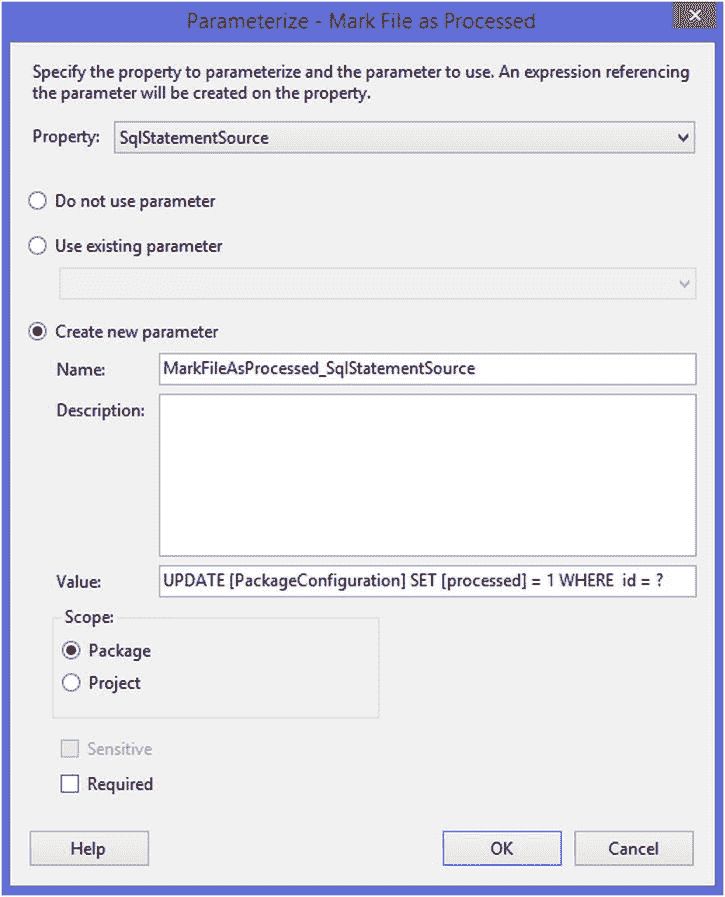
图 17-7。参数化界面是在你的包中使用参数的快捷方式

### 创建 Visual Studio 配置

你可以使用 `Visual Studio` 配置在 `SSDT-BI` 中创建多组参数值。


### Visual Studio 配置与 SSIS 包管理

在开发过程中，切换配置可以轻松地更改参数值，并允许你构建具有不同默认参数值的多个项目部署文件版本。Visual Studio 配置是开发人员在多开发者或团队环境中维护各自设置的一种方式。

当首次在 SSDT-BI 中创建项目时，会有一个名为 `Development` 的默认配置。你可以从“配置管理器”对话框（如图 17-8 所示）创建额外的配置。你可以从“标准”工具栏上的“解决方案配置”组合框，或者通过右键单击“解决方案资源管理器”中的项目节点，选择“属性”，然后单击“配置管理器”按钮来启动“配置管理器”对话框。要创建新配置，请从“活动解决方案配置”下拉列表中选择“<新建...>”选项。

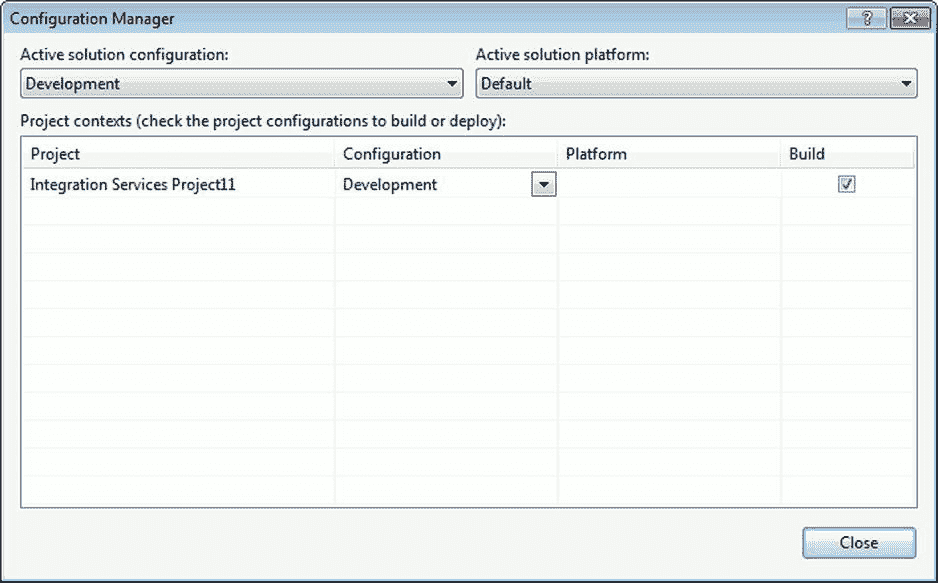

图 17-8. Visual Studio 配置可以通过“配置管理器”对话框进行管理

要向配置添加参数，请单击包“参数”选项卡上的“将参数添加到配置”按钮。图 17-9 显示了当向配置添加包参数时将显示的“管理参数值”对话框。单击“添加”按钮允许你选择一个参数——一旦添加了一个参数，它将出现在解决方案的所有配置中。“删除”按钮将从配置中删除所选参数（这意味着在设计时它总是具有相同的默认值）。“同步”按钮会将相同的值应用于所有配置——当你确定参数的默认值应在所有配置中更改时，请使用此按钮作为快捷方式。目前，你只能向 Visual Studio 配置添加包参数和项目参数，但它们是从不同的对话框配置的。要管理项目级参数，请从项目参数设计器 (`Project.params`) 中单击“将参数添加到配置”按钮。要使用 Visual Studio 配置管理连接管理器的设置，你首先需要将连接管理器参数化。共享连接管理器无法使用 Visual Studio 配置进行配置。

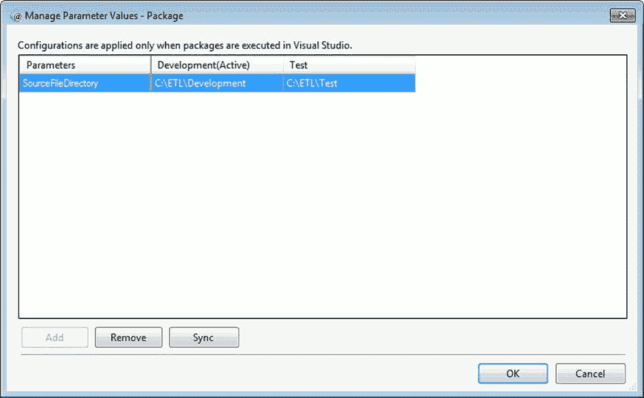

图 17-9. “管理参数值”对话框显示当前通过配置设置的所有参数

 **注意** 当参数由 Visual Studio 配置控制时，其值将保存到 Visual Studio 项目文件 (`.dtproj`) 中。在更新配置后务必保存项目文件，以确保不会丢失更改。

### 指定入口点包

SQL Server 2012 为 SSIS 引入了另一个新概念——`entry-point package`。此功能允许包开发人员指出应特别注意某些包。这在包含少量主包（这些主包运行许多子包）的项目中非常有用。请注意，未标记为入口点包的包仍可运行——该设置旨在为在 SSIS 目录中配置参数值的人员提供提示。SQL Server Management Studio (SSMS) 中的大多数 SSIS UI 都允许你快速过滤掉非入口点包上的参数，从而只查看需要设置的参数。

包默认标记为入口点。要删除此设置，请右键单击“解决方案资源管理器”中的包名称，并取消选择“入口点包”选项。

### 连接管理器

大多数连接管理器都需要某种形式的配置，在 SQL Server 2012 中，当通过 SSIS 目录运行包时，所有连接管理器属性都是可配置的。由于这些属性已经公开，在大多数情况下，你将不需要为连接管理器公开额外的参数。但是，你可能会遇到一些情况，其中参数化的连接管理器将是有益的。请注意，任何通过表达式设置的连接管理器属性都不会通过 SSIS 目录公开，这可以防止 DBA 意外覆盖在运行时设置的属性值。

 **注意** 在早期版本的 SQL Server Integration Services 中，子包通常使用父包的变量值来配置连接管理器。如果连接字符串是在运行时确定的，你可能希望在 SQL Server 2014 中保留此模式；然而，在许多情况下，你会希望改用共享连接管理器。

可以使用属性表达式在连接管理器上设置参数。通过表达式设置的最常见属性是 `ConnectionString`，因为许多连接管理器通过解析 `ConnectionString` 值来获取其属性。配置连接管理器时，请务必在 `ConnectionString` 或单个属性上设置表达式——无法保证表达式的解析顺序，并且在应用 `ConnectionString` 时某些属性可能会被覆盖。

要参数化共享连接管理器，请打开项目中的一个包，并右键单击设计图面“连接管理器”区域中共享连接管理器的名称。请注意，由于共享连接管理器是在项目级别声明的，因此你只能在共享连接管理器的任何属性表达式中使用项目级参数或静态字符串。表达式对话框不会为你提供使用包参数或变量的选项。

### 服务器上的参数配置

参数的设计目的是使调度和运行 SSIS 包的人员工作起来更轻松。在许多环境中，这通常是 DBA 或 IT 运维人员——而不是最初开发包的人员。通过包含参数的描述，ETL 开发人员可以创建自文档化的包，使配置包的人员能够非常容易地看到它运行所需的确切内容。

本节介绍如何通过 SSIS 目录配置包以及如何通过 SSMS 公开参数。它涵盖了项目部署后如何设置默认参数值、各种包执行选项，以及 SQL Server 2012 中内置的报告功能如何更轻松地确定包运行时设置的精确配置值。

#### 默认配置

所有参数和连接管理器的默认值在构建时保存在 SSIS 项目部署文件 (`.ispac`) 中。一旦项目部署到 SSIS 目录，这些就成为项目的默认值。要更改默认配置，请在 SSMS 对象资源管理器中右键单击项目名称（或单个包名称）并选择“配置”（如图 17-10 所示）。

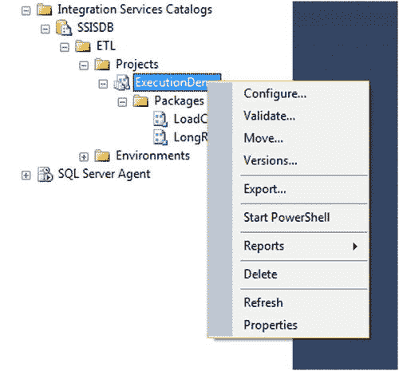

图 17-10. 项目部署后，可以通过 SSMS 更改项目的默认配置

图 17-11 显示了 SSMS 中的参数配置对话框。通过此对话框，你可以为此项目内的所有包设置所有参数和连接管理器属性的默认值。“范围”下拉列表允许你筛选参数和连接管理器的视图。


默认视图将仅显示入口点包，但您也可以查看单个包以及整个项目的参数。要更改参数或连接管理器属性的值，请单击行末尾的省略号按钮。更改值时，您将有三个选项：使用项目默认值、设置字面值或使用服务器环境变量。有关环境的更多信息，请参阅下一节。

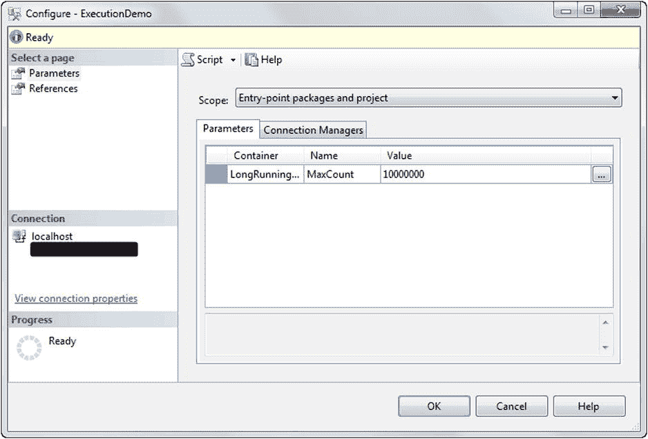

#### 图 17-11. 参数配置对话框

### 服务器环境

服务器环境包含一组变量——本质上是名称-值对——您可以将它们映射到项目中的参数和连接管理器属性。当您通过 `SSIS 目录` 运行包时，可以选择一个环境来运行它。当一个值映射到服务器环境变量时，其值将由其当前运行的运行环境决定。

在将值映射到服务器环境变量之前，必须先将环境与项目关联。图 17-12 显示了项目配置对话框的“引用”页面，该页面允许您将项目与一个或多个环境关联。

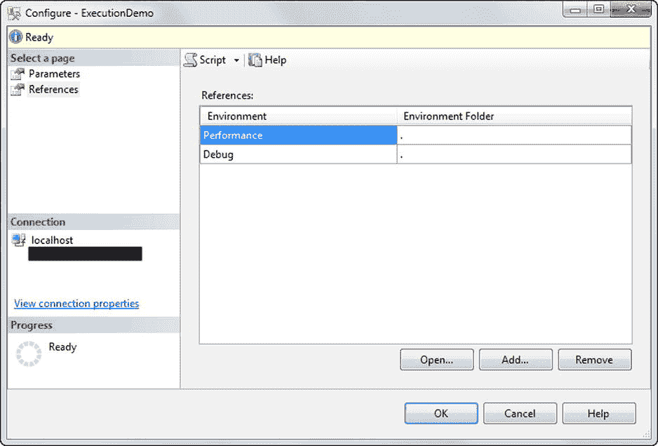

#### 图 17-12. 配置对话框的“引用”页面允许您将项目与环境关联

与项目类似，环境也包含在 `SSIS 目录` 中的一个文件夹内。项目可以引用目录中任何文件夹中的环境——引用不限于当前文件夹。如果您计划在项目中使用环境，可以考虑创建一个单独的文件夹作为存储所有公共环境的区域。

环境支持行级安全性。与项目和文件夹类似，您可以配置哪些用户或角色有权访问单个环境。用户将无法看到他们无权访问的环境。

一旦项目与一个或多个服务器环境关联，您就能够将参数和连接管理器的值映射到这些环境中包含的变量。

 `注意` 环境可以包含任意数量的服务器变量，并且两个环境可能不包含同名的变量。如果参数或连接管理器的值映射到一个服务器变量，那么在您选择要运行包的环境时，只有包含该名称变量（且数据类型匹配！）的环境才可用。

### 使用 T-SQL 设置默认参数值

默认参数值和连接管理器属性可以通过 `SSIS 目录` 的 `T-SQL` API 进行设置。这使得 `DBA` 能够在部署后或项目移动到新的 `SSIS 目录` 后自动设置参数值。创建脚本的一种简单方法是通过参数配置 `UI` 进行更改，然后单击 `脚本` 按钮。清单 17-1 展示了用于为两个项目设置默认值的 `T-SQL`：一个包参数 (`MaxCount`) 被设置为 `100`，一个连接管理器属性 (`CM.SourceFile.ConnectionString`) 被设置为 `'C:\Demos\Data\RaggedRight.txt'`。

#### ***清单 17-1***. 使用 T-SQL 设置参数值

```sql
DECLARE @var sql_variant = N'C:\Demos\Data\RaggedRight.txt'
EXEC [SSISDB].[catalog].[set_object_parameter_value]
        @object_type=20,
        @parameter_name=N'CM.SourceFile.ConnectionString',
        @object_name=N'ExecutionDemo',
        @folder_name=N'ETL',
        @project_name=N'ExecutionDemo',
        @value_type=V,
        @parameter_value=@var
GO

DECLARE @var bigint = 100
EXEC [SSISDB].[catalog].[set_object_parameter_value]
        @object_type=30,
        @parameter_name=N'MaxCount',
        @object_name=N'LongRunning.dtsx',
        @folder_name=N'ETL',
        @project_name=N'ExecutionDemo',
        @value_type=V,
        @parameter_value=@var
GO
```

 `注意` 有关更多信息，请参阅 SQL Server 联机丛书中关于 `set_object_parameter_value` 存储过程的条目：`http://msdn.microsoft.com/en-us/library/ff878162(sql.110).aspx`。

### 通过 SSIS 目录执行包

执行包时，可以覆盖参数和连接管理器属性的默认值。`SSMS` 中的执行包 `UI`（如图 17-13 所示）允许您为该特定包执行指定要使用的值。项目和包级别的参数显示在“参数”选项卡上，共享连接管理器和包级别的连接管理器显示在“连接管理器”选项卡上。“高级”选项卡允许您覆盖未作为参数公开的属性值。此功能（称为属性覆盖）允许 `DBA` 快速配置包内值的更改，而无需重新部署整个项目。该功能类似于使用 `DTEXEC` 实用程序的 `/Set` 命令行选项。

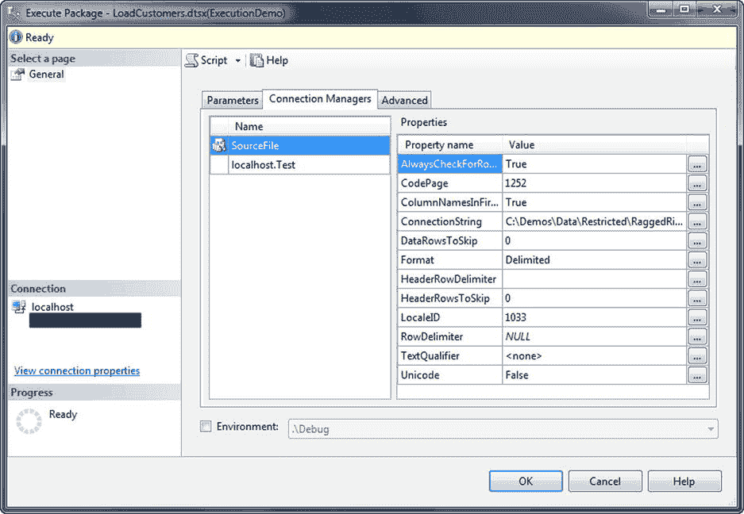

#### 图 17-13. 通过 SSMS 进行交互式包执行

执行包 `UI` 还有一个 `脚本` 菜单，允许您将创建包执行的操作脚本化为 `T-SQL`。清单 17-2 提供了一个创建新包执行并覆盖多项设置的示例。此过程涉及多个步骤：

1.  使用 `[catalog].[create_execution]` 创建新的执行实例。
2.  使用 `[catalog].[set_execution_parameter_value]` 覆盖参数或连接管理器值。
3.  使用 `[catalog].[set_execution_property_override_value]` 设置属性覆盖。
4.  使用 `[catalog].[start_execution]` 启动包执行。

#### ***清单 17-2***. 使用 T-SQL 运行包

```sql
-- 创建包执行
DECLARE @exec_id bigint
EXEC [SSISDB].[catalog].[create_execution]
        @execution_id=@exec_id OUTPUT,
        @package_name=N'LoadCustomers.dtsx',
        @folder_name=N'ETL',
        @project_name=N'ExecutionDemo',
        @use32bitruntime=0

-- 为 SourceFile 连接管理器的 AlwaysCheckForRowDelimiters 属性设置新值
EXEC [SSISDB].[catalog].[set_execution_parameter_value]
        @execution_id=@exec_id,
        @object_type=20,
        @parameter_name=N'CM.SourceFile.AlwaysCheckForRowDelimiters',
        @parameter_value=0

-- 设置此执行的日志记录级别
EXEC [SSISDB].[catalog].[set_execution_parameter_value]
        @execution_id=@exec_id,
        @object_type=50,
        @parameter_name=N'LOGGING_LEVEL',
        @parameter_value=1

-- 为 MaxConcurrentExecutables 属性创建属性覆盖
EXEC [SSISDB].[catalog].[set_execution_property_override_value]
        @execution_id=@exec_id,
        @property_path=N'\Package.Properties[MaxConcurrentExecutables]',
        @property_value=N'1',
        @sensitive=0

-- 启动包执行
EXEC [SSISDB].[catalog].[start_execution] @exec_id

-- 返回执行 ID
SELECT @exec_id
GO
```

`SQL Server 代理` 中的 `Integration Services` 作业步骤在 `SQL Server 2012` 中得到了增强，以支持运行存储在 `SSIS 目录` 中的包。其用户界面与通过 `SSMS` 交互式运行包时相同，并提供相同的配置选项。或者，您可以使用 `T-SQL` 作业步骤运行 `SSIS` 包。但是，由于此步骤不支持使用代理账户，您将只能以 `SQL Server 代理` 服务账户的身份运行包。


### 使用 DTEXEC 的参数

用于运行 SSIS 包的命令行实用工具 (`DTEXEC`) 已更新，以支持项目和参数。`DTEXEC` 能够运行存储在 SSIS 项目文件 (`.ispac`) 内的包，也能启动对存储在 SSIS 目录（本地或远程）中的包执行基于服务器的运行。两种模式使用不同的命令行开关来设置参数值，并在后续页面的独立章节中进行描述。

**注意：** 当处理单个 SSIS 包文件 (`.dtsx`) 时，`DTEXEC` 的行为与 SQL Server 早期版本中的行为相同。有关 `DTEXEC` 各种命令行选项的更多信息，请参阅其联机丛书条目：`http://msdn.microsoft.com/en-us/library/ms162810.aspx`。

### 文件系统上的项目

尽管新的项目部署模型主要用于与 SSIS 目录配合使用，但也可以使用 `DTEXEC` 在项目文件内运行包。以这种方式运行的包由 `DTEXEC` 进程在本地执行。可以使用 `/Set` 选项设置单个参数值，而 `/ConfigFile` 可用于从 2005/2008 风格的 XML 配置文件设置多个参数值。表 17-1 总结了与运行存储在文件系统上的项目中的包相关的选项。

表 17-1. 用于使用项目文件 (`.ispac`) 的 `DTEXEC` 命令行选项

| 参数 | 描述 |
| --- | --- |
| `Proj[ect]=*项目路径*` | 此选项提供 SSIS 项目文件 (`.ispac`) 的路径。<br>示例：`/Proj c:\demo\project.ispac` |
| `Pack[age]=*包名称*` | 您想要运行的项目文件内的包的名称。该值应包含 `.dtsx` 扩展名。<br>示例：`/Pack MyPackage.dtsx` |
| `Set=*参数名称;值*` | 此选项允许您为项目内的参数设置值。其语法类似于您在命令行上覆盖包变量值时使用的语法。使用 `$Project` 命名空间为项目作用域定义的参数设置值，使用 `$Package` 为包作用域定义的参数设置值。<br>示例：`/Set=\Package.Variables[$Project::IntParameter];1` |
| `Conf[igFile]=*文件路径*` | 此选项允许您从 XML 配置文件设置多个参数值。每个参数值的语法类似于 `/Set` 选项中使用的语法。<br>示例：`/Conf parameters.xml` |

清单 17-3 提供了运行包含在项目文件 (`project.ispac`) 中的包 (`MyPackage.dtsx`) 的示例。它设置了两个参数的值：`BatchNumber`（一个在项目级别定义的整数参数）和 `HostName`（一个在包级别定义的字符串参数）。

[**清单 17-3.** 使用 `DTEXEC` 在项目文件内运行包]

```
dtexec.exe /Project c:\demo\project.ispac /Package MyPackage.dtsx /Set \Package.Variables[$Project::BatchNumber];432 /Set \Package.Variables[$Package::HostName];localhost
```

**注意：** 虽然设置参数值的语法类似于设置变量和其他包属性的值，但有一个关键区别。要设置参数值，不应包含属性的名称——您只需指定参数本身的名称。

### SSIS 目录中的项目

`DTEXEC` 在 SQL Server 2012 中进行了扩展，以支持运行包含在 SSIS 目录中的包。与其他执行模式不同，当从目录运行包时，执行发生在 SSIS 目录的服务器上，而不是由 `DTEXEC` 进程执行。在此模式下，您将使用 `/ISServer` 命令行选项指定要运行的包的路径，使用 `/Parameter` 选项设置参数值，如果希望在特定的服务器环境中运行包，则使用 `/EnvReference` 选项。

表 17-2 包含了使用 `DTEXEC` 进行基于 SSIS 目录执行的所有命令行选项列表。

表 17-2. 用于 SSIS 目录的 `DTEXEC` 命令行选项

| 参数 | 描述 |
| --- | --- |
| `Ser[ver]=*服务器实例*` | 包含 SSIS 目录的 SQL 实例的名称。如果未指定此选项，则假定为 `localhost` 上的默认实例。<br>示例：`/Ser ETLSERVER1` |
| `IS[Server]=*包路径*` | SSIS 目录中包的路径。这将包含目录名称 (`SSISDB`)、文件夹名称、项目名称以及您要运行的包的名称。此选项不能与 `/DTS`、`/SQL` 或 `/FILE` 选项一起使用。<br>示例：`/IS \SSISDB\MyFolder\ETLProject\MyPackage.dtsx` |
| `Par[ameter]= *名称[(类型)];值*` | 为给定参数设置值。在名称中包含参数的命名空间以区分参数作用域（项目级别参数使用 `$Project`，包级别参数使用 `$Package`，连接管理器属性使用 `$CM`，服务器特定选项使用 `$ServerOption`）。如果未包含命名空间，则假定参数位于包作用域。<br>示例：`/Par $Project::BatchNumber;432` |
| `Env[Reference]=*环境 ID*` | 此选项允许您指定运行包时要使用的服务器环境。任何已绑定到服务器环境变量的参数值都将自动解析。要获取环境的 ID，请在 `SSISDB` 的 `[catalog].[environments]` 视图中查询其名称。<br>示例：`/Env 20` |

清单 17-4 提供了在远程 SSIS 目录服务器 (`ETLServer`) 上的文件夹 (`MyFolder`) 内的项目 (`ETLProject`) 中运行包 (`MyPackage.dtsx`) 的示例。它设置了两个参数的值：`BatchNumber`（一个在项目级别定义的整数参数）和 `HostName`（一个在包级别定义的字符串参数）。它还将 `SYNCHRONIZED` 服务器选项设置为 `True`，这告诉 `DTEXEC` 以同步模式运行——关于同步与异步执行的更多细节将在后续页面中介绍。

[**清单 17-4.** 使用 `DTEXEC` 在 SSIS 目录内运行包]

```
C:\>dtexec.exe /Ser ETLServer /IS \SSISDB\MyFolder\ETLProject\MyPackage.dtsx /Par $Project::BatchNumber;432 /Par $Package::HostName;localhost /Par "$ServerOption::SYNCHRONIZED(Boolean)";True

Microsoft (R) SQL Server Execute Package Utility Version 12.0.2000.8 for 64-bit
Copyright (C) Microsoft Corporation. All rights reserved.

Started:  4:46:44 PM
Execution ID: 4. To view the details for the execution, right-click on the Integration Services Catalog, and open the [All Executions] report
Started:  4:46:44 PM
Finished: 4:49:45 PM
Elapsed:  3 seconds
```

**注意：** 当您运行包含在 SSIS 目录中的包时，必须使用 Windows 身份验证连接到 SQL Server 实例。`/User` 和 `/Password` 命令行选项不能与 `/ISServer` 选项一起使用。如果您需要模拟其他用户帐户，可以将 `RunAs` DOS 命令与 `DTEXEC` 配合使用。

当您使用 `DTEXEC` 运行 SSIS 目录包时，默认情况下它将以异步模式运行。这意味着进程将立即返回，并且不会告诉您包是否实际成功运行。要获得同步执行行为（例如，与从文件系统或 `MSDB` 运行包时相同的行为），您需要包含 `/Par "$ServerOption::SYNCHRONIZED(Boolean)";True` 命令行开关。当使用同步执行时，`DTEXEC` 进程在包运行完成之前不会返回。


### SSIS Catalog 与 DTEXEC 执行的事件显示差异

SSIS Catalog 与使用 DTEXEC 执行包的另一个区别在于，包运行时发生的事件不会显示在命令行上。清单 17-4 展示了在 SSIS Catalog 中运行包的示例输出——如你所见，只有一条消息告诉你服务器执行 ID，并指向目录报告。

### 动态配置

入口点包上的参数允许用户指定值，但这要求这些值在包开始运行前就已知。有时你可能需要在运行时确定配置，或从其他源（如外部文件或数据库表）动态获取值。以下各节提供了可用于增强参数模型所提供功能的设计模式。

#### 从数据库表配置

SSIS Catalog 为包配置值提供了一个中心位置，但你的环境可能已有其他存储包运行时所需元数据的位置。此模式展示了如何使用执行 SQL 任务从数据库表中检索值，以及如何使用属性表达式配置包中的属性。在此示例中，你将从数据库读取目录和文件名，将值存储到变量中，然后使用它们动态设置平面文件连接管理器的 `ConnectionString`。

##### 创建数据库表

清单 17-5 显示了你将从中读取配置值的表的 SQL 定义。表中的每一行都代表一个你希望使用此包处理的新平面文件。你感兴趣的两个主要列是 `directory` 和 `name`——`id` 列是代理键，用于唯一标识表中的每一行，`processed` 列让我们可以轻松过滤掉已处理的文件。示例值如表 17-3 所示。

**清单 17-5.** 包将读取其配置值的表的 SQL 定义
```sql
CREATE TABLE [dbo].[PackageConfiguration] (
         [id] int IDENTITY(1,1) NOT NULL,
         [directory] nvarchar(255) NOT NULL,
         [name] nvarchar(255) NOT NULL,
         [processed] bit NOT NULL
)
```

**表 17-3.** 来自`PackageConfiguration`表的示例行
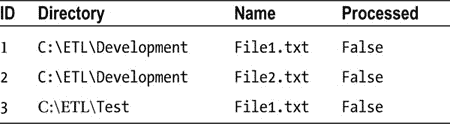

##### 使用执行 SQL 任务检索配置值

你将使用执行 SQL 任务，从你创建的 `PackageConfiguration` 表中检索需要处理的文件列表。你将把结果集存储到包变量中，然后使用 Foreach 循环容器遍历每一行。你将使用 `processed` 字段来标记已处理的文件——一旦成功加载文件，你就将 `processed` 值设置为 `True`。

 **注意**  此示例假设`PackageConfiguration`表中列出的所有平面文件都具有相同的模式。它不涵盖实际将平面文件加载到数据库所需的逻辑——它旨在说明你可以用作模板，用于在循环中处理多个项目的模式。

设置包需要执行以下步骤：

1.  添加四个包变量。
    *   **`FileID` (`Int32`):** 当前正在处理文件的行 ID
    *   **`Directory` (`String`):** 包含你需要处理的平面文件的目录
    *   **`FileName` (`String`):** 你正在处理的文件的名称
    *   **`FilesToProcess` (`Object`):** 执行 SQL 任务的结果集
2.  向包中添加一个执行 SQL 任务；将其命名为 **`Retrieve File List`**。
3.  双击该任务以打开其编辑器。
4.  确保 `ConnectionType` 为 `OLE DB`。
5.  点击 `Connection` 下拉菜单并选择 `New connection...`。
6.  点击 `New` 并配置连接管理器，使其指向包含 `PackageConfiguration` 表的数据库。
7.  从`PackageConfiguration`表中选择所有未处理的文件（如清单 17-6 所示）。
    **清单 17-6.** 从配置表中提取所有尚未处理的条目的查询
    ```sql
    SELECT * FROM [dbo].[PackageConfiguration] WHERE [processed] = 0
    ```
8.  将 `ResultSet` 值设置为 `Full Result Set`。这意味着执行 SQL 任务将检索值作为可供 Foreach 循环处理的 ADO 记录集。请注意，你也可以在这里使用 ADO.NET 连接管理器，这将导致结果作为 ADO.NET 数据表返回。
9.  点击 `Result Set` 选项卡。
10. 点击 `Add`，并使用以下映射：
    1.  **Result Name:** `0`
    2.  **Variable Name:** `User::FilesToProcess`
11. 点击 `OK` 以保存对执行 SQL 任务的更改。
12. 向包中添加一个 Foreach 循环容器。
13. 将执行 SQL 任务连接到 Foreach 循环容器。
14. 在 Foreach 循环容器内添加一个数据流任务。
15. 在 Foreach 循环容器内添加一个新的执行 SQL 任务。
16. 将数据流任务连接到执行 SQL 任务。
17. 双击执行 SQL 任务以打开其编辑器。
18. 将连接设置为你在第 5 步创建的同一连接管理器。
19. 清单 17-7 显示了将表中行标记为已处理的 `SQLStatement`。请注意，该语句包含一个参数标记（问号）。你将在下一步将变量值映射到此参数。
    **清单 17-7.** 将文件标记为已处理的 SQL 语句
    ```sql
    UPDATE [dbo].[PackageConfiguration] SET [processed] = 1 WHERE   id = ?
    ```
20. 点击 `Parameter Mapping` 选项卡。
21. 点击 `Add`，并使用以下映射：
    1.  **Variable name:** `User::FileID`
    2.  **Data Type:** `LONG`
    3.  **Parameter Name:** `0`
22. 点击 `OK` 以保存对执行 SQL 任务的更改。
23. 添加一个新的平面文件连接管理器，并将其指向一个现有的平面文件。
24. 右键单击平面文件连接管理器，然后选择 `Properties`。
25. 选择 `Expression` 属性，并打开属性表达式编辑器。
26. 在 `ConnectionString` 属性上设置一个表达式，该表达式利用从 `PackageConfiguration` 表中检索到的变量值。清单 17-8 提供了该表达式的示例。
    **清单 17-8.** 在`ConnectionString`属性上设置输入文件路径的表达式
    ```text
    @[User::Directory] + "\\" +  @[User::FileName]
    ```

你的包现在应该如图 17-14 所示。
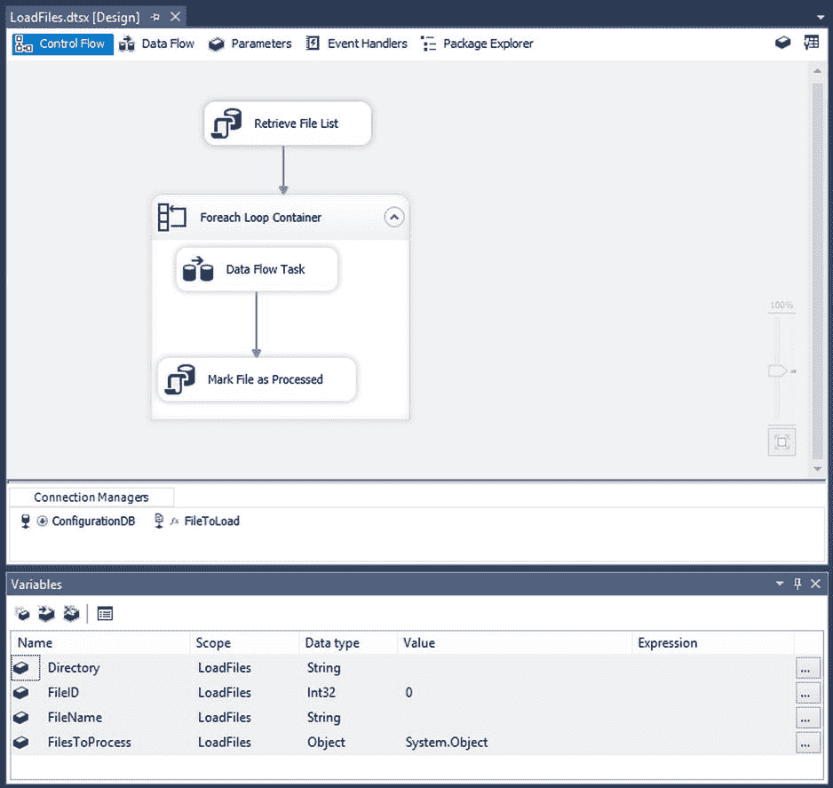
**图 17-14.** 配置为基于执行 SQL 任务的动态配置的包

#### 使用脚本任务设置值

除了使用执行 SQL 任务检索配置并通过表达式设置包属性外，另一种方法是使用脚本任务。如果你的值不是来自数据库，或者它们需要额外的处理逻辑（例如，来自加密源），这种方法可能很有用。在脚本任务中，你可以轻松地从外部配置文件（如 XML 文件）读取值，并访问可能被数据集成解决方案中其他非 SSIS 部分使用的共享配置资源。


脚本任务能够在运行时读取和修改包属性，包括变量值和所有连接管理器属性。清单 17-9 提供了一个脚本任务的示例代码，该任务在运行时设置连接管理器的 `ConnectionString`。

### 清单 17-9. 使用脚本任务设置包属性的示例代码

```csharp
public void Main()
{
    // TODO: 从外部配置文件设置此值
    const string SourceSystemConnectionString = "...";

    Dts.TaskResult = (int)ScriptResults.Success;

    if (Dts.Connections.Contains("SourceSystem"))
    {
        ConnectionManager cm = Dts.Connections["SourceSystem"];
        cm.ConnectionString = SourceSystemConnectionString;
    }
    else
    {
        // 未找到预期的连接管理器 - 记录并设置错误状态
        Dts.Events.FireError(0, "Script Task",
                            "Could not find the SourceSystem connection manager",
                            string.Empty, 0);

        Dts.TaskResult = (int)ScriptResults.Failure;
    }
}
```

### 动态包执行

在此方法中，您将使用清单 17-5 中的同一个表，但不是使用 SSIS 包读取配置值，而是使用 T-SQL 在 SSIS 目录上创建动态包执行。清单 17-10 中的代码实现了以下步骤：

1.  声明脚本变量。请注意，在实际脚本中，这些值将通过参数或外部源设置。
2.  从 `PackageConfiguration` 表读取要处理的文件列表，并将结果存储在表变量 (`@FileList`) 中。
3.  遍历文件列表。对于每个文件，代码将执行以下操作：
    1.  从表变量中检索 ID 和参数值。
    2.  创建一个新的 SSIS 目录包执行。
    3.  设置 `Directory` 和 `FileName` 参数值。
    4.  启动执行。
    5.  更新 `PackageConfiguration` 表以标记该文件已处理。

### 清单 17-10. 动态包执行脚本

```sql
DECLARE @FolderName NVARCHAR(50) = N'ExecutionDemo'
DECLARE @ProjectName NVARCHAR(50) = N'ETL'
DECLARE @DirectoryParameter NVARCHAR(50) = N'Directory'
DECLARE @FileNameParameter NVARCHAR(50) = N'FileName'
DECLARE @PackageName NVARCHAR(100) = N'LoadCustomers.dtsx'

DECLARE @FileList TABLE (
  RowNum smallint,
  Id int,
  Directory nvarchar(255),
  Name nvarchar(255)
)

INSERT INTO @FileList (RowNum, Id, Directory, Name)
                 SELECT ROW_NUMBER() OVER (ORDER BY id), id, Directory, Name
         FROM [dbo].[PackageConfiguration]
         WHERE processed = 0

DECLARE @maxCount int = (SELECT MAX(RowNum) FROM @FileList)
DECLARE @count int = (SELECT MIN(RowNum) FROM @FileList)

WHILE (@count <= @maxCount)
BEGIN

         DECLARE @Id NVARCHAR(255) = (SELECT Id FROM @FileList WHERE RowNum = @count)
         DECLARE @DirectoryValue NVARCHAR(255) = (SELECT Directory FROM @FileList WHERE RowNum = @count)
         DECLARE @NameValue NVARCHAR(255) = (SELECT Name FROM @FileList WHERE RowNum = @count)

         -- 创建包执行
         DECLARE @exec_id bigint
         EXEC [SSISDB].[catalog].[create_execution]
                   @execution_id = @exec_id OUTPUT,
                   @package_name = @PackageName,
                   @folder_name = @FolderName,
                   @project_name = @ProjectName

         -- 设置 Directory 参数值
         EXEC [SSISDB].[catalog].[set_execution_parameter_value]
                   @execution_id = @exec_id,
                   @object_type = 20,
                   @parameter_name = @DirectoryParameter,
                   @parameter_value = @DirectoryValue

         -- 设置 File Name 参数值
         EXEC [SSISDB].[catalog].[set_execution_parameter_value]
                   @execution_id = @exec_id,
                   @object_type = 20,
                   @parameter_name = @FileNameParameter,
                   @parameter_value = @NameValue

         -- 启动包执行
         EXEC [SSISDB].[catalog].[start_execution] @exec_id

         -- 返回执行 ID
         SELECT N'Started package execution ' + CONVERT(nvarchar(20), @exec_id)

         -- 标记文件为已处理
         DECLARE @UpdateSql nvarchar(1024) = N'UPDATE [dbo].[PackageConfiguration] SET processed = 1
         WHERE id = ' + CONVERT(nvarchar(20), @Id)
         EXEC sp_sqlexec @UpdateSql

         SET @count = @count + 1
END
```

### 结论

本章介绍了一些新参数模型的使用模式，以及一些动态配置场景。尽管在 SQL 2005 和 2008 中常用的配置模式和最佳实践在最新版本的 SSIS 中仍然有效，但大多数用户会发现迁移到新模型是有益的。参数模型的清晰性旨在帮助参与 SSIS 解决方案生命周期的每个人，从开发包的人员到部署和调度它们的人员。

