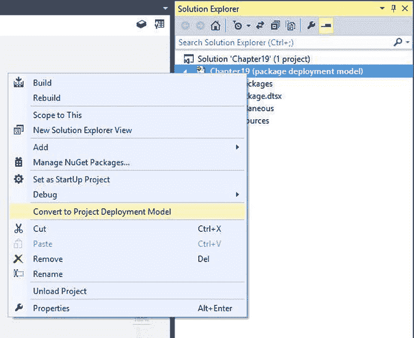
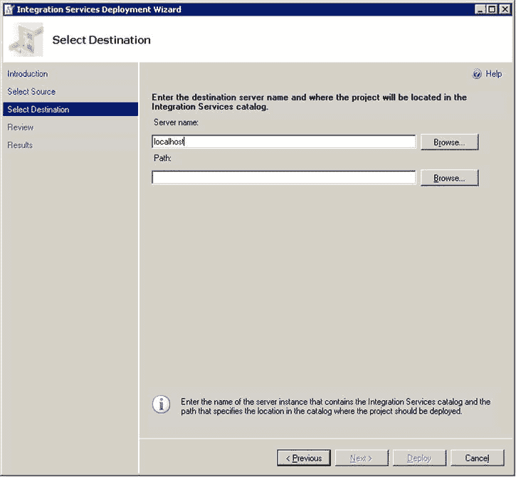
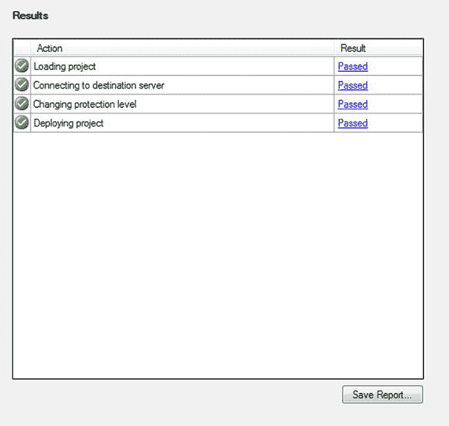
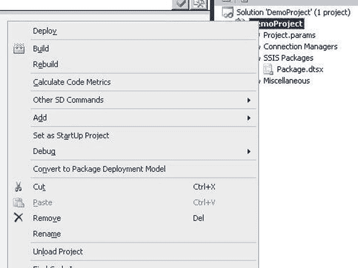

# 第 18 章 部署

在 SQL Server 2012 中，Integration Services 项目的部署过程得到了极大简化。Visual Studio 中的项目现在可以定位两种不同的部署模型——包部署模型（类似于该产品早期版本中使用的模型）和项目部署模型（专为新的 SSIS 目录设计）。

本章将重点介绍与新的项目部署模型和基于服务器的部署相关的模式。虽然项目模型和 SSIS 目录是推荐的部署方式，但从早期版本升级的组织可能已经拥有依赖基于文件系统部署的包执行框架。

 **注意** SSIS 包部署在 SQL Server 2012 和 SQL Server 2014 之间没有变化。

### 项目部署模型

新的项目模型是 SQL Server 2014 中创建 SSIS 项目时的默认目标。使用此模型，在项目的生成阶段，包和其他项目项（如共享连接管理器）会捆绑到扩展名为 `.ispac` 的单个文件中。然后可以使用部署向导将此文件部署到 SSIS 目录，或使用 `dtexec.exe` 直接执行。

如果您的项目定位的是包部署模型，您可以在 Visual Studio 中转换为项目部署模型。在解决方案资源管理器窗口中右键单击项目名称，然后选择 **转换为项目部署模型**（如图 18-1 所示）。转换为项目部署模型将启动项目转换向导。该向导通过更新执行包任务以使用项目引用，并将配置更改为参数，帮助您转换到新模型。


图 18-1. SSDT-BI 提供了转换为项目部署模型的选项

项目部署模型中的 Integration Services 项目可以利用参数、共享连接管理器和项目引用等新功能。项目引用允许执行包任务无需使用连接管理器即可定位子包，并大大简化了部署过程。

### SSIS 目录

SSIS 目录在 SQL Server 2012 中添加，是 Integration Services 项目的推荐部署目标。部署到目录通常使用 SSIS 部署向导完成，该向导可以从 SSDT-BI、SSMS 内部启动，从 Windows 资源管理器双击 SSIS 项目文件 (`.ispac`)，或者通过运行 `ISDeploymentWizard` 来启动。


### 部署方法

本节介绍 SSIS 目录支持的不同部署方法。你选择哪种方法取决于你的环境以及执行部署的人员（无论是开发人员、ETL 操作员还是 DBA）最习惯使用的方式。此处描述的部署方法包括：
*   从命令行部署
*   使用自定义代码部署
*   使用 PowerShell 部署
*   使用 SQL 部署

### 从命令行部署

部署向导（`ISDeploymentWizard.exe`）提供了命令行界面，允许你在没有 UI 的情况下部署到 SSIS 目录。这对于从脚本部署或作为批处理过程的一部分非常有用。

表 18-1 显示了支持的参数列表。清单 18-1 提供了一个命令行示例，用于将一个项目（`C:\ETL\Project.ispac`）部署到本地 SSIS 目录中名为 MyFolder 的文件夹。

#### Integration Services 部署向导命令行参数

| 参数 | 缩写版本 | 描述 |
| --- | --- | --- |
| `Silent[+\|-]` | `S` | 当此选项为 true 时，部署将在无 UI 模式下（仅命令行）进行。从批处理文件部署时使用此选项。默认值为‘-’，将显示 UI。示例：`/Silent+` |
| `SourceType:{File\|Server}` | `ST` | 此选项指定源项目来自文件系统还是另一个 SSIS 目录。默认值为 "File." 示例：`/SourceType:File` |
| `SourcePath:path_to_project` | `SP` | 要部署的 `.ispac` 文件的路径（当使用 `File` 源时），或项目名称的路径（当使用 `Server` 源时）。示例：`/SourcePath:C:\ETL\project.ispac` |
| `SourceServer:server_instance` | `SS` | 当 `SourceType` 设置为 `Server` 时的服务器实例名称。示例：`/SourceServer:localhost\SQL1` |
| `ProjectPassword:password` | `PP` | 如果源 `.ispac` 文件受密码保护，此参数可用于提供密码。请注意，在命令行上指定密码不推荐，因为系统上的其他用户可能能够看到参数。如果你的项目文件使用密码加密，请考虑在响应文件中指定密码（有关更多信息，请参见 `@<file>` 选项） |
| `DestinationServer:server_instance` | `DS` | 你要部署到的服务器实例名称。示例：`/DestinationServer:localhost` |
| `DestinationPath:path` | `DP` | 你希望在目标服务器上部署项目的路径。路径格式为 `"/<catalog>/<folder>/<project>"`。示例：`/DestinationPath:/SSISDB/MyFolder/Project` |
| `@<file>` | | 此选项允许你在文本文件中指定所有命令行参数，而不是直接在命令行输入。示例：`@arguments.txt` |

#### 清单 18-1：从命令行部署项目
```
ISDeploymentWizard.exe /Silent /SourcePath:"C:\ETL\Project.ispac" /DestinationServer:"localhost" /DestinationPath:"/SSISDB/MyFolder/Project"
```

> **注意**：当部署向导以交互式（UI）模式运行时，“审阅”页面会显示用于执行基于命令行部署的等效参数。这可以是一个方便的快捷方式——只需将命令行参数复制到批处理文件中，即可在未来执行自动部署。

### 使用自定义代码部署

SSIS 目录有一个名为管理对象模型（或 MOM）的托管 .NET API。此 API 允许你以编程方式执行通常通过 SQL Server Management Studio (SSMS) 完成的相同管理任务，包括文件夹创建和项目部署。

清单 18-2 提供了一个使用 MOM 在 SSIS 目录中创建新文件夹并将项目部署到其中的 C# 应用程序示例。核心功能可以在 `Microsoft.SqlServer.Management.IntegrationServices` 程序集中找到，该程序集随 SSMS 安装，并与所有依赖项一起位于全局程序集缓存 (GAC) 中。

> **提示**：如果你找不到 `Microsoft.SQLServer.ManagedDTS.dll` 文件，请查看 .Net Framework 4.0 全局程序集缓存 (GAC) 目录，在默认安装中，该目录通常是 `C:\Windows\Microsoft.NET\assembly`。

#### 清单 18-2：使用管理对象模型部署项目
```
using System;
using System.Collections.Generic;
using System.Linq;
using System.Text;
using Microsoft.SqlServer.Management.IntegrationServices;
using Microsoft.SqlServer.Management.Smo;
using Microsoft.SqlServer.Dts.Runtime;
using System.IO;

class Program
{
    const string ProjectFileLocation = @"C:\ETL\Project.ispac";
    static void Main(string[] args)
    {
        // Connect to the default instance on localhost
        var server = new Server("localhost");
        var store = new IntegrationServices(server);
        // Check that we have a catalog
        if (store.Catalogs.Count == 0)
        {
            Console.WriteLine("SSIS catalog not found on localhost.");
        }
        // Get the SSISDB catalog - note that there should only
        // be one, but the API may support multiple catalogs
        // in the future
        var catalog = store.Catalogs["SSISDB"];
        // Create a new folder
        var folder = new CatalogFolder(catalog,
                                      "MyFolder",
                                      "Folder that holds projects");
        folder.Create();
        // Make sure the project file exists
        if (!File.Exists(ProjectFileLocation))
        {
            Console.WriteLine("Project file not found at: {0}",
                              ProjectFileLocation);
        }
        // Load the project using the SSIS API
        var project = Project.OpenProject(ProjectFileLocation);
        // Deploy the project to the folder we just created
        folder.
```

### 从 SSDT-BI 启动部署向导

要从 SSDT-BI 启动部署向导，请在解决方案资源管理器中右键单击项目，然后选择 `部署` 选项。向导将自动加载你的项目文件，将你带到“选择目标”页面（如 图 18-2 所示）。



图 18-2。可以从 SSDT-BI 启动 Integration Services 部署向导

> **注意**：部署向导通常用于将文件部署到 SSIS 目录，但它也可用于在服务器之间移动项目。为此，请在“选择源”页面选择 Integration Services 目录选项。

部署向导允许你选择要将项目部署到的服务器和文件夹。在最后一页上，项目文件被发送到服务器并存储在 SSIS 目录中。请注意，在部署过程中，向导指示它正在更改项目的保护级别（图 18-3）。在此阶段，项目内的敏感数据被解密，项目被转换为 `服务器存储` 保护级别。服务器依赖于数据库加密来保护包和参数值——这些表在 SSIS 目录中会自动加密。



图 18-3。部署向导状态页面

> **注意**：有关包保护级别和安全部署的更多信息，请参阅联机丛书 `http://msdn.microsoft.com/en-us/library/bb522558.aspx`。


### SSIS 包部署

### 使用 PowerShell 部署

SSIS 管理对象模型（MOM）可通过 PowerShell 访问，这使得使用 PowerShell 脚本完全自动化你的部署（及其他管理任务）成为可能。`Listing 18-3` 展示了 `Listing 18-2` 中简单部署应用程序的 PowerShell 版本。

**Listing 18-3**. 使用 PowerShell 部署项目

```powershell
### Variables
$ProjectFilePath = "C:\ETL\Project.ispac"
$ProjectName = "Project"
$FolderName = "MyFolder"

### Load the IntegrationServices Assembly
$loadStatus = [Reflection.Assembly]::Load("Microsoft.SqlServer.Management.IntegrationServices, Version=12.0.0.0, Culture=neutral, PublicKeyToken=89845dcd8080cc91")

### Store the IntegrationServices Assembly namespace to avoid typing it every time
$ISNamespace = "Microsoft.SqlServer.Management.IntegrationServices"

Write-Host "Connecting to server ..."

### Create a connection to the server
$sqlConnectionString = "Data Source=localhost;Initial Catalog=master;Integrated Security=SSPI;"
$sqlConnection = New-Object System.Data.SqlClient.SqlConnection $sqlConnectionString

### Create the Integration Services object
$integrationServices = New-Object $ISNamespace".IntegrationServices" $sqlConnection
$catalog = $integrationServices.Catalogs["SSISDB"]

Write-Host "Creating Folder" $FolderName "..."

### Create a new folder
$folder = New-Object $ISNamespace".CatalogFolder" ($catalog, $FolderName, "This is a folder description")
$folder.Create()

Write-Host "Deploying" $ProjectName "project ..."

### Read the project file, and deploy it to the folder
[byte[]] $projectFile = [System.IO.File]::ReadAllBytes($ProjectFilePath)
$project = $folder.DeployProject($ProjectName, $projectFile)

Write-Host "All done."
```

### 使用 SQL 部署

如果你更喜欢使用 T-SQL 完成所有数据库管理和部署，SSIS 目录通过一组视图和存储过程暴露了完整的管理接口。`Listing 18-4` 提供了一个示例，它以二进制格式加载项目文件，使用 `[catalog].[deploy_project]` 存储过程将其部署到文件夹中，然后从 `[catalog].[operations]` 视图查询部署状态。

**Listing 18-4**. 使用 SQL API 部署项目

```sql
use SSISDB

DECLARE @ProjectBinary as varbinary(max)
DECLARE @OperationID as bigint

-- load the project file
SET @ProjectBinary = (
  SELECT *
  FROM OPENROWSET
  (
    BULK 'C:\ETL\Project.ispac',
    SINGLE_BLOB
  ) as BinaryData
)

-- deploy the project
EXEC [catalog].[deploy_project]
        'MyFolder',      -- folder
        'Project',       -- project name
        @ProjectBinary,  -- binary data
        @OperationID out -- operation id

-- -- Get the status of the last deployment --
DECLARE @LastDeployment_id bigint;
SET @LastDeployment_id = (
  SELECT MAX(operation_id)
  FROM   [catalog].[operations]
  WHERE  operation_type = 101 -- deploy
)

SELECT [object_name], start_time, end_time, [status], [value] =
  case
        when [status] = 1 then N'Created'
        when [status] = 2 then N'Running'
        when [status] = 3 then N'Canceled'
        when [status] = 4 then N'Failed'
        when [status] = 5 then N'Pending'
        when [status] = 6 then N'Unexpected Termination'
        when [status] = 7 then N'Succeeded'
        when [status] = 8 then N'Stopping'
        when [status] = 9 then N'Completed'
  end
FROM   [catalog].[operations]
WHERE  [operation_id] = @LastDeployment_id
```

### 包部署模型

在 SQL Server 2012 中创建的 SSIS 项目默认使用项目部署模型，但有些用户可能希望继续使用 SQL Server 2005 和 2008 的包部署模型。

你可以在 Visual Studio 中通过右键单击解决方案资源管理器中的项目名称并选择“转换为包部署模型”（如 `Figure 18-4` 所示）来将项目部署模型转换为包部署模型。最初在早期版本的 SQL Server 中创建的项目在 SSDT-BI 中打开时，会自动以包部署模型开始。



**Figure 18-4**. 转换为包部署模型

> **注意**  当使用包部署模型时，你将无法使用 SQL Server 2012 引入的一些新功能，例如参数和项目引用。如果你的任何包使用了这些功能，SSDT-BI 将不允许你转换为包部署模型。

`Table 18-2` 列出了使用包部署模型时会用到的部署位置，并简要描述了每种方法的优点。

**Table 18-2**. 使用包部署模型时的部署位置

| 位置 | 说明 |
| --- | --- |
| 文件系统 | • 镜像你在 SSDT-BI 中开发时的结构<br>• 不需要数据库权限<br>• 部署是简单的文件复制 |
| SQL Server (MSDB) | • 备份和维护是常规 SQL 功能的一部分<br>• 对包访问和安全性有更细粒度的控制<br>• 通过 `DTSInstall.exe`（旧版部署向导）、SSIS 对象模型或 `dtutil.exe` 进行部署 |
| 包存储 (SSIS 服务) | • 提供文件系统和 MSDB 存储位置之上的一个外观，允许你更改包的物理位置，但保持相同的逻辑路径<br>• 从一个位置管理多个存储位置<br>• 通过 SSMS、SSIS 对象模型或 `dtutil.exe` 进行部署<br>• 访问需要特殊的 DCOM 权限配置 |

> **注意**  你不能使用包存储接口来管理部署到 SSIS 目录的包。该服务只能与存储在 MSDB（2005 和 2008 部署模型）中的包交互，并且是为了继续支持尚未迁移到新项目部署模型的用户而存在的。未来可能会被弃用。

### 结论

在 SQL Server 2012 中，SSIS 包的部署过程被大大简化了。虽然 SQL Server 2005 和 2008 中使用的部署模型（现在称为包部署模型）仍然完全受支持，但对于新的数据集成项目，强烈建议迁移到新的项目部署模型。SSIS 提供了多种部署到 SSIS 目录的方法，为你提供了将部署过程融入你的环境所需的灵活性。

