# 第 19 章

### 商业智能标记语言

你购买这本书很可能是为了学习如何成为更高效的 SQL Server Integration Services (SSIS) 开发人员。我赞赏你的愿望和决定，并真诚地希望本书中包含的信息提供了帮助你提高生产力的想法和方法。我一直在寻找成为更好的数据集成开发人员的方法。具体来说，我寻求提高代码质量和减少构建解决方案所需时间的方法。这些目标最初促使我开始实践基于模式的开发，这最终催生了本书的想法。

商业智能标记语言（Business Intelligence Markup Language）或 Biml，使用 XML 表示 SSIS 包。通过将描述 SSIS 包的元数据存储在 XML 中，Biml 从特定领域语言的角度处理数据集成开发。Biml 提供了另一种实现 SSIS 设计模式的方法——除了包含模板包的 SSIS 包库之外的方法。

无论采用哪种机制，存储设计模式都有助于以一致且可重复的质量进行代码生成。这听起来或许无足轻重，但我向你保证它很重要；这正是首先使用设计模式的主要原因之一。

`Biml` 是一门复杂的语言。在正式投入 `Biml` 开发之前，最好先理解领域特定语言、`XML` 和 `.NET` 开发。本章我不会深入探讨 `Biml` 的底层架构。我会向你展示其部分机制，并指引你查阅 `Biml` 文档网站：`Biml` 语言 (`www.varigence.com/Documentation/Language/Index`) 和 `Biml` API (`www.varigence.com/Documentation/Api/Index`)。我相信，在我展示 `Biml` 强大功能的同时，这足以激发你的兴趣。

### 商业智能标记语言简史

2007 年初，微软客户服务与支持部 (`CSS`) 孵化了一种构建商业智能 (`BI`) 解决方案的新方法。作为负责管理所有一线客户支持互动的部门，`CSS` 拥有大量分析和预测需求——涉及来自各种来源的数据。为了加速内部解决方案的开发，`CSS` 开始开发 `Vulcan` 项目，该项目使用一种基于 `XML` 的标记语言来描述一部分 `SSIS` 包。这创建了一个模型，使得商业智能解决方案能够由全球分布的 `BI` 开发人员团队更快速、更迭代地进行开发。

在成功构建了新的 `BI` 能力一段时间后，`CSS` 和 `SQL Server` 产品团队决定将 `Vulcan` 项目的源代码发布在 `CodePlex` 上，以便客户试用该技术并开始围绕其建立社区 (`http://vulcan.codeplex.com`)。来自客户的反馈表明，他们认识到该方法强大且有前景，但实现方式反映了该项目作为内部工具的状态，用于加速运营交付团队的工作。由于缺乏文档和培训资源、可用性考虑以及附加功能，除了最有决心的客户外，采用 `Vulcan` 的成本高得令人望而却步。

2008 年底，曾在 `CSS` 使用 `Vulcan` 技术的 Scott Currie 创立了 `Varigence` 公司。`Varigence` 创建了商业智能标记语言 (`Biml`) 以及用于其设计和开发的工具。尽管 `Biml` 并未直接使用来自 `Vulcan` 的任何代码或技术，但 `Vulcan` 项目采用的方法启发了 `Varigence` 团队，将 `Biml` 构建为一种基于 `XML` 的标记语言，并特别考虑了快速、迭代的全球团队开发能力。

`Biml` 现已可用于专有产品和开源项目，并已被发布为开放语言规范。`Varigence` 开发了一个 `Biml` 编译器，支持广泛的自动化和多目标定位能力。此外，`Varigence` 提供了一个名为 `Mist` 的 `Biml` 集成开发环境 (`IDE`)。`Mist` 提供了 `Biml` 的快速、可视化设计和调试功能。开源的 `BIDS Helper` 项目包含 `Biml` 功能，使任何人都可以免费编写和执行 `Biml` 代码。

在本章中，我们将利用 `BIDS Helper` 中包含的免费 `Biml` 功能来动态生成 `SSIS` 包。

 **注意** 包含商业智能标记语言的对象是一个 *Biml 文件*。`Biml` 文件通过“执行”来生成 `SSIS` 包。

### 构建你的第一个 Biml 文件

在开始使用商业智能标记语言之前，你需要从 `http://bidshelper.codeplex.com` 下载并安装最新版本的 `BIDS Helper`。安装完成后，创建一个新的名为 **Biml2014** 的 `SSIS` 解决方案和项目。在解决方案资源管理器中，右键单击项目名称，然后单击“添加新建 Biml 文件”。新文件 `BimlScript.biml` 将被创建并分配给解决方案资源管理器中的“杂项”虚拟文件夹。双击该文件以在编辑器中打开。

该文件以最基本的 `Biml` 结构开始，如清单 19-1 所示。

***清单 19-1***. 初始 Biml 代码

```xml
<Biml xmlns="http://schemas.varigence.com/biml.xsd">
</Biml>
```

添加 `XML`，使你的 `Biml` 文件内容如清单 19-2 所示。在键入时，请注意 `IntelliSense` 会自动缩进 `XML` 标签，以生成更易于阅读的格式良好的代码。

***清单 19-2***. 添加包 XML 元数据后的 Biml

```xml
<Biml xmlns="http://schemas.varigence.com/biml.xsd">
  <Packages>
    <Package Name="TestBimlPackage" ConstraintMode="Parallel">
    </Package>
  </Packages>
</Biml>
```

保存文件，在解决方案资源管理器中右键单击 `BimlScript.biml`，然后单击“生成 SSIS 包”。图 19-1 显示，项目中及文件系统中创建了一个名为 `TestBimlPackage.dtsx` 的新 `SSIS` 包。该包作为此项目的一部分显示在解决方案资源管理器中。

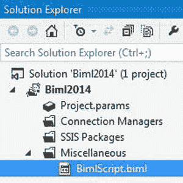

图 19-1. TestBimlPackage.dtsx

让我们回到 `BimlScript.biml` 文件并添加一个任务。在 `<Package>` 标签下方创建一个名为 **Tasks** 的新 `XML` 节点。在 `<Tasks>` 和 `</Tasks>` 标签之间，添加一个名为 **ExecuteSQL** 的新节点。

 **提示** 如果你没有看到 `Biml` 的 `IntelliSense`，请按照此链接的说明配置 `Biml` `IntelliSense`：`http://bidshelper.codeplex.com/wikipage?title=Manually%20Configuring%20Biml%20Package%20Generator&referringTitle=xcopy%20deploy`。

向 `ExecuteSQL` 根节点添加一个名为 `Name` 的属性，并将其值设置为 **“Test Select”**。在 `<ExecuteSQL>` 和 `</ExecuteSQL>` 标签之间创建一个名为 **DirectInput** 的新 `XML` 节点。在 `<DirectInput>` 和 `</DirectInput>` 标签之间，添加 `T-SQL` 语句 **Select 1 As One**。如果你正在动手实践，你的 `BimlScript.biml` 文件应如清单 19-3 所示。

***清单 19-3***. 添加描述执行 SQL 任务的初始元数据后的 Biml

```xml
<Biml xmlns="http://schemas.varigence.com/biml.xsd">
  <Packages>
    <Package Name="TestBimlPackage" ConstraintMode="Parallel">
      <Tasks>
        <ExecuteSQL Name="Test Select">
          <DirectInput>Select 1 As One</DirectInput>
        </ExecuteSQL>
      </Tasks>
    </Package>
  </Packages>
</Biml>
```

为了测试，请保存文件并从解决方案资源管理器中的 `BimlScript.biml` 生成 `SSIS` 包。（通过右键单击 Biml 文件并从上下文相关菜单中选择“生成 SSIS 包”来生成包）。你是否遇到了类似图 19-2 所示的错误？你应该会遇到这样的错误。

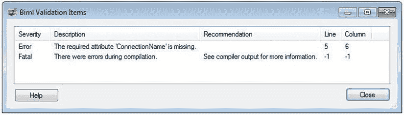

图 19-2. 缺少 ConnectionName 属性

商业智能标记语言引擎包含验证功能，它捕获了图 19-2 中的错误。你可以从解决方案资源管理器调用验证；只需右键单击 `BimlScript.biml`，然后单击“检查 Biml 是否有错误”。

要修复错误，我们需要向 `ExecuteSQL` 标签添加一个 `ConnectionName` 属性。但目前我们还没有指定连接。要创建连接，请返回到 `BimlScript.biml` 的顶部，在 `Biml` 标签之后、`Packages` 标签之前添加一个新行。在这一行上，添加 `Connections` `XML` 节点。在 `<Connections>` 和 `</Connections>` 标签内，添加一个 `Connection` `XML` 节点。一个 `Connection` `XML` 节点需要两个属性：`Name` 和 `ConnectionString`。


### 我已连接到本地 SQL Server 默认实例上的 AdventureWorks2012 数据库。

一旦配置好 `Connection` 元数据，我便向 `ExecuteSQL` 标签添加了 `ConnectionName` 属性。我的 `BimlScript.biml` 文件现在包含如 清单 19-4 所列的代码。

**清单 19-4. 添加连接元数据后的 Biml**

```xml
<Biml xmlns="http://schemas.varigence.com/biml.xsd">
  <Connections>
    <Connection Name="AdventureWorks2012" ConnectionString="Data Source=.;Initial Catalog=AdventureWorks2012;Provider= SQLNCLI10.1;Integrated Security=SSPI;Auto Translate=False;" />
  </Connections>
  <Packages>
    <Package Name="TestBimlPackage" ConstraintMode="Parallel">
      <Tasks>
        <ExecuteSQL Name="Test Select" ConnectionName="AdventureWorks2012">
          <DirectInput>Select 1 As One</DirectInput>
        </ExecuteSQL>
      </Tasks>
    </Package>
  </Packages>
</Biml>
```

让我们通过从 `BimlScript.biml` 重新生成 `TestBimlPackage.dtsx` SSIS 包来测试。当你尝试生成 SSIS 包时，会看到一个确认对话框，询问你是否要覆盖现有的 `TestBimlPackage.dtsx` SSIS 包。确认此操作后，将从更新后的 `BimlScript.biml` 文件中包含的元数据重新生成 `TestBimlPackage.dtsx` SSIS 包。打开 `TestBimlPackage.dtsx` SSIS 包：它应显示为如 图 19-3 所示。

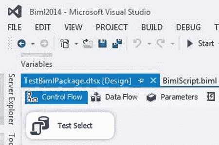

**图 19-3. 一个由 Biml 生成的 SSIS 包**

### 构建基本的增量加载 SSIS 包

增量加载模式在数据集成解决方案中至关重要，尤其是在抽取、转换和加载解决方案中。Biml 提供了一种机制，可以以可重复的方式对增量加载模式进行编码。

#### 创建数据库和表

让我们通过构建几个数据库和表来准备此演示。执行 清单 19-5 中的 T-SQL 语句来构建和填充测试数据库和表。

**清单 19-5. 构建和填充演示数据库和表**

```sql
Use master
Go

If Not Exists(Select name
              From sys.databases
              Where name = 'SSISIncrementalLoad_Source')
 CREATE DATABASE [SSISIncrementalLoad_Source]

If Not Exists(Select name
              From sys.databases
              Where name = 'SSISIncrementalLoad_Dest')
 CREATE DATABASE [SSISIncrementalLoad_Dest]
Go
Use SSISIncrementalLoad_Source
Go

If Not Exists(Select name
              From sys.tables
              Where name = 'tblSource')
CREATE TABLE dbo.tblSource
 (ColID int NOT NULL
 ,ColA varchar(10) NULL
 ,ColB datetime NULL constraint df_ColB default (getDate())
 ,ColC int NULL
 ,constraint PK_tblSource primary key clustered (ColID))

Use SSISIncrementalLoad_Dest
Go

If Not Exists(Select name
              From sys.tables
              Where name = 'tblDest')
CREATE TABLE dbo.tblDest
 (ColID int NOT NULL
 ,ColA varchar(10) NULL
 ,ColB datetime NULL
 ,ColC int NULL)

If Not Exists(Select name
              From sys.tables
              Where name = 'stgUpdates')
 CREATE TABLE dbo.stgUpdates
  (ColID int NULL
  ,ColA varchar(10) NULL
  ,ColB datetime NULL
  ,ColC int NULL)

Use SSISIncrementalLoad_Source
Go

-- insert an "unchanged", a "changed", and a "new" row
INSERT INTO dbo.tblSource
 (ColID,ColA,ColB,ColC)
 VALUES
 (0, 'A', '1/1/2007 12:01 AM', -1),
 (1, 'B', '1/1/2007 12:02 AM', -2),
 (2, 'N', '1/1/2007 12:03 AM', -3)

Use SSISIncrementalLoad_Dest
Go

-- insert a "changed" and an "unchanged" row
INSERT INTO dbo.tblDest
 (ColID,ColA,ColB,ColC)
 VALUES
 (0, 'A', '1/1/2007 12:01 AM', -1),
 (1, 'C', '1/1/2007 12:02 AM', -2)
```

清单 19-5 中的 T-SQL 语句创建了两个数据库：`SSISIncrementalLoad_Source` 和 `SSISIncrementalLoad_Dest`。在 `SSISIncrementalLoad_Source` 数据库中创建了一个名为 `tblSource` 的表，并填充了三行数据。在 `SSISIncrementalLoad_Dest` 数据库中创建了另一个名为 `tblDest` 的表，并填充了两行数据。

清单 19-5 创建的配置是增量加载的基本设置。`ColID` 是业务键。此值不应更改，并且应唯一标识源系统和目标系统中的行。源表和目标表中 `ColA` 的字符值指示了行的类型线索。A 行在源和目标表中都存在且相同。它是一个*未更改*的行。`ColID` 值为 `1` 的行在源表中包含 `ColA` 值 `B`，在目标表中包含 `ColA` 值 `C`。此行自最初加载到目标表以来，在源中已*更改*。`ColID` 值为 `2` 的行仅存在于源中。它是一个*新*行。

#### 添加元数据

在本节中，我们将：
*   添加定义增量加载 SSIS 设计模式中使用的连接管理器的元数据。
*   向 Biml 项目添加一个新的 Biml 文件，并将其重命名为 `IncrementalLoad.biml`。
*   在 `<Biml>` 标签后立即添加一个 `Connections` XML 节点。
*   添加两个 `Connection` XML 节点，配置为连接到 `SSISIncremental_Source` 和 `SSISIncremental_Dest` 数据库。

你的代码应如 清单 19-6 所示。

**清单 19-6. IncrementalLoad.biml 中配置的连接**

```xml
<Biml xmlns="http://schemas.varigence.com/biml.xsd">
  <Connections>
    <Connection Name="SSISIncrementalLoad_Source" ConnectionString=
      "Data Source=(local);Initial Catalog=SSISIncrementalLoad_Source;Provider=
       SQLNCLI11.1;Integrated Security=SSPI;" />
    <Connection Name="SSISIncrementalLoad_Dest" ConnectionString=
      "Data Source=(local);Initial Catalog=SSISIncrementalLoad_Dest;Provider=
       SQLNCLI11.1;OLE DB Services=1;Integrated Security=SSPI;" />
  </Connections>
</Biml>
```

在 `</Connections>` 和 `</Biml>` 标签之间添加一个 `Packages` 节点。紧接着，添加一个 `Package` XML 节点，后跟一个 `Tasks` 节点。随后，立即添加一个配置为如 清单 19-7 所示的 `ExecuteSQL` 节点。

**清单 19-7. 配置好的 Packages、Package、Tasks 和 ExecuteSQL 节点**

```xml
<Packages>
  <Package Name="IncrementalLoadPackage" ConstraintMode=
    "Parallel" ProtectionLevel="EncryptSensitiveWithUserKey">
    <Tasks>
      <ExecuteSQL Name="Truncate stgUpdates" ConnectionName="SSISIncrementalLoad_Dest">
        <DirectInput>Truncate Table stgUpdates</DirectInput>
      </ExecuteSQL>
    </Tasks>
  </Package>
</Packages>
```

清单 19-7 中 Biml 定义的 `Execute SQL` 任务将截断一个暂存表，该表将保存自加载到目标表以来在源表中发生更改的行。

#### 指定数据流任务

在 `</ExecuteSQL>` 标签后，添加一个 `Dataflow` XML 节点。包含一个 `Name` 属性，并将 `Name` 属性的值设置为 "`Load tblDest`"。在 `<Dataflow>` 标签内，添加一个 `PrecedenceConstraints` 节点。在 `<PrecedenceConstraints>` 标签内放置一个 `Inputs` 节点，并在 `<Inputs>` 标签内放置一个包含 `OutputPathName` 属性（值为 "`Truncate stgUpdates.Output`"）的 `Input` 节点，如 清单 19-8 所示。

**清单 19-8.**


从“截断 stgUpdates”执行 SQL 任务到“加载 tblDest”数据流任务添加优先级约束

```xml
<Dataflow Name="Load tblDest">
  <PrecedenceConstraints>
    <Inputs>
      <Input OutputPathName="Truncate stgUpdates.Output" />
    </Inputs>
  </PrecedenceConstraints>
</Dataflow>
```

此代码定义了`截断 stgUpdates`执行 SQL 任务和`加载 tblDest`数据流任务之间的`OnSuccess`优先级约束。

### 添加转换

现在我们准备添加定义转换的元数据，这些转换是数据流任务的核心。在本节中，我们将设计一个增量加载，其中包括一个`OleDbSource`适配器、一个`Lookup`转换、一个`条件拆分`转换和两个`OleDbDestination`适配器。

首先，在`</PrecedenceConstraints>`标签之后添加一个`<Transformations>`节点。在`<Transformations>`标签内，添加一个`<OleDbSource>`标签，并包含以下属性及值对：

*   `Name`： `tblSource Source`
*   `ConnectionName`： `SSISIncrementalLoad_Source`

在`<OleDbSource>`标签内，添加一个`<ExternalTableInput>`节点，该节点包含一个值为`"dbo.tblSource"`的`Table`属性。此元数据构建了一个名为`"tblSource Source"`的`OleDbSource`适配器，它连接到之前在`<Connections>`标签内定义的`SSISIncrementalLoad_Source`连接。`OleDbSource`适配器将按照`ExternalTableInput`标签中的指定连接到表`"dbo.tblSource"`。`数据流`XML 节点现在将如`清单 19-9`所示出现。

`清单 19-9`. 包含 OLE DB 源适配器的数据流节点

```xml
<Dataflow Name="Load tblDest">
  <PrecedenceConstraints>
    <Inputs>
      <Input OutputPathName="Truncate stgUpdates.Output" />
    </Inputs>
  </PrecedenceConstraints>
  <Transformations>
    <OleDbSource Name="tblSource Source" ConnectionName="SSISIncrementalLoad_Source">
      <ExternalTableInput Table="dbo.tblSource" />
    </OleDbSource>
  </Transformations>
</Dataflow>
```

接下来，在`</OleDbSource>`标签之后立即添加一个`<Lookup>` XML 节点。在`<Lookup>`标签中包含以下属性及值对：

*   `Name`： `Correlate`
*   `OleDbConnectionName`： `SSISIncrementalLoad_Dest`
*   `NoMatchBehavior`： `RedirectRowsToNoMatchOutput`

`Name`属性设置`Lookup`转换的名称。`OleDbConnectionName`指示 Biml 使用清单中在`<Connections>`标签内定义的连接管理器。`NoMatchBehavior`属性被配置为将不匹配的行重定向到`Lookup`转换的 NoMatch 输出。

继续通过在`<InputPath>`标签之后立即添加一个`<DirectInput>`节点来配置定义`Lookup`转换的元数据。在`<DirectInput>`和`</DirectInput>`标签之间输入以下 T-SQL 语句。

```sql
SELECT ColID, ColA, ColB, ColC
FROM dbo.tblDest
```

在`</DirectInput>`标签之后立即添加一个`<Inputs>`节点。在`<Inputs>`标签内，添加一个`<Column>`节点。包含以下属性名和值对。

*   `SourceColumn`： `ColID`
*   `TargetColumn`： `ColID`

前面的元数据提供了在`Lookup`转换的“列”页面上“可用输入”列和“可用查找”列之间的映射。

在`</Inputs>`标签之后立即添加一个`<Outputs>`节点。在`<Outputs>`标签内，添加三个`<Column>`节点，并包含以下属性名和值对。

1.  `SourceColumn`： `ColA`
    `TargetColumn`： `Dest_ColA`
2.  `SourceColumn`： `ColB`
    `TargetColumn`： `Dest_ColB`
3.  `SourceColumn`： `ColC`
    `TargetColumn`： `Dest_ColC`

前面的元数据在`Lookup`转换的“列”页面上“选择”了从“可用查找”列返回的列。添加后，`Lookup`转换元数据应如`清单 19-10`所示。

`清单 19-10`. 包含查找元数据的转换

```xml
<Transformations>
  <OleDbSource Name="tblSource Source" ConnectionName="SSISIncrementalLoad_Source">
    <ExternalTableInput Table="dbo.tblSource" />
  </OleDbSource>
  <Lookup Name="Correlate" OleDbConnectionName="SSISIncrementalLoad_Dest"
     NoMatchBehavior="RedirectRowsToNoMatchOutput">
    <InputPath OutputPathName="tblSource Source.Output" />
    <DirectInput>SELECT ColID, ColA, ColB, ColC FROM dbo.tblDest</DirectInput>
    <Inputs>
      <Column SourceColumn="ColID" TargetColumn="ColID" />
    </Inputs>
    <Outputs>
      <Column SourceColumn="ColA" TargetColumn="Dest_ColA" />
      <Column SourceColumn="ColB" TargetColumn="Dest_ColB" />
      <Column SourceColumn="ColC" TargetColumn="Dest_ColC" />
    </Outputs>
  </Lookup>
</Transformations>
```

在`</Lookup>`标签之后，立即添加一个`<OleDbDestination>` XML 节点，包含以下属性名和值对。

*   `Name`： `tblDest Destination`
*   `ConnectionName`： `SSISIncrementalLoad_Dest`

在`<OleDbDestination>`标签内，添加一个`<InputPath>`节点，其`OutputPathName`属性设置为值`"Correlate.NoMatch"`。在`<InputPath>`标签之后，添加一个`<ExternalTableOutput>`节点，其`Table`属性设置为值`"dbo.tblDest"`。

前面的元数据定义了一个`OleDbDestination`适配器，并将其配置为将`Lookup`转换的 NoMatch 输出连接到之前定义的`SSISIncrementalLoad_Dest`连接。

在`</OleDbDestination>`标签之后立即添加一个`<ConditionalSplit>` XML 节点。添加一个名为`Name`的属性并将其值设置为`"Filter"`。在`<ConditionalSplit>`标签内，添加一个`<InputPath>` XML 节点，其`OutputPathName`属性设置为`"Correlate.Match"`。现在我们需要添加一个条件输出路径。在`<InputPath>`标签之后立即添加一个`<OutputPaths>`节点，然后依次添加一个包含`Name`属性（设置为`"Changed Rows"`）的`<OutputPath>`节点。在`<OutputPaths>`标签内，创建一个`<Expression>`节点。在`<Expression>`和`</Expression>`标签之间，添加以下 SSIS 表达式。

```expression
(ColA != Dest_ColA) || (ColB != Dest_ColB) || (ColC != Dest_ColC)
```

此步骤完成后，`Transformations` XML 应如`清单 19-11`所示。

`清单 19-11`. 包含 OLE DB 源、查找、条件拆分和一个 OLE DB 目标的转换节点

```xml
<Transformations>
  <OleDbSource Name="tblSource Source" ConnectionName="SSISIncrementalLoad_Source">
    <ExternalTableInput Table="dbo.tblSource" />
  </OleDbSource>
  <Lookup Name="Correlate" OleDbConnectionName="SSISIncrementalLoad_Dest"
     NoMatchBehavior="RedirectRowsToNoMatchOutput">
    <InputPath OutputPathName="tblSource Source.Output" />
    <DirectInput>SELECT ColID, ColA, ColB, ColC FROM dbo.tblDest</DirectInput>
    <Inputs>
      <Column SourceColumn="ColID" TargetColumn="ColID" />
    </Inputs>
    <Outputs>
      <Column SourceColumn="ColA" TargetColumn="Dest_ColA" />
      <Column SourceColumn="ColB" TargetColumn="Dest_ColB" />
      <Column SourceColumn="ColC" TargetColumn="Dest_ColC" />
    </Outputs>
  </Lookup>
  <OleDbDestination Name="tblDest Destination" ConnectionName="SSISIncrementalLoad_Dest">
    <InputPath OutputPathName="Correlate.NoMatch" />
    <ExternalTableOutput Table="dbo.tblDest" />
  </OleDbDestination>
  <ConditionalSplit Name="Filter">
    <InputPath OutputPathName="Correlate.Match"/>
    <OutputPaths>
      <OutputPath Name="Changed Rows">
        <Expression>(ColA != Dest_ColA) || (ColB != Dest_ColB) ||
          (ColC != Dest_ColC)</Expression>
      </OutputPath>
    </OutputPaths>
  </ConditionalSplit>
</Transformations>
```


### 条件分割组件配置

在条件分割元数据中，最近添加的配置将单个输出命名为 `"Changed Rows"`，并分配了一个 SSIS 表达式，该表达式旨在检测同时存在于源表和目标表中的行变化。

### 添加 OLE DB 目标适配器

我们数据流任务中的最后一个组件是一个 OLE DB 目标适配器，用于暂存将在数据流执行完成后进行更新的行。在 `</ConditionalSplit>` 标签之后，立即添加一个 `OleDbDestination` 节点及其属性：

*   `Name`: `stgUpdates`
*   `ConnectionName`: `SSISIncrementalLoad_Dest`

在 `<OleDbDestination>` 标签内，添加一个名为 `InputPath` 的新节点，其属性 `OutputPathName` 的值设置为 `"Filter.Changed Rows"`。随后，添加一个名为 `ExternalTableOutput` 的节点，其中包含一个 `Table` 属性，设置为 `"dbo.stgUpdates"`。此元数据定义了一个 OLE DB 目标适配器，该适配器将名为 `Filter` 的条件分割的“Changed Rows”输出连接到之前定义的 `SSISIncrementalLoad_Dest` 连接所指向数据库中的 `dbo.stgUpdates` 表。

### 完整的数据流任务元数据

完整的数据流任务元数据如 清单 19-12 所示。

### 清单 19-12. 完成的数据流 XML 节点

```xml
<Dataflow Name="Load tblDest">
  <PrecedenceConstraints>
    <Inputs>
      <Input OutputPathName="Truncate stgUpdates.Output" />
    </Inputs>
  </PrecedenceConstraints>
  <Transformations>
    <OleDbSource Name="tblSource Source" ConnectionName="SSISIncrementalLoad_Source">
      <ExternalTableInput Table="dbo.tblSource" />
    </OleDbSource>
    <Lookup Name="Correlate" OleDbConnectionName="SSISIncrementalLoad_Dest"
        NoMatchBehavior="RedirectRowsToNoMatchOutput">
      <InputPath OutputPathName="tblSource Source.Output" />
      <DirectInput>SELECT ColID, ColA, ColB, ColC FROM dbo.tblDest</DirectInput>
      <Inputs>
        <Column SourceColumn="ColID" TargetColumn="ColID" />
      </Inputs>
      <Outputs>
        <Column SourceColumn="ColA" TargetColumn="Dest_ColA" />
        <Column SourceColumn="ColB" TargetColumn="Dest_ColB" />
        <Column SourceColumn="ColC" TargetColumn="Dest_ColC" />
      </Outputs>
    </Lookup>
    <OleDbDestination Name="tblDest Destination" ConnectionName="SSISIncrementalLoad_Dest">
      <InputPath OutputPathName="Correlate.NoMatch" />
      <ExternalTableOutput Table="dbo.tblDest" />
    </OleDbDestination>
    <ConditionalSplit Name="Filter">
      <InputPath OutputPathName="Correlate.Match"/>
      <OutputPaths>
        <OutputPath Name="Changed Rows">
          <Expression>(ColA != Dest_ColA) || (ColB != Dest_ColB) ||
              (ColC != Dest_ColC)</Expression>
        </OutputPath>
      </OutputPaths>
    </ConditionalSplit>
    <OleDbDestination Name="stgUpdates" ConnectionName="SSISIncrementalLoad_Dest">
      <InputPath OutputPathName="Filter.Changed Rows" />
      <ExternalTableOutput Table="dbo.stgUpdates" />
    </OleDbDestination>
  </Transformations>
</Dataflow>
```

### 添加执行 SQL 任务

还有一个执行 SQL 任务需要完成我们的增量加载 SSIS 包。此任务将通过使用单个 `Update` T-SQL 语句应用存储在 `"dbo.stgUpdates"` 表中的行来更新目标表。以这种方式应用更新通常比逐行更新更快。

为了继续开发演示代码，在 `</Dataflow>` 标签之后立即添加一个 `ExecuteSQL` XML 节点及其属性：

*   `Name`: `Apply stgUpdates`
*   `ConnectionName`: `SSISIncrementalLoad_Dest`

在 `<ExecuteSQL>` 标签之后，立即添加一个 `PrecedenceConstraints` 节点，然后是 `Inputs` 节点。

在 `<Inputs>` 标签内添加一个 `Input` 节点，其中包含一个属性 `OutputPathName`，其值设置为 `"Load tblDest.Output"`。在 `</PrecedenceConstraints>` 标签之后立即添加一个 `DirectInput` 节点。在 `<DirectInput>` 标签内，添加以下 T-SQL 语句。

```sql
Update Dest
Set Dest.ColA = Upd.ColA
   ,Dest.ColB = Upd.ColB
   ,Dest.ColC = Upd.ColC
From tblDest Dest
Join stgUpdates Upd
   On Upd.ColID = Dest.ColID
```

信不信由你，就是这样！如果你的 Biml 看起来像 清单 19-13，那么你就拥有了可编译的元数据。

### 清单 19-13. 完整的 IncrementalLoad.biml 清单

```xml
<Biml xmlns="http://schemas.varigence.com/biml.xsd">
  <Connections>
    <Connection Name="SSISIncrementalLoad_Source" ConnectionString=
      "Data Source=(local);Initial Catalog=SSISIncrementalLoad_Source;Provider=
      SQLNCLI11.1;Integrated Security=SSPI" />
    <Connection Name="SSISIncrementalLoad_Dest" ConnectionString=
      "Data Source=(local);Initial Catalog=SSISIncrementalLoad_Dest;Provider=
      SQLNCLI11.1;OLE DB Services=1;Integrated Security=SSPI;" />
  </Connections>
  <Packages>
    <Package Name="IncrementalLoadPackage" ConstraintMode=
      "Parallel" ProtectionLevel="EncryptSensitiveWithUserKey">
      <Tasks>
        <ExecuteSQL Name="Truncate stgUpdates" ConnectionName="SSISIncrementalLoad_Dest">
          <DirectInput>Truncate Table stgUpdates</DirectInput>
        </ExecuteSQL>
        <Dataflow Name="Load tblDest">
          <PrecedenceConstraints>
            <Inputs>
              <Input OutputPathName="Truncate stgUpdates.Output" />
            </Inputs>
          </PrecedenceConstraints>
          <Transformations>
            <OleDbSource Name="tblSource Source"
             ConnectionName="SSISIncrementalLoad_Source">
              <ExternalTableInput Table="dbo.tblSource" />
            </OleDbSource>
            <Lookup Name="Correlate" OleDbConnectionName="SSISIncrementalLoad_Dest"
                NoMatchBehavior="RedirectRowsToNoMatchOutput">
              <InputPath OutputPathName="tblSource Source.Output" />
              <DirectInput>SELECT ColID, ColA, ColB, ColC FROM dbo.tblDest</DirectInput>
              <Inputs>
                <Column SourceColumn="ColID" TargetColumn="ColID" />
              </Inputs>
              <Outputs>
                <Column SourceColumn="ColA" TargetColumn="Dest_ColA" />
                <Column SourceColumn="ColB" TargetColumn="Dest_ColB" />
                <Column SourceColumn="ColC" TargetColumn="Dest_ColC" />
              </Outputs>
            </Lookup>
            <OleDbDestination Name="tblDest Destination"
                ConnectionName="SSISIncrementalLoad_Dest">
              <InputPath OutputPathName="Correlate.NoMatch" />
              <ExternalTableOutput Table="dbo.tblDest" />
            </OleDbDestination>
            <ConditionalSplit Name="Filter">
              <InputPath OutputPathName="Correlate.Match"/>
              <OutputPaths>
                <OutputPath Name="Changed Rows">
                  <Expression>(ColA != Dest_ColA) || (ColB != Dest_ColB) ||
                      (ColC != Dest_ColC)</Expression>
                </OutputPath>
              </OutputPaths>
            </ConditionalSplit>
            <OleDbDestination Name="stgUpdates" ConnectionName="SSISIncrementalLoad_Dest">
              <InputPath OutputPathName="Filter.Changed Rows" />
              <ExternalTableOutput Table="dbo.stgUpdates" />
            </OleDbDestination>
          </Transformations>
        </Dataflow>
        <ExecuteSQL Name="Apply stgUpdates" ConnectionName="SSISIncrementalLoad_Dest">
          <PrecedenceConstraints>
            <Inputs>
              <Input OutputPathName="Load tblDest.Output" />
            </Inputs>
          </PrecedenceConstraints>
          <DirectInput>
                Update Dest
                Set Dest.ColA = Upd.ColA
                   ,Dest.ColB = Upd.ColB
                   ,Dest.ColC = Upd.ColC
                From tblDest Dest
                Join stgUpdates Upd
                   On Upd.ColID = Dest.ColID
          </DirectInput>
        </ExecuteSQL>
      </Tasks>
    </Package>
  </Packages>
</Biml>
```


### 测试 Biml

我们现在已准备好进行测试！

### 测试 Biml

测试 Biml 包括生成 SSIS 包，然后执行它。我们将检查数据，以确认增量加载是否按预期运行。首先，我准备了一个用于重置行的 T-SQL 脚本，如 `Listing 19-14` 所示。

**Listing 19-14。重置增量加载源和目标值**

```sql
Use SSISIncrementalLoad_Source
Go

TRUNCATE TABLE dbo.tblSource

-- insert an "unchanged" row, a "changed" row, and a "new" row
INSERT INTO dbo.tblSource (ColID,ColA,ColB,ColC)
VALUES
(0, 'A', '1/1/2007 12:01 AM', -1),
(1, 'B', '1/1/2007 12:02 AM', -2),
(2, 'N', '1/1/2007 12:03 AM', -3)

Use SSISIncrementalLoad_Dest
Go

TRUNCATE TABLE dbo.stgUpdates
TRUNCATE TABLE dbo.tblDest

-- insert an "unchanged" row and a "changed" row
INSERT INTO dbo.tblDest (ColID,ColA,ColB,ColC)
VALUES
(0, 'A', '1/1/2007 12:01 AM', -1),
(1, 'C', '1/1/2007 12:02 AM', -2)
```

`Listing 19-15` 包含我们将用来检查和比较源表与目标表内容的测试脚本。

**Listing 19-15。用于 IncrementalLoad.dtsx SSIS 包的测试脚本**

```sql
Use SSISIncrementalLoad_Source
Go

SELECT TableName = 'tblSource'
        ,ColID
    ,ColA
    ,ColB
    ,ColC
FROM dbo.tblSource
Go

Use SSISIncrementalLoad_Dest
Go

SELECT TableName = 'tblDest'
        ,[ColID]
    ,[ColA]
    ,[ColB]
    ,[ColC]
FROM [dbo].[tblDest]

SELECT TableName = 'stgUpdates'
        ,[ColID]
    ,[ColA]
    ,[ColB]
    ,[ColC]
FROM [dbo].[stgUpdates]
Go
```

### 执行与结果

执行重置脚本后，再执行测试脚本，会得到如 `Figure 19-4` 所示的结果。

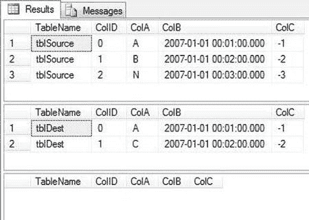

**Figure 19-4。执行 SSIS 包之前的测试脚本结果**

返回 SQL Server Data Tools 中的 Solution Explorer。右键单击 `IncrementalLoad.biml`，然后单击“生成 SSIS 包”。如果没有错误，说明你的 Biml 有效，你应该会在 Solution Explorer 的 SSIS Packages 虚拟文件夹中看到一个名为 `IncrementalLoadPackage.dtsx` 的 SSIS 包。如果 SSIS 包打开时没有错误，按 `F5` 键在调试器中执行它。如果一切正常，你应该会看到类似于 `Figure 19-5` 所示的结果。

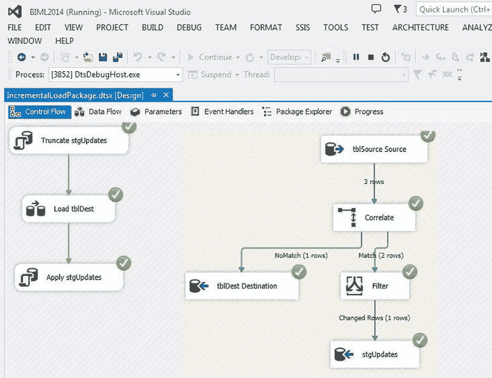

**Figure 19-5。IncrementalLoadPackage.dtsx 的调试执行**

现在执行测试脚本，返回的结果证明 `SSISIncrementalLoad_Dest.dbo.tblDest` 已接收从 `SSISIncrementalLoad_Source.dbo.tblSource` 加载的更新，如 `Figure 19-6` 所示。

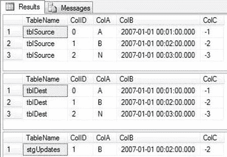

**Figure 19-6。IncrementalLoadPackage.dtsx 成功执行的结果**

通过检查结果并与 `Figure 19-4` 进行比较，我们可以看到 `SSISIncrementalLoad_Dest.dbo.tblDest` 已更新为与 `SSISIncrementalLoad_Source.dbo.tblSource` 相匹配。我们还可以看到，`ColID` 等于 `1` 的更新行被发送到了 `SSISIncrementalLoad_Dest.dbo.stgUpdates` 表。

这很酷。但等等，接下来更精彩。

### 使用 Biml 作为 SSIS 设计模式引擎

让我们用 Biml 做一些真正酷炫和有趣的事情。使用 `IncrementalLoad.biml` 文件作为模板，并应用 BISD Helper 提供的 Biml 库中的 .NET 集成（称为 BimlScript），我们将为一个新的 Biml 文件增加灵活性和通用性，该文件将在源数据库和暂存数据库中的所有表之间构建一个增量加载 SSIS 包。这是 ETL 中大写字母“E”的一个例子；这是一个提取 SSIS 设计模式。

 **注意** 此模式要求源表和暂存表在扩展 Biml 文件以创建 SSIS 包之前就存在。即使有这个限制（它可以被解决、自动化和克服），我相信这个例子展示了 Biml 的力量和变革性属性。

让我们首先向 `SSISIncrementalLoad_Source` 数据库添加新表，并创建（并填充）一个名为 `SSISIncrementalLoad_Stage` 的新数据库。首先，通过执行 `Listing 19-16` 中所示的 T-SQL 脚本向 `SSISIncrementalLoad_Source` 添加新表。

**Listing 19-16。添加并填充新的 SSISincrementalLoad_Source 表**

```sql
USE SSISIncrementalLoad_Source
GO

-- Create Source1 If Not Exists(Select name
From sys.tables
Where name = 'Source1')
CREATE TABLE dbo.Source1
(ColID int NOT NULL
,ColA varchar(10) NULL
,ColB datetime NULL
,ColC int NULL
,constraint PK_Source1 primary key clustered (ColID))
Go

-- Load Source1
INSERT INTO dbo.Source1
(ColID,ColA,ColB,ColC)
VALUES
(0, 'A', '1/1/2007 12:01 AM', -1),
(1, 'B', '1/1/2007 12:02 AM', -2),
(2, 'C', '1/1/2007 12:03 AM', -3),
(3, 'D', '1/1/2007 12:04 AM', -4),
(4, 'E', '1/1/2007 12:05 AM', -5),
(5, 'F', '1/1/2007 12:06 AM', -6)

-- Create Source2 If Not Exists(Select name
From sys.tables
Where name = 'Source2')
CREATE TABLE dbo.Source2
(ColID int NOT NULL
,Name varchar(25) NULL
,Value int NULL
,constraint PK_Source2 primary key clustered (ColID))
Go

-- Load Source2
INSERT INTO dbo.Source2
(ColID,Name,Value)
VALUES
(0, 'Willie', 11),
(1, 'Waylon', 22),
(2, 'Stevie Ray', 33),
(3, 'Johnny', 44),
(4, 'Kris', 55)

-- Create Source3 If Not Exists(Select name
From sys.tables
Where name = 'Source3')
CREATE TABLE dbo.Source3
(ColID int NOT NULL
,Value int NULL
,Name varchar(100) NULL
,constraint PK_Source3 primary key clustered (ColID))
Go

-- Load Source3
INSERT INTO dbo.Source3
(ColID,Value,Name)
VALUES
(0, 101, 'Good-Hearted Woman'),
(1, 202, 'Lonesome, Onry, and Mean'),
(2, 303, 'The Sky Is Crying'),
(3, 404, 'Ghost Riders in the Sky'),
(4, 505, 'Sunday Morning, Coming Down')
```

`Listing 19-16` 中的 T-SQL 创建并填充了三个新表。

*   `dbo.Source1`
*   `dbo.Source2`
*   `dbo.Source3`

执行 `Listing 19-17` 中的 T-SQL 来构建并填充 `SSISIncrementalLoad_Stage` 数据库。

**Listing 19-17。构建并填充 SSISIncrementalLoad_Stage 数据库**

```sql
Use master
Go

If Not Exists(Select name
From sys.databases
Where name = 'SSISIncrementalLoad_Stage')
Create Database SSISIncrementalLoad_Stage
Go

Use SSISIncrementalLoad_Stage
Go

CREATE TABLE dbo.tblSource(
        ColID int NOT NULL,
        ColA varchar(10) NULL,
        ColB datetime NULL,
        ColC int NULL
)

CREATE TABLE dbo.stgUpdates_tblSource(
        ColID int NOT NULL,
        ColA varchar(10) NULL,
        ColB datetime NULL,
        ColC int NULL
)
Go

INSERT INTO dbo.tblSource
(ColID,ColA,ColB,ColC)
VALUES
(0, 'A', '1/1/2007 12:01 AM', -1),
(1, 'B', '1/1/2007 12:02 AM', -2),
(2, 'N', '1/1/2007 12:03 AM', -3)
Go

CREATE TABLE dbo.Source1(
        ColID int NOT NULL,
        ColA varchar(10) NULL,
        ColB datetime NULL,
        ColC int NULL
)

CREATE TABLE dbo.


```sql
CREATE TABLE stgUpdates_Source1(
    ColID int NOT NULL,
    ColA varchar(10) NULL,
    ColB datetime NULL,
    ColC int NULL
)
GO

INSERT INTO dbo.Source1 (ColID, ColA, ColB, ColC)
VALUES
    (0, 'A', '1/1/2007 12:01 AM', -1),
    (1, 'Z', '1/1/2007 12:02 AM', -2)
GO

CREATE TABLE dbo.Source2(
    ColID int NOT NULL,
    Name varchar(25) NULL,
    Value int NULL
)

CREATE TABLE dbo.stgUpdates_Source2(
    ColID int NOT NULL,
    Name varchar(25) NULL,
    Value int NULL
)
GO

INSERT INTO dbo.Source2 (ColID, Name, Value)
VALUES
    (0, 'Willie', 11),
    (1, 'Waylon', 22),
    (2, 'Stevie', 33)
GO

CREATE TABLE dbo.Source3(
    ColID int NOT NULL,
    Value int NULL,
    Name varchar(100) NULL
)

CREATE TABLE dbo.stgUpdates_Source3(
    ColID int NOT NULL,
    Value int NULL,
    Name varchar(100) NULL
)
GO

INSERT INTO dbo.Source3 (ColID, Value, Name)
VALUES
    (0, 101, 'Good-Hearted Woman'),
    (1, 202, 'Are You Sure Hank Done It This Way?')
GO
```

让我们继续，在 Biml 项目中添加一个新的 Biml 文件。将此文件重命名为 `GenerateStagingPackages.biml`。在 `<Biml>` 标签之前，添加代码清单 19-18 中所示的代码片段。

**代码清单 19-18. 向 Biml 添加.NET 命名空间和初始方法调用**

```xml
<#@ import namespace="System.Data" #>
<#@ import namespace="Varigence.Hadron.CoreLowerer.SchemaManagement" #>
<# var connection = SchemaManager.CreateConnectionNode("SchemaProvider", "Data Source=(local);Initial Catalog=SSISIncrementalLoad_Source;Provider=SQLNCLI11.1;Integrated Security=SSPI;"); #>
<# var tables = connection.GenerateTableNodes(); #>
```

代码清单 19-18 中的代码将 `System.Data` 和 `Varigence.Hadron.CoreLowerer.SchemaManagement` 命名空间导入 Biml 文件。创建了一个名为 `connection` 的变量，并为其分配了一个 `SchemaManager.CreateConnectionNode` 对象的值，该对象指向 `SSISIncrementalLoad_Source` 数据库。`connection` 变量支持另一个名为 `tables` 的变量。`tables` 变量通过调用 `connection` 变量的 `GenerateTableNodes()` 方法进行填充，该方法将 `SSISIncremetalLoad_Source` 数据库中找到的表列表填充到 `tables` 中。

在 `<Biml>` 标签之后，添加一个包含两个 `Connection` 子节点的 `Connections` XML 节点，这样你的 Biml 文件现在看起来如代码清单 19-19 所示。

**代码清单 19-19. 向 GenerateStagingPackages.biml 文件添加连接**

```xml
<#@ import namespace="System.Data" #>
<#@ import namespace="Varigence.Hadron.CoreLowerer.SchemaManagement" #>
<# var connection = SchemaManager.CreateConnectionNode("SchemaProvider",
  "Data Source=(local);Initial Catalog=SSISIncrementalLoad_Source;Provider=
  SQLNCLI11.1;Integrated Security=SSPI;"); #>
<# var tables = connection.GenerateTableNodes(); #>
<Biml xmlns="http://schemas.varigence.com/biml.xsd">
  <Connections>
    <Connection Name="SSISIncrementalLoad_Source" ConnectionString=
      "Data Source=(local);Initial Catalog=SSISIncrementalLoad_Source;Provider=
      SQLNCLI11.1;Integrated Security=SSPI;" />
    <Connection Name="SSISIncrementalLoad_Stage" ConnectionString=
      "Data Source=(local);Initial Catalog=SSISIncrementalLoad_Stage;Provider=
      SQLNCLI11.1;OLE DB Services=1;Integrated Security=SSPI;" />
  </Connections>
```

正如我们在上一节设计的 `IncrementalLoad.biml` 文件中一样，`Connection` 节点是 SSIS 包中 SSIS 连接管理器的模板。接下来，在 `</Connections>` 标签之后立即添加一个 `Package` 节点。在这里，我们将对这个 Biml 文件及其功能进行一个关键修改。我们在此开始一个 C#循环，该循环将跨越此 Biml 文件除最后两行之外的所有内容。你的 Biml 文件现在应该包括代码清单 19-20 中的代码，紧跟在 `</Connections>` 标签之后。

**代码清单 19-20. 添加 Packages 节点并启动循环**

```xml
  <Packages>
    <# foreach (var table in tables) { #>
```

代码清单 19-20 中定义的循环将驱动 Biml 引擎，为在 `SSISIncrementalLoad_Source` 数据库中找到的每个表创建一个 SSIS 包。因为我们使用 SSIS 增量加载设计模式作为此包的模板，这个 Biml 文件将为这些表中的每一个构建一个增量加载 SSIS 包。

上面定义的变量稍后会在 Biml 文件中使用。紧跟在这些变量声明之后，添加代码清单 19-21 所示的 `Package` 节点。

**代码清单 19-21. 包含.NET 替换符的 Package 节点**

```xml
    <Package Name="IncrementalLoad_<#=table.Name#>" ConstraintMode=
       "Linear" ProtectionLevel="EncryptSensitiveWithUserKey">
```

这段 Biml 代码，就像这个 Biml 文件中的许多代码一样，是从 `IncrementalLoad.biml` 文件复制并修改而来的，以接受来自 ForEach 循环的.NET 覆盖。当展开此 Biml 时生成的每个 SSIS 包都将有一致的命名：`IncrementalLoad_<`*源表名*`>`。

还要注意 `Package` 节点的 `ConstraintMode` 属性被设置为 `"Linear"`。在 `IncrementalLoad.biml` 文件中，它被设置为 `"Parallel"`。区别很细微但功能强大。首先，Biml 编译器将自动为你创建优先约束。具体来说，它将根据它们在 Biml 文件中出现的顺序，在控制流中从一个任务到下一个任务创建 `OnSuccess` 优先约束。此功能使脚本编写和简单文件创作变得极其快速。其次，你可以在数据流任务中消除 `InputPath` 节点，因为 `InputPath` 将连接到直接出现在它之前的转换的默认输出路径。

在 `<Package>` 标签之后，立即添加一个 `Tasks` 节点，然后是一个配置如代码清单 19-22 所示的 `ExecuteSQL` 节点。

**代码清单 19-22. 添加任务和截断暂存表的执行 SQL 任务**

```xml
  <Tasks>
    <ExecuteSQL Name="Truncate stgUpdates_<#=table.Name#>"
          ConnectionName="SSISIncrementalLoad_Stage">
      <DirectInput>Truncate Table stgUpdates_<#=table.Name#></DirectInput>
    </ExecuteSQL>
```

再次注意，对暂存表执行截断操作的执行 SQL 任务采用了通用命名。当展开 Biml 文件时，源表的名称将替换 `<#=table.Name#>` 占位符。它将为源数据库中的每个表赋予不同的名称，但同时也是描述性和准确的。

在下一个清单（代码清单 19-23）中，我将向你展示用于增量加载数据流任务的 Biml。每个组件都包含必要的.NET 代码，以使 Biml 足够通用，能够响应不同的源表架构。

**代码清单 19-23. 通用数据流任务**

```xml
    <Dataflow Name="Load <#=table.Name#>">
      <Transformations>
        <OleDbSource Name="<#=table.Name#> Source" ConnectionName="SSISIncrementalLoad_Source">
          <DirectInput>SELECT <#=table.GetColumnList()#> FROM <#=table.SchemaQualifiedName#></DirectInput>
        </OleDbSource>
        <Lookup Name="Correlate" OleDbConnectionName="SSISIncrementalLoad_Stage" NoMatchBehavior="RedirectRowsToNoMatchOutput">
          <DirectInput>SELECT <#=table.GetColumnList()#> FROM dbo.<#=table.Name#></DirectInput>
          <Inputs>
            <# foreach (var keyColumn in table.Keys[0].Columns) { #>
            <Column SourceColumn="<#=keyColumn.Column#>" TargetColumn="<#=keyColumn.
```


### 测试时间

在解决方案资源管理器中，右键单击 `GenerateStagingPackages.biml` 文件，然后单击“生成 SSIS 包”。如果一切按计划进行，你的解决方案资源管理器窗口应与图 19-7 中所示的类似。

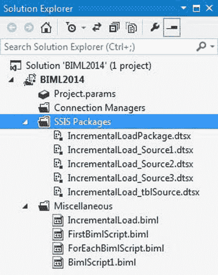

图 19-7. 一个 Biml 文件生成了四个 SSIS 包！

通过执行（并重新执行）Biml 扩展创建的四个 SSIS 包来进行进一步测试。当我执行名为 `IncrementalLoad_tblSource.dtsx` 的 SSIS 包时，我看到的结果（如图 19-8 所示）与之前观察到的（在图 19-5 中）非常相似。

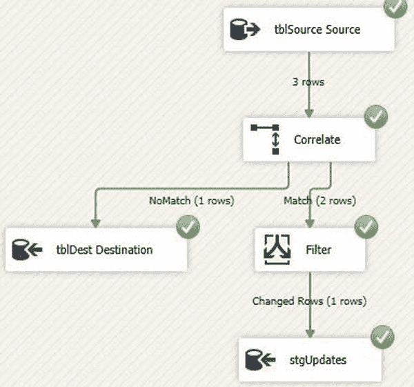

图 19-8. 动态构建的增量加载 SSIS 包

测试将表明其他 SSIS 包也执行得类似。

### 结论

在本章中，我们简要介绍了 Business Intelligence Markup Language 的一些功能。

我们展示了它作为领域特定语言在生成 SSIS 设计模式方面的实用性，重点关注增量加载模式。在最后一个例子中，我们演示了 Biml 集成的 .NET 功能，BimlScript，如何被用来创建一种基于模式的方法，使用经过验证的数据集成模式（增量加载）构建四个 SSIS 包。在我的机器上，这四个包在几秒钟内就生成了。我向你保证，根据测试，Biml 可以在几分钟内生成数百个增量加载 SSIS 包。这是一项改变游戏规则的技术，因为生成数百个 SSIS 包——即使使用模板和模式——也可能轻松消耗数据集成开发人员数月的时间。

# 第 20 章


### Biml 与 SSIS 框架

优雅的解决方案会带来更优雅的解决方案。这是优雅解决方案的一个特征，而 Business Intelligence Markup Language (Biml) *就是*一个优雅的解决方案。Biml 促进了 SSIS 包的快速开发。尽管这令人印象深刻，但 Biml 可以做得更多——多得多。我们无法在本卷中探索 Biml 的完整功能集，但我想研究一些额外的功能。

在本章中，我们将基于《Business Intelligence Markup Language》一章中的示例文件进行构建，添加一些额外的文件和功能。

### 将 Biml 与 SSIS 框架配合使用

附录 A 展示了构建基于文件系统的 SSIS Framework 的源代码。由于 SSIS 2014 通过 Package Deployment Model 支持向后兼容性，因此你可以在所有版本的 SSIS（迄今为止）中使用此 Framework。本章中的示例旨在与附录 A 中描述的 Framework 进行交互。

 **注意** 要完成以下示例，你将需要实现附录 A 中的 Framework 并完成名为 *Business Intelligence Markup Language* 的章节中的示例。

### 向框架添加 SSIS 包元数据

打开在 Business Intelligence Markup Language 章节中创建的解决方案。解决方案应命名为“Biml2014.sln”。添加一个新的 Biml 文件并将其重命名为“FrameworkSQLGen.biml”。添加第二个新的 Biml 文件并将其重命名为“i-FrameworkSQLGen.biml”。我将使用 i-FrameworkSQLGen.biml 文件来演示参数化 Biml 解决方案。

将以下 BimlScript 添加到 i-FrameworkSQLGen.biml 中，如清单 20-1 所示：

***清单 20-1***. 手动向 Framework 添加 SSIS 应用程序元数据

```
<# string applicationName = "Staging_Application"; string packageFolder = "I:\\Andy\\Projects\\BIML Demo\\"; string filename = @"G:\out\MyFile.sql"; string connectionString = "Data Source=(local);Initial Catalog=SSISIncrementalLoad_Source;Provider=SQLNCLI11.1;Integrated Security=SSPI;"; #>
```

清单 20-1 中显示的 BimlScript 是一个代码片段，包含带有初始值的变量声明。`applicationName` 变量是一个字符串，包含我要添加到 SSIS Framework 的 SSIS 应用程序的名称。`packageFolder` 字符串包含我在 Business Intelligence Markup Language 章节示例代码中生成的 SSIS 包的位置。`filename` 字符串变量包含将由 FrameworkSQLGen.biml 文件生成的 SQL 文件的完整路径。`connectionString` 变量包含此解决方案和 Business Intelligence Markup Language 章节中的示例所使用的源数据库的连接信息。

打开 FrameworkSQLGen.biml 文件并添加清单 20-2 中所示的代码：

***清单 20-2***. 开始编写 FrameworkSQLGen.biml 文件

```
<#@ template language="C#" tier="1" #> <#@ include file="i-FrameworkSQLGen.biml" #> <#@ import namespace="System.Data" #> <#@ import namespace="System.
```


文本

#> <#@ import namespace="System.IO" #> <#@ import namespace="Varigence.Hadron.CoreLowerer.SchemaManagement" #> <# var connection = SchemaManager.CreateConnectionNode("SchemaProvider", connectionString); #> <# var tables = connection.GenerateTableNodes();     int e = 10;     StringBuilder sb = new StringBuilder(); #>

第 1 行的模板指令指明了我将在此文件中使用的 .Net 语言（C#）以及该文件的“层级”。

 **注意** 了解更多关于 Biml 层级和语言元素的信息，请参阅 Reeves Smith 在 SQLServerCentral.com 上的优秀文章《Stairway to Biml Level 5 - Biml Language Elements》(`http://www.sqlservercentral.com/articles/BIML/111305/`)。

### 包含文件和命名空间

接下来是“包含文件”指令，它指向我先构建的 `i-FrameworkSQLGen.biml` 文件。包含此文件意味着在 `i-FrameworkSQLGen.biml` 中定义的变量在 `FrameworkSQLGen.biml` 文件中也可用。然后我包含了四个命名空间：`System.Data`、`System.IO`、`System.Text` 和 `Varigence.Hadron.CoreLowerer.SchemaManagement`。前三个指的是 .Net 库；第四个提供了对 Biml 程序集的引用。

### C# 应用程序逻辑

从第 7 行开始，C# 应用程序逻辑正式开始，首先是声明并初始化名为 `connection` 的变量。`connection` 通过 `CreateConnectionNode` 方法被设置为 `SchemaManager` 对象的 `ConnectionNode` 对象。这个 `ConnectionNode` 指向从 `i-FrameworkSQLGen.biml` 包含文件中的 `connectionString` 变量提供的连接字符串。

另一个名为 `tables` 的 C# 变量使用 `connection` 变量的 `GenerateTableNodes` 方法进行声明和初始化。`GenerateTableNodes` 方法创建一个表对象的集合，以供 BimlScript 使用。

另外声明并初始化了两个变量：一个名为 `e` 的 `int` 变量，将用于枚举框架中包的执行顺序；以及一个名为 `sb` 的 `StringBuilder` 变量，将用于构建用于加载 SSIS 应用程序框架元数据的 Transact-SQL 命令。

### 添加 SSIS 应用程序元数据

用于向框架添加 SSIS 应用程序的 Transact-SQL 脚本列在附录 A 的图 A-7 中，并在 清单 20-3 中展示。

**清单 20-3**. 手动向框架添加 SSIS 应用程序元数据

```sql
Use SSISConfig
Go

declare @ApplicationName varchar(255) = 'SSISApp1'
declare @ApplicationID int

/* Add the SSIS First Application */
If Not Exists(Select ApplicationName
              From cfg.Applications
              Where ApplicationName = @ApplicationName)
 begin
  print 'Adding ' + @ApplicationName
  exec cfg.AddSSISApplication @ApplicationName, @ApplicationID output
  print @ApplicationName + ' added.'
 end
Else
 begin
  Select @ApplicationID = ApplicationID
  From cfg.Applications
  Where ApplicationName = @ApplicationName
  print @ApplicationName + ' already exists in the Framework.'
 end
print ''
```

将此代码放在 `FrameworkSQLGen.biml` 中清单 2 的代码之后。我需要将此 Transact-SQL 加载到 `stringbuilder` 变量 (`sb`) 中，并且需要通过利用包含文件中的变量使其通用化。通过如 清单 20-4 所示将代码加载到 `stringbuilder` 中来实现这一点：

**清单 20-4**. 将 SSIS 应用程序元数据添加到 StringBuilder

```csharp
sb.AppendLine("Use SSISConfig");
sb.AppendLine("Go");
sb.AppendLine();
sb.AppendLine("declare @ApplicationName varchar(255) = '" + applicationName + "'");
sb.AppendLine("declare @ApplicationID int");
sb.AppendLine();
sb.AppendLine("/* Add the SSIS First Application */");
sb.AppendLine("If Not Exists(Select ApplicationName");
sb.AppendLine("              From cfg.Applications");
sb.AppendLine("              Where ApplicationName = @ApplicationName) ");
sb.AppendLine(" begin");
sb.AppendLine("  print 'Adding ' + @ApplicationName");
sb.AppendLine("  exec cfg.AddSSISApplication @ApplicationName, @ApplicationID output");
sb.AppendLine("  print @ApplicationName + ' added.'");
sb.AppendLine(" end");
sb.AppendLine("Else");
sb.AppendLine(" begin");
sb.AppendLine("  Select @ApplicationID = ApplicationID");
sb.AppendLine("  From cfg.Applications");
sb.AppendLine("  Where ApplicationName = @ApplicationName");
sb.AppendLine("  print @ApplicationName + ' already exists in the Framework.'");
sb.AppendLine(" end");
sb.AppendLine("print ''");
sb.AppendLine();
```

### SSIS 框架包参数

用于构建参数以管理包元数据的 Transact-SQL 可在 清单 A-5 和 A-9 的前面部分找到，并在此处的 清单 20-5 中展示：

**清单 20-5**. SSIS 框架包参数

```sql
declare @ExecutionOrder int = 10
declare @ApplicationID int = 1
declare @PackageID int = 1
declare @ApplicationName varchar(255) = 'SSISApp1'
declare @PackageFolder varchar(255) = 'F:\Andy\Projects\PublicFramework_PackageDeployment_2014\SSISConfig2014\'
declare @PackageName varchar(255) = 'Child1.dtsx'
```

向 `stringbuilder` 的 Transact-SQL 中添加声明，这些参数将用于将 SSIS 包元数据插入框架，省略了一些参数并添加了一些，如 清单 20-6 所示：

**清单 20-6**. 将 SSIS 包参数添加到 StringBuilder

```csharp
sb.AppendLine("declare @ExecutionOrder int");
sb.AppendLine("declare @PackageID int");
sb.AppendLine("declare @PackageFolder varchar(255) = '" + packageFolder + "'");
sb.AppendLine("declare @PackageName varchar(255)");
sb.AppendLine();
sb.AppendLine("/* Add Packages */");
sb.AppendLine();
```

### 通过循环加载包元数据

此 BimlScript 的实际工作是在一个循环内完成的，如 清单 20-7 所示：

**清单 20-7**. 开始循环以加载 SSIS 框架包元数据

```csharp
foreach (var table in tables)
{
        string tbl = "IncrementalLoad_" + table.Name + ".dtsx";
```

`foreach` 循环定义创建一个名为 `table` 的新变量，该变量将代表先前填充的 `tables` 集合中的每个 Biml 表。`tbl` 字符串变量被创建用于按名称标识 SSIS 包。

附录 A 中的 清单 A-5 和 A-9 的其余部分被整合并显示在 清单 20-8 中：

**清单 20-8**. 将 SSIS 框架包元数据添加到 StringBuilder

```csharp
sb.AppendLine("/* " + tbl +  " */");
sb.AppendLine();
sb.AppendLine("Set @PackageName = '" + tbl + "'");
sb.AppendLine("Set @ExecutionOrder = " + e.ToString());
sb.AppendLine("If Not Exists(Select PackageFolder + PackageName");
sb.AppendLine("              From cfg.Packages");
sb.AppendLine("              Where PackageFolder = @PackageFolder");
sb.AppendLine("                And PackageName = @PackageName)");
sb.AppendLine(" begin");
sb.AppendLine("  print 'Adding ' + @PackageFolder + @PackageName");
sb.AppendLine("  exec cfg.AddSSISPackage @PackageName, @PackageFolder, @PackageID output");
sb.AppendLine(" end");
sb.AppendLine("Else");
sb.AppendLine(" begin");
sb.AppendLine("  Select @PackageID = PackageID");
sb.AppendLine("  From cfg.Packages");
sb.AppendLine("  Where PackageFolder = @PackageFolder");
sb.AppendLine("    And PackageName = @PackageName");
sb.AppendLine("  print @PackageFolder + @PackageName + ' already exists in the Framework.'");
sb.AppendLine(" end");
sb.AppendLine();
sb.AppendLine("        If Not Exists(Select AppPackageID");
sb.AppendLine("              From cfg.AppPackages");
sb.AppendLine("              Where ApplicationID = @ApplicationID");
sb.AppendLine("                And PackageID = @PackageID)");
sb.AppendLine(" begin");
sb.AppendLine("  exec cfg.AddSSISApplicationPackage @ApplicationID, @PackageID, @ExecutionOrder");
sb.AppendLine("  print @PackageName + ' added to ' + @ApplicationName + ' application.'");
sb.AppendLine(" end");
sb.AppendLine("Else");
sb.AppendLine(" begin");
sb.AppendLine("  Update cfg.AppPackages");
sb.AppendLine("  Set ExecutionOrder = @ExecutionOrder");
sb.AppendLine("  Where ApplicationID = @ApplicationID");
sb.AppendLine("    And PackageID = @PackageID");
sb.AppendLine("  print @PackageName + ' execution order updated in the Framework.'");
sb.AppendLine(" end");
sb.AppendLine();
e = e + 10;
}
```


### 执行 Biml 文件

让我们通过生成 Transact-SQL 文件来进行测试，如 图 20-1 所示：

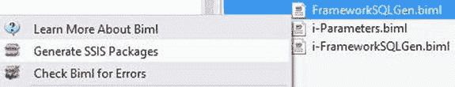

**图 20-1. 执行 FrameworkSQLGen.biml 文件**

右键单击 `FrameworkSQLGen.biml` 文件并单击“生成 SSIS 包”。文件 `MyFile.sql` 应该在 `i-FrameworkSQLGen.biml` 包含文件中指定的位置生成。在 SQL Server Management Studio (SSMS) 中打开该文件并执行 SQL 语句。您的输出应类似于 图 20-2 所示：

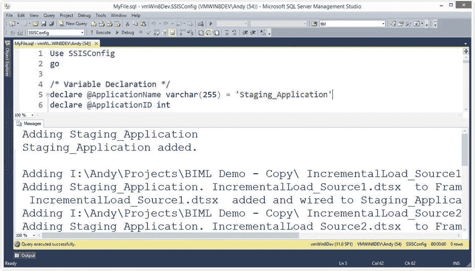

**图 20-2. 执行由 FrameworkSQLGen.biml 文件生成的 SQL 文件**

### 生成 SSIS 命令行

然而，使用 BimlScript 我们可以做更多的事情。我们可以生成使用 Framework 的 `Parent.dtsx` 包执行 SSIS 应用程序的命令行。

打开 `i-FrameworkSQLGen.biml` 文件并再添加几个变量，如 清单 20-10 所示：

**清单 20-10. 向 i-FrameworkSQLGen.biml 文件添加变量**

```
string FrameworkParentPkgPath = @"E:\Projects\SSISConfig2014\SSISConfig2014\Parent.dtsx";
string CmdFilename = @"G:\out\MyCmd.cmd";
```

您的文件位置将与 清单 20-10 中所示的不同。

向您的解决方案中添加一个新的 Biml 文件并将其重命名为 `"GenerateExecCmd.biml"`。将以下语句添加到 `GenerateExecCmd.biml` 中，如 清单 20-11 所示：

**清单 20-11. 构建 GenerateExecCmd.biml 文件**

```
<#@ template language="C#" tier="2" #>
<#@ include file="i-FrameworkSQLGen.biml" #>
<#@ import namespace="System.Text" #>
<#@ import namespace="System.IO" #>
<#  StringBuilder sb = new StringBuilder();
    sb.AppendLine("dtexec /FILE " + FrameworkParentPkgPath + " /SET \\Package.Variables[ApplicationName].Properties[Value];" + applicationName);
    using (StreamWriter outfile = new StreamWriter(CmdFilename))
                {
                outfile.Write(sb.ToString());
                }
#>
```

在解决方案资源管理器中右键单击 `GenerateExecCmd.biml` 文件，然后单击“生成 SSIS 包”。打开 Windows 资源管理器并浏览到您在 `i_FrameworkSQLGen.biml` 文件中为 `CmdFilename` 变量提供的文件夹。打开刚刚生成的文件，您应该观察到一个类似于 清单 20-12 中所示的字符串：

**清单 20-12. GenerateExecCmd.biml 文件生成的命令行**

```
dtexec /FILE E:\Projects\SSISConfig2014\SSISConfig2014\Parent.dtsx /SET \Package.Variables[ApplicationName].Properties[Value];Staging_Application
```

因为此命令行包含在一个“cmd”文件中，您应该能够双击它并在命令提示符窗口中观察其执行情况，类似于 图 20-3 所示：

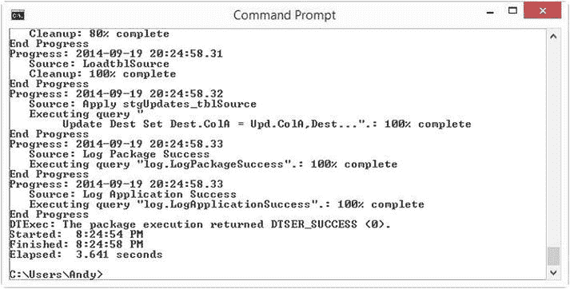

**图 20-3. 执行由 GenerateExecCmd.biml 生成的命令行**

这有多酷？

### 总结

在本章中，我们扩展了关于业务智能标记语言 (Business Intelligence Markup Language) 功能的知识。我们已经演示了如何使用 Biml 动态生成 Transact-SQL 语句和执行命令行。

# 附录 A


### SSIS 框架的演进

SSIS 框架是 SSIS 设计模式之后合乎逻辑的下一步，因为框架包含许多模式。至少，一个 SSIS 框架应该提供包执行控制和监控。这听起来很简单，但我向您保证，事实并非如此。执行控制需要对 Integration Services 运行时 API 有工作知识。理解*紧耦合*和*松耦合*的微妙之处不仅有帮助，它可能成就或毁掉您的日子（或数据集成解决方案）。

如果 SSIS 2012 和 2014 包含 SSIS 目录，为什么还需要 SSIS 框架？这是一个很好的问题。SSIS 2012 和 2014 目录使用项目部署模型——这是在 SQL Server Data Tools - Business Intelligence (SSDT-BI) 中开发的 SSIS 项目的默认模型。但 SSIS 2012 和 2014 也包含包部署模型，因此它们支持将传统 SSIS 项目升级到 SSIS 2012 或 2014。此外，有使用案例既使用 SSIS 目录进行执行和监控，也使用自定义框架和包部署模型。作为数据集成架构师，我非常感谢 Microsoft SSIS 团队提供了这两种选项。

在本附录中，我将引导您设计和构建一个自定义的、串行的 SSIS 框架，我将其命名为 SSIS 执行和监控框架。该框架将与 SSIS 2012/2014 的包部署模型配合使用，并包含一个 SQL Server Reporting Services 解决方案。构建 SSIS 框架是一项高级任务。我将帮助您从头开始构建它，使用本书前面介绍的许多设计模式。

### 从中间开始

我们从执行控制的核心开始，即父-子模式。

```
AppendLine("                And PackageID = @PackageID");
sb.AppendLine("                And ExecutionOrder = @ExecutionOrder)");
sb.AppendLine(" begin");
sb.AppendLine("  print 'Adding ' + @ApplicationName + '.' + @PackageName + ' to Framework with ExecutionOrder ' + convert(varchar, @ExecutionOrder)");
sb.AppendLine("  exec cfg.AddSSISAppPackage @ApplicationID, @PackageID, @ExecutionOrder");
sb.AppendLine("  print @PackageName + ' added and wired to ' + @ApplicationName");
sb.AppendLine(" end");
sb.AppendLine("Else");
sb.AppendLine(" print @ApplicationName + '.' + @PackageName + ' already exists in the Framework with ExecutionOrder ' + convert(varchar, @ExecutionOrder)");
sb.AppendLine();
e += 10;
}
```

此循环内的代码针对从连接对象的 `GenerateTableNodes()` 方法调用填充的表集合中包含的每个包执行。每次迭代以一条注释开始以标识 SSIS 包的名称，随后设置 `PackageName` 和 `ExecutionOrder` 参数值。`PackageName` 设置为字符串变量 `tbl` 中包含的 SSIS 包的名称；`ExecutionOrder` 设置为整数变量 `e` 中包含的值的字符串版本。

接下来，一条检查包是否存在于 Framework 中的条件语句被添加到 `StringBuilder` 变量 `"sb"` 中。如果包元数据不存在，则通过执行 `cfg.AddSSISPackage` 存储过程来添加它，该过程返回 `PackageID` 参数。如果包元数据存在，则执行一条填充 `PackageID` 参数的语句。

添加到 `stringbuilder` 中的 Transact-SQL 的下一部分是一个类似的部分，用于关联 SSIS 包和应用程序元数据。这是通过向 `cfg.AppPackages` “桥接”表添加行来实现的——或者告知用户此关系已经存在。

循环的最后一条语句将变量 `e` 的值增加 10。

BimlScript 的最后部分将 `stringbuilder` 的内容写入到 `i-FrameworkSQLGen.biml` 文件中由 `filename` 变量指定的文件中，如 清单 20-9 所示：

**清单 20-9. 将 Stringbuilder 中的 Transact-SQL 写入输出文件**

```
using (StreamWriter outfile = new StreamWriter(filename))
{
    outfile.Write(sb.ToString());
}
    #>
```


首先，您需要创建一个名为 `SSISConfig2014` 的新 SSIS 解决方案和项目。将默认的 `Package.dtsx` 重命名为 `Child1.dtsx`。

### 配置子包

打开 `Child1` SSIS 包，并向控制流添加一个脚本任务。将该脚本任务重命名为 `Who Am I?`，然后打开其编辑器。

在“脚本”页面上，将 `ScriptLanguage` 属性设置为 `Microsoft Visual Basic 2012`。单击 `ReadOnlyVariables` 属性值文本框中的省略号，并添加 `System::TaskName` 和 `System::PackageName` 变量。

打开脚本编辑器，并在 `Sub Main()` 中添加以下代码。

**清单 A-1.** Child1.dtsx 包中“Who Am I?”脚本任务的 Sub Main
```vb
Public Sub Main()
    Dim sPackageName As String = Dts.Variables("PackageName").Value.ToString
    Dim sTaskName As String = Dts.Variables("TaskName").Value.ToString
    MsgBox("I am " & sPackageName, , sTaskName)
    Dts.TaskResult = ScriptResults.Success
End Sub
```

清单 A-1 中显示的代码会弹出一个消息框，通知观察者该消息框源自哪个包。这是一段可重用的代码。您可以将此脚本任务复制并粘贴到任何 SSIS 包中，每次执行方式都相同。

现在关闭编辑器，并在 SSDT 调试器中执行 `Child1.dtsx` 包。当我执行该包时，我会看到一个类似于图 A-1 所示的消息框。

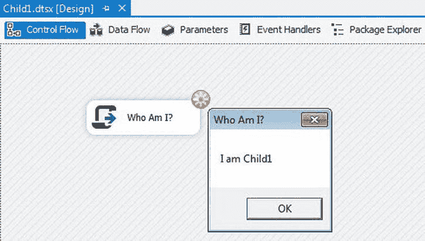
**图 A-1.** 来自 Child1.dtsx 的消息框

`Child1.dtsx` 将是您的第一个测试包。我们将继续使用 `Child1.dtsx` 来对 SSIS 执行和监控框架进行测试。

### 转换部署模型

在继续之前，将 SSIS 的部署模型从项目部署模型（默认）更改为包部署模型。

要完成转换，请在解决方案资源管理器中右键单击 SSIS 项目，然后单击 **“转换为包部署模型”**，如图 A-2 所示。

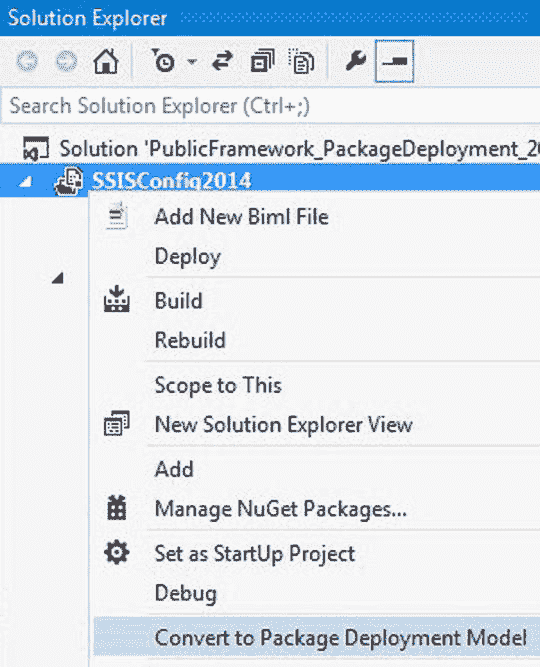
**图 A-2.** 将项目转换为包部署模型

您需要在对话框中单击“确定”按钮，以确认您了解这将更改您可在 SSIS 中使用的功能。转换完成后，您将看到一个结果窗格，通知您项目 `Child1.dtsx` 已转换为包部署模型。解决方案资源管理器中的项目也会指示已选择非默认部署模型，如图 A-3 所示。

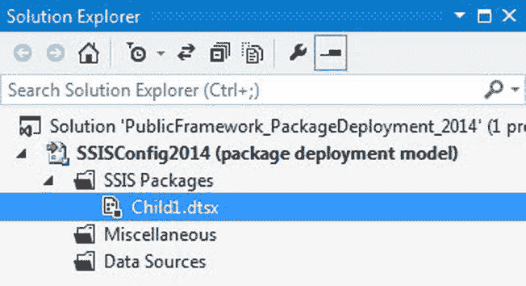
**图 A-3.** 包部署模型

### 创建父包

添加一个新的 SSIS 包并将其重命名为 `Parent.dtsx`。向 `Parent.dtsx` 的控制流添加一个“执行包任务”。

将“执行包任务”重命名为 `Execute Child Package`，然后打开其编辑器。在“包”页面上，将 `Location` 属性设置为 **文件系统**，然后单击 `Connection` 属性值的下拉菜单。单击 **<新建连接…>** 以配置新的文件连接管理器。将文件连接管理器编辑器的 `Usage Type` 属性设置为 **现有文件**。

浏览到 `SSISConfig2014` 项目的位置并选择 `Child1.dtsx`。单击“确定”按钮关闭文件连接管理器编辑器，然后再次单击“确定”关闭“执行包任务编辑器”。

请注意在配置“执行包任务”时创建的文件连接管理器。它被命名为 `Child1.dtsx`；将其重命名为 `Child.dtsx`。

在 SSDT 调试器中执行 `Parent.dtsx` 包进行测试。如果一切按计划进行，`Child1.dtsx` 将执行并显示图 A-1 所示的消息框。确认该消息框并停止调试器。

### 实现动态路径管理

这就是父-子模式的实际应用。您可以通过一点元数据来改进父-子模式。怎么做？很高兴您这么问。

首先，添加一个名为 `ChildPackagePath`（字符串类型）的 SSIS 变量。单击 `Child.dtsx` 连接管理器，然后按 F4 显示属性。文件连接管理器的 `ConnectionString` 属性是文件的路径。选择 `ConnectionString` 属性，将其复制到剪贴板，然后将其粘贴到 `ChildPackagePath` SSIS 变量的 `Value` 属性中。

返回到名为 `Child.dtsx` 的文件连接管理器的属性，单击 `Expressions` 属性值文本框中的省略号。当“属性表达式编辑器”显示时，从“属性”下拉菜单中选择 `ConnectionString`，如图 A-4 所示。

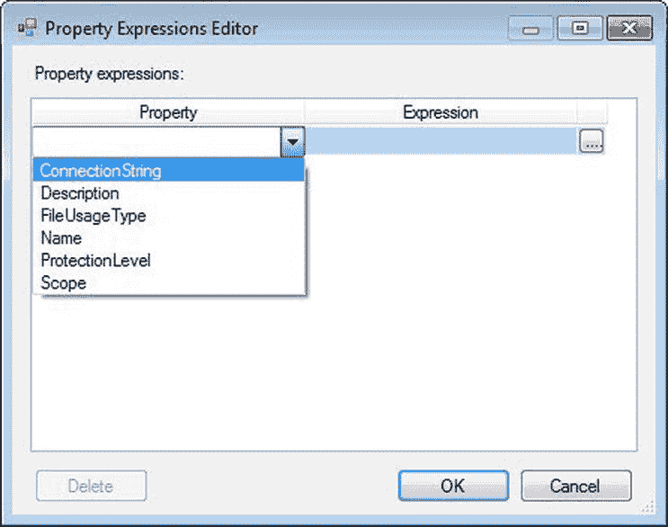
**图 A-4.** 文件连接管理器属性表达式编辑器

单击 `ConnectionString` 旁边的“表达式”文本框中的省略号。在“表达式生成器”左上角展开“变量和参数”虚拟文件夹。将变量 `User::ChildPackagePath` 从虚拟文件夹拖到“表达式”文本框中，然后单击“计算表达式”按钮，如图 A-5 所示。

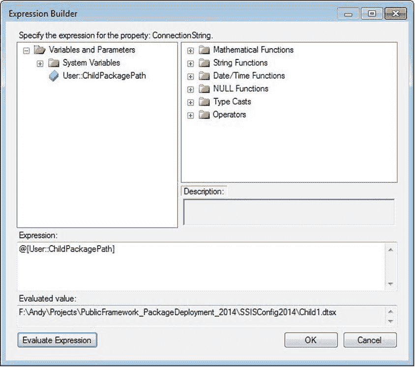
**图 A-5.** 将 User::ChildPackagePath 变量赋给 ConnectionString 表达式

单击“确定”关闭表达式生成器，然后再次单击“确定”关闭属性表达式编辑器。至此，`Child.dtsx` 文件连接管理器的 `ConnectionString` 属性已由 `User::ChildPackagePath` SSIS 变量管理。

### 用第二个子包测试

您可以通过创建第二个测试子包来测试此功能。幸运的是，创建第二个测试子包相对简单。

在解决方案资源管理器中，右键单击 `Child1.dtsx` SSIS 包，然后单击“复制”。右键单击“SSIS 包”虚拟文件夹，然后单击“粘贴”。将新包的名称从 `Child1 1.dtsx` 更改为 `Child2.dtsx`。

返回到 `Parent.dtsx` 包，将 `ChildPackagePath` 变量的值更改为 `Child2.dtsx` 替换 `Child1.dtsx`。在 SSDT 调试器中执行 `Parent.dtsx` 并观察结果，如图 A-6 所示。

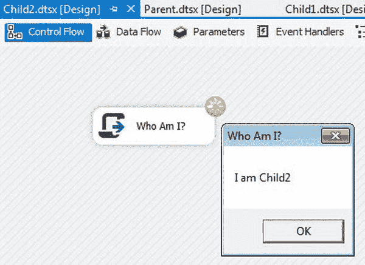
**图 A-6.** 在父-子模式中执行 Child2.dtsx

非常酷，对吧？我们才刚刚开始！

### 创建元数据数据库

让我们创建一个数据库来保存包元数据。打开 SQL Server Management Studio (SSMS) 并执行清单 A-2 中所示的 T-SQL 脚本。

**清单 A-2.** 创建 SSISConfig 数据库
```sql
Use master
go

/* SSISConfig database */
If Not Exists(Select name
              From sys.databases
              Where name = 'SSISConfig')
 begin
  print 'Creating SSISConfig database'
  Create Database SSISConfig
  print 'SSISConfig database created'
 end
Else
 print 'SSISConfig database already exists.'
print ''
go
```

清单 A-2 中的脚本是可重复执行的。此外，它通过 `Print` 语句告知执行脚本的人员其操作。首次执行此脚本时，您将在 SSMS 的“消息”选项卡中看到以下消息：
```
Creating SSISConfig database
SSISConfig database created
```

第二次及之后每次执行相同的脚本时，您将看到此消息：
```
SSISConfig database already exists.
```

编写可重复执行的 T-SQL 并不总是可行，但在可行时，这是一个好主意。


### 构建 SSIS 配置数据库

现在我们有了数据库，我们将构建一个表来保存 SSIS 包元数据。清单 A-3 包含了这样一个表的 T-SQL。

#### 清单 A-3. 构建 cfg 模式和 cfg.Packages 表

```sql
Use SSISConfig
go

/* cfg schema */
If Not Exists(Select name
              From sys.schemas
              Where name = 'cfg')
 begin
  print 'Creating cfg schema'
  declare @sql varchar(100) = 'Create Schema cfg'
  exec(@sql)
  print 'Cfg schema created'
 end
Else
 print 'Cfg schema already exists.'
print ''

/* cfg.Packages table */
If Not Exists(Select s.name + '.' + t.name
              From sys.tables t
              Join sys.schemas s
                On s.schema_id = t.schema_id
              Where s.name = 'cfg'
                And t.name = 'Packages')
 begin
  print 'Creating cfg.Packages table'
  Create Table cfg.Packages
  (
    PackageID int identity(1,1)
     Constraint PK_Packages
      Primary Key Clustered
   ,PackageFolder varchar(255) Not Null
   ,PackageName varchar(255) Not Null
  )
  print 'Cfg.Packages created'
 end
Else
 print 'Cfg.Packages table already exists.'
print ''
```

清单 A-3 中的脚本创建了一个名为 `cfg` 的模式（如果它不存在的话）；然后它创建了一个名为 `cfg.Packages` 的表，该表包含三列：

*   `PackageID` 是一个标识列，用作主键。
*   `PackageFolder` 是一个 `VarChar(255)` 列，用于保存包含 SSIS 包的文件夹路径。
*   `PackageName` 是一个 `VarChar(255)` 列，包含 SSIS 包的名称。

我最近开始将支持此类存储库的存储过程、函数和视图称为数据库编程接口（DPI），而不是应用程序编程接口（API），因为数据库*不是*应用程序。在这里，您应该开始构建 `SSISConfig` DPI，首先创建一个存储过程来将数据加载到 `cfg.Packages` 表中，如清单 A-4 所示。

#### 清单 A-4. cfg.AddSSISPackages 存储过程

```sql
/* cfg.AddSSISPackage stored procedure */
If Exists(Select s.name + '.' + p.name
          From sys.procedures p
          Join sys.schemas s
            On s.schema_id = p.schema_id
          Where s.name = 'cfg'
            And p.name = 'AddSSISPackage')
 begin
  print 'Dropping cfg.AddSSISPackage stored procedure'
  Drop Procedure cfg.AddSSISPackage
  print 'Cfg.AddSSISPackage stored procedure dropped'
 end
print 'Creating cfg.AddSSISPackage stored procedure'
print ''
go

Create Procedure cfg.AddSSISPackage
  @PackageName varchar(255)
 ,@PackageFolder varchar(255)
 ,@PkgID int output
As

  Set NoCount On

  declare @tbl table (PkgID int)

  If Not Exists(Select PackageFolder + PackageName
                From cfg.Packages
                Where PackageFolder = @PackageFolder
                  And PackageName = @PackageName)
   begin
    Insert Into cfg.Packages
    (PackageName
    ,PackageFolder)
    Output inserted.PackageID Into @tbl
    Values (@PackageName, @PackageFolder)
   end
  Else
   insert into @tbl
   (PkgID)
   (Select PackageID
    From cfg.Packages
    Where PackageFolder = @PackageFolder
      And PackageName = @PackageName)

   Select @PkgID = PkgID From @tbl
go
print 'Cfg.AddSSISPackage stored procedure created.'
print ''
```

请注意，`cfg.AddSSISPackage` 存储过程返回一个整数值，该值表示 `cfg.Packages` 表中的标识列——`PackageID`。您稍后将使用此整数值。一旦此存储过程就位，您就可以使用清单 A-5 中的 T-SQL 脚本来添加项目中的包。

#### 清单 A-5. 将包添加到 cfg.Packages 表

```sql
/* Variable Declaration */
declare @PackageFolder varchar(255) = 'F:\Andy\Projects\PublicFramework_PackageDeployment_2014\SSISConfig2014\'
declare @PackageName varchar(255) = 'Child1.dtsx'
declare @PackageID int

/* Add the Child1.dtsx SSIS Package*/
If Not Exists(Select PackageFolder + PackageName
              From cfg.Packages
              Where PackageFolder = @PackageFolder
                And PackageName = @PackageName)
 begin
  print 'Adding ' + @PackageFolder + @PackageName
  exec cfg.AddSSISPackage @PackageName, @PackageFolder, @PackageID output
 end
Else
 begin
  Select @PackageID = PackageID
  From cfg.Packages
  Where PackageFolder = @PackageFolder
    And PackageName = @PackageName
  print @PackageFolder + @PackageName + ' already exists in the Framework.'
 end

set @PackageName = 'Child2.dtsx'
/* Add the Child2.dtsx SSIS Package*/
If Not Exists(Select PackageFolder + PackageName
              From cfg.Packages
              Where PackageFolder = @PackageFolder
                And PackageName = @PackageName)
 begin
  print 'Adding ' + @PackageFolder + @PackageName
  exec cfg.AddSSISPackage @PackageName, @PackageFolder, @PackageID output
 end
Else
 begin
  Select @PackageID = PackageID
  From cfg.Packages
  Where PackageFolder = @PackageFolder
    And PackageName = @PackageName
  print @PackageFolder + @PackageName + ' already exists in the Framework.'
 End
```

我们现在有足够的条件来测试我的 SSIS 执行和监控框架的下一步，所以让我们回到 SSDT。在控制流中添加一个执行 SQL 任务，并将其重命名为 **Get PackageMetadata**。打开编辑器并将 `ResultSet` 属性更改为 `Single row`。将 `ConnectionType` 属性更改为 `ADO.Net`。单击 `Connection` 属性中的下拉菜单，然后单击 <New connection…>。配置一个指向 `SSISConfig` 数据库的 ADO.Net 连接。将 `SQLStatement` 属性设置为以下 T-SQL 脚本：

```sql
Select PackageFolder + PackageName
From cfg.Packages
Where PackageName = 'Child1.dtsx'
```

在 `Result Set` 页面上，添加一个结果集。将 `Result Name` 设置为 `0`，将 `Variable Name` 设置为 `User::ChildPackagePath`。在 Get Package Metadata 执行 SQL 任务和 Execute Child Package 执行包任务之间连接一个优先约束。执行 `Parent.dtsx` 包进行测试。会发生什么？Get Package Metadata 执行 SQL 任务运行一个查询，返回存储在 `SSISConfig.cfg.Packages` 表中的 `Child1.dtsx` 包的完整路径。返回的路径被发送到 `ChildPackagePath` 变量。请记住，此变量控制着 `Child.dtsx` 文件连接管理器，该管理器由执行包任务使用。

修改 Get Package Metadata 执行 SQL 任务中的查询以返回 `Child2.dtsx` 并重新测试。

### 引入 SSIS 应用程序

SSIS 应用程序是按预定顺序执行的 SSIS 包的集合。让我们首先向 `SSISConfig` 数据库添加几个表和支持它们的存储过程。

首先，在 `SSISConfig` 中使用清单 A-6 中的 T-SQL 创建一个名为 `cfg.Applications` 的表，以及一个将应用程序添加到该表的存储过程。

#### 清单 A-6. 构建 cfg.Applications 和 cfg.AddSSISApplication

```sql
/* cfg.Applications table */
If Not Exists(Select s.name + '.' + t.name
              From sys.tables t
              Join sys.schemas s
                On s.schema_id = t.schema_id
              Where s.name = 'cfg'
                And t.name = 'Applications')
 begin
  print 'Creating cfg.Applications table'
  Create Table cfg.Applications
  (
    ApplicationID int identity(1,1)
     Constraint PK_Applications
      Primary Key Clustered
   ,ApplicationName varchar(255) Not Null
    Constraint U_Applications_ApplicationName
     Unique
  )
  print 'Cfg.Applications created'
 end
Else
 print 'Cfg.Applications table already exists.'
print ''
```


### 已创建的应用程序' 否则打印 'Cfg.Applications 表已存在。' 打印 '' /* cfg.AddSSISApplication 存储过程 */ 如果存在(选择 s.name + '.' + p.name 从系统过程 p 连接系统架构 s 在 s.schema_id = p.schema_id 处 其中 s.name = 'cfg' 并且 p.name = 'AddSSISApplication') 开始 打印 '正在删除 cfg.AddSSISApplication 存储过程' 删除过程 cfg.AddSSISApplication 打印 'Cfg.AddSSISApplication 存储过程已删除' 结束 打印 '正在创建 cfg.AddSSISApplication 存储过程' 打印 '' Go

### 创建过程 cfg.AddSSISApplication

```sql
创建过程 cfg.AddSSISApplication
 @ApplicationName varchar(255)
 ,@AppID int 输出
As
 设置 NoCount 开启
 声明 @tbl 表格 (AppID int)
 如果不存在(选择 ApplicationName
 从 cfg.Applications
 其中 ApplicationName = @ApplicationName)
 开始
 插入到 cfg.Applications
 (ApplicationName)
 输出 inserted.ApplicationID 到 @tbl
 值 (@ApplicationName)
 结束
 否则
 插入到 @tbl
 (AppID)
 (选择 ApplicationID
 从 cfg.Applications
 其中 ApplicationName = @ApplicationName)
 选择 @AppID = AppID 从 @tbl
Go
打印 'Cfg.AddSSISApplication 存储过程已创建。'
打印 ''
```

请注意，`cfg.AddSSISApplication` 存储过程返回一个整数值，该值代表 `cfg.Applications` 表中的标识列——`ApplicationID`。使用 清单 A-7 中的 T-SQL 语句向表中添加一个 SSIS 应用程序。

#### 清单 A-7. 添加一个 SSIS 应用程序

```sql
声明 @ApplicationName varchar(255) = 'SSISApp1'
声明 @ApplicationID int

/* 添加第一个 SSIS 应用程序 */
如果不存在(选择 ApplicationName
 从 cfg.Applications
 其中 ApplicationName = @ApplicationName)
 开始
 打印 '正在添加 ' + @ApplicationName
 执行 cfg.AddSSISApplication @ApplicationName, @ApplicationID 输出
 打印 @ApplicationName + ' 已添加。'
 结束
否则
 开始
 选择 @ApplicationID = ApplicationID
 从 cfg.Applications
 其中 ApplicationName = @ApplicationName
 打印 @ApplicationName + ' 已存在于框架中。'
 结束
打印 ''
```

清单 A-7 中的脚本使用 `cfg.AddSSISApplication` 存储过程将 `SSISApp1` SSIS 应用程序添加到 `SSISConfig` 数据库的 `cfg.Applications` 表中。

### 关于关系的说明

一个 SSIS 应用程序是一个按预定顺序执行的 SSIS 包集合，因此 SSIS 应用程序与 SSIS 包之间的关系是一对多，这是相当明显的。可能不那么明显的是 SSIS 包与 SSIS 应用程序之间的关系。这里体现了选择基于模式开发的一个关键好处：代码可重用性，特别是针对 SSIS 包代码。考虑第 7 章末尾关于平面文件设计模式的归档文件模式。在一个从几十或数百个平面文件源加载数据的企业中，这个包可能会被不同的 SSIS 应用程序多次调用。因此，SSIS 包与 SSIS 应用程序之间的关系*也*是一对多。如果你做集合运算，这些关系结合起来会在应用程序表和包表之间创建一个多对多关系。这意味着你需要一个桥接表或解析器表在它们之间来创建 SSIS 应用程序和 SSIS 包之间的映射。

我称这个表为 `cfg.AppPackages`。清单 A-8 包含创建 `cfg.AppPackages` 及其加载存储过程的 T-SQL 脚本。

#### 清单 A-8. 创建 cfg.AppPackages 和 cfg.AddSSISApplicationPackage

```sql
/* cfg.AppPackages 表 */
如果不存在(选择 s.name + '.' + t.name
 从系统表 t
 连接系统架构 s
 在 s.schema_id = t.schema_id 处
 其中 s.name = 'cfg'
 并且 t.name = 'AppPackages')
 开始
 打印 '正在创建 cfg.AppPackages 表'
 创建表 cfg.AppPackages
 (
 AppPackageID int 标识(1,1)
 约束 PK_AppPackages
 主键 聚集
 ,ApplicationID int 非空
 约束 FK_cfgAppPackages_cfgApplications_ApplicationID
 外键 引用 cfg.Applications(ApplicationID)
 ,PackageID int 非空
 约束 FK_cfgAppPackages_cfgPackages_PackageID
 外键 引用 cfg.Packages(PackageID)
 ,ExecutionOrder int 空
 )
 打印 'Cfg.AppPackages 已创建'
 结束
否则
 打印 'Cfg.AppPackages 表已存在。'
打印 ''

/* cfg.AddSSISApplicationPackage 存储过程 */
如果存在(选择 s.name + '.' + p.name
 从系统过程 p
 连接系统架构 s
 在 s.schema_id = p.schema_id 处
 其中 s.name = 'cfg'
 并且 p.name = 'AddSSISApplicationPackage')
 开始
 打印 '正在删除 cfg.AddSSISApplicationPackage 存储过程'
 删除过程 cfg.AddSSISApplicationPackage
 打印 'Cfg.AddSSISApplicationPackage 存储过程已删除'
 结束
打印 '正在创建 cfg.AddSSISApplicationPackage 存储过程'
Go

创建过程 cfg.AddSSISApplicationPackage
 @ApplicationID int
 ,@PackageID int
 ,@ExecutionOrder int = 10
As
 设置 NoCount 开启
 如果不存在(选择 AppPackageID
 从 cfg.AppPackages
 其中 ApplicationID = @ApplicationID
 并且 PackageID = @PackageID)
 开始
 插入到 cfg.AppPackages
 (ApplicationID
 ,PackageID
 ,ExecutionOrder)
 值 (@ApplicationID, @PackageID, @ExecutionOrder)
 结束
Go
打印 'Cfg.AddSSISApplicationPackage 存储过程已创建。'
打印 ''
```

要创建 SSIS 应用程序和 SSIS 包之间的映射，你需要两者的 ID。执行以下查询返回你所需的信息：

```sql
选择 * 从 cfg.Applications
选择 * 从 cfg.Packages
```

你现在将使用该信息来执行 `cfg.AddSSISApplicationPackage` 存储过程，在 `SSISConfig` 数据库的元数据中构建 `SSISApp1` 并为其分配 `Child1.dtsx` 和 `Child2.dtsx`——按此顺序。我使用 清单 A-9 中所示的 T-SQL 脚本来完成映射。

#### 清单 A-9. 将 Child1 和 Child2 SSIS 包耦合到 SSISApp1 SSIS 应用程序

```sql
声明 @ExecutionOrder int = 10
声明 @ApplicationID int = 1
声明 @PackageID int = 1
声明 @ApplicationName varchar(255) = 'SSISApp1'
声明 @PackageFolder varchar(255) = 'F:\Andy\Projects\PublicFramework_PackageDeployment_2014\SSISConfig2014\'
声明 @PackageName varchar(255) = 'Child1.dtsx'

如果不存在(选择 AppPackageID
 从 cfg.AppPackages
 其中 ApplicationID = @ApplicationID
 并且 PackageID = @PackageID
 并且 ExecutionOrder = @ExecutionOrder)
 开始
 打印 '正在添加 ' + @ApplicationName + '.' + @PackageName
 + ' 到框架中，执行顺序为 ' + convert(varchar, @ExecutionOrder)
 执行 cfg.AddSSISApplicationPackage @ApplicationID, @PackageID, @ExecutionOrder
 打印 @PackageName + ' 已添加并连接到 ' + @ApplicationName
 结束
否则
 打印 @ApplicationName + '.' + @PackageName + ' 已存在于框架中，执行顺序为 '
 + convert(varchar, @ExecutionOrder)

/*Child2.dtsx */
设置 @PackageName = 'Child2.dtsx'
设置 @ExecutionOrder = 20
设置 @PackageID = 2

如果不存在(选择 AppPackageID
 从 cfg.AppPackages
 其中 ApplicationID = @ApplicationID
 并且 PackageID = @PackageID
 并且 ExecutionOrder = @ExecutionOrder)
 开始
 打印 '正在添加 ' + @ApplicationName + '.' + @PackageName + ' 到框架中，执行顺序为 ' + convert(varchar, @ExecutionOrder)
 执行 cfg.AddSSISApplicationPackage @ApplicationID, @PackageID, @ExecutionOrder
 打印 @PackageName + ' 已添加并连接到 ' + @ApplicationName
 结束
否则
 打印 @ApplicationName + '.' + @PackageName + ' 已存在于框架中，执行顺序为 '
 + convert(varchar, @ExecutionOrder)
```


AddSSISApplicationPackage @ApplicationID, @PackageID, @ExecutionOrder    print @PackageName + ' added and wired to ' + @ApplicationName  end Else  print @ApplicationName + '.' + @PackageName + ' already exists in the Framework with ExecutionOrder ' + convert(varchar, @ExecutionOrder)
```

关于 T-SQL 脚本中展示的一点说明。这不是我将元数据加载到生产（甚至测试）环境的方式。我不会重新声明 `ApplicationName`、`PackageFolder`、`PackageName`、`ApplicationID` 和 `PackageID` 这些变量；相反，我会复用前面 T-SQL 脚本中的这些值。我之前提到过，我们稍后将使用 `ApplicationID` 和 `PackageID` 的值，这正是对此的暗示。我将在本附录后面提供完整的 T-SQL 元数据加载脚本。

### 在 T-SQL 中检索 SSIS 应用程序

现在，SSIS 应用程序元数据已存储在 `SSISConfig` 数据库中。太好了，接下来呢？是时候构建一个存储过程，以便为给定的 SSIS 应用程序返回我们想要的 SSIS 包元数据了。清单 A-10 包含了用于构建名为 `cfg.GetSSISApplication` 的存储过程的 T-SQL 数据定义语言脚本。

***清单 A-10***. 创建 `cfg.GetSSISApplication` 存储过程

```
/* cfg.GetSSISApplication 存储过程 */
If Exists(Select s.name + '.' + p.name
          From sys.procedures p
          Join sys.schemas s
            On s.schema_id = p.schema_id
          Where s.name = 'cfg'
            And p.name = 'GetSSISApplication')
 begin
  print '正在删除 cfg.GetSSISApplication 存储过程'
  Drop Procedure cfg.GetSSISApplication
  print 'Cfg.GetSSISApplication 存储过程已删除'
 end

print '正在创建 cfg.GetSSISApplication 存储过程'
go

Create Procedure cfg.GetSSISApplication
 @ApplicationName varchar(255)
As
 Select p.PackageFolder + p.PackageName As PackagePath
     , ap.ExecutionOrder
     , p.PackageName
     , p.PackageFolder
     , ap.AppPackageID
 From cfg.AppPackages ap
 Inner Join cfg.Packages p on p.PackageID = ap.PackageID
 Inner Join cfg.Applications a on a.ApplicationID = ap.ApplicationID
 Where ApplicationName = @ApplicationName
 Order By ap.ExecutionOrder
go

print 'Cfg.GetSSISApplication 存储过程已创建.'
print ''
```

清单 A-10 中所示的 `cfg.GetSSISApplication` 存储过程接受一个参数——`ApplicationName`——并使用此值查找与该名称的 SSIS 应用程序关联的 SSIS 包。注意返回的列：

*   `PackagePath`
*   `ExecutionOrder`
*   `PackageName`
*   `PackagePath`

还需注意，SSIS 包是按照 `ExecutionOrder` 指定的顺序返回的。

现在，通过执行以下 T-SQL 语句，使用 `SSISConfig` 数据库中的现有元数据来测试该存储过程：

```
exec cfg.GetSSISApplication 'SSISApp1'
```

我的结果显示如图 A-7 所示。

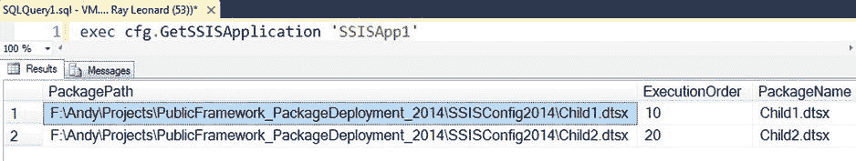

图 A-7. `cfg.GetSSISApplication` 语句的结果

图 A-7 展示了存储过程语句执行的结果——一个包含两行数据的结果集——这些数据代表了 `SSISConfig` 数据库中名为 `SSISApp1` 的 SSIS 应用程序所关联的 SSIS 包元数据。

工作量真不小！幸运的是，我们大部分都不需要重复这些工作。将来当你想要添加 SSIS 包并将其与 SSIS 应用程序关联时，脚本看起来会像清单 A-11 中所示的 T-SQL 那样。

***清单 A-11***. 添加 `SSISApp1` 及相关 SSIS 包的完整 T-SQL 脚本

```
Use SSISConfig
go

/* 变量声明 */
declare @PackageFolder varchar(255) = 'F:\Andy\Projects\PublicFramework_PackageDeployment_2014\SSISConfig2014\'
declare @PackageName varchar(255) = 'Child1.dtsx'
declare @PackageID int
declare @ExecutionOrder int = 10

 declare @ApplicationName varchar(255) = 'SSISApp1'
 declare @ApplicationID int

/* 添加第一个 SSIS 应用程序 */
If Not Exists(Select ApplicationName
               From cfg.Applications
               Where ApplicationName = @ApplicationName)
 begin
  print '正在添加 ' + @ApplicationName
  exec cfg.AddSSISApplication @ApplicationName, @ApplicationID output
  print @ApplicationName + ' 已添加.'
 end
Else
 begin
  Select @ApplicationID = ApplicationID
  From cfg.Applications
  Where ApplicationName = @ApplicationName
  print @ApplicationName + ' 已存在于框架中.'
 end

print ''

/* 添加 Child1.dtsx SSIS 包*/
If Not Exists(Select PackageFolder + PackageName
               From cfg.Packages
               Where PackageFolder = @PackageFolder
                 And PackageName = @PackageName)
 begin
  print '正在添加 ' + @PackageFolder + @PackageName
  exec cfg.AddSSISPackage @PackageName, @PackageFolder, @PackageID output
 end
Else
 begin
  Select @PackageID = PackageID
  From cfg.Packages
  Where PackageFolder = @PackageFolder
    And PackageName = @PackageName
  print @PackageFolder + @PackageName + ' 已存在于框架中.'
 end

 If Not Exists(Select AppPackageID
               From cfg.AppPackages
               Where ApplicationID = @ApplicationID
                 And PackageID = @PackageID
                 And ExecutionOrder = @ExecutionOrder)
 begin
  print '正在将 ' + @ApplicationName + '.' + @PackageName + ' 以 ExecutionOrder ' + convert(varchar, @ExecutionOrder) + ' 添加到框架中'
  exec cfg.AddSSISApplicationPackage @ApplicationID, @PackageID, @ExecutionOrder
  print @PackageName + ' 已添加并连接到 ' + @ApplicationName
 end
 Else
  print @ApplicationName + '.' + @PackageName + ' 已存在于框架中，ExecutionOrder 为 ' + convert(varchar, @ExecutionOrder)

/*Child2.dtsx */
set @PackageName = 'Child2.dtsx'
set @ExecutionOrder = 20

If Not Exists(Select PackageFolder + PackageName
               From cfg.Packages
               Where PackageFolder = @PackageFolder
                 And PackageName = @PackageName)
 begin
  print '正在添加 ' + @PackageFolder + @PackageName
  exec cfg.AddSSISPackage @PackageName, @PackageFolder, @PackageID output
 end
Else
 begin
  Select @PackageID = PackageID
  From cfg.Packages
  Where PackageFolder = @PackageFolder
    And PackageName = @PackageName
  print @PackageFolder + @PackageName + ' 已存在于框架中.'
 end

If Not Exists(Select AppPackageID
               From cfg.AppPackages
               Where ApplicationID = @ApplicationID
                 And PackageID = @PackageID
                 And ExecutionOrder = @ExecutionOrder)
 begin
  print '正在将 ' + @ApplicationName + '.' + @PackageName + ' 以 ExecutionOrder ' + convert(varchar, @ExecutionOrder) + ' 添加到框架中'
  exec cfg.AddSSISApplicationPackage @ApplicationID, @PackageID, @ExecutionOrder
  print @PackageName + ' 已添加并连接到 ' + @ApplicationName
 end
 Else
  print @ApplicationName + '.' + @PackageName + ' 已存在于框架中，ExecutionOrder 为 ' + convert(varchar, @ExecutionOrder)
```

### 在 SSIS 中检索 SSIS 应用程序

返回 SSDT-BI 并打开 "获取包元数据执行 SQL 任务" 的编辑器。将 "结果集" 属性从 "单行" 更改为 "完整结果集"，并将 "SQLStatement" 属性更改为 `cfg.GetSSISApplication`。将 "IsQueryStoredProcedure" 属性设置为 `True`。在 "参数映射" 选项卡上，单击 "添加" 按钮。单击 "变量名" 列中的下拉菜单，选择 `<新变量...>`（你可能需要向上滚动才能找到 `<新变量...>`）。


在**添加变量**窗口中，确保 `Container` 属性设置为 `Parent`。将 `Name` 属性更改为 `ApplicationName`。`Namespace` 应设置为 `User`，`Value Type` 属性应设置为 `String`。对于 `Value` 属性，输入 `SSISApp1`。**添加变量**窗口应如图 A-8 所示。

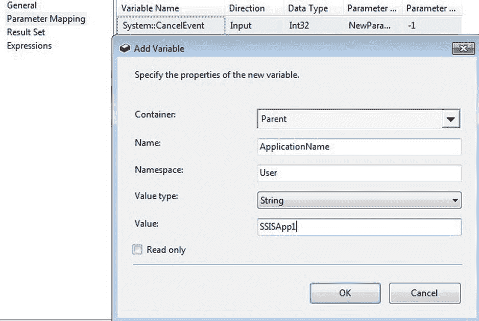

图 A-8. 添加 `ApplicationName` 变量

点击 `OK` 按钮关闭**添加变量**窗口，并将 `ApplicationName` 变量的 `Data Type` 更改为 `String`。将 `Parameter Name` 更改为 `ApplicationName`。导航到**结果集**页面，将结果名为 `0` 的变量从 `User::ChildPackagePath` 更改为一个新变量，设置如下：

*   `Container`: `Parent`
*   `Name`: `Packages`
*   `Namespace`: `User`
*   `Value Type`: `Object`

点击 `OK` 按钮关闭**添加变量**窗口，然后再次点击 `OK` 按钮关闭**执行 SQL 任务编辑器**。删除**获取包元数据执行 SQL** 任务和**执行子包执行包**任务之间的优先级约束。将一个**Foreach 循环**容器拖到控制流上，然后将**执行子包执行包**任务拖到其内部。从**获取包元数据执行 SQL** 任务到新的**Foreach 循环**容器添加一个优先级约束，并将该**Foreach 循环**容器重命名为 `Foreach Child Package`。打开 `Foreach Child Package` **Foreach 循环**容器的编辑器并导航到**集合**页面。将 `Enumerator` 更改为 `Foreach ADO Enumerator`。在 `ADO Object Source Variable` 下拉列表中，选择 `User::Packages` 变量。接受默认的 `Enumeration Mode`: `Rows in the First Table`。

导航到**Foreach 循环编辑器**中的**变量映射**页面。点击 `Variable` 下拉列表并选择 `User::ChildPackagePath` 变量。`Index` 属性将默认为 `0`——请勿更改它。

我们刚刚所做的更改实现了以下功能：

1.  在 `SSISConfig` 数据库中执行 `cfg.GetSSISApplications` 存储过程，向其传递 `ApplicationName` 变量中包含的值。
2.  将存储过程执行返回的完整结果集推入一个名为 `Packages` 的 SSIS 对象变量。
3.  配置一个**Foreach 循环**，按返回的顺序指向 `Packages` 变量中存储的每一行。
4.  将**Foreach 循环**所指向行的第一列（`Column 0`）中包含的值推入 `User::ChildPackagePath` 变量。

当 `ChildPackagePath` 变量的值发生变化时，`Child.dtsx` 文件连接管理器的 `ConnectionString` 属性会动态更新，将连接管理器指向 `User::ChildPackagePath` 中包含的路径。

点击 `OK` 按钮关闭**Foreach 循环容器编辑器**，并在 SSDT 调试器中执行 `Parent.dtsx` SSIS 包。执行后，您会看到两个消息框。第一个显示“I am Child1”，第二个如图 A-9 所示。

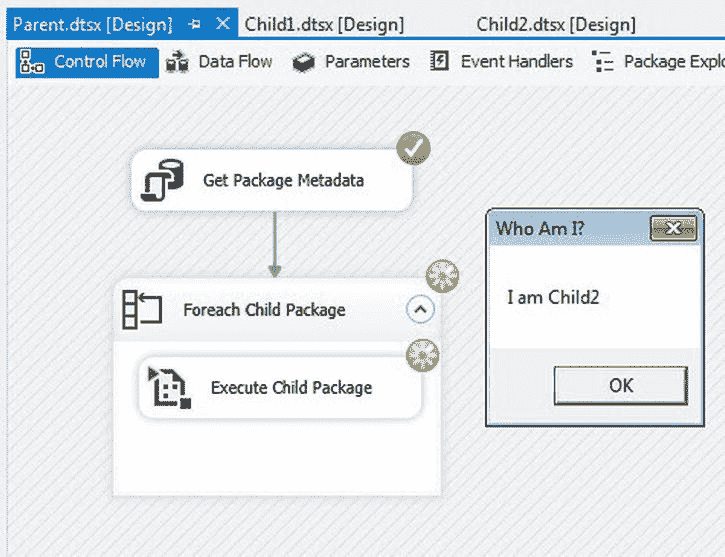

图 A-9. 执行一个测试序列化 SSIS 框架

就目前而言，这段代码构成了一个 SSIS 执行框架。数据库包含元数据，父包执行 SSIS 包。接下来是监控。

#### 监控执行

大多数有经验的业务智能开发者会告诉您从报告开始，然后回溯到源数据。在这种情况下，源数据是从数据集成过程收集的信息。什么样的信息？比如开始和结束执行时间、执行状态以及错误和事件消息。

每个 SSIS 应用程序和 SSIS 包执行都会记录实例数据。每个条目代表一次执行，有两个表保存这些条目：`Log.SSISAppInstance` 保存关于 SSIS 应用程序实例的执行指标，`Log.SSISPkgInstance` 保存 SSIS 子包实例的执行指标。当一个 SSIS 应用程序启动时，会在 `log.SSISAppInstance` 表中插入一行。当 SSIS 应用程序完成时，该行会被更新。`log.SSISPkgInstance` 对 SSIS 应用程序中的每个 SSIS 包以相同的方式工作。一个 SSIS 应用程序实例在逻辑上由应用程序 ID 和开始时间组成。一个 SSIS 包实例由应用程序实例 ID、应用程序包 ID 和开始时间组成。

错误和事件记录相对简单。您存储错误或事件的描述、发生时间以及实例 ID。这就是报告将反映的内容，记录也就这些了。

### 构建应用程序实例记录

让我们回到 SSMS 来构建支持记录的表和存储过程。您需要执行清单 A-12 中显示的 T-SQL 脚本来构建实例表和存储过程。

清单 A-12. 构建应用程序实例表和存储过程

```sql
/* log 模式 */
If Not Exists(Select name
              From sys.schemas
              Where name = 'log')
 begin
  print '正在创建 log 模式'
  declare @sql varchar(100) = 'Create Schema [log]'
  exec(@sql)
  print 'Log 模式已创建'
 end
Else
 print 'Log 模式已存在。'
print ''

/* log.SSISAppInstance 表 */
If Not Exists(Select s.name + '.' + t.name
              From sys.tables t
              Join sys.schemas s
               On s.schema_id = t.schema_id
              Where s.name = 'log'
               And t.name = 'SSISAppInstance')
 begin
  print '正在创建 log.SSISAppInstance 表'
  Create Table [log].SSISAppInstance
  (
    AppInstanceID int identity(1,1)
     Constraint PK_SSISAppInstance
      Primary Key Clustered
  ,ApplicationID int Not Null
  Constraint FK_logSSISAppInstance_cfgApplication_ApplicationID
  Foreign Key References cfg.Applications(ApplicationID)
  ,StartDateTime datetime Not Null
     Constraint DF_cfgSSISAppInstance_StartDateTime
      Default(GetDate())
  ,EndDateTime datetime Null
  ,[Status] varchar(12) Null
  )
  print 'Log.SSISAppInstance 已创建'
 end
Else
 print 'Log.SSISAppInstance 表已存在。
print ''

/* log.LogStartOfApplication 存储过程 */
If Exists(Select s.name + '.' + p.name
          From sys.procedures p
          Join sys.schemas s
           On s.schema_id = p.schema_id
          Where s.name = 'log'
           And p.name = 'LogStartOfApplication')
 begin
  print '正在删除 log.LogStartOfApplication 存储过程'
  Drop Procedure [log].LogStartOfApplication
  print 'Log.LogStartOfApplication 存储过程已删除'
 end
print '正在创建 log.LogStartOfApplication 存储过程'
go

Create Procedure [log].LogStartOfApplication
 @ApplicationName varchar(255)
As
 declare @ErrMsg varchar(255)
 declare @AppID int = (Select ApplicationID
                       From cfg.Applications
                       Where ApplicationName = @ApplicationName)

 If (@AppID Is Null)
  begin
   set @ErrMsg = '找不到 ApplicationName ' + Coalesce(@ApplicationName, '<NULL>')
   raiserror(@ErrMsg,16,1)
   return-1
  end

 Insert Into [log].SSISAppInstance
 (ApplicationID, StartDateTime, Status)
 Output inserted.AppInstanceID
 Values
 (@AppID, GetDate(), 'Running')
go
print 'Log.LogStartOfApplication 存储过程已创建。'
print ''

/* log.LogApplicationSuccess 存储过程 */
If Exists(Select s.name + '.' + p.name
          From sys.procedures p
          Join sys.schemas s
           On s.schema_id = p.schema_id
          Where s.name = 'log'
           And p.name = 'LogApplicationSuccess')
 begin
  print '正在删除 log.LogApplicationSuccess 存储过程'
  Drop Procedure [log].LogApplicationSuccess
  print 'Log.LogApplicationSuccess 存储过程已删除'
 end
```


### SSIS 应用程序实例日志记录与错误处理

### 存储过程设置

以下 SQL 脚本创建了用于记录 SSIS 应用程序实例状态的存储过程。

```sql
Print 'Dropping log.LogApplicationSuccess stored procedure'
go
Drop Procedure [log].LogApplicationSuccess
Print 'Log.LogApplicationSuccess stored procedure dropped'
end
Print 'Creating log.LogApplicationSuccess stored procedure'
go

Create Procedure [log].LogApplicationSuccess
	@AppInstanceID int
As
	update log.SSISAppInstance
	set EndDateTime = GetDate()
	  , Status = 'Success'
	where AppInstanceID = @AppInstanceID
go
Print 'Log.LogApplicationSuccess stored procedure created.'
Print ''

/* log.LogApplicationFailure stored procedure */
If Exists(Select s.name + '.' + p.name
          From sys.procedures p
          Join sys.schemas s
            On s.schema_id = p.schema_id
          Where s.name = 'log'
            And p.name = 'LogApplicationFailure')
begin
	print 'Dropping log.LogApplicationFailure stored procedure'
	Drop Procedure [log].LogApplicationFailure
	Print 'Log.LogApplicationFailure stored procedure dropped'
end
Print 'Creating log.LogApplicationFailure stored procedure'
go

Create Procedure [log].LogApplicationFailure
	@AppInstanceID int
As
	update log.SSISAppInstance
	set EndDateTime = GetDate()
	  , Status = 'Failed'
	where AppInstanceID = @AppInstanceID
go
Print 'Log.LogApplicationFailure stored procedure created.'
Print ''
```

### 在 SSDT 中配置日志记录

现在让我们回到 SSDT，将应用程序实例日志记录添加到 `Parent.dtsx` 包中。

#### 记录应用程序开始

1.  在控制流中拖入一个新的执行 SQL 任务，并将其重命名为 `Log Start of Application`。
2.  将 `ResultSet` 属性设置为 Single Row。
3.  将 `ConnectionType` 属性设置为 ADO.Net，并将 `Connection` 设置为 `SSISConfig` 连接管理器。
4.  将 `SQLStatement` 属性设置为 `log.LogStartOfApplication`，并将 `IsQueryStoredProcedure` 属性设置为 `True`。
5.  导航到“参数映射”页面并添加一个新参数：将 `User::ApplicationName` SSIS 变量映射到 `log.LogStartOfApplication` 存储过程的 `ApplicationName` 参数。
6.  将 `ApplicationName` 参数的“数据类型”属性更改为 String。
7.  在“结果集”页面上，添加一个名为 `0` 的新结果，并将其映射到名为 `AppInstanceID` 的新 Int32 变量。
8.  将 `AppInstanceID` 变量的默认值设置为 `0`。
9.  关闭“执行 SQL 任务编辑器”，并从“Log Start of Application”执行 SQL 任务到“Get Package Metadata”执行 SQL 任务连接一个优先约束。

#### 记录应用程序成功

1.  在控制流中“Foreach Child Package”Foreach 循环容器下方拖入另一个执行 SQL 任务，并将其重命名为 `Log Application Success`。
2.  打开编辑器，将 `ConnectionType` 属性更改为 ADO.Net，并将 `Connection` 属性设置为 `SSISConfig` 连接管理器。
3.  在 `SQLStatement` 属性中输入 `log.LogApplicationSuccess`，并将 `IsQueryStoredProcedure` 属性设置为 `True`。
4.  导航到“参数映射”页面，添加 `User::AppInstanceID` SSIS 变量与 `log.LogApplicationSuccess` 存储过程的 `Int32 AppInstanceID` 参数之间的映射。
5.  关闭“执行 SQL 任务编辑器”，并从“Foreach Child Package”Foreach 循环容器到“Log Application Success”执行 SQL 任务连接一个优先约束。

你刚刚完成了什么？你将 SSIS 应用程序实例日志记录添加到了 `Parent.dtsx` SSIS 包的控制流中。

#### 测试与验证

要测试这一点，你需要在 SSDT 调试器中执行 `Parent.dtsx`。

执行完成后，执行以下查询以观察记录的结果：

```sql
Select * From [log].SSISAppInstance
```

当我执行此查询时，得到如图 A-10 所示的结果。

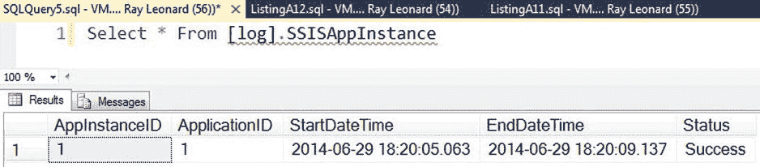
图 A-10. 观察查询应用程序实例日志的结果

### 处理应用程序失败

当 SSIS 应用程序失败时会发生什么？你需要用 `EndDateTime` 更新 `log.SSISAppInstance` 行，并将状态设置为 Failed。为此，你将使用一个配置为执行 `log.LogApplicationFailure` 存储过程的执行 SQL 任务。问题是：放在哪里？答案是：`Parent.dtsx` 包的 OnError 事件处理程序。

在 SSDT 中，单击 `Parent.dtsx` 上的“事件处理程序”选项卡。在“可执行文件”下拉列表中，选择 Parent；在“事件处理程序”下拉列表中，选择 OnError，如图 A-11 所示。

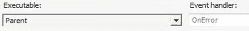
图 A-11. 配置 Parent 包的 OnError 事件处理程序

单击事件处理程序表面上的“单击此处为可执行文件“Parent”创建“OnError”事件处理程序”链接，为 `Parent.dtsx` 包创建 OnError 事件处理程序。

我可以引导你构建另一个执行 SQL 任务来记录 SSIS 应用程序失败；但是，更简单的方法是直接从控制流底部复制“Log Application Success”执行 SQL 任务，并将其粘贴到 `Parent.dtsx` OnError 事件处理程序中。粘贴后，将名称更改为 `Log Application Failure`，并将 `SQLStatement` 属性更改为 `log.LogApplicationFailure`。

### 构建错误测试包

现在你准备好测试了，但除非修改一个包，否则你无法真正测试应用程序失败，这似乎有点不幸。你之后可能还需要测试错误。那么为什么不构建一个 `ErrorTest.dtsx` SSIS 包并将其添加到 SSIS 应用程序中呢？我喜欢这个计划！

1.  创建一个新的 SSIS 包并将其重命名为 `ErrorTest.dtsx`。
2.  在控制流中添加一个脚本任务，并将其重命名为 `Succeed or Fail?`。
3.  将 `ScriptLanguage` 属性更改为 Microsoft Visual Basic 2012。
4.  打开编辑器并将 `System::TaskName` 和 `System::PackageName` 变量添加到 `ReadOnlyVariables` 属性中。
5.  打开脚本编辑器，并将清单 A-13 中所示的代码添加到 `Sub Main()` 中。

**清单 A-13.** 使 SSIS 包成功或失败的代码

```vb
Public Sub Main()
        Dim sPackageName As String = Dts.Variables("PackageName").Value.ToString
        Dim sTaskName As String = Dts.Variables("TaskName").Value.ToString
        Dim sSubComponent As String = sPackageName & "." & sTaskName

        Dim iResponse As Integer = MsgBox("Succeed Package?", MsgBoxStyle.YesNo, sSubComponent)
        If iResponse = vbYes Then
            Dts.TaskResult = ScriptResults.Success
        Else
            Dts.TaskResult = ScriptResults.Failure
        End If

    End Sub
```

通过在 SSDT 调试器中执行 `ErrorTest.dtsx` 进行单元测试，如图 A-12 所示。

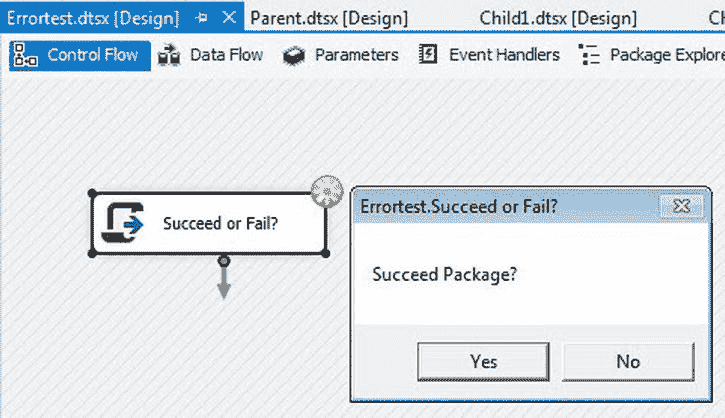
图 A-12. 对 ErrorTest.dtsx SSIS 包进行单元测试

要将此 SSIS 包添加到 SSISApp1 SSIS 应用程序，请将清单 A-14 中的 T-SQL 脚本附加到清单 A-11 中的 T-SQL 脚本之后。

**清单 A-14.** 将此 T-SQL 脚本附加到清单 A-11 之后，以将 ErrorTest.dtsx SSIS 包添加到 SSISApp1 SSIS 应用程序

```sql
/*ErrorTest.dtsx */

/* Variable Declaration */
declare @PackageFolder varchar(255) = 'F:\Andy\Projects\PublicFramework_PackageDeployment_2014\SSISConfig2014\'
declare @PackageName varchar(255) = 'Child1.dtsx'
declare @PackageID int
declare @ExecutionOrder int = 10

declare @ApplicationName varchar(255) = 'SSISApp1'
declare @ApplicationID int

/* Add the SSIS First Application */
If Not Exists(Select ApplicationName
              From cfg.Applications
              Where ApplicationName = @ApplicationName)
begin
	print 'Adding ' + @ApplicationName
	exec cfg.AddSSISApplication @ApplicationName, @ApplicationID output
	print @ApplicationName + ' added.'
end
Else
begin
	Select @ApplicationID = ApplicationID
	From cfg.Applications
	Where ApplicationName = @ApplicationName
	print @ApplicationName + ' already exists in the Framework.'
end
print ''

set @PackageName = 'ErrorTest.
```


### SSIS 应用程序日志配置

dtsx' 设置 `@ExecutionOrder` = 30
如果不存在（选择 `PackageFolder` + `PackageName`
               从 `cfg.Packages`
               其中 `PackageFolder` = `@PackageFolder`
                 且 `PackageName` = `@PackageName`）
 begin
  打印 '正在添加 ' + `@PackageFolder` + `@PackageName`
  执行 `cfg.AddSSISPackage` `@PackageName`, `@PackageFolder`, `@PackageID` output
 end
否则
 begin
  选择 `@PackageID` = `PackageID`
  从 `cfg.Packages`
  其中 `PackageFolder` = `@PackageFolder`
    且 `PackageName` = `@PackageName`
  打印 `@PackageFolder` + `@PackageName` + ' 已存在于 Framework 中。'
 end

如果不存在（选择 `AppPackageID`
               从 `cfg.AppPackages`
               其中 `ApplicationID` = `@ApplicationID`
                 且 `PackageID` = `@PackageID`
                 且 `ExecutionOrder` = `@ExecutionOrder`）
 begin
  打印 '正在以执行顺序 ' + convert(varchar, `@ExecutionOrder`) + ' 将 ' + `@ApplicationName` + '.' + `@PackageName` + ' 添加到 Framework'
  执行 `cfg.AddSSISApplicationPackage` `@ApplicationID`, `@PackageID`, `@ExecutionOrder`
  打印 `@PackageName` + ' 已添加并连接到 ' + `@ApplicationName`
 end
否则
 打印 `@ApplicationName` + '.' + `@PackageName` + ' 已以执行顺序 ' + convert(varchar, `@ExecutionOrder`) + ' 存在于 Framework 中。'

现在打开 `Parent.dtsx` 并在 SSDT 调试器中执行它。一旦出现 `ErrorTest.dtsx` 消息框，单击 **No** 按钮以导致 `ErrorTest.dtsx` 失败。这应该会触发 `Parent.dtsx` 包的 OnError 事件处理程序，如 图 A-13 所示。

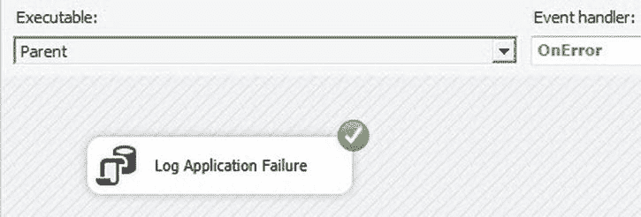

图 A-13. 我对成功的 OnError 事件处理程序感觉复杂。

经过几次成功和失败的执行后，`log.SSISAppInstance` 表包含如 图 A-14 所示的行。

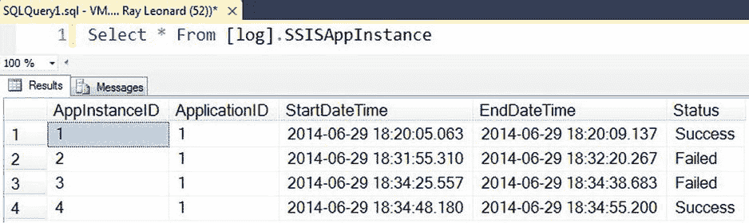

图 A-14. SSISApp1 的成功与失败

关于应用程序实例日志的介绍到此结束！接下来，让我们构建子包实例日志。

### 构建包实例日志

包实例日志的工作方式类似于应用程序实例日志，只是规模不同。一个应用程序实例由一个应用程序 ID 和一个执行开始时间组成。一个包实例则由一个应用程序包 ID、一个应用程序实例 ID 和一个执行开始时间组成。

让我们从创建 `log.SSISPkgInstance` 表和相关存储过程开始。清单 A-15 包含了这些数据库对象。

清单 A-15. 构建包实例日志表和存储过程

```sql
/* log.SSISPkgInstance 表 */
如果不存在（选择 s.name + '.' + t.name
               从 sys.tables t
               内连接 sys.schemas s
                 on s.schema_id = t.schema_id
               其中 s.name = 'log'
                 且 t.name = 'SSISPkgInstance'）
 begin
  打印 '正在创建 log.SSISPkgInstance 表'
  创建表 [log].SSISPkgInstance
  (
    PkgInstanceID int identity(1,1) 
     约束 PK_SSISPkgInstance 主键聚集索引
   ,AppPackageID int 非空
        约束 FK_logSSISPkgInstance_cfgAppPackages_AppPackageID
         外键引用 cfg.AppPackages(AppPackageID)
   ,StartDateTime datetime 非空
     约束 DF_cfgSSISPkgInstance_StartDateTime
      默认值(GetDate())
   ,EndDateTime datetime 空
   ,[状态] varchar(12) 空
  )
  打印 'Log.SSISPkgInstance 已创建'
 end
否则
 打印 'Log.SSISPkgInstance 表已存在。'
打印 ''

/* log.LogStartOfPackage 存储过程 */
如果存在（选择 s.name + '.' + p.name
           从 sys.procedures p
           内连接 sys.schemas s
             on s.schema_id = p.schema_id
           其中 s.name = 'log'
             且 p.name = 'LogStartOfPackage'）
 begin
  打印 '正在删除 log.LogStartOfPackage 存储过程'
  删除过程 [log].LogStartOfPackage
  打印 'Log.LogStartOfPackage 存储过程已删除'
 end
打印 '正在创建 log.LogStartOfPackage 存储过程'
go

创建过程 [log].LogStartOfPackage
 @AppInstanceID int
 ,@AppPackageID int
As
 声明 @ErrMsg varchar(255)
 插入到 log.SSISPkgInstance
  (AppInstanceID, AppPackageID, StartDateTime, 状态)
  输出 inserted.PkgInstanceID
  值
  (@AppInstanceID, @AppPackageID, GetDate(), '运行中')
go
print 'Log.SSISPkgInstance 存储过程已创建。'
print ''

/* log.LogPackageSuccess 存储过程 */
如果存在（选择 s.name + '.' + p.name
           从 sys.procedures p
           内连接 sys.schemas s
             on s.schema_id = p.schema_id
           其中 s.name = 'log'
             且 p.name = 'LogPackageSuccess'）
 begin
  打印 '正在删除 log.LogPackageSuccess 存储过程'
  删除过程 [log].LogPackageSuccess
  打印 'Log.LogPackageSuccess 存储过程已删除'
 end
打印 '正在创建 log.LogPackageSuccess 存储过程'
go

创建过程 [log].LogPackageSuccess
 @PkgInstanceID int
As
 更新 log.SSISPkgInstance
 set EndDateTime = GetDate()
   , 状态 = '成功'
 where PkgInstanceID = @PkgInstanceID
go
print 'Log.LogPackageSuccess 存储过程已创建。'
print ''

/* log.LogPackageFailure 存储过程 */
如果存在（选择 s.name + '.' + p.name
           从 sys.procedures p
           内连接 sys.schemas s
             on s.schema_id = p.schema_id
           其中 s.name = 'log'
             且 p.name = 'LogPackageFailure'）
 begin
  打印 '正在删除 log.LogPackageFailure 存储过程'
  删除过程 [log].LogPackageFailure
  打印 'Log.LogPackageFailure 存储过程已删除'
 end
打印 '正在创建 log.LogPackageFailure 存储过程'
go

创建过程 [log].LogPackageFailure
 @PkgInstanceID int
As
 更新 log.SSISPkgInstance
 set EndDateTime = GetDate()
   , 状态 = '失败'
 where PkgInstanceID = @PkgInstanceID
go
print 'Log.LogPackageFailure 存储过程已创建。'
print ''
```

`log.SSISPkgInstance` 表将保存 SSIS 包实例数据。`Log.LogStartofPackage` 向 `SSISPkgInstance` 表插入一行；`log.LogPackageSuccess` 用 `EndDateTime` 和 `'成功'` 状态更新该行，而 `log.LogPackageFailure` 用 `EndDateTime` 和 `'失败'` 状态更新该记录。

在 `Parent.dtsx` 中，打开 **Foreach Child Package** Foreach 循环容器的编辑器。导航到 **Variable Mappings** 页面并添加一个新变量。在 **Add Variable** 窗口中配置以下设置：
*   Container: `Parent`
*   Name: `AppPackageID`
*   Namespace: `User`
*   Value Type: `Int32`
*   Value: `0`

单击 **OK** 按钮关闭 **Add Variable** 窗口。`AppInstanceID`——存在于 `User::Packages` SSIS 变量内的数据集中——是从执行 `cfg.GetSSISApplication` 存储过程返回的。`AppPackageID` 列作为第五列返回。因此，**Foreach Child Package** Foreach 循环容器的 **Variable Mappings** 页面上 `AppPackageID` 变量的 `Index` 列应设置为 `4`（0 基数组中的第五个值）。单击 **OK** 按钮关闭 **Foreach Child Package Foreach Loop Container Editor**。

向 **Foreach Child Package** Foreach 循环容器添加一个 **Execute SQL** 任务。将新的 **Execute SQL** 任务重命名为 **Log Start of Package**。打开编辑器并将 **ResultSet** 属性设置为 **Single Row**。将 **ConnectionType** 属性设置为 **ADO.Net**，并将 **Connection** 设置为 `SSISConfig` 连接管理器。将 **SQLStatement** 属性设置为 `log.LogStartOfPackage`，并将 **IsQueryStoredProcedure** 属性设置为 `True`。


转到“参数映射”页面并添加两个新参数：
*   变量名称：`User::AppInstanceID`
*   方向：输入
*   数据类型：Int32
*   参数名称：`AppInstanceID`
*   变量名称：`User::AppPackageID`
*   方向：输入
*   数据类型：Int32
*   参数名称：`AppPackageID`

在“结果集”页面上，添加一个名为 `0` 的新结果，并将其映射到一个新的父级 Int32 变量 `PkgInstanceID`，其默认值为 `0`。关闭“执行 SQL 任务编辑器”。从“执行 SQL”任务的“日志包启动”连接一个优先约束到“执行子包”任务。

向“Foreach 子包”Foreach 循环容器再添加两个“执行 SQL”任务。将第一个重命名为 `Log Package Success`，将其连接属性设置为用于连接到 `SSISConfig` 数据库的 ADO.Net 连接管理器，将 `SQLStatement` 属性设置为 `log.LogPackageSuccess`，并将 `IsQueryStoredProcedure` 属性设置为 `True`。在“参数映射”页面上，添加一个参数，并将 `User::PkgInstanceID` 变量映射到 `log.LogStartofPackage` 存储过程的 `PkgInstanceID` 参数。从“执行子包”任务连接一个优先约束（`OnSuccess`）到“日志包成功”执行 SQL 任务。

将第二个重命名为 `Log Package Failure`，将其连接属性设置为用于连接到 `SSISConfig` 数据库的 ADO.Net 连接管理器，将 `SQLStatement` 属性设置为 `log.LogPackageFailure`，并将 `IsQueryStoredProcedure` 属性设置为 `True`。在“参数映射”页面上，添加一个参数，并将 `User::PkgInstanceID` 变量映射到 `log.LogStartofPackage` 存储过程的 `PkgInstanceID` 参数。从“执行子包”任务连接一个优先约束（`OnFailure`）到“日志包失败”执行 SQL 任务。

通过运行几次测试执行来测试包实例日志记录。允许一次成功，另一次失败。当你检查应用程序和包实例表时，结果应如 `图 A-15` 所示。

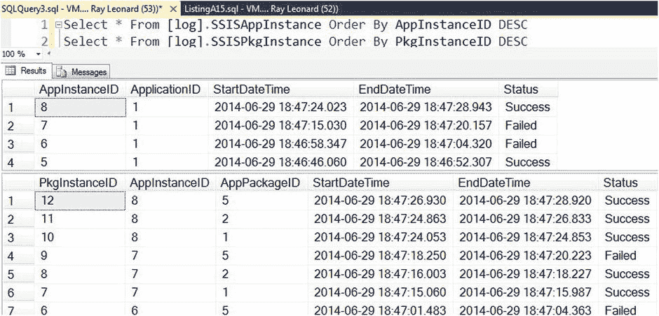

`图 A-15`. 检查应用程序和包实例日志

通过检查应用程序实例和包实例日志表，你可以看出 `AppInstanceID8` 启动于 2014 年 6 月 29 日 下午 6:47:24。你还可以看到三个 SSIS 包——其 `PkgInstanceID` 为 10、11 和 12——作为 SSIS 应用程序的一部分被执行。每个包都成功了，SSIS 应用程序也成功了。你还知道 `AppInstanceID7` 启动于 2014 年 6 月 29 日 下午 6:14:15，并执行了 `PkgInstanceID` 7、8 和 9。`PkgInstanceID` 7 和 8 成功了，但 `PkgInstanceID` 9 失败了；导致 SSIS 应用程序失败。

酷吗？确实酷。让我们进入错误和事件日志记录。

构建错误日志记录

在数据集成流程中嵌入机制以捕获和保留错误及异常元数据，是最重要的、也是最有用的日志记录类型。异常和错误总会发生。SSIS 提供了一个相当健壮的模型来捕获和报告错误，只要你意识到大多数错误代码可以忽略。不过，错误描述大多很有效。所以它达到了平衡。

在我演示如何在 SSIS 中捕获错误消息之前，让我们先讨论一下为什么这样做。我曾经管理一个数据集成开发团队。团队规模从 28 人到 40 人不等，我为美国州政府利益相关方构建了非常庞大的 ETL 解决方案。我工作的一部分就是找出最佳实践。让所有 SSIS 包以相同格式将错误数据记录到同一位置，是一项最佳实践。但如何让 40 个开发人员都做到呢？你曾尝试过让 40 个开发人员以同样的方式做同样的事情吗？就像赶猫一样。问题在于，他们中一半人认为比我聪明；而其中一半人确实如此。但这类问题并不需要深奥的思考；它需要的是策略。那么，让每个开发人员每次都能为每个 SSIS 包构建完全相同类型日志的最佳策略是什么？你猜对了：别让他们做。将错误日志记录完全从他们手中拿走。

在学会使用“执行包任务”后不久，我了解到事件会从子包“冒泡”到父包。就错误日志记录而言，这意味着我可以在父包捕获并记录任何错误。更好的是，这意味着我*可以在子包中不写任何代码*就完成这件事。问题解决了。

让我们看看如何将此功能实现到 SSIS 框架中。首先，让我们添加一个表和一个存储过程来记录和保存错误，如 `清单 A-16` 所示。

`清单 A-16`. 构建错误日志记录表和存储过程

```
/* log.SSISErrors table */
If Not Exists(Select s.name + '.' + t.name
              From sys.tables t
              Join sys.schemas s
                On s.schema_id = t.schema_id
              Where s.name = 'log'
                And t.name = 'SSISErrors')
 begin
  print 'Creating log.SSISErrors table'
  Create Table [log].SSISErrors
  (
    ID int identity(1,1)
     Constraint PK_SSISErrors Primary Key Clustered
  ,AppInstanceID int Not Null  Constraint FK_logSSISErrors_logSSISAppInstance_AppInstanceID
 Foreign Key References [log].SSISAppInstance(AppInstanceID)
  ,PkgInstanceID int Not Null  Constraint FK_logSSISErrors_logPkgInstance_PkgInstanceID
 Foreign Key References [log].SSISPkgInstance(PkgInstanceID)
  ,ErrorDateTime datetime Not Null
     Constraint DF_logSSISErrors_ErrorDateTime
      Default(GetDate())
  ,ErrorDescription varchar(max) Null
  ,SourceName varchar(255) Null
  )
  print 'Log.SSISErrors created'
 end
Else
 print 'Log.SSISErrors table already exists.'
print ''

/* log.LogError stored procedure */
If Exists(Select s.name + '.' + p.name
          From sys.procedures p
          Join sys.schemas s
            On s.schema_id = p.schema_id
          Where s.name = 'log'
            And p.name = 'LogError')
 begin
  print 'Dropping log.LogError stored procedure'
  Drop Procedure [log].LogError
  print 'Log.LogError stored procedure dropped'
 end
print 'Creating log.LogError stored procedure'
go

Create Procedure [log].LogError
 @AppInstanceID int
 ,@PkgInstanceID int
 ,@SourceName varchar(255)
 ,@ErrorDescription varchar(max)
As

 insert into log.SSISErrors
 (AppInstanceID, PkgInstanceID, SourceName, ErrorDescription)
 Values
 (@AppInstanceID
 ,@PkgInstanceID
 ,@SourceName
 ,@ErrorDescription)
go
print 'Log.LogError stored procedure created.'
print ''
```

`log.SSISErrors` 表中的每一行都包含一个 `AppInstanceID` 和一个 `PkgInstanceID` 用于标识。为什么两者都要？因为它旨在捕获并保存同时起源于父包和子包的错误。`Parent.dtsx` 包中的错误将具有 `0` 的 `PkgInstanceID`。其余列捕获错误本身的元数据：错误发生的日期和时间（`ErrorDateTime`）、错误消息（`ErrorDescription`）以及错误起源的 SSIS 任务（`SourceName`）。

 **注意** 此时，向 `log.SSISErrors` 表添加一行 `PkgInstanceID` 为 `0` 的记录实际上会引发外键约束冲突，但我将在本附录稍后处理此事。

需要注意的是，错误事件是由 SSIS 任务“引发”的。当实例化错误事件时，其字段会被填充信息，例如错误描述和源名称（引发错误的任务名称）。当事件在 SSIS 包执行堆栈内部导航或冒泡时，这些数据不会更改。当事件到达 `Parent`。


### SSIS 错误与事件日志记录

当 `dtsx` 包中的任务出错时，它将包含引发错误的任务名称（`SourceName`）以及该任务的错误描述（`ErrorDescription`）。当错误冒泡到 `Parent.dtsx` 包时，你将调用 `log.LogError` 存储过程来填充 `log.SSISErrors` 表。

在 SSDT 中，返回到我们之前配置的 `Parent.dtsx` 包的 OnError 事件处理程序。添加一个 Execute SQL 任务并将其重命名为 `Log Error`。打开编辑器，将 ConnectionType 和 Connection 属性配置为通过 ADO.Net 连接到 `SSISConfig` 数据库。将 SQLStatement 属性设置为 `log.LogError`，并将 IsQueryStoredProcedure 属性设置为 `True`。导航到 Parameter Mapping 页面并添加以下参数：

*   变量名：`User::AppInstanceID`
*   方向：Input
*   数据类型：Int32
*   参数名：`AppInstanceID`
*   变量名：`User::PkgInstanceID`
*   方向：Input
*   数据类型：Int32
*   参数名：`PkgInstanceID`
*   变量名：`System::SourceName`
*   方向：Input
*   数据类型：String
*   参数名：`SourceName`
*   变量名：`System::ErrorDescription`
*   方向：Input
*   数据类型：String
*   参数名：`ErrorDescription`

我们已在本附录前面创建了 `AppInstanceID` 和 `PkgInstanceID` SSIS 变量。你现在使用的是来自 System 命名空间的两个变量——`SourceName` 和 `ErrorDescription`——它们是错误事件最初由引发任务填充的两个字段。

映射完这些参数后，关闭 Execute SQL Task Editor，并从 Log Error Execute SQL 任务连接一个优先约束到 Log Application Failure Execute SQL 任务，如 图 A-16 所示。

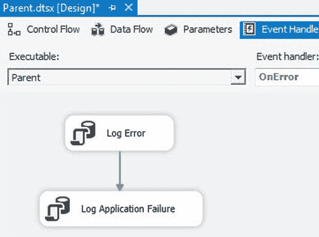

图 A-16. 在父包 OnError 事件处理程序中添加 Log Error Execute SQL 任务

通过在 SSDT 调试器中运行 `Parent.dtsx` 来测试新的错误日志记录功能。当从 `ErrorTest.dtsx` 包提示时，单击“否”按钮以生成错误。在 SSMS 中，执行以下查询以检查错误元数据：

```
Select * From log.SSISErrors
```

结果应类似于 图 A-17 中所示的结果。

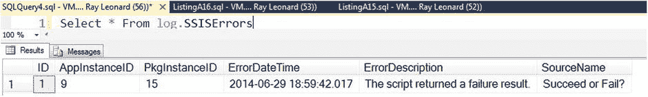

图 A-17. log.SSISErrors 表中的错误元数据

正如你从上图中看到的（希望如果你在家跟着做，你自己的代码也是如此），错误日志记录可以使 SSIS 问题的故障排除变得简单得多。

事件日志记录与 SSIS 中的错误日志记录非常相似。部分原因是 SSIS 在 OnInformation 事件处理程序中重用了 OnError 事件处理程序的对象模型。

让我们首先向 `SSISConfig` 数据库添加另一个表和存储过程。清单 A-17 中的 T-SQL 脚本完成了此任务。

***清单 A-17***. 构建事件日志记录表和存储过程

```
/* log.SSISEvents table */
If Not Exists(Select s.name + '.' + t.name
              From sys.tables t
              Join sys.schemas s
                On s.schema_id = t.schema_id
              Where s.name = 'log'
                And t.name = 'SSISEvents')
 begin
  print 'Creating log.SSISEvents table'
  Create Table [log].SSISEvents
  (
    ID int identity(1,1)
     Constraint PK_SSISEvents Primary Key Clustered
  ,AppInstanceID int Not Null
       Constraint FK_logSSISEvents_logSSISAppInstance_AppInstanceID
        Foreign Key References [log].SSISAppInstance(AppInstanceID)
  ,PkgInstanceID int Not Null
       Constraint FK_logSSISEvents_logPkgInstance_PkgInstanceID
        Foreign Key References [log].SSISPkgInstance(PkgInstanceID)
  ,EventDateTime datetime Not Null
     Constraint DF_logSSISEvents_ErrorDateTime
      Default(GetDate())
  ,EventDescription varchar(max) Null
  ,SourceName varchar(255) Null
  )
  print 'Log.SSISEvents created'
 end
Else
 print 'Log.SSISEvents table already exists.'
print ''

/* log.LogEvent stored procedure */
If Exists(Select s.name + '.' + p.name
          From sys.procedures p
          Join sys.schemas s
            On s.schema_id = p.schema_id
          Where s.name = 'log'
            And p.name = 'LogEvent')
 begin
  print 'Dropping log.LogEvent stored procedure'
  Drop Procedure [log].LogEvent
  print 'Log.LogEvent stored procedure dropped'
 end
print 'Creating log.LogEvent stored procedure'
go

Create Procedure [log].LogEvent
 @AppInstanceID int
,@PkgInstanceID int
,@SourceName varchar(255)
,@EventDescription varchar(max)
As
 insert into [log].SSISEvents
 (AppInstanceID, PkgInstanceID, SourceName, EventDescription)
 Values
 (@AppInstanceID
 ,@PkgInstanceID
 ,@SourceName
 ,@EventDescription)
go
print 'Log.LogEvent stored procedure created.'
print ''
```

除了列名，`log.SSISEvents` 表的设计与 `log.SSISErrors` 表完全相同。返回到 SSDT，从 `Parent.dtsx` OnError 事件处理程序中复制 Log Error Execute SQL 任务。将事件处理程序下拉列表从 OnError 更改为 OnInformation，并单击链接创建 OnInformation 事件处理程序。接下来，将剪贴板的内容粘贴到 OnInformation 事件处理程序 surface 上。打开编辑器并将任务的名称更改为 `Log Event`。将 `SQLStatement` 属性编辑为 `log.LogEvent`。在 Parameter Mapping 页面，将 `ErrorDescription` 参数名称从 `ErrorDescription` 更改为 `EventDescription`。关闭 Execute SQL Task Editor，就完成了。

但是参数映射中的所有“Error”内容怎么办？OnInformation 事件处理程序消息是通过名为 `System::ErrorDescription` 的 SSIS 变量传递的。*这不是错字*。你可能期望它是 `InformationDescription`，但事实并非如此，这让我（和你）省了些工作。

如果你现在执行 `Parent.dtsx` 来测试新的事件日志记录功能，你将不会看到任何记录的事件。真糟糕。如何从 SSIS 获取事件？几个任务通过 OnInformation 事件提供信息。例如，数据流任务提供了许多有用的元数据，包括从源读取和写入目标的行数、查找缓存大小、行数以及填充时间。你还可以使用脚本任务将 OnInformation 事件注入执行流。

我喜欢在 SSIS 框架父包中包含脚本任务来总结我已有的关于 SSIS 应用程序和包的信息。现在让我们添加它们。

将一个脚本任务拖到 `Parent.dtsx` 包的控制流上，并将其重命名为 `Log Application Variables`。打开编辑器，将 ScriptLanguage 更改为 Microsoft Visual Basic 2012。将以下变量添加到 `ReadOnlyVariables` 属性：

*   `System::TaskName`
*   `System::PackageName`
*   `User::AppInstanceID`
*   `User::ApplicationName`

编辑脚本并将 清单 A-18 中所示的代码放入 `Sub Main()`。

***清单 A-18***. 从脚本任务引发信息事件

```vb
Public Sub Main()
        Dim sPackageName As String = Dts.Variables("PackageName").Value.ToString
        Dim sTaskName As String = Dts.Variables("TaskName").Value.ToString
        Dim sSubComponent As String = sPackageName & "." & sTaskName
        Dim sApplicationName As String = Dts.Variables("ApplicationName").Value.ToString
        Dim iAppInstanceID As Integer = _
            Convert.ToInt32(Dts.Variables("AppInstanceID").Value)

        Dim sMsg As String = "ApplicationName: " & sApplicationName & vbCrLf & _
                             "AppInstanceID: " & iAppInstanceID.
```


### 在 SSIS 框架中记录事件

`ToString` 函数 `Dts.Events.FireInformation(1001, sSubComponent, sMsg, "", 0, True)` 之后是 `Dts.TaskResult = ScriptResults.Success`，最后是 `End Sub`。

该脚本的目的在于调用 `Dts.Events.FireInformation`。此函数的第一个参数是 `InformationCode`。根据 SSIS 框架的性质与用途，我可能会在此处输入一个值（除 `0` 外）。接下来是 `SubComponent` 参数，我通常会构建一个包含包名和任务名称的字符串。随后是描述参数，这里包含了我想要注入到 `log.SSISEvents` 表中的消息。再接下来的两个参数与帮助相关——我通常分别将它们留空并设为零。最后一个参数是 `FireAgain`，我不确定它是否（仍然）有效；我总是将其设置为 `True`。

关闭脚本编辑器和脚本任务编辑器。从“日志开始应用程序执行 SQL”任务到“日志应用程序变量脚本”任务连接一个优先约束，再从“日志应用程序变量脚本”任务到“获取包元数据执行 SQL”任务连接另一个优先约束。

将另一个脚本任务拖到“Foreach 子包 Foreach 循环容器”中，并将其重命名为 **Log Package Variables**。打开编辑器，将 `ScriptLanguage` 更改为 Microsoft Visual Basic 2012。将以下变量添加到 `ReadOnlyVariables` 属性中：
* `System::TaskName`
* `System::PackageName`
* `User::PkgInstanceID`
* `User::ChildPackagePath`
* `User::AppPackageID`

编辑脚本，并将 清单 A-19 中所示的代码放入 `Sub Main()` 中。

**清单 A-19. 从脚本任务引发信息事件**

```vbnet
Public Sub Main()
        Dim sPackageName As String = Dts.Variables("PackageName").Value.ToString
        Dim sTaskName As String = Dts.Variables("TaskName").Value.ToString
        Dim sSubComponent As String = sPackageName & "." & sTaskName
        Dim sChildPackagePath As String = Dts.Variables("ChildPackagePath").Value.ToString
        Dim iAppPackageID As Integer = Convert.ToInt32(Dts.Variables("AppPackageID").Value)
        Dim iPkgInstanceID As Integer = _
 Convert.ToInt32(Dts.Variables("PkgInstanceID").Value)

        Dim sMsg As String = "ChildPackagePath: " & sChildPackagePath & vbCrLf & _
                             "AppPackageID: " & iAppPackageID.ToString & vbCrLf & _
                             "PkgInstanceID: " & iPkgInstanceID.ToString

        Dts.Events.FireInformation(1001, sSubComponent, sMsg, "", 0, True)

        Dts.TaskResult = ScriptResults.Success
    End Sub
```

关闭脚本编辑器和脚本任务编辑器。从“日志开始包执行 SQL”任务到“日志开始包执行 SQL”任务连接一个优先约束。

如果现在执行 `Parent.dtsx`，在记录应用程序变量时可能会遇到外键约束错误。为什么？因为 `PkgInstanceID` 被设置为默认值 `0`，而 `log.SSISPkgInstance` 表中没有 ID 为 `0` 的行。现在让我们用 清单 A-20 中所示的脚本来解决这个问题。

**清单 A-20. 在 SSISConfig 数据库的选定表中添加 ID 为 0 的行**

```sql
/* Add "0" rows */
If Not Exists(Select ApplicationID
              From cfg.Applications
                     Where ApplicationID = 0)
 begin
  print 'Adding 0 row for cfg.Applications'
  Set Identity_Insert cfg.Applications ON
  Insert Into cfg.Applications
  (ApplicationID
  ,ApplicationName)
  Values
  (0
  ,'SSIS Framework')
  Set Identity_Insert cfg.Applications OFF
  print '0 row for cfg.Applications added'
 end
Else
 print '0 row already exists for cfg.Applications'
print ''

If Not Exists(Select PackageID
              From cfg.Packages
                     Where PackageID = 0)
 begin
  print 'Adding 0 row for cfg.Packages'
  Set Identity_Insert cfg.Packages ON
  Insert Into cfg.Packages
  (PackageID
  ,PackageFolder
  ,PackageName)
  Values
  (0
  ,'\'
  ,'parent.dtsx')
  Set Identity_Insert cfg.Packages OFF
  print '0 row for cfg.Packages added'
 end
Else
 print '0 row already exists for cfg.Packages'
print ''

If Not Exists(Select AppPackageID
              From cfg.AppPackages
                     Where AppPackageID = 0)
 begin
  print 'Adding 0 row for cfg.Packages'
  Set Identity_Insert cfg.AppPackages ON
  Insert Into cfg.AppPackages
  (AppPackageID
  ,ApplicationID
  ,PackageID
  ,ExecutionOrder)
  Values
  (0
  ,0
  ,0
  ,10)
  Set Identity_Insert cfg.AppPackages OFF
  print '0 row for cfg.AppPackages added'
 end
Else
 print '0 row already exists for cfg.AppPackages'
print ''

If Not Exists(Select AppInstanceID
              From [log].SSISAppInstance
                     Where AppInstanceID = 0)
 begin
  print 'Adding 0 row for cfg.Packages'
  Set Identity_Insert [log].SSISAppInstance ON
  Insert Into [log].SSISAppInstance
  (AppInstanceID
  ,ApplicationID
  ,StartDateTime
  ,EndDateTime
  ,[Status])
  Values
  (0
  ,0
  ,'1/1/1900'
  ,'1/1/1900'
  ,'Unknown')
  Set Identity_Insert [log].SSISAppInstance OFF
  print '0 row for log.SSISAppInstance added'
 end
Else
 print '0 row already exists for log.SSISAppInstance'
print ''

If Not Exists(Select PkgInstanceID
              From [log].SSISPkgInstance
                     Where PkgInstanceID = 0)
 begin
  print 'Adding 0 row for cfg.Packages'
  Set Identity_Insert [log].SSISPkgInstance ON
  Insert Into [log].SSISPkgInstance
  (PkgInstanceID
  ,AppInstanceID
  ,AppPackageID
  ,StartDateTime
  ,EndDateTime
  ,[Status])
  Values
  (0
  ,0
  ,0
  ,'1/1/1900'
  ,'1/1/1900'
  ,'Unknown')
  Set Identity_Insert [log].SSISPkgInstance OFF
  print '0 row for log.SSISPkgInstance added'
 end
Else
 print '0 row already exists for log.SSISPkgInstance'
print ''
```

现在这些生成事件的脚本任务已就绪，测试执行 `Parent.dtsx` 包，然后在 SSMS 中执行以下 T-SQL 来观察 `log.LogEvents` 表：

```sql
Select * From [log].SSISEvents
```

我的结果显示在 图 A-18 中。

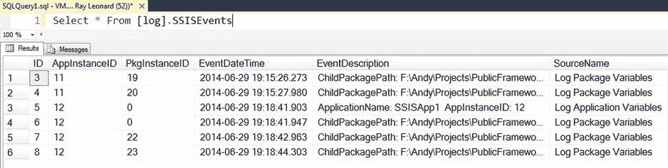

**图 A-18. SSIS 框架事件！**

在 SSMS 中查看 `log.SSISEvents` 表令人失望。数据是准确的，SSMS 也完成了它的工作，但对于这类数据，用户体验本可以更好。幸运的是，SQL Server 2014 附带了 SQL Server Reporting Services，它提供了更好的用户体验！让我们来看看如何构建报告来显示这些数据。

### 报告执行指标

SQL Server Reporting Services (SSRS) 允许我们创建报告，以更用户友好的格式显示 SSIS 框架的元数据和指标。我们可以在报告中添加可视化效果，以帮助识别 SSIS 应用程序和 SSIS 包的状态。

打开一个新的 SSDT-BI 实例，并创建一个名为 `PublicFrameworkReports_PackageDeployment_2014` 的新报表服务器项目。在解决方案资源管理器中，右键单击“共享数据源”，然后单击“添加新数据源”。当“共享数据源属性”窗口显示时，将 `Name` 属性设置为 **SSISConfig**，然后单击“编辑”按钮以配置到您的 `SSISConfig` 数据库实例的连接。当我配置共享数据源时，它如 图 A-19 所示。

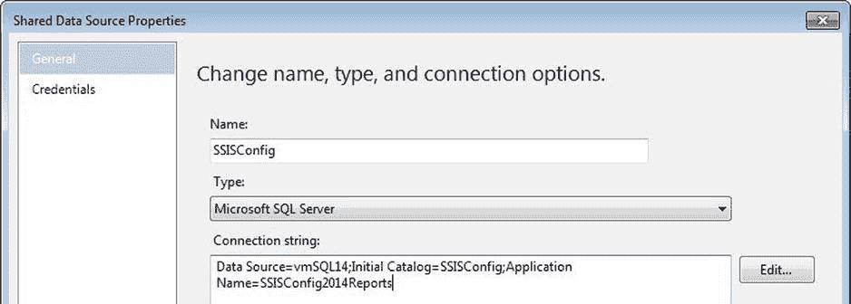

**图 A-19. 配置 SSISConfig 共享数据源**

您现在准备好构建报告了！让我们从创建一个显示应用程序实例数据的报告开始。

在我们投入报告开发之前，我们将在 `SSISConfig` 数据库中创建支持对象。清单 A-21……


### 创建 rpt 架构和 rpt.ReturnAppInstanceHeader 存储过程

**清单 A-21** 包含了构建 `rpt` 架构和 `rpt.ReturnAppInstanceHeader` 存储过程所需的 T-SQL 脚本。

```sql
/* rpt 架构 */
If Not Exists(Select name
              From sys.schemas
              Where name = 'rpt')
 begin
  print '正在创建 rpt 架构'
  declare @sql varchar(100) = 'Create Schema rpt'
  exec(@sql)
  print 'Rpt 架构已创建'
 end
Else
 print 'Rpt 架构已存在。'
print ''

/* rpt.ReturnAppInstanceHeader 存储过程 */
If Exists(Select s.name + '.' + p.name
          From sys.procedures p
          Join sys.schemas s
            On s.schema_id = p.schema_id
          Where s.name = 'rpt'
            And p.name = 'ReturnAppInstanceHeader')
 begin
  print '正在删除 rpt.ReturnAppInstanceHeader 存储过程'
  Drop Procedure rpt.ReturnAppInstanceHeader
  print 'Rpt.ReturnAppInstanceHeader 存储过程已删除'
 end
print '正在创建 rpt.ReturnAppInstanceHeader 存储过程'
go

Create Procedure rpt.ReturnAppInstanceHeader
 @ApplicationName varchar(255) = NULL
As

  Select a.ApplicationID
       ,ap.AppInstanceID
       ,a.ApplicationName
       ,ap.StartDateTime
       ,DateDiff(ss,ap.StartDateTime,Coalesce(ap.EndDateTime,GetDate())) As RunSeconds
       ,ap.Status
  From log.SSISAppInstance ap
  Join cfg.Applications a
    On ap.ApplicationID = a.ApplicationID
  Where a.ApplicationName = Coalesce(@ApplicationName,a.ApplicationName)
  Order by AppInstanceID desc

go
print 'Rpt.ReturnAppInstanceHeader 存储过程已创建。'
print ''
```

### 在 SSDT 中创建报表

返回 `SSDT`，在`解决方案资源管理器`中右键单击`报表`虚拟文件夹，然后单击`添加新报表`。如果显示欢迎屏幕，则单击`下一步`按钮。在`选择数据源`屏幕上，选择名为 `SSISConfig` 的共享数据源，然后单击`下一步`按钮。接下来显示`设计查询`窗口；将 `rpt.ReturnAppInstanceHeader` 添加到`查询字符串`文本框中，然后单击`下一步`按钮。在`选择报表类型`页面上选择`表格`，然后单击`下一步`按钮。当`设计表`页面显示时，在`可用字段`列表框中多选所有列，然后单击`详细信息`按钮。报表向导将显示如 图 A-20 所示。

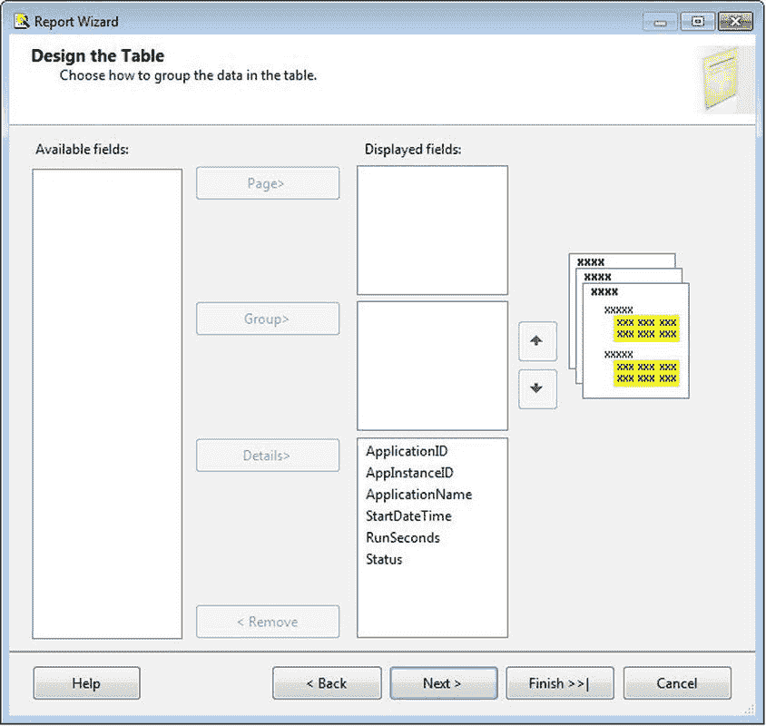

图 A-20. 将所有可用字段选择为详细信息

单击`下一步`按钮。在`选择表样式`页面上选择一个主题，然后单击`下一步`按钮。在`完成向导`页面上，在`报表名称`属性文本框中输入**应用程序实例**，然后单击`完成`按钮。

`SSRS 报表向导`将生成报表，但它对存储过程的管理效率不高。你需要更改设置以使报表获得最佳性能。单击`视图` -> `报表数据`以显示`报表数据`侧边栏。展开`数据集`虚拟文件夹。右键单击 `DataSet1` 并单击`数据集属性`。当`数据集属性`窗口显示时，将数据集重命名为 `rpt_ReturnAppInstanceHeader`（`数据集名称`属性不喜欢句点）。将 `rpt.ReturnAppInstanceHeader` 从`查询`属性中复制出来，并单击`查询类型`下的`存储过程`选项。将 `rpt.ReturnAppInstanceHeader` 粘贴到`选择或输入存储过程名称`下拉列表中。`数据集属性`窗口应类似于 图 A-21 所示。

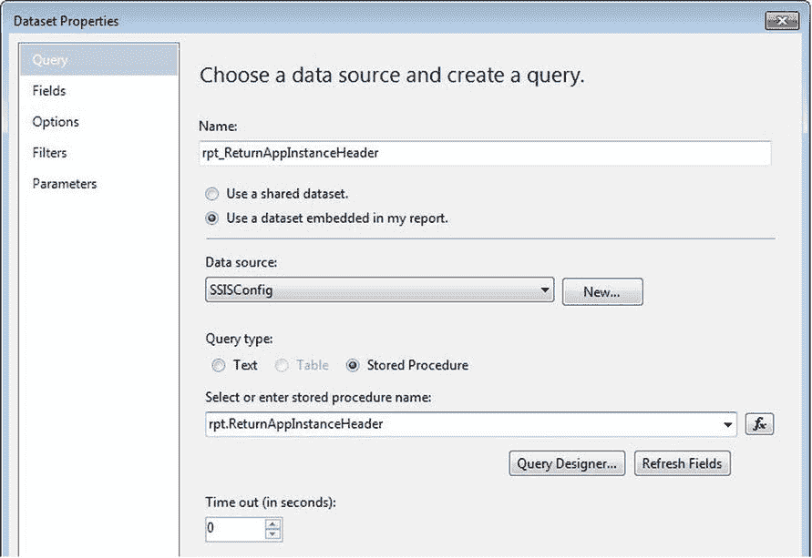

图 A-21. 配置数据集以使用 rpt.ReturnAppInstanceHeader 存储过程

单击`确定`按钮关闭`数据集属性`窗口。

### 配置报表参数

如果单击`预览`选项卡，报表将提示您输入应用程序名称，如 图 A-22 所示。

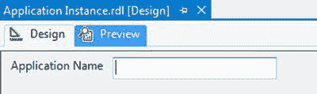

图 A-22. 提示输入应用程序名称

在文本框中输入 **SSISApp1**，然后单击右上角的`查看报表`按钮。我们不希望用户每次使用报表时都提供 SSIS 应用程序名称，因此让我们配置名为 `@ApplicationName` 的报表参数。单击`设计`选项卡并返回到`报表数据`侧边栏。展开`参数`虚拟文件夹。双击 `@ApplicationName` 以打开`报表参数属性`窗口。在`常规`页面上，勾选`允许空值`复选框，并将`选择参数可见性`选项更改为`隐藏`。在`默认值`页面上，选择`指定值`选项，然后单击`添加`按钮。一个 `(Null)` 行将被添加到`值`网格中，这正是我们想要的。单击`确定`按钮关闭`报表参数属性`窗口。

通过单击`预览`选项卡测试更改。报表应显示数据库中存储的所有应用程序实例行，如 图 A-23 所示。

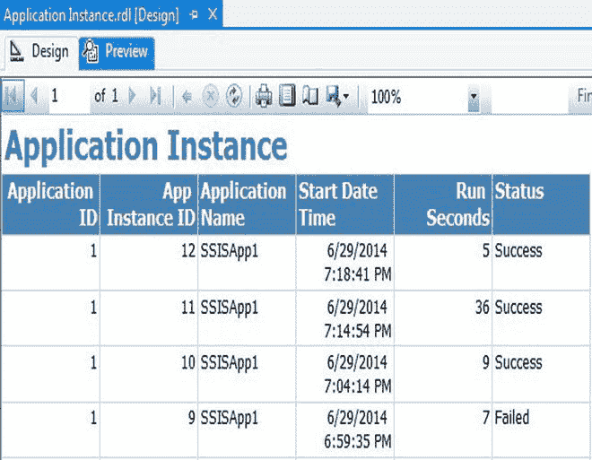

图 A-23. 显示应用程序实例数据

### 移除 0 行

我们不想在这些报表中看到显示的 `0` 行。通过执行 清单 A-22 中所示的 T-SQL 来修改 `rpt.ReturnAppInstanceHeader` 存储过程，以将这些记录从返回结果中排除。

**清单 A-22**. 更新 rpt.ReturnAppInstanceHeader 存储过程

```sql
/* rpt.ReturnAppInstanceHeader 存储过程 */
If Exists(Select s.name + '.' + p.name
          From sys.procedures p
          Join sys.schemas s
            On s.schema_id = p.schema_id
          Where s.name = 'rpt'
            And p.name = 'ReturnAppInstanceHeader')
 begin
  print '正在删除 rpt.ReturnAppInstanceHeader 存储过程'
  Drop Procedure rpt.ReturnAppInstanceHeader
  print 'Rpt.ReturnAppInstanceHeader 存储过程已删除'
 end
print '正在创建 rpt.ReturnAppInstanceHeader 存储过程'
go

Create Procedure rpt.ReturnAppInstanceHeader
 @ApplicationName varchar(255) = NULL
As

  Select a.ApplicationID
       ,ap.AppInstanceID
       ,a.ApplicationName
       ,ap.StartDateTime
       ,DateDiff(ss,ap.StartDateTime,Coalesce(ap.EndDateTime,GetDate())) As RunSeconds
       ,ap.Status
  From log.SSISAppInstance ap
  Join cfg.Applications a
    On ap.ApplicationID = a.ApplicationID
  Where a.ApplicationName = Coalesce(@ApplicationName,a.ApplicationName)
  And a.ApplicationID > 0
  Order by AppInstanceID desc

go
print 'Rpt.ReturnAppInstanceHeader 存储过程已创建。'
print ''
```

刷新应用程序实例报表预览，它现在显示如 图 A-24 所示。

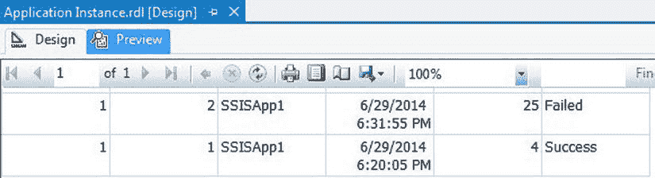

图 A-24. 刷新后的应用程序实例报表，不含 0 行

### 添加条件背景色

颜色比大多数视觉提示更能帮助识别状态。要为数据行添加背景色，请返回到`设计`选项卡并选择表中显示数据值的行（底部行）。按 `F4` 键显示`属性`，然后单击`背景色`属性。在`背景色`属性的值下拉列表中，选择`表达式`。当`表达式`窗口打开时，将`设置表达式 for: BackgroundColor`文本框中的文本从`无颜色`（默认值）更改为以下表达式：

```vb
=Switch(Fields!Status.Value="Success", "LightGreen" , Fields!Status.Value="Failed", "LightCoral" , Fields!Status.Value="Running", "LightBlue" , Fields!Status.Value="Cancelled", "LightYellow")
```


Value="Running", "Yellow")

当您通过移除对用户意义不大的 ID 列、重置字体大小、更改文本对齐方式以及调整列宽来清理报告时，可以将报告修改为如图 A-25 所示的外观。

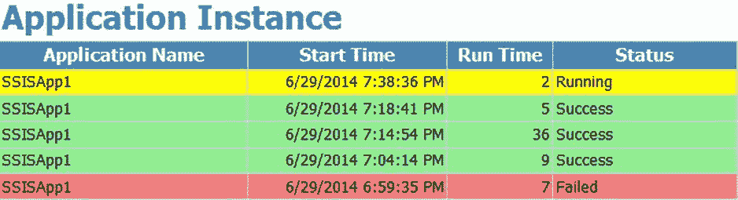

图 A-25. 应用程序实例——彩色显示！

我称之为运营智能。企业运营人员查看此报告，可以获取有关当前企业数据集成过程状态的大量信息。

包实例报告非常相似。让我们首先将存储过程添加到数据库，如清单 A-23 所示。

#### 清单 A-23. 添加 rpt.ReturnPkgInstanceHeader 存储过程

```sql
/* rpt.ReturnPkgInstanceHeader stored procedure */
If Exists(Select s.name + '.' + p.name
          From sys.procedures p
          Join sys.schemas s
            On s.schema_id = p.schema_id
          Where s.name = 'rpt'
            And p.name = 'ReturnPkgInstanceHeader')
 begin
   print 'Dropping rpt.ReturnPkgInstanceHeader stored procedure'
   Drop Procedure rpt.ReturnPkgInstanceHeader
   print 'Rpt.ReturnPkgInstanceHeader stored procedure dropped'
 end

print 'Creating rpt.ReturnPkgInstanceHeader stored procedure'
go

Create Procedure rpt.ReturnPkgInstanceHeader
 @AppInstanceID int
As
              SELECT a.ApplicationName
                     ,p.PackageFolder + p.PackageName As PackagePath
                     ,cp.StartDateTime
                     ,DateDiff(ss, cp.StartDateTime, Coalesce(cp.EndDateTime,GetDate())) As RunSeconds
                     ,cp.Status
                     ,ai.AppInstanceID
                     ,cp.PkgInstanceID
                     ,p.PackageID
                     ,p.PackageName
                FROM log.SSISPkgInstance cp
                Join cfg.AppPackages ap
                    on ap.AppPackageID = cp.AppPackageID
               Join cfg.Packages p
                    on p.PackageID = ap.PackageID
               Join log.SSISAppInstance ai
                    on ai.AppInstanceID = cp.AppInstanceID
               Join cfg.Applications a
                    on a.ApplicationID = ap.ApplicationID
              WHERE ai.AppInstanceID = Coalesce(@AppInstanceID,ai.AppInstanceID)
                And a.ApplicationID > 0
              Order By cp.PkgInstanceID desc
go

print 'Rpt.ReturnPkgInstanceHeader stored procedure created.'
print ''
```

在 SSDT 中，像添加应用程序实例报告一样，添加一个名为 `Package Instance` 的新报告。确保使用 `rpt.ReturnPkgInstanceHeader` 存储过程。要让报表向导识别需要参数的查询，您需要在“设计查询”页面添加默认参数值。我的查询字符串文本框内容如下：

```sql
exec rpt.ReturnPkgInstanceHeader NULL
```

这允许查询生成器定位从存储过程返回的列列表（这是报表向导继续操作所需要的）。报告构建完成后，请记住首先更新数据集，然后更新报告参数，就像您为应用程序实例报告所做的那样。此特定设计的一个很酷的地方是我们可以重用数据行上 `BackgroundColor` 的表达式。完成后，包实例报告显示如图 A-26。

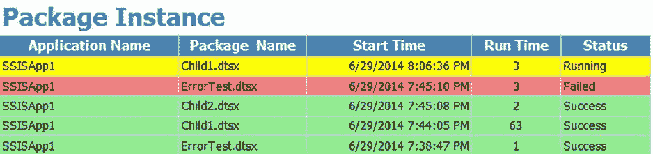

图 A-26. 包实例报告

包实例是应用程序实例的“子级”。为了反映这种关系，请返回到应用程序实例报告并向表中添加一列以包含“包”链接。在列标题和数据单元格的文本中输入 `Packages`。

右键单击数据单元格，然后单击“文本框属性”。在“字体”页面上，将字体颜色更改为蓝色并将“效果”属性设置为“下划线”。在“操作”页面上，为“启用操作”属性选择“转到报告”选项，并将“指定报告”属性设置为 `Package Instance`。在“使用这些参数运行报告”网格中，单击“添加”按钮并将 `AppInstanceID` 参数映射到 `[AppinstanceID]` 值。单击“确定”按钮关闭“文本框属性编辑器”。

单击“预览”选项卡以显示应用程序实例报告。选择一个“包”链接导航到将仅包含与该特定应用程序实例相关的包实例的包实例报告。包实例报告应显示为类似于图 A-27 中显示的包实例报告。

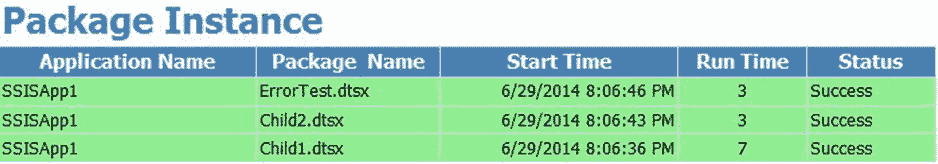

图 A-27. 单个应用程序实例的包实例

以这种方式构建报告是有意义的。应用程序实例报告成为包实例报告的“网关”——可以说是“仪表盘”。稍后会详细介绍……

让我们将注意力转向错误日志数据。要检索它，请使用清单 A-24 中所示的 T-SQL 脚本。

#### 清单 A-24. 构建 rpt.ReturnErrors 存储过程

```sql
/* rpt.ReturnErrors stored procedure */
If Exists(Select s.name + '.' + p.name
          From sys.procedures p
          Join sys.schemas s
            On s.schema_id = p.schema_id
          Where s.name = 'rpt'
            And p.name = 'ReturnErrors')
 begin
   print 'Dropping rpt.ReturnErrors stored procedure'
   Drop Procedure rpt.ReturnErrors
   print 'Rpt.ReturnErrors stored procedure dropped'
 end

print 'Creating rpt.ReturnErrors stored procedure'
go

Create Procedure rpt.ReturnErrors
  @AppInstanceID int
 ,@PkgInstanceID int = NULL
As
  Select
     a.ApplicationName
   ,p.PackageName
   ,er.SourceName
   ,er.ErrorDateTime
   ,er.ErrorDescription
 From log.SSISErrors er
 Join log.SSISAppInstance ai
     On ai.AppInstanceID = er.AppInstanceID
 Join cfg.Applications a
     On a.ApplicationID = ai.ApplicationID
 Join log.SSISPkgInstance cp
     On cp.PkgInstanceID = er.PkgInstanceID
         And cp.AppInstanceID = er.AppInstanceID
 Join cfg.AppPackages ap
     On ap.AppPackageID = cp.AppPackageID
 Join cfg.Packages p
     On p.PackageID = ap.PackageID
 Where er.AppInstanceID = Coalesce(@AppInstanceID, er.AppInstanceID)
     And er.PkgInstanceID = Coalesce(@PkgInstanceID, er.PkgInstanceID)
 Order By ErrorDateTime Desc
go

print 'Rpt.ReturnErrors stored procedure created.'
print ''
```

清单 A-24 中的 T-SQL 构建了 `rpt.ReturnErrors` 存储过程，它将为新的报告提供数据。现在让我们在 SSDT 中构建该报告。

在 `SSISConfig2012Reports` 解决方案中添加一个名为 `Errors` 的新报告。使用 `rpt.ReturnErrors` 存储过程作为源。请记住更新数据集和两个报告参数：`AppinstanceID` 和 `PkgInstanceID`。

在表的数据行上，编辑 `BackgroundColor` 属性，添加以下表达式：

```vbnet
=Iif(RowNumber(Nothing) Mod 2 = 0,"White","WhiteSmoke")
```

我们在这里不是为了反映状态而对每个单元格的背景进行着色；如果我们这样做，报告将充满 `LightCoral`。但我们需要在视觉上分隔这些行，因此让我们使用微妙的阴影来帮助眼睛在凌晨 2:15 某个黑暗而沉闷的早晨扫视整行。

打开应用程序实例报告。右键单击 `Status` 数据字段，然后单击“文本框属性”。导航到“字体”页面，然后单击“颜色”属性下拉列表旁边的 `f(x)` 按钮。在“为 Color 设置表达式”文本框中，输入以下表达式：

```vbnet
=Iif(Fields!Status.


### 配置 SSIS 报告中的超链接与装饰

### 修改 Application Instance 报告的状态字段

首先，在 Application Instance 报告中修改`Status`字段。

在`Set Expression for: Color`文本框中输入以下表达式，将状态文本颜色改为蓝色：
```
=Iif(Fields!Status.Value="Failed", "Blue", "Black")
```

如果状态是`"Failed"`，此表达式会将状态文本颜色更改为蓝色。

点击效果属性下拉列表旁的 f(x)按钮。在`Set Expression for: TextDecoration`文本框中，添加以下表达式：
```
=Iif(Fields!Status.Value="Failed", "Underline", "Default")
```

此表达式将为`"Failed"`状态添加下划线。它与前一个属性结合，使`"Failed"`状态显示为超链接。

### 配置超链接目标

现在配置该超链接的导航属性。转到“操作”页面，在“启用为操作”属性中选择“转到报表”选项。

点击“指定报表”下拉列表旁的 f(x)按钮，并在`Set Expression for: ReportName`文本框中添加以下表达式：
```
=Iif(Fields!Status.Value="Failed", "Errors", Nothing)
```

点击“添加”按钮，将`AppInstanceID`参数名称映射到`[AppInstanceID]`参数值。

点击参数映射中`Omit`列的 f(x)按钮，并在`Set Expression for: Omit`文本框中添加以下表达式：
```
=Iif(Fields!Status.Value="Failed", False, True)
```

以上两个属性设置配置了`Status`值的“操作”属性。如果状态是`"Failed"`，点击将显示为超链接的单词*Failed*，将导致显示“错误”报表。显示时，它将仅显示与该数据行中应用程序实例相关联的错误行。

### 测试 Application Instance 报告

测试一下！当我运行“应用程序实例”报表时，它现在显示如图 A-28 所示。
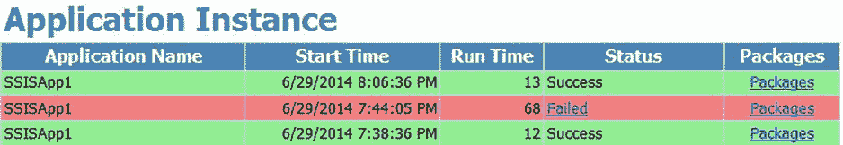
图 A-28。包含状态和包装饰的“应用程序实例”报表。

点击一个“失败”超链接会将我们带到该应用程序实例的“错误”报表。报表应类似于图 A-29 所示。
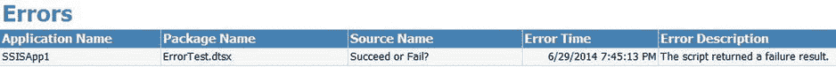
图 A-29。显示一个错误。

在 SSIS 包中快速定位错误来源是提高整体运营效率的一种方法。这些报表协同工作，有助于进行高效的根源分析。

### 创建 Events 报表

“事件”报表与“错误”报表非常相似。创建`rpt.ReturnEvents`存储过程的 T-SQL 脚本如清单 A-25 所示。
**清单 A-25**。构建`rpt.ReturnEvents`存储过程。

```
/* rpt.ReturnEvents stored procedure */
If Exists(Select s.name + '.' + p.name
          From sys.procedures p
          Join sys.schemas s
            On s.schema_id = p.schema_id
          Where s.name = 'rpt'
            And p.name = 'ReturnEvents')
 begin
  print 'Dropping rpt.ReturnEvents stored procedure'
  Drop Procedure rpt.ReturnEvents
  print 'Rpt.ReturnEvents stored procedure dropped'
 end
print 'Creating rpt.ReturnEvents stored procedure'
go

Create Procedure rpt.ReturnEvents
  @AppInstanceID int
 ,@PkgInstanceID int = NULL
As
  Select
    a.ApplicationName
   ,p.PackageName
   ,ev.SourceName
   ,ev.EventDateTime
   ,ev.EventDescription
  From log.SSISEvents ev
  Join log.SSISAppInstance ai
    On ai.AppInstanceID = ev.AppInstanceID
  Join cfg.Applications a
    On a.ApplicationID = ai.ApplicationID
  Join log.SSISPkgInstance cp
    On cp.PkgInstanceID = ev.PkgInstanceID
        And cp.AppInstanceID = ev.AppInstanceID
  Join cfg.AppPackages ap
    On ap.AppPackageID = cp.AppPackageID
  Join cfg.Packages p
    On p.PackageID = ap.PackageID
  Where ev.AppInstanceID = Coalesce(@AppInstanceID, ev.AppInstanceID)
    And ev.PkgInstanceID = Coalesce(@PkgInstanceID, ev.PkgInstanceID)
  Order By EventDateTime Desc
go
print 'Rpt.ReturnEvents stored procedure created.'
print ''
```

添加一个名为**Events**的新报表，使用`rpt.ReturnEvents`存储过程，并记得配置数据集和报表参数。添加我在“错误”报表中演示的交替行底纹。相同的表达式在“事件”报表中也适用：
```
=Iif(RowNumber(Nothing) Mod 2 = 0,"White","WhiteSmoke")
```

### 为 Events 配置超链接

返回到“应用程序实例”报表，并向数据表中添加另一列。将其标记为**Events**，并将数据网格值也设置为`Events`。打开`Events`数据字段的“文本框属性”窗口，并导航到“字体”页面。将“颜色”属性更改为蓝色，将“效果”属性更改为下划线。

在“操作”页面，将“启用为操作”属性更改为“转到报表”，并将“指定报表”下拉列表更改为`Events`。添加一个参数映射，将`AppInstanceID`参数名称映射到`[AppinstanceID]`参数值。点击“确定”按钮关闭“文本框属性编辑器”。

测试一下！“应用程序实例”报表现在显示如图 A-30 所示。
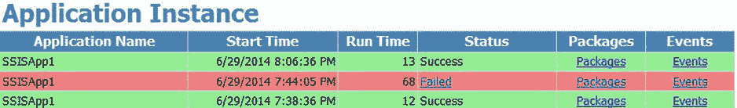
图 A-30。新增和改进的“应用程序实例”报表。

点击“事件”超链接将带我们到“事件”报表，该报表应类似于图 A-31 所示的报表。
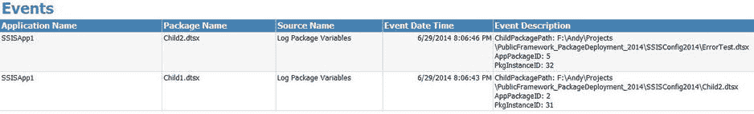
图 A-31。应用程序实例的“事件”报表。

这一轮的最新报表和对“应用程序实例”报表的更新强化了其作为运营智能仪表板的地位。类似的更改也可以应用于“包实例”报表。

### 在 Package Instance 报告中应用相同配置

现在为“包实例”报表添加“失败”链接功能和“事件”列。

在“包实例”报表中，打开`Status`数据字段的“文本框属性编辑器”。像在“应用程序实例”报表中处理`Status`数据字段一样，导航到“字体”页面并点击颜色属性下拉列表旁的 f(x)按钮。在`Set Expression for: Color`文本框中，输入以下表达式：
```
=Iif(Fields!Status.Value="Failed", "Blue", "Black")
```

此表达式将在状态为`"Failed"`时将状态文本颜色更改为蓝色。

点击效果属性下拉列表旁的 f(x)按钮。在`Set Expression for: TextDecoration`文本框中，添加以下表达式：
=Iif(Fields!Status.Value=“Failed”, “Underline”, “Default”)

与“应用程序实例”报表一样，此表达式将为`Failed`状态添加下划线。它与前一个属性结合，使`Failed`状态显示为超链接。

### 配置 Package Instance 的超链接目标

现在配置该属性。转到“操作”页面，在“启用为操作”属性中选择“转到报表”选项。

点击“指定报表”下拉列表旁的 f(x)按钮，并在`Set Expression for: ReportName`文本框中添加以下表达式：
```
=Iif(Fields!Status.Value="Failed", "Errors", Nothing)
```

点击“添加”按钮，将`AppInstanceID`参数名称映射到`[AppInstanceID]`参数值。再次点击“添加”按钮，将`PkgInstanceID`参数名称映射到`[PkgInstanceID]`参数值。

点击每个参数映射中`Omit`列的 f(x)按钮，并在每个`Set Expression for: Omit`文本框中添加以下表达式：
```
=Iif(Fields!Status.Value="Failed", False, True)
```

与“应用程序实例”报表一样，以上两个属性设置配置了`Status`值的“操作”属性。如果状态是`"Failed"`，点击将显示为超链接的单词 Failed，将导致显示“错误”报表。显示时，它将仅显示与该数据行中应用程序实例相关联的错误行。

测试一下！


当我们运行包实例报告时，现在它如图 A-32 所示。
    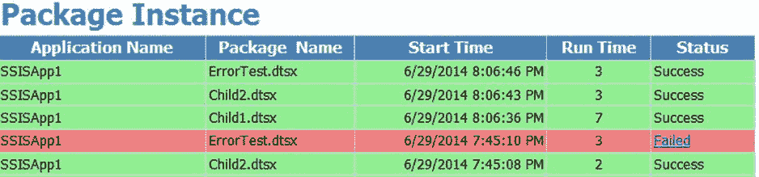
    图 A-32。包实例报告的“失败超链接”

点击一个失败链接会带我们进入该包实例的错误报告。很好。现在让我们在包实例报告中添加一个 `Events` 列。添加一个列，其标题和数据字段都硬编码为 `Events`。为 `Events` 数据字段打开“文本框属性”窗口并导航到“字体”页面。将“颜色”属性设置为 `Blue`，将“效果”属性设置为 `Underline`。导航到“操作”页面，并将“启用为操作”属性设置为 `Go to Report`。从“指定报表”下拉菜单中选择 `Events` 报告，然后单击“添加”按钮两次以映射两个参数。将 `AppInstanceID` 参数名映射到 `[AppInstanceID]` 参数值，将 `PkgInstanceID` 参数名映射到 `[PkgInstanceID]` 参数值。关闭“文本框属性”窗口并单击“预览”选项卡进行测试。包实例报告应如图 A-33 所示。
    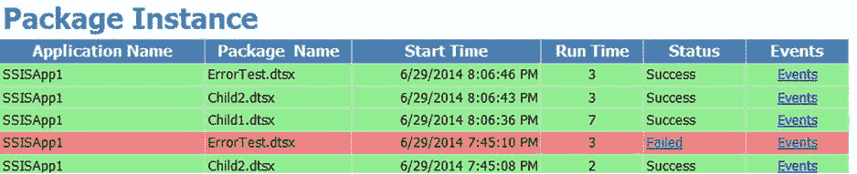
    图 A-33。完成的包实例报告

点击 `Events` 链接将带我进入 `Events` 报告，并仅显示引用行上包实例的事件。

总结一下，你可以从应用程序实例报告开始；它位于仪表板上。点击“包”链接可查看作为选定 SSIS 应用程序实例一部分执行的所有 SSIS 子包。从那里，可以深入查看错误报告，并观察导致包失败的错误，或者在 `Events` 报告中查看所选包实例的 `OnInformation` 事件处理程序记录的所有事件。你也可以从应用程序实例报告中访问 SSIS 应用程序实例的所有错误和事件。

### 结论

此示例并非 SSIS 框架的详尽示例，但它展示了使用 SSIS 进行基于模式的数据集成开发的实用性。该示例框架提供了可重复的、元数据驱动的 SSIS 执行，而无需离开 SSIS 和 SQL Server 数据库领域。监控由一组 SQL Server Reporting Services 报告提供，这些报告由存储过程驱动，这些存储过程读取框架的 `Parent.dtsx` SSIS 包自动捕获的元数据。在子包中捕获错误和事件信息无需编写代码行，并且这些信息以一致的格式集中记录，这使其非常适合进行报告。

### 索引

  A
`AcquireConnection method`
`Advanced Editor`
`AndyWeather.com`

  B
`Biml2014`
`Business intelligence (BI)`
`Business Intelligence Development Studio (BIDS)`
`Business Intelligence Markup Language (Biml)`
`command-line`
`data integration development`
`execution`
`file`
`BimlScript.biml file`
`connect metadata`
`error message`
`Execute SQL Task`
`initial code`
`SSIS package`
`TestBimlPackage.dtsx`
`XML metadata`
`history`
`incremental load pattern`
`add metadata`
`databases and tables creation`
`data flow task`
`debug executing script`
`dtsx SSIS package test script`
`pre-SSIS-package script`
`SSISIncrementalLoad_Source.dbo.tblSource`
`transforms (see Transforms)`
`T-SQL reset rows script`
`package metadata`
`BimlScript`
`C# application`
`foreach loop`
`FrameworkSQLGen.biml file`
`output file`
`PackageName and ExecutionOrder`
`parameters`
`stringbuilder`
`Transact-SQL script`
`SSIS design patterns engine`
`add .NET namespaces and initial method`
`close out task`
`connection variable`
`data flow task`
`Execute SQL task`
`GenerateTableNodes() method`
`package node with .NET replacements`
`packages node and starting loop`
`SSISIncrementalLoad_Stage database`
`T-SQL script`
`testing`
`dynamic SSIS package`
`four SSIS packages`

  C
`Catalog deployment model`
`Change data capture (CDC)`
`Child-to-Parent variable pattern`
`Cloud loader`
`ADO.Net destination adapter`
`AWCleanLoadMaxID variable`
`CleanTemperature table`
`CleanTempLocalMaxID variable`
`dbo.CleanTemperature table`
`LoadMetrics table`
`OLE DB source adapter`
`WeatherData Source Query`
`Clustered columnstore index (CCI)`
`Command-line execution`
`Compilation error`
`Composite domain (CD)`
`Connection managers`
`DB2 source patterns`
`ASCII`
`Data Link properties`
`EBCDIC`
`installation`
`OLE DB Provider`
`ADO.NET connection`
`connection object`
`definition`
`ODBC`
`OLE DB`
`script component`


### D

-   连接字符串属性
-   客户服务与支持 (CSS)
-   数据清理。请参阅数据质量服务 (DQSs)
-   数据转换转换编辑器
-   数据定义语言 (DDL)
-   数据错误
    -   已知错误
    -   数据缺失
        -   添加缺失的维度成员
        -   事实表
        -   分诊表
        -   未知成员
    -   简单错误
    -   未处理错误
-   数据质量服务 (DQSs)
    -   清理转换
    -   高级选项卡
    -   异步组件
    -   CodePlex
    -   列状态值
    -   条件拆分转换
    -   连接管理器
    -   数据流逻辑处理
    -   数据流工具箱
    -   导入域值
    -   KB 编辑器，更正
    -   列列表
    -   日志信息
    -   映射列
    -   映射选项卡，列选择
    -   并行处理
    -   项目名称生成
    -   右侧窗格
    -   行筛选，查找转换
    -   行跟踪
    -   客户端实用工具
    -   组件
    -   复合域
    -   数据质量客户端
        -   管理部分
        -   数据管理
        -   数据质量项目
        -   默认知识库
        -   知识库管理
        -   在线参考数据
        -   角色
        -   知识库
-   数据捕获点
-   数据转换服务 (DTSs)
-   数据仓库模式
    -   数据错误（请参阅数据错误）
    -   ETL 工作流
    -   增量加载（请参阅增量加载）
-   DB2 源模式
    -   连接管理器
    -   ASCII
    -   数据链接属性
    -   EBCDIC
    -   安装
    -   OLE DB 提供程序
    -   数据库版本
    -   提供程序供应商
    -   查询
        -   派生参数属性
        -   动态查询
        -   编辑属性值窗口
        -   SQL PL 和 PL/SQL
    -   类型
-   调试执行
-   部署
    -   方法
    -   自定义代码
    -   PowerShell
    -   SQL API
    -   向导命令行
-   包部署模型
-   项目部署模型
    -   SSIS 目录
-   部署模型。请参阅执行模式
-   域管理
-   DWLoader
-   动态管理函数 (DMFs)
-   动态管理视图 (DMVs)

### E

-   错误日志记录
    -   添加 0 ID 行
    -   AppInstanceID 和 PkgInstanceID SSIS 变量
    -   构建错误日志记录表和存储过程
    -   ErrorDescription 参数
    -   信息事件
    -   记录应用程序变量
    -   Log.LogEvents 表
    -   记录包变量
    -   log.SSISErrors 表
    -   参数映射页
    -   父包 OnError 事件处理程序
    -   SourceName 和 ErrorDescription
    -   T-SQL 脚本
-   执行包任务编辑器
-   执行包实用工具 (DtExecUI)
-   执行 SQL 任务编辑器
-   执行模式
    -   命令行执行
    -   自定义执行框架，SQL Agent 作业
    -   调试执行
    -   执行包任务
    -   执行包实用工具
    -   文件系统包计划
    -   Integration Server 目录（请参阅 Integration Server 目录）
    -   Integration Services 目录
    -   托管代码（请参阅托管代码执行）
    -   元数据驱动执行
    -   项目引用包
    -   Public Sub Main()
    -   public void Main()
    -   SQLAgent 作业，使用自定义执行框架
    -   SSIS 目录
-   表达式语言
    -   赋值
    -   连接管理器
    -   反斜杠 (\)
    -   DATEPART 函数
    -   动态文件名
    -   基于文件的源
    -   FTP 源
    -   项目级别
    -   [RIGHT 函数](#9781484200834_Ch10.xhtml#cXXX.


### F, G

*   一致性
*   控制流
*   优先级约束 (*参见* 优先级约束)
*   任务级别
*   C 风格语言
*   数据流
*   分支
*   自定义任务/组件
*   数据清洗
*   数据源组件
*   动态逻辑
*   `Execute SQL task`
*   `Script component`
*   `Script task`
*   SQL Server Data Quality Services/Master Data Services
*   第三方任务/组件
*   定义
*   评估
*   `ForEach Loop`
*   功能域
*   限制
*   维护范围
*   包
*   简洁性
*   `T-SQL`
*   变量
*   提取、加载和转换 (`ELT`) 流程
*   提取、转换和加载 (`ETL`) 流程
*    **F, G**
*   平面文件源模式
*   归档文件模式
*   `Connection Manager Editor` 的“列”页
*   数据暂存模式
*   `CREATE TABLE 语句`
*   数据流路径编辑器
*   `ETL` 开发人员
*   映射页
*   `修改后的 CREATE TABLE 语句`
*   `OLE DB` 目标自动映射
*   编辑器连接管理器配置
*   页脚行
*   “列”页
*   `条件拆分转换`
*   调试变量
*   `FileInUse 函数`
*   导入语句
*   `Main() 子程序`
*   映射包参数
*   `MyFileFooterSource.csv`
*   已解析行
*   行计数和提取日期
*   `脚本任务`
*   选择变量
*   `TestParent.dtsx 包`
*   `WriteFileFooter.dtsx 包`
*   标题行
*   `CreateNewOutputRows 子程序`
*   `动态 ConnectionString 属性`
*   `执行包任务编辑器`
*   `Input0_ProcessInputRow 子程序`
*   `iRowNum 整型变量`
*   `WriteFileHeader.dtsx`
*   拆分记录类型
*   `StagingDB`
*   终止流
*   变长行平面文件
*   `Foreach Loop 编辑器`

### H

*   硬件架构

### I, J

*   增量加载
*   `CDC`
*   暴力检测
*   `CDC 源`
*   基于校验和的检测
*   `控制任务编辑器`
*   `ETL` 流程
*   `Hashbytes 函数`
*   历史加载
*   集成服务
*   供应端增量加载工具
*   逐表基础
*   定义
*   事实数据
*   `MERGE 语句`
*   审计
*   控制流设计
*   `INSERT`、`UPDATE` 和 `DELETE` 操作
*   `ISNULL() 函数`
*   `OUTPUT 子句`
*   `SSIS` 加载包
*   `T-SQL` 武器库
*   `T-SQL` `MERGE` 功能
*   原生 `SSIS` 组件
*   加载暂存区
*   查找操作
*   可移动部件
*   `SCD 向导`
*   `SDD`
*   系统化识别
*   `Integration Server` 目录
*   自定义执行框架
*   `ADO.Net` 连接
*   `Connection` 属性
*   执行包两次
*   `参数映射` 页
*   父包控制流
*   `结果集` 页
*   表创建
*   `T-SQL` 语句
*   `变量映射` 页
*   数据捕获点
*   `DDL 语句`
*   执行
*   `平面文件连接管理器`
*   `OLEDBDest TemperatureStage OLE DB 目标适配器`
*   包装器存储过程脚本
*   `SSISDB 数据库`
*   `T-SQL 脚本`
*   包装器存储过程脚本
*   `Integration Services`

### K

*   知识库管理
*   知识发现

### L

*   `LoadPackage 方法`
*   日志记录和报告模式
*   目录
*   目录视图
*   现有报告
*   [内部表](#9781484200834_Ch15.xhtml#cXXX.


### M, N

*   `levels changing`
*   `logging levels`
*   `new reports`
*   `setting up`
*   `package`
*   `design pattern`
*   `OnError`
*   `OnPreExecute`
*   `OnVariableValueChanged`
*   `reporting`
*   `set up logging`
*   `Log sequence number (LSN)`
*   `Lookup transforms`
*   `Managed code execution`
*   `demo application`
*   `frmMain form`
*   `btnStartFileClick subroutine`
*   `frmISTreeHelper`
*   `frmMainHelper module`
*   `ISTree form`
*   `layout`
*   `package execution`
*   `package selection`
*   `SSIS Catalog representation`
*   `SSISDB`
*   `View Code`
*   `Management Object Model (MOM)`
*   `Manage Parameter Values`
*   `Massively parallel processing (MPP)`
*   `Matching Policy activity`
*   `Metadata collection`
*   `central repository`
*   `dba_monitor_SQLServerInstances`
*   `server instance monitoring`
*   `SSMS`
*   `T-SQL code`
*   `current data and log file sizes retrieval`
*   `data flow task`
*   `data storage and log file size information`
*   `dba_monitor_unusedIndexes table`
*   `dbaToolBox`
*   `description`
*   `DMVs`
*   `Foreach Loop container`
*   `information retrieval`
*   `integration services package`
*   `iterative framework`
*   `Connection Manager`
*   `dynamic properties connection`
*   `editing result set`
*   `Execute SQL Task Editor`
*   `Foreach Loop container`
*   `Foreach Loop Editor`
*   `new integration services project`
*   `package-scoped variables`
*   `Property Expressions Editor`
*   `Retrieve SQL Server Instances`
*   `SQL Task Editor`
*   `variable mappings`
*   `variables menu`
*   `Mappings page`
*   `OLE DB destination connection manager`
*   `OLE DB Source Editor`
*   `package execution`
*   `parameter mapping`
*   `SQL server metadata catalog`
*   `SSDT`
*   `stored procedure`
*   `Unused Indexes Retrieval`
*   `Update LastMonitored Value`
*   `Metadata-driven execution`
*   `Microsoft Azure SQL Database (MASD)`
*   `AndyWeather database`
*   `block diagram`
*   `change detection`
*   `Mist`
*   `My Flat File connection manager`

### O

*   `OData Connection Manager Editor`
*   `OData Source Editor`
*   `OLE DB`
*   `Command transforms`
*   `destination`
*   `Source Editor`
*   `Open Data (OData) protocol`
*   `Advanced Editor`
*   `Connection Manager`
*   `default data types`
*   `EDM data type mapping`
*   `metadata document`
*   `Microsoft online services authentication`
*   `query options`
*   `Source Editor`
*   `Columns page`
*   `Preview dialog`
*   `Source Fields`

### P, Q

*   `Package deployment model`
*   `Parallel Data Warehouse (PDW)`
*   `APS appliance`
*   `CCI`
*   `hardware architecture`
*   `shared-nothing architecture`
*   `software architecture`
*   `compression estimation`
*   `Data Conversion`
*   `data import pattern`
*   `Destination Database, PDW code`
*   `FactSales table`
*   `loading modes`
*   `loading server`
*   `multithreading`
*   `OLE DB Source Editor`
*   `package`
*   `partition function`
*   `SQL Server database creation`
*   `SQL Server PDW Connection Manager Editor`
*   `SQL Server PDW Destination`
*   `SQL Server PDW Destination Editor`
*   `staging database`
*   `Destination Editor`
*   `distributed table`
*   `limitations`
*   `load data`
*   `Control node`
*   `Control VM`
*   `DWLoader vs. Integration Services`
*   `ETL vs. ELT`
*   `MPP`
*   `replicated table`
*   `staging database`


### 335) 基于参数的配置模型

### 连接管理器
### 数据库表
#### 文件检索，SQL 任务
#### 示例值
#### SQL 定义
#### 默认配置
### 描述字段
### DTEXEC
#### 命令行开关
#### 文件系统
### SSIS 目录
### 动态包执行
### 入口点包
### 可表达的数据流组件属性
### 表达式生成器对话框
### 包执行
### 包级别参数
### 参数化 UI
### 参数值
### 属性表达式编辑器对话框
### 必需属性，验证
#### 脚本任务
### 敏感参数
### 服务器环境变量
### 解决方案资源管理器
### 变量窗口，SQL Server 307
### 可视化配置
### 父子模式
#### 子-父变量模式
#### 动态子包
### CREATE 和 INSERT 语句
### DelayValidation 属性
#### 设计模式
### 执行包任务编辑器
### 执行 SQL 任务编辑器
### Foreach 循环编辑器
### packageListObject
### 包列表表
#### 主包
#### 子包
### 参数绑定配置
### 优先级约束
#### 编辑器
#### 基于流的完成
#### 非标准符号
#### 成功约束
#### TRUNCATE TABLE 执行
### PreExecute 方法
### 项目部署模型
###  R
### 参考数据服务 (RDS)
### ReleaseConnection 方法
### RetainSameConnection 属性
### 回滚加载
###  S
### 脚本模式
#### 设计模式
#### 连接管理器 (`参见` 连接管理器)
#### 命名约定
#### 变量数据类型
#### 变量语法代码
#### 变量可见性
#### DTS
#### 维护
#### 复制/粘贴
#### 自定义任务/组件
#### 外部程序集
#### 源代码控制
#### 包设计
#### 脚本组件
#### 脚本编辑器
#### 编译器
#### 功能
#### .NET 运行时
#### 项目资源管理器
#### 脚本任务
#### 配置
#### `vs`. 脚本组件
### 无共享架构
### 缓慢变化维度 (SCD)
#### 优点和缺点
#### 数据流组件
#### 大型维度
#### 合并模式
#### 控制流
#### 类型 1 变化
#### 类型 2 变化
#### 最佳性能
#### 少量行
#### 第三方组件
#### 向导
#### 列变化类型
#### 维度表和键
#### 固定和变化属性选项
#### 历史属性选项
#### 推断的维度成员
### 软件架构
### sp_MSforeachdb 存储过程
### SQL Server 数据工具-商业智能 (SSDT-BI)
### SQL Server 数据工具 (SSDT)
### SQL Server Integration Services (SSIS) 包。`参见` 执行模式
### SQL Server Management Studio (SSMS)
### SQL Server PDW 连接管理器编辑器
### SQL Server Reporting Services (SSRS)
### SQL Server 源模式
#### 连接管理器 (`参见` 连接管理器)
#### 设置
#### 源助手
#### 源组件
#### ADO.NET 数据访问
#### 列菜单
#### 数据流设计
#### 数据转换
#### OLE DB 数据访问
#### OLE DB 源编辑器
### SSIS 工具箱
### SSIS 目录
### SSISDB 数据库
### SSIS 执行和监控框架
#### 监控执行
#### 添加变量窗口
#### AppPackageID 变量
#### 构建实例表和存储过程
#### 错误日志记录 (`参见` 错误日志记录)
#### ErrorTest.dtsx


### 索引 S

### S
*   `执行 SQL 任务编辑器`
*   `记录应用程序成功`
*   `log.LogPackageFailure`
*   `log.LogPackageSuccess`
*   `log.SSISAppInstance 表`
*   `log.SSISPkgInstance 表与存储过程`
*   `记录应用程序启动`
*   `OnError 事件处理程序`
*   `参数映射页`
*   `Parent.dtsx`
*   `成功/失败的 SSIS 包`
*   `测试执行`
*   `T-SQL 脚本`
*   `单元测试`
*   `父-子模式`
*   `cfg.AddSSISPackages 存储过程`
*   `cfg.Packages 表`
*   `cfg 架构与 cfg.packages 表`
*   `Child1.dtsx 包`
*   `Child2.dtsx`
*   `包部署模型`
*   `Parent.dtsx 包`
*   `项目部署模型`
*   `属性表达式编辑器`
*   `SSISConfig 数据库`
*   `User::ChildPackagePath`
*   `SSIS 应用程序`
*   `添加应用程序`
*   `应用程序名称`
*   `ApplicationName 变量`
*   `cfg.Applications 与 cfg.AddSSISApplication`
*   `cfg.GetSSISApplication 语句`
*   `cfg.GetSSISApplication 存储过程`
*   `Child1 和 Child2 SSIS 包`
*   `创建 cfg.AppPackages 和 cfg.AddSSISApplicationPackage`
*   `Foreach 循环容器编辑器`
*   `多对多关系`
*   `一对多关系`
*   `T-SQL 脚本`
*   `User::ChildPackagePath 变量`
*   `SSRS`
*   `应用程序实例数据`
*   `应用程序实例报表`
*   `应用程序实例报表预览`
*   `应用程序名称`
*   `着色应用程序实例`
*   `事件报表`
*   `失败的超链接`
*   `包实例报表`
*   `刷新的应用程序实例报表`
*   `rpt_ReturnAppInstanceHeader`
*   `rpt.ReturnAppInstanceHeader`
*   `rpt.ReturnAppInstanceHeader 存储过程`
*   `rpt.ReturnErrors 存储过程`
*   `rpt.ReturnEvents 存储过程`
*   `rpt.ReturnPkgInstanceHeader 存储过程`
*   `rpt 架构与 rpt.ReturnAppInstanceHeader 存储过程`
*   `单一应用程序实例`
*   `SSISConfig`
*   `强数据类型`

### T, U
*   `转换`
*   `biml 列表文件`
*   `数据流 XML 节点`
*   `查找元数据`
*   `<ExecuteSQL> 标签`
*   `<InputPath> 标签`
*   `<Lookup> 标签`
*   `<OleDbDestination> 标签`
*   `OleDbDestination 节点`
*   `OLE DB 源适配器`
*   `输出列节点`
*   `XML 节点`
*   `TryParse() 方法`
*   `T-SQL 数据定义语言 (DDL) 脚本`
*   `T-SQL MERGE 语句`

### V
*   `VariableDispenser.LockOneForRead() 函数`
*   `变量映射`
*   `Visual Basic for Applications (VBA)`
*   `Visual Studio 配置`
*   `Vulcan 技术`

### W
*   `Windows Server 2008 R2`

### X, Y, Z
*   `XmlReader 类`
*   `XmlSerializer 类`
*   `XML 源组件`
*   `属性`
*   `列元数据`
*   `列到数据类型的映射`
*   `配置`
*   `连接管理器`
*   `客户数据库表`
*   `IsSorted 属性值，高级编辑器`
*   `LINQ`
*   `合并联接转换`
*   `.NET Framework`
*   `输出和列名生成`
*   `架构文件`
*   `ScriptMain 类`
*   `选择脚本组件类型`
*   `简单元素/子元素结构`
*   `SortKeyPosition 属性值，高级编辑器`
*   `源代码`
*   `XML 文档，客户信息`
*   `XmlReader 类`
*   `XML 架构定义工具`
*   `XmlSerializer 类`
*   `XSLT`
*   `数据扁平化/反规范化`
*   `目标架构`
*   `XML 文档`
*   `XML 任务配置`
