# 第一部分：容器与 Kubernetes 基础


## 开始使用

欢迎来到**Kubernetes 上的 SQL Server**！本章将介绍实验环境的架构以及执行本书实验所需的技术要求。第一批实验基于在 Docker 主机上的容器中部署 SQL Server。之后，我们将进展到将 SQL Server 和其他应用程序部署到一个 Kubernetes 集群中，我们将在本书后面的部分帮助你构建这个集群。

### 安装 Docker

在第 2 章，我们将介绍容器以及将 SQL Server 部署为容器。要执行该章的实验，你需要在一台计算机上安装 Docker 和`sqlcmd`实用工具。如果你更喜欢使用其他基于命令行的 SQL 客户端，如`mssql-cli`，那也没问题。但为了简便起见，我们的演示将坚持使用`sqlcmd`。

Docker 可用于 Windows、MacOS 和 Linux 平台，每个平台都有独特的安装方法。虽然你可以在这些平台中的任何一个上安装 Docker，并且第 2 章的演示也能运行，但我们建议为本课程创建一个拥有 2 个 vCPU、8GB RAM 和 150GB 磁盘空间的虚拟机，并安装 Ubuntu 18.04 作为基础操作系统。

以下是 Docker 在各平台上的安装说明链接。请查阅在每个平台上安装 Docker 的要求。如果你想复现第 2 章的演示，你需要首先准备好此环境：

*   **Docker Desktop for Windows：** [*https://docs.docker.com/docker-for-windows/install/*](https://docs.docker.com/docker-for-windows/install/)
*   **Docker Desktop for Mac：** [*https://docs.docker.com/docker-for-mac/install/*](https://docs.docker.com/docker-for-mac/install/)
*   **Docker Engine – Community (Ubuntu)：** [*https://docs.docker.com/install/linux/docker-ce/ubuntu/*](https://docs.docker.com/install/linux/docker-ce/ubuntu/)

在继续之前，请确保你能在你的环境中成功运行一个容器。在命令行执行清单 1-1。

`docker run hello-world`

清单 1-1：运行你的第一个 Docker 容器

如果容器成功运行，你将看到如清单 1-2 所示的输出。

```
Unable to find image 'hello-world:latest' locally
latest: Pulling from library/hello-world
1b930d010525: Pull complete
Digest: sha256:9572f7cdcee8591948c2963463447a53466950b3fc15a247fcad1917ca215a2f
Status: Downloaded newer image for hello-world:latest
Hello from Docker!
This message shows that your installation appears to be working correctly.
To generate this message, Docker took the following steps:
1. The Docker client contacted the Docker daemon.
2. The Docker daemon pulled the "hello-world" image from the Docker Hub. (amd64)
3. The Docker daemon created a new container from that image which runs the executable that produces the output you are currently reading.
4. The Docker daemon streamed that output to the Docker client, which sent it to your terminal.
To try something more ambitious, you can run an Ubuntu container with:
$ docker run -it ubuntu bash
Share images, automate workflows, and more with a free Docker ID:
https://hub.docker.com/
For more examples and ideas, visit:
https://docs.docker.com/get-started/
```

清单 1-2：你的第一个 Docker 容器的输出

除了 Docker，第 2 章的演示还需要`sqlcmd`实用工具。你可以从以下位置下载它：

*   **SQL Server 命令行实用工具：** [*https://docs.microsoft.com/en-us/sql/tools/sqlcmd-utility*](https://docs.microsoft.com/en-us/sql/tools/sqlcmd-utility)

### 基于虚拟机的 Kubernetes 集群要求

随着我们进入本书关于 Kubernetes 的章节，我们将在第 4 章一起构建一个 Kubernetes 集群。为此，我们将需要一些计算和存储资源。对于我们的实验，我们将使用一组五台 Linux 虚拟机。我们实验中的每台虚拟机都需要 2 个 vCPU、2GB RAM 和 150GB 磁盘空间，运行 Ubuntu Server 16.04+作为操作系统。我们已在 Ubuntu 16.04 和 Ubuntu 18.04 上测试了本书的代码。Kubernetes 支持多种操作系统。更多详情请查阅[*https://kubernetes.io/docs/setup/production-environment/tools/kubeadm/install-kubeadm/*](https://kubernetes.io/docs/setup/production-environment/tools/kubeadm/install-kubeadm/)。

#### 在 Azure 中运行虚拟机

如果你没有支持运行这些虚拟机的系统，另一个选择是在 Azure 中设置它们。我们为你提供了一个脚本，可以为你设置整个环境。这将需要一个有效的 Azure 订阅以及`Azure CLI（命令行界面）`。你可以从[*https://docs.microsoft.com/en-us/cli/azure/*](https://docs.microsoft.com/en-us/cli/azure/)下载`Azure CLI`，我们也将在“安装工具”部分向你展示一种从命令行轻松安装它的方法。如果你没有 Azure 订阅，可以在[*https://azure.microsoft.com/en-us/free/*](https://azure.microsoft.com/en-us/free/)注册一个试用账户。这将为你提供 200 美元的额度，有效期 30 天，可用于任何 Azure 服务。

在我们能通过`Azure CLI`与 Azure 交互之前，我们需要登录，这通过清单 1-3 所示的命令完成。

`az login`

清单 1-3：使用 Azure CLI 登录你的 Azure 账户的脚本

这将在 Windows 和 Mac 上打开一个网页浏览器，或在 Linux 上指向一个 URL 以确认你的凭据。

如果你有权访问多个 Azure 订阅，请使用清单 1-4 中的命令确保你正在使用正确的那个。如果提示你为 Azure CLI 安装任何扩展，请照做。

`az account set -s`

清单 1-4：设置 Azure CLI 的活动订阅

现在你可以运行清单 1-5 中的脚本，它将创建一个资源组、一个虚拟网络、允许来自任何 IP 地址的入站 RDP 和 SSH 连接的网络安全规则，以及前一节中描述的虚拟机。这还将生成公共 DNS 条目，这些条目本质上必须是唯一的，因此请根据你的要求修改脚本中的以下变量：

*   `Username`
*   `PW`（要使用的密码）
*   `Region`（将创建所有资源的 Azure 区域）
*   `dnsPrefix`（添加到所有公共 DNS 名称前的前缀）
*   `RG`（资源组名称）

注意

不建议让你的机器可以从任何公共 IP 地址访问，因此请不要在此实验环境中使用任何敏感数据。`dnsPrefix`必须是全局唯一的，因此请将其更改为包含你的姓名首字母和/或随机数字的内容。


## 使用 Azure 和 Azure Kubernetes Service 搭建实验室环境

### PowerShell 脚本：创建 Azure 实验室环境

```powershell
# 根据需要修改这些变量
$Region="EastUS"
$RG="KubernetesLabs"
$Username="labuser"
$PW="Str@ngPassw0rd"
$dnsPrefix="k8slab"
$VMSize="Standard_B2s"
$Linux_Image="Canonical:UbuntuServer:18.04-LTS:latest"
$Windows_Image="Win2016datacenter"
# 定义机器
$machines = ConvertFrom-Csv @'
Hostname,IP,OS
storage,172.16.94.5,Linux
control,172.16.94.10,Linux
node1,172.16.94.11,Linux
node2,172.16.94.12,Linux
node3,172.16.94.13,Linux
workstation,172.16.94.100,Windows
'@
# 创建资源组
az group create -l $Region -n $RG
# 创建虚拟网络和网络安全组
az network vnet create --name LABVnet --resource-group $RG --address-prefixes 172.16.94.0/24
az network vnet subnet create --name LabSubnet --address-prefixes 172.16.94.0/24 `
--resource-group $RG --vnet-name LABVnet
az network nsg create --name LABNSG --resource-group $RG
az network nsg rule create --name SSH --nsg-name LABNSG --priority 1000 `
--resource-group $RG --destination-port-ranges 22 --access "Allow" `
--protocol TCP --direction Inbound
az network nsg rule create --name RDP --nsg-name LABNSG --priority 1001 `
--resource-group $RG --destination-port-ranges 3389 --access "Allow" `
--protocol TCP --direction Inbound
# 创建虚拟机
foreach($vm in $machines) {
$hostname=$vm.Hostname
$DNSName="$dnsPrefix-$hostname"
$image=$Windows_Image
if ($vm.OS -eq "Linux") { $image=$Linux_Image }
az network public-ip create --name PIP-$hostname --resource-group $RG --dns-name $DNSName
az network nic create --name NIC-$hostname --resource-group $RG --subnet LabSubnet `
--vnet-name LABVnet --private-ip-address $vm.IP --public-ip-address PIP-$hostname
az vm create --name $hostname --resource-group $RG --nics NIC-$hostname --os-disk-size-gb 150 `
--os-disk-name Disk-$hostname --image $image --authentication-type password `
--admin-username $Username --admin-password $PW --size $VMSize
}
```

除了 Linux 虚拟机外，此脚本还创建了一个 Windows 虚拟机，如本章后面所述，可用作您的管理工作站。

注意
> 当您不再需要这些资源时，请务必删除或停止并释放它们，以避免产生任何不必要的费用。

### 虚拟机网络配置

按照表 1-1 中的指定配置实验虚拟机的 IP 地址。您可以在实验中自由使用不同的 IP 地址，但在构建集群的几个实验中需要考虑到这一点。如果您在上一节中选择了 Azure 虚拟机方法，那么这些机器将已经以这种方式设置。

表 1-1
虚拟机配置

| 名称 | IP 地址 | 功能 |
| --- | --- | --- |
| control | 172.16.94.10 | 控制平面节点 |
| node1 | 172.16.94.11 | 工作节点 |
| node2 | 172.16.94.12 | 工作节点 |
| node3 | 172.16.94.13 | 工作节点 |
| storage | 172.16.94.5 | NFS 存储服务器 |
| workstation (optional) | 172.16.94.100 | 管理工作站 (Windows) |

接下来，在 IT 领域有句话，永远是 DNS 的问题。因此，对于我们的实验，我们将向每个系统上的`/etc/hosts`文件添加主机条目，以确保我们能够在实验中通过名称访问所有系统。在清单 1-6 中，您将找到我们`/etc/hosts`文件的内容。您的`hosts`文件可能包含 localhost 的条目以及可能的其他配置。

```
172.16.94.5    storage
172.16.94.10   control
172.16.94.11   node1
172.16.94.12   node2
172.16.94.13   node3
```

如果您不知道如何在 Linux 系统上手动编辑文件，可以在每个 Linux 节点上运行清单 1-7 中的脚本。

```bash
echo 172.16.94.5 storage > tmphosts
echo 172.16.94.10 control >> tmphosts
echo 172.16.94.11 node1 >> tmphosts
echo 172.16.94.12 node2 >> tmphosts
echo 172.16.94.13 node3 >> tmphosts
sudo -- sh -c "cat tmphosts >> /etc/hosts"
```

在 Windows 机器上，您会在 `C:\Windows\System32\drivers\etc\hosts` 找到该文件。

注意
> 要在 Windows 上编辑 hosts 文件，请确保以管理员身份运行您的编辑器。

继续之前，请确保您拥有对所有这些虚拟机的控制台或 SSH 访问权限（通过使用主机名），并且它们能够通过您的网络相互连接。

### Azure Kubernetes Service

我们的大部分演示将基于本地基于虚拟机的 Kubernetes 集群，但由于 Kubernetes 的云原生特性，本书中的一些实验需要 Azure Kubernetes Service（AKS）集群的服务，以便我们突出显示某些 Kubernetes 功能。这还需要一个 Azure 订阅。我们将在第 4 章中一起构建一个 AKS 集群。

如果您更喜欢使用其他托管的 Kubernetes 服务，如 Amazon EKS，那也可以。但是，同样为了简单起见，我们将坚持使用这一个示例。

### 安装工具

除了我们将要部署演示应用程序和 SQL Server 的集群之外，我们还需要一些工具来操作我们部署的应用程序和数据库。您可以在管理工作站上安装这些工具，并通过网络访问应用程序和数据库。如果是这样，您需要确保拥有我们在集群节点上指定的`/etc/hosts`文件条目。出于实验目的，您可以考虑将它们安装在控制平面节点上。对于生产系统，不建议这样做。

我们需要：
*   基本工具 (`curl`, `grep`, `wget`, SSH 客户端)
*   `kubectl`
*   Azure CLI
*   `azdata`
*   SQL Server 命令行实用工具，提供 `sqlcmd` – [*https://docs.microsoft.com/en-us/sql/tools/sqlcmd-utility*](https://docs.microsoft.com/en-us/sql/tools/sqlcmd-utility)

#### 使用 Linux 机器作为管理工作站

如果您更喜欢使用其中一台 Linux 机器作为管理工作站，我们需要使用清单 1-8 中的代码将 Microsoft 存储库设为受信任源，并将 Microsoft 存储库添加到已知的软件包安装源列表中。

```bash
sudo apt-get update
sudo apt-get install gnupg ca-certificates curl wget software-properties-common apt-transport-https lsb-release -y
curl -sL https://packages.microsoft.com/keys/microsoft.asc |
gpg --dearmor |
sudo tee /etc/apt/trusted.gpg.d/microsoft.asc.gpg > /dev/null
curl https://packages.microsoft.com/keys/microsoft.asc | sudo apt-key add -
sudo add-apt-repository "$(wget -qO- https://packages.microsoft.com/config/ubuntu/18.04/prod.list)"
sudo apt-get update
```

现在我们准备好使用清单 1-9 中的代码安装 `azdata`、Azure 命令行界面和 `kubectl`。

```bash
sudo apt-get install -y azdata-cli
sudo apt-get install -y azure-cli
sudo apt-get install -y kubectl
sudo apt-get install -y mssql-tools
```

就这样 – 您的 Ubuntu 机器已准备好进行接下来的实验。

#### 使用 Windows 机器作为管理工作站

我们中的许多人都是 Windows 用户，因此更喜欢从 Windows 客户端进行部署。虽然实验中的某些任务必须在 Linux 环境中运行，但许多任务也可以从 Windows 客户端执行。

如果您选择在 Azure 中运行虚拟机，建议您也将管理工作站放在那里，以便它位于同一虚拟网络上，从而可以无缝访问 Linux 机器。我们之前为此创建了一个名为 `workstation` 的 Windows 虚拟机。


### Windows 用户的小助手：Chocolatey

如果你更喜欢使用 Windows 客户端作为你的管理工作站，我们也建议你使用一个包管理器来自动化安装过程。

我们想请你注意 `chocolatey` 或 `choco`。如果你没听说过它，`choco` 是一个免费的 Windows 包管理器，它将允许我们通过 PowerShell 或命令提示符中的一行命令安装许多先决条件。鉴于 Windows Server 没有自带一个易于使用的内置包管理器，这确实让生活轻松多了。你可以在 [`chocolatey.org`](http://chocolatey.org) 上找到更多信息，你甚至可以在那里创建账户并提供你自己的软件包。

不过，从一个简单的用户角度来看，你没有必要创建账户或下载任何安装程序。

要让你的系统可以使用 `choco`，请以管理员模式打开一个 PowerShell 窗口，并运行清单 1-10 中所示的脚本。

```
[Net.ServicePointManager]::SecurityProtocol = [Net.ServicePointManager]::SecurityProtocol -bor [Net.SecurityProtocolType]::Tls12
Set-ExecutionPolicy Bypass -Scope Process -Force; iex ((New-Object System.Net.WebClient).DownloadString('https://chocolatey.org/install.ps1'))
清单 1-10
在 PowerShell 中安装 Chocolatey 的脚本
```

相应的命令执行完成后，`choco` 就安装好并可以使用了。

### Windows 上的工具

既然我们已经有一个工作站并在其上安装了 `choco`，让我们从一些在 Linux 中默认自带的小工具开始，这些工具在 Windows 上默认要么缺失，要么功能受限。通过运行清单 1-11 中的代码，我们将安装 `curl`（用于与网站交互）、`grep`（用于在命令行上过滤输出）和 `putty`（它也附带了 `pscp`，一个允许我们从 Linux 机器复制数据并同时作为我们 SSH 客户端的工具）。

我们还将安装 Chrome，因为 Internet Explorer（Windows Server 默认自带）不被我们将使用的一些仪表板所支持。

```
choco install curl -y
choco install grep -y
choco install putty -y
choco install googlechrome -y
清单 1-11
安装推荐工具的脚本
```

接下来是 `kubernetes-cli`、`sql command line tools` 和 `Azure CLI`，它们可以通过清单 1-12 中的命令安装。

```
choco install kubernetes-cli -y
choco install sqlserver-cmdlineutils -y
choco install azure-cli -y
清单 1-12
安装 kubectl、sqlcmd 和 Azure CLI 的脚本
```

**注意**

这将安装最新版本的 Kubernetes CLI。对于本书中的示例来说，这没问题，也是我们想要的。只是要注意，当与较旧的 Kubernetes 集群一起工作时，这可能会导致潜在问题。

我们的最后一个需求是 `azdata`。虽然目前它无法通过 `choco` 安装，但微软提供了一个永久链接，使得自动化安装变得足够简单，如清单 1-13 所示。

```
curl -o azdata.msi https://aka.ms/azdata-msi
msiexec /i azdata.msi /passive
清单 1-13
安装 azdata 的脚本
```

根据你将要复现的实验，其中一些工具可能不是必需的。鉴于它们都相当轻量级，我们还是建议你全部安装。

### NFS

因为我们希望我们的存储节点充当 NFS 服务器，所以我们需要安装这个服务。为了易于使用，我们选择单节点 NFS。生产集群应使用企业级存储。

通过 SSH 登录到 `storage` 节点，并将清单 1-14 的内容保存到一个名为 `enable-nfs.sh` 的文件中。

```
#!/bin/bash
apt install -y nfs-kernel-server
groupadd mssql -g 10001
useradd -u 10001 mssql -g mssql
addgroup --gid 472 grafana
useradd -g 472 -u 472 grafana
mkdir -p /srv/exports/volumes/
chown -R mssql:mssql /srv/exports/volumes/
echo '/srv/exports 172.16.94.0/24(rw,sync,no_subtree_check,no_root_squash)' > exports
chmod 644 exports
mv exports /etc/exports
exportfs -a
systemctl restart nfs-kernel-server
mkdir /srv/exports/volumes/sql-instance-1
chown -R mssql:mssql /srv/exports/volumes/
mkdir /srv/exports/volumes/influxdb
mkdir /srv/exports/volumes/grafana
chown 472:472 /srv/exports/volumes/grafana
mkdir /srv/exports/volumes/webcontent
echo "Hello World!!!" >  /srv/exports/volumes/webcontent/index.html
清单 1-14
enable-nfs.sh
```

这个脚本将安装 NFS 服务器，为其内容创建一个目录（以及一些我们稍后将用于第一个 SQL Server 部署的目录），并启动服务。要运行此脚本，你需要使其可执行并以 root 身份运行，如清单 1-15 所示。

```
chmod +x enable-nfs.sh
sudo ./enable-nfs.sh
清单 1-15
运行 enable-nfs.sh
```

你的 NFS 服务器现在已经准备就绪并可访问。

在其他机器上，使用清单 1-16 中的命令安装 NFS 工具。这需要在每个其他虚拟机上单独执行。

```
sudo apt install -y nfs-common
清单 1-16
在 NFS 客户端上安装 NFS 工具
```

通过从任何客户端机器挂载 NFS 共享并列出其内容来测试连接，使用清单 1-17 中的代码。

```
sudo mount -t nfs storage:/srv/exports /mnt
ls -al /mnt/volumes
清单 1-17
在 NFS 客户端上验证 NFS 连接
```

清单 1-17 的结果应该类似于我们在图 1-1 中看到的内容。

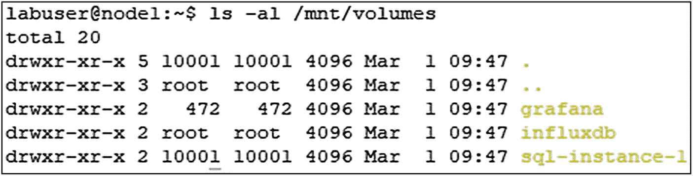

图 1-1
从 node1 进行的 NFS 测试

### 系统交换空间设置

作为最后一步，让我们确保在我们的控制平面以及三个节点上都禁用了交换空间，因为这是 `kubelet` 的要求。

通过 SSH 分别连接到它们每一个，并运行清单 1-18 中的命令。

```
swapoff -a
清单 1-18
禁用交换空间
```

同时从 `/etc/fstab` 中删除任何交换分区。如果你使用我们脚本在 Azure 中创建了虚拟机，则不需要这一步。

### 总结

在本章中，我们为将在本书中一起进行的实验奠定了基础。我们将从在 Docker 中将 SQL Server 部署为容器开始。然后，我们将一起构建 Kubernetes 集群，并在该集群中部署 SQL Server 以及演示应用程序和数据库。除了集群之外，我们还重点介绍了与我们将在集群中部署的应用程序和数据库进行交互所需的工具。

## 2. 容器基础

容器正在改变应用程序的部署方式。在本章中，我们将从基于容器的应用部署的优势开始，并介绍容器基础操作，如创建和运行容器、持久化数据，从而为容器基础知识打下坚实的技术基础。本章最后将讨论容器编排器的必要性，并介绍 Kubernetes 及其优势。本章的目标是，如果你从未见过容器，那么在继续学习使用 Kubernetes 进行容器编排之前，让你精通容器基础知识。


### 基于容器的应用部署

一个`容器`是一种操作系统虚拟化形式。多年来，数据库专业人员已经熟悉了机器虚拟化的概念，即操作系统对我们物理服务器的硬件资源（CPU、内存和磁盘）进行多路复用。在容器中，底层操作系统、其内核和资源正被运行在该系统上的应用程序进行多路复用或共享。每个容器都认为自己是操作系统上运行的唯一进程。反过来，操作系统则照常控制对底层硬件的访问。我们很快将更详细地探讨这种隔离概念。负责协调这项工作与底层操作系统的软件被称为`容器运行时`。

容器是一个运行的`容器镜像`。一个`容器镜像`包含了运行我们应用程序所需的二进制文件、库和文件系统组件。因此，当容器启动时，它将开始执行其内部定义的可执行文件，然后可以访问操作系统的资源，包括创建额外的进程、执行磁盘或网络 I/O 等。图 2-1 展示了容器与其应用程序之间的关系。

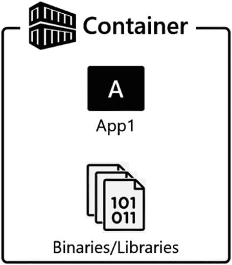
图 2-1：容器化的应用程序

传统上，一个容器内只有一个应用程序，因为应用程序是工作单元，也是我们的扩展单元。当容器启动时，它将开始执行其内部定义的应用程序。在某些情况下，如果应用程序之间有非常紧密的关系（例如，应用服务器和指标数据收集器），你可以将多个应用程序放入一个容器中。

容器提供`隔离`。在容器内运行的进程无法看到操作系统上运行的任何其他进程，甚至无法看到其他容器内运行的进程。这个概念是容器可移植性、可用性乃至其成功的关键。

容器还可以将特定的库与应用程序绑定，帮助你解决应用程序库冲突。你是否曾经遇到过需要安装在专用服务器上的应用程序？因为它需要特定版本的 DLL 或库，而该版本可能与支持另一个应用程序的另一版本冲突。容器可以让你免于这样做。如果容器镜像内部有所需的库可用，当加载时，它们会被隔离到该运行容器中。可以启动带有潜在冲突库的额外容器，这些基于容器的应用程序将彼此隔离地愉快运行。

使用容器带来的隔离性在升级时提供了可移植性。你可以在不影响系统上其他运行容器中的应用程序的情况下升级容器内的库。在图 2-2 中，你可以看到多个应用程序容器运行在物理或虚拟机上，共享基础操作系统。这些容器的执行是完全相互隔离的。如果它们需要通信，则必须通过网络进行。

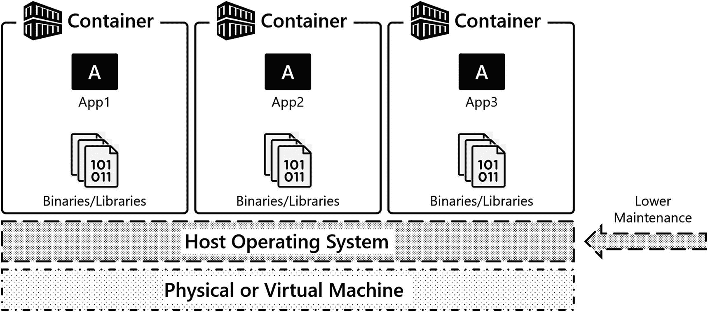
图 2-2：基于容器的应用部署

容器是`短暂的`，而这种短暂性是容器的超能力之一。当容器启动并运行时，容器在实际程序状态和内部更改的任何文件数据方面具有状态。容器也可以被删除，删除时，容器内的任何程序状态和文件数据也会被删除。

容器的短暂性是理解基于容器的应用程序如何部署和维护的概念关键。将配置和状态与容器生命周期本身解耦，是容器和容器编排的核心基础。本章稍后将介绍通过环境变量和卷来实现容器配置和状态解耦的技术，并在本书后面介绍使用 Kubernetes 结构来帮助我们实现相同的目标。

### 虚拟机有何难点？

在过去的 20 年里，虚拟机作为首选平台已在企业 IT 中牢牢扎根。我们挑战你，读者，去思考一下，硬件虚拟化在你的数据中心中为你带来了什么。你获得了更好的硬件利用率……这很好。但数据中心里最便宜的东西是什么？你的硬件。数据中心里最昂贵的东西是什么？你！你的时间是最昂贵的资源。当使用虚拟机作为我们的平台时，几乎没有为我们的组织增加运营效率，因为虚拟机并没有帮助优化组织最昂贵的资源——人员。

图 2-3 展示了数据中心中传统的虚拟机实现。运维团队构建基础设施，安装客户操作系统，并在这些操作系统之上安装所有应用程序，这就是生产环境。运维团队投入了巨大的努力来保持该架构中的系统和应用程序正常运行。

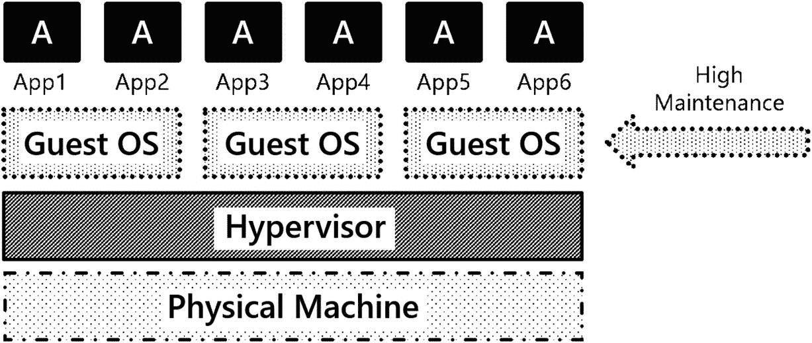
图 2-3：企业数据中心中虚拟机及其应用程序的传统实现

以下是使用基于虚拟机的平台部署应用程序的一些挑战：

*   **操作系统资源开销：** 运行虚拟机存在固有的 CPU 和内存开销。这些 CPU 时间和内存本可以更好地用于支持应用程序，而不是操作系统。
*   **操作系统补丁管理：** 更新操作系统为组织增加的业务价值非常有限。它确实是维护适当安全态势所必需的，但并不能推动业务发展。
*   **故障排除：** 多年来，系统被构建、投入生产，然后就被搁置了。如果出了什么问题，IT 运维必须挺身而出修复系统。
*   **操作系统升级：** 我们认为 IT 中最难做的事情就是升级操作系统，因为如果你升级了操作系统，你需要测试什么？所有东西！应用程序与操作系统的紧密耦合意味着每次对基础操作系统进行更改，都会给我们的系统注入风险。
*   **部署：** 在企业 IT 中，端到端自动化部署虚拟机及其应用程序的情况很少见。此外，这些解决方案通常是定制的、点解决方案，可能难以维护。

以上提到的运行基于虚拟机的平台的任何挑战，是否推动了你的业务发展？使用虚拟机获得了什么吗？我们认为没有……或许有更好的方法。


### 容器

当使用基于容器的应用部署时，容器直接解决了在基于虚拟机的平台上部署应用时所面临的一些挑战。让我们看看容器带来了哪些优势：

*   **速度：** 与虚拟机相比，容器体积要小得多。例如，一个在 Windows 上安装了`SQL Server`的虚拟机，在包含任何用户数据库之前，最低限度也会超过 60GB。而当前的`SQL Server`容器镜像大小约为 1.5GB。在现代数据中心内传输一个 1.5GB 的容器镜像是相对轻松的。而部署一个超过 60GB 的虚拟机则可能需要相当长的时间。

*   **修补：** 就应用程序的修补而言，修补是一个与部署分离的独立过程。你很可能需要额外的工具来完成。利用容器，你可以通过简单地拉取应用程序的新容器镜像并基于该新版本启动一个新容器，从而非常快速地更新应用程序。如果配置和状态与容器正确解耦，我们的应用程序就可以在新版本上恢复并开始运行，对应用程序用户的影响微乎其微甚至为零。

*   **故障排除：** 由于容器的短暂性，基于容器的应用程序的一个主要故障排除技术是终止并重新部署容器。由于容器镜像是我们程序状态的一个已知良好起点，因此只需重新启动容器即可恢复到良好状态。

*   **操作系统升级：** 在不同版本的操作系统之间迁移时，可以删除容器并在较新版本的操作系统上重新创建。由于应用程序所需的库都包含在容器内，因此在操作系统版本之间迁移的风险降低了。

*   **快速且一致的部署：** 当使用基于容器的应用部署时，部署是以代码编写的。在应用部署和维护的效率上有所提升。在速度方面，不再依赖人力来完成工作；同时在一致性方面，由于有代表系统状态的代码，可以在部署过程中重复使用。这些代码被置于源代码控制中，是系统期望状态的配置产物。

部署自动化将不再是企业 IT 的事后考虑或追求的目标；它将成为部署应用程序的主要方式——使用定义系统期望状态的、受源代码控制的代码。基于容器的部署技术使 IT 组织能够更快速、更一致地为业务提供服务，并使 IT 能够更轻松地维护基础设施和应用程序，从而提升组织的运营效率。应用程序的部署和维护可以更快、更自信地完成。

`Docker` 和 `Kubernetes` 都使 IT 组织能够编写代表系统期望状态的代码。然后可以更新这些代码，对应用程序、平台和系统进行所需的更改。可以编写代码用于初始部署、应用更新和修补基于容器的应用程序。这些技术还可用于实现更高效的故障排除，并在需要时构建自修复应用程序。这些概念中的每一个都将在本书后面更详细地探讨。

#### 容器领域

好了，既然你已经熟悉了容器的定义以及它如何融入现代应用部署流程，现在让我们来看看容器领域。这里涌现了许多新兴的技术和技巧，我们希望花点时间让你熟悉这个领域的名称和参与者。

以下列表展示了容器领域的一些名称和参与者：

*   **Docker：** 在当今的容器领域，`Docker` 首先是一种技术。它是一个容器运行时和工具集合，使你能够在操作系统上创建和运行容器镜像及容器，并共享该操作系统的资源。

*   **Docker Inc.：** 这是构建工具并推动技术以实现容器的公司。`Docker Inc.` 已将其容器运行时背后的核心技术开源，并衍生出几个开源项目，如 `containerd` ([`containerd.io/`](https://containerd.io/))、`Open Container Initiative` ([www.opencontainers.org/](http://www.opencontainers.org/)) 等。

*   **containerd：** 是一个容器运行时，负责协调容器的生命周期功能，如拉取容器镜像、创建、启动和停止容器。`Docker` 和 `Kubernetes` 等都使用 `containerd` 来协调容器生命周期功能。在 `Kubernetes` 中，容器运行时是一个可插拔的组件。`containerd` 是事实上的标准。

*   **其他容器运行时：** 容器的世界并非只有 Linux 上的 `Docker`。游戏中还有一些其他参与者。以下仅是可用其他容器运行时的一小部分示例：
    *   **Container Linux/CoreOS (rkt)：** 一个专门构建的操作系统，强调使用名为 `rkt`（发音为 rocket，[`coreos.com/`](http://coreos.com/)）的应用容器运行时进行基于容器的应用部署。

    *   **Podman：** 一个用于在基于 Red Hat 的操作系统上运行 Linux 容器的容器运行时。更多信息，请访问 [`github.com/containers/libpod`](https://github.com/containers/libpod)。

    *   **Windows Server 2016：** 使你能够运行 Windows 和 Linux 容器。更多信息，请访问 [`docs.microsoft.com/en-us/virtualization/windowscontainers/`](https://docs.microsoft.com/en-us/virtualization/windowscontainers/)。

注意

在本章中，我们将在单容器部署场景中使用 `Docker` 作为容器运行时。在后面的章节中，我们将在 `Kubernetes 集群` 中使用 `containerd` 作为容器运行时。

#### 获取和运行容器

让我们来谈谈什么是*容器镜像*、容器镜像如何定义以及容器镜像存储在哪里。

以下列表强调了容器镜像的关键要素：

*   **容器镜像：** 包含运行我们的应用程序所需的代码、应用程序二进制文件、库和环境变量。用最基本的术语来说，这些就是运行我们的应用程序所需的东西。一个正在运行的容器镜像称为容器。

*   **Dockerfile：** 定义容器镜像的要素。它告诉容器运行时在容器启动时启动哪个二进制文件、要暴露哪些网络端口，以及关于要构建的容器镜像的其他关键信息。

*   **容器注册库：** 这是存储镜像的地方。`Docker Hub` 是众多容器注册库之一，是存储和交换容器镜像的主要场所。仓库是在容器注册库内组织容器镜像的方式。


#### 容器生命周期

参考图 2-4，你可以看到一个基于容器的应用程序的生命周期。当开发者准备就绪，他们会在常规的应用程序开发平台中构建应用。然后，他们会为该应用程序编写一个 *Docker 文件*。这个 Docker 文件包含了构建该应用程序容器镜像所需的信息。它会包含诸如容器启动时应运行哪个二进制文件、应用程序使用哪个网络端口等信息，以及其他许多可能的配置属性和构建镜像的指令。一旦 Docker 文件准备就绪，开发者会告诉 Docker *构建*一个镜像。这将从 Docker 文件中获取定义好的信息，并在开发者的本地工作站上创建一个容器镜像。该容器镜像随后被 *推送*（上传）到一个 *容器注册表* 中，直到有人准备好使用该容器镜像。当用户想要从该容器镜像启动一个容器时，他们会将该容器镜像 *拉取* 到他们的操作系统，该操作系统上的容器运行时随后会从容器镜像创建（运行）一个运行中的容器，然后应用程序就在该操作系统的容器中启动并运行了。

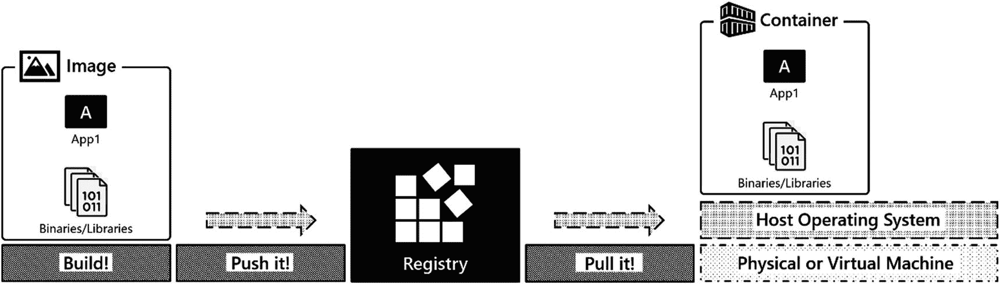

图 2-4

容器生命周期

好了，理论说得够多了。让我们看看如何在 Docker 上以容器方式部署 SQL Server。在本书中，你不会构建容器镜像。你将使用公共容器注册表中可用的镜像。在本章中，你将操作 SQL Server 容器，这些镜像可从 Microsoft 容器注册表 (`mcr.microsoft.com`) 获取。

#### 操作容器镜像

要拉取一个容器，执行 `docker pull` 命令并指定你想要拉取的容器镜像。在以下示例中，容器镜像来自容器注册表 `mcr.microsoft.com` 中的 `mssql/server` 仓库，要请求一个特定的容器，你需要指定 *镜像标签*，这里是 `2019-latest`。代码清单 2-1 展示了此命令。

```
docker pull mcr.microsoft.com/mssql/server:2019-latest
代码清单 2-1
用于拉取最新 SQL Server 2019 镜像的 docker pull 命令
```

图 2-5 显示了代码清单 2-1 中命令的输出结果。

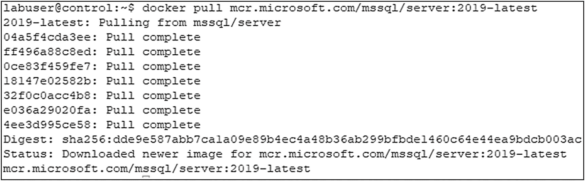

图 2-5

docker pull 命令的输出

在前面的示例中，按照惯例正在拉取一个标签为 `2019-latest` 的容器镜像。容器镜像仓库的维护者通过指定一个 `latest` 标签来定义指向其应用程序最新版本的标签。如果你想拉取特定版本的容器镜像，你需要从该仓库获取可用标签的列表。对于 SQL Server，你可以使用代码清单 2-2（Bash）和代码清单 2-3（Windows）所示的命令来实现。

```
(Invoke-WebRequest https://mcr.microsoft.com/v2/mssql/server/tags/list).Content
代码清单 2-3
Windows 命令
```

```
curl -sL https://mcr.microsoft.com/v2/mssql/server/tags/list
代码清单 2-2
Bash 命令
```

图 2-6 向你展示了这些命令输出的部分内容。实际上有更多可用的容器镜像，但为简洁起见我们省略了一些。

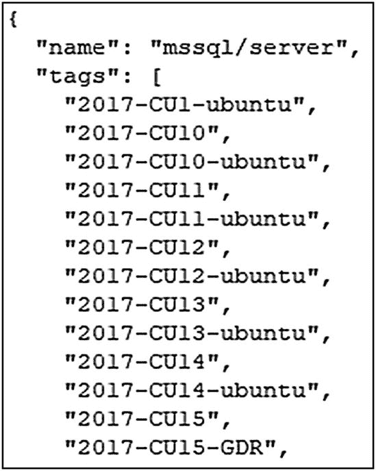

图 2-6

容器镜像及其标签的简略列表

如果你想拉取一个特定的容器，你需要指定一个容器镜像标签。代码清单 2-4 中的命令将拉取与标签 `2019-CU9-ubuntu-18.04` 关联的容器镜像。

```
docker pull mcr.microsoft.com/mssql/server:2019-CU9-ubuntu-18.04
代码清单 2-4
拉取与特定标签关联的容器镜像的 docker pull 命令
```

要获取本地系统上可用的镜像列表，请执行代码清单 2-5 中的 `docker image ls` 命令。命令的输出显示了已拉取到本地系统的镜像。示例如下。

```
docker image ls
代码清单 2-5
docker image ls 命令
```

对于每个镜像，输出（图 2-7）显示了镜像的仓库、标签、镜像标识符（`IMAGE ID`）、创建日期和镜像大小。


图 2-7

docker image ls 命令的输出

一个常见的误解是 `docker image ls` 命令显示的创建日期是镜像被拉取的日期。事实并非如此。创建日期实际上是镜像被创建的日期。

一个容器镜像可以有多个标签。在上面的输出中，如果你仔细观察容器 `IMAGE ID`，会注意到两个容器镜像的 `IMAGE ID` 值相同。标签 `2019-latest` 和 `2019-CU9-ubuntu-18.04` 指向同一个容器镜像，因为在撰写本文时，SQL Server 2019 的最新镜像是 CU9。当一个新的容器镜像发布到仓库时，它将拥有一个新的、唯一的容器镜像 ID。仓库管理员会将 `latest` 标签更新为指向该仓库中的这个最新镜像。

#### 启动容器

要启动一个容器，请执行 `docker run` 命令，如清单 2-6 所示。让我们通过以下示例来逐步了解。

```
docker run \
--env 'ACCEPT_EULA=Y' \
--env 'MSSQL_SA_PASSWORD=S0methingS@Str0ng!' \
--name 'sql1' \
--publish 1433:1433 \
--detach \
mcr.microsoft.com/mssql/server:2019-CU9-ubuntu-18.04
清单 2-6
docker run 命令
```

要在容器中运行 SQL Server，需要为初始启动配置 SQL Server。如前所述，将配置与状态解耦是在容器中运行应用程序的关键。这里是一个解耦配置的示例。SQL Server 将配置点暴露为环境变量。通过在运行时为这些环境变量指定值，你可以注入配置。在前面的命令中，你看到 `--env 'ACCEPT_EULA=Y'`。这为环境变量 `ACCEPT_EULA` 指定了值 `'Y'`。在启动时，SQL Server 将查找此值并相应地启动。类似地，还定义了一个环境变量 `'MSSQL_SA_PASSWORD=S0methingS@Str0ng!'`。这设置了容器启动时的 `sa` 密码，在本例中为 `S0methingS@Str0ng!`。虽然不是必需的，但使用 `--name='sql1'` 参数指定了容器名称，这在命令行中使用容器时很有用，并使我们能够通过名称访问容器。

> 提示
>
> 有关可作为环境变量使用的配置的更多信息，请查看 [`docs.microsoft.com/en-us/sql/linux/sql-server-linux-configure-environment-variables`](https://docs.microsoft.com/en-us/sql/linux/sql-server-linux-configure-environment-variables)。

除了应用程序配置和名称之外，为了通过网络访问基于容器的应用程序，必须暴露一个端口。参数 `--publish 1433:1433` 将容器内的一个端口暴露到基础操作系统上的容器外端口。让我们稍微解析一下，因为这是我们刚开始使用容器时经常出错的地方。第一个 `1433` 是应用程序在基础操作系统上监听的端口。默认情况下，它将监听主机操作系统的 IP 地址，因此这是用户和其他应用程序在同一主机上本地访问或从其他主机远程访问基于容器的应用程序的方式。第二个 `1433` 是“容器内”监听的端口。更多关于这一点，稍后在讨论容器内部结构时会提到。接下来是 `--detach`，它告诉容器运行时将运行进程从标准输出分离。这让我们重新获得终端的控制权，并将 SQL Server 作为后台进程运行。

> 注意
>
> 如果你在启动容器时遇到问题，请移除 `--detach` 参数，以便在屏幕上看到容器的日志流式传输到标准输出。在 SQL Server 容器中，这是 `SQL Server Error Log`。我们在创建容器时最常见的原因是 `sa` 密码不够复杂；在查看错误日志时，这会很快显现出来。`docker logs` 在此场景下也很有帮助。

最后，是用于启动此容器的特定容器镜像，在本例中是 `mcr.microsoft.com/mssql/server:2019-CU9-ubuntu-18.04`。

如果 `docker run` 命令成功，它会将容器 ID 打印到标准输出。

在清单 2-7 中执行 `docker ps` 以列出本地系统上运行的容器。

```
docker ps
清单 2-7
docker ps 命令
```

图 2-8 显示了命令的输出。`sql1` 容器已启动并运行。它还显示了容器 ID、启动它的容器镜像、容器启动时启动的命令、容器名称、容器的创建时间以及容器的当前状态，在本例中已运行了 10 分钟。

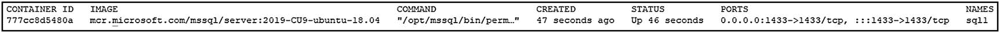
图 2-8
本地系统上运行的容器列表

#### 如果出现问题怎么办？

使用 `docker logs` 命令结合容器名称（清单 2-8），在本例中是 `sql1`，以获取容器的输出。在 SQL Server 中，你在这里找到的输出来自 SQL Server 错误日志，其中很可能包含有关容器为何无法启动的有价值的信息。

```
docker logs sql1 | more
清单 2-8
docker logs 命令
```

#### 访问基于容器的应用程序

在这个案例中，应用程序是 SQL Server，所以让我们使用命令行实用程序 `sqlcmd` 来访问 SQL Server。清单 2-9 中的代码显示了一个获取 `@@VERSION` 输出的查询。

```
sqlcmd -S localhost,1433 -U sa -Q 'SELECT @@VERSION' -P 'S0methingS@Str0ng!'
清单 2-9
用于访问 SQL Server 的命令行实用程序 sqlcmd
```

在图 2-9 中，你可以看到一个运行 SQL Server 2019 CU1 的容器，这与容器启动时指定的容器镜像相符。

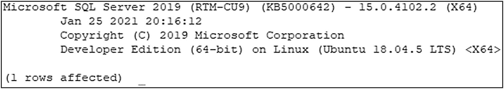
图 2-9
容器启动时指定的容器镜像

#### 启动 SQL Server 的第二个实例

要启动第二个 SQL Server 2019 CU1 容器实例，你需要再次执行 `docker run`。关键区别在于一个唯一的容器名称，本例中是 `sql2`，以及一个要发布的唯一端口。在本例中，第二个 SQL Server 实例在端口 `1434` 上可用，如清单 2-10 所示。要访问此 SQL Server 实例，应用程序将指向该端口。在以下命令中，我们使用了缩写的参数名称，而不是像之前 `docker run` 命令中那样使用完整的参数名称。

```
docker run \
--name 'sql2' \
-e 'ACCEPT_EULA=Y' \
-e 'MSSQL_SA_PASSWORD=S0methingS@Str0ng!' \
-p 1434:1433 \
-d mcr.microsoft.com/mssql/server:2019-CU9-ubuntu-18.04
清单 2-10
具有唯一容器名称的 docker run 命令
```

`docker ps` 将再次产生一个正在运行的容器列表。

图 2-10 中的命令输出显示两个容器 `sql1` 和 `sql2` 都已启动并运行。

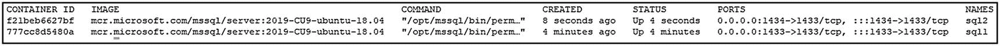
图 2-10
docker ps 命令的输出

现在有两个容器在运行，让我们将一个数据库恢复到其中一个容器中。在书籍下载中，你会找到一个 SQL Server 数据库 `TestDB1.bak` 和一个恢复脚本 `restore_testdb1.sql`。

`restore_testdb1.sql` 的内容也可以在清单 2-11 中看到。

```
USE [master]
RESTORE DATABASE [TestDB1]
FROM DISK = N'/var/opt/mssql/data/TestDB1.bak'
WITH REPLACE
清单 2-11
restore_testdb1.sql
```

让我们逐步完成恢复数据库的过程，查看容器内的文件布局，然后了解运行容器的生命周期。


#### 将数据库恢复到容器中运行的 SQL Server

清单 2-12 中的命令将现有的数据库备份复制到 `sql2` 容器内的 `/var/opt/mssql/data` 目录，然后清单 2-13 中的命令会为该复制的备份文件设置适当的权限。

由于 SQL Server 2019 中非 root 用户 SQL Server 容器的性质（[`techcommunity.microsoft.com/t5/sql-server/non-root-sql-server-2019-containers/ba-p/859644`](https://techcommunity.microsoft.com/t5/sql-server/non-root-sql-server-2019-containers/ba-p/859644)），需要调整复制到容器中的文件的权限，以便容器内部的 `sqlservr` 进程可以读取该文件。在 Linux 系统上，`docker cp` 命令会以执行该命令的基础操作系统用户的 `UID` 来复制文件。容器内部的 `sqlservr` 进程以用户 `mssql` 运行。以下 `chown` 命令将备份文件的所有者更改为用户 `mssql`，以便该用户可以读取文件。

```
docker exec -u root sql2 chown mssql /var/opt/mssql/data/TestDB1.bak
清单 2-13
容器内的 chown 命令
```

```
docker cp TestDB1.bak sql2:/var/opt/mssql/data
清单 2-12
docker cp 命令
```

文件就位后，执行 `restore_testdb1.sql` 脚本，该脚本包含恢复此数据库所需的 T-SQL。请注意，我们是在容器外部运行此恢复操作（清单 2-14），在客户端工作站上使用 `sqlcmd`，并将其指向正确的服务器名称（`localhost`）和端口 `1434`。

```
sqlcmd -S localhost,1434 -U sa -i restore_testdb1.sql -P 'S0methingS@Str0ng!'
清单 2-14
通过 sqlcmd 执行恢复脚本
```

`sqlcmd` 将确认成功恢复，如图 2-11 所示。

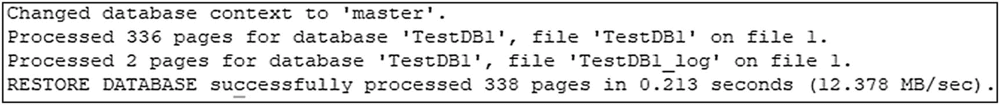

图 2-11
成功恢复数据库

数据库恢复后，让我们使用清单 2-15 中的 `docker exec` 命令来访问容器内部。这将允许我们探索正在运行的容器的内部结构。参数 `-it` 为执行的进程（在本例中是 `/bin/bash`，一个 bash 提示符）提供一个交互式终端。在下面的示例中，显示的提示符展示了登录用户的用户名 `mssql`，以及与容器 ID 匹配的容器主机名。

```
docker exec -it sql2 /bin/bash
清单 2-15
docker exec 命令
```

有了这个在容器内部运行的交互式 bash shell，让我们稍微探索一下。执行 `ps -aux` 命令，如清单 2-16 所示，以列出所有正在运行的进程。

```
ps -aux
清单 2-16
ps -aux 命令
```

在图 2-12 所示的输出中，你会看到容器内部只运行着一小部分进程：两个 `sqlservr` 进程、一个 `bash` shell 和 `ps` 命令本身。此示例突显了容器在运行时具有的隔离性。此容器及其运行的进程无法看到基础操作系统上运行的任何其他进程。

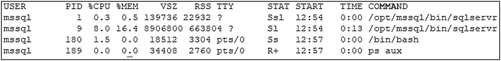

图 2-12
`ps -aux` 命令的输出

现在，执行目录列表（清单 2-17）`ls -la /var/opt/mssql/data`。这是 Linux 上 SQL Server 的默认数据库目录。

```
ls -la /var/opt/mssql/data
清单 2-17
目录列表
```

如图 2-13 所示，你将在此目录中找到系统和用户数据库。你还会找到在之前的演示中复制进来的数据库备份文件，即 `TestDB1.bak` 文件。每个容器都有一个独立的文件系统。因此，此目录中的文件仅对这个正在运行的容器可用。如果此容器被删除，这些文件将随容器一起删除。我们稍后将介绍容器的数据持久化。

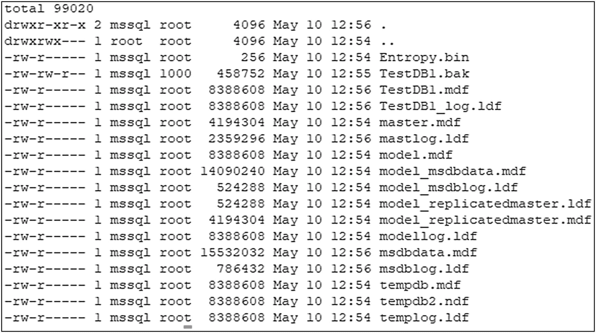

图 2-13
Linux 上 SQL Server 的默认数据库目录

要退出此容器，请使用 `exit` 命令并返回到我们基础操作系统的 shell。

#### 停止容器

运行守护进程（如 SQL Server）的容器将持续运行，直到被告知停止。要停止一个正在运行的容器，执行清单 2-18 中的 `docker stop` 命令，并指定容器名称或容器 ID。在下面的示例中，容器 `sql2` 正在被停止。这将向容器内运行的进程发送一个 `SIGTERM` 信号，使其优雅地关闭。

```
docker stop sql2
清单 2-18
docker stop 命令
```

#### 在本地系统上查找容器

此时，本地系统上有两个容器。一个容器已停止（`sql2`），另一个仍在运行（`sql1`）。现在执行 `docker ps` 命令。

在输出（图 2-14）中，只有一个正在运行的容器 `sql1`。

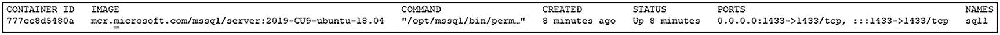

图 2-14
`docker ps` 命令的输出。正在运行的容器列表

要查看系统上的所有容器，无论其当前状态是停止还是运行，请执行清单 2-19 中的 `docker ps -a` 命令。

```
docker ps -a
清单 2-19
docker ps -a 命令
```

在图 2-15 显示的输出中，列出了两个容器 `sql1` 和 `sql2`。关键信息是 `STATUS`（状态）列。`sql1` 仍然在运行，状态值为 `16 minutes ago`（16 分钟前启动）。对于另一个容器 `sql2`，状态是 `Exited (0) 33 seconds`（33 秒前退出）；它目前已停止。其中的 `0` 是应用程序的退出代码。非零退出代码表示程序内部发生错误；零（0）表示正常关闭。

**注意**
如果你发现非零退出代码，说明出现了问题，你需要使用 `docker logs` 来调查该容器的问题。

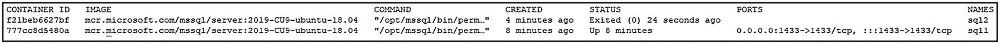

图 2-15
`docker ps -a` 命令的输出。相应系统上所有容器的列表


## 启动和管理容器

### 启动一个现有容器

由于容器仍存在于系统上，可以使用 `docker start` 命令并指定容器名称来重新启动它。该容器的所有状态和配置信息仍将保留，因此当容器再次启动时，我们的系统数据库和用户数据库都还在。

```
docker start sql2
代码清单 2-20
docker start 命令
```

然后，我们可以使用 `sqlcmd` 来列出我们实例中的数据库，如下列命令所示。

```
sqlcmd -S localhost,1434 -U sa -Q 'SELECT name from sys.databases' -P 'S0methingS@Str0ng!'
代码清单 2-21
使用 sqlcmd 列出数据库
```

在输出中，`sql2` 已重新启动，显示了系统上的当前数据库，包括已还原的用户数据库 `TestDB1`。

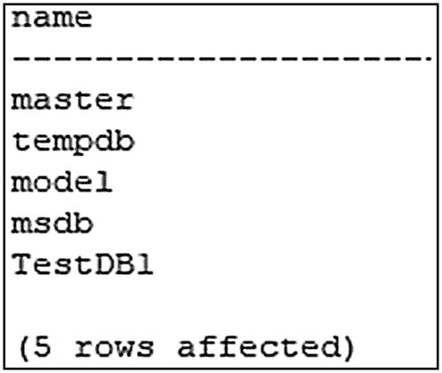
*图 2-16. 数据库列表*

现在，让我们清理并停止这些容器。

```
docker stop sql1
docker stop sql2
代码清单 2-22
docker stop 命令
```

### 移除容器

当容器停止后，`docker rm` 将从系统中移除一个容器。此时，容器内的数据将被销毁。因此，一旦这些容器被移除，已还原的 `TestDB1` 也就消失了。关于独立于容器生命周期的数据持久化将在下一节介绍。在以下示例中，`sql1` 和 `sql2` 都被删除。

```
docker rm sql1
docker rm sql2
代码清单 2-23
docker rm 命令
```

前面的示例删除了容器，但没有删除容器镜像。容器镜像仍在本地系统上，可用于派生新的容器。执行 `docker image ls` 可以显示系统上存在的容器镜像。

```
docker image ls
代码清单 2-24
docker image ls 命令
```

你可以看到容器镜像仍然在本地系统上。

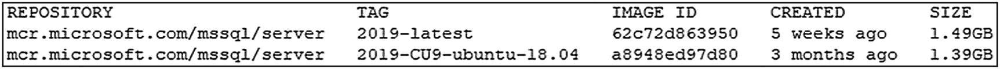
*图 2-17. `docker image ls` 命令的输出。本地系统上的容器镜像*

## 容器内部原理

现在，我们花点时间来看看容器内部原理，以便你能够理解操作系统在容器内运行进程时如何实现并提供对进程及其资源的隔离。

容器是一个运行中的进程，它对底层操作系统及其资源具有隔离的视图。当从容器镜像启动容器时，容器运行时被指示启动在容器镜像中定义的一个特定进程。同时还定义了应用程序监听的端口以及其他配置信息。

如前所述，在容器内执行的进程列表仅显示容器内运行的进程；系统上的其他进程不可见。尽管应用程序在容器内监听端口 `1433`，但要访问该应用程序，必须在基础操作系统上发布一个唯一的端口。操作系统如何为基于容器的应用程序在单一系统上提供这种隔离？这就是 Linux 命名空间（namespaces）的用武之地。

### 命名空间

Linux 内核命名空间 ([`man7.org/linux/man-pages/man7/namespaces.7.html`](http://man7.org/linux/man-pages/man7/namespaces.7.html)) 是一种内核构造，为在 Linux 上运行的进程提供隔离。Linux 中有六个核心命名空间，其中五个用于资源隔离，一个用于资源管理。查看下面的命名空间列表，你可以感受到命名空间提供了什么。它们为程序和程序正在使用的资源提供了与基础操作系统的隔离——例如进程、文件、网络等。

五个资源隔离命名空间为系统上运行的进程提供对底层操作系统服务的访问：

*   **PID：** 进程隔离
*   **MNT：** 文件系统和挂载点隔离
*   **NET：** 网络设备和协议栈隔离
*   **IPC：** 进程间通信
*   **UTS：** 唯一的主机名和域名

第六个命名空间 `cgroups`（控制组）为在基础操作系统上运行的进程提供资源隔离。这使得多个进程可以在操作系统上运行，并让管理员能够控制资源分配：

*   **cgroups：** 控制组能够分配和控制对系统资源（如 CPU、I/O 和内存）的访问。

关于 `cgroups` 工作原理的更多信息，请查看 Linux 手册页链接：[`man7.org/linux/man-pages/man7/cgroups.7.html`](http://man7.org/linux/man-pages/man7/cgroups.7.html)。

### 联合文件系统

容器镜像是只读的。当容器运行时，对容器内文件的任何更改都使用写时复制技术写入一个可写层。联合文件系统（Union File System）获取容器镜像的基础层和可写层，并将两者作为单一统一的文件系统呈现给应用程序。这种技术使我们能够从单个镜像启动许多容器，并通过重复使用该容器镜像层作为许多容器的起点来获得效率。每个容器都将拥有一个唯一的可写层，其生命周期与容器绑定。当容器被删除时，这个可写层也会被删除。如果你正在运行像 SQL Server 这样的有状态应用，这听起来不太吸引人。为基于容器的应用程序提供数据持久化的技术将在下一节介绍。Docker 联合文件系统的实现细节多年来已经从 AUFS、UnionFS 变为 OverlayFS，但这些实现细节超出了本讨论范围。

**注意**
如果你想深入了解容器镜像的工作原理，我们鼓励你查看我们同事 Elton Stoneman (@EltonStoneman) 在 Pluralsight 上的课程 “Handling Data and Stateful Applications in Docker” ([`app.pluralsight.com/library/courses/handling-data-stateful-applications-docker/table-of-contents`](https://app.pluralsight.com/library/courses/handling-data-stateful-applications-docker/table-of-contents))。

### 容器中的数据持久化

容器是短暂的（ephemeral），这意味着当容器被删除时，它就永远消失了。在上一节中，我们介绍过，当正在运行的容器内部数据发生变化时，它会被写入一个可写层，联合文件系统的职责是将各层连接起来，为基于容器的应用程序呈现一个单一的统一文件系统。而当容器被删除时，可写层也会被一并删除。那么，容器能否在其生命周期内（从创建到删除再到重新创建）实现数据持久化呢？你可能还会问，我们为什么需要删除容器？难道我们不应该让它一直保持运行吗？嗯，是的，你可以让容器一直运行，但如果你需要更换基础容器镜像（可能因为升级或某种修补，你的应用程序有了新的容器镜像），你就需要删除现有容器并使用那个新的容器镜像启动一个新容器。


#### Docker 卷

Docker 卷（`https://docs.docker.com/storage/`）是一种由 Docker 管理的资源，它独立于容器的生命周期。Docker 卷从底层操作系统或共享存储分配存储空间，并将其呈现到容器文件系统内的特定位置。

提示
请访问 `https://docs.docker.com/storage/storagedriver/` 查阅 Docker 文档以获取关于存储驱动程序的信息。

当一个卷被挂载到容器文件系统内的某个位置时，应用程序修改的数据会被写入该文件系统位置，并最终写入卷中。这个卷的后端存储位于容器外部。现在，如果这个容器被删除，容器及其可写层仍然会被删除，但卷会保留下来，因为它的生命周期独立于容器。因此，文件系统中未由卷支持的其他部分的所有更改将不会被持久化。但是，写入由卷支持的文件位置的数据将被持久化。如果创建一个新容器并将该卷挂载到其中，存储在该卷中的数据在新容器中仍然是可访问的。图 2-18 展示了一个名为 `sql1` 的容器化应用程序访问一个名为 `sqldata1` 的卷。

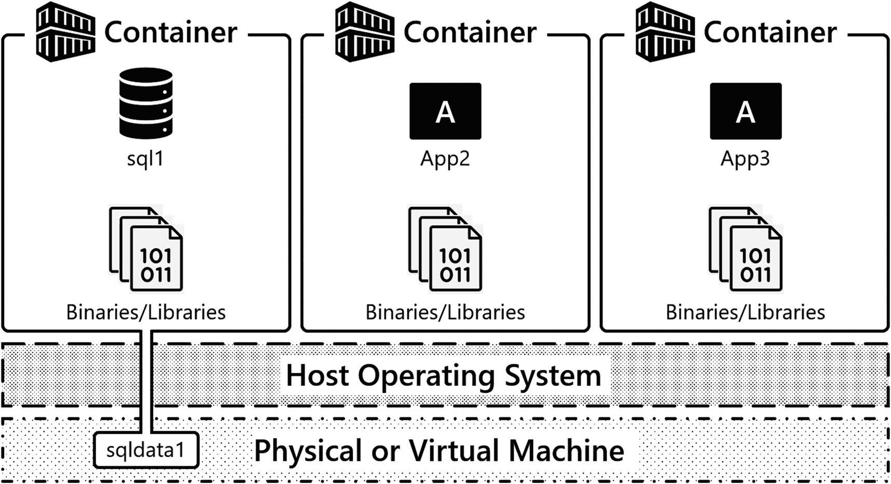

图 2-18：附加了卷的容器

让我们来看一些为 SQL Server 容器定义 Docker 卷的代码。

#### 创建带有卷的容器

清单 2-25 中的代码展示了一个容器的启动命令，与我们之前的示例类似。关键区别在于使用了 `-v` 或 `--volume` 参数来指定数据卷。

```
docker run \
--name 'sql1' \
-e 'ACCEPT_EULA=Y' \
-e 'MSSQL_SA_PASSWORD=S0methingS@Str0ng!' \
-p 1433:1433 \
-v sqldata1:/var/opt/mssql \
-d mcr.microsoft.com/mssql/server:2019-CU9-ubuntu-18.04
```

清单 2-25：`docker run` 命令 – 数据卷规格说明

让我们来解析这行代码……`-v` 指定了卷的配置。这会创建一个名为 `sqldata1` 的命名卷，该卷将从底层操作系统的文件系统中分配。确切的位置特定于容器运行时的平台（Windows、Linux 或 MacOS）。冒号之后，您需要定义希望在容器内部挂载卷的位置，因此此卷被挂载到 `/var/opt/mssql`，这是 SQL Server on Linux 容器中的默认实例目录。在此目录内，您将找到 SQL Server 所需的数据文件，例如 SQL Server 错误日志、跟踪文件、扩展事件文件以及系统和用户数据库。任何写入 `/var/opt/mssql` 的数据都将被写入卷中，这是一个独立于容器的资源。

注意
SQL Server 的二进制文件位于文件系统的另一部分 `/opt/mssql/bin`。因此，当容器镜像被更新版本的 SQL Server 替换时，新的二进制文件将用于启动容器，而我们的数据将从 `/var/opt/mssql` 读取，该数据在容器实例化之间会持久存在。

那么，让我们在实践中看看这个过程，运行一系列使用 SQL Server 和 Docker 卷的演示，其中将突出显示以下要点。首先，启动一个在容器内部 `/var/opt/mssql` 处挂载了卷的容器，并还原一个数据库。接着，删除该容器。然后，创建一个使用相同卷的新容器。最后，观察我们的数据如何独立于该容器的生命周期而持久存在。让我们开始吧。

在清单 2-26 中，定义了一个带有卷 `sqldata1` 的容器。该卷被挂载到容器文件系统的 `/var/opt/mssql` 位置，所以让我们运行这个命令。

现在，容器已经启动并运行，将数据库备份复制到容器中，并在备份文件上设置适当的权限。然后使用与上一节相同的过程还原数据库。代码示例（清单 2-26）突出了这三个步骤。

```
docker cp TestDB1.bak sql1:/var/opt/mssql/data
docker exec -u root sql1 chown mssql /var/opt/mssql/data/TestDB1.bak
sqlcmd -S localhost,1433 -U sa -i restore_testdb1.sql -P 'S0methingS@Str0ng!'
```

清单 2-26：`docker cp` 命令

`sqlcmd` 将再次确认执行。

容器启动并运行且用户数据库已还原后，检查我们此 SQL Server 容器实例上当前数据库列表，以确认数据库还原成功（清单 2-27）。

```
sqlcmd -S localhost,1433 -U sa -Q 'SELECT name from sys.databases' -P 'S0methingS@Str0ng!'
```

清单 2-27：通过 `sqlcmd` 列出所有数据库

输出如图 2-19 所示。`TestDB1` 列在此 SQL Server 实例的数据库集合中。


图 2-19：SQL Server 实例上的数据库列表


此容器附加了一个卷，并挂载在其文件系统的 `/var/opt/mssql` 目录中。当 SQL Server 首次启动时，它会将关键的实例文件和系统数据库放入此目录。前一示例中恢复的用户数据库，根据恢复脚本（代码清单 2-28）中的代码，被恢复到了子目录 `/var/opt/mssql/data` 中。

```
sqlcmd -S localhost,1433 -U sa -Q 'SELECT name, physical_name from sys.master_files' -P 'S0methingS@Str0ng!' -W
代码清单 2-28
通过 sqlcmd 列出所有文件及其物理名称
```

通过查询 `sys.master_files`，可以看到（图 2-20），我们数据库的所有文件位置都在 `/var/opt/mssql/data` 中，该目录包含在我们的卷内。

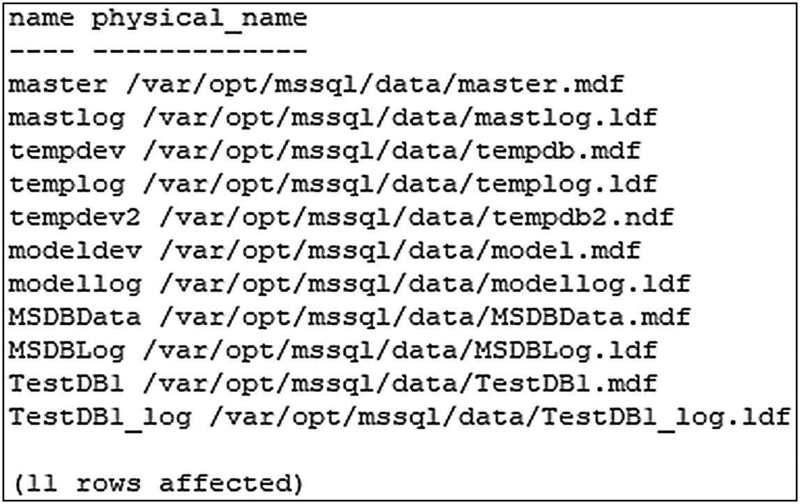
图 2-20
文件及其位置列表

注意
默认的用户数据库和日志文件位置可作为环境变量进行配置。

请查看 `https://docs.microsoft.com/en-us/sql/linux/sql-server-linux-configure-environment-variables?view=sql-server-ver15` 了解更多详情。本书第 7 章将对此主题进行进一步探讨。

以下命令将停止容器 `sql1` 并将其移除（代码清单 2-29）。这通常会销毁与此容器关联的数据……但现在它使用的是一个卷。

```
docker stop sql1
docker rm sql1
代码清单 2-29
停止并移除容器 sql1
```

代码清单 2-30 创建了一个新容器，并再次定义了一个卷 `sqldata1`。这是前一示例中使用的同一个卷，它是一个独立于容器的资源，你可以使用命令 `docker volume ls` 查看。SQL Server 的实例目录及其系统和用户数据库都在此卷内。因此，当 SQL Server 启动时，它会在 `/var/opt/mssql/data` 中找到 master 数据库，然后读取实例的配置和状态。文件系统中任何已定义的用户数据库也将被联机。

```
docker run \
--name 'sql2' \
-e 'ACCEPT_EULA=Y' \
-e 'MSSQL_SA_PASSWORD=S0methingS@Str0ng!' \
-p 1433:1433 \
-v sqldata1:/var/opt/mssql \
-d mcr.microsoft.com/mssql/server:2019-CU9-ubuntu-18.04
代码清单 2-30
docker run 命令 – 创建新容器
```

容器启动运行后，使用代码清单 2-31 中的命令查询当前数据库集。

```
sqlcmd -S localhost,1433 -U sa -Q 'SELECT name from sys.databases' -P 'S0methingS@Str0ng!'
代码清单 2-31
通过 sqlcmd 列出所有数据库
```

在输出中，你可以看到 `TestDB1`（图 2-21)。现在我们想指出，这不仅包括用户数据库，还包括系统数据库以及与该实例关联的其他文件。因此，对实例所做的任何配置更改也将持久保留，例如，实例级配置如最大服务器内存。

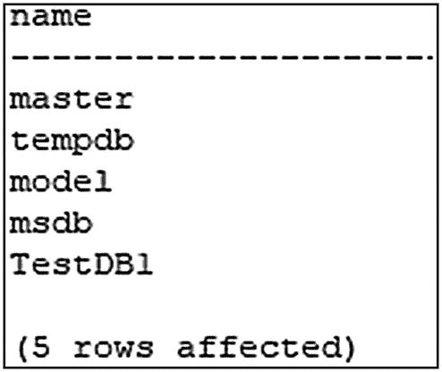
图 2-21
SQL Server 实例上的数据库列表

我们的卷是一个独立于容器的资源，你可以使用 `docker volume ls` 命令（代码清单 2-32）查看，如输出所示。

```
docker volume ls
代码清单 2-32
docker volume ls 命令
```

图 2-22 将向我们展示系统上当前定义的所有卷。


图 2-22
Docker 卷列表

#### 深入了解卷

在使用 Docker 时，我们最喜欢的命令之一是 `docker inspect`。如代码清单 2-33 所示，此命令用于获取有关资源的更详细信息，在下面的示例中，执行 `docker inspect` 显示了关于我们卷的更详细信息。

```
docker volume inspect sqldata1
代码清单 2-33
docker inspect 命令
```

让我们浏览一下此输出的一部分，你可以在图 2-23 中看到。首先是 `CreatedAt`，即卷创建的日期和时间。还有 `Driver`，其值为 `local`。这意味着它使用的是底层操作系统的文件系统。接下来是 `Mountpoint`；这是暴露到容器中的基础操作系统上的实际路径。因此，如果你在运行容器的底层操作系统上浏览到此目录，你将看到卷内容器中的文件，在我们的示例中，你将在此位置找到 SQL Server 实例的文件及其数据库。

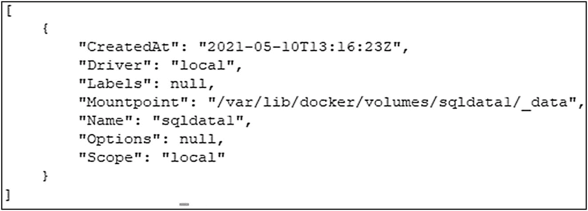
图 2-23
docker inspect 的输出 – 卷的详细信息

注意
如果你使用的是 Mac 或 Windows，这些文件将被抽象化。Mac 和 Windows 都使用虚拟化技术，因此可以在这些平台上运行 Linux 容器。这些文件的实际位置将位于为容器运行时提供 Linux 内核服务的虚拟机“内部”。在运行 Linux 容器的原生 Linux 系统上，你将在 `Mountpoint` 定义的实际文件系统位置找到这些文件。

#### 停止和移除容器与卷

现在我们已经介绍了容器的生命周期以及如何使用卷将数据持久保存在容器外部，是时候清理我们的资源了。我们现在将向你展示如何停止容器、删除容器以及删除卷。

执行 `docker stop sql1`（代码清单 2-34）会告知 SQL Server 进程停止，然后停止容器。

```
docker stop sql1
代码清单 2-34
docker stop 命令
```

要删除容器，请使用 `docker rm`（代码清单 2-35）加上容器名称 `sql1`。由于其数据存储在卷中，如果仍希望继续使用该数据，可以再次创建新容器。

```
docker rm sql1
代码清单 2-35
docker rm 命令
```

但既然此演示已完成，使用 `docker volume rm sqldata1`（代码清单 2-36）删除卷。卷被删除时，数据才会被销毁。因此请谨慎使用此操作！

```
docker volume rm sqldata1
代码清单 2-36
docker volume rm 命令
```


### 现代应用程序部署

现在我们已经讨论了核心容器基础知识，比如如何启动容器、访问这些应用程序，以及独立于容器生命周期持久化数据，让我们转而讨论容器在现代应用程序部署场景中的使用方式，并介绍容器编排器的需求。

在本章到目前为止，我们已经展示了启动容器、在网络上公开该应用程序以及将持久存储附加到容器的配置。但在生产系统中如何大规模地完成这些工作？你希望每次需要启动容器时都登录服务器并输入`docker run`吗？你希望跟踪你的应用程序正在监听/发布哪些端口吗？不，实施该配置并跟踪资源在哪里以及如何访问这些资源并非一项简单的任务。这正是容器编排器发挥作用的地方。

让我们从一个示例应用程序栈开始，如图 2-24 所示。

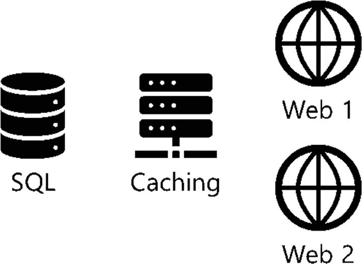

图 2-24

示例应用程序架构

关于如何使用容器部署这个架构，有一些基本问题：

1.  这些基于容器的应用程序如何在数据中心部署和启动？
2.  这些基于容器的应用程序在数据中心的哪些服务器上运行？
3.  这些基于容器的应用程序如何扩展，如果我们想从 2 个 Web 服务器扩展到 20 个以应对工作负载激增怎么办？
4.  我们如何一致地部署这个应用程序栈？
5.  我们如何为测试或在另一个数据中心或云中部署到另一个环境？
6.  我们或我们的任何应用程序如何访问这些服务？
7.  哪些 IP 或 DNS 名称与这些应用程序相关联？

容器编排器有助于回答这些问题。

### 容器编排器的需求

容器编排器是一种软件，用于帮助管理基于容器的应用程序的部署。容器编排器基于期望状态和控制器的核心概念工作。容器编排器会计算在数据中心或云中的计算资源集合的何处运行你的工作负载，启动这些容器，并保持这些容器正常运行并处于定义的状态。

让我们介绍容器编排器的一些关键功能：

*   **工作负载放置：** 给定数据中心中的一组服务器，选择在哪台服务器上运行容器。
*   **管理状态：** 启动容器并保持其在线。如果某些原因导致基于容器的应用程序停止或变得不可用，容器编排器可以做出反应并重新启动容器。
*   **部署的速度和一致性：** 代码用于定义应用程序部署。容器编排器将部署该代码中定义的内容。此代码用于快速且一致地部署我们的应用程序。
*   **隐藏集群的复杂性：** 容器编排器暴露了一个程序化 API 进行交互，因此用户可以较少关注我们应用程序的物理基础设施，而更专注于应用程序的部署方式。
*   **持久的应用程序访问端点：** 容器编排器将跟踪哪些服务可用，并为我们基于容器的应用程序提供的服务提供持久的访问。

有几种不同的容器编排器可用，本书重点介绍 Kubernetes（[*https://kubernetes.io/*](https://kubernetes.io/)），因为它已成为开源容器编排器的标准。因此，本书的其余部分将重点介绍如何构建 Kubernetes 集群并将 SQL Server 部署到该环境中。

### 更多资源

要更深入地了解 Docker 卷，请查看 Anthony 的博客系列“在 Docker 容器中持久化 SQL Server 数据”：

*   [*www.centinosystems.com/blog/sql/persisting-sql-server-data-in-docker-containers-part-1/*](http://www.centinosystems.com/blog/sql/persisting-sql-server-data-in-docker-containers-part-1/)
*   [*www.centinosystems.com/blog/sql/persisting-sql-server-data-in-docker-containers-part-2/*](http://www.centinosystems.com/blog/sql/persisting-sql-server-data-in-docker-containers-part-2/)
*   [*www.centinosystems.com/blog/sql/persisting-sql-server-data-in-docker-containers-part-3/*](http://www.centinosystems.com/blog/sql/persisting-sql-server-data-in-docker-containers-part-3/)

看看我们的技术评审和容器专家 Andrew Pruski (*@dbafromthecold*)的容器博客系列。只要是关于容器的，Andrew 很可能都写过博客：

*   [*https://dbafromthecold.com/2017/03/15/summary-of-my-container-series/*](https://dbafromthecold.com/2017/03/15/summary-of-my-container-series/)

另外，请务必看看我们的好朋友和全方位的 SQL Server 专家 Bob Ward (*@bobwardms*)提供的资源。容器中的 SQL Server 就是 Linux 上的 SQL Server。如果你想深入了解 SQL Server 在 Linux 上的工作原理，请务必查看 Bob 的书*Pro SQL Server on Linux*，Anthony 非常荣幸地担任了该书的技术评审：

*   **GitHub:** [*https://github.com/microsoft/bobsql*](https://github.com/microsoft/bobsql)
*   ***Pro SQL Server on Linux:*** [*www.apress.com/gp/book/9781484241271*](https://www.apress.com/gp/book/9781484241271)
*   ***SQL Server 2019 Revealed:*** [*www.apress.com/gp/book/9781484254189*](https://www.apress.com/gp/book/9781484254189)

### 总结

Kubernetes 是一个容器编排器，在本章中，我们奠定了容器工作原理的基础。我们展示了什么是容器以及容器如何提供应用程序隔离。容器用于快速部署应用程序，在我们的示例中，我们在容器中运行了 SQL Server。本章的一个关键概念是需要将配置和状态与容器生命周期解耦，其核心工具是用于注入配置的环境变量和独立于容器生命周期持久化状态（数据）的卷。随着你学习如何在 Kubernetes 上部署 SQL Server，这些核心概念将在本书的其余部分被重新审视和利用。

## 3. Kubernetes 架构

本章介绍 Kubernetes，描述其在现代应用程序部署中的角色、提供的优势及其架构。从其优势开始，你将学习 Kubernetes 在现代基于容器的应用程序部署中提供的价值。接下来，你将学习 Kubernetes API 如何使你能够构建和部署下一代应用程序和系统。在该 API 中，你将学习 Kubernetes 提供的用于定义和部署应用程序及系统的核心 API 原语。然后，你将学习 Kubernetes 集群及其组件的关键概念，并了解 Kubernetes 网络基础知识。


### Kubernetes 简介

Kubernetes 是一个容器编排器。它的职责是在数据中心内的服务器上启动基于容器的应用程序。为此，Kubernetes 使用代表数据中心资源的 `API 对象`，使开发人员和系统管理员能够以代码形式定义系统，并使用该代码进行部署。基于容器的应用程序以 `Pod` 的形式部署到 `Kubernetes 集群` 中。集群是计算资源的集合，这些资源是被称为 `节点` 的物理或虚拟服务器。让我们更详细地探讨这些元素中的每一个，从 Kubernetes 的优势开始，了解它在现代应用部署中所提供的价值：

*   **工作负载调度：** Kubernetes 是一个容器编排器，其主要目标是在集群的 `节点` 上启动称为 `Pod` 的基于容器的应用程序。Kubernetes 的工作就是找到在集群中运行 `Pod` 的最合适位置。在将 `Pod` 调度到 `节点` 上时，一个主要的关注点是确定一个 `节点` 是否有足够的 CPU 和内存资源来运行分配的工作负载。

*   **状态管理：** 当代码部署到 Kubernetes 中，定义了一个需要运行的工作负载时，Kubernetes 有责任在集群中启动 `Pod` 和其他资源，并保持集群处于期望状态。如果集群的运行状态偏离了期望状态，Kubernetes 将尝试改变集群的运行状态，使其回到定义的期望状态。例如，如果一个 `Deployment` 定义了要运行一定数量的 `Pod`，当一个 `Pod` 失败时，Kubernetes 将会在集群中部署一个新的 `Pod` 来替换失败的 `Pod`，确保 `Deployment` 所定义的 `Pod` 数量保持正常运行。此外，假设您希望扩展支持应用程序的 `Pod` 数量以增加容量。在这种情况下，您只需增加 `Deployment` 中的副本数，Kubernetes 就会在集群中创建额外的 `Pod`，确保期望状态得以实现。更多内容将在接下来关于 `控制器` 的章节中介绍。

*   **一致部署：** 以代码形式部署应用程序能够实现可重复的流程。定义部署的代码是配置制品，可以置于源代码控制中。您也可以使用此代码在低级环境（例如开发环境）中部署相同的系统，甚至在本地系统与云之间部署。更多内容将在接下来关于 Kubernetes API 的章节中介绍。

*   **速度：** Kubernetes 支持快速、可控的部署，能够快速启动集群中的 `Pod`。此外，在 Kubernetes 中，应用程序可以快速扩展。扩展支持应用程序的 `Pod` 数量可能就像更改一行代码那么简单，这可能只需要几秒钟。这将在第 5 章和第 7 章中详细演示。

*   **基础设施抽象：** Kubernetes API 提供了对集群中可用资源的抽象或封装。在部署应用程序时，重点较少放在基础设施上，而更多地放在如何定义和部署应用程序以及如何消耗集群的资源上。用于部署的代码将描述 `Deployment` 应该是什么样子，而集群将使其成为现实。如果应用程序需要诸如公共 IP 地址或存储之类的资源，这将成为 `Deployment` 的一部分，集群将为应用程序的使用调配这些资源。

*   **持久服务端点：** Kubernetes 为在集群中部署的应用程序提供持久的 IP 和 DNS 命名。由于 `Pod` 可能会因为扩展操作或响应故障事件而出现和消失，Kubernetes 为访问这些应用程序提供了这种网络抽象。根据所使用的 `服务` 类型，服务会将应用程序流量负载均衡到支持该应用程序的 `Pod`。随着 `Pod` 基于扩展操作或响应集群中的故障而被创建和销毁，Kubernetes 会自动更新哪些 `Pod` 提供应用程序服务的信息。

### Kubernetes API

Kubernetes API 提供了一个表示数据中心可用资源的可编程层。该 API 使您能够编写代码，在您的应用程序部署中使用这些资源。在编写代码以使用该 API 时，您使用的是 `API 对象`，您使用它们来定义和部署 Kubernetes 中的应用程序工作负载。您编写的代码被提交给 `API 服务器`。`API 服务器` 是 Kubernetes 集群中的核心通信枢纽。它是您与 Kubernetes 集群交互的主要方式，也是集群内部 Kubernetes 组件交换信息的唯一方式。随着新的集群状态被定义（无论是在初始 `部署` 时还是在修改现有部署时），Kubernetes 开始实现您代码中描述的状态。您代码的期望状态成为了集群中的运行状态。

#### API 对象

Kubernetes `API 对象` 代表集群中可用的资源。集群中有用于计算、存储和网络元素等的 `API 对象`，可供您的应用程序工作负载使用。您将使用这些 `API 对象` 编写代码，以定义您部署到 Kubernetes 集群中的应用程序和系统的期望状态。这些定义的 `API 对象` 向集群传达已部署工作负载的期望状态，而集群有责任确保该期望状态成为集群的运行状态。

我们现在将介绍在 Kubernetes 集群中定义工作负载的核心 `API 对象`。这些是在 Kubernetes 中部署的应用程序的核心构建块。在接下来的章节中，我们将更深入地逐一探讨：

*   **Pod：** 这些是基于容器的应用程序。`Pod` 是集群中的工作单元。`Pod` 是一个抽象，包含一个或多个容器及其执行所需的资源和配置，包括网络、存储、环境变量、配置文件和机密信息。

*   **控制器：** 这些控制器定义应用程序工作负载并使其在集群中保持期望状态。一些 `控制器` 负责启动 `Pod` 并使这些 `Pod` 保持在期望状态。有几种不同类型的 `控制器`，用于确保已部署的应用程序和系统的状态，以及集群的运行状态。我们在本节介绍几种 `控制器`，并在本书的剩余部分介绍更多。

*   **服务：** 这些为访问基于 `Pod` 的应用程序提供网络抽象。`服务` 是应用程序的使用者（例如用户和其他应用程序）访问集群中部署的基于容器的应用程序服务的方式。

*   **存储：** Kubernetes 为 `Pod` 访问集群中的存储和配置数据提供了抽象。像 `持久卷` 和 `持久卷声明` (`PVC`) 这样的存储对象用于独立于 `Pod` 的生命周期来持久化应用程序数据。

*   **配置数据：** 配置数据可以作为 `ConfigMap` 和 `Secret` 存储在集群中，它们可以作为文件和环境变量暴露给在 `Pod` 中运行的应用程序。

除了所述的 `API 对象` 外，还有许多其他用于构建工作负载的对象，但这些是本书关注的核心 `API 对象` 类型，也用于部署 SQL Server。


#### API Server

API Server 是 Kubernetes 集群中的**中央通信枢纽**。它是 Kubernetes 用户与集群交互以部署工作负载的主要方式，也是 Kubernetes 在集群内部组件之间交换信息的主要方式。API Server 是一个通过 HTTPS 提供的 REST API，以 JSON 格式暴露 API 对象。当集群用户定义工作负载并将信息传达给 API Server 时，该信息会被序列化并持久化存储在集群数据存储中。Kubernetes 随后会将集群的当前运行状态移动到这些存储在集群存储中的 API 对象所定义的**期望状态**。

> 注意：集群数据存储是一个可插拔的资源。Kubernetes 中占主导地位的集群数据存储是一个名为 [etcd](https://etcd.io/) 的分布式键值存储。

#### 核心 Kubernetes API 原语

现在让我们更仔细地看看上一节介绍的高级 API 对象。本节介绍 Pods、Controllers、Services、存储、ConfigMaps 和 Secrets。你将了解每个对象的更多细节，以及它们如何使你能够在 Kubernetes 中部署应用程序，以及每个 API 对象允许你部署的工作负载类型。

##### Pods

Pod 也是 Kubernetes 集群中最基本的工作单元。从本质上讲，Pod 是一个 API 对象，代表一个或多个容器、其资源（如网络、存储）以及控制其执行的配置。最常见的 Pod API 对象定义包含容器镜像、用于与容器化应用程序通信的网络端口，以及（如果需要）存储。

Pod 是 Kubernetes 集群中的调度单元。在 Kubernetes 中，调度决定了在集群中的哪个节点上启动 Pod。一旦 Pod 被调度到节点上，容器运行时（通常是 Docker 容器运行时）就会在该节点上使用指定的容器镜像启动一个容器。在将 Pod 调度到节点上时，Kubernetes 会确保运行 Pod 所需的 CPU 和内存等资源在所选节点上可用，并且（如果在 Pod 中配置了）可以访问存储。

> 注意：Kubernetes 实现了容器运行时接口（CRI），这意味着容器运行时是一个可插拔的资源，可以使用其他符合 CRI 的容器运行时。事实上的标准是 containerd。有关这方面的更多详情，请参见第 2 章。

Pod 是伸缩单元。在 Kubernetes 中部署应用程序时，你可以通过在集群中创建 Pod 的多个副本来水平伸缩应用程序，这些副本称为副本。伸缩 Pod 副本使应用程序能够通过在集群中的节点上启动更多容器并利用额外的集群容量来支持更大的工作负载。此外，在集群中的多个节点上运行 Pod 的多个副本，可以在 Pod 或节点故障时提供高可用性。

Pod 是短暂的。如果删除了 Pod，其在节点上的容器会被停止然后删除。它被永久销毁，包括其可写层。Pod 永远不会被重新部署。相反，Kubernetes 会从当前的 Pod API 对象定义创建一个新的 Pod。这两次部署的 Pod 之间不维护任何状态。对于无状态工作负载（如 Web 应用程序），这没问题。当新的 Pod 被创建时，它们可以在准备好后开始接受工作负载。但对于有状态工作负载（如关系数据库系统），Pod 需要能够独立于其生命周期持久化其数据库中存储的数据状态。Kubernetes 为我们提供了用于持久存储的 API 对象和结构，这将在下文描述。

##### Controllers

控制器定义、监控工作负载，并使集群的运行状态保持在期望状态。本节重点介绍用于创建和管理 Pod 的控制器。在 Kubernetes 中，很少通过手动定义和部署 Pod 对象来创建 Pod。两个常用的工作负载 API 对象用于在 Kubernetes 中部署应用程序，它们是 `Deployment` 和 `StatefulSet`。

`Deployment` 是一个 API 对象，使你能够通过 Pod 的配置来定义应用程序的期望状态，包括要创建的 Pod 数量（称为副本）。Deployment 控制器会创建一个 `ReplicaSet`。`ReplicaSet` 负责使用来自 `Deployment` 对象的 Pod 规范在集群中启动 Pod。图 3-1 的第一帧显示了一个 `Deployment` 创建了一个 `ReplicaSet`，然后该 `ReplicaSet` 在集群中启动了三个 Pod。

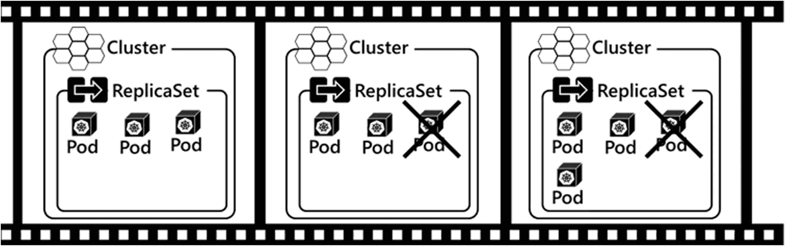

图 3-1：ReplicaSet 操作

控制器负责使集群的运行状态保持在期望状态，那么让我们看看这个过程。在图 3-1 的第二帧中，假设其中一个 Pod 因任何原因失败。也许是应用程序崩溃了，或者 Pod 运行的节点不再可用。在第三帧中，`ReplicaSet` 控制器感知到运行状态已偏离期望状态，并启动创建一个新 Pod，确保 `ReplicaSet`（或应用程序）始终保持在三个 Pod 运行的期望状态。

你可能会问，为什么 Deployment 控制器创建一个 `ReplicaSet`，而不是由 `Deployment` 直接创建 Pod？Deployment 控制器定义了要创建的 Pod 数量以及 Pod 的配置。当更新 Deployment 配置时，旧 `ReplicaSet` 中的 Pod 会关闭，而新 `ReplicaSet` 中的 Pod 会被创建。这使得新的容器镜像或 Pod 配置能够滚动更新。单个 `Deployment` 对象仍然存在，它管理着 `ReplicaSet` 之间的声明性更新和转换。如果你想深入了解这个主题，可以查看 Pluralsight 课程 “Managing Kubernetes Controllers and Deployments”。

Deployment 控制器不保证 Pod 的顺序或持久命名。一个 `Deployment` 包含一组 Pod，每个都是应用程序的精确副本。但是，如果一个 Pod 被销毁，并在其位置创建一个新 Pod，则该 Pod 的名称不是持久的。像数据库系统这样的应用程序通常将数据分布在多个计算元素上，然后必须跟踪数据在系统中的位置以便后续检索。对于需要知道集合中命名计算资源的精确数据位置的有状态应用程序，使用 Deployment 控制器可能会出现问题。

为了允许 Kubernetes 支持这些类型的有状态应用程序，`StatefulSet` 控制器创建 Pod，每个 Pod 都具有唯一、持久且有序的名称。因此，需要控制数据跨多个 Pod 放置的应用程序可以这样做，因为 Pod 名称是有序的，并且独立于 Pod 生命周期而持久存在。此外，`StatefulSet` 为应用程序提供稳定的存储，确保在因任何原因需要重新创建同名 Pod 时，正确的存储对象能映射到该 Pod。


## Kubernetes 中的控制器、服务与存储

### StatefulSet 示例

图 3-2 展示了一个运行中的 `StatefulSet` 示例。此示例 `StatefulSet` 被定义为具有三个副本（Replicas）并创建了三个 Pod。它创建的每个 Pod 都有一个唯一的有序名称：`sql-0`、`sql-1` 和 `sql-2`。`StatefulSet` 中创建的第一个 Pod 总是从索引 0 开始。在此示例中，即 `sql-0`。对于添加到 `StatefulSet` 的每个 Pod，索引增加一。所以下一个 Pod 是 `sql-1`，接着是 `sql-2`。如果 `StatefulSet` 扩容以添加一个 Pod，下一个 Pod 将被命名为 `sql-3`。如果 `StatefulSet` 缩容，则编号最高的 Pod 会首先被移除。在此示例中，`sql-3` 会被移除。这些有序的创建和扩缩容操作对于有状态应用至关重要，因为它们将数据放置在命名的计算资源上，使有状态应用能够在任何时间点知晓数据的位置。

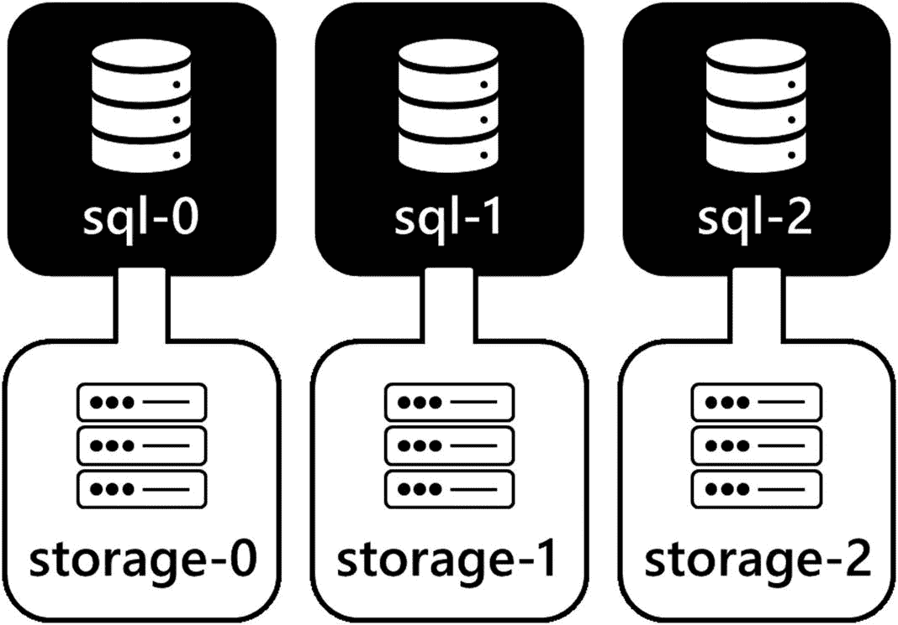
图 3-2：一个示例 `StatefulSet` – 每个 Pod 都具有唯一、有序且持久的名称。每个 Pod 还有关联的持久存储。

Kubernetes 中还有更多控制器可用。本书重点关注 `Deployment`、`ReplicaSet` 和 `StatefulSet`，以及如何使用它们在 Kubernetes 上部署 SQL Server。Kubernetes 中有许多控制器可用于构建不同类型的应用工作负载。有关不同控制器类型及其功能的更多信息，请查阅 Kubernetes 文档：[`https://kubernetes.io/docs/concepts/workloads/`](https://kubernetes.io/docs/concepts/workloads/)。

### 服务

如前所述，没有任何 Pod 会被重新创建。每次创建 Pod 时，无论是初始创建还是替换现有 Pod，该新 Pod 在启动时都会被分配一个新的 IP 地址。当控制器根据配置创建和删除 Pod，或响应故障并影响期望状态时，我们面临一个挑战：如果 Pod 的 IP 地址不断变化，应该使用哪个 IP 地址来访问集群中由 Pod 提供的应用程序服务？

Kubernetes 提供了一种用于访问集群中部署的基于 Pod 的应用程序的网络抽象，称为 *Service*。`Service` 是一个持久的 IP 地址，可选择性地包含一个 DNS 名称，用于访问集群中运行在 Pod 上的应用程序。一般来说，你在集群中部署的每个应用程序都有一个对应的 `Service`。接收到 `Service` IP 上的应用程序流量会被负载均衡到其底层的 Pod IP 地址。随着 Pod 被控制器（如 `ReplicaSet` 控制器）创建和销毁，网络信息会自动更新以反映应用程序的当前状态。让我们看一个例子。

在图 3-3 中，假设一个 `Deployment` 创建了一个 `ReplicaSet`，然后该 `ReplicaSet` 创建了三个 Pod。每个 Pod 在网络上都有一个唯一的 IP 地址。为了让用户或应用程序能够访问这些 Pod 中的应用程序，需要定义一个 `Service`。`Service` 在一个持久的 IP 地址和端口（例如 HTTP 的 80 端口）上暴露运行在一组 Pod 中的应用程序。用户或其他应用程序可以通过连接到 `Service` 的 IP 地址或 DNS 名称来访问该 `Service` 提供的应用程序。然后，`Service` 会在属于它的 Pod 之间对流量进行负载均衡。

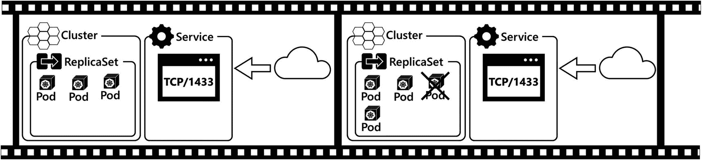
图 3-3：`ReplicaSet` 和 `Service`

在图 3-3 的第二帧中，假设 `ReplicaSet` 中的一个 Pod 发生故障。`ReplicaSet` 控制器感知到这一点，并部署一个新的 Pod，将该新 Pod 的 IP 地址注册到 `Service` 中，然后开始将流量负载均衡到这个新 Pod。发生故障的 Pod 被删除，其 IP 地址从 `Service` 中移除，流量不再被发送到该 IP。这一切都是自动发生的，无需任何用户交互。

此外，当应用程序扩容添加更多 Pod，或缩容移除一些 Pod 时，Pod 的 IP 地址会相应地被添加到 `Service` 或从中移除。这确实是一项了不起的技术，我们每次看到它实际运行时都非常兴奋。这将在第 5 章中详细演示。

Kubernetes 中有三种类型的 `Service`，都可以用来访问在 Kubernetes 中运行的应用程序。服务类型分别是 `ClusterIP`、`NodePort` 和 `LoadBalancer`。让我们更详细地了解每一种：

- **`ClusterIP`：** `ClusterIP` 类型的 `Service` *仅*在集群内部可用。当应用程序不需要暴露在集群外部时，会使用此类 `Service`。
- **`NodePort`：** `NodePort` 类型的 `Service` 在集群中每个节点的真实 IP 地址上的一个固定端口暴露你的应用程序。访问 `NodePort` 服务需要结合使用集群节点的真实网络 IP 地址和服务端口。接收到的流量会被路由到支持该服务的相应 Pod。当基于集群的应用程序需要从集群外部访问或与外部负载均衡器集成时，会使用 `NodePort` 服务。
- **`LoadBalancer`：** 此服务类型集成了云提供商的负载均衡器服务或集群外部部署的负载均衡器（例如本地的 F5）。在基于云的场景中，当基于集群的应用程序需要从集群外部访问时，会使用 `LoadBalancer` 类型的 `Service`。

这些服务类型都将在第 5 章中详细演示。

##### 存储

作为 SQL Server 专业人员，我们的首要任务是确保数据持久保存。Kubernetes 提供了 API 对象来支持像 SQL Server 这样的有状态应用程序的部署。有两个主要的 API 对象可用于帮助实现这一点：`PersistentVolume`（持久卷）和 `PersistentVolumeClaim`（持久卷声明）。`PersistentVolume` 是由集群管理员定义的、可供 Pod 使用的集群内存储。`PersistentVolume` 可以是许多不同类型的存储，例如来自云提供商的虚拟磁盘、`iSCSI`、`NFS` 等。但 Pod 不直接访问 `PersistentVolume` 对象。Pod 在其对象定义中使用 `PersistentVolumeClaim` 来访问集群存储。`PersistentVolumeClaim` 会向集群“请求”存储，然后 PVC 会对 `PersistentVolume` 提出声明，并将该 `PersistentVolume` 映射到 Pod。这个额外的抽象层将 Pod 与 `PersistentVolume` 的存储实现细节解耦。这主要的好处是无需将存储实现细节（例如基础设施特定的存储参数）作为 Pod 定义的一部分。实现细节位于 `PersistentVolume` 对象中。在 Kubernetes 中持久化数据将在第 6 章中更详细地介绍。

### 配置映射

在 Kubernetes 中，应用程序配置数据可以作为 API 对象存储在集群中。`ConfigMap` 是一种存储键值对数据的 API 对象，是一种集群资源。存储的数据可以作为环境变量甚至配置文件暴露给 Pod 及其容器，供容器中运行的应用程序使用。它们通常用于配置部署在 Kubernetes 中的更复杂的应用程序。`ConfigMap` 使你能够将配置从部署清单中的代码解耦，并将其存储在集群中供运行时引用。你将在第 8 章中看到 `ConfigMap` 的使用。


## Kubernetes 集群组件

### Secrets

一个 `Secret` 是一种用于存储敏感信息的 API 对象，供部署在 Kubernetes 集群中的应用程序使用。Secrets 通常用于存储诸如密码、API 令牌、公私钥对以及 TLS 证书等信息。您可以编写一个部署清单并通过名称引用该 `Secret`，其中存储的信息可以作为环境变量或文件系统中的文件暴露给在 Pod 中运行的容器。

Secrets 使您能够拥有更安全、更灵活的清单和容器镜像，因为您无需将敏感信息与这些资源一起存储。您应该避免在部署清单和容器镜像中存储敏感信息。Secrets 允许您将此类潜在敏感信息存储在集群中，并在部署时检索以供后续使用。

### 探索 Kubernetes 集群架构

本章第一部分介绍了 Kubernetes 的概念以及用于在 Kubernetes 集群中构建和部署工作负载的核心 API 对象。现在是时候深入了解什么是 Kubernetes 集群了，让我们仔细看看每个主要组件。

Kubernetes 集群是称为 `Node` 的服务器（物理或虚拟）集合，为在 Pod 中运行基于容器的应用程序提供了一个平台。集群中有两种类型的节点。`控制平面节点` 是集群本身的控制器，是操作背后的大脑。`工作节点` 是用于运行 Pod 的计算设备。让我们更仔细地研究每一个，首先从控制平面节点开始。图 3-4 为我们提供了集群组件的概览。

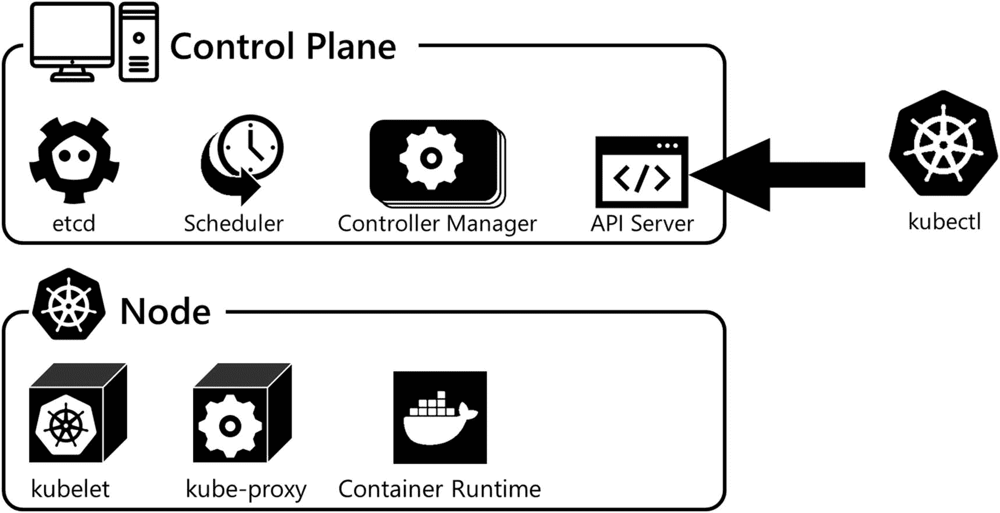

图 3-4：Kubernetes 集群组件

#### 控制平面节点

`控制平面节点` 运行控制平面服务。控制平面服务实现了 Kubernetes 集群的核心功能，例如管理集群本身及其资源，以及控制工作负载。控制平面由四个组件组成，每个组件在集群中都有特定的职责。它们是 `API Server`、`etcd`、`Scheduler` 和 `Controller Manager`。控制平面服务和组件最常见的部署方式是作为 Pod，可以在单个控制平面节点上运行，也可以在多个控制平面节点上运行以实现高可用性。有关构建高可用集群及其配置的更多信息，请查阅 [`kubernetes.io/docs/setup/production-environment/tools/kubeadm/high-availability/`](https://kubernetes.io/docs/setup/production-environment/tools/kubeadm/high-availability/) 和 [`kubernetes.io/docs/setup/production-environment/tools/kubeadm/ha-topology/`](https://kubernetes.io/docs/setup/production-environment/tools/kubeadm/ha-topology/)。

让我们更详细地看看每个控制平面功能及其在集群中的职责：

*   `API Server`：`API Server` 是集群中的主要通信枢纽。所有集群组件都通过 `API Server` 进行通信以交换信息和状态。它是一个简单的、无状态的 REST API，实现并暴露 Kubernetes API，供用户和其他集群组件访问。当 API 对象被创建、修改或删除时，这些对象的状态会被提交到集群。可以跨多个控制平面节点部署 `API Server` 的多个副本，并且可以对 API 流量进行负载均衡以实现高可用性。
*   `etcd`：`etcd` 是一个键值数据存储，用于持久化集群的状态。`API Server` 本身是无状态的，但它会序列化对象数据并存储在 `etcd` 中。由于它确实持久化数据，因此需要为恢复和可用性提供保护。应频繁备份 `etcd`，如果需要高可用性，则应配置多个副本以实现高可用性配置。
*   `Controller Manager`：`Controller Manager` 实现并确保集群及其工作负载的期望状态。它使用控制循环持续监控运行状况，将其与期望状态进行比较，并进行必要的更改以使集群恢复到期望状态。为此，`Controller Manager` 观察并更新 `API Server`。在本章前面，我们介绍了控制器的概念以及它们如何让您告诉 Kubernetes API 期望的状态是什么。`Controller Manager` 实现该状态。当涉及到 Pod 和应用程序工作负载时，如果某个 `Deployment` 定义了需要有三个 Pod 副本的应用程序在线，`Controller Manager` 的职责就是确保这些 Pod 始终在线并准备就绪，通过在需要时创建新的 Pod 来协调定义的状态与集群的运行状态。
*   `Scheduler`：`Scheduler` 决定在集群中的哪个节点上启动 Pod。它监控 `API Server`，寻找任何未调度的 Pod。如果 `Scheduler` 发现任何未调度的 Pod，它会确定在集群中运行这些 Pod 的最佳位置。调度决策基于集群中可用的资源、为每个 Pod 定义的需求，以及可能的任何管理策略约束。如果您想了解更多关于调度的细节，请查看 Pluralsight 课程“Configuring and Managing Kubernetes Storage and Scheduling”。


## 工作节点

工作节点运行用户的应用程序负载。一个集群通常由至少一个控制平面节点和一组工作节点构成。每个工作节点都为集群的总体可用资源贡献一定数量的 CPU 和内存资源。您需要有足够的 CPU 和内存资源来在集群中运行您的应用负载，确保为应用程序提供足够容量，并且能够应对节点故障甚至规模增长的情况。

> **注意**
> 控制平面节点的一个主要关注点是确保可用性。请查阅 [`kubernetes.io/docs/setup/production-environment/tools/kubeadm/ha-topology/`](https://kubernetes.io/docs/setup/production-environment/tools/kubeadm/ha-topology/) 以获取有关高可用控制平面拓扑的更多信息。

集群中的所有节点，无论是控制平面还是工作节点，都由三个组件组成：用于与 API Server 通信以进行集群操作的 `kubelet`、用于将节点上运行的容器暴露给本地网络的 `kube-proxy`，以及用于在节点上启动和运行容器的 `容器运行时`：

*   **kubelet：** `kubelet` 是运行在节点上的一个服务，负责与 API Server 通信、在节点上启动 Pod，并确保该节点上的 Pod 处于健康状态。`kubelet` 监控 API Server 的 Pod 工作负载状态，告诉容器运行时启动和停止容器。它还向 API Server 报告节点上运行的 Pod 的当前状态，并通过活性探针和就绪探针的形式对 Pod 执行健康检查。`kubelet` 向 API Server 报告节点的当前状态及其可用资源。
*   **kube-proxy：** `kube-proxy` 是运行在集群中所有节点上的一个容器，其功能是作为网络代理，负责将来自节点所在网络的流量路由到该节点上运行的 Pod。
*   **容器运行时：** `容器运行时` 负责拉取容器镜像并在节点上运行容器。如今，最常见的是在 Kubernetes 集群中使用 Docker 作为容器运行时。但容器运行时领域正朝着容器运行时接口标准发展，该标准允许在 Kubernetes 节点中使用几种不同的容器运行时作为容器运行时。Kubernetes 支持 Docker、containerd 和 CRI-O 容器运行时。在本书中，使用的容器运行时是 Docker。有关 Kubernetes 支持的容器运行时的更多信息，请参见 [`kubernetes.io/docs/setup/production-environment/container-runtimes/`](https://kubernetes.io/docs/setup/production-environment/container-runtimes/)。

### 网络基础

本 Kubernetes 入门章节的最后一个主要主题是网络。Kubernetes 网络模型使得工作负载可以部署在 Kubernetes 中，同时抽象了网络的复杂性。这简化了集群中的应用程序配置和服务发现，并通过移除基础设施特定的代码提高了部署代码的可移植性。本节将介绍 Kubernetes 网络模型和示例集群通信模式。

Kubernetes 网络由三条规则管理。这些规则实现了前述的简洁性。这些规则源自 [`kubernetes.io/docs/concepts/cluster-administration/networking/`](https://kubernetes.io/docs/concepts/cluster-administration/networking/)。

#### Kubernetes 网络模型规则

1.  所有 Pod 可以在无需进行网络地址转换的情况下与所有节点上的所有其他 Pod 通信。
2.  节点上的所有代理，例如系统守护进程和 `kubelet`，可以与该节点上的所有 Pod 通信。
3.  位于节点主机网络中的 Pod 可以在无需 NAT 的情况下与所有节点上的所有 Pod 通信。

上述规则通过确保 Pod 使用其真实的 Pod IP 和容器端口相互通信，而不是将其转换为依赖于部署所在网络基础设施的 IP 方案，从而简化了网络和应用程序配置。

在 Kubernetes 中，`Pod 网络` 是指当容器运行时在节点上启动 Pod 时，Pod 所连接到的网络。每个部署的 Pod 在 `Pod 网络` 上都被赋予一个唯一的 IP 地址。`Pod 网络` 必须遵循前面定义的规则，这导致 Pod 使用其真实的 IP 地址。在实施 `Pod 网络` 时，有许多解决方案可以确保遵守 Kubernetes 网络模型规则。一个常见的解决方案是覆盖网络，它使用隧道协议在节点之间交换数据包，独立于底层物理基础设施的网络。这使得覆盖网络可以使用独立于数据中心物理基础设施的第 3 层 IP 方案，从而更简单地遵守 Kubernetes 网络模型。

另一种选择是作为裸机方法的一部分，在数据中心基础设施中构建 `Pod 网络`。这将需要 Kubernetes 集群管理员和负责网络的网络工程团队的协调。

以下是 Kubernetes 集群中使用的常见通信模式，展示了 Pod 之间的相互访问以及对 Pod 提供的服务的访问。

#### 通信模式

图 3-5 展示了 Kubernetes 集群中的一些示例通信模式。让我们一起看一下这些模式：

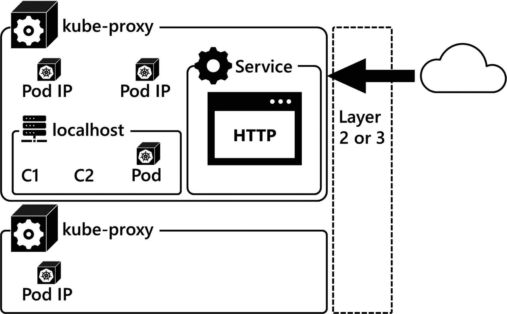

*图 3-5 Kubernetes 网络*

1.  **Pod 内部**
    一个 Pod 内的多个容器共享相同的容器命名空间。这些容器可以通过 `localhost` 在唯一的端口上相互通信。
2.  **同一节点上的 Pod 之间**
    当同一节点上的 Pod 需要通过网络通信时，它们通过节点上定义的本地软件桥接进行通信，并使用 Pod IP。
3.  **不同节点上的 Pod 之间**
    当不同节点上的 Pod 需要通过网络通信时，它们通过本地第 2 层或第 3 层网络使用 Pod IP 进行通信。
4.  **服务**
    当访问集群中的 `服务` 时，流量被路由到实现该 `服务` 的 `kube-proxy`，然后再路由到提供该应用程序服务的 Pod。正如本章前面介绍的，`服务` 将是您在集群中部署应用程序时最常进行的交互方式。

### 总结

本章介绍了 Kubernetes 以及它如何实现现代基于容器的应用程序的部署。您了解了 Kubernetes API 如何让您构建和建模要部署到 Kubernetes 集群中的应用程序。您还学习了部署工作负载的核心 API 原语：作为基于容器的应用程序的 `Pod`；保持集群及其工作负载处于期望状态的 `控制器`；用于访问应用程序的 `服务`；以及用于有状态应用程序的 `存储`。然后，您了解了集群的组件以及它们如何协同工作以确保您的期望状态得以实现，并且我们快速浏览了 Kubernetes 网络模型。在掌握了所有这些理论之后，现在该进入下一章了，在下一章中，我们将向您展示如何构建一个 Kubernetes 集群并让一个基本的工作负载启动并运行。

