# 第二部分 Kubernetes 实践

### 4. 安装 Kubernetes

在本章中，我们将介绍如何在本地和云端构建 Kubernetes 集群。我们将首先讨论安装地点（本地或云端）的决策过程以及在此过程中需要考虑的因素。然后，我们将介绍使用 `kubeadm` 安装方法在本地构建基于虚拟机的 Kubernetes 集群的过程。接下来，我们将在 Azure Kubernetes 服务中构建一个集群。这些集群将成为本书其余部分所有示例的基础。


### 安装考虑因素与方法

与几乎所有现代软件安装一样，您首先需要决定的是：在本地安装还是在云端安装。

#### 部署位置？

在云端部署时，您需要在两个主要的部署选项之间做出选择：

*   **基础设施即服务 (IaaS)**：在 IaaS 场景中，您在云中部署`虚拟机`，然后在其上安装 Kubernetes。

*   **平台即服务 (PaaS)**：Kubernetes 也可从[所有主要的云提供商](https://app.pluralsight.com/course-player%253FclipId%253D5f4148df-26ef-4ce3-a052-f7c6a91da597%2526startTime%253D47.4)处作为托管服务获得。在托管服务产品中，[您无需担心任何底层](https://app.pluralsight.com/course-player%253FclipId%253D5f4148df-26ef-4ce3-a052-f7c6a91da597%2526startTime%253D53.94)[基础设施或冗余；云提供商会为您处理。](https://app.pluralsight.com/course-player%253FclipId%253D5f4148df-26ef-4ce3-a052-f7c6a91da597%2526startTime%253D56.1) 使用 PaaS 需要考虑的一点是，您将在版本控制和其他 Kubernetes 内部可用的功能以及访问控制平面节点方面失去一些灵活性。

*   在本地部署时，决定因素同样是安装在虚拟机上还是直接安装在`裸机`上。虽然本地也有托管产品可用，但这些超出了本书的范围。

在节点选择裸机还是虚拟机，主要取决于您的预期工作负载。如果您谈论的是大量可扩展的微服务，在虚拟机上运行的 Kubernetes 节点可能会为您提供更多灵活性。如果您部署的是一个大型的单体应用程序，中间的虚拟机管理程序将产生不必要的开销。您可能想知道：如果只运行一个应用程序，Kubernetes 是最好的平台吗？和往常一样，答案是：视情况而定！虽然这不是一个显而易见的用例，但有一些像 SQL Server 大数据集群这样的应用程序（我们将在第 10 章更深入地讨论）通常需要专用基础设施，但它们只部署在 Kubernetes 上。

在本书中，我们将主要关注使用第 1 章中描述的设置、使用自管理（本地或 IaaS）机器的环境。无论您是将这些机器作为云端或本地的虚拟机安装，还是在裸机上安装，都不重要，因为 Kubernetes 抽象了底层基础设施。

展望未来，考虑在何处安装生产集群……这个问题应遵循您组织的总体战略。如果到目前为止您所有的应用都还在本地，那么让您的 Kubernetes 集群也生活在那里可能非常合理。另一方面，如果您正在迁移或已经将主要工作负载迁移到云端，您的 Kubernetes 集群很可能也应该跟随。最终，这取决于您团队的技能组合以及在 Kubernetes 上运行用例的需求。

#### 进一步考虑因素

除了“在哪里”的问题，当然还有其他考虑因素，我们将在本章及本书的后续内容中更深入地讨论：

*   您需要多少个工作节点来支持您的工作负载？

*   这些节点的 CPU 和 RAM 配置是什么？

*   如果控制平面失败，您是否需要高可用的解决方案？

*   您的备份和恢复策略是什么？

*   您将使用哪种存储？

*   您将如何管理 Pod 和节点之间的网络？

虽然我们正处于 Kubernetes 之旅的起点，但在考虑推出生产系统之前，这些都是您应该回答的问题。

#### 安装方法

根据您的安装位置，这在很大程度上也决定了您的安装方法。安装自管理集群时，您主要可以选择`kubeadm`（这是一种在`Linux`上部署 Kubernetes 的免费方式）或类似 Red Hat OpenShift 的企业产品。安装本身通常通过命令行工具触发。

当安装基于云的集群时，您的云提供商将负责安装部分，具体细节由您的云提供商在幕后决定。他们通常也提供自己的基于命令行的方法以及用于引导部署的 Web 门户。

#### 其他选项

还有一些其他选项，例如使用`Docker Desktop`在您的笔记本电脑上启动 Kubernetes 集群，或使用像树莓派这样的轻量级硬件作为部署目标。虽然它们可能有有效的用例，特别是在非生产环境中，但我们不会在本书中深入探讨这些。

此外，虽然可以使用基于 Windows 的工作节点，但我们将重点使用`Linux`作为我们的操作系统。

我们也不会详细介绍部署单节点集群的细节。如果您只有一台可用的`Ubuntu`机器，您可以使用清单 4-1 中的代码，它将启动一个包含`本地存储`的单节点集群，但这对于本书中的大多数练习来说是不够的，除了最基本的一些。

```bash
wget -q -O deploy_kubeadm.sh https://bookmark.ws/ArcDemo_Linux
chmod +x deploy_kubeadm.sh
./deploy_kubeadm.sh
```
清单 4-1
安装单节点集群

### 安装要求

对于自管理的 Kubernetes 安装，我们将重点关注在 Linux（更具体地说是 Ubuntu）上使用`kubeadm`。虽然 CentOS、RHEL 和其他 Linux 发行版也受支持，但我们必须选择一个环境，而 Ubuntu 似乎是如今最常见的选择。

最低系统要求是具有两个 CPU、2GB RAM 并禁用交换空间的系统。然而，Kubernetes 组件的这一最低要求不支持任何有意义的工作负载。请确保您使用的是第 1 章中规定的环境。在生产环境中，还要确保您已考虑到可扩展性和冗余性。

[除了这些基本系统要求之外，](https://app.pluralsight.com/course-player%253FclipId%253D982d8f0e-d017-4f76-8bd5-c243179677d4%2526startTime%253D43.84)[您还需要一个 CRI（容器运行时接口）容器运行时。](https://app.pluralsight.com/course-player%253FclipId%253D982d8f0e-d017-4f76-8bd5-c243179677d4%2526startTime%253D47.32) 截至撰写本文时，Kubernetes 同时支持 Docker 和`containerd`。由于 Docker 在 Kubernetes 1.20 中已被弃用，并且其支持将在 Kubernetes 1.23 或更高版本中被移除，因此在本书中我们将主要关注`containerd`。


#### 网络要求

从网络角度来看，请确保所有机器都具有唯一的主机名、MAC 地址和 IP 地址。理想情况下，这些 IP 地址应位于同一子网中，但至少必须设置为能够相互访问。

如果你在网络内运行防火墙（出于本书实验目的，我们建议不要运行防火墙，以避免不必要的网络复杂性），表 4-1 列出了在控制平面上需要可访问的所有 TCP 端口。

表 4-1

控制平面节点上必需的 TCP 端口

| 组件 | TCP 端口 |
| --- | --- |
| API | 6443 |
| Etcd | 2379–2380 |
| 调度器 | 10251 |
| 控制器管理器 | 10252 |
| Kubelet | 10250 |

在节点上，需要打开表 4-2 中列出的端口。

表 4-2

工作节点上必需的 TCP 端口

| 组件 | TCP 端口 |
| --- | --- |
| Kubelet | 10250 |
| NodePort | 30000–32767 |

注意

此处列出的 TCP 端口是默认端口。如果更改了这些端口，请相应地调整防火墙规则。

#### [获取 Kubernetes](https://app.pluralsight.com/course-player%253FclipId%253Db0f4845d-f2a5-4a1a-a790-a39ccf314435)

当然，要安装 Kubernetes，我们首先需要获取它。Kubernetes 软件托管在 GitHub 上，因此如果你访问 [*https://GitHub.com/Kubernetes/Kubernetes/*](https://github.com/Kubernetes/Kubernetes/)，就能找到 Kubernetes 项目。你也可以将自己的想法和更改贡献给该项目。这也是一个非常宝贵的资源，可以详细了解其工作原理，因为你可以查看代码，并通过 GitHub 上的 issues 学习他人的经验。

除了软件本身，你还会在那里找到额外的文档。

虽然理论上你可以获取代码并自行编译所有内容，但为了方便，我们将通过包管理器来安装 Kubernetes。

### 构建自管理集群

理论基础已备，现在让我们开始使用 `kubeadm` 在 Ubuntu 机器上构建我们的第一个 Kubernetes 集群。我们将使用第 1 章中描述的环境，包括其中提到的先决条件。

注意

我们所有的脚本都使用第 1 章中描述的主机名/IP 地址。如果你的实验环境使用了不同的设置，你需要相应地调整这些脚本。为了可读性，我们不会逐一指出每个可能需要调整的地方。

#### 准备虚拟机

首先，我们需要准备好四台虚拟机（`control` 以及 `node-1`、`node-2` 和 `node-3`），并安装 `containerd` 和 Kubernetes 软件包。按照下面两段的描述，在每台机器上安装并配置它们。无需在存储机上安装 `containerd`。

除非另有说明，否则只需在每台机器上使用 shell 运行所述命令。此安装无法直接从我们的管理工作站触发。

##### 安装和配置 containerd

要安装 `containerd`，我们需要加载两个模块（`overlay` 和 `br_netfilter`），如清单 4-2 中的代码所示。它们分别是容器运行时使用的 OverlayFS 和集群内网络所必需的。

```
sudo modprobe overlay
sudo modprobe br_netfilter
清单 4-2
安装 modprobe overlay 和 br_netfilter
```

使用清单 4-3 中的代码，我们需要确保这些模块在重启后也能加载。

```
cat <<EOF | sudo tee /etc/modules-load.d/containerd.conf
overlay
br_netfilter
EOF
清单 4-3
持久化 modprobe 和 br_netfilter
```

`containerd` 还需要一些系统参数，我们可以使用清单 4-4 中的命令进行设置和持久化。

```
cat <<EOF | sudo tee /etc/sysctl.d/99-kubernetes-cri.conf
net.bridge.bridge-nf-call-iptables  = 1
net.ipv4.ip_forward                 = 1
net.bridge.bridge-nf-call-ip6tables = 1
EOF
清单 4-4
持久化 containerd 的系统参数
```

接下来，让我们使用清单 4-5 中的命令应用这些设置，而无需重启。

```
sudo sysctl --system
清单 4-5
应用 sysctl 更改
```

现在，我们已经为 `containerd` 准备好了先决条件，因此可以通过 `apt-get` 安装它，如清单 4-6 所示。

```
sudo apt-get update
sudo apt-get install -y containerd
清单 4-6
安装 containerd
```

`containerd` 需要一个配置文件，我们可以使用 `containerd` 本身生成一个具有默认设置的配置文件（清单 4-7）。

```
sudo mkdir -p /etc/containerd
sudo containerd config default | sudo tee /etc/containerd/config.toml
清单 4-7
创建 containerd 配置
```

在此文件中，我们必须将 `containerd` 的 cgroup 驱动设置为 `systemd`，因为 `kubelet` 需要此设置。

以 root 身份在文本编辑器中打开文件 `/etc/containerd/config.toml`（例如，通过 `vi`，如清单 4-8 所示）。

```
sudo vi /etc/containerd/config.toml
清单 4-8
编辑 containerd 配置
```

在此文件中，找到清单 4-9 所示的部分。

```
[plugins."io.containerd.grpc.v1.cri".containerd.runtimes.runc]
清单 4-9
containerd 配置中的章节
```

在该部分下方，添加清单 4-10 所示的两行。

```
[plugins."io.containerd.grpc.v1.cri".containerd.runtimes.runc.options]
SystemdCgroup = true
清单 4-10
要添加到 containerd 配置中的行
```

注意

此处的缩进很重要——可以是制表符或空格！请确保你的文件看起来像图 4-1 中的文件一样！

要退出 `vi` 并保存文件，请按 `Esc` 键，然后输入 `:x!`。

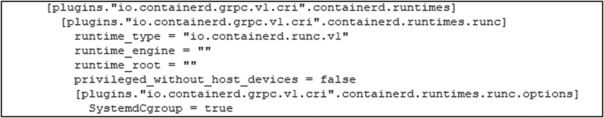

图 4-1

containerd 配置文件中的缩进

根据我们的新设置，我们可以使用 `systemctl` 重启 `containerd`，如清单 4-11 所示。

```
sudo systemctl restart containerd
清单 4-11
重启 containerd
```

`containerd` 现已准备就绪，我们可以继续安装 Kubernetes 软件包。

你可以使用清单 4-12 中的命令确认服务状态。

```
sudo systemctl status containerd
清单 4-12
containerd 的状态
```


#### 安装与配置 Kubernetes 软件包

由于我们将从 Google 仓库安装软件包，因此需要先添加 Google 的 apt 仓库 GPG 密钥（见代码清单 4-13）。

```bash
curl -s https://packages.cloud.google.com/apt/doc/apt-key.gpg | sudo apt-key add -
```
代码清单 4-13
添加 Google GPG 密钥

有了该密钥后，我们就可以添加 Kubernetes apt 仓库了（见代码清单 4-14）。

```bash
sudo bash -c 'cat > /etc/apt/sources.list.d/kubernetes.list
deb https://apt.kubernetes.io/ kubernetes-xenial main
EOF'
```
代码清单 4-14
添加 Kubernetes apt 仓库

接下来，我们更新 apt 软件包列表，并使用代码清单 4-15 中的命令查看 `kubelet` 的可用版本。

```bash
sudo apt-get update
apt-cache policy kubelet | head -n 20
```
代码清单 4-15
更新 apt 软件包列表

这会显示可用版本，如图 4-2 所示，在撰写本文时，最新可用版本是 `1.20.4`。

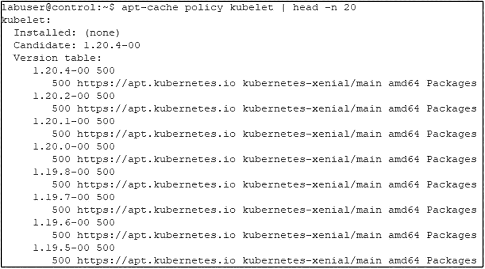
图 4-2
`kubelet` 的版本列表

现在，我们可以如代码清单 4-16 所示，安装 `kubelet`、`kubeadm` 和 `kubectl`。如果你当前的机器也是你在第 1 章中用于安装 `kubectl` 的机器，你可能会收到它已安装的消息。

```bash
sudo apt-get install -y kubelet kubeadm kubectl
```
代码清单 4-16
安装 Kubernetes 软件包

这将安装这些工具的最新版本。如果你想安装之前的版本，可以如代码清单 4-17 所示进行指定。不过，本书中的代码和示例并非特定于某个版本。

```bash
VERSION=1.20.1-00
sudo apt-get install -y kubelet=$VERSION kubeadm=$VERSION kubectl=$VERSION
```
代码清单 4-17
安装特定版本的 Kubernetes 软件包

为避免自动更新，我们将这些工具（以及 `containerd`）标记为保持（hold）状态（代码清单 4-18）。这使我们能完全控制打补丁的过程，使其独立于基础操作系统的补丁更新。

```bash
sudo apt-mark hold kubelet kubeadm kubectl containerd
```
代码清单 4-18
将 Kubernetes 软件包和 `containerd` 标记为保持状态

让我们检查一下 `kubelet` 和容器运行时的状态（代码清单 4-19）。

```bash
sudo systemctl status kubelet.service
sudo systemctl status containerd.service
```
代码清单 4-19
检查 `kubelet` 和 `containerd` 的状态

如图 4-3 所示，`kubelet` 会进入崩溃循环。在集群创建或节点加入现有集群之前，这是正常行为（你可以按 `q` 键退出该进程）。

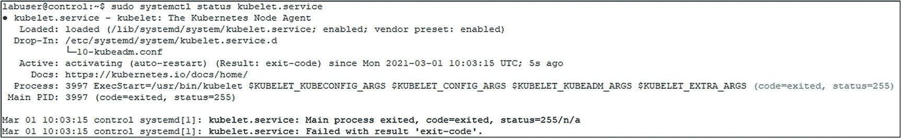
图 4-3
`kubelet` 和 `containerd` 的状态

同时，请确保两个服务都设置为开机自启。这可以通过代码清单 4-20 中的命令进行设置。

```bash
sudo systemctl enable kubelet.service
sudo systemctl enable containerd.service
```
代码清单 4-20
为 `kubelet` 和 `containerd` 设置开机自启

注意
请记住，在 `control`、`node1`、`node2` 和 `node3` 上分别重复此过程并安装配置这些软件包！

#### 创建控制平面

现在容器运行时和 Kubernetes 软件包已经就位，我们可以继续创建控制平面。

注意
本节中的所有命令都需要在你的 `control` 虚拟机上执行。

我们首先生成一个配置文件，如代码清单 4-21 所示。

```bash
kubeadm config print init-defaults | tee ClusterConfiguration.yaml
```
代码清单 4-21
创建 `kubeadm` 配置文件

在默认的集群配置文件中，我们需要修改一些内容。其中一些可以通过代码清单 4-22 所示的方式自动化完成。这将：

- 将 API 服务器的 IP 端点 `localAPIEndpoint.advertiseAddress` 设置为控制平面节点的 IP 地址。
- 将 `nodeRegistration.criSocket` 从 Docker 更改为 `containerd`。在 Kubernetes 的未来版本中，这将成为默认值。
- 将 `kubelet` 的 cgroup 驱动设置为 `systemd`，该值在此文件中尚未定义，默认值是 `cgroupfs`。
- 定义 pod 网络。

```bash
sed -i 's/  advertiseAddress: 1.2.3.4/  advertiseAddress: 172.16.94.10/' ClusterConfiguration.yaml
sed -i 's/  criSocket: \/var\/run\/dockershim\.sock/  criSocket: \/run\/containerd\/containerd\.sock/' ClusterConfiguration.yaml
cat >> ClusterConfiguration.yaml

apiVersion: kubelet.config.k8s.io/v1beta1
kind: KubeletConfiguration
cgroupDriver: systemd
EOF
```
代码清单 4-22
修改 `kubeadm` 配置文件

我们还需要编辑此文件中的 `kubernetesVersion` 以匹配你之前安装的版本。首先，使用代码清单 4-23 中的命令确认已安装的版本。

```bash
kubeadm version
```
代码清单 4-23
获取当前的 `kubeadm` 版本

如图 4-4 所示，我们安装的是 `1.20.4` 版本——除非你安装了其他版本。

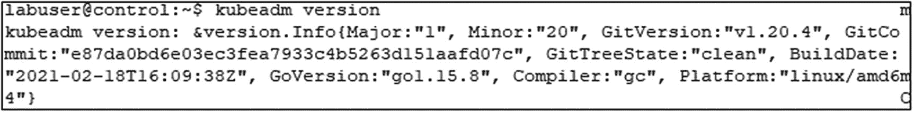
图 4-4
当前安装的 `kubeadm` 版本

有了这个信息，我们现在可以编辑文件（例如使用 `vi`）`ClusterConfiguration.yaml`，并确保版本匹配，如图 4-5 所示。

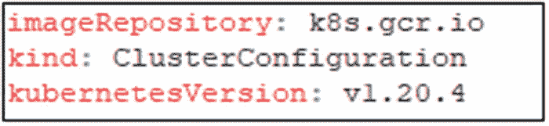
图 4-5
在 `ClusterConfiguration.yaml` 中设置 `kubelet` 的当前版本。

在 `networking` 部分，添加一行将 `podSubnet` 设置为 `10.244.0.10/16`，如图 4-6 所示，这是 `flannel` 网络插件所要求的。

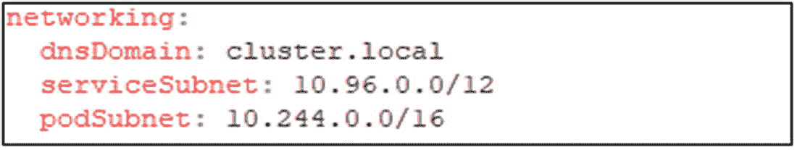
图 4-6
`ClusterConfiguration.yaml` 中的 `podSubnet`

现在，我们已准备好使用 `kubeadm` 初始化集群，如代码清单 4-24 所示。

```bash
sudo kubeadm init \
--config=ClusterConfiguration.yaml \
--cri-socket /run/containerd/containerd.sock
```
代码清单 4-24
初始化集群

这将需要几分钟时间，并会持续输出其进度。结果应与你在图 4-7 中看到的类似。

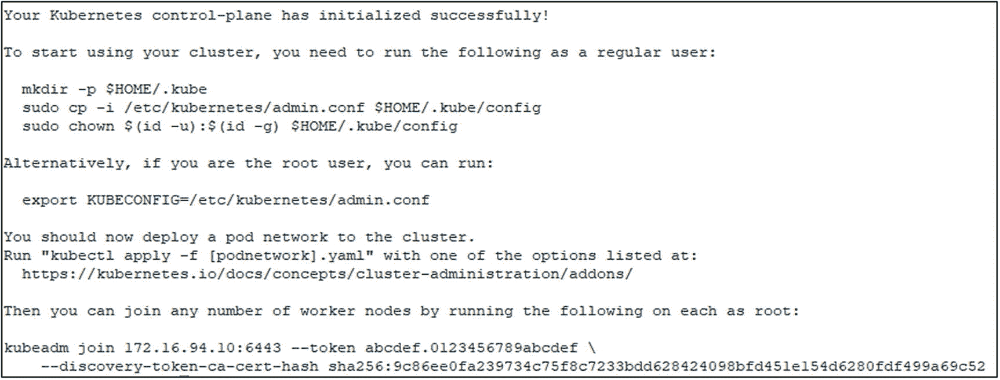
图 4-7
`kubeadm init` 的输出

为确保我们也能在非提权 shell 中与集群交互，我们需要创建一个配置文件并将其存储在我们的主目录中，如代码清单 4-25 所示。

```bash
mkdir -p $HOME/.kube
sudo cp -i /etc/kubernetes/admin.conf $HOME/.kube/config
sudo chown $(id -u):$(id -g) $HOME/.kube/config
```
代码清单 4-25
创建 `kubectl` 配置

注意
如果你使用的是管理工作站，你可以获取此文件并将其复制或其内容复制到该工作站上你的主目录下的 `.kube/config` 中。这将允许你从该工作站与你的集群通信。


##### Pod 网络

在加入工作节点之前，我们需要确保 Pod 网络已经设置好。市面上有许多不同的解决方案，我们决定保持简单，使用`flannel`。虽然它没有像另一个流行的 Pod 网络方案`Calico`那样拥有所有高级配置设置，但它在本地和云网络上无需任何额外配置即可工作，而这些网络往往会限制`IPIP`数据包等。

使用`wget`命令下载默认的清单文件，如清单 4-26 所示。

```
wget https://raw.githubusercontent.com/flannel-io/flannel/master/Documentation/kube-flannel.yml
清单 4-26
下载 flannel
```

如果需要，你可以先查看文件内容，但无需进行任何更改，因此我们将直接使用`kubectl`安装它，如清单 4-27 所示。我们将在下一章详细讨论`kubectl`，所以如果现在感觉有些解释不清，请不要担心。

```
kubectl apply -f kube-flannel.yml
清单 4-27
安装 flannel
```

至此，使用`flannel`的 Pod 网络设置完成。

##### 存储

虽然通常会在此阶段进行配置，但我们将首先部署一个没有任何附加存储的集群。由于 Kubernetes 将计算和数据分离，这完全可以实现。我们在下一章中关于与集群交互的最初练习不需要任何存储。在部署 SQL Server（它确实需要存储）之前，我们将在第 6 章深入探讨 Kubernetes 中的存储概念。

#### 将节点添加到集群

我们的控制平面已准备就绪，但还不能立即加入节点。为了使节点能够加入集群，我们需要一个令牌。最简单的方法是使用`kubeadm`直接生成一个`加入命令`，如清单 4-28 所示。

```
kubeadm token create --print-join-command
清单 4-28
生成令牌和加入命令
```

输出内容与图 4-8 中看到的相似。

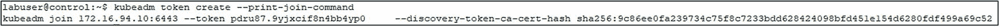
**图 4-8 加入命令（在控制平面节点上生成）**

> 注意
> 根据你安装的版本，你可能会收到一个警告，提示 Docker 不是你的容器运行时。可以安全地忽略此警告。

现在，我们可以获取此命令并在每个所需的工作节点上运行它（以 root 身份运行；参见清单 4-29），这将启动加入过程。你自己的加入命令会有所不同，因为 CA 证书是唯一的。加入令牌的有效期为 24 小时，因此如果以后想添加更多节点，你需要创建一个新的令牌。

```
sudo kubeadm join 172.16.94.10:6443 \
--token pdru87.9yjxcif8n4bb4yp0  \
--discovery-token-ca-cert-hash sha256:9c86ee0fa239734c75f8c7233bdd628424098bfd451e154d6280fdf499a69c52
清单 4-29
kubeadm 加入命令
```

> 注意
> 确保添加`sudo` – 命令需要以 root 身份运行，而`--print-join-command`不会为你添加它！

节点将报告它们已开始加入过程，如图 4-9 所示。

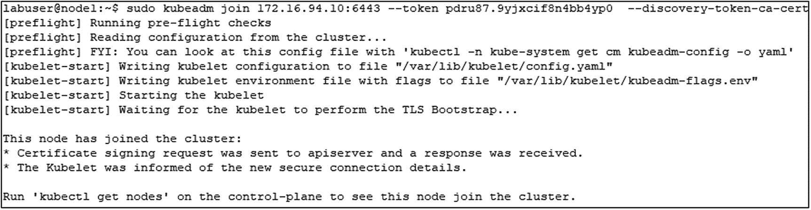
**图 4-9 加入命令（在工作节点上执行）**

让我们在控制平面上运行`kubectl`来列出节点（参见清单 4-30）。

```
kubectl get nodes
清单 4-30
列出集群中的节点
```

我们将看到节点已出现但状态还是`NotReady`（参见图 4-10）。

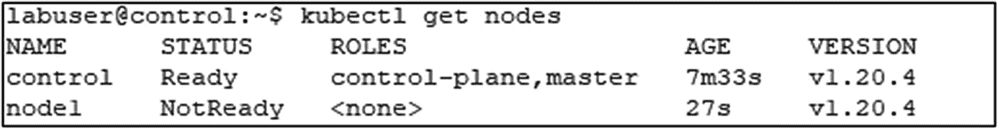
**图 4-10 集群中的节点**

如果几分钟后再次运行该命令，所有节点都将显示为`Ready`。节点显示为`NotReady`是因为运行 Pod 网络和`kube-proxy`的 Pod 正在部署中。在所有节点都显示为 Ready（如图 4-11 所示）之前，你不应继续在该集群上工作。

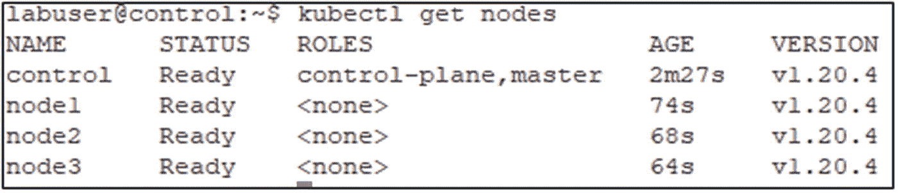
**图 4-11 集群中所有节点均显示为 Ready**

### 在 Azure Kubernetes 服务中构建云集群

有了自管理的集群后，让我们也使用 Azure Kubernetes Service 在 Azure 中安装一个托管的 Kubernetes 集群。

> 注意
> 此练习也可以从你的管理工作站执行。也可以通过 Azure 门户完成。

我们将再次使用`Azure CLI`进行此练习。

除非你仍然从第 1 章的会话中处于登录状态，否则让我们首先登录到你的 Azure 帐户并设置要使用的订阅，如清单 4-31 所示。

```
az login
az account set -s <subscription-id>
清单 4-31
登录 Azure 账户
```

接下来，让我们创建一个专用的资源组，如清单 4-32 所示。根据需要修改名称和位置。

```
az group create --name "Kubernetes-Cloud" --location eastus
清单 4-32
创建资源组
```

我们已经准备好创建集群了。我们将使用清单 4-33 中的代码，这将在我们之前生成的资源组中创建一个名为`AKSCluster`的三节点集群。

```
az aks create \
--resource-group "Kubernetes-Cloud" \
--generate-ssh-keys \
--name AKSCluster \
--node-count 3
清单 4-33
创建 AKS 集群（bash）
```

如果你是从 PowerShell 运行此命令，请确保修改换行符，如清单 4-34 所示。这适用于本书中的任何多行清单。

```
az aks create `
--resource-group "Kubernetes-Cloud" `
--generate-ssh-keys `
--name AKSCluster `
--node-count 3
清单 4-34
创建 AKS 集群（PowerShell）
```

集群创建完成后，CLI 将报告结果，如图 4-12 所示。

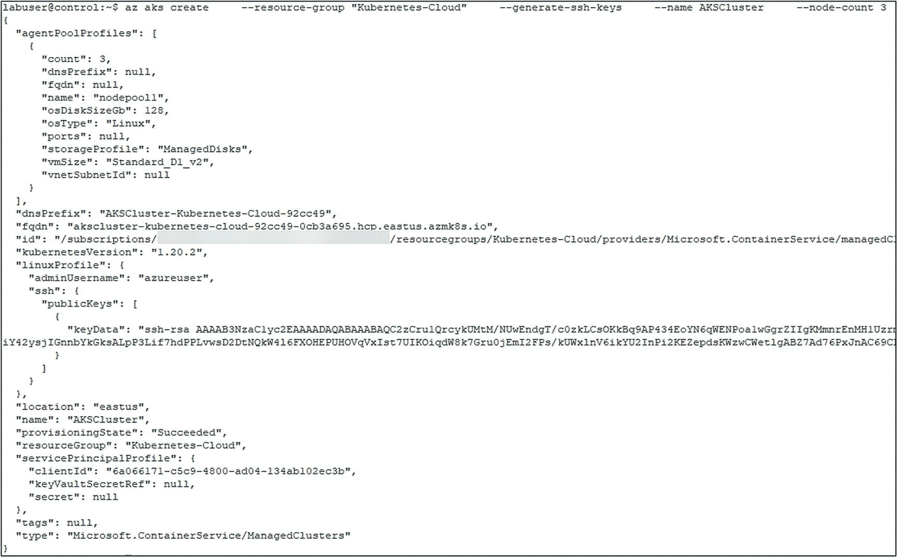
**图 4-12 `az aks create`的输出**

有关创建 AKS 集群的更多选项（例如机器大小），请参阅官方文档[*https://docs.microsoft.com/en-us/cli/azure/aks?view=azure-cli-latest#az_aks_create*](https://docs.microsoft.com/en-us/cli/azure/aks%253Fview%253Dazure-cli-latest%2523az_aks_create)。

为了能够与我们的集群通信，我们需要添加其凭据并将其合并到我们现有的配置文件中。运行清单 4-35 中的命令来执行此操作。这将允许我们使用基于证书的用户认证远程连接到此系统。

```
az aks get-credentials --resource-group "Kubernetes-Cloud" --name AKSCluster
清单 4-35
获取 AKS 集群的凭据
```

现在我们已经配置了两个集群，它们的凭据已存储在我们的`kubectl`配置中。我们将在下一章解释如何使用`kubectl`与这些集群通信并在它们之间切换。

> 注意
> 虽然工具和语法可能不同，但部署其他托管的 Kubernetes 集群解决方案（如 GKE 或 EKS）的一般过程是相同的：获取它们的工具、部署集群并下载集群凭据。

### 总结

在本章中，我们探讨了一些安装注意事项以及在安装 Kubernetes 之前需要了解的内容。我们还介绍了如何安装 Kubernetes，包括在 Linux 上自管理安装和通过托管云服务安装。在下一章中，我们将了解如何通过`kubectl`与我们的集群进行交互。


## 5. 与 Kubernetes 集群交互

集群功能正常运行并启动后，我们现在将学习与集群交互的核心工具——`kubectl`。Kubectl 是一个命令行客户端，用于在 Kubernetes 中部署和维护应用程序，以及管理集群本身。在掌握了 `kubectl` 的基本知识后，我们将学习如何在集群中部署和访问应用程序。

为确保您的管理工作站能够访问集群，请使用代码清单 5-1 中的命令将 `kubectl` 配置复制到该工作站。

```
mkdir c:\users\labuser\.kube
$LinuxPW="Str@ngPassw0rd"
pscp -P 22 -pw $LinuxPW labuser@control:/home/labuser/.kube/config c:\users\labuser\.kube
```
*代码清单 5-1：将 kubectl 配置复制到 Windows 工作站*

### 使用 kubectl 与集群交互

Kubectl 是一个命令行工具，用于在 Kubernetes 中创建、读取、更新或删除几乎任何类型的资源。请记住，在 Kubernetes 中，所有操作都通过 API Server 进行，因此 `kubectl` 是您与 API Server 交互的主要方式。任何需要在 Kubernetes 中创建、修改或查询内容时，这都是主要的命令行工具。

大多数 `kubectl` 命令实际上由三部分组成：

*   **操作：** 您想做什么？
*   **资源：** 您想对什么资源执行操作？
*   **输出：** 对于会产生输出的命令，输出应如何格式化？

一个典型的命令如代码清单 5-2 中的通用示例所示。

```
kubectl    
```
*代码清单 5-2：通用 kubectl 命令*

例如，代码清单 5-3 中的命令将返回集群中所有节点的详细列表。

```
kubectl get nodes -o wide
```
*代码清单 5-3：用于检索集群中节点详细列表的 Kubectl 命令*

该命令的输出应与图 5-1 中的内容类似。

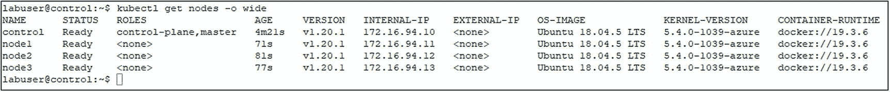

*图 5-1：kubectl get node -o wide 命令的输出*

如果您正在查找特定命名空间中的资源，此筛选条件也会传递给 `kubectl`。代码清单 5-4 中的命令将返回在 `mssql-server` 命名空间中运行的所有 Pod。

```
kubectl get pods -n kube-system
```
*代码清单 5-4：用于检索命名空间中 Pod 的 Kubectl 命令*

**注意**

与 Kubernetes 生态系统中的大多数工具一样，`kubectl` 可跨平台运行，因此无论您是在 Windows、Linux 还是 Mac 上运行，这些命令都完全相同。

此语法的一个例外情况如代码清单 5-5 所示。

```
kubectl cluster-info
```
*代码清单 5-5：用于获取集群概况的 Kubectl 命令*

此命令未指定操作、资源或输出。这些都不需要，因为该命令提供集群的概况信息，例如其控制平面 IP 地址和端口，以及 KubeDNS 的状态。

您收到的输出应大致与图 5-2 中的输出匹配。

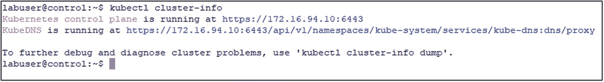

*图 5-2：kubectl cluster-info 命令的输出*

让我们更仔细地看看 `kubectl` 命令的不同组成部分。

#### 操作

在 Kubernetes 中使用 `kubectl` 有大量操作，因此让我们专注于核心操作并更详细地了解它们：

*   **应用：** 这将把文件内容（通常是 YAML 文件）部署到您的 Kubernetes 集群。例如，在上一章部署集群时，我们在添加 flannel 时使用了此操作。`apply` 也用于将应用程序声明式地部署到集群中。
*   **创建：** `create` 允许您以命令式方式向集群添加资源，我们将在本章后面解释如何将应用程序部署到集群时更深入地探讨此操作。在许多情况下，`create` 和 `apply` 可以达到相同的效果。
*   **运行：** `run` 允许您启动一个 Pod 并指定容器镜像，基本上是引导最基本的 Pod 配置。
*   **解释：** 这为您提供了特定 Kubernetes API 对象或资源的文档，列出描述和构建该对象所需的字段。这在构建清单文件时特别有用，也可用于快速查找对象的字段名称。
*   **删除：** 这将删除指定的资源。
*   **获取：** `kubectl get` 将显示有关指定资源类型的基本信息。
*   **描述：** `describe` 提供详细的资源信息，用于显示特定资源的非常详细的信息。当出现问题时，这是您的第一站：底部的事件部分是进行故障排除的绝佳位置。
*   **执行：** `exec` 允许您在 Pod 内的容器中执行命令。
*   **日志：** 这允许您查看在 Pod 内运行的容器的日志。

如前所述，这是一个简短的列表，包含我们认为最关键的几个操作，只是为了让您入门。您可以在 [`kubernetes.io/docs/reference/kubectl/overview/#operations`](https://kubernetes.io/docs/reference/kubectl/overview/%23operations) 找到完整的列表，我们强烈建议您查看一下！

#### 资源

在命令行工作时，我们将把 `kubectl` 与前面看到的操作（如 `get`、`apply` 等）和资源结合起来。基本上，*针对什么*执行该操作。我们也介绍了节点、Pod 和服务等概念，老实说，Kubernetes 中还有更多我们可以使用的对象。这就是我们指定要对哪种资源类型执行操作的方式。

一些最常见的资源类型包括：

*   节点 (`no`)
*   Pod (`po`)
*   服务 (`svc`)

在这里您可以看到括号中代表该特定资源类型的别名，因此节点用 `no`，Pod 用 `po`，服务用 `svc`，这是一个让我们能在命令行快速执行这些命令的好方法。

它们在使用 `kubectl` 时完全同义，因此运行代码清单 5-6 中的命令两次将得到完全相同的结果。

```
kubectl get no
kubectl get nodes
```
*代码清单 5-6：使用和不使用资源类型别名的 Kubectl 命令*

官方文档 [`kubernetes.io/docs/reference/kubectl/overview/#resource-types`](https://kubernetes.io/docs/reference/kubectl/overview/%23resource-types) 提供了可用资源类型的完整列表供您参考！

顺便说一句，您还可以通过运行代码清单 5-7 中的命令来获取 Kubernetes 集群中所有可用资源类型的列表。这是另一个不使用操作、资源或输出选项的命令示例。

```
kubectl api-resources
```
*代码清单 5-7：用于列出可用资源类型的 Kubectl 命令*

### 输出

`kubectl` 命令构建的最后一部分是修改其输出格式。我们可以通过向命令添加额外的标志来指定 `kubectl` 的输出格式。

我们想向大家介绍的一个非常有用的格式是 `wide`，它会额外显示有关我们正在使用的 Kubernetes 对象的更多信息。

我们还可以将 Kubernetes 对象输出为 `YAML` 和 `JSON` 格式。`YAML` 和 `JSON` 格式的文件是 Kubernetes 以声明式描述事物的核心，使我们能够用代码描述配置。我们可以使用 `kubectl` 输出 `YAML` 或 `JSON`，这是一种从集群中提取配置数据并描述已在集群中部署资源的宝贵方法。我们可以将其持久化到文件中，并根据需要与其他系统、其他环境和其他开发者交换。

另一个选项是 `jsonpath`，它只会从 `JSON` 输出中获取特定的子集或值。例如，当你想检索端口或 IP 地址等值，以便随后在脚本中用作变量时，这特别有用。

完整的输出选项列表可以在 [`https://kubernetes.io/docs/reference/kubectl/overview/#output-options`](https://kubernetes.io/docs/reference/kubectl/overview/%2523output-options) 找到。另一个非常有用的资源，特别是当你刚开始熟悉 `kubectl` 时，是 `kubectl` 速查表：[`https://kubernetes.io/docs/reference/kubectl/cheatsheet/`](https://kubernetes.io/docs/reference/kubectl/cheatsheet/)。

### Kubectl 上下文

`Kubectl` 可用于从同一工作站管理多个 Kubernetes 集群。这是通过所谓的上下文来处理的。上下文是集群和用于登录该集群的凭据的组合。

让我们首先使用清单 5-8 中的命令列出当前对我们可用的所有上下文。

```
kubectl config view
```
清单 5-8
显示 kubectl 的配置，包括所有上下文

正如我们在图 5-3 中看到的，我们有 `kubernetes-admin` 上下文（这是我们的 `kubeadm` 集群）和 `AKSCluster` 上下文（这是我们在 Azure Kubernetes Service 中的集群）。

`../images/494804_1_En_5_Chapter/494804_1_En_5_Fig3_HTML.jpg`
图 5-3
当前 kubectl 配置视图

接下来，让我们通过运行清单 5-9 中的命令来检查我们当前正在使用哪个上下文。

```
kubectl config current-context
```
清单 5-9
获取当前的 kubectl 上下文

如图 5-4 所示，我们当前的上下文是 `kubernetes-admin`，因此此时任何 `kubectl` 命令都将针对我们的 `kubeadm` 集群执行。

`../images/494804_1_En_5_Chapter/494804_1_En_5_Fig4_HTML.jpg`
图 5-4
当前的 kubectl 上下文

让我们使用清单 5-10 将上下文更改为 `AKSCluster`。

```
kubectl config use-context AKSCluster
```
清单 5-10
将 kubectl 上下文切换到 AKSCluster

这将把我们当前的上下文更改为 `aks-admin`。`kubectl` 中的所有命令现在都将针对 AKS 集群执行。

> **注意**
>
> 除非另有说明，本章及后续章节中的所有练习都应在 `kubernetes-admin@kubernetes` 上下文中执行。

### 在 Kubernetes 中部署应用

既然我们知道了如何在命令行与集群交互，让我们将讨论转向在 Kubernetes 中部署应用程序。

与大多数通过 `kubectl` 在 Kubernetes 中执行的命令一样，应用程序可以使用命令式或声明式配置进行部署。

#### 命令式部署

当你使用命令式配置时，通常会在命令行一次执行一条命令，并且一次只操作一个对象。

让我们运行清单 5-11 中的命令。

```
kubectl create deployment nginx --image=nginx
```
清单 5-11
使用 nginx 创建部署的 Kubectl 命令

该命令被发送到 API Server，API Server 将基于 `nginx` 镜像创建一个名为 `nginx` 的部署，但我们一次只在命令行上操作一个对象。

当然，这也适用于其他类型的对象。例如，清单 5-12 中的命令将再次使用 `nginx` 镜像，但它将创建一个运行它的独立 Pod。

```
kubectl run nginx --image=nginx
```
清单 5-12
运行一个新的 nginx Pod 的 Kubectl 命令

虽然这无疑是一种管理系统的方法，但如果你的应用程序栈开始增长，配置和部署变得更加复杂，在命令行管理每个单独的对象并不是一种可持续的管理或维护系统的方式。我们需要以声明式的方式做事，这是 Kubernetes 的核心原则之一，即我们使用 `YAML` 或 `JSON` 在代码中定义应用程序或集群本身的期望状态。

让我们使用清单 5-13 中的命令查看 Pod。

```
kubectl get pods
```
清单 5-13
列出 Pod 的 kubectl 命令

我们将看到（图 5-5）我们的两个 Pod：一个是单独启动的（名为 `nginx`），另一个来自我们的部署（名为 `nginx-6799fc88d8-fj928`）。来自我们部署的 Pod 的名称是随机的，并且每次 Pod 被终止并从同一部署创建新 Pod 时都会改变。

`../images/494804_1_En_5_Chapter/494804_1_En_5_Fig5_HTML.jpg`
图 5-5
kubectl get pods 的输出

在继续讨论声明式部署之前，让我们先清理并删除先前创建的部署和 Pod，使用清单 5-14 中的命令。

```
kubectl delete deployment nginx
kubectl delete pod nginx
```
清单 5-14
删除命令式创建的资源的 Kubectl 命令

删除部署将立即完成，而删除单个 Pod 只有在 Pod 被终止和删除后才会返回。


### 声明式部署

对于更复杂的场景，或者仅仅是为了更轻松地将同一对象配置部署到另一个集群（例如，将应用程序从开发系统推送到测试系统），因此强烈建议使用基于清单的声明式方法。你的清单文件也应该像你环境中使用的任何其他代码一样，放入你的源代码控制系统中。在这种情况下，我们将仅使用一个可以用 JSON 或 YAML 编写的清单，并通过像代码清单 5-15 中的命令将其提供给 API Server。顺便说一句，用 YAML 编写的清单会被 Kubernetes 转换为 JSON。

```
kubectl apply -f deployment.yaml
代码清单 5-15
将 YAML 文件提供给 API Server 的 Kubectl 命令
```

这个命令将获取 `deployment.yaml` 文件的内容，并将其传递给 API Server，以便 Kubernetes 创建清单中定义的资源。

一个清单可以由许多不同的对象类型组成，因此我们可以有一个 YAML 文件，其中首先创建一个存储类，然后是一个持久卷和持久卷声明，接着是一个部署和一个服务定义。所有这些都在同一个文件中。所有内容都通过命令行上的一个单一命令部署。

正如前面也提到的，我们可以使用 `kubectl` 通过输出来生成这些清单。让我们从生成一个部署的清单开始，该部署与我们之前通过命令式方式创建的相匹配，使用的是代码清单 5-16 中的代码。为此，我们添加一个输出格式和 `dry-run` 开关，这将仅生成清单，而不会部署任何内容到我们的集群。

```
kubectl create deployment nginx --image=nginx --dry-run=client -o yaml
代码清单 5-16
生成 nginx 部署的 YAML 清单的 Kubectl 命令
```

输出可以在代码清单 5-17 中找到。

```
apiVersion: apps/v1
kind: Deployment
metadata:
creationTimestamp: null
labels:
app: nginx
name: nginx
spec:
replicas: 1
selector:
matchLabels:
app: nginx
strategy: {}
template:
metadata:
creationTimestamp: null
labels:
app: nginx
spec:
containers:
- image: nginx
name: nginx
resources: {}
代码清单 5-17
从前一个代码清单生成的清单
```

让我们再次生成那个清单，但这次，我们将输出重定向到一个名为 `nginx.yaml` 的文件，如代码清单 5-18 所示。

```
kubectl create deployment nginx --image=nginx --dry-run=client -o yaml > nginx.yaml
代码清单 5-18
生成并重定向到文件的 nginx 部署 YAML 清单的 Kubectl 命令
```

我们现在可以取用那个文件，并以声明式方式创建一个部署。使用代码清单 5-19 中的命令来执行此操作。

```
kubectl apply -f nginx.yaml
代码清单 5-19
使用先前生成的清单进行声明式部署
```

这将生成一个与前一个类似的部署。通过运行代码清单 5-20 中的命令，我们可以验证我们的一个副本（如清单中所定义）已就绪。

```
kubectl get deployment nginx
代码清单 5-20
检查此部署的状态
```

输出如图 5-6 所示，将确认我们部署的状态。


图 5-6

`kubectl get deployment nginx` 的输出

### 修改部署

当然，现有部署也可以在不进行完全重新部署的情况下进行修改。

例如，假设你想更新现有部署中的副本（Replica）或 Pod 的数量。

乍一看，最简单的方法似乎又是通过命令式方式完成，如代码清单 5-21 所示。

```
kubectl scale deployment nginx --replicas=2
代码清单 5-21
将 nginx 部署扩展到两个副本
```

如图 5-7 所示，部署现在显示两个副本。


图 5-7

扩展到两个副本后 `kubectl get deployment nginx` 的输出

但现在，我们的清单文件和部署不同步了，因为清单仍然只反映一个副本。

更好的方法是使用文本编辑器编辑清单。用你选择的文本编辑器打开该文件，将原始的副本定义（如代码清单 5-22 所示）替换为 20 个副本的新定义（如代码清单 5-23 所示）。

```
spec:
replicas: 1
代码清单 5-22
一个副本的现有副本定义
```

```
spec:
replicas: 20
代码清单 5-23
20 个副本的新副本定义
```

现在，我们可以重新应用清单（参见代码清单 5-24），这将把我们的部署扩展到 20 个副本。

```
kubectl apply -f nginx.yaml
代码清单 5-24
使用 kubectl 应用新定义
```

如图 5-8 所示，部署现在显示 20 个副本（请注意，所有这些副本显示为就绪需要一些时间）。


图 5-8

扩展到 20 个副本后 `kubectl get deployment nginx` 的输出

修改现有对象的第三种方法是 ``kubectl edit``。虽然这也存在使你的 YAML 文件与实际部署在集群上的内容失去同步的缺点，但这是一种非常方便的方法，可以一次性对部署进行多项更改。

运行代码清单 5-25 中的代码。

```
kubectl edit deployment nginx
代码清单 5-25
编辑正在运行的部署
```

这将在你的默认文本编辑器中打开当前部署的完整清单。找到先前定义的 20 个副本的那一行，并将其更改为 30。关闭并保存此编辑器时，这些更改将立即应用，我们可以再次使用 `kubectl get deployment` 进行检查。结果也如图 5-9 所示。


图 5-9

扩展到 30 个副本后 `kubectl get deployment nginx` 的输出

### 在集群中暴露和服务访问

现在，我们有了一个扩展的 nginx 部署，但 Pod 中运行的应用程序还无法访问。让我们继续前进，将该部署作为一个 Kubernetes 服务暴露出来，为我们的应用程序提供一个持久的 IP 地址和端口。

可以使用 ``kubectl expose`` 创建服务。


#### 暴露类型为 ClusterIP 的服务

如果你运行代码清单 5-26 中的命令，这将创建一个在端口 80 上暴露的服务，同时目标端口也是 80（因为这是`nginx`的默认端口）。

```
kubectl expose deployment nginx --port=80 --target-port=80
代码清单 5-26
将 nginx 部署暴露为 ClusterIP 服务
```

`port` 定义了服务监听的端口，而 `target port` 是容器内应用程序监听的端口。由于我们没有提供任何其他选项，该服务的类型将为 `ClusterIP`，这是默认的服务类型。我们可以通过运行代码清单 5-27 中的命令来查看这一点。

```
kubectl get service nginx
代码清单 5-27
获取服务详情
```

如图 5-10 所示，这里还显示了该服务运行的 IP 地址。

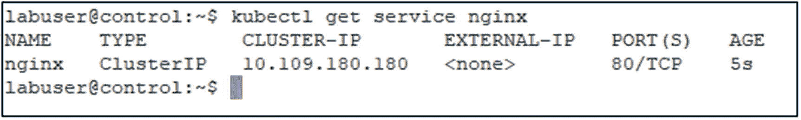
*图 5-10: `kubectl get service nginx` 的输出*

虽然所有这些命令都是命令式的——正如我们之前提到的，这在测试中是可以的，但通常应使用`YAML`清单——你也可以通过添加`--dry-run`开关来修改命令，以生成一个`YAML`清单，然后如代码清单 5-28 所示，将其应用到你的集群中。

```
kubectl expose deployment nginx --port=80 --target-port=80
--dry-run=client -o yaml
代码清单 5-28
创建清单以将 nginx 部署暴露为 ClusterIP 服务
```

顺便说一下，如果你只想获取`ClusterIP`，这是输出格式`jsonpath`的完美用例，如代码清单 5-29 所示。当需要在自动化脚本中将此值存储到变量中时，这尤其有用。

```
kubectl get service nginx -o jsonpath='{ .spec.clusterIP }'
代码清单 5-29
仅通过 kubectl 检索 ClusterIP
```

我们现在可以访问这个服务，例如，通过运行代码清单 5-30 中的`curl`请求（确保将 IP 地址更改为你集群中服务的`ClusterIP`）。

```
curl http://10.109.180.180/
代码清单 5-30
访问 ClusterIP 服务
```

正如我们在第 3 章详细阐述的，`ClusterIP`服务可以从集群内的任何节点和 Pod 访问，但无法从外部访问。根据你的应用场景，这可能足够，也可能不够。让我们假设你希望确保你的服务可以从集群外部访问。

首先，使用代码清单 5-31 中的命令删除现有的服务。

```
kubectl delete service nginx
代码清单 5-31
删除 nginx 服务
```

#### 暴露类型为 NodePort 的服务

如果你想暴露一个服务，使其也能从不属于你的 Kubernetes 集群的机器访问，我们需要将该服务作为`NodePort`类型暴露。

为此，我们只需添加`--type`开关，如代码清单 5-32 所示。

```
kubectl expose deployment nginx --port=80 --target-port=80 --type=NodePort
代码清单 5-32
将 nginx 部署暴露为 NodePort 服务
```

让我们使用代码清单 5-33 中的命令查看此服务。

```
kubectl get service nginx
代码清单 5-33
获取服务详情
```

如图 5-11 所示，该服务现在显示类型为`NodePort`，并且也显示了我们服务部署时使用的（动态）端口。

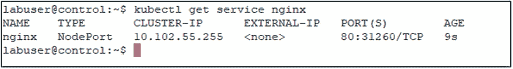
*图 5-11: `kubectl get service nginx` 的输出*

此端口在服务的生命周期内不会改变。但是，如果你删除并再次暴露它，它很可能会显示一个不同的端口。

就像上一个例子中的`ClusterIP`一样，我们可以使用`jsonpath`来仅检索`NodePort`，如代码清单 5-34 所示。

```
kubectl get service nginx -o jsonpath='{ .spec.ports[*].nodePort }'
代码清单 5-34
仅通过 kubectl 检索 nodePort
```

类型为`NodePort`的服务可以在 Kubernetes 集群的任何节点上访问。在我们的示例中，代码清单 5-35 所示的请求可能最终到达我们部署的不同副本，但都会产生相同的输出。

```
curl http://control:31260
curl http://node1:31260
curl http://node2:31260
curl http://node3:31260
代码清单 5-35
访问 NodePort 服务
```

#### 暴露类型为 LoadBalancer 的服务

如果你的 Kubernetes 运行在例如 Azure Kubernetes Service 上，你需要使用`LoadBalancer`类型来暴露服务，这将为你提供一个外部 IP 地址来访问该服务。这只适用于云场景或具有 Kubernetes 集成负载均衡器的本地场景。

让我们从暴露部署开始，如代码清单 5-36 所示。

```
kubectl expose deployment nginx --port=80 --target-port=80 --type=LoadBalancer
代码清单 5-36
将 nginx 部署暴露为 LoadBalancer 服务
```

然后，我们可以再次获取完整的服务详情或仅获取服务 IP 地址，如代码清单 5-37 所示。

```
kubectl get service nginx
kubectl get service nginx -o jsonpath='{.status.loadBalancer.ingress[0].ip }'
代码清单 5-37
获取服务详情
```

使用此服务 IP 地址，我们就可以从外部客户端访问我们的部署了。

### 总结

在本章中，我们介绍了使用`kubectl`与 Kubernetes 集群交互的不同方式，以从中获取所有不同类型的信息。我们还研究了如何使用命令式和声明式部署方法来部署和访问应用程序。让我们继续下一章，了解更多关于 Kubernetes 集群中存储的知识！

## 6. 在 Kubernetes 中存储持久数据

在本章中，我们将深入探讨基于容器的应用程序对数据持久性的需求，以及容器持久化数据的内部原理。我们将介绍 Kubernetes 中的核心存储概念，例如 Kubernetes 如何使用`Volumes`、`Persistent Volumes`和`Persistent Volume Claims`来存储数据，如何配置存储，以及 Kubernetes 如何控制对该存储的访问。我们将研究静态和动态配置场景，特别是使用我们实验室环境中的`NFS`和 Azure Kubernetes Service。


### 基于容器的应用程序中数据持久性的必要性

正如你在第 2 章所学，容器镜像是只读的。当在容器内创建或更改数据时，数据会被写入可写层。容器运行时会将容器镜像和可写层整合到一个文件系统中，供容器内部运行的应用程序使用。当容器被删除时，容器及其可写层都会被移除，该可写层内的数据也随之永久丢失。这并非存储持久性数据（如数据库数据）的最佳位置。如图 6-1 所示，可写层的生命周期与容器相同。

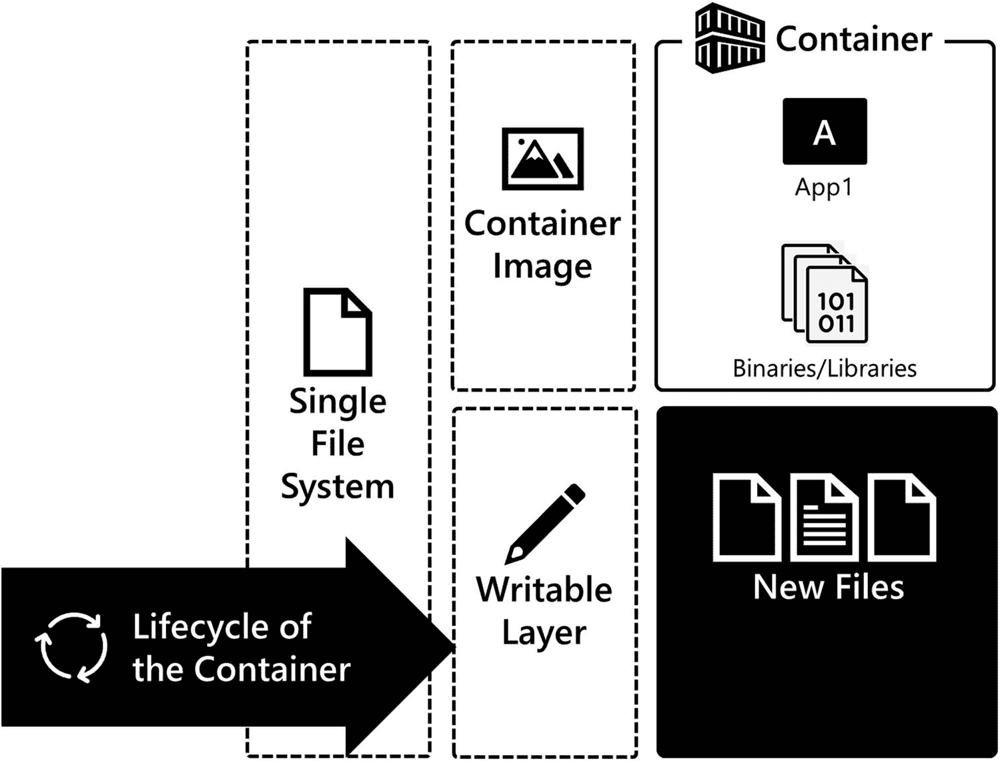
*图 6-1. 容器将数据写入可写层，该层的生命周期与容器相同。当容器被移除时，可写层中的数据也会被移除。*

那么问题来了，如何才能在容器中存储独立于其生命周期的持久性数据？这就是卷的用武之地。卷允许你将存储附加到容器，任何创建或更改的数据都会写入此卷。卷的生命周期独立于容器，是容器运行时使用的持久化存储模型。图 6-2 突出展示了卷如何挂载到文件系统中，为容器提供独立于其生命周期的持久化存储。

本章将把该模型扩展到 Kubernetes 中，你将学习 Kubernetes 如何为在 Pod 内运行的有状态应用提供独立于 Pod 生命周期的存储。

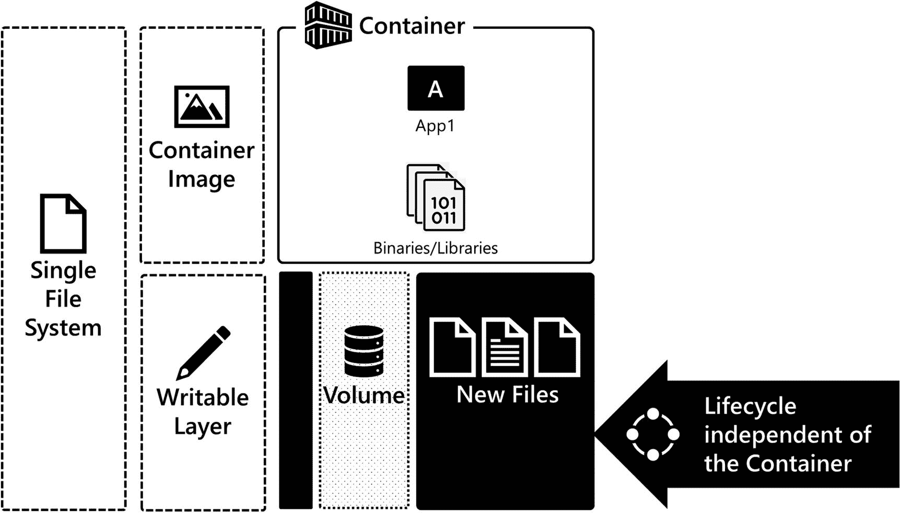
*图 6-2. 卷使容器能够持久化数据，独立于容器生命周期。当容器被移除时，卷中的数据依然保留，并且可以挂接到新的或其他容器上。*

### Kubernetes 中的存储

要在 Kubernetes 中部署有状态应用，集群必须实现一些核心功能。首先，集群需要为 Pod 配置并附加存储作为应用的卷。其次，根据应用架构，集群需要控制对该存储的访问，以确保安全和应用兼容性。Kubernetes API 暴露了多个对象，支持部署有状态应用所需的配置、配置和访问控制。以下是 Kubernetes 用于支持有状态应用的 API 对象列表：

*   **卷：** 作为 Pod 规范的一部分，卷是一种可以被 Pod 中运行的容器挂载的存储。
*   **持久卷：** 集群中由管理员定义和配置的存储，或由存储类动态配置的存储。
*   **持久卷声明：** 用户在清单中对存储的请求。
*   **存储类：** 集群管理员定义集群中可用于配置的存储类别（或组）的一种方式。存储类可以促进动态配置，即根据需要创建持久卷，以满足用户通过持久卷声明提出的存储请求。

现在，让我们更仔细地看看每一个 API 对象，以及它们如何使你能够在 Kubernetes 中部署有状态应用。

### 卷

卷是节点暴露的存储资源，挂载在 Pod 内部。它是节点上的一个目录或块设备，可在 Pod 中运行的容器内部访问。一个卷可以被 Pod 中的多个容器挂载，从而实现 Pod 内容器之间的数据共享。作为 Pod 规范的一部分定义，卷的生命周期独立于容器，但依赖于 Pod，这意味着当 Pod 被删除时，对卷的访问也会被移除。但是，卷上的数据不会被销毁，可供挂接到新的 Pod。

Kubernetes 中有许多类型的卷可用。每种卷类型都需要根据所分配存储的种类进行独特的配置。下面列出了 Kubernetes 中常用的一些卷类型。使用卷时，每种卷类型都有其独特的配置属性：

*   **hostPath：** Pod 中节点文件系统上的挂载目录。
*   **Local：** 节点上的挂载存储设备。
*   **NFS：** 将现有的 NFS 导出挂载到 Pod 中。
*   **光纤通道和 iSCSI：** 通过存储网络访问远程存储的块设备。
*   **云存储：** 访问主要云提供商的远程存储块设备和文件服务：
    *   AWS 弹性块存储
    *   Azure 磁盘
    *   Azure 文件
    *   GCE 持久磁盘
*   **Secret 和 ConfigMap：** 将包含配置数据的集群 API 对象暴露到 Pod 中。
*   **持久卷声明：** 对集群中存储访问的请求。

完整列表请参见 [*https://kubernetes.io/docs/concepts/storage/volumes/*](https://kubernetes.io/docs/concepts/storage/volumes/)。

对于 NFS、光纤通道甚至云存储等卷类型，它们需要特定于基础设施的配置元素。例如，使用 NFS 时，你需要定义 NFS 服务器的网络位置和要访问的导出路径。使用云存储时，你需要定义一个唯一标识符，例如你要访问的虚拟磁盘的资源 ID 或卷 ID。在 Pod 规范中包含特定于基础设施的配置意味着在 Kubernetes 集群之间移动该代码可能具有挑战性，因为你需要更改 Pod 规范以匹配目标 Kubernetes 集群的存储环境。这增加了错误风险并降低了代码的可移植性。持久卷声明有助于解决这一挑战。我们将在本章后面了解更多关于持久卷声明的内容。

首先，让我们看看如何在 Pod 中配置卷。在下面的示例中，我们定义了一个运行 `nginx` 的 Pod。该 Pod 还定义了一个卷。该卷是一个 NFS 卷，用于访问我们实验室环境中存储服务器上的文件系统。在此示例中，NFS 客户端需要额外的配置参数，即 NFS 服务器的网络位置和我们要挂载的 NFS 服务器导出路径。重要的是要指出，卷是在 Pod 级别定义的，并且可供 Pod 中运行的任何容器挂载。在 Pod 中，你使用 `volumeMounts` 字段将卷附加到容器。在代码清单 6-1 中，你可以看到卷名称 `webcontent` 通过 `mountPath` 字段挂载到文件系统位置 `/usr/share/nginx/html/web-app`。

```yaml
apiVersion: v1
kind: Pod
metadata:
  name: nginx-pod
spec:
  containers:
  - name: nginx
    image: nginx
    ports:
    - containerPort: 80
    volumeMounts:
    - name: webcontent
      mountPath: "/usr/share/nginx/html/web-app"
  volumes:
  - name: webcontent
    nfs:
      server: 172.16.94.5
      path: "/srv/exports/volumes/webcontent"
```
*代码清单 6-1. 在 Pod 规范中使用卷 (volume.yaml)*


在控制节点上，我们使用 `-o wide` 输出修饰符获取 Pod 列表以得到 Pod 的 IP 地址，然后结合该 Pod IP 地址使用 `curl` 来访问 `nginx`。在图 6-3 中，我们使用了 `kubectl get pods -o wide`，在输出中，你可以看到 `nginx` Pod 正在运行。


图 6-3：使用持久存储上的内容访问 `nginx`

在图 6-4 中，你可以看到 Pod 内部位于 `/user/share/nginx/html/web-app` 的持久存储映射。

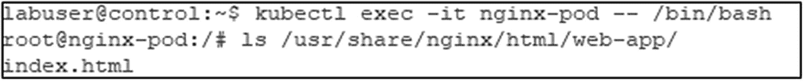

图 6-4：查看 Pod 内部持久存储上的内容

在图 6-5 中，你可以看到内容在网络上实际存储的位置。它存储在 NFS 服务器的 `/srv/exports/volumes/webcontent` 路径下。当这个 Pod 被调度到集群中的某个节点时，由 `kubelet` 负责将存储附加到该节点并暴露给该 Pod。

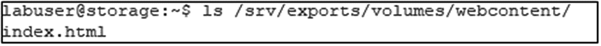

图 6-5：查看 NFS 服务器上的存储内容

卷为 Kubernetes 中的持久存储提供了解决方案。然而，正如你在代码示例中所看到的，清单文件中存在与基础设施相关的代码。这意味着如果你想在另一个集群中使用此代码，就需要更新清单文件，这增加了维护成本并降低了代码的可移植性。Kubernetes 的设计者和维护者看到了这个问题，并引入了一个解决方案。回顾一下 Kubernetes 用于支持有状态应用的 API 对象，其中列出了一个卷类型：`持久卷声明`。这种卷类型使我们能够将基础设施相关的代码分离到独立的 API 对象中，即 `持久卷` 和 `持久卷声明`。让我们继续前进，更详细地探讨这些对象。

### 持久卷与持久卷声明

你刚刚了解了如何在 Kubernetes 中使用卷向 Pod 暴露存储。但你也看到在 Pod 规范中包含基础设施相关的代码会增加维护难度并降低清单文件的可移植性。现在我们来看看 `持久卷` 和 `持久卷声明` 如何帮助解决这些挑战，并将那些基础设施相关的代码移出 Pod 规范。

#### 持久卷

`持久卷` 是 Kubernetes 中的一种 API 资源，由集群管理员定义或由集群使用 `存储类` 动态供给。`持久卷` 的生命周期独立于容器和 Pod。就像卷一样，每个 `持久卷` 都有一个类型，定义了你想要附加到 Pod 的存储类型。现在，当你使用 `持久卷` 时，`持久卷` 对象持有附加到 Pod 的存储的实现细节，而不是将这些技术实现细节放在 Pod 规范中。在 Pod 规范内部，有一个对称为 `持久卷声明` 的存储 API 对象的引用。`持久卷声明` 是对集群的一个请求，要求将 `持久卷` 映射到 Pod。

根据其类型（块存储或文件系统），`持久卷` 由 `kubelet` 挂载或附加到节点。容器运行时负责将挂载或附加的 `持久卷` 暴露给 Pod 内部的容器。`持久卷` 是集群中一个不带命名空间的资源，这意味着如果需要，它可以在命名空间之间共享。

#### 访问模式

`持久卷` 的访问模式定义了访问 `持久卷` 对象的模式。每个 `持久卷` 都有一个访问模式，描述了底层存储的能力。

以下列表详细说明了 Kubernetes `持久卷` 和 `持久卷声明` 支持的访问模式：

*   `ReadWriteOnce (RWO):` 只有一个节点可以以读/写方式访问一个 `持久卷`。
*   `ReadWriteMany (RWX):` 多个节点可以以读/写方式访问一个 `持久卷`。
*   `ReadOnlyMany (ROX):` 多个节点可以以只读方式访问一个 `持久卷`。

选择哪种访问模式取决于将使用 `持久卷` 的应用程序以及底层的 `持久卷` 存储类型。例如，由于 NFS 的特性，一个 NFS 导出可以支持许多读/写客户端。然而，像虚拟磁盘这样的块设备通常只支持一台主机进行读写访问，因为底层的虚拟磁盘通常由于其特性无法附加到多台主机。在应用方面，像 SQL Server 这样的应用程序可能只有一个进程能同时打开一个数据库文件，因此需要 `ReadWriteOnce`。另一方面，像 Web 内容这样的静态文件可以是 `ReadOnlyMany`，然后 `持久卷` 可以附加到许多 Pod，以实现对存储在 `持久卷` 中的内容的横向扩展访问。

访问模式是节点级别的，而不是 Pod 级别的。因此，即使一个 `持久卷` 是 `ReadWriteOnce`，运行在节点上的 Pod 也有可能访问它。这取决于所部署的应用程序及其配置，以确保在任意时间点只有一个 Pod 正在访问该 `持久卷`。

#### 持久卷的类型

Kubernetes 为 `持久卷` 支持广泛的存储类型。下面列出了我们在 Kubernetes 中处理有状态应用时更常见的 `持久卷` 类型：

*   `hostPath:` 将节点文件系统上的一个目录挂载到 Pod 中。
*   `Local:` 节点上挂载的存储设备。
*   `NFS:` 将现有的 NFS 导出挂载到 Pod 中。
*   `Fiber Channel and iSCSI:` 通过存储网络对远程存储进行块访问。
*   `云存储:` 访问主要云提供商的远程存储块设备和文件服务：
    *   `awsElasticBlockStore`
    *   `azureDisk`
    *   `azureFiles`
    *   `gcePersistentDisk`

有关 `持久卷` 类型的完整列表和配置示例，请查阅 [*https://kubernetes.io/docs/concepts/storage/persistent-volumes/*](https://kubernetes.io/docs/concepts/storage/persistent-volumes/)。

#### 定义持久卷

让我们看一下描述一个 `持久卷` 所需的代码（清单 6-2）。在示例中，你可以看到我们在 `spec.capacity.storage` 字段中将大小定义为 10GB，在 `spec.accessModes` 中定义了访问模式并选择了 `ReadWriteMany`。因此，集群中的多个节点都可以访问这个 `持久卷`。这个 `持久卷` 是 `nfs` 类型，所以你可以看到访问 NFS 服务器和路径的实现细节。每种类型的 `持久卷` 都有独特的配置参数。请参考前面的链接获取其他类型 `持久卷` 的配置详细信息。

```yaml
apiVersion: v1
kind: PersistentVolume
metadata:
  name: pv-nfs-data-static
spec:
  capacity:
    storage: 10Gi
  accessModes:
    - ReadWriteMany
  nfs:
    server: 172.16.94.5
    path: "/srv/exports/volumes/webcontent"
```

清单 6-2：`持久卷` 示例 (`pv.yaml`)


## 持久卷与持久卷声明的静态配置

### 持久卷声明

当一个应用希望连接到集群中的持久卷时，必须创建一个**持久卷声明**。持久卷声明是用户发起的存储请求。通过持久卷声明，您只需向集群提出存储需求，而无需在 Pod 规范中涉及实现细节。这使得您的应用配置具有可移植性，并且在定义 Pod 及更高级别的资源时，使您的部署清单独立于具体的集群，从而将基础设施相关的代码从部署代码中分离出来，归入专用的存储对象。

持久卷声明请求基于容量大小和访问模式，由集群中的控制器负责将持久卷声明映射到持久卷。这个过程称为**绑定**。持久卷声明是一个命名空间作用域的资源，它会绑定到不具有命名空间作用域的持久卷。

注意：在将持久卷声明绑定到持久卷时，如果集群无法找到完全匹配容量的持久卷，则可能将声明绑定到一个容量大于持久卷声明请求大小的持久卷。

### 定义持久卷声明

清单 6-3 展示了一个持久卷声明的代码。在该声明中，我们在 `spec.resources.requests.storage` 字段定义了 10GB 的容量大小，并在 `spec.accessModes` 字段定义了 `ReadWriteMany` 的访问模式。一旦这个 YAML 清单被发送到 API 服务器，集群将尝试寻找一个匹配该持久卷声明的容量和访问模式的持久卷。这个过程称为 `绑定`，对象的状态会变为 `Bound`。创建持久卷资源和持久卷声明的过程称为 **静态配置**。假设找不到满足持久卷声明的持久卷，则其状态为 `Unbound`。如果找不到持久卷，这将阻塞请求集群存储的 Pod 的启动，该 Pod 将处于 `Pending` 状态。如果一个持久卷被创建但没有对应的持久卷声明，其状态则为 `Available`。

```yaml
apiVersion: v1
kind: PersistentVolumeClaim
metadata:
name: pvc-nfs-data-static
spec:
accessModes:
- ReadWriteMany
resources:
requests:
storage: 10Gi
```
清单 6-3：持久卷声明示例 (pvc.yaml)

### 为应用静态配置存储

理论部分介绍完毕，让我们来静态配置一个持久卷和持久卷声明，并部署一个使用这些资源进行持久化存储的应用。

首先，使用清单 6-2 (pv.yaml) 中的代码创建持久卷，然后执行 `kubectl get pv`（`pv` 是持久卷的别名/缩写）来获取持久卷的状态。在图 6-6 中，您可以看到其名称 `pv-nfs-data-static`、容量 `10GB`、访问模式 `ReadWriteMany`、回收策略 `Retain`，以及状态 `Available`（因为目前还没有声明绑定到它）。最后，存储类是空白的，因为此持久卷不是存储类的一部分。

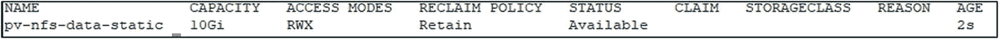
图 6-6：`kubectl get pv` 的输出

接下来，使用清单 6-3 (pvc.yaml) 中的代码创建持久卷声明，然后执行 `kubectl get pvc`（`pvc` 是持久卷声明的别名/缩写）来获取其状态。在图 6-7 中，您可以看到持久卷声明的名称，其状态为 `Bound`，而 `Volume` 字段显示了它绑定到的持久卷 `pv-nfs-data-static`。这正是我们之前刚刚静态配置的持久卷 `pv-nfs-data-static`。该声明的容量为 `10GB`，访问模式为 `ReadWriteMany(RWX)`，并且它不属于任何存储类。


图 6-7：`kubectl get pvc` 的输出。持久卷声明已绑定到 `pv-nfs-data-static`

当我们创建持久卷声明 `pvc-nfs-data-static` 时，集群中的一个控制器开始根据容量和访问模式寻找合适的持久卷来满足该声明。集群找到了 `pv-nfs-data-static`，然后两者被绑定在一起。在图 6-8 中，我们再次执行 `kubectl get pv`。持久卷 `pv-nfs-data-static` 的状态现在是 `Bound`，并且 `Claim` 字段显示为 `default/pvc-nfs-data-static`。`Default` 是该持久卷声明所在的命名空间的名称。

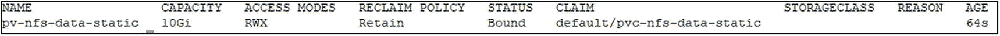
图 6-8：持久卷和持久卷声明绑定后 `kubectl get pv` 的输出


#### 使用持久化存储部署应用

通过静态配置创建存储资源后，就可以在应用程序中使用这些存储了。清单 6-4 展示了一个使用存储的应用程序的部署清单。在 Pod 模板规范中，名为 `webcontent` 的卷类型是 `persistentVolumeClaim`。其 claimName 是 `pvc-nfs-data-static`。这正是刚刚创建的持久卷声明对象。因此，这个 Pod 将尝试访问该持久卷声明。卷是 Pod 级别的资源，可以在 Pod 内运行的任何容器之间共享。该卷通过 `containers` 字段映射到容器。`volumeMounts` 字段指定了卷在容器文件系统内的挂载位置——在此示例中为 `/usr/share/nginx/html/web-app`。因此，容器内部的应用程序访问该路径，但数据实际存储在持久卷上，该持久卷位于实验室的 NFS 服务器上，路径为 `/srv/exports/volumes/webcontent`。这是 nginx 的默认内容目录。所以，当应用程序可用时，该目录中的内容即可通过 HTTP 访问。

```yaml
apiVersion: apps/v1
kind: Deployment
metadata:
  name: nginx-nfs-deployment
spec:
  replicas: 1
  selector:
    matchLabels:
      app: nginx
  template:
    metadata:
      labels:
        app: nginx
    spec:
      volumes:
        - name: webcontent
          persistentVolumeClaim:
            claimName: pvc-nfs-data-static
      containers:
        - name: nginx
          image: nginx
          ports:
            - containerPort: 80
          volumeMounts:
            - name: webcontent
              mountPath: "/usr/share/nginx/html/web-app"

---
apiVersion: v1
kind: Service
metadata:
  name: nginx-nfs-service
spec:
  selector:
    app: nginx
  ports:
    - port: 80
      protocol: TCP
      targetPort: 80
```
清单 6-4
一个使用持久化存储的部署（deployment-static.yaml）

在图 6-9 中，您可以看到我们的 Web 应用程序正在访问 NFS 服务器上的 `index.html` 内容。

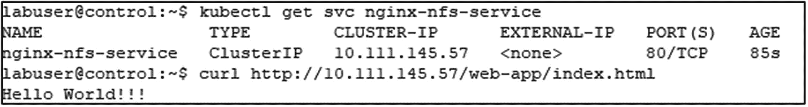
图 6-9
获取 Service 的 IP 地址，并使用 `curl` 访问应用程序。返回的文档来自 NFS 服务器。

在图 6-10 中，您可以看到我们打开了一个到部署中某个 Pod 的 bash shell，列出了 `/usr/share/nginx/html/web-app/` 目录的内容，来自 NFS 服务器的内容在该目录中可用。

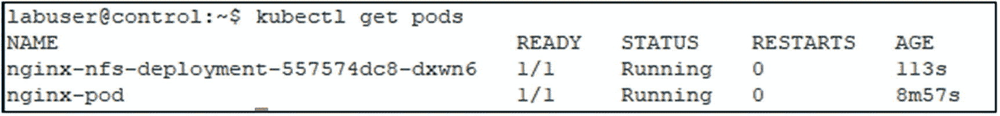
图 6-10
Pod 内部已挂载卷的目录列表

最后，在图 6-11 中，您可以在存储服务器上看到，在 NFS 导出目录中，这是通过持久卷暴露给 Pod 并挂载到容器中供 nginx 访问的导出目录。


图 6-11
存储在 NFS 服务器上的内容的目录列表

在本节中，我们使用静态配置为 Web 应用程序部署创建了存储——创建了持久卷和持久卷声明，然后将该持久卷声明作为卷附加到 Pod 内部。

### 存储类和动态配置

静态配置是集群管理员手动定义和创建每个持久卷的方式，正如我们在上一节中所探讨的。动态配置则是在创建持久卷声明资源时，按需创建持久卷资源。这样做是有利的，因为它减轻了集群管理员为用户请求手动配置存储的负担。为了支持动态配置，集群管理员需要创建一个 `Storage Class`。让我们详细了解一下 Kubernetes 中动态配置的工作原理。

#### 存储类

要启用动态配置，集群管理员需要创建一个 `Storage Class`。`Storage Class` 是一个 API 对象，用于描述集群中可供分配的存储类别。`Storage Class` 允许您定义这些存储层级及其配置。然后，您可以动态分配持久卷来访问该存储，并将其附加到集群中的 Pod。对存储进行分组的常见方式包括底层存储基础设施的性能属性，例如 Tier 1 固态硬盘或 Tier 2 硬盘驱动器，或在云环境中的 Premium 或 Standard 存储类型。

`Storage Class` 使用一个配置器（有时称为卷插件），这是部署在集群中的软件，与底层存储基础设施进行交互，在创建持久卷声明时创建存储对象，并将该存储作为持久卷呈现回集群。特定于基础设施的配置参数在 `Storage Class` 中定义，并用作从该 `Storage Class` 动态分配的持久卷的模板。在定义 `Storage Class` 时，您可以配置一个默认的 `Storage Class`。默认 `Storage Class` 是当持久卷声明在其清单中未指定 `Storage Class` 时所使用的那个。

注意
有关 Kubernetes 中可用于许多不同类型存储的 `Storage Class` 配置示例，请查看 [`kubernetes.io/docs/concepts/storage/storage-classes/`](https://kubernetes.io/docs/concepts/storage/storage-classes/)。

#### 动态配置

在集群中定义了 `Storage Class` 后，当您创建一个持久卷声明时，该 `Storage Class` 的卷插件会动态创建一个持久卷。动态配置可用于多种不同的物理和云存储，例如 Azure Disk、Azure Files、AWS Elastic Block Storage、Fiber Channel、GCE Persistent Disk、iSCSI 和 vSphere VMDK。有关支持动态配置的存储类型的完整列表，请访问 [`kubernetes.io/docs/concepts/storage/storage-classes/`](https://kubernetes.io/docs/concepts/storage/storage-classes/)。

### 回收策略

当应用程序使用完持久卷（Persistent Volume）且消耗对象（如 Pod 或 Deployment）被删除时，可以删除持久卷声明（Persistent Volume Claim）。回收策略（Reclaim Policy）告诉集群在删除持久卷声明后应对持久卷做什么。当前支持的选项是 `Retain` 和 `Delete`。回收策略适用于静态和动态配置的持久卷：

*   `Retain`：在删除持久卷声明时，保留持久卷及其底层存储。
*   `Delete`：在删除持久卷声明时，删除持久卷及其底层存储。

回收策略保护的是持久卷对象的复用，而不是底层存储。如果在删除持久卷声明对象时使用 `Retain` 回收策略，持久卷对象将不会被删除。持久卷的状态将变为 `Released`。如果你想复用持久卷中存储的数据，则需要集群管理员手动回收底层存储。你需要删除持久卷对象，同时保持底层存储元素完好无损。然后，你将重新配置一个持久卷指向该设备。这完全是一个新的持久卷，只是复用了底层存储。如果你不打算复用存储，则集群管理员需要删除底层存储。

对于支持动态配置的系统和存储类型，通常使用 `Delete` 回收策略。`Delete` 回收策略会在删除持久卷声明时删除持久卷及其底层存储。这要求底层存储使用支持动态配置的卷插件（Volume Plugin）。存储类（Storage Classes）通常使用 `Delete` 回收策略，给人一种回收/动态分配给集群的物理存储的感觉。在使用 Azure/GKE/EKS 等云平台的虚拟磁盘时，你会最常见到这种情况。随着存储子系统开始支持动态配置，这类功能在本地部署环境中也变得越来越普遍。请咨询你的存储管理员和供应商，了解你的存储系统是否支持动态配置。

### 使用动态配置来创建持久卷和持久卷声明

在本节中，我们将介绍如何在 Kubernetes 应用程序部署中使用动态配置进行存储。我们将介绍两种场景：用于本地实验室场景的基于 NFS 的场景和用于云场景的基于 Azure 磁盘的场景。

#### 使用 NFS 动态配置磁盘

在本书的实验室环境中，我们选择使用 NFS，因为它简单且易于访问……NFS 易于配置且广泛可用。对于本地生产场景，请考虑为企业级存储集群和应用数据使用企业级存储。

我们在上一节刚刚探讨了 NFS 的静态配置。让我们深入探讨如何在实验室集群中为 NFS 配置动态配置。此配置支持本书后面即将进行的演示。我们还想指出，这里重点介绍的动态配置概念与其他动态配置器类似。

我们将从清单 6-5 中的代码开始，为 NFS 动态配置器配置安全设置。

```
kind: ServiceAccount
apiVersion: v1
metadata:
name: nfs-client-provisioner

kind: ClusterRole
apiVersion: rbac.authorization.k8s.io/v1
metadata:
name: nfs-client-provisioner-runner
rules:
- apiGroups: [""]
resources: ["persistentvolumes"]
verbs: ["get", "list", "watch", "create", "delete"]
- apiGroups: [""]
resources: ["persistentvolumeclaims"]
verbs: ["get", "list", "watch", "update"]
- apiGroups: ["storage.k8s.io"]
resources: ["storageclasses"]
verbs: ["get", "list", "watch"]
- apiGroups: [""]
resources: ["events"]
verbs: ["create", "update", "patch"]

kind: ClusterRoleBinding
apiVersion: rbac.authorization.k8s.io/v1
metadata:
name: run-nfs-client-provisioner
subjects:
- kind: ServiceAccount
name: nfs-client-provisioner
namespace: default
roleRef:
kind: ClusterRole
name: nfs-client-provisioner-runner
apiGroup: rbac.authorization.k8s.io

kind: Role
apiVersion: rbac.authorization.k8s.io/v1
metadata:
name: leader-locking-nfs-client-provisioner
rules:
- apiGroups: [""]
resources: ["endpoints"]
verbs: ["get", "list", "watch", "create", "update", "patch"]

kind: RoleBinding
apiVersion: rbac.authorization.k8s.io/v1
metadata:
name: leader-locking-nfs-client-provisioner
subjects:
- kind: ServiceAccount
name: nfs-client-provisioner
namespace: default
roleRef:
kind: Role
name: leader-locking-nfs-client-provisioner
apiGroup: rbac.authorization.k8s.io
```
清单 6-5
`nfs-rbac.yaml`

接下来，我们将定义存储类本身（清单 6-6）。

```
apiVersion: storage.k8s.io/v1
kind: StorageClass
metadata:
name: nfs-storage
provisioner: example.com/nfs
parameters:
archiveOnDelete: "false"
```
清单 6-6
`nfs-storageclass.yaml`

这个特定的存储类还需要在 Kubernetes API 服务器中进行设置。因此，我们需要更新 API 服务器的配置以支持此设置。使用特权访问权限打开控制平面上的文件 `/etc/kubernetes/manifests/kube-apiserver.yaml`，并找到清单 6-7 中的部分。

```
spec:
containers:
- command:
- kube-apiserver
```
清单 6-7
`kube-apiserver.yaml` 中的 API 服务器部分

在此部分中，添加如清单 6-8 所示的一行。

```
- --feature-gates=RemoveSelfLink=false
```
清单 6-8
`kube-apiserver.yaml` 中的新行

对文件所做的更改将由 kubelet 自动读取并应用于 API 服务器。在应用更改和 API 服务器 Pod 重建期间，你可能会暂时失去对 API 服务器的访问权限。

> 注意
>
> 目录 `/etc/kubernetes/manifests/` 包含集群控制平面的静态 Pod 清单。此目录中的每个清单都定义了控制平面 Pod 的配置。

我们进行动态配置的最后一步是一个客户端配置器，负责在 Pod 动态请求时创建卷（清单 6-9）。


#### NFS 动态配置

```
kind: Deployment
apiVersion: apps/v1
metadata:
  name: nfs-client-provisioner
spec:
  selector:
    matchLabels:
      app: nfs-client-provisioner
  replicas: 1
  strategy:
    type: Recreate
  template:
    metadata:
      labels:
        app: nfs-client-provisioner
    spec:
      serviceAccountName: nfs-client-provisioner
      containers:
      - name: nfs-client-provisioner
        image: quay.io/external_storage/nfs-client-provisioner:latest
        volumeMounts:
        - name: nfs-client-root
          mountPath: /persistentvolumes
        env:
        - name: PROVISIONER_NAME
          value: example.com/nfs
        - name: NFS_SERVER
          value: 172.16.94.5
        - name: NFS_PATH
          value: /srv/exports/volumes
      volumes:
      - name: nfs-client-root
        nfs:
          server: 172.16.94.5
          path: /srv/exports/volumes
```

清单 6-9: `nfs-provisioner.yaml`

配置好 NFS 动态配置后，让我们创建一个应用程序来使用 NFS 动态配置存储持久数据。在清单 6-10 中，我们重构了 `nginx` 部署以使用动态配置。清单的第一部分是定义名为 `pvc-nfs-data-dynamic` 的 `PersistentVolumeClaim`。在该对象中，您可以在 `storageClassName` 字段中看到它引用了清单 6-6 创建的 `StorageClass`，即 `nfs-storage`。`Volume` 仍然是 `persistentVolumeClaim` 类型，并引用名为 `pvc-nfs-data-dynamic` 的 `PersistentVolumeClaim`。当此清单被发送到 API Server 时，首先创建 `PersistentVolumeClaim`，然后创建 `Deployment`。NFS 动态配置器随后会创建一个 `PersistentVolume`，该卷会绑定到 `PersistentVolumeClaim`，然后 Pod 启动并将卷挂载到容器中。我们无需直接创建 `PersistentVolume` 对象。

```
apiVersion: v1
kind: PersistentVolumeClaim
metadata:
  name: pvc-nfs-data-dynamic
spec:
  accessModes:
  - ReadWriteOnce
  storageClassName: nfs-storage
  resources:
    requests:
      storage: 10Gi
---
apiVersion: apps/v1
kind: Deployment
metadata:
  name: nginx-nfs-deployment-dynamic
spec:
  replicas: 1
  selector:
    matchLabels:
      app: nginx
  template:
    metadata:
      labels:
        app: nginx
    spec:
      containers:
      - name: nginx
        image: nginx
        ports:
        - containerPort: 80
        volumeMounts:
        - name: webcontent
          mountPath: "/usr/share/nginx/html/web-app"
      volumes:
      - name: webcontent
        persistentVolumeClaim:
          claimName: pvc-nfs-data-dynamic
---
apiVersion: v1
kind: Service
metadata:
  name: nginx-nfs-service-dynamic
spec:
  selector:
    app: nginx
  ports:
  - port: 80
    protocol: TCP
    targetPort: 80
```

清单 6-10: 使用动态配置的 Deployment (`deployment-dynamic.yaml`)

清单发送到 API Server 后，`PersistentVolumeClaim` 被创建。NFS 动态配置器（Volume Plugin）会创建底层的 `PersistentVolume`。请注意，`StorageClass` 是 `nfs-storage`，这是在此场景中用于动态配置的存储类。

图 6-12 显示了 `PersistentVolumeClaims`。

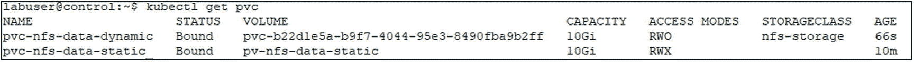
*图 6-12: 集群中当前的持久卷声明*

图 6-13 显示了 `PersistentVolumes`。

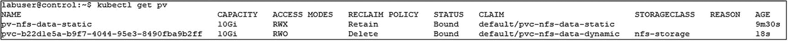
*图 6-13: 集群中当前的持久卷*

#### 在 Azure 中动态配置磁盘

让我们再看一个动态配置场景，这次是在 Azure 中。这里的概念适用于任何主要的云提供商。当您需要在云中使用动态配置从集群获取存储时，首先要做的是查看有哪些 `StorageClass` 已经可用。大多数云提供商都会将其常用的存储子系统预配置为 `StorageClass`，供您动态配置存储。

**提示**
请务必将集群上下文切换到第 4 章创建的 Azure Kubernetes Service 集群 (`kubectl config use-context AKSCluster`)。

在图 6-14 中是 `kubectl get storageclass` 在 Azure Kubernetes Service 集群中的输出。有五种可用于动态配置的存储变体，每种都有不同的用例、性能配置和配置方式。要从其中一个存储类动态配置存储，您需要根据所需存储类型，从对应的 `StorageClass` 创建 `PersistentVolumeClaim`。

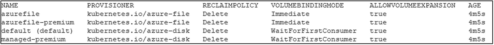
*图 6-14: Azure Kubernetes Service 集群中可用的存储类*

在清单 6-11 中，创建了两种资源：一个 `PersistentVolumeClaim` 和一个 `Deployment`。`PersistentVolumeClaim` 定义了我们希望为此应用程序动态分配的存储类型。因此，与之前一样，我们定义了一个访问模式和大小。在这个 `PersistentVolumeClaim` 中，我们还指定了 `storageClassName` 为 `managed-premium`。当此 `PersistentVolumeClaim` 被创建时，`PersistentVolume` 将从该存储类中动态分配。

```
apiVersion: v1
kind: PersistentVolumeClaim
metadata:
  name: pvc-azure-data-dynamic
spec:
  accessModes:
  - ReadWriteOnce
  storageClassName: managed-premium
  resources:
    requests:
      storage: 10Gi
---
apiVersion: apps/v1
kind: Deployment
metadata:
  name: nginx-azure-deployment-dynamic
spec:
  replicas: 1
  selector:
    matchLabels:
      app: nginx
  template:
    metadata:
      labels:
        app: nginx
    spec:
      containers:
      - name: nginx
        image: nginx
        ports:
        - containerPort: 80
        volumeMounts:
        - name: webcontent
          mountPath: "/usr/share/nginx/html/web-app"
      volumes:
      - name: webcontent
        persistentVolumeClaim:
          claimName: pvc-azure-data-dynamic
---
apiVersion: v1
kind: Service
metadata:
  name: nginx-azure-service-dynamic
spec:
  selector:
    app: nginx
  ports:
  - port: 80
    protocol: TCP
    targetPort: 80
  type: LoadBalancer
```

清单 6-11: 使用 `PersistentVolumeClaim` 和 Azure 存储动态配置的部署 (`deployment-dynamic-azure.yaml`)

创建清单 6-11 中的资源后，您将拥有一个用于访问应用程序的 `PersistentVolume`、`PersistentVolumeClaim`、`Deployment` 和 `Service`。`PersistentVolumeClaim` 将向集群请求从 `StorageClass` `managed-premium` 获取一个 `PersistentVolume`，底层的 `PersistentVolume` 会被动态配置。

在图 6-15 中，`PersistentVolumeClaim` `pvc-azure-data-dynamic` 绑定到了一个动态生成的、名称以 "`pvc-`" 为前缀的 `PersistentVolume`。

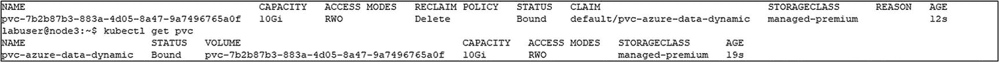
*图 6-15: 动态配置的持久卷及其持久卷声明*

**注意**
请务必将集群上下文切换回您的实验集群：`kubectl config use-context kubernetes-admin@kubernetes`。

### 总结

在本章中，我们介绍了基于容器的应用程序中对数据持久性的需求，以及容器在 `Volumes` 中持久化数据的内部原理。然后我们将该模型扩展到 Kubernetes 集群中，学习了如何使用 `PersistentVolumes` 和 `PersistentVolumeClaims` 为部署在 Kubernetes 中的基于容器的应用程序提供存储。我们还研究了在我们的实验环境（使用 NFS）和云环境（使用 Azure Kubernetes Service）中的动态配置场景。

