# 第三部分：Kubernetes 中的 SQL Server


## 7. 在 Kubernetes 上部署 SQL Server

在本章中，我们将把所有知识融会贯通，学习如何在 Kubernetes 上运行 SQL Server。我们将探讨在 Pod 中运行 SQL Server 的独特之处，以及如何配置和管理数据库状态。我们还将了解如何利用 Deployment 来升级 SQL Server。本章最后将讨论在生产环境中运行 SQL Server on Kubernetes 所需考虑的事项，例如性能考量、资源管理和备份。

### 在 Pod 中运行 SQL Server

在 Kubernetes 上运行 SQL Server 实际上是将我们迄今为止学到的所有知识整合在一起。我们将定义一个或多个持久卷声明（Persistent Volume Claim）来存储 SQL Server 的数据。我们将部署一个运行 SQL Server 的 Pod，并将 PVC 附加到该 Pod，以克服 Kubernetes 中数据与计算分离的特性。最后，我们将通过一个 Service（服务）暴露此 Pod，使其能被其他应用程序访问，如图 7-1 所示。

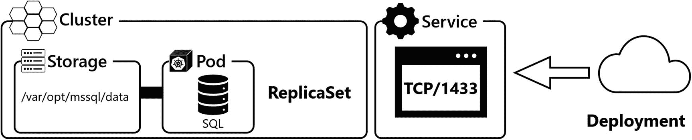

图 7-1
SQL Server Pod 的 Kubernetes 组件

每当我们的 SQL Server Pod 被替换（无论是被删除还是被销毁），它都会回到容器镜像的初始状态。这也意味着，如果您没有定义任何持久化存储，所有的更改和数据都将丢失。因此，Pod 需要三个基本设置：

*   `ACCEPT_EULA`：用于您接受最终用户许可协议，将设置为环境变量，是 Pod 启动所必需的。
*   `MSSQL_SA_PASSWORD`：我们 SQL 实例的 sa 密码，我们将把它存储在集群的 Secret 中，它会被哈希处理但不会加密。
*   `Storage`：定义要使用哪个 PVC。

Kubernetes 将启动容器，存储被附加到节点，然后容器启动，映射的存储将被挂载到容器内部。这样，SQL Server 写入的所有数据都将有效地写入持久卷。应用关键设置（EULA 和 sa 密码）后，SQL Server 将检查默认数据目录`/var/opt/mssql/data`中是否存在系统数据库。如果没有系统数据库，SQL Server 会将一组新的系统数据库复制到此目录中。如果默认数据目录中已经存在一组系统数据库，它将从该目录中使系统数据库联机，然后是为此实例配置的用户数据库。

无论 Pod 是被重新创建，是因为我们主动触发（例如应用升级）还是因为控制平面将 Pod 迁移到另一个节点，这个过程每次都会重复。通过这种方法，您能够将 SQL Server 中存储的数据的持久性与 Pod 的生命周期解耦。当部署 Pod 时，存储被挂载，容器启动并看到它有一个 master 数据库，然后 SQL Server 使配置的用户数据库联机。

### 在 Kubernetes 上部署 SQL Server

在开始实际部署之前，首先需要完成一些准备工作。

#### 准备工作

在触发部署之前，两个关键的考虑和准备步骤是提供 sa 密码的 Secret 以及存储 SQL Server 数据的 PVC。虽然尤其是在生产环境中需要考虑更多事项（我们将在本章后面讨论），但它们构成了最低要求。

简而言之，我们的步骤是：

1.  创建一个 Secret。
2.  创建存储（PV/PVC）。
3.  创建 SQL Server Deployment。

##### 存储

我们将把第一个 SQL Server 部署到 kubeadm 集群，因此选择了 NFS 作为我们的存储平台，这将允许我们在节点之间移动 Pod，而不会丢失对先前生成的数据的访问权限。如第 1 章所述，这非常适合我们的实验室环境，但不推荐用于高性能生产系统。

为此，我们在存储服务器上创建一个名为`/srv/exports/volumes/sql-instance-1`的目录。

将清单 7-1 的内容保存到一个名为`sql-storage.yaml`的文件中。这可以从任何连接到集群的客户端执行，包括您的管理工作站。

```yaml
apiVersion: v1
kind: PersistentVolume
metadata:
  name: pv-nfs-sql-instance-1
  labels:
    disk: system
spec:
  capacity:
    storage: 10Gi
  accessModes:
    - ReadWriteOnce
  persistentVolumeReclaimPolicy: Retain
  nfs:
    server: storage
    path: "/srv/exports/volumes/sql-instance-1"

apiVersion: v1
kind: PersistentVolumeClaim
metadata:
  name: pvc-nfs-sql-instance-1
spec:
  selector:
    matchLabels:
      disk: system
  accessModes:
    - ReadWriteOnce
  resources:
    requests:
      storage: 10Gi
```
清单 7-1
`sql-storage.yaml`

该文件包含一个持久卷和一个持久卷声明的定义。

让我们使用清单 7-2 中的代码将此清单应用到我们的 Kubernetes 集群。

```bash
kubectl apply -f sql-storage.yaml
```
清单 7-2
将`sql-storage.yaml`应用到 Kubernetes 集群

我们可以使用`kubectl`验证两者是否已创建（见清单 7-3）。

```bash
kubectl get pv
kubectl get pvc
```
清单 7-3
验证先前创建的 PV 和 PVC

如图 7-2 所示，两者都可在输出中看到。

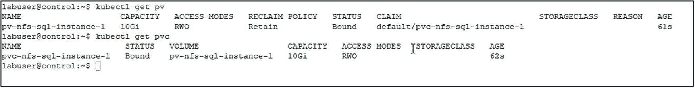

图 7-2
`kubectl get node -o wide`的输出

持久卷声明已绑定到我们的持久卷。我们的存储现已为 SQL Server 准备就绪。

##### Secret

如前所述，我们将在集群中存储一个包含 SQL Server 要使用的 sa 密码的 Secret。此 Secret 将存储在我们的集群中，可以由我们的 SQL Server Deployment 引用，因此 SQL Server 可以访问和使用它。这样做还有一个好处是，Secret 不会出现在 Deployment 清单中，因此可以轻松共享而不泄露机密信息（如我们的密码）。这可以通过声明式或命令式方式完成，但通常 Secret 来源于安全的 Secret 存储，例如 Azure Key Vault。

创建此 Secret 最简单的方法是通过`kubectl`命令，如清单 7-4 所示。

```bash
kubectl create secret generic mssql --from-literal=SA_PASSWORD=S0methingS@Str0ng!
```
清单 7-4
使用`kubectl`创建 Kubernetes Secret

我们现在已准备好将 SQL Server 部署到 Kubernetes 上。


#### 在 YAML 中定义 SQL Server 部署

对于我们的 SQL Server 部署，我们将创建另一个清单文件，命名为`sql-deployment.yaml`。你可以在代码清单 7-5 中找到其内容。

我们想特别指出三点：

-   **策略类型 – Recreate（重建）：** 默认情况下，例如在应用升级时，Kubernetes 会执行滚动更新过程，这意味着它会启动一个新的 Pod，并在旧 Pod 仍在运行时尝试访问数据库文件。通过将其设置为`Recreate`，在创建新的 ReplicaSet 和 Pod 之前，当前 ReplicaSet 中的所有 Pod 都将被关闭。
    SQL Server 可以处理这种情况，因为它对文件具有独占锁。但这同时也意味着，容器会不断创建和重启，直到它能获得文件的独占锁为止。

-   **`securityContext`（安全上下文）：** 我们的`fsGroup`是`10001`，这意味着对 NFS 的所有访问也将使用此组身份执行。如果你在第一章中没有设置权限和/或创建该组，此操作将失败。

-   **Hostname（主机名）：** 我们没有定义主机名，因此我们的 SQL Server 将根据其 Pod 名称动态命名。我们将在本章后面说明如何调整此设置。

```yaml
apiVersion: apps/v1
kind: Deployment
metadata:
  name: mssql-deployment
spec:
  replicas: 1
  strategy:
    type: Recreate
  selector:
    matchLabels:
      app: mssql
  template:
    metadata:
      labels:
        app: mssql
    spec:
      securityContext:
        fsGroup: 10001
      containers:
      - name: mssql
        image: 'mcr.microsoft.com/mssql/server:2019-CU8-ubuntu-18.04'
        ports:
        - containerPort: 1433
        env:
        - name: ACCEPT_EULA
          value: "Y"
        - name: SA_PASSWORD
          valueFrom:
            secretKeyRef:
              name: mssql
              key: SA_PASSWORD
        volumeMounts:
        - name: mssqldb
          mountPath: /var/opt/mssql
      volumes:
      - name: mssqldb
        persistentVolumeClaim:
          claimName: pvc-nfs-sql-instance-1

apiVersion: v1
kind: Service
metadata:
  name: mssql-deployment
spec:
  selector:
    app: mssql
  ports:
  - protocol: TCP
    port: 31433
    targetPort: 1433
  type: NodePort
```
*代码清单 7-5 `sql-deployment.yaml`*

除了我们已经提到的设置外，此清单中最重要的设置如下：

-   **镜像：** 通过此文件，我们将部署一个 SQL Server 2019 CU8。

-   **卷：** 我们只挂载了一个 PVC，它与我们在上一步创建的那个相匹配。我们将一个持久卷放置在`/var/opt/mssql`，任何写入该目录的内容都将被写入持久卷，这是将数据持久性与 Pod 生命周期解耦的关键。

-   **服务：** 我们不仅部署了一个 SQL Server Pod，还部署了一个用于暴露此 Pod 的服务。该服务的类型是`NodePort`，因此我们需要先通过`kubectl`获取 TCP 端口，才能访问此实例。

要部署我们的 Pod 和服务，我们需要再次应用此清单，如代码清单 7-6 所示。

```bash
kubectl apply -f sql-deployment.yaml
```
*代码清单 7-6 将 `sql-deployment.yaml` 应用到 Kubernetes 集群*

完成此步骤后，我们可以使用`kubectl`和代码清单 7-7 中的命令来检索部署状态。

```bash
kubectl get deployment
```
*代码清单 7-7 检查部署状态*

如图 7-3 所示（显示为`0/1`），部署通常需要几分钟才能准备就绪。你可能需要多次重新运行此命令（或使用`--watch`参数）直到它完成。请记住，除非你预先拉取了镜像，否则首次部署还包括下载 SQL Server 镜像，根据你的网络连接情况，这将需要更长时间。

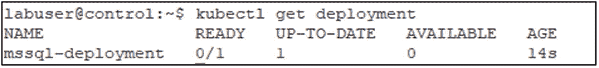
*图 7-3 `kubectl get deployment`的输出*

一旦此过程完成，我们也可以通过`kubectl`检查 Pod 的创建情况以及外部 TCP 端口，如代码清单 7-8 所示。

```bash
kubectl get pods
kubectl get service
```
*代码清单 7-8 检查 Pod 和服务状态*

如输出（图 7-4）所示，Pod 获得了一个唯一且随机的名称，每次重新创建时该名称都会改变。在我们的示例中，`NodePort`是`32651`。我们后续的查询需要此端口。

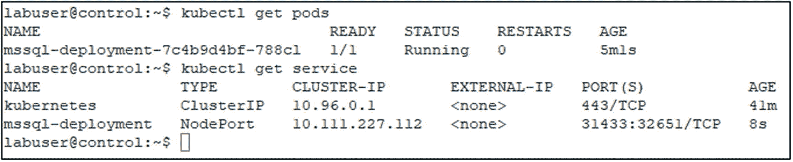
*图 7-4 `kubectl get pods/service`的输出*

现在我们的 SQL Server 已就绪，并且已获取连接参数，我们可以如代码清单 7-9 所示使用`sqlcmd`对我们的实例运行第一个查询。

```bash
sqlcmd -S control, -U sa -P  -Q "SELECT @@SERVERNAME,@@VERSION"
```
*代码清单 7-9 `sqlcmd` 查询服务器名称和版本*

> **注意**
> 对于本章中所有的`sqlcmd`查询，建议设置一个包含密码的环境变量，以便在查询中使用。这同样适用于你实例的端口。此外，如果你更喜欢其他客户端，请随意根据需要修改这些参数。同时，如果你是从控制平面运行此命令，请确保`sqlcmd`的位置包含在你的`PATH`环境变量中。

如果你查看输出（图 7-5），你会注意到服务器名称与我们的 Pod 名称匹配，版本与我们在清单中定义的一致。

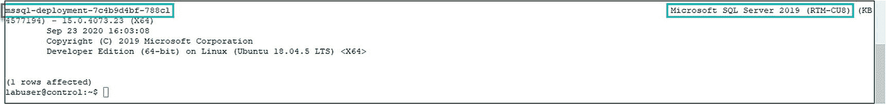
*图 7-5 “SELECT @@SERVERNAME,@@VERSION”的输出*

接下来，让我们使用代码清单 7-10 中的命令创建一个名为`TestDB1`的用户数据库。

```bash
sqlcmd -S control, -U sa -P  -Q "CREATE DATABASE TestDB1"
```
*代码清单 7-10 `sqlcmd` 命令创建新的用户数据库*

如果我们现在使用代码清单 7-11 中的命令列出 NFS 共享的目录内容，我们将看到此数据库的`mdf`和`ldf`文件。

> **注意**
> 请在`storage`服务器上运行此命令。

```bash
ls -al /srv/exports/volumes/sql-instance-1/*
```
*代码清单 7-11 列出 NFS 共享的目录内容*

你可以从上一个命令的输出中看到图 7-6。

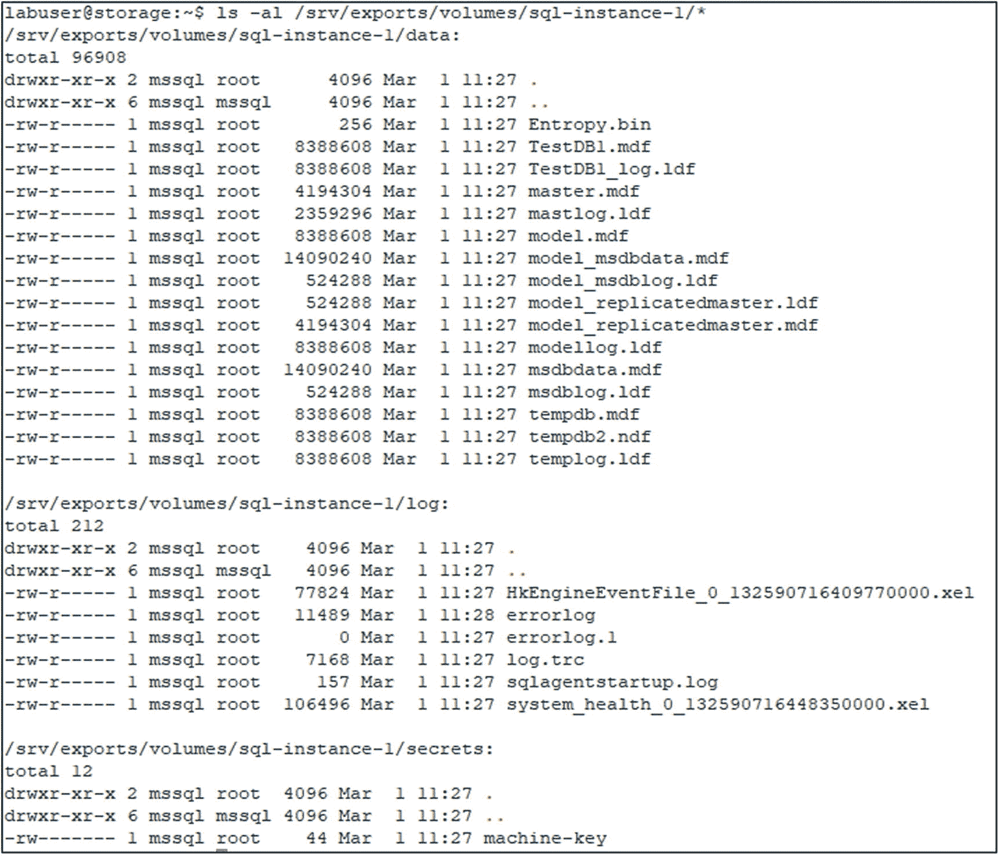
*图 7-6 NFS 共享的内容*

至此，我们的第一个 SQL Server 用户数据库已在线运行在 Kubernetes 集群中。


#### 额外配置选项

虽然上述环境变量仅构成了最基本的一组，但还有更多可以配置的选项，它们都可以像 `ACCEPT_EULA` 设置一样包含在你的 YAML 清单文件中。其中最重要的两个可能是：

*   `MSSQL_AGENT_ENABLED`：默认值为 false。将其设置为 true 可为此实例启用 SQL 代理服务。
*   `MSSQL_PID Evaluation`：此设置允许你在 `Developer`、`Express`、`Web`、`Standard` 和 `Enterprise` 版本之间进行选择。或者，你也可以提供一个产品密钥。

你可以在官方文档中找到关于排序规则和语言 ID 等额外配置选项的完整参考：[*https://docs.microsoft.com/en-us/sql/linux/sql-server-linux-configure-environment-variables?view=sql-server-ver15&viewFallbackFrom=sql-server-2019*](https://docs.microsoft.com/en-us/sql/linux/sql-server-linux-configure-environment-variables%253Fview%253Dsql-server-ver15%2526viewFallbackFrom%253Dsql-server-2019)。

如果你更希望使用持久的服务器名称而不是动态的 Pod 名称，可以在你的部署清单中指定它，如清单 7-12 所示（最后两行是为了将服务器名称更改为 `sql01` 而添加的）。

```
spec:
  securityContext:
    fsGroup: 10001
  hostname:
    sql01
清单 7-12
定义静态主机名
```

要了解更多关于持久服务器名称的信息，我们推荐这篇博客文章：[*www.centinosystems.com/blog/sql/persistent-servername-when-deploying-sql-server-in-kubernetes/*](https://www.centinosystems.com/blog/sql/persistent-servername-when-deploying-sql-server-in-kubernetes/)。

**注意**
虽然手动设置主机名是可选的，但像复制这样的功能以及许多第三方工具都依赖于它。因此，我们强烈建议在生产环境中进行此设置。

#### Pod 生命周期与数据持久性

虽然你通常不会手动触发此过程，但我们之前已经详细阐述过，Kubernetes 将计算和存储分离。Pod 是短暂的，而存储（大部分）是持久的。

让我们使用 `kubectl` 检索当前 Pod 的名称（清单 7-13）。

```
kubectl get pods
清单 7-13
获取 Pod 名称
```

如图 7-7 所示，我们当前的 Pod 是 `mssql-deployment-748c745b8d-w2sf8`。

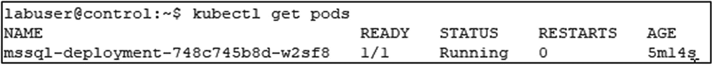
图 7-7
当前 Pod 名称

现在，我们将使用 `kubectl` 删除这个 Pod（清单 7-14）。

```
kubectl delete pod mssql-deployment-748c745b8d-w2sf8
清单 7-14
删除 Pod
```

`Kubectl` 将确认 Pod 已被删除，这需要几秒钟时间（见图 7-8）。

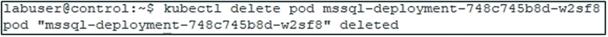
图 7-8
`kubectl delete pod` 的输出

如果我们再次检索我们的 Pod，你将看到（图 7-9）一个新的、具有新名称的 Pod 已被立即创建。

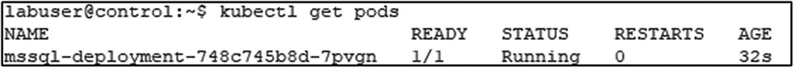
图 7-9
`kubectl get pods` 的输出

使用 `sqlcmd` 列出此实例中的所有数据库，如清单 7-15 所示。

```
sqlcmd -S control, -U sa -P  -Q "SELECT Name FROM sys.databases"
清单 7-15
列出我们实例中的数据库
```

你将看到（图 7-10）我们的数据库 `TestDB1` 仍然存在，因为存储已重新挂载到新的 Pod 上。


图 7-10
SQL 实例中的数据库列表

#### 在部署中升级 SQL Server

在部署中升级现有的 SQL Server 与其初始部署一样简单。我们只需更新镜像，这可以通过修改 Pod 规范中清单的容器镜像并重新应用来完成，或者简单地通过 `kubectl` 设置新镜像。在清单 7-16 的示例中，我们将把我们的 `mssql` 容器镜像更新到 CU9。

```
kubectl set image deployment mssql-deployment mssql=mcr.microsoft.com/mssql/server:2019-CU9-ubuntu-18.04
清单 7-16
将镜像更新为 CU9
```

这里的关键是 Kubernetes 将在部署新 Pod 之前关闭当前 Pod（Kubernetes 默认是先添加一个新 Pod，然后移除旧的）。

如果我们使用 `kubectl` 来描述这个部署（清单 7-17），我们将看到旧的副本集被缩容，随后新的副本集被扩容。这再次是因为我们将策略设置为 `Recreate`（如前所述）。

```
kubectl describe deployment mssql-deployment
清单 7-17
描述部署
```

如图 7-11 所示，上述命令显示了扩容操作。

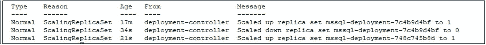
图 7-11
清单 7-17 的输出

这也导致了一个新的 Pod，我们可以通过 `kubectl` 再次检索其名称（图 7-12）。

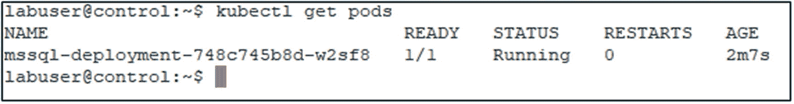
图 7-12
`kubectl get pods` 的输出

如果你在这个新的 Pod 上运行 `kubectl describe pod`，你可以看到在此更新命令期间及之后发生在此新 Pod 中的事件（图 7-13）。

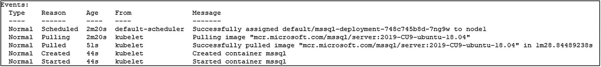
图 7-13
描述 Pod

运行清单 7-18 中的命令。

```
kubectl rollout history deployment mssql-deployment --revision=2
清单 7-18
检索部署第二个修订版的历史记录
```

如图 7-14 所示，这将向你显示该部署第二个修订版的详细信息。对此部署的任何后续更新都可以用同样的方式检索和跟踪。

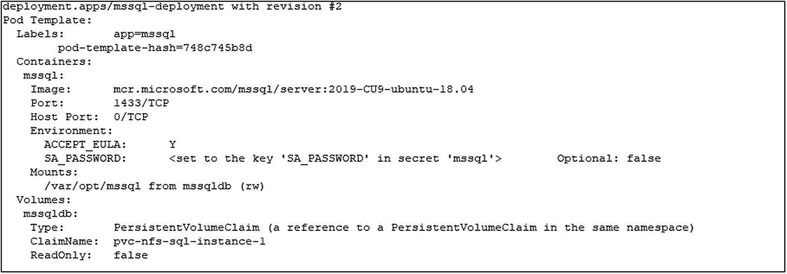
图 7-14
清单 7-18 的输出

如果我们再次通过 `sqlcmd` 检索服务器名称和版本（图 7-15），你会看到服务器名称与新 Pod 名称匹配，并且版本已更改为 CU9。

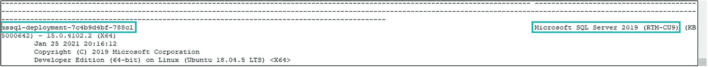
图 7-15
"`SELECT @@SERVERNAME,@@VERSION`" 的输出

我们也可以再次使用 `sqlcmd` 来验证我们的 `TestDB1` 是否仍然存在（图 7-16）。

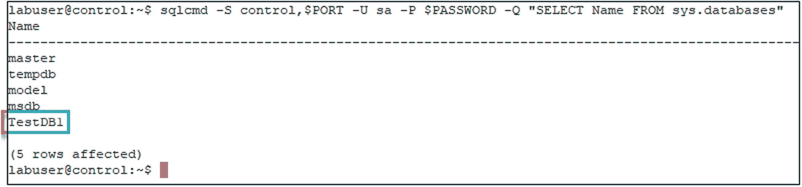
图 7-16
SQL 实例中的数据库列表

**注意**
正如我们刚刚升级了 SQL Server 一样，我们也可以使用相同的方法回滚 CU 升级。

#### 在生产环境中于 Kubernetes 上运行 SQL Server

就像在 Windows 上运行的传统 SQL Server 一样，在设计生产环境时需要考虑一系列因素。


## 高级磁盘拓扑

在生产环境中运行 SQL Server 时，存储始终是一个关键考量因素。在我们之前的示例中，我们将日志和数据部署到了同一个 NFS 驱动器上，其中混合了用户和系统数据库。

相反，你可以定义多个持久卷和持久卷声明，并将它们附加到你的 Pod 上，这等同于在 Windows 服务器上拥有多个驱动器。

你还可以使用以下三个环境变量来指定默认目录：

*   `MSSQL_DATA_DIR`
*   `MSSQL_LOG_DIR`
*   `MSSQL_BACKUP_DIR`

任何新的用户数据库都将在这些位置创建。

同样，所有 PVC 在启动时都会以其定义的位置挂载到容器中，而 master 数据库将使用户数据库联机。

## 资源管理（限制与请求）

虽然存储配置处理了我们的数据部分，但我们也需要考虑计算资源，这实际上意味着 CPU 和内存。在 Kubernetes 中，这是通过 `limits` 和 `requests` 来管理的，这些可以在 Pod 和命名空间级别上定义。

请求是保证分配的最小资源量。如果你为 Pod 定义的请求无法满足（例如，在 64GB 内存的机器上请求 128GB 内存），则该 Pod 将无法启动。

另一方面，限制定义了可分配给资源的最大值。默认情况下，不配置任何限制，这意味着默认情况下 Pod 可以（理论上）消耗无限量的内存和 CPU。

对于 SQL Server，服务器实例设置仍然适用，因此请确保设置它们来进行配置。

理想情况下，限制和请求应放入你的清单文件中（尽管理论上你可以通过 `kubectl` 命令式地设置它们）。它们将进入每个容器的一个名为 `resources` 的新部分，如代码清单 7-19 所示。

```
spec:
containers:
- name: mssql
resources:
requests:
cpu: 1
memory: 2Gi
limits:
cpu: 1
memory: 4Gi
代码清单 7-19
YAML 清单中的资源部分
```

此特定设置将为 SQL Server 恰好分配一个 CPU 核心、最少 2GB 内存（这是最低要求，依据 [*https://docs.microsoft.com/en-us/sql/linux/sql-server-linux-setup?view=sql-server-ver15#system*](https://docs.microsoft.com/en-us/sql/linux/sql-server-linux-setup%253Fview%253Dsql-server-ver15%2523system)），以及最多 4GB 内存。4GB 是容器将看到的其可用限制。由于 `SQLPAL` 的架构，Linux 上的 SQL Server 默认只会看到此值的 80%，这可以通过使用 `mssql-conf` 来调整。

**注意**

我们强烈建议始终在你的 SQL Server 实例内配置 `Max Server Memory`，以及 Kubernetes 的 CPU 和内存限制。

如果你想了解更多关于在 Kubernetes 上运行 SQL Server 的内存设置，我们强烈推荐阅读这篇博客文章：[*www.centinosystems.com/blog/sql/memory-settings-for-running-sql-server-in-kubernetes/*](https://www.centinosystems.com/blog/sql/memory-settings-for-running-sql-server-in-kubernetes/)。

## 备份（与还原）

当然，另一个重要问题是：我如何以及在哪里备份我的数据？第一部分非常简单：你可以使用你偏好的现有技术，可以是像维护计划这样简单的东西，也可以是像 dbatools ([*https://dbatools.io/*](https://dbatools.io/)) 或 Ola Hallengren 的框架 ([*https://ola.hallengren.com/sql-server-backup.html*](https://ola.hallengren.com/sql-server-backup.html)) 这样的外部工具。这些备份也可以使用 SQL Server Agent 进行调度。

更有趣的是“在哪里”这部分。实际上，你有两个选项：

*   `备份到 URL`：从 SQL Server 2016 开始，Microsoft 实现了直接备份到（并从）Azure Blob 存储的能力。确切的语法和要求可以在 [*https://docs.microsoft.com/en-us/sql/relational-databases/backup-restore/sql-server-backup-to-url?view=sql-server-ver15*](https://docs.microsoft.com/en-us/sql/relational-databases/backup-restore/sql-server-backup-to-url%253Fview%253Dsql-server-ver15) 找到。
*   **附加一个额外的持久卷。** 或者，你可以附加一个专门的额外卷，该卷可以是云原生的（如 Azure Disk 或 Azure Files），也可以是任何其他允许你将数据物理存储在不同位置的存储系统，如 NFS、iSCSI 或光纤通道。

同样的逻辑适用于还原。如果你想将现有的备份文件复制到你的 SQL 实例，可以使用 `kubectl` 来完成。重要的概念是该文件需要 SQL Server 进程可以访问。

此类复制任务的通用语法可在代码清单 7-20 中找到。

```
kubectl cp 本地文件 目标 Pod:目标文件 -c 容器名称
代码清单 7-20
将本地文件复制到容器的通用代码
```

在我们的具体案例中，要将本地文件 `AdventureWorks2017.bak` 复制到我们的 Pod `mssql-deployment-748c745b8d-7pvgn` 的数据目录，命令将如代码清单 7-21 所示。

```
kubectl cp AdventureWorks2017.bak mssql-deployment-748c745b8d-7pvgn:var/opt/mssql/data/AdventureWorks2017.bak -c mssql
代码清单 7-21
将本地文件复制到容器的代码
```

复制后，可以使用 `sqlcmd`、Azure Data Studio、SQL Server Management Studio 或任何其他客户端工具还原此文件。我们仅建议对较小的文件使用此方法，因为你必须将文件复制到容器内部，这会消耗空间并需要时间。

**注意**

Kubernetes 只是我们运行 SQL Server 的平台——它并不能替代原生 SQL 备份的需要！

### 总结

在本章中，我们涵盖了在 Kubernetes 的 Pod 中运行独立 SQL Server 实例的所有相关内容，从基本部署到升级，再到在生产环境中运行 SQL Server on Kubernetes 必要的考量因素。在下一章中，我们将探讨如何监控集群及其应用程序。

## 8. 监控 Kubernetes 上的 SQL Server

虽然我们可以使用 `kubectl` 查看特定 Pod 的日志文件，但这根本算不上一个监控解决方案，并且由于工作负载在节点、Pod 和容器之间的分布式和临时性，我们确实认为需要一个集中式的观察窗口来快速分析和捕获问题——甚至在问题发生之前。

因此，我们想向你们介绍两种完全集成 Kubernetes 和 SQL Server 的开源解决方案：用于性能和指标监控的 Grafana，以及用于日志聚合和分析的 Kibana。

虽然 Kubernetes 有一个内置的仪表板，但它对于生产环境来说还远远不够。

Grafana 和 Kibana 都是开源工具，因此你可以查看并为其代码库做出贡献。

## 用于性能监控的 Grafana

Grafana 门户提供关于 Kubernetes 节点本身的状态和性能的性能指标和洞察，以及 SQL Server 特定的指标。

让我们首先概述与 Kubernetes 上的 SQL Server 相关的主要内容——即系统指标，然后是 SQL Server 指标——之后再指导你如何安装和配置此解决方案。


### 系统指标

系统指标汇总了 Kubernetes 节点的状态，并包含典型的性能指标，如 CPU、内存和磁盘使用率，如图 8-1 所示。

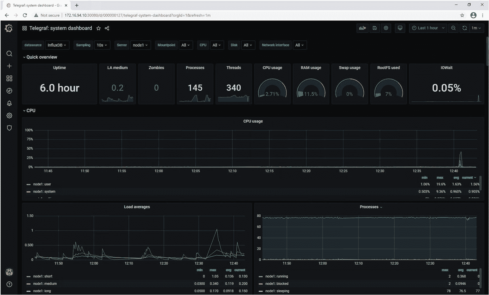

图 8-1：Grafana 门户 – Telegraf 系统仪表板

除了“全局概览”之外，您还可以获取每个独立组件的详细信息，例如特定磁盘或网络接口。

当遇到性能问题时，这始终是一个很好的起点。这也是判断您是否对集群进行了过度配置的一个很好的指标。

### SQL Server 指标

宿主节点指标侧重于集群的物理层面，而如图 8-2 所示的 SQL Server 指标则提供了 SQL Server 特定的性能指标，其中许多 DBA 已经很熟悉了。

统计信息显示等待时间、按等待类型排序的等待任务数、每秒事务和请求数以及其他有价值的指标。它们有助于了解集群中特定 SQL Server 实例的状态，该实例可以在屏幕左上角选择。

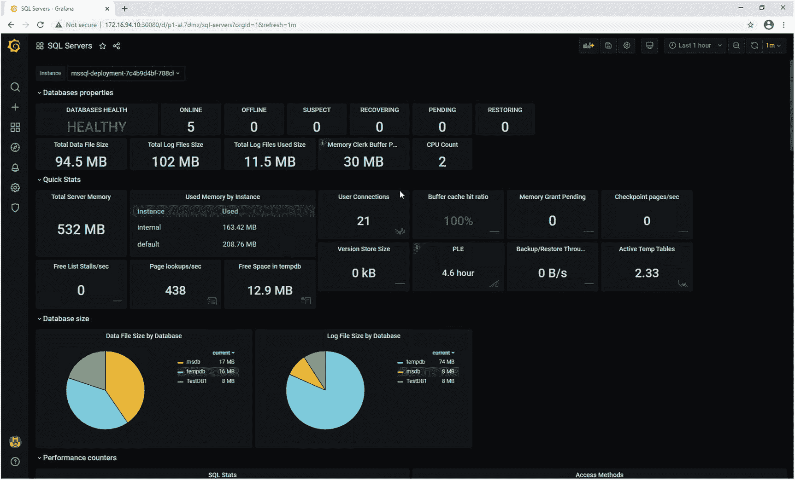

图 8-2：Grafana 门户 – SQL Server 指标

### 如何安装和配置 Grafana

安装和配置 Grafana 不像仅仅部署一个小型 Pod 那么简单。Grafana 是用于数据可视化的工具，因此我们还需要另外两个组件在幕后工作：`InfluxDB`，这是我们存储所有收集指标的数据库；以及 `Telegraf`，它将被部署到每个节点上，收集这些节点上的指标，并将它们发送到 `InfluxDB`。

设置 Grafana 所需的步骤是：

*   创建一个命名空间并将其设置为当前上下文。
*   设置供 `InfluxDB` 和 `Grafana` 使用的变量和密钥。
*   为 `InfluxDB` 配置存储。
*   部署 `InfluxDB`。
*   通过 Service 暴露 `InfluxDB` 部署。
*   为 `Telegraf` 创建一个 `ConfigMap`。
*   为 `Telegraf` 创建一个 `DaemonSet`。
*   为 `Grafana` 配置存储。
*   部署 `Grafana`。
*   通过 Service 暴露 `Grafana` 部署。
*   通过 Grafana 门户配置 `Grafana`。

您可以在图 8-3 中看到这个组合。

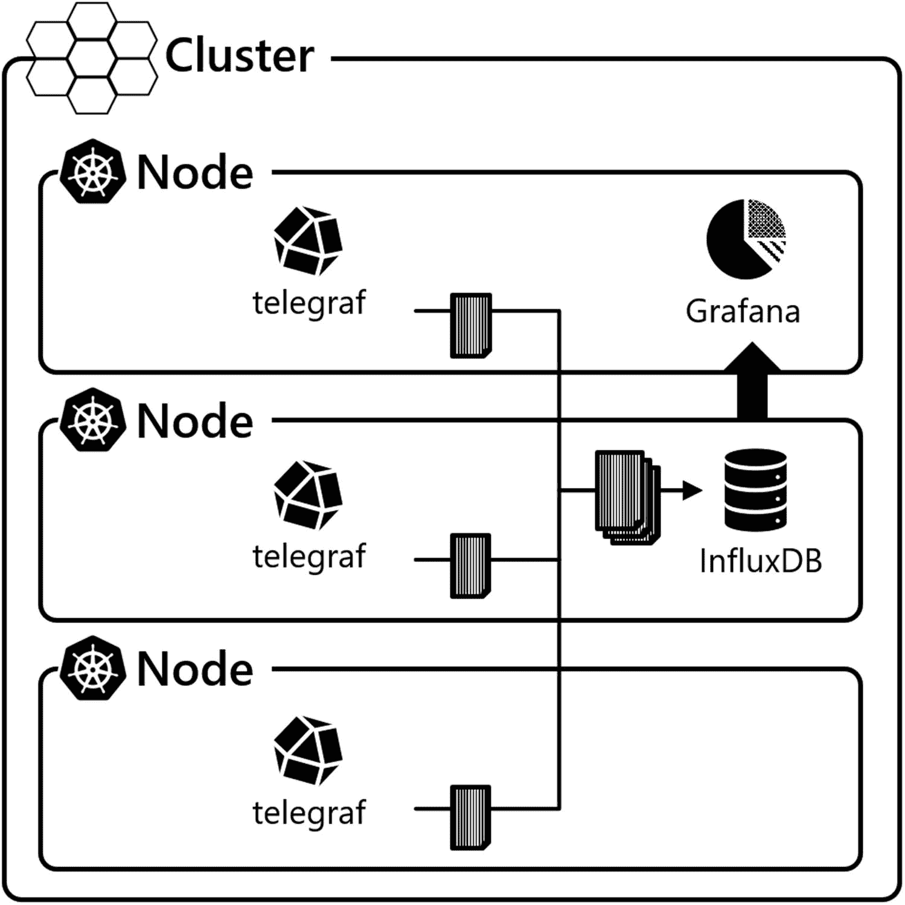

图 8-3：Grafana 及其所需组件

我们不会逐步指导或解释部署这些组件的每一个选项——单是这一点就足以单独写一本书——而是将逐步指导您完成所需的任务，使它们在您的集群中运行起来，以监控您的 SQL Server 工作负载。

为了保持整洁有序，让我们从创建一个名为 `monitoring` 的命名空间开始，并使用清单 8-1 中的命令将其设置为当前上下文。这意味着我们之后部署的每个对象都将自动部署到这个命名空间中。

```
kubectl create namespace monitoring
kubectl config set-context --current --namespace=monitoring
```

清单 8-1：创建并切换到命名空间 `monitoring`

`InfluxDB` 将需要一些密钥，我们将使用清单 8-2 中的命令进行设置。

```
kubectl create secret generic influxdb-creds \
--from-literal=INFLUXDB_DB=monitoring \
--from-literal=INFLUXDB_USER=user \
--from-literal=INFLUXDB_USER_PASSWORD=user\
--from-literal=INFLUXDB_READ_USER=readonly \
--from-literal=INFLUXDB_READ_USER_PASSWORD=readonly \
--from-literal=INFLUXDB_ADMIN_USER=admin \
--from-literal=INFLUXDB_ADMIN_USER_PASSWORD=admin \
--from-literal=INFLUXDB_HOST=influxdb \
--from-literal=INFLUXDB_HTTP_AUTH_ENABLED=false
```

清单 8-2：设置 `InfluxDB` 的变量和密钥

这同样适用于 `Grafana`（清单 8-3）。

```
kubectl create secret generic grafana-creds \
--from-literal=GF_SECURITY_ADMIN_USER=admin \
--from-literal=GF_SECURITY_ADMIN_PASSWORD=admin123 \
--from-literal=GF_INSTALL_PLUGINS=grafana-piechart-panel,grafana-clock-panel
```

清单 8-3：设置 `Grafana` 的变量和密钥

接下来是一组 YAML 清单。除非另有说明，否则请将每个清单保存到一个文件中，并使用 `kubectl apply -f` 将它们部署到您的集群中。当然，这些文件也包含在本书的下载资料中。

与我们为 SQL Server 实例所做的类似，让我们使用清单 8-4 中的清单为 `InfluxDB` 创建一个持久卷和一个持久卷声明。我们将再次将数据存储在我们的 NFS 共享上。

```
apiVersion: v1
kind: PersistentVolume
metadata:
  name: pv-nfs-influxdb
  labels:
    disk: influxdb
spec:
  capacity:
    storage: 5Gi
  accessModes:
    - ReadWriteOnce
  persistentVolumeReclaimPolicy: Retain
  nfs:
    server: storage
    path: "/srv/exports/volumes/influxdb"
---
apiVersion: v1
kind: PersistentVolumeClaim
metadata:
  name: pvc-nfs-influxdb
spec:
  selector:
    matchLabels:
      disk: influxdb
  accessModes:
    - ReadWriteOnce
  resources:
    requests:
      storage: 5Gi
```

清单 8-4：`influxdb-storage.yaml`

清单 8-5 部署了 `InfluxDB` 应用程序和数据库。


```
apiVersion: apps/v1
kind: Deployment
metadata:
  namespace: monitoring
  labels:
    app: influxdb
  name: influxdb
spec:
  replicas: 1
  selector:
    matchLabels:
      app: influxdb
  template:
    metadata:
      labels:
        app: influxdb
    spec:
      containers:
      - envFrom:
        - secretRef:
            name: influxdb-creds
        image: docker.io/influxdb:1.8
        name: influxdb
        volumeMounts:
        - mountPath: /var/lib/influxdb
          name: var-lib-influxdb
      volumes:
      - name: var-lib-influxdb
        persistentVolumeClaim:
          claimName: pvc-nfs-influxdb
```
清单 8-5: `influxdb-deployment.yaml`

我们将使用一个 `NodePort` 类型的服务来暴露此部署，如清单 8-6 所示。

**注意**

在此清单中，我们为服务定义了一个静态端口 (`30010`)。与之前部署的服务不同，此服务将始终在此端口上运行，而不是使用随机端口。这样做的好处是，你无需更改你的 URL 调用。

```
apiVersion: v1
kind: Service
metadata:
  labels:
    app: influxdb
  name: influxdb
  namespace: monitoring
spec:
  ports:
  - port: 8086
    protocol: TCP
    targetPort: 8086
    nodePort: 30010
  selector:
    app: influxdb
  type: NodePort
```
清单 8-6: `influxdb-service.yaml`

清单 8-7 提供了 `Telegraf` 的 `ConfigMap`。我们添加了最常见的系统指标（如 `CPU`、`disk` 和 `memory`）以及我们的 `SQL Server`。

**注意**

请在应用此清单前，调整其中的 `<Port>` 和 `<Password>` 以匹配你的设置。这将是你的 `SQL Server` 所使用的密码及其端口 (`NodePort`)。

```
apiVersion: v1
kind: ConfigMap
metadata:
  name: telegraf
  namespace: monitoring
  labels:
    k8s-app: telegraf
data:
  telegraf.conf: |+
    [global_tags]
    env = "kubeadm"
    [agent]
      hostname = "$HOSTNAME"
    [[outputs.influxdb]]
      urls = ["http://$INFLUXDB_HOST:8086/"] # required
      database = "$INFLUXDB_DB" # required
      timeout = "5s"
      username = "$INFLUXDB_USER"
      password = "$INFLUXDB_USER_PASSWORD"
    [[inputs.cpu]]
      percpu = true
      totalcpu = true
      collect_cpu_time = false
      report_active = false
    [[inputs.disk]]
      ignore_fs = ["tmpfs", "devtmpfs", "devfs"]
    [[inputs.diskio]]
    [[inputs.kernel]]
    [[inputs.mem]]
    [[inputs.processes]]
    [[inputs.swap]]
    [[inputs.system]]
    [[inputs.docker]]
      endpoint = "unix:///var/run/docker.sock"
    [[inputs.sqlserver]]
      servers = [
        "Server=control;Port=;User Id=sa;Password=;app name=telegraf;log=1;"
      ]
      query_version = 2
```
清单 8-7: `telegraf-configmap.yaml`

接下来，我们将使用清单 8-8 通过一个 `DaemonSet` 来部署 `Telegraf`。

```
apiVersion: apps/v1
kind: DaemonSet
metadata:
  name: telegraf
  namespace: monitoring
  labels:
    k8s-app: telegraf
spec:
  selector:
    matchLabels:
      name: telegraf
  template:
    metadata:
      labels:
        name: telegraf
    spec:
      containers:
      - name: telegraf
        image: docker.io/telegraf:latest
        env:
        - name: HOSTNAME
          valueFrom:
            fieldRef:
              fieldPath: spec.nodeName
        - name: "HOST_PROC"
          value: "/rootfs/proc"
        - name: "HOST_SYS"
          value: "/rootfs/sys"
        - name: INFLUXDB_USER
          valueFrom:
            secretKeyRef:
              name: influxdb-creds
              key: INFLUXDB_USER
        - name: INFLUXDB_USER_PASSWORD
          valueFrom:
            secretKeyRef:
              name: influxdb-creds
              key: INFLUXDB_USER_PASSWORD
        - name: INFLUXDB_HOST
          valueFrom:
            secretKeyRef:
              name: influxdb-creds
              key: INFLUXDB_HOST
        - name: INFLUXDB_DB
          valueFrom:
            secretKeyRef:
              name: influxdb-creds
              key: INFLUXDB_DB
        volumeMounts:
        - name: sys
          mountPath: /rootfs/sys
          readOnly: true
        - name: proc
          mountPath: /rootfs/proc
          readOnly: true
        - name: docker-socket
          mountPath: /var/run/docker.sock
        - name: utmp
          mountPath: /var/run/utmp
          readOnly: true
        - name: config
          mountPath: /etc/telegraf
      terminationGracePeriodSeconds: 30
      volumes:
      - name: sys
        hostPath:
          path: /sys
      - name: docker-socket
        hostPath:
          path: /var/run/docker.sock
      - name: proc
        hostPath:
          path: /proc
      - name: utmp
        hostPath:
          path: /var/run/utmp
      - name: config
        configMap:
          name: telegraf
```
清单 8-8: `telegraf-daemonset.yaml`

现在，我们有了 `InfluxDB` 来存储指标，并有 `Telegraf` 为我们收集指标，是时候部署 `Grafana` 来将它们可视化了。

清单 8-9 中的代码将首先为我们提供 `Grafana` 配置的存储。

```
apiVersion: v1
kind: PersistentVolume
metadata:
  name: pv-nfs-grafana
  labels:
    disk: grafana
spec:
  capacity:
    storage: 5Gi
  accessModes:
    - ReadWriteOnce
  persistentVolumeReclaimPolicy: Retain
  nfs:
    server: storage
    path: "/srv/exports/volumes/grafana"
---
apiVersion: v1
kind: PersistentVolumeClaim
metadata:
  name: pvc-nfs-grafana
spec:
  selector:
    matchLabels:
      disk: grafana
  accessModes:
    - ReadWriteOnce
  resources:
    requests:
      storage: 5Gi
```
清单 8-9: `grafana-storage.yaml`

接着使用清单 8-10 部署 `Grafana` 本身。请注意，`Grafana` 需要自己的用户和组来运行。我们在第 1 章设置 `NFS` 服务器时已经创建了这些。

```
apiVersion: apps/v1
kind: Deployment
metadata:
  namespace: monitoring
  labels:
    app: grafana
  name: grafana
spec:
  replicas: 1
  selector:
    matchLabels:
      app: grafana
  template:
    metadata:
      labels:
        app: grafana
    spec:
      containers:
      - envFrom:
        - secretRef:
            name: grafana-creds
        image: docker.io/grafana/grafana:7.3.3
        name: grafana
        volumeMounts:
        - name: data-dir
          mountPath: /var/lib/grafana/
        securityContext:
          fsGroup: 472
          runAsGroup: 472
          runAsNonRoot: true
          runAsUser: 472
      volumes:
      - name: data-dir
        persistentVolumeClaim:
          claimName: pvc-nfs-grafana
```
清单 8-10: `grafana-deployment.yaml`

在最后一步，我们将使用清单 8-11 将 `Grafana` 也作为一项服务暴露出来。此服务将再次使用一个静态端口 (`30080`)。

```
apiVersion: v1
kind: Service
metadata:
  labels:
    app: grafana
  name: grafana
  namespace: monitoring
spec:
  ports:
  - port: 443
    name: https
    targetPort: 3000
    nodePort: 30080
  selector:
    app: grafana
  type: NodePort
```
清单 8-11: `grafana-service.yaml`

你的性能监控环境现在已准备就绪。打开网页浏览器并登录 `http://control:30080`（这可以在任何能够访问控制平面节点且在其 `hosts` 文件中有相应条目的机器上进行）。使用我们之前定义的凭据（在我们的示例中是 `admin` 和 `admin123`）。

转到左侧的 `Configuration` ➤ `Data Sources`（图 8-4）并点击 `Add data source`。

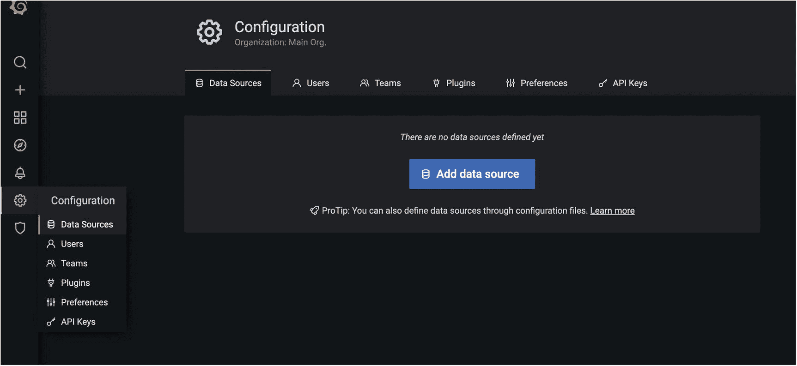
图 8-4: Grafana – 添加数据源

从 `Time series databases` 中选择 `InfluxDB`，并点击 `Select`，如图 8-5 所示。

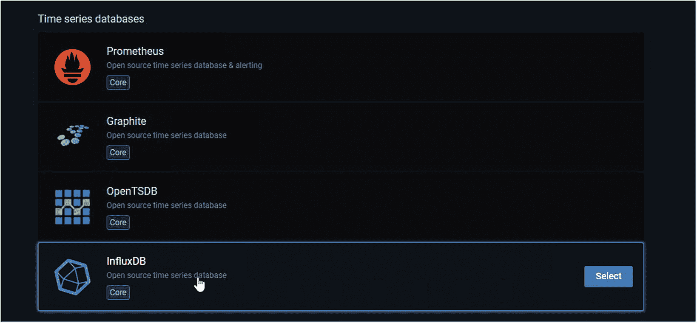
图 8-5: Grafana – 添加数据源 - 时序数据库

将 URL（图 8-6）设置为 `http://influxdb:8086`。

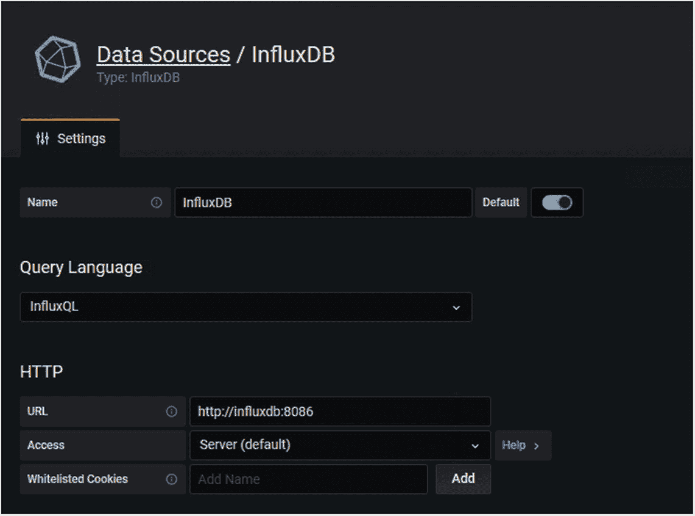
图 8-6: Grafana – 添加数据源 - 设置

向下滚动，将 `Database` 设置为 `monitoring`，然后点击 `Save & Test` 以验证你的连接，如图 8-7 所示。

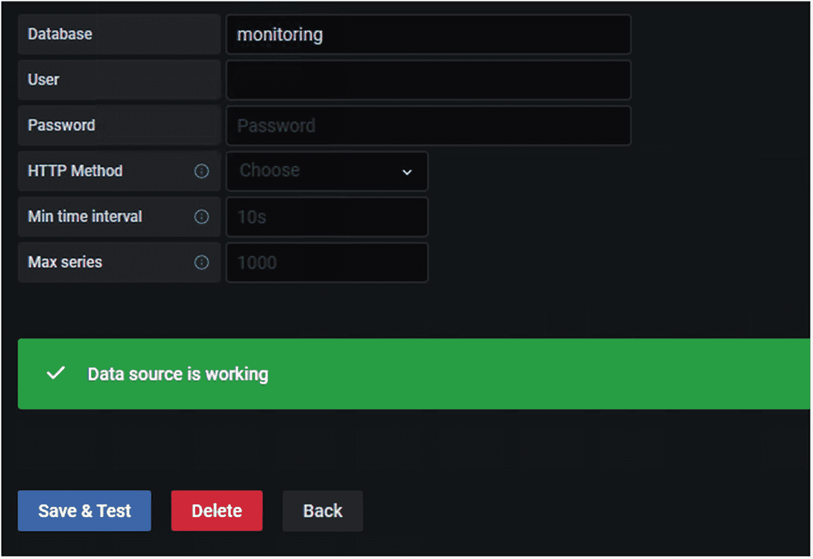
图 8-7: Grafana – 添加数据源

利用此连接，我们现在可以使用其指标创建仪表板。同样，我们不会深入探讨这一点，而是直接使用两个现有的仪表板。

导航到 `Dashboards` 并选择 `Manage`，如图 8-8 所示。

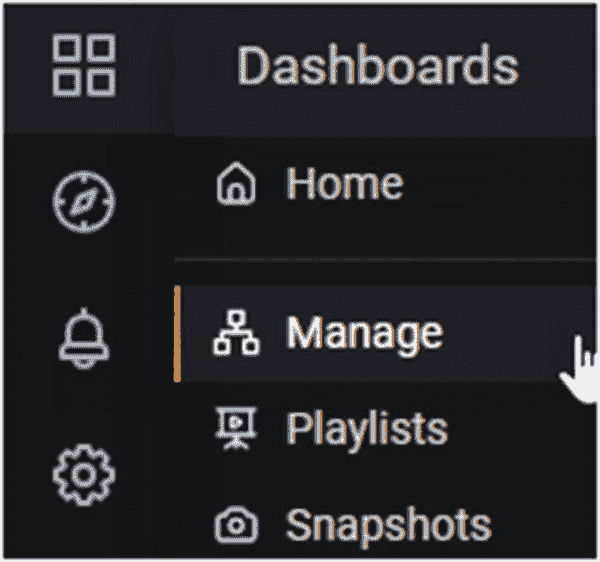
图 8-8: Grafana – 管理仪表板

在下一个屏幕（图 8-9）上，点击 `Import`。


### Kibana 用于日志聚合与管理


图 8-9

Grafana – 导入仪表板

在上部区域，通过 `grafana.com` `导入`，输入 ID `928` 并点击 `加载`（图 8-10）。仪表板 `928` 是来自 Grafana 库的一个预配置系统仪表板，我们将在本章稍后向你解释如何查找更多可供你使用的仪表板。


图 8-10

Grafana – 导入仪表板（仪表板 ID）

将屏幕下部区域（图 8-11）的 `InfluxDB telegraf` 下拉菜单更改为 `InfluxDB`，然后点击 `导入`。

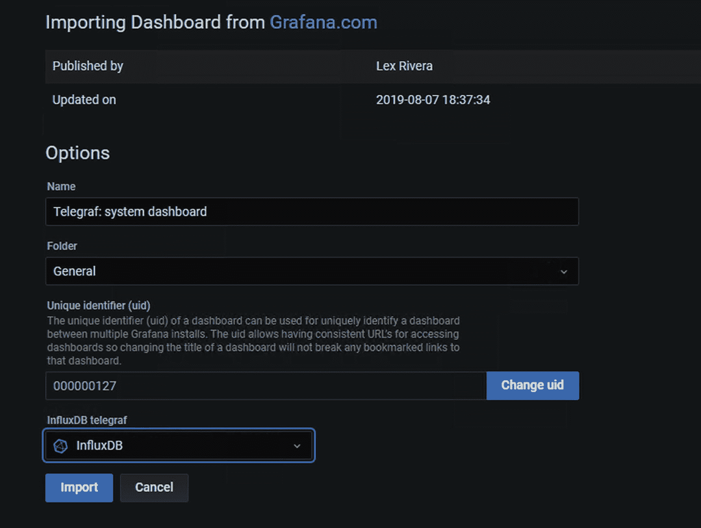

图 8-11

Grafana – 导入仪表板（结果）

这将为你导入并打开 Telegraf 系统仪表板，其中包含大量关于你的 Kubernetes 集群背后硬件的有价值信息（见图 8-12）。

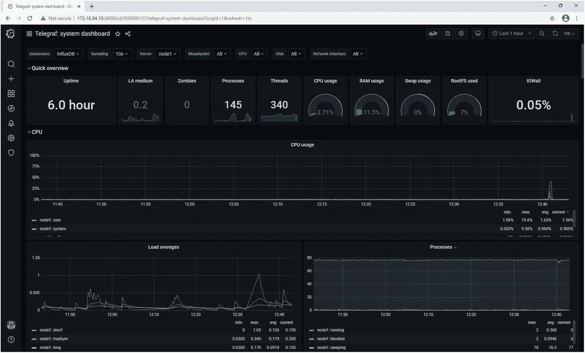

图 8-12

Grafana – Telegraf 仪表板

使用仪表板 ID `9386` 重复相同的步骤，以导入一个包含 SQL Server 特定指标的仪表板。

你可以在 [`https://grafana.com/grafana/dashboards/`](https://grafana.com/%2520grafana/dashboards/) 找到更多可用的仪表板。如果你想了解更多关于 Grafana 本身的信息，请访问 [`https://grafana.com/`](https://grafana.com/)。

另一方面，如图 8-13 所示的 Kibana 仪表板，让你能够洞察你的 Kubernetes 日志文件，包括那些影响你的 SQL Server Pod 和容器的日志。日志记录在故障排除场景中很有价值，并且鉴于日志与 Pod 的生命周期绑定，而我们又需要独立于该生命周期访问日志的方法，因此我们需要一个能为我们覆盖此需求的解决方案。Kibana 是 Elastic Stack 的一部分。它还提供了在你的日志文件之上创建可视化和仪表板的选项。

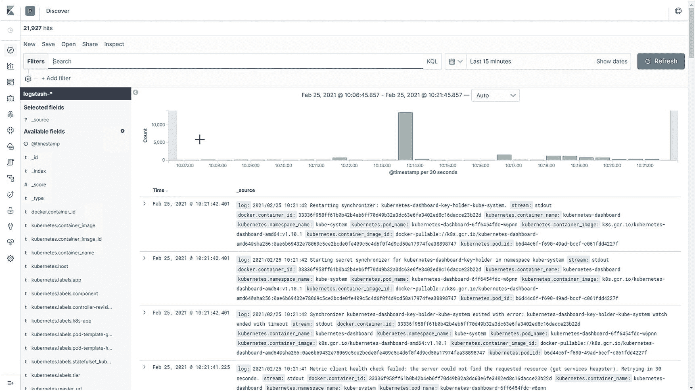

图 8-13

Kibana 门户 – 概览

#### 如何安装和配置 Kibana

Kibana 使用的组件与 Grafana 完全不同，但总体逻辑非常相似。如图 8-14 所示，我们有 `elasticsearch` 作为我们的数据存储，而 Kibana 用作前端。每个节点上的 `Fluent-bit` Pod 负责收集日志并将其发送到 `elasticsearch`。

设置 Kibana 所需的步骤是：

- 创建一个命名空间并将其设置为当前上下文。
- 部署 elasticsearch 并将其作为服务暴露。
- 部署 fluent-bit。
- 部署 Kibana 并将其作为服务暴露。

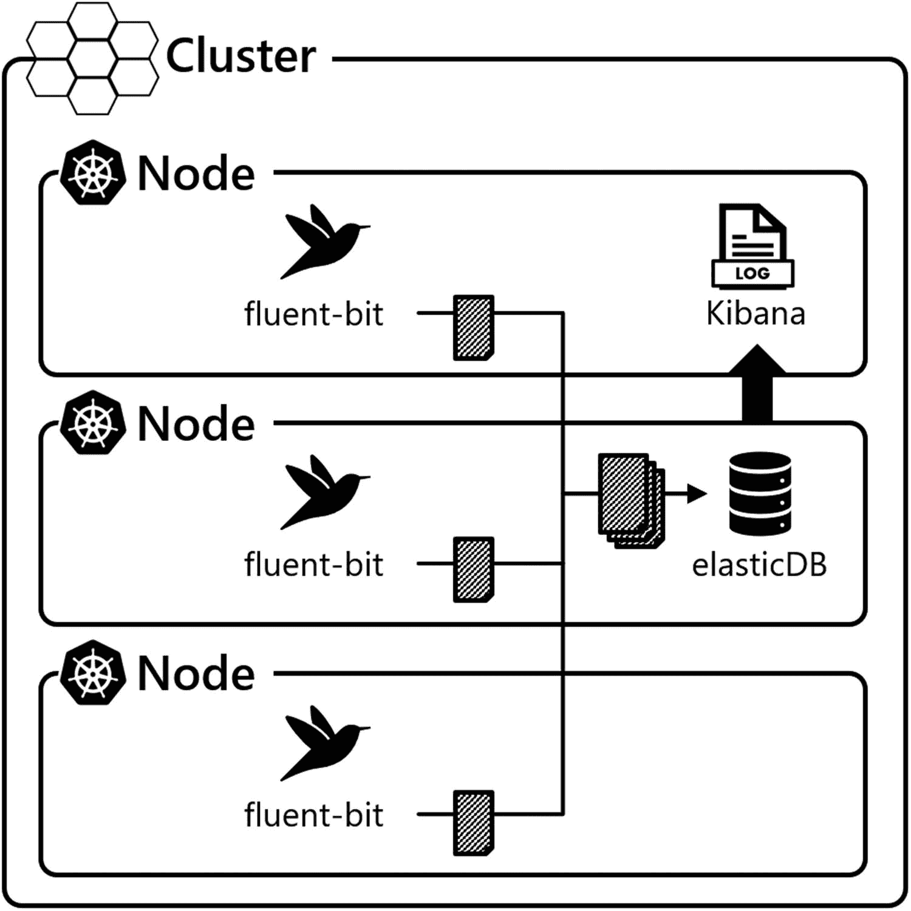

图 8-14

Kibana 及其所需组件

就像之前使用 Grafana 一样，让我们使用清单 8-12 中的代码为 Kibana 创建一个新的命名空间。

```bash
kubectl create namespace logging
kubectl config set-context --current --namespace=logging
```

清单 8-12：创建并切换到命名空间“logging”

同样像使用 Grafana 时一样，我们不会解释每一个细节，而是引导你完成将日志聚合解决方案部署到集群的步骤。

我们将从在集群内暴露 elasticsearch 的服务开始（清单 8-13）。

你注意到什么了吗？我们在部署 Pod 之前就暴露了服务。这仅仅是为了说明这里的顺序并不重要。当然，只有在目标部署也创建后，服务才是可访问的。

```yaml
kind: Service
apiVersion: v1
metadata:
  name: elasticsearch
  namespace: logging
  labels:
    app: elasticsearch
spec:
  selector:
    app: elasticsearch
  clusterIP: None
  ports:
  - port: 9200
    name: rest
  - port: 9300
    name: inter-node
```

清单 8-13：elasticsearch-service.yaml

由于 elasticsearch 使用 StatefulSet，它需要为每个 Pod 提供一个持久卷，因此我们将使用 `storage class` 进行动态配置，而不是静态预配置 `PV` 和 `PVC`，我们将再次将其指向我们的 NFS 服务器。此存储类已在第 6 章配置好。

有了存储，我们就可以使用清单 8-14 中的配置清单为 elasticsearch 应用程序推出一个 StatefulSet。在此清单的最后一部分，你可以看到引用了我们的 `nfs-storage` 存储类，这就是两者连接起来的方式。


## 在 Kubernetes 上部署日志聚合系统

### 部署 Elasticsearch StatefulSet

```yaml
apiVersion: apps/v1
kind: StatefulSet
metadata:
  name: es-cluster
  namespace: logging
spec:
  serviceName: elasticsearch
  replicas: 3
  selector:
    matchLabels:
      app: elasticsearch
  template:
    metadata:
      labels:
        app: elasticsearch
    spec:
      containers:
      - name: elasticsearch
        image: docker.elastic.co/elasticsearch/elasticsearch:7.2.0
        resources:
          limits:
            cpu: 1000m
          requests:
            cpu: 100m
        ports:
        - containerPort: 9200
          name: rest
          protocol: TCP
        - containerPort: 9300
          name: inter-node
          protocol: TCP
        volumeMounts:
        - name: data
          mountPath: /usr/share/elasticsearch/data
        env:
        - name: cluster.name
          value: k8s-logs
        - name: node.name
          valueFrom:
            fieldRef:
              fieldPath: metadata.name
        - name: discovery.seed_hosts
          value: "es-cluster-0.elasticsearch,es-cluster-1.elasticsearch,es-cluster-2.elasticsearch"
        - name: cluster.initial_master_nodes
          value: "es-cluster-0,es-cluster-1,es-cluster-2"
        - name: ES_JAVA_OPTS
          value: "-Xms512m -Xmx512m"
      initContainers:
      - name: fix-permissions
        image: busybox
        command: ["sh", "-c", "chown -R 1000:1000 /usr/share/elasticsearch/data"]
        securityContext:
          privileged: true
        volumeMounts:
        - name: data
          mountPath: /usr/share/elasticsearch/data
      - name: increase-vm-max-map
        image: busybox
        command: ["sysctl", "-w", "vm.max_map_count=262144"]
        securityContext:
          privileged: true
      - name: increase-fd-ulimit
        image: busybox
        command: ["sh", "-c", "ulimit -n 65536"]
        securityContext:
          privileged: true
  volumeClaimTemplates:
  - metadata:
      name: data
      labels:
        app: elasticsearch
    spec:
      accessModes: [ "ReadWriteOnce" ]
      storageClassName: nfs-storage
      resources:
        requests:
          storage: 100Gi
```
**清单 8-14** 将 Elasticsearch 部署为 StatefulSet (`elasticsearch.yaml`)

### 部署 Kibana

在我们的集群上运行 Elasticsearch 后，我们可以使用清单 8-15 来部署 Kibana 并将其作为服务暴露（同样使用静态端口：30445）。这也表明，无论我们是通过多个清单还是单个清单部署所有内容（此处为服务和部署），都没有关系。此外，我们是在创建部署之前创建服务，但 Kubernetes 会无缝地为我们处理好这一点。

```yaml
apiVersion: v1
kind: Service
metadata:
  name: kibana
  namespace: logging
  labels:
    app: kibana
spec:
  ports:
  - port: 5601
    targetPort: 5601
    nodePort: 30445
  selector:
    app: kibana
  type: NodePort
---
apiVersion: apps/v1
kind: Deployment
metadata:
  name: kibana
  namespace: logging
  labels:
    app: kibana
spec:
  replicas: 1
  selector:
    matchLabels:
      app: kibana
  template:
    metadata:
      labels:
        app: kibana
    spec:
      containers:
      - name: kibana
        image: docker.elastic.co/kibana/kibana:7.2.0
        resources:
          limits:
            cpu: 1000m
          requests:
            cpu: 100m
        env:
        - name: ELASTICSEARCH_URL
          value: http://elasticsearch:9200
        ports:
        - containerPort: 5601
```
**清单 8-15** `kibana.yaml`

### 安装 Fluent-bit

现在我们有了用于存储数据的 Elasticsearch 和用于展示数据的 Kibana。唯一缺少的组件是用于收集日志的 `fluent-bit`，这样我们才有数据可供处理。

在这种情况下，我们只需直接从 GitHub 应用一个文件（清单 8-16），就可以创建从 `ServiceAccount` 到 `Roles` 以及 `Deployment` 的所有内容。如果您想先检查或做任何更改，也可以先保存它们，然后应用本地清单。

```bash
kubectl create -f https://raw.githubusercontent.com/fluent/fluent-bit-kubernetes-logging/master/fluent-bit-service-account.yaml
kubectl create -f https://raw.githubusercontent.com/fluent/fluent-bit-kubernetes-logging/master/fluent-bit-role.yaml
kubectl create -f https://raw.githubusercontent.com/fluent/fluent-bit-kubernetes-logging/master/fluent-bit-role-binding.yaml
kubectl create -f https://raw.githubusercontent.com/fluent/fluent-bit-kubernetes-logging/master/output/elasticsearch/fluent-bit-configmap.yaml
kubectl create -f https://raw.githubusercontent.com/fluent/fluent-bit-kubernetes-logging/master/output/elasticsearch/fluent-bit-ds.yaml
```
**清单 8-16** 安装 `fluent-bit`

### 访问 Kibana

我们的日志聚合系统现已准备就绪。打开 Web 浏览器并导航到 [*http://control:30445/*](http://www.control:30445/)。

您将被询问（见图 8-15）是希望从示例数据开始还是自行探索，此时您将点击 *Explore on my own*。

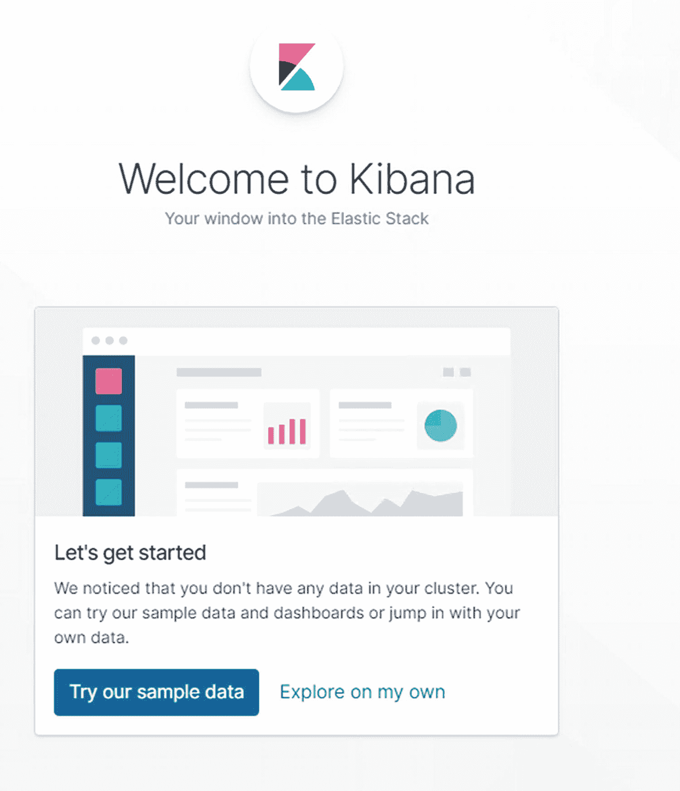

**图 8-15** Kibana Portal

### 配置数据源

与 Grafana 类似，我们在使用 Kibana 之前需要配置其数据源。如图 8-16 所示，点击左侧菜单中的 *Discover*。

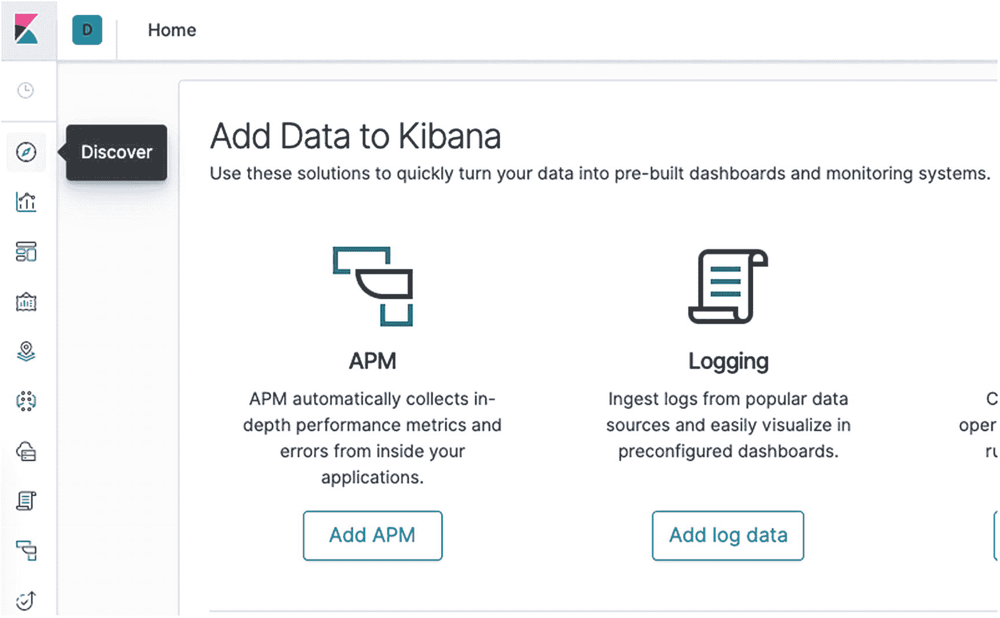

**图 8-16** Kibana Portal 导航

配置菜单（图 8-17）将要求您定义一个索引模式。

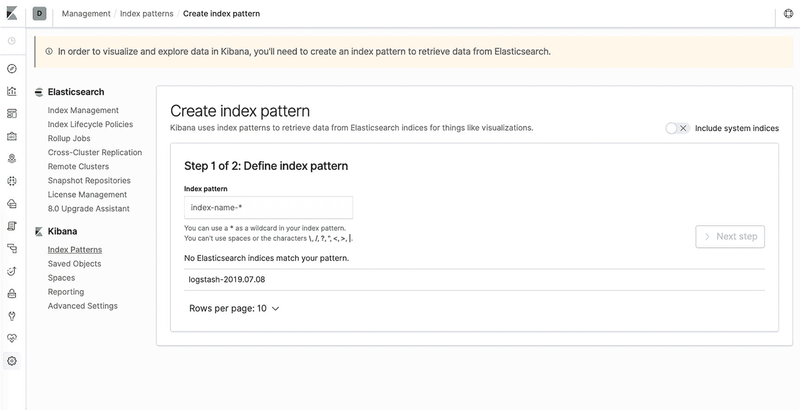

**图 8-17** Kibana Portal – 定义索引模式

我们现在保持简单，因此在文本框中输入 `logstash-**` 并点击 *Next step*。

下一步（图 8-18）要求您配置将使用哪个字段按时间过滤日志数据。在下拉菜单中选择 `@timestamp`，然后点击 *Create index pattern*。

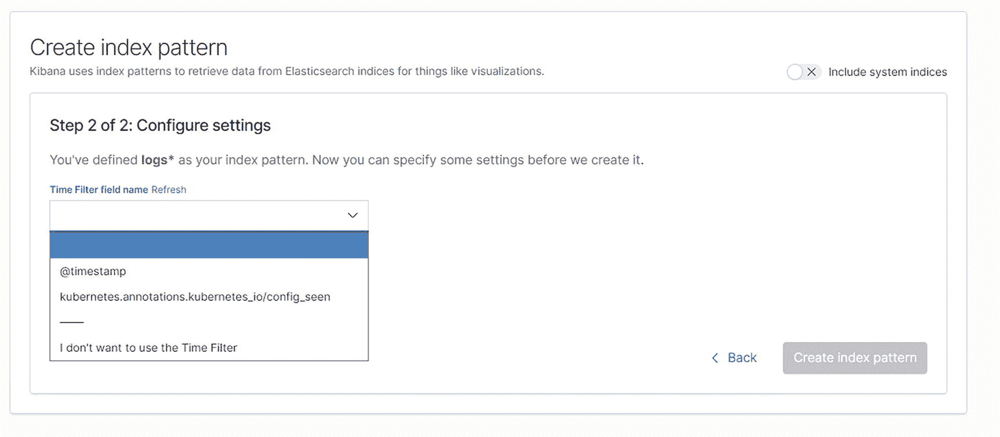

**图 8-18** Kibana Portal – 配置索引设置

再次点击左侧的 *Discover*，您将看到集群中收集日志的直方图（图 8-19）。

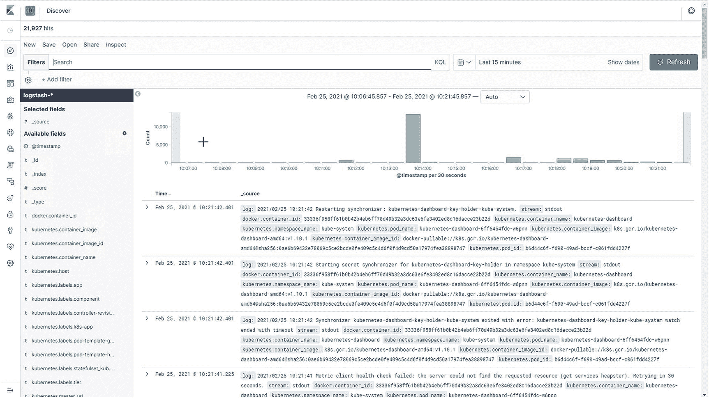

**图 8-19** Kibana 直方图

这些数据可以通过多种方式进行筛选和分析。要了解更多关于 Kibana 的信息，我们建议您查看 [*www.elastic.co/kibana*](https://www.elastic.co/kibana)。

#### 在 Kibana 中查看 SQL Server 日志

不过，我们要特别指出的一组筛选条件是，如何在 Kibana 中检索 SQL Server 实例的日志。

一种非常简单的方法是直接使用全文搜索，如图 8-20 所示。


*图 8-20: Kibana 中的全文筛选器*

不过，这会引入大量不必要的干扰信息。更好的解决方案是添加一个合适的筛选器。为此，点击筛选栏下方的`添加筛选器`，如图 8-21 所示。

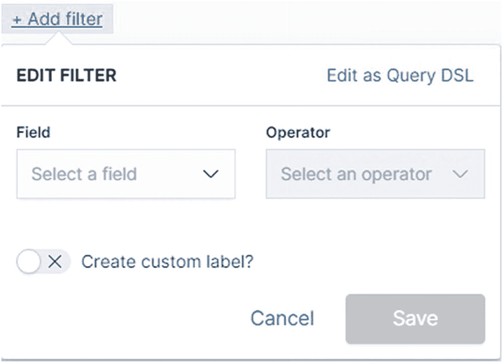
*图 8-21: 在 Kibana 中添加筛选器*

选择字段`kuberneters.container_name`，运算符`是`，以及值`mssql`，如图 8-22 所示，然后点击`保存`。

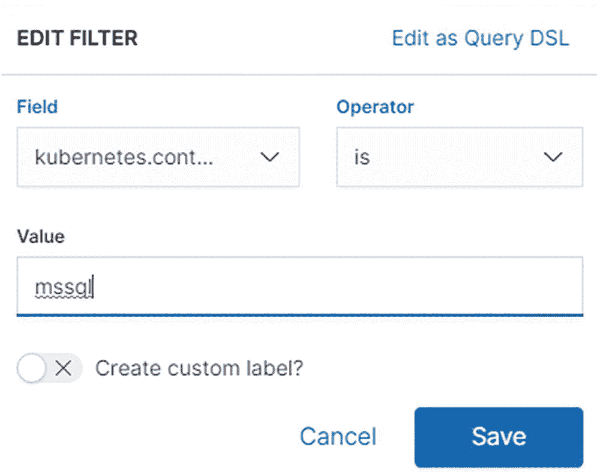
*图 8-22: 在 Kibana 中为 mssql 添加筛选器*

这将显示我们所有 SQL Server 容器的日志文件，如图 8-23 所示。

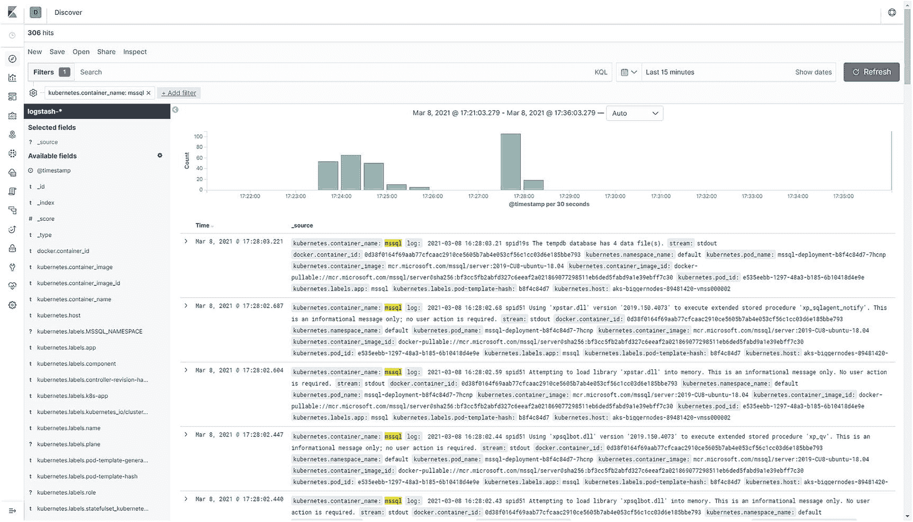
*图 8-23: 在 Kibana 中筛选 mssql*

当然，这也可以与全文筛选器结合使用。如果你在筛选器中添加`"Login failed"`，如图 8-24 所示，你将获得我们 SQL Server 中所有登录失败的事件，因为此日志也包含了完整的 SQL Server 错误日志。

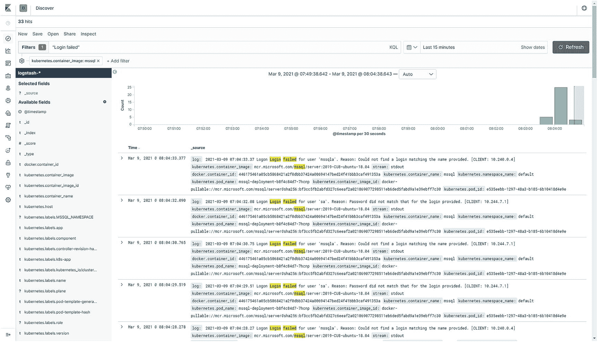
*图 8-24: Kibana 中的 SQL Server 错误日志*

在我们的示例中，这已经足够了。如果你运行了多个 SQL Server 实例，你还可以添加额外的筛选器，用于设置如`namespace`、`deployment`或`pod`名称。

### 清理

为了确保你接下来的演示在正确的命名空间中运行，请将当前上下文重置为默认命名空间，如代码清单 8-17 所示。

```
kubectl config set-context --current --namespace=default
```
*代码清单 8-17: 重置 kubectl 上下文*

注意

本示例中使用的端口也将在后续章节的服务中使用。请记住这一点，并在那些章节中修改端口，或者先删除本章的资源。

### 总结

在本章中，我们介绍了如何使用 Grafana 和 Kibana 仪表板来监控集群及其应用程序。然后，我们利用这些门户网站深入了解了我们先前部署在 Kubernetes 上的 SQL Server。让我们继续下一章，看看 Azure Arc 启用的数据服务，它允许我们在 Kubernetes 上部署具有高可用性选项的 SQL Server。

## 9. Azure Arc 启用的数据服务与 Kubernetes 上 SQL Server 的高可用性

本章介绍 Azure Arc 启用的数据服务及其提供的强大功能，这些功能允许你使用从 Azure 云获得的相同自动化、集中控制管理和工具，在本地、本地数据中心和混合云中部署和管理数据资源。我们将向你展示如何在公司数据中心部署和管理运行在 SQL Server 上的数据库，就好像它们是 Azure 平台的一部分一样，这一切都利用了 Kubernetes 的威力。Azure Arc 启用的数据服务也是如何为 Kubernetes 上的 SQL Server（使用托管实例）实现可用性组（AG）这个问题的答案。

### 什么是 Azure Arc？

从核心上讲，Microsoft Azure Arc 可在你部署了本地或任何云资源的任何地方提供 Azure 管理服务。它使你能够为组织的核心运营提供一致的管理服务和工具，无论技术架构部署在何处。让我们看看 Azure Arc 的核心功能：

-   **跨本地和混合云的统一体验**：你可以使用熟悉的工具，如 Azure 门户、Azure CLI、PowerShell 和 REST API 来管理和部署系统。
-   **部署和运营**：凭借一套统一的工具，无论你部署在本地还是任何云中，部署和运营都是一致的。统一的工具使你的组织能够在任何部署场景中使用相同的代码和工具，无论部署在哪里。运营的一个关键要素是性能和可用性监控，Azure Monitor 可帮助你为 Azure Arc 启用的资源完成这项工作。
-   **整合的访问控制、安全、策略管理和日志记录**：根据资源部署位置实施多个安全模型是具有挑战性和风险的，因为你可能需要管理多组安全规则及其实施。Azure Arc 使你能够拥有一个整合的安全模型和实施，并使用 Azure Log Analytics 等工具进行集中的安全和应用程序日志记录。此外，你可以使用 Azure Policy 等服务来管理治理和控制解决方案。
-   **清单和组织**：凭借一套可用的工具以及资源组、订阅和标签等关键的 Azure 构造，管理员、操作员和技术经理可以全面了解其技术资产。系统部署在哪里已不再重要——服务和资源作为托管资源注册在 Azure 中，无论它们部署在哪里，是本地还是任何云。

Azure Arc 的范围涵盖从`Azure Arc 启用的服务器`和`Azure Arc 启用的 Kubernetes`到`Azure Arc 启用的 SQL Server`和`Azure Arc 启用的数据服务`。

鉴于本书的范围，让我们将其总结到本质：Azure Arc 是一系列服务，允许你将原本只能部署到 Microsoft Azure 云中的服务运行在任何云中的任何基础设施上。我们将在本章中重点介绍 Azure Arc 启用的数据服务中的一些产品。

要了解更多关于 Azure Arc 的一般信息，请参考 [`docs.microsoft.com/en-us/azure/azure-arc/`](https://docs.microsoft.com/en-us/azure/azure-arc/)。

### Azure Arc 启用的数据服务简介

Azure Arc 启用的数据服务架构是一个分层架构，包括硬件层、Kubernetes 层、管理控制平面层和数据服务层。图 9-1 突出了该架构。

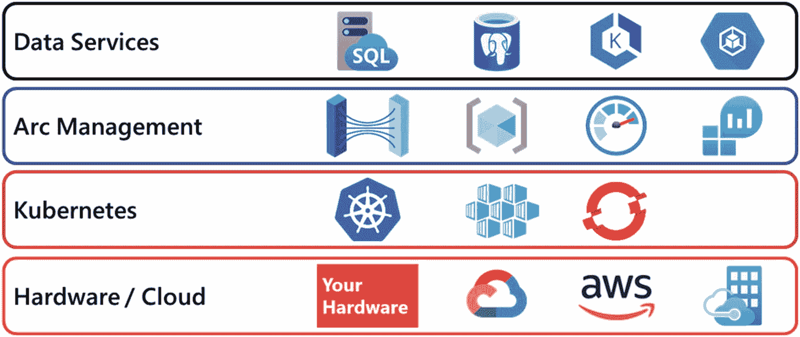
*图 9-1: Azure Arc 启用的数据服务架构*

基础层是运行在任何硬件上的 Kubernetes，这些硬件可以是本地的，也可以在任何云中，并且构建在物理机或虚拟机上。然后，在 Kubernetes 集群内部署的是 Arc 管理控制平面。Arc 管理控制平面是 Azure Arc 的大脑，它将 Azure 资源管理器（ARM）扩展到你的本地或混合云部署中。而在所有这一切之上，就是 Azure Arc 启用的数据服务。

让我们更仔细地看看图 9-2 所示的 Azure Arc 启用的数据服务的核心组件。

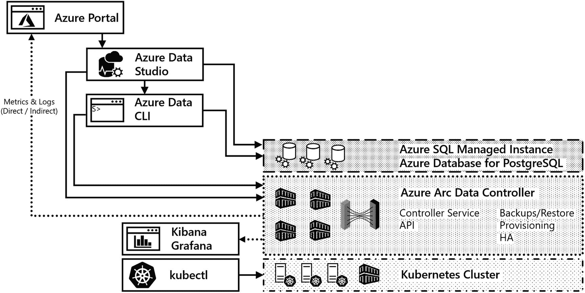
*图 9-2: Azure Arc 启用的数据服务的核心组件*

#### Azure Arc 数据控制器

除了 Kubernetes 集群，运行 Azure Arc 启用的数据服务所需的第一个组件是数据控制器。它提供与 Azure 门户的连接，并部署一些我们稍后配置服务所需的核心服务。


### 监控（Grafana 和 Kibana）

在上一章中，我们部署了 Grafana，正如你所记得的，其中涉及了相当多的步骤。好消息是：当你部署 `Azure Arc Data Controller` 时，它会自动为你部署一个 Grafana 仪表板及其先决条件。

它还附带了预配置的仪表板，如 SQL Managed Instance Metrics，如图 9-3 所示。这看起来与我们在前一章看到的例子不同，因为这个仪表板是根据 `SQL Managed Instance` 的具体情况定制的。

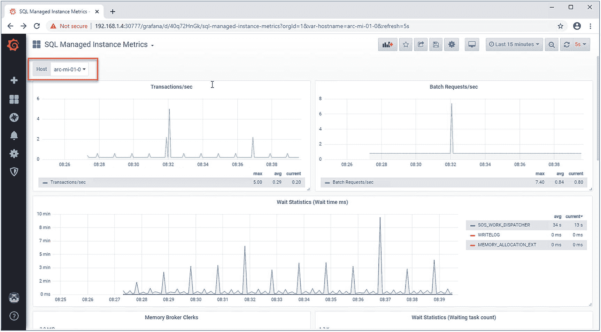

图 9-3 Grafana 门户 – SQL MI 指标

除了这个仪表板，图 9-4 中显示的仪表板也会被自动部署。

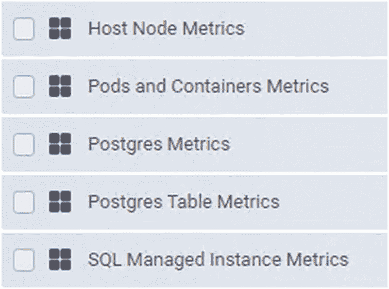

图 9-4 Grafana 门户中的内置仪表板

当然，你也可以像我们在前一章中所做的那样，添加任何现有的仪表板或创建自己的仪表板。

除了 Grafana，`Azure Arc–enabled Data Services` 默认也附带 `Kibana` 及其先决条件，因此同样无需手动部署。

### 连接到 Azure 门户的模式

`Azure Arc–enabled Data Services` 附带一个到 `Azure Portal` 的后向通道，允许你上传安装的日志和指标。这使你可以在一个地方管理所有数据资产——无论它是在本地 `Azure Arc` 上运行的 `Managed Instance`，还是 `Azure` 中的 `Azure SQL DB`。此信息也用于计费目的。

根据你的基础设施、位置和需求，你可以选择两种模式：

-   **直接连接：** 在此模式下，你的日志和指标会不断发送到 `Azure Portal`，使数据几乎立即可用于分析。
-   **间接连接：** 在此模式下，你需要手动触发或计划导出和上传指标及日志。如果你所在位置互联网连接有限，这尤其有用。

一旦资源的 `data` 被上传到 `Azure`，它就会在门户中显示，如图 9-5 的示例所示。

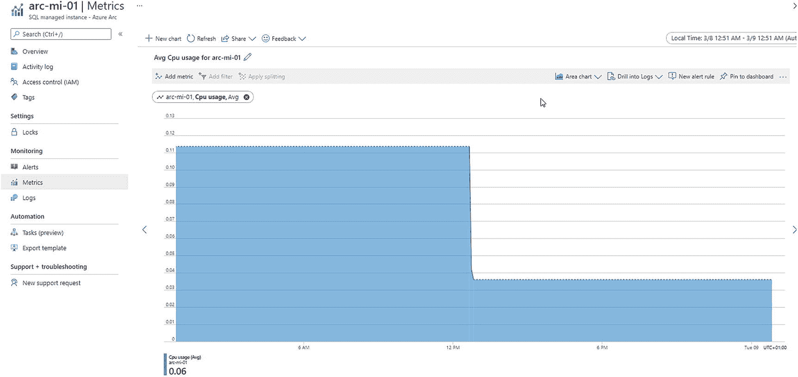

图 9-5 在 Azure 门户中显示的 CPU 指标

### 数据服务

在我们的 `Data Controller` 之上是 `Data Services`，在撰写本文时，它可以是 `Azure Arc SQL Managed Instance` 或 `Azure Database for PostgreSQL`。

我们将只关注 `SQL Managed Instance`，因为 `PostgreSQL` 超出了本书的范围。

#### Azure Arc SQL Managed Instance

`Azure Arc–enabled SQL Managed Instance` 是你的 SQL Server 提升和转移版本。它使你能够将工作负载无缝迁移到 `Azure Arc`，因为它与本地 `SQL Server` 安装提供了高度兼容性，据记录其兼容性接近 100%。这意味着将数据库从当前的本地实现迁移到 `Azure Arc–enabled SQL Managed Instance` 几乎不需要数据库更改。在部署 `Azure Arc–enabled SQL Managed Instance` 时，你可以从本地 `SQL Server` 版本获取备份，并将该备份直接还原到 `Azure Arc-enabled SQL Managed Instance`。

提示
根据 [*https://docs.microsoft.com/en-us/azure/azure-arc/data/managed-instance-features#Unsupported*](https://docs.microsoft.com/en-us/azure/azure-arc/data/managed-instance-features%2523Unsupported)，你将找到 `Azure Arc–enabled SQL Managed Instance` 不支持的功能和服务列表。

`Azure Arc–enabled SQL Managed Instance` 作为 `SQL Server on Linux` 进程在 `Kubernetes` 容器内运行。不可用的功能与 `SQL Server on Linux` 中不支持的功能类似。更多信息，请参阅 [*https://docs.microsoft.com/en-us/sql/linux/sql-server-linux-editions-and-components-2019?#Unsupported*](https://docs.microsoft.com/en-us/sql/linux/sql-server-linux-editions-and-components-2019%253F%2523Unsupported)。

类似于 `Azure PaaS` 服务（如 `Azure SQL Managed Instance` 在 `Azure Cloud` 托管部署中）提供的 `Always Current` 或 `Evergreen SQL` 产品，`Microsoft` 将持续发布更新的 `SQL Managed Instance` 容器镜像到 `Microsoft Container Registry` 供 `Azure Arc–enabled SQL Managed Instance` 使用。然后，根据你部署中定义的更新策略，你可以指定更新应用到环境的频率和时间。在 `SQL Server` 的传统实现中，管理更新是一个具有挑战性且耗时的过程。`Kubernetes` 提供了快速吸收更新和更改并将其推出到集群的能力。这就是 `Azure Arc–enabled Data Services` 中使用的更新模型。

#### Azure Database for PostgreSQL

目前 `Azure Arc–enabled Data Services` 内可用的另一项服务是 `Azure Database for PostgreSQL`。由于这超出了本书的范围，我们将不再详细介绍。

### Azure Arc–Enabled Data Services 中的 Kubernetes 构造

当然，我们也想知道这一切是如何通过 `Kubernetes` 构造来反映的。

每一个 `Azure Arc–enabled Data Services` 的部署都将位于其自己的 `namespace` 中。这将允许你在同一个 `Kubernetes` 集群上运行多个部署。

如图 9-6 所示，在这样的 `namespace` 中，我们将找到 `controller`、`Grafana`、`Kibana` 和其他 `Data Controller` 服务的 `pods`，以及与此控制器关联的 `Data Services`。


图 9-6 Azure Arc–enabled Data Services namespace 中的 Pods

对 `Data Services` 以及 `pods` 中的监控和日志应用程序的访问是通过 `Kubernetes Services` 暴露的，如图 9-7 所示。

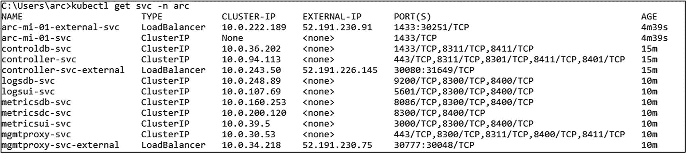

图 9-7 Azure Arc–enabled Data Services namespace 中的 Services

为了实现最大的灵活性，`Azure Arc–enabled Data Services` 要求至少一个 `storage class`。每当创建 `Data Controller` 或 `data service` 时，都需要一个 `storage class`。不同服务之间的类别可以不同，并且每个服务可以为日志（`Kubernetes` 日志）、数据和数据日志使用不同的类别。

如果你想了解更多关于 `Azure Arc–enabled Data Services` 的信息，我们也推荐我们的 Apress 书籍 *Azure Arc–Enabled Data Services Revealed*。

### 部署 Azure Arc–Enabled Data Services

现在是时候部署一些 `Azure Arc–enabled Data Services` 了。

#### 先决条件

正如预期的那样，在我们开始部署过程之前，我们需要一些先决条件。


### Kubernetes 集群

正如您根据架构可能猜测的那样，Kubernetes 集群是必需的。

如前所述，在此集群中，我们还需要至少一个支持动态配置的存储类（就像我们在第 8 章部署 `elasticsearch` 时使用的 NFS 配置器）。

我们将在此部署中使用我们的 `AKSCluster`。如果您更喜欢使用 `kubeadm` 集群，只需相应地调整 `存储类`。

因此，我们首先按照清单 9-1 所示，将 `kubectl` 上下文切换回 `AKSCluster`。

```
kubectl config use-context AKSCluster
```
**清单 9-1**
将 `kubectl` 上下文切换到 `AKSCluster`

我们还将使用清单 9-2 中的 `kubectl` 命令检索此集群中的存储类。

```
kubectl get storageclass
```
**清单 9-2**
列出 `AKSCluster` 中的存储类

除非您已向此集群部署了任何其他存储类，否则输出应类似于图 9-8 所示。

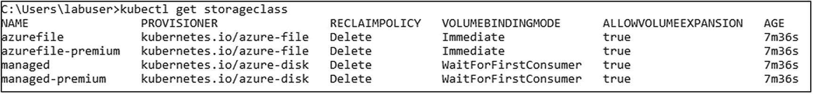
**图 9-8**
AKS 集群中的存储类

### 工具

虽然我们可以通过 YAML 清单部署 Azure Arc 生态系统中的所有内容，但 Microsoft 通过提供另一个抽象层次使我们的工作更轻松。使用名为 `azdata` 的工具，我们可以描述所需的环境和配置服务，它将为我们生成 Kubernetes 中的对象。对于更复杂的场景，可以通过 JSON 文件进行配置，而对于更简单的用例，则可以通过命令行参数运行，这与 `kubectl` 的命令式与声明式概念非常相似。

**注意**
不要混淆 `Azure CLI` 和 `azdata`。它们是两种不同的工具！

我们已经在第 1 章在管理工作站上安装了 `azdata`。

如果您更喜欢图形化体验，Azure Data Studio 也提供了图形化安装向导。此向导将为每次部署创建一个 Jupyter notebook，并在后台调用 `azdata`。然而在本书中，我们将专注于基于命令行的安装。

#### 部署数据控制器

一旦您安装了 `azdata` 并且 `kubectl` 上下文设置为正确的集群，就可以通过类似于清单 9-3 中的命令来部署 Azure Arc 数据控制器。

您需要提供以下设置：

*   **名称：** 控制器的名称。
*   **命名空间：** 要在您的 Kubernetes 集群中使用的命名空间 – 此命名空间不能包含任何其他对象。如果尚不存在，它将被创建。
*   **订阅：** 您的 Azure 订阅 ID。
*   **资源组：** 部署后服务应显示在 Azure 中的资源组。
*   **位置：** 用于存储指标和日志的 Azure 区域。
*   **存储类：** 用于数据控制器数据和日志的存储类。如果省略，将使用默认类。
*   **配置文件名称：** 要使用的部署配置文件。

```
azdata arc dc create \
--connectivity-mode Indirect \
--name arc-dc-aks \
--namespace arc \
--subscription  \
--resource-group "Kubernetes-Cloud" \
--location eastus \
--storage-class managed-premium \
--profile-name azure-arc-aks-premium-storage
```
**清单 9-3**
用于创建数据控制器的 `azdata` 命令

如果您部署到 `AKS` 以外的其他目标，则需要相应地调整 `配置文件名称`。可以使用清单 9-4 中的命令检索可用配置文件的列表。

**注意**
我们的示例使用间接模式，如果您想将指标和日志上传到 Azure 门户，则需要采取本书范围之外的额外步骤。

```
azdata arc dc config list
```
**清单 9-4**
列出数据控制器配置文件名称的 `azdata` 命令

输出将类似于图 9-9 所示。

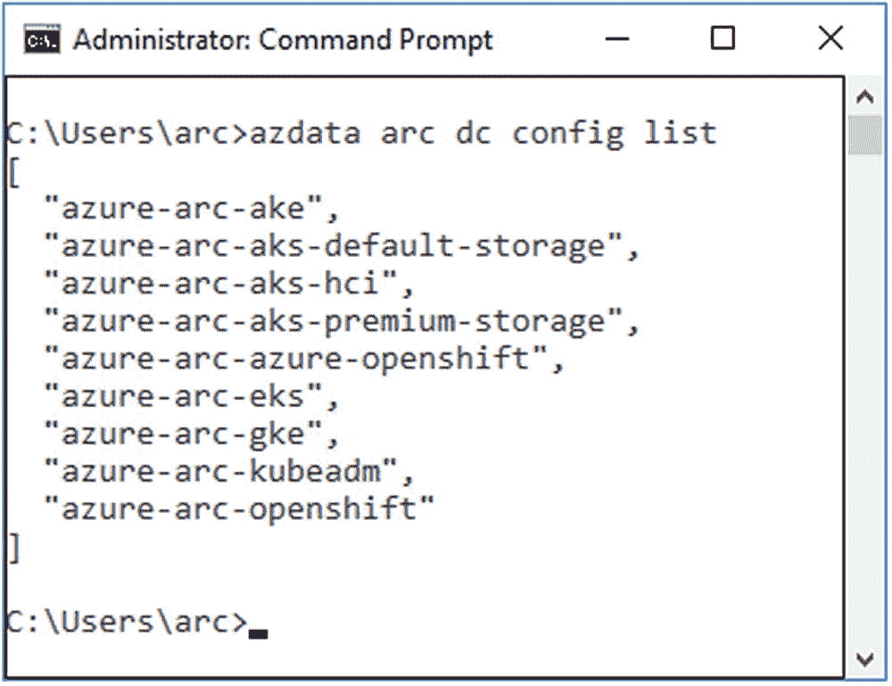
**图 9-9**
Azure Arc 数据控制器的配置配置文件列表

要部署数据控制器，您需要接受许可协议并提供用户名和密码。

如果您想在运行 `azdata` 命令时避免被提示输入它们，也可以在三个环境变量中提供：

*   **ACCEPT_EULA：** 设置为 "Y"（仅当部署数据服务（如 SQL 托管实例）时才需要，数据控制器部署不需要）
*   **AZDATA_USERNAME：** 要使用的用户名，例如 `arcadmin`
*   **AZDATA_PASSWORD：** 为您选择的强密码

如果您想在通过 `azdata` 部署时跟踪 Pod 的创建情况，可以使用清单 9-5 中的命令。

```
kubectl get pods -n arc –watch
```
**清单 9-5**
使用 `kubectl` 监控部署状态

**注意**
每当您向 `kubectl get` 语句添加 `--watch` 开关时，`kubectl` 将持续监控与您的命令匹配的对象，并不断刷新其当前状态。

`azdata` 将在部署完成后报告，如图 9-10 所示。

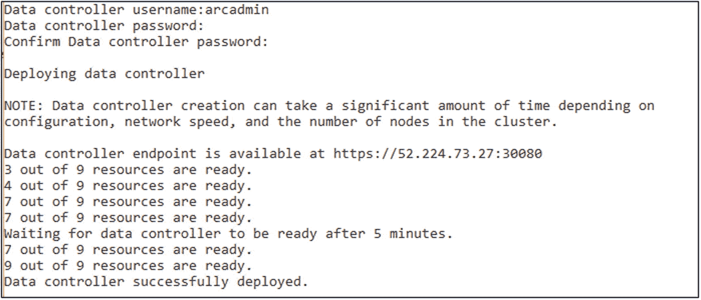
**图 9-10**
数据控制器部署的输出


#### 部署 Azure Arc 托管 SQL 实例

要通过 `azdata` 部署 Azure Arc 托管 SQL 实例，我们首先需要登录到集群，如清单 9-6 所示。

```
azdata login -ns arc
清单 9-6
登录到数据控制器的 azdata 命令
```

注意：如果您未在环境变量中存储用户名和密码，此命令将再次提示您输入。

可以通过一个简单的 `azdata` 命令部署一个新的托管实例，如清单 9-7 中的命令。唯一必需的参数是实例名称。如果您未提供存储类，则将使用默认存储类。这要求必须已定义默认存储类！

```
azdata arc sql mi create \
--name arc-mi-01 \
--storage-class-data managed-premium \
--storage-class-logs managed-premium \
--storage-class-data-logs managed-premium \
--storage-class-backups managed-premium
清单 9-7
使用参数创建新的 SQL 托管实例的 azdata 命令
```

部署过程会再次要求输入用户名和密码，除非您已通过环境变量提供，否则系统会提示您输入。

部署完成后，`azdata` 将报告结果，如图 9-11 所示。

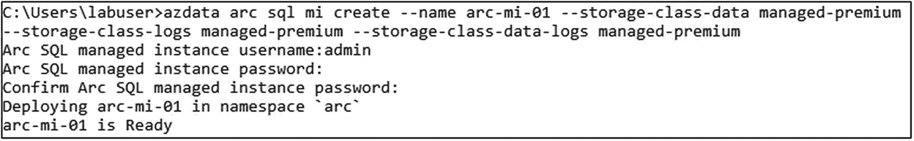

图 9-11：创建 MI 后 `azdata` 的输出。

使用清单 9-8 中的代码查看 Pod。

```
kubectl get pods arc-mi-01-0 -n arc
清单 9-8
kubectl get pods
```

我们还可以看到为我们的托管实例创建的 Pod（图 9-12）。

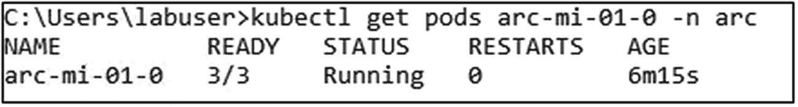

图 9-12：MI 的 Pod。

注意：这是一个包含三个内部运行容器的单一 Pod。这并不意味着我们获得了三个 SQL Server 实例。

要使用 `sqlcmd`、`Azure Data Studio` 或其他客户端工具连接到我们的实例，我们需要 SQL Server 端点的 IP 地址和端口。除了使用 `kubectl` 列出服务外，我们也可以使用清单 9-9 中的 `azdata` 命令来实现此目的。

```
azdata arc sql mi list
清单 9-9
列出当前控制器中所有 SQL MI 的 azdata 命令
```

这将返回我们实例的外部端点、其名称、副本数量及其当前状态，如图 9-13 所示。


图 9-13：Azure Arc 命名空间中的托管实例。

我们现在可以使用此信息连接到我们的 SQL Server。

### Azure Arc SQL 托管实例的高可用性

在撰写本文时，Kubernetes 上的“常规” SQL Server（如我们在第 7 章中部署的）不支持 `可用性组`。

您现在可能想知道，既然 Kubernetes 提供了原生的高可用性，为什么还需要 AG。问题在于，根据您使用的存储类型，在节点发生故障时，存储需要附加到新节点。这个过程可能耗时从几毫秒到几分钟不等。在高可用性环境中，几分钟的停机时间显然是不可接受的。

答案同样在于 Arc 中的 `SQL 托管实例 Always On 可用性组`。如图 9-14 所示，它们将我们在本章前面介绍的 Azure Arc SQL 托管实例与用于高可用性的可用性组 (`AGs`) 结合在一起。

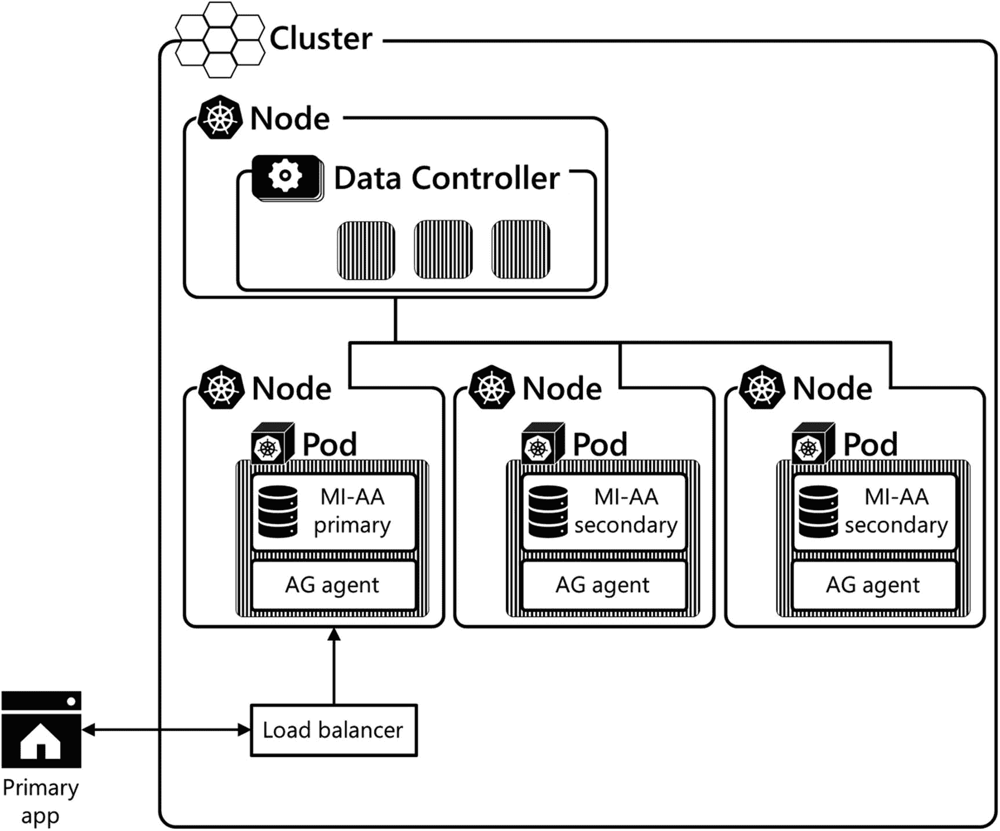

图 9-14：SQL 托管实例 Always On 可用性组。

部署 Azure Arc 托管的 `SQL 托管实例 Always On 可用性组`时，它提供以下功能：

1.  三副本组在内部管理，包括创建可用性组以及将副本加入创建的可用性组。
2.  所有数据库（包括所有用户和系统数据库，如 `master` 和 `msdb`）都会自动添加到可用性组。此功能在可用性组副本之间提供单一系统视图。
3.  会自动预配一个外部端点，用于连接到可用性组内的数据库，支持读写和只读连接。
4.  能够通过连接到辅助实例运行只读工作负载。
5.  在 Pod 或节点发生故障时，自动进行故障转移和实例重新部署。
6.  由系统管理升级。

部署由多个副本支持的托管实例简直太容易了。要将 Azure Arc SQL 托管实例部署为 AG，您只需在创建命令中添加 `--replicas` 开关，如清单 9-10 所示。

```
azdata arc sql mi create \
--name arc-mi-ha \
--replicas 3
清单 9-10
使用参数创建新的 SQL 托管实例的 azdata 命令
```

一旦此部署完成，我们就可以检索主实例的端点，并针对其运行清单 9-11 中的命令来检查我们的可用性组状态。

```
SELECT ag.name agname, ags.* FROM sys.dm_hadr_availability_group_states ags INNER JOIN sys.availability_groups ag ON ag.group_id = ags.group_id
清单 9-11
通过 T-SQL 获取 AG 运行状况
```

如图 9-15 所示，一切看起来都很好。

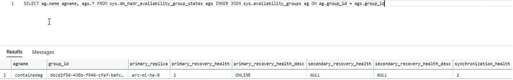

图 9-15：AG 的状态。

仅作参考，如果我们针对单实例部署运行相同的查询，此查询将返回空结果（参见图 9-16）。

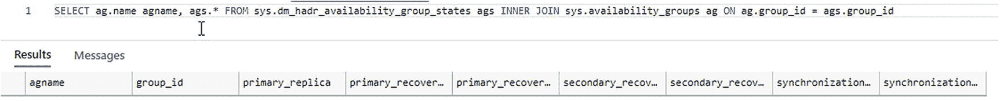

图 9-16：未部署可用性组。

另请注意（图 9-17）我们的 HA 实例是使用三个 Pod 而不是一个部署的——您可以再次使用 `kubectl get pods` 进行验证。

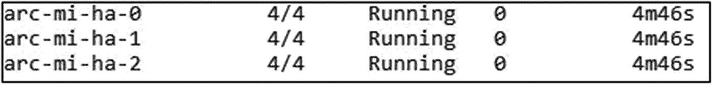

图 9-17：Azure Arc 命名空间中用于托管实例 AG 的 Pod。

注意：这里我们看到三个副本在 StatefulSet 中运行，每个 Pod 运行四个容器。

### 本章小结

在本章中，我们探讨了 Azure Arc 托管的数据服务，以及它们如何通过 `azdata` 添加另一层抽象来允许部署复杂解决方案。我们部署了一个 Azure Arc 托管的数据控制器以及一个 Azure Arc 托管实例，并通过将其部署为可用性组使其具有高可用性。在下一章，也是最后一章，我们将探讨另一种在 Kubernetes 上运行的 SQL Server 实现：大数据群集。

## 10. 大数据群集

既然我们知道了如何在 Kubernetes 上部署 SQL Server，让我们在最后一章看看 Microsoft 如何设计、构建和部署大数据群集以在 Kubernetes 中运行，以及在 Kubernetes 中构建复杂分布式系统并将其作为产品交付所遇到的挑战和制定的解决方案。我们将查看 BDC 架构，并将其映射回 Kubernetes 对象和结构。


### 大数据集群简介

SQL Server 2019 大数据集群——或简称大数据集群——是 SQL Server 2019 中的一套新功能集，涵盖了数据虚拟化、数据集市横向扩展以及人工智能等广泛功能。尽管微软采取“云优先”策略，将新功能和特性首先发布到 Azure，并最终才（如果有的话）推广到本地版本，但它们是盒装产品的一部分，因此虽然你显然可以随心所欲地安装它们，但它们是客户自行管理的。

大数据集群只能在 Linux 上运行（请花点时间好好想想这一点！），并且只能部署在 Kubernetes 集群中。虽然本书到目前为止我们向你展示了将应用程序部署到 Kubernetes 作为 Windows 服务器上经典部署的现代替代方案的方法，但到了这里，你没有选择如何部署它的余地。并且，由于这是继上一章介绍的 Arc 启用数据服务之后的第二个示例，希望这也是你（如果你还没有意识到的话）看到 Kubernetes 如何成为部署现代数据应用程序的平台，以及为什么将其作为你未来技能组合的一部分如此重要的时刻。

SQL Server 2019 大数据集群本质上是 SQL Server、Apache Spark 和 HDFS 在 Kubernetes 环境中的组合。它们不是单一功能，而是一个功能集。图 10-1 将此功能集的不同部分分类到不同的组中，以帮助你更好地理解所提供的内容。总体思路是，通过虚拟化和横向扩展，SQL Server 2019 成为你所有数据的数据中心，即使这些数据并不物理存储在 SQL Server 中。

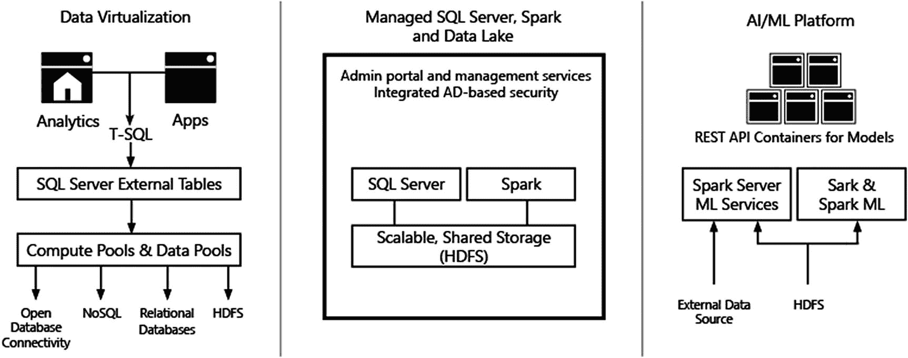

图 10-1

SQL Server 2019 大数据集群功能概览

从左到右展示了大数据集群的主要方面。你拥有对数据虚拟化的支持，然后是一个托管数据平台，最后一个人工智能（AI）平台。

让我们更深入地看看它们。

#### 数据虚拟化

数据虚拟化将数据引入 SQL Server，而这些数据并不物理存储在 SQL Server 中。这是通过 PolyBase 实现的。PolyBase 最初在 SQL Server 2016 中引入，引入了 `外部表` 的概念。虽然 PolyBase 最初只支持基于文件的源，但现在已大大增强，支持其他源，如 Oracle、SQL Server、Teradata、MongoDB 以及无数其他源。这允许你创建一个表，例如 `dbo.Customers`，并像查询本地表一样查询它，但它的数据实际上存储在例如 Azure SQL Database 中。虽然这可能让你联想到链接服务器，但 PolyBase 外部表不需要使用令人头疼的三段式命名法（`Servername.databasename.schemaname.tablename`）并且对它们的查询是多线程的，这些事实只显示了它们相对于链接服务器的一些优势。

外部表没有缓存，因此对它们的每一次查询都会实时访问底层源，这是你在通过 PolyBase 从头构建数据仓库之前应该考虑的因素——考虑延迟和工作负载问题。

#### 托管数据平台

在大数据集群的托管数据平台中，你基本上有两个选项：你可以将单个 SQL Server 表横向扩展到多个 SQL Server 实例——因此，除了将它们分布在文件或文件组上之外，它们被物理地推送到单独的实例中。或者，你可以存储和消费基于文件的数据，如 `CSV` 或 `Parquet` 文件（如果你不熟悉 Parquet，可以将其视为平面文件的 `聚集列存储索引`）。这些文件将再次通过 SQL Server 中的外部表公开和访问，使你可能运行一个看起来只消耗 SQL Server 数据的查询，但实际上它结合了来自 CSV 的数据、Oracle 实例中的表、一个横向扩展到其他几个 SQL Server 上的大型事实表……你明白这个意思了。

#### AI 和应用程序平台

大数据集群允许你部署应用程序，例如，可以是 SSIS 包或 R 或 Python 应用程序。这些应用程序随后可以通过 REST API 公开，并从大数据集群内部以及外部访问。因此，你的大数据集群同时成为你的数据库、文件服务器和应用程序服务器，都在一个单一的部署中，而无需担心这些组件和池之间的连接性。

### BDC 架构

大数据集群可以分为四个逻辑层。将它们视为执行集群内特定功能的各种基础设施和管理部分的集合。每个区域又执行一个或多个角色。例如，在数据层内部，有两个角色：存储池和 SQL 数据池。

图 10-2 展示了四个逻辑区域以及各区域包含的各种角色的概览。

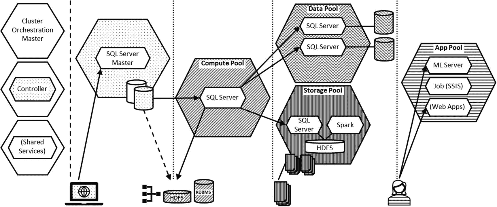

图 10-2

大数据集群架构

你可以立即推断出四个逻辑层：控制层（内部命名为控制平面——就像 Kubernetes 本身也有另一个控制平面一样）以及计算、数据和应用区域。

#### 大数据集群组件

让我们更深入地了解一下大数据集群的组件。

##### BDC 控制平面

控制平面——不要与 Kubernetes 控制平面混淆——是每个 BDC 部署的核心。它结合了 Grafana 和 Kibana 监控仪表板等功能，以及控制服务和配置存储等关键功能。虽然你可能除了仪表板之外永远不会与这些组件中的任何一个交互，但没有它们，你的 BDC 根本无法做任何事情。

##### SQL Server 主实例

你可能已经注意到图 10-2 中显示了一个额外或几乎是独立的角色，SQL Server 主实例。

SQL Server 主实例是一个部署在 Linux 上的 SQL Server，充当你大数据集群的入口点。它通过 Azure Data Studio 或其他工具（如 SQL Server Management Studio）提供外部连接端点。

##### 计算池

计算池由一个或多个 Linux 上的 SQL Server 实例组成，允许你通过 PolyBase 以分布式方式访问各种数据源。例如，计算池可以访问大数据集群本身 HDFS 中存储的数据，或者通过任何 PolyBase 连接器（如 Oracle 或 MongoDB）访问数据。

计算池的主要优势在于，它提供了将查询分布或横向扩展到每个计算池内多个节点的选项，从而提升了 PolyBase 查询的性能。

每个 BDC 部署至少会有一个 SQL 实例作为计算池的一部分。你永远不会直接与它们交互——可能除了调试目的——它们将只是透明地成为你在整个集群中执行查询的一部分。


#### 存储池

存储池为你提供了一个包含 Apache Spark 和 SQL Server 端点的 HDFS 集群。与计算池一样，每个大数据集群（BDC）至少有一个实例作为其存储池的一部分，但根据你的工作负载和用例，你也可以决定使用更多实例。这意味着每个大数据集群都自带其自身的 HDFS，因此能够自托管你可能需要在集群内使用的任何基于文件的数据。如果你已经拥有一个 HDFS 存储，例如在 Azure Data Lake Store (ADLS) 中，你也可以通过所谓的层级化（tiering）将其作为挂载点添加。在这种情况下，你的 ADLS 仅会成为存储池中的一个文件夹。

#### 数据池

另一方面，数据池为你提供多个运行在 Linux Pod/实例上的 SQL Server，这些实例可以——再次通过外部表（external table）的概念——用于将单个表横向扩展到它们之上。理论上，你也可以像所有其他池一样，仅用一个实例部署你的数据池。但这只有在你不打算利用数据池的场景下才有意义，因为显然无法仅用一个实例来横向扩展一个表。你可以将数据池上横向扩展的表想象成一个 `UNION ALL`——你对一个表运行单个查询，却得到了多个物理表的结果。数据池仅支持 `INSERT` 和 `TRUNCATE` 操作，并且不支持事务，因此不要将其视作你的主要数据存储，而应视作 SQL Server 数据的一个缓存。

#### 应用池

最后一个组件是应用池。它允许你通过 Azure Data Studio、Visual Studio Code 或使用 `azdata` 的命令行，将 MLeap、R、Python 或 SSIS 解决方案部署到其上。这些应用程序随后可以通过交互方式、通过 `REST API` 或基于计划来使用。

#### BDC 中的 Kubernetes 构造

每个 BDC 都将部署到它自己的命名空间中，默认是 `mssql-cluster`，位于一个 Kubernetes 集群内。BDC 中的不同组件由独立的 Pod 表示。在不同的池中，例如数据池的每个实例，都将由其自己的 Pod 表示。通过 `kubectl` 检索到的 BDC 命名空间内 Pod 列表的输出可以在图 10-3 中看到。

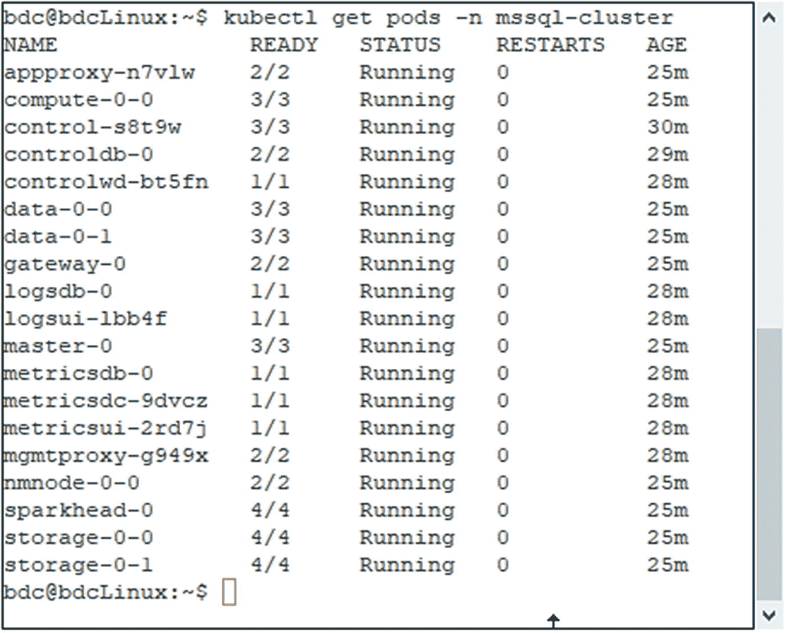

图 10-3

在 BDC 命名空间中执行 `kubectl get pods` 的输出

在此示例中，我们可以看到此特定部署在数据池和存储池中各有两个实例，而在应用池和计算池中各有一个实例，并且其他组件（如 `metricsdb`、`metricsdc` 和 `metricsui` Pod）各有一个或多个 Pod，例如这些 Pod 代表了 Grafana 仪表板。正如你可能现在已经察觉到的，我们在第 8 章部署了 Grafana 和 Kibana，它们作为 Azure Arc 支持的数据服务的一部分交付（如第 9 章所示），并且它们现在再次出现，它们已成为 Kubernetes 上的 SQL Server 世界中监控和日志管理的既定标准。

BDC 的端点在 Kubernetes 中通过服务（service）暴露。根据平台的不同，这些服务的类型将是 `NodePort` 或 `LoadBalancer`，正如我们在图 10-4 的示例中看到的那样。

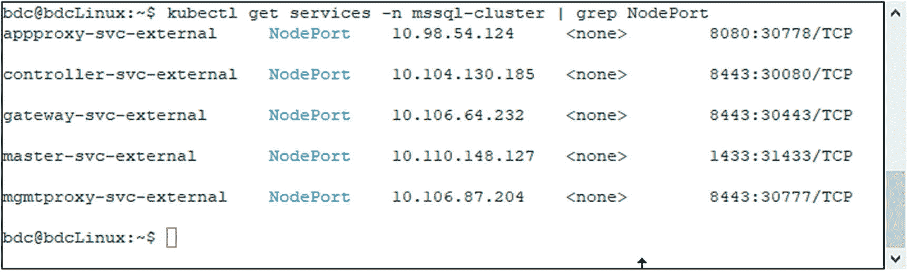

图 10-4

在 BDC 命名空间中执行 `kubectl get services | grep NodePort` 的输出

除了这些服务之外，它还公开了许多 `ClusterIP` 服务，以允许服务之间进行通信。

它还创建了多种不同的集合（sets）——DaemonSets、ReplicaSets 和 StatefulSets。如果我们使用 `kubectl get all -n mssql-cluster` 来列出它们，它们都会出现在输出的下部（图 10-5）。

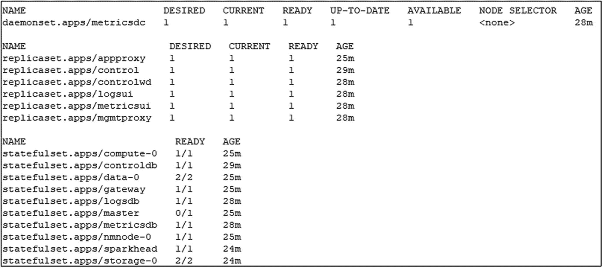

图 10-5

大数据集群中的 Kubernetes 集合

BDC 中的存储通过存储类和其中的动态配置来寻址。正如你在图 10-6 中看到的，大数据集群会根据需要创建动态持久卷声明（以及底层的卷）。

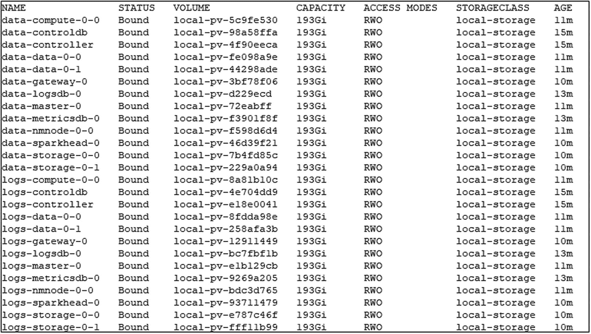

图 10-6

大数据集群中的 PVC

如你所见，大数据集群确实将我们迄今为止所涉及的所有内容整合在了一起，从 Kubernetes 对象、监控，当然还有 SQL Server。


### 部署

与 Azure Arc 支持的数据服务类似，大数据集群通过 `azdata` 部署，并且该过程可以再次从命令行或 Azure Data Studio 运行，后者将创建一个笔记本，然后在后台运行 `azdata`。

部署 BDC 需要一个正常运行的 Kubernetes 集群，该集群可以运行在 `kubeadm`、AKS、EKS 或 OpenShift 上。

要部署 BDC，您需要将 Kubernetes 上下文切换到所需的目标集群，并使用代码清单 10-1 中的代码创建一个配置。

```
azdata bdc config init [--path] [--source -s]
```
清单 10-1
创建 BDC 配置

`Path` 只是配置文件（`bdc.json` 和 `control.json`）将通过清单 10-1 中的命令创建的文件夹名称。`src` 是起始的现有基础模板之一，例如 `aks-dev-test` 或 `kubeadm-prod`。

例如，要在名为 `myBDC` 的子文件夹中创建大数据集群配置的完整命令（该集群计划使用典型的开发/测试环境部署在 AKS 上）如清单 10-2 所示。

```
azdata bdc config init --path myBDC –-source aks-dev-test
```
清单 10-2
创建 BDC 配置

这些文件将用于配置部署的所有方面，从将大数据集群集成到 Active Directory 以进行 AD 认证，到每个池中的副本数量，再到内存和存储要求。清单 10-3 展示了这两个文件之一 `bdc.json` 的示例。

```
{
"apiVersion": "v1",
"metadata": {
"kind": "BigDataCluster",
"name": "mssql-cluster"
},
"spec": {
"resources": {
"nmnode-0": {
"spec": {
"replicas": 2
}
},
"sparkhead": {
"spec": {
"replicas": 2
}
},
"zookeeper": {
"spec": {
"replicas": 3
}
},
"gateway": {
"spec": {
"replicas": 1,
"endpoints": [
{
"name": "Knox",
"dnsName": "",
"serviceType": "NodePort",
"port": 30443
}
]
}
},
"appproxy": {
"spec": {
"replicas": 1,
"endpoints": [
{
"name": "AppServiceProxy",
"dnsName": "",
"serviceType": "NodePort",
"port": 30778
}
]
}
},
"master": {
"metadata": {
"kind": "Pool",
"name": "default"
},
"spec": {
"type": "Master",
"replicas": 3,
"endpoints": [
{
"name": "Master",
"dnsName": "",
"serviceType": "NodePort",
"port": 31433
},
{
"name": "MasterSecondary",
"dnsName": "",
"serviceType": "NodePort",
"port": 31436
}
],
"settings": {
"sql": {
"hadr.enabled": "true"
}
}
}
},
"compute-0": {
"metadata": {
"kind": "Pool",
"name": "default"
},
"spec": {
"type": "Compute",
"replicas": 1
}
},
"data-0": {
"metadata": {
"kind": "Pool",
"name": "default"
},
"spec": {
"type": "Data",
"replicas": 2
}
},
"storage-0": {
"metadata": {
"kind": "Pool",
"name": "default"
},
"spec": {
"type": "Storage",
"replicas": 3,
"settings": {
"spark": {
"includeSpark": "true"
}
}
}
}
},
"services": {
"sql": {
"resources": [
"master",
"compute-0",
"data-0",
"storage-0"
]
},
"hdfs": {
"resources": [
"nmnode-0",
"zookeeper",
"storage-0",
"sparkhead"
],
"settings": {
"hdfs-site.dfs.replication": "3"
}
},
"spark": {
"resources": [
"sparkhead",
"storage-0"
],
"settings": {
"spark-defaults-conf.spark.driver.memory": "2g",
"spark-defaults-conf.spark.driver.cores": "1",
"spark-defaults-conf.spark.executor.instances": "3",
"spark-defaults-conf.spark.executor.memory": "1536m",
"spark-defaults-conf.spark.executor.cores": "1",
"yarn-site.yarn.nodemanager.resource.memory-mb": "18432",
"yarn-site.yarn.nodemanager.resource.cpu-vcores": "6",
"yarn-site.yarn.scheduler.maximum-allocation-mb": "18432",
"yarn-site.yarn.scheduler.maximum-allocation-vcores": "6",
"yarn-site.yarn.scheduler.capacity.maximum-am-resource-percent": "0.3"
}
}
}
}
}
```
清单 10-3
示例 `bdc.json`

一旦您编辑/创建了配置文件，就可以如清单 10-4 所示运行 `azdata` 来创建集群。

```
azdata bdc create -c  --accept-eula yes
```
清单 10-4
使用 `azdata` 创建集群

`Azdata` 将提示您输入用户名和密码，除非您之前已通过环境变量提供了这些信息。根据部署的范围和 Kubernetes 集群的性能，这可能需要几分钟到几小时不等。

您可以跟踪进度并查看完成时间，如图 10-7 所示。

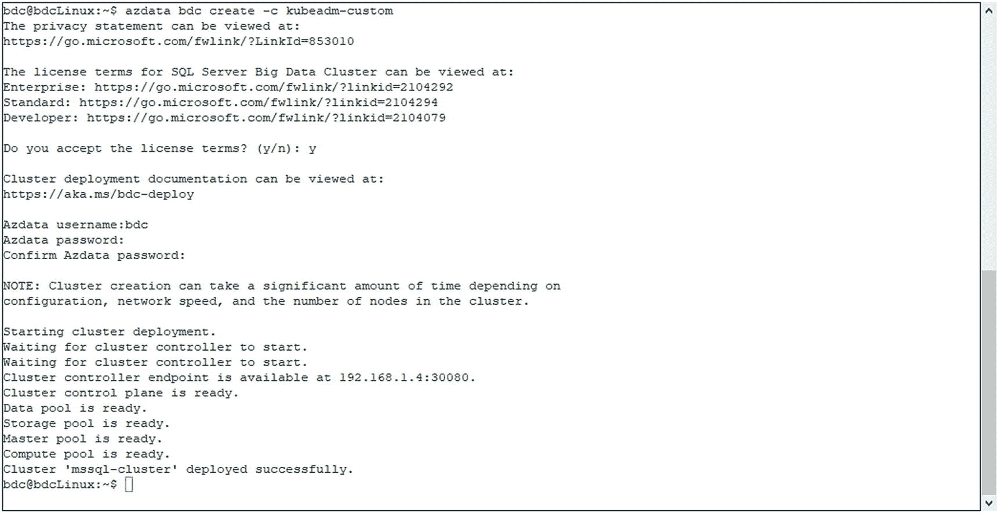

图 10-7
`azdata bdc create` 的输出

部署所需的时间还取决于镜像是否已经预拉取，因为仅这些镜像就需要下载超过 30GB。

### 监控和管理

BDC 可以直接从 Azure Data Studio 内部进行监控，也可以通过 Grafana 和 Kibana 仪表板进行监控，正如我们在前几章中已经遇到过的，如图 10-8 所示。还要注意，您可以更改门户的整体行为（如深色模式与浅色模式），以及此仪表板与我们在前几章中使用的仪表板又略有不同。

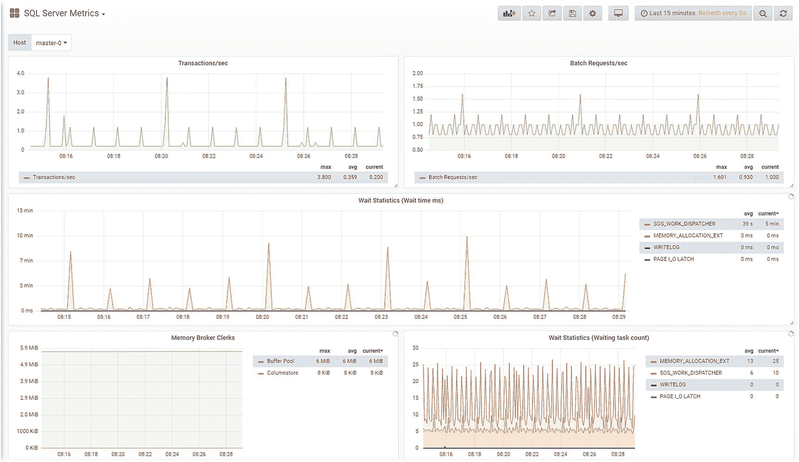

图 10-8
Grafana 门户 – SQL Server 指标

Azure Data Studio 为您提供集群端点的概览以及其健康状况的粗略状态，如图 10-9 所示。

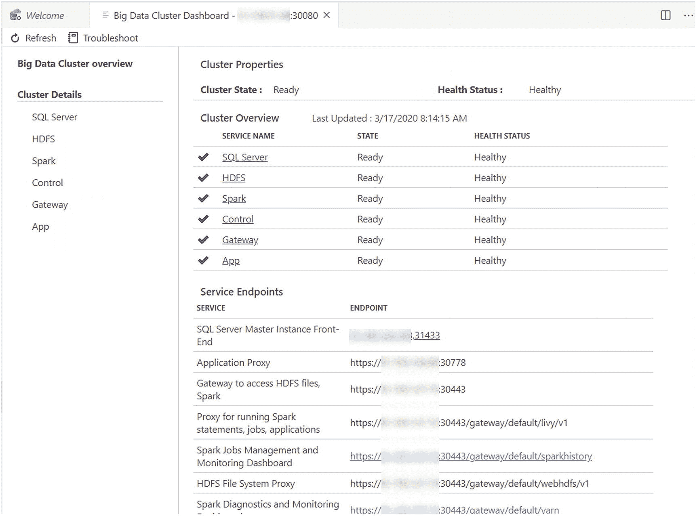

图 10-9
ADS 中的大数据集群概览

除此之外，如图 10-10 所示，它还为您的 BDC 提供了一个故障排除工具集。

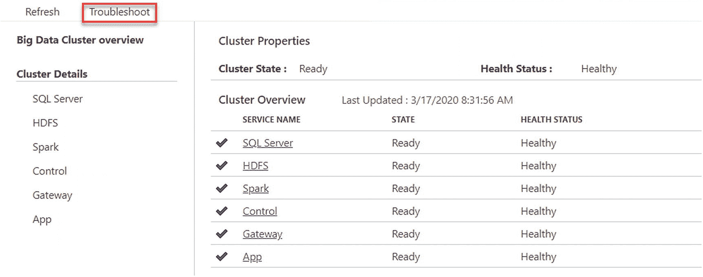

图 10-10
ADS 中的故障排除链接

此按钮背后是用于排除集群每个组件故障的一组笔记本。第一个打开的笔记本是“TSG100 – 大数据集群故障排除程序”，它将指导您完成对大数据集群的全面调试。如果您已经缩小了导致问题的服务范围，您也可以直接导航到该特定组件的分析器笔记本。


### 升级大数据集群

BDC 的升级通过 `azdata` 进行，因此首先请确保你已安装最新版本的 `azdata`。为此，请像首次安装 `azdata` 时一样，运行代码清单 10-5 中的代码。

```
curl -o azdata.msi https://aka.ms/azdata-msi
msiexec azdata.msi
代码清单 10-5
将 azdata 更新至最新版本
```

现在你可以使用 `azdata` 来升级你的集群。对应的命令是 `azdata bdc upgrade`，后至少跟上你的集群名称和目标版本。

例如，要升级到大数据集群 2019 CU9，你会使用代码清单 10-6 所示的命令。这将更新你 BDC 的所有组件。

```
azdata bdc upgrade --name mybdc --tag 2019-CU9-ubuntu-16.04
代码清单 10-6
使用 azdata 将你的 BDC 升级到 CU9
```

这将需要一些时间，因为首先需要拉取所有单独的镜像，然后升级集群中的每一个组件。就像安装过程一样，升级过程会持续提供状态更新，告知当前正在处理哪个组件，直到升级过程完成。

目前，部署后无法更改大数据集群的大小，因此 `azdata` 可以将现有集群升级到另一个版本，但你无法更改池中的实例数量，例如。这需要一个新的部署。

如果你想了解更多关于大数据集群的信息，包括如何部署它们的详细信息，我们推荐 Apress 的书籍 *《SQL Server 大数据集群：数据虚拟化、数据湖与 AI 平台》*。

### 总结

在这最后一章中，我们探讨了如何利用 Kubernetes 以简单、自动化的方式部署像大数据集群这样复杂且异构的应用程序。这也为本书画上了句号。我们希望这有助于你更深入地理解 Kubernetes 以及它如何帮助你部署现代数据应用程序！

