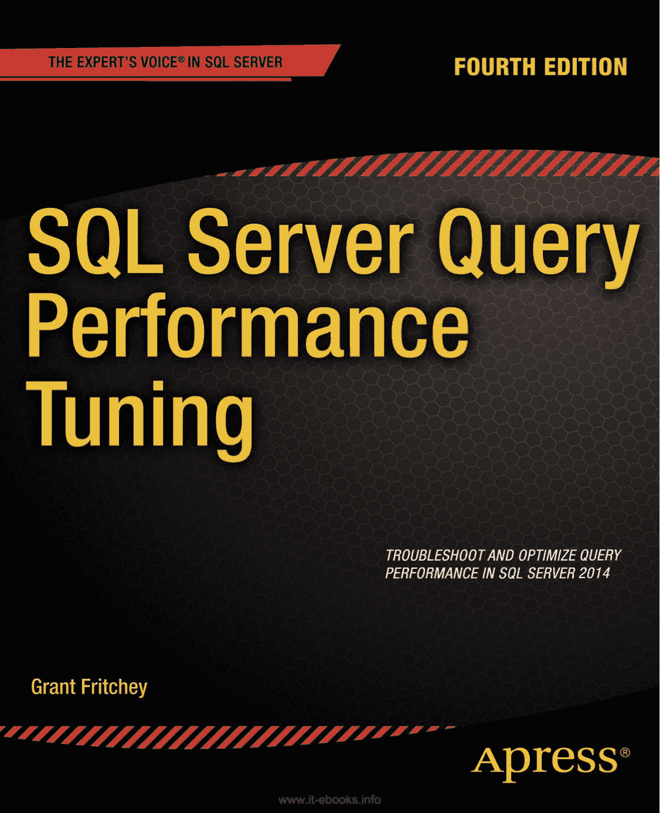
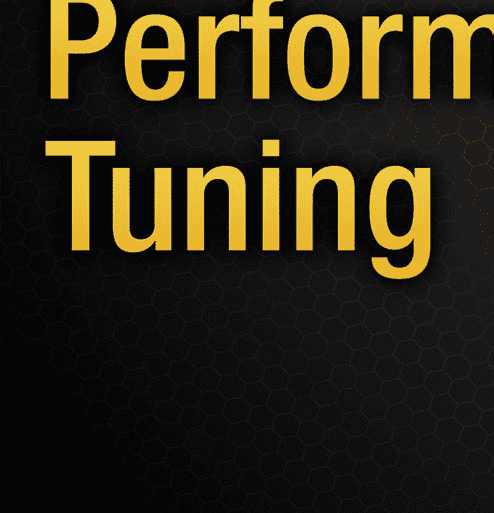
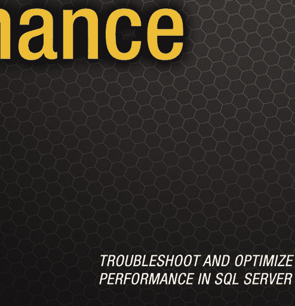
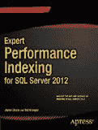
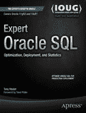
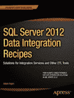

**专业人士为专业人士打造的图书®**

Fritchey

相关书籍

`SQL Server 查询性能调优`

查询运行不够快？想了解 SQL Server 2014 中的内存数据库功能？厌倦了用户打来的求助电话？格兰特·弗里奇（Grant Fritchey）的`《SQL Server 查询性能调优》`就是您 SQL Server 查询性能问题的答案。本书已更新，涵盖了最新的性能优化功能与技术，特别是新增的、此前代号为“Hekaton 项目”的内存数据库功能。本书为您提供了所需工具，助您在优化查询时将性能牢记于心。

`《SQL Server 查询性能调优》`将引导您了解性能不佳的原因、如何识别它们以及如何修复它们。您将学会使用性能监视器（Performance Monitor）和扩展事件（Extended Events）等工具主动建立性能基线。您将学会在电话铃响之前识别瓶颈并化解它们。您也将学到一些快速解决方案，但本书重点在于面向性能进行设计并确保其正确性，以及防患于未然。让您的用户满意。让那恼人的电话铃声静音。今天就将`《SQL Server 查询性能调优》`中的原理和经验付诸实践吧。

归类于
ISBN 978-1-4302-6743-0
数据库/MS SQL Server
5 5 9 9 9
用户级别：
中级–高级
`第四版`
`源代码在线`
9 781430 267430
`www.apress.com`
[`www.it-ebooks.info`](http://www.it-ebooks.info/)

************************为方便您阅读，Apress 已将部分前言材料置于索引之后。请使用书签和“内容概览”链接进行访问。*

*****[`www.it-ebooks.info`](http://www.it-ebooks.info/)

