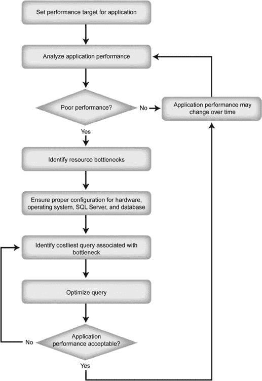
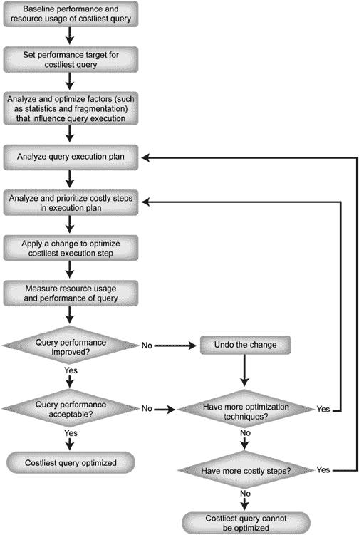

# 第 1 章：SQL 查询性能调优

## 迭代过程

性能调优是一个迭代过程，你需要先识别主要瓶颈，尝试解决它们，衡量变更带来的影响，然后回到第一步，直到性能达到可接受的程度。在应用解决方案时，应尽可能遵循一次只做一项变更的黄金法则。任何变更通常都会影响系统的其他部分，因此你必须重新评估每项变更对整个系统性能的影响。

例如，添加索引可能解决特定查询的性能问题，但也可能导致其他查询运行变慢，正如第 8 章和第 9 章所解释的那样。因此，最好在测试环境中进行性能分析，使用户免受你诊断尝试和中间优化步骤的影响。在这种情况下，一次评估一项变更也有助于根据它们各自的相对贡献，在生产服务器上确定变更的实施优先级。第 24 章解释了如何自动化测试数据库和查询性能。

你可以持续解决那些最痛苦的性能瓶颈，从而逐步提升系统性能。起初，你能够解决重大的性能瓶颈并取得显著的性能提升，但随着迭代的进行，你的收益会逐渐减少。因此，为了高效利用时间，首先量化性能目标是值得的（例如，某个查询的执行时间减少 80%，且对服务器其他部分没有不利影响），然后朝着这些目标努力。

`SQL Server`应用程序的性能高度依赖于用户活动（或工作负载）的数量和分布，以及数据。工作负载和数据的数量与分布通常会随时间变化，而不同的数据可能导致`SQL Server`以不同方式执行`SQL`查询。适用于特定工作负载和数据的性能解决方案可能会在一段时间后失去效果。因此，为确保系统持续保持最佳性能，你需要定期分析系统和应用程序的性能。

性能调优是一个永无止境的过程，如图 1-1 所示。

***图 1-1.** 性能调优过程*

你可以看到，优化开销最大的查询的步骤构成了一个复杂的过程，该过程也需要多次迭代来排查查询内的性能问题，并一次应用一项变更。图 1-2 显示了优化开销最大的查询所涉及的步骤。

***图 1-2.** 优化开销最大的查询*

从这个过程可以看出，要确保正确调优给定查询的性能，需要做大量工作。在性能调优中使用这样一个稳固的过程来专注于已识别的主要问题至关重要。话虽如此，保持对问题整体更广阔的视角也有帮助，因为你可能认为某个方面是性能瓶颈的根源，而实际上是其他因素导致了问题。

如果你运行在某种托管环境中，可能与许多其他虚拟机或数据库共享一台服务器。在某些情况下，你可以与供应商或本地管理员合作，调整这些虚拟环境的设置，以帮助你的`SQL Server`实例表现更好。但是，在许多情况下，你对系统行为的控制力很小或根本没有。你需要与各个平台合作，确定何时触及了该平台的限制，这可能也会导致性能问题。

`SQL Server`和数据库应用程序之间连接性差会损害应用程序性能。你应该问自己的问题之一是：数据库连接质量如何？例如，应用程序执行的查询可能经过高度优化，但用于提交此查询的数据库连接可能会给查询性能增加相当大的开销。确保拥有具有适当带宽的最佳网络配置将是系统设置的基本部分。如果你的环境托管在云端，这一点尤其重要。

在排查性能问题时，也应分析数据库设计。这不仅有助于你理解数据库的实体关系模型，也能理解为什么查询可能以某种方式编写。尽管由于对数据库应用程序的广泛影响，修改正在使用的数据库设计可能并不总是可行，但对数据库设计的良好理解有助于你专注于正确的方向，并理解解决方案的影响。这对于表中使用的主键、外键和聚集索引尤其如此。

应用程序可能因为构建不良的查询而变慢，查询可能无法使用索引，或者索引本身效率低下或缺失。如果任何查询未得到充分优化，它们会严重影响其他查询的性能。我在第 8、9、11、12 和 13 章深入介绍了索引优化。这个阶段接下来的问题应该是：查询变慢是因为其资源密集度高，还是因为与其他查询存在并发问题？你可以在第 20 章找到关于阻塞分析的深入信息。

当进程在服务器上运行时，即使是拥有多处理器的服务器，有时一个进程也会等待另一个进程完成。通过识别什么在等待以及是什么导致它等待，你可以对减慢的根本原因有一个基本的了解。你可以通过`SQL Server`内的动态管理视图和`性能监视器`访问的操作系统计数器来实现这一点。我在第 2-4 章和第 20 章介绍了这些信息。

挑战在于找出哪个因素导致了性能瓶颈。例如，对于运行缓慢的`SQL`查询和硬件资源上的高压力，你可能会发现糟糕的数据库设计和未优化的工作负载都难辞其咎。在这种情况下，你必须进一步诊断症状，并将发现与可能的原因关联起来。因为性能调优可能既耗时又昂贵，所以理想情况下，你应该采取预防性方法，从一开始设计系统时就追求最佳性能。

为了加强预防性方法，在优化性能不佳过程中获得的每一个经验教训，在实施新的数据库应用程序时都应被视为优化指导原则。在实施数据库应用程序时，还有一些经过验证的最佳实践你应该考虑。我在本书中详细介绍了这些最佳实践，第 26 章专门概述了许多优化最佳实践。

请确保在数据库应用程序开发的早期阶段就考虑性能优化技术。这样做将有助于你推出数据库项目，而不会在后期出现大的意外。

不幸的是，我们很少能达到这个理想状态，并且常常发现数据库应用程序需要进行性能调优。因此，重要的是不仅要了解如何提高基于`SQL Server`的应用程序的性能，还要了解如何诊断性能不佳的原因。

[www.it-ebooks.info](http://www.it-ebooks.info/)

## 性能与价格

