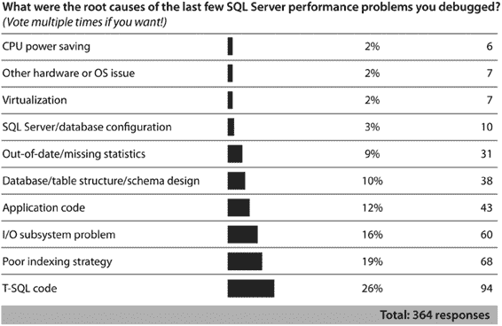

# 第 1 章 SQL 查询性能调优

之前提到过一个观点：为了获得越来越小的性能提升，你需要投入越来越多的时间和金钱。因此，为了确保投资回报最大化，在优化性能时应保持客观，并始终考虑以下两个方面：

-   你的应用程序可接受的性能是什么？
-   这项投资是否值得获得的性能提升？

## 性能目标

要获得最大效率，你必须**现实地**估算性能需求。你可以遵循许多最佳实践来提升性能。例如，你可以将数据库文件放在最高性能的磁盘子系统上。然而，在应用某项最佳实践之前，你应考虑你能从中获得多少收益，以及这些收益是否值得投入。这些性能要求通常由其他人设定，可能是应用程序开发者，也可能是数据的业务消费者。查询调优的一个基本环节是与这些相关方沟通，以确定一套足够好且切合实际的需求。

有时，不实际进行增强就很难预估性能提升。这使得准确定位性能瓶颈的来源变得**尤为重要**。瓶颈是 CPU、内存还是磁盘？是代码、数据结构、索引的问题，还是仅仅达到了硬件的极限？是否因为一个糟糕的路由器、配置不当的 I/O 路径或未正确应用的补丁导致了网络缓慢？务必确保你能基于已知信息，而非猜测，来做这些可能代价高昂的决定。一个实用的方法是按增量增加资源，并分析应用程序在添加资源后的可伸缩性。

一个可伸缩的应用程序会从资源的增量增加中**成比例地**受益，前提是该资源确实是可伸缩性瓶颈所在。如果结果看起来令人满意，那么你就可以承诺进行全面的增强。经验在这里也扮演着重要角色。

## “足够好”的调优

调优的目标不应是系统性能的理论最大值，而应是调到性能“足够好”为止。这是一种普遍采用的性能调优方法。超过这个点后的成本投入，通常会以指数级增长，而性能收益却在减少。80/20 法则（帕累托法则）非常适用：投入你 20%的资源，你可能获得 80%的潜在性能提升；但对于剩余 20%的潜在性能提升，你可能需要额外投入 80%的资源。因此，在设定性能目标时，保持现实态度很重要。只需记住，“足够好”是由你、你的客户以及你合作的业务人员共同定义的。并不存在一个大家都遵守的标准。

企业受益并非考虑纯粹的性能，而是考虑性能的**价格**。然而，如果你的目标是找出应用程序的可伸缩性极限（出于各种原因，包括与竞争对手进行产品营销），那么投入尽可能多的资源可能是值得的。即使在这样的情况下，使用第三方压力测试实验室可能也是一个更好的投资决策。

[www.it-ebooks.info](http://www.it-ebooks.info/)

## 性能基线

性能分析的主要目标之一是了解不同硬件和软件子系统底层的系统使用率或压力水平。这些知识能通过以下方式帮助你：

-   使你能够分析资源瓶颈。
-   使你能够通过将系统利用率模式与预先建立的基线进行比较来排除故障。
-   协助你在容量规划和安排硬件升级时做出准确的估计。
-   帮助你识别出利用率较低的时间段，以便最有效地执行数据库管理活动。
-   帮助你评估可能的硬件缩减或服务器整合的性质。公司为什么会缩减规模？嗯，公司可能租用了一个非常高端的系统，预期会有强劲的增长，但由于增长不佳，现在他们希望缩减系统配置。那整合呢？公司有时会购买过多的服务器，或者意识到维护和许可成本太高。这将使得使用更少的服务器变得非常有吸引力。
-   有些指标只有与先前记录的数值相比才有意义。没有之前的度量，你将无法理解这些信息。

因此，为了更好地了解你的应用程序的资源需求，你应该为你的应用程序的硬件和软件使用情况创建一个**基线**。*基线*作为你系统当前使用模式的统计数据，也作为比较未来统计数据的参考。基线分析帮助你理解应用程序在稳定时期的行为、在此期间硬件资源如何被使用以及软件的特性。建立基线后，你可以执行以下操作：

-   衡量当前性能，并明确你的应用程序的性能目标。
-   将其他硬件或软件组合与基线进行比较。
-   衡量工作负载和/或数据如何随时间变化。
-   确保你了解服务器上的“正常”状态，从而不会将某个任意数字误解为问题。
-   评估应用程序的高峰和非高峰使用模式。这些信息可用于在非高峰时段有效分配数据库管理活动，如完整数据库备份和数据库碎片整理。

你可以使用内置于 Windows 的`性能监视器`来为`SQL Server`的硬件和软件资源利用率创建基线。你也可以使用`动态管理视图`和`动态管理函数`获取此信息的快照。同样，你可以使用`扩展事件`对`SQL Server`查询工作负载进行基线分析，这有助于你在条件稳定时理解 SQL 查询的平均资源利用率和执行时间。你将在第 2-5 章中详细学习如何使用这些工具和查询。

另一个选择是利用众多工具中的一个，在给定的服务器或数据库上生成人工负载。市面上有许多第三方工具可用。微软提供了`SQLIO`（可在 [`bit.ly/1eRBHiF`](http://bit.ly/1eRBHiF) 获取），用于测量你系统的 I/O 容量。微软还有一个工具`SQLIOSim`，用于生成`SQL Server`特定的调用和模拟负载（可在 [`bit.ly/QtY9mf`](http://bit.ly/QtY9mf) 获取）。这些工具主要关注磁盘子系统，而不是你正在运行的查询。要做到这一点，你可以使用在`SQL Server 2012`中添加的性能测试工具`分布式重播`，这将在第 24 章详细讨论。

[www.it-ebooks.info](http://www.it-ebooks.info/)

## 重点投入方向

当你调优特定系统时，请特别关注数据访问层（由你的代码执行或通过你的对象关系映射引擎或其他方式访问数据库的数据库查询和存储过程）。你通常会发现，在数据访问层投入的时间所能产生的积极性能影响，远大于花同等时间去琢磨如何调优硬件、操作系统或`SQL`语句。

