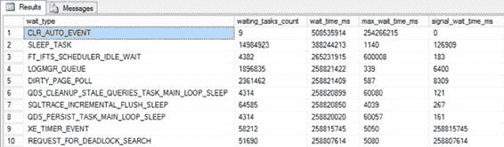

# 第 2 章

## 内存性能分析

系统主要在三个地方直接影响 SQL Server 及其上运行的查询：内存、磁盘和 CPU。在本章中，我们将首先探讨内存。在 SQL Server 中检索数据的查询必须先将该数据加载到内存中。任何对数据的修改首先被加载到内存中，在此进行修改，然后才写入磁盘。许多其他操作也利用系统内存的速度优势，从由于查询中的 `ORDER BY` 子句而对数据进行排序，到执行计算以创建用于联接两个表的哈希表。由于所有这些工作都是在系统内存中完成的，因此理解内存的管理方式非常重要。

在本章中，我将涵盖以下主题：

*   `Performance Monitor`（性能监视器）工具的基础知识
*   用于观察系统行为的一些动态管理对象
*   硬件资源如何以及为何会成为瓶颈
*   观察和测量 SQL Server 及 Windows 内存使用情况的方法
*   内存瓶颈的可能解决方案

### 性能监视器工具

Windows Server 2012 R2 提供了一个名为 `Performance Monitor` 的工具，它收集有关操作系统资源利用率的详细信息。它允许你追踪系统性能的几乎所有方面，包括内存、磁盘、处理器和网络。此外，SQL Server 2014 为 `Performance Monitor` 工具提供了扩展，用于追踪 SQL Server 内的各种功能领域。

`Performance Monitor` 通过捕获系统硬件和软件组件（如处理器、进程、线程等）生成的性能数据来追踪资源行为。系统组件生成的性能数据由一个性能对象表示。该性能对象提供计数器，这些计数器代表组件的特定方面，例如 `Processor` 对象的 `% Processor Time`。请记住，在虚拟机（VM）中运行这些计数器时，许多情况下（取决于计数器类型）为计数器测量的性能是针对 VM 的，而非物理服务器。这意味着在 VM 上收集的一些值不能准确地反映物理现实。

系统组件可以有多个实例。例如，在有两个处理器的计算机中，`Processor` 对象将有两个实例，表示为实例 0 和 1。具有多个实例的性能对象也可能有一个名为 `Total` 的实例，以表示所有实例的总值。例如，对于一台有两个处理器的计算机，可以使用以下性能对象、计数器和实例来确定其总的处理器使用率（如图 2-1 所示）：

*   *性能对象*：`Processor`
*   *计数器*：`% Processor Time`
*   *实例*：`_Total`

**图 2-1.** 添加性能监视器计数器

系统行为可以实时以图表形式跟踪，也可以捕获为文件（称为*数据收集器集*）以便离线分析。在生产服务器上，首选机制是使用文件。你需要将信息收集到文件中，以便存储并在需要时随时间传输。此外，将收集的数据写入文件比在活动内存中于屏幕上收集占用的资源更少。

要运行 `Performance Monitor` 工具，请在命令提示符下执行 `perfmon`，这将打开 `Performance Monitor` 套件。你也可以右键单击桌面或开始菜单上的“计算机”图标，展开“诊断工具”，然后展开 `Performance Monitor`。你还可以转到“开始”屏幕并开始键入 `Performance Monitor`；你会看到启动该应用程序的图标。这些方法中的任何一种都可以让你打开 `Performance Monitor` 实用程序。

你将在第 5 章学习如何设置各个计数器。既然我已经介绍了 `Performance Monitor` 的概念，我将介绍另一个指标收集接口——动态管理对象。

[www.it-ebooks.info](http://www.it-ebooks.info/)

