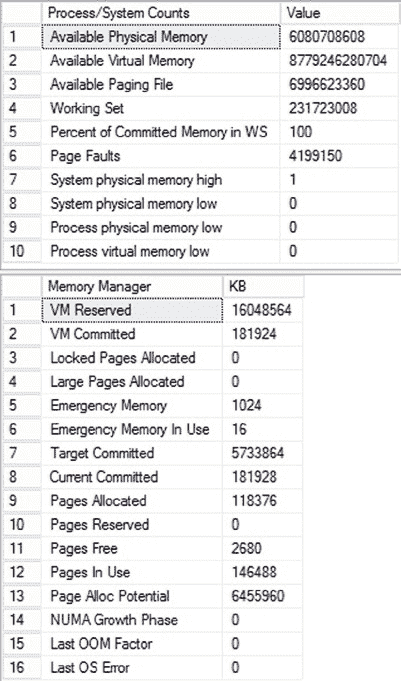

# 第 2 章 ■ 内存性能分析

`页面使用寿命` 指示一个页面在不被引用的情况下将在缓冲池中保留多久。通常，此计数器的值较低意味着页面正从缓冲区中移除，降低了缓存的效率，并表明可能存在内存压力。在报告系统上，与 OLTP 系统相反，由于报告系统会访问更多数据，此数值可能保持在较低水平。在夜间加载期间，`页面使用寿命` 降至非常低的水平也很常见。由于这取决于您拥有的可用内存量和系统上运行的查询类型，因此没有适用于广大受众的硬性数字。因此，您需要为系统建立基线并随时间进行监控。

如果您的机器是非统一内存访问（NUMA）架构，您需要知道标准的 `页面使用寿命` 计数器是一个平均值。要查看特定度量，您需要使用 `缓冲区节点：页面使用寿命` 计数器。

## 检查点页数/秒

`检查点页数/秒` 计数器表示由检查点操作移动到磁盘的页面数量。

这些数字应该相对较低，例如，对于大多数系统，应小于每秒 30。较高的数字意味着更多页面在缓存中被标记为 `脏页`。`脏页` 是在缓冲区中被修改的页面。

当它被修改时，它会被标记为脏页，并将在下一个检查点期间写回磁盘。此计数器上的较高值表明系统中发生的写入数量较大，可能指示存在 I/O 问题。

但是，如果您正在利用新的间接检查点，它允许您控制检查点的发生时间以减少恢复间隔，您可能会在这里看到不同的数字。在监控配置了间接检查点的数据库时，请考虑到这一点。

[www.it-ebooks.info](http://www.it-ebooks.info/)

## 惰性写入/秒

`惰性写入/秒` 计数器记录缓冲区管理器的惰性写入进程每秒写入的缓冲区数量。此进程是系统进程将脏的、老化的缓冲区从缓冲区中移除，以释放内存供其他用途。脏的、老化的缓冲区是指有更改并需要写入磁盘的缓冲区。此计数器上的较高值可能指示 I/O 问题甚至内存问题。`惰性写入/秒` 的值对于普通系统应持续小于 20。然而，与所有其他计数器一样，您必须将您的值与基线度量进行比较。

## 内存授予挂起

`内存授予挂起` 计数器表示 SQL Server 内存中等待内存授予的进程数量。如果此计数器值很高，则 SQL Server 缓冲区内存短缺。在正常情况下，对于大多数生产服务器，此计数器值应持续为 0。

另一种即时检索此值的方法是对 DMV `sys.dm_exec_query_memory_grants` 运行查询。

`grant_time` 列中的 `null` 值表示该进程仍在等待内存授予。这是您可用于通过识别查询（或多个查询）正在等待内存以执行来排查查询超时问题的一种方法。

## 目标服务器内存 (KB) 与 总服务器内存 (KB)

`目标服务器内存 (KB)` 指示 SQL Server 愿意消耗的动态内存总量。`总服务器内存 (KB)` 指示当前分配给 SQL Server 的内存量。如果系统专用于 SQL Server，`总服务器内存 (KB)` 计数器值可能非常高。如果 `总服务器内存 (KB)` 远小于 `目标服务器内存 (KB)`，则要么 SQL Server 内存需求低，要么 SQL Server 的 `max server memory` 配置参数设置得太低，或者系统处于 `预热阶段`。`预热阶段` 是指 SQL Server 启动后，数据库服务器在访问更多数据集时动态扩展其内存分配，将更多数据页带入内存的时期。

您可以通过存在大量空闲页（通常为 5,000 页或更多）来确认 SQL Server 的内存需求较低。此外，您可以通过查询 DMO `sys.dm_os_ring_buffers` 直接检查内存状态，它返回有关 SQL Server 内部内存分配的信息。我将在下一节更详细地介绍 `sys.dm_os_ring_buffers`。

## 附加内存监控工具

虽然您可以从性能监视器计数器获得 SQL Server 内部内存行为的基础数据，但一旦知道需要花时间查看内存使用情况，您就需要利用其他工具和工具集。以下是一些常用于识别 SQL Server 系统上内存问题的参考点。其中一些工具仅适用于内存 OLTP 管理。虽然这些工具中的一些被大量 SQL Server 社区积极使用，但并未记录在 SQL Server 联机丛书中。这意味着它们绝对可能被更改或移除。

### DBCC MEMORYSTATUS

此命令深入 SQL Server 内存并读出当前分配。它是一个时间点的测量，一个快照。它为您提供一组关于内存当前分配位置的度量。运行命令的结果返回为两个基本的结果集，如图 2-5 所示。

[www.it-ebooks.info](http://www.it-ebooks.info/)



*图 2-5. `DBCC MEMORYSTATUS` 的输出*

第一个数据集显示基本的内存分配和发生次数的计数。例如，`可用物理内存` 是系统可用内存的度量，而 `页面错误` 只是发生的页面错误次数的计数。

第二个数据集显示 SQL Server 内部不同的内存管理器以及在调用 `MEMORYSTATUS` 命令时它们消耗的内存量。

这些都可以用来理解内存分配在系统中的发生位置。例如，在大多数系统中，大多数时间内存的主要消费者是缓冲池。您可以将 `目标提交` 值与 `当前提交` 值进行比较，以了解缓冲池是否面临压力。当 `目标提交` 高于 `当前提交` 时，您可能正遇到缓冲缓存问题，需要找出当前正在执行的 SQL Server 进程中哪个进程使用了最多的内存。这可以使用动态管理对象完成。

其余的数据集是 `DBCC MEMORYSTATUS` 产生的完整内存转储中的各种内存管理器、内存 clerks 和其他内存存储。它们仅在非常特定的、涉及 SQL Server 特定管理方面的狭窄情况下才有趣，并且远超出本文档记录它们的范围。您可以在 MSDN 文章 "How to use the DBCC MEMORYSTATUS 命令" ([`bit.ly/1eJ2M2f`](http://bit.ly/1eJ2M2f)) 中阅读更多信息。

[www.it-ebooks.info](http://www.it-ebooks.info/)

### 动态管理对象


## SQL Server 中与内存相关的 DMO

SQL Server 内部存在大量与内存相关的动态管理对象（DMO）。其中一些已随 SQL Server 2014 进行了更新，并且新增了一些。逐一详述所有这些对象超出了本书的范围。在判断 SQL Server 是否存在内存瓶颈时，最常用的主要有三种。

当你需要监控内存 OLTP（事务处理）的内存使用情况时，另外还有两个也很实用。

### Sys.dm_os_memory_brokers

尽管 SQL Server 中的大部分内存都分配给了缓冲区缓存，但内部还有许多其他进程也可能并且确实会消耗内存。这些进程通过此 DMO 暴露它们的内存分配情况。在你有其他迹象表明存在内存瓶颈时，可以使用此 DMO 查看哪些进程可能从缓冲区缓存中抢占了资源。

### Sys.dm_os_memory_clerks

内存 clerk（ clerks ）是在 SQL Server 内部分配内存的进程。查看这些进程的活动情况，可以让你了解 SQL Server 内部是否存在可能剥夺过程缓存所需内存的内部内存分配问题。如果性能监视器中 `Private Bytes`（私有字节）计数器很高，你可以通过 DMV 确定是系统的哪些部分消耗了这些内存。

如果你有一个使用内存 OLTP 存储的数据库，可以使用 `sys.dm_db_xtp_table_memory_stats` 来查看各个数据库对象的情况。但如果你想查看整个实例范围内这些对象的分配情况，则需要使用 `sys.dm_os_memory_clerks`。

### Sys.dm_os_ring_buffers

此 DMV（动态管理视图）未在联机丛书中记录，因此可能会被更改或移除。它在 SQL Server 2008R2 和 SQL Server 2012 之间发生了变化。我通常针对它运行的查询似乎仍然适用于 SQL Server 2014，但这不能保证。此 DMV 以 XML 格式输出。通常你可以肉眼阅读其输出，但若要实现对环形缓冲区的复杂读取，可能需要使用 XQuery。

环形缓冲区不过是对通知的记录响应。环形缓冲区保存在此 DMV 中，访问 `sys.dm_os_ring_buffers` 可以让你看到内存中事物的变化情况。表 2-2 描述了与内存相关的主要环形缓冲区。

### 表 2-2. 与内存相关的主要环形缓冲区

**环形缓冲区** | **Ring_buffer_type** | **用途**
---|---|---
资源监视器 | `RING_BUFFER_RESOURCE_MONITOR` | 随着内存分配的变化，对此变化的通知会记录在此处。此信息对于识别外部内存压力很有用。
内存不足 | `RING_BUFFER_OOM` | 当你遇到内存不足问题时，它们会被记录在此处，这样你就可以知道是哪种内存操作失败了。
内存代理 | `RING_BUFFER_MEMORY_BROKER` | 当 SQL Server 内部内存下降时，低内存通知将强制进程为缓冲区释放内存。这些通知记录在此处，使其成为衡量内部内存压力何时发生的有用指标。
缓冲池 | `RING_BUFFER_BUFFER_POOL` | 缓冲池本身内存不足的通知记录在此处。这只是内存压力的一般性指示。

还有其他可用的环形缓冲区，但它们不适用于内存分配问题。

### Sys.dm_db_xtp_table_memory_stats

要查看你创建的内存中表和索引的使用内存情况，可以查询此 DMV。输出会测量表和索引的已分配内存和已使用内存。它只输出 `object_id`（对象 ID），因此你还需要查询系统视图 `sys.objects` 以获取表或索引的名称。查询此 DMV 时，它仅输出你当前连接到的数据库的信息。

### Sys.dm_xtp_system_memory_consumers

此 DMV 显示用于管理内存引擎内部的系统结构。这通常不是你需要处理的东西，但在排查内存问题时，了解你是直接处理系统内部发生的某些情况，还是仅仅处理你加载到内存中的数据量，是很有帮助的。你在此处要查找的主要指标是每个管理结构显示的 `allocated`（已分配）和 `used`（已使用）字节数。

## 内存瓶颈解决方案

当内存压力很大时（表现为大量的硬错误页面故障），你可以使用图 2-6 所示的流程图来解决内存瓶颈。

### 图 2-6. 内存瓶颈解决流程图

```
开始
  |
  V
内存计数器偏离基线？
  | 是
  V
内存：可用 MBytes（兆字节）低？
  | 是
  V
在 Windows 操作系统中进行故障排除。
  | 否
  V
页面文件：使用率百分比达到峰值或页面文件：使用率百分比很高？
  | 是
  V
在 Windows 操作系统中进行故障排除。
  | 否
  V
你存在内部内存压力。
  |
  V
在 DBCC MEMORYSTATUS 中，COMMITTED（已提交）是否高于 TARGET（目标）？
  | 是
  V
使用 sys.dm_os_memory_brokers 识别大型消耗者。
  | 否
  V
进程：私有字节数是否很高？
  | 是
  V
使用 sys.dm_os_memory_clerks 识别大型消耗者。
  | 否
  V
检查 VAS（虚拟地址空间）内存问题。
  |
  V
检查 Windows 日志和 SQL Server 日志中的内存错误。
```

以下是内存瓶颈的一些常见解决方案：
- 优化应用程序工作负载
- 为 SQL Server 分配更多内存
- 将内存表移回标准存储
- 增加系统内存
- 从 32 位处理器更改为 64 位处理器
- 启用 3GB 进程空间
- 压缩数据
- 解决碎片问题

当然，修复任何可能导致过度内存使用的查询问题始终是一个选择。让我们依次看看这些解决方案。

### 优化应用程序工作负载

大多数情况下，优化应用程序工作负载是最有效的解决方案，但由于此过程涉及复杂性和挑战，通常最后才考虑。要识别内存密集型查询，请使用扩展事件（你将在第 3 章学习如何使用）捕获所有 SQL 查询，然后按 `Reads`（读取）列对跟踪输出进行分组。逻辑读取次数最多的查询最常导致内存压力，但两者之间并不存在线性相关关系。你也可以使用 `sys.dm_exec_query_stats`（一个收集活动缓存中查询指标的 DMV）来识别相同的情况。但是，由于此 DMV 基于缓存，它可能不如使用扩展事件捕获指标那么准确，尽管它会更快、更简单。你将在本书中更详细地了解如何优化这些查询。

### 为 SQL Server 分配更多内存

正如你在“SQL Server 内存管理”部分学到的，`max server memory`（最大服务器内存）配置可以限制 SQL Server 缓冲区内存池的最大大小。如果 SQL Server 的内存需求超过了 `max server memory` 值（你可以通过硬错误页面故障的数量来判断），那么增加该值将允许内存池增长。为了从增加 `max server memory` 值中获益，请确保系统中有足够的物理内存可用。

如果你正在使用内存 OLTP 存储，你可能需要调整为已定义的内存对象资源池分配的内存百分比。但是，这将从 SQL Server 实例的其他部分获取内存。

### 将内存表移回标准存储


