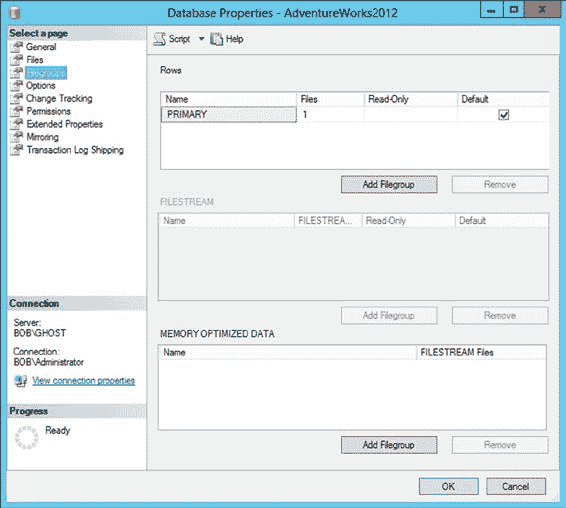
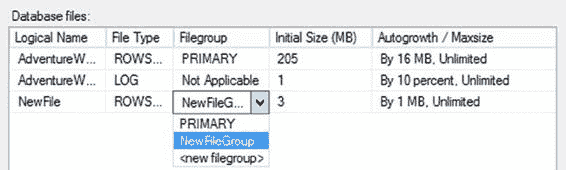

# 第三章 ■ 磁盘性能分析

RAID 1+0（也称为 RAID 10）配置通过镜像阵列中的每个数据盘，提供了高度的容错能力。与 RAID 5 相比，这是一个昂贵得多的解决方案，因为它需要双倍的数据盘来提供容错。当需要大容量存储数据且超过 10% 的磁盘请求是写入时，应使用这种 RAID 配置。由于 RAID 1+0 支持 `split seeks`（将读操作分布到数据盘和镜像盘上，然后合并两个数据流的能力），其读取性能也非常出色。因此，在性能至关重要的场景中，应使用 RAID 1+0。

RAID 1+0 中每个磁盘的 I/O 数由以下等式表示：

`每个磁盘的 I/O 数 = (读取次数 + 2 X 写入次数) / 阵列中的磁盘数量`

### 使用 SAN 系统

尽管成本已经下降，但 SAN 仍然主要是大型企业系统的领域。SAN 可以通过简单地提供更多可读写的主轴和磁盘驱动器来提高存储子系统的性能。由于其规模、复杂性和成本，SAN 并不一定在所有情况下都是好的解决方案。此外，根据数据量，直连存储（DAS）可以配置得运行更快。

SAN 系统的主要优势并不体现在性能上，而是在可扩展性、可用性和维护方面。

SAN 的另一个增长领域是使用互联网小型计算机系统接口（iSCSI）将设备连接到网络的 SAN 设备。由于 iSCSI 接口的工作方式，你可以使网络设备看起来像是本地连接的存储。事实上，它的速度几乎和本地连接存储一样快，但你可以整合你的存储系统。

相反，通过使用本地磁盘并摆脱 SAN，你可能会获得性能提升。SAN 系统在设计上是高度冗余的。但是，这种冗余给磁盘操作增加了很多开销，尤其是 SQL Server 典型执行的操作类型：快速执行的大量小型写入。虽然从单个本地磁盘迁移到 SAN 可能是一种改进，但根据你的系统和你搭建的磁盘子系统，在 SAN 之外可能会获得更好的性能。

### 使用固态硬盘

固态硬盘正在席卷磁盘性能领域。这些驱动器使用内存而不是旋转磁盘来存储信息。它们安静、功耗低、速度极快。然而，与硬盘驱动器（HDD）相比，它们也相当昂贵。在撰写本文时，HDD 的成本约为 0.03 美元/GB，而 SSD 约为 0.90 美元/GB。但这种成本被速度的提升所抵消，从大约每秒 100 次操作提升到每秒 5,000 次操作甚至更高。你还可以通过 SAN 或 RAID 将 SSD 放入阵列中，进一步增加性能优势。SSD 驱动器可能执行的写入操作次数是有限的，但到目前为止，其故障率并不高于 HDD。还有具有不同价格点和性能指标的混合解决方案。对于纯硬件解决方案，为 I/O 受限的系统实施 SSD 可能是你能做的最佳操作。

### 正确对齐磁盘

Windows Server 2012 R2 在安装过程中会进行磁盘对齐，因此现代服务器应该不会遇到这个问题。但是，如果你有较旧的服务器，这仍然是个问题。如果你要从 Windows Server 2008 之前的系统迁移卷，也需要担心这个问题。你将需要重新格式化这些卷以正确设置对齐。数据存储在磁盘上的方式是一系列存储在磁道上的`扇区`（也称为`块`）。当供应商确定的磁道大小（包含的扇区数量）与你正在写入的默认大小不同时，磁盘就处于未对齐状态。这意味着一个扇区可以正确写入，但下一个扇区将不得不跨越两个磁道。这可能会使读写磁盘所需的 I/O 量增加一倍以上。关键是对齐分区，以便为磁道存储正确数量的扇区。

### 增加系统内存

当物理内存不足时，系统开始将内存内容写回磁盘，并更频繁地读取较小的数据块，或读取较大的数据块，这两者都会导致大量分页。系统的内存越少，磁盘子系统的使用就越频繁。这可以通过使用前一节列举的内存瓶颈解决方案来解决。

### 创建多个文件和文件组

在 SQL Server 中，每个用户数据库由一个或多个数据文件和通常一个事务日志文件组成。属于一个数据库的数据文件可以组合在一个或多个文件组中，用于管理和数据分配/放置目的。例如，如果一个数据文件被放在一个单独的文件组中，那么可以通过将文件组设置为只读来集体控制对该文件组中所有表的写入访问（事务日志文件不属于任何文件组）。

你可以从 SQL Server Management Studio 为数据库创建文件组，如图 3-2 所示。

数据库的文件组显示在“数据库属性”对话框的“文件组”窗格中。





`图 3-2. 文件组配置`

在图 3-2 中，你可以看到默认为 AdventureWorks2012 创建了一个单一的文件组。你可以将多个文件添加到分布在多个 I/O 路径上的多个文件组中，以便在将数据库对象也移动到这些不同的组之后，可以在组之间并行工作并进行分布式存储，实质上是让多个主轴和多个 I/O 路径工作起来。但是，仅仅通过单个磁盘控制器向磁盘（即使是不同的磁盘）抛出大量文件，可能会导致性能更差，而不是更好。

你可以在“数据库属性”对话框的“文件”窗口中，通过从下拉列表中选择，向文件组添加数据文件，如图 3-3 所示。

`图 3-3. 数据文件配置`

你也可以通过编程方式执行此操作，如下所示：

```
ALTER DATABASE AdventureWorks2012 ADD FILEGROUP Indexes;
ALTER DATABASE AdventureWorks2012 ADD FILE (NAME = AdventureWorks2012_Data2,
     FILENAME = 'S:\DATA\AdventureWorks2012_2.ndf',
     SIZE = 1mb,
     FILEGROWTH = 10%) TO FILEGROUP Indexes;
```

通过将经常连接的表分离到不同的文件组中，然后将文件组中的文件放在不同的磁盘或 LUN 上，分离的 I/O 路径可以提高性能。例如，考虑以下查询：

```
SELECT jc.JobCandidateID,
       e.ModifiedDate
FROM HumanResources.JobCandidate AS jc
INNER JOIN HumanResources.Employee AS e
     ON jc.BusinessEntityID = e.BusinessEntityID;
```


