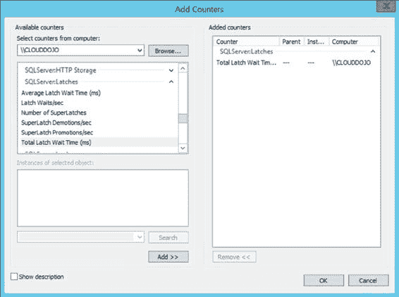
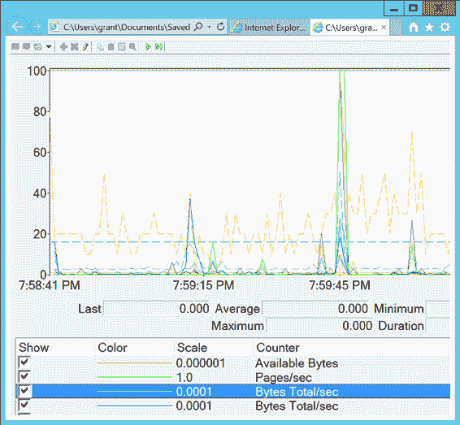
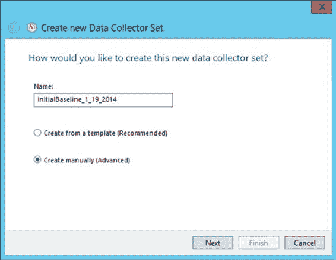
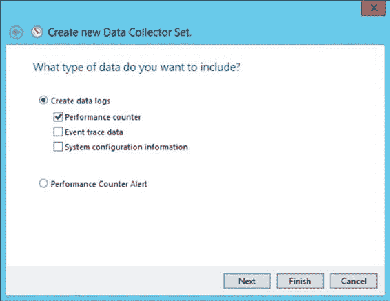

# 第五章：创建基线

在开始创建基线之前，我将先谈谈虚拟机（VM）。越来越多的 SQL Server 实例运行在虚拟机上。当你使用虚拟机或在 Amazon 或 Microsoft Azure 等远程环境中托管虚拟机时，许多标准性能计数器将不再显示有意义的信息。如果你在虚拟机内部监控这些计数器，从故障排除的角度来看，你的数字可能没有帮助。如果你在物理机（假设有访问权限，而这台物理机无疑被多个不同的虚拟机共享）上监控这些计数器，你将无法识别特定 SQL Server 实例的资源瓶颈。

因此，在使用虚拟机工作时，必须监控额外的信息。你可以在虚拟机设置中收集的关于磁盘和网络性能的大多数信息仍然适用。所有查询度量信息对于那些查询也将是准确的。完全不同的且相当不可靠的是内存和 CPU 度量。

这是因为在虚拟化服务器环境中，CPU 和内存在机器之间是共享的。你可能在一个 CPU 上启动一个进程，却在另一个完全不同的 CPU 上完成它。一些虚拟环境实际上可以根据机器对内存需求的变化来改变分配给该机器的内存。面对这些变化，传统的监控方式并不适用。好消息是，主要的虚拟机供应商为你提供了如何监控其系统以及如何在他们的系统中使用 SQL Server 的指南。对于监控虚拟机的具体细节，你可以很大程度上依赖这些第三方文档。以两种最常见的虚拟机管理程序为例，VMware 和 HyperV，以下是各自的一份文档：

*   VMware 监控虚拟机性能（[`bit.ly/1f37tEh`](http://bit.ly/1f37tEh)）
*   测量 HyperV 性能（[`bit.ly/1aBHdxW`](http://bit.ly/1aBHdxW)）

[www.it-ebooks.info](http://www.it-ebooks.info/)

队列计数器，例如 `处理器队列长度`，在虚拟机内部监控时仍然适用。这些表明虚拟机本身资源匮乏，导致你的 SQL Server 实例也资源匮乏，不得不等待访问虚拟 CPU。需要记住的重要一点是，在虚拟机上 CPU 和内存会更慢，因为虚拟机的管理会干扰系统资源。由于托管资源的共享性质，你可能还会看到托管虚拟机上的 I/O 速度较慢。

## 创建基线

现在你已经了解了一些主要的性能计数器，让我们看看如何将这些计数器整合起来创建一个系统基线。你需要遵循以下步骤：

1.  创建一个可重用的性能计数器列表。
2.  使用你的性能计数器列表创建一个计数器日志。
3.  最小化性能监视器开销。

### 创建一个可重用的性能计数器列表

在一台连接到与 SQL Server 系统相同网络的 Windows Server 2012 R2 机器上运行性能监视器工具。通过 属性 ➤ 数据 ➤ 添加计数器 对话框，将性能计数器添加到性能监视器的“查看图表”显示中，如图 5-1 所示。

**图 5-1.** 添加性能监视器计数器

[www.it-ebooks.info](http://www.it-ebooks.info/)

例如，要添加性能计数器 `SQLServer:Latches:Total Latch Wait Time(ms)`，请按照以下步骤操作：
1.  选择 `从计算机选择计数器` 选项，并在相应的输入字段中指定运行 SQL Server 的计算机名称。
2.  单击性能对象 `SQLServer:Latches` 旁边的箭头。
3.  从性能计数器列表中选择 `Total Latch Wait Time(ms)` 计数器。
4.  单击 `添加` 按钮，将此性能计数器添加到要添加的计数器列表中。
5.  根据需要继续添加其他计数器。完成后，单击 `确定` 按钮。

在为基线创建可重用列表时，你可以重复前面的步骤来添加表 5-1 中列出的所有性能计数器。

**表 5-1.** 用于分析 SQL Server 性能的性能监视器计数器

**对象(实例[,实例 N])** | **计数器**
--- | ---
`Memory` | `Available MBytes`, `Pages/sec`
`PhysicalDisk(数据盘, 日志盘)` | `% Disk Time`, `Current Disk Queue Length`, `Disk Transfers/sec`, `Disk Bytes/sec`
`Processor(_Total)` | `% Processor Time`, `% Privileged Time`
`System` | `Processor Queue Length`, `Context Switches/sec`
`Network Interface(网卡)` | `Bytes Total/sec`
`Network Segment` | `% Net Utilization`
`SQLServer:Access Methods` | `FreeSpace Scans/sec`, `Full Scans/sec`
`SQLServer:Buffer Manager` | `Buffer cache hit ratio`
`SQLServer:Latches` | `Total Latch Wait Time (ms)`
`SQLServer:Locks(_Total)` | `Lock Timeouts/sec`, `Lock Wait Time (ms)`, `Number of Deadlocks/sec`
`SQLServer:Memory Manager` | `Memory Grants Pending`, `Target Server Memory (KB)`, `Total Server Memory (KB)`
`SQLServer:SQL Statistics` | `Batch Requests/sec`, `SQL Re-Compilations/sec`
`SQLServer:General Statistics` | `User Connections`

[www.it-ebooks.info](http://www.it-ebooks.info/)

添加完所有性能计数器后，单击 `确定` 关闭“添加计数器”对话框。要将计数器列表保存为 `.htm` 文件，请在性能监视器的右框架中任意位置右键单击，然后选择 `将设置另存为` 菜单项。

这个 `.htm` 文件列出了所有的性能计数器，可以用作基础计数器集，来创建计数器日志或为同一台 SQL Server 机器交互式查看性能监视器图表。要将此计数器列表用于其他 SQL Server 机器，请在文本编辑器（如记事本）中打开 `.htm` 文件，并将所有出现的 `\\SQLServerMachineName` 替换为空字符串（即删除）。

Erin Stellato 在文章 “自定义性能监视器的默认计数器”（[`bit.ly/1brQKeZ`](http://bit.ly/1brQKeZ)）中概述了完成所有这些操作的一个快捷方法。

你还可以使用此计数器列表文件在 Internet 浏览器中交互式查看性能监视器图表，如图 5-2 所示。

**图 5-2.** 在 Internet 浏览器中的性能监视器

[www.it-ebooks.info](http://www.it-ebooks.info/)

### 使用性能计数器列表创建计数器日志

性能监视器提供了一个计数器日志工具，用于保存一段时间内多个计数器的性能数据。你可以使用性能监视器查看保存的计数器日志来分析性能数据。通常，从已定义的性能计数器列表创建计数器日志是很方便的。仅仅收集数据，而不是通过 GUI 查看，是为服务器性能故障排除或建立基线做准备的首选自动化方法。

在性能监视器中，展开 `数据收集器集` ➤ `用户定义`。右键单击并选择 `新建` ➤ `数据收集器集`。定义集的名称，并通过单击相应的单选按钮选择手动创建；然后像我在图 5-3 中配置的那样单击 `下一步`：

**图 5-3.** 为数据收集器集命名

你必须定义要收集的数据类型。在这种情况下，选择 `创建数据日志` 单选按钮下的 `性能计数器` 复选框，然后如图 5-4 所示单击 `下一步`：

[www.it-ebooks.info](http://www.it-ebooks.info/)

