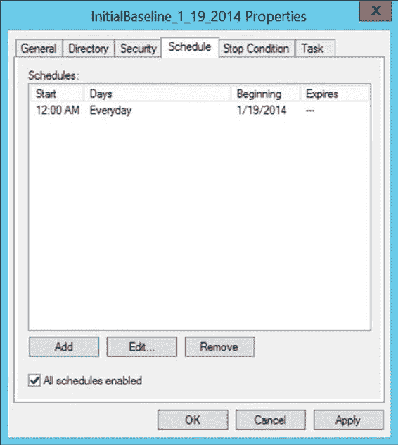

# 图 5-4. 为数据收集器集选择数据日志和性能计数器

在此处，您可以使用与图 5-1 中展示的相同的“添加计数器”对话框来定义要收集的性能对象。单击“下一步”可以定义目标文件夹。再次单击“下一步”，然后选择单选按钮“打开此数据收集器集的属性”，再单击“完成”。

您可以安排计数器日志在特定时间自动启动，并在经过一定时间段后或在特定时间停止。您可以通过“计划”选项卡配置这些设置。您可以在图 5-5 中看到一个示例：

[www.it-ebooks.info](http://www.it-ebooks.info/)

**第 5 章 ■ 创建基线**

