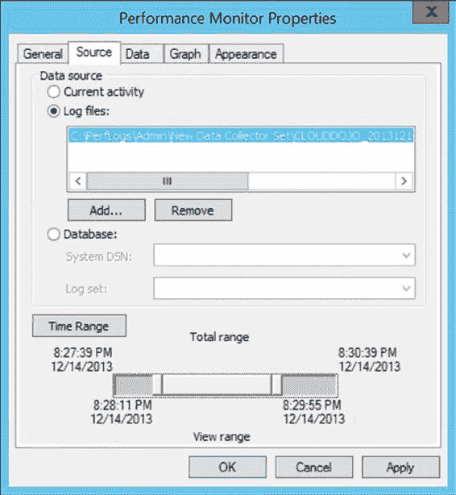

# 图 5-6. 定义性能监视器计数器日志

> **注意** 我将在后续章节中提供更多关于这些设置的建议。

有关如何使用性能监视器创建计数器日志的更多信息，请参阅 Microsoft 知识库文章“Windows Server 2012 R2 性能调整指南”(http://bit.ly/1icVvgn)。

### 性能监视器注意事项

如果使用得当，`Performance Monitor` 工具的设计旨在增加尽可能少的开销。为了最小化使用此工具对系统的影响，请考虑以下建议：

• 限制计数器的数量，特别是性能对象的数量。
• 使用计数器日志，而不是以交互方式查看 `Performance Monitor` 图。
• 在以交互方式查看图时，远程运行 `Performance Monitor`。
• 将计数器日志文件保存到不同的本地磁盘。
• 增大采样间隔。

让我们更详细地考虑每一点。

[www.it-ebooks.info](http://www.it-ebooks.info/)

**第 5 章 ■ 创建基线**

#### 限制计数器数量

使用较小的采样间隔监控大量性能计数器可能会对系统产生一定的开销。这些开销的主要部分来自您正在监控的性能对象的数量，因此明智地选择它们很重要。所选性能对象的计数器数量不会增加太多开销，因为它只给出对象本身的一个属性。因此，了解您要监控哪些对象以及为什么监控是重要的。

#### 首选计数器日志

使用计数器日志，而不是以交互方式查看 `Performance Monitor` 图，因为 `Performance Monitor` 绘图在开销方面成本更高。当前活动的监控应仅限于短期的数据查看、故障排除和诊断。通过计数器日志报告的性能数据是*采样收集的*，这意味着数据是周期性收集的，而不是被跟踪的，而 `Performance Monitor` 图则在事件发生时实时更新。使用计数器日志将减少这种开销。

#### 远程查看性能监视器图

由于使用 `Performance Monitor` 图查看实时性能数据会在系统上产生相当大的开销，请在另一台计算机上远程运行该工具，并通过该工具连接到 `SQL Server` 系统。

要远程连接到 `SQL Server` 计算机，请在连接到 `SQL Server` 计算机所在网络的计算机上运行 `Performance Monitor` 工具。

如图 5-1 所示，在“从计算机选择计数器”框中键入 `SQL Server` 计算机的计算机名（或 IP 地址）。请注意，如果您通过 Windows Server 2012 R2 终端服务会话连接到生产服务器，该工具的主要部分仍将在服务器上运行。

不过，我仍然建议您避免使用监视图来查看实时数据。您可以使用这些图来查看通过计数器日志收集的文件，并应优先考虑使用那些日志。

#### 本地保存计数器日志

收集用于计数器日志的性能数据不会产生显示任何图形的开销。因此，在使用计数器日志模式时，在 `SQL Server` 系统本地记录计数器值比通过网络传输性能数据更高效。将计数器日志文件放在与被监控磁盘（即您的 `SQL Server` 数据和日志文件所在磁盘）不同的本地磁盘上。

然后，在收集数据后，将该计数器日志复制到您的本地计算机进行分析。这样，您只处理副本，而不会为存储位置增加 I/O 开销。

#### 增大采样间隔

由于在基线监控期间您主要对资源利用模式感兴趣，您可以轻松地将性能数据采样间隔增加到 `60 seconds` 或更长，以减小日志文件大小并减少磁盘 I/O 的需求。您可以使用较短的采样间隔来检测和诊断时序问题。即使以交互方式查看 `Performance Monitor` 图时，也请将采样间隔从默认值每秒一个样本增大。请记住，增大或减小采样大小会影响数据的粒度和数量。您必须仔细权衡这些选择。

[www.it-ebooks.info](http://www.it-ebooks.info/)

**第 5 章 ■ 创建基线**

## 根据基线分析系统行为

数据库应用程序的默认行为会随着时间的推移而改变，原因包括以下因素：

• 数据量和分布的变化
• 用户群的增加
• 应用程序使用模式的变化
• 应用程序行为的添加或更改
• 新服务包或软件升级的安装
• 硬件的更改

由于这些变化，为数据库服务器创建的基线逐渐失去其意义。将系统当前行为与旧基线进行比较可能并不总是准确的。因此，定期创建新基线以保持基线的最新性非常重要。存档以前的基线日志也很有益，以便日后需要时可以参考。因此，虽然旧基线确实不适用于日常操作，但它们确实有助于您建立模式和长期趋势。

可以通过以下步骤使用 `Performance Monitor` 工具分析系统基线或当前行为的计数器日志：

1.  打开计数器日志。使用 `Performance Monitor` 的工具栏项“查看日志文件数据”并选择日志文件名。
2.  添加所有性能计数器以分析性能数据。请注意，仅在计数器日志创建期间选择的性能对象、计数器和实例会显示在选择列表中。
3.  通过相应地调整时间范围来分析一天中不同时间段的系统行为，如图 5-7 所示。

[www.it-ebooks.info](http://www.it-ebooks.info/)

**第 5 章 ■ 创建基线**

