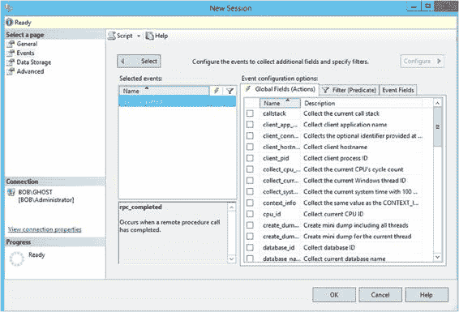
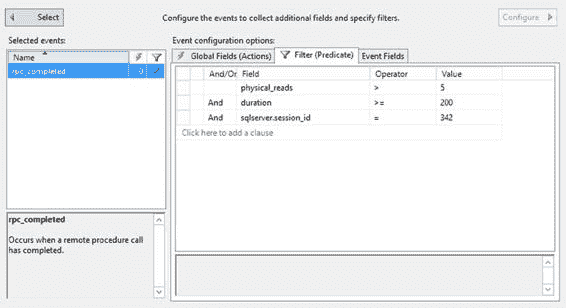

# 第 6 章 ■ 查询性能指标

### 扩展事件会话

你可以在 Management Studio 的图形界面中找到扩展事件基础设施。你可以使用 `对象资源管理器` 导航到给定实例上的 `管理` 文件夹，找到 `扩展事件` 文件夹。从那里，你可以查看系统中已构建的会话。要开始设置你自己的会话，只需右键单击 `会话` 文件夹并选择 `新建会话`。有一个向导可用于设置会话，但它所做的操作与常规图形界面并无不同，而且常规图形界面易于使用。将打开一个窗口，显示第一页，称为 `常规` 页，如图 6-1 所示。

**图 6-1.** 扩展事件新建会话窗口，常规页

你必须提供一个会话名称。我强烈建议给它一个清晰的名字，以便日后查看时知道该会话的用途。你还可以选择使用模板。模板是预定义的会话，只需最少的工作量即可投入使用。有五个模板与查询调优直接相关：

*   *查询批处理采样*：此模板将捕获服务器上所有活动会话中 20% 的查询和过程调用。
*   *查询批处理跟踪*：此模板捕获服务器上所有会话的所有查询和过程。
*   *查询详细信息采样*：此模板包含一组事件，将捕获服务器上所有活动会话中 20% 的查询和过程中的每条语句。
*   *查询详细信息跟踪*：此模板与 *查询批处理跟踪* 相同，但同时也会捕获系统中的每一条单独语句。这会产生大量数据。
*   *查询等待统计信息*：此模板捕获服务器上所有活动会话中 20% 的每个查询和过程的每条语句的等待统计信息。

对于此处的示例，我们将跳过模板，自行设置事件，以便你了解操作过程。

> **注意：** 没有东西是免费或没有风险的。扩展事件是收集系统信息的一种比旧的跟踪事件高效得多的机制。但扩展事件也并非没有成本和风险。根据你定义的事件，尤其是本章后面将详细讨论的某些全局字段，实施扩展事件可能会对你的系统产生影响。在生产系统上使用这些事件时要谨慎，以确保不会造成负面影响。

你必须决定是否希望会话在服务器启动时启动。长时间收集性能指标会产生大量数据，你需要处理这些数据。你还可以决定是否希望在创建会话后立即启动它，以及是否希望查看实时数据。如你所见，`新建会话` 窗口实际上已经非常接近向导了。它只是缺少一个 `下一步` 按钮。一旦你提供了名称并在此处做了其他选择，请单击下一页 `事件`，如图 6-2 所示。

**图 6-2.** 扩展事件新建会话窗口，事件页

*事件* 代表 SQL Server 中执行的各种活动，在某些情况下，也代表底层操作系统中的活动。围绕事件目标、事件包和事件会话有一整套架构，但使用图形界面意味着你无需担心所有这些细节。我将在本章后面展示如何编写会话脚本时介绍部分架构。

对于性能分析，你主要关注那些能帮助你判断 SQL Server 上执行的各种活动所造成的资源压力级别的事件。所谓 *资源压力*，我指的是如下事项：

*   SQL 活动涉及了何种 CPU 利用率？
*   使用了多少内存？
*   涉及了多少 I/O？
*   SQL 活动执行了多长时间？
*   特定查询执行的频率如何？
*   查询面临了哪些错误和警告？

你可以在事件完成后计算 SQL 活动的资源压力，因此用于性能分析的主要事件是那些代表 SQL 活动完成的事件。表 6-1 描述了这些事件。

**表 6-1.** 用于监视查询完成的事件

| 事件类别 | 事件                        | 描述                               |
| :------- | :-------------------------- | :--------------------------------- |
| 执行     | `rpc_completed`             | 远程过程调用完成事件               |
|          | `sp_statement_completed`    | 存储过程中的 SQL 语句完成事件      |
|          | `sql_batch_completed`       | T-SQL 批处理完成事件               |
|          | `sql_statement_completed`   | T-SQL 语句完成事件                 |

RPC 事件表示存储过程是通过 OLEDB 命令使用远程过程调用（RPC）机制执行的。如果数据库应用程序使用 T-SQL `EXECUTE` 语句执行存储过程，则该存储过程将被解析为 SQL 批处理，而不是 RPC。

*T-SQL 批处理* 是一起提交给 SQL Server 的一组 SQL 查询。T-SQL 批处理通常由 `GO` 命令终止。`GO` 命令不是 T-SQL 语句。相反，`GO` 命令由 `sqlcmd` 实用程序以及 Management Studio 识别，它表示批处理的结束。批处理中的每个 SQL 查询都被视为一个 T-SQL 语句。因此，一个 T-SQL 批处理由一个或多个 T-SQL 语句组成。语句或 T-SQL 语句也是存储过程内的独立、离散的命令。使用 `sp_statement_completed` 或 `sql_statement_completed` 事件捕获单个语句可能是一个更昂贵的操作，具体取决于查询中单个语句的数量。暂时假设你系统中的每个存储过程只包含一条 T-SQL 语句。在这种情况下，收集完成语句的成本非常低。现在假设你的过程中包含多个语句，并且其中一些过程是对其他带有语句的过程的调用。现在收集所有这些额外数据就成了系统上更明显的负载。我自己的测试表明，直到每个过程的语句数达到十个左右，才会看到明显影响。应该审慎收集语句完成事件，尤其是在生产系统上。你应该应用筛选器来限制这些事件的返回结果。筛选器将在本章后面介绍。

要将会话中添加事件，请在 `事件` 库中找到该事件。这很简单；你只需输入名称。在图 6-2 中，你可以看到在搜索框中输入了 `rpc_co`，并且事件名称的相应部分已高亮显示。找到事件后，使用箭头按钮将事件从库移动到 `选定事件` 列表。要删除不需要的事件，请单击箭头将其移回库中。

你还可以使用扩展事件来捕获 SQL Server 实例上执行的其他类型的活动。你可以通过图形前端或直接调用过程来设置扩展事件。定义扩展事件会话最有效的方式是通过 T-SQL 命令，但开始学习会话的一个好地方是通过图形界面。

尽管表 6-1 中列出的事件是用于确定查询性能的最常见事件，但有时您也可以使用一些额外的事件来诊断相同的问题。例如，如第 1 章所述，存储过程的重复编译会增加处理开销，从而损害数据库请求的性能。事件库中的 `execution`（执行）类别包含一个事件 `sql_statement_recompile`，用于指示语句的重新编译（该事件将在第 11 章深入解释）。事件库还包含其他事件，用于指示数据库工作负载中其他与性能相关的问题。表 6-2 展示了其中一些事件。

### 表 6-2. 用于查询性能的事件

**事件类别** | **事件** | **描述**
--- | --- | ---
会话 | `login` | 跟踪用户连接和断开 SQL Server 时的数据库连接。
 | `logout` | 
 | `existing_connection` | 表示会话开始前已连接到 SQL Server 的所有用户。
警告 | `errors` | 
 | `attention` | 表示由于客户端取消查询或数据库连接中断（包括超时）等操作导致的请求中途终止。
 | `error_reported` | 发生报告错误时触发。
 | `execution_warning` | 指示在查询或存储过程执行期间发生任何警告。
 | `hash_warning` | 指示哈希操作中发生错误。
 | `missing_column_statistics` | 指示缺少优化器决定处理策略所需的列统计信息。
 | `missing_join_predicate` | 指示查询在两个表之间没有连接谓词的情况下执行。
 | `sort_warnings` | 指示查询（如 `SELECT`）中执行的排序操作无法在内存中完成。
锁 | `lock_deadlock` | 当进程被选为死锁受害者时发生。
 | `lock_deadlock_chain` | 显示导致死锁的查询链的跟踪信息。
 | `lock_timeout` | 表示锁已超过由 `SET LOCK_TIMEOUT timeout_period(ms)` 设置的超时参数。
执行 | `sql_statement_recompile` | 指示由于不存在执行计划、强制重新编译或现有执行计划无法重用，必须重新编译查询语句的执行计划。
 | `rpc_starting` | 表示存储过程的开始。可用于识别那些因操作导致 `Attention` 事件而启动但无法完成的过程。
 | `Query_post_compilation_showplan` | 显示 SQL 语句编译后的执行计划。
 | `Query_post_execution_showplan` | 显示 SQL 语句执行后的执行计划，包括执行统计信息。注意，此事件开销可能很大，因此需极其谨慎地使用，仅在短时间内并配合良好的筛选器使用。
事务 | `sql_transaction` | 提供有关数据库事务的信息，例如事务何时开始、完成和回滚。

[www.it-ebooks.info](http://www.it-ebooks.info/)

第 6 章 ■ 查询性能指标

### 全局字段

在“事件”中选择了感兴趣的事件后，您可能需要配置一些设置，例如全局字段。在“事件”屏幕上，单击 `Configure`（配置）按钮。这将改变“事件”屏幕的视图，如图 6-3 所示。

### 图 6-3. “事件”页面配置部分中的全局字段选择

全局字段（在 T-SQL 中称为 *操作*）表示事件的不同属性，例如与事件相关的用户、事件的执行计划、事件的一些额外资源消耗以及事件的来源。

这些是可以在事件之外收集的额外信息片段。它们会增加事件收集的开销。每个事件都有其收集的一组数据（我将在本章后面讨论），但您有机会添加更多数据。大多数情况下，在可能的情况下，我会为大多数数据收集避免这种开销。但有时，这里确实有您想要收集的信息。

[www.it-ebooks.info](http://www.it-ebooks.info/)

第 6 章 ■ 查询性能指标

要添加操作，只需在如图 6-6 所示的全局字段页面提供的列表中勾选相应的复选框即可。

您可以不时地使用额外的数据列来诊断性能不佳的原因。例如，在存储过程重新编译的情况下，该事件通过 `recompile_cause` 事件字段指示重新编译的原因（该字段将在第 17 章深入解释）。一些常用的额外操作如下：

* `plan_handle`
* `query_hash`
* `query_plan_hash`
* `database_id`
* `client_app_name`
* `transaction_id`
* `session_id`

其他信息作为事件字段的一部分提供。例如，`binary_data` 和 `integer_data` 事件字段提供有关特定 SQL Server 活动的具体信息。例如，对于游标，它们指定请求的游标类型和创建的游标类型。尽管这些额外字段的名称在很大程度上表明了它们的用途，但我将在后续章节中，当您使用它们时，再解释这些全局字段的用处。

### 事件筛选器

除了为扩展事件会话定义事件和操作外，您还可以定义各种筛选条件。

这有助于保持会话输出较小，这通常是个好主意。您可以为事件字段或全局字段添加筛选器。您还可以选择希望每个筛选器是 `OR`（或）还是 `AND`（与），以进一步控制筛选方法。您还可以决定运算符，例如小于、等于等等。最后，您设置比较值。所有这些都将用于筛选捕获的事件，减少您需要处理的数据量，并可能降低系统负载。表 6-3 描述了在性能分析期间您可能常用的筛选条件。

### 表 6-3. SQL 跟踪筛选器

**事件** | **筛选条件** | **示例** | **用途**
--- | --- | --- | ---
`sqlserver.username` | = `<某个值>` |  | 此筛选器仅捕获单个用户或登录名的事件。
`sqlserver.database_id` | = `<要监视的数据库的 ID>` |  | 此筛选器过滤掉由其他数据库生成的事件。您可以通过以下方式从数据库名称确定其 ID：`SELECT DB_ID('AdventureWorks20012')`。
`duration` | >=200 |  | 对于性能分析，您通常会捕获大工作负载的跟踪。在大型跟踪中，会有许多持续时间短于您感兴趣的事件日志。请过滤掉这些事件日志，因为几乎没有优化这些 SQL 活动的空间。
`physical_reads` | >=2 |  | 这与持续时间筛选条件类似。
`sqlserver.session_id` | = `<要监视的数据库用户>` |  | 此筛选器用于排查由特定服务器会话发送的查询。

[www.it-ebooks.info](http://www.it-ebooks.info/)

第 6 章 ■ 查询性能指标

图 6-4 显示了在“会话”窗口中选择前述筛选条件的一个片段。

### 图 6-4. 在“会话”窗口中应用的筛选器

如果您查看图 6-4 中的“字段”值，会注意到它显示为 `sqlserver.session_id`。这是因为有不同类型的数据集可供您使用，它们通过所引用的数据类型进行限定。在这里，我特指 `sqlserver.session_id`。但我可能指的是来自 `sqlos` 甚至是扩展事件包本身的内容。

### 事件字段

