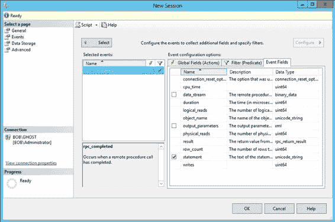
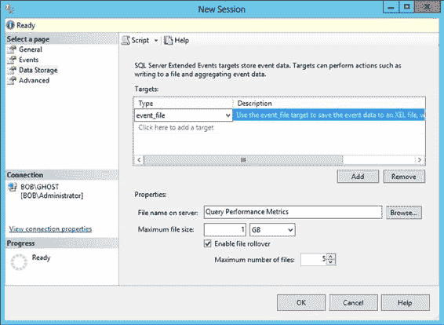

# 第 6 章 ■ 查询性能指标

标准事件字段会随事件类型自动包含。表 6-4 展示了用于性能分析的一些常用操作。

[www.it-ebooks.info](http://www.it-ebooks.info/)

### 表 6-4. 用于查询分析的操作命令

| 数据列 | 描述 |
|-------------|-------------|
| `Statement` | 来自 `rpc_completed` 事件的 SQL 文本。 |
| `Batch_text` | 来自 `sql_batch_completed` 事件的 SQL 文本。 |
| `cpu_time` | 事件的 CPU 消耗，单位为微秒 (mc)。例如，`SELECT` 语句的 `cpu = 100` 表示该语句执行耗时 100 mc。 |
| `logical_reads` | 为事件执行的逻辑读取次数。例如，`SELECT` 语句的 `logical_reads = 800` 表示该语句总共需要 800 次页面读取。 |
| `Physical_reads` | 为事件执行的物理读取次数。由于访问磁盘子系统，此值可能与 `logical_reads` 值不同。 |
| `writes` | 为事件执行的逻辑写入次数。 |
| `duration` | 事件的执行时间，单位为毫秒 (ms)。 |

每次逻辑读取和写入都涉及内存中 8KB 页面的活动，这可能需要零次或多次物理 I/O 操作。您可以通过点击图 6-5 中显示的 `Event Fields` 选项卡来查看任何给定事件的字段。

### 图 6-5. 显示了配置中“事件字段”选项卡的“新建会话”窗口 77

[www.it-ebooks.info](http://www.it-ebooks.info/)

