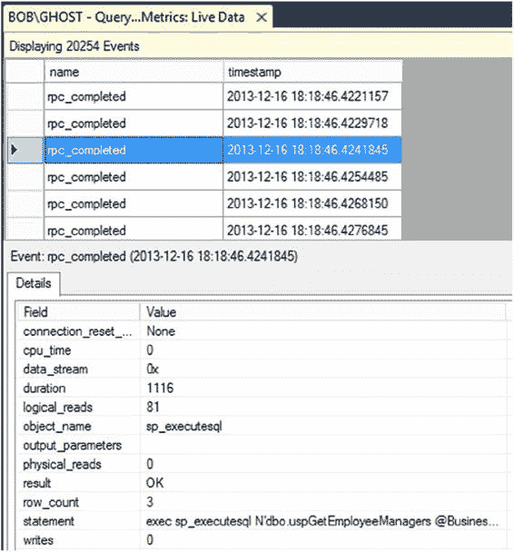

# 第 6 章 ■ 查询性能指标

有些事件字段是可选的，但大多数字段会随事件自动包含。您可以决定是否要包含可选字段。在图 6-5 中，您可以通过点击旁边的复选框来包含 `output_parameters` 字段。

### 数据存储

新建会话窗口中的下一个页面，“选择页面”窗格中的“数据存储”，用于确定如何处理会话生成的数据。输出机制被称为*目标*。您有两个基本选择：将信息输出到文件，或者仅使用缓冲区来捕获事件。您应该只对小数据集使用缓冲区，因为它会消耗内存。由于它在系统内存内工作，缓冲区被设计为，与其压垮系统内存，不如丢弃事件，因此使用缓冲区时更有可能丢失信息。在大多数监控查询性能的情况下，您应该将会话的输出捕获到文件中。

您必须如图 6-6 所示选择您的目标。

### 图 6-6. “新建会话”窗口中的“数据存储”窗口

[www.it-ebooks.info](http://www.it-ebooks.info/)

