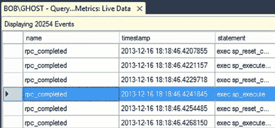

# 第 6 章 ■ 查询性能指标

如您所见，默认设置为我的服务器上的本地存储。您可以在系统上指定一个合适的位置。

您还可以决定是否使用多个文件、使用多少个文件以及这些文件是否滚动更新。所有这些都是作为处理您的环境和 SQL 查询监控工作的一部分，您必须处理的管理决策。您可以 24/7 运行此监控，但您必须准备好处理大量数据，具体取决于您创建的过滤器的严格程度。

除了缓冲区或文件，您还有其他输出选项，但它们通常保留用于特殊类型的监控，通常对于查询性能调优不是必需的。

### 完成会话

一旦定义了存储，您就设置了会话所需的所有内容。还有一个“高级”页面，但在大多数系统中，您确实不需要修改其默认设置。如果您点击“确定”，会话将被创建。如果您将会话设置为在第一个选项卡上启动，它将立即启动，但无论是否启动，它都将存储在服务器上。`扩展事件`会话的优点之一是它们存储在服务器上，因此您可以根据需要打开或关闭它们。

假设您要么没有自动启动会话，要么选择了实时观察数据的选项，您都可以对刚刚创建的会话执行这两项操作。右键单击会话，您将看到一个操作菜单，包括“启动会话”、“停止会话”和“实时观察数据”。如果您启动了会话并选择了观察输出，您应该会在 Management Studio 中看到一个新窗口出现，显示您正在捕获的事件。这些事件来自与写入磁盘相同的缓冲区，因此您可以实时查看事件。请查看图 6-7 以查看实际操作。

### 图 6-7. 由向导创建的扩展事件会话的实时输出 79

[www.it-ebooks.info](http://www.it-ebooks.info/)

