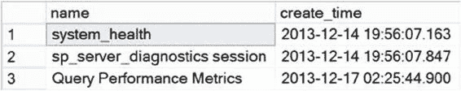

# 第 6 章 ■ 查询性能指标

您可以在窗口顶部看到显示事件类型和事件日期时间的事件。

点击顶部的事件将在屏幕底部打开随该事件捕获的字段。如您所见，我一直在谈论的所有信息都可供您使用。此外，如果您对分栏输出不满意，可以右键单击一个列，并从上下文菜单中选择“在表中显示列”。这将把它移到屏幕顶部，在一个位置显示所有信息，如图 6-8.所示。

### 图 6-8. 语句列已添加到表中

您还可以通过此界面打开收集的文件，并用它来浏览数据。您可以对收集的数据在列内进行搜索、排序和按字段分组。查看对特定查询的所有调用汇总的一个好方法是使用 `query_hash`，这是一个可以添加到数据收集中的全局字段。`GUI` 提供了很多操作所收集信息的方式。

通过 `GUI` 查看这些信息和浏览文件是可以的，但您会希望自动化创建这些会话的过程。这就是下一节要涵盖的内容。

## 扩展事件自动化

使用 `GUI` 构建会话并定义要捕获的事件确实使事情变得简单，但不幸的是，这不是一个可扩展的模型。如果您需要管理多个服务器，并为这些服务器创建会话以捕获关键查询性能指标，您不会希望连接到每个服务器并使用 `GUI` 来选择事件、输出等。如果您考虑到出错的可能性，尤其如此。相反，学习如何直接通过 `T-SQL` 使用会话要好得多。这将使您能够构建一个可以在系统中多个服务器上运行的会话。更好的是，您会发现直接构建会话在某些方面比使用 `GUI` 更容易，并且您将更了解这些过程的工作原理。

### 使用 GUI 创建会话脚本

您可以通过两种方式之一创建脚本跟踪：手动或使用 `GUI`。在您熟悉脚本的所有要求之前，简单的方法是使用 `扩展事件`工具 `GUI`。以下是您需要执行的步骤：

1. 定义一个会话。
2. 右键单击会话，选择“将会话脚本化为”、“CREATE 到”和“文件”以直接输出到文件。或者，使用“新建会话”窗口顶部的“脚本”按钮，在“查询”窗口中创建 `T-SQL` 命令。

[www.it-ebooks.info](http://www.it-ebooks.info/)

