# 第 7 章：分析查询性能

### 分析查询执行计划

你可以使用 `SET SHOWPLAN_XML` 命令来获取先前确定的代价最高的查询的估计 XML 执行计划，如下所示：

```sql
USE AdventureWorks2012;
GO
SET SHOWPLAN_XML ON;
GO
SELECT soh.AccountNumber,
sod.LineTotal,
sod.OrderQty,
sod.UnitPrice,
p.Name
FROM Sales.SalesOrderHeader soh
JOIN Sales.SalesOrderDetail sod
ON soh.SalesOrderID = sod.SalesOrderID
JOIN Production.Product p
ON sod.ProductID = p.ProductID
WHERE sod.LineTotal > 20000;
GO
SET SHOWPLAN_XML OFF;
GO
```

运行此查询会产生一个指向执行计划的链接，而不是执行计划本身或任何数据。点击该链接将打开一个执行计划。虽然计划会以图形化计划的形式显示，但右键单击该计划并选择“显示执行计划 XML”将显示 XML 数据。图 7-1 显示了部分 XML 执行计划输出。

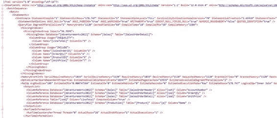

### 图 7-1：XML 执行计划输出

让我们从上一个查询中确定的代价高昂的查询开始。将其（去掉 `SET SHOWPLAN_XML` 语句）复制到 SQL Server Management Studio 中，并打开“包括实际执行计划”。现在，执行此查询时，你将看到图 7-2 中的执行计划。

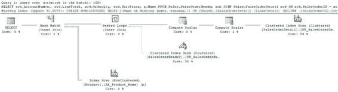

### 图 7-2：查询执行计划

执行计划显示了两种不同的信息流。从左侧读起，你可以看到逻辑流，从 `SELECT` 运算符开始，依次经过每个执行步骤。从右侧开始并以另一个方向读取的是信息的物理流，首先从 `Clustered Index Scan` 运算符拉取数据，然后进行到后续的每个步骤。大多数情况下，按照数据物理流的方向阅读更有利于理解执行计划中发生的事情，但并非总是如此。有时，理解执行计划中正在发生的唯一方法是按照逻辑处理顺序从左到右阅读它。每个步骤代表为获取查询的最终输出而执行的一个操作。执行计划所表示的查询执行的某些方面如下：

*   如果一个查询由一批多个查询组成，则每个查询的执行计划将按执行顺序显示。批处理中的每个执行计划都将有一个相对的估计成本，整个批处理的总成本为 100%。
*   执行计划中的每个图标代表一个运算符。它们各自都有一个相对的估计成本，执行计划中所有节点的总成本为 100%（尽管统计信息不准确，甚至 SQL Server 中的错误都可能导致你看到超过 100% 的成本，但这并不常见）。
*   通常，执行计划中的第一个物理运算符代表从数据库对象（表或索引）检索数据的机制。例如，在图 7-2 的执行计划中，三个起点分别代表从 `SalesOrderHeader`、`SalesOrderDetail` 和 `Product` 表中进行的检索。
*   数据检索通常是表操作或索引操作。例如，在图 7-2 的执行计划中，所有三个数据检索步骤都是索引操作。
*   索引上的数据检索要么是索引扫描，要么是索引查找。例如，在图 7-2 中，你可以看到一个聚集索引扫描、一个聚集索引查找和一个索引扫描。
*   索引上数据检索操作的命名约定是 `[表名].[索引名]`。
*   计划的逻辑流是从左到右，就像阅读英文书籍一样。数据在运算符之间从右向左流动，并由运算符之间的连接箭头指示。
*   运算符之间连接箭头的粗细代表了传输行数的图形化表示。

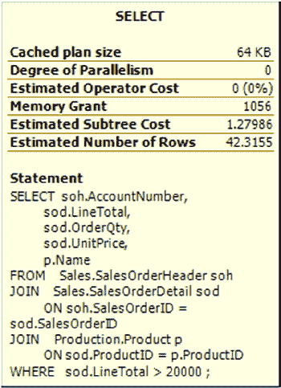

*   同一列中两个运算符之间的连接机制将是嵌套循环连接、哈希匹配连接或合并连接。例如，在图 7-2 所示的执行计划中，有一个哈希连接和一个循环连接。（连接机制将在后面更详细地介绍。）
*   将鼠标悬停在执行计划中的节点上会显示一个包含一些详细信息的弹出窗口。大多数情况下，工具提示用处不大。图 7-3 显示了一个示例。

### 图 7-3：来自执行计划运算符的工具提示窗口

*   有关运算符的完整详细信息可在“属性”窗口中找到，如图 7-4 所示，你可以通过右键单击运算符并选择“属性”来打开它。

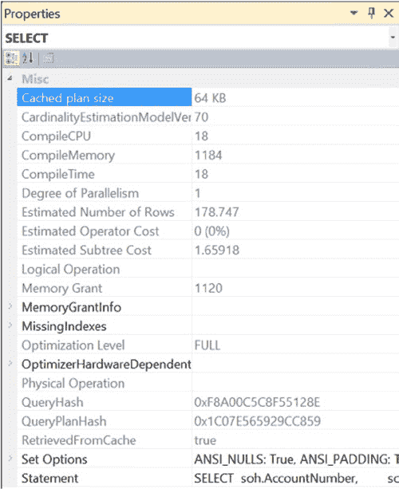

### 图 7-4：选择运算符属性

*   运算符详细信息在顶部显示物理和逻辑操作类型。物理操作代表存储引擎实际使用的操作，而逻辑操作是优化器用于构建估计执行计划的构造。如果逻辑操作和物理操作相同，则只显示物理操作。它还显示其他有用的信息，例如行数、I/O 成本、CPU 成本等。
*   阅读许多运算符上的属性对于理解查询在 SQL Server 中的执行方式是必要的，以便更好地知道如何优化该查询。

### 识别执行计划中代价高昂的步骤

执行计划中最直接的方法是找出哪些步骤相对代价高昂。这些步骤是你查询优化的起点。你可以通过采用以下技术来选择起始步骤：

*   执行计划中的每个节点都显示其在整个执行计划中的相对估计成本，整个计划的总成本为 100%。因此，重点关注相对成本最高的节点。例如，图 7-2 中的执行计划有一个步骤的估计成本为 59%。
*   执行计划可能来自一批语句，因此你可能还需要找到代价最高的估计语句。在图 7-2 中，你可以在计划顶部看到文本“Query 1”。在批处理情况下，会有多个计划，并且它们将按在批处理中出现的顺序编号。
*   观察节点之间连接箭头的粗细。非常粗的连接箭头表示在相应节点之间传输了大量行。分析箭头左侧的节点，以了解为什么它需要这么多行。也要检查箭头的属性。你可能会看到估计行数与实际行数不同。这可能是由统计信息过时等原因造成的。如果你在计划的大部分地方看到粗箭头，而在末尾看到细箭头，则可能通过修改查询或索引，以便在计划中更早地进行过滤。
*   查找哈希连接操作。对于小型结果集，嵌套循环连接通常是首选的连接技术。本章后面你将了解更多关于哈希连接与嵌套循环连接的比较。请记住，哈希连接不一定坏，循环连接也不一定好。这确实取决于查询返回的数据量。


• 查找关键的键查找操作。针对大型结果集的查找操作可能导致大量随机读取。我将在第 11 章更详细地讨论关键查找。

• 可能存在由某个操作符上的感叹号指示的警告，这些是需要立即关注的区域。这些问题可能由多种原因引起，包括缺少联接条件的联接，或者缺少统计信息的索引或表。通常，解决警告情况有助于提升性能。

• 查找执行排序操作的步骤。这表明数据未按正确的排序顺序检索。同样，这可能不是问题，但它指示了潜在的问题，可能是缺少或错误的索引。这里假设你没有`ORDER BY`子句，该子句可能是排序操作的原因。

• 注意可能给系统带来额外负载的额外操作符，例如表假脱机。它们可能是查询操作所必需的，也可能表明查询编写不当或索引设计糟糕。

• 并行查询执行的默认成本阈值是估计成本为 5，这个值非常低。注意不必要的并行操作。请记住，估计成本是查询优化器分配的、代表 CPU 和 I/O 数学模型的数字，并不是实际的度量值。

分析索引有效性

为了进一步检查执行计划中的一个代价高昂的步骤，你应该分析相关表或索引的数据检索机制。首先，你应该检查索引操作是查找（`seek`）还是扫描（`scan`）。通常，为了获得最佳性能，你应该从表中检索尽可能少的行，而索引`seek`通常是访问少量行最有效的方式。`scan`操作通常表示访问了大量行。因此，通常更倾向于使用`seek`而不是`scan`。

接下来，你需要确保索引机制设置正确。查询优化器评估可用索引，以发现哪个索引能以最有效的方式从表中检索数据。如果所需的索引不可用，优化器会使用次优的索引。为了获得最佳性能，你应该始终确保在数据检索操作中使用了最佳索引。你可以通过分析节点详细信息的“参数”部分来判断索引有效性（是否使用了最佳索引），该部分用于以下操作：

• 数据检索操作

• 联接操作

让我们看一下前面执行计划（图 7-2）中`SalesOrderHeader`表的数据检索机制。图 7-5 显示了操作符属性。

[www.it-ebooks.info](http://www.it-ebooks.info/)

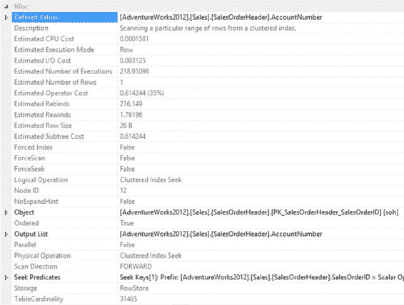

第 7 章 分析查询性能

**图 7-5. `SalesOrderHeader`表的数据检索机制**

在`SalesOrderHeader`表的操作符属性中，`Object`属性指定了使用的索引`PK_SalesOrderHeader_SalesOrderID`。它使用以下命名约定：`[数据库].[所有者].[表名].[索引名]`。`Seek Predicates`属性指定了用于在索引中查找键的列。

`SalesOrderHeader`表通过`SalesOrderld`列与`SalesOrderDetail`表联接。`SEEK`操作基于联接条件`SalesOrderld`是聚集索引和主键`PK_SalesOrderHeader`的前缘这一事实。

有时你可能会遇到不同的数据检索机制。与你在图 7-5 中看到的`Seek Predicates`属性不同，图 7-6 显示了一个简单的谓词，表明一种完全不同的数据检索机制。

[www.it-ebooks.info](http://www.it-ebooks.info/)

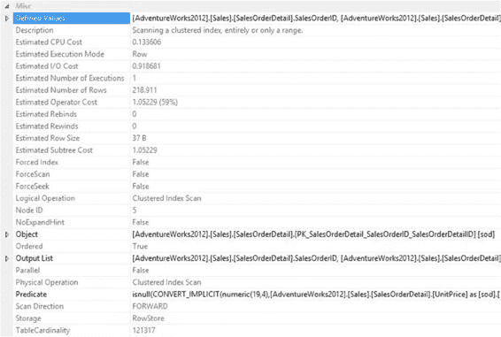

第 7 章 分析查询性能

**图 7-6. 数据检索机制的一种变体：扫描**


在图 7-6 所示的属性中，没有搜索谓词。由于在列上执行了函数`ISNULL`和`CONVERT_IMPLICIT`，必须扫描整个表以检查是否存在谓词值。

```
isnull(CONVERT_IMPLICIT(numeric(19,4),[AdventureWorks2012].[Sales].[SalesOrderDetail].
[UnitPrice] as [sod].[UnitPrice],0)*((1.0)-CONVERT_IMPLICIT(numeric(19,4),[AdventureWorks2012].
[Sales].[SalesOrderDetail].[UnitPriceDiscount] as [sod].[UnitPriceDiscount],0))*CONVERT_I MPLICIT(numeric(5,0),[AdventureWorks2012].[Sales].[SalesOrderDetail].[OrderQty] as [sod].
[OrderQty],0),(0.000000))>(20000.000000)
```

因为正在对数据进行计算，而索引并不存储计算结果，所以无法简单地通过索引查找信息，必须扫描数据、执行计算，然后验证数据的正确性。

### 分析连接的有效性

除了分析所使用的索引外，你还应检查优化器决定的连接策略的有效性。SQL Server 使用三种类型的连接。

- 哈希连接
- 合并连接
- 嵌套循环连接

[www.it-ebooks.info](http://www.it-ebooks.info/)

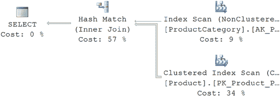

第 7 章 ■ 分析查询性能

在许多影响少量行的简单查询中，嵌套循环连接远优于哈希连接和合并连接。随着连接变得更复杂，在适当的地方会使用其他连接类型。没有哪种连接类型天生就是错误或不好的。你主要需要寻找优化器可能选择了与手头数据不兼容的类型的情况。这通常是由优化器在决定使用哪种类型时，其所依据的统计信息存在差异造成的。

#### 哈希连接

要理解 SQL Server 的哈希连接策略，请考虑以下简单查询：

```sql
SELECT p.*

FROM Production.Product p

JOIN Production.ProductCategory pc

ON p.ProductSubcategoryID = pc.ProductCategoryID;
```

表 7-1 显示了两个表的索引和行数。

**表 7-1.** 产品表和产品类别表的索引及行数
**表**
**索引**
**行数**
Product
ProductID 上的聚集索引
ProductCategory
ProductCategoryld 上的聚集索引

图 7-7 显示了上述查询的执行计划。

**图 7-7.** 包含哈希连接的执行计划

你可以看到优化器在两个表之间使用了哈希连接。

哈希连接使用两个连接输入作为`生成输入`和`探测输入`。生成输入显示在执行计划的上方，探测输入显示在下方。通常两个输入中较小的那个作为生成输入，因为它将被存储在系统中，因此优化器会尝试最小化内存使用。

[www.it-ebooks.info](http://www.it-ebooks.info/)

第 7 章 ■ 分析查询性能

哈希连接分两个阶段执行其操作：`生成阶段`和`探测阶段`。在最常用的哈希连接形式——`内存中哈希连接`中，会扫描或计算整个生成输入，然后在内存中构建哈希表。根据为`哈希键`（等式谓词中的列集）计算的哈希值，将外部输入的每一行插入到相应的哈希桶中。哈希值只是针对相关值运行的一种数学构造，用于比较目的。

生成阶段之后是探测阶段。逐行扫描或计算整个探测输入，对于每个探测行，计算其哈希键值。扫描探测输入哈希键值对应的哈希桶，并产生匹配项。图 7-8 说明了内存中哈希连接的过程。

探测

开始哈希连接

开始生成阶段

阶段

选择生成输入

在内存中生成

和探测输入

哈希表

开始探测阶段

生成阶段

扫描生成输入

扫描探测输入以获取


#### 哈希连接

探针阶段：为构建输入行计算哈希键，然后为探针输入行计算哈希键。检查哈希表中是否存在对应的哈希桶。

*   **否**：创建哈希桶。
*   **是**：检查是否在哈希桶中找到匹配的行。
    *   **是**：插入来自构建输入的所有行。
    *   **否**：生成匹配的行。

此过程对探针输入和构建输入中的所有行重复，直到探针阶段完成。

***图 7-8.** 内存中哈希连接的工作流程*

查询优化器使用哈希连接来高效处理大型、未排序、未建立索引的输入。现在让我们看看下一种连接类型：合并连接。

[www.it-ebooks.info](http://www.it-ebooks.info/)

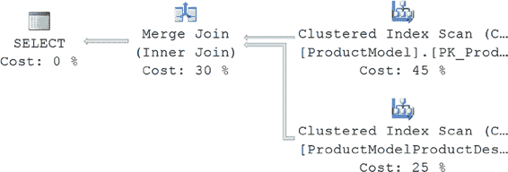

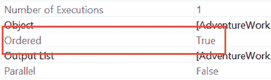

#### 合并连接

在前面的案例中，来自 `Product` 表的输入更大，并且该表在连接列 (`ProductCategoryID`) 上没有索引。使用下面这个简单的查询，你可以看到不同的行为：

```sql
SELECT pm.*
FROM Production.ProductModel pm
JOIN Production.ProductModelProductDescriptionCulture pmpd
ON pm.ProductModelID = pmpd.ProductModelID;
```

图 7-9 显示了此查询的执行计划结果。

***图 7-9.** 包含合并连接的执行计划*

对于此查询，优化器在两个表之间使用了 `合并连接`。`合并连接` 要求两个连接输入都根据连接条件定义的合并列进行排序。如果两个连接列上都有可用的索引，则连接输入将通过索引进行排序。由于每个连接输入都已排序，`合并连接` 从每个输入获取一行并比较它们是否相等。如果相等，则生成匹配的行。重复此过程，直到所有行都被处理完毕。

在数据已通过索引排序的情况下，`合并连接` 可以是最快的连接操作之一。但如果数据未排序而优化器仍选择执行 `合并连接`，则数据必须通过一个额外的操作——排序——来排序。这可能会使 `合并连接` 在内存和 I/O 资源方面变得更慢、成本更高。

在这种情况下，查询优化器发现连接输入都在其连接列上进行了排序（或建立了索引）。你可以在索引扫描操作符的属性中看到这一点，如图 7-10 所示。

***图 7-10.** 显示数据已排序的聚集索引扫描的属性*

由于正在使用的索引对数据进行了排序，`合并连接` 在此情况下被选为比任何其他连接更快的连接策略。

[www.it-ebooks.info](http://www.it-ebooks.info/)

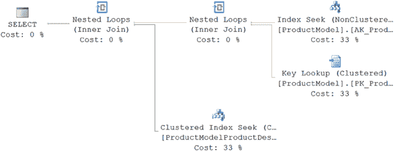

#### 嵌套循环连接

我在这里要介绍的最后一种连接类型是 `嵌套循环连接`。为了获得更好的性能，你应该始终努力从各个表中访问有限数量的行。为了理解使用较小结果集的效果，减少查询中的连接输入，如下所示：

```sql
SELECT pm.*
FROM Production.ProductModel pm
JOIN Production.ProductModelProductDescriptionCulture pmpd
ON pm.ProductModelID = pmpd.ProductModelID
WHERE pm.Name = 'HL Mountain Front Wheel';
```

图 7-11 显示了新查询的执行计划结果。

***图 7-11.** 包含嵌套循环连接的执行计划*

如你所见，优化器在两个表之间使用了 `嵌套循环连接`。它还添加了另一个嵌套循环来执行键查找操作（我将在第 6 章详细讨论这一点）。

`嵌套循环连接` 使用一个连接输入作为外部输入表，另一个作为内部输入表。外部输入表在执行计划中显示为顶部输入，内部输入表显示为底部输入表。外部循环逐行处理外部输入表。内部循环则针对每个外部行执行，在内部输入表中搜索匹配的行。

如果外部输入非常小，而内部输入较大但已建立索引，`嵌套循环连接` 是非常高效的。

在许多影响少量行的简单查询中，**嵌套循环连接**远优于*哈希连接*和*合并连接*。

连接操作通过其他方面的牺牲来获得速度。循环连接之所以快速，是因为它使用内存将一小部分数据与第二部分数据进行快速比较。合并连接同样使用内存和少量的 `tempdb` 来进行有序比较。哈希连接则使用内存和 `tempdb` 来构建连接所需的哈希表。虽然循环连接在小数据集上可能更快，但当数据集变大或没有索引支持数据检索时，它的速度可能会下降。这就是 SQL Server 提供不同连接机制的原因。

即使是对于小的连接输入，如之前的查询，在连接列上建立索引也很重要。

正如你在前面的执行计划中所看到的，对于少量的行，连接列上的索引允许查询优化器考虑采用嵌套循环连接策略。如果输入表的连接列缺少索引，则会迫使查询优化器使用哈希连接。

表 7-2 总结了三种连接类型的使用场景。

[www.it-ebooks.info](http://www.it-ebooks.info/)

## 第 7 章 ■ 分析查询性能

### 表 7-2. 三种连接类型的特征

**连接类型** | **连接列上的索引** | **连接表的通常大小** | **是否预排序** | **连接子句**
---|---|---|---|---
哈希 | 内部表：无索引<br>外部表：可选<br>最佳条件：外部表小，内部表大 | 任意 | 否 | 等值连接
合并 | 两个表都必须有<br>最佳条件：两个表上都有聚集索引或覆盖索引 | 大 | 是 | 等值连接
嵌套循环 | 内部表：必须有<br>外部表：最好有 | 小 | 可选 | 所有类型

**注意**，在哈希连接和循环连接中，外部表通常是两个连接表中较小的那个。

我将在第 8 章介绍索引类型，包括聚集索引和覆盖索引。

### 实际执行计划与估计执行计划

存在估计执行计划和实际执行计划。在某种程度上，它们可以互换使用。但是，实际执行计划带有查询执行时的信息，特别是受影响的行数以及其他一些在估计计划中无法获得的信息。这些信息可能非常有用，尤其是在尝试理解统计估计时。因此，在优化查询时，首选实际执行计划。

不幸的是，你并不总是能够访问它们。你可能无法执行查询，例如在生产环境中。你可能只能访问缓存中的计划，其中不包含运行时信息。

因此，在有些情况下，你将不得不使用估计执行计划。

然而，在其他情况下，估计执行计划完全不起作用。考虑下面这个存储过程：

```sql
IF (SELECT OBJECT_ID('p1')) IS NOT NULL
    DROP PROC p1
GO

CREATE PROC p1
AS
CREATE TABLE t1 (c1 INT);
INSERT INTO t1
    SELECT ProductID
    FROM Production.Product;
SELECT *
    FROM t1;
DROP TABLE t1;
GO
```

[www.it-ebooks.info](http://www.it-ebooks.info/)

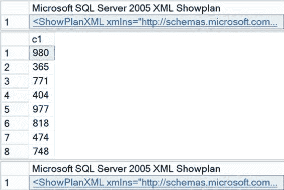

## 第 7 章 ■ 分析查询性能

你可以尝试使用 `SHOWPLAN_XML` 来获取查询的估计 XML 执行计划，如下所示：

```sql
SET SHOWPLAN_XML ON;
GO
EXEC p1 ;
GO
SET SHOWPLAN_XML OFF;
GO
```

但这会失败，并显示以下错误：

```
Msg 208, Level 16, State 1, Procedure p1, Line 360
Invalid object name 't1'.
```

由于 `SHOWPLAN_XML` 并不实际执行查询，查询优化器无法为表 (`t1`) 上的 `INSERT` 和 `SELECT` 语句生成执行计划，因为该表在查询执行前并不存在。相反，你可以使用 `STATISTICS XML`，如下所示：

```sql
SET STATISTICS XML ON;
GO
EXEC p1;
GO
SET STATISTICS XML OFF;
GO
```

由于 `STATISTICS XML` 会执行查询，表在查询过程中被创建和访问，这些都被执行计划捕获。图 7-12 显示了查询结果以及 `STATISTICS XML` 提供的存储过程中两个语句的两个执行计划。

### 图 7-12. STATISTICS PROFILE 输出


[www.it-ebooks.info](http://www.it-ebooks.info/)

