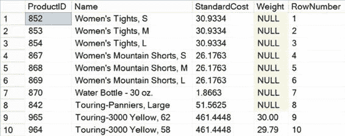
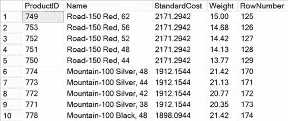

# 第 8 章 ■ 索引架构与行为

在正确的列或列上建立正确的索引，是查询调优的起点。缺少索引或在错误的列或列上建立索引，可能是所有性能问题的根源，从基础数据访问开始，贯穿联接，直到筛选子句。因此，对于每个人——而不仅仅是 DBA——来说，理解可用于优化数据库设计的不同索引技术都至关重要。

在本章中，我将涵盖以下主题：
*   什么是索引
*   索引的收益和开销
*   索引设计的一般建议
*   聚集索引和非聚集索引的行为与比较
*   聚集索引和非聚集索引的建议

## 什么是索引？

减少磁盘 I/O 的最佳方法之一是使用索引。索引允许 SQL Server 无需扫描整个表即可在表中查找数据。数据库中的索引类似于书籍中的索引。例如，假设你想在本书中查找 *表扫描* 这个短语。在纸质版本中，如果没有书末的索引，你将不得不翻阅整本书来找到你需要的内容。有了索引，你就确切地知道所需信息存储的位置。

在为数据库性能进行调优时，你会在查询中使用的不同列上创建索引，以帮助 SQL Server 快速查找数据。例如，下面这个针对 `Production.Product` 表的查询产生的数据如图 8-1 所示（500 多行中的前 10 行）：

```sql
SELECT TOP 10
p.ProductID,
p.[Name],
p.StandardCost,
p.[Weight],
ROW_NUMBER() OVER (ORDER BY p.Name DESC) AS RowNumber
FROM Production.Product p
ORDER BY p.Name DESC;
```

[www.it-ebooks.info](http://www.it-ebooks.info/)





`图 8-1.` `Production.Product` 表示例


