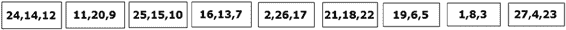
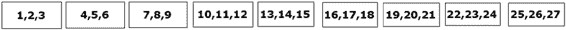
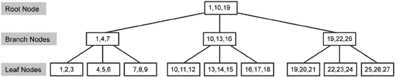

# 第 8 章 ■ 索引架构与行为

前面的查询扫描了整个表，因为没有 `WHERE` 子句。如果需要通过 `WHERE` 子句添加筛选器来检索所有 `StandardCost` 大于 150 的产品，在没有索引的情况下，仍然必须扫描整个表，逐行检查 `StandardCost` 的值，以确定哪些行包含大于 150 的值。在 `StandardCost` 列上创建索引可以通过提供一种允许对数据进行结构化搜索而非逐行检查的机制来加速此过程。你可以采用两种不同且基本的方法来创建此索引。

• *类似字典*：字典是按字母顺序排列的单词的独立列表。索引可以以类似方式存储。数据是有序的，尽管仍会有重复项。按 `StandardCost` `DESC` 排序（而不是按 `Name` 排序）的前 10 行数据，看起来会像图 8-2 中所示的数据。请注意，`RowNumber` 列显示了按 `Name` 排序时行的原始位置。

***图 8-2.** 按 StandardCost 排序的产品表*

因此，现在如果你想查找 `StandardCost` 大于 150 的所有行数据，索引将允许你通过直接移动到第一个大于 150 的值来立即找到它们。这种根据索引键顺序对存储的数据应用顺序的索引被称为 `聚集索引`。由于 SQL Server 存储数据的方式，这是你数据库设计中最重要的索引之一。我将在本章后面详细解释这一点。

[www.it-ebooks.info](http://www.it-ebooks.info/)

• *类似书籍的索引架构*：可以在不改变表布局的情况下创建一个有序列表，类似于书籍索引的创建方式。就像书籍的关键词索引在单独的部分列出关键词并带有页码指向书籍正文一样，`StandardCost` 值的列表被创建为一个独立的结构，并通过指针引用 `Product` 表中对应的行。对于此示例，我将使用 `RowNumber` 作为指针。表 8-1 显示了该制造商索引的结构。

***表 8-1.** 制造商索引的结构*

**StandardCost**

**RowNumber**

2171.2942

2171.2942

2171.2942

2171.2942

2171.2942

1912.1544

SQL Server 可以扫描该制造商索引来查找 `StandardCost` 大于 150 的行。由于 `StandardCost` 值按排序顺序排列，SQL Server 一旦遇到值为 150 或更小的行即可停止扫描。这种类型的索引称为 `非聚集索引`，我将在本章后面详细解释。

在任何一种情况下，SQL Server 都能够比在没有索引的情况下更快地在大多数情形下找到所有 `StandardCost` 大于 150 的产品。

你可以在单个列（如前所述）或表中列的组合上创建索引。SQL Server 会为某些类型的约束（例如，`PRIMARY KEY` 和 `UNIQUE` 约束）自动创建索引。

## 索引的好处

即使表上没有索引，SQL Server 也必须能够找到数据。当没有聚集索引来为数据建立存储顺序时，存储引擎只会读取整个表来找到所需内容。

没有聚集索引的表称为 `堆表`。堆只是一个无序的数据堆栈，带有一个行标识符作为指向存储位置的指针。除了通过称为 `扫描` 的过程逐行遍历数据外，这些数据既没有排序，也无法搜索。当在表上放置聚集索引时，索引的键值为数据建立了顺序。此外，有了聚集索引，数据与索引一起存储，因此数据本身现在是有序的。当存在聚集索引时，非聚集索引上的指针由定义聚集索引键的值组成。这是聚集索引如此重要的一个重要原因。

SQL Server 中的数据存储在大小为 8KB 的页面上。页面是从磁盘移动到内存的最小信息量，因此在一个页面上可以存储多少内容变得很重要。由于页面空间有限，如果行包含的列数较少或列尺寸较小，则可以存储更多的行。非聚集索引通常不（也不应该）包含表的所有列；它通常只包含有限数量的列。因此，一个页面将能够比存储表本身（包含所有列）的行的页面存储更多非聚集索引的行。因此，SQL Server 将能够从表示该列上非聚集索引的页面比从表示包含该列的表的页面读取更多的列值。

[www.it-ebooks.info](http://www.it-ebooks.info/)

非聚集索引的另一个好处是，由于它与数据表是分开的结构，可以将其放在不同的文件组中，使用不同的 I/O 路径，如第 3 章所述。这意味着 SQL Server 可以并发访问索引和表，使搜索速度更快。

索引将其信息存储在平衡树（称为 `B 树`）结构中，因此查找特定行所需的读取次数被最小化。以下示例展示了 B 树结构的好处。

考虑一个包含 27 行、随机顺序且每个叶级页面仅 3 行的单列表。假设页面中行的布局如图 8-3 所示。

***图 8-3.** 27 行的初始布局*

要搜索列值为 5 的行（或多行），SQL Server 必须扫描所有行和页面，因为即使是最后一页的最后一行也可能具有值 5。因为读取次数取决于访问的页面数，在没有该列索引的情况下，必须执行九次读取操作（从磁盘检索页面并将其传输到内存）。可以通过在该列上创建索引来使内容有序，结果行和页面的布局如图 8-4 所示。

***图 8-4.** 27 行的有序布局*

为列创建索引将内容按排序方式排列。这使得 SQL Server 能够确定一行在列中可能的值相对于另一行在列中值的大小关系。例如，在图 8-4 中，当 SQL Server 找到第一行列值为 6 时，它可以确信不再有列值为 5 的行。因此，当内容被索引时，只需两次读取操作即可获取列值为 5 的行。但是，如果要搜索列值 25 会怎样？这将需要九次读取操作！这个问题通过使用 B 树结构实现索引来解决（如图 8-5 所示）。

***图 8-5.** 27 行的 B 树布局*

## B 树结构简介

B 树由一个称为 **根节点** 的起始节点（或页面）构成，**分支节点**（或页面）从中生长出来（或链接到它）。所有键都存储在叶子节点中。每个内部节点（位于叶子节点之上）都包含指向其分支节点的指针，以及表示在该分支节点中找到的最小值的值。键在每个节点内保持排序顺序。B 树使用平衡树结构来实现高效的记录检索——当所有叶子节点距离根节点的层级相同时，B 树就是平衡的。例如，在前面的内容上创建索引将生成如图 8-5 所示的平衡 B 树结构。在底层，所有叶子节点通过一个双向链表相互连接，这意味着每个页面都指向它后面的页面，而它后面的页面又指向前一个页面。当遍历页面超越了中间页面的定义范围时，这避免了不得不回溯到链上。

[www.it-ebooks.info](http://www.it-ebooks.info/)

