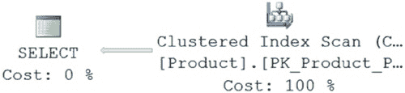
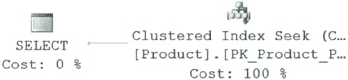
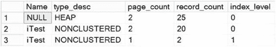
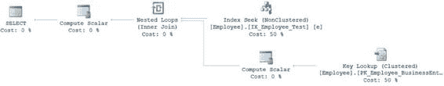
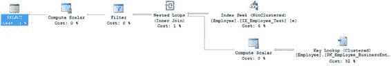

# 第 8 章 ■ 索引体系结构与行为

添加这个新索引后，再次运行 `UPDATE` 命令。
```sql
UPDATE dbo.Test1
SET C1 = 1,
    C2 = 1
WHERE C2 = 1;
```


此 `UPDATE` 语句的逻辑读取总数从 47 减少到了 20 (`=15 + 5`)。

`表 'Test1'。扫描计数 1，逻辑读取 15`

`表 'Worktable'。扫描计数 1，逻辑读取 5`

-   `注意`，`worktable` 是 SQL Server 内部用于处理查询中间结果的临时表。
    工作表在 `tempdb` 数据库中创建，并在查询执行后自动删除。

本节中的示例已经证明，尽管为操作查询添加索引会带来一些开销成本，但由于索引对搜索的有益效果（即使在更新期间），整体结果是成本降低。

## 索引设计建议

索引设计的主要建议如下：

-   检查 `WHERE` 子句和 `JOIN` 条件列。
-   使用窄索引。
-   检查列的唯一性。
-   检查列的数据类型。
-   考虑列的顺序。
-   考虑索引类型（聚集索引与非聚集索引）。

让我们依次考虑这些建议。

### 检查 `WHERE` 子句和 `JOIN` 条件列

当查询提交给 SQL Server 时，查询优化器会尝试为查询中引用的每个表找到最佳的数据访问机制。以下是其工作方式：

1.  优化器识别包含在 `WHERE` 子句和 `JOIN` 条件中的列。
2.  然后，优化器检查这些列上的索引。
3.  优化器通过根据索引上维护的统计信息确定子句的选择性（即，将返回多少行）来评估每个索引的有用性。
4.  主键和外键等约束也会被评估和使用，以确定查询中使用的对象的选择性。
5.  最后，优化器基于先前步骤中收集的信息，估算出检索符合条件行的最低成本方法。

[www.it-ebooks.info](http://www.it-ebooks.info/)



第 8 章 ■ 索引架构与行为

`注意` 第 12 章将更深入地介绍统计信息。

为了理解 `WHERE` 子句列在查询中的重要性，让我们看一个例子。让我们回到帮助你理解索引是什么的原始代码清单；该查询由一个没有任何 `WHERE` 子句的 `SELECT` 语句组成，如下所示：

```sql
SELECT p.ProductID,
    p.Name,
    p.StandardCost,
    p.Weight
FROM Production.Product p;
```

查询优化器执行聚集索引扫描（对于具有聚集索引的表，这相当于在堆上执行表扫描）来读取行，如图 8-6 所示（在查询窗口中使用 `Ctrl+M` 启用“包含实际执行计划”选项，并通过右键单击选择“查询选项”，然后在“高级”选项卡中勾选相应复选框来启用 `Set Statistics IO` 选项）。

*图 8-6. 没有 `WHERE` 子句的执行计划*

`SET STATISTICS IO` 为 `SELECT` 语句报告的逻辑读取数如下：`表 'Product'。扫描计数 1，逻辑读取 15`

为了理解 `WHERE` 子句列对查询优化器决策的影响，让我们添加一个 `WHERE` 子句来检索单行。

```sql
SELECT p.ProductID,
    p.Name,
    p.StandardCost,
    p.Weight
FROM Production.Product AS p
WHERE p.ProductID = 738 ;
```

有了 `WHERE` 子句后，查询优化器会检查 `WHERE` 子句列 `ProductID`，识别 `ProductID` 列上索引 `PK_Product_ProductId` 的可用性，根据索引 `PK_Product_ProductId` 的统计信息评估 `WHERE` 子句的高选择性（即，只返回一行），并决定使用该索引检索数据，如图 8-7. 所示。

[www.it-ebooks.info](http://www.it-ebooks.info/)



第 8 章 ■ 索引架构与行为

*图 8-7. 带有 `WHERE` 子句的执行计划*

产生的逻辑读取数如下：
`表 'Product'。扫描计数 0，逻辑读取 2`

查询优化器的行为表明，`WHERE` 子句列有助于优化器为查询选择最优的索引操作。这也适用于两个表之间 `JOIN` 条件中使用的列。

优化器会查找 `WHERE` 子句列或 `JOIN` 条件列上的索引，如果可用，则考虑使用索引从表中检索行。查询优化器在执行查询时会考虑 `WHERE` 子句列和 `JOIN` 条件列上的索引。因此，在 SQL 查询中频繁使用的 `WHERE` 子句、`HAVING` 子句和 `JOIN` 条件列上建立索引，有助于优化器避免扫描基表。

当表内的数据量非常小，以至于可以放入单个页面（8KB）时，表扫描可能比索引查找效果更好。如果你有一个很好的索引，但仍然得到扫描结果，请考虑此问题。

### 使用窄索引

为获得最佳性能，在创建索引时，应使用尽可能实用的窄数据类型。此处的“窄”意味着尽可能小的数据类型。你还应避免在索引中使用非常宽的数据类型列。具有字符串数据类型（`CHAR`、`VARCHAR`、`NCHAR` 和 `NVARCHAR`）的列有时可能相当宽，二进制和全局唯一标识符（`GUID`）也是如此。除非绝对必要，否则应尽量减少在索引中使用具有大尺寸的宽数据类型列。你可以在表中的列组合上创建索引。为获得最佳性能，索引中应使用尽可能少的列。但是，要使用你需要使用的列来为索引定义一个有用的键。

窄索引比宽索引在 8KB 索引页中能容纳更多行。这具有以下效果：

-   减少 I/O（因为需要读取的 8KB 页更少）
-   使数据库缓存更有效，因为 SQL Server 可以缓存更少的索引页，从而减少内存中索引页所需的逻辑读取
-   减少数据库的存储空间

为了解窄索引如何减少逻辑读取数，创建一个包含 20 行和一个索引的测试表。

```sql
IF (SELECT OBJECT_ID('Test1')) IS NOT NULL
    DROP TABLE dbo.Test1;
GO
CREATE TABLE dbo.Test1 (C1 INT, C2 INT);

WITH Nums
AS (SELECT 1 AS n
    UNION ALL
    SELECT n + 1
    FROM Nums
    WHERE n < 20
    )
INSERT INTO dbo.Test1 (C1, C2)
SELECT n, n
FROM Nums;

CREATE INDEX iTest ON dbo.Test1(C1);
```

由于索引列很窄（`INT` 数据类型为 4 字节），所有索引行都可以容纳在一个 8KB 索引页中。如图 8-8 所示，你可以通过与索引关联的动态管理视图来确认这一点。

*图 8-8. 窄非聚集索引的页数*

```sql
SELECT i.Name,
    i.type_desc,
    ddips.page_count,
    ddips.record_count,
    ddips.index_level
FROM sys.indexes i
JOIN sys.dm_db_index_physical_stats(DB_ID(N'AdventureWorks2012'),
                                    OBJECT_ID(N'dbo.Test1'), NULL,
                                    NULL, 'DETAILED') AS ddips
    ON i.index_id = ddips.index_id
WHERE i.object_id = OBJECT_ID(N'dbo.Test1');
```

`sys.indexes` 系统表存储在每个数据库中，包含数据库中每个索引的基本信息。动态管理函数 `sys.dm_db_index_physical_stats` 包含有关索引统计信息的更详细信息（你将在第 13 章了解更多关于此 `DMF` 的信息）。为了理解宽索引键的缺点，将索引列 `C1` 的数据类型从 `INT` 修改为 `CHAR(500)`（下载中的 `narrow_alter.sql`）。

```sql
DROP INDEX dbo.Test1.iTest;
ALTER TABLE dbo.Test1 ALTER COLUMN C1 CHAR(500);
CREATE INDEX iTest ON dbo.Test1(C1);
```


`INT` 数据类型列的宽度是 4 字节，而 `CHAR(500)` 数据类型列的宽度是 500 字节。由于索引列的宽度较大，需要两个索引页来容纳所有 20 个索引行。你可以通过再次对其运行查询，在 `sys.dm_db_index_physical_stats` 动态管理函数中确认这一点（参见图 8-9）。

[www.it-ebooks.info](http://www.it-ebooks.info/)



## 第 8 章 ■ 索引架构与行为

**图 8-9.** 一个宽的、非聚集索引的页数

大的索引键大小会增加索引页的数量，从而增加索引所需的内存量和磁盘活动量。始终建议将索引键大小设置得尽可能窄。

在继续之前，请删除测试表。

```sql
DROP TABLE dbo.Test1;
```

### 检查列唯一性

在可能唯一值范围非常小的列（如 `MaritalStatus`）上创建索引不会对性能有益，因为查询优化器将无法使用索引有效地缩小要返回的行的范围。考虑一个只有两个唯一值的 `MaritalStatus` 列：`M` 和 `S`。当你在 `WHERE` 子句中使用 `MaritalStatus` 列执行查询时，最终会从表中获取大量行（假设 `M` 和 `S` 的分布相对均匀），导致昂贵的表或聚集索引扫描。最好在 `WHERE` 子句中使用具有大量唯一行（或 `高选择性`）的列，以限制访问的行数。

你应该在这些列上创建索引，以帮助优化器访问较小的结果集。

此外，在多列上创建索引（也称为 `复合索引`）时，列的顺序很重要。在许多情况下，首先使用最具选择性的列将有助于更有效地过滤索引行。

**注意：** 本章后面的“考虑列顺序”一节将解释复合索引中列顺序的重要性。

由此可以看出，在列上创建索引之前了解其选择性非常重要。

你可以通过执行如下查询来找到它；只需替换表和列名：

```sql
SELECT COUNT(DISTINCT e.MaritalStatus) AS DistinctColValues,
    COUNT(e.MaritalStatus) AS NumberOfRows,
    (CAST(COUNT(DISTINCT e.MaritalStatus) AS DECIMAL)
        / CAST(COUNT(e.MaritalStatus) AS DECIMAL)) AS Selectivity,
    (1.0/(COUNT(DISTINCT e.MaritalStatus))) AS Density
FROM HumanResources.Employee AS e;
```

当在 `WHERE` 子句或连接条件中引用时，具有最多唯一值（或选择性最高）的列可能是索引的最佳候选列。你可能也会遇到特殊数据，即你有数百行公共数据，只有少数是唯一的。这少数行也将从索引中受益。通过使用筛选索引（稍后将更详细地讨论）可以使这一点更加有益。

[www.it-ebooks.info](http://www.it-ebooks.info/)




## 第 8 章 ■ 索引架构与行为

要理解索引键列的选择性如何影响索引的使用，请查看 `HumanResources.Employee` 表中的 `MaritalStatus` 列。如果你运行前面的查询，你会看到它在 290 行中只包含两个不同的值，选择性为 0.0069，密度为 0.5。一个只查找 `MaritalStatus` 为 `M` 的查询如下所示：

```sql
SELECT e.*
FROM HumanResources.Employee AS e
WHERE e.MaritalStatus = 'M'
    AND e.BirthDate = '1984-12-05'
    AND e.Gender = 'M';
```

这将导致图 8-10 所示的执行计划以及以下 I/O 和运行时间：

```
Table 'Employee'. Scan count 1, logical reads 9
CPU time = 0 ms, elapsed time = 49 ms.
```

**图 8-10.** 没有索引的执行计划

通过扫描聚集索引（数据存储的位置）来查找 `MaritalStatus = 'M'` 的相应值，从而返回数据。（其他运算符将在第 14 和 15 章中介绍。）如果你在该列上放置一个索引，如下所示，并再次运行查询，执行计划保持不变。

```sql
CREATE INDEX IX_Employee_Test ON HumanResources.Employee (Gender);
```

数据的选择性不足以让索引被使用，更不用说有用。如果改为使用如下所示的复合索引：

```sql
CREATE INDEX IX_Employee_Test ON
    HumanResources.Employee (BirthDate, Gender, MaritalStatus)
WITH (DROP_EXISTING = ON) ;
```

然后重新运行查询以查看图 8-11 中的执行计划和性能结果，你会得到：

```
Table 'Employee'. Scan count 1, logical reads 4
CPU time = 0 ms, elapsed time = 38 ms.
```

**图 8-11.** 使用复合索引的执行计划

[www.it-ebooks.info](http://www.it-ebooks.info/)


## 第 8 章 ■ 索引架构与行为

现在，你比使用聚集索引扫描时表现更好了。一个干净利落的 `索引查找` 操作花费不到一半的时间来收集数据。其余时间花在了 `键查找` 操作上。`键查找` 操作以前被称为 `书签查找`。

**注意：** 你将在第 11 章了解更多关于键查找的内容。

尽管问题中的任何一列单独来看可能都不具备足够的选择性来形成一个好的索引（除了 `birthdate` 列可能例外），但它们一起提供了足够的选择性，使优化器能够利用所提供的索引。

可以尝试强制查询使用你创建的第一个测试索引。如果你删除复合索引，重新创建原来的索引，然后通过使用查询提示强制使用原始索引架构来修改查询，如下所示：

```sql
SELECT e.*
FROM HumanResources.Employee AS e WITH (INDEX (IX_Employee_Test))
WHERE e.BirthDate = '1984-12-05'
    AND e.Gender = 'F'
    AND e.MaritalStatus = 'M';
```

那么，图 8-12 所示的结果和执行计划虽然相似，但并不相同。

```
Table 'Employee'. Scan count 1, logical reads 414
CPU time = 0 ms, elapsed time = 103 ms.
```

**图 8-12.** 使用查询提示选择索引时的执行计划

你看到了相同的索引查找，但读取次数增加了一倍多，执行计划内的估计成本也发生了变化。尽管可以强制优化器选择索引，但这显然并不总是一种最优的方法。

自 SQL Server 2012 以来，另一种强制不同行为的方法是使用 `FORCESEEK` 查询提示。`FORCESEEK` 使得优化器将只选择 `索引查找` 操作。如果查询像这样重写：

```sql
SELECT e.*
FROM HumanResources.Employee AS e WITH (FORCESEEK)
WHERE e.BirthDate = '1984-12-05'
    AND e.Gender = 'F'
    AND e.MaritalStatus = 'M';
```

[www.it-ebooks.info](http://www.it-ebooks.info/)



## 第 8 章 ■ 索引架构与行为

这再次改变了 I/O、执行时间和执行计划结果（图 8-13），你最终会得到这些结果：

```
Table 'Employee'. Scan count 1, logical reads 414
CPU time = 0 ms, elapsed time = 90 ms.
```

**图 8-13.** 使用 FORCESEEK 查询提示强制查找操作

限制优化器的选项并强制行为在某些情况下可能有帮助，但通常，正如这里的结果所示，执行时间和读取次数的增加并无帮助。

在继续之前，请确保从表中删除测试索引。

```sql
DROP INDEX HumanResources.Employee.IX_Employee_Test;
```

### 检查列数据类型


索引的数据类型至关重要。以整型键为例，基于 `INTEGER`（或 `INT`）数据类型的索引搜索速度很快，因其体积小且算术运算处理简便。你也可以使用其他整型变体（`BIGINT`、`SMALLINT` 和 `TINYINT`）作为索引列，而字符串数据类型（`CHAR`、`VARCHAR`、`NCHAR` 和 `NVARCHAR`）则需要进行字符串匹配操作，这通常比整型匹配操作成本更高。

假设你希望在某一列上创建索引，并且有两个候选列——一列是 `INTEGER` 数据类型，另一列是 `CHAR(4)` 数据类型。尽管在 SQL Server 2014 中，这两种数据类型的大小都是 4 字节，但你仍应优先选择 `INTEGER` 数据类型索引。以算术运算为例。`CHAR(4)` 数据类型中的值 `1` 实际存储为 `1` 后跟三个空格，由以下四个字节组合而成：`0x35`、`0x20`、`0x20` 和 `0x20`。CPU 无法理解如何对此数据执行算术运算，因此它会在进行算术运算前将其转换为整型数据类型，而整型数据类型中的值 `1` 则保存为 `0x00000001`。CPU 可以轻松地对此数据执行算术运算。

当然，大多数时候，你并不会面临在大小完全相同的数据类型之间做简单选择的情况，从而允许你选择更优的类型。在设计和构建索引时，请记住这一点。

### 考虑列顺序

索引键首先按索引的第一列排序，然后在前一列的每个值内按下一列进行子排序。复合索引中的第一列通常被称为索引的 `leading edge`（前导列）。

例如，考虑表 8-2。

第 8 章 ■ 索引架构与行为

**表 8-2.** 示例表

| **c1** | **c2** |
|--------|--------|

如果在列 (`c1`, `c2`) 上创建复合索引，则索引将按表 8-3 所示排序。

**表 8-3.** 在列 (`c1`, `c2`) 上的复合索引

| **c1** | **c2** |
|--------|--------|

如表 8-3 所示，数据首先按复合索引中的第一列 (`c1`) 排序。在第一列的每个值内，数据进一步按第二列 (`c2`) 排序。

因此，复合索引中的列顺序是影响索引有效性的重要因素。你可以通过考虑以下几点来理解：

- 列的唯一性
- 列的宽度
- 列的数据类型

例如，假设你对表 `t1` 的大多数查询类似于以下语句：

```
SELECT * FROM t1 WHERE c2=12 ;
```
```
SELECT * FROM t1 WHERE c2=12 AND c1=11 ;
```

在 (`c2`, `c1`) 上的索引将对这两个查询都有益。但在 (`c1`, `c2`) 上的索引则不会对两个查询都有帮助，因为它首先按 `c1` 列排序数据，而第一个 `SELECT` 语句需要数据按 `c2` 列排序。

要理解索引中列顺序的重要性，请考虑以下示例。在 `Person.Address` 表中，有一个 `City` 列和一个 `PostalCode` 列。按如下方式在表上创建索引：

```
CREATE INDEX IX_Test ON Person.Address (City, PostalCode);
```

一个使用此新索引的简单 `SELECT` 语句可能如下所示：

```
SELECT a.*
FROM Person.Address AS a
WHERE a.City = 'Dresden';
```

该查询的 I/O 和执行时间如下：

```
Table 'Address'. Scan count 1, logical reads 74
CPU time = 0 ms, elapsed time = 209 ms.
```

图 8-14 中的执行计划显示了索引的使用情况。

**图 8-14.** 针对索引前导列的查询执行计划

因此，此查询正在利用索引的 `leading edge`（前导列）来执行 `Seek`（查找）操作以检索数据。

如果，你不是使用 `leading edge` 进行查询，而是使用索引中的另一列，如下方查询所示：

```
SELECT *
```


