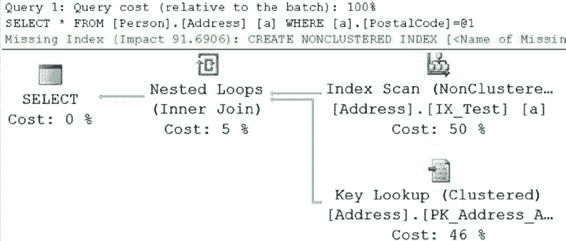
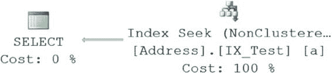

# 第 8 章：索引架构与行为

`FROM Person.Address AS a`
`WHERE a.PostalCode = 'WA3 7BH';`

结果如下：

表 `Address`。扫描计数 1，逻辑读取 211

CPU 时间 = 16 毫秒，耗时 = 267 毫秒。

并且执行计划明显不同，如图 8-15 所示。

[www.it-ebooks.info](http://www.it-ebooks.info/)



**图 8-15.** 针对内部列查询的执行计划

两个查询都从同一张表返回了 31 行，但读取次数从 74 跳升到了 180。你开始看出图 8-14 中的索引查找操作与图 8-15 中的索引扫描操作之间的差异了。

另请注意，由于优化器不得不执行扫描，它提示可能存在一个潜在的索引，可以帮助提升查询性能。

缺失索引信息对于指示表上可能存在新的或更佳的索引非常有用，但不要认为它总是正确的。你可以右键单击显示缺失索引信息的位置，然后从上下文菜单中选择“缺失索引详细信息”。这将打开一个新的查询窗口，其中已列出索引的详细信息，准备好供你创建。如果你决定测试该索引，请确保将其从默认名称重命名。

最后，要真正领略索引排序的效果，请将查询改为如下：

```
SELECT a.AddressID,
       a.City,
       a.PostalCode
FROM Person.Address AS a
WHERE a.City = 'Gloucestershire'
  AND a.PostalCode = 'GL7 1RY';
```

执行此查询将返回与之前查询相同的行数，结果如下：表 `Address`。扫描计数 1，逻辑读取 2

CPU 时间 = 15 毫秒，耗时 = 0 毫秒。

执行计划如图 8-16 所示。

[www.it-ebooks.info](http://www.it-ebooks.info/)



**图 8-16.** 使用了两个列的执行计划

I/O 和执行计划的剧烈变化代表了一个复合索引——即覆盖索引——的真正用途。

这将在第 9 章的“覆盖索引”一节中详细讨论。

完成后，删除该索引。

```
DROP INDEX Person.Address.IX_Test;
```

### 考虑索引类型

在 SQL Server 中，从所有可用的不同索引类型来看，你大多数时候将使用两种主要索引类型：`聚集索引`和`非聚集索引`。两种类型都具有 B 树结构。两种类型之间的主要区别在于，聚集索引的叶级页就是表的数据页，因此它们与所指向的数据具有相同的物理顺序。这意味着聚集索引就是表本身。随着学习的深入，你会发现，这两种索引类型在叶级别的差异在决定使用哪种索引类型时变得很重要。

#### 聚集索引

聚集索引的叶级页和其所在表的数据页是同一个。因此，表行在物理上按聚集索引列排序，并且由于表数据的物理顺序只能有一个，所以一张表只能有一个聚集索引。

■**提示** 当你创建主键约束时，如果尚不存在聚集索引且未显式指定索引应为唯一的非聚集索引，SQL Server 会自动将其创建为在主键上的唯一聚集索引。这不是强制要求；这只是默认行为。你可以在表上创建主键之前更改其定义。

#### 堆表

如本章前面所述，没有聚集索引的表称为 `堆表`。堆表的数据行不以任何特定顺序存储，也不与表中的相邻页链接。与访问大型非堆表（具有聚集索引的表）相比，堆表的这种无组织结构通常会增加访问大型堆表的开销。

[www.it-ebooks.info](http://www.it-ebooks.info/)


