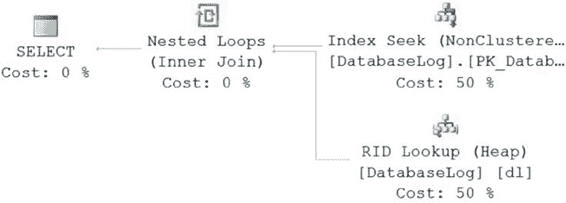

# 第 8 章 索引结构与行为

#### 与非聚簇索引的关系

在 SQL Server 中，聚簇索引与非聚簇索引之间存在一种有趣的关系。非聚簇索引的索引行包含一个指向表中对应数据行的指针。这个指针被称为*行定位器*。行定位器的值取决于数据页是存储在堆表上还是聚簇索引上。

对于非聚簇索引，如果表是堆表，行定位器就是指向该数据行在堆中的行标识符（`RID`）的指针。如果表具有聚簇索引，则行定位器就是聚簇索引键值。

例如，假设你有一个没有聚簇索引的堆表，如表 8-4 所示。

**表 8-4. 示例表的数据页**

| RowID (非真实列) | c1 | c2 | c3 |
| :--- | :--- | :--- | :--- |
| | A1 | A2 | A3 |
| | B1 | B2 | B3 |

在堆表的列 `c1` 上创建的非聚簇索引，会导致其索引行的行定位器包含一个指向数据库表中相应数据行的指针，如表 8-5 所示。

**表 8-5. 无聚簇索引时的非聚簇索引页**

| c1 | 行定位器 |
| :--- | :--- |
| A1 | 指向 `RID` = 1 的指针 |
| B1 | 指向 `RID` = 2 的指针 |

在列 `c2` 上创建聚簇索引后，非聚簇索引行的行定位器值会发生改变。

新的行定位器值将包含聚簇索引键值，如表 8-6 所示。

**表 8-6. 在 c2 上有聚簇索引时的非聚簇索引页**

| c1 | 行定位器 |
| :--- | :--- |
| A1 | A2 |
| B1 | B2 |

为了验证聚簇索引和非聚簇索引之间的这种依赖关系，让我们看一个例子。在 `AdventureWorks2012` 数据库中，表 `dbo.DatabaseLog` 没有聚簇索引，只有一个非聚簇主键。如果运行如下查询，其执行计划将如图 8-17 所示。

```sql
SELECT dl.DatabaseLogID,
       dl.PostTime
FROM dbo.DatabaseLog AS dl
WHERE dl.DatabaseLogID = 115;
```




**图 8-17. 针对堆表的执行计划**

如你所见，索引被用于 `Seek` 操作。但由于数据与非聚簇索引是分开存储的，因此需要一个额外的操作，即 `RID Lookup` 操作来检索数据，然后通过一个 `Nested Loop` 操作将这些数据与索引查找操作的信息连接回来。这是一个经典的*查找*案例，在这个例子中是 `RID` 查找，更多细节将在“定义查找”部分进行解释。

针对具有聚簇索引的表运行类似的查询，情况会是这样：

```sql
SELECT d.DepartmentID,
       d.ModifiedDate
FROM HumanResources.Department AS d
WHERE d.DepartmentID = 10;
```


**图 8-18. 使用聚簇索引的执行计划**

虽然主键的使用方式与前一个查询相同，但这次它是针对聚簇索引的。

正如你现在所知，这意味着数据与索引存储在一起，因此额外的列不需要通过查找操作来获取数据。一切都通过简单的聚簇索引 `Seek` 操作返回。

要从一个非聚簇索引行导航到数据行，这两种索引类型之间的关系要求在遍历聚簇索引的 B 树结构时增加一次额外的间接寻址。如果没有聚簇索引，非聚簇索引的行定位器本可以直接从非聚簇索引行导航到基表中的数据行。聚簇索引的存在使得从非聚簇索引行到数据行的导航必须经过聚簇索引的 B 树结构，因为新的行定位器值指向的是聚簇索引键。

另一方面，考虑按聚簇索引键顺序插入一个中间行，或者扩展一个中间行的内容。例如，想象一个聚簇索引表，每页包含四行，聚簇索引列值分别为 1、2、4 和 5。在表中插入一个聚簇索引值为 3 的新行，将需要在值 2 和 4 之间的页面位置分配空间。如果该位置没有足够的空间，将在数据页（或聚簇索引叶页）上发生页拆分。尽管数据页拆分会导致数据行重定位，但非聚簇索引的行定位器值无需更新。这些行定位器继续指向相同的聚簇索引键逻辑键值，即使数据行在物理上已经移动到了不同的位置。在发生数据页拆分的情况下，非聚簇索引的行定位器不需要更新。这一点很重要，因为表通常有大量的非聚簇索引。

对于堆表，情况则不同。虽然堆表中的页拆分并不常见，并且当堆表发生拆分时，它们不会像聚簇索引那样重新安排位置，但堆表中的行仍然可能移动，这通常是由于更新导致堆表无法容纳在当前页面内而引起的。任何导致堆表中行位置移动的操作，都会在原始位置放置一条指向新位置的转发记录，这会导致更多的 I/O 活动。

> **注意：** 页拆分及其对性能的影响将在第 13 章中更详细地解释。

#### 聚簇索引建议

聚簇索引和非聚簇索引之间的关系对聚簇索引施加了一些考虑因素，这些将在接下来的章节中解释。

##### 先创建聚簇索引

由于所有非聚簇索引都在其索引行中包含聚簇索引键，因此非聚簇索引和聚簇索引的创建顺序很重要。例如，如果在创建聚簇索引之前构建了非聚簇索引，那么非聚簇索引的行定位器将包含指向表中相应 `RID` 的指针。之后创建聚簇索引将修改所有非聚簇索引，将聚簇索引键作为新的行定位器值。这实际上会重建所有非聚簇索引。

为了获得最佳性能，我建议你在创建任何非聚簇索引*之前*创建聚簇索引。

这可以使得非聚簇索引在创建时，其行定位器就被设置为聚簇索引键。

这对最终性能没有影响，但重建索引可能是一项相当大的工作。

作为首先创建聚簇索引的一部分，我还建议你围绕聚簇索引来设计数据库中的表。它应该是第一个创建的索引，因为你应该默认将数据存储为聚簇索引。

##### 保持聚簇索引窄小

由于所有非聚簇索引都将聚簇键作为其行定位器，为了获得最佳性能，请尽可能保持聚簇索引的总字节大小小。如果你创建了一个宽的聚簇索引，比如 `CHAR(500)`，除了聚簇中每页的行数会减少之外，还会为每个非聚簇索引增加 500 字节。因此，应将聚簇索引中的列数保持在最少，并仔细考虑要包含在聚簇索引中的每个列的字节大小。整数数据类型的列通常是聚簇索引的良好候选者，而字符串数据类型的列则是一个不太理想的选择。

要理解宽聚簇索引对非聚簇索引的影响，请考虑这个例子。创建一个带有聚簇索引和非聚簇索引的小型测试表。

```sql
IF (SELECT OBJECT_ID('Test1')) IS NOT NULL
    DROP TABLE dbo.Test1;
GO
```


