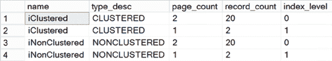

# 第 8 章 ■ 索引架构与行为

```sql
CREATE TABLE dbo.Test1 (C1 INT, C2 INT);
```

[www.it-ebooks.info](http://www.it-ebooks.info/)


```sql
WITH Nums
AS (SELECT TOP (20)
    ROW_NUMBER() OVER (ORDER BY (SELECT 1)) AS n
    FROM master.sys.all_columns ac1
    CROSS JOIN master.sys.all_columns ac2
)
INSERT INTO dbo.Test1 (C1, C2)
SELECT n, n + 1
FROM Nums;

CREATE CLUSTERED INDEX iClustered
ON dbo.Test1 (C2);

CREATE NONCLUSTERED INDEX iNonClustered
ON dbo.Test1 (C1);
```

由于该表有一个聚集索引，非聚集索引的行定位器包含了聚集索引键值。因此：

-   非聚集索引行的宽度 = 非聚集索引列的宽度 + 聚集索引列的宽度 = `INT` 数据类型的大小 + `INT` 数据类型的大小 = 4 字节 + 4 字节 = 8 字节

由于非聚集索引行如此之小，所有行都可以存储在一个索引页中。你可以通过查询索引统计信息来确认这一点，如 `图 8-19` 所示。

`图 8-19. 窄索引的索引页数量`

```sql
SELECT i.name,
    i.type_desc,
    s.page_count,
    s.record_count,
    s.index_level
FROM sys.indexes i
JOIN sys.dm_db_index_physical_stats(DB_ID(N'AdventureWorks2012'),
    OBJECT_ID(N'dbo.Test1'), NULL, NULL, 'DETAILED') AS s
ON i.index_id = s.index_id
WHERE i.object_id = OBJECT_ID(N'dbo.Test1');
```

[www.it-ebooks.info](http://www.it-ebooks.info/)



