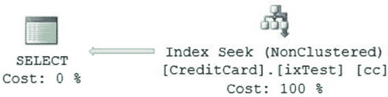

# 第 8 章：索引结构与行为

#### 非聚集索引相对于聚集索引的优势

你可以再次运行相同的 `SELECT` 命令。由于通过非聚集索引检索少量行比全表扫描更经济，优化器使用了列 `c1` 上的非聚集索引，如图 8-22 所示。`STATISTICS IO` 报告的逻辑读取次数如下：

```sql
表 'Test1'。扫描次数 1，逻辑读取次数 3

CPU 时间 = 0 ms，耗时 = 0 ms。
```

图 8-22. 使用非聚集索引的执行计划

尽管使用高选择性的列来检索少量结果集是创建该列上非聚集索引的一个良好指标，但在同一列上创建聚集索引可能同样有益，甚至效果更佳。

为了评估聚集索引为何能比非聚集索引带来更大好处，请在同一列上创建一个聚集索引。

```sql
CREATE CLUSTERED INDEX icl ON dbo.Test1(C1);
```

再次运行相同的 `SELECT` 命令。从上述 `SELECT` 语句的结果执行计划（参见图 8-22）中可以看到，即使对于少量结果集，优化器也使用了聚集索引（而非非聚集索引）。`SELECT` 语句的逻辑读取次数从三次减少到了两次（图 8-23）。

```sql
表 't1'。扫描次数 1，逻辑读取次数 2

CPU 时间 = 0 ms，耗时 = 0 ms。
```

图 8-23. 使用聚集索引的执行计划

> **注意**：因为一个表只能有一个聚集索引，并且该索引是数据实际存储的地方，所以我通常会将聚集索引保留给最常用的数据访问路径。

正如你在上一节所学，在以下情况下，非聚集索引比聚集索引更受青睐：

*   当索引键尺寸较大时。
*   为了避免与聚集索引相关的开销，因为重建聚集索引会重建表的所有非聚集索引。
*   通过让数据库读取器在非聚集索引的页面上工作，而数据库写入器修改数据页中的其他列（不包含在非聚集索引中），从而解决阻塞问题；在这种情况下，写入器在数据页上工作时，不会阻塞能够直接从非聚集索引获取所有所需列值而无需访问基表的读取器。我将在第 13 章详细解释这一点。
*   当查询所引用的所有（来自表的）列都可以安全地包含在非聚集索引本身中时，正如本节所解释的。

如前所述，使用非聚集索引时的数据检索性能通常比使用聚集索引时差，这是因为从非聚集索引行跳转到基表中的数据行需要成本。在不需要跳转到数据行的情况下，非聚集索引的性能应该与聚集索引一样好，甚至更好。如果非聚集索引本身（在页面级别，键加上任何包含列）包含了表中所需的所有列，这种情况就可能发生。

为了理解非聚集索引可能优于聚集索引的情况，请考虑以下示例。假设你需要检查在 2008 年 6 月至 2008 年 9 月期间到期的信用卡。你可能会有一个返回大量行的查询，如下所示：

```sql
SELECT cc.CreditCardID,
       cc.CardNumber,
       cc.ExpMonth,
       cc.ExpYear
FROM Sales.CreditCard cc
WHERE cc.ExpMonth BETWEEN 6 AND 9
  AND cc.ExpYear = 2008
ORDER BY cc.ExpMonth;
```

以下是 I/O 和时间结果。图 8-24 显示了执行计划。

```sql
表 'CreditCard'。扫描次数 1，逻辑读取次数 189

CPU 时间 = 16 ms，耗时 = 240 ms。
```

图 8-24. 扫描聚集索引的执行计划


[www.it-ebooks.info](http://www.it-ebooks.info/)



