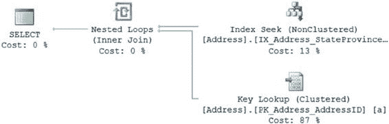

# 第 9 章 ■ 索引分析

在上一章中，我介绍了围绕索引的概念。本章将在此基础上添加更多功能。索引之间有许多有趣的交互作用可供你利用。

还有一些影响索引行为的设置，我在前一章中没有涉及。

我将向你展示从系统中挤出更多性能的方法。

在本章中，我将涵盖以下主题：

• 高级索引技术

• 特殊索引类型

• 索引的其他特性

## 高级索引技术

以下是一些你可以考虑的更高级的索引技术：

• ``覆盖索引``：这些在第 8 章中已介绍。

• ``索引交集``：使用多个非聚集索引来满足查询所需的所有列（来自表）。

• ``索引联接``：利用索引交集和覆盖索引技术来避免访问基础表。

• ``筛选索引``：为了能够索引具有奇怪数据分布或稀疏列的字段，你可以向索引应用筛选器，使其仅索引部分数据。

• ``索引化视图``：这些视图将输出物化到磁盘上。

• ``索引压缩``：可以通过 SQL Server 压缩索引的存储，在页面上放置更多数据行，从而提高性能。

• ``列存储索引``：与传统索引按行分组和存储数据不同，这些索引按列进行分组和存储。

我将在以下各节中更详细地介绍这些主题。

[www.it-ebooks.info](http://www.it-ebooks.info/)



### 覆盖索引

``覆盖索引`` 是一个建立在满足 SQL 查询所需的所有列上的非聚集索引，而无需访问堆或聚集索引。如果一个查询遇到一个索引并且根本不需要引用底层结构，那么该索引可以被视为覆盖索引。

例如，在以下 `SELECT` 语句中，无论列在语句中的哪个位置使用，所有列 (`StateProvinceID` 和 `PostalCode`) 都应包含在非聚集索引中，以完全覆盖查询：

```sql
SELECT a.PostalCode
FROM Person.Address AS a
WHERE a.StateProvinceID = 42;
```

然后，查询所需的所有数据都可以从非聚集索引页获得，而无需访问数据页。这有助于 SQL Server 节省逻辑和物理读取。如果你运行查询，你将获得以下 I/O 和执行时间，以及图 9-1 中的执行计划。

表 'Address'。扫描计数 1，逻辑读取 19 次

CPU 时间 = 0 毫秒，elapsed time = 17 毫秒。

**图 9-1.** 没有覆盖索引的查询

这里你有一个经典的查找操作，`Key Lookup` 操作符从聚集索引中提取 `PostalCode` 数据，并将其与针对 `IX_Address_StateProvinceId` 索引的 `Index Seek` 操作符进行联接。

虽然你可以用两个键列重新创建索引，但使索引成为覆盖索引的另一种方法是使用新的 `INCLUDE` 操作符。这会将数据与索引一起存储，而不改变索引本身的结构。

使用以下语句重新创建索引：

```sql
CREATE NONCLUSTERED INDEX [IX_Address_StateProvinceID]
ON [Person].[Address] ([StateProvinceID] ASC)
INCLUDE (PostalCode)
WITH (
DROP_EXISTING = ON);
```

如果你重新运行查询，执行计划（图 9-2）、I/O 和执行时间都会改变。

表 'Address'。扫描计数 1，逻辑读取 2 次

CPU 时间 = 0 毫秒，elapsed time = 14 毫秒。

[www.it-ebooks.info](http://www.it-ebooks.info/)


**图 9-2.** 使用覆盖索引的查询

读取次数从 19 次下降到 2 次，执行计划也尽可能简单；它是一个针对新的改进索引（现在已成为覆盖索引）的单一 `Index Seek` 操作。覆盖索引是一种用于减少查询逻辑读取次数的有效技术。使用 `INCLUDE` 语句添加列使得实现此功能更加容易，而不会增加索引中的列数或索引键的大小，因为包含的列仅存储在索引的叶级。

`INCLUDE` 最适合用于以下情况：

• 你不希望增加索引键的大小，但仍然希望使索引成为覆盖索引。

• 你有一个不能作为索引键列的数据类型，但可以通过 `INCLUDE` 命令添加到非聚集索引中。

• 你已经超过了索引的最大键列数（尽管这个问题最好避免）。

一个伪聚集索引


