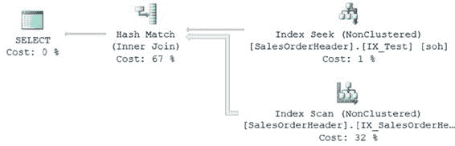
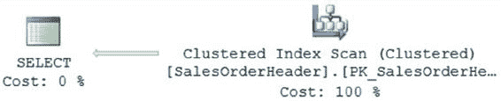
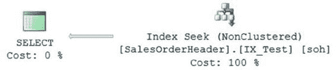
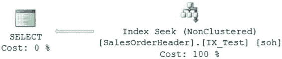

# 第 9 章 ■ 索引分析

### 筛选索引

`WHERE soh.SalesPersonID = 276`
`AND soh.OrderDate BETWEEN '4/1/2005' AND '7/1/2005';`

该查询的执行计划如图 9-5 所示，读取情况如下：表 'SalesOrderHeader'。扫描计数 `1`，逻辑读取 `689`
CPU 时间 = `0 ms`，耗时 = `55 ms`。

**图 9-5.** 无索引连接的执行计划

如图 9-5 所示，优化器没有使用 `SalesPersonID` 列上现有的非聚集索引。

由于查询还需要 `OrderDate` 列的值，优化器选择了聚集索引来检索查询中引用的所有列的值。如果在 `OrderDate` 列上创建如下索引：

```sql
CREATE NONCLUSTERED INDEX IX_Test
ON Sales.SalesOrderHeader (OrderDate ASC);
```

并重新运行查询，那么图 9-6 显示了结果，你可以在这里看到读取情况：表 'SalesOrderHeader'。扫描计数 `2`，逻辑读取 `4`
CPU 时间 = `0 ms`，耗时 = `35 ms`。

**图 9-6.** 带有索引连接的执行计划

[www.it-ebooks.info](http://www.it-ebooks.info/)



第 9 章 ■ 索引分析

两个索引的组合作用类似于覆盖索引，将表的读取次数从 `689` 减少到 `4`，因为它使用了两个 `索引查找` 操作连接在一起，而不是进行聚集索引扫描。

但是，如果 `WHERE` 子句没有导致使用两个索引怎么办？相反，你知道两个索引都存在，并且像前面的查询一样对每个索引进行查找是可行的，因此你选择使用索引提示。

```sql
SELECT soh.SalesPersonID,
       soh.OrderDate
FROM Sales.SalesOrderHeader AS soh WITH
    (INDEX (IX_Test,
            IX_SalesOrderHeader_SalesPersonID))
WHERE soh.OrderDate BETWEEN '4/1/2002' AND '7/1/2002';
```

这个新查询的结果如图 9-7 所示，I/O 情况如下：表 'Workfile'。扫描计数 `0`，逻辑读取 `0`
表 'Worktable'。扫描计数 `0`，逻辑读取 `0`
表 'SalesOrderHeader'。扫描计数 `2`，逻辑读取 `59`
CPU 时间 = `16 ms`，耗时 = `144 ms`。

**图 9-7.** 通过提示进行索引连接的执行计划

读取次数明显增加，并且出现了使用 `tempdb` 在处理期间存储数据的工作表和工作文件。大多数情况下，优化器在索引和执行计划方面会做出良好的选择。

虽然可以使用查询提示来让你从优化器手中接管控制权，但这种控制可能带来的问题与它解决的问题一样多。在试图强制使用索引连接以获得性能提升时，强制选择索引反而减慢了查询的执行速度。

继续之前请删除测试索引。

```sql
DROP INDEX Sales.SalesOrderHeader.IX_Test;
```

`注意`

在生成查询执行计划时，SQL Server 优化器会经历多个优化阶段，不仅确定要使用的索引类型和连接策略，还会评估高级索引技术，例如索引交叉和索引连接。因此，在某些情况下，与其创建宽泛的覆盖索引，不如考虑创建多个窄索引。SQL Server 可以将它们一起用作覆盖索引，同时在需要时单独使用它们。但你需要通过测试来确定哪种方式在你的情况下效果更好——是更宽的索引，还是索引交叉和连接。

[www.it-ebooks.info](http://www.it-ebooks.info/)




第 9 章 ■ 索引分析

筛选索引是一种非聚集索引，它使用过滤器（基本上是一个 `WHERE` 子句）来针对一个或多个列创建高度选择性的键集，否则这些列可能没有良好的选择性。例如，具有大量 `NULL` 值的列可能存储为稀疏列以减少这些 `NULL` 值的开销。向该列添加筛选索引将允许你拥有一个可用于非 `NULL` 数据的索引。理解这一点的最好方式是查看实际应用。

`Sales.SalesOrderHeader` 表有超过 30,000 行。在这些行中，有 27,000 多行的 `PurchaseOrderNumber` 列和 `SalesPersonId` 列具有空值。如果你想获取一个简单的采购订单号列表，查询可能如下所示：

```sql
SELECT soh.PurchaseOrderNumber,
       soh.OrderDate,
       soh.ShipDate,
       soh.SalesPersonID
FROM Sales.SalesOrderHeader AS soh
WHERE PurchaseOrderNumber LIKE 'PO5%'
  AND soh.SalesPersonID IS NOT NULL;
```

运行查询后，正如你所料，会进行聚集索引扫描，以及以下 I/O 和执行时间，如图 9-8 所示：
表 'SalesOrderHeader'。扫描计数 `1`，逻辑读取 `689`
CPU 时间 = `0 ms`，耗时 = `87 ms`。

**图 9-8.** 无索引的执行计划

为了解决这个问题，可以创建一个索引并包含查询中的部分列，使其成为覆盖索引（如图 9-9 所示）。

```sql
CREATE NONCLUSTERED INDEX IX_Test
ON Sales.SalesOrderHeader(PurchaseOrderNumber,SalesPersonID)
INCLUDE (OrderDate,ShipDate);
```

**图 9-9.** 带有覆盖索引的执行计划

[www.it-ebooks.info](http://www.it-ebooks.info/)



第 9 章 ■ 索引分析

当你重新运行查询时，性能提升相当显著（见图 9-9 及以下结果中的 I/O 和时间）。
表 'SalesOrderHeader'。扫描计数 `1`，逻辑读取 `5`
CPU 时间 = `0 ms`，耗时 = `69 ms`。

如你所见，覆盖索引将读取次数从 `689` 减少到 `5`，时间从 `87 ms` 减少到 `69 ms`。通常，这已经足够了。假设这个查询必须频繁调用。现在，你能从中榨取的每一丁点速度都会带来回报。知道索引列中有如此多的数据为空，你可以调整索引，使其过滤掉空值（这些值无论如何索引也不会使用），从而减小树的大小，进而减少所需的搜索量。

```sql
CREATE NONCLUSTERED INDEX IX_Test
ON Sales.SalesOrderHeader(PurchaseOrderNumber,SalesPersonID)
INCLUDE (OrderDate,ShipDate)
WHERE PurchaseOrderNumber IS NOT NULL AND SalesPersonID IS NOT NULL
WITH (DROP_EXISTING = ON);
```

查询的最终运行结果在以下结果和图 9-10 中可见。
表 'SalesOrderHeader'。扫描计数 `1`，逻辑读取 `4`
CPU 时间 = `0 ms`，耗时 = `55 ms`。

**图 9-10.** 带有筛选索引的执行计划

虽然在绝对数字上，将读取次数从 `5` 减少到 `4` 并不算多，但这意味着查询的 I/O 成本降低了 20%。如果这个查询像某些查询那样，每分钟运行数百甚至数千次，那么这 20% 的减少确实会带来巨大的收益。另一个可见的收益证据是执行时间再次从 `69 ms` 降到了 `55 ms`。

筛选索引在许多方面提升了性能。
*   通过减小索引大小来提高查询效率。
*   通过创建更小的索引来降低存储成本。
*   由于索引变小，减少了索引维护的成本。

但是，任何事情都有代价。你可能会遇到参数化查询与筛选索引不匹配的问题，从而无法使用它。统计信息不是基于过滤条件更新的，而是像常规索引一样基于整个表更新的。就像本书中的任何建议一样，请在你的环境中进行测试，以确保筛选索引是有帮助的。


