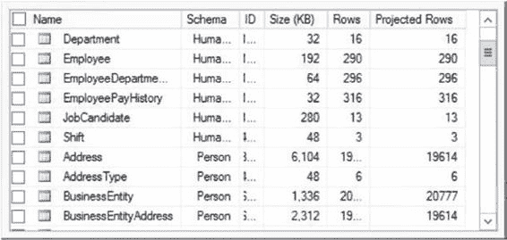
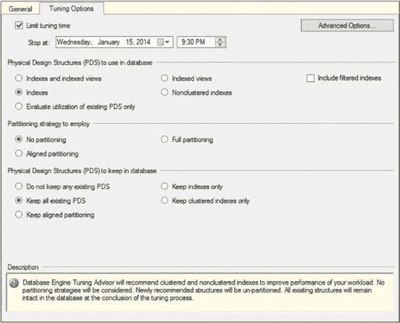
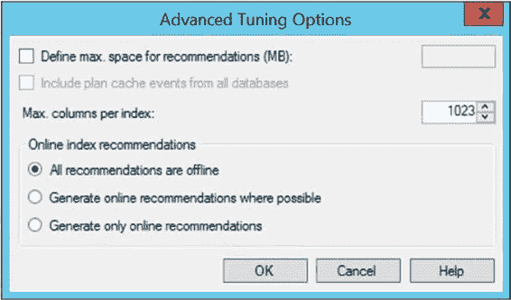
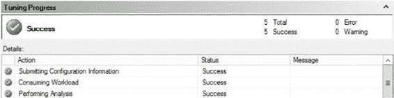
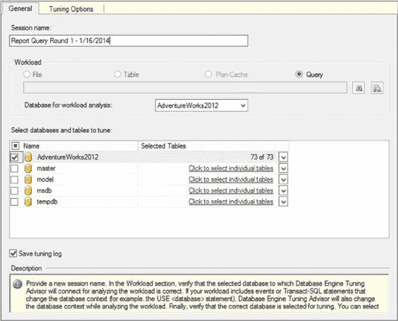

# 第 10 章：数据库引擎调优顾问

## 使用概述

**图 10-1. 在数据库引擎调优顾问中选择服务器和数据库** 数据库引擎调优顾问已经连接到服务器。从这里开始，您需要概述工作负载以及要调优的对象。创建会话名称对于为文档目的标记会话是必要的。然后您需要选择一个工作负载。工作负载可以来自跟踪文件或表，或者（在 SQL Server 2012 中引入）您可以使用计划缓存中存在的查询。最后，您需要浏览到适当的位置。工作负载的定义取决于您启动数据库引擎调优顾问的方式。如果您从查询窗口启动它，您将看到一个“查询”单选按钮，并且“文件”和“表”单选按钮将被禁用。您还必须定义“工作负载分析的数据库”设置，并最终选择要调优的数据库。

**提示** 数据库引擎调优顾问仅支持在支持索引视图的平台上推荐索引视图。SQL Server 2014 企业版支持，但标准版不支持。

[www.it-ebooks.info](http://www.it-ebooks.info/)





选择数据库时，还可以通过单击屏幕右侧的下拉框选择要调优的个别表；您将看到如图 10-2 所示的表列表。

**图 10-2. 单击复选框定义数据库引擎调优顾问中用于调优的个别表** 定义了工作负载后，您需要选择“调优选项”选项卡，如图 10-3 所示。

**图 10-3. 在数据库引擎调优顾问中定义选项**

[www.it-ebooks.info](http://www.it-ebooks.info/)



您可以通过选择“限制调优时间”然后定义调优停止的日期和时间，来定义希望数据库引擎调优顾问运行的时间长度。数据库引擎调优顾问运行时间越长，它应该能提出更好的建议。您选择数据库引擎调优顾问考虑创建的物理设计结构的类型，还可以设置分区策略，以便调优顾问知道是否应将表和索引分区作为分析的一部分。请记住，分区首先是一个数据管理工具，而不是性能调优机制。如果您的数据和结构不需要，分区可能不是理想的结果。最后，您可以定义希望数据库中保留不变的物理设计结构。更改这些选项将会缩小或扩大数据库引擎调优顾问可以做出以提高性能的选择范围。

您可以单击“高级选项”按钮查看更多选项，如图 10-4 所示。

**图 10-4. 高级调优选项对话框**

此对话框允许您限制建议的空间和索引中可以包含的列数。您可以决定是否要包含系统中所有数据库的计划缓存事件。最后，您可以定义新索引或索引更改是作为联机还是脱机索引操作完成。

一旦您适当地定义了所有这些设置，就可以通过单击“开始分析”按钮来启动数据库引擎调优顾问。针对您运行数据库引擎调优顾问的任何服务器实例，创建的会话都保存在 `msdb` 数据库中。它显示正在分析的内容和已完成的进度，您可以在图 10-5 中看到。

[www.it-ebooks.info](http://www.it-ebooks.info/)





**图 10-5. 调优进度**

您将在下一部分的示例分析中看到更详细的进度显示示例。

分析完成后，您将获得一份建议列表（在图 10-6 中可见），并且许多报告变得可用。表 10-1 描述了这些报告。

**图 10-6. 查询调优常规设置**

[www.it-ebooks.info](http://www.it-ebooks.info/)

**表 10-1. 数据库引擎调优顾问报告**

| 报告名称 | 报告描述 |
| :--- | :--- |
| 列访问 | 列出工作负载中引用的列和表 |
| 数据库访问 | 列出工作负载中引用的每个数据库以及每个数据库的工作负载语句百分比 |
| 事件频率 | 列出工作负载中按发生频率排序的所有事件 |
| 索引详细信息（当前） | 定义工作负载引用的索引及其属性 |
| 索引详细信息（建议） | 与“索引详细信息（当前）”报告相同，但显示有关数据库引擎调优顾问建议的索引的信息 |
| 索引使用情况（当前） | 列出工作负载引用的索引及其使用百分比 |
| 索引使用情况（建议） | 与“索引使用情况（当前）”报告相同，但针对建议的索引 |
| 语句成本 | 列出如果实施建议，每条语句的性能改进 |
| 语句成本范围 | 按百分位数分解成本改进，以显示对于任何给定的更改集可以实现多少收益；这些成本是优化器提供的估计值 |
| 语句详细信息 | 列出工作负载中的语句、它们的成本以及如果实施建议后的降低成本 |
| 语句到索引关系 | 列出各个语句引用的索引；提供报告的当前版本和建议版本 |
| 表访问 | 列出工作负载引用的表 |
| 视图到表关系 | 列出物化视图引用的表 |
| 工作负载分析 | 提供有关工作负载的详细信息，包括语句数量、成本降低的语句数量以及成本保持不变的语句数量 |

## 数据库引擎调优顾问示例

学习如何使用数据库引擎调优顾问的最佳方法就是使用它。这不是一个很难掌握的工具，因此我建议打开它并开始使用。

### 调优查询

您可以使用数据库引擎调优顾问，通过一个能公平代表所有 SQL 活动的工作负载，来为整个数据库推荐索引。您也可以使用它为一组有问题的查询推荐索引。

[www.it-ebooks.info](http://www.it-ebooks.info/)

要了解如何使用数据库引擎调优顾问获取一组有问题的查询的索引建议，假设您有一个经常调用的简单查询。由于调用频繁，您希望快速获得一些调优结果。查询如下：

```sql
SELECT soh.DueDate,
       soh.CustomerID,
       soh.Status
FROM Sales.SalesOrderHeader AS soh
WHERE soh.DueDate BETWEEN '1/1/2008' AND '2/1/2008';
```

要分析该查询，请在查询窗口中右键单击它，然后选择“在数据库引擎调优顾问中分析查询”。调优顾问将打开一个窗口，您可以在其中将会话名称更改为有意义的名称。在本例中，我选择了“Report Query Round 1 – 1/16/2014”。数据库和表不需要编辑。当您完成时，“常规”选项卡将如图 10-6 所示。


