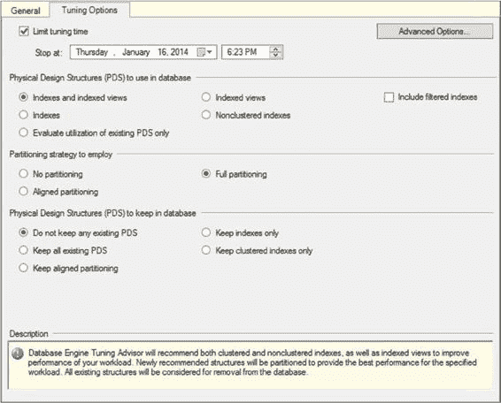
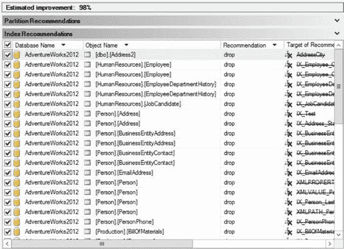
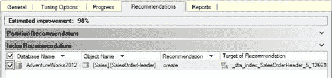
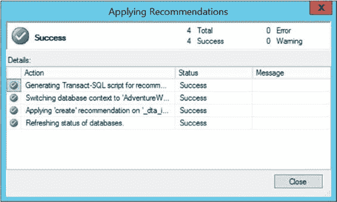

# 第 10 章 数据库引擎调优顾问

鉴于此查询至关重要，且对其进行调优对业务极其关键，我将在“调优选项”选项卡上更改一些设置，以期最大化可能的建议。为此示例，我将让数据库引擎调优顾问运行默认的一小时，但对于更大负载或更复杂的查询，你可能需要考虑给予系统更多时间。我将勾选“包括筛选索引”复选框，以便在筛选索引有益时将其纳入考虑。我还将把“分区策略采用”设置从“无分区”切换为“完全分区”。最后，我将允许数据库引擎调优顾问提出结构更改（如果它发现任何有助于性能的更改），方法是将“保留所有现有 PDS”更改为“不保留任何现有 PDS”。完成这些设置后，“调优选项”选项卡将如图 10-7 所示。



**图 10-7.** 已调整的调优选项卡

请注意，当你更改上述选项的定义时，屏幕底部的描述也会随之变化。开始分析后，应会出现进度屏幕。虽然设置是评估一小时，但 DTA 仅用了大约一分钟就评估了此查询。初始建议并不是一个好的选择集。如图 10-8 所示，数据库引擎调优顾问建议删除数据库中大量的索引。这不是运行该工具时希望看到的建议类型。



**图 10-8.** 查询调优的初始建议

这是因为数据库引擎调优顾问假定正在测试的负载是数据库的完整负载。如果有索引未被使用，那么它们就应该被删除。这是一个最佳实践，应该在任何数据库上实施。然而，在这种情况下，这是针对一个单一查询，而不是系统的完整负载。

要查看顾问是否能提出更有意义的建议集，你必须启动一个新的会话。

这次，我将调整选项，使数据库引擎调优顾问无法删除任何现有结构。这是在“调优选项”选项卡（如图 10-7 所示）中设置的。在那里，我将把“物理设计结构 (PDS) 在数据库中保留”设置从“不保留任何现有 PDS”更改为“保留所有现有 PDS”。我将保持运行时间不变，因为评估在此时间范围内运行良好。

再次运行数据库引擎调优顾问后，它在一分钟内完成，并显示了图 10-9 所示的建议。




**图 10-9.** 查询调优建议

第一次，数据库引擎调优顾问建议删除正在测试的表上的大部分索引以及一些相关表上的索引。这次它建议在查询引用的列上创建一个覆盖索引。正如第 4 章所述，覆盖索引可能是检索数据的最佳方法之一。数据库引擎调优顾问能够识别出，一个包含查询引用的所有列的索引（即覆盖索引）性能最佳。

收到建议后，你应仔细检查提议的 T-SQL 命令。这些建议并不总是有用的，因此你需要评估并测试它们以确定其有效性。假设检查后的建议看起来不错，你会想要应用它。选择“操作” > “评估建议”。这将打开一个新的数据库引擎调优顾问会话，并允许你使用最初提出建议时的相同衡量标准来评估这些建议是否有效。所有这些都是为了验证原始建议是否具有其声称的效果。新会话看起来就像一个常规的评估报告。

如果你仍然对建议感到满意，请选择“操作” > “应用建议”。这将打开一个对话框，允许你立即应用建议或计划应用（见图 10-10）。

**图 10-10.** 应用建议对话框

如果单击“确定”按钮，数据库引擎调优顾问会将索引应用到你一直在测试查询的数据库（见图 10-11）。



**图 10-11.** 成功应用的调优会话

生成建议后，你可能希望将其保存到文件中，并累积一系列更改，以便在计划的部署窗口期间发布到生产环境，而不是当场应用。此外，仅采用默认设置，你最终会得到许多名称类似这样的索引：`_dta_index_SalesOrderHeader_5_1266103551__K4_6_11`。这不是很清晰，因此将更改保存到 T-SQL 也将允许你使更改更易于人类阅读。请记住，对表（尤其是大型表）应用索引可能会在创建索引期间对系统上主动运行的进程造成性能影响。

虽然一次获得一个索引建议很好，但最好能够一次性检查数据库的大部分内容。这就是调优跟踪工作负载的用武之地。

### 调优跟踪工作负载

从生产服务器上运行的实际查询中捕获跟踪，是向数据库引擎调优顾问提供有意义数据的一种方法。（捕获跟踪将在第 17 章介绍。）定义用于数据库引擎调优顾问的跟踪的最简单方法是使用“调优”模板实现跟踪。

在需要调优的系统上启动跟踪。我通过在循环中从 PowerShell `sqlps.exe` 命令提示符运行查询来生成了人工负载。这是具有 SQL Server 配置设置的 PowerShell 命令提示符。它随 SQL Server 一起安装。

为了找到一些有趣的问题，我将创建一个具有明显调优问题的存储过程。

```sql
CREATE PROCEDURE dbo.uspProductSize
AS
SELECT p.ProductID,
       p.Size
FROM Production.Product AS p
WHERE p.Size = '62';
```

这是我使用的简单 PowerShell 脚本。你需要为你的环境调整连接字符串。

将文件下载到某个位置后，你只需通过命令提示符引用该文件及其完整路径即可运行它。你可能会遇到安全问题，因为这是一个未签名的原始脚本。如果需要，请遵循该错误消息中提供的帮助指南（`queryload.ps1`）。

```powershell
[reflection.assembly]::LoadWithPartialName("Microsoft.SqlServer.Smo") | out-null

# Get the connection
$SqlConnection = New-Object System.Data.SqlClient.SqlConnection
$SqlConnection.ConnectionString = "Server=DOJO\RANDORI;Database=AdventureWorks2012;Integrated Security=True"

# Load Product data
$ProdCmd = New-Object System.Data.SqlClient.SqlCommand
$ProdCmd.CommandText = "SELECT ProductID FROM Production.Product"
$ProdCmd.Connection = $SqlConnection

$SqlAdapter = New-Object System.Data.SqlClient.SqlDataAdapter
$SqlAdapter.SelectCommand = $ProdCmd

$ProdDataSet = New-Object System.Data.DataSet
$SqlAdapter.Fill($ProdDataSet)
```


