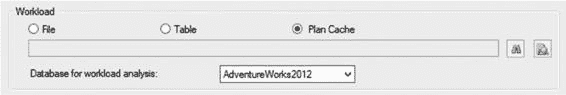
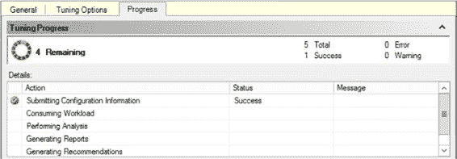
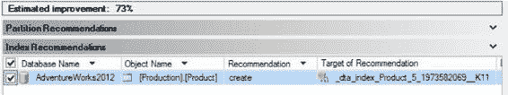
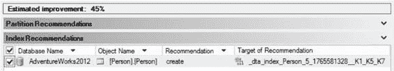

# 第 10 章 ■ 数据库引擎调优顾问

## 用于工作负载模拟的 PowerShell 脚本

```powershell
# 加载员工数据
$EmpCmd = New-Object System.Data.SqlClient.SqlCommand
$EmpCmd.CommandText = "SELECT BusinessEntityID FROM HumanResources.Employee"
$EmpCmd.Connection = $SqlConnection
$SqlAdapter.SelectCommand = $EmpCmd
$EmpDataSet = New-Object System.Data.DataSet
$SqlAdapter.Fill($EmpDataSet)

# 设置要运行的存储过程
$WhereCmd = New-Object System.Data.SqlClient.SqlCommand
$WhereCmd.CommandText = "dbo.uspGetWhereUsedProductID @StartProductID = @ProductId, @CheckDate=NULL"
$WhereCmd.Parameters.Add("@ProductID",[System.Data.SqlDbType]"Int")
$WhereCmd.Connection = $SqlConnection

# 另一个存储过程
$BomCmd = New-Object System.Data.SqlClient.SqlCommand
$BomCmd.CommandText = "dbo.uspGetBillOfMaterials @StartProductID = @ProductId, @CheckDate=NULL"
$BomCmd.Parameters.Add("@ProductID",[System.Data.SqlDbType]"Int")
$BomCmd.Connection = $SqlConnection

# 再一个存储过程
$ManCmd = New-Object System.Data.SqlClient.SqlCommand
$ManCmd.CommandText = "dbo.uspGetEmployeeManagers @BusinessEntityID =@EmpId"
$ManCmd.Parameters.Add("@EmpId",[System.Data.SqlDbType]"Int")
$ManCmd.Connection = $SqlConnection

# 特殊的存储过程
$SpecCmd = New-Object System.Data.SqlClient.SqlCommand
$SpecCmd.CommandText = "dbo.uspProductSize"
$SpecCmd.Connection = $SqlConnection

# 无限循环
while(1 -ne 0)
{
    foreach($row in $ProdDataSet.Tables[0])
    {
        $SqlConnection.Open()
        $ProductId = $row[0]
        $WhereCmd.Parameters["@ProductID"].Value = $ProductId
        $WhereCmd.ExecuteNonQuery() | Out-Null
        $SqlConnection.Close()

        foreach($row in $EmpDataSet.Tables[0])
        {
            $SqlConnection.Open()
            $EmpId = $row[0]
            $ManCmd.Parameters["@EmpID"].Value = $EmpId
            $ManCmd.ExecuteNonQuery() | Out-Null
            $SqlConnection.Close()
        }

        $SqlConnection.Open()
        $BomCmd.Parameters["@ProductID"].Value = $ProductId
        $BomCmd.ExecuteNonQuery() | Out-Null
        $SpecCmd.ExecuteNonQuery() | Out-Null
        $SqlConnection.Close()
    }
}
```

`注意` 有关 PowerShell 的更多信息，请查阅 Don Jones 和 Jeffrey Hicks 所著的《Windows PowerShell》（Sapien, 2010）。

[www.it-ebooks.info](http://www.it-ebooks.info/)

## 使用数据库引擎调优顾问

创建跟踪文件后，打开数据库引擎调优顾问。它默认的文件类型就是跟踪文件，因此只需浏览到跟踪文件的位置即可。和之前一样，你需要从下拉列表中选择 `AdventureWorks2012` 数据库作为工作负载分析的数据库。为了限制建议范围，还需从屏幕底部的数据库列表中选择 `AdventureWorks2012`。设置适当的调优选项，然后开始分析。这次分析运行时间会超过一分钟（参见 `图 10-12`）。







`图 10-12` 数据库调优引擎运行中

在我的机器上，处理过程大约运行了 15 分钟。然后生成输出，如 `图 10-13` 所示。

`图 10-13` 针对手动统计信息的建议

将所有查询通过数据库引擎调优顾问运行后，顾问提出了为 `Product` 表新建一个索引的建议，这将提升该查询的性能。现在我只需要将它保存到一个 T-SQL 文件中，以便在应用到数据库之前编辑其名称。

### 从过程缓存进行调优

SQL Server 2012 引入了一项功能，允许将存储在缓存中的查询计划用作调优建议的来源。过程很简单。只需在 `常规` 页面上多做一个选择，即选择计划缓存作为调优工作的来源，如 `图 10-14` 所示。

`图 10-14` 选择计划缓存作为 DTA 的来源

[www.it-ebooks.info](http://www.it-ebooks.info/)



所有其他选项的行为与之前本章概述的完全一致。处理时间比顾问处理工作负载时大大缩短。它只需处理缓存中的查询，因此，根据系统内存量的不同，这可能是一个简短的列表。处理我的缓存后得出的结果建议在 `Person` 表上创建一个索引。据估计，这可以将性能提升约 45%，如 `图 10-15` 所示。

`图 10-15` 来自计划缓存的建议

这为你提供了另一种尝试以自动化方式调优系统的机制。但它仅限于当前缓存中的查询。根据缓存的易变性（计划老化或被新计划替换的速度），这种方法可能有用，也可能没用。

## 数据库引擎调优顾问的局限性

数据库引擎调优顾问的建议基于输入的工作负载。如果输入的工作负载不能真实反映实际的工作负载，那么推荐的索引有时可能会对工作负载中缺失的某些查询产生 `负面` 影响。但最重要的是，在许多情况下，数据库引擎调优顾问可能无法识别可能的调优机会。它拥有一个复杂的测试引擎，但在某些场景下，其能力是有限的。


对于生产服务器，你应确保 `SQL` 跟踪包含数据库工作负载的完整表示。对于大多数数据库应用程序，捕获一整天的跟踪通常包含了数据库上执行的大多数查询，但也存在例外，例如每周、每月或年终处理。请务必了解你的负载以及正确捕获它所需的条件。`数据库引擎优化顾问` 的其他一些考虑因素/限制如下：

• **使用 `SQL:BatchCompleted` 事件进行跟踪输入**：如前所述，输入到 `数据库引擎优化顾问` 的 `SQL` 跟踪必须包含 `SQL:BatchCompleted` 事件；否则，向导将无法识别工作负载中的查询。

• **工作负载中的查询分布**：在工作负载中，一个查询可能使用相同的参数值执行多次。即使对最常见的查询进行微小的性能改进，与仅执行一次的查询的重大性能改进相比，也能对整体工作负载的性能做出更大的贡献。

• **索引提示**：`SQL` 查询中的索引提示可能会阻止 `数据库引擎优化顾问` 选择更好的执行计划。该向导会将 `SQL` 查询中使用的所有索引提示作为其建议的一部分。因为这些索引对于表可能不是最优的，所以在将工作负载提交给向导之前，请从查询中移除所有索引提示，但请记住，你需要将它们添加回去以查看它们是否真的能改善性能。

[www.it-ebooks.info](http://www.it-ebooks.info/)

## 第 10 章 ■ 数据库引擎优化顾问

## 总结

正如你在本章所学到的，`数据库引擎优化顾问` 可以是一个用于分析现有索引有效性并为 `SQL` 工作负载推荐新索引的有用工具。随着 `SQL` 工作负载随时间变化，你可以使用此工具来确定哪些现有索引不再使用，以及需要哪些新索引来提高性能。偶尔运行向导以检查你现有的索引是否真的最适合你当前的工作负载可能是个好主意。这假设你没有自己捕获指标并进行评估。优化顾问还提供了许多有用的报告，用于分析 `SQL` 工作负载及其自身建议的有效性。请记住，该工具的限制使其无法发现所有优化机会。还要记住，`DTA` 提供的建议的好坏取决于你为其提供的输入。如果你的数据库状况不佳，该工具可以给你一个快速的帮助。如果你已经在定期监控和调整查询，你可能看不到 `数据库引擎优化顾问` 的建议带来的好处。

通常，你会依赖非聚集索引来提高 `SQL` 工作负载的性能。这假设你已经为表分配了聚集索引。由于非聚集索引的性能高度依赖于与其关联的 `书签查找` 的成本，你将在下一章中看到如何分析和解析查找。

[www.it-ebooks.info](http://www.it-ebooks.info/)

