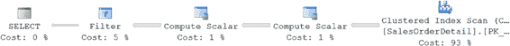

# 第 11 章：键查找及其解决方案

为了最大化非聚集索引的收益，你必须尽可能最小化数据检索的成本。与非聚集索引相关的一个主要开销是过度查找的成本，以前称为 `书签查找`，这是一种从非聚集索引行导航到聚集索引或堆中相应数据行的机制。因此，研究查找的原因并评估如何避免此成本是很有意义的。

在本章中，我将涵盖以下主题：

• 查找的目的

• 使用查找的缺点

• 查找原因的分析

• 解决查找的技术

## 查找的目的

当 `SQL` 查询通过查询请求信息时，如果可用，优化器可以使用 `WHERE` 或 `JOIN` 子句中列上的非聚集索引来检索数据。如果查询引用的列不属于用于检索数据的非聚集索引的一部分，则需要从索引行导航到表中的相应数据行以访问这些剩余列。

例如，在以下 `SELECT` 语句中，如果优化器使用的非聚集索引未包含所有列，则需要从非聚集索引行导航到聚集索引或堆中的数据行以检索这些列的值：

```
SELECT p.[Name],

AVG(sod.LineTotal)

FROM Sales.SalesOrderDetail AS sod

JOIN Production.Product p

ON sod.ProductID = p.ProductID

WHERE sod.ProductID = 776

GROUP BY sod.CarrierTrackingNumber,

p.[Name]

HAVING MAX(sod.OrderQty) > 1

ORDER BY MIN(sod.LineTotal);
```

`SalesOrderDetail` 表在 `ProductID` 列上有一个非聚集索引。优化器可以使用该索引来过滤表中的行。该表在 `SalesOrderID` 和 `SalesOrderDetailID` 上有一个聚集索引，因此它们将包含在非聚集索引中。但由于它们在查询中未被引用，它们对查询没有任何帮助。查询引用的其他列（`LineTotal`、`CarrierTrackingNumber`、`OrderQty` 和 `LineTotal`）在非聚集索引中不可用。为了获取这些列的值，需要通过聚集索引从非聚集索引行导航到相应的数据行，此操作就是键查找。你可以在图 11-1. 中看到实际效果。

***图 11-1.** 更复杂执行计划中的键查找*

为了更好地理解非聚集索引如何导致查找，请考虑以下 `SELECT` 语句，该语句仅请求几行，但由于通配符 `*` 而请求所有列，它使用 `ProductID` 列上的过滤条件从 `SalesOrderDetail` 表中检索：

```
SELECT *

FROM Sales.SalesOrderDetail AS sod

WHERE sod.ProductID = 776 ;
```

优化器评估 `WHERE` 子句，并发现包含在 `WHERE` 子句中的列 `ProductID` 上有一个非聚集索引，可以筛选行数。由于只请求了少量行（228 行），通过非聚集索引检索数据将比扫描聚集索引（包含超过 120,000 行）以识别匹配行更便宜。列 `ProductID` 上的非聚集索引将有助于快速识别匹配行。该非聚集索引包含列 `ProductID` 和聚集索引列 `SalesOrderID` 及 `SalesOrderDetailID`；所有被请求的其他列均未包含。因此，正如你可能猜到的，在使用非聚集索引的同时检索其余列，你需要进行一次查找。

这在以下指标和图 11-2. 的执行计划中显示。你可以使用“查询”➤“查询选项”菜单打开 `STATISTICS IO`。查找 `Key Lookup (Clustered)` 操作符。那就是正在执行的查找。

```
Table 'SalesOrderDetail'. Scan count 1, logical reads 710
CPU time = 0 ms, elapsed time = 104 ms.
```

***图 11-2.** 包含书签查找的执行计划*

[www.it-ebooks.info](http://www.it-ebooks.info/)



## 查找的缺点


