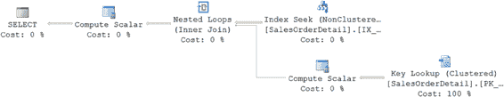
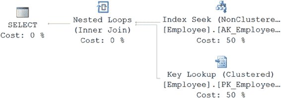
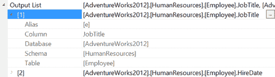
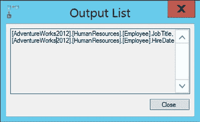

# 关键查找与解决方案

查找操作除了需要访问索引页之外，还需要访问数据页。访问两组页面会增加查询的逻辑读取次数。此外，如果这些页面不在内存中，查找操作很可能还需要在磁盘上进行一次随机（或非连续）I/O 操作，以便从索引页跳转到数据页，同时还需要足够的 CPU 能力来编组这些数据并执行必要的操作。这是因为在大型表中，索引页和对应的数据页在磁盘上通常并不直接相邻。

增加的逻辑读取以及代价高昂的物理读取（如果需要）使得查找操作的数据检索成本相当高。此外，你还需要处理将从索引中检索到的数据与通过查找操作检索到的数据进行合并，这通常是通过某个 `JOIN` 运算符来完成的。这个成本因素是非聚集索引更适合返回表中少量行的查询的原因。随着查询检索的行数增加，查找操作的开销成本变得令人无法接受。

为了理解随着检索行数增加，查找操作如何使非聚集索引失效，让我们看一个不同的例子。产生图 11-2 执行计划的查询仅从 `SalesOrderDetail` 表返回几行。保持查询不变但将过滤器更改为不同的值，当然会改变返回的行数。如果你将参数值改为如下所示：
```sql
SELECT *
FROM Sales.SalesOrderDetail AS sod
WHERE sod.ProductID = 793;
```
那么运行查询将返回超过 700 行，具有不同的性能指标和完全不同的执行计划（图 11-3）。

```
Table 'SalesOrderDetail'. Scan count 1, logical reads 1246
CPU time = 15 ms, elapsed time = 137 ms.
```

***图 11-3.** 返回更多行的查询的不同执行计划*

要确定使用非聚集索引的成本，请考虑查询在执行表扫描期间执行的逻辑读取次数（`1,246`）。如果你通过使用索引提示强制优化器使用非聚集索引，如下所示：
```sql
SELECT *
FROM Sales.SalesOrderDetail AS sod WITH (INDEX (IX_SalesOrderDetail_ProductID))
WHERE sod.ProductID = 793 ;
```
那么逻辑读取次数从 `1,246` 增加到 `2,173`：
```
Table 'SalesOrderDetail'. Scan count 1, logical reads 2173
CPU time = 31 ms, elapsed time = 319 ms.
```

图 11-4 显示了相应的执行计划。

[www.it-ebooks.info](http://www.it-ebooks.info/)





***图 11-4.** 使用索引提示获取更多行的执行计划*

要从非聚集索引中受益，查询应请求相对明确的数据集。应用程序设计在处理大型结果集的需求中扮演着重要角色。例如，网上的搜索引擎大多一次返回有限数量的文章，即使搜索标准可能返回成千上万的匹配文章。如果查询请求大量行，那么增加的查找开销成本可能使非聚集索引不再适用；随后，你必须考虑避免查找操作的可能性。

## 分析查找的原因

由于查找操作可能代价高昂，你应该分析是什么原因导致查询计划在执行计划中选择了查找步骤。你可能会发现，通过在非聚集索引键中包含缺失的列，或者将其作为 `INCLUDE` 列包含在索引页级别，可以避免查找，从而避免与查找相关的额外开销。

要了解如何识别未包含在非聚集索引中的列，请考虑以下查询，该查询基于 `NationalIDNumber` 从 `HumanResources.Employee` 表中提取信息：
```sql
SELECT NationalIDNumber,
       JobTitle,
       HireDate
FROM HumanResources.Employee AS e
WHERE e.NationalIDNumber = '693168613' ;
```
这会产生以下性能指标和执行计划（参见图 11-5）：
```
Table 'Employee'. Scan count 0, logical reads 4
CPU time = 0 ms, elapsed time = 53 ms
```

***图 11-5.** 带有查找操作的执行计划*

[www.it-ebooks.info](http://www.it-ebooks.info/)





如执行计划所示，存在一个键查找。`SELECT` 语句引用了 `NationalIDNumber`、`JobTitle` 和 `HireDate` 列。在 `NationalIDNumber` 列上的非聚集索引并不提供 `JobTitle` 和 `HireDate` 列的值，因此需要通过查找操作从数据存储位置检索这些列。这是一个键查找，因为它通过存储在非聚集索引中的聚集键来检索数据。如果该表是一个堆，则会是 RID 查找。然而，在现实世界中，识别查询使用的所有列通常不会这么简单。请记住，如果查询任何部分（不仅仅是选择列表）引用的所有列不是所使用的非聚集索引的一部分，就会导致查找操作。

对于基于视图和用户定义函数的复杂查询，要找出查询引用的所有列可能过于困难。因此，你需要一种标准机制来找出查找返回但未包含在非聚集索引中的列。

如果你查看 `Key Lookup (Clustered)` 操作的属性，可以看到该操作的输出列表。这显示了查找操作输出的列。要快速、轻松地获取输出列列表并能够复制它们，请右键单击该操作符（本例中为 `Key Lookup (Clustered)`）。然后选择 `Properties` 菜单项。在打开的属性窗口中向下滚动到 `Output List` 属性（图 11-6）。

此属性有一个展开箭头，允许你展开列列表，并且每个列旁边还有进一步的展开箭头，允许你展开该列的属性。

***图 11-6.** 键查找属性窗口*

要直接从属性窗口获取列列表，请单击 `Output List` 属性右侧的省略号。这将在文本窗口中打开输出列表，你可以从中复制数据以用于修改索引（图 11-7）。

***图 11-7.** 非聚集索引中不可用的所需列*

## 解决查找问题

由于查找的相对成本可能很高，你应该尽可能尝试消除查找操作。

在上一节中，你需要在不从索引行导航到数据行的情况下获取 `JobTitle` 和 `HireDate` 列的值。你可以通过三种不同的方式来实现，如下节所述。

### 使用聚集索引

对于聚集索引，索引的叶页与表的数据页相同。因此，在读取聚集索引键列的值时，数据库引擎还可以读取其他列的值，而无需从索引行进行任何导航。在前面的例子中，如果你将特定行的非聚集索引转换为聚集索引，`SQL Server` 可以从同一页检索所有列的值。


