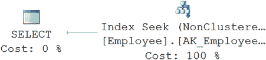
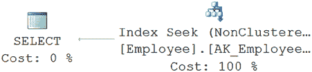
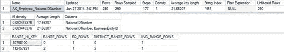
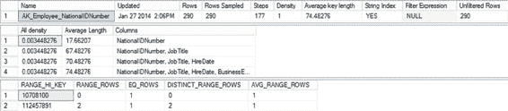
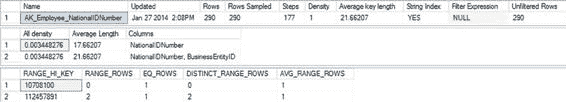

# 第 11 章：键查找与解决方案

## 简单地说，你想将非聚集索引转换为聚集索引是很容易做到的。然而，在这种情况下，以及在你可能遇到的大多数情况下，这样做是不可能的，因为表上已经存在聚集索引。此表上的聚集索引恰好也是主键。你将不得不删除所有外键约束，删除主键并重新创建为非聚集索引，然后针对 `NationalIDNumber` 重新创建索引。你不仅需要考虑涉及的工作量，还可能严重影响依赖于现有聚集索引的其他查询。

**注意** 请记住，一个表只能有一个聚集索引。

### 使用覆盖索引

在第 8 章中，你学到了覆盖索引对于查询来说就像一个伪聚集索引，因为它无需借助表数据即可返回结果。因此，你也可以使用覆盖索引来避免查找。

为了理解如何使用覆盖索引来避免查找，再次查看针对 `HumanResources.Employee` 表的查询。

```sql
SELECT NationalIDNumber, JobTitle, HireDate
FROM HumanResources.Employee AS e
WHERE e.NationalIDNumber = '693168613';
```

为了避免这个书签查找，你可以将查询中引用的列 `JobTitle` 和 `HireDate` 直接添加到非聚集索引键中。这将使该非聚集索引成为此查询的覆盖索引，因为所有列都可以从索引中检索，而无需访问堆或聚集索引。

```sql
CREATE UNIQUE NONCLUSTERED INDEX [AK_Employee_NationalIDNumber]
ON [HumanResources].[Employee]
(NationalIDNumber ASC, JobTitle ASC, HireDate ASC)
WITH DROP_EXISTING;
```

现在当查询运行时，你会看到以下指标和不同的执行计划（图 11-8）：

```
Table 'Employee'. Scan count 0, logical reads 2
CPU time = 0 ms, elapsed time = 0 ms.
```

[www.it-ebooks.info](http://www.it-ebooks.info/)




**图 11-8：** 使用覆盖索引的执行计划

然而，通过更改键来创建覆盖索引有几个注意事项。如果你向非聚集索引添加过多列，它会变得“宽”。与操作查询相关的索引维护成本可能会增加，正如第 8 章所讨论的。因此，需要仔细评估添加键值是否会为索引的一般使用带来好处。如果某个键值不会用于索引内的搜索，那么将其添加到键中就没有意义。同时，也要评估要添加到非聚集索引键中的列数（考虑大小和数据类型）。如果附加列的总宽度不是太大（最好通过测试和测量生成的索引大小来确定），那么这些列可以添加到非聚集索引键中，用作覆盖索引。此外，如果你向索引键添加列，当然，这取决于索引，你可能会对其他查询产生负面影响。它们可能期望以特定顺序看到索引键列，或者可能不引用键中的某些列，导致优化器无法使用该索引。只有在基于这些评估有意义的情况下，才通过添加键来修改索引，特别是因为你还有一个替代方案来修改键。

另一种实现覆盖索引的方法，无需通过添加键列来重塑索引，是使用 `INCLUDE` 列。将索引更改为如下所示：

```sql
CREATE UNIQUE NONCLUSTERED INDEX [AK_Employee_NationalIDNumber]
ON [HumanResources].[Employee]
(NationalIDNumber ASC)
INCLUDE (JobTitle, HireDate)
WITH DROP_EXISTING;
```

现在当查询运行时，你会得到以下指标和执行计划（图 11-9）：

```
Table 'Employee'. Scan count 1, logical reads 2
CPU time = 0 ms, elapsed time = 0 ms.
```

**图 11-9：** 使用 `INCLUDE` 列的执行计划


索引仍在覆盖数据，其效果与图 11-8 所展示的执行计划完全一致。因为数据存储在索引的叶子层，所以当使用索引检索键值时，`INCLUDE` 语句中指定的其余列几乎如同键的一部分，可供直接使用。请参考图 11-10。

[www.it-ebooks.info](http://www.it-ebooks.info/)



**图 11-10.** 使用 `INCLUDE` 关键字的索引存储

获得覆盖索引的另一种方法是利用 SQL Server 内部的结构。如果对之前的查询稍作修改，使其检索一组不同的数据，而不是特定的 `NationalIDNumber` 及其关联的 `JobTitle` 和 `HireDate`，那么这次查询将检索 `NationalIDNumber`（作为备用键）和 `BusinessEntityID`（表的主键），并限定在某个值范围内。

```sql
SELECT NationalIDNumber,
    BusinessEntityID
FROM HumanResources.Employee AS e
WHERE e.NationalIDNumber BETWEEN '693168613'
    AND '7000000000';
```

表上的原始索引并未以任何方式引用 `BusinessEntityID` 列。

```sql
CREATE UNIQUE NONCLUSTERED INDEX [AK_Employee_NationalIDNumber]
ON [HumanResources].[Employee]
(
    [NationalIDNumber] ASC
)WITH DROP_EXISTING ;
```

当针对表运行此查询时，你可以看到图 11-11. 所示的结果。

**图 11-11.** 意外的覆盖索引

[www.it-ebooks.info](http://www.it-ebooks.info/)





优化器是如何基于所提供的索引，为这个查询构建出覆盖索引的呢？它知道，在具有聚集索引的表上，聚集索引键（本例中是 `BusinessEntityID` 列）会作为指向数据的指针，随非聚集索引一起存储。这意味着，任何在查询的过滤机制（`WHERE` 子句）或连接条件中，同时包含聚集索引键和非聚集索引中一组列的查询，都可以利用覆盖索引。

要查看这三个不同索引在存储中是如何体现的，你可以使用 `DBCC SHOWSTATISTICS` 查看索引本身的统计信息。当你针对该索引运行以下查询时，可以在图 11-12: 中看到输出结果。

```sql
DBCC SHOW_STATISTICS('HumanResources.Employee',
    AK_Employee_NationalIDNumber);
```

**图 11-12.** 原始索引的 `DBCC SHOW_STATISTICS` 输出

如你所见，`NationalIDNumber` 列首先列出，但表的主键也作为索引的一部分被包含在内，因此第二行显示了包含的 `BusinessEntityID` 列。这使得键的平均长度约为 22 字节。这就是那些既引用主键值又引用索引键值的索引能够充当覆盖索引的方式。

如果你对你尝试的第一个备用索引（将所有三列都包含在键中）运行相同的 `DBCC SHOW_STATISTICS`，如下所示，你将看到一组不同的统计信息（图 11-13):

```sql
CREATE UNIQUE NONCLUSTERED INDEX [AK_Employee_NationalIDNumber] ON
    [HumanResources].[Employee]
    (NationalIDNumber ASC,
    JobTitle ASC,
    HireDate ASC )
WITH DROP_EXISTING ;
```

**图 11-13.** 宽键覆盖索引的 `DBCC SHOW_STATISTICS` 输出

[www.it-ebooks.info](http://www.it-ebooks.info/)



现在你会看到所有的列加在一起，包括三个索引键列，最后是额外添加的主键。

宽度从 22 字节增长到了 74 字节。这反映了增加了 `JobTitle` 列（一个 `VARCHAR(50)` 类型）以及宽度为 6 字节的 `datetime` 字段。


