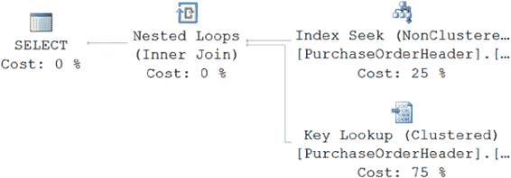
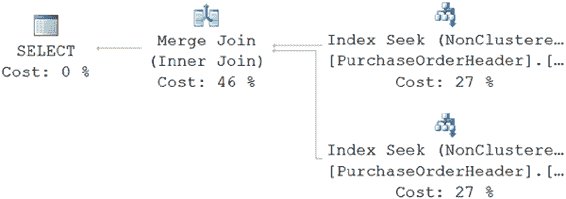

# 最后，查看第二个备用索引的统计数据，通过包含的列，你可以在图 11-14 中看到输出结果。

```sql
CREATE UNIQUE NONCLUSTERED INDEX [AK_Employee_NationalIDNumber]
ON [HumanResources].[Employee]
(NationalIDNumber ASC )
INCLUDE (JobTitle,HireDate)
WITH DROP_EXISTING ;
```

`图 11-14.` 使用 INCLUDE 创建的覆盖索引的 DBCC SHOW_STATISTICS 输出

现在，键宽度恢复到原始大小，因为 `INCLUDE` 语句中的列不是与键一起存储，而是存储在索引的叶级。

从存储的统计数据中还可以挖掘出更多有趣的信息，但我将在第 12 章中介绍。

### 使用索引联接

如果覆盖索引变得非常宽，那么你可以考虑使用索引联接技术。正如第 9 章所解释的，索引联接技术利用两个或多个索引之间的索引交集来完全覆盖一个查询。由于索引联接技术需要访问多个索引，它必须对索引联接中使用的所有索引执行逻辑读取。因此，它比覆盖索引需要更高的逻辑读取次数。但是，由于用于索引联接的多个窄索引可以比宽覆盖索引服务更多的查询（如第 9 章所述），你当然可以考虑将索引联接作为一种避免键查找的技术。

为了更好地理解如何使用索引联接来避免键查找，针对 `PurchaseOrderHeader` 表运行以下查询，以检索特定供应商在特定日期的 `PurchaseOrderID`：

```sql
SELECT poh.PurchaseOrderID,
poh.VendorID,
poh.OrderDate
FROM Purchasing.PurchaseOrderHeader AS poh
WHERE VendorID = 1636
AND poh.OrderDate = '12/5/2007' ;
```

运行时，此查询会导致键查找操作（图 11-15）和以下 I/O：
表 'Employee'。扫描计数 1，逻辑读取 10
CPU 时间 = 15 毫秒，经过时间 = 19 毫秒。

[www.it-ebooks.info](http://www.it-ebooks.info/)





第 11 章 ■ 键查找及其解决方案

`图 11-15.` 键查找操作

之所以发生查找，是因为 `SELECT` 语句和 `WHERE` 子句引用的所有列并未都包含在 `VendorID` 列上的非聚集索引中。使用非聚集索引仍然比不使用它要好，因为不使用它将需要对表进行扫描（在本例中是聚集索引扫描），逻辑读取次数更多。

要避免查找，你可以考虑在 `OrderDate` 列上创建覆盖索引，如前一节所述。但除了覆盖索引解决方案之外，你还可以考虑索引联接。正如你所了解的，索引联接需要的索引比覆盖索引更窄，因此提供以下两个好处。

*   多个窄索引可以比宽覆盖索引服务更多的查询。
*   窄索引比宽覆盖索引需要更少的维护开销。

要使用索引联接避免查找，请在现有非聚集索引中未包含的 `OrderDate` 列上创建一个窄的非聚集索引。

```sql
CREATE NONCLUSTERED INDEX Ix_TEST
ON Purchasing.PurchaseOrderHeader(OrderDate);
```

如果你再次运行 `SELECT` 语句，则会返回以下输出和如图 11-16 所示的执行计划：
表 'PurchaseOrderHeader'。扫描计数 2，逻辑读取 4
CPU 时间 = 0 毫秒，经过时间 = 28 毫秒。

`图 11-16.` 没有查找的执行计划

[www.it-ebooks.info](http://www.it-ebooks.info/)

第 11 章 ■ 键查找及其解决方案

从前面的执行计划中，你可以看到优化器使用了 `VendorID` 列上的非聚集索引 `IX_PurchaseOrder_VendorID` 和 `OrderID` 列上的新非聚集索引 `IxTEST` 来完全满足查询，而无需访问其余数据的存储位置。此索引联接操作避免了键查找，从而将逻辑读取次数从 10 次减少到 4 次。

确实，在 `VendorID` 和 `OrderID` (c1, c2) 列上创建覆盖索引可以进一步减少逻辑读取次数。但使用覆盖索引可能并不总是可行，因为它们可能很宽并且有相关的开销。在这种情况下，索引联接可能是一个很好的替代方案。

## 总结

正如本章所演示的，与非聚集索引相关联的查找步骤会使得通过非聚集索引检索数据成本非常高。SQL Server 优化器在生成执行计划时会考虑到这一点，如果它发现使用非聚集索引的开销成本很高，它会丢弃该索引并执行表扫描（或者如果表存储为聚集索引，则执行聚集索引扫描）。因此，为了提高非聚集索引的有效性，分析查找的原因并考虑是否可以通过向索引键或 `INCLUDE` 列（或索引联接）添加字段来完全避免它，并创建覆盖索引，是很有意义的。

到目前为止，你一直专注于索引技术，并假设 SQL Server 优化器能够确定索引对查询的有效性。在下一章中，你将看到统计信息在帮助优化器确定索引有效性方面的重要性。

[www.it-ebooks.info](http://www.it-ebooks.info/)

