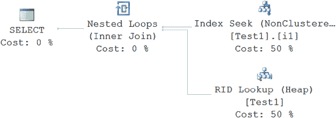
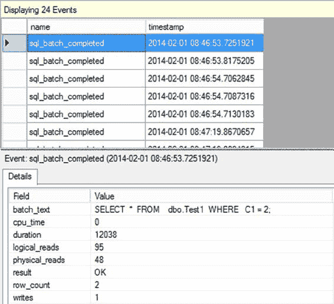

# 统计信息、数据分布与基数

到目前为止，你应该对索引的重要性有了很好的理解。但是，优化器用来决定如何访问数据的不仅仅是索引。优化器必须拥有定义索引或列的数据的相关信息。该信息被称为 *统计信息*。统计信息既定义了数据的分布，也定义了数据的唯一性或选择性。系统会在索引和列上维护统计信息。你甚至可以自己手动定义统计信息。

在本章中，你将了解统计信息在查询优化中的重要性。具体来说，我将涵盖以下主题：

*   统计信息在查询优化中的作用
*   索引列上统计信息的重要性
*   在连接和过滤条件中使用的非索引列上统计信息的重要性
*   单列和多列统计信息的分析，包括用于索引的列选择性的计算
*   统计信息维护
*   有效评估查询执行中使用的统计信息

## 统计信息在查询优化中的作用

SQL Server 的查询优化器是一个基于成本的优化器；它通过识别选择性（数据的唯一程度）以及哪些列用于过滤数据（即通过 `WHERE` 或 `JOIN` 子句）来决定最佳的数据访问机制和连接策略。统计信息与索引一同存在，但也存在于用作谓词的一部分但没有索引的列上。正如你在第 7 章中学到的，非聚集索引是检索被索引覆盖的数据的好方法，而对于需要键列之外列的查询，聚集索引可能效果更好。对于大型结果集，直接访问聚集索引或表通常更有益。


关于作为谓词引用的列中数据分布的最新信息，有助于优化器确定要使用的查询策略。在 SQL Server 中，此类信息以统计信息的形式维护，对于基于成本的优化器制定有效的查询执行计划至关重要。通过统计信息，优化器能够对返回结果集或中间结果集所需的时间做出相当准确的估算，从而确定最有效的操作来高效地检索或修改 T-SQL 语句定义的数据。只要确保设置了数据库的默认统计信息设置，优化器就能够尽其所能动态地确定有效的处理策略。此外，作为故障排除性能时的安全措施，应确保自动统计信息维护例程按预期工作。在必要时，您甚至可能需要手动控制统计信息的创建和/或维护。（我将在“手动维护”部分介绍此内容，并在“分析统计信息”部分介绍统计信息的确切函数性质和形态。）在下一节中，我将向您展示为什么统计信息对于充当谓词的索引列和非索引列都很重要。

[www.it-ebooks.info](http://www.it-ebooks.info/)

## 索引列上的统计信息

索引的可用性在很大程度上取决于索引列的统计信息；没有统计信息，SQL Server 基于成本的查询优化器无法决定使用索引的最有效方式。为了满足此要求，SQL Server 在创建索引时会自动创建索引键的统计信息。无法关闭此功能。

随着数据的变化，为保持查询低成本所需的数据检索机制也可能发生变化。例如，如果某个表对于某个特定列值只有一行匹配，那么通过该列上的非聚集索引来检索匹配行是有意义的。但如果表中的数据发生变化，导致添加了大量具有相同列值的行，那么使用非聚集索引可能就不再有意义。为了使 SQL Server 能够随着数据随时间的变化来决定处理策略的这种变更，拥有最新的统计信息至关重要。

SQL Server 可以在索引列内容被修改时保持索引上的统计信息更新。默认情况下，此功能是开启的，并且可以通过数据库的 **属性** ➤ **选项** ➤ **自动更新统计信息** 设置进行配置。更新统计信息会消耗额外的 CPU 周期和相关的 I/O。为了优化更新过程，SQL Server 使用一种高效的算法来决定何时执行更新统计信息过程，该算法基于修改次数和表的大小等因素。

-   当一个没有行的表获得一行时
-   当一个表少于 500 行且行数增加了 500 或更多时
-   当一个表多于 500 行且行数增加了 500 行 + 行数的 20% 时

这种内置的智能特性使每个进程的 CPU 利用率保持在较低水平。也可以异步更新统计信息。这意味着，当一个查询通常会导致统计信息更新时，该查询会继续使用旧的统计信息执行，而统计信息会在后台异步更新。这可以加快某些查询的响应时间，例如在数据库很大或超时期限较短时。

当您拥有大型数据集时（通常以数百万行或更多来衡量），可以修改统计信息的更新频率。不再是固定的 20% 更新阈值，您可以使用一个滑动比例尺，该比例尺对行数越多的情况使用越小的更改百分比。这确保了在大规模系统上能看到更频繁的统计信息更新。此功能需要使用跟踪标志在较低级别修改数据库。命令如下所示：

```sql
DBCC TRACEON(2371,-1);
```

启用跟踪标志 2371 将把统计信息更新从上述默认方式修改为滑动比例方式。

您可以使用 `ALTER DATABASE` 命令手动禁用（或启用）自动更新统计信息和异步自动更新统计信息功能。默认情况下，自动更新统计信息功能是启用的，强烈建议您保持启用。异步自动更新统计信息功能默认是禁用的。仅当您确定开启此功能有助于解决数据库的超时问题时，才应开启它。

■ `注意` 我将在本章后面的“手动维护”部分解释 `ALTER DATABASE`。

[www.it-ebooks.info](http://www.it-ebooks.info/)



## 最新统计信息的好处

执行自动更新的好处通常大于其对系统资源的成本。如果您有大型表——我指的是单个表就达到数百 GB——您可能会遇到这种情况，即让统计信息自动更新带来的好处较小。在这种情况下，您可能想尝试使用滑动比例尺，或者您可能处于自动统计信息维护效果不佳的情况。但这是一个边缘情况，即使在这里，您也可能会发现自动更新统计信息不会对系统产生负面影响。

为了更直接地控制数据行为，而不是使用 `AdventureWorks2012` 中的表，在这组示例中，您将手动创建一个表。具体来说，创建一个只有三行和一个非聚集索引的测试表。

```sql
IF (SELECT OBJECT_ID('Test1')) IS NOT NULL
    DROP TABLE dbo.Test1;
GO

CREATE TABLE dbo.Test1 (C1 INT, C2 INT IDENTITY);

SELECT TOP 1500
    IDENTITY( INT,1,1 ) AS n
INTO #Nums
FROM Master.dbo.SysColumns sC1,
     Master.dbo.SysColumns sC2;

INSERT INTO dbo.Test1
    (C1)
SELECT n
FROM #Nums;

DROP TABLE #Nums;

CREATE NONCLUSTERED INDEX i1 ON dbo.Test1 (C1) ;
```

如果您在索引列上执行带有选择性筛选条件的 `SELECT` 语句以仅检索一行，如下面的代码行所示，则优化器会使用非聚集索引查找，如执行计划图 12-1. 所示。

```sql
SELECT *
FROM dbo.Test1
WHERE C1 = 2;
```

***图 12-1.** 小结果集的执行计划*

[www.it-ebooks.info](http://www.it-ebooks.info/)



为了理解小型数据修改对统计信息更新的影响，使用扩展事件创建一个会话。在该会话中，添加捕获统计信息更新和创建事件的 `auto_stats` 事件，以及 `sql_batch_completed` 事件。以下是创建扩展事件会话的脚本：

```sql
CREATE EVENT SESSION [Statistics] ON SERVER
ADD EVENT sqlserver.auto_stats(
    ACTION(sqlserver.sql_text)),
ADD EVENT sqlserver.missing_column_statistics(SET collect_column_list=(1)
    ACTION(sqlserver.sql_text)
    WHERE ([sqlserver].[database_name]=N'AdventureWorks2012'))
WITH (MAX_MEMORY=4096 KB,EVENT_RETENTION_MODE=ALLOW_SINGLE_EVENT_LOSS,MAX_DISPATCH_LATENCY=30 SECONDS,MAX_EVENT_SIZE=0 KB,MEMORY_PARTITION_MODE=NONE,TRACK_CAUSALITY=ON,STARTUP_STATE=OFF)
GO
```

仅向表中添加一行。

```sql
INSERT INTO dbo.Test1
    (C1)
VALUES (2);
```

当您重新执行前面的 `SELECT` 语句时，会得到与图 12-1 所示相同的执行计划。

图 12-2 shows 显示了由 `SELECT` 查询生成的事件。


