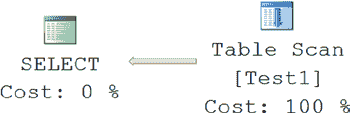
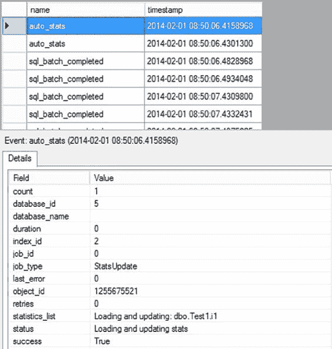
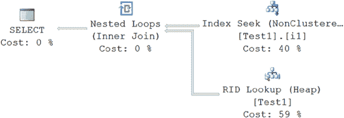
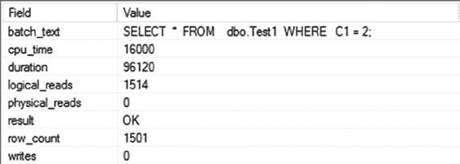

# 第 12 章 ■ 统计信息、数据分布与基数

***图 12-2.** 添加少量行后的会话输出*

[www.it-ebooks.info](http://www.it-ebooks.info/)



会话输出中不包含任何表示统计信息更新的 SQL 活动，因为更改的数量未达到阈值。对于任何超过 500 行的表，必须增加 500 行加上行数的 20%才会触发更新。

要理解大规模数据修改对统计信息更新的影响，向该表中添加 1500 行。

```sql
SELECT TOP 1500
IDENTITY( INT,1,1 ) AS n
INTO #Nums
FROM Master.dbo.SysColumns scl,
Master.dbo.SysColumns sC2;

INSERT INTO dbo.Test1
(C1)
SELECT 2
FROM #Nums;

DROP TABLE #Nums;
```

现在，如果你重新执行`SELECT`语句，如下所示，将检索到一个大型结果集（3001 行中的 1502 行）：

```sql
SELECT *
FROM dbo.Test1
WHERE C1 = 2;
```

由于请求的是大型结果集，直接扫描基表比通过非聚集索引 1502 次查找基表更可取。直接访问基表将避免与非聚集索引相关的书签查找开销。这在最终的执行计划中得以体现（参见图 12-3）。

***图 12-3.** 大型结果集的执行计划*

图 12-4 显示了生成的会话输出。

[www.it-ebooks.info](http://www.it-ebooks.info/)



第 12 章 ■ 统计信息、数据分布与基数

***图 12-4.** 添加大量行后的会话输出*

由于此次大规模更新超出了阈值，会话输出包含了多个`auto_stats`事件。通过查看详细信息，你可以判断每个事件正在做什么。图 12-4 显示了`job_type`值，在本例中为`StatsUpdate`。你还会在`statistics_list`列中看到正在被更新的统计信息列表。另一个值得关注的点是`Status`列，它可以告诉你更多关于统计信息更新过程的哪个部分正在发生，本例中是“正在加载并更新统计信息”。这些 SQL 活动会消耗一些额外的 CPU 周期。然而，通过这样做，优化器能够确定更好的数据处理策略，并保持查询的整体成本较低。统计信息更新完成后，查询随后将使用最新的统计信息运行，最终得出如图 12-3 所示的执行计划。

## 过时统计信息的缺点

如前一节所述，`自动更新统计信息`功能允许优化器随着数据的变化，为查询决定高效的处理策略。然而，如果统计信息过时了，那么优化器决定的处理策略可能就不适用于当前的数据集，从而导致性能下降。

[www.it-ebooks.info](http://www.it-ebooks.info/)





第 12 章 ■ 统计信息、数据分布与基数

要理解拥有过时统计信息的有害影响，请按照以下步骤操作：

1.  仅使用 1500 行数据重新创建前面的测试表及其对应的非聚集索引。
2.  阻止 SQL Server 在数据更改时自动更新统计信息。为此，通过执行以下 SQL 语句来禁用`自动更新统计信息`功能：

    ```sql
    ALTER DATABASE AdventureWorks2012 SET AUTO_UPDATE_STATISTICS OFF;
    ```
3.  像之前一样向表中添加 1500 行。

现在，重新执行`SELECT`语句，以理解过时的统计信息对查询优化器的影响。为清晰起见，重复该查询如下：

```sql
SELECT *
FROM dbo.Test1
WHERE C1 = 2;
```

图 12-5 和图 12-6 分别显示了此查询生成的执行计划和会话输出。

***图 12-5.** 设置`AUTO_UPDATE_STATISTICS OFF`后的执行计划*


