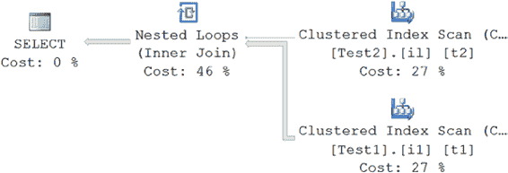
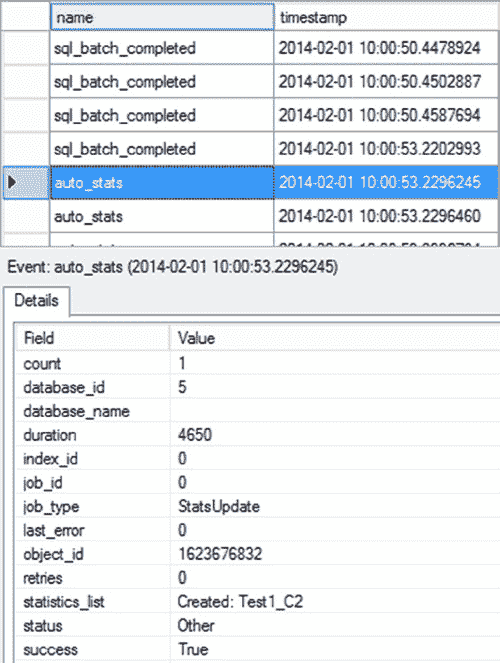
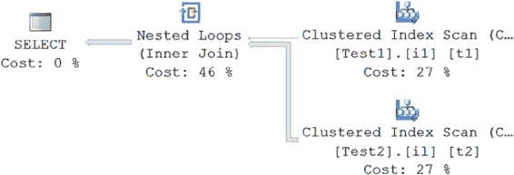
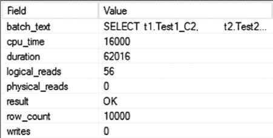
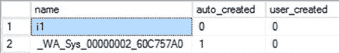

# 第 12 章：统计信息、数据分布与基数

[www.it-ebooks.info](http://www.it-ebooks.info/)

表 `Test2` 包含的正是相反的数据分布。

```sql
IF (SELECT OBJECT_ID('dbo.Test1')) IS NOT NULL
    DROP TABLE dbo.Test1;
GO

CREATE TABLE dbo.Test1
    (Test1_C1 INT IDENTITY,
     Test1_C2 INT
    );

INSERT INTO dbo.Test1
    (Test1_C2)
    VALUES (1);

SELECT TOP 10000
    IDENTITY( INT,1,1 ) AS n
    INTO #Nums
    FROM Master.dbo.SysColumns scl,
         Master.dbo.SysColumns sC2 ;

INSERT INTO dbo.Test1
    (Test1_C2)
    SELECT 2
    FROM #Nums
GO

CREATE CLUSTERED INDEX i1 ON dbo.Test1(Test1_C1)

--Create second table with 10001 rows, -- but opposite data distribution
IF(SELECT OBJECT_ID('dbo.Test2')) IS NOT NULL
    DROP TABLE dbo.Test2;
GO

CREATE TABLE dbo.Test2
    (Test2_C1 INT IDENTITY,
     Test2_C2 INT
    );

INSERT INTO dbo.Test2
    (Test2_C2)
    VALUES (2);

INSERT INTO dbo.Test2
    (Test2_C2)
    SELECT 1
    FROM #Nums;

DROP TABLE #Nums;
GO

CREATE CLUSTERED INDEX il ON dbo.Test2(Test2_C1);
```

[www.it-ebooks.info](http://www.it-ebooks.info/)



表 12-2 展示了这些表的大致结构。

`表 12-2. 示例表`

| `表 Test1` |         | `表 Test2` |         |
| :--------- | :------ | :--------- | :------ |
| **列**     |         | **列**     |         |
| `Test1_c1` | `Test1_C2` | `Test2_c1` | `Test2_C2` |
| Row1       | N       | Row1       | N       |
| Row2       | N       | Row2       | N       |
| ...        | ...     | ...        | ...     |
| RowN       | N       | Row10001   | N       |

要理解统计信息对非索引列的重要性，请使用自动创建统计信息功能的默认设置。默认情况下，此功能是开启的。您可以使用 `DATABASEPROPERTYEX` 函数进行验证（尽管也可以查询 `sys.databases` 视图）。

```sql
SELECT DATABASEPROPERTYEX('AdventureWorks2012', 'IsAutoCreateStatistics');
```

> **注意：** 本章后面会详细介绍如何配置自动创建统计信息功能。

使用以下 `SELECT` 语句从表 `Test1` 访问一个大结果集，从表 `Test2` 访问一个小结果集。表 `Test1` 有 10,000 行的 `Test1_C2 = 2`，而表 `Test2` 只有 1 行的 `Test2_C2 = 2`。

请注意，用于连接 (`JOIN`) 和筛选 (`WHERE`) 条件的这些列在任一表上都没有索引。

```sql
SELECT Test1.Test1_C2,
       Test2.Test2_C2
FROM dbo.Test1
JOIN dbo.Test2
    ON Test1.Test1_C2 = Test2.Test2_C2
WHERE Test1.Test1_C2 = 2 ;
```

图 12-7 显示了此查询的执行计划。

`图 12-7. AUTO_CREATE_STATISTICS 开启时的执行计划`

[www.it-ebooks.info](http://www.it-ebooks.info/)



图 12-8 显示了此查询的所有已完成事件和 `auto_stats` 事件的会话输出。您可以使用此输出来评估给定查询的一些额外开销。

`图 12-8. AUTO_CREATE_STATISTICS 开启时的扩展事件会话输出`

图 12-8 所示的会话输出包含两个 `auto_stats` 事件，分别在 `JOIN` 和 `WHERE` 子句中引用的非索引列 `Test2_C2` 和 `Test1_C2` 上创建了统计信息。此活动消耗了少量额外的 CPU 周期（因为未检测到任何统计信息），并耗时约 10,000 微秒，即 10 毫秒。然而，通过消耗这些额外的 CPU 周期，优化器决定了一个更好的处理策略，以保持查询的总体成本较低。

要验证 SQL Server 在每个表的非索引列上自动创建的统计信息，请对 `sys.stats` 表运行以下 `SELECT` 语句：

```sql
SELECT s.name,
       s.auto_created,
       s.user_created
FROM sys.stats AS s
WHERE object_id = OBJECT_ID('Test1');
```

图 12-9 显示了为表 `Test1` 创建的自动统计信息。

[www.it-ebooks.info](http://www.it-ebooks.info/)





`图 12-9. 表 Test1 的自动统计信息`


